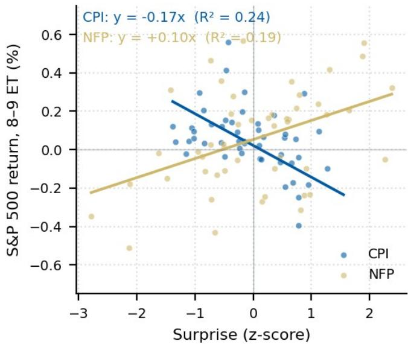
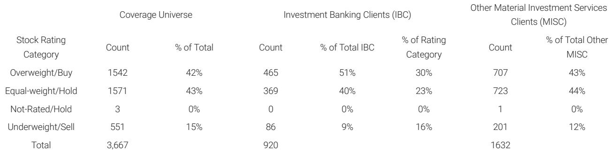

# 摩根斯坦利：市场真正低估的不是AI泡沫，而是供给侧的定价权转移

这份研报的标题叫“Charts That Caught My Eye”，出自摩根斯坦利全球研究总监Katy Huberty之手。它看起来像是一封内部备忘录——用七张图表串联起当前最值得关注的宏观与主题信号。但读完之后你会发现，这根本不是一份轻松的“看图说话”。它试图回答一个更根本的问题：当市场还在争论AI是不是泡沫、关税有没有效果、中国经济何时见底时，哪些结构性力量已经在静悄悄地改变资产定价的底层逻辑？

我们的判断是：这份报告隐含的主线，并非AI主题的短期涨跌，而是全球资本正在经历一次“供给侧定价权”的再分配。从AI基础设施的“逢低买入”策略回测，到欧洲行业模型的重新排序，再到美国回流数据的“名实不符”，再到中国K型经济的固化——每一张图表都在指向同一个方向：那些掌握稀缺供给能力的企业和资产，正在获得前所未有的议价权。而市场对这一变化的定价，仍然不够充分。

以下是我们从这份报告中提炼出的五个层次洞察。

## 1. AI主题的“逢低买入”策略并非情绪交易，而是对供给稀缺性的结构性套利

报告中最引人注目的实证，是摩根斯坦利对AI基础设施和电力AI两个子主题开发的“逢低买入”策略回测。其规则很清晰：当主题组合下跌5%时加仓至150%，下跌15%时加仓至200%，加仓持仓三个月后恢复基准。回测结果显示，这一策略自2023年以来在两个子主题上都产生了显著的超额收益。

这意味着什么？不是“AI跌了就该买”这么简单。它的深层含义是：AI基础设施的供给端存在结构性瓶颈，每一次市场情绪导致的回调，都会被后续的供需基本面修正所“救赎”。换句话说，这个主题的波动更多来自需求侧的预期摇摆，而非供给侧的实际松动。当市场因为某个短期担忧抛售时，真正稀缺的算力、电力、冷却资源并不会因此增加供给。因此，逢低买入本质上是在对“供给刚性”进行套利。

这对投资者的启发是：在AI主题中，真正值得关注的不是那些需求故事讲得最动听的标的，而是那些在供给端拥有不可复制优势的企业——无论是芯片制造能力、电力接入权，还是数据中心的地理位置稀缺性。这些才是“逢低买入”策略能够持续有效的底层支撑。

## 2. 通胀阈值3%是资产定价的“分水岭”，市场对宏观数据的解读正在发生非线性跳跃

报告对美国经济数据的分析揭示了一个被广泛忽视的非线性特征：当CPI高于3%时，通胀超预期对利率市场的影响显著放大；而当CPI在2%-3%之间时，只有股市对数据有显著反应；一旦CPI低于2%，无论利率还是股市都不再对数据惊喜做出可靠反应。

这个发现的重要性在于，它否定了“数据越强，资产越涨”的线性思维。当前美国CPI正处于3%附近的敏感区间。如果通胀数据持续高于这个阈值，市场将进入一个“坏数据才是好消息”的反直觉状态——因为只有经济放缓才能让通胀回落，从而为利率下行打开空间。反之，如果通胀意外回落至3%以下，市场焦点会迅速从通胀切换至增长，届时就业数据的强弱将重新主导资产定价。

这意味着，未来几个月的CPI读数，不仅是通胀本身的问题，更是资产定价框架的切换开关。投资者需要为两种截然不同的市场环境做好准备，而不是简单地押注“通胀回落利好所有资产”。

## 3. 欧洲行业模型的重排揭示了一个关键信号：AI的资本支出正从“概念”变为“现金流”

报告对欧洲行业模型的更新值得仔细推敲。半导体仍居榜首，但金属与矿业跃升至第二，资本品被上调至超配，银行升至第三——这些变化看似分散，实则围绕同一个核心：AI资本支出的传导链条正在从上游的芯片设计，向下游的电力、冷却、工业设备和融资需求延伸。

半导体排名第一并不意外。真正值得关注的是金属与矿业的跃升。这意味着，AI基础设施的建设已经进入了需要大量实物资源的阶段——铜、铝、稀土等关键矿产的需求正在从预期变为现实。同样，资本品被上调超配，反映的是数据中心建设、电网升级、冷却系统等实物投资的加速。而银行升至第三，则暗示这些大规模资本支出需要配套的融资服务。

这些信号叠加在一起，告诉我们一个事实：AI主题正在从“买故事”阶段进入“买实物”阶段。那些能够提供AI基础设施所需实物资源的企业，其盈利可见性正在快速提升。而市场对这一变化的定价，可能仍然停留在“主题投资”的层面，未能充分反映这些行业基本面的实质性改善。

## 4. 美国“回流”的真相：不是制造业复兴，而是AI驱动的供应链重组

报告对美国“回流”数据的解读是一记清醒剂。虽然2025年名义产出数据看起来不错，但报告明确指出，这主要是价格驱动的。进口渗透率在2025年不降反升，表明美国对进口的依赖并未减弱。真正发生的，是供应链的“重新定向”——从中国转向东南亚、墨西哥等地，而非大规模回流美国本土。

更关键的是，报告指出目前看到的有限投资是“窄而长期”的，主要集中于AI产能建设。这意味着，当前的制造业投资并非传统意义上的“再工业化”，而是AI基础设施建设的副产品。如果政策环境（尤其是USMCA的延续性）发生变化，这一轮投资能否从AI生态扩展到更广泛的制造业，仍然存在很大不确定性。

这个判断对资产定价的含义是：不要将当前制造业投资的增长简单解读为“美国制造业复兴”的开始。它更像是一次由AI驱动的、高度选择性的资本支出周期。那些与AI基础设施建设无关的传统制造业，可能并未从中受益。投资者需要区分“AI带动的结构性需求”和“关税引发的短期库存调整”，前者可持续，后者则可能随着政策变化而逆转。

## 5. 中国K型经济的固化：出口依赖正在成为新的脆弱性，而非韧性来源

报告对中国经济的分析延续了“两速经济”的框架，但提供了一个新的警示：净出口对GDP增长的贡献预计将从2024-2027年平均达到30%以上，远高于2014-2023年的5.3%均值。这意味着，中国经济增长对外部需求的依赖正在急剧上升。

这看似是韧性——出口强劲支撑了整体增长。但报告点出了其中的脆弱性：这种高度依赖外部需求的增长模式，会放大中国对全球周期和贸易摩擦的暴露。如果全球需求放缓，或者贸易壁垒进一步升级，中国经济的缓冲空间将比过去更小。

报告提出的“真正解药”是改革，让增长重新向消费倾斜。但这是一个长期命题。短期来看，投资者需要接受一个现实：中国经济的“新动能”和“旧动能”之间的分化可能不会很快弥合。出口导向的新兴制造业将继续表现强劲，而依赖国内消费的行业可能持续承压。这种K型分化，不是周期性的，而是结构性的。

## 报告尚未完全回答的关键问题：AI资本支出的可持续性如何验证？

尽管报告提供了大量有价值的信号，但它并未完全回答一个关键问题：当前AI资本支出的高速增长，其可持续性如何？目前，市场的主流叙事是“AI投资才刚刚开始”。但报告中的欧洲行业模型更新和美国回流分析，都暗示AI投资正在从“预期”转向“实物”，这意味着资本支出的可见性在提高，但也意味着边际回报率可能开始面临考验。

如果AI资本支出的回报率开始下降，或者部分企业的AI投资计划出现延迟，那么当前的“逢低买入”策略、欧洲行业模型中的矿业和资本品排名、以及美国回流中的AI投资叙事，都可能需要重新评估。这个问题的答案，可能需要等到下一轮财报季，观察AI相关企业的资本支出指引和实际回报数据。

## 顺着这些未解问题继续讨论

以上是我们从这份摩根斯坦利研报中提炼出的核心判断和未解问题。报告还包含了更多细节——比如美国就业市场的盈亏平衡点估算、企业现金税率下行的趋势、以及半导体周期仍在加速的具体证据——这些内容由于篇幅限制未能在此展开。

如果你对以下问题感兴趣：AI资本支出的回报率如何验证？美国通胀数据在3%阈值附近时，具体哪些资产类别会受益或受损？中国K型经济中，哪些细分行业可能率先出现拐点？欢迎来我们的知识星球和微信群里继续讨论。在那里，我们会分享完整的研报原文、更详细的图表解析，以及对这些未解问题的持续跟踪。

Personal reading notes and learning share only. Not investment advice.

