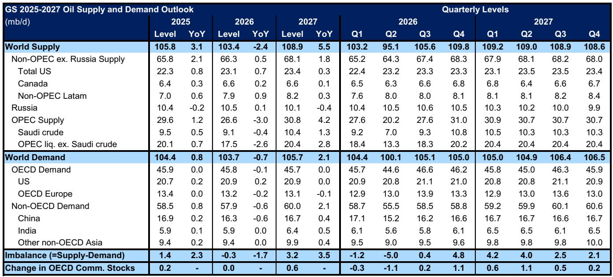
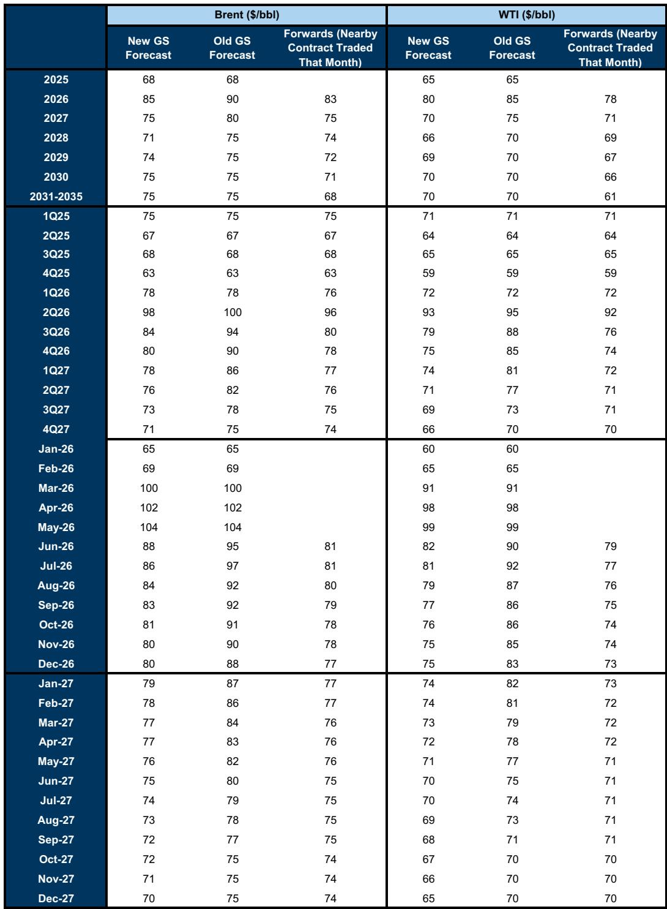
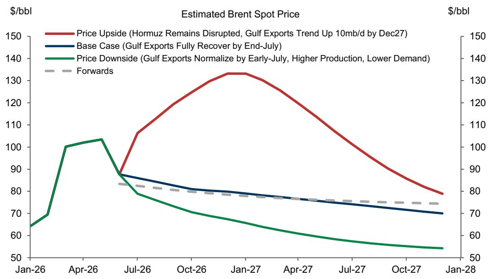

# GS：市场低估的不是供需平衡，而是安全溢价的结构性重置

当特朗普宣布达成临时协议、霍尔木兹海峡即将重新开放的消息传出，多数市场参与者的第一反应是油价将大幅回落。这份直觉没有错，但可能过于简单。GS在最新发布的研报中做出了一个看似矛盾、实则深刻的判断：即便在供应提前恢复正常的情景下，油价底部比大多数人想象的更坚实。

GS将2026年第四季度布伦特原油预测从90美元下调至80美元，2027年均价从80美元下调至75美元。表面看这是看空调整，但隐含的结论是：即便全球石油市场在2027年面临每天320万桶的过剩，油价仍将维持在每桶75美元左右。这个数字恰好是GS的长期公允价值。

这组预测的真正张力在于：一个被历史性供应冲击打乱的市场，在冲击解除后，并不会回到冲击前的定价逻辑。因为市场已经经历了一次“结构性的安全溢价重定价”。

## 1. 供应恢复的时间差被压缩，但价格弹性的不对称性更值得关注

GS将波斯湾出口恢复至战前水平的时间节点从8月底提前到7月底，这个一个月的提前意味着2026年第四季度和2027年油价公允价值分别下调约10美元和5美元。这个调整的幅度本身并不令人意外，但需要追问的是：为什么下调幅度不是对称的？

答案藏在供需弹性的不对称中。当供应冲击发生时，价格上行的幅度远超基本面隐含的均衡水平——这是稀缺溢价。但当冲击解除时，价格下行却受到多重因素的托底，不会跌回冲击前的水平。GS称之为“安全溢价”。

这种不对称在2027年的预测中表现得尤为明显。尽管GS预计2027年全球石油市场将出现每天320万桶的过剩，但布伦特原油价格预测仍维持在75美元，与长期公允价值一致。这意味着，即便在供过于求的背景下，市场仍愿意为地缘政治风险支付一个结构性溢价。

这个判断对资产定价的含义是：传统基于库存和供需平衡的油价预测模型需要重新校准。安全溢价不再是零均值波动的短期变量，而可能成为中长期定价的一个固定组成部分。

## 2. 2027年的过剩为何不会压垮油价：库存结构与战略储备的范式转变

每天320万桶的过剩，放在任何历史时期都足以让油价大幅承压。但GS认为这个过剩不会产生预期的价格压力，理由有两个。

第一个理由是库存结构。OECD商业石油库存在2026年上半年经历了大规模消耗，这意味着即便2027年出现过剩，库存水平也很难回升到高位。GS特别指出，全球战略储备的结构性增长趋势达到每天超过100万桶——这个数字本身就是一个重要的结构性变化。各国在经历2026年的供应冲击后，对战略石油储备的重视程度显著提升，这种“补库存”行为吸收了大量的过剩供应。

第二个理由更值得政策制定者和企业决策者关注：安全溢价的存在意味着市场对供应中断风险给出了一个持续的定价。这个溢价不会因为霍尔木兹海峡重新开放就立即消失，因为市场需要时间来验证“重新开放”是否可持续。

但GS也给出了一个重要的约束条件：这个安全溢价的上限可能有限。原因在于，市场刚刚经历了一次史无前例的每天1400万桶的石油产量冲击，而实际供需缺口只有每天500万桶。这意味着全球市场（尤其是中国需求）展现出了惊人的弹性。这种弹性既证明了市场调节能力，也意味着一旦中东出口恢复正常，安全溢价可能迅速收窄。

对于投资者而言，关键问题不是2027年的过剩有多大，而是这些过剩会被谁吸收、以什么价格吸收。战略储备的补库需求为油价提供了一个隐性底部。

## 3. 伊朗变量：从供应破坏者到潜在的超预期供给源

GS研报中一个容易被忽略但可能带来重大影响的变量是伊朗。报告指出，伊朗产量可能因制裁放松而升至战前水平以上。这个判断如果成立，将改变整个中东供应恢复的节奏和幅度。

伊朗在2026年的供应冲击中是一个“受害者”——其出口受到霍尔木兹海峡关闭的直接影响。但如果海峡重新开放，且伴随制裁的实质性放松，伊朗可能成为供应恢复中最具弹性的力量。GS没有给出具体数字，但暗示伊朗产量的上行空间可能超出市场预期。

这里需要特别注意的是，伊朗变量与霍尔木兹海峡重新开放的协议性质高度相关。如果协议仅涉及海峡通行权，而不涉及核谈判的实质性进展，那么伊朗供应的恢复可能较为有限。但如果核谈判取得突破，伊朗可能成为2027年全球供应端最大的意外变量。

对于原油市场的交易者而言，伊朗供应恢复的速度和规模，可能是决定2027年油价是否跌破70美元的关键分水岭。

## 4. 价格风险的不对称性：上行空间远大于下行空间

GS给出了两个极端情景。在上行情景中，假设霍尔木兹海峡持续关闭到2027年底，布伦特原油可能在2026年底升至130美元以上，2027年均价达到105美元。在下行情景中，假设出口在7月初就恢复正常，叠加需求损失和更强的供应，布伦特原油2026年第四季度均价可能略低于70美元，2027年均价略低于60美元。

这两个情景的对比揭示了一个重要的不对称性：上行空间（从75美元到105美元，涨幅40%）远大于下行空间（从75美元到60美元，跌幅20%）。GS明确表示，尽管风险是双向的，但净方向偏向上行。

这个不对称性背后有一个逻辑支撑：供应恢复是一个可逆性存疑的过程。即便协议签署，实际执行可能面临排雷、船东风险规避、以及伊朗可能再次关闭海峡等不确定性。而需求方面，GS预计2026年下半年到2027年将出现较为强劲的复苏，原因是油价回落后可负担性改善。

对于产业决策者而言，这个不对称性意味着：在制定2027年的采购或对冲策略时，应该给予上行风险更高的权重，而不是简单地按照基准预测来配置。

## 5. 报告尚未完全回答的关键问题：安全溢价的可持续性取决于什么？

GS的预测框架有一个核心假设尚未被充分验证：安全溢价在供应恢复正常后会以多快的速度衰减。报告提到了两个方向的驱动因素，但没有给出量化的衰减路径。

一方面，市场刚刚经历的每天1400万桶的冲击被每天500万桶的缺口所消化，这种弹性本身就说明市场对供应中断的定价可能过高。如果中东出口恢复顺利，安全溢价可能快速消失。

另一方面，如果市场参与者认为这次冲击并非一次性事件，而是地缘政治风险上升的新常态，那么安全溢价可能持续存在，甚至成为油价的一个结构性组成部分。

这个问题之所以关键，是因为它决定了2027年以后油价的长期锚点。如果安全溢价消失，长期油价可能回落到每桶60-65美元区间；如果安全溢价持续，长期油价可能维持在75美元甚至更高。

GS在研报中没有给出明确的答案，而是通过“双向风险但净偏向上”的表述，留下了这个问题的开放性。对于深度阅读者而言，这个开放性问题恰恰是理解未来油价走势的核心。

## 6. 投资者的观察框架：三个需要持续跟踪的指标

基于GS的分析框架，投资者可以建立三个核心观察指标来跟踪判断的演进。

第一个指标是霍尔木兹海峡的实际流量恢复速度。GS估计目前海峡流量已从战前每天2000万桶降至约1100万桶，如果恢复到70%的水平，意味着需要增加约1200万桶的流量。这个恢复速度的快慢，直接决定了GS7月底恢复正常假设的可靠性。

第二个指标是OECD商业库存的变化路径。GS预测2026年上半年将出现大规模库存消耗，这个判断如果被验证，将为2027年的油价提供支撑。但如果库存消耗低于预期，意味着市场对供应冲击的消化能力更强，安全溢价可能更快收窄。

第三个指标是伊朗产量和浮式储油的变化。GS指出，浮式储油仍高达近1.2亿桶，这部分库存的释放将对现货市场形成压力。伊朗产量的恢复速度和浮式储油的释放节奏，是判断供应端是否超预期的关键变量。

这三个指标相互关联，但各有侧重。流量指标反映的是供应恢复的节奏，库存指标反映的是市场缓冲能力的消耗，伊朗指标反映的是潜在的供应增量。投资者可以根据这三个指标的实时变化，动态调整对油价路径的判断。

---

GS的这份研报最大的价值不在于给出了一个精确的油价预测数字，而在于构建了一个理解后冲击时代油价定价逻辑的框架。安全溢价是否成为油价的结构性组成部分，这个问题的答案将在未来12到18个月内逐步揭晓。而在这个过程中，市场的每一次价格波动，都是对这个问题的一次投票。

关于GS研报中提到的“中国需求弹性”和“非中东供应升级”这两个关键变量，由于篇幅所限，我们无法在本文中展开。这两个变量对于理解2027年供需平衡的韧性至关重要。欢迎来星球微信群里继续讨论，我们会在群内分享GS研报的完整图表和更详细的数据解读。

Personal reading notes and learning share only. Not investment advice.

