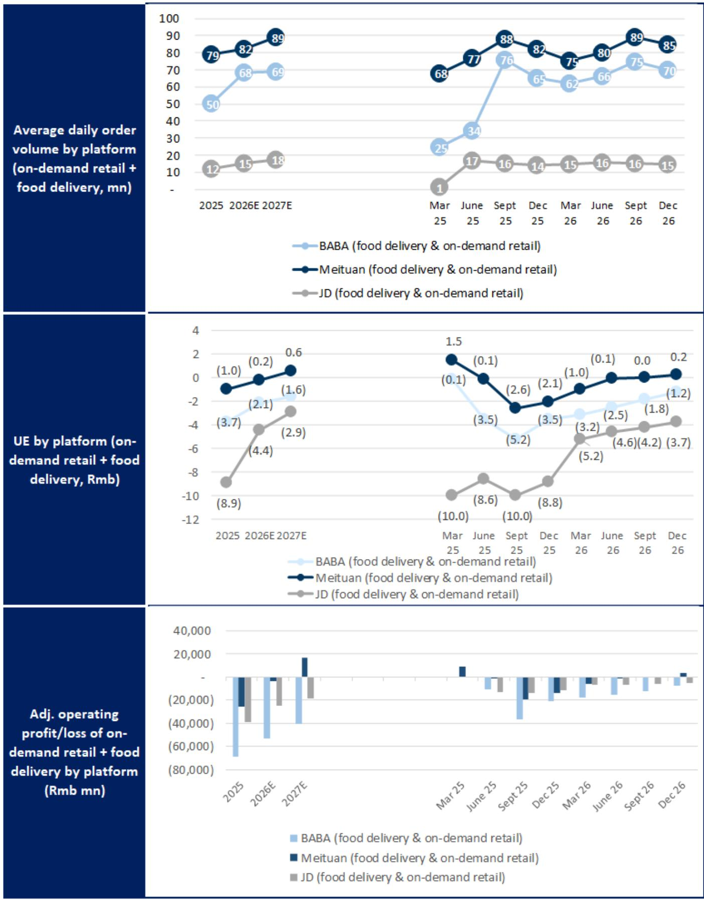
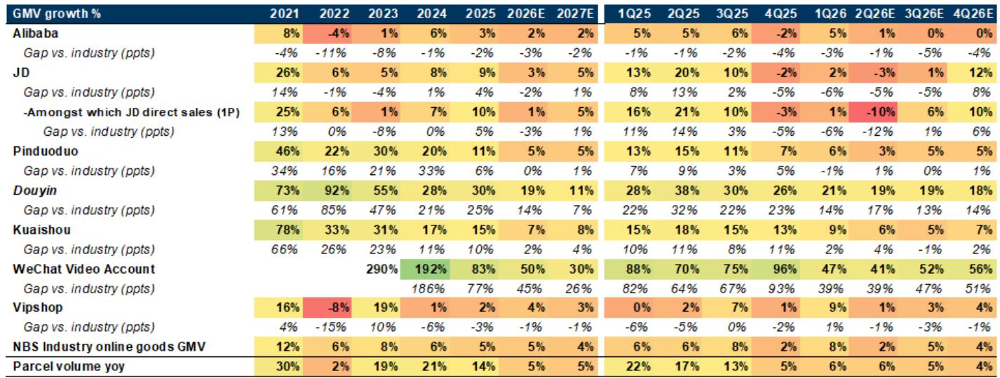
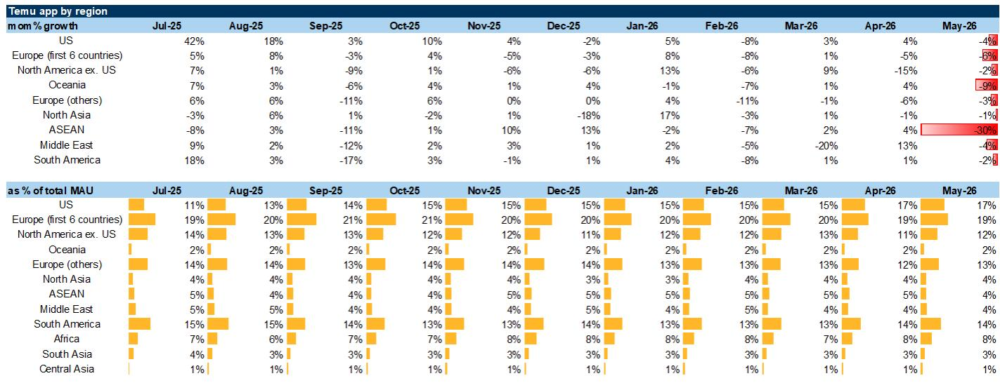

# GS：市场低估的不是电商增速放缓，而是云计算在AI需求下的重新定价

中国互联网板块正在经历一次罕见的估值分化。一方面，电商GMV增速在5月仅录得3%的同比增长，低于市场预期，零售数据疲软直接压低了以阿里、京东为代表的电商平台股价。另一方面，云计算与AI基础设施的投资叙事却持续升温，GS在最新报告中明确将“云与数据中心”列为其最看好的子板块。这种分化背后隐藏着一个更深层的判断：市场对互联网公司的定价逻辑，正在从“电商交易规模”转向“AI计算能力的供给与议价权”。真正被低估的，不是电商需求何时复苏，而是云计算在AI需求爆发中获得的重新定价空间。

这份GS于2026年6月发布的《Navigating China Internet: Ecommerce Tracker》报告，看似是一份常规的电商追踪月报，实则是对阿里近期股价疲软的全面回应，并在此基础上重构了整个中国互联网的投资排序。报告的核心信号是：电商的短期压力是真实的，但云计算的结构性机会正在被低估，而阿里恰好是这两个叙事交汇点上的关键标的。

## 1. 五月零售数据的“坏消息”已被市场消化，电商竞争格局正在从价格战转向运营效率

五月全国线上零售商品GMV同比增长3%，相较于四月的零增长有所改善，但整体零售数据低于彭博一致预期。珠宝、家电、体育用品等品类分别录得-8.9%、-15.6%和-8%的同比下滑，显示出消费端的谨慎情绪并未消散。家电品类的进一步下滑尤其值得关注，GS指出这与去年“以旧换新”政策带来的高基数有关，手机品类自2025年1月被纳入换新补贴后，基数效应仍在拖累同比增速。

对于市场最关心的阿里CMR（客户管理收入）问题，GS的判断是：市场已经预期了二季度CMR的低个位数同比下滑，而包裹量的健康增长可能会缩小GMV与CMR之间的缺口。这意味着，商户返利政策虽然短期压制了CMR，但只要GMV目标达成，返利规模自然会收缩。更关键的是，行业竞争正在从“烧钱抢份额”转向“更理性的运营”。618大促期间，平台开始简化促销机制、延长统计窗口，监管层也在收紧不正当竞争和虚假促销的规则。这种转变的直接含义是：电商平台的利润底部正在形成，而不是继续恶化。

对于投资者而言，电商板块的真正拐点不在于GMV增速何时反弹，而在于市场何时开始用“利润稳定性和竞争格局改善”来重新定价这些平台。GS将京东列为2H26的关键标的，核心逻辑正是“二季度将是最后一个困难的同比比较季度，之后将迎来收入和利润的同比复苏”。

## 2. 阿里股价疲软背后是五重担忧，但GS认为其中三个是“伪命题”

阿里近期股价从年初至今下跌约28%，EPS下调和估值收缩各贡献了一半跌幅。GS将市场的主要担忧归纳为五个方面：电商CMR疲软、AI云计算面临运营商竞争、AI模型层竞争加剧、AI资本开支资金来源、以及SOTP折价扩大。但报告的核心立场是，这五个担忧中有三个被市场过度放大。

关于AI云计算与运营商的竞争，GS的回应最为有力。市场担心政府计划在未来五年投入2万亿元建设数据中心，且主要由电信运营商运营，将挤压互联网云厂商的空间。但GS指出，仅中国互联网四大云厂商（百度、阿里、腾讯、字节）未来两年的资本开支就将达到1.5万亿元。在AI Token需求爆发式增长、算力供给短期偏紧的背景下，互联网云厂商在资本开支规模、AI模型能力、以及MaaS（模型即服务）和自研芯片上的先发优势，将使其在中国AI云市场中获得比传统的CPU/IaaS云市场更有利的定价能力和利润结构。这份报告没有完全展开的是，运营商与互联网云厂商在AI云市场可能不是零和博弈，而是各自占据不同的客户层级和应用场景。

关于AI模型层的竞争，GS承认定价竞争比预期更激烈，但指出顶级模型的定价权仍然在维持——GLM和Qwen3.7 Max就是例证。阿里云作为拥有领先MaaS规模和自研Qwen模型的平台，反而可能成为AI Token计算需求爆发的最大受益者之一。

至于资本开支的资金来源，市场担心阿里未来三年6000亿元的资本开支远超其FY27E的92亿元EBITA。GS则强调，阿里账上2600亿元的净现金加上持续改善的经营现金流，足以支撑未来两年的AI投资。这里有一个值得注意的隐含判断：阿里正在通过改善集团整体盈利能力来为AI投资“造血”，而市场可能低估了其非核心业务亏损收窄的速度。

## 3. 即时零售的亏损改善可能是被忽视的利润变量，美团和阿里都在受益

报告中最具洞察力的部分之一，是对即时零售和外卖行业竞争格局的分析。GS的数据显示，阿里（饿了么+即时零售）、美团和京东三大平台的日均订单量和单位经济（UE）正在发生微妙变化。阿里的日均订单量从2025年3月的2500万单增长到2026年6月的6600万单，美团的订单量则从6800万增长到8000万单，京东维持在1500-1700万单的水平。

更关键的是UE的变化。GS判断，随着反垄断调查的推进以及阿里进一步转向AI/云战略，前三大外卖平台在即时零售领域的市场份额趋于稳定，补贴行为变得更加理性。这带来的直接结果是，美团的食品配送业务（不含平台层面成本）在2Q26和FY26E的EBIT可能分别达到盈亏平衡和亏损17亿元，相较于此前的大幅亏损是一个明显的改善。

对于投资者来说，这个细分领域的含义是双重的。一方面，即时零售的UE改善将为美团和阿里贡献可观的利润增量，这部分在当前的估值中可能没有被充分反映。另一方面，京东在即时零售上的投入规模相对有限，这意味着其利润修复的节奏可能比市场预期的更快。GS将京东列为电商与出行子板块的首选，这个判断的背后逻辑是“竞争缓和+利润修复”，而非单纯的GMV增长。

## 4. 报告没有完全回答的关键问题：AI资本开支的回报周期和用户端变现路径

尽管GS对AI云计算的前景给出了乐观判断，但报告在几个关键问题上留下了开放的讨论空间。第一个是AI资本开支的回报周期。GS预测阿里未来三年的资本开支高达6000亿元，而阿里云目前的收入和利润贡献能否在2-3年内支撑这一投资规模？报告提到了云业务收入加速和利润率上行，但没有给出具体的回报时间表。这里需要投资者自行判断：AI云计算的利润释放是线性的还是指数级的？如果回报周期超出预期，阿里的整体估值框架是否需要重新调整？

第二个问题是AI模型的用户端变现路径。报告提到了微信助手在2H26的试点上线，以及阿里Token Foundry的推出，但并没有详细拆解这些产品如何转化为可量化的收入和利润。AI模型的商业化在中国仍然处于早期阶段，MaaS的ARR增长能否支撑云业务的估值溢价，还需要更多的数据验证。

第三个问题涉及竞争格局的长期演变。GS提到了DeepSeek V4的大幅降价以及小米、MiniMax的跟进，这表明AI模型层的价格战可能比预期更持久。如果模型层利润被持续压缩，阿里云作为计算层的价值是否会受到影响？或者，计算层与模型层的利润分配将如何演变？这些问题的答案将直接决定阿里当前估值的合理性。

## 5. 投资者需要建立的新观察框架：从“电商GMV增速”转向“云业务收入增速与利润率趋势”

基于这份报告的逻辑，投资者对中国互联网公司的观察框架需要做出调整。传统的关注点——GMV增速、用户增长、补贴力度——正在让位于一组新的指标。

第一个指标是云业务的收入增速和利润率趋势。GS明确将云与数据中心列为最看好的子板块，核心催化剂是AI Token需求从代理型AI（agentic AI）场景中爆发，以及云定价的上行空间。投资者应该关注的不再只是云业务的整体收入，而是MaaS的ARR增速、自研芯片的部署比例、以及非互联网行业的云客户渗透率。这些指标比单纯的GMV更能反映一家互联网公司的长期价值。

第二个指标是资本开支的效率。在AI投资竞赛中，谁能以更低的单位成本获取更多的计算资源，谁就能在未来的定价战中占据优势。GS提到的“自研芯片”和“MaaS规模”正是效率的关键变量。投资者需要关注各家公司的资本开支与计算资源产出之间的比例关系，而不仅仅是资本开支的绝对金额。

第三个指标是“非核心业务亏损收窄的速度”。对于阿里而言，新零售、本地生活等“其他”业务的亏损收窄，不仅直接贡献利润，还释放了更多的现金流用于AI投资。GS将“EPS修正逐步企稳”列为阿里的一个中性偏正面因素，正是基于这个逻辑。

这些指标共同指向一个更本质的问题：中国互联网公司正在从“流量变现”模式转向“计算能力变现”模式。谁能在这场转型中完成资产结构的重塑，谁就能在新的估值框架下获得溢价。

这份GS报告的价值，不仅在于它对电商和云计算的短期判断，更在于它提供了一个重新审视中国互联网产业底层逻辑的视角。电商的增速放缓是真实的，但竞争格局的改善和利润底部的形成同样真实。云计算的竞争是激烈的，但AI需求的爆发和定价能力的提升正在重塑这个行业的利润结构。对于阿里而言，市场对其短期CMR疲软的担忧已经充分反映在股价中，而云业务的结构性机会可能才刚刚开始被定价。

报告中还有一些细分领域的判断——Temu的东南亚挑战、快递行业的竞争格局、以及游戏与娱乐板块的估值机会——同样值得深入探讨。但限于篇幅，这些内容无法在这里一一展开。如果你对Temu在东南亚的监管风险、快递龙头的利润分化逻辑、或者腾讯和网易在游戏新管线上的布局感兴趣，欢迎来星球微信群里继续讨论。我们将基于这份报告和后续的数据更新，持续跟踪这些关键变量的演变。

Personal reading notes and learning share only. Not investment advice.

