# China Spirits Tracker: Dragon Boat Festival around the corner: Weak outlook despite a low base; Muted wholesale price trend

Indicative Dragon Boat Festival demand - weaker distributor expectations: We see a relatively weak outlook for this year's Dragon Boat Festival sell-through (based on some early distributor feedback which indicate expectations of 10\~20% retail growth for Moutai/Wuliangye, moving down vs. prior expectations for 20\~30%), despite the low base in 2025 due to policy impacts (which saw a DD% decline for premium spirits, and high DD% decline for upper mid end). In terms of distributor stocking pace/demand for the Dragon Boat Festival, our channel checks show relatively muted pre-season channel actions by brands, indicating still cautious distributor sentiment/outlook for retail demand in the upcoming festival. We note that the Dragon Boat Festival typically has a small seasonal impact on China's spirits consumption, while Mid Autumn Festival/National Holiday tends to be more important for observing an inflection point.

Feitian wholesale price has been largely stable (at c.Rmb1,635\~Rmb1,670 per bottle) with low channel inventory (<1 month in East China per channel checks). Wholesale prices for non-standard SKUs remained soft (esp. Zodiac and 1-L Moutai) probably due to increasing volume on i-Moutai (Moutai's AGM highlighted c.7.13mn transactions in 5M26 vs. 3.98mn in 1Q26, and MAU reached 9.56mn in 5M26).

Common Wuliangye and Guojiao 1573 wholesale prices were still soft at Rmb840 each per Daily Spirits Prices (while Common Wuliangye's wholesale price declined to Rmb760/bottle per Bairong Wholesale Market, which has been impacted by the 618 event subsidy pressure, despite a suspension in shipments).

Feitian Moutai wholesale price largely stable despite a slight fall in original case, Common Wuliangye and Guojiao 1573 stayed largely flattish. In the past 2 weeks, original case Feitian Moutai's wholesale price/bottle decreased by Rmb5 from Rmb1,675 to Rmb1,670, and unpacked Feitian Moutai's wholesale price stayed flattish at Rmb1,635. For non-standard Moutai SKUs, the wholesale price of Zodiac/Moutai 1L decreased by Rmb60/30 per bottle, Jingpin Moutai/Moutai 15 years stayed flattish. Common Wuliangye's wholesale price/bottle stayed flattish/decreased by Rmb10 at Rmb840/to Rmb760 per "Daily Spirits Prices"/Bairong Wholesale Market, respectively. Guojiao 1573's wholesale price/bottle stayed flattish at Rmb840.

The authors would like to thank Lily Qi for her contribution to this report.

Leaf Liu

+852-3966-4169 | leaf.liu@gs.com
GS (Asia) L.L.C.

Christina Liu

+852-2978-6983 | christina.liu@gs.com
GS (Asia) L.L.C.

Valerie Zhou

+852-2978-0820 | valerie.zhou@gs.com
GS (Asia) L.L.C.

Weekly Momentum of China Spirits Sector  
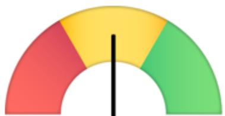

gauge chart

| Segment Color | Value |
|---|---|
| Red | 100 |
| Yellow | 80 |
| Green | 90 |
| Black | 50 |

Weekly wholesale price indicator

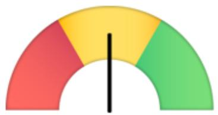

gauge chart

| Category | Value |
|---|---|
| Red | 100 |
| Yellow | 80 |
| Green | 90 |
| Black | 50 |

Channel policy indicator

## Methodology: Red/Yellow/Green represents negative/neutral/positive for each indicator.

- Wholesale price of Moutai Original Case and Package Opened: both up/1 up & 1 down/both down represent positive/neutral/negative, respectively.  
• Channel policies that benefits spirits manufacturers are considered positive (e.g. price hikes, sales targets) and vice versa.

Source: GS Global Investment Research

Source: GS Global Investment Research

i-Moutai APP tracker: Our Quest Mobile database indicated monthly active users (MAU) on the i-Moutai app reached 10.2mn/10.1mn in May/Apr, up by 4.4%/0.4% yoy, normalized vs. 18mn MAU in 1Q26 on average and is still above the level before Feitian Moutai's launch (MAU at 5\~7mn in 4Q25). DAU/MAU penetration ratio was at 11%/11% in May/Apr.

Exhibit 1: I-Moutai active users surged from Jan 1st 2026 when Feitian was officially launched on i-Moutai  
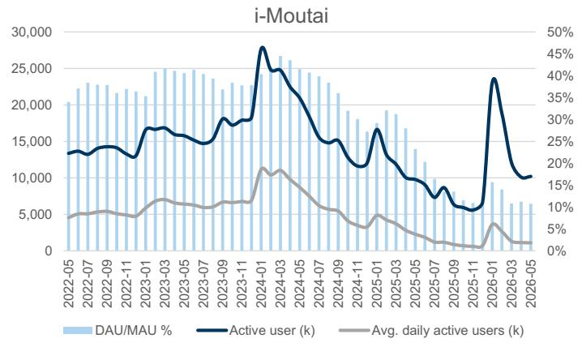

line chart

| Date       | DAU/MAU % | Active user (k) | Avg. daily active users (k) |
| ---------- | --------- | --------------- | --------------------------- |
| 2022-05    | ~21,000   | ~13,500         | ~5,000                      |
| 2022-07    | ~23,000   | ~14,000         | ~5,500                      |
| 2022-09    | ~22,500   | ~13,800         | ~5,200                      |
| 2022-11    | ~23,500   | ~14,500         | ~5,800                      |
| 2023-01    | ~24,500   | ~16,500         | ~6,500                      |
| 2023-03    | ~25,000   | ~17,000         | ~7,000                      |
| 2023-05    | ~24,500   | ~16,800         | ~6,800                      |
| 2023-07    | ~24,000   | ~16,500         | ~6,500                      |
| 2023-09    | ~23,500   | ~17,500         | ~6,800                      |
| 2023-11    | ~24,500   | ~18,500         | ~7,500                      |
| 2024-01    | ~27,500   | ~28,500         | ~11,500                     |
| 2024-03    | ~26,500   | ~25,500         | ~11,800                     |
| 2024-05    | ~25,500   | ~23,500         | ~11,500                     |
| 2024-07    | ~24,500   | ~19,500         | ~9,500                      |
| 2024-09    | ~23,500   | ~17,500         | ~7,500                      |
| 2024-11    | ~19,500   | ~14,500         | ~5,500                      |
| 2025-01    | ~18,500   | ~16,500         | ~6,500                      |
| 2025-03    | ~19,500   | ~14,500         | ~6,800                      |
| 2025-05    | ~17,500   | ~13,500         | ~6,500                      |
| 2025-07    | ~14,500   | ~11,500         | ~4,500                      |
| 2025-09    | ~13,500   | ~9,500          | ~3,500                      |
| 2025-11    | ~11,500   | ~7,500          | ~3,800                      |
| 2026-01    | ~8,500    | ~6,500          | ~4,800                      |
| 2026-03    | ~7,500    | ~4,800          | ~3,888                      |
| 2026-05    | ~6,500    | ~3,888          | ~3,888                      |

Source: Quest Mobile

## Key news this week:

Wuliangye announced management change (Jun 9): Wuliangye announced that Mr. Deng Min was proposed to serve as the chairman of Wuliangye Group. Wuliangye will hold its AGM on Jun 26, 2026.  
75.2k cases of counterfeit liquor products were investigated by the State Council Food Safety Office (Jun 12): The State Council Food Safety Office announced that 52 cases were filed for investigation due to the production and sale of liquor falsely labeled as “specially supplied” for government related institutions. 5 companies and 36 sales platforms were shut down.  
Laojiao collaborated with Longmen Grottoes for its new product launch (Jun

12): Laojiao launched its new product “Wushang Longmenfu” collaborating with the national Longmen Grottoes (UNESCO World Heritage Site), with a trial price of Rmb159/bottle for 500ml.

## Wholesale price summary of high-end liquors

## From Jun 2 to Jun 14, 2026:

Original case Feitian Moutai's wholesale price/bottle decreased by Rmb5 from Rmb1,675 to Rmb1,670, and unpacked Feitian Moutai's wholesale price stayed flattish at Rmb1,635.  
Common Wuliangye's wholesale price/bottle stayed flattish/decreased by Rmb10 at Rmb840/to Rmb760 per “Daily Spirits Prices”/Bairong Wholesale Market, respectively.  
Guojiao 1573's wholesale price/bottle stayed flattish at Rmb840.

## From Jan 1 to Jun 14, 2026:

Original case Feitian Moutai's wholesale price/bottle increased by Rmb165 from Rmb1,505 to Rmb1,670. Unpacked Feitian Moutai's wholesale price/bottle increased by Rmb145 from Rmb1,490 to Rmb1,635.  
Common Wuliangye's wholesale price/bottle decreased by Rmb10 to Rmb840 per "Daily Spirits Prices," and decreased by Rmb50 to Rmb760 per Bairong Wholesale Market.  
Guojiao 1573's wholesale price/bottle stayed flattish at Rmb840.

Exhibit 2: 53% Feitian Moutai product prices  
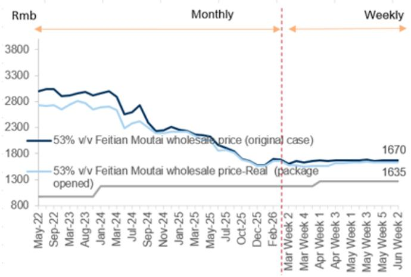

line chart

| Date       | 53% v/v Feitian Moutai wholesale price (original case) | 53% v/v Feitian Moutai wholesale price-Real (package opened) |
|------------|--------------------------------------------------------|---------------------------------------------------------------|
| Mar Week 2 | 1670                                                   | 1635                                                          |

Most recent data points as of Jun 14, 2026.  
Source: Daily Spirits Prices, Data compiled by GS Global Investment Research

Exhibit 3: 52% Common Wuliangye product prices  
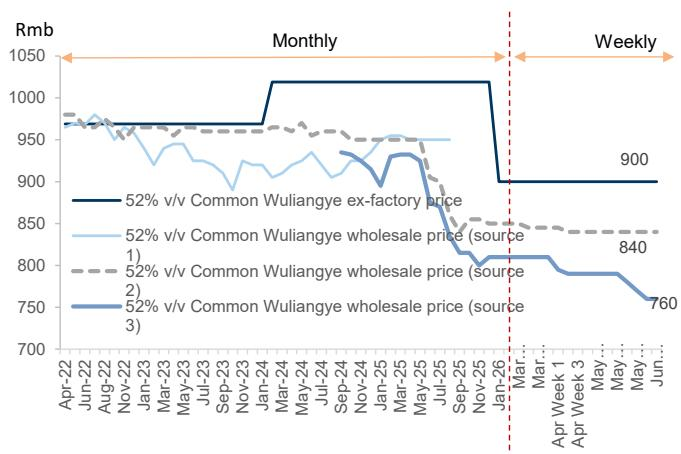

line chart

| Date | 52% v/v Common Wuliangye ex-factory price | 52% v/v Common Wuliangye wholesale price (source 1) | 52% v/v Common Wuliangye wholesale price (source 2) | 52% v/v Common Wuliangye wholesale price (source 3) |
| --- | --- | --- | --- | --- |
| Apr-22 | 980 | 980 | 980 | 980 |
| Jun-22 | 970 | 970 | 970 | 970 |
| Aug-22 | 960 | 960 | 960 | 960 |
| Nov-22 | 950 | 950 | 950 | 950 |
| Jan-23 | 940 | 940 | 940 | 940 |
| Mar-23 | 930 | 930 | 930 | 930 |
| May-23 | 920 | 920 | 920 | 920 |
| Jul-23 | 910 | 910 | 910 | 910 |
| Sep-23 | 900 | 900 | 900 | 900 |
| Nov-23 | 890 | 890 | 890 | 890 |
| Jan-24 | 880 | 880 | 880 | 880 |
| Mar-24 | 870 | 870 | 870 | 870 |
| May-24 | 860 | 860 | 860 | 860 |
| Jul-24 | 850 | 850 | 850 | 850 |
| Sep-24 | 840 | 840 | 840 | 840 |
| Nov-24 | 830 | 830 | 830 | 830 |
| Jan-25 | 820 | 820 | 820 | 820 |
| Mar-25 | 810 | 810 | 810 | 810 |
| May-25 | 800 | 800 | 800 | 800 |
| Jul-25 | 790 | 790 | 790 | 790 |
| Sep-25 | 780 | 780 | 780 | 780 |
| Nov-25 | 770 | 770 | 770 | 770 |
| Jan-26 | 760 | 760 | 760 | 760 |
| Mar-26 | 750 | 750 | 750 | 750 |
| Apr Week 1 | 740 | 740 | 740 | 740 |
| Apr Week 3 | 730 | 730 | 730 | 730 |
| May-26 | 720 | 720 | 720 | 720 |
| Jun-26 | 710 | 710 | 710 | 710 |
| Weekly | 900 | - | - | - |
| End | - | - | - | - |
| Final | - | - | - | - |
| Final | - | - | - | - |
| Final | - | - | - | - |
| Final | - | - | - | - |
| Final | - | - | - | - |
| Final | - | - | - | - |

Most recent data points as of Jun 14, 2026. Source 1 = Spirits Price References; Source 2 = Daily Spirits Prices; Source 3 = Bairong Wholesale Market  
Source: Spirits Price References, Daily Spirits Prices, Bairong Wholesale Market, Data compiled by GS Global Investment Research

Exhibit 4: Guojiao 1573 product prices  
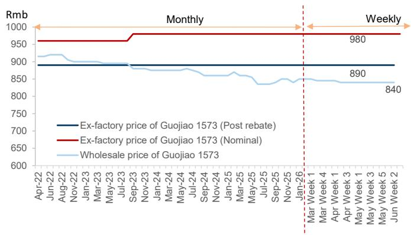

line chart

| Date | Ex-factory price of Guojiao 1573 (Post rebate) | Ex-factory price of Guojiao 1573 (Nominal) | Wholesale price of Guojiao 1573 |
| --- | --- | --- | --- |
| Apr-22 | 900 | 960 | 920 |
| Jun-22 | 900 | 960 | 910 |
| Aug-22 | 900 | 960 | 900 |
| Nov-22 | 900 | 960 | 890 |
| Jan-23 | 900 | 960 | 880 |
| Mar-23 | 900 | 960 | 870 |
| May-23 | 900 | 960 | 860 |
| Jul-23 | 900 | 960 | 850 |
| Sep-23 | 900 | 960 | 840 |
| Nov-23 | 900 | 960 | 840 |
| Jan-24 | 900 | 960 | 840 |
| Mar-24 | 900 | 960 | 840 |
| May-24 | 900 | 960 | 840 |
| Jul-24 | 900 | 960 | 840 |
| Sep-24 | 900 | 960 | 840 |
| Nov-24 | 900 | 960 | 840 |
| Jan-25 | 900 | 960 | 840 |
| Mar-25 | 900 | 960 | 840 |
| May-25 | 900 | 960 | 840 |
| Jul-25 | 900 | 960 | 840 |
| Sep-25 | 900 | 960 | 840 |
| Nov-25 | 900 | 960 | 840 |
| Jan-26 | 900 | 960 | 840 |
| Mar-Week 1 | 900 | 960 | 840 |
| Mar-Week 4 | 900 | 960 | 840 |
| Apr-Week 1 | 900 | 960 | 840 |
| Apr-Week 3 | 900 | 960 | 840 |
| May-Week 1 | 900 | 960 | 840 |
| May-Week 3 | 900 | 960 | 840 |
| May-Week 5 | 900 | 960 | 840 |
| May-Week 2 | 900 | 960 | 840 |
| Jun-Week | 900 | 960 | 840 |
| End | 900 | 960 | 840 |
| Weekly | - | - | - |
| End | - | - | - |
| Weekly | - | - | - |
| End | - | - | - |
| Weekly | - | - | - |
| End | - | - | - |
| Weekly | - | - | - |
| End | - | - | - |
| Weekly | - | - | - |
| End | - | 980 | - |
| End | - | - | - |
| End | - | - | - |
| End | - | - | - |
| End | - | - | - |
| End | - | - | - |
| End | - | - | - |
| End | - | - | - |
| End | - | - | - |
| End | End | - | - |
| End | End | - | - |
| End | End | - | - |
| End | End | - | - |
| End | End | - | - |
| End | End | - | - |
| End | End | - | - |
| End | End | - | - |
| Mid | Ex-factory price of Guojiao 1573 (Post rebate) | Ex-factory price of Guojiao 1573 (Nominal) | Wholesale price of Guojiao 1573 |
| Mid | Ex-factory price of Guojiao 1573 (Post rebate) | Ex-factory price of Guojiao 1573 (Nominal) | Wholesale price of Guojiao 1573 |
| Mid | Ex-factory price of Guojiao 1573 (Post rebate) | Ex-factory price of Guojiao 1573 (Nominal) | Wholesale Price of Guojiao (1573) |
| Mid | Ex-factory price of Guojiao 1573 (Post rebate) | Ex-factory price of Guojiao 1573 (Nominal) | Wholesale Price of Guojiao (1573) |
| Mid | Ex-factory price of Guojiao 1573 (Post rebate) | Ex-factory price of Guojiao 1573 (Nominal) | Non-Guojiao Price of Guojiao (1573) |
| Mid | Ex-factory price of Guojiao 1573 (Post rebate) | Ex-factory price of Guojiao 1573 (Nominal) | Non-Guojiao Price of Guojiao (1573) |
| Mid | Ex-factory price of Guojiao 1573 (Post rebate) | Ex-factory Price of Guojiao (Nominal) | Non-Guojiao Price of Guojiao (1573) |
| Mid | Ex-factory price of Guojiao 1573 (Post rebate) | Ex-factory Price of Guojiao (Nominal) | Non-Guojiao Price of Guojiao (1573) |

Most recent data points as of Jun 14, 2026.  
Source: Daily Spirits Prices, Data compiled by GS Global Investment Research

Moutai non-standard SKUs: In the past 2 weeks, the wholesale price of Zodiac/Moutai 1L decreased by Rmb60/30 per bottle, Jingpin Moutai/Moutai 15 years stayed flattish.

Exhibit 5: Wholesale prices of Moutai's 4 non-standard SKUs  
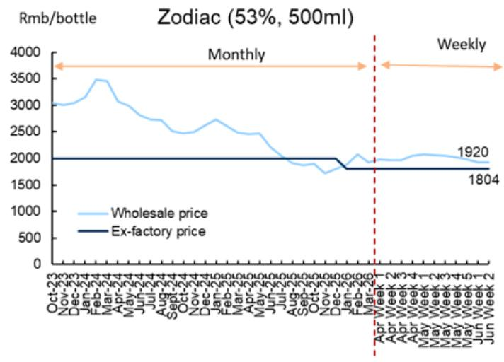

line chart

| Month       | Wholesale price | Ex-factory price |
| ----------- | --------------- | ---------------- |
| Apr Week    | 1920            | 1804             |

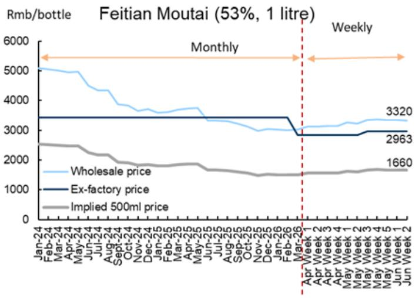

line chart

| Date       | Wholesale price | Ex-factory price | Implied 500ml price |
| ---------- | --------------- | ---------------- | ------------------- |
| Mar-26     | 3320            | 2963             | 1660                |

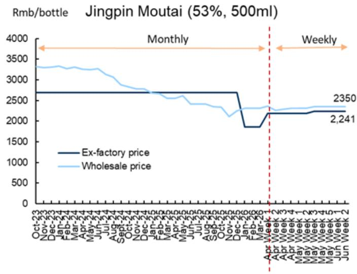

line chart

| Date       | Ex-factory price | Wholesale price |
| ---------- | ---------------- | ---------------- |
| Mar-24     | 2,241            | 2,350            |

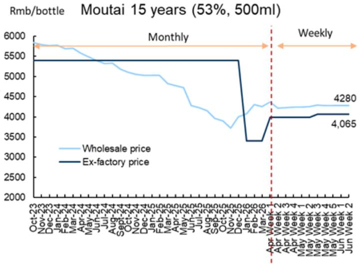

line chart

| Date       | Wholesale price | Ex-factory price |
| ---------- | --------------- | ---------------- |
| Jun-Week 2 | 4280            | 4,065            |

Latest data as of Jun 14, 2026.  
Source: Data compiled by GS Global Investment Research, Daily Spirits Prices

## Monthly Wholesale Prices Tracker - 40+ SKUs

Exhibit 6: Wholesale price summary

<table><tr><td rowspan="2"></td><td colspan="9">Moutai</td></tr><tr><td>Feitian Original Case</td><td>Feitian Unpacked</td><td>Hanjiang</td><td>Moutai 1935</td><td>Moutai Prince</td><td>Zodiac</td><td>Caiyou Zhenpin</td><td>Jingpin Moutai</td><td>Moutai - 15yr</td></tr><tr><td>Jan-21</td><td>2770</td><td>2355</td><td>320</td><td>910</td><td>188</td><td></td><td></td><td></td><td></td></tr><tr><td>Feb-21</td><td>3180</td><td>2430</td><td>340</td><td>910</td><td>195</td><td></td><td></td><td></td><td></td></tr><tr><td>Mar-21</td><td>3180</td><td>2430</td><td>342</td><td>930</td><td>190</td><td></td><td></td><td></td><td></td></tr><tr><td>Apr-21</td><td>3200</td><td>2465</td><td>400</td><td>1150</td><td>250</td><td></td><td></td><td></td><td></td></tr><tr><td>May-21</td><td>3280</td><td>2560</td><td>400</td><td>1175</td><td>230</td><td></td><td></td><td></td><td></td></tr><tr><td>Jun-21</td><td>3270</td><td>2710</td><td>400</td><td>1300</td><td>230</td><td></td><td></td><td></td><td></td></tr><tr><td>Jul-21</td><td>3440</td><td>2750</td><td>405</td><td>1270</td><td>230</td><td></td><td></td><td></td><td></td></tr><tr><td>Aug-21</td><td>3600</td><td>2800</td><td>400</td><td>1290</td><td>230</td><td></td><td></td><td></td><td></td></tr><tr><td>Sep-21</td><td>3860</td><td>2980</td><td>393</td><td>1280</td><td>225</td><td></td><td></td><td></td><td></td></tr><tr><td>Oct-21</td><td>3830</td><td>2750</td><td>385</td><td>1280</td><td>225</td><td></td><td></td><td></td><td></td></tr><tr><td>Nov-21</td><td>3550</td><td>2670</td><td>385</td><td>1260</td><td>220</td><td></td><td></td><td></td><td></td></tr><tr><td>Dec-21</td><td>3550</td><td>2570</td><td>375</td><td>1240</td><td>220</td><td></td><td></td><td></td><td></td></tr><tr><td>Jan-22</td><td>3380</td><td>2760</td><td>372</td><td>1220</td><td>220</td><td></td><td></td><td></td><td></td></tr><tr><td>Feb-22</td><td>3120</td><td>2750</td><td>375</td><td>1600</td><td>220</td><td></td><td></td><td></td><td></td></tr><tr><td>Mar-22</td><td>3150</td><td>2755</td><td>380</td><td>1650</td><td>240</td><td></td><td></td><td></td><td></td></tr><tr><td>Apr-22</td><td>2820</td><td>2600</td><td>380</td><td>1380</td><td>250</td><td></td><td></td><td></td><td></td></tr><tr><td>May-22</td><td>2805</td><td>2610</td><td>380</td><td>1410</td><td>248</td><td></td><td></td><td></td><td></td></tr><tr><td>Jun-22</td><td>3000</td><td>2740</td><td>380</td><td>1410</td><td>230</td><td></td><td></td><td></td><td></td></tr><tr><td>Jul-22</td><td>3030</td><td>2720</td><td>375</td><td>1410</td><td>230</td><td></td><td></td><td></td><td></td></tr><tr><td>Aug-22</td><td>3200</td><td>2820</td><td>375</td><td>1355</td><td>230</td><td></td><td></td><td></td><td></td></tr><tr><td>Sep-22</td><td>3240</td><td>2830</td><td>370</td><td>1300</td><td>247</td><td></td><td></td><td></td><td></td></tr><tr><td>Oct-22</td><td>3030</td><td>2730</td><td>364</td><td>1200</td><td>247</td><td></td><td></td><td></td><td></td></tr><tr><td>Nov-22</td><td>2940</td><td>2630</td><td>360</td><td>1200</td><td>247</td><td></td><td></td><td></td><td></td></tr><tr><td>Dec-22</td><td>2885</td><td>2650</td><td>350</td><td>1200</td><td>247</td><td></td><td></td><td></td><td></td></tr><tr><td>Jan-23</td><td>2910</td><td>2720</td><td>342</td><td>1130</td><td>247</td><td></td><td></td><td></td><td></td></tr><tr><td>Feb-23</td><td>2960</td><td>2740</td><td>335</td><td>1100</td><td>247</td><td></td><td></td><td></td><td></td></tr><tr><td>Mar-23</td><td>2990</td><td>2745</td><td>340</td><td>1160</td><td>247</td><td></td><td></td><td></td><td></td></tr><tr><td>Apr-23</td><td>2910</td><td>2750</td><td>350</td><td>1100</td><td>247</td><td></td><td></td><td></td><td></td></tr><tr><td>May-23</td><td>2935</td><td>2760</td><td>360</td><td>1170</td><td>247</td><td></td><td></td><td></td><td></td></tr><tr><td>Jun-23</td><td>2965</td><td>2820</td><td>360</td><td>1050</td><td>247</td><td></td><td></td><td></td><td></td></tr><tr><td>Jul-23</td><td>2900</td><td>2725</td><td>347</td><td>1030</td><td>247</td><td></td><td></td><td></td><td></td></tr><tr><td>Aug-23</td><td>2925</td><td>2730</td><td>340</td><td>1020</td><td>247</td><td>2990</td><td>4420</td><td>3315</td><td>5800</td></tr><tr><td>Sep-23</td><td>3000</td><td>2780</td><td>350</td><td>1120</td><td>247</td><td>3050</td><td>4400</td><td>3345</td><td>5860</td></tr><tr><td>Oct-23</td><td>2970</td><td>2730</td><td>350</td><td>1155</td><td>247</td><td>3040</td><td>4380</td><td>3320</td><td>5840</td></tr><tr><td>Nov-23</td><td>2915</td><td>2650</td><td>350</td><td>1110</td><td>247</td><td>3005</td><td>4290</td><td>3300</td><td>5790</td></tr><tr><td>Dec-23</td><td>2960</td><td>2670</td><td>350</td><td>1080</td><td>247</td><td>3040</td><td>4250</td><td>3310</td><td>5770</td></tr><tr><td>Jan-24</td><td>2960</td><td>2690</td><td>350</td><td>1050</td><td>247</td><td>3160</td><td>4220</td><td>3330</td><td>5780</td></tr><tr><td>Feb-24</td><td>2980</td><td>2715</td><td>350</td><td>1050</td><td>247</td><td>3480</td><td>4150</td><td>3275</td><td>5690</td></tr><tr><td>Mar-24</td><td>2990</td><td>2700</td><td>350</td><td>1070</td><td>247</td><td>3450</td><td>4160</td><td>3310</td><td>5700</td></tr><tr><td>Apr-24</td><td>2890</td><td>2635</td><td>338</td><td>1050</td><td>245</td><td>3070</td><td>4060</td><td>3265</td><td>5570</td></tr><tr><td>May-24</td><td>2780</td><td>2560</td><td>338</td><td>1030</td><td>245</td><td>2990</td><td>4000</td><td>3250</td><td>5480</td></tr><tr><td>Jun-24</td><td>2720</td><td>2520</td><td>330</td><td>1020</td><td>240</td><td>2815</td><td>3960</td><td>3270</td><td>5400</td></tr><tr><td>Jul-24</td><td>2530</td><td>2310</td><td>320</td><td>810</td><td>240</td><td>2730</td><td>3850</td><td>3130</td><td>5320</td></tr><tr><td>Aug-24</td><td>2620</td><td>2400</td><td>310</td><td>795</td><td>240</td><td>2720</td><td>3920</td><td>3090</td><td>5280</td></tr><tr><td>Sep-24</td><td>2660</td><td>2365</td><td>310</td><td>800</td><td>245</td><td>2710</td><td>3900</td><td>3035</td><td>5300</td></tr><tr><td>Oct-24</td><td>2390</td><td>2295</td><td>302</td><td>740</td><td>245</td><td>2510</td><td>3870</td><td>2880</td><td>5180</td></tr><tr><td>Nov-24</td><td>2150</td><td>2130</td><td>296</td><td>750</td><td>245</td><td>2430</td><td>3800</td><td>2760</td><td>5000</td></tr><tr><td>Dec-24</td><td>2235</td><td>2190</td><td>290</td><td>665</td><td>245</td><td>2500</td><td>3860</td><td>2765</td><td>5000</td></tr><tr><td>Jan-25</td><td>2315</td><td>2220</td><td>310</td><td>720</td><td>245</td><td>2620</td><td>3820</td><td>2750</td><td>5030</td></tr><tr><td>Feb-25</td><td>2270</td><td>2220</td><td>320</td><td>730</td><td>245</td><td>2730</td><td>3840</td><td>2680</td><td>5030</td></tr><tr><td>Mar-25</td><td>2230</td><td>2200</td><td>320</td><td>750</td><td>245</td><td>2600</td><td>3830</td><td>2660</td><td>5010</td></tr><tr><td>Apr-25</td><td>2150</td><td>2130</td><td>320</td><td>750</td><td>245</td><td>2460</td><td>3810</td><td>2530</td><td>4820</td></tr><tr><td>May-25</td><td>2150</td><td>2080</td><td>320</td><td>750</td><td>245</td><td>2460</td><td>3660</td><td>2550</td><td>4760</td></tr><tr><td>Jun-25</td><td>2120</td><td>2050</td><td>340</td><td>750</td><td>245</td><td>2475</td><td>3550</td><td>2600</td><td>4680</td></tr><tr><td>Jul-25</td><td>1925</td><td>1830</td><td>280</td><td>720</td><td>245</td><td>2210</td><td>3300</td><td>2410</td><td>4250</td></tr><tr><td>Aug-25</td><td>1910</td><td>1860</td><td>260</td><td>680</td><td>245</td><td>2005</td><td>3210</td><td>2420</td><td>4230</td></tr><tr><td>Sep-25</td><td>1830</td><td>1805</td><td>255</td><td>680</td><td>245</td><td>1910</td><td>3185</td><td>2415</td><td>4150</td></tr><tr><td>Oct-25</td><td>1780</td><td>1760</td><td>253</td><td>690</td><td>245</td><td>1870</td><td>3130</td><td>2350</td><td>3920</td></tr><tr><td>Nov-25</td><td>1675</td><td>1620</td><td>253</td><td>690</td><td>245</td><td>1865</td><td>3070</td><td>2320</td><td>3880</td></tr><tr><td>Dec-25</td><td>1565</td><td>1555</td><td>240</td><td>650</td><td>245</td><td>1800</td><td>3250</td><td>2250</td><td>4000</td></tr><tr><td>Jan-26</td><td>1680</td><td>1650</td><td>273</td><td>650</td><td>245</td><td>1930</td><td>3420</td><td>2320</td><td>4240</td></tr><tr><td>Feb-26</td><td>1700</td><td>1650</td><td>273</td><td>650</td><td>245</td><td>1930</td><td>3500</td><td>2320</td><td>4300</td></tr><tr><td>Mar-26</td><td>1720</td><td>1630</td><td>278</td><td>650</td><td>245</td><td>1950</td><td>3540</td><td>2350</td><td>4350</td></tr><tr><td>Apr-26</td><td>1665</td><td>1630</td><td>292</td><td>670</td><td>260</td><td>2045</td><td>3550</td><td>2310</td><td>4240</td></tr><tr><td>May-26</td><td>1675</td><td>1635</td><td>290</td><td>670</td><td>260</td><td>1980</td><td>3550</td><td>2350</td><td>4280</td></tr><tr><td>Jun-26</td><td>1670</td><td>1635</td><td>290</td><td>670</td><td>260</td><td>1920</td><td>3550</td><td>2350</td><td>4280</td></tr></table>

<table><tr><td colspan="3">Wuliangye</td></tr><tr><td>Common WLY (8th)</td><td>1618</td><td>Wuliangc hun</td></tr><tr><td>965</td><td>960</td><td></td></tr><tr><td>970</td><td>960</td><td>195</td></tr><tr><td>980</td><td>960</td><td>195</td></tr><tr><td>985</td><td>960</td><td>200</td></tr><tr><td>970</td><td>960</td><td>200</td></tr><tr><td>985</td><td>970</td><td>200</td></tr><tr><td>990</td><td>975</td><td>200</td></tr><tr><td>1000</td><td>960</td><td>200</td></tr><tr><td>985</td><td>960</td><td>200</td></tr><tr><td>970</td><td>955</td><td>210</td></tr><tr><td>960</td><td>945</td><td>210</td></tr><tr><td>950</td><td>925</td><td>205</td></tr><tr><td>970</td><td>960</td><td>218</td></tr><tr><td>980</td><td>950</td><td>218</td></tr><tr><td>965</td><td>965</td><td>220</td></tr><tr><td>970</td><td>970</td><td>220</td></tr><tr><td>968</td><td>975</td><td>197</td></tr><tr><td>980</td><td>965</td><td>197</td></tr><tr><td>970</td><td>955</td><td>197</td></tr><tr><td>950</td><td>955</td><td>197</td></tr><tr><td>950</td><td>960</td><td>197</td></tr><tr><td>965</td><td>975</td><td>210</td></tr><tr><td>958</td><td>955</td><td>207</td></tr><tr><td>940</td><td>945</td><td>207</td></tr><tr><td>920</td><td>955</td><td>207</td></tr><tr><td>940</td><td>955</td><td>207</td></tr><tr><td>945</td><td>955</td><td>207</td></tr><tr><td>945</td><td>955</td><td>207</td></tr><tr><td>925</td><td>950</td><td>207</td></tr><tr><td>925</td><td>950</td><td>207</td></tr><tr><td>920</td><td>950</td><td>186</td></tr><tr><td>910</td><td>950</td><td>160</td></tr><tr><td>890</td><td>950</td><td>160</td></tr><tr><td>925</td><td>955</td><td>165</td></tr><tr><td>920</td><td>955</td><td>180</td></tr><tr><td>920</td><td>955</td><td>170</td></tr><tr><td>935</td><td>950</td><td>170</td></tr><tr><td>905</td><td>950</td><td>170</td></tr><tr><td>915</td><td>950</td><td>185</td></tr><tr><td>920</td><td>960</td><td>150</td></tr><tr><td>930</td><td>960</td><td>145</td></tr><tr><td>935</td><td>970</td><td>145</td></tr><tr><td>920</td><td>955</td><td>150</td></tr><tr><td>905</td><td>960</td><td>160</td></tr><tr><td>915</td><td>960</td><td>160</td></tr><tr><td>925</td><td>960</td><td>160</td></tr><tr><td>935</td><td>950</td><td>160</td></tr><tr><td>935</td><td>950</td><td>160</td></tr><tr><td>950</td><td>950</td><td>160</td></tr><tr><td>955</td><td>950</td><td>160</td></tr><tr><td>955</td><td>950</td><td>160</td></tr><tr><td>950</td><td>950</td><td>160</td></tr><tr><td>950</td><td>950</td><td>160</td></tr><tr><td>950</td><td>950</td><td>160</td></tr><tr><td>950</td><td>905</td><td>160</td></tr><tr><td>950</td><td>900</td><td>160</td></tr><tr><td>820</td><td>850</td><td>160</td></tr><tr><td>810</td><td>840</td><td>160</td></tr><tr><td>810</td><td>855</td><td>160</td></tr><tr><td>820</td><td>850</td><td>150</td></tr><tr><td>815</td><td>850</td><td>200</td></tr><tr><td>830</td><td>850</td><td>200</td></tr><tr><td>830</td><td>850</td><td>200</td></tr><tr><td>830</td><td>850</td><td>200</td></tr><tr><td>830</td><td>850</td><td>200</td></tr><tr><td>830</td><td>850</td><td>200</td></tr><tr><td colspan="3"></td></tr><tr><td>-120</td><td>-100</td><td>40</td></tr><tr><td>-13%</td><td>-11%</td><td>25%</td></tr><tr><td colspan="3"></td></tr><tr><td>0</td><td>0</td><td>0</td></tr><tr><td>0%</td><td>0%</td><td>0%</td></tr></table>

<table><tr><td colspan="5">Luzhou Laojiao</td></tr><tr><td>Guojiao1573</td><td>Tequ</td><td>Jiaoling30</td><td>Jiaoling60</td><td>Jiaoling90</td></tr><tr><td>870</td><td>240</td><td>200</td><td>255</td><td></td></tr><tr><td>875</td><td>240</td><td>200</td><td>255</td><td>360</td></tr><tr><td>870</td><td>240</td><td>200</td><td>255</td><td>360</td></tr><tr><td>910</td><td>243</td><td>200</td><td>255</td><td>360</td></tr><tr><td>920</td><td>250</td><td>192</td><td>250</td><td>360</td></tr><tr><td>920</td><td>250</td><td>192</td><td>245</td><td>360</td></tr><tr><td>930</td><td>250</td><td>192</td><td>245</td><td>360</td></tr><tr><td>910</td><td>250</td><td>192</td><td>245</td><td>360</td></tr><tr><td>910</td><td>240</td><td>192</td><td>245</td><td>360</td></tr><tr><td>910</td><td>240</td><td>192</td><td>240</td><td>360</td></tr><tr><td>910</td><td>260</td><td>192</td><td>240</td><td>360</td></tr><tr><td>905</td><td>260</td><td>192</td><td>240</td><td>360</td></tr><tr><td>895</td><td>270</td><td>192</td><td>240</td><td>360</td></tr><tr><td>930</td><td>270</td><td>197</td><td>243</td><td>360</td></tr><tr><td>920</td><td>270</td><td>197</td><td>243</td><td>360</td></tr><tr><td>920</td><td>270</td><td>210</td><td>260</td><td>415</td></tr><tr><td>915</td><td>270</td><td>210</td><td>260</td><td>415</td></tr><tr><td>915</td><td>270</td><td>210</td><td>260</td><td>415</td></tr><tr><td>920</td><td>270</td><td>210</td><td>260</td><td>415</td></tr><tr><td>920</td><td>270</td><td>215</td><td>265</td><td>420</td></tr><tr><td>920</td><td>265</td><td>215</td><td>265</td><td>420</td></tr><tr><td>910</td><td>260</td><td>200</td><td>265</td><td>408</td></tr><tr><td>905</td><td>260</td><td>200</td><td>260</td><td>408</td></tr><tr><td>900</td><td>245</td><td>200</td><td>250</td><td>408</td></tr><tr><td>900</td><td>245</td><td>200</td><td>250</td><td>408</td></tr><tr><td>900</td><td>245</td><td>200</td><td>250</td><td>408</td></tr><tr><td>900</td><td>250</td><td>200</td><td>250</td><td>408</td></tr><tr><td>905</td><td>260</td><td>200</td><td>250</td><td>408</td></tr><tr><td>895</td><td>260</td><td>200</td><td>250</td><td>408</td></tr><tr><td>895</td><td>260</td><td>200</td><td>250</td><td>408</td></tr><tr><td>893</td><td>260</td><td>185</td><td>240</td><td>374</td></tr><tr><td>880</td><td>260</td><td>170</td><td>225</td><td>340</td></tr><tr><td>860</td><td>260</td><td>160</td><td>220</td><td>350</td></tr><tr><td>870</td><td>260</td><td>180</td><td>230</td><td>350</td></tr><tr><td>880</td><td>260</td><td>180</td><td>235</td><td>360</td></tr><tr><td>860</td><td>260</td><td>180</td><td>230</td><td>360</td></tr><tr><td>850</td><td>260</td><td>175</td><td>240</td><td>360</td></tr><tr><td>850</td><td>260</td><td>170</td><td>240</td><td>355</td></tr><tr><td>850</td><td>260</td><td>180</td><td>245</td><td>350</td></tr><tr><td>855</td><td>245</td><td>180</td><td>250</td><td>350</td></tr><tr><td>840</td><td>248</td><td>175</td><td>250</td><td>345</td></tr><tr><td>865</td><td>245</td><td>175</td><td>250</td><td>350</td></tr><tr><td>860</td><td>250</td><td>175</td><td>240</td><td>355</td></tr><tr><td>855</td><td>245</td><td>160</td><td>240</td><td>350</td></tr><tr><td>870</td><td>240</td><td>160</td><td>240</td><td>350</td></tr><tr><td>850</td><td>240</td><td>155</td><td>240</td><td>350</td></tr><tr><td>850</td><td>240</td><td>150</td><td>240</td><td>350</td></tr><tr><td>840</td><td>240</td><td>150</td><td>240</td><td>350</td></tr><tr><td>840</td><td>240</td><td>150</td><td>240</td><td>350</td></tr><tr><td>840</td><td>240</td><td>150</td><td>240</td><td>350</td></tr><tr><td>840</td><td>240</td><td>150</td><td>240</td><td>350</td></tr><tr><td>800</td><td>240</td><td>150</td><td>240</td><td>350</td></tr><tr><td>820</td><td>240</td><td>150</td><td>240</td><td>350</td></tr><tr><td>835</td><td>240</td><td>150</td><td>240</td><td>350</td></tr><tr><td>835</td><td>240</td><td>150</td><td>240</td><td>350</td></tr><tr><td>835</td><td>240</td><td>150</td><td>240</td><td>350</td></tr><tr><td>835</td><td>240</td><td>150</td><td>240</td><td>350</td></tr><tr><td>835</td><td>240</td><td>150</td><td>245</td><td>350</td></tr><tr><td>835</td><td>240</td><td>150</td><td>240</td><td>350</td></tr><tr><td>835</td><td>240</td><td>150</td><td>240</td><td>350</td></tr><tr><td>835</td><td>240</td><td>150</td><td>240</td><td>350</td></tr><tr><td>820</td><td>240</td><td>150</td><td>240</td><td>350</td></tr><tr><td>820</td><td>240</td><td>150</td><td>240</td><td>350</td></tr><tr><td>820</td><td>240</td><td>150</td><td>240</td><td>350</td></tr><tr><td>825</td><td>240</td><td>155</td><td>240</td><td>350</td></tr><tr><td>845</td><td>240</td><td>155</td><td>240</td><td>350</td></tr><tr><td>845</td><td>240</td><td>155</td><td>240</td><td>350</td></tr><tr><td colspan="5"></td></tr><tr><td>10</td><td>0</td><td>5</td><td>0</td><td>0</td></tr><tr><td>1%</td><td>0%</td><td>3%</td><td>0%</td><td>0%</td></tr><tr><td colspan="5"></td></tr><tr><td>0</td><td>0</td><td>0</td><td>0</td><td>0</td></tr><tr><td>0%</td><td>0%</td><td>0%</td><td>0%</td><td>0%</td></tr></table>

Price as of Jun 14, 2026  
Source: Daily Spirits Price, Spirits Price References, Data compiled by GS Global Investment Research

Exhibit 7: Wholesale price summary

<table><tr><td rowspan="2"></td><td colspan="5">Yanghe</td><td colspan="2">King&#x27;s Luck</td><td>Jiannanchun</td><td colspan="4">Fen Wine</td><td colspan="5">ZJLD</td></tr><tr><td>M9</td><td>M6+</td><td>M3</td><td>Sky Blue</td><td>Ocean Blue</td><td>4K</td><td>2K</td><td>Shuijinjian</td><td>Qinghua30</td><td>Qinghua20</td><td>Bofen</td><td>Laobaifen10</td><td>Zhen 30</td><td>Zhen 15</td><td>Zhen 8</td><td>Zhen 5</td><td>Lao Zhen Jiu</td></tr><tr><td>Jan-21</td><td>1130</td><td>663</td><td>425</td><td>292</td><td>138</td><td>370</td><td>250</td><td>368</td><td>690</td><td>350</td><td></td><td>120</td><td>790</td><td>315</td><td>190</td><td>135</td><td>70</td></tr><tr><td>Feb-21</td><td>1130</td><td>665</td><td>450</td><td>305</td><td>140</td><td>370</td><td>245</td><td>370</td><td>715</td><td>343</td><td>36</td><td>120</td><td>800</td><td>325</td><td>190</td><td>135</td><td>70</td></tr><tr><td>Mar-21</td><td>1130</td><td>665</td><td>450</td><td>300</td><td>140</td><td>370</td><td>245</td><td>380</td><td>715</td><td>345</td><td>36</td><td>120</td><td>900</td><td>330</td><td>190</td><td>135</td><td>75</td></tr><tr><td>Apr-21</td><td>1130</td><td>650</td><td>450</td><td>305</td><td>140</td><td>370</td><td>245</td><td>392</td><td>720</td><td>345</td><td>37</td><td>120</td><td>950</td><td>380</td><td>225</td><td>153</td><td>95</td></tr><tr><td>May-21</td><td>1120</td><td>640</td><td>445</td><td>300</td><td>140</td><td>370</td><td>245</td><td>392</td><td>720</td><td>347</td><td>37</td><td>120</td><td>950</td><td>380</td><td>230</td><td>155</td><td>95</td></tr><tr><td>Jun-21</td><td>1120</td><td>650</td><td>445</td><td>300</td><td>142</td><td>370</td><td>245</td><td>395</td><td>770</td><td>355</td><td>39</td><td>120</td><td>960</td><td>380</td><td>225</td><td>150</td><td>93</td></tr><tr><td>Jul-21</td><td>1150</td><td>655</td><td>440</td><td>300</td><td>140</td><td>370</td><td>245</td><td>405</td><td>765</td><td>355</td><td>42</td><td>120</td><td>945</td><td>385</td><td>225</td><td>152</td><td>93</td></tr><tr><td>Aug-21</td><td>1150</td><td>645</td><td>440</td><td>300</td><td>140</td><td>380</td><td>245</td><td>405</td><td>800</td><td>352</td><td>42</td><td>120</td><td>945</td><td>377</td><td>225</td><td>152</td><td>93</td></tr><tr><td>Sep-21</td><td>1170</td><td>650</td><td>463</td><td>305</td><td>140</td><td>380</td><td>245</td><td>400</td><td>820</td><td>365</td><td>40</td><td>120</td><td>940</td><td>375</td><td>225</td><td>150</td><td>90</td></tr><tr><td>Oct-21</td><td>1170</td><td>650</td><td>460</td><td>305</td><td>140</td><td>390</td><td>245</td><td>395</td><td>830</td><td>367</td><td>40</td><td>125</td><td>930</td><td>375</td><td>210</td><td>150</td><td>90</td></tr><tr><td>Nov-21</td><td>1170</td><td>650</td><td>460</td><td>305</td><td>140</td><td>390</td><td>245</td><td>395</td><td>825</td><td>367</td><td>40</td><td>125</td><td>930</td><td>370</td><td>210</td><td>145</td><td>85</td></tr><tr><td>Dec-21</td><td>1170</td><td>650</td><td>460</td><td>305</td><td>140</td><td>390</td><td>245</td><td>397</td><td>830</td><td>374</td><td>41</td><td>120</td><td>910</td><td>360</td><td>202</td><td>141</td><td>80</td></tr><tr><td>Jan-22</td><td>1170</td><td>650</td><td>460</td><td>305</td><td>140</td><td>390</td><td>255</td><td>397</td><td>830</td><td>377</td><td>42</td><td>120</td><td>930</td><td>370</td><td>210</td><td>142</td><td>88</td></tr><tr><td>Feb-22</td><td>1170</td><td>650</td><td>460</td><td>305</td><td>140</td><td>400</td><td>262</td><td>397</td><td>830</td><td>377</td><td>42</td><td>120</td><td>935</td><td>370</td><td>200</td><td>135</td><td>88</td></tr><tr><td>Mar-22</td><td>1170</td><td>650</td><td>460</td><td>305</td><td>143</td><td>415</td><td>265</td><td>395</td><td>830</td><td>375</td><td>42</td><td>120</td><td>910</td><td>355</td><td>200</td><td>142</td><td>88</td></tr><tr><td>Apr-22</td><td>1170</td><td>650</td><td>460</td><td>305</td><td>143</td><td>415</td><td>265</td><td>398</td><td>830</td><td>375</td><td>43</td><td>120</td><td>910</td><td>360</td><td>200</td><td>142</td><td>88</td></tr><tr><td>May-22</td><td>1170</td><td>632</td><td>457</td><td>305</td><td>143</td><td>415</td><td>258</td><td>398</td><td>830</td><td>365</td><td>43</td><td>120</td><td>910</td><td>360</td><td>200</td><td>142</td><td>88</td></tr><tr><td>Jun-22</td><td>1170</td><td>642</td><td>457</td><td>305</td><td>143</td><td>432</td><td>260</td><td>398</td><td>830</td><td>365</td><td>43</td><td>120</td><td>890</td><td>345</td><td>200</td><td>133</td><td>79</td></tr><tr><td>Jul-22</td><td>1170</td><td>642</td><td>457</td><td>305</td><td>143</td><td>420</td><td>260</td><td>398</td><td>815</td><td>360</td><td>43</td><td>120</td><td>880</td><td>345</td><td>200</td><td>133</td><td>79</td></tr><tr><td>Aug-22</td><td>1170</td><td>642</td><td>457</td><td>305</td><td>143</td><td>430</td><td>260</td><td>410</td><td>815</td><td>360</td><td>43</td><td>120</td><td>875</td><td>345</td><td>200</td><td>133</td><td>79</td></tr><tr><td>Sep-22</td><td>1150</td><td>642</td><td>460</td><td>305</td><td>139</td><td>430</td><td>260</td><td>415</td><td>815</td><td>360</td><td>43</td><td>120</td><td>875</td><td>345</td><td>200</td><td>133</td><td>79</td></tr><tr><td>Oct-22</td><td>1135</td><td>642</td><td>460</td><td>300</td><td>139</td><td>425</td><td>265</td><td>410</td><td>810</td><td>360</td><td>43</td><td>120</td><td>875</td><td>342</td><td>200</td><td>133</td><td>79</td></tr><tr><td>Nov-22</td><td>1135</td><td>630</td><td>420</td><td>296</td><td>135</td><td>415</td><td>260</td><td>405</td><td>810</td><td>355</td><td>43</td><td>118</td><td>860</td><td>342</td><td>195</td><td>133</td><td>79</td></tr><tr><td>Dec-22</td><td>1135</td><td>605</td><td>420</td><td>296</td><td>135</td><td>400</td><td>250</td><td>410</td><td>805</td><td>355</td><td>43</td><td>118</td><td>860</td><td>342</td><td>195</td><td>133</td><td>79</td></tr><tr><td>Jan-23</td><td>1135</td><td>610</td><td>420</td><td>296</td><td>135</td><td>400</td><td>255</td><td>410</td><td>805</td><td>350</td><td>43</td><td>118</td><td>830</td><td>330</td><td>190</td><td>130</td><td>79</td></tr><tr><td>Feb-23</td><td>1125</td><td>615</td><td>420</td><td>296</td><td>135</td><td>400</td><td>250</td><td>410</td><td>805</td><td>350</td><td>41</td><td>118</td><td>820</td><td>330</td><td>190</td><td>130</td><td>79</td></tr><tr><td>Mar-23</td><td>1125</td><td>615</td><td>420</td><td>296</td><td>135</td><td>410</td><td>240</td><td>410</td><td>790</td><td>350</td><td>41</td><td>118</td><td>810</td><td>330</td><td>190</td><td>130</td><td>76</td></tr><tr><td>Apr-23</td><td>1125</td><td>615</td><td>435</td><td>296</td><td>134</td><td>400</td><td>220</td><td>410</td><td>790</td><td>350</td><td>41</td><td>118</td><td>800</td><td>335</td><td>190</td><td>130</td><td>76</td></tr><tr><td>May-23</td><td>1125</td><td>610</td><td>435</td><td>296</td><td>134</td><td>400</td><td>205</td><td>410</td><td>787</td><td>350</td><td>41</td><td>118</td><td>800</td><td>340</td><td>190</td><td>130</td><td>76</td></tr><tr><td>Jun-23</td><td>1125</td><td>610</td><td>435</td><td>296</td><td>134</td><td>400</td><td>205</td><td>410</td><td>780</td><td>350</td><td>41</td><td>118</td><td>800</td><td>340</td><td>190</td><td>130</td><td>76</td></tr><tr><td>Jul-23</td><td>1068</td><td>605</td><td>410</td><td>293</td><td>132</td><td>380</td><td>210</td><td>410</td><td>778</td><td>343</td><td>41</td><td>119</td><td>810</td><td>345</td><td>193</td><td>133</td><td>79</td></tr><tr><td>Aug-23</td><td>1030</td><td>580</td><td>385</td><td>285</td><td>120</td><td>360</td><td>205</td><td>410</td><td>760</td><td>340</td><td>40</td><td>110</td><td>800</td><td>350</td><td>200</td><td>140</td><td>82</td></tr><tr><td>Sep-23</td><td>990</td><td>575</td><td>390</td><td>260</td><td>120</td><td>360</td><td>205</td><td>410</td><td>770</td><td>330</td><td>40</td><td>100</td><td>800</td><td>340</td><td>200</td><td>135</td><td>82</td></tr><tr><td>Oct-23</td><td>980</td><td>600</td><td>390</td><td>270</td><td>135</td><td>360</td><td>215</td><td>410</td><td>780</td><td>340</td><td>40</td><td>105</td><td>800</td><td>340</td><td>195</td><td>135</td><td>82</td></tr><tr><td>Nov-23</td><td>920</td><td>530</td><td>380</td><td>280</td><td>135</td><td>390</td><td>215</td><td>410</td><td>800</td><td>335</td><td>40</td><td>105</td><td>790</td><td>330</td><td>195</td><td>135</td><td>83</td></tr><tr><td>Dec-23</td><td>910</td><td>530</td><td>360</td><td>275</td><td>135</td><td>390</td><td>215</td><td>410</td><td>790</td><td>335</td><td>40</td><td>105</td><td>790</td><td>340</td><td>185</td><td>138</td><td>83</td></tr><tr><td>Jan-24</td><td>910</td><td>530</td><td>355</td><td>275</td><td>125</td><td>380</td><td>170</td><td>410</td><td>780</td><td>320</td><td>40</td><td>105</td><td>800</td><td>340</td><td>195</td><td>145</td><td>85</td></tr><tr><td>Feb-24</td><td>910</td><td>520</td><td>375</td><td>270</td><td>95</td><td>365</td><td>165</td><td>413</td><td>735</td><td>325</td><td>38</td><td>105</td><td>765</td><td>330</td><td>195</td><td>130</td><td>85</td></tr><tr><td>Mar-24</td><td>910</td><td>520</td><td>375</td><td>265</td><td>105</td><td>365</td><td>165</td><td>413</td><td>800</td><td>355</td><td>40</td><td>115</td><td>750</td><td>325</td><td>190</td><td>135</td><td>80</td></tr><tr><td>Apr-24</td><td>910</td><td>515</td><td>375</td><td>265</td><td>115</td><td>370</td><td>200</td><td>413</td><td>720</td><td>350</td><td>38</td><td>105</td><td>745</td><td>325</td><td>190</td><td>135</td><td>80</td></tr><tr><td>May-24</td><td>915</td><td>505</td><td>380</td><td>260</td><td>120</td><td>375</td><td>205</td><td>410</td><td>750</td><td>340</td><td>38</td><td>105</td><td>735</td><td>330</td><td>190</td><td>135</td><td>80</td></tr><tr><td>Jun-24</td><td>920</td><td>525</td><td>385</td><td>265</td><td>120</td><td>380</td><td>200</td><td>410</td><td>775</td><td>343</td><td>38</td><td>108</td><td>720</td><td>320</td><td>190</td><td>125</td><td>80</td></tr><tr><td>Jul-24</td><td>920</td><td>535</td><td>380</td><td>270</td><td>120</td><td>380</td><td>205</td><td>410</td><td>780</td><td>350</td><td>38</td><td>100</td><td>730</td><td>325</td><td>185</td><td>120</td><td>73</td></tr><tr><td>Aug-24</td><td>940</td><td>540</td><td>380</td><td>260</td><td>110</td><td>370</td><td>205</td><td>410</td><td>785</td><td>355</td><td>38</td><td>105</td><td>695</td><td>305</td><td>180</td><td>125</td><td>70</td></tr><tr><td>Sep-24</td><td>940</td><td>540</td><td>380</td><td>255</td><td>110</td><td>380</td><td>205</td><td>410</td><td>800</td><td>355</td><td>38</td><td>105</td><td>700</td><td>305</td><td>185</td><td>130</td><td>75</td></tr><tr><td>Oct-24</td><td>940</td><td>540</td><td>380</td><td>250</td><td>115</td><td>380</td><td>205</td><td>410</td><td>800</td><td>355</td><td>38</td><td>105</td><td>690</td><td>305</td><td>180</td><td>130</td><td>73</td></tr><tr><td>Nov-24</td><td>935</td><td>545</td><td>380</td><td>250</td><td>115</td><td>385</td><td>205</td><td>410</td><td>800</td><td>355</td><td>37</td><td>105</td><td>680</td><td>305</td><td>180</td><td>130</td><td>72</td></tr><tr><td>Dec-24</td><td>905</td><td>545</td><td>380</td><td>250</td><td>115</td><td>385</td><td>205</td><td>410</td><td>760</td><td>350</td><td>37</td><td>105</td><td>680</td><td>310</td><td>180</td><td>130</td><td>72</td></tr><tr><td>Jan-25</td><td>905</td><td>545</td><td>380</td><td>250</td><td>115</td><td>385</td><td>205</td><td>410</td><td>760</td><td>350</td><td>37</td><td>105</td><td>680</td><td>310</td><td>180</td><td>130</td><td>72</td></tr><tr><td>Feb-25</td><td>905</td><td>545</td><td>380</td><td>250</td><td>115</td><td>385</td><td>205</td><td>410</td><td>760</td><td>350</td><td>37</td><td>105</td><td>680</td><td>310</td><td>180</td><td>130</td><td>72</td></tr><tr><td>Mar-25</td><td>905</td><td>545</td><td>380</td><td>250</td><td>115</td><td>385</td><td>205</td><td>410</td><td>760</td><td>350</td><td>37</td><td>105</td><td>670</td><td>295</td><td>180</td><td>130</td><td>72</td></tr><tr><td>Apr-25</td><td>805</td><td>545</td><td>380</td><td>270</td><td>115</td><td>385</td><td>205</td><td>400</td><td>760</td><td>350</td><td>37</td><td>105</td><td>645</td><td>285</td><td>175</td><td>130</td><td>70</td></tr><tr><td>May-25</td><td>805</td><td>545</td><td>380</td><td>270</td><td>115</td><td>385</td><td>205</td><td>400</td><td>760</td><td>350</td><td>37</td><td>105</td><td>635</td><td>285</td><td>175</td><td>130</td><td>70</td></tr><tr><td>Jun-25</td><td>805</td><td>545</td><td>380</td><td>270</td><td>115</td><td>385</td><td>205</td><td>405</td><td>760</td><td>350</td><td>37</td><td>105</td><td>630</td><td>285</td><td>175</td><td>125</td><td>65</td></tr><tr><td>Jul-25</td><td>805</td><td>545</td><td>380</td><td>270</td><td>115</td><td>385</td><td>205</td><td>405</td><td>760</td><td>350</td><td>37</td><td>105</td><td>590</td><td>280</td><td>175</td><td>125</td><td>65</td></tr><tr><td>Aug-25</td><td>805</td><td>545</td><td>380</td><td>270</td><td>115</td><td>385</td><td>205</td><td>405</td><td>760</td><td>350</td><td>37</td><td>105</td><td>580</td><td>280</td><td>175</td><td>125</td><td>65</td></tr><tr><td>Sep-25</td><td>780</td><td>525</td><td>360</td><td>270</td><td>115</td><td>385</td><td>205</td><td>405</td><td>710</td><td>350</td><td>37</td><td>105</td><td>580</td><td>280</td><td>175</td><td>125</td><td>65</td></tr><tr><td>Oct-25</td><td>780</td><td>525</td><td>360</td><td>270</td><td>115</td><td>385</td><td>205</td><td>405</td><td>700</td><td>350</td><td>37</td><td>105</td><td>580</td><td>280</td><td>175</td><td>125</td><td>65</td></tr><tr><td>Nov-25</td><td>780</td><td>525</td><td>360</td><td>270</td><td>115</td><td>385</td><td>205</td><td>405</td><td>690</td><td>350</td><td>37</td><td>105</td><td>590</td><td>275</td><td>180</td><td>120</td><td>65</td></tr><tr><td>Dec-25</td><td>780</td><td>525</td><td>360</td><td>270</td><td>115</td><td>385</td><td>205</td><td>405</td><td>690</td><td>350</td><td>37</td><td>105</td><td>585</td><td>275</td><td>170</td><td>120</td><td>65</td></tr><tr><td>Jan-26</td><td>780</td><td>525</td><td>360</td><td>270</td><td>117</td><td>385</td><td>205</td><td>405</td><td>690</td><td>350</td><td>37</td><td>105</td><td>585</td><td>275</td><td>170</td><td>118</td><td>65</td></tr><tr><td>Feb-26</td><td>780</td><td>525</td><td>360</td><td>270</td><td>117</td><td>385</td><td>205</td><td>405</td><td>690</td><td>350</td><td>37</td><td>105</td><td>585</td><td>270</td><td>170</td><td>118</td><td>65</td></tr><tr><td>Mar-26</td><td>780</td><td>525</td><td>360</td><td>270</td><td>117</td><td>380</td><td>205</td><td>405</td><td>690</td><td>350</td><td>37</td><td>105</td><td>595</td><td>275</td><td>170</td><td>120</td><td>65</td></tr><tr><td>Apr-26</td><td>780</td><td>525</td><td>360</td><td>270</td><td>117</td><td>385</td><td>210</td><td>405</td><td>690</td><td>350</td><td>37</td><td>105</td><td>595</td><td>273</td><td>170</td><td>120</td><td>65</td></tr><tr><td>May-26</td><td>780</td><td>525</td><td>360</td><td>250</td><td>117</td><td>390</td><td>240</td><td>405</td><td>690</td><td>350</td><td>37</td><td>105</td><td>590</td><td>280</td><td>168</td><td>120</td><td>65</td></tr><tr><td>Jun-26</td><td>780</td><td>525</td><td>360</td><td>250</td><td>117</td><td>390</td><td>240</td><td>405</td><td>700</td><td>350</td><td>37</td><td>105</td><td>595</td><td>275</td><td>168</td><td>120</td><td>65</td></tr><tr><td></td><td></td><td></td><td></td><td></td><td></td><td></td><td></td><td></td><td></td><td></td><td></td><td></td><td></td><td></td><td></td><td></td><td></td></tr><tr><td></td><td></td><td></td><td></td><td></td><td></td><td></td><td></td><td></td><td></td><td></td><td></td><td></td><td></td><td></td><td></td><td></td><td></td></tr><tr><td></td><td></td><td></td><td></td><td></td><td></td><td></td><td></td><td></td><td></td><td></td><td></td><td></td><td></td><td></td><td></td><td></td><td></td></tr><tr><td></td><td></td><td></td><td></td><td></td><td></td><td></td><td></td><td></td><td></td><td></td><td></td><td></td><td></td><td></td><td></td><td></td><td></td></tr><tr><td></td><td></td><td></td><td></td><td></td><td></td><td></td><td></td><td></td><td></td><td></td><td></td><td></td><td></td><td></td><td></td><td></td><td rowspan="6"></td></tr><tr><td></td><td></td><td></td><td></td><td></td><td></td><td></td><td></td><td></td><td></td><td></td><td></td><td></td><td></td><td></td><td></td><td></td></tr><tr><td></td><td></td><td></td><td></td><td></td><td></td><td></td><td></td><td></td><td></td><td></td><td></td><td></td><td></td><td></td><td></td><td></td></tr><tr><td></td><td></td><td></td><td></td><td></td><td></td><td></td><td></td><td></td><td></td><td></td><td></td><td></td><td></td><td></td><td></td><td></td></tr><tr><td></td><td></td><td></td><td></td><td></td><td></td><td></td><td></td><td></td><td></td><td></td><td></td><td></td><td></td><td></td><td></td><td></td></tr><tr><td></td><td></td><td></td><td></td><td></td><td></td><td></td><td></td><td></td><td></td><td></td><td></td><td></td><td></td><td></td><td></td><td></td></tr><tr><td></td><td></td><td></td><td></td><td></td><td></td><td></td><td></td><td></td><td></td><td></td><td></td><td></td><td></td><td></td><td></td><td></td><td rowspan="4"></td></tr><tr><td></td><td></td><td></td><td></td><td></td><td></td><td></td><td></td><td></td><td></td><td></td><td></td><td></td><td></td><td></td><td></td><td></td></tr><tr><td></td><td></td><td></td><td></td><td></td><td></td><td></td><td></td><td></td><td></td><td></td><td></td><td></td><td></td><td></td><td></td><td></td></tr><tr><td></td><td></td><td></td><td></td><td></td><td></td><td></td><td></td><td></td><td></td><td></td><td></td><td></td><td></td><td></td><td></td><td></td></tr><tr><td></td><td></td><td></td><td></td><td></td><td></td><td></td><td></td><td></td><td></td><td></td><td></td><td></td><td></td><td></td><td></td><td></td><td></td></tr><tr><td></td><td></td><td></td><td></td><td></td><td></td><td></td><td></td><td></td><td></td><td></td><td></td><td></td><td></td><td></td><td></td><td></td><td rowspan="3"></td></tr><tr><td></td><td></td><td></td><td></td><td></td><td></td><td></td><td></td><td></td><td></td><td></td><td></td><td></td><td></td><td></td><td></td><td></td></tr><tr><td></td><td></td><td></td><td></td><td></td><td></td><td></td><td></td><td></td><td></td><td></td><td></td><td></td><td></td><td></td><td></td><td></td></tr></table>

Price as of Jun 14, 2026  
Source: Daily Spirits Price, Spirits Price References, Data compiled by GS Global Investment Research

Exhibit 8: Wholesale price summary

<table><tr><td rowspan="2"></td><td colspan="5">Yanghe</td><td colspan="2">King&#x27;s Luck</td><td>Jiannanchun</td><td colspan="4">Fen Wine</td><td colspan="5">ZJLD</td></tr><tr><td>M9</td><td>M6+</td><td>M3</td><td>Sky Blue</td><td>Ocean Blue</td><td>4K</td><td>2K</td><td>Shuijinjian</td><td>Qinghua30</td><td>Qinghua20</td><td>Bofen</td><td>Laobaifen10</td><td>Zhen 30</td><td>Zhen 15</td><td>Zhen 8</td><td>Zhen 5</td><td>Lao Zhen Jiu</td></tr><tr><td>Jan-21</td><td>1130</td><td>663</td><td>425</td><td>292</td><td>138</td><td>370</td><td>250</td><td>368</td><td>690</td><td>350</td><td></td><td>120</td><td>790</td><td>315</td><td>190</td><td>135</td><td>70</td></tr><tr><td>Feb-21</td><td>1130</td><td>665</td><td>450</td><td>305</td><td>140</td><td>370</td><td>245</td><td>370</td><td>715</td><td>343</td><td>36</td><td>120</td><td>800</td><td>325</td><td>190</td><td>135</td><td>70</td></tr><tr><td>Mar-21</td><td>1130</td><td>665</td><td>450</td><td>300</td><td>140</td><td>370</td><td>245</td><td>380</td><td>715</td><td>345</td><td>36</td><td>120</td><td>900</td><td>330</td><td>190</td><td>135</td><td>75</td></tr><tr><td>Apr-21</td><td>1130</td><td>650</td><td>450</td><td>305</td><td>140</td><td>370</td><td>245</td><td>392</td><td>720</td><td>345</td><td>37</td><td>120</td><td>950</td><td>380</td><td>225</td><td>153</td><td>95</td></tr><tr><td>May-21</td><td>1120</td><td>640</td><td>445</td><td>300</td><td>140</td><td>370</td><td>245</td><td>392</td><td>720</td><td>347</td><td>37</td><td>120</td><td>950</td><td>380</td><td>230</td><td>155</td><td>95</td></tr><tr><td>Jun-21</td><td>1120</td><td>650</td><td>445</td><td>300</td><td>142</td><td>370</td><td>245</td><td>395</td><td>770</td><td>355</td><td>39</td><td>120</td><td>960</td><td>380</td><td>225</td><td>150</td><td>93</td></tr><tr><td>Jul-21</td><td>1150</td><td>655</td><td>440</td><td>300</td><td>140</td><td>370</td><td>245</td><td>405</td><td>765</td><td>355</td><td>42</td><td>120</td><td>945</td><td>385</td><td>225</td><td>152</td><td>93</td></tr><tr><td>Aug-21</td><td>1150</td><td>645</td><td>440</td><td>300</td><td>140</td><td>380</td><td>245</td><td>405</td><td>800</td><td>352</td><td>42</td><td>120</td><td>945</td><td>377</td><td>225</td><td>152</td><td>93</td></tr><tr><td>Sep-21</td><td>1170</td><td>650</td><td>463</td><td>305</td><td>140</td><td>380</td><td>245</td><td>400</td><td>820</td><td>365</td><td>40</td><td>120</td><td>940</td><td>375</td><td>225</td><td>150</td><td>90</td></tr><tr><td>Oct-21</td><td>1170</td><td>650</td><td>460</td><td>305</td><td>140</td><td>390</td><td>245</td><td>395</td><td>830</td><td>367</td><td>40</td><td>125</td><td>930</td><td>375</td><td>210</td><td>150</td><td>90</td></tr><tr><td>Nov-21</td><td>1170</td><td>650</td><td>460</td><td>305</td><td>140</td><td>390</td><td>245</td><td>395</td><td>825</td><td>367</td><td>40</td><td>125</td><td>930</td><td>370</td><td>210</td><td>145</td><td>85</td></tr><tr><td>Dec-21</td><td>1170</td><td>650</td><td>460</td><td>305</td><td>140</td><td>390</td><td>245</td><td>397</td><td>830</td><td>374</td><td>41</td><td>120</td><td>910</td><td>360</td><td>202</td><td>141</td><td>80</td></tr><tr><td>Jan-22</td><td>1170</td><td>650</td><td>460</td><td>305</td><td>140</td><td>390</td><td>255</td><td>397</td><td>830</td><td>377</td><td>42</td><td>120</td><td>930</td><td>370</td><td>210</td><td>142</td><td>88</td></tr><tr><td>Feb-22</td><td>1170</td><td>650</td><td>460</td><td>305</td><td>140</td><td>400</td><td>262</td><td>397</td><td>830</td><td>377</td><td>42</td><td>120</td><td>935</td><td>370</td><td>200</td><td>135</td><td>88</td></tr><tr><td>Mar-22</td><td>1170</td><td>650</td><td>460</td><td>305</td><td>143</td><td>415</td><td>265</td><td>395</td><td>830</td><td>375</td><td>42</td><td>120</td><td>910</td><td>355</td><td>200</td><td>142</td><td>88</td></tr><tr><td>Apr-22</td><td>1170</td><td>650</td><td>460</td><td>305</td><td>143</td><td>415</td><td>265</td><td>398</td><td>830</td><td>375</td><td>43</td><td>120</td><td>910</td><td>360</td><td>200</td><td>142</td><td>88</td></tr><tr><td>May-22</td><td>1170</td><td>632</td><td>457</td><td>305</td><td>143</td><td>415</td><td>258</td><td>398</td><td>830</td><td>365</td><td>43</td><td>120</td><td>910</td><td>360</td><td>200</td><td>142</td><td>88</td></tr><tr><td>Jun-22</td><td>1170</td><td>642</td><td>457</td><td>305</td><td>143</td><td>432</td><td>260</td><td>398</td><td>830</td><td>365</td><td>43</td><td>120</td><td>890</td><td>345</td><td>200</td><td>133</td><td>79</td></tr><tr><td>Jul-22</td><td>1170</td><td>642</td><td>457</td><td>305</td><td>143</td><td>420</td><td>260</td><td>398</td><td>815</td><td>360</td><td>43</td><td>120</td><td>880</td><td>345</td><td>200</td><td>133</td><td>79</td></tr><tr><td>Aug-22</td><td>1170</td><td>642</td><td>457</td><td>305</td><td>143</td><td>430</td><td>260</td><td>410</td><td>815</td><td>360</td><td>43</td><td>120</td><td>875</td><td>345</td><td>200</td><td>133</td><td>79</td></tr><tr><td>Sep-22</td><td>1150</td><td>642</td><td>460</td><td>305</td><td>139</td><td>430</td><td>260</td><td>415</td><td>815</td><td>360</td><td>43</td><td>120</td><td>875</td><td>345</td><td>200</td><td>133</td><td>79</td></tr><tr><td>Oct-22</td><td>1135</td><td>642</td><td>460</td><td>300</td><td>139</td><td>425</td><td>265</td><td>410</td><td>810</td><td>360</td><td>43</td><td>120</td><td>875</td><td>342</td><td>200</td><td>133</td><td>79</td></tr><tr><td>Nov-22</td><td>1135</td><td>630</td><td>420</td><td>296</td><td>135</td><td>415</td><td>260</td><td>405</td><td>810</td><td>355</td><td>43</td><td>118</td><td>860</td><td>342</td><td>195</td><td>133</td><td>79</td></tr><tr><td>Dec-22</td><td>1135</td><td>605</td><td>420</td><td>296</td><td>135</td><td>400</td><td>250</td><td>410</td><td>805</td><td>355</td><td>43</td><td>118</td><td>860</td><td>342</td><td>195</td><td>133</td><td>79</td></tr><tr><td>Jan-23</td><td>1135</td><td>610</td><td>420</td><td>296</td><td>135</td><td>400</td><td>255</td><td>410</td><td>805</td><td>350</td><td>43</td><td>118</td><td>830</td><td>330</td><td>190</td><td>130</td><td>79</td></tr><tr><td>Feb-23</td><td>1125</td><td>615</td><td>420</td><td>296</td><td>135</td><td>400</td><td>250</td><td>410</td><td>805</td><td>350</td><td>41</td><td>118</td><td>820</td><td>330</td><td>190</td><td>130</td><td>79</td></tr><tr><td>Mar-23</td><td>1125</td><td>615</td><td>420</td><td>296</td><td>135</td><td>410</td><td>240</td><td>410</td><td>790</td><td>350</td><td>41</td><td>118</td><td>810</td><td>330</td><td>190</td><td>130</td><td>76</td></tr><tr><td>Apr-23</td><td>1125</td><td>615</td><td>435</td><td>296</td><td>134</td><td>400</td><td>220</td><td>410</td><td>790</td><td>350</td><td>41</td><td>118</td><td>800</td><td>335</td><td>190</td><td>130</td><td>76</td></tr><tr><td>May-23</td><td>1125</td><td>610</td><td>435</td><td>296</td><td>134</td><td>400</td><td>205</td><td>410</td><td>787</td><td>350</td><td>41</td><td>118</td><td>800</td><td>340</td><td>190</td><td>130</td><td>76</td></tr><tr><td>Jun-23</td><td>1125</td><td>610</td><td>435</td><td>296</td><td>134</td><td>400</td><td>205</td><td>410</td><td>780</td><td>350</td><td>41</td><td>118</td><td>800</td><td>340</td><td>190</td><td>130</td><td>76</td></tr><tr><td>Jul-23</td><td>1068</td><td>605</td><td>410</td><td>293</td><td>132</td><td>380</td><td>210</td><td>410</td><td>778</td><td>343</td><td>41</td><td>119</td><td>810</td><td>345</td><td>193</td><td>133</td><td>79</td></tr><tr><td>Aug-23</td><td>1030</td><td>580</td><td>385</td><td>285</td><td>120</td><td>360</td><td>205</td><td>410</td><td>760</td><td>340</td><td>40</td><td>110</td><td>800</td><td>350</td><td>200</td><td>140</td><td>82</td></tr><tr><td>Sep-23</td><td>990</td><td>575</td><td>390</td><td>260</td><td>120</td><td>360</td><td>205</td><td>410</td><td>770</td><td>330</td><td>40</td><td>100</td><td>800</td><td>340</td><td>200</td><td>135</td><td>82</td></tr><tr><td>Oct-23</td><td>980</td><td>600</td><td>390</td><td>270</td><td>135</td><td>360</td><td>215</td><td>410</td><td>780</td><td>340</td><td>40</td><td>105</td><td>800</td><td>340</td><td>195</td><td>135</td><td>82</td></tr><tr><td>Nov-23</td><td>920</td><td>530</td><td>380</td><td>280</td><td>135</td><td>390</td><td>215</td><td>410</td><td>800</td><td>335</td><td>40</td><td>105</td><td>790</td><td>330</td><td>195</td><td>135</td><td>83</td></tr><tr><td>Dec-23</td><td>910</td><td>530</td><td>360</td><td>275</td><td>135</td><td>390</td><td>215</td><td>410</td><td>790</td><td>335</td><td>40</td><td>105</td><td>790</td><td>340</td><td>185</td><td>138</td><td>83</td></tr><tr><td>Jan-24</td><td>910</td><td>530</td><td>355</td><td>275</td><td>125</td><td>380</td><td>170</td><td>410</td><td>780</td><td>320</td><td>40</td><td>105</td><td>800</td><td>340</td><td>195</td><td>145</td><td>85</td></tr><tr><td>Feb-24</td><td>910</td><td>520</td><td>375</td><td>270</td><td>95</td><td>365</td><td>165</td><td>413</td><td>735</td><td>325</td><td>38</td><td>105</td><td>765</td><td>330</td><td>195</td><td>130</td><td>85</td></tr><tr><td>Mar-24</td><td>910</td><td>520</td><td>375</td><td>265</td><td>105</td><td>365</td><td>165</td><td>413</td><td>800</td><td>355</td><td>40</td><td>115</td><td>750</td><td>325</td><td>190</td><td>135</td><td>80</td></tr><tr><td>Apr-24</td><td>910</td><td>515</td><td>375</td><td>265</td><td>115</td><td>370</td><td>200</td><td>413</td><td>720</td><td>350</td><td>38</td><td>105</td><td>745</td><td>325</td><td>190</td><td>135</td><td>80</td></tr><tr><td>May-24</td><td>915</td><td>505</td><td>380</td><td>260</td><td>120</td><td>375</td><td>205</td><td>410</td><td>750</td><td>340</td><td>38</td><td>105</td><td>735</td><td>330</td><td>190</td><td>135</td><td>80</td></tr><tr><td>Jun-24</td><td>920</td><td>525</td><td>385</td><td>265</td><td>120</td><td>380</td><td>200</td><td>410</td><td>775</td><td>343</td><td>38</td><td>108</td><td>720</td><td>320</td><td>190</td><td>125</td><td>80</td></tr><tr><td>Jul-24</td><td>920</td><td>535</td><td>380</td><td>270</td><td>120</td><td>380</td><td>205</td><td>410</td><td>780</td><td>350</td><td>38</td><td>100</td><td>730</td><td>325</td><td>185</td><td>120</td><td>73</td></tr><tr><td>Aug-24</td><td>940</td><td>540</td><td>380</td><td>260</td><td>110</td><td>370</td><td>205</td><td>410</td><td>785</td><td>355</td><td>38</td><td>105</td><td>695</td><td>305</td><td>180</td><td>125</td><td>70</td></tr><tr><td>Sep-24</td><td>940</td><td>540</td><td>380</td><td>255</td><td>110</td><td>380</td><td>205</td><td>410</td><td>800</td><td>355</td><td>38</td><td>105</td><td>700</td><td>305</td><td>185</td><td>130</td><td>75</td></tr><tr><td>Oct-24</td><td>940</td><td>540</td><td>380</td><td>250</td><td>115</td><td>380</td><td>205</td><td>410</td><td>800</td><td>355</td><td>38</td><td>105</td><td>690</td><td>305</td><td>180</td><td>130</td><td>73</td></tr><tr><td>Nov-24</td><td>935</td><td>545</td><td>380</td><td>250</td><td>115</td><td>385</td><td>205</td><td>410</td><td>800</td><td>355</td><td>37</td><td>105</td><td>680</td><td>305</td><td>180</td><td>130</td><td>72</td></tr><tr><td>Dec-24</td><td>905</td><td>545</td><td>380</td><td>250</td><td>115</td><td>385</td><td>205</td><td>410</td><td>760</td><td>350</td><td>37</td><td>105</td><td>680</td><td>310</td><td>180</td><td>130</td><td>72</td></tr><tr><td>Jan-25</td><td>905</td><td>545</td><td>380</td><td>250</td><td>115</td><td>385</td><td>205</td><td>410</td><td>760</td><td>350</td><td>37</td><td>105</td><td>680</td><td>310</td><td>180</td><td>130</td><td>72</td></tr><tr><td>Feb-25</td><td>905</td><td>545</td><td>380</td><td>250</td><td>115</td><td>385</td><td>205</td><td>410</td><td>760</td><td>350</td><td>37</td><td>105</td><td>680</td><td>310</td><td>180</td><td>130</td><td>72</td></tr><tr><td>Mar-25</td><td>905</td><td>545</td><td>380</td><td>250</td><td>115</td><td>385</td><td>205</td><td>410</td><td>760</td><td>350</td><td>37</td><td>105</td><td>670</td><td>295</td><td>180</td><td>130</td><td>72</td></tr><tr><td>Apr-25</td><td>805</td><td>545</td><td>380</td><td>270</td><td>115</td><td>385</td><td>205</td><td>400</td><td>760</td><td>350</td><td>37</td><td>105</td><td>645</td><td>285</td><td>175</td><td>130</td><td>70</td></tr><tr><td>May-25</td><td>805</td><td>545</td><td>380</td><td>270</td><td>115</td><td>385</td><td>205</td><td>400</td><td>760</td><td>350</td><td>37</td><td>105</td><td>635</td><td>285</td><td>175</td><td>130</td><td>70</td></tr><tr><td>Jun-25</td><td>805</td><td>545</td><td>380</td><td>270</td><td>115</td><td>385</td><td>205</td><td>405</td><td>760</td><td>350</td><td>37</td><td>105</td><td>630</td><td>285</td><td>175</td><td>125</td><td>65</td></tr><tr><td>Jul-25</td><td>805</td><td>545</td><td>380</td><td>270</td><td>115</td><td>385</td><td>205</td><td>405</td><td>760</td><td>350</td><td>37</td><td>105</td><td>590</td><td>280</td><td>175</td><td>125</td><td>65</td></tr><tr><td>Aug-25</td><td>805</td><td>545</td><td>380</td><td>270</td><td>115</td><td>385</td><td>205</td><td>405</td><td>760</td><td>350</td><td>37</td><td>105</td><td>580</td><td>280</td><td>175</td><td>125</td><td>65</td></tr><tr><td>Sep-25</td><td>780</td><td>525</td><td>360</td><td>270</td><td>115</td><td>385</td><td>205</td><td>405</td><td>710</td><td>350</td><td>37</td><td>105</td><td>580</td><td>280</td><td>175</td><td>125</td><td>65</td></tr><tr><td>Oct-25</td><td>780</td><td>525</td><td>360</td><td>270</td><td>115</td><td>385</td><td>205</td><td>405</td><td>700</td><td>350</td><td>37</td><td>105</td><td>580</td><td>280</td><td>175</td><td>125</td><td>65</td></tr><tr><td>Nov-25</td><td>780</td><td>525</td><td>360</td><td>270</td><td>115</td><td>385</td><td>205</td><td>405</td><td>690</td><td>350</td><td>37</td><td>105</td><td>590</td><td>275</td><td>180</td><td>120</td><td>65</td></tr><tr><td>Dec-25</td><td>780</td><td>525</td><td>360</td><td>270</td><td>115</td><td>385</td><td>205</td><td>405</td><td>690</td><td>350</td><td>37</td><td>105</td><td>585</td><td>275</td><td>170</td><td>120</td><td>65</td></tr><tr><td>Jan-26</td><td>780</td><td>525</td><td>360</td><td>270</td><td>117</td><td>385</td><td>205</td><td>405</td><td>690</td><td>350</td><td>37</td><td>105</td><td>585</td><td>275</td><td>170</td><td>118</td><td>65</td></tr><tr><td>Feb-26</td><td>780</td><td>525</td><td>360</td><td>270</td><td>117</td><td>385</td><td>205</td><td>405</td><td>690</td><td>350</td><td>37</td><td>105</td><td>585</td><td>270</td><td>170</td><td>118</td><td>65</td></tr><tr><td>Mar-26</td><td>780</td><td>525</td><td>360</td><td>270</td><td>117</td><td>380</td><td>205</td><td>405</td><td>690</td><td>350</td><td>37</td><td>105</td><td>595</td><td>275</td><td>170</td><td>120</td><td>65</td></tr><tr><td>Apr-26</td><td>780</td><td>525</td><td>360</td><td>270</td><td>117</td><td>385</td><td>210</td><td>405</td><td>690</td><td>350</td><td>37</td><td>105</td><td>595</td><td>273</td><td>170</td><td>120</td><td>65</td></tr><tr><td>May-26</td><td>780</td><td>525</td><td>360</td><td>250</td><td>117</td><td>390</td><td>240</td><td>405</td><td>690</td><td>350</td><td>37</td><td>105</td><td>590</td><td>280</td><td>168</td><td>120</td><td>65</td></tr><tr><td>Jun-26</td><td>780</td><td>525</td><td>360</td><td>250</td><td>117</td><td>390</td><td>240</td><td>405</td><td>700</td><td>350</td><td>37</td><td>105</td><td>595</td><td>275</td><td>168</td><td>120</td><td>65</td></tr><tr><td></td><td></td><td></td><td></td><td></td><td></td><td></td><td></td><td></td><td></td><td></td><td></td><td></td><td></td><td></td><td></td><td></td><td></td></tr><tr><td></td><td></td><td></td><td></td><td></td><td></td><td></td><td></td><td></td><td></td><td></td><td></td><td></td><td></td><td></td><td></td><td></td><td></td></tr><tr><td></td><td></td><td></td><td></td><td></td><td></td><td></td><td></td><td></td><td></td><td></td><td></td><td></td><td></td><td></td><td></td><td></td><td></td></tr><tr><td></td><td></td><td></td><td></td><td></td><td></td><td></td><td></td><td></td><td></td><td></td><td></td><td></td><td></td><td></td><td></td><td></td><td></td></tr><tr><td></td><td></td><td></td><td></td><td></td><td></td><td></td><td></td><td></td><td></td><td></td><td></td><td></td><td></td><td></td><td></td><td></td><td rowspan="6"></td></tr><tr><td></td><td></td><td></td><td></td><td></td><td></td><td></td><td></td><td></td><td></td><td></td><td></td><td></td><td></td><td></td><td></td><td></td></tr><tr><td></td><td></td><td></td><td></td><td></td><td></td><td></td><td></td><td></td><td></td><td></td><td></td><td></td><td></td><td></td><td></td><td></td></tr><tr><td></td><td></td><td></td><td></td><td></td><td></td><td></td><td></td><td></td><td></td><td></td><td></td><td></td><td></td><td></td><td></td><td></td></tr><tr><td></td><td></td><td></td><td></td><td></td><td></td><td></td><td></td><td></td><td></td><td></td><td></td><td></td><td></td><td></td><td></td><td></td></tr><tr><td></td><td></td><td></td><td></td><td></td><td></td><td></td><td></td><td></td><td></td><td></td><td></td><td></td><td></td><td></td><td></td><td></td></tr><tr><td></td><td></td><td></td><td></td><td></td><td></td><td></td><td></td><td></td><td></td><td></td><td></td><td></td><td></td><td></td><td></td><td></td><td rowspan="4"></td></tr><tr><td></td><td></td><td></td><td></td><td></td><td></td><td></td><td></td><td></td><td></td><td></td><td></td><td></td><td></td><td></td><td></td><td></td></tr><tr><td></td><td></td><td></td><td></td><td></td><td></td><td></td><td></td><td></td><td></td><td></td><td></td><td></td><td></td><td></td><td></td><td></td></tr><tr><td></td><td></td><td></td><td></td><td></td><td></td><td></td><td></td><td></td><td></td><td></td><td></td><td></td><td></td><td></td><td></td><td></td></tr><tr><td></td><td></td><td></td><td></td><td></td><td></td><td></td><td></td><td></td><td></td><td></td><td></td><td></td><td></td><td></td><td></td><td></td><td></td></tr><tr><td></td><td></td><td></td><td></td><td></td><td></td><td></td><td></td><td></td><td></td><td></td><td></td><td></td><td></td><td></td><td></td><td></td><td rowspan="3"></td></tr><tr><td></td><td></td><td></td><td></td><td></td><td></td><td></td><td></td><td></td><td></td><td></td><td></td><td></td><td></td><td></td><td></td><td></td></tr><tr><td></td><td></td><td></td><td></td><td></td><td></td><td></td><td></td><td></td><td></td><td></td><td></td><td></td><td></td><td></td><td></td><td></td></tr></table>

Price as of Jun 14, 2026  
Source: Daily Spirits Price, Spirits Price References, Data compiled by GS Global Investment

Exhibit 9: 2024-2026 channel policy and product launch summary of key spirits companies - Part I

<table><tr><td rowspan="2">Year</td><td rowspan="2">Month</td><td>[¥635]</td><td></td><td></td><td></td><td>[28A9]</td><td></td></tr><tr><td>Kweichow Moutai (600519.SS)</td><td>Wuliangye Yibin (000858.SZ)</td><td>Luzhou Laojiao (000568.SZ)</td><td>Jiangsu Yanghe (002304.SZ)</td><td>Shanxi Fen Wine (600809.SS)</td><td>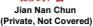</td></tr><tr><td>2026</td><td>May</td><td>Week 3: Moutai raised the RSP of select non-standard SKUs on i-Moutai APP effective May 16. The scope of price takes include 53% vol 500ml Moutai 15 years (Rmb4,198/bottle to Rmb4,278/bottle), Jingpin Moutai (Rmb2,298/bottle to Rmb2,359/bottle), Zodiac Moutai (Horse precious) (Rmb2,499/bottle to Rmb2,699/bottle) and 1L Moutai (Rmb2,989/bottle to Rmb3,119/bottle).</td><td></td><td></td><td></td><td></td><td></td></tr><tr><td>2026</td><td>Mar</td><td>Week 4: raised the ex-factory price of Feltian Moutai (53% vol, 500ml, 2026 edition) from Rmb1,169/bottle to c Rmb1,269 per bottle (mainly cover wholesale channels), and the RSP of Feltian Moutai from Rmb1,499 to Rmb1,539 (mainly cover direct sales channels, esp.+Moutai platform), effective immediately from Mar 31, 2026.</td><td></td><td></td><td></td><td></td><td></td></tr><tr><td>2026</td><td>Mar</td><td>Week 3: introduced a consignment sales policy for non-standard Moutai products: participating distributors must apply and pay a deposit and will receive a c.5% rebate on these products sales</td><td></td><td></td><td></td><td></td><td></td></tr><tr><td>2026</td><td>Jan</td><td>Week 3: plans to employ a more market-driven pricing framework to optimize channel investments and safeguard channel profitability, presented new RSP for Feltian Moutai vintage and other non-standard SKUs and lowered ex-factory price for some non-standard/series products</td><td></td><td></td><td></td><td></td><td></td></tr><tr><td>2025</td><td>Dec</td><td>Week 5: officially announced the launch of Feltian Moutai across 53% vol 500ml (years 2019-2026), 100ml/1,000ml Feltian, and multiple series on i-Moutai, including Jingpin, Zodiac, Vintage, Cultural, and lower-alcohol variants (Dec 30)</td><td>Week 2: nominal prepayment price for Common Wuliangye lowered to Rmb900 from Rmb1,019 for 2026 and distributor cost below c.Rmb850 (more rebate will be announced on 18 Dec)</td><td></td><td></td><td></td><td></td></tr><tr><td>2025</td><td>Nov</td><td>Week 4: New series of Moutai Prince (Black Gold) new version released</td><td></td><td></td><td></td><td></td><td></td></tr><tr><td>2025</td><td>Aug</td><td>W4: New version of Moutai 1935 was launched with suggested retail price set at Rmb998</td><td></td><td></td><td></td><td></td><td></td></tr><tr><td>2025</td><td>Jun</td><td>W3: Suspended the shipment of 53% 500ml Feltian Moutai for all channels; Implemented disciplinary measures to distributors including punishments against selling below RMB2,000/bottle and restrictions from shipping to certain retailers.</td><td></td><td></td><td></td><td></td><td></td></tr><tr><td>2025</td><td>Apr</td><td>W4: Updated bundled sales policy in self-operated specialty stores for registered enterprise and individual customers</td><td></td><td>W4: Suspended order taking and shipment until pre-Dragon Boat Festival for all SKUs</td><td></td><td></td><td></td></tr><tr><td>2025</td><td>Feb</td><td></td><td></td><td>W3: Suspended order taking and shipment of Tequ 60 and Old Touqu</td><td>W2: Suspended order taking for 6th Ocean Blue in Jiangsu; Suspended order taking for Guiju - Gold/Red in Henan since Feb 14</td><td>W2: Suspended shipment of Qinghua 20; Laobalfen 10</td><td></td></tr><tr><td>2025</td><td>Jan</td><td></td><td>W2: Suspended shipment of 6th Common Wuliangye since Jan 9</td><td></td><td>W3: Online Shipment suspension for Sky and Ocean Blue since Jan 17 2025</td><td></td><td></td></tr><tr><td>2024</td><td>Dec</td><td></td><td></td><td></td><td></td><td></td><td>W4: Launched Zodiac Spirits for the Snake year::at::RRSP of::Rmb1,299/bottle</td></tr><tr><td>2024</td><td>Nov</td><td>W1: Suspended shipment from distributors to retail terminals of all SKUs in some regions</td><td></td><td></td><td></td><td></td><td></td></tr><tr><td>2024</td><td>Aug</td><td></td><td></td><td></td><td></td><td>W4: Launched new super premium:products::&quot;Master&quot;:series on Aug 21</td><td></td></tr><tr><td>2024</td><td>Jul</td><td>W1: Suspended shipment of Moutai 1935 from Jul 2</td><td></td><td>W1: Hiked the within-quota price of 38C Guojiao 1573 by Rmb30 per bottle effective from Jul 2; Laojiao distribution company suspended order-taking and shipment of 52C Laojiao effective from Jul 3</td><td></td><td></td><td></td></tr><tr><td>2024</td><td>Jun</td><td>W1: Asked distributors to split prepayment to two times for June (3%-4% of annual); Suspended direct sales of Feltian to enterprises at Rmb1,499 in some regions and suspended evaluation of qualifying enterprises W2/W3: Ceased &quot;open case&quot; policy of Feltian::Moutai and distribution of Feltian in large cases; Controlled shipment quota for June; Suspended 375mi Feltian::on Xunfeng; Suspended shipments of 15-year and Jingpin: Moutai; Communicated with distributors to control wholesale prices above Rmb2,400; Requested supply suspension::on channels of::Guizhou distributors</td><td></td><td>W4: Ceased the order-taking and shipment of 38° Guojiao 1573 since Jun 28</td><td></td><td>W1: Hiked the ex-factory price of Laobalfen series by Rmb5/bottle, effective since Jun 20</td><td></td></tr><tr><td>2024</td><td>May</td><td></td><td>W2: Launched 45% common Wuliangye in 1st-batch 52 cities with ex-fi suggested retail price at Rmb8391,199</td><td></td><td></td><td></td><td></td></tr><tr><td>2024</td><td>Apr</td><td></td><td></td><td>W1: Hiked the outside quota price of Touqu by Rmb14 per bottle, effective immediately</td><td>W1: Hiked the ex-factory price of M6+ by Rmb20 per bottle, effective from::Apr 1st 2024</td><td></td><td></td></tr><tr><td>2024</td><td>Mar</td><td></td><td>W1: Launched new retail sales platform: hiked the Jianzhuang Large glass bottle ex-factory price by 12%</td><td></td><td></td><td></td><td></td></tr><tr><td>2024</td><td>Feb</td><td></td><td>W4: Guided the wholesale price of the 8th Common Wuliangye: and 1618 to not lower than Rmb970/bottle, retail price to not lower than::Rmb1,000 per bottle (&gt;Rmb1,020 in featured stores, &gt;Rmb1,059 in KA mail); targets to maintain the wholesale price of Common Wuliangye and 1618 at not lower than Rmb1,000/1,020 per bottle by Dragon Boat Festival/Mid-Autumn Festival</td><td></td><td></td><td>W4: The presale price of Qinghua 20 will be raised by Rmb20 to Rmb448 from Rmb428 per bottle, effective::on March 20::Some regional distributors also commented that the presale price of Laobalfen::is also to be raised by Rmb10 per bottle.</td><td></td></tr><tr><td>2024</td><td>Jan</td><td></td><td>W4: Wuliangye communicated with distributors to hike the ex-factory price by Rmb50 to Rmb1,019 for 8th Common Wuliangye starting from 5 Feb 2024, and prices of other SKUs with different size will increase accordingly</td><td></td><td></td><td></td><td></td></tr></table>

Source: Yunjiu Toutiao, Jiuyejia, Company reports, Data compiled by GS Global Investment Research

Exhibit 10: 2024-2025 channel policy and product launch summary of key spirits companies - Part II

<table><tr><td rowspan="3">Year</td><td rowspan="3">Month</td><td>(C345)</td><td>(0350)</td><td>(X22)</td><td>(Y70)</td><td>(8412)</td><td>(ZK3K)舍得酒业</td></tr><tr><td></td><td></td><td></td><td></td><td></td><td rowspan="2">Shede Spirits (600702.SS)Not Covered</td></tr><tr><td>Anhui Gujing (000596.SZ)</td><td>Sichuan Swellfun (600779.SS)</td><td>Jiugui Liquor (000799.SZ)</td><td>King&#x27;s Luck (603369.SS)</td><td>ZJLD (6979.HK)</td></tr><tr><td>2025</td><td>Feb</td><td colspan="2"></td><td>W3: Jiugui suspended order taking for 52°/42° 500ml Jiugui Spirits (transparent packaging)</td><td>W1: King&#x27;s Luck has ceased accepting orders for Guoyuan 4K/2K</td><td colspan="2"></td></tr><tr><td>2025</td><td>Jan</td><td colspan="6"></td></tr><tr><td>2024</td><td>Dec</td><td colspan="4"></td><td>W2: ZJLD launched fourth-gen Zhen 15</td><td></td></tr><tr><td>2024</td><td>Nov</td><td colspan="3"></td><td>W3: King&#x27;s Luck launched 3 new SKUs for PlanetLarge-bottle series named &quot;Grand moon&quot;/&quot;Grand Earth&quot;/&quot;Grand Sun&quot; (42%, 700ml) atRSP of Rmb168/388/268 per bottle.</td><td colspan="2"></td></tr><tr><td>2024</td><td>Oct</td><td></td><td>W1: Raised price of Zhenniang series 52° 500ml by Rmb10 per bottle, effective since Oct 1; W3: suspended order taking of Zhenniang No.8 38c/42c/52c</td><td colspan="4"></td></tr><tr><td>2024</td><td>Aug-Sep</td><td colspan="6"></td></tr><tr><td>2024</td><td>July</td><td></td><td>W2: Adjusted suggested retail prices for Zhenniang No.8: price of 52-degree SKU up by Rmb20 per bottle, and that of 42/38-degree up by Rmb10 per bottle toRmb578/538/528 respectively.effective since Jun 20</td><td colspan="2"></td><td>W1: Lidu hiked the ex-factory price of the Lidu Sorghum 1308 by Rmb100 per bottle and group-purchase price by Rmb200; hiked the Lidu King ex-factory by Rmb20/bottle and group puchase price by 30</td><td></td></tr><tr><td>2024</td><td>Apr-Jun</td><td colspan="6"></td></tr><tr><td>2024</td><td>Apr</td><td colspan="4"></td><td>W1:Hiked retail price of Yingshanhong products (online exclusive) by 13%W3: suspended supply of 2nd gen Li Du 1955/1975 until further notice</td><td>W2: Hiked the ex-factory price of 64.5C Tianzihu 500ml (Chen Flavor and Strong flavor) by 500Rmb/bottle, effective from Apr 15; halved the planned production volume of Tianzihu to 5,000 bottles effective from 2024</td></tr><tr><td>2024</td><td>Mar</td><td colspan="4"></td><td>W1: Lidu launched the 2nd Lidu Sorghum and hiked the price to Rmb1,230 per bottle</td><td>W1: Hiked ex-factory price of Tequ Jiaoling 20/30 by Rmb10/15 per bottle</td></tr><tr><td>2024</td><td>Feb</td><td colspan="3"></td><td>W4: King&#x27;s Luck ceased accepting orders for 4th-gen Guoyuan 4K, and offers 5th-gen Guoyaun 4K/2K/1K with Rmb20/10/8 per bottle higher vs. 4th-gen since March 1, 2024, and suggests to hike wholesale/retail/group buy price accordingly; Outside quota price to hike Rmb10/bottle</td><td colspan="2"></td></tr><tr><td>2024</td><td>Jan</td><td colspan="6"></td></tr></table>

Source: Yunjiu Toutiao, Jiuyejia, Data compiled by GS Global Investment Research

## Performance & Valuation

## Exhibit 11: Select Spirits names - 2026 YTD and weekly (Jun 5 \~ Jun 12) stock performance

Moutai (+1.5%) and Laobaigan (+0.9%) were relatively better price performers among China Spirits last week

YTD and Past Week Performance  
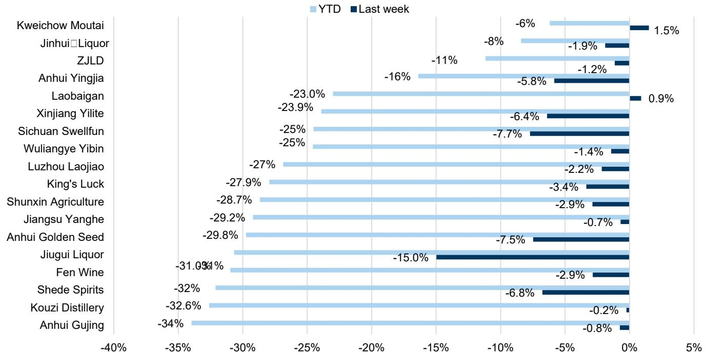

bar chart

| Company             | YTD    | Last week |
|---------------------|--------|-----------|
| Kweichow Moutai     | -6%    | 1.5%      |
| Jinhui□Liquor       | -8%    | -1.9%     |
| ZJLD                | -11%   | -1.2%     |
| Anhui Yingjia        | -16%   | -5.8%     |
| Laobaigan           | -23.0% | 0.9%      |
| Xinjiang Yilite     | -23.9% | -6.4%     |
| Sichuan Swellfun    | -25%   | -7.7%     |
| Wuliangye Yibin     | -25%   | -1.4%     |
| Luzhou Laojiao      | -27%   | -2.2%     |
| King's Luck         | -27.9% | -3.4%     |
| Shunxin Agriculture | -28.7% | -2.9%     |
| Jiangsu Yanghe      | -29.2% | -0.7%     |
| Anhui Golden Seed   | -29.8% | -7.5%     |
| Jiugui Liquor       | -31.0% | -15.0%    |
| Fen Wine            | -31.0% | -2.9%     |
| Shede Spirits       | -32%   | -6.8%     |
| Kouzi Distillery     | -32.6% | -0.2%     |
| Anhui Gujing        | -34%   | -0.8%     |

Priced as of Jun 12, 2026.  
Source: LSEG Data & Analytics, Data compiled by GS Global Investment Research

## Valuation table

Exhibit 12: China Spirits Comps

<table><tr><td rowspan="2"></td><td rowspan="2">Company</td><td rowspan="2">Rating</td><td rowspan="2">Mkt cap US$ mn</td><td rowspan="2">Ccy</td><td rowspan="2">Price 6/12/2026</td><td rowspan="2">12-m TP</td><td rowspan="2">+/-</td><td colspan="3">PE</td><td colspan="3">TP Implied PE</td><td colspan="3">EV/EBITDA</td><td>ROE</td><td rowspan="2">Div yield 2026E</td><td rowspan="2">YTD perf %</td></tr><tr><td>2026E</td><td>2027E</td><td>2028E</td><td>2026E</td><td>2027E</td><td>2028E</td><td>2026E</td><td>2027E</td><td>2028E</td><td>2026E</td></tr><tr><td colspan="20">Spirits</td></tr><tr><td>600519.SS</td><td>Kweichow Moutai</td><td>Buy</td><td>240,025</td><td>CNY</td><td>1291.91</td><td>1616.00</td><td>25%</td><td>19X</td><td>18X</td><td>n.a.</td><td>24X</td><td>22X</td><td>n.a.</td><td>13X</td><td>12X</td><td>n.a.</td><td>32%</td><td>4.0%</td><td>-6%</td></tr><tr><td>000858.SZ</td><td>Wuliangye Yibin</td><td>Sell</td><td>45,881</td><td>CNY</td><td>79.92</td><td>83.00</td><td>4%</td><td>18X</td><td>16X</td><td>14X</td><td>18X</td><td>16X</td><td>14X</td><td>10X</td><td>8X</td><td>7X</td><td>14%</td><td>6.3%</td><td>-25%</td></tr><tr><td>6979.HK</td><td>ZJLD</td><td>Neutral</td><td>3,065</td><td>HKD</td><td>7.71</td><td>7.20</td><td>-7%</td><td>27X</td><td>20X</td><td>15X</td><td>25X</td><td>18X</td><td>14X</td><td>12X</td><td>9X</td><td>7X</td><td>6%</td><td>1.7%</td><td>-11%</td></tr><tr><td>600809.SS</td><td>Shanxi Xinghuacun Fen Wine</td><td>Neutral</td><td>21,390</td><td>CNY</td><td>118.54</td><td>161.00</td><td>36%</td><td>13X</td><td>12X</td><td>11X</td><td>18X</td><td>17X</td><td>15X</td><td>9X</td><td>9X</td><td>8X</td><td>26%</td><td>4.7%</td><td>-31%</td></tr><tr><td>000568.SZ</td><td>Luzhou Laojiao</td><td>Neutral</td><td>18,504</td><td>CNY</td><td>85.00</td><td>98.00</td><td>15%</td><td>14X</td><td>13X</td><td>12X</td><td>16X</td><td>15X</td><td>13X</td><td>8X</td><td>7X</td><td>6X</td><td>18%</td><td>5.4%</td><td>-27%</td></tr><tr><td>002304.SZ</td><td>Jiangsu Yanghe</td><td>Sell</td><td>9,584</td><td>CNY</td><td>43.00</td><td>38.00</td><td>-12%</td><td>16X</td><td>15X</td><td>n.a.</td><td>15X</td><td>13X</td><td>n.a.</td><td>10X</td><td>10X</td><td>n.a.</td><td>8%</td><td>9.9%</td><td>-29%</td></tr><tr><td>000596.SZ</td><td>Anhui Gujing Distillery Co.</td><td>Sell</td><td>6,845</td><td>CNY</td><td>87.55</td><td>129.00</td><td>47%</td><td>12X</td><td>11X</td><td>n.a.</td><td>17X</td><td>16X</td><td>n.a.</td><td>7X</td><td>6X</td><td>n.a.</td><td>14%</td><td>5.0%</td><td>-34%</td></tr><tr><td>000799.SZ</td><td>Jiugui Liquor</td><td>Sell</td><td>1,818</td><td>CNY</td><td>37.84</td><td>18.30</td><td>-52%</td><td>n.m.</td><td>36X</td><td>n.a.</td><td>n.m.</td><td>18X</td><td>n.a.</td><td>n.m.</td><td>28X</td><td>n.a.</td><td>5%</td><td>0.9%</td><td>-31%</td></tr><tr><td>600779.SS</td><td>Sichuan Sweltun Co.</td><td>Sell</td><td>2,097</td><td>CNY</td><td>29.03</td><td>26.50</td><td>-9%</td><td>24X</td><td>19X</td><td>n.a.</td><td>22X</td><td>17X</td><td>n.a.</td><td>13X</td><td>10X</td><td>n.a.</td><td>10%</td><td>1.3%</td><td>-25%</td></tr><tr><td>603369.SS</td><td>Jiangsu King&#x27;s Luck Brewery</td><td>Neutral</td><td>4,650</td><td>CNY</td><td>25.06</td><td>39.00</td><td>56%</td><td>10X</td><td>10X</td><td>n.a.</td><td>16X</td><td>15X</td><td>n.a.</td><td>7X</td><td>6X</td><td>n.a.</td><td>17%</td><td>3.5%</td><td>-28%</td></tr></table>

Priced as of Jun 12, 2026.  
Source: GS Global Investment Research

## Valuation methodology and key risks

Exhibit 13: China Spirits coverage: Valuation methodology and key risks

<table><tr><td>Ticker</td><td>Company</td><td>Valuation Methodology</td><td>Key Risks</td></tr><tr><td>600519.SS</td><td>Kweichow Moutai</td><td>Our 12-m TP is based on 23.4x 2027E P/E discounted back to end-2026 using a 8.5% COE</td><td>Downside:1) Potential regulation changes such as a consumption tax rate hike; 2) Environmental pollution; 3) A□slower-than-expected macroeconomic recovery; 4) Capacity constraints;□5) More volatility in US rate hikes given the negative□correlation between Moutai&#x27;s P/E and the US 10-yr bond yield.</td></tr><tr><td>000858.SZ</td><td>Wuliangye Yibin</td><td>Our 12m TP is based on a 17x 2027E P/E discounted back to mid-2027E at a 7.8% COE.</td><td>Upside: 1) Successful new product roll out, esp. in mid-end price range; 2) Reduced competition in super-premium segment from Moutai/Laojiao. 3) Policy stimulus that will meaningfully drive demand recovery for high-end spirits; 4) More shareholder&#x27;s return enhancements.</td></tr><tr><td>6979.HK</td><td>ZJLD</td><td>Our 12-m TP is based on 19.3x 2027E P/E discounted back to end-2026 using an 8.2% COE. The PE multiple is benchmark to Jiugui liquor 2027E P/E.</td><td>Downside/Upside: 1) More/less□intensified competition in upper mid end; 2)□Shorter/prolonged policy impact on banquet consumption; 3) Better-than-expected product launch/cultivation</td></tr><tr><td>600809.SS</td><td>Shanxi Xinghuacun Fen Wine</td><td>Our 12-m TP is based on 18.5x 2027E P/E discounted back to end-2026 using an 9.7% COE</td><td>Upside/Downside: 1) Shorter/prolonged policy impact on banquet consumption; 2) Better/worse-than-expected macro recovery; 3) Strong/weaker than expected performance of Qinghua 26/30</td></tr><tr><td>000568.SZ</td><td>Luzhou Laojiao</td><td>Our 12-m TP is based on 15.7x 2027E P/E discounted back to end-2026E using an 8.3% COE.</td><td>Upside: 1) Shorter policy impact on banquet consumption; 2) Better-than-expected product launch/cultivationDownside: 1) Prolonged policy impact on banquet consumption; 2) Higher impact of wholesale price evolution to average selling price</td></tr><tr><td>603369.SS</td><td>Jiangsu King&#x27;s Luck Brewery</td><td>Our 12-m TP is based on 16.7x 2027E P/E discounted back to end-2026 using a 9.7% COE benchmark to Yanghe&#x27;s 2015-now P/E excl. Covid period</td><td>Upside: 1) Better-than-expected competitive landscape in Jiangsu province; 2) Stronger-than-expected management execution for national expansion; 3) Better product upgradeDownside: 1) More intensified competition/ worsened demand in Jiangsu; 2) Weaker distributors&#x27; confidence and channel inventory situation</td></tr><tr><td>000596.SZ</td><td>Anhui Gujing Distillery Co.</td><td>Our 12-m TP is based on 16.7x 2027E P/E discounted back to end-2026 using an 7.9% COE, the PE multiple is benchmark to Yanghe&#x27;s 2015-now P/E excl. Covid period</td><td>Upside: 1) Less/ shorter policy impact on banquet consumption in Anhui; 2) More resilient execution for nationwide expansion; 3) Less fierce competition in Anhui than expected</td></tr><tr><td>002304.SZ</td><td>Jiangsu Yanghe</td><td>Our 12-m TP is based on 14.0x 2027E P/E discounted back to end-2026 using a 7.8% COE, the Pe multiple is benchmark to Yanghe&#x27;s avg. fwd P/E in 2012-15 full anti-graft cycle</td><td>Upside: 1) Stronger-than-expected policy stimulus execution; 2) Better-than expected competitive landscape in Jiangsu province; 3) Stronger-than-expected performance outside Jiangsu province</td></tr><tr><td>000799.SZ</td><td>Jiugui Liquor Co.</td><td>Our 12-m TP is based on 19.3x 2027E P/E discounted back to end-2026 using a 9.7% COE</td><td>Upside: 1) Significant improvement on channel inventory level; 2)Stabilization of wholesale prices, especially Neican; 3) Better-than-expected commercial banquet demand recovery.</td></tr><tr><td>600779.SS</td><td>Sichuan Swellfun Co.</td><td>Our 12-m TP is based on 19.3x 2027E P/E discounted back to end-2026 using an 10.9% COE,the PE multiple is benchmark to Jiugui liquor 2027E P/E.</td><td>Upside: 1) Expansion of Diancang series, 2) Faster than expected penetration of Tianhaochen in the mass market, 3) Better than expected inventory digestion</td></tr></table>

Source: GS Global Investment Research

## Disclosure Appendix

## Reg AC

We, Leaf Liu, Christina Liu and Valerie Zhou, hereby certify that all of the views expressed in this report accurately reflect our personal views about the subject company or companies and its or their securities. We also certify that no part of our compensation was, is or will be, directly or indirectly, related to the specific recommendations or views expressed in this report.

Unless otherwise stated, the individuals listed on the cover page of this report are analysts in GS' Global Investment Research division.

Contributing Authors: Leaf Liu GS (Asia) L.L.C., Christina Liu GS (Asia) L.L.C., Valerie Zhou GS (Asia) L.L.C..

Unless otherwise stated, the individuals listed in the Contributing Authors disclosure of this report are analysts in GS' Global Investment Research division.

## GS Factor Profile

The GS Factor Profile provides investment context for a stock by comparing key attributes to the market (i.e. our universe of rated stocks) and its sector peers. The four key attributes depicted are: Growth, Financial Returns, Multiple (e.g. valuation) and Integrated (a composite of Growth, Financial Returns and Multiple). Growth, Financial Returns and Multiple are calculated by using normalized ranks for specific metrics for each stock. The normalized ranks for the metrics are then averaged and converted into percentiles for the relevant attribute. The precise calculation of each metric may vary depending on the fiscal year, industry and region, but the standard approach is as follows:

Growth is based on a stock's forward-looking sales growth, EBITDA growth and EPS growth (for financial stocks, only EPS and sales growth), with a higher percentile indicating a higher growth company. Financial Returns is based on a stock's forward-looking ROE, ROCE and CROCI (for financial stocks, only ROE), with a higher percentile indicating a company with higher financial returns. Multiple is based on a stock's forward-looking P/E, P/B, price/dividend (P/D), EV/EBITDA, EV/FCF and EV/Debt Adjusted Cash Flow (DACF) (for financial stocks, only P/E, P/B and P/D), with a higher percentile indicating a stock trading at a higher multiple. The Integrated percentile is calculated as the average of the Growth percentile, Financial Returns percentile and (100% - Multiple percentile).

Financial Returns and Multiple use the GS analyst forecasts at the fiscal year-end at least three quarters in the future. Growth uses inputs for the fiscal year at least seven quarters in the future compared with the year at least three quarters in the future (on a per-share basis for all metrics).

For a more detailed description of how we calculate the GS Factor Profile, please contact your GS representative.

## M&A Rank

Across our global coverage, we examine stocks using an M&A framework, considering both qualitative factors and quantitative factors (which may vary across sectors and regions) to incorporate the potential that certain companies could be acquired. We then assign a M&A rank as a means of scoring companies under our rated coverage from 1 to 3, with 1 representing high (30%-50%) probability of the company becoming an acquisition target, 2 representing medium (15%-30%) probability and 3 representing low (0%-15%) probability. For companies ranked 1 or 2, in line with our standard departmental guidelines we incorporate an M&A component into our target price. M&A rank of 3 is considered immaterial and therefore does not factor into our price target, and may or may not be discussed in research.

## Quantum

Quantum is GS' proprietary database providing access to detailed financial statement histories, forecasts and ratios. It can be used for in-depth analysis of a single company, or to make comparisons between companies in different sectors and markets.

## Disclosures

## Logo disclosure

Third party brands used in this report are the property of their respective owners, and are used here for informational purposes only. The use of such brands should not be viewed as an endorsement, affiliation or sponsorship by or for GS or any of its products/services.

The rating(s) for Anhui Gujing Distillery Co., Jiangsu King's Luck Brewery, Jiangsu Yanghe, Jiugui Liquor, Kweichow Moutai, Luzhou Laojiao, Shanxi Xinghuacun Fen Wine, Sichuan Swellfun Co., Wuliangye Yibin and ZJLD is/are relative to the other companies in its/their coverage universe: Anhui Gujing Distillery Co., Budweiser APAC, Busy Ming Group, China Feihe Ltd., China Resources Beer, China Resources Beverage, Chongqing Brewery, Eastroc Beverage (A), Foshan Haitian Flavouring & Food (A), Foshan Haitian Flavouring & Food (H), Fujian Wanchen Food, Jiangsu King's Luck Brewery, Jiangsu Yanghe, Jiugui Liquor, Jonjee Hi-Tech, Kweichow Moutai, Luzhou Laojiao, Mengniu Dairy, Nongfu Spring, Qianhe Condiment and Food, Shanghai Bairun, Shanxi Xinghuacun Fen Wine, Sichuan Swellfun Co., Sichuan Teway Food Group, Tingyi, Tsingtao Brewery (A), Tsingtao Brewery (H), Uni-President China, Wuliangye Yibin, Yihai International Holding, Yili Industrial, ZJLD

## Company-specific regulatory disclosures

Compendium report: please see disclosures at https://www.gs.com/research/hedge.html. Disclosures applicable to the companies included in this compendium can be found in the latest relevant published research

## Distribution of ratings/investment banking relationships

GS Investment Research global Equity coverage universe

<table><tr><td rowspan="2"></td><td colspan="3">Rating Distribution</td><td colspan="3">Investment Banking Relationships</td></tr><tr><td>Buy</td><td>Hold</td><td>Sell</td><td>Buy</td><td>Hold</td><td>Sell</td></tr><tr><td>Global</td><td>50%</td><td>34%</td><td>16%</td><td>65%</td><td>60%</td><td>45%</td></tr></table>

As of April 1, 2026, GS Global Investment Research had investment ratings on 3,074 equity securities. GS assigns stocks as Buys and Sells on various regional Investment Lists; stocks not so assigned are deemed Neutral. Such assignments equate to Buy, Hold and Sell for the purposes of the above disclosure required by the FINRA Rules. See ‘Ratings, Coverage universe and related definitions’ below. The Investment Banking Relationships chart reflects the percentage of subject companies within each rating category for whom GS has provided investment banking services within the previous twelve months.

## Price target and rating history chart(s)

Compendium report: please see disclosures at https://www.gs.com/research/hedge.html. Disclosures applicable to the companies included in this compendium can be found in the latest relevant published research

Target price history table(s)  
ZJLD (6979.HK)

<table><tr><td>Date of report</td><td>Target price (HK$)</td><td>Closing price (HK$)</td></tr><tr><td>05-Jun-26</td><td>7.20</td><td>7.80</td></tr><tr><td>12-Dec-25</td><td>7.00</td><td>7.90</td></tr><tr><td>15-Oct-25</td><td>7.70</td><td>9.52</td></tr><tr><td>09-Jul-25</td><td>6.00</td><td>6.39</td></tr><tr><td>23-Mar-25</td><td>8.08</td><td>7.44</td></tr><tr><td>16-Jan-25</td><td>8.20</td><td>6.67</td></tr><tr><td>10-Sep-24</td><td>10.40</td><td>6.42</td></tr><tr><td>22-Aug-24</td><td>12.90</td><td>7.10</td></tr><tr><td>26-Mar-24</td><td>13.80</td><td>10.90</td></tr><tr><td>31-Jan-24</td><td>12.50</td><td>7.88</td></tr><tr><td>25-Oct-23</td><td>13.20</td><td>11.40</td></tr><tr><td>21-Jul-23</td><td>14.40</td><td>7.85</td></tr></table>

Wuliangye Yibin (000858.SZ)

<table><tr><td>Date of report</td><td>Target price (Rmb)</td><td>Closing price (Rmb)</td></tr><tr><td>05-May-26</td><td>83.00</td><td>97.08</td></tr><tr><td>30-Oct-25</td><td>133.00</td><td>118.47</td></tr><tr><td>16-Sep-25</td><td>145.00</td><td>125.80</td></tr><tr><td>09-Jul-25</td><td>139.00</td><td>121.60</td></tr><tr><td>05-May-25</td><td>170.00</td><td>128.70</td></tr><tr><td>16-Jan-25</td><td>166.00</td><td>131.48</td></tr><tr><td>06-Nov-24</td><td>177.00</td><td>151.25</td></tr><tr><td>10-Sep-24</td><td>180.00</td><td>116.43</td></tr><tr><td>01-Aug-24</td><td>172.00</td><td>124.00</td></tr><tr><td>06-May-24</td><td>188.00</td><td>155.01</td></tr><tr><td>15-Apr-24</td><td>190.00</td><td>147.32</td></tr><tr><td>31-Jan-24</td><td>189.00</td><td>126.30</td></tr><tr><td>29-Oct-23</td><td>202.00</td><td>152.99</td></tr><tr><td>27-Aug-23</td><td>200.00</td><td>161.55</td></tr><tr><td>21-Jul-23</td><td>212.00</td><td>171.27</td></tr></table>

Kweichow Moutai (600519.SS)

<table><tr><td>Date of report</td><td>Target price (Rmb)</td><td>Closing price (Rmb)</td></tr><tr><td>25-Apr-26</td><td>1,616.00</td><td>1,458.49</td></tr><tr><td>30-Mar-26</td><td>1,592.00</td><td>1,420.00</td></tr><tr><td>13-Jan-26</td><td>1,553.00</td><td>1,411.00</td></tr><tr><td>29-Oct-25</td><td>1,691.00</td><td>1,431.90</td></tr><tr><td>16-Sep-25</td><td>1,724.00</td><td>1,499.98</td></tr><tr><td>12-Aug-25</td><td>1,742.00</td><td>1,437.04</td></tr><tr><td>09-Jul-25</td><td>1,782.00</td><td>1,418.88</td></tr><tr><td>16-Jan-25</td><td>2,017.00</td><td>1,446.38</td></tr><tr><td>06-Nov-24</td><td>1,990.00</td><td>1,571.00</td></tr><tr><td>06-Oct-24</td><td>2,051.00</td><td>1,748.00</td></tr><tr><td>10-Sep-24</td><td>1,811.00</td><td>1,378.00</td></tr><tr><td>01-Aug-24</td><td>2,098.00</td><td>1,386.16</td></tr><tr><td>05-Apr-24</td><td>2,244.00</td><td>1,715.11</td></tr><tr><td>31-Jan-24</td><td>2,202.00</td><td>1,604.91</td></tr><tr><td>31-Oct-23</td><td>2,211.00</td><td>1,684.58</td></tr><tr><td>22-Oct-23</td><td>2,133.00</td><td>1,645.00</td></tr><tr><td>02-Aug-23</td><td>2,217.00</td><td>1,880.00</td></tr><tr><td>21-Jul-23</td><td>2,212.00</td><td>1,771.30</td></tr></table>

Luzhou Laojiao (000568.SZ)

<table><tr><td>Date of report</td><td>Target price (Rmb)</td><td>Closing price (Rmb)</td></tr><tr><td>04-May-26</td><td>98.00</td><td>100.10</td></tr><tr><td>16-Sep-25</td><td>119.00</td><td>138.45</td></tr><tr><td>01-Sep-25</td><td>108.00</td><td>135.85</td></tr><tr><td>09-Jul-25</td><td>107.00</td><td>114.36</td></tr><tr><td>30-Apr-25</td><td>150.00</td><td>123.74</td></tr><tr><td>15-Mar-25</td><td>151.00</td><td>143.61</td></tr><tr><td>16-Jan-25</td><td>152.00</td><td>117.99</td></tr><tr><td>03-Nov-24</td><td>162.00</td><td>136.53</td></tr><tr><td>14-Oct-24</td><td>170.00</td><td>141.20</td></tr><tr><td>10-Sep-24</td><td>183.00</td><td>107.19</td></tr><tr><td>01-Aug-24</td><td>242.00</td><td>124.79</td></tr><tr><td>28-Apr-24</td><td>260.00</td><td>186.42</td></tr><tr><td>15-Apr-24</td><td>259.00</td><td>180.94</td></tr><tr><td>31-Jan-24</td><td>258.00</td><td>146.80</td></tr><tr><td>01-Sep-23</td><td>284.00</td><td>237.80</td></tr><tr><td>21-Jul-23</td><td>271.00</td><td>226.95</td></tr></table>

Sichuan Swellfun Co. (600779.SS)

<table><tr><td>Date of report</td><td>Target price (Rmb)</td><td>Closing price (Rmb)</td></tr><tr><td>21-Jan-26</td><td>26.50</td><td>38.93</td></tr><tr><td>12-Dec-25</td><td>28.90</td><td>37.20</td></tr><tr><td>16-Sep-25</td><td>33.80</td><td>46.20</td></tr><tr><td>09-Jul-25</td><td>30.70</td><td>42.05</td></tr><tr><td>05-May-25</td><td>32.80</td><td>45.55</td></tr><tr><td>15-Mar-25</td><td>33.30</td><td>53.32</td></tr><tr><td>16-Jan-25</td><td>33.70</td><td>47.39</td></tr><tr><td>06-Nov-24</td><td>36.30</td><td>50.53</td></tr><tr><td>10-Sep-24</td><td>32.60</td><td>32.41</td></tr><tr><td>29-Jul-24</td><td>38.80</td><td>36.41</td></tr><tr><td>28-Apr-24</td><td>42.00</td><td>46.17</td></tr><tr><td>15-Apr-24</td><td>43.00</td><td>44.05</td></tr><tr><td>31-Jan-24</td><td>46.00</td><td>47.73</td></tr><tr><td>15-Oct-23</td><td>50.60</td><td>58.78</td></tr><tr><td>21-Jul-23</td><td>52.00</td><td>64.43</td></tr></table>

Jiangsu King's Luck Brewery (603369.SS)

<table><tr><td>Date of report</td><td>Target price (Rmb)</td><td>Closing price (Rmb)</td></tr><tr><td>12-Dec-25</td><td>39.00</td><td>34.89</td></tr><tr><td>16-Sep-25</td><td>42.00</td><td>42.16</td></tr><tr><td>09-Jul-25</td><td>38.00</td><td>38.90</td></tr><tr><td>05-May-25</td><td>41.00</td><td>47.40</td></tr><tr><td>16-Apr-25</td><td>43.50</td><td>50.95</td></tr><tr><td>16-Jan-25</td><td>44.50</td><td>43.84</td></tr><tr><td>06-Nov-24</td><td>38.80</td><td>45.27</td></tr><tr><td>10-Sep-24</td><td>40.50</td><td>38.12</td></tr><tr><td>26-Aug-24</td><td>42.40</td><td>38.06</td></tr><tr><td>01-Aug-24</td><td>45.40</td><td>43.11</td></tr><tr><td>06-May-24</td><td>46.30</td><td>56.98</td></tr><tr><td>15-Apr-24</td><td>46.40</td><td>56.91</td></tr><tr><td>31-Jan-24</td><td>45.00</td><td>44.21</td></tr><tr><td>14-Nov-23</td><td>53.00</td><td>54.06</td></tr><tr><td>21-Sep-23</td><td>51.00</td><td>59.40</td></tr></table>

Sichuan Swellfun Co. (600779.SS)

<table><tr><td>Date of report</td><td>Target price (Rmb)</td><td>Closing price (Rmb)</td></tr></table>

Jiangsu King's Luck Brewery (603369.SS)

<table><tr><td>Date of report</td><td>Target price (Rmb)</td><td>Closing price (Rmb)</td></tr><tr><td>21-Jul-23</td><td>47.00</td><td>56.06</td></tr></table>

Jiugui Liquor (000799.SZ)

<table><tr><td>Date of report</td><td>Target price (Rmb)</td><td>Closing price (Rmb)</td></tr><tr><td>12-Dec-25</td><td>18.30</td><td>55.74</td></tr><tr><td>16-Sep-25</td><td>20.90</td><td>71.86</td></tr><tr><td>09-Jul-25</td><td>20.50</td><td>46.30</td></tr><tr><td>15-Mar-25</td><td>27.20</td><td>51.88</td></tr><tr><td>16-Jan-25</td><td>27.40</td><td>48.30</td></tr><tr><td>14-Oct-24</td><td>26.90</td><td>51.47</td></tr><tr><td>10-Sep-24</td><td>30.20</td><td>36.00</td></tr><tr><td>02-Sep-24</td><td>37.50</td><td>35.20</td></tr><tr><td>01-Aug-24</td><td>38.10</td><td>40.05</td></tr><tr><td>06-May-24</td><td>44.00</td><td>56.20</td></tr><tr><td>15-Apr-24</td><td>47.00</td><td>52.10</td></tr><tr><td>31-Jan-24</td><td>52.00</td><td>62.07</td></tr><tr><td>30-Oct-23</td><td>61.20</td><td>76.49</td></tr><tr><td>15-Oct-23</td><td>70.10</td><td>81.82</td></tr><tr><td>01-Sep-23</td><td>77.10</td><td>92.69</td></tr><tr><td>21-Jul-23</td><td>81.00</td><td>94.18</td></tr></table>

Jiangsu Yanghe (002304.SZ)

<table><tr><td>Date of report</td><td>Target price (Rmb)</td><td>Closing price (Rmb)</td></tr><tr><td>12-Dec-25</td><td>38.00</td><td>62.45</td></tr><tr><td>09-Jul-25</td><td>39.00</td><td>65.37</td></tr><tr><td>05-May-25</td><td>52.00</td><td>68.60</td></tr><tr><td>16-Jan-25</td><td>60.00</td><td>79.77</td></tr><tr><td>06-Nov-24</td><td>76.00</td><td>87.91</td></tr><tr><td>14-Oct-24</td><td>84.00</td><td>86.51</td></tr><tr><td>10-Sep-24</td><td>87.00</td><td>74.20</td></tr><tr><td>01-Aug-24</td><td>98.80</td><td>80.37</td></tr><tr><td>06-May-24</td><td>104.00</td><td>98.44</td></tr><tr><td>31-Jan-24</td><td>113.00</td><td>91.31</td></tr><tr><td>14-Nov-23</td><td>130.00</td><td>118.66</td></tr><tr><td>15-Oct-23</td><td>173.00</td><td>121.87</td></tr><tr><td>21-Jul-23</td><td>178.00</td><td>133.81</td></tr></table>

Shanxi Xinghuacun Fen Wine (600809.SS)

<table><tr><td>Date of report</td><td>Target price (Rmb)</td><td>Closing price (Rmb)</td></tr><tr><td>30-Apr-26</td><td>161.00</td><td>143.35</td></tr><tr><td>12-Dec-25</td><td>184.00</td><td>180.10</td></tr><tr><td>09-Jul-25</td><td>187.00</td><td>178.28</td></tr><tr><td>16-Apr-25</td><td>234.00</td><td>218.22</td></tr><tr><td>15-Mar-25</td><td>238.00</td><td>222.85</td></tr><tr><td>16-Jan-25</td><td>235.00</td><td>178.30</td></tr><tr><td>31-Oct-24</td><td>242.00</td><td>200.90</td></tr><tr><td>14-Oct-24</td><td>253.00</td><td>202.15</td></tr><tr><td>10-Sep-24</td><td>269.00</td><td>159.65</td></tr><tr><td>28-Aug-24</td><td>267.00</td><td>165.60</td></tr><tr><td>26-Apr-24</td><td>296.00</td><td>252.29</td></tr><tr><td>15-Apr-24</td><td>291.00</td><td>251.79</td></tr><tr><td>31-Jan-24</td><td>281.00</td><td>200.11</td></tr><tr><td>14-Nov-23</td><td>296.00</td><td>240.88</td></tr><tr><td>15-Oct-23</td><td>292.00</td><td>230.25</td></tr><tr><td>21-Sep-23</td><td>288.00</td><td>241.50</td></tr><tr><td>03-Sep-23</td><td>296.00</td><td>249.20</td></tr><tr><td>21-Jul-23</td><td>292.00</td><td>214.52</td></tr></table>

Anhui Gujing Distillery Co. (000596.SZ)

<table><tr><td>Date of report</td><td>Target price (Rmb)</td><td>Closing price (Rmb)</td></tr><tr><td>12-Dec-25</td><td>129.00</td><td>145.47</td></tr><tr><td>16-Sep-25</td><td>140.00</td><td>168.58</td></tr><tr><td>09-Jul-25</td><td>123.00</td><td>137.29</td></tr><tr><td>05-May-25</td><td>183.00</td><td>164.39</td></tr><tr><td>08-Apr-25</td><td>184.00</td><td>172.08</td></tr><tr><td>16-Jan-25</td><td>183.00</td><td>172.35</td></tr><tr><td>06-Nov-24</td><td>190.00</td><td>199.50</td></tr><tr><td>14-Oct-24</td><td>193.00</td><td>199.00</td></tr><tr><td>10-Sep-24</td><td>196.00</td><td>158.35</td></tr><tr><td>01-Aug-24</td><td>309.00</td><td>179.43</td></tr><tr><td>06-May-24</td><td>319.00</td><td>279.12</td></tr><tr><td>15-Apr-24</td><td>320.00</td><td>262.65</td></tr><tr><td>31-Jan-24</td><td>318.00</td><td>199.12</td></tr><tr><td>14-Nov-23</td><td>305.00</td><td>261.35</td></tr><tr><td>21-Sep-23</td><td>300.00</td><td>272.32</td></tr><tr><td>21-Jul-23</td><td>279.00</td><td>252.83</td></tr></table>

Price targets shown in table(s) are unadjusted for corporate actions.

## Regulatory disclosures

## Disclosures required by United States laws and regulations

See company-specific regulatory disclosures above for any of the following disclosures required as to companies referred to in this report: manager or co-manager in a pending transaction; 1% or other ownership; compensation for certain services; types of client relationships; managed/co-managed public offerings in prior periods; directorships; for equity securities, market making and/or specialist role. GS trades or may trade as a principal in debt securities (or in related derivatives) of issuers discussed in this report.

The following are additional required disclosures: Ownership and material conflicts of interest: GS policy prohibits its analysts, professionals reporting to analysts and members of their households from owning securities of any company in the analyst's area of coverage. Analyst compensation: Analysts are paid in part based on the profitability of GS, which includes investment banking revenues. Analyst as officer or director: GS policy generally prohibits its analysts, persons reporting to analysts or members of their households from serving as an officer, director or advisor of any company in the analyst's area of coverage. Non-U.S. Analysts: Non-U.S. analysts may not be associated persons of GS & Co. LLC and therefore may not be subject to FINRA Rule 2241 or FINRA Rule 2242 restrictions on communications with a subject company, public appearances and trading in securities covered by the analysts.

Distribution of ratings: See the distribution of ratings disclosure above. Price chart: See the price chart, with changes of ratings and price targets in prior periods, above, or, if electronic format or if with respect to multiple companies which are the subject of this report, on the GS website at https://www.gs.com/research/hedge.html.

## Additional disclosures required under the laws and regulations of jurisdictions other than the United States

The following disclosures are those required by the jurisdiction indicated, except to the extent already made above pursuant to United States laws and regulations. Australia: GS Australia Pty Ltd and its affiliates are not authorised deposit-taking institutions (as that term is defined in the Banking Act 1959 (Cth)) in Australia and do not provide banking services, nor carry on a banking business, in Australia. This research, and any access to it, is intended only for “wholesale clients” within the meaning of the Australian Corporations Act, unless otherwise agreed by GS. In producing research reports, members of Global Investment Research of GS Australia may attend site visits and other meetings hosted by the companies and other entities which are the subject of its research reports. In some instances the costs of such site visits or meetings may be met in part or in whole by the issuers concerned if GS Australia considers it is appropriate and reasonable in the specific circumstances relating to the site visit or meeting. To the extent that the contents of this document contains any financial product advice, it is general advice only and has been prepared by GS without taking into account a client’s objectives, financial situation or needs. A client should, before acting on any such advice, consider the appropriateness of the advice having regard to the client’s own objectives, financial situation and needs. A copy of certain GS Australia and New Zealand disclosure of interests and a copy of GS’ Australian Sell-Side Research Independence Policy Statement are available at: https://www.goldmansachs.com/disclosures/australia-new-zealand/index.html. Brazil: Disclosure information in relation to CVM Resolution n. 20 is available at https://www.gs.com/worldwide/brazil/area/gir/index.html. Where applicable, the Brazil-registered analyst primarily responsible for the content of this research report, as defined in Article 20 of CVM Resolution n. 20, is the first author named at the beginning of this report, unless indicated otherwise at the end of the text. Canada: This information is being provided to you for information purposes only and is not, and under no circumstances should be construed as, an advertisement, offering or solicitation by GS & Co. LLC for purchasers of securities in Canada to trade in any Canadian security. GS & Co. LLC is not registered as a dealer in any jurisdiction in Canada under applicable Canadian securities laws and generally is not permitted to trade in Canadian securities and may be prohibited from selling certain securities and products in certain jurisdictions in Canada. If you wish to trade in any Canadian securities or other products in Canada please contact GS Canada Inc., an affiliate of The GS Group Inc., or another registered Canadian dealer. Hong Kong: Further information on the securities of covered companies referred to in this research may be obtained on request from GS (Asia) L.L.C. India: Further information on the subject company or companies referred to in this research may be obtained from GS (India) Securities Private Limited, Research Analyst - SEBI Registration Number INH000001493, 10th Floor, Ascent-Worli, Sudam Kalu Ahire Marg, Worli, Mumbai-400 025, India, Corporate Identity Number U74140MH2006FTC160634, Phone +91 22 6616 9000, Fax +91 22 6616 9001. GS may beneficially own 1% or more of the securities (as such term is defined in clause 2 (h) the Indian Securities Contracts (Regulation) Act, 1956) of the subject company or companies referred to in this research report. Investment in securities market are subject to market risks. Read all the related documents carefully before investing. Registration granted by SEBI and certification from NISM in no way guarantee performance of the intermediary or provide any assurance of returns to investors. GS (India) Securities Private Limited compliance officer and investor grievance contact details can be found at: https://www.goldmansachs.com/worldwide/india/documents/Grievance-Redressal-and-Escalation-Matrix.pdf, and a copy of the annual audit compliance report can be found at this link: https://publishing.gs.com/content/site/india-annual-compliance-report.html. Japan: See below. Korea: This research, and any access to it, is intended only for “professional investors” within the meaning of the Financial Services and Capital Markets Act, unless otherwise agreed by GS. Further information on the subject company or companies referred to in this research may be obtained from GS (Asia) L.L.C., Seoul Branch. New Zealand: GS New Zealand Limited and its affiliates are neither “registered banks” nor “deposit takers” (as defined in the Reserve Bank of New Zealand Act 1989) in New Zealand. This research, and any access to it, is intended for “wholesale clients” (as defined in the Financial Advisers Act 2008) unless otherwise agreed by GS. A copy of certain GS Australia and New Zealand disclosure of interests is available at: https://www.goldmansachs.com/disclosures/australia-new-zealand/index.html. Russia: Research reports distributed in the Russian Federation are not advertising as defined in the Russian legislation, but are information and analysis not having product promotion as their main purpose and do not provide appraisal within the meaning of the Russian legislation on appraisal activity. Research reports do not constitute a personalized investment recommendation as defined in Russian laws and regulations, are not addressed to a specific client, and are prepared without analyzing the financial circumstances, investment profiles or risk profiles of clients. GS assumes no responsibility for any investment decisions that may be taken by a client or any other person based on this research report. Singapore: GS (Singapore) Pte. (Company Number: 198602165W), which is regulated by the Monetary Authority of Singapore, accepts legal responsibility for this research, and should be contacted with respect to any matters arising from, or in connection with, this research. Taiwan: This material is for reference only and must not be reprinted without permission. Investors should carefully consider their own investment risk. Investment results are the responsibility of the individual investor. United Kingdom: Persons who would be categorized as retail clients in the United Kingdom, as such term is defined in the rules of the Financial Conduct Authority, should read this research in conjunction with prior GS on the covered companies referred to herein and should refer to the risk warnings that have been sent to them by GS International. A copy of these risks warnings, and a glossary of certain financial terms used in this report, are available from GS International on request.

European Union and United Kingdom: Disclosure information in relation to Article 6 (2) of the European Commission Delegated Regulation (EU) (2016/958) supplementing Regulation (EU) No 596/2014 of the European Parliament and of the Council (including as that Delegated Regulation is implemented into United Kingdom domestic law and regulation following the United Kingdom's departure from the European Union and the European Economic Area) with regard to regulatory technical standards for the technical arrangements for objective presentation of investment recommendations or other information recommending or suggesting an investment strategy and for disclosure of particular interests or indications of conflicts of interest is available at https://www.gs.com/disclosures/europeanpolicy.html which states the European Policy for Managing Conflicts of Interest in Connection with Investment Research.

Japan: GS Japan Co., Ltd. is a Financial Instrument Dealer registered with the Kanto Financial Bureau under registration number Kinsho 69, and a member of Japan Securities Dealers Association, Financial Futures Association of Japan Type II Financial Instruments Firms Association, and Investment Management Association of Japan. Sales and purchase of equities are subject to commission pre-determined with clients plus consumption tax. See company-specific disclosures as to any applicable disclosures required by Japanese stock exchanges, the Japanese Securities Dealers Association or the Japanese Securities Finance Company.

## Ratings, coverage universe and related definitions

Buy (B), Neutral (N), Sell (S) Analysts recommend stocks as Buys or Sells for inclusion on various regional Investment Lists. Being assigned a Buy or Sell on an Investment List is determined by a stock's total return potential relative to its coverage universe. Any stock not assigned as a Buy or a Sell on an Investment List with an active rating (i.e., a stock that is not Rating Suspended, Not Rated, Early-Stage Biotech, Coverage Suspended or Not Covered), is deemed Neutral. Each region manages Regional Conviction Lists, which are selected from Buy rated stocks on the respective region's Investment Lists and represent investment recommendations focused on the size of the total return potential and/or the likelihood of the realization of the return across their respective areas of coverage. The addition or removal of stocks from such Conviction Lists are managed by the Investment Review Committee or other designated committee in each respective region and do not represent a change in the analysts' investment rating for such stocks.

Total return potential represents the upside or downside differential between the current share price and the price target, including all paid or anticipated dividends, expected during the time horizon associated with the price target. Price targets are required for all covered stocks. The total return potential, price target and associated time horizon are stated in each report adding or reiterating an Investment List membership.

Coverage Universe: A list of all stocks in each coverage universe is available by primary analyst, stock and coverage universe at https://www.gs.com/research/hedge.html.

Not Rated (NR). The investment rating, target price and earnings estimates (where relevant) are removed pursuant to GS policy when

GS is acting in an advisory capacity in a merger or in a strategic transaction involving this company, when there are legal, regulatory or policy constraints due to GS' involvement in a transaction, and in certain other circumstances. Early-Stage Biotech (ES). An investment rating and a target price are not assigned pursuant to GS policy when this company has neither a drug, treatment or medical device that has passed a Phase II clinical trial nor a license to distribute a post-Phase II drug, treatment or medical device. Rating Suspended (RS). GS has suspended the investment rating and price target for this stock, because there is not a sufficient fundamental basis for determining an investment rating or target price. The previous investment rating and target price, if any, are no longer in effect for this stock and should not be relied upon. Coverage Suspended (CS). GS has suspended coverage of this company. Not Covered (NC). GS does not cover this company.

## Global product; distributing entities

GS Global Investment Research produces and distributes research products for clients of GS on a global basis. Analysts based in GS offices around the world produce research on industries and companies, and research on macroeconomics, currencies, commodities and portfolio strategy. This research is disseminated in Australia by GS Australia Pty Ltd (ABN 21 006 797 897); in Brazil by GS do Brasil Corretora de Títulos e Valores Mobiliários S.A.; Public Communication Channel GS Brazil: 0800 727 5764 and / or contatogoldmanbrasil@gs.com. Available Weekdays (except holidays), from 9am to 6pm. Canal de Comunicação com o Público GS Brasil: 0800 727 5764 e/ou contatogoldmanbrasil@gs.com. Horário de funcionamento: segunda-feira à sexta-feira (exceto feriados), das 9h às 18h; in Canada by GS & Co. LLC; in Hong Kong by GS (Asia) L.L.C.; in India by GS (India) Securities Private Ltd.; in Japan by GS Japan Co., Ltd.; in the Republic of Korea by GS (Asia) L.L.C., Seoul Branch; in New Zealand by GS New Zealand Limited; in Russia by OOO GS; in Singapore by GS (Singapore) Pte. (Company Number: 198602165W); and in the United States of America by GS & Co. LLC. GS International has approved this research in connection with its distribution in the United Kingdom.

GS International (“GSI”), authorised by the Prudential Regulation Authority (“PRA”) and regulated by the Financial Conduct Authority (“FCA”) and the PRA, has approved this research in connection with its distribution in the United Kingdom.

European Economic Area: GS Bank Europe SE (“GSBE”) is a credit institution incorporated in Germany and, within the Single Supervisory Mechanism, subject to direct prudential supervision by the European Central Bank and in other respects supervised by German Federal Financial Supervisory Authority (Bundesanstalt für Finanzdienstleistungsaufsicht, BaFin) and Deutsche Bundesbank and disseminates research within the European Economic Area.

## General disclosures

This research is for our clients only. Other than disclosures relating to GS, this research is based on current public information that we consider reliable, but we do not represent it is accurate or complete, and it should not be relied on as such. The information, opinions, estimates and forecasts contained herein are as of the date hereof and are subject to change without prior notification. We seek to update our research as appropriate, but various regulations may prevent us from doing so. Other than certain industry reports published on a periodic basis, the large majority of reports are published at irregular intervals as appropriate in the analyst's judgment.

GS conducts a global full-service, integrated investment banking, investment management, and brokerage business. We have investment banking and other business relationships with a substantial percentage of the companies covered by Global Investment Research. GS & Co. LLC, the United States broker dealer, is a member of SIPC (https://www.sipc.org).

Our salespeople, traders, and other professionals may provide oral or written market commentary or trading strategies to our clients and principal trading desks that reflect opinions that are contrary to the opinions expressed in this research. Our asset management area, principal trading desks and investing businesses may make investment decisions that are inconsistent with the recommendations or views expressed in this research.

The analysts named in this report may have from time to time discussed with our clients, including GS salespersons and traders, or may discuss in this report, trading strategies that reference catalysts or events that may have a near-term impact on the market price of the equity securities discussed in this report, which impact may be directionally counter to the analyst's published price target expectations for such stocks. Any such trading strategies are distinct from and do not affect the analyst's fundamental equity rating for such stocks, which rating reflects a stock's return potential relative to its coverage universe as described herein.

We and our affiliates, officers, directors, and employees will from time to time have long or short positions in, act as principal in, and buy or sell, the securities or derivatives, if any, referred to in this research, unless otherwise prohibited by regulation or GS policy.

The views attributed to third party presenters at GS arranged conferences, including individuals from other parts of GS, do not necessarily reflect those of Global Investment Research and are not an official view of GS.

Any third party referenced herein, including any salespeople, traders and other professionals or members of their household, may have positions in the products mentioned that are inconsistent with the views expressed by analysts named in this report.

This research is not an offer to sell or the solicitation of an offer to buy any security in any jurisdiction where such an offer or solicitation would be illegal. It does not constitute a personal recommendation or take into account the particular investment objectives, financial situations, or needs of individual clients. Clients should consider whether any advice or recommendation in this research is suitable for their particular circumstances and, if appropriate, seek professional advice, including tax advice. The price and value of investments referred to in this research and the income from them may fluctuate. Past performance is not a guide to future performance, future returns are not guaranteed, and a loss of original capital may occur. Fluctuations in exchange rates could have adverse effects on the value or price of, or income derived from, certain investments.

Certain transactions, including those involving futures, options, and other derivatives, give rise to substantial risk and are not suitable for all investors. Investors should review current options and futures disclosure documents which are available from GS sales representatives or at https://www.theocc.com/about/publications/character-risks.jsp and https://www.goldmansachs.com/disclosures/cftc\_fcm\_disclosures. Transaction costs may be significant in option strategies calling for multiple purchase and sales of options such as spreads. Supporting documentation will be supplied upon request.

Differing Levels of Service provided by Global Investment Research: The level and types of services provided to you by GS Global Investment Research may vary as compared to that provided to internal and other external clients of GS, depending on various factors including your individual preferences as to the frequency and manner of receiving communication, your risk profile and investment focus and perspective (e.g., marketwide, sector specific, long term, short term), the size and scope of your overall client relationship with GS, and legal and regulatory constraints. As an example, certain clients may request to receive notifications when research on specific securities is published, and certain clients may request that specific data underlying analysts' fundamental analysis available on our internal client websites be delivered to them electronically through data feeds or otherwise. No change to an analyst's fundamental research views (e.g., ratings, price targets, or material changes to earnings estimates for equity securities), will be communicated to any client prior to inclusion of such information in a research report broadly disseminated through electronic publication to our internal client websites or through other means, as necessary, to all clients who are entitled to receive such reports.

All research reports are disseminated and available to all clients simultaneously through electronic publication to our internal client websites. Not all research content is redistributed to our clients or available to third-party aggregators, nor is GS responsible for the redistribution of our research by third party aggregators. For research, models or other data related to one or more securities, markets or asset classes (including related services) that may be available to you, please contact your GS representative or go to https://research.gs.com.

Disclosure information is also available at https://www.gs.com/research/hedge.html or from Research Compliance, 200 West Street, New York, NY 10282.

## © 2026 GS.

You are permitted to store, display, analyze, modify, reformat, and print the information made available to you via this service only for your own use. You may not resell or reverse engineer this information to calculate or develop any index for disclosure and/or marketing or create any other derivative works or commercial product(s), data or offering(s) without the express written consent of GS. You are not permitted to publish, transmit, or otherwise reproduce this information, in whole or in part, in any format to any third party without the express written consent of GS. This foregoing restriction includes, without limitation, using, extracting, downloading or retrieving this information, in whole or in part, to train or finetune a machine learning or artificial intelligence system, or to provide or reproduce this information, in whole or in part, as a prompt or input to any such system.