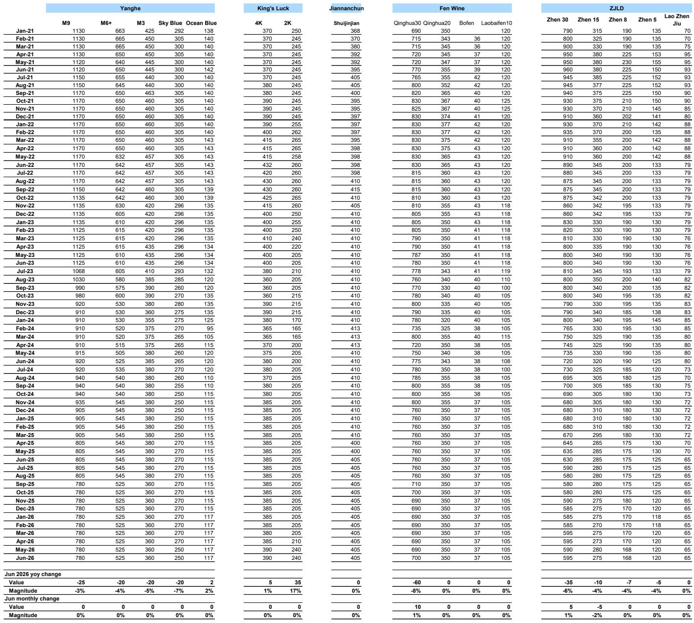
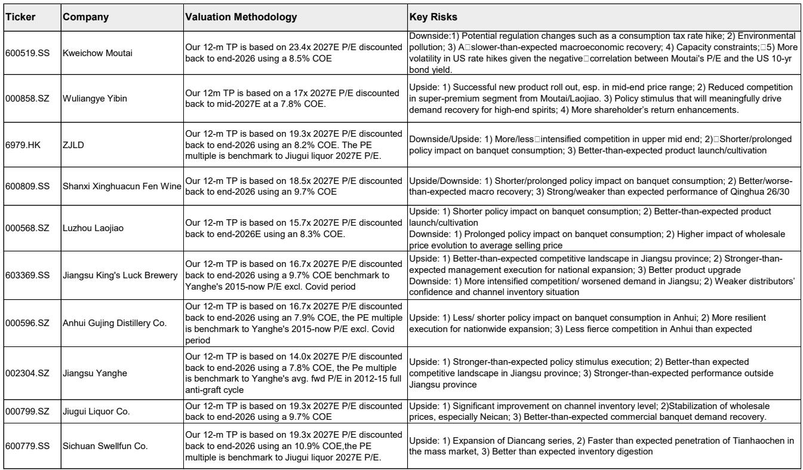

# China’s Premium Spirits Are Signaling a Deeper Structural Slowdown, Not Just a Weak Festival Cycle

The Dragon Boat Festival is approaching, and the data is already in. Distributor expectations for this year’s sell-through are materially weaker than they were just a few months ago. Despite a low base from 2025, when policy disruptions caused double-digit declines in premium spirits, the current outlook calls for only 10 to 20 percent retail growth for Moutai and Wuliangye — a sharp downgrade from the 20 to 30 percent that distributors had previously anticipated. This is not a normal seasonal dip. It is a signal that the demand floor for China’s most iconic liquor brands is shifting downward.

Channel checks reveal a muted pre-season environment. Brands have not launched aggressive stocking campaigns. Distributors are cautious, holding back on inventory commitments even as the festival window opens. The Dragon Boat Festival has historically been a smaller consumption event than the Mid-Autumn and National Day holidays, but its trajectory matters precisely because it is less distorted by year-end corporate gifting and banquet cycles. A weak Dragon Boat Festival tells us something about underlying household and SME consumption that the bigger holiday data may only confirm later.

Wholesale price trends reinforce this caution. Feitian Moutai’s wholesale price has been largely stable at around RMB 1,635 to 1,670 per bottle, with channel inventory below one month in East China. That sounds healthy, but stability in the flagship SKU masks a broader softening. Non-standard Moutai products — including the Zodiac series and the 1-liter bottle — have seen price declines, likely driven by rising volume on the i-Moutai direct-sales platform, which recorded 7.13 million transactions in the first five months of 2026. Meanwhile, Common Wuliangye and Guojiao 1573 remain stuck at or below RMB 840 per bottle, with Wuliangye’s wholesale price dipping to RMB 760 in one major wholesale market under 618 promotional pressure.

The conventional narrative — that premium Chinese spirits are a resilient, inflation-hedged asset class — is being tested. The data suggests that the sector is entering a phase where volume growth is increasingly hard to sustain without price concessions, and where brand power alone may no longer guarantee distributor enthusiasm.

## The i-Moutai Platform Is Reshaping Supply Dynamics and Creating a New Source of Price Pressure

The most consequential structural change in the Moutai ecosystem is the rapid scaling of the i-Moutai direct-sales app. Monthly active users reached 10.2 million in May 2026, up 4.4 percent year-on-year, and the platform has normalized at a level well above the 5 to 7 million MAU seen before Feitian Moutai was officially launched on the app. The DAU-to-MAU penetration ratio remains at 11 percent, suggesting that engagement is sticky but not yet saturated.

This matters for wholesale pricing because i-Moutai is effectively adding transparent, high-volume supply directly to consumers at official retail prices. The platform processed 7.13 million transactions in the first five months of 2026, compared to 3.98 million in the first quarter alone. That acceleration means a growing share of Moutai’s total volume is bypassing the traditional wholesale channel entirely. For distributors, this creates a structural overhang: if consumers can reliably source Feitian Moutai at official prices through the app, the premium they are willing to pay in the secondary wholesale market should narrow.

The data supports this logic. Non-standard SKU prices — particularly the Zodiac and 1-liter bottles — have weakened as i-Moutai volume has grown. These are the products most exposed to the platform’s expanding assortment. The implication is clear: Moutai’s direct-to-consumer push is not just a margin-enhancement strategy for the company. It is a deflationary force on wholesale pricing, especially for non-flagship SKUs. Investors who treat i-Moutai purely as a distribution success story are missing its second-order effect on channel economics.

## The Second-Tier Premium Brands Are Trapped Between Volume and Price

Wuliangye and Luzhou Laojiao’s Guojiao 1573 present a more acute version of the same problem. Both brands have seen wholesale prices stagnate or decline over the past year. Common Wuliangye is trading at RMB 840 per bottle according to one pricing source, and as low as RMB 760 in another, despite a suspension in shipments. Guojiao 1573 has been flat at RMB 840 for months.

These are brands with strong consumer recognition, but they lack Moutai’s scarcity premium and its direct-sales buffer. When demand softens, they have fewer tools to defend wholesale pricing without sacrificing volume. The result is a pricing trap: cutting wholesale prices risks destroying brand equity and distributor margins, but holding prices risks losing shelf space and market share to competitors or to private-label alternatives.

The management change at Wuliangye — with Deng Min proposed as the new chairman — adds an element of strategic uncertainty. New leadership often brings new channel policies, and in the current environment, any disruption to distributor relationships could further depress restocking appetite. The upcoming annual general meeting on June 26 will be closely watched for signals on pricing strategy, volume targets, and distributor incentives.

For investors, the key question is whether second-tier premium brands can sustain their pricing power without the kind of direct-to-consumer infrastructure that Moutai has built. The early evidence suggests they cannot, and the Dragon Boat Festival data is likely to reinforce that conclusion.

## The Report Leaves a Critical Question Unanswered: How Much of the Weakness Is Cyclical Versus Structural?

The research report provides granular data on wholesale prices, channel inventory, and distributor sentiment. It documents the weakness clearly. What it does not fully resolve is the nature of the demand decline. Is this a cyclical trough driven by policy hangover and a slow economic recovery? Or is it a structural shift in Chinese alcohol consumption patterns, driven by younger demographics, changing social norms, and the rise of alternative beverages?

The low base argument — that 2025 saw double-digit declines due to policy disruptions — implies that some recovery should be expected. But the fact that expectations have been revised downward from 20 to 30 percent growth to 10 to 20 percent suggests that the recovery is weaker than anticipated. That could mean the policy impact was deeper than initially estimated, or it could mean that underlying demand is structurally lower.

Consider the i-Moutai data in this context. If the platform is permanently shifting a portion of demand from wholesale to direct channels, then the wholesale price stability we see today may be masking a real decline in total addressable demand for the wholesale ecosystem. Distributors may be holding less inventory not because they are cautious about the festival, but because they have permanently lost market share to the app.

Similarly, the stagnation of Wuliangye and Guojiao 1573 prices could reflect a market that has found its equilibrium at a lower level. If consumers are trading down within the premium category, or substituting imported spirits and baijiu alternatives, then the current price levels may represent a new normal rather than a temporary trough.

The report does not provide enough data on consumption trends outside the wholesale channel — retail sell-through, e-commerce volume, or consumer surveys — to distinguish between these two interpretations. That is the analytical gap that investors need to fill themselves.

## A Decision Framework for Investors: Three Signals to Watch Beyond the Festival

Given the uncertainty, investors should focus on three observable signals that will distinguish between a cyclical pause and a structural downturn.

First, track i-Moutai transaction volume and MAU growth relative to wholesale price trends. If wholesale prices decline while i-Moutai volume continues to accelerate, that would confirm that the platform is cannibalizing distributor demand. If wholesale prices stabilize or rise despite continued platform growth, it would suggest that the direct channel is expanding the total market rather than just reallocating it.

Second, monitor Wuliangye’s post-AGM pricing and channel policy. A decision to cut wholesale prices aggressively would signal that management prioritizes volume over brand equity, which would be bearish for the entire second-tier premium segment. A decision to hold prices and accept lower volume would indicate confidence in long-term brand power but risk near-term market share loss.

Third, watch the Mid-Autumn and National Day holiday data in the second half of the year. The Dragon Boat Festival is a small indicator. The autumn holidays are the real test. If distributor sentiment does not improve by then, and if wholesale prices fail to firm, the cyclical argument becomes much harder to sustain.

These three signals form a simple but rigorous framework for navigating the current uncertainty. They avoid the trap of overinterpreting a single festival data point while providing clear thresholds for updating one’s thesis.

## The Full Report Contains the Charts and Data You Need to Build Your Own View

The data on wholesale prices, channel inventory, i-Moutai user trends, and distributor expectations is presented in a series of exhibits that allow for direct comparison across brands, SKUs, and time periods. The weekly momentum gauge and the wholesale price indicator provide a real-time snapshot of market conditions that is difficult to replicate without access to proprietary channel checks.

For serious investors, the value of the original report lies not just in its conclusions but in its data. The charts show month-by-month price trajectories for Moutai, Wuliangye, and Guojiao 1573 going back several years. They reveal the shape of the current downturn in a way that summary statistics cannot.

Join the community to read the full report and review the original charts.

*This article is for learning and discussion only and does not constitute investment advice.*

Personal reading notes and learning share only. Not investment advice.

