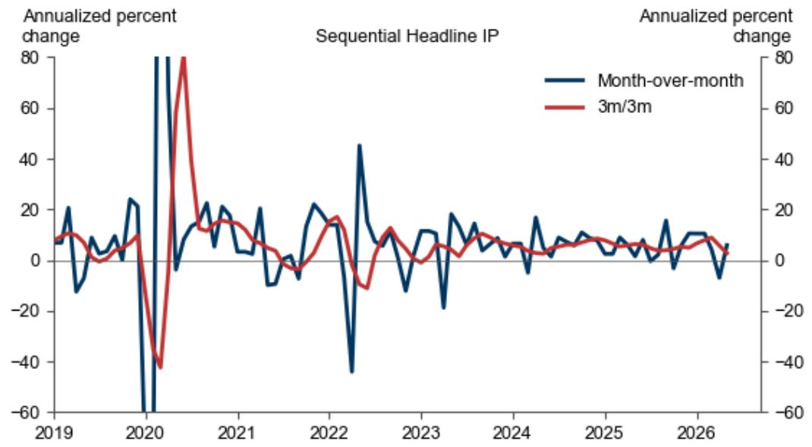
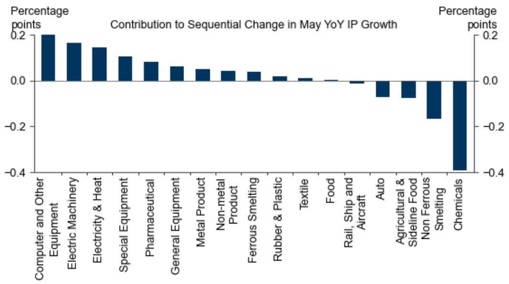
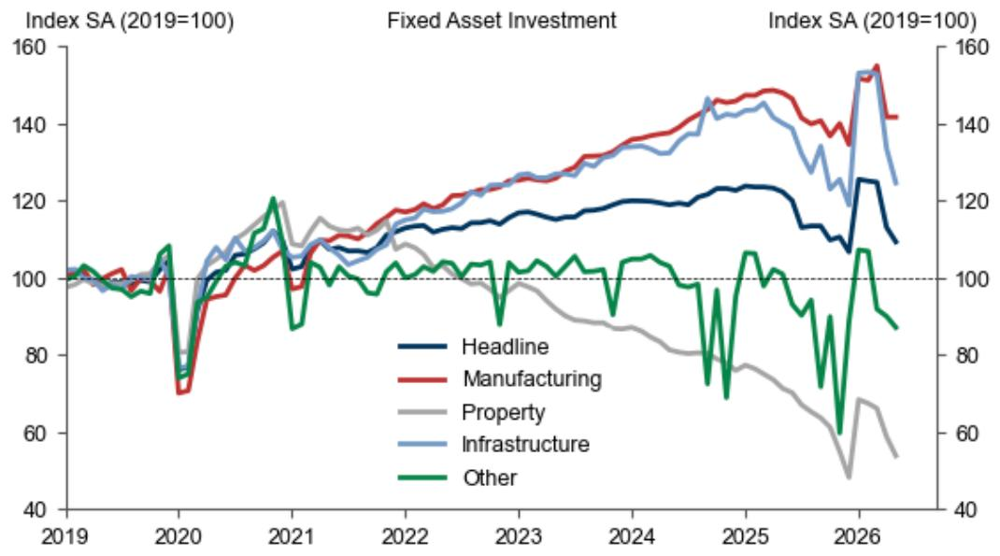
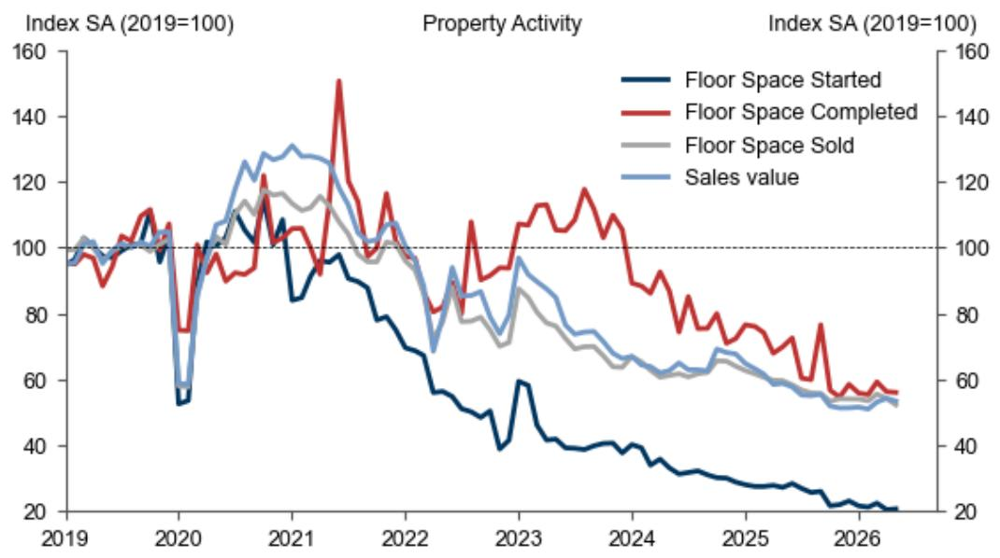
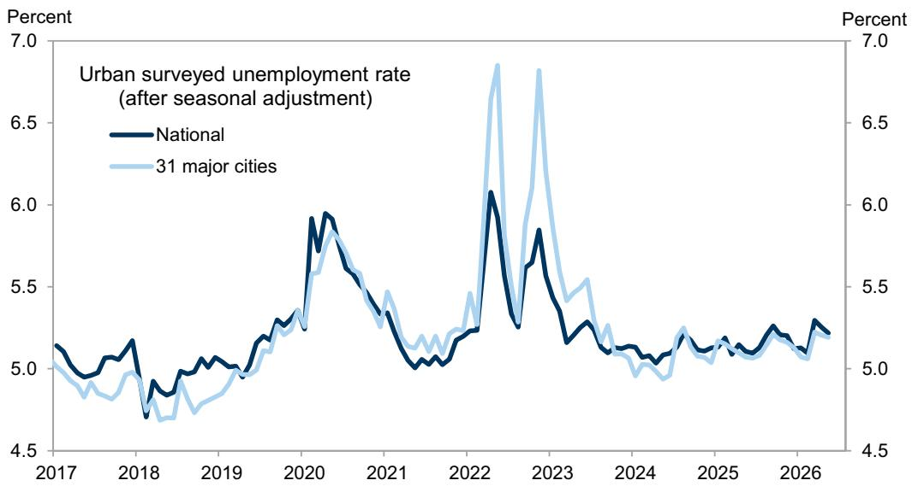

# China: May fixed asset investment and retail sales data missed market expectations

## Bottom line:

China’s May fixed asset investment and retail sales data missed market expectations, while industrial production was largely in line. Industrial production (IP) growth rose modestly to 4.5% yoy in May from 4.1% yoy in April thanks to stronger-than-expected exports, with faster output growth in computer and other equipment, electronic machinery, and utilities industries more than offsetting slower output growth in chemicals and non-ferrous metal smelting industries. On a single-month basis, fixed asset investment (FAI) growth fell further -10.6% yoy in May from -8.2% yoy in April, reflecting both adverse weather conditions and a still-slow pace of government bond issuance. Retail sales growth continued to slow in May, to -0.6% yoy from +0.2% yoy in April, the lowest since December 2022, partly due to last May’s high base. That said, the services industry output index growth – which is on a real basis and tracks tertiary (services) GDP growth closely – edged up to 4.4% yoy in May from 4.3% yoy in April, and we believe its widening gap with retail sales growth suggests that services consumption growth continued to outperform goods consumption growth. Weaker-than-expected April-May activity data pose a downside risk to our Q2 real GDP growth forecast (4.0% qoq sa annualized and 4.7% yoy currently), while the latest development in the Middle East and recent policy communications bode well for a sequential growth improvement in Q3, in our view.

## Asia-MAP scores:

Industrial production: 0 (5, 0)

Fixed asset investment: -10 (2, -5)

Retail sales: 0 (1, 0)

## Key numbers:

Industrial production (IP): +4.5% yoy in May (GS forecast: +4.3% yoy; Bloomberg consensus: +4.4% yoy), vs. +4.1% yoy in April. Note sequential figures are highly sensitive to the specific seasonal adjustment methodology (NBS estimates: +0.4% mom sa non-annualized in May, vs. +0.1% mom sa non-annualized in April; GS estimates: +0.2% mom sa non-annualized in May, vs. -1.1% mom sa non-annualized in April).

Fixed asset investment (FAI): -4.1% ytd yoy in May (GS: -3.1% ytd yoy; consensus: -2.3% ytd yoy), vs. -1.6% ytd yoy in April; May single-month by GS estimates: -10.6% yoy, vs. -8.2% yoy in April (sequential growth by GS estimates: -4.4% mom sa non-annualized in May, vs. -9.4% mom sa non-annualized in April).

Lisheng Wang

+852-3966-4004

lisheng.wang@gs.com

GS (Asia) L.L.C.

Retail sales: -0.6% yoy in May (GS: -0.6% yoy; consensus: -0.2% yoy), vs. +0.2% yoy in April (sequential growth by GS estimates: -0.4% mom sa non-annualized in May, vs. -1.0% mom sa non-annualized in April).

Services industry output index: +4.4% yoy in May, vs. +4.3% yoy in April (sequential growth by GS estimates: +0.4% mom sa non-annualized in May, vs. -0.2% mom sa non-annualized in April).

Surveyed unemployment rates:

Nationwide: 5.1% in May, vs. 5.2% in April.  
■ 31 major cities: 5.1% in May, vs. 5.2% in April.

Property-related activity data:

■ Floor space sold: -13.1% yoy in May, vs. -9.5% yoy in April (value of sales: -9.5% yoy in May, vs. -7.7% yoy in April).  
■ Floor area under construction: -12.3% yoy in May, vs. -12.1% yoy in April.  
■ New home starts: -24.6% yoy in May, vs. -26.6% yoy in April.  
■ New home completions: -19.9% yoy in May, vs. -18.8% yoy in April.  
Real estate investment: -24.3% yoy in May, vs. -20.1% yoy in April.

## Main points:

1. Industrial production (IP) growth rose modestly to 4.5% yoy from 4.1% yoy thanks to stronger-than-expected exports, although automobile output growth remained weak and the ongoing global energy shock continued to weigh on chemical-related manufacturing output. In sequential terms, IP gained 0.2% mom non-annualized in May based on our estimates (vs. -1.1% mom non-annualized in April; Exhibit 1). By industry, the April-to-May acceleration in year-on-year IP growth was led by faster output growth in computer & other equipment, electronic machinery, and utilities industries, more than offsetting slower output growth in chemicals and non-ferrous metal smelting industries (Exhibit 2). Among major industrial products (different from by-industry breakdown), year-on-year growth in industrial robot output, metal cutting machine output and power generation rose to +27.9%, +10.7% and +4.2%, respectively, in May from +15.1%, +7.5% and +2.6% in April, while automobile, computer and smartphone output growth in year-on-year terms slowed to -3.2%, -19.4% and -8.8%, respectively, from -2.6%, -9.3% and +4.7%. Year-on-year growth in chemical fiber and sulfuric acid output remained weak at -3.3% and -1.6%, respectively, in May (vs. -3.9% and -2.2% in April), owing to continued supply chain disruptions amid the Middle East conflict. Crude steel and cement output growth increased slightly to -2.7% yoy and -8.1% yoy, respectively, in May from -2.8% yoy and -10.8% yoy in April.

2. Fixed asset investment (FAI) growth fell further -10.6% yoy in May from -8.2% yoy in April on a single-month basis (Exhibit 3), reflecting both adverse weather conditions (e.g., heavy rainfall in southern and central China and a heatwave in northern China) and a still-slow pace of government bond issuance. This takes year-to-date FAI growth to -4.1% yoy in May (vs. -1.6% yoy in April). By sector, year-on-year growth in infrastructure, property and other investment (i.e., services and agriculture-related) fell to -11.2%, -24.3% and -13.2%, respectively, in May from -5.6%, -20.1% and -10.6% in

April, while manufacturing investment growth improved slightly to -4.1% yoy from -4.8% yoy. That said, we caution that the occasional NBS “statistical correction” of previously over-reported data may have exaggerated the volatility of reported FAI growth in recent quarters, as the year-on-year contraction in crude steel and cement output narrowed modestly in May.

3. Nominal retail sales growth continued to slow in May, to -0.6% yoy from +0.2% yoy in April, the lowest since December 2022 (during the Covid exit wave), with year-on-year growth in goods sales and restaurant sales revenue both weakening. Offline goods sales growth dropped to -2.4% yoy in May from -0.2% yoy in April, while online goods sales growth rose to +2.8% yoy from +0.1% yoy. Restaurant sales revenue growth slowed to 0.6% yoy in May from 2.2% yoy in April. Retail sales by enterprises above the designated size declined 4.9% yoy in May (vs. -4.4% yoy in April), much weaker than headline retail sales growth, suggesting large retailers have underperformed smaller ones in recent months. Among major products, year-on-year growth in home appliance and electronic equipment sales slowed further to -15.6% and +0.7%, respectively, in May from -15.1% and +6.2% in April on a high base last year, and year-on-year contraction in automobile sales widened to -16.1% from -15.3%. Gasoline and other oil products sales growth remained subdued at -3.2% yoy in May, despite a modest improvement from -6.5% yoy in April. Adjusting for price factors, we estimate gasoline and other oil product sales volume contracted by 13% yoy in May (vs. -17% yoy in March-April) amid an 11% yoy increase in domestic fuel prices, which implies a larger demand response than historical patterns would suggest, likely because alternatives such as non-fossil energy supply, rapid EV adoption, and urban public transportation are now more widely available than in earlier oil-price upcycles. In sequential terms, retail sales value declined by 0.4% mom sa non-annualized in May after seasonal adjustment, based on our estimates (vs. -1.0% mom sa non-annualized in April).

4. Year-on-year growth in the Services Industry Output Index – which is on a real basis and tracks tertiary GDP growth closely (58% of the Chinese economy as of 2025) – edged up to 4.4% in May from 4.3% in April. Its gap with retail sales growth widened further to 5.0pp in May from 4.1pp in April, suggesting that services consumption growth continued to outperform goods consumption growth. In sequential terms, we estimate the Services Industry Output Index gained 0.4% mom sa non-annualized in May (vs. -0.2% mom sa non-annualized in April).

5. Property activity data remained under pressure in May despite recent green shoots in large cities (Exhibit 4). Year-on-year growth in property sales registered -13.1% in volume (floor space) terms and -9.5% in value terms in May (vs. -9.5%/-7.7% in April). New home under construction and completions growth slowed to -12.3% yoy and -19.9% yoy, respectively in May from -12.1% yoy and -18.8% yoy in April. New home starts growth remained depressed at -24.6% yoy in May, despite a modest improvement from -26.6% yoy in April. NBS and private sector data both showed continued downward pressure on home prices in May, mainly in lower-tier cities.

6. Regarding the labor market, both the nationwide and 31-city unemployment rates (not seasonally adjusted) edged down to $5.1\%$ for May from $5.2\%$ for April. After seasonal adjustment, we estimate the nationwide unemployment rate inched down to $5.2\%$ in May from $5.3\%$ in April, and the 31-city metric remained flat at $5.2\%$ (Exhibit 5). The unemployment rate for migrant workers (without local Hukou) edged down to $4.9\%$ in May from $5.0\%$ in April after seasonal adjustment. Following the NBS definition

revisions (excluding students in schools) in January 2024, the release of youth unemployment rate data has been delayed by around three days vs. general labor market statistics. The latest data available suggests the unemployment rate of the 16-24 age group declined to 16.3% in April from 16.9% in March (vs. 15.8% in April 2025), while we caution that this indicator may have underestimated the labor market stress that younger generation is facing amid weak domestic demand and risks of AI adoption weighing on entry-level white-collar jobs, because of the definition change.

7. In our view, weaker-than-expected April-May activity data reflects the negative impact from the global energy-supply shock, adverse weather conditions and a lack of significant policy easing, and we see a downside risk to our Q2 real GDP growth forecast (4.0% qoq sa annualized and 4.7% yoy currently). However, the latest development in the Middle East and recent policy communications bode well for a sequential growth improvement in Q3, especially given the significant unused government bond quota left for the remainder of this year. We see July as an important window to monitor potential policy fine-tuning: if Q2 GDP disappoints meaningfully, there is a decent chance for policymakers to step up their easing rhetoric in the July Politburo meeting and draw on remaining fiscal buffers quickly to stabilize investment and growth.

## Lisheng Wang

Exhibit 1: Industrial production rose in month-on-month terms in May after seasonal adjustment  

line chart

| Year | Month-over-month | 3m/3m |
|------|------------------|-------|
| 2019 | ~10              | ~5    |
| 2020 | ~80              | ~80   |
| 2021 | ~20              | ~15   |
| 2022 | ~45              | ~10   |
| 2023 | ~15              | ~5    |
| 2024 | ~10              | ~5    |
| 2025 | ~5               | ~5    |
| 2026 | ~0               | ~5    |

Sequential IP growth numbers refer to GS estimates.  
Source: NBS, CEIC, GS Global Investment Research

Exhibit 2: April-to-May acceleration in year-on-year IP growth was led by computer & other equipment, electric machinery and utilities industries  

bar chart

| Category               | Percentage points |
| ---------------------- | ----------------- |
| Computer and Other     | 0.2               |
| Equipment              | 0.15              |
| Electric Machinery     | 0.1               |
| Electricity & Heat     | 0.08              |
| Special Equipment      | 0.06              |
| Pharmaceutical         | 0.05              |
| General Equipment      | 0.04              |
| Metal Product          | 0.03              |
| Non-metal Product       | 0.02              |
| Ferrous Smelting       | 0.01              |
| Rubber & Plastic       | 0.0               |
| Textile                | -0.01             |
| Food                   | -0.02             |
| Rail, Ship and Aircraft| -0.03             |
| Auto                   | -0.05             |
| Agricultural & Sideline Food | -0.07            |
| Non Ferrous Smelting   | -0.1              |
| Chemicals              | -0.4              |

Source: NBS, CEIC, GS Global Investment Research

Exhibit 3: FAI growth declined further in May  

line chart

| Year | Headline | Manufacturing | Property | Infrastructure | Other |
|------|----------|---------------|----------|----------------|-------|
| 2019 | 100      | 100           | 100      | 100            | 100   |
| 2020 | 75       | 70            | 75       | 75             | 75    |
| 2021 | 105      | 105           | 115      | 110            | 85    |
| 2022 | 115      | 115           | 105      | 115            | 95    |
| 2023 | 120      | 125           | 95       | 125            | 105   |
| 2024 | 125      | 135           | 85       | 135            | 105   |
| 2025 | 130      | 145           | 75       | 145            | 95    |
| 2026 | 125      | 155           | 65       | 155            | 85    |

Source: CEIC, Data compiled by GS Global Investment Research

Exhibit 4: Most property activity data remained subdued in May  

line chart

| Year | Floor Space Started | Floor Space Completed | Floor Space Sold | Sales value |
|------|---------------------|-----------------------|------------------|-------------|
| 2019 | ~100                | ~100                  | ~100             | ~100        |
| 2020 | ~55                 | ~75                   | ~105             | ~55         |
| 2021 | ~85                 | ~150                  | ~115             | ~130        |
| 2022 | ~60                 | ~80                   | ~90              | ~70         |
| 2023 | ~40                 | ~110                  | ~80              | ~95         |
| 2024 | ~35                 | ~90                   | ~70              | ~75         |
| 2025 | ~30                 | ~75                   | ~65              | ~65         |
| 2026 | ~20                 | ~60                   | ~55              | ~55         |

Source: CEIC, Data compiled by GS Global Investment Research

Exhibit 5: After seasonal adjustment, nationwide surveyed unemployment rate edged down in May, while the 31-city metric stayed flat  

line chart

| Year | National | 31 major cities |
|------|----------|-----------------|
| 2017 | ~5.1     | ~5.0            |
| 2018 | ~4.9     | ~4.8            |
| 2019 | ~5.0     | ~4.9            |
| 2020 | ~5.9     | ~5.8            |
| 2021 | ~5.3     | ~5.4            |
| 2022 | ~6.1     | ~6.8            |
| 2023 | ~5.8     | ~6.8            |
| 2024 | ~5.1     | ~5.0            |
| 2025 | ~5.2     | ~5.1            |
| 2026 | ~5.3     | ~5.1            |

Source: NBS, Wind, GS Global Investment Research

## The China Economics Team

## Andrew Tilton

+852-2978-1802

andrew.tilton@gs.com

GS (Asia) L.L.C.

## Hui Shan

+852-2978-6634

hui.shan@gs.com

GS (Asia) L.L.C.

## Lisheng Wang

+852-3966-4004

lisheng.wang@gs.com

GS (Asia) L.L.C.

## Xinquan Chen

+852-2978-2418

xinquan.chen@gs.com

GS (Asia) L.L.C.

## Yuting Yang

+852-2978-7283

yuting.y.yang@gs.com

GS (Asia) L.L.C.

## Chelsea Song

+852-2978-0106

chelsea.song@gs.com

GS (Asia) L.L.C.

## Disclosure Appendix

## Reg AC

I, Lisheng Wang, hereby certify that all of the views expressed in this report accurately reflect my personal views, which have not been influenced by considerations of the firm's business or client relationships.

Unless otherwise stated, the individuals listed on the cover page of this report are analysts in GS' Global Investment Research division.

Contributing Authors: Lisheng Wang GS (Asia) L.L.C..

Unless otherwise stated, the individuals listed in the Contributing Authors disclosure of this report are analysts in GS' Global Investment Research division.

## Disclosures

## Regulatory disclosures

## Disclosures required by United States laws and regulations

See company-specific regulatory disclosures above for any of the following disclosures required as to companies referred to in this report: manager or co-manager in a pending transaction; 1% or other ownership; compensation for certain services; types of client relationships; managed/co-managed public offerings in prior periods; directorships; for equity securities, market making and/or specialist role. GS trades or may trade as a principal in debt securities (or in related derivatives) of issuers discussed in this report.

The following are additional required disclosures: Ownership and material conflicts of interest: GS policy prohibits its analysts, professionals reporting to analysts and members of their households from owning securities of any company in the analyst's area of coverage. Analyst compensation: Analysts are paid in part based on the profitability of GS, which includes investment banking revenues. Analyst as officer or director: GS policy generally prohibits its analysts, persons reporting to analysts or members of their households from serving as an officer, director or advisor of any company in the analyst's area of coverage. Non-U.S. Analysts: Non-U.S. analysts may not be associated persons of GS & Co. LLC and therefore may not be subject to FINRA Rule 2241 or FINRA Rule 2242 restrictions on communications with a subject company, public appearances and trading in securities covered by the analysts.

## Additional disclosures required under the laws and regulations of jurisdictions other than the United States

The following disclosures are those required by the jurisdiction indicated, except to the extent already made above pursuant to United States laws and regulations. Australia: GS Australia Pty Ltd and its affiliates are not authorised deposit-taking institutions (as that term is defined in the Banking Act 1959 (Cth)) in Australia and do not provide banking services, nor carry on a banking business, in Australia. This research, and any access to it, is intended only for “wholesale clients” within the meaning of the Australian Corporations Act, unless otherwise agreed by GS. In producing research reports, members of Global Investment Research of GS Australia may attend site visits and other meetings hosted by the companies and other entities which are the subject of its research reports. In some instances the costs of such site visits or meetings may be met in part or in whole by the issuers concerned if GS Australia considers it is appropriate and reasonable in the specific circumstances relating to the site visit or meeting. To the extent that the contents of this document contains any financial product advice, it is general advice only and has been prepared by GS without taking into account a client’s objectives, financial situation or needs. A client should, before acting on any such advice, consider the appropriateness of the advice having regard to the client’s own objectives, financial situation and needs. A copy of certain GS Australia and New Zealand disclosure of interests and a copy of GS’ Australian Sell-Side Research Independence Policy Statement are available at: https://www.goldmansachs.com/disclosures/australia-new-zealand/index.html. Brazil: Disclosure information in relation to CVM Resolution n. 20 is available at https://www.gs.com/worldwide/brazil/area/gir/index.html. Where applicable, the Brazil-registered analyst primarily responsible for the content of this research report, as defined in Article 20 of CVM Resolution n. 20, is the first author named at the beginning of this report, unless indicated otherwise at the end of the text. Canada: This information is being provided to you for information purposes only and is not, and under no circumstances should be construed as, an advertisement, offering or solicitation by GS & Co. LLC for purchasers of securities in Canada to trade in any Canadian security. GS & Co. LLC is not registered as a dealer in any jurisdiction in Canada under applicable Canadian securities laws and generally is not permitted to trade in Canadian securities and may be prohibited from selling certain securities and products in certain jurisdictions in Canada. If you wish to trade in any Canadian securities or other products in Canada please contact GS Canada Inc., an affiliate of The GS Group Inc., or another registered Canadian dealer. Hong Kong: Further information on the securities of covered companies referred to in this research may be obtained on request from GS (Asia) L.L.C. India: Further information on the subject company or companies referred to in this research may be obtained from GS (India) Securities Private Limited, Research Analyst - SEBI Registration Number INH000001493, 10th Floor, Ascent-Worli, Sudam Kalu Ahire Marg, Worli, Mumbai-400 025, India, Corporate Identity Number U74140MH2006FTC160634, Phone +91 22 6616 9000, Fax +91 22 6616 9001. GS may beneficially own 1% or more of the securities (as such term is defined in clause 2 (h) the Indian Securities Contracts (Regulation) Act, 1956) of the subject company or companies referred to in this research report. Investment in securities market are subject to market risks. Read all the related documents carefully before investing. Registration granted by SEBI and certification from NISM in no way guarantee performance of the intermediary or provide any assurance of returns to investors. GS (India) Securities Private Limited compliance officer and investor grievance contact details can be found at: https://www.goldmansachs.com/worldwide/india/documents/Grievance-Redressal-and-Escalation-Matrix.pdf, and a copy of the annual audit compliance report can be found at this link: https://publishing.gs.com/content/site/india-annual-compliance-report.html. Japan: See below. Korea: This research, and any access to it, is intended only for “professional investors” within the meaning of the Financial Services and Capital Markets Act, unless otherwise agreed by GS. Further information on the subject company or companies referred to in this research may be obtained from GS (Asia) L.L.C., Seoul Branch. New Zealand: GS New Zealand Limited and its affiliates are neither “registered banks” nor “deposit takers” (as defined in the Reserve Bank of New Zealand Act 1989) in New Zealand. This research, and any access to it, is intended for “wholesale clients” (as defined in the Financial Advisers Act 2008) unless otherwise agreed by GS. A copy of certain GS Australia and New Zealand disclosure of interests is available at: https://www.goldmansachs.com/disclosures/australia-new-zealand/index.html. Russia: Research reports distributed in the Russian Federation are not advertising as defined in the Russian legislation, but are information and analysis not having product promotion as their main purpose and do not provide appraisal within the meaning of the Russian legislation on appraisal activity. Research reports do not constitute a personalized investment recommendation as defined in Russian laws and regulations, are not addressed to a specific client, and are prepared without analyzing the financial circumstances, investment profiles or risk profiles of clients. GS assumes no responsibility for any investment decisions that may be taken by a client or any other person based on this research report. Singapore: GS (Singapore) Pte. (Company Number: 198602165W), which is regulated by the Monetary Authority of Singapore, accepts legal responsibility for this research, and should be contacted with respect to any matters arising from, or in connection with, this research. Taiwan: This material is for reference only and must not be reprinted without permission. Investors should carefully consider their own investment risk. Investment results are the responsibility of the individual investor. United Kingdom: Persons who would be categorized as retail clients in the United Kingdom, as such term is defined in the rules of the Financial Conduct Authority, should read this research in conjunction with prior GS on the covered

companies referred to herein and should refer to the risk warnings that have been sent to them by GS International. A copy of these risks warnings, and a glossary of certain financial terms used in this report, are available from GS International on request.

European Union and United Kingdom: Disclosure information in relation to Article 6 (2) of the European Commission Delegated Regulation (EU) (2016/958) supplementing Regulation (EU) No 596/2014 of the European Parliament and of the Council (including as that Delegated Regulation is implemented into United Kingdom domestic law and regulation following the United Kingdom's departure from the European Union and the European Economic Area) with regard to regulatory technical standards for the technical arrangements for objective presentation of investment recommendations or other information recommending or suggesting an investment strategy and for disclosure of particular interests or indications of conflicts of interest is available at https://www.gs.com/disclosures/europeanpolicy.html which states the European Policy for Managing Conflicts of Interest in Connection with Investment Research.

Japan: GS Japan Co., Ltd. is a Financial Instrument Dealer registered with the Kanto Financial Bureau under registration number Kinsho 69, and a member of Japan Securities Dealers Association, Financial Futures Association of Japan Type II Financial Instruments Firms Association, and Investment Management Association of Japan. Sales and purchase of equities are subject to commission pre-determined with clients plus consumption tax. See company-specific disclosures as to any applicable disclosures required by Japanese stock exchanges, the Japanese Securities Dealers Association or the Japanese Securities Finance Company.

## Global product; distributing entities

GS Global Investment Research produces and distributes research products for clients of GS on a global basis. Analysts based in GS offices around the world produce research on industries and companies, and research on macroeconomics, currencies, commodities and portfolio strategy. This research is disseminated in Australia by GS Australia Pty Ltd (ABN 21 006 797 897); in Brazil by GS do Brasil Corretora de Títulos e Valores Mobiliários S.A.; Public Communication Channel GS Brazil: 0800 727 5764 and / or contatogoldmanbrasil@gs.com. Available Weekdays (except holidays), from 9am to 6pm. Canal de Comunicação com o Público GS Brasil: 0800 727 5764 e/ou contatogoldmanbrasil@gs.com. Horário de funcionamento: segunda-feira à sexta-feira (exceto feriados), das 9h às 18h; in Canada by GS & Co. LLC; in Hong Kong by GS (Asia) L.L.C.; in India by GS (India) Securities Private Ltd.; in Japan by GS Japan Co., Ltd.; in the Republic of Korea by GS (Asia) L.L.C., Seoul Branch; in New Zealand by GS New Zealand Limited; in Russia by OOO GS; in Singapore by GS (Singapore) Pte. (Company Number: 198602165W); and in the United States of America by GS & Co. LLC. GS International has approved this research in connection with its distribution in the United Kingdom.

GS International (“GSI”), authorised by the Prudential Regulation Authority (“PRA”) and regulated by the Financial Conduct Authority (“FCA”) and the PRA, has approved this research in connection with its distribution in the United Kingdom.

European Economic Area: GS Bank Europe SE (“GSBE”) is a credit institution incorporated in Germany and, within the Single Supervisory Mechanism, subject to direct prudential supervision by the European Central Bank and in other respects supervised by German Federal Financial Supervisory Authority (Bundesanstalt für Finanzdienstleistungsaufsicht, BaFin) and Deutsche Bundesbank and disseminates research within the European Economic Area.

## General disclosures

This research is for our clients only. Other than disclosures relating to GS, this research is based on current public information that we consider reliable, but we do not represent it is accurate or complete, and it should not be relied on as such. The information, opinions, estimates and forecasts contained herein are as of the date hereof and are subject to change without prior notification. We seek to update our research as appropriate, but various regulations may prevent us from doing so. Other than certain industry reports published on a periodic basis, the large majority of reports are published at irregular intervals as appropriate in the analyst's judgment.

GS conducts a global full-service, integrated investment banking, investment management, and brokerage business. We have investment banking and other business relationships with a substantial percentage of the companies covered by Global Investment Research. GS & Co. LLC, the United States broker dealer, is a member of SIPC (https://www.sipc.org).

Our salespeople, traders, and other professionals may provide oral or written market commentary or trading strategies to our clients and principal trading desks that reflect opinions that are contrary to the opinions expressed in this research. Our asset management area, principal trading desks and investing businesses may make investment decisions that are inconsistent with the recommendations or views expressed in this research.

We and our affiliates, officers, directors, and employees will from time to time have long or short positions in, act as principal in, and buy or sell, the securities or derivatives, if any, referred to in this research, unless otherwise prohibited by regulation or GS policy.

The views attributed to third party presenters at GS arranged conferences, including individuals from other parts of GS, do not necessarily reflect those of Global Investment Research and are not an official view of GS.

Any third party referenced herein, including any salespeople, traders and other professionals or members of their household, may have positions in the products mentioned that are inconsistent with the views expressed by analysts named in this report.

This research is focused on investment themes across markets, industries and sectors. It does not attempt to distinguish between the prospects or performance of, or provide analysis of, individual companies within any industry or sector we describe.

Any trading recommendation in this research relating to an equity or credit security or securities within an industry or sector is reflective of the investment theme being discussed and is not a recommendation of any such security in isolation.

This research is not an offer to sell or the solicitation of an offer to buy any security in any jurisdiction where such an offer or solicitation would be illegal. It does not constitute a personal recommendation or take into account the particular investment objectives, financial situations, or needs of individual clients. Clients should consider whether any advice or recommendation in this research is suitable for their particular circumstances and, if appropriate, seek professional advice, including tax advice. The price and value of investments referred to in this research and the income from them may fluctuate. Past performance is not a guide to future performance, future returns are not guaranteed, and a loss of original capital may occur. Fluctuations in exchange rates could have adverse effects on the value or price of, or income derived from, certain investments.

Certain transactions, including those involving futures, options, and other derivatives, give rise to substantial risk and are not suitable for all investors. Investors should review current options and futures disclosure documents which are available from GS sales representatives or at https://www.theocc.com/about/publications/character-risks.jsp and https://www.goldmansachs.com/disclosures/cftc\_fcm\_disclosures. Transaction costs may be significant in option strategies calling for multiple purchase and sales of options such as spreads. Supporting documentation will be supplied upon request.

Differing Levels of Service provided by Global Investment Research: The level and types of services provided to you by GS Global Investment Research may vary as compared to that provided to internal and other external clients of GS, depending on various factors including your individual preferences as to the frequency and manner of receiving communication, your risk profile and investment focus and perspective (e.g.,

marketwide, sector specific, long term, short term), the size and scope of your overall client relationship with GS, and legal and regulatory constraints. As an example, certain clients may request to receive notifications when research on specific securities is published, and certain clients may request that specific data underlying analysts' fundamental analysis available on our internal client websites be delivered to them electronically through data feeds or otherwise. No change to an analyst's fundamental research views (e.g., ratings, price targets, or material changes to earnings estimates for equity securities), will be communicated to any client prior to inclusion of such information in a research report broadly disseminated through electronic publication to our internal client websites or through other means, as necessary, to all clients who are entitled to receive such reports.

All research reports are disseminated and available to all clients simultaneously through electronic publication to our internal client websites. Not all research content is redistributed to our clients or available to third-party aggregators, nor is GS responsible for the redistribution of our research by third party aggregators. For research, models or other data related to one or more securities, markets or asset classes (including related services) that may be available to you, please contact your GS representative or go to https://research.gs.com.

Disclosure information is also available at https://www.gs.com/research/hedge.html or from Research Compliance, 200 West Street, New York, NY 10282.

## © 2026 GS.

You are permitted to store, display, analyze, modify, reformat, and print the information made available to you via this service only for your own use. You may not resell or reverse engineer this information to calculate or develop any index for disclosure and/or marketing or create any other derivative works or commercial product(s), data or offering(s) without the express written consent of GS. You are not permitted to publish, transmit, or otherwise reproduce this information, in whole or in part, in any format to any third party without the express written consent of GS. This foregoing restriction includes, without limitation, using, extracting, downloading or retrieving this information, in whole or in part, to train or finetune a machine learning or artificial intelligence system, or to provide or reproduce this information, in whole or in part, as a prompt or input to any such system.