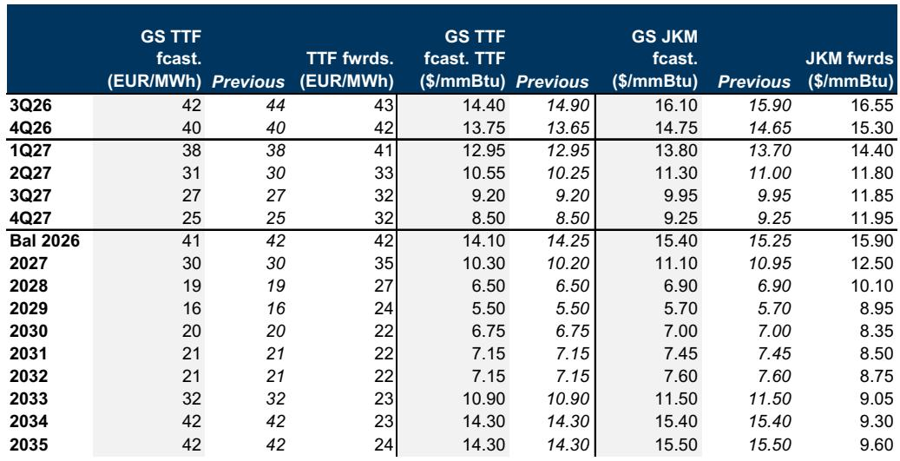
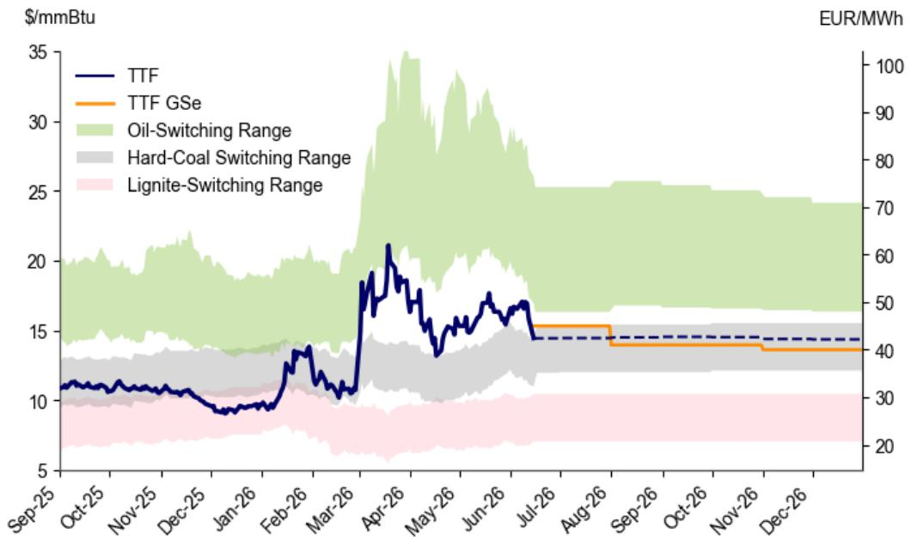
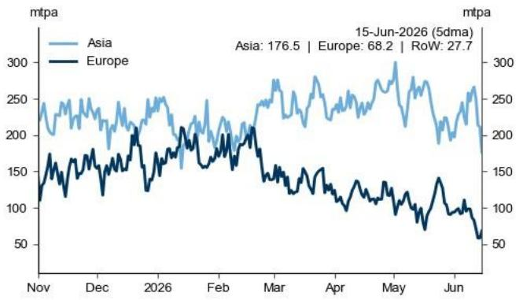

# The US-Iran Agreement Reshapes European Gas Markets, But the Real Story Is How Supply Growth and Storage Discipline Are Redefining the Price Floor

European natural gas markets have arrived at a defining inflection point, and the market's response to the US-Iran agreement reveals something far more consequential than a simple geopolitical fix. The core insight is this: the agreement to restore energy flows through the Strait of Hormuz removes the immediate crisis scenario for European storage refill, but the real structural story is about how global LNG supply growth and a shifting market tolerance for lower storage fills are permanently altering the pricing dynamics for TTF. The market has effectively discovered that it can operate safely with less storage cushion than previously assumed, and this changes everything about how we think about the European gas price floor.

The report from a global investment bank makes a compelling case that the base case for TTF remains in the low 40 EUR/MWh range for the second half of 2026, with a gradual decline toward 30 EUR/MWh in 2027. But the most striking analytical contribution is not the price forecast itself. It is the recognition that the market has already begun pricing in a lower storage target for this summer. Rather than forcing storage to 80% full, the market appears comfortable with 70-75%. This is not a minor adjustment. It is a signal that the structural relationship between storage levels and price premiums may be shifting, with profound implications for how investors should position across the forward curve.

The agreement itself is the catalyst, but the deeper analytical question is whether the market has crossed a threshold where LNG supply growth has become the dominant structural force, capable of absorbing geopolitical shocks that would have previously sent prices into triple digits. The report suggests yes, but with important caveats. The upside risks remain real, and the asymmetry of outcomes is stark. A failure of the agreement could push TTF above 100 EUR/MWh this winter. Yet even a faster-than-expected normalization only modestly softens prices. This asymmetry is the key strategic insight for anyone managing exposure to European gas markets.

## The Market's Willingness to Accept Lower Storage Targets Represents a Fundamental Shift in How European Gas Balances Are Determined

The conventional wisdom has long held that European gas storage must reach 80% or higher before winter to ensure supply security. The report challenges this assumption directly, and the evidence is persuasive. The market has been pricing in a 70-75% fill target, and the analysis demonstrates that this lower level is sufficient to withstand a one-standard deviation colder than average winter. The end-winter storage level under this scenario would still be near 30% full, which provides a meaningful buffer.

Why does this matter strategically? Because the storage target directly determines the amount of gas that must be injected during the summer months, and therefore the price required to attract those volumes. A lower target means less demand for injection, which means lower prices can balance the market. The report estimates that NW European storage can reach 74% full by end-October as long as TTF remains in the low 40 EUR/MWh range, expensive enough relative to coal to incentivize fuel switching but not so high as to require extreme demand destruction.

The mechanism here is subtle but powerful. Growing global LNG supply has effectively reduced the insurance premium that European buyers must pay for winter security. When the market knows that additional LNG cargoes can be diverted from Asia if needed, the urgency to fill storage early and fully diminishes. This is a structural shift, not a cyclical one, because the LNG supply growth is expected to continue for years.

## The Base Case for 2027 Is a Comfortably Supplied Market, But Only If Hormuz Normalization Proceeds as Assumed

Looking beyond the immediate summer refill season, the report constructs a 2027 outlook that is remarkably benign. The combination of a higher end-winter storage level in March 2027 and continued global LNG supply growth of 47 mtpa year-over-year would push NW European end-October storage to 89% full. This is not just comfortable. It is approaching congestion territory.

To prevent storage from becoming physically full, TTF would need to fall below hard coal generation costs in the mid-30 EUR/MWh range to incentivize additional gas demand. The report forecasts 2027 TTF averaging 30 EUR/MWh, which is below current forwards of 35 EUR/MWh. This implies that the market is currently pricing in a risk premium that the analysis believes is unwarranted under the base case.

The key assumption underpinning this view is that Hormuz flows normalize by end-July. Any delay in this timeline would materially change the outlook. But the report also makes an important point about the downside scenario: even a faster-than-expected normalization and an earlier start-up of Qatari LNG expansion would only modestly lower 2027 prices to 27 EUR/MWh. This suggests that the base case is already pricing in a relatively efficient market outcome, and the marginal impact of additional supply is diminishing.

## The Asymmetry of Risks Is the Most Important Strategic Feature of the Current Market

Perhaps the most valuable analytical contribution of the report is its explicit framing of the risk asymmetry. The upside scenario, in which the Hormuz blockage largely continues through 2027, would require TTF to move above 100 EUR/MWh this winter and average above 50 EUR/MWh in 2027. This is a catastrophic outcome for consumers and a windfall for producers. The downside scenario, in which normalization happens faster than expected, would only reduce 2027 prices to 27 EUR/MWh.

This asymmetry is not symmetrical. The potential magnitude of the upside move is far larger than the potential downside move. This has important implications for hedging strategies, portfolio construction, and the pricing of optionality in the gas market.

Why is the upside so much larger than the downside? Because the demand response to higher prices is asymmetric. When prices rise, the market must destroy demand, primarily by discouraging Asian LNG purchases. This requires very high prices because Asian buyers have their own winter security concerns. When prices fall, the market must encourage additional demand, primarily through gas-to-coal switching in Europe. But the scope for this switching is limited by the existing coal fleet and the price of carbon. The report estimates that TTF must be at least 5 EUR/MWh above coal generation costs to maximize fuel switching, which provides a natural floor but not a ceiling.

## The Long-Term Outlook Is Bearish, But the Path Depends on Structural Changes in Asian Demand

The report maintains a bearish long-term view for 2028/2029, with TTF forecasts of 19 and 16 EUR/MWh respectively, well below forwards at 27 and 24 EUR/MWh. The foundation of this view is the wave of new US LNG export projects that have reached final investment decisions. Projects like Commonwealth LNG and Delfin LNG signal a larger and longer-lasting global LNG oversupply than the base case already embeds.

But the report introduces a second-order consideration that is not fully explored: the potential impact of the Iran conflict on Asian energy demand. A pickup in coal and renewable generation in the aftermath of the conflict might reduce Asia's appetite for natural gas in the coming years. This is a plausible scenario, but its magnitude and timing are uncertain. The report flags this as a risk to its already bearish view, suggesting that the downside could be even larger than forecast.

What the report does not fully address is how Asian demand might evolve if the Hormuz situation stabilizes and LNG prices fall sharply. Lower prices could stimulate demand in price-sensitive emerging markets, potentially offsetting some of the supply growth. The interaction between lower prices and demand elasticity in Asia remains a critical uncertainty.

## A Decision Framework for Investors: Three Scenarios and What They Mean for Positioning

For investors trying to navigate this complex landscape, the report provides the raw material for a structured decision framework. The key variables are the timing of Hormuz normalization and the pace of LNG supply growth.

The base case assumes Hormuz flows normalize by end-July, with TTF averaging 41 EUR/MWh in the second half of 2026 and 30 EUR/MWh in 2027. Under this scenario, the optimal positioning is to be short the forward curve, particularly for 2027 and beyond, as the market is pricing in a risk premium that the fundamentals do not justify.

The upside scenario assumes the Hormuz blockage continues, with TTF potentially exceeding 100 EUR/MWh this winter. Under this scenario, the optimal positioning is to be long TTF for the winter months and to hedge the risk of sustained high prices into 2027. The report estimates that 2027 prices would average above 50 EUR/MWh in this case.

The downside scenario assumes faster-than-expected normalization and earlier Qatari LNG expansion. Under this scenario, 2027 TTF would average 27 EUR/MWh, only modestly below the base case. The asymmetry means that the downside is limited, but the positioning should still be short the long end of the curve.

The critical open question is how the market will resolve the tension between the current forward curve and the fundamental outlook. The forwards are pricing in higher prices than the base case for 2027 and beyond. This could mean that the market is correctly anticipating a slower normalization, or it could mean that the market is overpricing the risk premium. The report's analysis suggests the latter, but the uncertainty around Hormuz makes this a high-conviction but not risk-free call.

## The Full Report Contains the Charts and Data That Make This Analysis Actionable

The analysis presented here is based on a detailed report that includes original charts and data on LNG supply trends, storage trajectories, and price scenarios. The charts showing the relationship between European storage levels and LNG cargo flows, the breakdown of year-on-year changes in LNG exports by region, and the TTF price scenarios under different Hormuz outcomes are essential for understanding the full argument.

These charts are not decorative. They are the analytical backbone of the report, and they allow readers to see the data for themselves rather than relying on summary conclusions. The report also includes the specific assumptions about maintenance schedules, feedgas recovery, and project start-up dates that drive the supply forecasts.

Join the community to read the full report and review the original charts.

*This article is for learning and discussion only and does not constitute investment advice.*

Personal reading notes and learning share only. Not investment advice.

