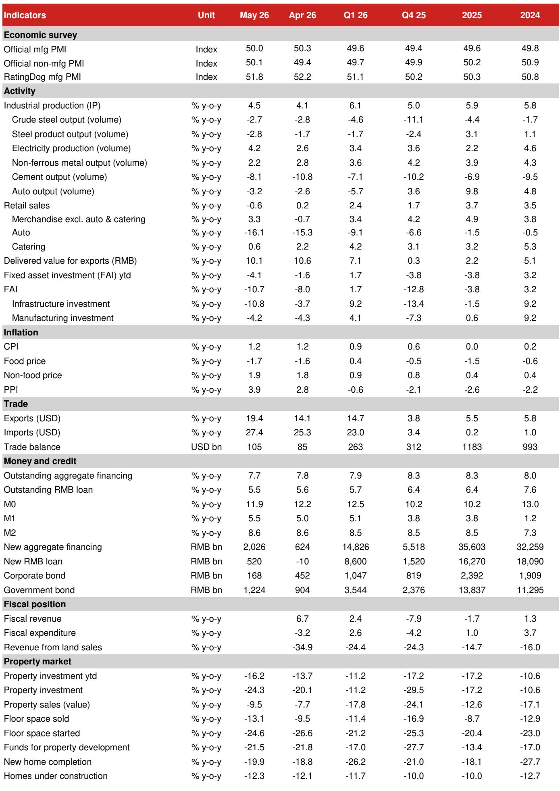
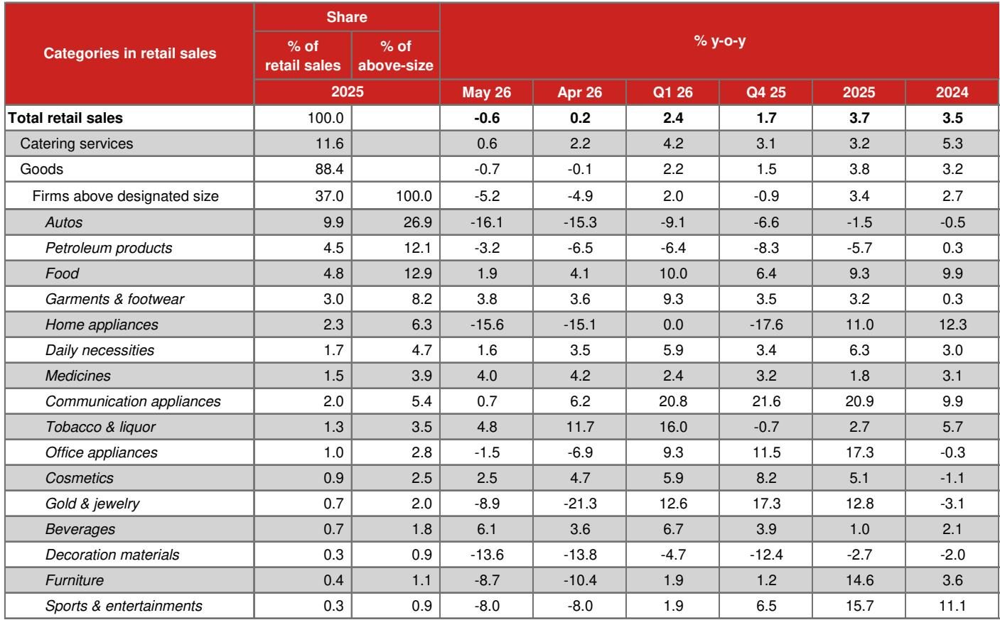
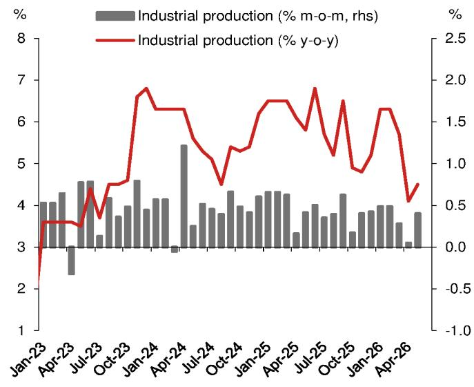

# China's May Data Reveals a Deeper Structural Contradiction: The AI Boom Cannot Mask a Property-Bust Economy

The narrative that China's artificial intelligence-driven stock market rally and export resilience can pull the economy out of its post-property downturn is being dismantled by the May activity data. The National Bureau of Statistics released figures that should give every serious investor pause: retail sales turned negative for the first time since the abrupt COVID reopening in late 2022, fixed asset investment plunged into double-digit contraction, and the property sector deepened its slide. This is not a soft patch. It is a confirmation that the economy is operating under a structural disconnect that policy has yet to address.

The conventional framing of China's economic story in 2026 has been one of bifurcation: an AI-led manufacturing and export engine firing on all cylinders, while domestic demand sputters. The May data upends even that comforting narrative. Industrial production growth, at 4.5% year-on-year, is well below the 6.1% recorded in Q1 2026 and the 5.9% average for 2025. The export boom, while still generating elevated delivery values, is increasingly a price-driven phenomenon rather than a volume-driven one. The real economy is not bifurcating; it is decelerating across the board.

The most consequential takeaway is that Beijing cannot rely on the equity market or the AI super-cycle to solve the property bust-driven economic malaise. The data from May makes this argument with force. Retail sales contracting by 0.6% year-on-year, FAI falling by 10.7%, and property investment dropping by 24.3% are not the numbers of an economy that is merely rebalancing. They are the numbers of an economy that is losing internal momentum. The question for investors is no longer whether the slowdown is real, but what it means for policy, for corporate earnings, and for asset allocation across Asia ex-Japan.

## The Consumer Is Not Coming Back: Retail Sales Turning Negative Signals a Structural Demand Problem, Not a Cyclical One

The headline that retail sales growth turned negative for the first time since late 2022 is alarming, but the composition of the weakness is even more instructive. The -0.6% year-on-year print in May, worsening from 0.2% in April, undershot both market consensus and the more pessimistic forecasts. Using May CPI inflation of 1.2% as a deflator, real retail sales growth fell to -1.8% year-on-year, deepening from -1.0% in April. This is not a temporary pullback from stimulus-induced spending; it is a structural retrenchment.

The auto sector remains the most visible casualty. Auto sales in value terms worsened to -16.1% year-on-year in May, and passenger car sales volumes dropped by 22.1%. This is happening despite renewed price cuts by automakers and dealers, which suggests that price elasticity is breaking down. Consumers are not deferring purchases; they are exiting the market altogether. The policy-driven trade-in program, which had provided a temporary boost, is now generating payback effects. Home appliance sales fell by 15.6%, furniture by 8.7%, and communication appliances by a sharp 0.7% from a positive 6.2% in April, as surging chip prices passed through to final selling prices and dampened demand.

The catering services data tells a similar story. Growth drifted lower to 0.6% year-on-year from 2.2% in April, and sales by designated restaurants with annual revenue above RMB 2 million turned negative at -1.7%. This is a direct read on household purchasing power and sentiment. The AI-driven stock market rally has not translated into consumer confidence for the vast majority of Chinese households. The wealth effect, if it exists at all, is concentrated in a narrow segment of the population, primarily in tier-1 cities. The broader consumer base is dealing with property wealth destruction, stagnant income expectations, and rising energy costs.

The implication is clear: China's consumption-driven rebalancing narrative is not merely delayed; it is being reversed. Any investment thesis that relies on a consumer-led recovery in the second half of 2026 must be re-evaluated against this data.

## The Infrastructure Paradox: Bond Issuance Is Rising, But Investment Is Plunging, Revealing a Bottleneck in Execution, Not Funding

Infrastructure investment growth plunged to -10.8% year-on-year in May from -3.7% in April, a deterioration that is difficult to reconcile with the policy signals and funding conditions. China is in the midst of a major nationwide push for data center construction amid the AI super-cycle, which should in principle be supporting infrastructure outlays. Special local government bond issuance in May was broadly on par with the same period last year, suggesting that funding availability per se is not the binding constraint.

The most plausible explanation is sluggish fiscal deposit drawdown. Bond proceeds are being raised but not deployed in a timely manner. This points to a bottleneck at the project approval or execution level, rather than a shortage of financing. Central government project approval may be slow, or local government execution capacity may be constrained by the ongoing anti-corruption and anti-involution campaigns. Whatever the cause, the effect is that fiscal policy is not providing the counter-cyclical support that the economy desperately needs.

This is a critical insight for investors. If infrastructure FAI weakness persists until disbursement mechanisms improve, then the second half of 2026 will see continued downward pressure on aggregate demand. The fiscal multiplier is not operating as intended. The policy response to the slowdown may need to shift from increasing the volume of bond issuance to improving the velocity of spending. Until that happens, infrastructure will remain a drag rather than a support.

## The Supply-Side Distortion: Anti-Involution and Energy Shocks Are Overriding Export Demand Signals

The industrial production data reveals a paradox that goes to the heart of China's current economic model. Export-delivered value growth remained elevated at 10.1% year-on-year in May, yet manufacturing FAI growth was essentially flat at -4.2%. This is not a normal relationship. In a typical cycle, strong export demand would trigger capacity expansion. The fact that it is not doing so suggests that policy-driven supply constraints are overriding external demand signals.

The anti-involution campaign, which has intensified significantly since July 2025, is the most likely culprit. The April Politburo meeting pointedly placed renewed focus on this campaign, and the May data shows its reach. FAI growth in the electrical machinery and equipment sector, which includes lithium-ion batteries and solar modules, fell back into negative territory at -2.3% year-on-year from 7.6% in April. Solar panel output growth remained deeply negative at -20.4% year-on-year, improving only marginally from -25.6% in April. These are sectors that were supposed to be the pillars of China's green transition and export competitiveness. Instead, they are being deliberately constrained.

The energy supply shock adds another layer of complexity. Oil import volumes slumped to 7.8 million barrels per day in May, the lowest in nine years and 30% below pre-war levels. This has cascading effects across the industrial chain. Crude oil processing volume dropped by 9.1% year-on-year, sulfuric acid output remained negative, and ethylene output growth fell to 2.1% from 6.8% in March. The shortage of sulfur, a by-product of petroleum refining, is disrupting the chemical industry. The energy supply disruption is not a temporary blip; it is a structural constraint that will persist as long as the geopolitical situation in the Middle East remains unresolved.

The implication is that China's industrial sector is caught between two policy-driven constraints: the desire to limit overcapacity in strategic sectors and the reality of energy supply disruptions. Export demand is strong, but the supply side cannot respond. This creates a situation where price effects dominate volume effects, boosting nominal export values but doing little for real economic activity or employment.

## The Property Sector: A Tier-1 Mirage Masking a National Crisis

Property investment growth worsened to -24.3% year-on-year in May from -20.1% in April, and new home sales fell by 13.1% by floor space and 9.5% by value. Home price declines widened again, with average new home prices falling by 0.20% month-on-month and existing home prices by 0.26%. The narrative that the property market is stabilizing is simply not supported by the data.

The only bright spot is tier-1 cities. Existing home prices in Beijing rose by 0.1% month-on-month, Shanghai by 0.6%, Guangzhou by 0.6%, and Shenzhen by 0.6%. This is consistent with the Iceberg index, which shows that the AI-driven growth is mainly benefiting a few selected "smart" cities. But this is a mirage. The national picture is one of deepening decline. Tier-2 city home prices fell by 0.19% month-on-month, and tier-3 and tier-4 cities saw a 0.35% decline. The Iceberg index weekly data for the first two weeks of June indicates a further worsening, with a 0.4% month-on-month decline.

The property crisis is not just a housing market problem; it is a household wealth and confidence problem. Most Chinese households hold the majority of their wealth in real estate. As home prices continue to fall, household balance sheets are being impaired, which directly feeds into the consumption weakness we see in the retail sales data. The property bust is the root cause of the domestic demand problem, and until it is addressed, no amount of AI-driven stock market gains will fix it.

## What the Report Does Not Fully Answer: The Policy Response Timeline and the RMB Conundrum

The report provides a comprehensive diagnosis but leaves several critical questions unanswered. First, what is the policy response timeline? The data suggests that fiscal spending is not being deployed effectively, but the report does not specify when or how the disbursement bottleneck will be resolved. Is the central government aware of the problem, and is it taking steps to accelerate project approvals? The answer to this question will determine whether infrastructure FAI can recover in the second half of the year.

Second, the report notes that the weak economy should prevent Beijing from allowing RMB to appreciate too quickly, and that banks have been allowed to offer higher interest rates on corporate USD deposits to slow FX conversions. But it does not fully explore the implications of this for capital flows and asset prices. If the RMB is being held artificially weak to support exports, what does that mean for foreign investors in Chinese equities and bonds? Is the currency risk being mispriced?

Third, the report highlights the inconsistency between strong IC output growth and weaker IC export growth, but it does not resolve it. Is the domestic demand for chips being driven by the AI boom, or is there a build-up of inventories? The answer has significant implications for the sustainability of the semiconductor cycle in China.

These open questions are not weaknesses of the report; they are the natural boundaries of any single data release. They point to the need for deeper analysis and ongoing monitoring.

## A Decision Framework for Investors: How to Navigate the May Data

For investors trying to make sense of this data, a structured decision framework is essential. The May data should not be read in isolation but as a confirmation of a broader trend. Here is a three-step framework for evaluating your China exposure:

First, assess your exposure to domestic demand. If your portfolio is weighted toward consumer discretionary, auto, or real estate-related sectors, the May data is a clear warning signal. The consumer is not recovering, and the property market is not stabilizing. Do not assume that policy will ride to the rescue in time.

Second, evaluate your supply chain assumptions. The anti-involution campaign and energy supply disruptions are not going away. If you are relying on Chinese manufacturing capacity to meet global demand, you need to factor in the possibility that supply will be constrained, even as demand remains strong. This creates a pricing opportunity for companies that can pass through costs, but it also creates volume risk.

Third, monitor the policy response. The key indicators to watch are not just GDP or PMI data, but the velocity of fiscal spending. If the government can accelerate the drawdown of bond proceeds and improve project execution, infrastructure FAI could recover in Q3. If not, the drag will persist. Also watch for any signs of a shift in the anti-involution campaign. If the government begins to ease capacity constraints in solar and battery sectors, that would be a significant positive signal.

## Join the community to read the full report and review the original charts.

The May data is a turning point in the narrative around China's economy. The AI boom and the stock market rally are not sufficient to offset the structural weakness in domestic demand. Investors who ignore this data risk being caught on the wrong side of a significant repricing. The full report contains detailed charts and analysis that are essential for understanding the depth and breadth of the slowdown.

*This article is for learning and discussion only and does not constitute investment advice.*

Personal reading notes and learning share only. Not investment advice.

