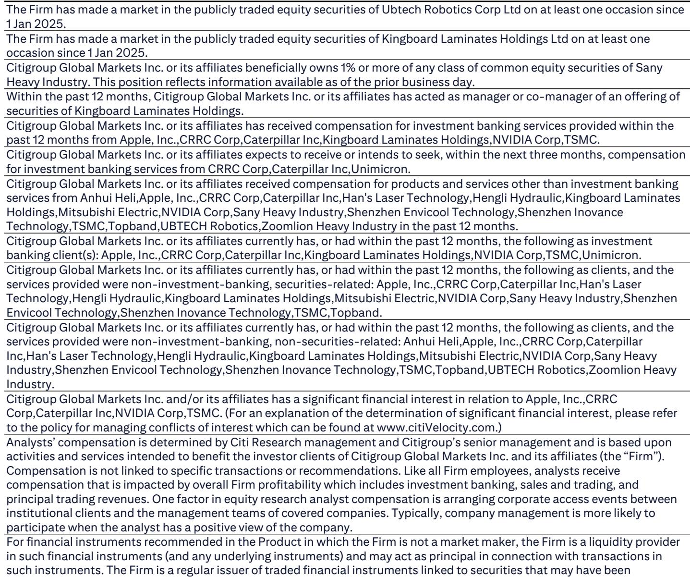
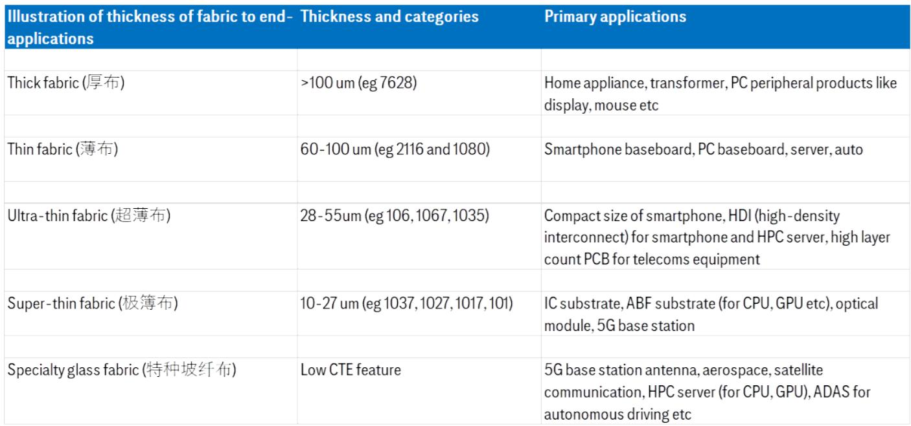
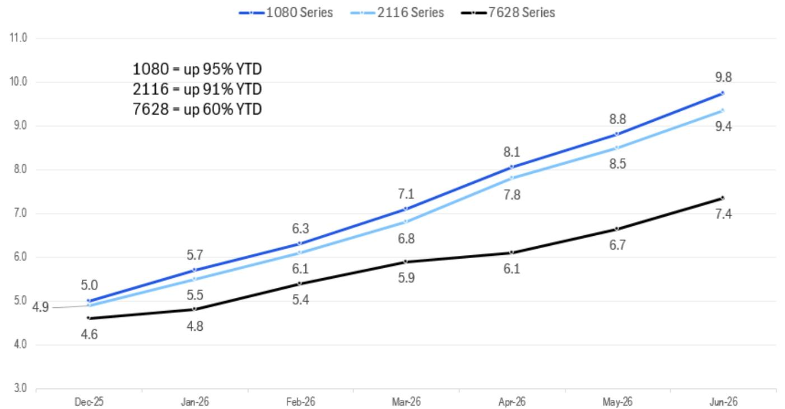

# China’s AI-Infra Suppliers Are About to Seize a Much Larger Share of Nvidia’s Next-Generation Ecosystem—and Earnings Upgrades Are Only Beginning

The conventional view that Chinese industrial AI-infrastructure suppliers are secondary players in Nvidia’s supply chain is becoming outdated. A recent tour of 13 leading companies in China’s AI-infrastructure, robotics, and automation sectors reveals a decisive shift: Chinese component and equipment makers are positioned to win significantly more wallet share in Nvidia’s GB300 and Vera Rubin architectures than they did in the GB200 generation. This is not a marginal improvement. It is a structural re-rating of their competitive position, driven by technology curve upgrades, faster response times to Nvidia’s rapidly evolving architecture, and a willingness to commit capital to capacity expansion that goes far beyond price competition.

For investors, the implication is clear. The earnings upside for select Chinese AI-infra players is not yet fully priced in. While the market has focused on the headline risks of geopolitical tension and supply chain decoupling, the companies on the ground are executing a quiet but powerful strategy: moving up the value chain, capturing more of Nvidia’s bill of materials, and doing so at a pace that is surprising even their own customers. This article distills the key strategic insights from the tour, identifies the most actionable investment themes, and flags the unresolved questions that will define the next phase of this cycle.

## Chinese AI-Infra Suppliers Are Moving from Latecomers to Essential Partners in Nvidia’s Supply Chain

The single most important takeaway from the tour is that Chinese AI-infrastructure companies—spanning copper-clad laminates (CCL), PCB drilling equipment, power supply units, and AI-grade fiberglass fabric—are no longer simply low-cost alternatives to their Japanese, Korean, and Taiwanese counterparts. They are becoming indispensable due to their ability to adapt quickly to Nvidia’s ever-changing architecture.

In the GB200 generation, Chinese suppliers held a notably lower wallet share. This was largely a function of historical disadvantage: they faced greater geopolitical pressure, had little exposure to TSMC’s dominant chipset manufacturing supply chain, and were late entrants to Nvidia’s ecosystem. But the GB300 and Vera Rubin architectures represent a reset. The technology requirements have shifted, and the incumbents—especially in Japan, Korea, and Taiwan—are not always able to pivot as fast. Chinese suppliers, by contrast, have invested heavily in upgrading their technology curves. They are not just matching specifications; they are offering faster turnaround times for new product introductions and committing to large-scale capacity builds that give Nvidia confidence in supply security.

This is not about pricing. It is about becoming a more reliable and technologically capable partner at a moment when Nvidia’s own product cycles are accelerating. The result is a structural increase in wallet share that should translate directly into earnings upgrades for the companies in this coverage universe. Investors should expect upward revisions to revenue and margin forecasts as these share gains materialize over the next 12 to 18 months.

## The Greatest Capacity Bottlenecks Are in Upstream Materials, Not Assembly—and That Is Where the Most Profitable Exposure Lies

A recurring theme from the tour was that the tightest constraints in the AI-infrastructure supply chain are not in final assembly or system integration but in upstream materials: AI-grade fiberglass fabric, especially T-glass and low-Dk generation 2 materials, and e-glass fabric for CCL production. Both Shengyi Tech and Grace Fabric, two of the largest players in this space, cited capacity shortages as the binding constraint on their growth. This is a classic sign of pricing power.

The implications are twofold. First, companies that control these upstream bottlenecks are likely to see sustained margin expansion. Shengyi, for example, estimated that its AI-CCL as a percentage of total monthly capacity will rise from roughly 10% last year to about 20% by the end of 2026, driven by demand from Vera Rubin. Its gross margins are projected to break through their previous peak in 2021 and continue climbing through 2028. Second, the market has not fully priced in the duration of this upcycle. The capacity expansion plans announced by Grace Fabric and KB Laminates suggest that demand will outstrip supply for at least another two to three years. This is not a transient cycle; it is a structural shift in the composition of demand for advanced materials.

For investors, the strategic choice is between owning the upstream material suppliers or the downstream equipment makers. The evidence from this tour suggests that the upstream players have more durable pricing power and higher barriers to entry, given the technical complexity of producing ultra-thin, low-loss fabrics and the long lead times required to build new kilns. The equipment players, while also benefiting, face more cyclical risk and are more exposed to the pace of Nvidia’s architectural transitions.

## The Embodied AI Chain Is Shifting from OEMs to Component Suppliers—and the Valuation Disparity Creates Opportunity

The tour also provided critical updates on the embodied AI supply chain, particularly for humanoid robots. Two Chinese component suppliers, Hengli and Rongtai, have already begun shipping meaningful volumes to a leading US robotics company. Their guidance suggests that production volume for the third-generation Optimus robot will reach 10,000 to 20,000 units this year, with a tenfold increase to over 100,000 units next year. For Hengli, this implies that its robot-related revenue—primarily from planetary roller screws—will rise from less than 1% of total revenue in 2026 to roughly 4% in 2027, with potential upside if the US customer accelerates its ramp.

This shift has an important strategic implication for how investors should position in the robotics value chain. Historically, the market has favored OEMs like UBTech, which assemble the final robot. But the tour’s evidence suggests that the most attractive risk-reward is now in component suppliers. The reason is simple: component suppliers have higher barriers to entry, more predictable revenue streams, and less exposure to the competitive dynamics of final assembly. As more robotics OEMs—including Unitree and Zhiyuan—prepare to list on Chinese exchanges, the valuation premium on listed OEMs like UBTech may come under pressure. The scarcity value that once supported their multiples is eroding.

The investment preference has therefore shifted. Component suppliers like Hengli and Leader Drive offer a purer play on the volume ramp in humanoid robots, with less valuation risk from new entrants. The key question for investors is whether the volume ramp will be as steep as the companies project, or whether technical bottlenecks in manufacturing planetary roller screws at scale will create delays. This is the most important unresolved variable in the embodied AI thesis.

## The Recovery in Factory Automation and Excavators Is Real but Narrow—Export and Mining Are Driving the Cycle, Not Domestic Property

Beyond AI and robotics, the tour provided a nuanced picture of China’s broader industrial recovery. Factory automation demand is improving, driven primarily by Apple’s supply chain and AI-related manufacturing. Both Tsugami and Bozhon reported stronger demand for machine tools and factory automation equipment, and this is corroborated by Japanese machine tool orders data, which showed 40-57% year-on-year growth in orders to China during the first four months of 2026.

Similarly, the excavator market is showing sustainable recovery, but the drivers are specific. Hengli Hydraulic’s excavator component production line is running at full capacity, fueled by mining demand for large-sized excavators, market share gains in China’s pump and valve market, and growing business with foreign customers like Caterpillar. This is not a broad-based construction recovery. Property and fixed-asset investment verticals remain muted, and the evidence is stark: China’s tower crane leasing rate index is hovering near historical lows, fleet utilization rates have declined year-on-year for three consecutive months, and overall construction machinery utilization stood at only 52.3% in May 2026, down 7.2 percentage points year-on-year.

The lesson for investors is that the current industrial recovery is highly selective. It favors companies with exposure to export markets, mining, and AI-related manufacturing, while punishing those tied to domestic property and infrastructure. This is why the tour reaffirmed sell ratings on companies like CRRC, Dingli, and Anhui Heli, which are more exposed to the domestic construction cycle. The strategic question for portfolio construction is whether the export-driven recovery can sustain its momentum if global demand slows, or whether the domestic property sector will eventually stabilize and broaden the recovery.

## The Report Leaves a Critical Unanswered Question: How Sustainable Is the Chinese AI-Infra Share Gain Against Geopolitical Headwinds?

While the tour’s evidence for near-term share gains is compelling, the report does not fully address the sustainability of this advantage in the face of intensifying geopolitical pressure. Chinese suppliers are winning more business from Nvidia, but they are doing so in an environment where the US government is actively considering further export controls and supply chain restrictions. The companies themselves acknowledged that they face more geopolitical pressure than their Japanese, Korean, and Taiwanese competitors.

The key question is whether Nvidia’s willingness to increase Chinese suppliers’ wallet share is a tactical decision—driven by capacity constraints among incumbents—or a strategic one that will persist even if political pressure mounts. If it is tactical, then the current earnings upgrades may prove transitory, and investors should be prepared for a reversal once alternative supply sources come online. If it is strategic, then Chinese suppliers are building relationships and technical capabilities that will be difficult to displace, even with policy intervention.

The report hints at this tension but does not resolve it. The data on capacity expansion and technology upgrades suggests that Chinese suppliers are investing as if the relationship is strategic. But the geopolitical environment remains unpredictable. For investors, the prudent approach is to overweight the companies with the most differentiated technology and the deepest relationships with Nvidia, while maintaining a close watch on regulatory developments. The full report provides more detailed analysis of individual company positioning, which is essential for making this distinction.

## A Decision Framework for Investors: How to Allocate Across the AI-Infra and Robotics Value Chains

Based on the tour’s findings, investors should apply a three-step framework to their allocation decisions in Chinese industrials.

First, prioritize supply chain position. The most attractive investments are those that control upstream bottlenecks—materials and components where capacity is constrained and technical barriers are high. This points to CCL and AI-fabric producers over equipment makers, and to component suppliers over OEMs in robotics.

Second, assess technology differentiation. The companies that are winning share from Nvidia are not doing so on price alone. They are investing in proprietary technology, faster response times, and capacity that is dedicated to Nvidia’s evolving needs. Investors should favor companies with a clear technology roadmap and evidence of R&D spending that is translating into customer wins.

Third, evaluate exposure to end-market risk. The current recovery is export- and mining-driven, not property-led. Companies with high exposure to domestic property and fixed-asset investment are likely to underperform, even if their AI-related businesses are growing. The sell-rated names in the report—CRRC, Dingli, Topband, Oppein, Heli, and Envicool—all share this vulnerability.

This framework is not static. It will need to be revisited as the geopolitical landscape evolves and as Nvidia’s architectural choices for future generations become clearer. But for now, it provides a disciplined way to separate the structural winners from the cyclical beneficiaries.

## The Full Report Contains the Detailed Company-Level Analysis and Charts That Make These Insights Actionable

The analysis above is based on a 19-page report from a global investment bank’s industrials research team, which includes granular data on capacity expansion, margin trends, and competitive positioning for each of the 13 companies visited during the tour. The report also contains proprietary charts on gross margin trajectories, AI-fabric capacity estimates, and ASP trends that are essential for building conviction in the investment thesis.

These are not summary-level observations. They are the result of direct conversations with management teams and detailed financial modeling. The charts on Shengyi’s CCL margin trajectory, KB Laminates’ AI-fabric revenue contribution, and the surge in e-glass fabric ASPs are particularly valuable for understanding the magnitude of the earnings upside.

Join the community to read the full report and review the original charts.

*This article is for learning and discussion only and does not constitute investment advice.*

Personal reading notes and learning share only. Not investment advice.

