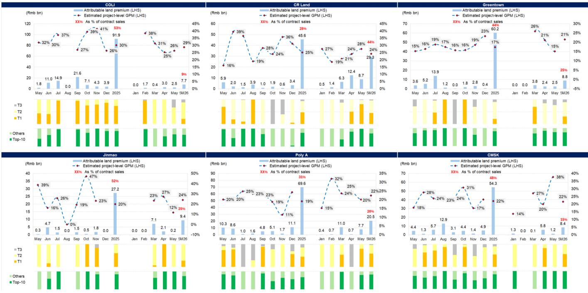
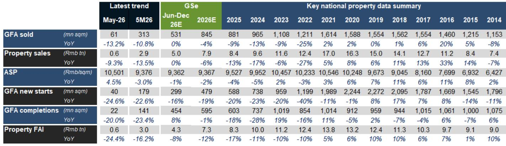
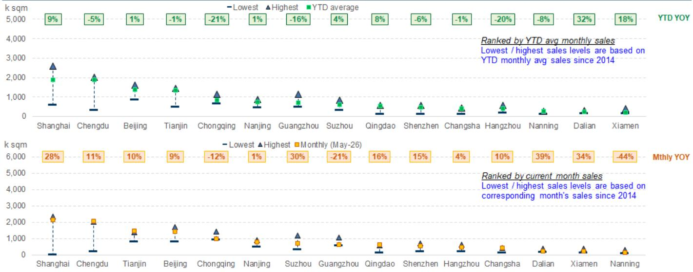

# GS：中国房地产市场的真实信号并非全面回暖，而是核心城市的结构性再定价

市场参与者对5月房地产数据的解读，很容易滑入两个极端：要么被全国层面的同比下滑数字吓退，要么被一线城市的环比改善故事所吸引。GS最新发布的5月中国房地产月度追踪报告提供了一组值得细看的数据，其核心判断并非简单的“回暖”或“继续探底”，而是一个更为精细的结构性叙事——全国总量的疲软掩盖了核心城市正在发生的资产价格再定价过程，而这种再定价的可持续性，取决于供给侧的深度调整而非需求侧的短暂脉冲。

这份报告最值得关注的信号，是一线城市已经连续3至4个月录得二手房价格环比正增长，同时二手房挂牌量同比连续第三个月下降。这两个指标的同步出现，在近两年的市场周期中并不常见。它意味着核心城市的二手房市场，正在从“降价换量”的存量博弈，转向“量稳价升”的供需再平衡。对于产业决策者和高净值投资者而言，真正需要追问的不是“市场到底了没有”，而是“哪些城市的资产正在被重新定价，以及这种定价能走多远”。

## 1. 一线城市的价格韧性并非偶然，而是供给收缩与需求结构升级共同作用的结果

GS报告显示，5月70城新房价格环比平均下降0.2%，与4月、3月基本持平；而二手房价格环比降幅则从4月的0.2%扩大至0.3%。表面上看，二手房市场似乎比新房更弱。但一线城市的表现提供了完全相反的图景：5月一线城市新房价格环比上涨0.2%，已是连续第4个月正增长；二手房价格环比上涨0.3%，是连续第3个月正增长。深圳和上海几乎所有产品类型的二手房成交价格都在改善，北京的高端项目也跑赢大盘。

这里需要回答一个“为什么”的问题。一线城市的价格韧性，不能简单归结为“有钱人还在买房”。GS报告指出，新房价格受到产品结构升级的支撑——核心区域的新房供应本就有限，而开发商在当前环境下更倾向于推出高品质项目，这类项目的单价和去化速度都明显优于普通产品。深圳南山区一宗地块的土地成本达到每平方米10.9万元，杭州上城区一宗地块由绿城和杭州地铁集团联合以21亿元拿下——这些高价地项目未来入市的价格锚点，反过来也会支撑周边二手房的定价预期。

更深层的结构性变化发生在二手房供给侧。报告显示，100城二手房挂牌量同比连续第三个月下降，同时成交周转速度在加快。这意味着，过去两年积累的“抛压盘”正在被市场消化，而新增挂牌的意愿在减弱——业主在经历了深度调整后，对以大幅折价出售的抵触情绪上升。供给侧的主动收缩，是价格企稳的必要条件，这一点在一线城市已经初步成立。

## 2. 全国总量的疲软并非“市场不行”，而是“市场正在分化”

5月全国新房销售面积同比下降13%，销售额同比下降9%，均低于GS的预期。新开工和竣工面积分别同比下降25%和20%，也弱于预期。这些数字很容易让人得出“市场仍在恶化”的结论。但GS报告在给出这些数字的同时，还提供了另一组关键数据：15城二手房成交量同比增长8%，高于预期，且增速较4月的4%有所加快。

这意味着什么？全国新房销售的下滑，很大程度上反映的是供给端的问题——开发商现金流紧张、新开工持续萎缩、可售房源集中在非核心区域。而二手房市场的活跃，则反映了真实居住需求在价格调整到位后的释放。两者并非同一市场，而是同一市场内部的分化。对于投资者而言，把新房和二手房数据简单加总去判断市场方向，可能会错过结构性的机会。

这种分化还体现在租赁市场。50城平均租金水平仍在环比下降，但一线城市的租金已经连续三个月环比上涨，且表现优于2024年和2025年同期。上海、深圳、天津、乌鲁木齐是3至5月表现最好的城市。租金的企稳，是资产价格可持续修复的前提——没有租金支撑的价格上涨，最终都会回到原点。

## 3. 开发商的行为模式正在从“规模竞赛”转向“利润优先”，这是市场出清的关键信号

报告跟踪的6家覆盖开发商在5月的土地投资强度出现分化：保利发展和绿城加快了拿地节奏，其余开发商则放缓了投资。整体来看，这些开发商5月的土地投资占合同销售额的比例为20%，低于4月；前5个月的平均比例为21%。但更值得关注的是投资质量：5月新增土地中，95%位于一二线城市，78%位于前十大城市，项目层面的毛利率约为23%，与前5个月的平均水平24%基本持平。

这个数据组合传递的信息是清晰的：开发商不再为了维持规模而盲目拿地。他们正在把有限的资金集中到利润空间最确定的核心城市核心地块。这种“区域聚焦、利润导向、纪律优先”的行为模式，与过去几年“高杠杆、高周转、高规模”的模式形成了根本性区别。从行业出清的角度看，这是一个积极的信号——只有开发商停止低效扩张，市场才能真正找到供需平衡点。

但这里也有一个尚未完全回答的问题：23%的项目毛利率能否持续？GS报告没有展开讨论的是，这些高利润地块的获取成本本身就在上升——深圳南山地块每平方米10.9万元的土地成本，意味着未来项目的售价必须达到相当高的水平才能实现盈利。如果核心城市的房价上涨预期无法兑现，这些“优质地块”也可能成为新的风险点。

## 4. GS对6月的预测暗示了一个关键假设：核心城市的价格修复能否扩散到二线城市

报告对6月给出了明确的预测：新房和二手房价格环比降幅都将收窄，一线城市的修复势头将延续，而关键二线城市可能转为环比正增长。同时，新房销售面积和金额预计将保持低两位数百分比的同比下降，二手房成交量预计同比增长中单位数百分比。

这里隐含了一个重要的假设：二线城市正在跟随一线城市的节奏进入价格企稳阶段。5月的数据已经显示，二线城市的新房和二手房价格环比降幅均为0.1%和0.2%，与4月基本持平，没有进一步恶化。70城中，有13个城市在5月录得二手房价格环比正增长或持平，其中10个城市已经连续3个月保持这一状态。这些城市是否包括上海、深圳、天津、乌鲁木齐之外的其他城市？报告没有明确点名，但趋势是值得跟踪的。

如果二线城市确实能够接棒一线城市的价格修复，那么整个市场的底部结构将更加坚实。但如果修复仅限于一线城市，那么全国层面的数据改善将非常有限，市场的“分化”将成为一种长期状态而非过渡阶段。这个问题的答案，将决定未来6至12个月房地产板块的投资逻辑。

## 5. 报告尚未完全回答的关键问题：政策刺激的边界在哪里，以及二手房挂牌量的持续下降是否可持续

GS在“关注要点”中列出了多个政策变量：住房公积金的改革、大规模的抵押贷款利息补贴、进一步的商业贷款利率下调、一线城市核心区限购的全面放开、城中村改造的资金支持、政府收购存量住房的加速推进等。这些政策选项的存在本身，说明市场尚未进入自我修复的正循环。报告没有给出的是，这些政策中哪些是真正有效的，哪些只是心理层面的托底。

另一个值得追问的问题是：二手房挂牌量的下降，究竟是因为需求消化了供给，还是因为业主选择“撤牌不卖”？如果是前者，那么市场正在走向健康；如果是后者，那么挂牌量的下降只是暂时的，一旦价格出现反弹，新的抛压可能再次出现。GS报告提到“业主不愿意以深度折价出售”是供给收缩的原因之一，但并没有量化这一因素的影响程度。这意味着，核心城市的价格修复仍有一定的脆弱性。

此外，报告对租赁市场的分析留下了进一步探讨的空间。一线城市租金连续三个月环比上涨，但50城整体租金仍在下降。租赁市场的修复路径是否与销售市场一致——先一线、再二线、最后全国？还是说，租金的修复需要更长时间，因为它直接取决于居民收入预期的改善？这是一个比房价更根本的问题。

## 6. 对于决策者和投资者而言，这份报告提供的不是一个结论，而是一个观察框架

与其追问“市场是否见底”，不如建立一套基于结构性指标的观察框架。从GS报告的数据出发，可以提炼出三个核心观察点：

第一，一线城市的二手房价格和租金是否能够维持环比正增长。这是市场最领先的指标，如果这两个数据出现逆转，说明修复的基础并不牢固。第二，二线城市是否出现二手房价格环比转正的城市数量增加。这是判断修复是否扩散的关键。第三，开发商的土地投资强度是否维持在20%以下，同时项目毛利率是否保持在20%以上。如果开发商重新开始大规模扩张，那么市场出清的过程将被中断。

这三个指标不需要同时满足，但至少需要前两个中的一个成立，第三个维持不变，才能对市场前景做出相对乐观的判断。如果三个指标同时恶化，那么当前的价格企稳可能只是技术性反弹，而非趋势性反转。

GS报告本身还包含了大量关于施工、竣工、FAI、土地市场的详细数据和预测，这些内容对于理解整个产业链的传导机制至关重要。例如，竣工面积的下降速度是否会在下半年放缓，直接关系到建材、家居、装修等下游行业的需求节奏。土地市场的低迷何时传导到地方政府的财政收入，又会影响基础设施投资和公共服务供给。这些二阶效应，在报告的数据表格和预测中都有迹可循，但需要结合更完整的报告阅读才能形成闭环判断。

---

以上讨论基于GS这份5月中国房地产月度追踪报告的核心数据与逻辑。关于开发商个体层面的财务分化、具体城市的价格拐点判断、以及政策刺激对市场预期的边际影响，报告中还有更细致的图表和分析没有在这里展开。如果您希望获取完整的原始报告图表，或者想进一步探讨这些未解问题——比如一线城市租金上涨的可持续性、二手房挂牌量下降的真实驱动力、以及哪些二线城市最有可能率先跟上——欢迎来星球微信群里继续讨论。

Personal reading notes and learning share only. Not investment advice.

