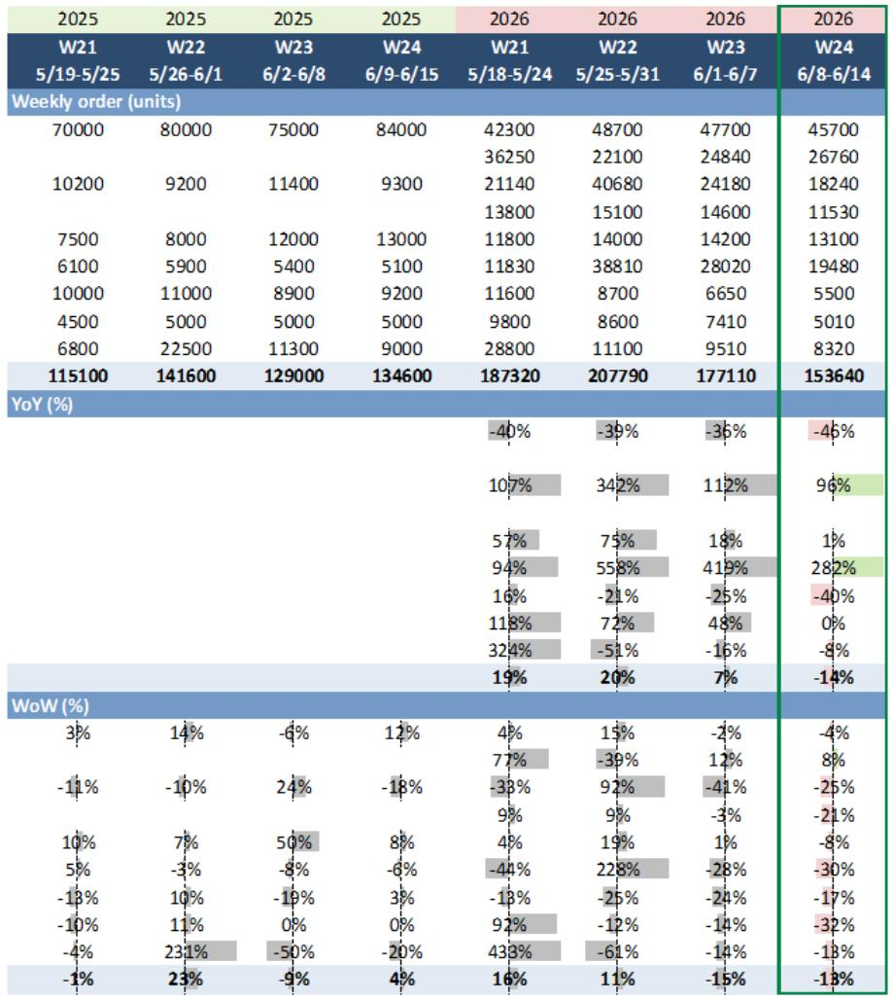
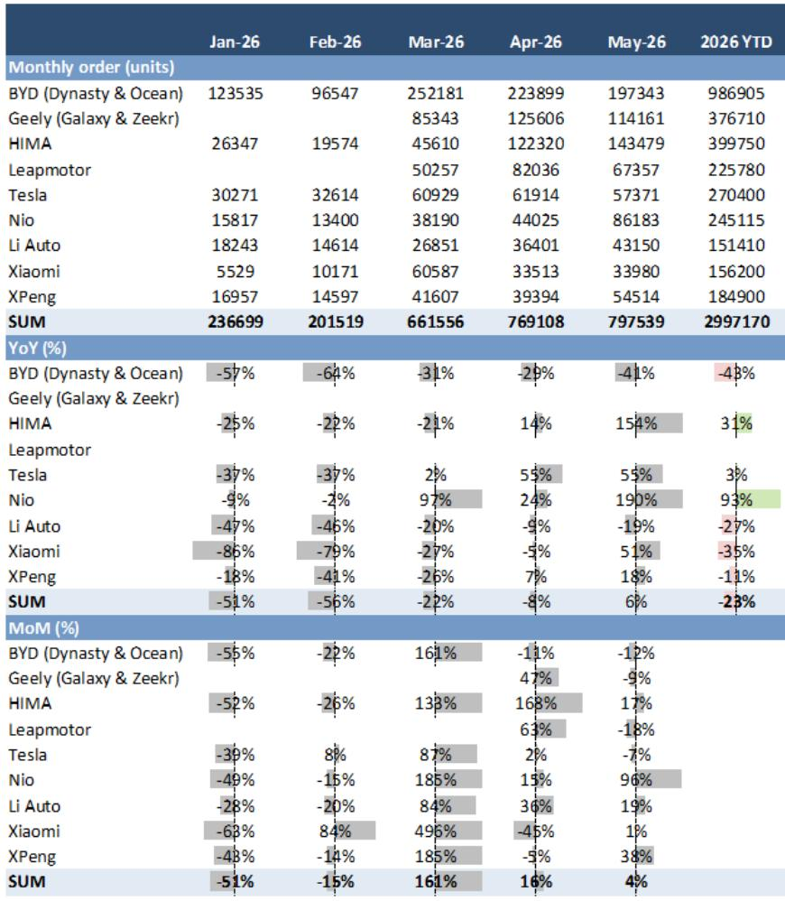
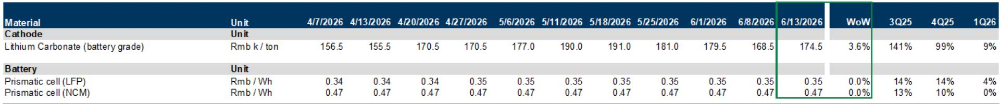

# China's NEV Market Is Entering a Demand Normalization Phase That Rewards Execution Over Excitement

The headline numbers from China's new energy vehicle market in Week 24 of 2026 tell a story that is easy to misinterpret. Weekly NEV orders declined 14% year-on-year and 13% week-on-week. Retail NEV penetration settled at 66.7%, while wholesale penetration reached 67.2%. For the casual observer, this looks like a market losing momentum. That reading would be a strategic error.

The correct interpretation is that China's NEV market is transitioning from a phase driven by launch-event excitement into a phase governed by sustained operational discipline. The initial pulse of new model introductions in late May has dissipated. What remains is the underlying demand baseline. And that baseline, when examined through the lens of brand-level order patterns and pricing behavior, reveals a market that is structurally healthier than the aggregate numbers suggest. The question for investors and corporate strategists is no longer whether electrification will happen. That battle is over. The question is which players can sustain margin and market share when the easy wins from product novelty have been exhausted.

This transition matters now because the signals that will determine winners and losers are shifting from top-line growth rates to the micro-foundations of competitive advantage: dealer discount management, battery cost pass-through, and the sequencing of product launches across a crowded calendar. The data from Week 24 provides an early, incomplete, but highly instructive window into this new competitive logic.

## The Week 24 Order Data Reveals a Market Where Defensive Growth Is More Telling Than Absolute Volume

At first glance, a 14% year-on-year decline in combined weekly orders for key NEV OEMs appears concerning. But this aggregate figure masks a critical divergence. Geely posted 8% week-on-week growth. BYD declined only 4% week-on-week. Tesla declined 8% week-on-week. These three names constitute the defensive core of the market. Their relative stability is not random. It reflects genuine structural advantages in brand positioning, product cycle timing, and distribution discipline.

Geely's performance is particularly instructive. The company has executed a multi-brand strategy that spreads risk across the Galaxy and Zeekr nameplates. In a week when many competitors saw orders drop by double digits, Geely's ability to post positive sequential growth suggests that its product cadence is resonating with a segment of buyers who are not simply chasing the newest launch. This is a sign of brand stickiness, not just promotional firepower.

BYD's modest decline, by contrast, should be read as a function of scale. With monthly orders still exceeding 197,000 units in May, BYD operates at a volume level where sequential declines are almost inevitable outside of peak launch periods. The -4% week-on-week figure is actually a testament to the company's ability to maintain demand at extraordinarily high levels. BYD's dealer discount narrowed to 4.27% as of June 13, down from 5.14% just a week earlier. This is a deliberate strategic choice to protect margin, even at the cost of some volume. It signals confidence that the brand's value proposition can sustain demand without aggressive price cuts.

Tesla's -8% week-on-week decline is more ambiguous. The company's year-to-date order growth of 3% year-on-year is the weakest among the defensive group. This is not a crisis, but it does raise the question of whether Tesla's product cycle is becoming less differentiated in a market flooded with compelling alternatives from domestic Chinese OEMs.

The contrast with the rest of the field is stark. HIMA, which had been riding a wave of momentum following its launch surge, saw orders drop 25% week-on-week. Nio, despite its impressive 93% year-to-date order growth, experienced a 30% week-on-week decline in Week 24. Xiaomi's orders fell 32% week-on-week. These are not signs of failure, but they are clear evidence that the post-launch demand spike is fading faster than some bullish forecasts anticipated.

## The Divergence Between NEV and ICE Dealer Discounts Signals a Structural Shift in Pricing Power

One of the most analytically significant data points in the Week 24 report is not an order number. It is the behavior of dealer discounts. NEV average dealer discount versus MSRP narrowed to 7.54% as of June 13, down from 7.79% a week earlier. Over the same period, ICE average dealer discount widened to 19.56% from 19.54%. The gap between NEV and ICE discount rates is now over 12 percentage points. This is not noise. It is a structural signal.

Interpret what this means. NEV manufacturers are gaining pricing power. They are able to reduce the incentives needed to move vehicles off dealer lots. ICE manufacturers are losing pricing power. They are being forced to offer deeper discounts to defend shrinking market share. This divergence is self-reinforcing. As NEV penetration approaches 67%, the volume base for ICE vehicles is contracting. Fixed costs in ICE manufacturing, including dealer network expenses, must be spread over fewer units. This creates a downward spiral where lower volumes force higher discounts, which further erode margins, which accelerates the shift to NEV.

The strategic implication is clear. For NEV OEMs, the window to improve unit economics is opening. The combination of rising penetration and narrowing discounts means that revenue per vehicle is becoming more predictable. For ICE-dependent OEMs, the window to restructure is closing. The data suggests that the traditional 20%-plus discount levels are becoming permanent, not promotional. Any ICE brand that has not yet committed to a credible electrification transition is now facing a margin squeeze that will only intensify.

The battery cost picture adds another layer to this analysis. The price of battery-grade lithium carbonate rose 3.6% week-on-week to 174,500 RMB per ton. Yet prismatic LFP and NCM cell prices remained stable. This is a sign that battery manufacturers are absorbing raw material cost increases rather than passing them through to automotive customers. For NEV OEMs, this is a tailwind. It means that the cost structure of electric vehicles is not deteriorating despite upstream pressure. The stable cell prices, combined with narrowing dealer discounts, create a rare moment where both the cost side and the revenue side of the NEV profit equation are moving in a favorable direction.

## The Product Launch Calendar Is Creating a Fragmented Demand Pattern That Benefits Disciplined Execution

The report's listing of upcoming product launches from Week 25 through Week 30 reads like a catalog of competitive intensity. Nio is launching ET5, ET5T, and EC6 facelifts. Leapmotor is launching C10, C11, and C16 facelifts. BYD is launching Da Tang and the N8L flash-charging version. Li Auto is launching the L8 facelift. XPeng is unveiling the MONA L03. This is an extraordinary concentration of new product introductions in a short period.

The conventional wisdom is that this launch wave will stimulate demand. The more nuanced reading is that it will fragment demand. In a market where multiple OEMs are introducing important new models within weeks of each other, the marginal buyer has more choices but less clarity. The risk is that launch events cannibalize each other, with the total demand pool expanding less than the sum of individual OEM forecasts.

This environment rewards operational discipline over marketing bravado. The OEMs that will emerge strongest from this period are those that can manage their launch cadence to avoid direct head-to-head competition with similarly positioned products, that have the production capacity to fulfill orders without creating delivery bottlenecks, and that have the pricing flexibility to adjust without destroying brand equity.

Geely's strategy of launching across multiple brands and price points looks increasingly prescient in this context. BYD's decision to launch Da Tang, a high-profile model, during a period of intense competitive activity is a test of whether its brand strength can overcome launch congestion. XPeng's timing of the MONA L03 unveiling, followed by the official launch in July, suggests a deliberate two-step approach that keeps the product in the news cycle without getting lost in the noise.

## What the Report Does Not Yet Answer: The Durability of Demand at 67% Penetration

The Week 24 data provides a snapshot, not a forecast. There are several critical questions that the report does not fully resolve, and these questions should shape how investors and strategists use this information.

First, the penetration rate of 67% is a milestone, but it is not a ceiling. The question is what demand looks like as penetration moves from 67% to 80% or higher. The early adopters and the technology-forward buyers have already converted. The next wave of NEV buyers will be more price-sensitive, more pragmatic, and less forgiving of product flaws. The order patterns we see today may not be representative of the demand profile at 75% penetration.

Second, the narrowing of NEV dealer discounts is positive, but it is unclear whether this trend is sustainable. If the upcoming launch wave leads to excess inventory, discounting could widen again. The stability of discounts through the second half of 2026 will be a more telling indicator of structural pricing power than the current snapshot.

Third, the battery cost dynamics are favorable today, but lithium carbonate prices are volatile. A sustained increase in raw material costs that eventually forces cell price increases would compress NEV margins just as OEMs are trying to defend pricing. The report shows stable cell prices for now, but the upstream pressure is building.

Fourth, the performance of specific brands like Nio and HIMA raises questions about the sustainability of their growth trajectories. Nio's 93% year-to-date order growth is impressive, but the 30% week-on-week decline in Week 24 suggests that the demand surge from recent launches is already fading. HIMA's 25% week-on-week decline is even more pronounced. These brands need to demonstrate that they can maintain demand momentum between product cycles, not just during them.

## A Decision Framework for Interpreting NEV Weekly Data as a Strategic Signal

For readers who want to use this data operationally, the following framework may be useful. It is not a substitute for the full report, but it provides a lens for interpreting weekly order data as more than just a number.

The first variable to track is the ratio of NEV to ICE dealer discount trends. When NEV discounts are narrowing and ICE discounts are widening, as they are now, the structural advantage is with NEV. When this ratio reverses, it signals that NEV pricing power is weakening, which would be a red flag for margin expectations.

The second variable is the dispersion of order growth across brands. When the market is broad-based, with most brands showing similar trends, the macro environment is the dominant driver. When dispersion is high, as it is in Week 24, company-specific factors are more important. Investors should focus on the brands that are outperforming their peer group, not just the market average.

The third variable is the relationship between launch events and sustained order levels. The initial launch pulse is almost always strong. The test is whether orders stabilize above the pre-launch baseline after the initial spike fades. Brands that can maintain orders at 70% or more of their launch peak, six to eight weeks after the event, have genuine product-market fit. Brands that see orders collapse back to pre-launch levels are relying on novelty, not value.

The fourth variable is battery cell pricing relative to raw material costs. When cell prices are stable despite rising lithium carbonate prices, as they are now, the battery supply chain is absorbing cost pressure. This is a tailwind for NEV margins. When cell prices start to rise in response to raw material costs, the margin outlook for NEV OEMs deteriorates rapidly.

## The Full Report Contains the Granular Data Behind These Signals

The weekly order data, dealer discount trends, and battery pricing dynamics presented in this analysis are extracted from a comprehensive chartbook that tracks the Chinese passenger vehicle market with a level of granularity that is rare in public sources. The full report includes detailed weekly order histories for each major brand, month-to-date and year-to-date comparisons, individual brand-level dealer discount charts, and upstream battery pricing data that allows readers to build their own forecasts.

The charts that accompany the original report are particularly valuable for visualizing the trends that numbers alone cannot fully capture. The NEV dealer discount trend chart shows the trajectory of discount narrowing over the past 18 months. The ICE dealer discount trend chart shows the opposite trajectory. The brand-level discount comparisons reveal which OEMs are winning the pricing battle and which are being forced into defensive positions.

Join the community to read the full report and review the original charts.

*This article is for learning and discussion only and does not constitute investment advice.*

Personal reading notes and learning share only. Not investment advice.

