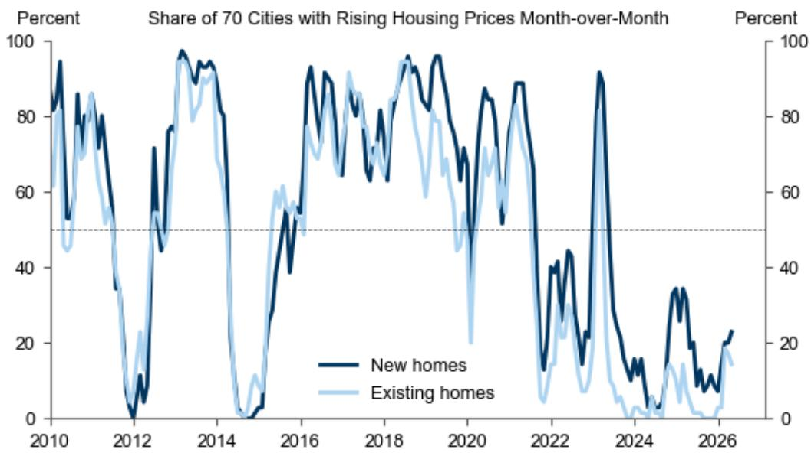
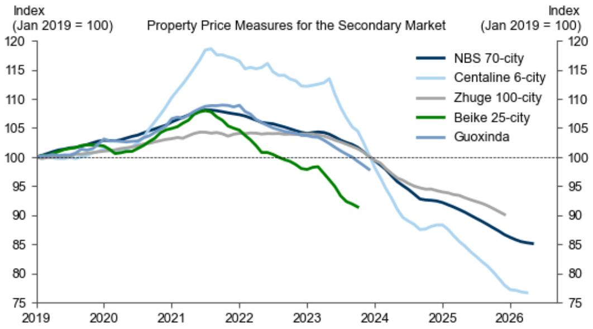
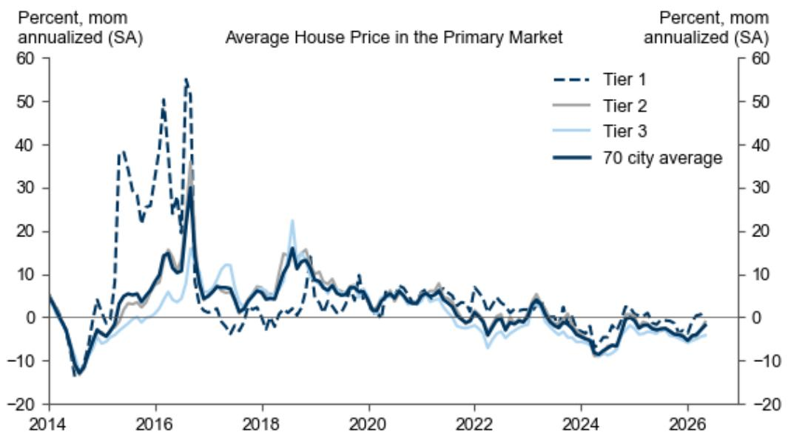

# GS：五月新房价格跌幅收窄，但市场真正的信号藏在二手房与库存之间

这份来自GS中国经济学团队的最新研报，基于国家统计局70城数据，给出了一个看似温和但内部结构高度分化的判断：五月新房价格环比跌幅收窄，一线城市甚至出现环比正增长。但如果你只读到“企稳”两个字，可能就错过了这份报告真正想传达的信息。

GS团队在报告中反复强调一个关键区分：70城数据仅覆盖新房市场。而二手房市场的价格，根据NBS及第三方平台的数据，过去一年跌幅在5%至10%之间。这意味着，当前市场的价格信号存在明显的“双轨”特征——新房市场的边际改善，并不能简单等同于整体房价的触底。

对于产业决策者和高净值读者而言，真正需要追问的不是“市场是否已经见底”，而是“在总量数据改善的表象下，哪些结构性变量正在重塑定价逻辑”。这份报告提供了几个值得深挖的线索。

## 1. 一线城市新房价格环比转正，但驱动力高度集中且依赖局部政策

五月数据最亮眼的部分是一线城市新房价格环比年化上涨1.4%，较四月的0.7%明显加速。其中深圳表现最为突出，环比年化涨幅达到3.9%，远超四月的1.6%。上海、杭州、合肥等城市同比依然保持正增长。

然而，GS在报告中明确指出，近期的政策宽松仍然是“局部性的”。广州的收储计划、各地对住房公积金使用的扩大，这些措施并未形成全国性的、系统性的需求提振。换言之，一线城市的回暖更多是局部政策刺激与个别城市供需结构改善的结果，而非全国房地产市场的普遍性复苏。

这意味着，投资者在关注一线城市数据时，需要追问：这种环比改善的可持续性如何？如果政策刺激的边际效应递减，这些城市能否依靠自身的基本面维持价格稳定？目前报告并未给出明确答案，但隐含的判断是，这种改善的广度与深度仍有待观察。

## 2. 二三线城市跌幅收窄，但“收窄”不等于“止跌”，库存压力才是核心变量

五月二线城市新房价格环比年化跌幅从-2.7%收窄至-1.1%，三线城市从-2.9%收窄至-1.8%。从方向上看，这是一个积极信号，表明最剧烈的下跌阶段可能已经过去。

但GS同时提供了一个更值得关注的指标：主要城市的库存月数（可售面积除以12个月滚动销售面积）从28.9个月下降至28.5个月。虽然降幅微小，且主要由二线城市驱动，但这表明去库存过程仍在进行中。

这里有一个关键的“所以呢”：库存月数依然处于历史高位。28.5个月意味着即使在没有新增供应的前提下，现有库存也需要超过两年才能消化完毕。在这样的库存压力下，开发商降价促销的动力依然强劲。因此，二三线城市价格跌幅的收窄，更可能是政策托底与开发商主动降价之间的暂时平衡，而非需求端根本性的好转。

对于关注区域市场的读者而言，需要建立一个新的观察框架：不再仅仅盯着价格环比变化，而是将“库存月数的变化速度”作为判断市场是否真正触底的前瞻指标。只有当库存月数出现连续且显著的下降，价格的企稳才更具说服力。

## 3. 高频交易量数据与价格信号出现背离，市场正处于“量稳价跌”的博弈阶段

GS的高频跟踪数据显示，30城新房交易量在五月和六月初基本与去年同期持平。这是一个容易被忽视但非常重要的信息。

通常，在房地产市场下行周期中，交易量的企稳往往被视为价格见底的前兆。然而，当前的情况是“量稳”但“价未稳”——新房价格虽然跌幅收窄，但仍在下跌；二手房价格跌幅更深。这种背离意味着什么？

一个合理的解释是，当前的市场正处于“以价换量”的博弈阶段。开发商和二手房业主通过主动降价来换取流动性，从而维持了交易量的稳定。但买家的预期并未根本扭转，他们仍在等待更低的价格。这种“量稳价跌”的状态，本质上是一种脆弱平衡。一旦外部环境（如收入预期、信贷政策）出现变化，交易量可能再次萎缩，价格也可能加速下跌。

这份报告没有直接预测这种平衡何时会被打破，但它提供了一个清晰的观察框架：未来几个月，投资者应该重点关注“交易量是否能够持续高于去年同期水平”以及“二手房价格跌幅是否开始收窄”。如果这两个条件同时满足，才意味着市场可能从“以价换量”进入“量价齐稳”的阶段。

## 4. 报告尚未完全回答的关键问题：政策力度与市场信心的“缺口”究竟有多大

GS这份研报的数据扎实、逻辑清晰，但它也留下了一个尚未完全展开的问题：当前的政策力度与市场信心的恢复之间，究竟存在多大的缺口？

报告提到了广州的收储计划、住房公积金的扩大使用，但这些政策本质上属于“供给侧”或“交易成本侧”的调整，并未直接作用于居民的收入预期和对未来房价的长期信心。GS在报告中并未测算这些政策对需求的拉动效果，也没有讨论是否需要更大规模的财政或货币刺激来填补这个缺口。

这是一个值得所有读者深思的问题。从历史经验看，房地产市场的复苏从来不是一个线性过程。政策可以托底，但无法创造需求。只有当居民的收入预期改善、对资产价格的长期信心恢复时，需求才会自发回归。目前，我们看到的更多是政策驱动的边际改善，而非信心驱动的内生复苏。

## 5. 给决策者的观察框架：从“看价格”转向“看结构”和“看流动性”

基于GS这份报告的核心数据与逻辑，我们建议读者建立一个新的观察框架，以取代过去简单的“涨跌判断”。

第一，区分“新房市场”与“二手房市场”。新房市场的价格受开发商定价策略、推盘节奏和局部政策影响较大，容易失真。二手房市场的价格更能反映真实的供需关系和业主的预期。GS报告明确指出，二手房价格跌幅远大于新房，且部分第三方平台数据已经暂停发布（如贝壳在2023年10月暂停发布二手房价格数据），这本身就说明市场定价的透明度在下降。

第二，关注“库存月数”而非“价格环比”。库存月数是判断开发商定价权的核心指标。当库存月数高于24个月时，开发商几乎没有议价能力，价格下跌是大概率事件。只有当库存月数降至18个月以下，开发商才可能具备提价的条件。目前全国主要城市库存月数仍在28个月以上，这意味着“以价换量”仍将是未来一段时间的主旋律。

第三，追踪“交易量”的持续性。交易量是市场的“温度计”。如果未来两个月30城新房交易量能够持续高于2023年同期水平，同时二手房交易量不再萎缩，那么市场可能正在构筑一个阶段性底部。但这仍然不等于“反转”，而只是“企稳”。

这份GS研报的价值，不在于给出了一个简单的“买”或“卖”的建议，而在于它提供了一个基于数据的、结构化的分析框架。它告诉我们，当前市场的核心矛盾不是“涨还是跌”，而是“在总量数据改善的背后，哪些城市、哪些品类、哪些指标真正在发生变化”。

报告中还有一些图表和细节，比如按城市等级拆分的价格变化、不同第三方平台二手房价格指数的对比，这些数据背后隐藏着更丰富的二阶影响。比如，为什么深圳的环比涨幅远超其他一线城市？这背后是政策差异、人口流动还是供给结构？这些问题的答案，可能比总量数据本身更具投资参考价值。

欢迎来星球微信群里继续讨论这份报告的完整解读与原始图表，以及我们基于这些数据对下半年地产板块资产配置的进一步推演。

Personal reading notes and learning share only. Not investment advice.

