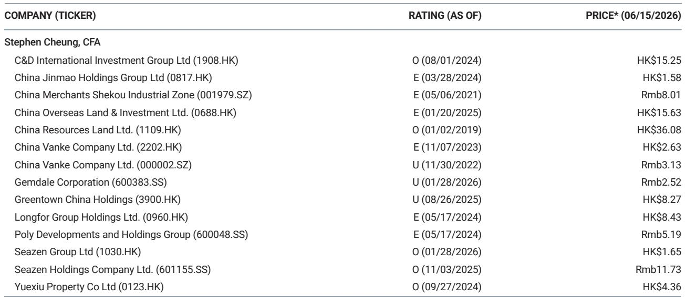
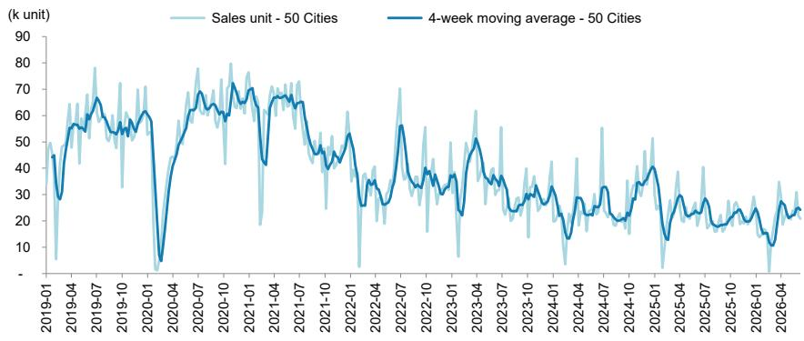

# China’s Property Market Is Not Recovering — It Is Recalibrating, and That Changes Everything for Investors

The headline numbers from the latest weekly property tracker look like a stabilization story. Primary sales across 50 Chinese cities declined only 1% year-on-year. Secondary sales actually rose 4%. After months of sharp contractions and policy whiplash, a flat-to-mildly-positive reading might seem like a turning point. It is not. A deeper look at the data reveals a market that is not healing but restructuring — and the forces driving this recalibration will determine winners and losers for years, not quarters.

The critical insight hiding in plain sight is the collapse in the sell-through rate. Last week, the total sell-through rate fell to 48%, down from 100% the prior week. In Tier 1 cities, it dropped from 100% to 45%. This is not a blip. It signals that the volume of new supply being absorbed by end-users has halved in a single week. When sell-through rates halve while sales volumes barely move, the implication is clear: developers are launching far more units than the market can absorb, and the gap is widening. The market is not clearing. It is being flooded.

This report argues that the conventional framework for analyzing China's property sector — watching sales volumes, prices, and policy signals to divine a recovery timeline — is no longer sufficient. Investors must adopt a structural lens. The data from the latest weekly tracker shows that the market has entered a phase where the old rules of cyclical recovery no longer apply. The question is not when the bottom will come. The question is what the bottom will look like, and which parts of the ecosystem survive the transition.

## The Divergence Between Primary and Secondary Markets Reveals a Structural Shift in Buyer Behavior, Not a Temporary Pause

At first glance, the primary and secondary markets appear to be telling a consistent story. Primary sales down 1% year-on-year. Secondary sales up 4%. Both are close to flat, which, given the severity of the downturn over the past three years, might be interpreted as evidence that demand has stabilized. But this interpretation collapses under scrutiny. The divergence in trajectory — primary sales slowing sharply from +21% the prior week while secondary sales also decelerated from +23% — suggests that the stabilization is fragile and uneven.

The more important pattern is the relative performance of primary versus secondary markets over time. Year-to-date, primary sales are down 12% year-on-year. Secondary sales are up 6%. This is not a small gap. It is a 1,800-basis-point divergence that has persisted for months. In a healthy market, primary and secondary volumes tend to move together because they serve the same underlying demand. When they diverge this dramatically, something fundamental has changed in buyer preferences.

What the data reveals is a flight to certainty. Buyers are increasingly favoring secondary units because they offer immediate possession, known quality, and no construction risk. In an environment where developer balance sheets remain under pressure and project completion timelines are uncertain, the premium on certainty has risen sharply. This is not a cyclical preference shift. It is a structural repricing of risk by the end consumer. The secondary market is becoming the primary market for risk-averse buyers, while the primary market is increasingly dependent on speculative or forced demand.

The implication for investors is uncomfortable but unavoidable. The traditional model of property investing in China — buying primary units at launch and selling into a rising market — is breaking. The secondary market premium suggests that the liquidity premium has flipped. Secondary units are now more liquid than primary units, which is the opposite of what one would expect in a functioning market. This inversion will persist until developers rebuild trust, and that will take years, not months.

## The Collapse in Sell-Through Rates Is the Single Most Important Metric, and It Points to an Inventory Crisis That Policy Cannot Quickly Solve

The sell-through rate is the most revealing data point in the entire report, yet it is the one most likely to be overlooked by investors focused on headline sales volumes. A sell-through rate of 48% means that for every 100 units launched into the market, only 48 were sold in the same period. The prior week, that number was 100%. Even allowing for weekly volatility, a drop of this magnitude is extraordinary.

In Tier 1 cities, the sell-through rate fell from 100% to 45%. In Tier 2 cities, it dropped to 51%. The previous week's Tier 2 data was listed as nil, which itself is a red flag — it suggests that either no new units were launched or the data collection methodology changed, neither of which is comforting. The Tier 1 collapse is particularly concerning because these markets have been the presumed safe havens. If Beijing, Shanghai, Guangzhou, and Shenzhen cannot clear new supply, no market can.

The math is straightforward. If developers continue launching units at the current pace, unsold inventory will accumulate rapidly. This creates a self-reinforcing negative cycle: rising inventory forces developers to cut prices, which depresses buyer expectations, which further reduces sell-through rates, which increases inventory. The policy tools available to break this cycle — interest rate cuts, down payment reductions, purchase restriction relaxations — are all demand-side measures. They cannot fix a supply-side problem. The only way to clear inventory is to slow the pace of new launches, which many developers cannot afford to do because they need sales revenue to service debt.

The sell-through data suggests that the market is entering a phase of forced inventory accumulation. This is not a precursor to a recovery. It is a precursor to a price correction. Investors who are waiting for policy to trigger a demand rebound are missing the point. The constraint is not demand. It is the mismatch between supply and the market's absorptive capacity at current price levels.

## Tier 1 Cities Are No Longer a Safe Harbor, and the Convergence of Sell-Through Rates Across Tiers Proves That the Downturn Has Become Systemic

One of the enduring narratives of China's property downturn has been that Tier 1 cities would hold up better than lower-tier markets due to stronger demand fundamentals, higher incomes, and net population inflows. The data in this report challenges that narrative directly. Tier 1 primary sales declined 9% year-on-year, worse than Tier 2's 2% increase and even Tier 3's 4% decline. More importantly, Tier 1 sell-through rates fell to 45%, below the Tier 2 average of 51%.

This convergence is significant. It means that the structural issues plaguing lower-tier markets — oversupply, weak demand, price sensitivity — have now migrated up the city hierarchy. Tier 1 markets are not immune. They are simply at an earlier stage of the same adjustment process. The property agent index in Tier 1 cities fell from 54.4 to 53.2 in a single week, indicating that even the professional intermediaries who facilitate transactions are becoming less confident.

The asking price index for secondary units across six major cities edged down from 17.5% to 17.4%. This is a tiny move, but the direction matters. After months of relative stability, asking prices are beginning to soften. When combined with falling sell-through rates and declining agent confidence, the picture is of a market where sellers are starting to capitulate. The price discovery process has begun, and it is likely to be downward.

For investors, the implication is that geographic diversification within China's property market no longer provides the risk mitigation it once did. A portfolio of Tier 1 property assets is not meaningfully safer than a portfolio of Tier 2 assets. The entire system is correlated because the drivers of the downturn — developer leverage, buyer risk aversion, and policy uncertainty — are national in scope. The only differentiation that matters now is at the developer level, not the city level.

## What the Report Does Not Fully Answer: The Interaction Between Secondary Market Liquidity and Developer Funding Constraints

The data in this report provides an excellent snapshot of transaction volumes and sell-through rates, but it leaves a critical question unanswered: what is happening to the secondary market's role as a source of liquidity for the broader property ecosystem? In a normal market, secondary transactions provide homeowners with cash that can be used to upgrade to primary units. This creates a virtuous cycle. But if secondary buyers are predominantly end-users purchasing for occupancy rather than investment, the secondary market is absorbing liquidity rather than recycling it.

The report shows secondary sales rising 4% year-on-year, but it does not break down whether these transactions are cash purchases or mortgage-financed. If a growing share of secondary transactions are cash purchases by risk-averse buyers, the liquidity that would normally flow back into the primary market is being locked up. This would exacerbate the funding constraints facing developers, who rely on a steady stream of buyer deposits and mortgage approvals to manage their cash flow.

This is a second-order effect that the data alone cannot confirm, but the logic is compelling. If secondary market liquidity is being trapped rather than recycled, the primary market will face a funding shortage that no amount of policy easing can address. The report's data raises this possibility but does not resolve it. Investors who want to understand the full picture need to look beyond transaction volumes and examine the funding flows between markets.

## A Decision Framework for Investors: How to Position for a Market That Is Recalibrating, Not Recovering

Given the structural nature of the current adjustment, investors need a decision framework that goes beyond the usual cyclical playbook. The following framework is derived from the patterns in the data and is designed to help investors distinguish between noise and signal.

First, prioritize sell-through rates over sales volumes. A developer can report stable sales volumes by launching more units, but if sell-through rates are falling, the quality of those sales is deteriorating. Focus on developers whose sell-through rates are stable or improving relative to the market average. These are the companies that have pricing power and brand trust, which are the only durable advantages in a buyer's market.

Second, watch the secondary market premium as a leading indicator. The gap between secondary and primary transaction volumes is a measure of buyer confidence. If secondary volumes continue to outpace primary volumes, it means buyers are still avoiding new units. Any narrowing of this gap should be treated as a potential turning point. Until then, assume that buyer preferences are structurally shifted toward existing units.

Third, treat Tier 1 city exposure as a risk factor, not a safety factor. The convergence of sell-through rates across tiers means that geographic diversification within China is no longer a reliable hedge. Developers with concentrated exposure to Tier 1 markets may face sharper corrections as those markets adjust to the new normal. Conversely, developers with diversified exposure across multiple tiers may be better positioned to absorb regional shocks.

Fourth, monitor the asking price index for signs of acceleration. A decline from 17.5% to 17.4% is small, but if the pace of decline picks up, it will signal that sellers are losing patience. Accelerating price declines would trigger margin calls, forced sales, and further downward pressure on prices. This is the risk scenario that investors should be prepared for, even if it is not the base case.

Fifth, ignore policy announcements and watch policy implementation. The Chinese government has ample tools to support the property market, but the effectiveness of those tools depends on execution. The sell-through data is a real-time measure of whether policy measures are reaching end-users. If sell-through rates remain below 50% despite continued policy easing, it means the measures are not working. If sell-through rates stabilize above 60%, it means the market is responding.

## The Full Picture Requires Granular Data That This Report Cannot Provide — Join the Community to Access the Original Charts and Analysis

The weekly database tracker provides an invaluable snapshot of market conditions, but it is only one piece of a much larger puzzle. The sell-through rate collapse, the primary-secondary divergence, and the Tier 1 convergence all point to a market in structural transition, but the data alone cannot answer the most important questions. Which developers are best positioned to weather the adjustment? How long will the inventory accumulation phase last? What triggers the next leg of the cycle?

These questions require access to the full dataset, including the historical charts, city-level breakdowns, and developer-specific metrics that are too detailed to include in a summary. The original report contains exhibits that show the four-week moving average of primary sales across 50 cities, which provides a much clearer picture of the trend than weekly snapshots alone. It also includes the property agent index and asking price tracking that are essential for understanding market psychology.

Join the community to read the full report and review the original charts. The data is too rich to be reduced to a single narrative. Only by studying the full dataset can investors develop the conviction needed to navigate a market that is recalibrating in real time.

*This article is for learning and discussion only and does not constitute investment advice.*

Personal reading notes and learning share only. Not investment advice.

