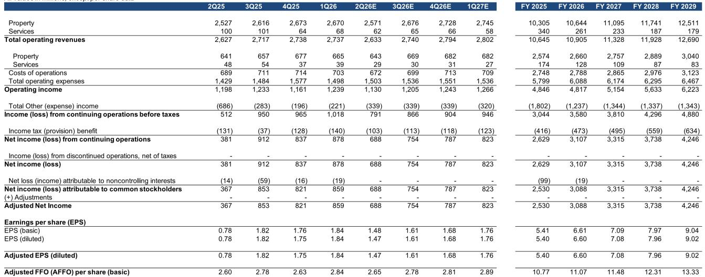
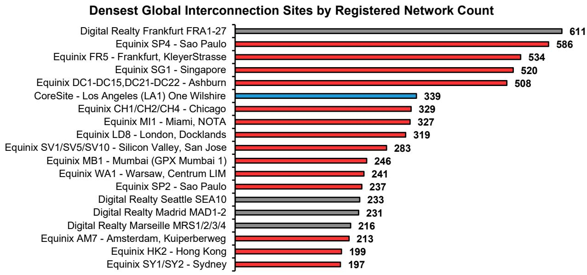

# Data Center Interconnection Is the Hidden Moat That Will Separate the Winners from the Commodity Players in the AI Era

The data center industry has long been viewed through the lens of power capacity, square footage, and lease rates. Investors have focused on megawatts under construction and utilization percentages as the primary drivers of value. This framework is increasingly inadequate. The real competitive advantage in enterprise colocation is not measured in watts or square feet but in the density and diversity of network connections within a facility. Interconnection—the ability to privately exchange data between networks without traversing the public internet—is transforming from a supporting feature into the primary economic engine and strategic differentiator for the leading data center operators.

This shift is not gradual. It is being accelerated by artificial intelligence workloads that demand unprecedented levels of low-latency data exchange between GPU clusters, storage systems, cloud on-ramps, and content delivery networks. The operators that have spent years building dense interconnection ecosystems are now positioned to capture a disproportionate share of this growth. Those that have treated interconnection as an afterthought face a long and expensive catch-up period.

A newly constructed proprietary database of over 21,000 interconnections across 645 critical facilities globally reveals a stark hierarchy. One operator has built a network effect so powerful that it now hosts 60 percent of all observed cloud on-ramps and averages 58 network providers per facility. Its nearest competitor averages 34. This is not a marginal advantage. It is a structural moat that will compound as AI workloads increase the premium on connectivity density.

The investment implications are clear but not yet fully priced in. The market has rewarded the leading interconnection operator with a 39 percent year-to-date return, yet the full value of its interconnect asset base may still be underappreciated. For investors, the question is no longer whether interconnection matters but which operators have built ecosystems that can sustain and monetize this advantage through the AI cycle.

## Interconnection Economics Create a Self-Reinforcing Moat That Commodity Data Centers Cannot Replicate

The financial characteristics of interconnection are exceptional by any measure within the infrastructure asset class. Cross-connects generate gross margins between 70 and 90 percent, a figure that would be the envy of most software businesses. Yet these margins are not the result of pricing power alone. They reflect the fundamentally low incremental cost of adding a connection once the physical infrastructure and ecosystem are in place.

The more important dynamic is the network effect that interconnection creates. Each new tenant or network provider that enters a facility increases the value of being present there for every other tenant. An enterprise running AI inference workloads gains more value from a facility that hosts five cloud on-ramps and three content delivery networks than from one that hosts two, even if the power and space costs are identical. This means the leading operator's facilities become the default locations for new deployments, which attracts more providers, which further increases the value proposition.

This dynamic is difficult to replicate because it requires years of investment in both physical infrastructure and ecosystem development. A new entrant cannot simply build a large facility and expect providers to show up. The providers need to see a critical mass of potential customers, and the customers need to see a critical mass of providers. The incumbent with 222 interconnected facilities and over 500,000 revenue-generating cross-connects has already solved this chicken-and-egg problem across multiple geographies.

The economics also improve as facilities fill. Cross-connects are sticky because they underpin production traffic. Once an enterprise has established multiple connections within a facility, the switching costs become prohibitive. This creates a recurring revenue stream with high visibility and low churn, characteristics that justify premium valuation multiples.

## Cloud On-Ramp Density Is the Single Most Important Indicator of Future Interconnection Revenue Growth

Not all interconnection is created equal. The most valuable connections are those that link enterprise workloads to the major cloud platforms. These cloud on-ramps enable enterprises to connect directly to AWS, Microsoft Azure, and Google Cloud without traversing the public internet, reducing latency and improving security for hybrid and multicloud architectures.

The proprietary database reveals that 60 percent of all observed cloud on-ramps are located in facilities operated by a single provider. This dominance is even more pronounced when looking at facilities that host three or more cloud on-ramps: 57 percent of these multi-cloud hubs belong to the same operator. The next closest competitor accounts for 23 percent.

This concentration matters because AI workloads are inherently multicloud. Enterprises training large language models often use one cloud for compute, another for storage, and a third for inference serving. The facility that can provide direct, low-latency connections to all three becomes the logical hub for these workloads. The operator that controls these hubs can monetize the same physical space multiple times through cross-connects, ports, and virtual links.

The challenge for competitors is that cloud providers are selective about where they place on-ramps. They prioritize facilities with existing density of enterprise tenants and network providers. This creates a virtuous cycle for the leader and a vicious cycle for laggards. A facility without cloud on-ramps becomes less attractive to enterprises, which means fewer tenants, which means less reason for cloud providers to add on-ramps.

## Geographic Pricing Disparities Create Both Opportunity and Risk for Interconnection Revenue Models

The economics of interconnection vary significantly by geography, and this variation has important implications for revenue growth trajectories. In the United States, the average cross-connect price for the leading operator is approximately $342 per month. Outside the United States, the average drops to roughly $197 per month, representing a discount of over 40 percent.

This pricing differential reflects several factors. U.S. markets, particularly the major hubs in Ashburn, Silicon Valley, and Northern Virginia, have higher demand density and more concentrated enterprise activity. International markets, while growing, often have more competitive dynamics and lower willingness to pay for premium interconnection services.

The geographic distribution of interconnection assets therefore matters enormously for revenue per cross-connect. The operator with the highest U.S. concentration benefits from the premium pricing environment. However, this advantage may narrow over time as international markets mature and pricing converges upward. The key question for investors is whether the volume growth in international markets can offset the price gap.

There is a notable exception to the U.S. pricing premium. Some of the densest interconnection facilities in the world are located outside the United States. One facility in Frankfurt hosts 611 registered networks, making it the most interconnected facility in the database. Another in Sao Paulo hosts 586. These facilities generate enormous volume but at lower per-unit prices. The revenue contribution from these assets depends on whether the operator can capture the volume while maintaining pricing discipline.

## The Database Reveals a Clear Hierarchy but Leaves Critical Questions About Future Competitive Dynamics Unanswered

The proprietary database provides unprecedented visibility into the current state of interconnection, but it cannot fully answer several questions that will determine future investment outcomes. The most important of these is whether the current leader's moat is widening or narrowing.

The database is a snapshot of registered network connections at a point in time. It does not capture the rate of change in interconnection density across different operators. If the leader is adding new providers and on-ramps at a faster rate than competitors, the moat is widening. If competitors are closing the gap through strategic acquisitions or organic investments, the competitive landscape could shift.

A related question concerns the role of virtual cross-connects and software-defined networking. The database primarily captures physical cross-connects and registered peering relationships. As more interconnection moves to virtual fabrics that can be provisioned in minutes, the importance of physical density may evolve. An operator with a strong software platform and a broad virtual fabric could potentially offer interconnection services without the same physical footprint.

The database also does not fully capture the impact of neocloud providers and GPU-as-a-service companies. These emerging players are building their own networks and may choose to interconnect directly with enterprise customers rather than through traditional colocation facilities. If this trend accelerates, it could disrupt the established interconnection ecosystem.

Finally, the database cannot predict the pace of AI workload adoption and its impact on interconnection demand. The bull case assumes that AI will drive exponential growth in data exchange and that interconnection will become even more critical. The bear case is that AI workloads will be concentrated in a small number of hyperscale facilities that bypass traditional colocation entirely.

## A Decision Framework for Evaluating Data Center Interconnection Investments

For investors seeking to incorporate interconnection analysis into their decision-making, a structured framework can help identify which operators are best positioned to capture the value of this trend. The framework should evaluate three dimensions: ecosystem density, revenue quality, and competitive durability.

Ecosystem density is the most straightforward metric. Investors should compare the number of interconnected facilities, the average number of network providers per facility, and the percentage of facilities with multiple cloud on-ramps. The operator that leads on all three metrics has the strongest foundation for interconnection revenue growth.

Revenue quality requires a deeper analysis. Interconnection revenue is only valuable if it translates into sustainable, high-margin income. Investors should examine the mix of physical versus virtual cross-connects, the geographic distribution of assets and associated pricing, and the historical trend in average revenue per cross-connect. An operator with high U.S. concentration and growing average revenue per connection has higher revenue quality than one with international exposure and declining pricing.

Competitive durability is the hardest dimension to assess but the most important. Investors should evaluate the barriers to entry in each operator's core markets, the switching costs for existing tenants, and the operator's ability to attract new network providers. The operator that can demonstrate a widening lead in provider density and cloud on-ramp presence has the strongest competitive durability.

Applying this framework to the database reveals a clear leader on all three dimensions, a second-tier player with strong European assets but lower density, and a group of regional operators that serve niche markets. The leader's combination of scale, density, and geographic concentration creates a moat that will be difficult to challenge in the near to medium term.

## The Full Picture Requires Deeper Analysis of the Competitive Dynamics and Revenue Trajectories

The proprietary database and the analysis it enables represent a significant step forward in understanding the data center interconnection market. However, the full investment picture requires a more detailed examination of the competitive dynamics, revenue trajectories, and valuation implications that cannot be fully captured in this article.

The database contains granular data on over 21,000 interconnections across 645 facilities, broken down by provider category and geographic region. It reveals not only which operators have the most connections but also which categories of providers are most concentrated and where the growth opportunities lie. For investors who want to understand which operators are best positioned for the AI-driven demand cycle, this data is essential.

The analysis also raises important questions about the sustainability of current pricing levels, the potential for disruption from virtual interconnection platforms, and the role of neocloud providers in reshaping the ecosystem. These questions require a deeper dive into the specific competitive dynamics and strategic positioning of each operator.

Join the community to read the full report and review the original charts. The complete analysis includes detailed breakdowns by provider category, geographic pricing comparisons, and a forward-looking assessment of how the interconnection landscape will evolve as AI workloads continue to scale.

*This article is for learning and discussion only and does not constitute investment advice.*

Personal reading notes and learning share only. Not investment advice.

