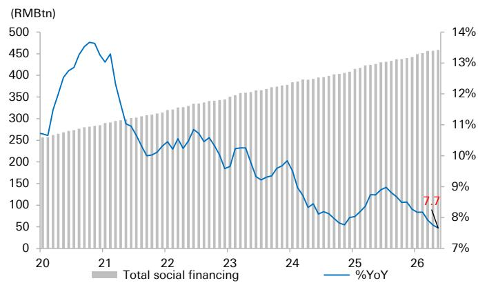
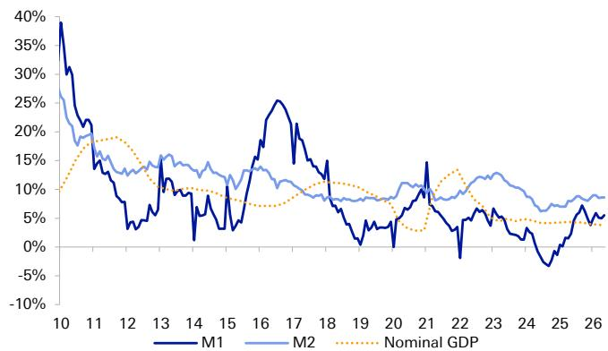

# China's Credit Data Shows a Modest Rebound, But the Deeper Problem Is a Structural Shift in Financing Demand, Not Just a Cyclical Slowdown

The May 2026 Total Social Financing and new RMB loan figures offer a case study in how misleading a "sequential improvement" narrative can be. At first glance, the data is a relief: TSF rebounded to RMB 2.0 trillion from April's disastrous RMB 625 billion, and new loans swung from negative territory to a positive RMB 520 billion. This is the kind of headline that allows market participants to exhale and declare that the worst is over. But a closer, more strategic reading of the numbers reveals a far more uncomfortable reality. The improvement is real, but it is shallow, narrowly concentrated in a few state-driven channels, and it masks a structural deterioration in the very engine of credit creation: private-sector willingness to borrow.

The real story of May is not that financing demand stabilized. It is that the composition of credit has shifted so dramatically that the traditional metrics of "recovery" no longer mean what they used to. We are witnessing the emergence of a two-speed credit system. On one side, government bonds and policy-driven corporate bill financing are doing the heavy lifting, propping up the aggregate figures. On the other side, the core drivers of organic economic growth—household mortgages, consumer credit, and corporate capital expenditure loans—are in a state of persistent contraction. This is not a typical mid-cycle slowdown. It looks increasingly like a structural re-rating of risk appetite across the Chinese economy, with profound implications for bank profitability, asset quality, and investor strategy.

The argument of this article is straightforward: the May data confirms that the Chinese banking sector is entering a new regime where volume growth is no longer a reliable proxy for earnings growth. Investors who continue to rely on aggregate credit expansion as a signal for bank performance are looking at the wrong map. The strategic question is no longer "when will loan growth recover?" but "which banks can generate sustainable returns in an environment of structurally weak private-sector credit demand?" The answer, as the data suggests, lies in a defensive rotation toward large, state-linked institutions that can absorb the drag from shrinking net interest margins and rising credit costs, while avoiding the trap of chasing volume for volume's sake.

## The May Rebound Is a Government-Led Artifact That Obscures a Deeper Private-Sector Retreat

The most important analytical takeaway from the May data is not the absolute level of TSF or new loans, but the dramatic divergence in their composition. Government bond issuance alone accounted for RMB 1.2 trillion of the RMB 2.0 trillion in new TSF, representing 60% of the total. While this is a slight moderation from April's RMB 1.5 trillion, the dependency on fiscal channels remains extreme. Corporate bond issuance and equity financing showed year-on-year strength, but these are relatively small components compared to the massive government contribution. Meanwhile, the channels that reflect genuine private-sector dynamism—trust loans, undiscounted bankers' acceptances, and other off-balance-sheet financing—continued to shrink. The off-balance-sheet deleveraging trend is not pausing; it is accelerating.

The loan data tells an even starker story. The headline rebound to RMB 520 billion in new RMB loans from a negative RMB 10 billion in April is almost entirely a story of short-term corporate loans and bill financing. Medium-to-long-term corporate loans remained negative at minus RMB 20 billion. This is a critical signal. Negative medium-to-long-term corporate lending means that companies are not borrowing to build factories, buy equipment, or expand capacity. They are borrowing to manage working capital, and in many cases, they are repaying existing term loans. This is the behavior of a corporate sector that is de-risking, not investing. The heavy reliance on bill financing—which surged to RMB 557 billion—is a further sign of weakness. Bills are short-term, low-margin instruments used for liquidity management, not for growth. They generate negligible net interest income for banks and carry a much lower yield than term loans.

The household sector is even more concerning. Household loans remained negative at minus RMB 141 billion. Both short-term consumer loans and medium-to-long-term mortgage loans were in negative territory. This is not a temporary dip. It is the fifth consecutive month of negative or near-negative household borrowing. The narrative that this is solely driven by the substitution effect of Housing Provident Fund loans offering lower rates is only a partial explanation. The deeper issue is a structural shift in household behavior. Chinese consumers are deleveraging. They are paying down debt, increasing savings, and avoiding new credit commitments. This is a rational response to a period of falling asset prices, uncertain employment prospects, and a policy environment that has not yet succeeded in restoring confidence. Until household balance sheets stop shrinking, any recovery in consumption-driven credit will remain elusive.

## The Deposit Data Reveals a Liquidity Trap That Is Squeezing Bank Margins

The deposit figures for May provide a crucial piece of the puzzle that explains why the credit weakness is so persistent. New deposits rebounded sharply to RMB 1.8 trillion, but the composition is highly unusual. The increase was overwhelmingly driven by non-bank financial institution deposits and fiscal deposits. Household and corporate deposits were mildly negative. This is the opposite of what a healthy economy looks like. In a normal recovery, you would expect household and corporate deposits to grow as incomes rise and business cash flows improve. Instead, the growth is coming from institutions that are parking liquidity, and from the government's own fiscal spending.

The decline in household savings by RMB 110 billion, while a significant narrowing from April's massive drop of RMB 1.9 trillion, is still negative year-on-year. In May 2025, household savings increased by RMB 470 billion. The marginal improvement from April is welcome, but the trend is still one of households drawing down precautionary savings to meet living expenses or pay down debt, not accumulating new wealth. Corporate deposits also fell modestly, though less severely than in April. This suggests that corporate cash flow is stabilizing, but not yet improving.

The most significant dynamic is the continued migration of deposits from traditional bank accounts toward wealth management products and capital market instruments. Non-bank FI deposits remained a key contributor, albeit at a moderated pace from April's surge. This is a double-edged sword for banks. On one hand, it signals that the capital markets are attracting some liquidity, which could eventually support equity and bond issuance. On the other hand, it represents a structural disintermediation of the banking system. As depositors move money out of low-yield savings accounts into higher-yield alternatives, banks lose their cheapest source of funding. This forces them to rely on more expensive wholesale funding or to compete for deposits by raising rates, which compresses net interest margins.

The M1 and M2 data confirms the liquidity picture. M1 growth improved slightly to 5.5%, suggesting a modest increase in transaction-ready money, likely driven by accelerated government spending. M2 remained stable at 8.6%, indicating that the monetary policy stance is accommodative. But the gap between M2 and TSF growth is telling. M2 is growing faster than TSF, which means that the banking system is creating liquidity, but that liquidity is not being transmitted into real-economy credit. It is circulating within the financial system, inflating asset prices in some pockets, but failing to reach the borrowers who would use it for productive investment. This is a classic liquidity trap, and it is the most challenging environment for bank profitability.

## The Strategic Implication: The Bank Investment Thesis Must Shift from Volume to Resilience

For equity investors in Chinese banks, the May data forces a fundamental reassessment of the investment thesis. The traditional model of investing in Chinese banks was predicated on volume growth. You bought banks because loan books expanded at double-digit rates, driving net interest income higher, and because the economy's growth absorbed credit losses. That model is broken. Loan growth is decelerating to historical lows, and the quality of that growth is deteriorating. The mix is shifting from high-yield corporate and household loans to low-yield government bonds and bill financing. Net interest margins are under structural pressure from both the asset side (lower yields) and the liability side (deposit competition).

The report's conclusion to favor large banks with corporate business exposure, resilient operating performance, and fair dividend yields is strategically sound, but it requires further unpacking. The argument is not that large banks are immune to the slowdown. It is that they are better positioned to absorb it. Large state-owned banks have several structural advantages in this environment. First, they have privileged access to low-cost deposits, particularly from state-owned enterprises and government entities. This gives them a funding cost advantage that protects their margins. Second, they are the primary channel for government bond underwriting and policy-directed lending. As the government becomes the dominant source of credit demand, large banks are the natural beneficiaries. Third, they have more diversified revenue streams, including fee income from wealth management and transaction services, which can partially offset the pressure on net interest income.

The key risk to this thesis is asset quality. If the economic slowdown deepens, corporate defaults will rise, and even large banks will face higher credit costs. The report's preference for banks with "resilient operating performance" implicitly acknowledges this risk. The question that investors must answer is whether the dividend yields on these large banks are sufficient compensation for the risk of a credit cycle deterioration. The current dividend yields are attractive, but they are only sustainable if earnings do not collapse. If credit losses rise faster than expected, dividends may be cut. The strategic decision is a bet on the resilience of the state-linked corporate sector versus the vulnerability of the broader economy.

## What the Report Does Not Fully Answer: The Timing and Trigger for a Household and SME Credit Recovery

The report provides an excellent diagnostic of the current state of credit demand, but it leaves several critical questions unanswered. The most important of these is the timing and trigger for a recovery in household and SME credit. The report notes that household loans remain negative and that corporate medium-to-long-term loans are contracting. It attributes this to cautious consumer behavior and deleveraging. But it does not specify what would change this behavior. Is it a function of income growth? If so, what is the trajectory for wage growth and employment? Is it a function of asset prices? If so, what level of housing price stabilization would be sufficient to restore confidence? Is it a function of policy? If so, what specific policy measures—beyond broad monetary easing—would be most effective?

The report also does not address the potential for a credit event. If the current trend of negative household borrowing and declining corporate term loans continues for another six to twelve months, what are the second-order effects on the banking system? Could a wave of mortgage defaults or corporate bond defaults trigger a systemic stress event? The report's recommendation to favor large banks implicitly assumes that the system remains stable. But the data on off-balance-sheet financing and the decline in trust loans suggests that there are pockets of the financial system that are under significant pressure. The resilience of the banking system as a whole may depend on how these shadow-banking risks are managed.

Finally, the report does not fully explore the implications of the deposit migration trend. If non-bank FI deposits continue to grow at the expense of traditional deposits, what does that mean for the funding models of smaller banks? Regional and smaller commercial banks are more dependent on retail deposits and are more vulnerable to disintermediation. The report's focus on large banks is correct, but it leaves open the question of whether the smaller end of the banking sector is facing a structural crisis that could lead to consolidation or distress.

## A Decision Framework for Navigating the Two-Speed Credit Regime

For readers who are portfolio managers or analysts trying to translate this analysis into actionable decisions, a structured framework is essential. The first step is to recognize that the Chinese credit market is now operating in two distinct regimes. The first regime is the government-led, policy-driven channel, characterized by bond issuance, bill financing, and directed lending to state-owned enterprises. This regime is relatively safe, low-margin, and volume-driven. The second regime is the private-sector, market-driven channel, characterized by household mortgages, consumer credit, and corporate capital expenditure loans. This regime is under severe stress, high-margin, and quality-driven.

The strategic decision for bank investors is to determine which regime will dominate the next 12 to 18 months. If the government continues to be the primary source of credit demand, then the optimal strategy is to overweight large state-owned banks that are the primary conduits for this channel. If there is a catalyst that triggers a recovery in private-sector credit—such as a significant policy stimulus directed at households, a stabilization of the housing market, or a rebound in exports that boosts corporate confidence—then the optimal strategy shifts toward banks with higher exposure to consumer and SME lending, as they would benefit from a recovery in volumes and margins.

The key indicators to watch are not the aggregate TSF or loan growth figures, but the composition. Investors should monitor three specific data points: (1) the trajectory of medium-to-long-term corporate loans, as this is the purest signal of corporate investment demand; (2) the trend in household mortgage and consumer loan balances, as this indicates whether household deleveraging has bottomed; and (3) the spread between deposit growth and loan growth, as this reveals whether the liquidity trap is deepening or easing. Until these three indicators show sustained improvement, the prudent strategy is to remain defensive and favor large, well-capitalized banks with strong deposit franchises and diversified revenue streams.

The May data is a warning, not a reassurance. It tells us that the easy part of the recovery—the policy-driven stabilization—has been achieved. The hard part—restoring private-sector confidence and credit demand—has not even begun. The banks that will outperform in this environment are not the ones that grow the fastest, but the ones that manage risk the best.

Join the community to read the full report and review the original charts.

*This article is for learning and discussion only and does not constitute investment advice.*

Personal reading notes and learning share only. Not investment advice.

