## Securitization Research 2026 The Mid-Year Outlook

16 June 2026

Edward Reardon, Douglas Runte, CFA, Conor O-Toole, Kayvan Darouian,

Bipul Sinha, CFA, Jamie Flannick, Rupesh Shrivastav, Vivek John, Nick Huang

## Table of Contents

Macro: Demand-surge pricing

Commercial MBS: Supportive technicals, accelerating credit resolution

CLO: Reflections at the midpoint

Consumer and Esoteric ABS: Rising issuance, mixed picture on credit

Transportation Debt: Record aircraft ABS issuance in 2026

Residential MBS: Stand and de-lever: AAAs for carry/roll, BB for de-lever/upgrade

Download DB Securitization Market Databank.xlsx

## Securitized Mid-Year Outlook Demand-surge pricing

Ed Reardon, Managing Director
Rupesh Shrivastav, Research Associate

## Big Pic: Demand surge pricing

DB Economics View.

■ Resilient economy: 2.2% real GDP growth forecast. Supported by fiscal policy, financial conditions, and AI investments. Fiscal deficit at 6.6% with risk from war, tariff refunds. Higher oil (\$150/bbl) a risk to consumer spending and could reduce real GDP to 1.75%.  
Labor: Firmer payroll gains, broader job growth. 4.3% unemployment through 2026.  
Inflation: Disinflation story less convincing, with core PCE expected to remain at 3.0%.  
Rates: Fed on hold “indefinitely”; risk skewed towards hikes. 10yr UST forecast: 4.7%.

■ Supply. Securitized full-year issuance now projected at \$1tn, net issuance is only \$270bn.

Demand. \$500bn of inflows into IG credit. \$300bn of projected annuity inflows plus \$200bn IG mutual and bond funds. Securitized likely to garner \~\$200bn.

Credit. We downgrade the Consumer slightly from B+ to a B. For securitized, a 'B' grade is still a positive backdrop and only impacts a handful of sectors and some deep subordinates.

Rates. Higher rates normally a headwind for issuance/credit, but strong economy over-riding this challenge. Higher rates will create refi stress for CLOs, CMBS.

Demographics. Demographics are playing a key role in credit. How? 1) Boomers have strong natural demand for fixed income and have the most assets, 2) Boomers are also home-owners and sitting on significant home equity.

\- Relative Value. Take the carry. Securitized will outperform Corporates via carry. Securitized sector forecasts are slightly wider. We see Non-QM as an outperformer; CLO carry is compelling. Subordinate securitized bonds will remain a food fight due to insurance demand and annuity inflows.

## Private Label Issuance Approaches Record Highs

US Securitized Credit Issuance by Sector, \$bn  
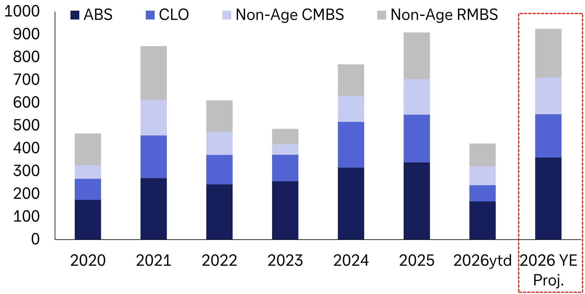

stacked bar chart

| Year       | ABS  | CLO  | Non-Age CMBS | Non-Age RMBS |
| ---------- | ---- | ---- | ------------ | ------------ |
| 2020       | 170  | 80   | 50           | 130          |
| 2021       | 260  | 190  | 140          | 230          |
| 2022       | 230  | 130  | 80           | 140          |
| 2023       | 250  | 110  | 40           | 60           |
| 2024       | 310  | 180  | 110          | 130          |
| 2025       | 330  | 190  | 140          | 230          |
| 2026ytd    | 160  | 60   | 80           | 130          |
| 2026 YE Proj. | 350 | 170 | 140          | 230          |

Source: CMA, Intex, DB, Bloomberg Finance LLP

We forecast Private Label issuance to reach \$925bn in 2026 broadly in line with the record volumes observed in 2025 (\$909bn). Including Agency CMBS, total gross issuance will exceed \$1tn.  
■ Strong capital markets execution and healthy investor demand continue to support issuance across structured credit sectors.

## Elon Musk isn't the the only Trillion-dollar game in town

2026 Issuance and Net Supply Projections, \$bn

<table><tr><td rowspan="2">Sector</td><td colspan="3">Issuance, $bn</td><td colspan="2">Net Issuance, $bn</td></tr><tr><td>2025</td><td>2026YTD</td><td>2026YE</td><td>2026 Proj. Paydowns</td><td>2026F Net</td></tr><tr><td>CMBS Non-Ag</td><td>155</td><td>82</td><td>160</td><td>145</td><td>15</td></tr><tr><td>CMBS Agency</td><td>57</td><td>39</td><td>75</td><td>45</td><td>30</td></tr><tr><td>ABS</td><td>339</td><td>168</td><td>360</td><td>305</td><td>55</td></tr><tr><td>CLO BSL</td><td>166</td><td>58</td><td>145</td><td>85</td><td>60</td></tr><tr><td>CLO Mid Mkt</td><td>43</td><td>14</td><td>45</td><td>15</td><td>30</td></tr><tr><td>RMBS Non-Ag</td><td>205</td><td>101</td><td>215</td><td>135</td><td>80</td></tr><tr><td>Total</td><td>966</td><td>462</td><td>1000</td><td>730</td><td>270</td></tr></table>

Source: CMA, Intex, DB, Bloomberg Finance LLP

■ Gross issuance projected to exceed \$1tn for the first time.  
ABS and Non-Agency RMBS remain the largest contributors to market growth, benefiting from resilient consumer credit and non-agency mortgage origination.  
- Net Supply will only be \~\$270bn, much lower than the \$1tn headline.

## Demand-surge pricing: \$500bn inflows into credit Cumulative IG Fund Flows vs Fixed Annuity Sales \$bn

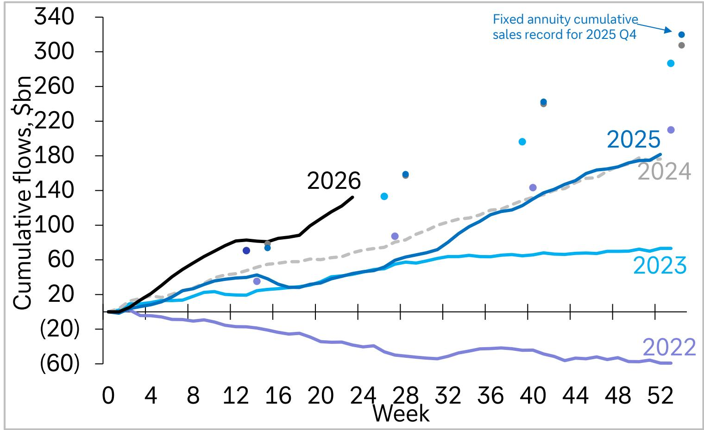

line chart

| Week | 2022 | 2023 | 2024 | 2025 |
|------|------|------|------|------|
| 0    | -    | -    | -    | -    |
| 4    | -    | -    | -    | -    |
| 8    | -    | -    | -    | -    |
| 12   | -    | -    | -    | -    |
| 16   | -    | -    | -    | -    |
| 20   | -    | -    | -    | -    |
| 24   | -    | -    | -    | -    |
| 28   | -    | -    | -    | -    |
| 32   | -    | -    | -    | -    |
| 36   | -    | -    | -    | -    |
| 40   | -    | -    | -    | -    |
| 44   | -    | -    | -    | -    |
| 48   | -    | -    | -    | -    |
| 52   | -    | -    | -    | -    |

Note: EPFR data as of 06/03/26. Bloomberg LINSTFA Index. Lines represent cumulative. EPFR fixed annuity funds flows: Dots represents cumulative. LIMRA fixed annuity sales at quarter end. Colors denoted Calander year.

Source: EPFR, DB

■ Underlying annuity demand: LIMRA fixed annuity sales will reach \~\$300bn. Higher rates likely to stimulate more inflows. Credit bond/mutual funds could bring in another \$200bn.  
Insurers buy IG Corp as a staple holding but securitized bonds help deliver the promised annuity yields.

Give Grandma and Grandpa a call...

<table><tr><td>Life event</td><td>Age Bucket</td><td>Pop Size, mn</td><td>Home Ownership rate</td><td>Est. Net Worth excl-Home</td></tr><tr><td></td><td>0-9</td><td>36</td><td></td><td></td></tr><tr><td></td><td>10-19</td><td>46</td><td></td><td></td></tr><tr><td></td><td>20-29</td><td>45</td><td>38%</td><td>$30,000</td></tr><tr><td></td><td>30-39</td><td>44</td><td>49%</td><td>$123,000</td></tr><tr><td></td><td>40-49</td><td>42</td><td>65%</td><td>$266,000</td></tr><tr><td></td><td>50-59</td><td>43</td><td>73%</td><td>$392,000</td></tr><tr><td></td><td>60-69</td><td>41</td><td>77%</td><td>$528,000</td></tr><tr><td></td><td>70-79</td><td>25</td><td>79%</td><td>$538,000</td></tr><tr><td></td><td>80+</td><td>18</td><td></td><td>$425,000</td></tr></table>

Note: Homeownership uses 50/50 blend of age groups to match with Census Bureau age groupings.  
Source: DB, Census Bureau, ICI.

Grandma and grandpa are doing pretty well for themselves.  
Homes and stocks. Demographics show a 60+ population of 84mn where over 75% own a home, participated in home price appreciation (40yrs: 5.5x increase) and a massive rise in financial wealth (40yrs S&P: 70x increase). Boomers control 60-70% of financial wealth. Big change. In 1990, working age segment controlled that share.  
■ Next up: Fixed Income. Underinvested in fixed income: coming decade could unleash \$2-4tn in fixed income demand, with some pull forward due to higher rates. Boomers have been waiting for this moment: the average 10yr UST has been 2.9% over the past 20 years.  
■ Annuity Appeal. Earn high annuity rates today of 5.5%, avoid taxes on this annuity income. Average fixed income annuity buyer is 62 years old.

## Securitized trading: Record year in sight!

Investment Grade, Non-Agency Securitization volumes, \$bn  
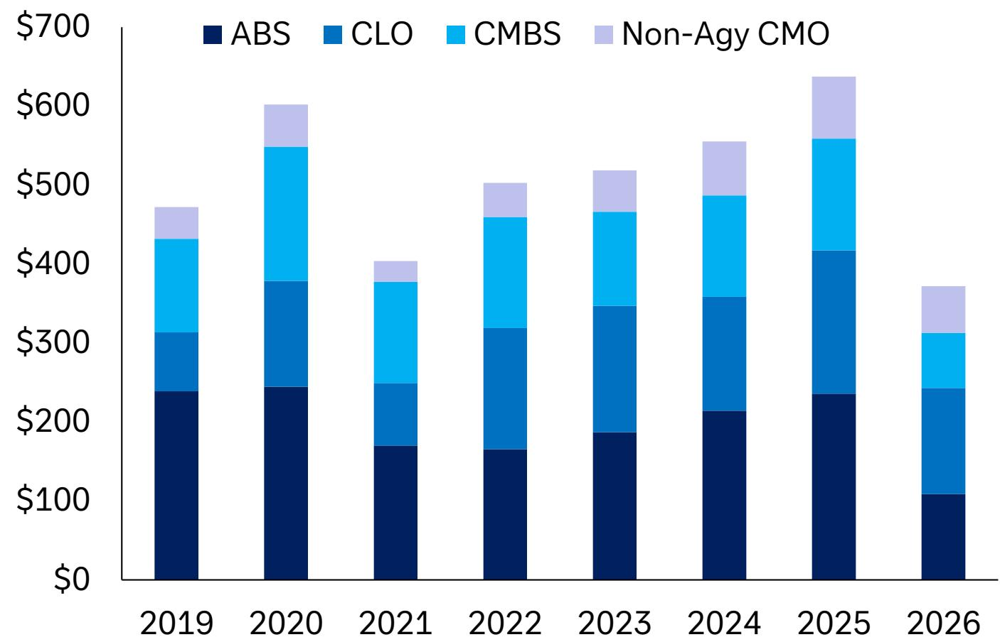

stacked bar chart

| Year | ABS   | CLO   | CMBS  | Non-Agy CMO |
|------|-------|-------|-------|-------------|
| 2019 | 235   | 100   | 140   | 40          |
| 2020 | 240   | 130   | 180   | 50          |
| 2021 | 170   | 80    | 130   | 30          |
| 2022 | 165   | 150   | 140   | 45          |
| 2023 | 185   | 160   | 120   | 55          |
| 2024 | 210   | 155   | 130   | 65          |
| 2025 | 230   | 180   | 150   | 75          |
| 2026 | 105   | 135   | 70    | 60          |

Source: Finra Trace

2026 YTD, overall IG trading volumes are \$375bn.  
■ RMBS and CLO trading activity has accelerated in 2026, with YTD volumes up 57% and 32% respectively vs same period in 2025.  
While ABS (-16%) and CMBS(-13%) volumes have moderated, despite softer ABS and CMBS trading volumes, liquidity conditions remain constructive across structured credit markets.

## Securitized spreads near historical lows

AAA Spreads vs 3-year trading range, bp  
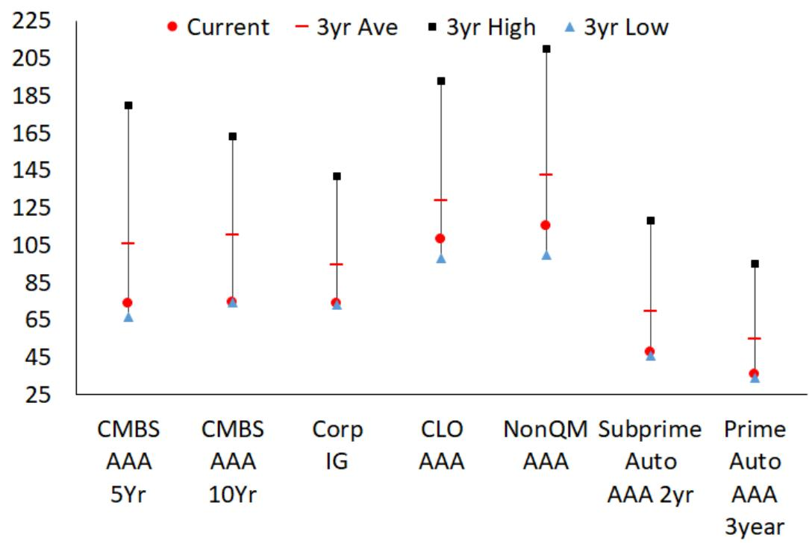

scatterplot

| Category             | Current | 3yr Ave | 3yr High | 3yr Low |
|----------------------|---------|---------|----------|---------|
| CMBS AAA 5Yr         | 70      | 105     | 180      | 60      |
| CMBS AAA 10Yr        | 70      | 105     | 160      | 70      |
| Corp IG              | 70      | 90      | 140      | 70      |
| CLO AAA              | 105     | 125     | 190      | 90      |
| NonQM AAA            | 115     | 145     | 205      | 95      |
| Subprime Auto AAA 2yr| 45      | 65      | 120      | 45      |
| Prime Auto AAA 3year | 30      | 50      | 90       | 30      |

BBB Spreads vs 3-year trading range, bp  
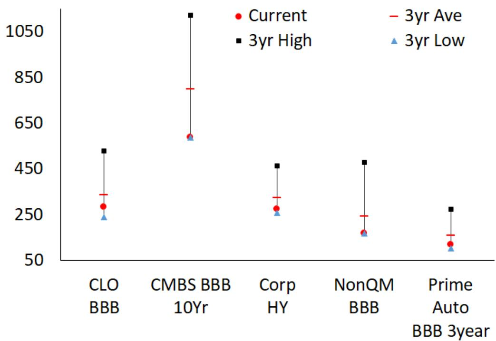

scatterplot

| Category           | Current | 3yr High | 3yr Ave | 3yr Low |
| ------------------ | ------- | -------- | ------- | ------- |
| CLO BBB            | 280     | 500      | 300     | 220     |
| CMBS BBB 10Yr       | 550     | 1100     | 780     | 560     |
| Corp HY            | 280     | 480      | 300     | 240     |
| NonQM BBB          | 180     | 480      | 240     | 160     |
| Prime Auto BBB 3year | 120     | 280      | 160     | 100     |

Note: Spreads as of 06/12. Min/Max values are within 3year range. US CMBS 2.0 Total Return Index unhedged spreads.  
Source: DB, Intex.

■ Most credit sectors are pricing on the tight end of a 3-year history.  
IG and HY Corp are close to 25-year tights.  
- Carry and security selection are likely to be larger drivers of returns in 2H26.

## Securitized Credit Spread Forecast

## Securitized issuance, \$bn

Spreads, bp

<table><tr><td colspan="2">Sector</td><td>2026 Current (06/11)</td><td>YearEnd-2026 Forecast</td><td>Change</td></tr><tr><td rowspan="11">Securitized Credit</td><td>AAA CMBS</td><td>75</td><td>75</td><td>0</td></tr><tr><td>BBB CMBS</td><td>425</td><td>475</td><td>50</td></tr><tr><td>AAA CLO</td><td>124</td><td>126</td><td>2</td></tr><tr><td>BBB CLO</td><td>285</td><td>295</td><td>10</td></tr><tr><td>AAA SP Auto 2yr</td><td>48</td><td>50</td><td>2</td></tr><tr><td>BBB SP Auto</td><td>120</td><td>125</td><td>5</td></tr><tr><td>AAA Cards</td><td>27</td><td>30</td><td>3</td></tr><tr><td>AAA PSLABS</td><td>90</td><td>95</td><td>5</td></tr><tr><td>AAA FFELP</td><td>80</td><td>80</td><td>0</td></tr><tr><td>AAA Non-QM RMBS</td><td>112</td><td>105</td><td>-7</td></tr><tr><td>BBB Non-QM RMBS</td><td>170</td><td>155</td><td>-15</td></tr><tr><td rowspan="4"></td><td>Fed Funds</td><td>3.75%</td><td>3.75%</td><td>0.00%</td></tr><tr><td>10 Yr UST</td><td>4.5%</td><td>4.7%</td><td>0.24%</td></tr><tr><td>IG Corp</td><td>74</td><td>82</td><td>8</td></tr><tr><td>HY Corp</td><td>271</td><td>305</td><td>34</td></tr></table>

Note: Fed Funds is the upper bound of Fed Funds target range.  
Source: CMA, Intex, DB, Bloomberg Finance LP

AAA securitized spreads expected to remain largely stable through year-end. BBB spreads likely to modestly widen amid macro and rate uncertainty.

## Insurers: Hoovering up "securitized" bonds

## Insurance bond holdings, \$bn

<table><tr><td></td><td>2025</td><td>% Total</td></tr><tr><td>Agy CMBS</td><td>90</td><td>2%</td></tr><tr><td>Non Agy CMBS</td><td>200</td><td>4%</td></tr><tr><td>Agy RMBS</td><td>324</td><td>6%</td></tr><tr><td>Non Agy RMBS</td><td>186</td><td>3%</td></tr><tr><td>CLO</td><td>311</td><td>6%</td></tr><tr><td>ABS</td><td>398</td><td>7%</td></tr><tr><td>Corp</td><td>2745</td><td>49%</td></tr><tr><td>UST</td><td>394</td><td>7%</td></tr><tr><td>Other Securities</td><td>898</td><td>16%</td></tr><tr><td>Total</td><td>5,547</td><td>100%</td></tr></table>

Note: We exclude \$54bn of Equity-backed ABS from ABS, included in Other securities
Source: DB, S&P Global Market Intelligence, NAIC Schedule D.

## "ABS" securitized bond holdings reported to NAIC

<table><tr><td>Assets</td><td>NAIC Category</td><td>Total, $bn</td><td>% of Total</td><td>Remarks</td></tr><tr><td>Financial Assets</td><td>Self-Liquidating</td><td>165</td><td>45%</td><td>Traditional ABS, RMBS, CMBS, CLOs</td></tr><tr><td></td><td>Not Self-Liquidating</td><td>57</td><td>16%</td><td></td></tr><tr><td></td><td>Equity Backed</td><td>52</td><td></td><td>Fund finance notes; Structured equity investments</td></tr><tr><td></td><td>Other</td><td>6</td><td></td><td>Warehouse Facilities / Private Credit Warehouses</td></tr><tr><td rowspan="3">Non Financial Assets</td><td>Practical Expedient</td><td>62</td><td>17%</td><td></td></tr><tr><td>Lease Backed</td><td>24</td><td></td><td>Aircraft lease ABS; Solar lease / Solar loan ABS</td></tr><tr><td>Other</td><td>39</td><td></td><td>Music royalties, and and solar/other ABS</td></tr><tr><td></td><td>Full Analysis</td><td>80</td><td>22%</td><td></td></tr><tr><td></td><td>Lease Backed</td><td>34</td><td></td><td>Data center ABS / Digital infrastructure ABS</td></tr><tr><td></td><td>Other</td><td>46</td><td></td><td>Whole-business ABS and IP/royalty ABS</td></tr><tr><td></td><td>Total</td><td>365</td><td>100%</td><td></td></tr></table>

Note: \$365bn is life insurance holdings only  
Source: DB, S&P Global Market Intelligence, NAIC Schedule D.

Insurers own \$1tn+ of credit-sensitive securitized assets (\$200bn non agency CMBS, \$186bn non agency RMBS, \$311bn CLO and \$398bn "ABS"). ABS is more than just traditional ABS.  
NAIC reporting change gives some further clues on “ABS” bucket: warehouse finance facilities, solar, datacenter, whole business, royalties.

## Basel III: Banks will be better buyers

<table><tr><td>Description</td><td>2023 Proposal</td><td>2026 Re-Proposal (Mar-26)</td><td>Comment</td></tr><tr><td>P-factor</td><td>1.0 (Punitive)</td><td>0.5 (Unchanged from Current)</td><td>2023 Proposal to use 1.0 &quot;p factor&quot; in KSSFA formula would increase capital for all tranches.P factor was left unchanged at 0.5</td></tr><tr><td>Risk weight floor</td><td>20%</td><td>15% for senior tranches</td><td>Proposal lowers the floor for senior securitization tranche risk weights</td></tr><tr><td>Senior tranche &quot;Look-through&quot;</td><td>Limited</td><td>Banks can use a&quot;look through&quot; to the risk weight of the underlying assets to determine the senior tranche risk weight</td><td>Prevents situation where banks hold more capital in a senior tranche than the underlying assets themselves</td></tr></table>

Source: Federal Basel III proposal.

Basel III includes favorable capital requirements for securitized tranches held by banks.  
- Mostly favorable outcomes: Lower risk weight floor of 15% on senior tranches, p factor left unchanged at 0.5. (P factor is an input into the securitized formula called KSSFA, where higher P input increases capital for more senior tranches).  
Bank demand should improve via the lower risk weight floor and p-factor staying the same. Banks have been net sellers of securitized products for a couple of years.

## CMBS 2026 Mid-Year Outlook

## Supportive technicals, accelerating credit resolution

Ed Reardon, Managing Director

Bipul Sinha, CFA, Research Analyst

Rupesh Shrivastav, Research Associate

15 $^{th}$ June 2026

## Big Pic: Supportive technicals, accelerating credit resolution

Supply runs hot, but the market is rate-constrained. We forecast \$160bn of private-label CMBS issuance in 2026, with SASB and CRE CLO activity carrying the momentum while conduit remains capped by borrower refi economics and rate volatility.  
- Spreads. Technicals remain constructive. Limited net supply and higher rates will keep demand firm. We expect AAA spreads to remain range-bound at 75-80bp, with BBB spreads widening by roughly 50bp.  
■ Relative value. Prefer SASB mezz over conduit due to better collateral transparency and sponsor selection, even though risk is binary.  
Credit stress is moving from extension to realization

Conduit 60+ delinquency continue to rise. Legacy office and recent multi-family loans are the primary delinquency driver.  
Headline delinquency understates stress. SASB delinquencies remain contained, but proactive extensions, modifications, and denominator growth have helped keep delinquencies low. Office needs more A/B modifications to reflect the basis reset.  
Liquidation volume/severity are increasing as special servicers work through the distressed backlog. Loss severity is a key trend to watch over the next year.

CMBS governance is a structural weak link. Workout outcomes hinge on conflicted control rights, opaque modifications, and delayed loss recognition. We propose cleaner incentives, proper accountability, faster transparency, and clearer documentation that limits discretion in workout outcomes.

Issuance Forecast, \$bn

<table><tr><td rowspan="2"></td><td rowspan="2"></td><td>2024</td><td>2025</td><td colspan="2">2026</td></tr><tr><td>Full</td><td>Full</td><td>YTD</td><td>YE</td></tr><tr><td rowspan="4">Private Label</td><td>Conduit</td><td>33</td><td>34</td><td>12</td><td>30</td></tr><tr><td>SASB</td><td>70</td><td>91</td><td>44</td><td>95</td></tr><tr><td>CRE CLO</td><td>9</td><td>31</td><td>22</td><td>35</td></tr><tr><td>Total</td><td>112</td><td>155</td><td>78</td><td>160</td></tr><tr><td rowspan="4">Agency</td><td>Freddie</td><td>33</td><td>39</td><td>21</td><td>40</td></tr><tr><td>Fannie</td><td>3</td><td>3</td><td>10</td><td>20</td></tr><tr><td>Ginnie</td><td>9</td><td>16</td><td>7</td><td>15</td></tr><tr><td>Total</td><td>45</td><td>57</td><td>38</td><td>75</td></tr><tr><td></td><td>Total CMBS</td><td>157</td><td>213</td><td>117</td><td>235</td></tr></table>

Note: all numbers in \$bn. Agency CMBS includes only structured securities. Data as of 06/04/2026
Source: DB, CMA

We have increased our forecast for PL CMBS supply to \$160bn (from \$155bn), we lower Conduit and increase CRE CLO issuance, in line with recent activity.  
- CRE deal activity is up 14% YTD YoY, but transaction activity slowed in April after a strong Q1.  
Downside risk for issuance. Higher-for-longer rates (DB year-end forecast: 10yr UST 4.7%, Fed funds on hold “indefinitely”), recent rate vol, and stress in broader/private credit could pull realized supply below forecast.

<table><tr><td rowspan="3"></td><td colspan="5">Conduit</td></tr><tr><td>Insurance</td><td>Money Manager</td><td>Hedge Fund</td><td>Bank</td><td>Pension</td></tr><tr><td colspan="5">2026 YTD</td></tr><tr><td>Short/Mid AAA</td><td>20%</td><td>53%</td><td>16%</td><td>8%</td><td>2%</td></tr><tr><td>Long AAA</td><td>15%</td><td>59%</td><td>5%</td><td>17%</td><td>3%</td></tr><tr><td>AM / AS</td><td>31%</td><td>62%</td><td>6%</td><td>0%</td><td>2%</td></tr><tr><td>AA</td><td>24%</td><td>60%</td><td>15%</td><td>0%</td><td>1%</td></tr><tr><td>A</td><td>38%</td><td>36%</td><td>27%</td><td>0%</td><td>0%</td></tr><tr><td>BBB</td><td>19%</td><td>9%</td><td>72%</td><td>0%</td><td>0%</td></tr><tr><td></td><td colspan="5">2025</td></tr><tr><td>Short/Mid AAA</td><td>30%</td><td>55%</td><td>6%</td><td>6%</td><td>3%</td></tr><tr><td>Long AAA</td><td>19%</td><td>65%</td><td>5%</td><td>6%</td><td>4%</td></tr><tr><td>AM / AS</td><td>27%</td><td>55%</td><td>16%</td><td>0%</td><td>2%</td></tr><tr><td>AA</td><td>52%</td><td>39%</td><td>8%</td><td>0%</td><td>2%</td></tr><tr><td>A</td><td>32%</td><td>42%</td><td>25%</td><td>0%</td><td>1%</td></tr><tr><td>BBB</td><td>6%</td><td>15%</td><td>78%</td><td>0%</td><td>1%</td></tr><tr><td></td><td colspan="5">2024</td></tr><tr><td>Short/Mid AAA</td><td>39%</td><td>46%</td><td>7%</td><td>5%</td><td>3%</td></tr><tr><td>Long AAA</td><td>28%</td><td>64%</td><td>5%</td><td>1%</td><td>3%</td></tr><tr><td>AM / AS</td><td>24%</td><td>54%</td><td>19%</td><td>0%</td><td>3%</td></tr><tr><td>AA</td><td>35%</td><td>50%</td><td>13%</td><td>0%</td><td>1%</td></tr><tr><td>A</td><td>10%</td><td>56%</td><td>33%</td><td>0%</td><td>1%</td></tr><tr><td>BBB</td><td>4%</td><td>12%</td><td>80%</td><td>0%</td><td>4%</td></tr></table>

<table><tr><td rowspan="3"></td><td colspan="5">SASB</td></tr><tr><td>Insurance</td><td>Money Manager</td><td>Hedge Fund</td><td>Bank</td><td>Pension</td></tr><tr><td colspan="5">2026 YTD</td></tr><tr><td>AAA</td><td>25%</td><td>56%</td><td>7%</td><td>11%</td><td>1%</td></tr><tr><td>AA</td><td>36%</td><td>51%</td><td>9%</td><td>3%</td><td>1%</td></tr><tr><td>A</td><td>29%</td><td>42%</td><td>26%</td><td>2%</td><td>1%</td></tr><tr><td>BBB</td><td>14%</td><td>50%</td><td>35%</td><td>0%</td><td>1%</td></tr><tr><td>BB</td><td>7%</td><td>53%</td><td>39%</td><td>0%</td><td>1%</td></tr><tr><td>B</td><td>1%</td><td>57%</td><td>42%</td><td>0%</td><td>0%</td></tr><tr><td></td><td colspan="5">2025</td></tr><tr><td>AAA</td><td>19%</td><td>63%</td><td>9%</td><td>8%</td><td>1%</td></tr><tr><td>AA</td><td>29%</td><td>42%</td><td>24%</td><td>3%</td><td>3%</td></tr><tr><td>A</td><td>19%</td><td>44%</td><td>35%</td><td>2%</td><td>1%</td></tr><tr><td>BBB</td><td>10%</td><td>44%</td><td>42%</td><td>1%</td><td>2%</td></tr><tr><td>BB</td><td>11%</td><td>41%</td><td>44%</td><td>0%</td><td>3%</td></tr><tr><td>B</td><td>16%</td><td>20%</td><td>64%</td><td>0%</td><td>0%</td></tr><tr><td></td><td colspan="5">2024</td></tr><tr><td>AAA</td><td>20%</td><td>58%</td><td>13%</td><td>8%</td><td>1%</td></tr><tr><td>AA</td><td>20%</td><td>50%</td><td>29%</td><td>1%</td><td>1%</td></tr><tr><td>A</td><td>12%</td><td>43%</td><td>45%</td><td>0%</td><td>0%</td></tr><tr><td>BBB</td><td>4%</td><td>36%</td><td>59%</td><td>0%</td><td>1%</td></tr><tr><td>BB</td><td>2%</td><td>38%</td><td>54%</td><td>0%</td><td>6%</td></tr><tr><td>B</td><td>0%</td><td>2%</td><td>97%</td><td>0%</td><td>0%</td></tr></table>

Note: 5yr Conduit LCF is classified as Short/Mid AAA. Source: DB Syndicate, Bloomberg Finance LP

■ Banks' participation has improved at the top of the stack, especially in AAA paper.  
■ Money managers remain the dominant buyer across capital stack.  
■ Insurance buyers are increasingly active beyond senior paper, while hedge funds anchor the bottom of the stack.

Conduit loan rates vs CMBS LCF AAA yield, %  
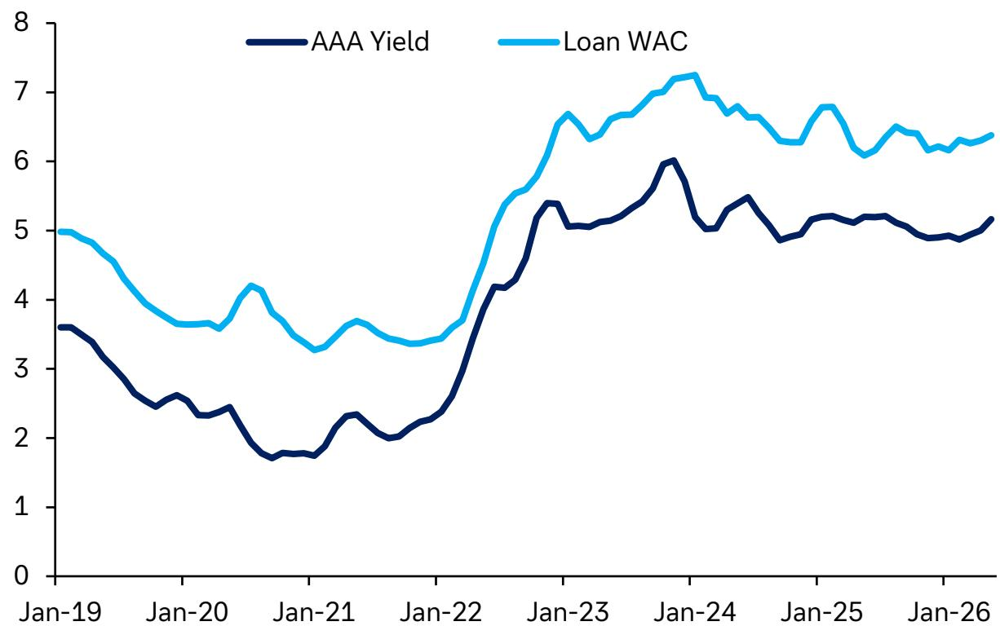

line chart

| Date   | AAA Yield | Loan WAC |
|--------|-----------|----------|
| Jan-19 | 3.6       | 5.0      |
| Jan-20 | 2.5       | 3.7      |
| Jan-21 | 1.8       | 3.3      |
| Jan-22 | 2.3       | 3.5      |
| Jan-23 | 5.4       | 6.7      |
| Jan-24 | 6.0       | 7.2      |
| Jan-25 | 5.1       | 6.8      |
| Jan-26 | 5.2       | 6.3      |

Source: DB, Intex, Bloomberg Finance LP

- Higher-rate regime intact: Conduit loan mortgage rates are hovering near \~6.3%, while CMBS LCF AAA yields are near \~5.0%.  
- Demand firm: Higher AAA yields continue to support demand, particularly from insurance and annuity buyers.  
Supply constrained: 2015-2016 vintage maturing loans face refinancing costs 150+ bps higher than original coupons, keeping refi economics challenged.

New issue CMBS priced deals vs Corp

<table><tr><td rowspan="2">Rating</td><td colspan="3">Conduit</td><td colspan="3">SASB</td><td rowspan="2">Corp</td></tr><tr><td>BANK2026-BNK52</td><td>BBCMS2026-5C42</td><td>BANK52026-5YR22</td><td>BX 2026-VLT10</td><td>JPMCC2026-FUN</td><td>HY 2026-10HY</td></tr><tr><td>AAA</td><td>75</td><td>74</td><td>79</td><td>J+140</td><td>165</td><td>J+95</td><td></td></tr><tr><td>AA</td><td>120</td><td>120</td><td>135</td><td>J+250</td><td>190</td><td>J+120</td><td>57</td></tr><tr><td>A</td><td>175</td><td>185</td><td>175</td><td>J+300</td><td>210</td><td>Preplaced</td><td>79</td></tr><tr><td>BBB-</td><td>410</td><td>425</td><td>535</td><td>J+375</td><td>275</td><td></td><td>107</td></tr><tr><td>BB</td><td></td><td></td><td></td><td></td><td>355</td><td></td><td>168</td></tr><tr><td>B</td><td></td><td></td><td></td><td></td><td></td><td></td><td>302</td></tr></table>

Note: Corp Spreads as of 06/09/206  
Source: DB, Bloomberg Finance LP, ICE BofA.

■ Recent conduit AAA priced around 75-80bp, broadly comparable to single-A corporate spreads.  
AA/A Conduit Spread Pickup: AA/A-rated conduits, priced at 120-190bps, offer a significant spread pickup of 40-110 bps over single-A corporate.  
■ BBB- Conduit tail risk: Wide pricing on BBB- conduit tranches (410-535bps) indicates significant perceived tail risk. Spreads effectively reflect the fat tail, even if ratings do not.  
■ SASB dispersion remains property/sponsor driven, but deals exhibit a much flatter credit curve vs conduit deals.  
- Relative value. Prefer SASB mezz over conduit due to better collateral transparency and sponsor selection, even though risk is binary.

## Conduit refi success rate at 66%

Conduit refi success rate, %  
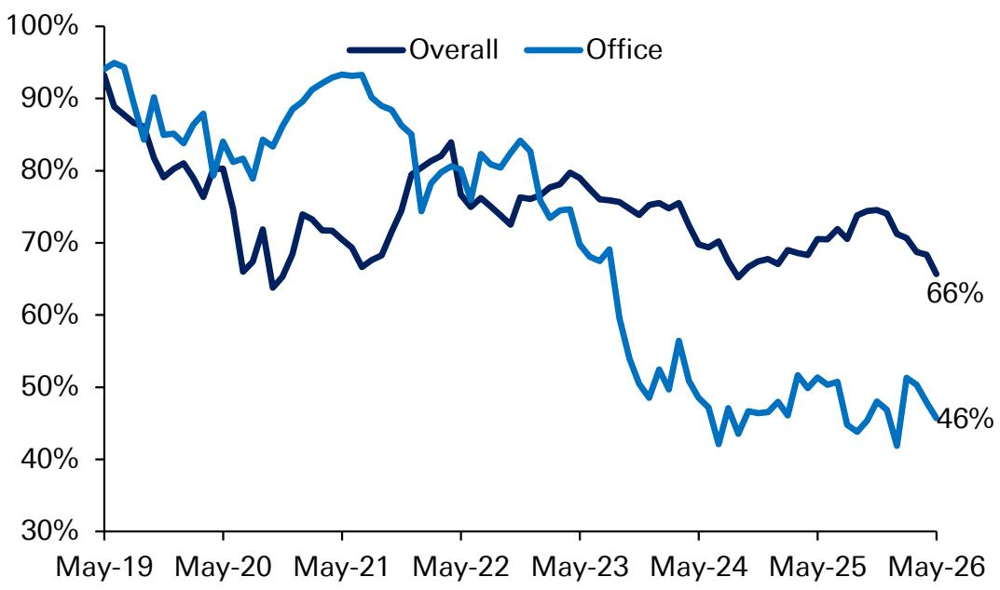

line chart

| Date    | Overall | Office |
|---------|---------|--------|
| May-26  | 66%     | 46%    |

Note: Numerator is loan (original) bal NOT defaulted AND Payoff date within original maturity. Denominator is original maturity. Calculation is trailing 6mo numerator/6mo denominator. \*Default: Loans paid off with status of FC Sold or REO sold and loss >=1% of original balance. SASB uses YTD refi success rate.
Source: Intex, DB

60+ dlq. by property

<table><tr><td>Property</td><td>Conduit</td><td>SASB</td></tr><tr><td>Retail</td><td>4.2%</td><td>3.4%</td></tr><tr><td>Office</td><td>11.3%</td><td>6.3%</td></tr><tr><td>Hotel</td><td>6.0%</td><td>2.7%</td></tr><tr><td>Multi-Family</td><td>4.5%</td><td>3.1%</td></tr><tr><td>Industrial</td><td>1.8%</td><td>0.0%</td></tr><tr><td>Other</td><td>5.3%</td><td>2.7%</td></tr><tr><td>Overall</td><td>6.5%</td><td>3.5%</td></tr></table>

Note: CMBS data is for May-2026 remit.  
Source: DB, Intex

The overall 6-month average on-time refi success rate is now in high 60% area; Office refi success is in the 45-50% area.  
- Conduit 60+ delinquency has climbed to \~6% from \~4.5% at the start of 2025; office is the primary driver, with 60+ at \~11% vs \~7% in Dec-2024.  
SASB 60+ delinquency is holding around \~3.5%; proactive modifications/extensions and net heavy supply have helped keep delinquencies low.  
■ Outlook: Elevated rates will keep refi success rate depressed.

## Loan mods near 10% keep delinquencies contained

Mod balance, %  
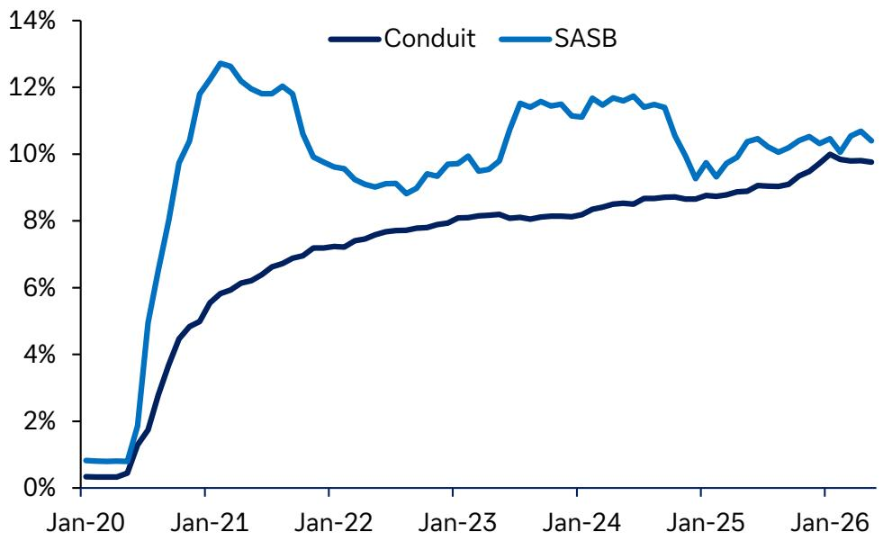

line chart

| Date   | Conduit | SASB  |
|--------|---------|-------|
| Jan-20 | 0.5%    | 0.8%  |
| Jan-21 | 5.0%    | 12.5% |
| Jan-22 | 7.0%    | 9.5%  |
| Jan-23 | 8.0%    | 11.0% |
| Jan-24 | 8.5%    | 11.5% |
| Jan-25 | 9.0%    | 9.5%  |
| Jan-26 | 10.0%   | 10.5% |

Source: DB, Intex

Property types with loan mods

<table><tr><td>Property</td><td>Maturity Extension</td><td>Non-cashflow mods</td><td>Combination</td><td>Forbearance</td><td>Total, $bn</td><td>Total, %</td></tr><tr><td>Retail</td><td>25%</td><td>25%</td><td>27%</td><td>23%</td><td>13</td><td>20%</td></tr><tr><td>Office</td><td>41%</td><td>25%</td><td>24%</td><td>9%</td><td>20</td><td>31%</td></tr><tr><td>Hotel</td><td>10%</td><td>32%</td><td>12%</td><td>46%</td><td>14</td><td>21%</td></tr><tr><td>Multi-Family</td><td>16%</td><td>67%</td><td>3%</td><td>14%</td><td>2</td><td>3%</td></tr><tr><td>Other</td><td>40%</td><td>33%</td><td>18%</td><td>9%</td><td>16</td><td>25%</td></tr><tr><td>Overall</td><td>31%</td><td>30%</td><td>20%</td><td>20%</td><td>65</td><td>100%</td></tr></table>

Note: Data includes Conduit and SASB  
Source: DB, Intex

- Conduit loan mods have steadily increased, while SASB mods have stabilized; both are now converging near \~10% of balances.  
Office is the largest modified cohort, accounting for \~\$20bn, or \~31%, of modified loans; more A/B modifications is needed to reflect the basis reset in office collateral values.  
■ Repeated extensions can defer loss recognition and reduce price discovery, particularly for structurally challenged assets.

## Liquidation losses trending higher

Liquidation Volume and Loss
Severities by Year  
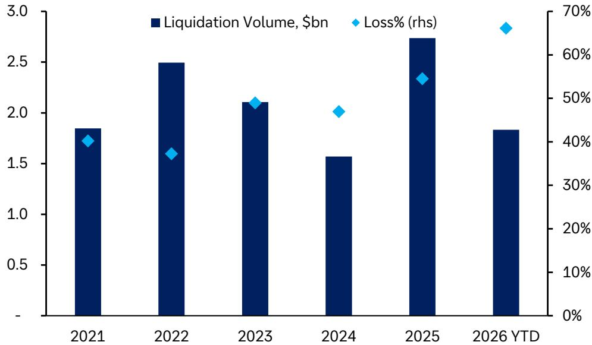

bar-line hybrid chart

| Year | Liquidation Volume ($bn) | Loss% (rhs) (%) |
| :--- | :--- | :--- |
| 2021 | 1.85 | 41 |
| 2022 | 2.5 | 37 |
| 2023 | 2.1 | 49 |
| 2024 | 1.58 | 48 |
| 2025 | 2.75 | 54 |
| 2026 YTD | 1.83 | 67 |

Liquidation Volume and Loss
Severities by Property in 2026  
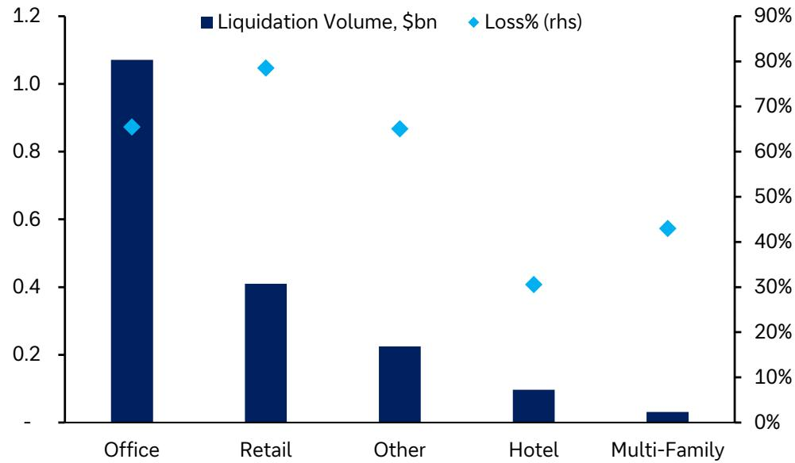

bar-line hybrid

| Category | Liquidation Volume ($bn) | Loss% (rhs) (%) |
| :--- | :--- | :--- |
| Office | 1.07 | 68 |
| Retail | 0.41 | 80 |
| Other | 0.22 | 65 |
| Hotel | 0.09 | 30 |
| Multi-Family | 0.03 | 43 |

Note: Conduit only. Liquidation volume = loans resolved as REO Sold or FCL Sold. Loss% calculated as of balance at liquidation. RHS = Right hand side axis
Source: DB, Intex.

\$1.8bn liquidated YTD annualizes to \~\$4.3bn, \~60% above 2025's \$2.7bn. Elevated disposition volumes suggest special servicers are prioritizing clearing the distressed backlog over modify-and-extend strategies.  
Loss severity continues to rise: 2026 YTD liquidations are showing roughly 66% loss severity (based on balance at liquidation), well above the \~40% area in 2021–22 and higher than 2025's already elevated \~55% level.  
Office drives volume, Retail drives severity: Office accounts for the bulk of YTD liquidations (\~\$1.1bn of the \$1.8bn total) with severe \~65% losses, while Retail (\~\$0.4bn volume) prints the highest severity across all sectors at nearly 80%.  
2026 YTD, one SASB loan, 600 California street liquidated through note sale with \~60% loss severity.

## S distress

## yet to materialize in

Top 15 Office market

<table><tr><td>City</td><td>Bal, $bn</td><td>60+</td><td>SS</td><td colspan="2">Vacancy Rent*, $</td><td>Supply*</td></tr><tr><td>New York</td><td>74</td><td>3%</td><td>9%</td><td>18%</td><td>87</td><td>1.4%</td></tr><tr><td>Los Angeles</td><td>11</td><td>8%</td><td>18%</td><td>31%</td><td>50</td><td>1.1%</td></tr><tr><td>San Francisco</td><td>9.5</td><td>5%</td><td>9%</td><td>32%</td><td>74</td><td>0.0%</td></tr><tr><td>Chicago</td><td>8.0</td><td>23%</td><td>32%</td><td>26%</td><td>41</td><td>0.1%</td></tr><tr><td>DC</td><td>7.2</td><td>8%</td><td>26%</td><td>23%</td><td>62</td><td>0.0%</td></tr><tr><td>San Jose</td><td>7.1</td><td>0%</td><td>2%</td><td>15%</td><td>64</td><td>0.5%</td></tr><tr><td>Boston</td><td>5.0</td><td>4%</td><td>4%</td><td>19%</td><td>52</td><td>0.2%</td></tr><tr><td>Seattle</td><td>4.8</td><td>8%</td><td>11%</td><td>33%</td><td>51</td><td>0.0%</td></tr><tr><td>Philadelphia</td><td>3.9</td><td>32%</td><td>36%</td><td>19%</td><td>31</td><td>0.3%</td></tr><tr><td>Houston</td><td>3.6</td><td>12%</td><td>27%</td><td>25%</td><td>40</td><td>0.3%</td></tr><tr><td>Miami</td><td>3.4</td><td>0%</td><td>0%</td><td>15%</td><td>72</td><td>1.5%</td></tr><tr><td>Atlanta</td><td>1.6</td><td>20%</td><td>25%</td><td>25%</td><td>36</td><td>0.1%</td></tr><tr><td>Dallas</td><td>1.5</td><td>20%</td><td>26%</td><td>26%</td><td>40</td><td>0.8%</td></tr><tr><td>Phoenix</td><td>1.4</td><td>2%</td><td>9%</td><td>26%</td><td>37</td><td>0.5%</td></tr><tr><td>Denver</td><td>1.4</td><td>27%</td><td>69%</td><td>27%</td><td>38</td><td>0.4%</td></tr><tr><td>Overall US</td><td>164</td><td>10%</td><td>17%</td><td>20%</td><td>44</td><td>0.4%</td></tr></table>

Note: Data for Conduit and SASB. New York vacancy, rent and supply data is for NYC Midtown.  
Rent is \$/sqft for Class A office space.  
Supply is under-construction as % of inventory.  
Source: DB, Intex, Cushman

\- 60+ delinquencies are concentrated in some markets: Philadelphia stands out with 32% 60+ delinquent and 36% in special servicing, followed by Denver and Chicago.

■ West Coast office distress has not fully transmitted into credit metrics. San Francisco, Seattle, and Los Angeles show extreme vacancy pressure at 32%, 33%, and 31%, respectively, but 60+ delinquency rates remain contained at 5-8%.

■ New construction is limited across most markets, with overall supply at only 0.4% of inventory.

## Multi-Family distress concentrated in Houston and Portfolio loans

Conduit Multi-Family 60+ dlq.

<table><tr><td rowspan="2">Vintage</td><td rowspan="2">Overall</td><td colspan="3">Top MSAs</td></tr><tr><td>NY</td><td>Portfolio loans</td><td>Houston</td></tr><tr><td>Pre 2022</td><td>4%</td><td>3%</td><td>5%</td><td>8%</td></tr><tr><td>2022</td><td>2.7%</td><td>0%</td><td>6%</td><td>0%</td></tr><tr><td>2023</td><td>22%</td><td>2%</td><td>18%</td><td>37%</td></tr><tr><td>2024</td><td>7.7%</td><td>0%</td><td>19%</td><td>0%</td></tr><tr><td>2025</td><td>1.1%</td><td>0%</td><td>5%</td><td>5%</td></tr><tr><td>Overall</td><td>4.7%</td><td>2%</td><td>8%</td><td>7%</td></tr></table>

Note: Data includes Conduit and SASB  
Source: DB, Intex

Delinquency rates in recent Multi-Family vintages are accelerating, becoming a major concern for investors.  
Houston and Portfolio loans stand out with notably higher 60+ delinquency relative to exposure. Chicago and Philadelphia also have elevated delinquency worth monitoring.  
This deterioration is critical as Multi-Family exposure in Conduits is growing: Multi-Family collateral increased from \~10% of deal balance in 2023 to \~25% in 2024-25.

## Potential fixes for CMBS market?

Post-GFC CMBS structures improved, but governance remains the weak link. The market is still exposed to conflicted control rights, opaque loan modifications, delayed loss recognition, and documentation that leaves too much room for interpretation.

■ Reduce special-servicer conflicts. Separate B-piece economics from special-servicer appointment rights. Use an independent special servicer with no controlling-class affiliation to reduce conflicts in workout decisions.  
■ Make modifications accountable. Require ex-ante recovery estimates for every material modification (e.g., the expected recovery from a mod). Tie a portion of workout/liquidation fees to realized recovery versus prior estimate. After two modifications or 24 months of cumulative extension, further relief should require operating advisor consent or certificate-holder negative consent.  
■ Accelerate transparency and price discovery. Require independent appraisals within 60 days of delinquency, engaged by the trustee rather than the special servicer. Disclose all material modification terms within five business days.  
- Improve documentation clarity. Simplify waterfall, control-rights, appraisal-reduction, and workout-fee language, so key economic outcomes are mechanical, auditable, and less dependent on interpretation. Standardize disclosure templates for modifications, extensions, fee reimbursements, and realized-loss calculations.

CMBS does not need another full structural overhaul. It needs cleaner incentives, proper accountability, faster transparency, and clearer documentation that limits discretion in workout outcomes.

These are broad, directional ideas. Implementation would require comprehensive refinement and stakeholder alignment. Happy to hear your thoughts.

## Appendix

<table><tr><td></td><td>2026</td><td>2025</td><td>2024</td><td>2023</td><td>2022</td><td>2021</td><td>2020</td><td>2019</td><td>2018</td><td>2017</td><td>2016</td></tr><tr><td>Issuance Size ($mn)</td><td>13,647</td><td>33,409</td><td>32,873</td><td>19,698</td><td>22,795</td><td>30,150</td><td>27,816</td><td>49,008</td><td>40,292</td><td>47,515</td><td>47,084</td></tr><tr><td>Deal Count</td><td>18</td><td>44</td><td>38</td><td>26</td><td>24</td><td>30</td><td>32</td><td>52</td><td>44</td><td>51</td><td>55</td></tr><tr><td>Avg Deal Size</td><td>758</td><td>759</td><td>865</td><td>758</td><td>950</td><td>1,005</td><td>869</td><td>942</td><td>916</td><td>932</td><td>856</td></tr><tr><td colspan="12">Credit Support % :</td></tr><tr><td>AAA (Ultra)</td><td>30.0%</td><td>30.0%</td><td>30.0%</td><td>30.0%</td><td>30.0%</td><td>30.0%</td><td>30.0%</td><td>30.0%</td><td>30.0%</td><td>30.0%</td><td>30.0%</td></tr><tr><td>AAA (Jr)</td><td>20.0%</td><td>20.2%</td><td>18.6%</td><td>18.3%</td><td>20.2%</td><td>21.4%</td><td>20.1%</td><td>20.8%</td><td>21.1%</td><td>21.2%</td><td>23.0%</td></tr><tr><td>AA</td><td>15.0%</td><td>15.2%</td><td>13.8%</td><td>13.6%</td><td>15.6%</td><td>16.8%</td><td>15.2%</td><td>16.2%</td><td>16.5%</td><td>16.3%</td><td>17.7%</td></tr><tr><td>A</td><td>11.2%</td><td>11.2%</td><td>10.2%</td><td>10.0%</td><td>11.4%</td><td>12.4%</td><td>11.0%</td><td>11.8%</td><td>12.1%</td><td>12.0%</td><td>13.1%</td></tr><tr><td>BBB-</td><td>7.9%</td><td>7.7%</td><td>7.1%</td><td>6.8%</td><td>6.8%</td><td>7.2%</td><td>6.4%</td><td>7.0%</td><td>7.1%</td><td>7.0%</td><td>7.8%</td></tr><tr><td>Top 10 Loan</td><td>62%</td><td>61%</td><td>61%</td><td>63%</td><td>55%</td><td>51%</td><td>58%</td><td>51%</td><td>50%</td><td>53%</td><td>54%</td></tr><tr><td>Avg. Loan Size ($mn)</td><td>23</td><td>22</td><td>25</td><td>26</td><td>21</td><td>19</td><td>24</td><td>21</td><td>19</td><td>21</td><td>19</td></tr><tr><td># of Loans</td><td>37</td><td>37</td><td>37</td><td>31</td><td>51</td><td>59</td><td>52</td><td>50</td><td>51</td><td>49</td><td>51</td></tr><tr><td>Collateral Mix</td><td>2026</td><td>2025</td><td>2024</td><td>2023</td><td>2022</td><td>2021</td><td>2020</td><td>2019</td><td>2018</td><td>2017</td><td>2016</td></tr><tr><td>Office</td><td>21%</td><td>20%</td><td>17%</td><td>25%</td><td>35%</td><td>34%</td><td>44%</td><td>35%</td><td>32%</td><td>34%</td><td>27%</td></tr><tr><td>Retail</td><td>18%</td><td>20%</td><td>27%</td><td>30%</td><td>23%</td><td>21%</td><td>16%</td><td>23%</td><td>27%</td><td>22%</td><td>28%</td></tr><tr><td>Multifamily</td><td>20%</td><td>26%</td><td>24%</td><td>10%</td><td>14%</td><td>17%</td><td>16%</td><td>18%</td><td>12%</td><td>8%</td><td>11%</td></tr><tr><td>Hotel</td><td>15%</td><td>13%</td><td>11%</td><td>12%</td><td>7%</td><td>3%</td><td>9%</td><td>12%</td><td>15%</td><td>15%</td><td>16%</td></tr><tr><td>Industrial</td><td>12%</td><td>7%</td><td>9%</td><td>14%</td><td>10%</td><td>12%</td><td>9%</td><td>7%</td><td>7%</td><td>6%</td><td>6%</td></tr><tr><td>Other</td><td>14%</td><td>13%</td><td>11%</td><td>10%</td><td>11%</td><td>12%</td><td>6%</td><td>6%</td><td>8%</td><td>14%</td><td>11%</td></tr><tr><td>% Shadow-rated Investment Grade</td><td>8%</td><td>13%</td><td>15%</td><td>18%</td><td>15%</td><td>14%</td><td>31%</td><td>15%</td><td>14%</td><td>12%</td><td>8%</td></tr><tr><td>% Having or Allowing Additional Debt</td><td>24%</td><td>23%</td><td>17%</td><td>21%</td><td>22%</td><td>30%</td><td>39%</td><td>28%</td><td>29%</td><td>31%</td><td>27%</td></tr><tr><td>% Interest Only Full or Partial</td><td>87%</td><td>90%</td><td>93%</td><td>91%</td><td>88%</td><td>87%</td><td>90%</td><td>83%</td><td>78%</td><td>75%</td><td>67%</td></tr><tr><td>% Interest Only (Full)</td><td>83%</td><td>86%</td><td>90%</td><td>85%</td><td>78%</td><td>71%</td><td>73%</td><td>61%</td><td>52%</td><td>47%</td><td>33%</td></tr><tr><td>% Interest Only (Partial)</td><td>5%</td><td>4%</td><td>3%</td><td>6%</td><td>10%</td><td>16%</td><td>17%</td><td>22%</td><td>27%</td><td>28%</td><td>34%</td></tr><tr><td>Issuer LTV</td><td>58%</td><td>57%</td><td>55%</td><td>52%</td><td>53%</td><td>55%</td><td>54%</td><td>58%</td><td>58%</td><td>57%</td><td>60%</td></tr><tr><td>Issuer DSCR</td><td>1.95</td><td>1.83</td><td>1.80</td><td>1.80</td><td>2.61</td><td>2.91</td><td>2.94</td><td>2.31</td><td>2.07</td><td>2.18</td><td>2.01</td></tr><tr><td>Fitch LTV</td><td>97%</td><td>98%</td><td>92%</td><td>88%</td><td>99%</td><td>103%</td><td>96%</td><td>103%</td><td>102%</td><td>102%</td><td>105%</td></tr><tr><td>Fitch DSCR</td><td>1.34</td><td>1.30</td><td>1.31</td><td>1.24</td><td>1.34</td><td>1.40</td><td>1.34</td><td>1.29</td><td>1.22</td><td>1.26</td><td>1.21</td></tr><tr><td>S&amp;P LTV</td><td>86%</td><td>87%</td><td>81%</td><td>80%</td><td>88%</td><td>95%</td><td>91%</td><td>92%</td><td>88%</td><td>83%</td><td>85%</td></tr><tr><td>S&amp;P DSCR</td><td>1.70</td><td>1.57</td><td>1.53</td><td>1.53</td><td>2.24</td><td>2.30</td><td>2.53</td><td>2.05</td><td>1.88</td><td>1.87</td><td>1.91</td></tr><tr><td>Moody&#x27;s LTV</td><td>109%</td><td>110%</td><td>101%</td><td>97%</td><td>100%</td><td>105%</td><td>106%</td><td>110%</td><td>112%</td><td>112%</td><td>113%</td></tr><tr><td>Moody&#x27;s DSCR</td><td>1.07</td><td>1.06</td><td>1.10</td><td>1.15</td><td>0.98</td><td>1.09</td><td>1.04</td><td>1.02</td><td>1.00</td><td>1.00</td><td>0.99</td></tr><tr><td>AAA NCF Debt Yield</td><td>15.9%</td><td>15.2%</td><td>15.1%</td><td>15.3%</td><td>14.4%</td><td>14.2%</td><td>14.3%</td><td>13.5%</td><td>14.3%</td><td>14.3%</td><td>13.9%</td></tr><tr><td>BBB NCF Debt Yield</td><td>13.8%</td><td>13.2%</td><td>13.3%</td><td>13.4%</td><td>12.3%</td><td>12.0%</td><td>12.2%</td><td>11.5%</td><td>12.1%</td><td>12.1%</td><td>11.6%</td></tr><tr><td>AAA LTV</td><td>46.0%</td><td>45.7%</td><td>45.1%</td><td>42.5%</td><td>42.3%</td><td>43.1%</td><td>42.7%</td><td>46.1%</td><td>45.5%</td><td>45.0%</td><td>46.1%</td></tr><tr><td>BBB LTV</td><td>53.0%</td><td>52.8%</td><td>51.5%</td><td>48.5%</td><td>49.4%</td><td>50.9%</td><td>50.1%</td><td>54.2%</td><td>53.6%</td><td>53.1%</td><td>55.2%</td></tr><tr><td>NCF Debt Yield</td><td>12.7%</td><td>12.2%</td><td>12.3%</td><td>12.5%</td><td>11.5%</td><td>11.2%</td><td>11.4%</td><td>10.7%</td><td>11.2%</td><td>11.2%</td><td>10.7%</td></tr></table>

Note: Presale Reports, Intex, Trepp, Bloomberg Finance LP

<table><tr><td rowspan="2"></td><td colspan="11">SASB Underwriting Trend by Vintage</td></tr><tr><td>2026</td><td>2025</td><td>2024</td><td>2023</td><td>2022</td><td>2021</td><td>2020</td><td>2019</td><td>2018</td><td>2017</td><td>2016</td></tr><tr><td>Issuance ($mn)</td><td>49,763</td><td>90,554</td><td>70,401</td><td>19,585</td><td>45,719</td><td>79,128</td><td>23,853</td><td>45,390</td><td>35,520</td><td>36,500</td><td>19,339</td></tr><tr><td>Deal Count</td><td>68</td><td>125</td><td>108</td><td>35</td><td>54</td><td>110</td><td>47</td><td>83</td><td>74</td><td>66</td><td>40</td></tr><tr><td>Avg Deal Size</td><td>732</td><td>724</td><td>652</td><td>560</td><td>847</td><td>719</td><td>508</td><td>547</td><td>480</td><td>553</td><td>483</td></tr><tr><td colspan="12">Credit Support % :</td></tr><tr><td>AAA</td><td>44%</td><td>45%</td><td>45%</td><td>41%</td><td>53%</td><td>59%</td><td>45%</td><td>56%</td><td>58%</td><td>57%</td><td>52%</td></tr><tr><td>BBB-</td><td>13%</td><td>14%</td><td>14%</td><td>13%</td><td>24%</td><td>35%</td><td>23%</td><td>30%</td><td>27%</td><td>26%</td><td>18%</td></tr><tr><td colspan="12">Collateral Mix % :</td></tr><tr><td>Office</td><td>29%</td><td>27%</td><td>5%</td><td>2%</td><td>15%</td><td>23%</td><td>36%</td><td>26%</td><td>24%</td><td>40%</td><td>42%</td></tr><tr><td>Hotel</td><td>20%</td><td>18%</td><td>31%</td><td>31%</td><td>23%</td><td>16%</td><td>17%</td><td>25%</td><td>41%</td><td>46%</td><td>26%</td></tr><tr><td>Retail</td><td>11%</td><td>14%</td><td>8%</td><td>29%</td><td>10%</td><td>6%</td><td>7%</td><td>8%</td><td>15%</td><td>7%</td><td>20%</td></tr><tr><td>Multifam</td><td>10%</td><td>7%</td><td>16%</td><td>0%</td><td>11%</td><td>16%</td><td>4%</td><td>10%</td><td>3%</td><td>1%</td><td>1%</td></tr><tr><td>Industrial</td><td>30%</td><td>33%</td><td>31%</td><td>36%</td><td>39%</td><td>31%</td><td>31%</td><td>9%</td><td>10%</td><td>4%</td><td>3%</td></tr><tr><td>Others</td><td>1%</td><td>1%</td><td>9%</td><td>2%</td><td>1%</td><td>9%</td><td>5%</td><td>23%</td><td>7%</td><td>1%</td><td>8%</td></tr><tr><td colspan="12">Financials :</td></tr><tr><td>Issuer LTV</td><td>66%</td><td>63%</td><td>60%</td><td>56%</td><td>59%</td><td>66%</td><td>60%</td><td>62%</td><td>59%</td><td>57%</td><td>50%</td></tr><tr><td>Issuer DSCR</td><td>1.6</td><td>1.5</td><td>1.4</td><td>1.5</td><td>2.3</td><td>3.3</td><td>3.2</td><td>2.4</td><td>2.5</td><td>3.4</td><td>3.3</td></tr><tr><td>Fitch LTV</td><td>99%</td><td>98%</td><td>100%</td><td>84%</td><td>113%</td><td>123%</td><td>109%</td><td>105%</td><td>103%</td><td>94%</td><td>90%</td></tr><tr><td>Fitch DSCR</td><td>1.0</td><td>1.0</td><td>0.9</td><td>1.2</td><td>0.9</td><td>0.8</td><td>0.9</td><td>1.0</td><td>1.0</td><td>1.0</td><td>1.1</td></tr><tr><td>S&amp;P LTV</td><td>82%</td><td>89%</td><td>88%</td><td>90%</td><td>106%</td><td>119%</td><td>89%</td><td>97%</td><td>97%</td><td>91%</td><td>81%</td></tr><tr><td>S&amp;P DSCR</td><td>1.5</td><td>1.3</td><td>1.2</td><td>1.2</td><td>1.3</td><td>1.3</td><td>1.7</td><td>1.5</td><td>1.6</td><td>1.9</td><td>2.2</td></tr><tr><td>Moody&#x27;s LTV</td><td>109%</td><td>106%</td><td>107%</td><td>104%</td><td>123%</td><td>138%</td><td>103%</td><td>114%</td><td>111%</td><td>97%</td><td>91%</td></tr><tr><td>Moody&#x27;s DSCR</td><td>0.8</td><td>1.0</td><td>0.9</td><td>1.0</td><td>0.8</td><td>0.7</td><td>1.1</td><td>0.9</td><td>0.9</td><td>1.1</td><td>1.4</td></tr><tr><td>Kroll LTV</td><td>104%</td><td>98%</td><td>98%</td><td>78%</td><td>113%</td><td>123%</td><td>112%</td><td>94%</td><td>92%</td><td>90%</td><td>79%</td></tr><tr><td>Kroll DSCR</td><td>1.4</td><td>1.3</td><td>1.1</td><td>1.3</td><td>1.9</td><td>2.8</td><td>2.4</td><td>2.4</td><td>2.5</td><td>2.7</td><td>2.9</td></tr><tr><td>DBMS LTV</td><td>92%</td><td>85%</td><td>82%</td><td>81%</td><td>85%</td><td>106%</td><td>76%</td><td>96%</td><td>102%</td><td>86%</td><td>82%</td></tr><tr><td>DBMS DSCR</td><td>1.3</td><td>1.3</td><td>1.3</td><td>1.2</td><td>1.9</td><td>3.2</td><td>3.0</td><td>2.3</td><td>2.0</td><td>2.1</td><td>2.4</td></tr><tr><td>Issuer NCF Debt Yield</td><td>9.2%</td><td>9.8%</td><td>10.1%</td><td>11.1%</td><td>9.0%</td><td>8.0%</td><td>9.7%</td><td>9.3%</td><td>11.0%</td><td>11.8%</td><td>13.6%</td></tr><tr><td>AAA LTV</td><td>37%</td><td>35%</td><td>33%</td><td>33%</td><td>28%</td><td>27%</td><td>33%</td><td>27%</td><td>25%</td><td>24%</td><td>24%</td></tr><tr><td>BBB LTV</td><td>58%</td><td>54%</td><td>52%</td><td>49%</td><td>45%</td><td>43%</td><td>46%</td><td>43%</td><td>43%</td><td>42%</td><td>41%</td></tr></table>

Note: Presale Reports, Intex, Trepp, Bloomberg Finance LP

CRE CLO Manager Performance - Top 20

<table><tr><td rowspan="2">Collateral Manager</td><td rowspan="2">Orig Bal, $bn</td><td rowspan="2">Curr Bal, $bn</td><td colspan="2">Pool Type, %</td><td colspan="4">Performance</td><td colspan="3">Modification%</td><td colspan="4">Payoff Status (Orig Bal,$bn)</td><td rowspan="2">Office %</td><td rowspan="2">Multi -Fam%</td></tr><tr><td>Managed</td><td>Static</td><td>30+d%</td><td>60+d%</td><td>SS%</td><td>WL%</td><td>Loan Mods</td><td>*Sofr Mods</td><td>Total Mod</td><td>Repur chase</td><td>Liqui dated</td><td>Paid off</td><td>Active</td></tr><tr><td>MF1 REIT</td><td>$28</td><td>$15</td><td>100%</td><td>0%</td><td>2.5%</td><td>0.9%</td><td>6.0%</td><td>60.1%</td><td>19%</td><td>3%</td><td>22%</td><td>0%</td><td>0%</td><td>49%</td><td>51%</td><td>0%</td><td>100%</td></tr><tr><td>Benefit</td><td>$19</td><td>$7</td><td>100%</td><td>0%</td><td>0.9%</td><td>0.9%</td><td>2.3%</td><td>0.0%</td><td>17%</td><td>1%</td><td>19%</td><td>0%</td><td>0%</td><td>64%</td><td>36%</td><td>0%</td><td>73%</td></tr><tr><td>Bridge</td><td>$14</td><td>$5</td><td>87%</td><td>13%</td><td>0.0%</td><td>0.0%</td><td>0.0%</td><td>11.7%</td><td>0%</td><td>1%</td><td>1%</td><td>5%</td><td>0%</td><td>60%</td><td>35%</td><td>0%</td><td>96%</td></tr><tr><td>Rialto</td><td>$11</td><td>$4</td><td>100%</td><td>0%</td><td>6.3%</td><td>5.1%</td><td>14.4%</td><td>15.2%</td><td>26%</td><td>2%</td><td>29%</td><td>0%</td><td>0%</td><td>67%</td><td>33%</td><td>7%</td><td>57%</td></tr><tr><td>Arbor</td><td>$22</td><td>$4</td><td>100%</td><td>0%</td><td>1.1%</td><td>1.1%</td><td>8.5%</td><td>0.0%</td><td>20%</td><td>25%</td><td>45%</td><td>6%</td><td>0%</td><td>78%</td><td>16%</td><td>0%</td><td>99%</td></tr><tr><td>TPG</td><td>$10</td><td>$4</td><td>100%</td><td>0%</td><td>0.0%</td><td>0.0%</td><td>0.0%</td><td>0.0%</td><td>6%</td><td>0%</td><td>6%</td><td>2%</td><td>0%</td><td>63%</td><td>35%</td><td>16%</td><td>47%</td></tr><tr><td>Argentic</td><td>$9</td><td>$4</td><td>50%</td><td>50%</td><td>2.9%</td><td>2.9%</td><td>2.7%</td><td>43.4%</td><td>44%</td><td>0%</td><td>44%</td><td>0%</td><td>0%</td><td>59%</td><td>41%</td><td>7%</td><td>63%</td></tr><tr><td>Blackstone</td><td>$7</td><td>$3</td><td>58%</td><td>42%</td><td>2.7%</td><td>2.7%</td><td>2.7%</td><td>15.7%</td><td>33%</td><td>9%</td><td>42%</td><td>1%</td><td>0%</td><td>56%</td><td>43%</td><td>20%</td><td>35%</td></tr><tr><td>Prime</td><td>$11</td><td>$3</td><td>75%</td><td>25%</td><td>0.0%</td><td>0.0%</td><td>0.0%</td><td>9.1%</td><td>7%</td><td>0%</td><td>7%</td><td>1%</td><td>0%</td><td>73%</td><td>26%</td><td>5%</td><td>73%</td></tr><tr><td>LoanCore</td><td>$12</td><td>$3</td><td>100%</td><td>0%</td><td>0.0%</td><td>0.0%</td><td>0.0%</td><td>0.0%</td><td>5%</td><td>0%</td><td>5%</td><td>13%</td><td>0%</td><td>63%</td><td>23%</td><td>14%</td><td>57%</td></tr><tr><td>VMC</td><td>$7</td><td>$3</td><td>73%</td><td>27%</td><td>5.8%</td><td>5.8%</td><td>8.9%</td><td>14.0%</td><td>6%</td><td>1%</td><td>8%</td><td>1%</td><td>1%</td><td>56%</td><td>42%</td><td>18%</td><td>43%</td></tr><tr><td>Invesco</td><td>$3</td><td>$2</td><td>100%</td><td>0%</td><td>0.0%</td><td>0.0%</td><td>0.0%</td><td>0.0%</td><td>5%</td><td>0%</td><td>5%</td><td>0%</td><td>0%</td><td>8%</td><td>92%</td><td>2%</td><td>63%</td></tr><tr><td>Starwood</td><td>$5</td><td>$2</td><td>100%</td><td>0%</td><td>0.0%</td><td>0.0%</td><td>0.0%</td><td>40.7%</td><td>3%</td><td>0%</td><td>3%</td><td>14%</td><td>0%</td><td>50%</td><td>36%</td><td>19%</td><td>67%</td></tr><tr><td>ACRES Capital</td><td>$4</td><td>$2</td><td>52%</td><td>48%</td><td>0.0%</td><td>0.0%</td><td>0.0%</td><td>0.0%</td><td>0%</td><td>0%</td><td>0%</td><td>1%</td><td>0%</td><td>56%</td><td>43%</td><td>0%</td><td>87%</td></tr><tr><td>ACRE</td><td>$2</td><td>$2</td><td>100%</td><td>0%</td><td>0.0%</td><td>0.0%</td><td>0.0%</td><td>0.0%</td><td>3%</td><td>0%</td><td>3%</td><td>0%</td><td>0%</td><td>13%</td><td>87%</td><td>0%</td><td>100%</td></tr><tr><td>BrightSpire</td><td>$3</td><td>$2</td><td>100%</td><td>0%</td><td>0.0%</td><td>0.0%</td><td>0.0%</td><td>22.8%</td><td>14%</td><td>0%</td><td>14%</td><td>1%</td><td>0%</td><td>39%</td><td>60%</td><td>1%</td><td>89%</td></tr><tr><td>Barings</td><td>$1</td><td>$1</td><td>73%</td><td>27%</td><td>0.0%</td><td>0.0%</td><td>0.0%</td><td>0.0%</td><td>0%</td><td>0%</td><td>0%</td><td>0%</td><td>0%</td><td>3%</td><td>97%</td><td>13%</td><td>29%</td></tr><tr><td>Greystone</td><td>$7</td><td>$1</td><td>100%</td><td>0%</td><td>0.0%</td><td>0.0%</td><td>0.0%</td><td>42.6%</td><td>0%</td><td>0%</td><td>0%</td><td>2%</td><td>0%</td><td>82%</td><td>16%</td><td>0%</td><td>90%</td></tr><tr><td>LaSalle</td><td>$2</td><td>$1</td><td>100%</td><td>0%</td><td>1.2%</td><td>1.2%</td><td>1.2%</td><td>0.0%</td><td>1%</td><td>0%</td><td>1%</td><td>0%</td><td>0%</td><td>56%</td><td>44%</td><td>0%</td><td>88%</td></tr><tr><td>Acore</td><td>$1</td><td>$1</td><td>100%</td><td>0%</td><td>0.0%</td><td>0.0%</td><td>0.0%</td><td>8.4%</td><td>0%</td><td>0%</td><td>0%</td><td>0%</td><td>0%</td><td>0%</td><td>100%</td><td>8%</td><td>58%</td></tr><tr><td>Overall Market</td><td>$245</td><td>$79</td><td>89%</td><td>11%</td><td>2.3%</td><td>1.9%</td><td>3.9%</td><td>19.5%</td><td>16%</td><td>3%</td><td>19%</td><td>2%</td><td>0%</td><td>66%</td><td>31%</td><td>7%</td><td>73%</td></tr></table>

Note: We separate out Mod code # 8 loan modifications because they frequently relate to changes in the floating rate loan index from LIBOR to SOFR. Pool type % is as of outstanding balance. Source: Intex, DB

Bridge Investments is best-performing manager with \~\$5bn outstanding with no delinquency, no SS, no loan mods and payoff rate is 60%.  
Prime, Starwood, ACRE, ACRES, Barings, Invesco have also shown better performance.  
VMC (5.8%), Rialto (5.1%), Argentic (2.9%) and Blackstone (2.7%) have slightly higher 60+ delinquency rates.

## CR

Credit Performance, %  
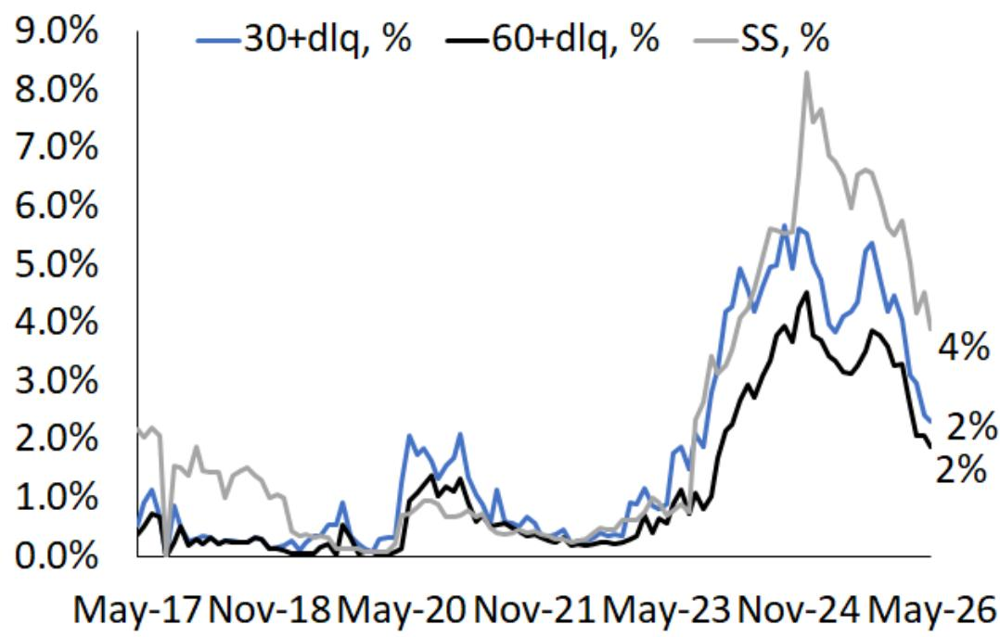

line chart

| Date       | 30+dlq, % | 60+dlq, % | SS, % |
| ---------- | --------- | --------- | ----- |
| May-17     | ~1.0%     | ~0.5%     | ~2.0% |
| Nov-18     | ~0.5%     | ~0.2%     | ~1.5% |
| May-20     | ~2.0%     | ~1.0%     | ~1.0% |
| Nov-21     | ~0.5%     | ~0.5%     | ~0.5% |
| May-23     | ~1.5%     | ~1.0%     | ~3.0% |
| Nov-24     | ~5.5%     | ~4.5%     | ~8.5% |
| May-26     | ~2.0%     | ~2.0%     | ~4.0% |

Source: Intex

## an Mods

Modifications, %  
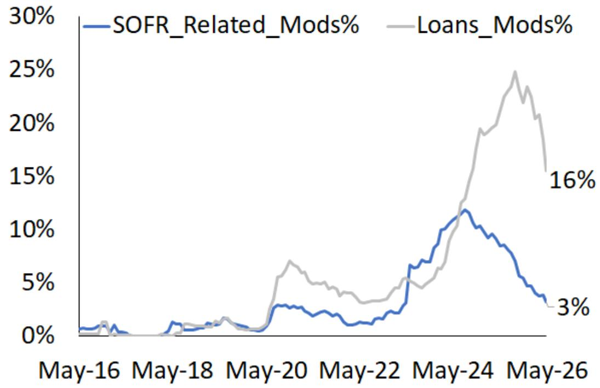

line chart

| Date    | SOFR_Related_Mods% | Loans_Mods% |
|---------|---------------------|-------------|
| May-26  | 3%                  | 16%         |

Note: we separate out Mod Code # 8 loan modifications because they frequently relate to changes in the floating rate loan index from LIBOR to SOFR.  
Source: Intex, DB

60+ day delinquency have fallen from a high of $\sim 5\%$ to $1.9\%$ . Key Drivers: loans mods, deal calls and repurchase activity, office exposure declining.  
CRE CLO delinquencies have generally remained lower than conduit and SASB due to: 1) 70% Multi-family exposure, 2) actively managed collateral, and 3) manager skin in the game. We remain positive on long-term multifamily fundamentals due to stretched housing affordability and slowing new construction of Multi-family.

## US CLOs

June 15, 2026

## Reflections at the midpoint

The first six months of the year has offered several twists to the market – unpacking them helps to anticipate how the second half is likely to unfold

Jamie Flannick | Conor O' Toole

## Midyear Summary

## The TL;DR -

## Mid-year summary:

1 / Primary market – room for catchup in H2. Deal activity has been slower in 2026 – New Issue and Reset deal volume are both down by 20%. Refis, however, have been a bright spot, surging ahead of last year’s level by 20%. And Private Credit CLOs have also fared relatively well so far, despite the headlines surrounding BDCs, and are trailing last year’s levels by roughly 10%. The market faced several macro headwinds in H1 that are dissipating, and there’s room for catchup in H2.

2 / Secondary market – acceleration in trading activity and retail flows. Although primary market deal volume has seen a pullback, the secondary market continues to move at an accelerated pace – Trace deal activity is higher YoY by 35% and retail flows into US CLO ETFs are nearly 25% more robust. Pricing, however, remains challenged for junior debt, with BBBs and BBs trading wider than start of year levels – with credit tail risk growing, this trend looks set to continue.

3 / Loans – a bifurcated market. Secondary loan prices are being impacted by three factors – sector, size, and credit rating. This has created significant dispersion in the market, which should lead to a greater performance gap between manager portfolios over the course of H2.

# Reflections at the midpoint

The first six months of the year has offered several twists to the market – unpacking them helps to anticipate how the second half is likely to unfold

Coming into 2026, a few market themes were evident that shaped our expectations for the year ahead –

Although private credit concerns arose in September in the wake of several high-profile defaults, five months following a spike in geopolitical concerns in April stemming from the Liberation Day tariffs, CLO demand had remained persistently strong with new issue deal volume broaching the \$200B mark for the second straight year and new issue spreads pricing within a close range to their historical tights. Without a catalyst in sight to check this momentum, H1 2026 looked like a continuation of Q4 2025 in both deal volume and pricing.  
- The read on the leveraged loan market coming into the year was relatively similar. Like CLOs, primary market activity was well positioned to continue into H1. After a sluggish Q1, Institutional deal volume ended 2025 north or \$400B. Although below 2024's \$500B, it was nearly double deal volumes in 2022 and 2023 when pricing became turbulent due to the meteoric rise in interest rates. And with interest rate cuts likely coming into 2026, marginal debt burden relief seemed to be in site for a cohort of borrowers that were seeing credit

Constructive, yet lower year-over-year  
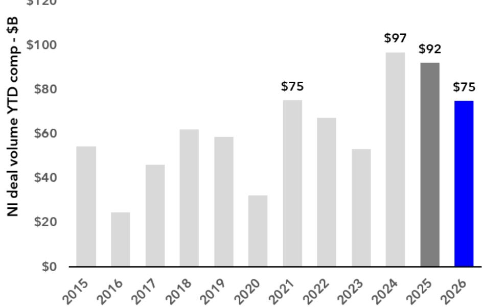

bar chart

| Year | NI deal volume YTD comp - $B |
| :--- | :--- |
| 2015 | 54 |
| 2016 | 24 |
| 2017 | 45 |
| 2018 | 61 |
| 2019 | 58 |
| 2020 | 31 |
| 2021 | 75 |
| 2022 | 67 |
| 2023 | 52 |
| 2024 | 97 |
| 2025 | 92 |
| 2026 | 75 |

downgrades. Although loan prices at the headline in the LLI remained lower than where they began in January 2025, interest rate cuts combined with fiscal stimulus stemming from the One Big Beautiful Bill looked set to lift prices back toward a 98-handle trajectory.  
- The relatively strong fundamentals in both loans and CLOs pointed to a Credit environment that would remain firm in the first half of 2026 – a moderating loan default figure that as of November 2025 was still well north of 3%, continued improvement in the downgrade / upgrade ratio which had dipped below 2.0 after averaging closer to 3.0 for the first 10 months of the year, and a distressed ratio (loans priced sub-80) that was well contained at 4%. The improving credit landscape in loans had put CLO

- credit metrics in a firm position, with Q4 2025 marking an improvement in WARF, CCC exposure, and BB OC cushions after some softening in the wake of April’s market dislocation.  
- And finally, from a Macro context, headline consumer inflation in late Q4 was descending towards the Federal Reserve's stated $2\%$ target, after reaching a peak of $3\%$ in September due in part to elevated prices resulting from an increase in tariffs. With fears growing throughout H2 2025 of a slowing labor market, and the FOMC deciding to cut the benchmark rate for the 3rd time in December 2026 looked set to be a year of a lower, and more stable rate environment.

But as we near the midpoint for 2026, several surprises have arisen which have skewed the market's trajectory.

First, geopolitical uncertainty has once again impacted the market. Similar to the introduction of a revamped tariff policy in April of last year, this year's conflict in the Middle East was unexpected in both the scale and duration. And similar to last year, this year's most poignant geopolitical event led to a price dislocation which impacted both CLO and lev loan issuance, putting both markets in negative territory when comparing year-over-year activity.

A second surprise in 2026 has been the selloff in the Software sector. This began in February following high profile releases by Anthropic surrounding enterprise use cases and the capability of a generalized AI model in addressing what had traditionally been verticalized

New issue momentum has softened in 2026  

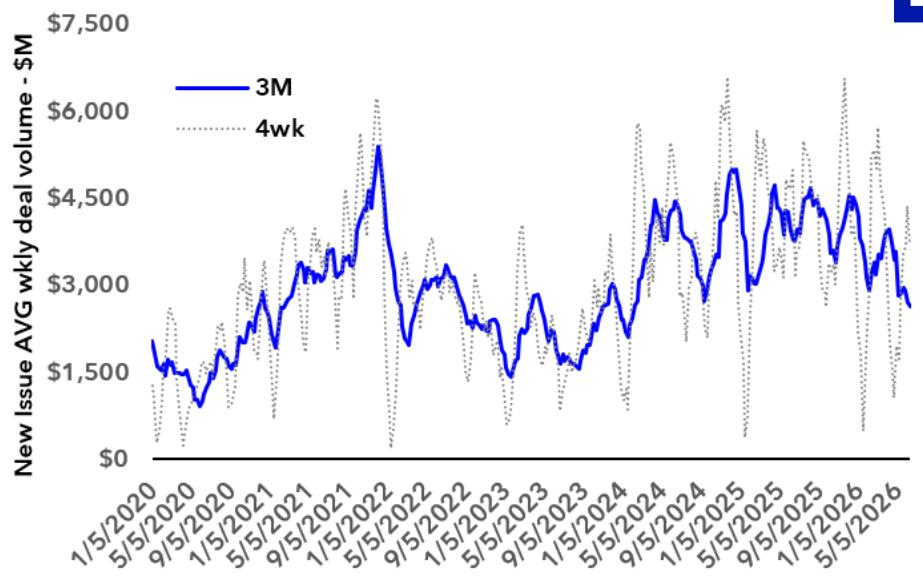

line chart

| Date       | 3M    | 4wk   |
| ---------- | ----- | ----- |
| 1/5/2020   | ~$1,500 | ~$1,500 |
| 5/5/2020   | ~$1,500 | ~$1,500 |
| 9/5/2020   | ~$1,500 | ~$1,500 |
| 1/5/2021   | ~$2,500 | ~$2,500 |
| 5/5/2021   | ~$3,000 | ~$3,000 |
| 9/5/2021   | ~$3,500 | ~$3,500 |
| 1/5/2022   | ~$4,500 | ~$4,500 |
| 5/5/2022   | ~$6,000 | ~$6,000 |
| 9/5/2022   | ~$3,000 | ~$3,000 |
| 1/5/2023   | ~$2,500 | ~$2,500 |
| 5/5/2023   | ~$3,000 | ~$3,000 |
| 9/5/2023   | ~$2,500 | ~$2,500 |
| 1/5/2024   | ~$3,000 | ~$3,000 |
| 5/5/2024   | ~$4,500 | ~$4,500 |
| 9/5/2024   | ~$3,500 | ~$3,500 |
| 1/5/2025   | ~$4,500 | ~$4,500 |
| 5/5/2025   | ~$3,500 | ~$3,500 |
| 9/5/2025   | ~$4,500 | ~$4,500 |
| 1/5/2026   | ~$3,500 | ~$3,500 |
| 5/5/2026   | ~$3,000 | ~$3,000 |

services provided by domain-specific software players ranging from CRM, HRM, and software development. The impact was a cratering of Software loan prices, dragging the average from 95 at the start of the year to below 88 by the end of February. The selloff also dented the market value of publicly traded BDCs, given their broad exposure to the sector, and led to a significant uptick in redemptions at the end of Q1, reigniting concerns over the private credit market that had not totally subsided since last September.

Finally, a third surprise in H1 has been the repricing of the rate curve. Due to what has been stronger than expected employment data mixed with worsening consumer price data, the result of higher energy prices, longer term SOFR rates are now priced higher than near term rates, reflective of expectations of an FOMC at least on hold, if not hiking rates by the end of the year.

This shift in market context explains several trends related to the CLO and Leveraged Loan markets that have risen to the surface in the first half of the year and are worth highlighting.

This shift in market context has had an impact on the CLO and Leveraged Loan markets. We highlight a few key takeaways from the market in H1, as well as expectations for the second half of the year.

## Primary Market – room for catchup in H2

The first immediately noticeable data point related to the primary market is New Issue volume, which is tracking lower year-to-date – \$75B priced through last Friday compared to \$92B at this time a year ago, a nearly 20% gap.

The softer YoY comp is due to several reasons already mentioned – concerns over software (a large sector when it comes to exposure in CLOs and Lev Loans), fallout from the Iranian conflict and the higher energy prices its produced, and a challenged arbitrage environment due to what remains a strong bid for leveraged loan debt.

Although loan spreads have marginally widened over the last month compared to CLO primary spreads which have tightened, the current level of loan spreads for a modeled new issue CLO are still 40 bps tighter than the 5-year average, causing many CLO managers to prioritize repricings in the current environment rather than new deal creation.

However, the CLO repricing market has also been challenged in parts – like NI, Resets are also softer YoY, down by 21%, \$73B vs \$93B at this time a year ago.

Since the story of May, however, Reset deal activity has strengthened, averaging \$5.1B per week and narrowing the gap with last year's volume. And given where NI spreads were at this time in 2024, the vintage most in scope for a Reset option – 150 / 188 bps for AAAs / WADMs compared to Reset spreads today – 122 / 156 bps – Reset volume should continue to see a re-acceleration in H2, although likely remaining well off of last year's levels.

Refis are the one part of the primary market which is outperforming 2025, up 20% YoY - \$47B vs \$56B a year ago. Refis tend to perform well during periods of choppy pricing, like we have seen this year, given their ability to offer a partial repricing of the debt stack. Junior debt becomes more difficult to place when price levels are uncertain, enabling Refis to serve as a deal catalyst during conditions like we have seen in H1.

Refi deal activity has seen a resurgence in Q2  
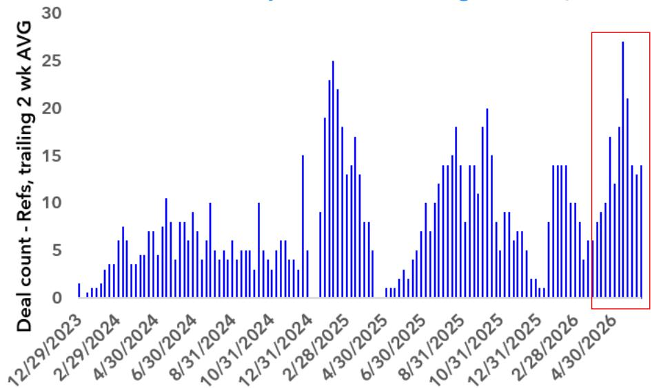

bar chart

| Date | Deal count - Refs, trailing 2 wk AVG |
| --- | --- |
| 12/29/2023 | 1 |
| 2/29/2024 | 1 |
| 4/30/2024 | 7 |
| 6/30/2024 | 8 |
| 8/31/2024 | 6 |
| 10/31/2024 | 5 |
| 12/31/2024 | 15 |
| 2/28/2025 | 9 |
| 4/30/2025 | 25 |
| 6/30/2025 | 19 |
| 8/31/2025 | 18 |
| 10/31/2025 | 17 |
| 12/31/2025 | 8 |
| 2/28/2026 | 14 |
| 4/30/2026 | 17 |
| 6/30/2026 | 18 |
| 8/31/2026 | 14 |
| 10/31/2026 | 19 |
| 12/31/2026 | 9 |
| 2/28/2027 | 7 |
| 4/30/2027 | 14 |
| 6/30/2027 | 14 |
| 8/31/2027 | 10 |
| 10/31/2027 | 8 |
| 12/31/2027 | 6 |
| 2/28/2028 | 1 |
| 4/30/2028 | 1 |
| 6/30/2028 | 1 |
| 8/31/2028 | 1 |
| 10/31/2028 | 1 |
| 12/31/2028 | 1 |
| 2/28/2029 | 1 |
| 4/30/2029 | 1 |
| 6/30/2029 | 1 |
| 8/31/2029 | 1 |
| 10/31/2030 | 1 |
| 12/31/2030 | 1 |
| 2/28/30 | 1 |
| 4/30/30 | 1 |
| 6/30/30 | 1 |
| 8/31/30 | 1 |
| 10/31/30 | 1 |
| 12/31/30 | 1 |
| 2/28/31 | 1 |
| 4/30/31 | 1 |
| 6/30/31 | 1 |
| 8/31/31 | 1 |
| 10/31/31 | 1 |
| 12/31/31 | 1 |
| 2/28/32 | 1 |
| 4/30/32 | 1 |
| 6/30/32 | 1 |
| 8/31/32 | 1 |
| 10/31/32 | 1 |
| 12/31/32 | 1 |
| 2/28/33 | 1 |
| 4/30/33 | 1 |
| 6/30/33 | 1 |
| 8/31/33 | 1 |
| 10/31/33 | 1 |
| 12/31/33 | 1 |
| 2/28/34 | 1 |
| 4/30/34 | 1 |
| 6/30/34 | 1 |
| 8/31/34 | 1 |
| 10/31/34 | 1 |
| 12/31/34 | 1 |
| 2/28/35 | 1 |
| 4/30/35 | 1 |
| 6/30/35 | 1 |
| 8/31/35 | 1 |
| 10/31/35 | 1 |
| 12/31/35 | 1 |
| 2/28/36 | 1 |
| 4/30/36 | 1 |
| 6/30/36 | 1 |
| 8/31/36 | 1 |
| 10/31/36 | 1 |
| 12/31/36 | 1 |
| 2/28/37 | 1 |
| 4/30/37 | 1 |
| 6/30/37 | 1 |
| 8/31/37 | 1 |
| 10/31/37 | 1 |
| 12/31/37 | 1 |
| 2/28/38 | 1 |
| 4/30/38 | 1 |
| 6/30/38 | 1 |
| 8/31/38 | 1 |
| 10/31/38 | 1 |
| 12/31/38 | 1 |
| 2/28/39 | 1 |
| 4/30/39 | 1 |
| 6/30/39 | 1 |
| 8/31/39 | 1 |
| 10/31/40 | 1 |
| 12/31/40 | 1 |
| 2/28/41 | 1 |
| 4/30/41 | 1 |
| 6/30/41 | 1 |
| 8/31/41 | 1 |
| 10/31/41 | 1 |
| 12/31/41 | 1 |
| 2/28/42 | 1 |
| 4/30/42 | 1 |
| 6/30/42 | 1 |
| 8/31/42 | 1 |

Given a setup in which price levels have now mostly stabilized, we see primary deal volumes staying near the range that we forecasted coming into the year – New Issue contracting by around 10% (ending at \$190B compared to \$209B in 2025), Resets softer by 25-30% and ending at \$170B compared to \$232B in 2025.

Where we think activity could continue to remain to the upside is Refis, particularly if additional market surprises are in store in H2, which would challenge pricing again.

In terms of spreads, pricing has come into better balance over last month – in New Issue, current levels are through start of year levels – 124 bps / 280 for AAAs / BBBs.

Refis, by comparison, are still priced wider from start of year levels – 118 bps / 347 for AAAs / BBBs currently compared to 113 / 290 at start of year. The uptick in Refi supply is part of the story, as well as the greater credit tail risk that is inherent for longer-dated loan pools with greater par loss.

Looking forward, price levels for New Issue should remain constructive and relatively range bound – concerns over the Software sector should remain balanced, and a passable resolution for the markets (in the near term) to be reached for the Iranian conflict. However, there will likely be growing concerns over credit tail risk heading into end of this year, putting a floor to how tight levels can go from here. Due to this, we are forecasting New Issue AAAs to end the year at 126 bps and BBBs at 295 bps, within a tight range of current market pricing.

US CLO Issuance Forecast (\$B)

<table><tr><td></td><td>2024</td><td>2025</td><td>2026 Forecast</td><td>YoY (est)</td></tr><tr><td>BSL</td><td>$163</td><td>$166</td><td>$145</td><td>-13%</td></tr><tr><td>MM</td><td>$39</td><td>$43</td><td>$45</td><td>5%</td></tr><tr><td>Total</td><td>$202</td><td>$209</td><td>$190</td><td>-9%</td></tr><tr><td>Refi</td><td>$84</td><td>$105</td><td>$100</td><td>-5%</td></tr><tr><td>Reset</td><td>$223</td><td>$232</td><td>$170</td><td>-27%</td></tr><tr><td>Total</td><td>$307</td><td>$337</td><td>$245</td><td>-27%</td></tr></table>

## Upside risks to issuance forecast include:

• LBO / M&A activity accelerates even more than anticipated in 2026 due to greater macroeconomic certainty  
- Geopolitical, trade, and inflationary uncertainty remain contained, producing a benign credit backdrop  
- CLO ETF inflows push past the \$20B mark in 2026, serving as a CLO NI demand driver

## Downside risks to issuance forecast include:

- Dual-sided risks of a slowing labor market and persistently high inflation, exacerbated by USD weakening, putting further strain on consumers  
- The Middle East conflict persists into H2, leaving energy costs higher and feeding into consumer good prices  
- Software fears once again a reignited due to a model release by a frontier lab, further cratering loan prices for borrowers in the sector and increasing the default probabilities for 2028 maturities.

BBB Resets are pricing at a discount to New Issue and are a relative value buy for newer vintages  
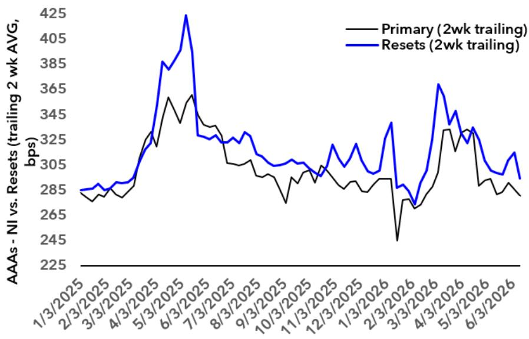

line chart

| Date       | Primary (2wk trailing) | Resets (2wk trailing) |
| ---------- | ---------------------- | --------------------- |
| 1/3/2025   | ~280                   | ~285                  |
| 2/3/2025   | ~275                   | ~280                  |
| 3/3/2025   | ~280                   | ~285                  |
| 4/3/2025   | ~300                   | ~310                  |
| 5/3/2025   | ~350                   | ~380                  |
| 6/3/2025   | ~360                   | ~425                  |
| 7/3/2025   | ~340                   | ~330                  |
| 8/3/2025   | ~330                   | ~325                  |
| 9/3/2025   | ~310                   | ~315                  |
| 10/3/2025  | ~290                   | ~305                  |
| 11/3/2025  | ~300                   | ~305                  |
| 12/3/2025  | ~310                   | ~315                  |
| 1/3/2026   | ~300                   | ~310                  |
| 2/3/2026   | ~245                   | ~280                  |
| 3/3/2026   | ~270                   | ~365                  |
| 4/3/2026   | ~330                   | ~340                  |
| 5/3/2026   | ~340                   | ~330                  |
| 6/3/2026   | ~310                   | ~315                  |

For an investor, we see relative value in Repricings – particularly BBB in Resets for recent vintages, which are pricing wide of New Issue (+20 bps average over the last month).

AAA through As in Refis also look attractive and are pricing wide to comps in secondary: +8 / 16 / 29 bps.

Although New Issue volume should remain constructive, deals will likely continue to price at a premium to repricings and therefore offer less of a compelling entry point for investors than Repricings. A likely continuation of the challenged arb setup should put a ceiling on NI supply.

## Secondary – acceleration in trading activity, retail flows

Unlike the primary market, in which spreads across the debt stack are tighter since start-of-year levels, Secondary CLO prices are bifurcated – AAA to As are priced tighter than early January levels, with As seeing the greatest focus, 15 bps tighter YTD. Junior debt, however, has struggled on the year, with BBBs and BBs currently pricing 7 / 104 bps wider since the year began. The lower credit rating combined with the longer WAL in an environment in which credit tail risk is growing has made these profiles on average less appealing.

Although BB OC cushions remain constructive on average across CLO portfolios, the number of test fails remains elevated, above 6%. The uptick in junior OC breaches coincided with the rise in interest rates, and with the rate normalization cycle likely on pause until 2027, the most junior part of the debt stack will likely remain under pressure in pricing.

BB OC test fails surged with a spike in interest rates  
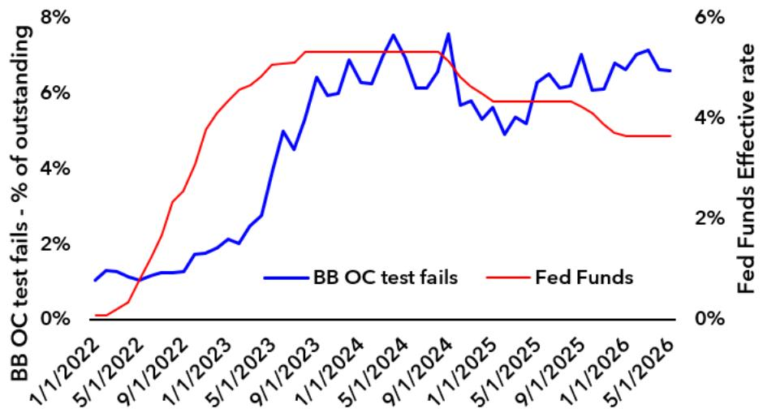

line chart

| Date       | BB OC test fails | Fed Funds Effective rate |
| ---------- | ---------------- | ------------------------ |
| 1/1/2022   | ~1%              | ~0%                      |
| 5/1/2022   | ~1%              | ~1%                      |
| 9/1/2022   | ~1%              | ~3%                      |
| 1/1/2023   | ~2%              | ~5%                      |
| 5/1/2023   | ~3%              | ~6%                      |
| 9/1/2023   | ~5%              | ~6%                      |
| 1/1/2024   | ~6%              | ~6%                      |
| 5/1/2024   | ~7%              | ~6%                      |
| 9/1/2024   | ~6%              | ~6%                      |
| 1/1/2025   | ~5%              | ~5%                      |
| 5/1/2025   | ~4%              | ~5%                      |
| 9/1/2025   | ~5%              | ~5%                      |
| 1/1/2026   | ~6%              | ~4%                      |
| 5/1/2026   | ~7%              | ~4%                      |

Trader volume (TRACE) has been robust YTD, 35% growth YoY growth – \$130B vs \$95B a year ago. This points to growing liquidity in the secondary market, indicative of more investors entering space due in part to higher yields.

But a second reason for the elevated trading volume aside a deepening of the market is the elevated volatility seen this year, particularly in February through April. Given the wide price dispersion in sectors within the leveraged loan market, the secondary market has been robust due to the relative value trades that have opened in pockets this year given the headline concerns and volatility stemming from the Middle East, Software, and Private Credit.

CLO ETFs have also seen elevated volumes so far in 2026, with roughly \$9.5B of inflows so far on the year compared to \$7.7B at this time a year ago. This has mostly been due to a surge of inflows for AAA / AA funds, which continue to attract the most investor attention. However, BBB-focused funds have continued to see a marked improvement in both fund flows and returns since early May, providing an additional tail wind to ETF growth as well as primary market deal volume, where the underlying bonds are originally sourced.

With the Fed likely on hold for the rest of the year, we see CLO ETF inflows remaining resilient through year's end with a full year level approaching \$20B, surpassing the \$15B in 2025.

BBB-focused funds are offering elevated returns  

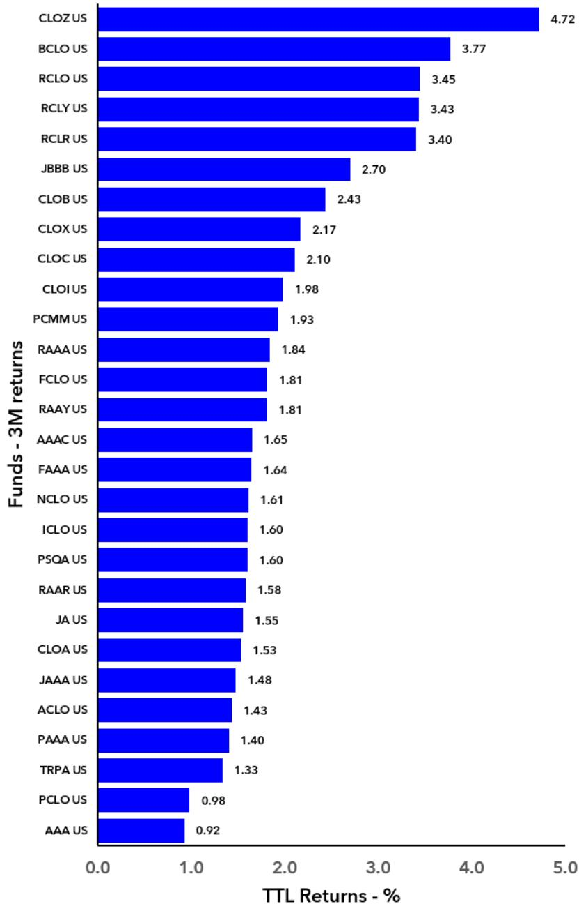

bar chart

| Funds - 3M returns | TTL Returns - % |
|---|---|
| CLOZ US | 4.72 |
| BCLO US | 3.77 |
| RCLO US | 3.45 |
| RCLY US | 3.43 |
| RCLR US | 3.40 |
| JBBB US | 2.70 |
| CLOB US | 2.43 |
| CLOX US | 2.17 |
| CLOC US | 2.10 |
| CLOI US | 1.98 |
| PCMM US | 1.93 |
| AAAA US | 1.84 |
| FCLO US | 1.81 |
| RAAY US | 1.81 |
| AAAC US | 1.65 |
| AAAA US | 1.64 |
| NCLO US | 1.61 |
| ICLO US | 1.60 |
| PSQA US | 1.60 |
| RAAR US | 1.58 |
| JA US | 1.55 |
| CLOA US | 1.53 |
| JAAA US | 1.48 |
| ACLO US | 1.43 |
| PAAA US | 1.40 |
| TRPA US | 1.33 |
| PCLO US | 0.98 |
| AAA US | 0.92 |

## Loans – a bifurcated market

Primary market Institutional loan activity is marginally softer YoY – \$195B priced compared to \$208B at this time a year ago, a 6% YoY difference. In large part this is due to a softer April, due to the same reasons which slowed the CLO market during the same period. Since then, however, deal activity has once again accelerated with May’s \$43B of issuance and June tracking at the same pace.

For the CLO market, perhaps the most promising aspect to primary market activity has been the composition of the deal volume – 2026 has seen an uptick in LBO / M&A activity, which YTD accounts for 44% of Institutional loan volume compared to only 32% for 2025. This means that the flywheel of refinancings, which has been one element of primary market pricing that has challenged the CLO NI arbitrage, is slowing on the margins while

LBO / M&A activity is healthier in 2026  
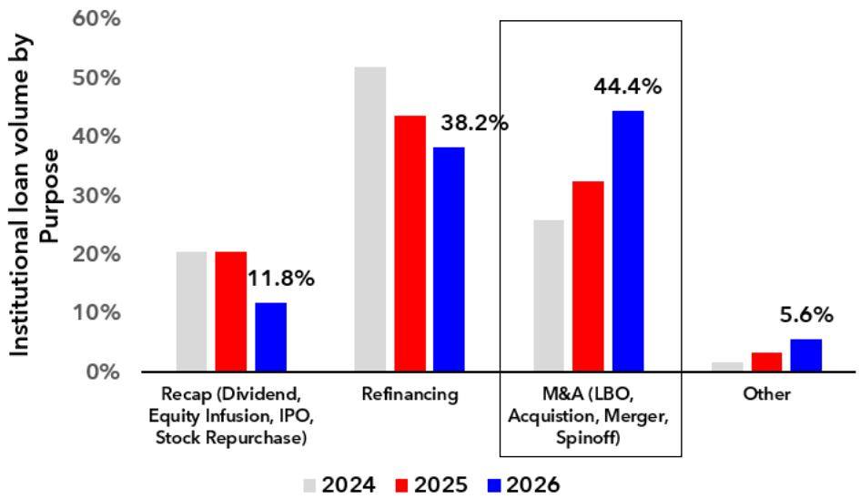

bar chart

| Purpose | 2024 (%) | 2025 (%) | 2026 (%) |
| :--- | :--- | :--- | :--- |
| Recap (Dividend, Equity Infusion, IPO, Stock Repurchase) | 20.0 | 20.0 | 11.8 |
| Refinancing | 52.0 | 43.5 | 38.2 |
| M&A (LBO, Acquisition, Merger, Spinoff) | 25.5 | 32.5 | 44.4 |
| Other | 1.5 | 3.0 | 5.6 |

The price gap between BB and B loans in the secondary market remains large  
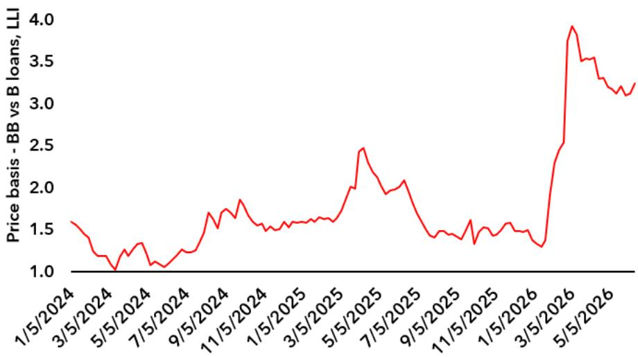

line chart

| Date       | Price basis - BB vs B loans, LLI |
| ---------- | --------------------------------- |
| 1/5/2024   | 1.5                               |
| 3/5/2024   | 1.0                               |
| 5/5/2024   | 1.2                               |
| 7/5/2024   | 1.1                               |
| 9/5/2024   | 1.3                               |
| 11/5/2024  | 1.6                               |
| 1/5/2025   | 1.5                               |
| 3/5/2025   | 1.6                               |
| 5/5/2025   | 2.4                               |
| 7/5/2025   | 2.0                               |
| 9/5/2025   | 1.4                               |
| 11/5/2025  | 1.5                               |
| 1/5/2026   | 1.3                               |
| 3/5/2026   | 2.5                               |
| 5/5/2026   | 3.9                               |

net-new loan creation is accelerating. This setup should be supportive of CLO New Issue on the margins moving forward into H2.

In the secondary market, price dispersion is visible on three levels – ratings, sector, and size.

Lower ratings (particularly Bs / CCCs) are underperforming BBs. This is visible when looking at the price differential between credit ratings, which has growing throughout the year – the difference between BBs and Bs is currently 3.2 points compared to 1.4 at the start of the year. And the price gap between Bs and CCC rated loans in secondary is even more disparate – 25.3 points compared to 22.2 points in January. This number has consistently climbed since August 2025, when investor concerns over the private credit market were ignited following the Tricolor and First Brands defaults.

In terms of loan dispersion from a sector level, Software continues to trail other industries from a YTD perspective – down 6.6% when using the Moody's industry classification. However, concerns over the sector have come into a better balance over the last 2 months since March, with the sector gaining 66 bps since then. Most investors by this point seem to have a thesis of potential winners and losers in the sector, allowing for a moderation in what had initially been an almost blanket selloff of the sector.

Finally, dispersion in the secondary loan market is happening along debt size. From a pricing perspective, the largest loan instruments in the Morningstar Leveraged Loan Index have sold off more than the broader index, a 2.7% decline compared to a 1.6% pullback for all loans. This is partly due to some of the largest names in the index also being names tied to the Software sector, and which have sold off on the year – McAfee, CDK Global, Kaseya Inc., and Qlik Technologies.

However, from a distressed pricing perspective, smaller loans are under more pressure when viewing the LLI distressed ratio.

Since March, Software (Tech) loan prices have shown greater stability  

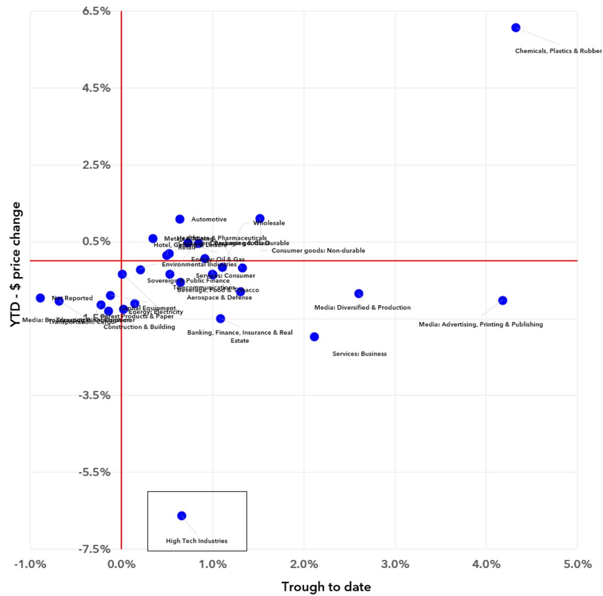

scatterplot

| Industry | Trough to date | YTD - $ price change |
| --- | --- | --- |
| Chemicals, Plastics & Rubber | 4.3% | 6.0% |
| Wholesale | 1.5% | 0.8% |
| Automotive | 0.7% | 0.8% |
| Healthcare, Pharmaceuticals | 0.4% | 0.5% |
| Retail, Consumer Goods & Durable | 0.6% | 0.2% |
| Energy, Oil & Gas | 1.2% | 0.2% |
| Environmental Industries | 0.3% | -0.2% |
| Services: Consumer | 1.3% | -0.2% |
| Sovereign & Public Finance | 0.9% | -0.3% |
| Technology, Healthcare, Tobacco | 1.1% | -0.4% |
| Aerospace & Defense | 1.4% | -0.4% |
| Banking, Finance, Insurance & Real Estate | 1.1% | -1.0% |
| Media: Diversified & Production | 2.6% | -1.0% |
| Services: Business | 2.1% | -1.5% |
| Media: Advertising, Printing & Publishing | 4.2% | -1.0% |
| High Tech Industries | 0.7% | -7.5% |
| Construction & Building | 0.6% | -1.0% |
| Energy Equipment, Electricity | 0.2% | -0.5% |
| Enerplus Products & Paper | 0.1% | -0.5% |
| Non Reported | -0.5% | -1.0% |
| Transportation & Infrastructure | -0.3% | -1.5% |
| Media: Bro-Telecommunications | -0.2% | -1.5% |
| Construction & Building | 0.1% | -1.5% |
| Energy Equipment, Electrical Appliances | 0.1% | -1.5% |
| Non Reported | -0.8% | -1.5% |
| Retail, Apparel & Accessories | 0.1% | -1.5% |
| Energy Equipment, Electronics & Power Supply Chainers | 0.1% | -1.5% |
| Construction & Building | 0.1% | -1.5% |
| Energy Equipment, Electrical Appliances & Power Supply Chainers | 0.1% | -1.5% |
| Energy Equipment, Electronics & Power Supply Chainers | 0.1% | -1.5% |
| Energy Equipment, Electrical Appliances & Power Supply Chainers | 0.1% | -1.5% |
| Energy Equipment, Electrical Appliances & Power Supply Chainers | 0.1% | -1.5% |
| Energy Equipment, Electrical Appliances & Power Supply Chainers | 0.1% | -1.5% |
| Energy Equipment, Electrical Appliances & Power Supply Chainers | 0.1% | -1.5% |
| Energy Equipment, Electrical Appliances & Power Supply chainers | 0.1% | -1.5% |
| Energy Equipment, Electrical Appliances & Power Supply chainers | 0.1% | -1.5% |
| Energy Equipment, Electrical Appliances & Power Supply chainers | 0.1% | -1.5% |
| Energy Equipment, Electrical Appliances & Power Supply chainers | 0.1% | -1.5% |
| Energy Equipment, Electrical Appliances & Power Supply chainers | 6.7% | -7.5% |
| Energy Equipment, Electrical Appliances & Power Supply chainers | 6.7% | -7.5% |
| Energy Equipment, Electrical Appliances & Power Supply chainers | 6.7% | -7.5% |
| Energy Equipment, Electrical Appliances & Power Supply chainers | 6.7% | -7.5% |
| Energy Equipment, Electrical Appliances & Power Supply chainers | 6.7% | -7.5% |

The number of loan borrowers with debt pricing sub-80 is higher than the par amount of the index pricing sub-80 – a distressed ratio of 8.2% by issuer count compared to a distressed ratio of 6.5% by par amount. The higher distressed ratio by issuer count implies that smaller borrowers are under more pressure on average than larger borrowers, posing a tail risk for investors.

This dispersion in the market – along ratings, sector, and size – is both an opportunity and a risk for CLO managers. We see this contributing to differing outcomes in credit and price metrics for platforms in the quarters ahead and should therefore begin to see the broader dispersion in the loan market be more fully expressed in differences between CLO portfolio metrics in the back half of the year.

The largest loans in the index are underperforming  
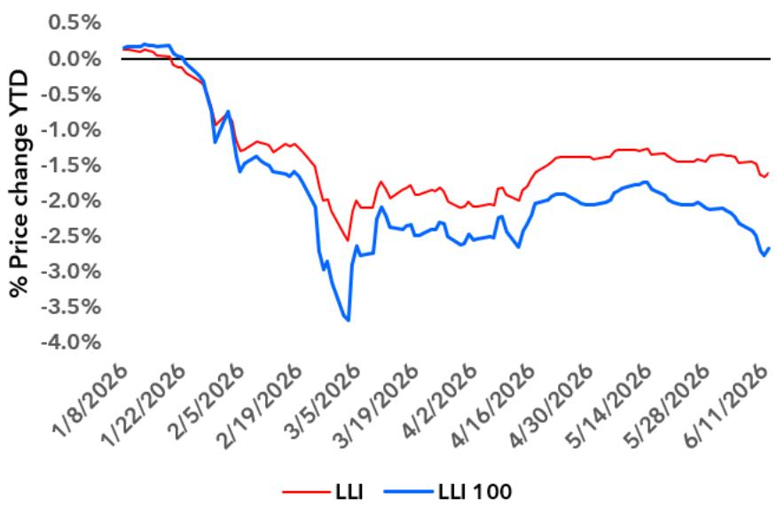

line chart

| Date       | LLI    | LLI 100 |
| ---------- | ------ | ------- |
| 1/8/2026   | 0.0%   | 0.0%    |
| 1/22/2026  | -0.5%  | -0.5%   |
| 2/5/2026   | -1.0%  | -1.0%   |
| 2/19/2026  | -1.5%  | -1.5%   |
| 3/5/2026   | -2.5%  | -3.5%   |
| 3/19/2026  | -2.0%  | -2.5%   |
| 4/2/2026   | -2.0%  | -2.5%   |
| 4/16/2026  | -1.5%  | -2.5%   |
| 4/30/2026  | -1.5%  | -2.0%   |
| 5/14/2026  | -1.5%  | -1.5%   |
| 5/28/2026  | -1.5%  | -1.5%   |
| 6/11/2026  | -1.5%  | -2.5%   |

## Credit – growing dispersion in manager performance

CLO credit metrics remain firm at the headline across portfolios – WARF, CCCs, and current defaults show a marked improvement YoY.

However, like in the loan market, there is growing dispersion – when considering the Max vs Min, several credit metrics are showing a greater gap between the outperforming vs underperforming CLO portfolios. And when moving beyond credit and considering key market value metrics, such as Weighted Average Portfolio price and the number of assets priced sub-80, the gap in performance is also evident.

CLO equity performance at the manager level is also showing growing dispersion. Quarterly payouts are driven by several factors, such as vintage, initial pricing, and composition of the loan portfolio at the time of pricing. Gaps in performance tend to arise over time due to differing outcomes by Managers when it comes to avoiding loan losses and par erosion. When considering the trailing 2 year quarterly average for payouts, the range between the top and bottom for platforms with at least \$5B in AUM is quite stark – 7.6% at the high end compared to 2.3% at the low end.

So, at the headline, CLO credit metrics are showing relative stability. Yet, the average is masking the underlying dispersion between portfolios.

When looking at the loan market, default rates have been moderating – 3.1% in the LLI (nominal) compared to 4.4% at this time a year ago.

But the distressed ratio, an indicator of the percentage of loans of the LLI priced sub-80, remains at elevated levels from both a nominal and par value perspective. This is an important leading signal of credit distress – when the distressed ratio rises, it typically signals that defaults will rise in the 6-9 months following.

Given a few factors – (1) rates remaining elevated and on hold, (2) mounting pressure on Software borrowers with maturities in 2028, (3) likely signs of consumer weakening for the middle and bottom earning cohorts – we see the likelihood of this trend to hold and for loan defaults to once again begin to drift higher by year's end.

The knock-on effect will be greater loan losses, which will weigh on the Jr OC cushions for some portfolios and ultimately equity cash payouts. This divergence in outcomes reinforces the need for CLO investors to re-underwrite the platforms they are allocating to in the back half of this year.

A constructive equilibrium – WARF, CCCs moderating  
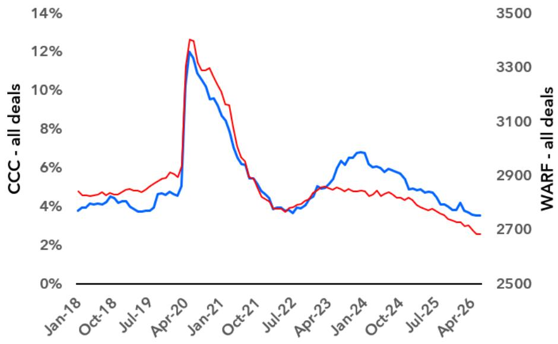

line chart

| Date    | CCC - all deals | WARF - all deals |
|---------|-----------------|------------------|
| Jan-18  | ~4%             | ~2700            |
| Oct-18  | ~4%             | ~2750            |
| Jul-19  | ~4%             | ~2800            |
| Apr-20  | ~12%            | ~3400            |
| Jan-21  | ~10%            | ~3100            |
| Oct-21  | ~6%             | ~2900            |
| Jul-22  | ~4%             | ~2750            |
| Apr-23  | ~5%             | ~2850            |
| Jan-24  | ~6%             | ~2950            |
| Oct-24  | ~5%             | ~2850            |
| Jul-25  | ~4%             | ~2750            |
| Apr-26  | ~3%             | ~2700            |

Performance dispersion is evident in Equity payouts  
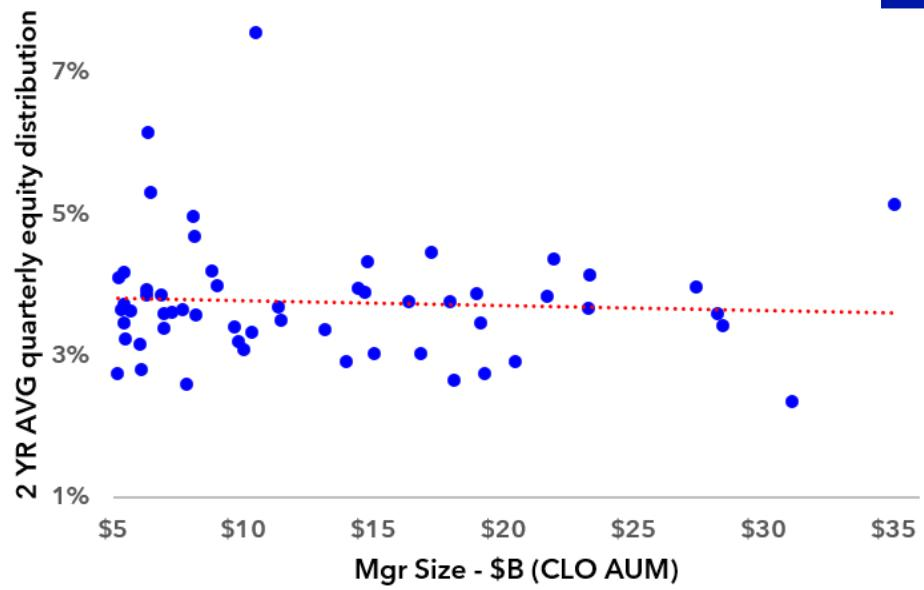

scatterplot

| Mgr Size - $B (CLO AUM) | 2 YR AVG quarterly equity distribution |
| ------------------------ | ---------------------------------------- |
| $5                       | ~3%                                      |
| $10                      | ~7%                                      |
| $15                      | ~4%                                      |
| $20                      | ~3%                                      |
| $25                      | ~4%                                      |
| $30                      | ~2%                                      |
| $35                      | ~5%                                      |

Distressed ratios remain elevated, pointing to tail risk  
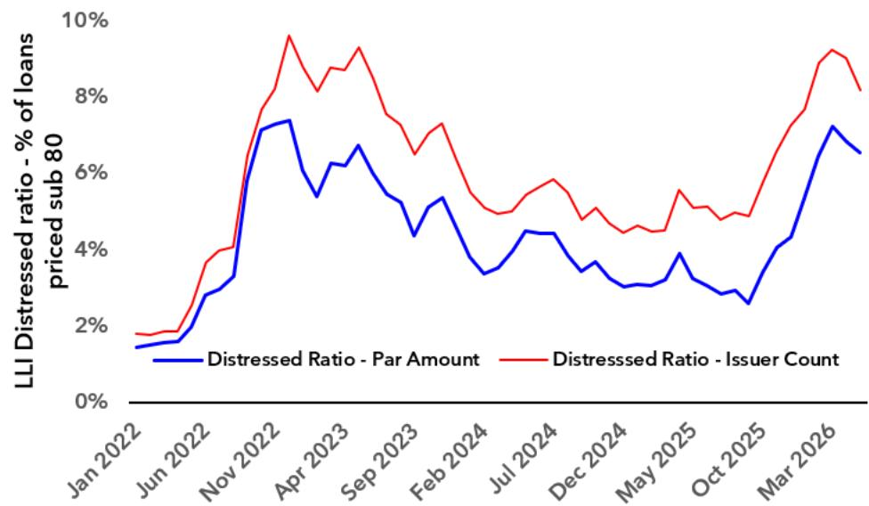

line chart

| Date       | Distressed Ratio - Par Amount | Distressed Ratio - Issuer Count |
| ---------- | ----------------------------- | -------------------------------- |
| Jan 2022   | ~1.5%                         | ~1.8%                            |
| Jun 2022   | ~1.8%                         | ~2.0%                            |
| Nov 2022   | ~7.0%                         | ~8.0%                            |
| Apr 2023   | ~6.5%                         | ~9.5%                            |
| Sep 2023   | ~5.5%                         | ~7.5%                            |
| Feb 2024   | ~4.5%                         | ~6.5%                            |
| Jul 2024   | ~4.0%                         | ~5.5%                            |
| Dec 2024   | ~3.5%                         | ~4.5%                            |
| May 2025   | ~3.0%                         | ~5.0%                            |
| Oct 2025   | ~2.5%                         | ~4.5%                            |
| Mar 2026   | ~7.0%                         | ~9.0%                            |

## ABS 2026 Mid-Year Outlook

## Rising issuance, mixed picture on credit

Kayvan Darouian, Director

Nick Huang, Research Associate

## Ta

## d picture on credit

Key takeaways; Issuance to hit new record in 2026, spreads to widen slightly through year-end, collateral performance to weaken incrementally on nonprime stress.  
The ABS market has shown impressive resilience in response to macro shocks as we head into H2, as spread volatility, rising rates, and pockets of consumer weakness have not slowed the new issue market which is on pace for a new record.  
- ABS offers compelling relative value to corporates at current levels. We think ABS spreads will be flat to incrementally wider through year-end.  
How healthy is the U.S. consumer? If we were giving letter grades, we would call it a B at present, down slightly from a B+ when we published our 2026 year-ahead outlook. While the unemployment rate has decreased and the economy continues to grow, consumer delinquencies point to weakness at the lower end of the income/credit spectrum. Inflation is on the rise again as food and gas prices put a strain household budgets. With a solid labor market and rising inflation, rates cuts are not in the forecast.  
■ Auto ABS continues to pace the market, but issuance has been roughly flat vs 2025 for most of the year so far. Affordability remains a drag on the new vehicle market, while stabilization in used vehicle prices has been helpful. Continued year-over-year weakening in performance, across both prime and non-prime pools, has been disappointing.  
- Esoteric ABS, including digital infrastructure, transportation, whole business and others, has been the primary driver of growth in new issue supply this year. That said, data center issuance is behind our forecasted pace at present.  
- Consumer ABS performance has been mixed year-to-date, but we expect some weakening from current levels through year-end for the more credit sensitive asset types.  
Risks to our view? Issuance could come in below our forecast if data center supply doesn't meet expectations. Consumers, who are already facing negative real wage growth could come under more pressure if gas prices and inflation do not subside, or if the labor market weakens.

## We revise our ABS issuance forecast upward to \$360 billion for 2026

<table><tr><td>in $Bn</td><td>Autos</td><td>Student Loans</td><td>Credit Cards</td><td>Equipment</td><td>Esoteric</td><td>Total</td></tr><tr><td>2025</td><td>170</td><td>11</td><td>22</td><td>24</td><td>112</td><td>339</td></tr><tr><td>2026 YTD</td><td>81</td><td>6</td><td>6</td><td>11</td><td>63</td><td>168</td></tr><tr><td>2026 Forecast</td><td>170</td><td>14</td><td>18</td><td>25</td><td>133</td><td>360</td></tr><tr><td>% change vs 25&#x27;</td><td>0%</td><td>32%</td><td>-19%</td><td>5%</td><td>18%</td><td>6%</td></tr><tr><td>Paydown</td><td>150</td><td>16</td><td>22</td><td>22</td><td>95</td><td>305</td></tr><tr><td>Net issuance</td><td>20</td><td>-2</td><td>-4</td><td>3</td><td>38</td><td>55</td></tr></table>

Source: DB, Bloomberg Finance LP

We are increasing our full-year 2026 ABS issuance forecast to \$360 billion from \$345 billion previously, as the new issue market has had a very strong first half of the year. This would represent a 6% increase over 2025's full-year total and would be a new record for the market.  
We have increased our forecast for esoteric/other ABS issuance to \$133 billion from \$120 billion, as the rise in issuance for this sector has driven the growth of ABS issuance year-to-date.  
We reiterate our full-year forecasts for data center ABS and CMBS, of \$25 billion and \$15 billion, respectively, and consumer loan ABS of \$30 billion.  
- Considering these increases and making some adjustments to our paydown assumptions, we are now forecasting \$55 billion in ABS net issuance.

## ABS offers significant spread pick-up to similarly-rated corporates

Single-A ABS spreads vs intermediate Corp IG (bp)  
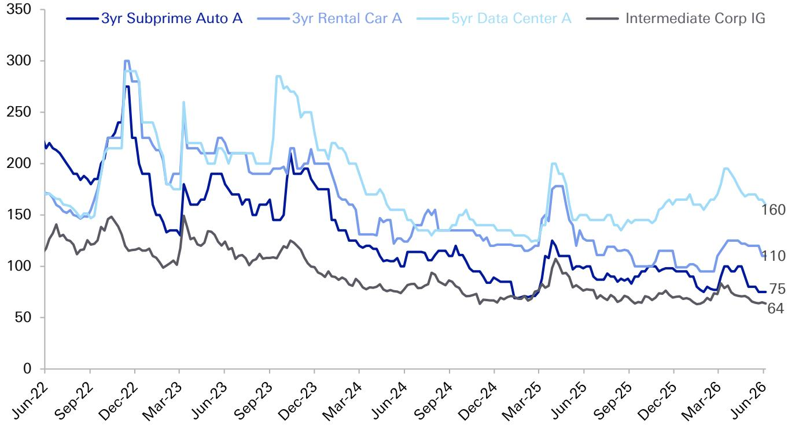

line chart

| Date    | 3yr Subprime Auto A | 3yr Rental Car A | 5yr Data Center A | Intermediate Corp IG |
|---------|---------------------|------------------|-------------------|----------------------|
| Jun-26  | 75                  | 110              | 160               | 64                   |

<table><tr><td>Asset type</td><td>12-Jun</td><td>End-2025</td><td>Chg (bp)</td></tr><tr><td>3yr Subprime Auto A</td><td>75</td><td>95</td><td>-20</td></tr><tr><td>3yr Rental Car A</td><td>110</td><td>99</td><td>11</td></tr><tr><td>5yr Data Center A</td><td>160</td><td>165</td><td>-5</td></tr><tr><td>Intermediate Corp IG</td><td>64</td><td>69</td><td>-5</td></tr></table>

Source: DB, Bloomberg, L.P.

- Top-tier triple-A consumer ABS trade inside of corp IG, but when you account for ratings and tenor, ABS looks compelling.  
At present, similarly-rated ABS offer attractive relative value with roughly 10-95 bps of spread pick-up to the intermediate Corp IG index.

## Relative value: ABS looks attractive as tightening has lagged corporates

Prime Auto ABS seniors – We like top-tier OEM names for the spread pick-up to bankcard seniors and think that some of the smaller shelves’ seniors look attractive at current levels.  
- Equipment ABS seniors – Performance has been stable and we like the incremental spread pickup to prime auto and bank card ABS for top-tier names.  
- Rental car seniors and IG subs – Stable used vehicle prices and the spread pick-up to other auto ABS subsectors make rental car ABS attractive. Single-A subs haven’t fully re-traced spread widening from beginning of 2026 and we think they have room to tighten.  
- Private SLABS seniors – We think that 100+ bp spreads in triple-As, high FICOs, and co-signers outweigh the headline risks which primarily originate from the federal student loan program.  
Subprime auto subs – We like the IG part of the stack from programmatic issuers. Collateral performance has been a little disappointing, as the tax refund season didn’t halt year-over-year weakening in collateral performance. Most deals are performing within expectations, however.  
- Data center seniors – While data center senior spreads have come in from their year-to-date wide, we still like the 95+ bp pick-up to corporates for top-tier hyperscale single-As.

## arket and spending

## have held up...

Unemployment, Personal Savings Rate, and Real Personal Spending y/y (%)

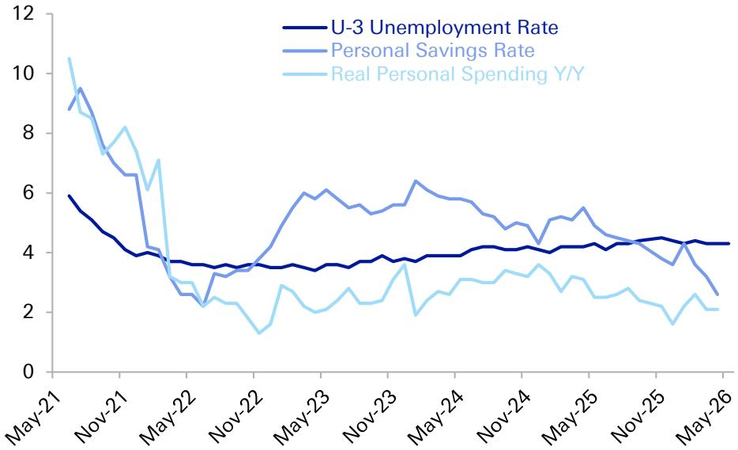

line chart

| Date    | U-3 Unemployment Rate | Personal Savings Rate | Real Personal Spending Y/Y |
|---------|------------------------|------------------------|----------------------------|
| May-21  | 6.0                    | 9.0                    | 10.5                       |
| Nov-21  | 4.5                    | 7.0                    | 8.0                        |
| May-22  | 3.5                    | 2.5                    | 3.0                        |
| Nov-22  | 3.5                    | 3.0                    | 1.5                        |
| May-23  | 3.5                    | 6.0                    | 2.5                        |
| Nov-23  | 3.5                    | 5.5                    | 3.5                        |
| May-24  | 3.5                    | 6.5                    | 2.0                        |
| Nov-24  | 3.5                    | 5.0                    | 3.0                        |
| May-25  | 4.0                    | 5.5                    | 2.5                        |
| Nov-25  | 4.0                    | 4.0                    | 1.5                        |
| May-26  | 4.0                    | 2.5                    | 2.0                        |

Source: Bloomberg Finance LP, Federal Reserve, BLS, BEA

Household net worth and leverage (%)  
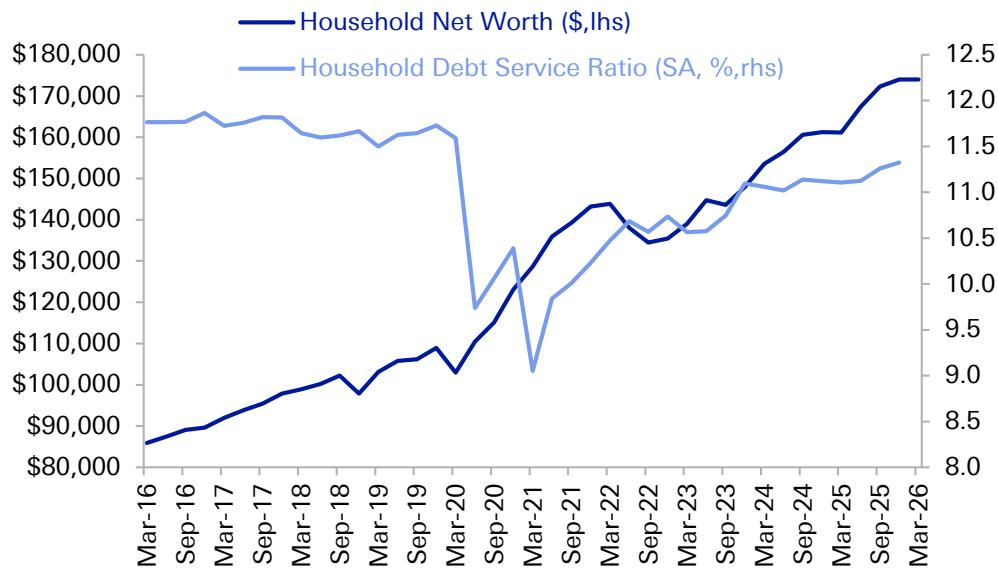

line chart

| Date    | Household Net Worth ($,lhs) | Household Debt Service Ratio (SA, %,rhs) |
|---------|-----------------------------|------------------------------------------|
| Mar-16  | $85,000                     | 11.8                                     |
| Sep-16  | $90,000                     | 11.7                                     |
| Mar-17  | $95,000                     | 11.6                                     |
| Sep-17  | $100,000                    | 11.5                                     |
| Mar-18  | $105,000                    | 11.4                                     |
| Sep-18  | $102,000                    | 11.3                                     |
| Mar-19  | $108,000                    | 11.2                                     |
| Sep-19  | $110,000                    | 11.1                                     |
| Mar-20  | $115,000                    | 11.0                                     |
| Sep-20  | $125,000                    | 9.5                                      |
| Mar-21  | $135,000                    | 9.8                                      |
| Sep-21  | $145,000                    | 10.5                                     |
| Mar-22  | $142,000                    | 10.8                                     |
| Sep-22  | $138,000                    | 10.6                                     |
| Mar-23  | $145,000                    | 10.7                                     |
| Sep-23  | $155,000                    | 10.9                                     |
| Mar-24  | $165,000                    | 11.2                                     |
| Sep-24  | $175,000                    | 11.3                                     |
| Mar-25  | $185,000                    | 11.4                                     |
| Sep-25  | $195,000                    | 11.5                                     |
| Mar-26  | $205,000                    | 11.6                                     |

Source: Bloomberg Finance LP, Federal Reserve

- On balance, we rated the financial health of the U.S. consumer a B+ in Q4 2025, but we think that the headwinds facing the consumer outweigh the slight drop in the unemployment rate since Q4, reducing the overall letter grade to B. Still solid but reflects the additional stress on lower income households. With the bifurcated, or K-shaped narrative in mind, we’d break this down further:  
— Prime Consumer: Grade A-/B+. Benefitting from asset price inflation and a solid labor market but still facing inflationary pressures.  
— Non-Prime Consumer: Grade C. Bearing the brunt of inflation, higher interest rates, and depleted savings, as evidenced by rising delinquencies in subprime auto.  
- On the positive side, the labor market remains solid with unemployment dropping slightly this year and holding steady at 4.3%. Household leverage is ticking higher but remains below pre-pandemic levels. The economy is still growing, and household net worth is benefitting from stock market gains and home price appreciation. Consumers are still spending.

## ...While headwinds build

Consumer sentiment and inflation (%)  
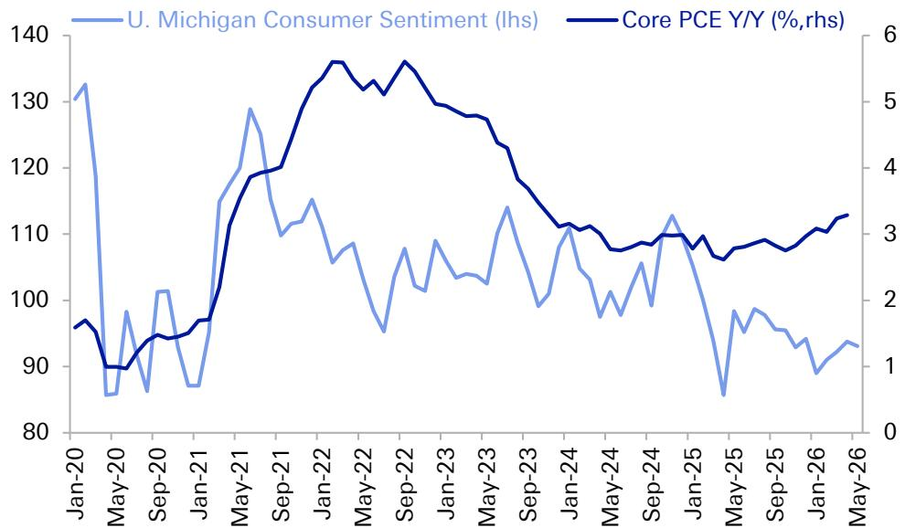

line chart

| Date   | U. Michigan Consumer Sentiment (lhs) | Core PCE Y/Y (%,rhs) |
|--------|--------------------------------------|----------------------|
| Jan-20 | 132                                  | 1.5                  |
| May-20 | 87                                   | 1.0                  |
| Sep-20 | 101                                  | 1.8                  |
| Jan-21 | 87                                   | 2.0                  |
| May-21 | 129                                  | 4.0                  |
| Sep-21 | 110                                  | 5.0                  |
| Jan-22 | 115                                  | 5.5                  |
| May-22 | 108                                  | 5.0                  |
| Sep-22 | 105                                  | 4.5                  |
| Jan-23 | 103                                  | 4.0                  |
| May-23 | 104                                  | 3.5                  |
| Sep-23 | 100                                  | 3.0                  |
| Jan-24 | 108                                  | 2.8                  |
| May-24 | 98                                   | 2.5                  |
| Sep-24 | 105                                  | 2.7                  |
| Jan-25 | 113                                  | 3.0                  |
| May-25 | 87                                   | 2.8                  |
| Sep-25 | 95                                   | 3.0                  |
| Jan-26 | 90                                   | 3.2                  |
| May-26 | 93                                   | 3.5                  |

Source: Bloomberg Finance LP, Federal Reserve, University of Michigan

Headwinds: High gas and food prices are weighing on households, an uptick in inflation precludes rate cuts.  
Real wage growth is negative, and the personal saving rate is down, indicating that consumers are adjusting to maintain their spending.  
While the headline numbers can be misleading, consumer delinquencies are elevated, with credit card delinquencies above pre-pandemic levels.  
- On balance, we think consumer ABS collateral performance will come in flat-to-weaker through year-end. A drop in gas prices and slowing inflation would help to ease some of the pressure on households.

Consumer interest rates (%)  
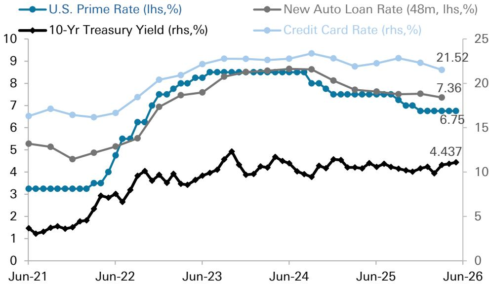

line chart

| Date   | U.S. Prime Rate (lhs,%) | New Auto Loan Rate (48m, lhs,%) | 10-Yr Treasury Yield (rhs,%) | Credit Card Rate (rhs,%) |
|--------|--------------------------|----------------------------------|-------------------------------|---------------------------|
| Jun-21 | 3.0                      | 5.0                              | 1.0                           | 17.0                      |
| Jun-22 | 5.5                      | 5.5                              | 2.5                           | 18.0                      |
| Jun-23 | 8.0                      | 8.0                              | 4.0                           | 20.0                      |
| Jun-24 | 8.5                      | 8.5                              | 4.5                           | 21.52                     |
| Jun-25 | 7.5                      | 7.5                              | 4.0                           | 20.0                      |
| Jun-26 | 6.75                     | 7.36                             | 4.437                         | 19.0                      |

Source: Bloomberg Finance LP, Federal Reserve

Credit card 30+ day delinquency rate, all banks (%)  
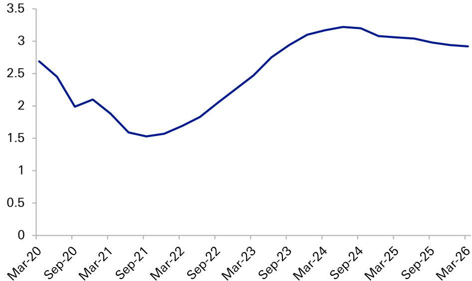

line chart

| Date    | Value |
|---------|-------|
| Mar-20  | 2.7   |
| Sep-20  | 2.0   |
| Mar-21  | 2.1   |
| Sep-21  | 1.5   |
| Mar-22  | 1.6   |
| Sep-22  | 1.8   |
| Mar-23  | 2.4   |
| Sep-23  | 2.8   |
| Mar-24  | 3.1   |
| Sep-24  | 3.2   |
| Mar-25  | 3.1   |
| Sep-25  | 3.0   |
| Mar-26  | 2.9   |

Source: Bloomberg Finance LP, Federal Reserve

## A

## likely limited this year

New auto sales, consumer confidence, and auto ABS issuance  
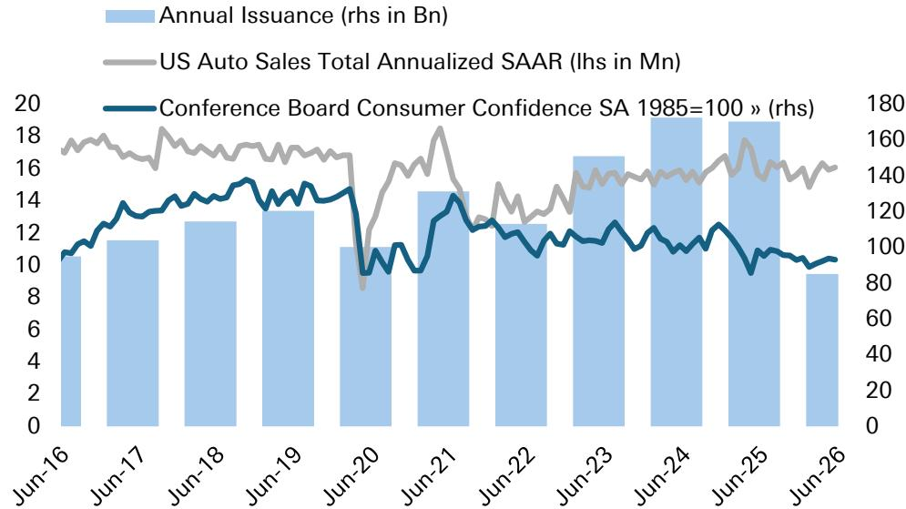

bar-line hybrid chart

| Date   | Annual Issuance (rhs in Bn) | US Auto Sales Total Annualized SAAR (lhs in Mn) | Conference Board Consumer Confidence SA 1985=100 » (rhs) |
|--------|-----------------------------|-----------------------------------------------|------------------------------------------------------|
| Jun-16 | 10                          | 17                                            | 100                                                  |
| Jun-17 | 11                          | 16                                            | 110                                                  |
| Jun-18 | 13                          | 17                                            | 120                                                  |
| Jun-19 | 13                          | 16                                            | 130                                                  |
| Jun-20 | 11                          | 8                                             | 90                                                   |
| Jun-21 | 14                          | 18                                            | 140                                                  |
| Jun-22 | 12                          | 14                                            | 120                                                  |
| Jun-23 | 17                          | 15                                            | 130                                                  |
| Jun-24 | 19                          | 15                                            | 120                                                  |
| Jun-25 | 19                          | 16                                            | 100                                                  |
| Jun-26 | 9                           | 15                                            | 90                                                   |

Note: 2026 issuance is based on 2026 YTD, annual issuance bar corresponds with year on horizontal axis. Source: DB, Bloomberg Finance LP.

Issuance is roughly flat to last year, and upside is limited as new vehicle sales are expected to come in below last year's total, which could directly impact prime loan and retail lease ABS supply.  
Collateral performance is not as strong as we would have hoped given high expectations for tax refund season this year. High gas and food prices are weighing on borrowers. That said, we think the deterioration in collateral performance is somewhat overstated.  
- Affordability remains a major concern for lenders, as vehicle prices continue to climb and interest rates remain elevated.

Subprime auto ABS performance  
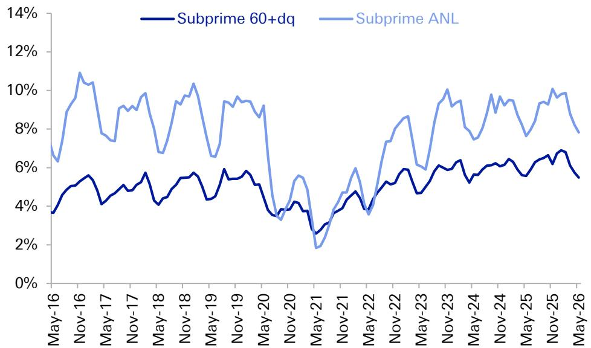

line chart

| Date   | Subprime 60+dq | Subprime ANL |
|--------|-----------------|--------------|
| May-16 | 3.5%            | 6.5%         |
| Nov-16 | 5.0%            | 11.0%        |
| May-17 | 4.5%            | 7.5%         |
| Nov-17 | 5.5%            | 9.0%         |
| May-18 | 4.0%            | 6.5%         |
| Nov-18 | 5.5%            | 10.5%        |
| May-19 | 4.5%            | 6.5%         |
| Nov-19 | 5.5%            | 9.5%         |
| May-20 | 4.0%            | 3.0%         |
| Nov-20 | 3.5%            | 5.5%         |
| May-21 | 2.5%            | 1.5%         |
| Nov-21 | 3.5%            | 4.5%         |
| May-22 | 4.5%            | 6.0%         |
| Nov-22 | 5.5%            | 8.5%         |
| May-23 | 6.0%            | 6.0%         |
| Nov-23 | 6.5%            | 10.0%        |
| May-24 | 6.0%            | 7.5%         |
| Nov-24 | 6.5%            | 9.5%         |
| May-25 | 6.0%            | 8.0%         |
| Nov-25 | 6.5%            | 10.0%        |
| May-26 | 5.5%            | 7.5%         |

Source: FitchRatings

Prime auto ABS performance  
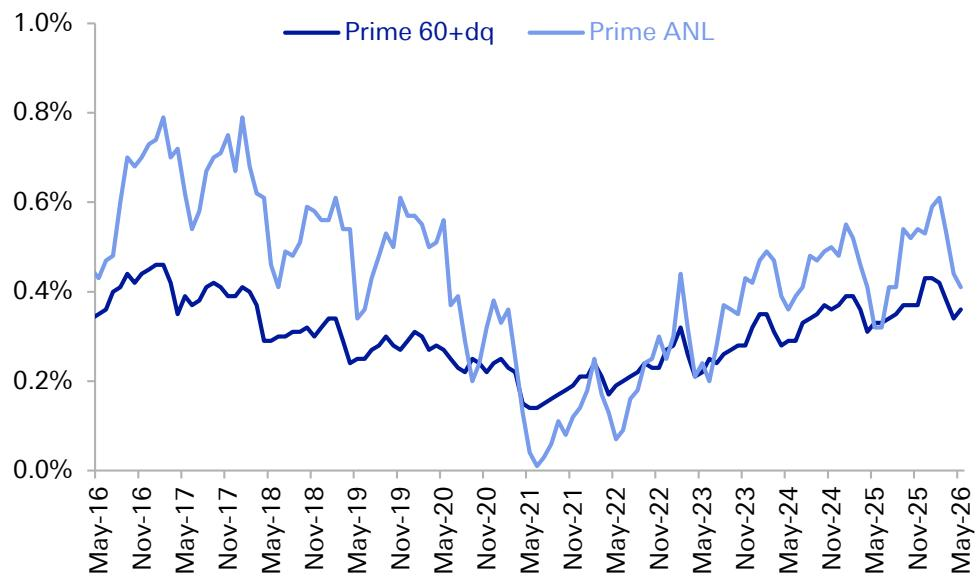

line chart

| Date   | Prime 60+dq | Prime ANL |
|--------|-------------|-----------|
| May-16 | 0.35%       | 0.45%     |
| Nov-16 | 0.45%       | 0.75%     |
| May-17 | 0.40%       | 0.80%     |
| Nov-17 | 0.35%       | 0.75%     |
| May-18 | 0.30%       | 0.60%     |
| Nov-18 | 0.35%       | 0.55%     |
| May-19 | 0.25%       | 0.35%     |
| Nov-19 | 0.30%       | 0.60%     |
| May-20 | 0.25%       | 0.55%     |
| Nov-20 | 0.20%       | 0.40%     |
| May-21 | 0.15%       | 0.05%     |
| Nov-21 | 0.20%       | 0.25%     |
| May-22 | 0.15%       | 0.10%     |
| Nov-22 | 0.25%       | 0.30%     |
| May-23 | 0.30%       | 0.45%     |
| Nov-23 | 0.35%       | 0.40%     |
| May-24 | 0.35%       | 0.45%     |
| Nov-24 | 0.35%       | 0.50%     |
| May-25 | 0.35%       | 0.45%     |
| Nov-25 | 0.40%       | 0.60%     |
| May-26 | 0.35%       | 0.45%     |

Source: FitchRatings

## Consumer ABS: Key points heading in H2

YTD SLABS issuance (\$ bn) outpacing 2025  
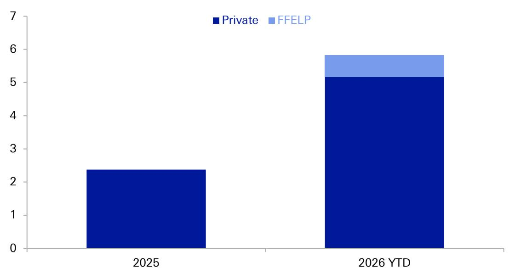

stacked bar chart

| Year | Private | FFELP |
| :--- | :--- | :--- |
| 2025 | 2.4 | 0.0 |
| 2026 YTD | 5.1 | 0.7 |

Source: DB, Bloomberg Finance LP

SLABS: Lower limits for PLUS loans and the end of Grad PLUS for new borrowers will shift volume to private lenders and should result in additional term ABS issuance starting this year.  
Credit card: Strong ABS performance contrary to NY Fed headline card delinquencies. Issuance to rise through year-end as the pace of expected maturities picks up but will still come in below last year's total.  
- Consumer loan: Performance has been mixed, but MPL-backed deals continue to show year-over-year improvement

Bankcard ABS charge-offs, dlq's down y/y  
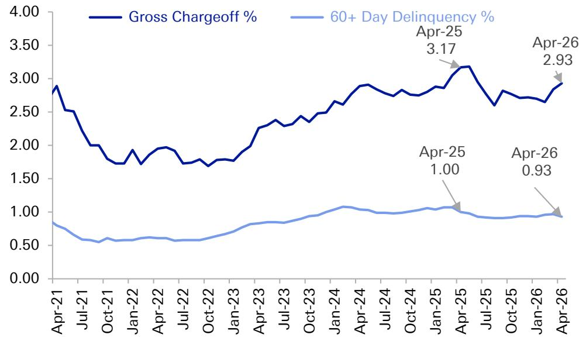

line chart

| Date    | Gross Chargeoff % | 60+ Day Delinquency % |
|---------|-------------------|------------------------|
| Apr-25  | 3.17              | 1.00                   |
| Apr-26  | 2.93              | 0.93                   |

Source: FitchRatings

Consumer Loan performance is mixed  
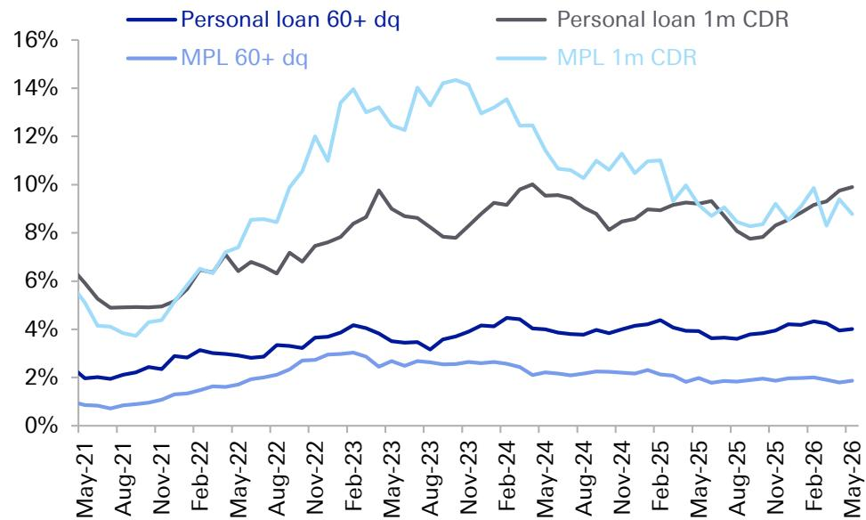

line chart

| Date    | Personal loan 60+ dq | Personal loan 1m CDR | MPL 60+ dq | MPL 1m CDR |
|---------|----------------------|----------------------|------------|------------|
| May-21  | 2.0%                 | 6.0%                 | 1.0%       | 5.0%       |
| Aug-21  | 2.5%                 | 5.0%                 | 1.5%       | 4.0%       |
| Nov-21  | 3.0%                 | 5.0%                 | 2.0%       | 4.5%       |
| Feb-22  | 3.5%                 | 6.0%                 | 2.5%       | 6.0%       |
| May-22  | 3.0%                 | 7.0%                 | 3.0%       | 7.5%       |
| Aug-22  | 3.5%                 | 8.0%                 | 3.5%       | 9.0%       |
| Nov-22  | 4.0%                 | 9.0%                 | 4.0%       | 11.0%      |
| Feb-23  | 4.5%                 | 10.0%                | 4.5%       | 13.0%      |
| May-23  | 4.0%                 | 9.5%                 | 4.0%       | 12.5%      |
| Aug-23  | 3.5%                 | 8.5%                 | 3.5%       | 14.0%      |
| Nov-23  | 4.0%                 | 9.0%                 | 4.0%       | 13.5%      |
| Feb-24  | 4.5%                 | 9.5%                 | 4.5%       | 12.5%      |
| May-24  | 4.0%                 | 9.0%                 | 4.0%       | 11.0%      |
| Aug-24  | 3.5%                 | 8.5%                 | 3.5%       | 10.5%      |
| Nov-24  | 4.0%                 | 9.0%                 | 4.0%       | 11.0%      |
| Feb-25  | 4.5%                 | 9.5%                 | 4.5%       | 10.5%      |
| May-25  | 4.0%                 | 9.0%                 | 4.0%       | 9.5%       |
| Aug-25  | 3.5%                 | 8.5%                 | 3.5%       | 8.5%       |
| Nov-25  | 4.0%                 | 9.0%                 | 4.0%       | 9.0%       |
| Feb-26  | 4.5%                 | 9.5%                 | 4.5%       | 8.5%       |
| May-26  | 4.0%                 | 10.0%                | 4.0%       | 9.0%       |

Source: Intex, DB

## Data center come up short of projections

## cord year, but could

Data center ABS & CMBS issuance (\$ bn)  
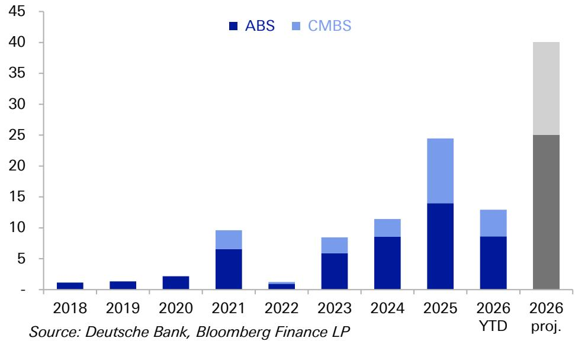

stacked bar chart

| Year     | ABS  | CMBS |
| -------- | ---- | ---- |
| 2018     | 1    | 0    |
| 2019     | 1    | 0    |
| 2020     | 2    | 0    |
| 2021     | 6    | 3    |
| 2022     | 1    | 0    |
| 2023     | 5    | 3    |
| 2024     | 8    | 3    |
| 2025     | 14   | 11   |
| 2026 YTD | 8    | 3    |
| 2026 proj. | 25   | 17   |

Hyperscaler Capex(\$ bn)  
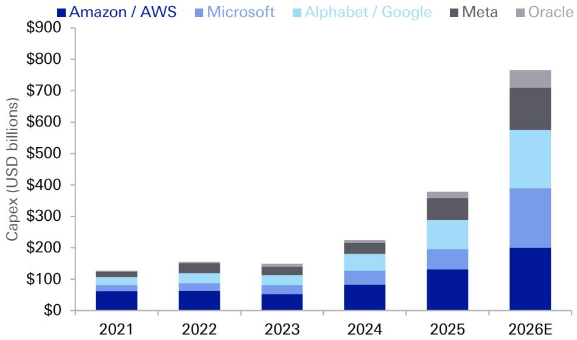

stacked bar chart

| Year   | Amazon / AWS | Microsoft | Alphabet / Google | Meta | Oracle |
| ------ | ------------ | --------- | ----------------- | ---- | ------ |
| 2021   | ~60          | ~30       | ~20               | ~10  | ~10    |
| 2022   | ~65          | ~35       | ~25               | ~15  | ~10    |
| 2023   | ~60          | ~40       | ~30               | ~20  | ~10    |
| 2024   | ~80          | ~50       | ~40               | ~30  | ~15    |
| 2025   | ~130         | ~70       | ~80               | ~50  | ~20    |
| 2026E  | ~200         | ~150      | ~120              | ~100 | ~40    |

The data center securitization sector has seen substantial growth in supply so far in 2026 but is running behind pace to reach our projected full-year total of \$40-\$50 billion across data center ABS (\$25-\$30 billion) and CMBS (\$15-\$20 billion). Our \$133 billion esoteric ABS issuance forecast, and thus the overall \$360 billion market forecast, hinges significantly on the data center ABS sector reaching its \$25 billion projection. We still believe the data center ABS forecast is reachable, however, and think the pace of issuance will pick up a bit in H2.  
While the amounts of cap ex being spent by the hyperscalers continue to be remarkable, it's important to remember that the facilities being securitized are “stabilized” – fully-constructed, energized, and leased; it takes time for this supply to become securitizable. Note that to date, securitizations have not included the mega-sized AI training facilities that are making daily headlines in the business press.  
In terms of collateral performance, data center securitizations have been stable, year-to-date, although springing amendments in some trusts have altered the trigger metrics.

## Esoteric ABS: issuance in supply this year

Esoteric ABS vs total ABS issuance (\$ bn)  
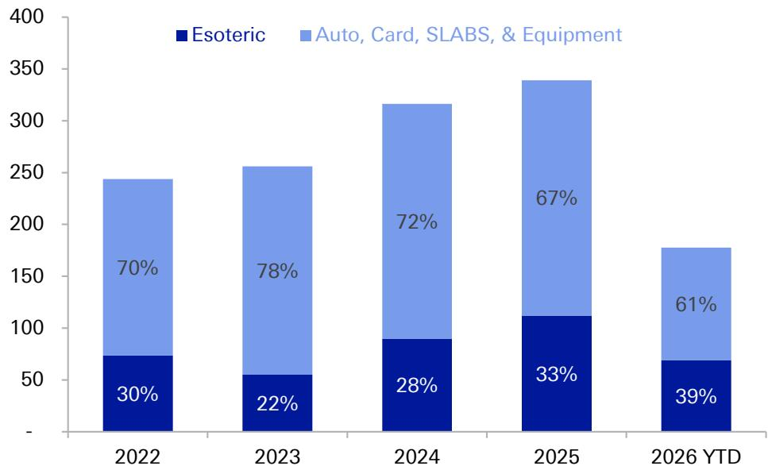

stacked bar chart

| Year | Esoteric (%) | Auto, Card, SLABS, & Equipment (%) |
| :--- | :--- | :--- |
| 2022 | 30 | 70 |
| 2023 | 22 | 78 |
| 2024 | 28 | 72 |
| 2025 | 33 | 67 |
| 2026 YTD | 39 | 61 |

Source: DB, Bloomberg Finance LP

## s trail only auto ABS in

Esoteric ABS YTD issuance by collateral type (\$bn)  
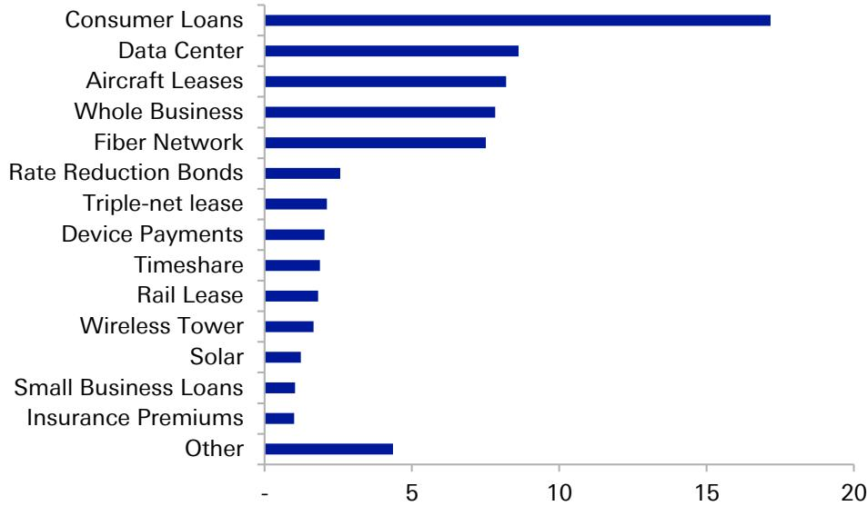

bar chart

| Category | Value |
| :--- | :--- |
| Consumer Loans | 17 |
| Data Center | 8.5 |
| Aircraft Leases | 8.2 |
| Whole Business | 8.0 |
| Fiber Network | 7.5 |
| Rate Reduction Bonds | 3.0 |
| Triple-net lease | 2.5 |
| Device Payments | 2.5 |
| Timeshare | 2.5 |
| Rail Lease | 2.5 |
| Wireless Tower | 2.5 |
| Solar | 1.5 |
| Small Business Loans | 1.5 |
| Insurance Premiums | 1.5 |
| Other | 4.5 |

Source: DB, Bloomberg Finance LP

- Esoteric ABS is growing as a percentage of overall supply, accounting for just under 40% of issuance year-to-date, trailing only auto ABS.  
- On the commercial side, data center, whole business, fiber, and aircraft ABS have each seen \$7-9 billion in supply year-to-date; each exceeds current year-to-date issuance in major consumer ABS asset types such as credit card and student loan ABS.  
While there are concerns about esoteric ABS deals being able to refinance at ARD, especially with triple-net lease, we’ve seen multiple successful refinancings in the data center and fiber ABS space this year.

## Appendix

## Cu Data

## nd NIG TRACE Annual

ABS Investment Grade Annual Trading Volume, \$bn  
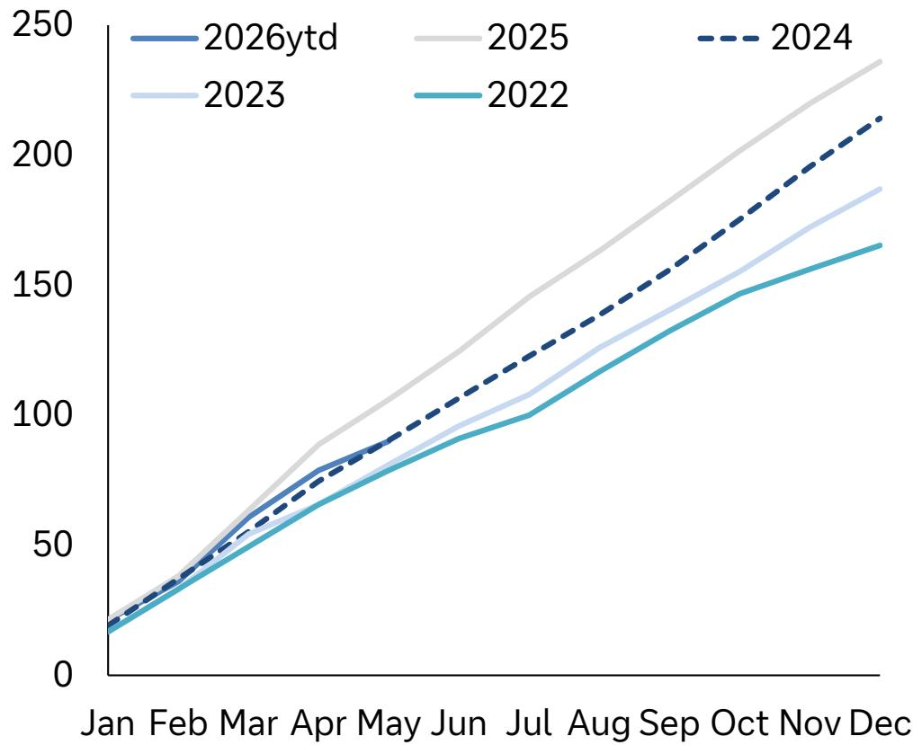

line chart

| Month | 2026ytd | 2025 | 2024 | 2023 | 2022 |
|-------|---------|------|------|------|------|
| Jan   | ~15     | ~15  | ~15  | ~15  | ~15  |
| Feb   | ~30     | ~30  | ~30  | ~30  | ~30  |
| Mar   | ~50     | ~50  | ~50  | ~50  | ~50  |
| Apr   | ~70     | ~85  | ~75  | ~65  | ~60  |
| May   | ~85     | ~100 | ~90  | ~80  | ~75  |
| Jun   | ~95     | ~120 | ~110 | ~95  | ~90  |
| Jul   | ~110    | ~145 | ~130 | ~110 | ~100 |
| Aug   | ~130    | ~170 | ~150 | ~130 | ~120 |
| Sep   | ~150    | ~190 | ~170 | ~150 | ~140 |
| Oct   | ~170    | ~210 | ~190 | ~170 | ~150 |
| Nov   | ~190    | ~230 | ~210 | ~190 | ~165 |
| Dec   | ~210    | ~240 | ~220 | ~200 | ~170 |

ABS Non-Investment Grade Annual Trading Volume, \$bn  
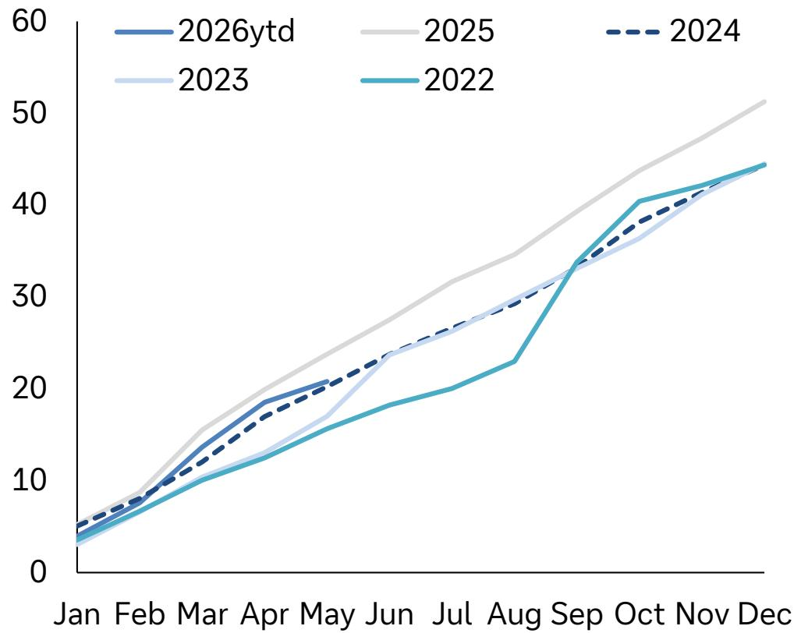

line chart

| Month | 2026ytd | 2025 | 2024 | 2023 | 2022 |
|-------|---------|------|------|------|------|
| Jan   | ~5      | ~5   | ~5   | ~4   | ~4   |
| Feb   | ~8      | ~8   | ~7   | ~6   | ~6   |
| Mar   | ~12     | ~15  | ~10  | ~9   | ~8   |
| Apr   | ~18     | ~20  | ~15  | ~13  | ~12  |
| May   | ~20     | ~25  | ~18  | ~16  | ~15  |
| Jun   | ~22     | ~30  | ~22  | ~20  | ~18  |
| Jul   | ~25     | ~35  | ~25  | ~25  | ~20  |
| Aug   | ~30     | ~40  | ~30  | ~30  | ~25  |
| Sep   | ~35     | ~45  | ~35  | ~35  | ~30  |
| Oct   | ~40     | ~50  | ~40  | ~40  | ~40  |
| Nov   | ~45     | ~55  | ~45  | ~45  | ~45  |
| Dec   | ~50     | ~60  | ~50  | ~50  | ~45  |

## Spreads and Issuance

YoY new-issue comparison  

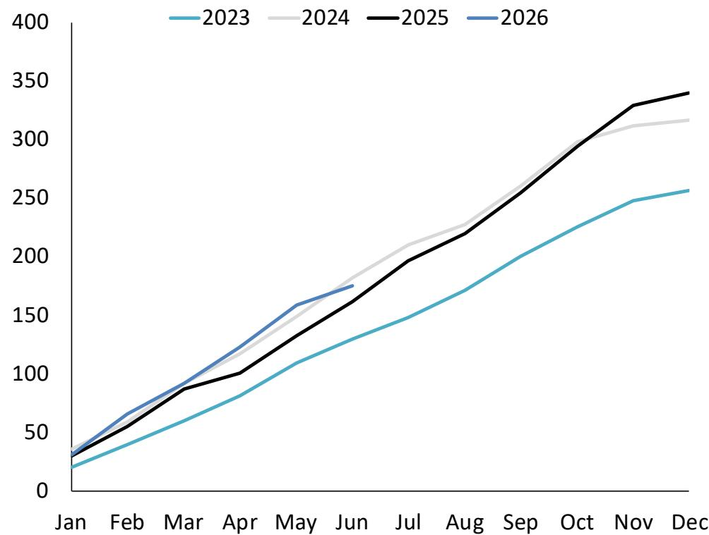

line chart

| Month | 2023 | 2024 | 2025 | 2026 |
|-------|------|------|------|------|
| Jan   | 20   | 30   | 30   | 30   |
| Feb   | 40   | 50   | 60   | 70   |
| Mar   | 60   | 80   | 90   | 100  |
| Apr   | 80   | 110  | 100  | 130  |
| May   | 110  | 140  | 130  | 160  |
| Jun   | 130  | 170  | 160  | 175  |
| Jul   | 150  | 210  | 195  | -    |
| Aug   | 170  | 230  | 220  | -    |
| Sep   | 190  | 260  | 250  | -    |
| Oct   | 210  | 290  | 295  | -    |
| Nov   | 245  | 310  | 330  | -    |
| Dec   | 255  | 315  | 340  | -    |

ABS 'on the run' spreads

<table><tr><td>6/12/2026</td><td>3yr Auto</td><td>3yr Card</td><td>2yr SL FFELP</td></tr><tr><td>Current</td><td>36</td><td>28</td><td>80</td></tr><tr><td>1yr High</td><td>55</td><td>40</td><td>90</td></tr><tr><td>1yr Low</td><td>34</td><td>27</td><td>80</td></tr><tr><td>1yr Avg</td><td>40</td><td>32</td><td>83</td></tr><tr><td>6mo Avg</td><td>39</td><td>31</td><td>83</td></tr><tr><td>1mo Avg</td><td>36</td><td>29</td><td>80</td></tr><tr><td>YOY change</td><td>-9</td><td>-10</td><td>-10</td></tr><tr><td>1wk change</td><td>0</td><td>0</td><td>0</td></tr><tr><td>4wk Change</td><td>0</td><td>-2</td><td>0</td></tr></table>

ABS new-issue supply by month (YTD, \$bn)  
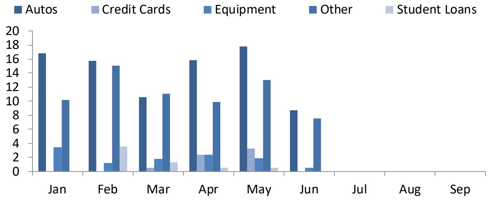

bar chart

| Month | Autos | Credit Cards | Equipment | Other | Student Loans |
|-------|-------|--------------|-----------|-------|---------------|
| Jan   | 16.8  | 0.0          | 3.5       | 10.2  | 0.0           |
| Feb   | 15.7  | 0.0          | 1.2       | 15.0  | 3.5           |
| Mar   | 10.5  | 0.5          | 1.8       | 11.0  | 1.2           |
| Apr   | 15.9  | 2.4          | 2.3       | 9.9   | 0.5           |
| May   | 17.8  | 3.2          | 1.8       | 12.9  | 0.5           |
| Jun   | 8.7   | 0.0          | 0.5       | 7.6   | 0.0           |
| Jul   | 0.0   | 0.0          | 0.0       | 0.0   | 0.0           |
| Aug   | 0.0   | 0.0          | 0.0       | 0.0   | 0.0           |
| Sep   | 0.0   | 0.0          | 0.0       | 0.0   | 0.0           |

ABS new-issue supply (\$bn)

<table><tr><td></td><td>YTD 2026</td><td>YTD 2025</td><td>YTD 2024</td><td>Δ% YTD 26&#x27;25</td><td>Δ% YTD 26&#x27;24</td></tr><tr><td>Autos</td><td>85.6</td><td>85.2</td><td>96.6</td><td>0.4%</td><td>-11.4%</td></tr><tr><td>Credit Cards</td><td>6.2</td><td>9.4</td><td>11.6</td><td>-34.4%</td><td>-46.7%</td></tr><tr><td>Equipment</td><td>11.2</td><td>10.8</td><td>12.8</td><td>3.8%</td><td>-12.5%</td></tr><tr><td>Other</td><td>69.0</td><td>42.5</td><td>43.3</td><td>62.4%</td><td>59.3%</td></tr><tr><td>Student Loans</td><td>5.8</td><td>2.4</td><td>4.6</td><td>145.7%</td><td>25.5%</td></tr><tr><td>Total</td><td>177.8</td><td>150.3</td><td>168.9</td><td>18.3%</td><td>5.2%</td></tr></table>

Source: Bloomberg Finance LP.

U.S. ABS issuance (YTD)  
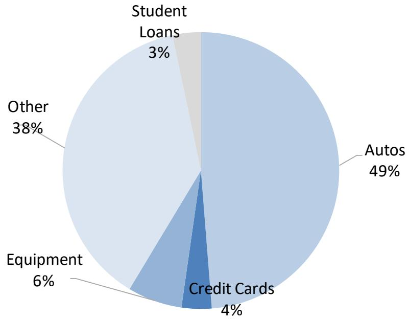

pie chart

| Category | Percentage (%) |
| :--- | :--- |
| Autos | 49 |
| Credit Cards | 4 |
| Equipment | 6 |
| Other | 38 |
| Student Loans | 3 |

Auto ABS issuance (YTD)  
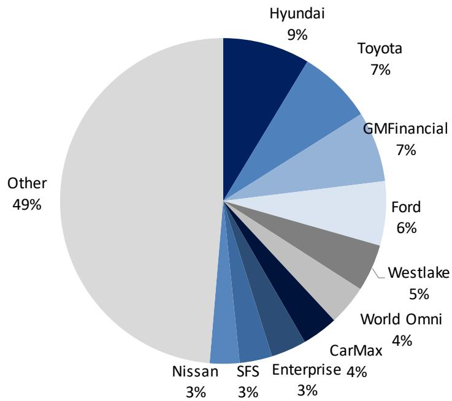

pie chart

| Company | Percentage (%) |
| :--- | :--- |
| Hyundai | 9 |
| Toyota | 7 |
| GMFinancial | 7 |
| Ford | 6 |
| Westlake | 5 |
| World Omni | 4 |
| CarMax | 4 |
| Enterprise | 3 |
| Nissan | 3 |
| SFS | 3 |
| Other | 49 |

Equipment ABS issuance (YTD)  
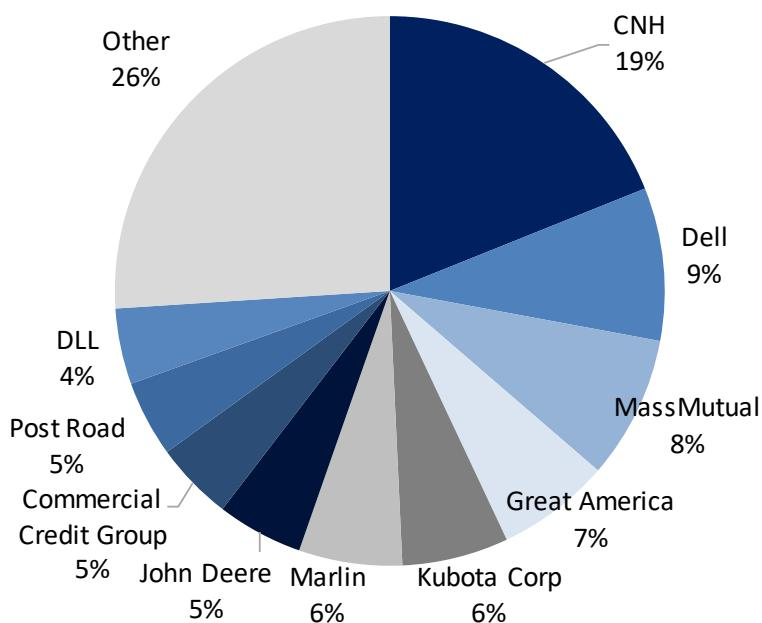

pie chart

| Company | Share (%) |
| :--- | :--- |
| CNH | 19 |
| Dell | 9 |
| MassMutual | 8 |
| Great America | 7 |
| Kubota Corp | 6 |
| Marlin | 6 |
| John Deere | 5 |
| Commercial Credit Group | 5 |
| Post Road | 5 |
| DLL | 4 |
| Other | 26 |

Other ABS issuance (YTD)  
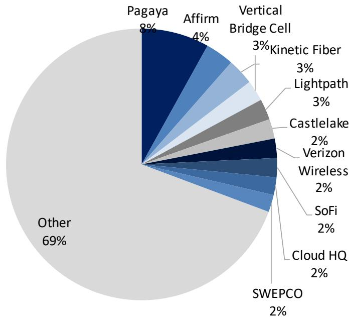

pie chart

| Company | Market Share (%) |
| :--- | :--- |
| Pagaya | 8 |
| Affirm | 4 |
| Vertical Bridge Cell | 3 |
| Kinetic Fiber | 3 |
| Lightpath | 3 |
| Castlelake | 2 |
| Verizon Wireless | 2 |
| SoFi | 2 |
| Cloud HQ | 2 |
| SWEPCO | 2 |
| Other | 69 |

## Appendix – Issuance 2026 YTD

Credit Card ABS issuance (YTD)  
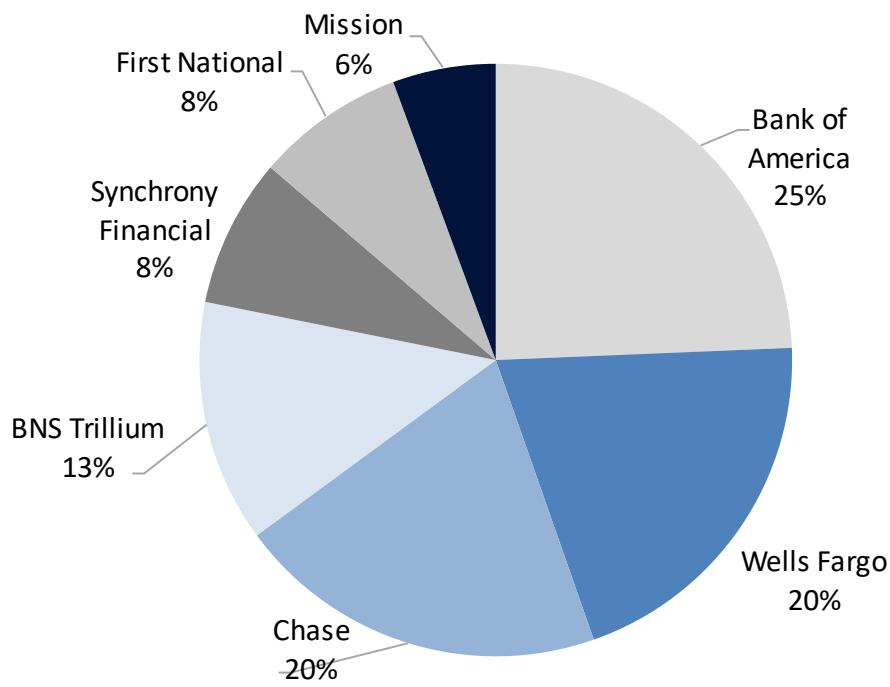

pie chart

| Entity | Percentage (%) |
| :--- | :--- |
| BofA | 25 |
| Wells Fargo | 20 |
| Chase | 20 |
| BNS Trillium | 13 |
| Synchrony Financial | 8 |
| First National | 8 |
| Mission | 6 |

Student loan ABS issuance (YTD)  
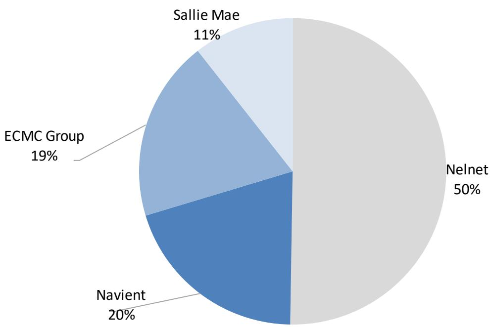

pie chart

| Company | Percentage (%) |
| :--- | :--- |
| Nelnet | 50 |
| Navient | 20 |
| ECMC Group | 19 |
| Sallie Mae | 11 |

## Appendix - Spreads

Senior prime auto ABS spreads (bp)  
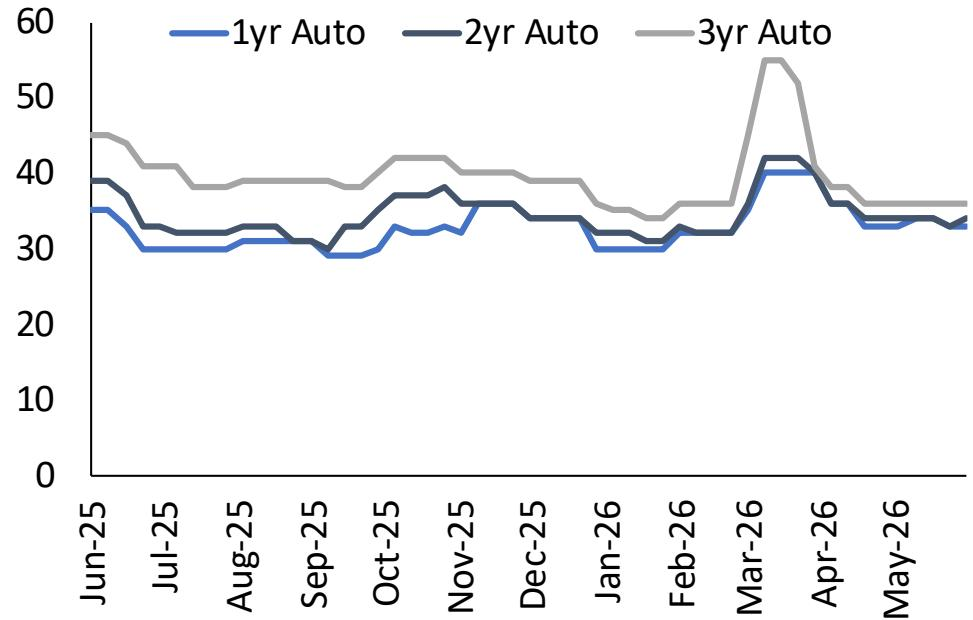

line chart

| Month   | 1yr Auto | 2yr Auto | 3yr Auto |
|---------|----------|----------|----------|
| Jun-25  | 35       | 39       | 45       |
| Jul-25  | 30       | 33       | 41       |
| Aug-25  | 30       | 32       | 39       |
| Sep-25  | 29       | 31       | 38       |
| Oct-25  | 32       | 37       | 42       |
| Nov-25  | 33       | 38       | 41       |
| Dec-25  | 31       | 35       | 39       |
| Jan-26  | 30       | 33       | 36       |
| Feb-26  | 31       | 32       | 35       |
| Mar-26  | 40       | 42       | 55       |
| Apr-26  | 33       | 35       | 40       |
| May-26  | 32       | 33       | 35       |

Senior CCABS spreads (bp)  
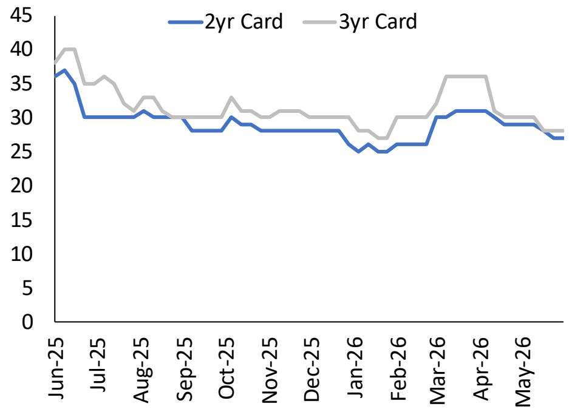

line chart

| Month   | 2yr Card | 3yr Card |
|---------|----------|----------|
| Jun-25  | 37       | 40       |
| Jul-25  | 30       | 35       |
| Aug-25  | 31       | 33       |
| Sep-25  | 28       | 30       |
| Oct-25  | 30       | 33       |
| Nov-25  | 28       | 31       |
| Dec-25  | 28       | 30       |
| Jan-26  | 25       | 28       |
| Feb-26  | 26       | 30       |
| Mar-26  | 31       | 36       |
| Apr-26  | 31       | 36       |
| May-26  | 28       | 29       |

Subordinate auto ABS spreads (bp)  
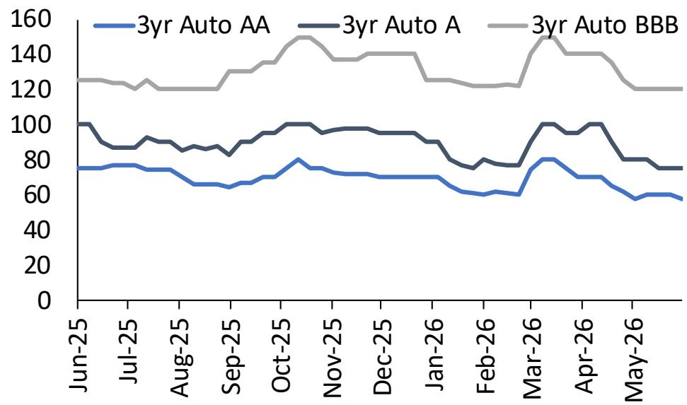

line chart

| Month   | 3yr Auto AA | 3yr Auto A | 3yr Auto BBB |
|---------|-------------|------------|--------------|
| Jun-25  | 75          | 100        | 125          |
| Jul-25  | 75          | 90         | 120          |
| Aug-25  | 70          | 85         | 115          |
| Sep-25  | 65          | 80         | 120          |
| Oct-25  | 75          | 95         | 145          |
| Nov-25  | 70          | 95         | 140          |
| Dec-25  | 70          | 95         | 140          |
| Jan-26  | 65          | 85         | 125          |
| Feb-26  | 60          | 80         | 120          |
| Mar-26  | 80          | 100        | 150          |
| Apr-26  | 70          | 100        | 140          |
| May-26  | 60          | 75         | 120          |

Senior SLABS spreads (bp)  
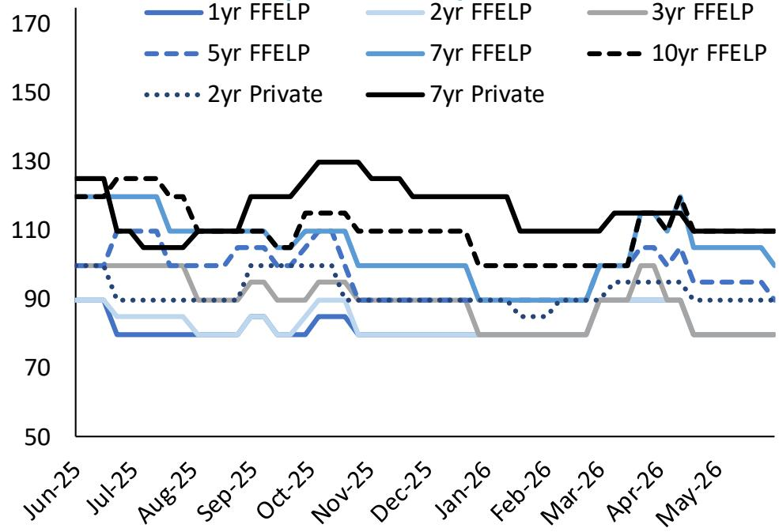

line chart

| Month   | 1yr FFELP | 2yr FFELP | 3yr FFELP | 5yr FFELP | 7yr FFELP | 10yr FFELP | 2yr Private | 7yr Private |
|---------|-----------|-----------|-----------|-----------|-----------|------------|-------------|-------------|
| Jun-25  | ~90       | ~90       | ~90       | ~90       | ~90       | ~90        | ~90         | ~125        |
| Jul-25  | ~85       | ~85       | ~90       | ~105      | ~105      | ~125       | ~90         | ~110        |
| Aug-25  | ~85       | ~85       | ~90       | ~105      | ~105      | ~125       | ~90         | ~105        |
| Sep-25  | ~85       | ~85       | ~90       | ~105      | ~105      | ~125       | ~90         | ~110        |
| Oct-25  | ~85       | ~85       | ~90       | ~105      | ~105      | ~125       | ~90         | ~130        |
| Nov-25  | ~85       | ~85       | ~90       | ~105      | ~105      | ~125       | ~90         | ~130        |
| Dec-25  | ~85       | ~85       | ~90       | ~105      | ~105      | ~125       | ~90         | ~125        |
| Jan-26  | ~85       | ~85       | ~90       | ~105      | ~105      | ~125       | ~90         | ~125        |
| Feb-26  | ~85       | ~85       | ~90       | ~105      | ~105      | ~125       | ~90         | ~110        |
| Mar-26  | ~85       | ~85       | ~90       | ~105      | ~105      | ~125       | ~90         | ~110        |
| Apr-26  | ~85       | ~85       | ~90       | ~105      | ~105      | ~125       | ~90         | ~110        |
| May-26  | ~85       | ~85       | ~90       | ~105      | ~105      | ~125       | ~90         | ~110        |

## Appendix - Spreads

Senior equipment spreads (bp)  
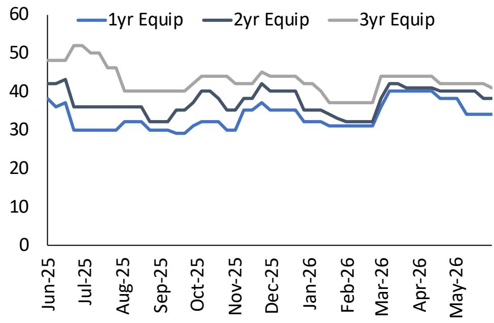

line chart

| Month   | 1yr Equip | 2yr Equip | 3yr Equip |
|---------|-----------|-----------|-----------|
| Jun-25  | 38        | 42        | 48        |
| Jul-25  | 30        | 36        | 52        |
| Aug-25  | 32        | 36        | 48        |
| Sep-25  | 30        | 32        | 40        |
| Oct-25  | 32        | 40        | 44        |
| Nov-25  | 30        | 36        | 42        |
| Dec-25  | 36        | 40        | 44        |
| Jan-26  | 32        | 36        | 40        |
| Feb-26  | 30        | 32        | 36        |
| Mar-26  | 40        | 42        | 44        |
| Apr-26  | 40        | 40        | 42        |
| May-26  | 34        | 38        | 40        |

Subordinate equipment spreads (bp)

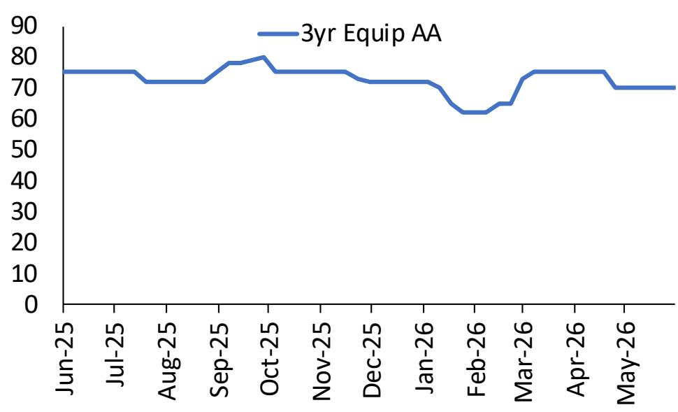

line chart

| Month   | 3yr Equip AA |
| ------- | ------------ |
| Jun-25  | 75           |
| Jul-25  | 75           |
| Aug-25  | 71           |
| Sep-25  | 78           |
| Oct-25  | 80           |
| Nov-25  | 75           |
| Dec-25  | 73           |
| Jan-26  | 71           |
| Feb-26  | 62           |
| Mar-26  | 75           |
| Apr-26  | 75           |
| May-26  | 70           |

Source: DB.

## Transportation ABS

## Record aircraft ABS issuance in 2026

Douglas Runte, Managing Director
Vivek John, Associate

## Airline capacity volatile with Iran War, but trends are up

Global Airlines Capacity (Y-o-Y % change)

<table><tr><td></td><td>Dec 2024</td><td>Mar 2025</td><td>Jun 2025</td><td>Sep 2025</td><td>Dec 2025</td><td>Mar 2026</td><td>Jun 2026</td><td>Sep 2026</td></tr><tr><td>Global</td><td>6%</td><td>6%</td><td>4%</td><td>4%</td><td>6%</td><td>3%</td><td>-1%</td><td>4%</td></tr><tr><td>Global (ex-Middle East)</td><td>6%</td><td>6%</td><td>5%</td><td>3%</td><td>5%</td><td>5%</td><td>1%</td><td>5%</td></tr><tr><td>Brazil</td><td>13%</td><td>14%</td><td>12%</td><td>9%</td><td>8%</td><td>6%</td><td>4%</td><td>7%</td></tr><tr><td>China</td><td>7%</td><td>4%</td><td>5%</td><td>4%</td><td>6%</td><td>10%</td><td>1%</td><td>11%</td></tr><tr><td>France</td><td>3%</td><td>6%</td><td>4%</td><td>2%</td><td>5%</td><td>2%</td><td>-1%</td><td>1%</td></tr><tr><td>Germany</td><td>6%</td><td>5%</td><td>3%</td><td>4%</td><td>3%</td><td>-2%</td><td>-4%</td><td>1%</td></tr><tr><td>Hong Kong</td><td>16%</td><td>18%</td><td>17%</td><td>16%</td><td>16%</td><td>7%</td><td>5%</td><td>7%</td></tr><tr><td>India</td><td>11%</td><td>11%</td><td>6%</td><td>-1%</td><td>3%</td><td>-3%</td><td>-7%</td><td>2%</td></tr><tr><td>Japan</td><td>11%</td><td>9%</td><td>7%</td><td>5%</td><td>4%</td><td>0%</td><td>-3%</td><td>-1%</td></tr><tr><td>Mexico</td><td>0%</td><td>5%</td><td>2%</td><td>0%</td><td>4%</td><td>1%</td><td>-1%</td><td>1%</td></tr><tr><td>Qatar</td><td>2%</td><td>-1%</td><td>-1%</td><td>5%</td><td>7%</td><td>-21%</td><td>-21%</td><td>-6%</td></tr><tr><td>Singapore</td><td>11%</td><td>5%</td><td>3%</td><td>1%</td><td>1%</td><td>4%</td><td>1%</td><td>5%</td></tr><tr><td>Spain</td><td>9%</td><td>11%</td><td>6%</td><td>5%</td><td>7%</td><td>4%</td><td>6%</td><td>9%</td></tr><tr><td>United Arab Emirates</td><td>8%</td><td>8%</td><td>6%</td><td>7%</td><td>8%</td><td>-20%</td><td>-21%</td><td>2%</td></tr><tr><td>United Kingdom</td><td>4%</td><td>4%</td><td>2%</td><td>2%</td><td>4%</td><td>2%</td><td>-1%</td><td>2%</td></tr><tr><td>United States</td><td>3%</td><td>4%</td><td>3%</td><td>1%</td><td>3%</td><td>0%</td><td>-1%</td><td>1%</td></tr></table>

Global air capacity has shown great volatility since the onset of the Iran War on February 28, 2026, with the Middle East showing dramatic reductions in planned capacity additions in the near term due to operational challenges. Other parts of the world, including India and parts of Asia, have seen reductions in planned capacity in 2H2026 due to the increased cost of the jet fuel, as well as, in certain isolated cases, the availability of jet fuel. In more developed markets, there has been some trimming of marginal routes because of them becoming uneconomic due to higher fuel costs, but these changes have been very modest. For 2026, we expect global capacity to be up by just over $2\%$ , with all regions of the world adding capacity in 2026 except for the Middle East (which will likely be down $11\%$ ).  
- With the seeming cessation of major hostilities in the Middle East and the reduction in jet fuel prices from a peak of more than \$4.50/gallon in certain regions to less than \$3.00./gallon today, we expect capacity growth to move higher in the 4Q2026 and demand for aircraft, both in the primary market and secondary market, to be strong.

Note: Data represent the percentage Y-o-Y %change in scheduled available seat miles "ASMs". The chart has been color coded to show the deeper declines in dark red and higher increases in dark green. Schedule data as of June 12, 2026.

Source: Diio Mi, DB

## Airlines poised for fourth year of profits, even with war

Airline profitability improves in 2024 with further improvement in 2025

Airline industry net post-tax profit, \$bn  
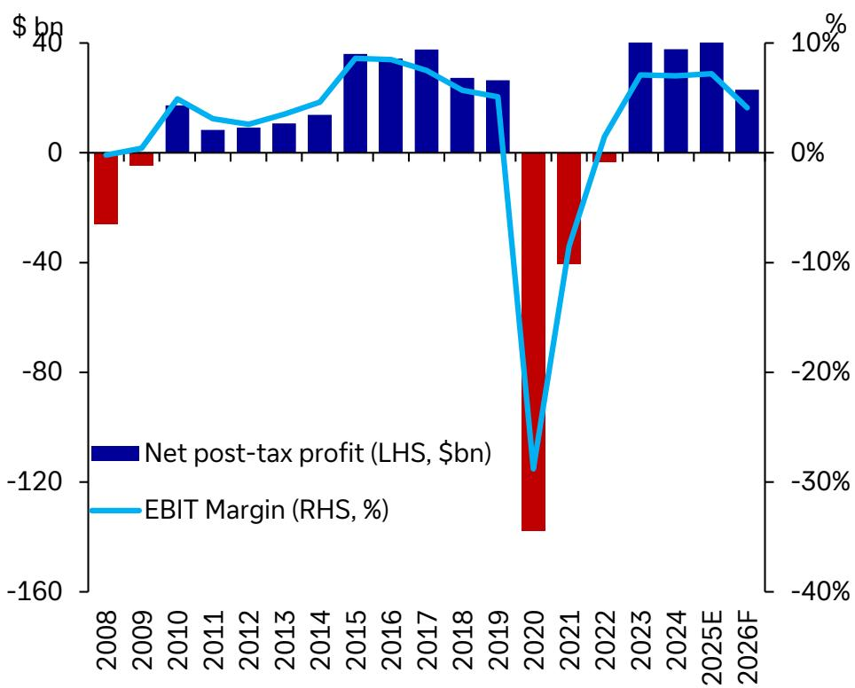

bar-line hybrid chart

| Year   | Net post-tax profit ($bn) | EBIT Margin (%) |
|--------|---------------------------|-----------------|
| 2008   | -35                       | 0               |
| 2009   | -5                        | 5               |
| 2010   | 25                        | 10              |
| 2011   | 15                        | 5               |
| 2012   | 15                        | 5               |
| 2013   | 15                        | 5               |
| 2014   | 25                        | 10              |
| 2015   | 40                        | 15              |
| 2016   | 40                        | 15              |
| 2017   | 40                        | 15              |
| 2018   | 35                        | 10              |
| 2019   | 35                        | 5               |
| 2020   | -150                      | -30             |
| 2021   | -40                       | -10             |
| 2022   | -5                        | 5               |
| 2023   | 40                        | 10              |
| 2024   | 40                        | 10              |
| 2025E  | 40                        | 10              |
| 2026F  | 30                        | 5               |

Airline industry net profit by region, \$bn  
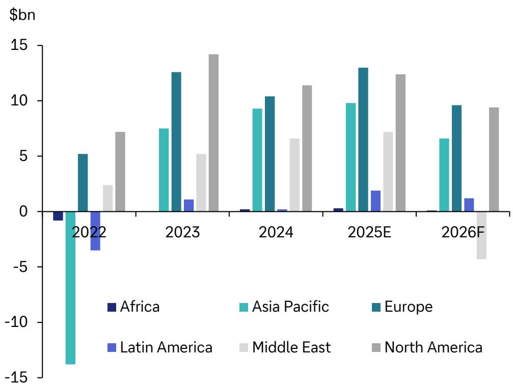

bar chart

| Year | Africa ($bn) | Asia Pacific ($bn) | Europe ($bn) | Latin America ($bn) | Middle East ($bn) | North America ($bn) |
| :--- | :--- | :--- | :--- | :--- | :--- | :--- |
| 2022 | -1.0 | -14.0 | 5.0 | -3.5 | 2.2 | 7.0 |
| 2023 | 0.0 | 7.3 | 12.5 | 1.0 | 5.0 | 14.0 |
| 2024 | 0.1 | 9.2 | 10.3 | 0.1 | 6.5 | 11.3 |
| 2025E | 0.2 | 9.8 | 13.0 | 1.8 | 7.1 | 12.3 |
| 2026F | 0.0 | 6.5 | 9.5 | 1.1 | -4.5 | 9.3 |

Global airlines are poised for their fourth straight year of profitability in 2026, aided by generally positive economic conditions in most parts of the globe and good growth in traffic in most regions, even with the disruptions caused by the onset of the Iran War. Fuel prices have come down dramatically from their post-war peak of \$4.50/gallon to just under \$3.00/gallon today, but fuel remains elevated relative to its approximately \$2.00/gallon price at the start of 2026. Fuel prices represent approximately 25-35% of an airline's expenses, so the increase in fuel prices has put a drag on previous profit estimates for the industry. But even with the rise in fuel prices, the global airline industry will be profitable overall with only the Middle East likely to report financial losses. Even at the 2026 peak of fuel prices, lessors reported very few requests for rent reductions or deferrals. With the recent easing of fuel prices, we expect that such requests will remain rare and believe that the overall airline credit environment will be favorable for aircraft ABS revenue collection.

Source: IATA Economics, DB

## Aircraft market tightens in 2026 for most aircraft types

Parked Passenger Jets – Apr 2026 vs. Jan 2026, Apr 2025 & Apr 2019

<table><tr><td rowspan="2">Aircraft Age</td><td colspan="4">% Narrowbody Stored</td><td colspan="4">% Widebody Stored</td></tr><tr><td>Apr-26</td><td>Jan-26</td><td>Apr-25</td><td>Apr-19</td><td>Apr-26</td><td>Jan-26</td><td>Apr-25</td><td>Apr-19</td></tr><tr><td>0.0 - 4.9 years</td><td>8.2%</td><td>9.0%</td><td>9.6%</td><td>1.4%</td><td>1.5%</td><td>1.2%</td><td>1.6%</td><td>1.9%</td></tr><tr><td>5.0 - 9.9 years</td><td>10.6%</td><td>10.2%</td><td>9.6%</td><td>3.0%</td><td>2.7%</td><td>2.6%</td><td>3.0%</td><td>2.6%</td></tr><tr><td>10.0 - 14.9 years</td><td>4.9%</td><td>4.8%</td><td>5.0%</td><td>4.2%</td><td>8.2%</td><td>8.5%</td><td>9.4%</td><td>12.5%</td></tr><tr><td>15.0 - 19.9 years</td><td>10.5%</td><td>10.7%</td><td>8.8%</td><td>4.5%</td><td>21.1%</td><td>19.3%</td><td>21.9%</td><td>12.9%</td></tr><tr><td>≥ 20.0 years</td><td>26.2%</td><td>25.5%</td><td>23.1%</td><td>25.9%</td><td>31.3%</td><td>31.4%</td><td>30.1%</td><td>23.1%</td></tr><tr><td>Total Stored</td><td>11.3%</td><td>11.3%</td><td>10.6%</td><td>5.8%</td><td>11.7%</td><td>11.4%</td><td>11.6%</td><td>8.2%</td></tr><tr><td>Total Stored (ex-GTF)</td><td>8.9%</td><td>8.6%</td><td>7.8%</td><td>5.9%</td><td>NM</td><td>NM</td><td>NM</td><td>NM</td></tr></table>

<table><tr><td>Age Range</td><td>0.0 - 4.9 years</td><td>5.0 - 9.9 years</td><td>10.0 - 14.9 years</td><td>15.0 - 19.9 years</td><td>≥ 20.0 years</td><td>Total</td></tr><tr><td colspan="7">Mainline Fleet:</td></tr><tr><td>Widebody</td><td>1.5% (-2.2)</td><td>2.7% (-1.7)</td><td>8.2% (-3.3)</td><td>21.1% (-2.0)</td><td>31.3% (-2.5)</td><td>11.7% (-2.3)</td></tr><tr><td>Narrowbody</td><td>8.2% (-0.8)</td><td>10.6% (0.2)</td><td>4.9% (-0.6)</td><td>10.5% (-0.8)</td><td>26.2% (-1.8)</td><td>11.3% (-0.7)</td></tr><tr><td>737 Max</td><td>1.3% (-0.1)</td><td>3.6% (0.3)</td><td>0.0% (0.0)</td><td></td><td></td><td>2.1% (0.1)</td></tr><tr><td>A320 neo family (GTF)</td><td>22.1% (-1.4)</td><td>44.4% (-1.2)</td><td>56.3% (0.0)</td><td></td><td></td><td>31.1% (-1.3)</td></tr><tr><td>A220 Family (GTF)</td><td>12.7% (-0.9)</td><td>22.0% (0.1)</td><td></td><td></td><td></td><td>15.7% (-0.5)</td></tr><tr><td>Total Mainline Fleet</td><td>7.8% (-1.0)</td><td>9.2% (-0.2)</td><td>5.7% (-1.2)</td><td>12.3% (-1.0)</td><td>27.3% (-1.9)</td><td>11.6% (-1.0)</td></tr></table>

Storage rates are broadly and inversely correlated with aircraft lease rates and values, and, for most aircraft classes and vintages, storage rates are down materially from levels one year ago. Storage rates of newer widebody aircraft are particularly low, with younger aircraft in acute shortage due to continuing delays by Airbus and Boeing in increasing production rates. Storage rates for newer narrowbody aircraft appear elevated, but this is due almost wholly to the forced storage due to maintenance issues of certain A320neo family narrowbody aircraft with GTF-engines. We expect that storage numbers will come down over the balance of 2026 and into 2026.  
Note: Assumes all 737 MAX aircraft are in service. Heat map: Green: Y-o-Y improvement in aircraft storage; Red: Aircraft stored increased Y-o-Y.  
Source: Cirium, DB

## Passenger aircraft values well above 2019 levels

Recovery of values: Airbus and Boeing mainline passenger aircraft  
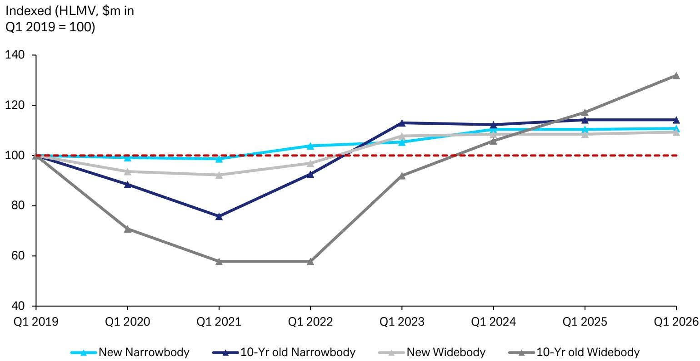

line chart

| Quarter | New Narrowbody | 10-Yr old Narrowbody | New Widebody | 10-Yr old Widebody |
|---------|----------------|----------------------|--------------|--------------------|
| Q1 2019 | 100            | 100                  | 100          | 100                |
| Q1 2020 | 98             | 88                   | 93           | 70                 |
| Q1 2021 | 98             | 75                   | 91           | 57                 |
| Q1 2022 | 104            | 92                   | 97           | 57                 |
| Q1 2023 | 105            | 113                  | 108          | 91                 |
| Q1 2024 | 110            | 113                  | 108          | 105                |
| Q1 2025 | 110            | 114                  | 108          | 118                |
| Q1 2026 | 110            | 114                  | 108          | 132                |

Values of both new and older passenger aircraft were stable to higher in 1Q2026 versus 4Q2205. In all cases, values of new and older narrowbody and widebody passenger aircraft are well above their values in 1Q2019 on a constant-age basis (i.e., an identically-aged aircraft in both 2019 and 2026).  
We expect the market for most aircraft types and vintages to remain tight and expect that aircraft values and lease rates will likely trend slightly upward over the balance of the year on a constant age basis. The market for new widebodies appears particularly tight.

Note: Above data represents Half-Life Cirium Market Value (indexed) for following aircraft types: New Narrowbody = New ("0 Year") Airbus A321-200neo; 10-Yr old Narrowbody = 10-year-old Boeing 737 NG-800; New Widebody = New ("0 Year") Airbus A350-900; 10-Yr old Widebody = 10-year-old Airbus A330-300. Data a/o. Q1 2026.

Source: Cirium, DB

## Aircraft ABS Financial Performance

## Average rent revenue, utilization rent and DSCR fall sequentially, aircraft sales up strongly

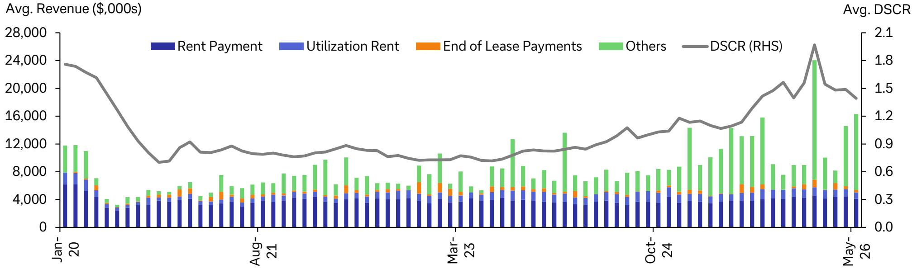

bar-line hybrid chart

| Month | Rent Payment | Utilization Rent | End of Lease Payments | Others | DSCR (RHS) |
| --- | --- | --- | --- | --- | --- |
| Jan-20 | ~7,500 | ~1,800 | ~1,000 | ~12,000 | ~1.8 |
| Feb-20 | ~3,500 | ~1,500 | ~500 | ~10,000 | ~1.5 |
| Mar-20 | ~3,500 | ~1,500 | ~500 | ~10,000 | ~1.5 |
| Apr-20 | ~3,500 | ~1,500 | ~500 | ~10,000 | ~1.5 |
| May-20 | ~3,500 | ~1,500 | ~500 | ~10,000 | ~1.5 |
| Jun-20 | ~3,500 | ~1,500 | ~500 | ~10,000 | ~1.5 |
| Jul-20 | ~3,500 | ~1,500 | ~500 | ~10,000 | ~1.5 |
| Aug-20 | ~3,500 | ~1,500 | ~500 | ~10,000 | ~1.5 |
| Sep-20 | ~3,500 | ~1,500 | ~500 | ~10,000 | ~1.5 |
| Oct-20 | ~3,500 | ~1,500 | ~500 | ~10,000 | ~1.5 |
| Nov-20 | ~3,500 | ~1,500 | ~500 | ~10,000 | ~1.5 |
| Dec-20 | ~3,500 | ~1,500 | ~500 | ~10,000 | ~1.5 |
| Jan-21 | ~3,500 | ~1,500 | ~500 | ~10,000 | ~1.5 |
| Feb-21 | ~3,500 | ~1,500 | ~500 | ~10,000 | ~1.5 |
| Mar-21 | ~3,500 | ~1,500 | ~500 | ~10,000 | ~1.5 |
| Apr-21 | ~3,500 | ~1,500 | ~500 | ~10,000 | ~1.5 |
| May-21 | ~3,500 | ~1,500 | ~500 | ~12,500 | ~1.8 |
| Jun-21 | ~3,500 | ~1,500 | ~500 | ~12,500 | ~1.8 |
| Jul-21 | ~3,500 | ~1,500 | ~500 | ~12,500 | ~1.8 |
| Aug-21 | ~3,500 | ~1,500 | ~500 | ~12,500 | ~1.8 |
| Sep-21 | ~3,500 | ~1,500 | ~500 | ~12,500 | ~1.8 |
| Oct-21 | ~3,500 | ~1,500 | ~500 | ~12,500 | ~1.8 |
| Nov-21 | ~3,500 | ~1,500 | ~500 | ~12,500 | ~1.8 |
| Dec-21 | ~3,500 | ~1,500 | ~500 | ~12,500 | ~1.8 |
| Jan-22 | ~3,500 | ~1,500 | ~500 | ~12,500 | ~1.8 |
| Feb-22 | ~3,500 | ~1,500 | ~500 | ~12,500 | ~1.8 |
| Mar-22 | ~3,500 | ~1,500 | ~500 | ~12,500 | ~1.8 |
| Apr-22 | ~3,500 | ~1,500 | ~500 | ~12,500 | ~1.8 |
| May-22 | ~3,500 | ~1,500 | ~5,567 | 24,496 | 2.4 |
| Jun-22 | ~3,567 | 466 | 466 | 466 | 4.6 |
| Jul-22 | 466 | 466 | 466 | 466 | 4.6 |
| Aug-22 | 466 | 466 | 466 | 466 | 4.6 |
| Sep-22 | 466 | 466 | 466 | 466 | 4.6 |
| Oct-22 | 466 | 466 | 466 | 466 | 4.6 |
| Nov-22 | 466 | 466 | 466 | 466 | 4.6 |
| Dec-22 | 466 | 466 | 466 | 466 | 4.6 |
| Jan-23 | 466 | 466 | 466 | 466 | 4.6 |
| Feb-23 | 466 | 466 | 466 | 466 | 4.6 |
| Mar-23 | 466 | 466 | 466 | 466 | 4.6 |
| Apr-23 | 466 | 466 | 466 | 466 | 4.6 |
| May-23 | 466 | 466 | 466 | 466 | 4.6 |
| Jun-23 | 466 | 466 | 466 | 466 | 4.6 |
| Jul-23 | 466 | 466 | 466 | 466 | 4.6 |
| Aug-23 | 466 | 466 | 466 | 466 | 4.6 |
| Sep-23 | 466 | 466 | 466 | 466 | 4.6 |
| Oct-23 | 466 | 466 | 466 | 466 | 4.6 |
| Nov-23 | 466 | 466 | 466 | 466 | 4.6 |
| Dec-23 | 466 | 466 | 466 | 466 | 4.6 |
| Jan-24 | 4777 | 399 | 399 | 799 | 7.99 |
| Feb-24 | 4777 | 399 | 399 | 799 | 7.99 |
| Mar-24 | 4777 | 399 | 399 | 799 | 7.99 |
| Apr-24 | 4777 | 399 | 399 | 799 | 7.99 |
| May-24 | 4777 | 399 | 399 | 799 | 7.99 |
| Jun-24 | 4777 | 399 | 399 | 799 | 7.99 |
| Jul-24 | 4777 | 399 | 399 | 799 | 7.99 |
| Aug-24 | 4777 | 399 | 399 | 799 | 7.99 |
| Sep-24 | 4777 | 399 | 399 | 799 | 7.99 |
| Oct-24 | 4777 | 399 | 399 | 799 | 7.99 |
| Nov-24 | 4777 | 399 | 399 | 799 | 7.99 |
| Dec-24 | 4777 | 399 | 399 | 799 | 7.99 |
| Jan-25 | 4888 | 399 | 399 | 888 | 8.88 |
| Feb-25 | 4888 | 399 | 399 | 888 | 8.88 |
| Mar-25 | 4888 | 399 | 399 | 888 | 8.88 |
| Apr-25 | 4888 | 399 | 399 | 888 | 8.88 |
| May-25 | 4888 | 399 | 399 | 888 | 8.88 |
| Jun-25 | 4888 | 399 | 399 | 888 | 8.88 |

<table><tr><td rowspan="2">Revenue Type</td><td colspan="3">Sequential</td><td colspan="3">Trailing 12-months</td></tr><tr><td>Apr-26 ($)</td><td>May-26 ($)</td><td>% Change</td><td>Apr-26 ($)</td><td>May-26 ($)</td><td>% Change</td></tr><tr><td>Rent Payment</td><td>4,421,383</td><td>4,118,117</td><td>-6.9%</td><td>4,162,240</td><td>4,185,217</td><td>0.6%</td></tr><tr><td>Utilization Rent</td><td>1,077,156</td><td>917,085</td><td>-14.9%</td><td>1,187,585</td><td>1,187,678</td><td>0.0%</td></tr><tr><td>End of Lease Payments</td><td>422,260</td><td>343,747</td><td>-18.6%</td><td>528,488</td><td>553,047</td><td>4.6%</td></tr><tr><td>Others</td><td>8,656,058</td><td>10,938,238</td><td>26.4%</td><td>6,437,163</td><td>6,559,214</td><td>1.9%</td></tr><tr><td>Total Sources</td><td>14,561,218</td><td>16,317,187</td><td>12.1%</td><td>12,232,207</td><td>12,403,429</td><td>1.4%</td></tr><tr><td>Avg. DSCR (x)</td><td>1.49</td><td>1.39</td><td>-6.4%</td><td>1.45</td><td>1.48</td><td>1.7%</td></tr></table>

\- Aircraft ABS aggregate performance has been generally strong in the first half of 2026 with rent payments stable and aircraft sales levels very high. End of lease payments are generally low, but these serve as a kind of contra-indicator, as airlines tend to extend leases and thus not make end of lease payments when demand is strong and the airline wishes to retain the aircraft.

Source: Company Documents, DB

## Aircraft ABS Dispositions Analysis – Since Jan 2024

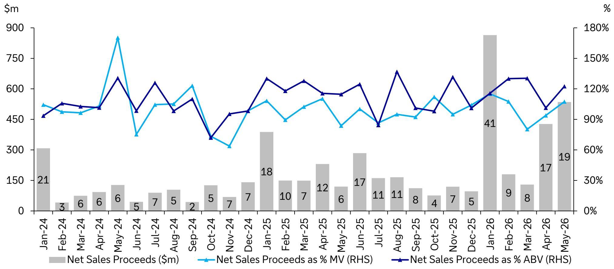

bar-line hybrid chart

| Month    | Net Sales Proceeds ($m) | Net Sales Proceeds as % MV (RHS) | Net Sales Proceeds as % ABV (RHS) |
|----------|--------------------------|-----------------------------------|------------------------------------|
| Jan-24   | 21                       | -                                 | 450                                |
| Feb-24   | 3                        | -                                 | 470                                |
| Mar-24   | 6                        | -                                 | 460                                |
| Apr-24   | 6                        | -                                 | 460                                |
| May-24   | 6                        | 880                               | 620                                |
| Jun-24   | 5                        | 330                               | 460                                |
| Jul-24   | 7                        | 470                               | 610                                |
| Aug-24   | 5                        | 470                               | 460                                |
| Sep-24   | 2                        | 610                               | 580                                |
| Oct-24   | 5                        | -                                 | 320                                |
| Nov-24   | 7                        | 310                               | 460                                |
| Dec-24   | 7                        | -                                 | 460                                |
| Jan-25   | 18                       | 570                               | 630                                |
| Feb-25   | 10                       | 450                               | 590                                |
| Mar-25   | 7                        | 470                               | 620                                |
| Apr-25   | 12                       | 570                               | 580                                |
| May-25   | 6                        | 430                               | 580                                |
| Jun-25   | 17                       | 460                               | 610                                |
| Jul-25   | 11                       | -                                 | 440                                |
| Aug-25   | 11                       | 460                               | 670                                |
| Sep-25   | 8                        | 450                               | 460                                |
| Oct-25   | 4                        | 570                               | 460                                |
| Nov-25   | 7                        | 460                               | 630                                |
| Dec-25   | 5                        | -                                 | 460                                |
| Jan-26   | 41                       | -                                 | 590                                |
| Feb-26   | 9                        | -                                 | 630                                |
| Mar-26   | 8                        | -                                 | 630                                |
| Apr-26   | 17                       | -                                 | 470                                |
| May-26   | 19                       | -                                 | 610                                |

There were 19 aircraft sales reported in May 2026 servicing reports (excluding component asset sales), the third-highest level in the last 28 months, exceeded only by the 41 aircraft sales reported in January 2026 and 21 aircraft sales reported in January 2024. Aircraft proceeds were a near record at \$535 million, exceeded only by the \$864 million reported in January 2026.  
Despite the start of the Iran War and resulting rise in fuel prices, the reported sales in May 2026 and the commentary from aircraft lessors in their 1Q2026 earnings calls indicate that the market for aircraft sales for both new generation and previous generation aircraft remains strong. We believe that aircraft sales will remain strong for the remainder of the year, although higher interest rates may start to reduce sales proceeds due to purchasers discounting contractual lease cash flows at higher rates.

Note: The table does not include component assets / part-outs.

Source: Cirium, Company Documents, DB

## Benchmark Aircraft ABS Loan-to-Values broadly better

Adjusted Base Value Loan-to-Value (LTV) through Junior – Apr 2026 vs. Initial  
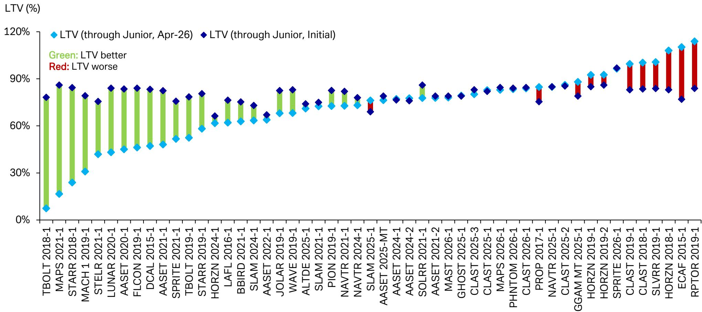

bar-line hybrid chart

| Category           | LTV (through Junior, Apr-26) | LTV (through Junior, Initial) |
| ------------------ | ---------------------------- | ----------------------------- |
| TBOLT 2018-1       | ~15%                         | ~75%                          |
| MAPS 2021-1        | ~20%                         | ~85%                          |
| STARR 2018-1       | ~25%                         | ~85%                          |
| MACH 1 2019-1      | ~30%                         | ~75%                          |
| STELR 2021-1       | ~40%                         | ~70%                          |
| LUNAR 2020-1       | ~45%                         | ~85%                          |
| AASET 2020-1       | ~50%                         | ~85%                          |
| FLCON 2019-1       | ~50%                         | ~85%                          |
| DCAL 2015-1        | ~50%                         | ~85%                          |
| AASET 2021-1       | ~50%                         | ~85%                          |
| SPRITE 2021-1      | ~55%                         | ~75%                          |
| TBOLT 2019-1       | ~55%                         | ~75%                          |
| STARR 2019-1       | ~60%                         | ~85%                          |
| HORZN 2024-1       | ~60%                         | ~65%                          |
| LAFL 2016-1        | ~60%                         | ~75%                          |
| BBIRD 2021-1       | ~60%                         | ~75%                          |
| SLAM 2024-1        | ~60%                         | ~70%                          |
| AASET 2022-1       | ~60%                         | ~65%                          |
| JOLAR 2019-1       | ~65%                         | ~85%                          |
| WAVE 2019-1        | ~65%                         | ~85%                          |
| ALTDE 2025-1       | ~65%                         | ~75%                          |
| SLAM 2021-1        | ~65%                         | ~75%                          |
| PION 2019-1        | ~65%                         | ~85%                          |
| NAVTR 2021-1       | ~65%                         | ~85%                          |
| NAVTR 2024-1       | ~65%                         | ~85%                          |
| SLAM 2025-1        | ~70%                         | ~65%                          |
| AASET 2025-MT      | ~70%                         | ~75%                          |
| AASET 2024-1       | ~70%                         | ~75%                          |
| AASET 2024-2       | ~70%                         | ~75%                          |
| SOLRR 2021-1       | ~70%                         | ~85%                          |
| AASET 2021-2       | ~70%                         | ~75%                          |
| MAST 2026-1        | ~70%                         | ~75%                          |
| GHOST 2025-1       | ~70%                         | ~75%                          |
| CLAST 2025-3       | ~70%                         | ~85%                          |
| CLAST 2025-1       | ~70%                         | ~85%                          |
| MAPS 2026-1        | ~70%                         | ~85%                          |
| PHNTOM 2026-1      | ~70%                         | ~85%                          |
| CLAST 2026-1       | ~70%                         | ~85%                          |
| PROP 2017-1        | ~75%                         | ~70%                          |
| NAVTR 2025-1       | ~75%                         | ~85%                          |
| CLAST 2025-2       | ~75%                         | ~85%                          |
| GGAM MT 2025-1     | ~85%                         | ~85%                          |
| HORZN 2019-1       | ~90%                         | ~85%                          |
| HORZN 2019-2       | ~90%                         | ~85%                          |
| SPRITE 2026-1      | ~95%                         | ~85%                          |
| CLAST 2019-1       | ~95%                         | ~85%                          |
| CLAST 2018-1       | ~95%                         | ~85%                          |
| SLVRR 2019-1       | ~95%                         | ~85%                          |
| HORZN 2018-1       | ~95%                         | ~85%                          |
| ECAF 2015-1        | ~95%                         | ~85%                          |
| RPTOR 2019-1       | ~95%                         | ~85%                          |

There was broad improvement in loan-to-value through the junior-most tranche across benchmark aircraft ABS transactions in April 2026 relative to loan-to-value (with value equal to Adjusted Base Value) at issuance. Of 53 benchmark aircraft ABS transactions in our survey for which we have data, 35 transactions saw an improvement in loan-to-value in April 2026 relative to levels at issuance, with 18 transactions showing a degradation of loan-to-value since issuance. Of those transactions showing degradation, five saw a degradation of less than 6 pp, with eight showing degradation of more than 10 pp. We expect strong aircraft sales to drive continued improvement in loan-to-value across most transactions over the remainder of 2026 and into 2027.

Source: Bloomberg Finance LP, Cirium, Company Documents, DB

## Aircraft ABS repayment since 2013

Aircraft ABS New Issue: 2013-2026 YTD (by issuer and type)  
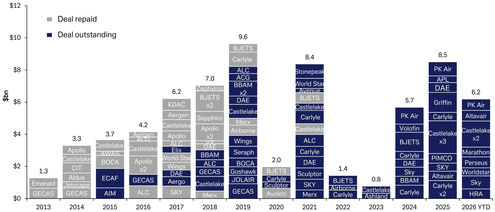

stacked bar chart

| Year | Company | Deal repaid ($bn) | Deal outstanding ($bn) |
| --- | --- | --- | --- |
| 2013 | Emerald | 1.3 | - |
| 2013 | GECAS | - | - |
| 2014 | Apollo | 3.3 | - |
| 2014 | CIT | - | - |
| 2014 | Aldus | - | - |
| 2014 | Jetscape | - | - |
| 2014 | GECAS | - | - |
| 2015 | Castlelake | 3.7 | - |
| 2015 | AWAS | - | - |
| 2015 | BOCA | - | - |
| 2015 | ECAF | - | - |
| 2015 | AIM | - | - |
| 2016 | Apollo x2 | 4.2 | - |
| 2016 | ACG | - | - |
| 2016 | KDAC | - | - |
| 2016 | Sky | - | - |
| 2016 | AKG | - | - |
| 2016 | EAGO | - | - |
| 2016 | SKY | - | - |
| 2017 | World Star | 6.2 | - |
| 2017 | Wings | - | - |
| 2017 | ACG | - | - |
| 2017 | KDAC | - | - |
| 2017 | Apollo x2 | - | - |
| 2017 | VX | - | - |
| 2017 | DAE | - | - |
| 2017 | ELEX | - | - |
| 2017 | SKY | - | - |
| 2018 | Zephyrus | 7.0 | - |
| 2018 | BJETS x2 | - | - |
| 2018 | BKETS | - | - |
| 2018 | Sapphire | - | - |
| 2018 | BMAM | - | - |
| 2018 | BBAM x2 | - | - |
| 2018 | DAE | - | - |
| 2018 | Wings | - | - |
| 2018 | ERX | - | - |
| 2018 | VX | - | - |
| 2018 | MEX | - | - |
| 2019 | MeX | 9.6 | - |
| 2019 | BJETS | - | - |
| 2019 | Carlyle | - | - |
| 2019 | CARLYL | - | - |
| 2019 | ARCL | - | - |
| 2019 | BLAM x2 | - | - |
| 2019 | ERX | - | - |
| 2019 | MEX | - | - |
| 2019 | Airborne | - | - |
| 2019 | Wings | - | - |
| 2019 | ERX | - | - |
| 2019 | ERX | - | - |
| 2019 | ERX | - | - |
| 2019 | ERX | - | - |
| 2019 | ERX | - | - |
| 2019 | ERX | - | - |
| 3Q | MEX | 9.6 | - |
| 3Q | BJETS | - | - |
| 3Q | CARLYL | - | - |
| 3Q | ERX | - | - |
| 3Q | AVolon | - | - |
| 3Q | MEX | 9.6 | - |
| 3Q | BJETS | - | - |
| 3Q | CARLYL | - | - |
| 3Q | ERX | - | - |
| 3Q | AVolon | 9.6 | - |
| 3Q | MEX | 9.6 | - |
| 3Q | BJETS | - | - |
| 3Q | CARLYL | - | - |
| 3Q | ERX | 9.6 | - |
| 3Q | AVolon | 9.6 | - |
| 3Q | MEX | 9.6 | - |
| 4Q | BJETS | - | - |
| 4Q | CARLYL | - | - |
| 4Q | ERX | - | - |
| 4Q | AVolon | 9.6 | - |
| 4Q | MEX | 9.6 | - |
| 4Q | BJETS | - | - |
| 4Q | CARLYL | - | - |
| 4Q | ERX | - | - |
| 4Q | AVolon | 9.6 | - |

The vast majority of aircraft ABS transactions issued since 2018 have been repaid from either aircraft sales and other sources.  
We expect that a continued strong market for aircraft sales and solid lease rates and values will allow more transactions to pay down in full over the balance of the year.  
- Aircraft in aircraft ABS maintain value not only for their value as aircraft, but for the value of the “green time” on their engines, making older aircraft exceptionally valuable for parts, in most cases, even if they are not needed as intact airworthy aircraft.

Source: Bloomberg Finance LP, Cirium, Company Documents, DB

## Aircraft lessor debt on track for post-2021 record

Lessor debt issuance by type (2015 – 2026 YTD)  
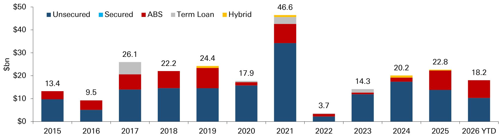

stacked bar chart

| Year       | Unsecured | Secured | ABS  | Term Loan | Hybrid |
| ---------- | --------- | ------- | ---- | --------- | ------ |
| 2015       | 13.4      | -       | -    | -         | -      |
| 2016       | 9.5       | -       | -    | -         | -      |
| 2017       | 26.1      | -       | -    | -         | -      |
| 2018       | 22.2      | -       | -    | -         | -      |
| 2019       | 24.4      | -       | -    | -         | -      |
| 2020       | 17.9      | -       | -    | -         | -      |
| 2021       | 46.6      | -       | -    | -         | -      |
| 2022       | 3.7       | -       | -    | -         | -      |
| 2023       | 14.3      | -       | -    | -         | -      |
| 2024       | 20.2      | -       | -    | -         | -      |
| 2025       | 22.8      | -       | -    | -         | -      |
| 2026 YTD   | 18.2      | -       | -    | -         | -      |

Lessor issuance by type (2015-2026 YTD)  
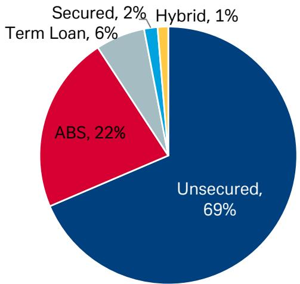

pie chart

| Category | Percentage (%) |
| :--- | :--- |
| Unsecured | 69 |
| ABS | 22 |
| Term Loan | 6 |
| Secured | 2 |
| Hybrid | 1 |

Note: Data as of June 15, 2026.  
Source: Bloomberg Finance LP, Press Release, DB

- Aircraft lessor debt issuance in 2026 has totaled just over \$18 billion, including approximately \$8 billion of aircraft ABS issuance and the remainder in the form of corporate recourse issuance.  
In November 2025, we projected total lessor issuance of \$25 to \$30 billion in 2026, including \$11 to \$13 billion of aircraft ABS. With aircraft ABS issuance already at \$8 billion in June 2026 and demand for new ABS issues strong and pricing tight (despite the negative effect of the Iran War on airline finances through higher fuel prices), we have increased our forecast for aircraft ABS issuance to \$15 to \$17 billion. Moreover, with new aircraft deliveries on pace to increase by 10% year-over-year in 2026, we now expect overall lessor issuance (including ABS) to increase to \$32 to \$36 billion in 2026.

## Aircraft ABS on track for record issuance...by a lot

Aircraft ABS New Issue: 2013 – 2026 YTD (by issuer and type)  
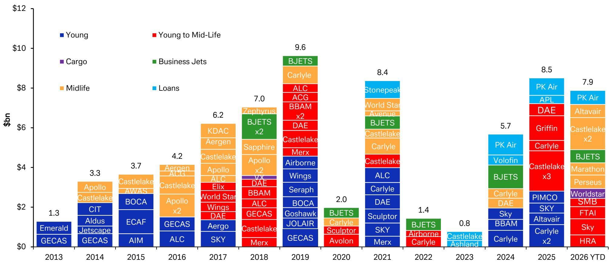

stacked bar chart

| Year | Company | Total Revenue ($bn) |
| --- | --- | --- |
| 2013 | Emerald GECAS | 1.3 |
| 2013 | Emerald GECAS | 1.3 |
| 2014 | CIT | 3.3 |
| 2014 | Aldus Jetscape | 3.3 |
| 2014 | ECAF GECAS | 3.7 |
| 2014 | BOCA | 3.7 |
| 2015 | AUM | 4.2 |
| 2015 | BOCA | 4.2 |
| 2015 | ECAF GECAS | 4.2 |
| 2015 | ALC | 4.2 |
| 2016 | Aergen ACG | 6.2 |
| 2016 | ACG | 6.2 |
| 2016 | BOCA x2 | 6.2 |
| 2016 | BOCA | 6.2 |
| 2017 | KDAC | 7.0 |
| 2017 | AeroG | 7.0 |
| 2017 | SKY | 7.0 |
| 2018 | World Star Wings | 9.6 |
| 2018 | ELEX | 9.6 |
| 2018 | DAE | 9.6 |
| 2018 | BBAM | 9.6 |
| 2018 | VX | 9.6 |
| 2018 | Zephyrus | 9.6 |
| 2019 | Apollo x2 | 9.6 |
| 2019 | Apollo x2 | 9.6 |
| 2019 | KIDAC | 9.6 |
| 2019 | AeroG | 9.6 |
| 2019 | BOCA | 9.6 |
| 2019 | BOCA | 9.6 |
| 2019 | GOCHEA | 9.6 |
| 2019 | GECAS | 9.6 |
| 2020 | Airborne | 9.6 |
| 2020 | Wings | 9.6 |
| 2020 | SERAPH | 9.6 |
| 2020 | BOCA | 9.6 |
| 2020 | GOCHEA | 9.6 |
| 2020 | GECAS | 9.6 |
| 2020 | Avolon | 9.6 |
| 2020 | MEK | 9.6 |
| 2021 | World Star Avenue | 9.6 |
| 2021 | BOCA | 9.6 |
| 2021 | GOCHEA | 9.6 |
| 2021 | MEK | 9.6 |
| 2021 | CARLYE | 9.6 |
| 2021 | CARLYE | 9.6 |
| 2021 | SCULPTOR | 9.6 |
| 2021 | SKY | 9.6 |
| 2021 | MEK | 9.6 |
| 2021 | MEK | 9.6 |
| 2022 | BJETS | 9.6 |
| 2022 | Airborne | 9.6 |
| 2022 | CARLYE | 9.6 |
| 2023 | BJETS | 9.6 |
| 2023 | Airborne | 9.6 |
| 2023 | CARLYE | 9.6 |
| 2023 | SKY | 9.6 |
| 2023 | MEK | 9.6 |
| 2023 | CARLYE | 9.6 |
| 2023 | SKY | 9.6 |
| 2023 | MEK | 9.6 |
| 2023 | SKY | 9.6 |
| 2023 | MEK | 9.6 |
| 2023 | SKY | 9.6 |
| 2023 | MEK | 9.6 |
| 2023 | SKY | 9.6 |
| 1Q-3Q | BJETS | $8.5 |
| 1Q-3Q | BJETS | $8.5 |
| 1Q-3Q | BJETS | $8.5 |
| Q1-3Q | BJETS | $8.5 |
| Q1-3Q | BJETS | $8.5 |
| Q1-3Q | BJETS | $8.5 |
| Q1-3Q | BJETS | $8.5 |
| Q1-3Q | BJETS | $8.5 |
| Q1-3Q | BJETS | #PK Air |
| Q1-3Q | BJETS | #PK Air |
| Q1-3Q | BJETS | #PK Air |
| Q1-3Q | BJETS | #PK Air |
| Q1-3Q | BJETS | #PK Air |
| Q1-3Q | BJETS | #PK Air |
| Q1-3Q | BJETS | #AK Air |
| Q1-3Q | BJETS | #AK Air |
| Q1-3Q | BJETS | #AK Air |
| Q1-3Q | BJETS | #AK Air |
| Q1-3Q | BJETS | #AK Air |
| Q1-3Q | BJETS | #AK Air |
| Q1-3Q | BJETS = BDLSX | $8.5 |
| Q1-3Q | BJETS = BDLSX | $8.5 |
| Q1-3Q | BJETS = BDLSX | $8.5 |
| Q1-3Q = BDLSX | BJETS = BDLSX | $8.5 |
| Q1-3Q = BDLSX | BJETS = BDLSX | $8.5 |
| Q1-3Q = BDLSX | BJETS = BDLSX | $8.5 |
| Q1-3Q = BDLSX | BJETS = BDLSX | $8.5 |

In November 2025, we forecast that aircraft ABS issuance in 2026 would move upwards to \$11 to \$13 billion, with robust issuance from large historic participants as well as sales from newer entrants, aided by the reopening of the market for aircraft ABS equity, which will enable large portfolio sales by lessors. Despite the onset of the Iran War on February 28, 2026, and the resulting rise in fuel prices straining airline finances, the pace of aircraft ABS issuance has been running well ahead of our November forecast with pricing at tight levels. As a result, we are increasing our forecast of 2026 ABS issuance to \$15 to \$17 billion.  
Note: Data as of June 15, 2026. Excludes engine transactions.  
Source: Company Documents, Bloomberg Finance LP, DB.

## Spreads tighten in '25, more tightening to date in '26

Senior A-Tranche Trade Price vs. 5yr US Tsy  
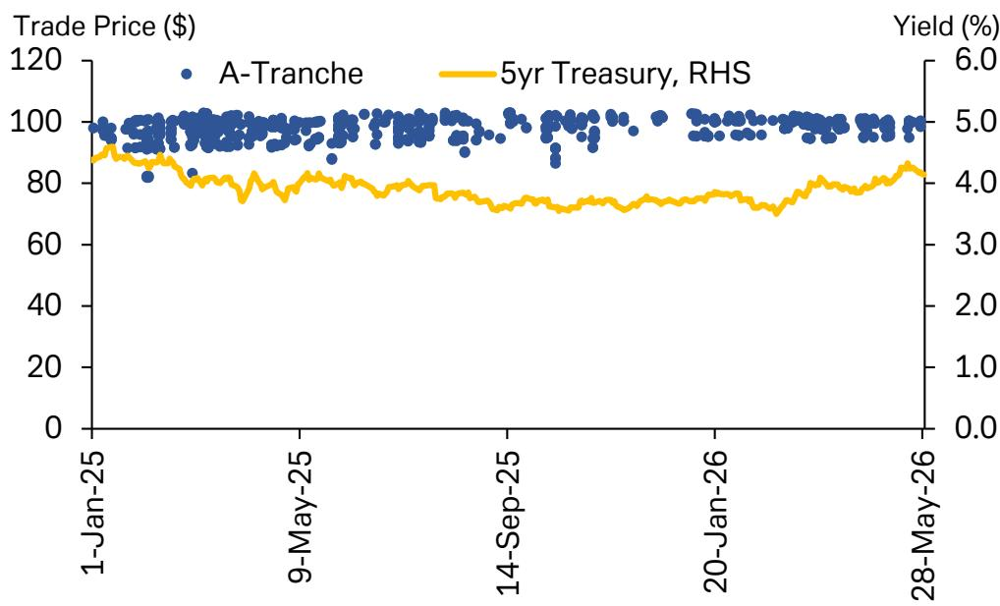

bar-line hybrid chart

| Date       | Trade Price ($) | 5yr Treasury, RHS |
| ---------- | --------------- | ----------------- |
| 1-Jan-25   | ~98             | ~4.5              |
| 9-May-25   | ~95             | ~4.0              |
| 14-Sep-25  | ~97             | ~3.8              |
| 20-Jan-26  | ~96             | ~3.7              |
| 28-May-26  | ~98             | ~4.2              |

Mezzanine B-Tranche & Subordinate C-Tranche vs. 5yr US Tsy  
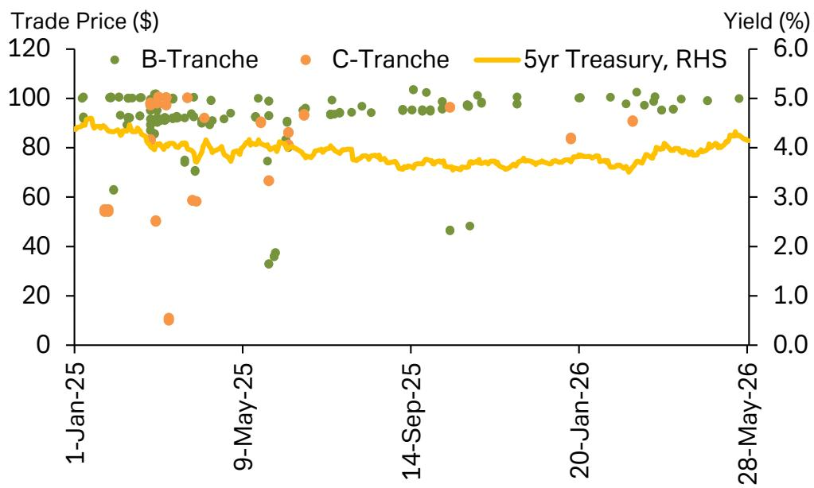

bar-line hybrid chart

| Date       | B-Tranche Trade Price ($) | C-Tranche Trade Price ($) | 5yr Treasury Yield (%) |
|------------|---------------------------|---------------------------|------------------------|
| 1-Jan-25   | ~95                       | ~55                       | ~4.5                   |
| 9-May-25   | ~35                       | ~85                       | ~4.0                   |
| 14-Sep-25  | ~45                       | ~95                       | ~3.8                   |
| 20-Jan-26  | ~100                      | ~80                       | ~4.0                   |
| 28-May-26  | ~100                      | ~85                       | ~4.5                   |

The market for aircraft ABS has been remarkably resilient in 2026 in the face of the start of the Iran War on February 28, 2026. The subsequent rise in fuel prices and the resulting damage to airline profitability were clear negatives for the aircraft ABS sector, yet the market for both primary and secondary issues remained strong, even after the start of the war, with seemingly no pause at all in the pace of issuance except in the immediate aftermath of the conflict's start. Despite the start of the war, market participants were able to look beyond what most expected to be a temporary rise in fuel prices (seemingly proved correct with the sharp reduction in fuel prices we have seen since the post-war peak) to market fundamentals that would remain strong – airlines were likely to remain profitable in aggregate in 2026, even with higher fuel prices, traffic growth remained positive in 2026, even with the operational disruptions in the Middle East and the market for aircraft remained tight even with the demise of Spirit Airlines and manufacturers (slowly) increasing production. We believe, particularly with the announcement of a new Iran-US agreement to reopen the supply of oil from the Gulf, that fundamentals for aircraft ABS will be positive in the remainder of 2026. With spreads already at tight levels (+150-160bp for better seniors) and issuance likely at record levels, we believe that opportunities for significant aircraft ABS outperformance will be idiosyncratic rather than broad-based. Best opportunities for outperformance can most likely be found in the secondary market, we believe, particularly around sub-tranches of pre-Covid transactions trading at a discount that will likely see accelerating repayment from aircraft sales in 2026. For post-Covid transactions, we prefer relative value of senior tranches to mezz tranches as the cash flow structure introduced after Covid significantly favors the senior tranche relative to the mezz tranche in a downside scenario.

Source: Bloomberg Finance LP, Company documents, Cirium, DB

## Registration Open

16 $^{th}$ Annual

## Aviation Forum:

## Airlines, Lessors, Manufacturers

September 8 – 10, 2026

DB Center, New York City

Registration: Aviation Forum

natural_image

Man in yellow safety jacket holding red lightbulb and crossbones, smiling at night (no visible text or symbols)

Douglas Runte

Managing Director

+1-212-250-9319

douglas.runte@db.com

natural_image

Portrait of a smiling man in business attire (no text or symbols visible)

Vivek John

Associate

vivek-a.john@db.com

natural_image

Portrait of a man in business attire against a blue background (no text or symbols visible)

Michael Linenberg

Managing Director

+1-212-250-9254

michael.linenberg@db.com

natural_image

Portrait of a bald man wearing a white shirt (no text or symbols visible)

Scott Deuschle

Director

+1-212-250-2014

scott.deuschle@db.com

natural_image

Portrait of a man wearing glasses and a checkered shirt, seated in an indoor setting with chairs in the background (no visible text or symbols)

Edison

Yu

Director

+1-212-250-7263

edison.yu@db.com

## Tuesday, September 8: Aviation Finance Workshop

• Introduction to Aviation Debt Securities  
• Aircraft ABS Market Update  
• Global Air Travel Market Outlook  
• Aircraft Lease Rates and Value Update and Outlook  
• Investing in Aircraft Engines  
• Investor / Trader Roundtable – Investing in Aviation Debt

## Wednesday, September 9: Aviation Lessors and Airbus – Boeing Debate

• 30+ leading aircraft lessors providing company updates with public presentations and one-on-one / small group investor meetings  
- Airbus – Boeing Product Update and Debate

## Thursday, September 10: Airlines and Aviation Manufacturers

• 30+ airlines and aviation manufacturers providing company updates with one-on-one / small group investor meetings

## Aviation Forum:

## Airlines, Lessors, Manufacturers

## Confirmed participants include: September 9

## Abelo

Steve Gorman, Chief Executive Officer

## AerCap

Aengus Kelly, Chief Executive Officer

## Aero Capital Solutions

Jason Barany, Chief Executive Officer

## Airborne Capital

Cian Dooley, Executive Director

## Aircastle

Roy Chandran, Chief Financial Officer

## AIP Capital / Phoenix Aviation Capital

Mathew Adamo, Managing Partner

## Altavair

Matthew Hoesley, President

## Avation

Jeff Chatfield, Executive Chairman

## Aviation Capital Group

Thomas Baker, Chief Executive Officer

## AviLease

Ted O'Byrne, Chief Executive Officer

## Avolon

Andy Cronin, Chief Executive Officer

## Azorra

Ron Baur, President

## BBAM

Steve Zissis, Chief Executive Officer

## Bellinger

René Mansveld, Chief Executive Officer

## BOC Aviation

Steven Townend, Chief Executive Officer

## Carlyle Aviation Partners

Alexander Rasnavad, President

## Castlelake

Joe McConnell, Partner

## Deucalion Aviation

Nathan Riggs, Chief Commercial Officer

## Dubai Aerospace Enterprise

Firoz Tarapore, Chief Executive Officer

## FTAI Aviation

Joseph Adams, Chief Executive Officer

## Genesis

Karl Griffin, Chief Executive Officer

## High Ridge Aviation

Greg Conlon, Chief Executive Officer

## Lesha Aviation Capital

Stephan Sayre, Co-Chief Executive Officer

## Marathon Aviation Finance

Joseph Thorstenson, Managing Director

## Perseus Aviation

Ronan Murphy, Managing Director

## SKY Leasing

Austin Wiley, Chief Executive Officer

## SMBC Aviation Capital

Peter Barrett, Chief Executive Officer

## Stratos

Gary Fitzgerald, Chief Executive Officer

## Sumisho Air Lease

Nori Hiruta, Chief Executive Officer

## TrueNoord

Anne-Bart Tieleman, Chief Executive Officer

## Willis Lease Finance Corporation

Austin Willis, Chief Executive Officer

## World Star Aviation

Marc larchy, Partner

## Airbus

Sinead Cormican, Head of Leasing Sales

## Boeing

Darren Hulst, Vice President

## Embraer

Matheus Piorino, Head of Customer Finance

## Confirmed participants include (but are not limited to): September 10

<table><tr><td>Air Line Pilots Association</td><td>Crane Company</td><td>Skywest Inc</td></tr><tr><td>Allegiant Travel Co</td><td>Deutsche Lufthansa AG</td><td>Southwest Airlines Co</td></tr><tr><td>American Airlines Group Inc</td><td>Frontier Group Holdings Inc</td><td>Southwest Airlines Pilots Association</td></tr><tr><td>Archer Aviation Inc</td><td>GE Aerospace</td><td>United Airlines Holdings Inc</td></tr><tr><td>ATI Materials</td><td>Grupo Aeromexico SAB de CV</td><td>Vertical Aerospace Ltd</td></tr><tr><td>Azul SA</td><td>HEICO Corp</td><td>Viva Aerobus</td></tr><tr><td>Breeze Airways</td><td>Hexcel Corp</td><td>Volaris</td></tr><tr><td>Carpenter Technology Corp</td><td>JetBlue Airways Corp</td><td>VSE Corp</td></tr><tr><td>Copa Holdings SA</td><td>LATAM Airlines Group SA</td><td>Woodward Inc</td></tr><tr><td></td><td>RBC Bearings Inc</td><td></td></tr></table>

## RMBS

Stand and de-lever: AAAs for carry/roll, BB for de-lever/upgrade

Ed Reardon, Managing Director
Rupesh Shrivastav, Research Associate
Nick Huang, Research Associate

## Big Pic

Issuance. We forecast full-year \$215bn gross and \$80bn net issuance. Non-QM is the largest sector and the clear non agency benchmark.  
Housing themes.

- Lock in effect = ongoing. Massive build-up in home equity, but insufficient housing turnover and new construction.  
■ Affordability challenge. Years to save enough for down payment.  
Home prices. Weakening, many more states seeing modest declines.

■ Prepays. Modified Non-QM S curves are flat.  
Credit. Still strong. We show Non-QM default multipliers by FICO and LTV.  
■ Relative Value: Rolldown and De-lever.

BB Non-QM. BBs will still benefit from de-levering; average BB bonds look more like IG bonds in \~18 months.  
AAA rolldown potential. Attractive carry and some rolldown still make Non-QM AAAs cheap.  
SFR. Spreads are too tight due to no net issuance and a dedicated investor base, but we don't like the high leverage.

## 2026 full-year issuance forecast: \$215bn

Non-QM will reach \~\$95bn supply

<table><tr><td></td><td>Full year 2025</td><td>YTD 2026</td><td>Full year 2026</td></tr><tr><td>Non-QM</td><td>78</td><td>51</td><td>95</td></tr><tr><td>Prime</td><td>43</td><td>19</td><td>40</td></tr><tr><td>CES</td><td>18</td><td>9</td><td>20</td></tr><tr><td>RPL</td><td>9</td><td>8</td><td>12</td></tr><tr><td>CAS/STACR</td><td>9</td><td>4</td><td>8</td></tr><tr><td>SFR</td><td>7</td><td>3</td><td>12</td></tr><tr><td>RTL</td><td>6</td><td>1</td><td>4</td></tr><tr><td>HELOC</td><td>10</td><td>5</td><td>10</td></tr><tr><td>NPL</td><td>8</td><td>0</td><td>2</td></tr><tr><td>HEI</td><td>2</td><td>1</td><td>2</td></tr><tr><td>Other</td><td>15</td><td>5</td><td>10</td></tr><tr><td>Total</td><td>205</td><td>106</td><td>215</td></tr></table>

Source: DB, Intex.

We forecast \$215bn supply. Only \$80bn net issuance.  
Non-QM growth drivers. Low mortgage rates vs agency conforming rates, fast prepayments of outstanding loans and deal calls.  
■ Growth sectors: HELOC/CES (\$34tn of US home equity); Fix and flip due to deferred housing capex.

## Non-Agency RMBS Outstanding Approaches \$600bn

## RMBS 2.0 Outstanding, \$bn

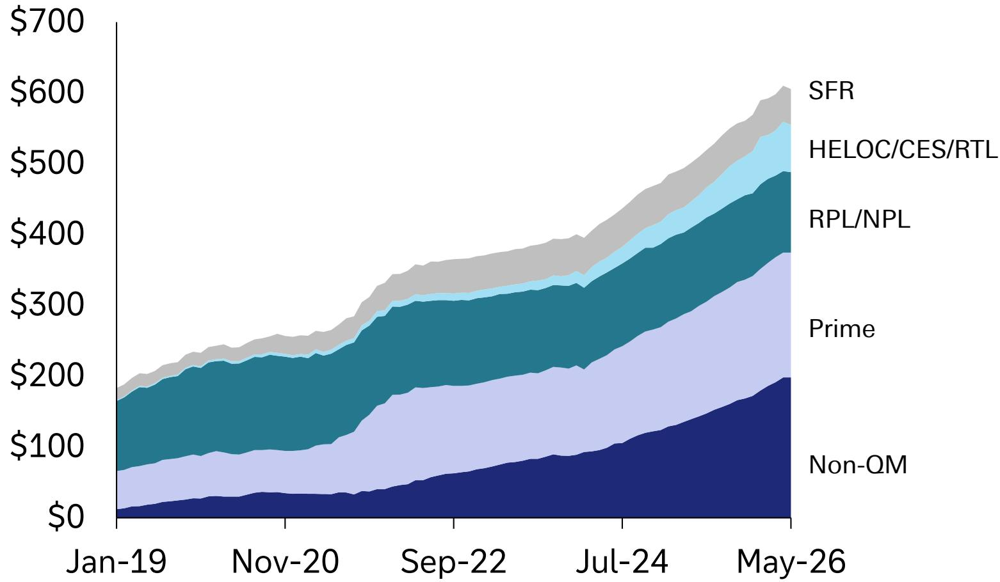

stacked bar chart

| Date     | Non-QM | Prime | RPL/NPL | HELOC/CES/RTL | SFR  |
|----------|--------|-------|---------|---------------|------|
| Jan-19   | ~$10   | ~$50  | ~$40    | ~$30          | ~$20 |
| Nov-20   | ~$20   | ~$60  | ~$50    | ~$40          | ~$30 |
| Sep-22   | ~$40   | ~$80  | ~$70    | ~$60          | ~$50 |
| Jul-24   | ~$70   | ~$100 | ~$90    | ~$80          | ~$70 |
| May-26   | ~$100  | ~$130 | ~$120   | ~$110         | ~$100 |

Note: data as of 05/31/2026  
Source: Intex, DB

Outstanding Non-Agency RMBS 2.0 has grown to nearly \$600bn. Growth is led by Non-QM and Prime issuance. Non-QM is now the non agency RMBS benchmark.

## RMBS spreads: room for tightening

Current spreads vs 1 year range  
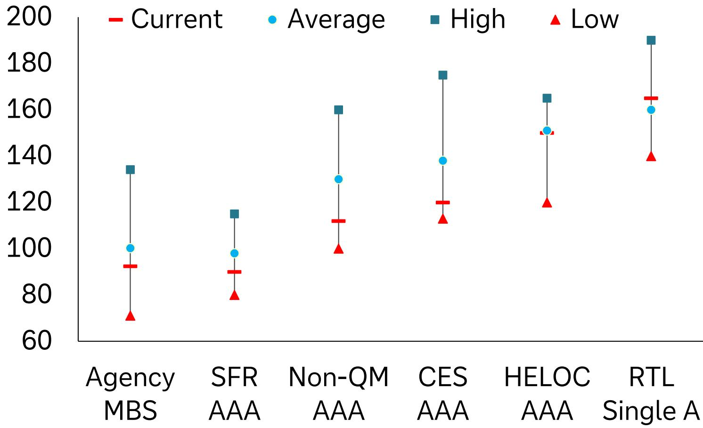

scatterplot

| Category         | Current | Average | High | Low |
| ---------------- | ------- | ------- | ---- | --- |
| Agency MBS       | 90      | 100     | 135  | 70  |
| SFR AAA          | 88      | 98      | 115  | 80  |
| Non-QM AAA       | 112     | 130     | 160  | 100 |
| CES AAA          | 120     | 138     | 175  | 112 |
| HELOC AAA        | 150     | 150     | 165  | 120 |
| RTL Single A     | 165     | 160     | 190  | 140 |

Note: For Agency MBS .MBSDV01 G Index is used. HELOC, Closed End Second (CES) and RTL (Residential Transition Loans) all use new issue pricing and the latest priced deal for Current levels. Source: Bloomberg Finance LLP, Intex, DB

■ Most RMBS sectors are trading below 1-year average but are off their 1-year tights.  
Perspective: IG Corp are within spitting distance of 25-year tights.  
Non-QM AAAs. Non-QM AAAs offer attractive carry and some rolldown, even adjusting for \~30bp convexity cost. HELOC AAAs. Attractive AAA alternative with spread pickup; strong credit profiles with low convexity.

## Relative Value: AAA Rolldown and BB De-leveraging

AAA Non-QM Rolldown, bp  
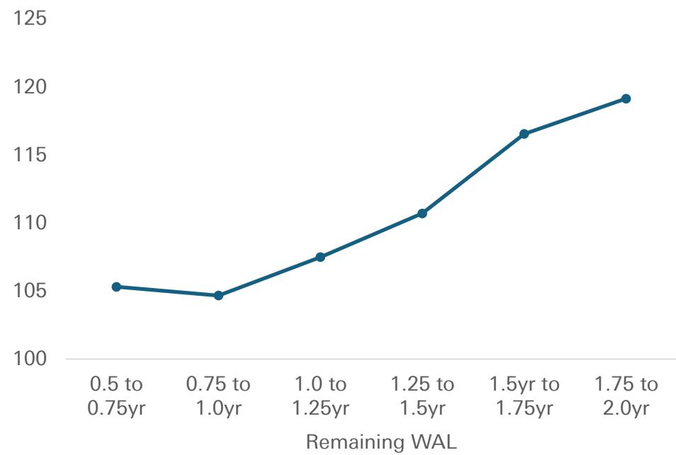

line chart

| Remaining WAL | Value |
|---|---|
| 0.5 to 0.75yr | 105 |
| 0.75 to 1.0yr | 104.5 |
| 1.0 to 1.25yr | 107.5 |
| 1.25 to 1.5yr | 110.5 |
| 1.5yr to 1.75yr | 116.5 |
| 1.75 to 2.0yr | 119 |

Source: Intex, DB

BB de-leveraging  
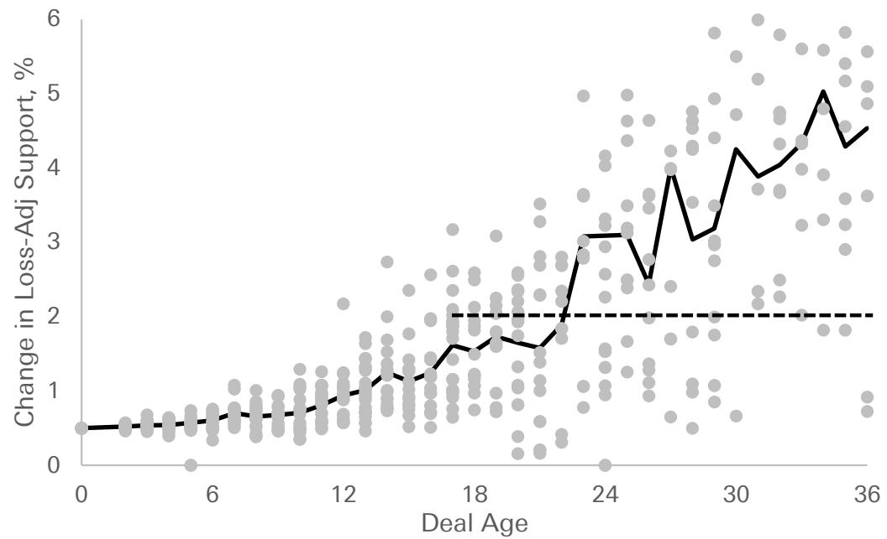

line chart

| Deal Age | Change in Loss-Adj Support, % |
| -------- | ----------------------------- |
| 0        | 0.5                           |
| 6        | 0.7                           |
| 12       | 1.0                           |
| 18       | 1.5                           |
| 24       | 3.0                           |
| 30       | 4.0                           |
| 36       | 4.5                           |

Note: Dotted line of $\sim 2\%$ increase in loss-adjusted support.  
Loss-adjusted support measured as current enhancement minus projected losses, measured as 60% delinquencies x 50% roll to default and 20% loss severity

AAA Non-QM Rolldown. AAA Non-QM have very high carry, in part due to callability. Bonds issued from 2023 also show rolldown potential.  
BB de-leveraging. Fast natural prepayments help bonds de-lever quickly and we see more downgrades occur when BB loss-adjusted support increases by \~2%. Bonds have upgrade potential by \~18 months; favor BBs with higher owner-occupied loans due to faster prepays (see S curve on following slide).

## Single Family Rental: Evolving structures

SFR Maturities, \$bn  
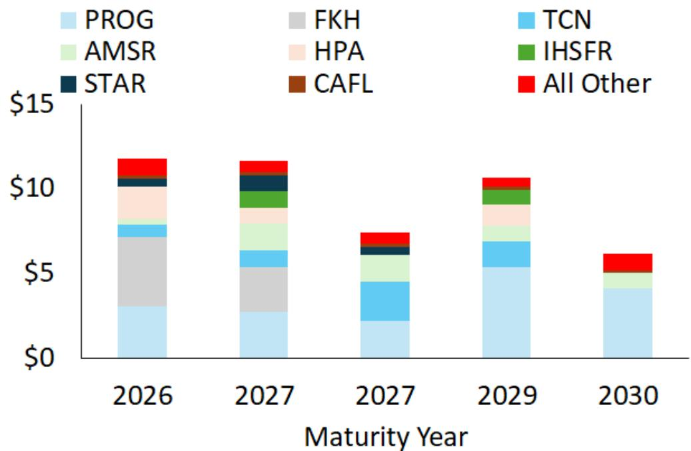

stacked bar chart

| Maturity Year | PROG | AMSR | STAR | FKH | HPA | TCN | IHSFR | CAFL | All Other |
| ------------- | ---- | ---- | ---- | --- | --- | --- | ----- | ---- | --------- |
| 2026          | ~$3  | ~$1  | ~$0.5 | ~$4 | ~$2 | ~$1 | ~$0.5 | ~$0.5 | ~$1       |
| 2027          | ~$3  | ~$1  | ~$0.5 | ~$3 | ~$1 | ~$1 | ~$1   | ~$0.5 | ~$1       |
| 2027          | ~$2  | ~$1  | ~$0.5 | ~$2 | ~$1 | ~$1 | ~$0.5 | ~$0.5 | ~$1       |
| 2029          | ~$5  | ~$1  | ~$0.5 | ~$1 | ~$1 | ~$1 | ~$1   | ~$0.5 | ~$1       |
| 2030          | ~$4  | ~$1  | ~$0.5 | ~$1 | ~$1 | ~$1 | ~$1   | ~$0.5 | ~$1       |

Deal structure: 2021 vs 2026

<table><tr><td colspan="4">PROG 2021-SFR8</td></tr><tr><td></td><td>Orig LTV</td><td>Moody</td><td>KBRA</td></tr><tr><td>A</td><td>30%</td><td>Aaa</td><td>AAA</td></tr><tr><td>B</td><td>39%</td><td>Aa3</td><td>AA+</td></tr><tr><td>C</td><td>43%</td><td>A3</td><td>AA</td></tr><tr><td>D</td><td>49%</td><td>Baa3</td><td>A</td></tr><tr><td>E1</td><td>62%</td><td></td><td>BBB+</td></tr><tr><td>E2</td><td>70%</td><td></td><td>BBB-</td></tr><tr><td>F</td><td>81%</td><td></td><td>BB-</td></tr><tr><td>G</td><td>87%</td><td></td><td>B-</td></tr><tr><td>H</td><td>92%</td><td></td><td></td></tr><tr><td>I</td><td>99%</td><td></td><td></td></tr></table>

<table><tr><td colspan="4">PROG 2026-SFR2</td></tr><tr><td></td><td>Orig LTV</td><td>Moody</td><td>DBRS</td></tr><tr><td>A</td><td>50%</td><td>Aaa</td><td>AAA</td></tr><tr><td>B</td><td>58%</td><td>Aa3</td><td>AAL</td></tr><tr><td>C</td><td>64%</td><td>A3</td><td>AL</td></tr><tr><td>D</td><td>70%</td><td>Baa2</td><td>BBB</td></tr><tr><td>E</td><td>76%</td><td></td><td>BBBL</td></tr><tr><td>F</td><td>82%</td><td></td><td>BB</td></tr><tr><td>G*</td><td>90%</td><td></td><td></td></tr></table>

Note: Bold is zero coupon tranches.  
Source: DB, Intex.

- \~\$50bn in SFRs outstanding. Near-term maturities: H2 2026: \~\$12bn. 2027: \$12bn.  
Evolving structure over five years. Tranche LTVs are higher across the rating spectrum. Example: AAA 30% in 2021 vs 50% today. Moody's Baa3 49% in 2021 vs Baa2 70% today.  
■ Zero coupon bonds. More subordinate tranches have a zero coupon to help DSCR to be above 1.0x.  
We find better relative value in other Non agency RMBS sectors.

## Non-QM: Modified S curve

Investor Loan CPR %  
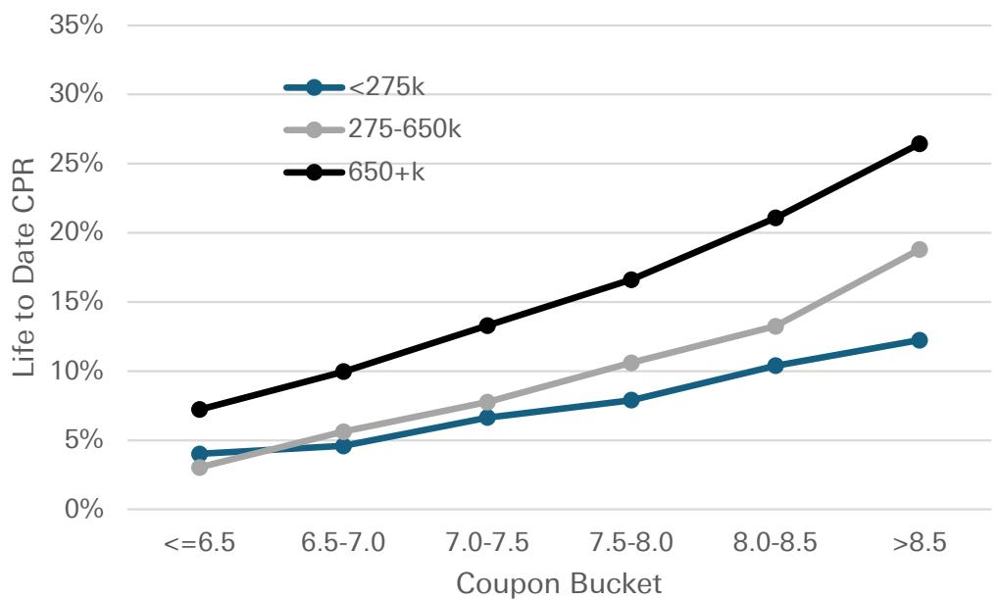

line chart

| Coupon Bucket | <275k | 275-650k | 650+k |
| ------------- | ----- | -------- | ----- |
| <=6.5         | 4%    | 3%       | 7%    |
| 6.5-7.0       | 4.5%  | 5%       | 10%   |
| 7.0-7.5       | 6%    | 7.5%     | 13%   |
| 7.5-8.0       | 7.5%  | 10.5%    | 16.5% |
| 8.0-8.5       | 10%   | 13%      | 21%   |
| >8.5          | 12%   | 18.5%    | 26.5% |

Source: DB, Intex.

Owner-occupied CPR %  
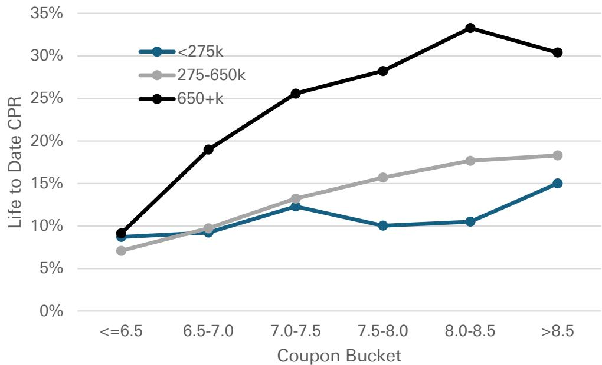

line chart

| Coupon Bucket | <275k | 275-650k | 650+k |
| ------------- | ----- | -------- | ----- |
| <=6.5         | 8.5%  | 7.0%     | 9.0%  |
| 6.5-7.0       | 9.0%  | 9.5%     | 19.0% |
| 7.0-7.5       | 12.0% | 13.0%    | 25.0% |
| 7.5-8.0       | 10.0% | 15.5%    | 28.0% |
| 8.0-8.5       | 10.5% | 17.5%    | 33.0% |
| >8.5          | 15.0% | 18.0%    | 30.0% |

We show 2023 vintage life to date CPRs by loan balance buckets at 2yr loan age.  
Investor loans. Slower prepays due to penalties, all else equal. Example: 2yr life to date CPR is \~13% for the 7.0-7.5% coupon bucket and 650K+. For owner occupied with similar traits, life to date CPR was \~25%.  
Larger balance loans. Highest prepays for 650k+ loans.

## Non-QM 2.0 default risk: FICO x LTV matrix

Default risk by FICO and Original LTV

<table><tr><td rowspan="2" colspan="2"></td><td colspan="9">Original LTV</td></tr><tr><td>0-50</td><td>50-60</td><td>60-70</td><td>70-75</td><td>75-80</td><td>80-85</td><td>85-90</td><td>90+</td><td>Total</td></tr><tr><td rowspan="7">Original FICO</td><td>600-650</td><td></td><td></td><td>6.8%</td><td>7.8%</td><td>7.8%</td><td>6.9%</td><td></td><td></td><td>7.3%</td></tr><tr><td>650-675</td><td>3.0%</td><td>3.7%</td><td>4.8%</td><td>5.4%</td><td>6.4%</td><td>5.7%</td><td></td><td></td><td>5.4%</td></tr><tr><td>675-700</td><td>1.7%</td><td>2.7%</td><td>4.0%</td><td>4.6%</td><td>4.9%</td><td>4.1%</td><td>6.8%</td><td>6.5%</td><td>4.2%</td></tr><tr><td>700-725</td><td>1.2%</td><td>2.1%</td><td>2.7%</td><td>2.9%</td><td>3.3%</td><td>2.9%</td><td>4.3%</td><td>5.6%</td><td>3.0%</td></tr><tr><td>725-750</td><td>0.8%</td><td>1.1%</td><td>2.1%</td><td>2.1%</td><td>2.7%</td><td>2.2%</td><td>3.2%</td><td>3.4%</td><td>2.2%</td></tr><tr><td>750-775</td><td>0.6%</td><td>1.0%</td><td>1.3%</td><td>1.3%</td><td>1.6%</td><td>1.2%</td><td>2.4%</td><td>1.9%</td><td>1.3%</td></tr><tr><td>775+</td><td>0.2%</td><td>0.6%</td><td>0.7%</td><td>0.6%</td><td>0.9%</td><td>0.7%</td><td>0.8%</td><td>1.3%</td><td>0.7%</td></tr><tr><td></td><td>Grand Total</td><td>0.9%</td><td>1.5%</td><td>2.1%</td><td>2.2%</td><td>2.5%</td><td>2.0%</td><td>3.7%</td><td>3.7%</td><td>2.1%</td></tr></table>

Note: Boxed area shows where most loans are underwritten. Represents 62% of total. White area is insufficient data to show results.  
Source: DB, FHFA, SIFMA.

To measure default risk, we use the most recent loan status or final status. We define “defaults” as: 60+ delinquencies, loans classified as REO Sold or FC Sold and Loans that have a loss. This measure is quite broad, especially since many loans sold from foreclosure and REO experienced no loss.  
We further weight this default risk by delinquency status, using assumed roll rates. For example, a loan that is 60-89 delinquent clearly has a lower default likelihood than a foreclosed loan.  
Non-QM 2.0 default risk. Our results are intuitive. Lower FICOs and higher LTVs have higher risks, and they scale consistently across most buckets. The data above approximates the actual probability of default.

## Red states vs Blue states: Is California turning red?

1-Year Home Price Appreciation  
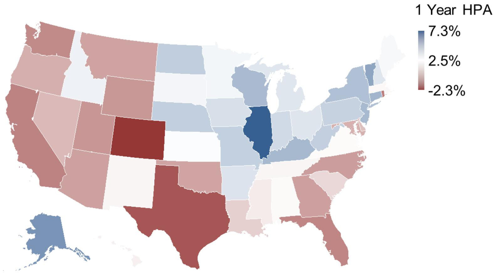

choropleth map

| State | 1 Year HPA Change |
| --- | --- |
| California | -2.3% |
| Texas | -2.3% |
| New York | -2.3% |
| Florida | -2.3% |
| Illinois | -2.3% |
| Pennsylvania | -2.3% |
| Ohio | -2.3% |
| Georgia | -2.3% |
| North Carolina | -2.3% |
| Michigan | -2.3% |
| New Jersey | -2.3% |
| Virginia | -2.3% |
| Washington | -2.3% |
| Arizona | -2.3% |
| Massachusetts | -2.3% |
| Tennessee | -2.3% |
| Indiana | -2.3% |
| Maryland | -2.3% |
| Missouri | -2.3% |
| Wisconsin | -2.3% |
| Colorado | -2.3% |
| Minnesota | -2.3% |
| Iowa | -2.3% |
| Michigan | -2.3% |
| Indiana | -2.3% |
| Ohio | -2.3% |
| Arkansas | -2.3% |
| Louisiana | -2.3% |
| Kentucky | -2.3% |
| West Virginia | -2.3% |
| Alabama | -2.3% |
| Mississippi | -2.3% |
| Louisiana | -2.3% |
| Oklahoma | -2.3% |
| Arkansas | -2.3% |
| Kansas | -2.3% |
| Nebraska | -2.3% |
| South Dakota | -2.3% |
| North Dakota | -2.3% |
| Montana | -2.3% |
| Wyoming | -2.3% |
| Colorado | 7.3% |
| Utah | 7.3% |
| Idaho | 7.3% |
| Nevada | 7.3% |
| New Hampshire | 7.3% |
| Maine | 7.3% |
| Massachusetts | 7.3% |
| Rhode Island | 7.3% |
| Connecticut | 7.3% |
| Delaware | 7.3% |
| Maryland | 7.3% |
| District of Columbia | 7.3% |
| Alaska | 7.3% |
| Hawaii | 7.3% |
| Maine | 7.3% |
| Vermont | 7.3% |
| New Hampshire | 7.3% |
| Rhode Island | 7.3% |
| Montana | 7.3% |
| Delaware | 7.3% |
| Oklahoma | 7.3% |
| West Virginia | 7.3% |
| Virginia | 7.3% |
| West Virginia | 7.3% |
| Maine | 7.3% |
| Vermont | 7.3% |
| New Hampshire | 7.3% |
| Rhode Island | 7.3% |
| Connecticut | 7.3% |
| Delaware | 7.3% |
| Maryland | 7.3% |
| District of Columbia | 7.3% |
| Rhode Island | 7.3% |
| Virginia | 7.3% |
| West Virginia | 7.3% |
| Maine | 7.3% |
| Vermont | 7.3% |
| New Hampshire | 7.3% |
| Rhode Island | 7.3% |
| Montana | 7.3% |
| Delaware | 7.3% |
| Oklahoma | 7.3% |
| West Virginia | 7.3% |
| Virginia | 7.3% |

Note: FHFA data through Q1 2026. Source: FHFA Quarterly All-Transactions Index

Down from peak: Hawaii (-7%), Texas (-2%), Colorado (-3%), Delaware (-3%)  
■ 19 states are still at their all time high; 24 states are within 2% of their all-time high

## Appendix

## May 2026 Remits: Credit Performance

## 60+ Delinquency, %

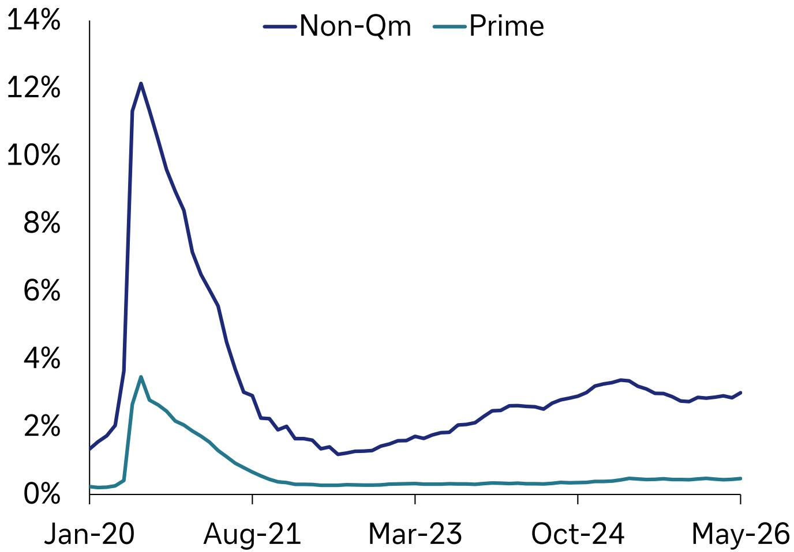

line chart

| Date    | Non-Qm | Prime |
|---------|--------|-------|
| Jan-20  | 1.5%   | 0.1%  |
| Feb-20  | 2.0%   | 0.2%  |
| Mar-20  | 3.5%   | 0.3%  |
| Apr-20  | 12.0%  | 3.5%  |
| May-20  | 8.0%   | 2.5%  |
| Jun-20  | 6.0%   | 1.5%  |
| Jul-20  | 4.0%   | 1.0%  |
| Aug-20  | 3.0%   | 0.5%  |
| Sep-20  | 2.5%   | 0.3%  |
| Oct-20  | 2.0%   | 0.2%  |
| Nov-20  | 1.5%   | 0.1%  |
| Dec-20  | 1.0%   | 0.1%  |
| Jan-21  | 1.5%   | 0.2%  |
| Feb-21  | 1.8%   | 0.3%  |
| Mar-21  | 1.7%   | 0.3%  |
| Apr-21  | 1.6%   | 0.3%  |
| May-21  | 1.5%   | 0.3%  |
| Jun-21  | 1.4%   | 0.3%  |
| Jul-21  | 1.3%   | 0.3%  |
| Aug-21  | 1.2%   | 0.3%  |
| Sep-21  | 1.1%   | 0.3%  |
| Oct-21  | 1.0%   | 0.3%  |
| Nov-21  | 1.1%   | 0.3%  |
| Dec-21  | 1.2%   | 0.3%  |
| Jan-22  | 1.3%   | 0.3%  |
| Feb-22  | 1.4%   | 0.3%  |
| Mar-22  | 1.5%   | 0.3%  |
| Apr-22  | 1.6%   | 0.3%  |
| May-22  | 1.7%   | 0.3%  |
| Jun-22  | 1.8%   | 0.3%  |
| Jul-22  | 1.9%   | 0.3%  |
| Aug-22  | 2.0%   | 0.3%  |
| Sep-22  | 2.1%   | 0.3%  |
| Oct-22  | 2.2%   | 0.3%  |
| Nov-22  | 2.3%   | 0.3%  |
| Dec-22  | 2.4%   | 0.3%  |
| Jan-23  | 2.5%   | 0.3%  |
| Feb-23  | 2.6%   | 0.3%  |
| Mar-23  | 2.7%   | 0.3%  |
| Apr-23  | 2.8%   | 0.3%  |
| May-23  | 2.9%   | 0.3%  |
| Jun-23  | 3.0%   | 0.3%  |
| Jul-23  | 3.1%   | 0.3%  |
| Aug-23  | 3.2%   | 0.3%  |
| Sep-23  | 3.3%   | 0.3%  |
| Oct-23  | 3.4%   | 0.3%  |
| Nov-23  | 3.5%   | 0.3%  |
| Dec-23  | 3.6%   | 0.3%  |
| Jan-24* | -      | -     |
| Feb-24* | -      | -     |
| Mar-24* | -      | -     |
| Apr-24* | -      | -     |
| May-24* | -      | -     |
| Jun-24* | -      | -     |
| Jul-24* | -      | -     |
| Aug-24* | -      | -     |
| Sep-24* | -      | -     |
| Oct-24* | -      | -     |
| Nov-24* | -      | -     |
| Dec-24* | -      | -     |
| Jan-25* | -      | -     |
| Feb-25* | -      | -     |
| Mar-25* | -      | -     |
| Apr-25* | -      | -     |
| May-25* | -      | -     |
| Jun-25* | -      | -     |
| Jul-25* | -      | -     |
| Aug-25* | -      | -     |
| Sep-25* | -      | -     |
| Oct-25* | -      | -     |
| Nov-25* | -      | -     |
| Dec-25* | -      | -     |
| Jan-26* | -      | -     |
| Feb-26* | -      | -     |
| Mar-26* | -      | -     |
| Apr-26* | -      | -     |
| May-26* | -      | -     |
| Jun-26* | -      | -     |
| Jul-26* | -      | -     |
| Aug-26* | -      | -     |
| Sep-26* | -      | -     |
| Oct-26* | -      | -     |
| Nov-26* | -      | -     |
| Dec-26* | -      | -     |
| Jan-27* | -      | -     |
| Feb-27* | -      | -     |
| Mar-27* | -      | -     |
| Apr-27* | -      | -     |
| May-27* | -      | -     |
| Jun-27* | -      | -     |
| Jul-27* | -      | -     |
| Aug-27* | -      | -     |
| Sep-27* | -      | -     |
| Oct-27* | -      | -     |
| Nov-27* | -      | -     |
| Dec-27* | -      | -     |
| Jan-28* | -      | -     |
| Feb-28* | -      | -     |
| Mar-28* | -      | -     |
| Apr-28* | -      | -     |
| May-28* | -      | -     |
| Jun-28* | -      | -     |
| Jul-28* | -      | -     |
| Aug-28* | -      | -     |
| Sep-28* | -      | -     |
| Oct-28* | -      | -     |
| Nov-28* | -      | -     |
| Dec-28* | -      | -     |
| Jan-29* *<fcel>-     <fcel>-     |
| Feb-29* *<fcel>-     <fcel>-     |
| Mar-29* *<fcel>-     <fcel>-     |
| Apr-29* *<fcel>-     <fcel>-     |
| May-29* *<fcel>-     <fcel>-     |
| Jun-29* *<fcel>-     <fcel>-     |
| Jul-29* *<fcel>-     <fcel>-     |
| Aug-29* *<fcel>-     <fcel>-     |
| Sep-29* *<fcel>-     <fcel>-     |
| Oct-29* *<fcel>-     <fcel>-     |
| Nov-29* *<fcel>-     <fcel>-     |
| Dec-29* *<fcel>-     <fcel>-     |
| Jan-30* *<fcel>-     <fcel>-     |
| Feb-30* *<fcel>-     <fcel>-     |
| Mar-30* *<fcel>-     <fcel>-     |
| Apr-30* *<fcel>-     <fcel>-     |
| May-30* *<fcel>-     <fcel>-     |
| Jun-30* *<fcel>-     <fcel>-     |
| Jul-30* *<fcel>-     <fcel>-     |
| Aug-30* *<fcel>-     <fcel>-     |
| Sep-30* *<fcel>-     <fcel>-     |
| Oct-30* *<fcel>-     <fcel>-     |
| Nov-30* *<fcel>-     <fcel>-     |
| Dec-30* *<fcel>-     <fcel>-     |
| Jan-31* *<fcel>(Continued) % (%)<lcel><nl>

Source: DB, Intex.

Non-QM: Overall 60+dlq are 3%. The 2023 vintage is highest at 6.7%. 2023 60+ delinquencies include: VERUS (9.3%), COLT (9.2%) and ADMT (9.4%).  
Prime: Prime Collateral remains exceptionally resilient, 60+ delinquencies are 0.5%. In Prime RMBS, the 2023 vintage also has the highest 60+ delinquencies, 1.5%.

## May 2026 Remits: Top 5 Shelves performance

Non-QM 60+ dlq, %  
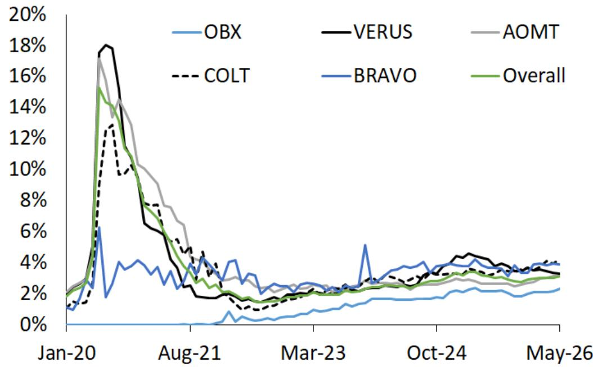

line chart

| Date    | OBX   | VERUS | AOMT  | COLT  | BRAVO | Overall |
|---------|-------|-------|-------|-------|-------|---------|
| Jan-20  | ~1%   | ~18%  | ~17%  | ~15%  | ~6%   | ~15%    |
| Aug-21  | ~3%   | ~4%   | ~8%   | ~4%   | ~3%   | ~4%     |
| Mar-23  | ~1%   | ~2%   | ~2%   | ~2%   | ~2%   | ~2%     |
| Oct-24  | ~2%   | ~4%   | ~3%   | ~3%   | ~3%   | ~3%     |
| May-26  | ~2%   | ~4%   | ~3%   | ~3%   | ~3%   | ~3%     |

Prime 60+ dlq, %  
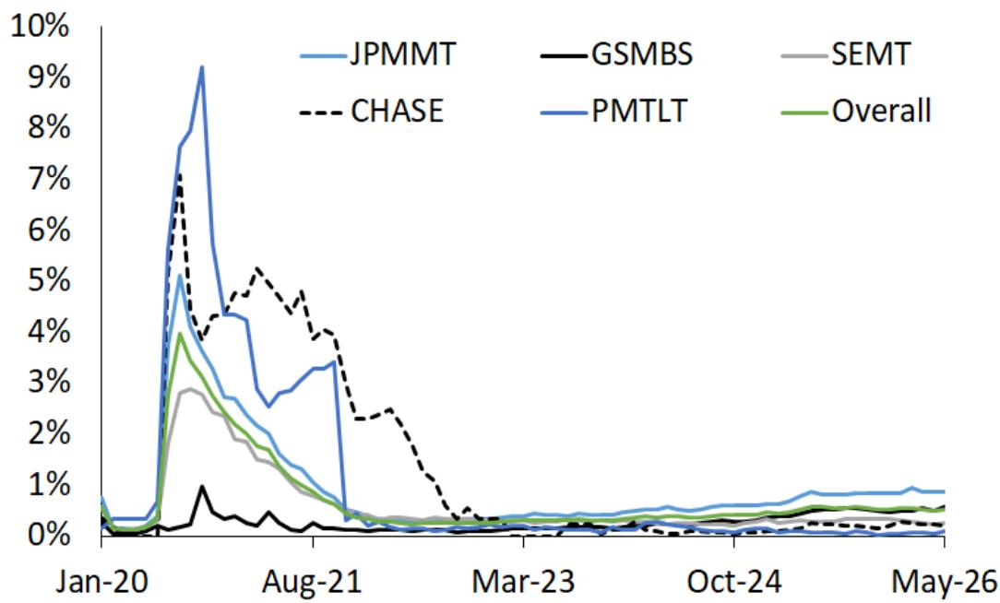

line chart

| Date    | JPMMT | GSBMS | SEMT | CHASE | PMTLT | Overall |
|---------|-------|-------|------|-------|-------|---------|
| Jan-20  | ~0.5% | ~0.1% | ~0.1%| ~0.1% | ~0.1% | ~0.1%   |
| Aug-21  | ~4.5% | ~0.5% | ~2.5%| ~5.5% | ~4.5% | ~3.5%   |
| Mar-23  | ~0.5% | ~0.1% | ~0.1%| ~0.1% | ~0.1% | ~0.1%   |
| Oct-24  | ~0.5% | ~0.1% | ~0.1%| ~0.1% | ~0.1% | ~0.1%   |
| May-26  | ~0.5% | ~0.1% | ~0.1%| ~0.1% | ~0.1% | ~0.1%   |

Source: Intex, DB

Non-QM: VERUS and AOMT demonstrated the highest vulnerability, peaking above 18% in mid-2020. Other Non-QM shelves also saw significant, though slightly lower, peaks.

Prime: Prime shelves showed much milder delinquency increases during the 2020 shock, with even the highest (PMTLT) peaking below 10%. They achieved rapid and sustained recovery to exceptionally low levels by late 2021.

## May 2026 Remits: Prepays

1mo-CPR, Non-QM  
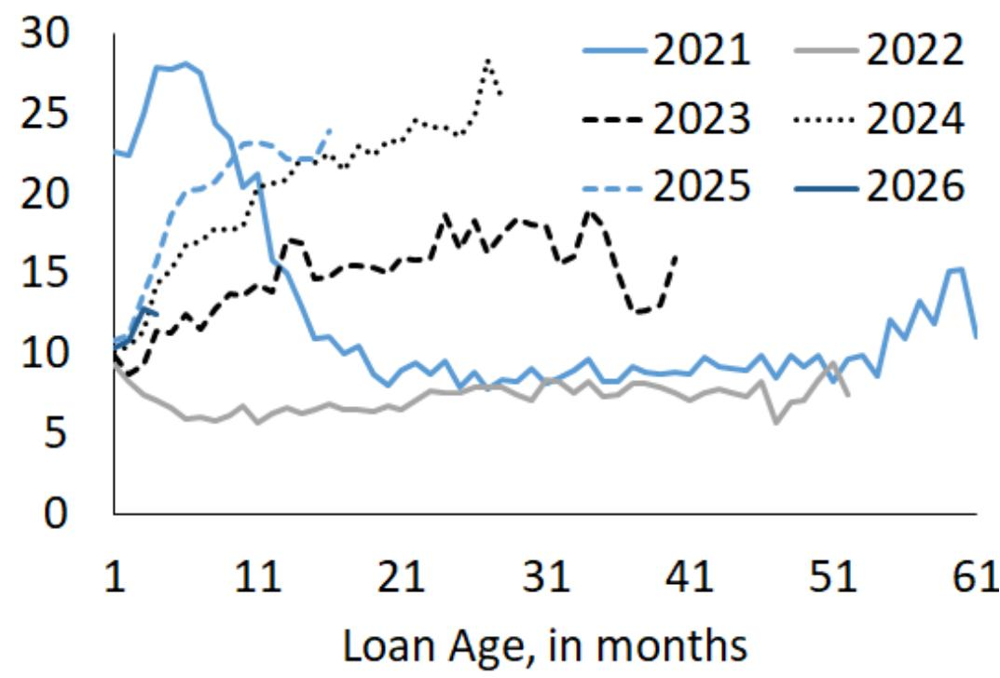

line chart

| Loan Age, in months | 2021 | 2022 | 2023 | 2024 | 2025 | 2026 |
| ------------------- | ---- | ---- | ---- | ---- | ---- | ---- |
| 1                   | 10   | 9    | 9    | 10   | 10   | 10   |
| 11                  | 28   | 6    | 14   | 18   | 23   | 23   |
| 21                  | 10   | 7    | 15   | 24   | 23   | 23   |
| 31                  | 8    | 7    | 18   | 28   | 23   | 23   |
| 41                  | 9    | 7    | 13   | 24   | 23   | 23   |
| 51                  | 9    | 9    | 9    | 24   | 23   | 23   |
| 61                  | 15   | 11   | 9    | 24   | 23   | 23   |

1mo-CPR, Prime  
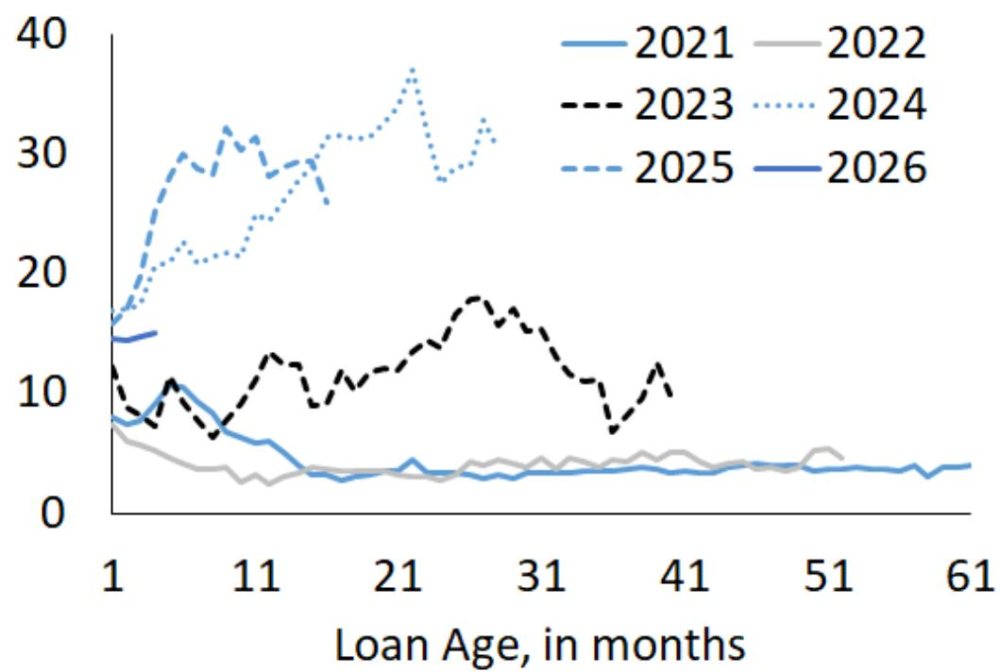

line chart

| Loan Age, in months | 2021 | 2022 | 2023 | 2024 | 2025 | 2026 |
| ------------------- | ---- | ---- | ---- | ---- | ---- | ---- |
| 1                   | 8    | 7    | 11   | 15   | 16   | 14   |
| 11                  | 6    | 3    | 13   | 28   | 30   | 15   |
| 21                  | 3    | 3    | 18   | 37   | 35   | 16   |
| 31                  | 3    | 4    | 17   | 32   | 30   | 17   |
| 41                  | 3    | 4    | 10   | 28   | 25   | 18   |
| 51                  | 3    | 4    | 5    | 25   | 20   | 19   |
| 61                  | 3    | 4    | 4    | 20   | 15   | 20   |

  
Source: Intex, DB

- Prepays. Non-QM: 2024 vintage non-QM 1-month CPRs reach the mid 20% range by 2 years; 2025 CPRs have tracked 2024, starting at around \~10% and ramping higher with seasoning (\~25% today). 2026 Vintage is at \~12% today.  
Prime RMBS: 2024 vintage 1mo CPRs are now in 30% area. 2025 Vintage is in Mid 20's and 2026 started at \~15% speed.

## Appendix 1 Important Disclosures

## \*Other information available upon request

\*Prices are current as of the end of the previous trading session unless otherwise indicated and are sourced from local exchanges via Reuters, Bloomberg and other vendors. Other information is sourced from DB, subject companies, and other sources. For further information regarding disclosures relevant to DB, please visit our global disclosure look-up page on our website at https://research.db.com/Research/Disclosures/FICCDisclosures. Aside from within this report, important risk and conflict disclosures can also be found at https://research.db.com/Research/Disclosures/Disclaimer. Investors are strongly encouraged to review this information before investing.

## Analyst Certification

The views expressed in this report accurately reflect the personal views of the undersigned lead analyst(s). In addition, the undersigned lead analyst(s) has not and will not receive any compensation for providing a specific recommendation or view in this report. Ed Reardon, Doug Runte, Conor O-Toole, Kayvan Darouian, Bipul Sinha, Jamie Flannick, Nick Huang.

## Additional Information

The information and opinions in this report were prepared by DB AG or one of its affiliates (collectively "DB"). Though the information herein is believed to be reliable and has been obtained from public sources believed to be reliable, DB makes no representation as to its accuracy or completeness. Hyperlinks to third-party websites in this report are provided for reader convenience only. DB neither endorses the content nor is responsible for the accuracy or security controls of those websites.

If you use the services of DB in connection with a purchase or sale of a security that is discussed in this report, or is included or discussed in another communication (oral or written) from a DB analyst, DB may act as principal for its own account or as agent for another person.

DB may consider this report in deciding to trade as principal. It may also engage in transactions, for its own account or with customers, in a manner inconsistent with the views taken in this research report. Others within DB, including strategists, sales staff and other analysts, may take views that are inconsistent with those taken in this research report. DB issues a variety of research products, including fundamental analysis, equity-linked analysis, quantitative analysis and trade ideas. Recommendations contained in one type of communication may differ from recommendations contained in others, whether as a result of differing time horizons, methodologies, perspectives or otherwise. DB and/or its affiliates may also be holding debt or equity securities of the issuers it writes on. Analysts are paid in part based on the profitability of DB AG and its affiliates, which includes investment banking, trading and principal trading revenues.

Opinions, estimates and projections constitute the current judgment of the author as of the date of this report. They do not necessarily reflect the opinions of DB and are subject to change without notice. DB provides liquidity for buyers and sellers of securities issued by the companies it covers. DB analysts sometimes have shorter-term trade ideas that may be inconsistent with DB's existing longer-term ratings. Some trade ideas for equities are listed as Catalyst Calls ideas on the Research Website (https://research.db.com/Research/), and can be found on the general coverage list and also on the covered company's page. A Catalyst Call idea represents a high-conviction belief by an analyst that a stock will outperform or underperform the market and/or a specified sector over a time frame of no less than two weeks and no more than three months. In addition to Catalyst Calls ideas, analysts may occasionally discuss with our clients, and with DB salespersons and traders, trading strategies or ideas that reference catalysts or events that may have a near-term or medium-term impact on the market price of the securities discussed in this report, which impact may be directionally counter to the analysts' current 12-month view of total return or investment return as described herein. DB has no obligation to update, modify or amend this report or to otherwise notify a recipient thereof if an opinion, forecast or estimate changes or becomes inaccurate. Coverage and the frequency of changes in market conditions and in both general and company-specific economic prospects make it difficult to update research at defined intervals. Updates are at the sole discretion of the coverage analyst or of the Research Department Management, and the majority of reports are published at irregular intervals. This report is provided for informational purposes only and does not take into account the particular investment objectives, financial situations, or needs of individual clients. It is not an offer or a solicitation of an offer to buy or sell any financial instruments or to participate in any particular trading strategy. Target prices are inherently imprecise and a product of the analyst's judgment. The financial instruments discussed in this report may not be suitable for all investors, and investors must make their own informed investment decisions. Prices and availability of financial instruments are subject to change without notice, and investment transactions can lead to losses as a result of price fluctuations and other factors. If a financial instrument is denominated in a currency other than an investor's currency, a change in exchange rates may adversely affect the investment. Past performance is not necessarily indicative of future results. Performance calculations exclude transaction costs, unless otherwise indicated. Unless otherwise indicated, prices are current as of the end of the previous trading session and are sourced from local exchanges via Reuters, Bloomberg and other vendors. Data is also sourced from DB, subject companies, and other parties. Artificial intelligence tools may be used in the preparation of this material, including but not limited to assist in fact-finding, data analysis, pattern recognition, content drafting and editorial corrections pertaining to research material.

The DB Department is independent of other business divisions of the Bank. Details regarding our organizational arrangements and information barriers we have to prevent and avoid conflicts of interest with respect to our research are available on our website (https://research.db.com/Research/) under Disclaimer.

Macroeconomic fluctuations often account for most of the risks associated with exposures to instruments that promise to pay fixed or variable interest rates. For an investor who is long fixed-rate instruments (thus receiving these cash flows), increases in interest rates naturally lift the discount factors applied to the expected cash flows and thus cause a loss. The longer the maturity of a certain cash flow and the higher the move in the discount factor, the higher will be the loss. Upside surprises in inflation, fiscal funding needs, and FX depreciation rates are among the most common adverse macroeconomic shocks to receivers. But counterparty exposure, issuer creditworthiness, client segmentation, regulation (including changes in assets holding limits for different types of investors), changes in tax policies, currency convertibility (which may constrain currency conversion, repatriation of profits and/or liquidation of positions), and settlement issues related to local clearing houses are also important risk factors. The sensitivity of fixed-income instruments to macroeconomic shocks may be mitigated by indexing the contracted cash flows to inflation, to FX depreciation, or to specified interest rates – these are common in emerging markets. The index fixings may – by construction – lag or mis-measure the actual move in the underlying variables they are intended to track. The choice of the proper fixing (or metric) is particularly important in swaps markets, where floating coupon rates (i.e., coupons indexed to a typically short-dated interest rate reference index) are exchanged for fixed coupons. Funding in a currency that differs from the currency in which coupons are denominated carries FX risk. Options on swaps (swaptions) the risks typical to options in addition to the risks related to rates movements.

Derivative transactions involve numerous risks including market, counterparty default and illiquidity risk. The appropriateness of these products for use by investors depends on the investors' own circumstances, including their tax position, their regulatory environment and the nature of their other assets and liabilities; as such, investors should take expert legal and financial advice before entering into any transaction similar to or inspired by the contents of this publication. The risk of loss in futures trading and options, foreign or domestic, can be substantial. As a result of the high degree of leverage obtainable in futures and options trading, losses may be incurred that are greater than the amount of funds initially deposited – up to theoretically unlimited losses. Trading in options involves risk and is not suitable for all investors. Prior to buying or selling an option, investors must review the "Characteristics and Risks of Standardized Options", at https://www.theocc.com/company-information/documents-and-archives/options-disclosure-document. If you are unable to access the website, please contact your DB representative for a copy of this important document.

Participants in foreign exchange transactions may incur risks arising from several factors, including the following: (i) exchange rates can be volatile and are subject to large fluctuations; (ii) the value of currencies may be affected by numerous market factors, including world and national economic, political and regulatory events, events in equity and debt markets and changes in interest rates; and (iii) currencies may be subject to devaluation or government-imposed exchange controls, which could affect the value of the currency. Investors in securities such as ADRs, whose values are affected by the currency of an underlying security, effectively assume currency risk.

Unless governing law provides otherwise, all transactions should be executed through the DB entity in the investor's home jurisdiction. Aside from within this report, important conflict disclosures can also be found at https://research.db.com/Research/ on each company's research page or under the 'Disclosures' tab. Investors are strongly encouraged to review this information before investing.

DB (which includes DB AG, its branches and affiliated companies) is not acting as a financial adviser, consultant or fiduciary to you or any of your agents (collectively, "You" or "Your") with respect to any information provided in this report. DB does not provide investment, legal, tax or accounting advice, DB is not acting as your impartial adviser, and does not express any opinion or recommendation whatsoever as to any strategies, products or any other information presented in the materials. Information contained herein is being provided solely on the basis that the recipient will make an independent assessment of the merits of any investment decision, and it does not constitute a recommendation of, or express an opinion on, any product or service or any trading strategy.

The information presented is general in nature and is not directed to retirement accounts or any specific person or account type, and is therefore provided to You on the express basis that it is not advice, and You may not rely upon it in making Your decision. The information we provide is being directed only to persons we believe to be financially sophisticated, who are capable of evaluating investment risks independently, both in general and with regard to particular transactions and investment strategies, and who understand that DB has financial interests in the offering of its products and services. If this is not the case, or if You are an IRA or other retail investor receiving this directly from us, we ask that you inform us immediately.

In July 2018, DB revised its rating system for short term ideas whereby the branding has been changed to Catalyst Calls ("CC") from SOLAR ideas; the rating categories for Catalyst Calls originated in the Americas region have been made consistent with the categories used by Analysts globally; and the effective time period for CCs has been reduced from a maximum of 180 days to 90 days.

United States: Approved and/or distributed by DB Securities Incorporated, a member of FINRA and SIPC. Analysts located outside of the United States are employed by non-US affiliates and are not registered/qualified as research analysts with FINRA.

European Economic Area (exc. United Kingdom): Approved and/or distributed by DB AG, a joint stock corporation with limited liability incorporated in the Federal Republic of Germany with its principal office in Frankfurt am Main. DB AG is authorized under German Banking Law and is subject to supervision by the European Central Bank and by BaFin, Germany's Federal Financial Supervisory Authority.

United Kingdom: Approved and/or distributed by DB AG acting through its London Branch at 21 Moorfields, London EC2Y 9DB. DB AG in the United Kingdom is authorised by the Prudential Regulation Authority and is subject to limited regulation by the Prudential Regulation Authority and Financial Conduct Authority. Details about the extent of our authorisation and regulation are available on request.

Hong Kong SAR: Distributed by DB AG, Hong Kong Branch except for any research content relating to futures contracts within the meaning of the Hong Kong Securities and Futures Ordinance Cap. 571. Research reports on such futures contracts are not intended for access by persons who are located, incorporated, constituted or resident in Hong Kong. The author(s) of a research report, and the entities for which they act and/or are affiliated with, may not be licensed to carry on regulated activities in Hong Kong and, if not licensed, do not hold themselves out as being able to do so. The provisions set out above in the “Additional Information” section shall apply to the fullest extent permissible by local laws and regulations, including without limitation the Code of Conduct for Persons Licensed or Registered with the Securities and Futures Commission. This report is intended for distribution only to “professional investors” as defined in Part 1 of Schedule 1 of the SFO. This document must not be acted or relied on by persons who are not professional investors. Any investment or investment activity to which this document relates is only available to professional investors and will be engaged only with professional investors.

India: Prepared by Deutsche Equities India Private Limited (DEIPL) having CIN: U65990MH2002PTC137431 and registered office at 14th Floor, The Capital, C-70, G Block, Bandra Kurla Complex, Mumbai (India) 400051. Tel: +91 22 7180 4444. It is registered by the Securities and Exchange Board of India (SEBI) as a Stock broker bearing registration no.: INZ000252437; Merchant Banker bearing SEBI Registration no.: INM000010833 and Research Analyst bearing SEBI Registration no.: INH000001741. DEIPL's Compliance / Grievance officer is Ms. Rashmi Poddar (Tel: +91 22 7180 4929, email ID: complaints.deipl@db.com). Registration granted by SEBI and certification from NISM in no way guarantee performance of DEIPL or provide any assurance of returns to investors. Investment in securities market are subject to market risks. Read all the related documents carefully before investing. DEIPL may have received administrative warnings from the SEBI for breaches of Indian regulations. DB and/or its affiliate(s) may have debt holdings or positions in the subject company. With regard to information on associates, please refer to the "Shareholdings" section in the Annual Report at: https://www.db.com/ir/en/annual-reports.htm . For latest India research audit report, refer https://country.db.com/india/deutsche-equities-india/index?language\_id=1.

Japan: Approved and/or distributed by Deutsche Securities Inc.(DSI). Registration number - Registered as a financial instruments dealer by the Head of the Kanto Local Finance Bureau (Kinsho) No. 117. Member of associations: JSDA, Type II Financial Instruments Firms Association and The Financial Futures Association of Japan. Commissions and risks involved in stock transactions - for stock transactions, we charge stock commissions and consumption tax by multiplying the transaction amount by the commission rate agreed with each customer. Stock transactions can lead to losses as a result of share price fluctuations and other factors. Transactions in foreign stocks can lead to additional losses stemming from foreign exchange fluctuations. We may also charge commissions and fees for certain categories of investment advice, products and services. Recommended investment strategies, products and services carry the risk of losses to principal and other losses as a result of changes in market and/or economic trends, and/or fluctuations in market value. Before deciding on the purchase of financial products and/or services, customers should carefully read the relevant disclosures, prospectuses and other documentation. "Moody's", "Standard & Poor's", and "Fitch" mentioned in this report are not registered credit rating agencies in Japan unless Japan or "Nippon" is specifically designated in the name of the entity. Reports on Japanese listed companies not written by analysts of DSI are written by DB Group's analysts with the coverage companies specified by DSI. Some of the foreign securities stated on this report are not disclosed according to the Financial Instruments and Exchange Law of Japan. Target prices set by DB's equity analysts are based on a 12-month forecast period.

Korea: Distributed by Deutsche Securities Korea Co.

South Africa: DB AG Johannesburg is incorporated in the Federal Republic of Germany (Branch Register Number in South Africa: 1998/003298/10).

Singapore: This report is issued by DB AG, Singapore Branch (One Raffles Quay #18-00 South Tower Singapore 048583, +65 6423 8001), which may be contacted in respect of any matters arising from, or in connection with, this report. Where this report is issued or promulgated by DB in Singapore to a person who is not an accredited investor, expert investor or institutional investor (as defined in the applicable Singapore laws and regulations), they accept legal responsibility to such person for its contents.

Taiwan: Information on securities/investments that trade in Taiwan is for your reference only. Readers should independently evaluate investment risks and are solely responsible for their investment decisions. DB may not be distributed to the Taiwan public media or quoted or used by the Taiwan public media without written consent. Information on securities/instruments that do not trade in Taiwan is for informational purposes only and is not to be construed as a recommendation to trade in such securities/instruments.

Qatar: DB AG in the Qatar Financial Centre (registered no. 00032) is regulated by the Qatar Financial Centre Regulatory Authority. DB AG - QFC Branch may undertake only the financial services activities that fall within the scope of its existing QFCRA license. Its principal place of business in the QFC: Qatar Financial Centre, Tower, West Bay, Level 5, PO Box 14928, Doha, Qatar. This information has been distributed by DB AG. Related financial products or services are only available only to Business Customers, as defined by the Qatar Financial Centre Regulatory Authority.

Russia: The information, interpretation and opinions submitted herein are not in the context of, and do not constitute, any appraisal or evaluation activity requiring a license in the Russian Federation.

Kingdom of Saudi Arabia: Deutsche Securities Saudi Arabia (DSSA) is a closed joint stock company authorized by the Capital Market Authority of the Kingdom of Saudi Arabia with a license number (No. 37-07073) to conduct the following business activities: Dealing, Arranging, Advising, and Custody activities. . DSSA registered office is at Faisaliah Tower, 17th floor, King Fahad Road - Al Olaya District Riyadh, Kingdom of Saudi Arabia P.O. Box 301806.

United Arab Emirates: DB AG in the Dubai International Financial Centre (registered no. 00045) is regulated by the Dubai Financial Services Authority. DB AG - DIFC Branch may only undertake the financial services activities that fall within the scope of its existing DFSA license. Principal place of business in the DIFC: Dubai International Financial Centre, The Gate Village, Building 5, PO Box 504902, Dubai, U.A.E. This information has been distributed by DB AG. Related financial products or services are available only to Professional Clients, as defined by the Dubai Financial Services Authority.

Australia and New Zealand: This research is intended only for "wholesale clients" within the meaning of the Australian Corporations Act and New Zealand Financial Advisors Act, respectively. Please refer to Australian specific research disclosures and related information at https://www.dbresearch.com/PROD/RPS\_EN-PROD/PROD000000000521304.xhtml. Where research refers to any particular financial product recipients of the research should consider any product disclosure statement, prospectus or other applicable disclosure document before making any decision about whether to acquire the product. In preparing this report, the primary analyst or an individual who assisted in the preparation of this report has likely been in contact with the company that is the subject of this research for confirmation/clarification of data, facts, statements, permission to use company-sourced material in the report, and/or site-visit attendance. Without prior approval from Research Management, analysts may not accept from current or potential Banking clients the costs of travel, accommodations, or other expenses incurred by analysts attending site visits, conferences, social events, and the like. Similarly, without prior approval from Research Management and Anti-Bribery and Corruption ("ABC") team, analysts may not accept perks or other items of value for their personal use from issuers they cover.

Additional information relative to securities, other financial products or issuers discussed in this report is available upon request. This report may not be reproduced, distributed or published without DB's prior written consent.

Backtested, hypothetical or simulated performance results have inherent limitations. Unlike an actual performance record based on trading actual client portfolios, simulated results are achieved by means of the retroactive application of a backtested model itself designed with the benefit of hindsight. Taking into account historical events the backtesting of performance also differs from actual account performance because an actual investment strategy may be adjusted any time, for any reason, including a response to material, economic or market factors. The backtested performance includes hypothetical results that do not reflect the reinvestment of dividends and other earnings or the deduction of advisory fees, brokerage or other commissions, and any other expenses that a client would have paid or actually paid. No representation is made that any trading strategy or account will or is likely to achieve profits or losses similar to those shown. Alternative modeling techniques or assumptions might produce significantly different results and prove to be more appropriate. Past hypothetical backtest results are neither an indicator nor guarantee of future returns. Actual results will vary, perhaps materially, from the analysis.

The method for computing individual E,S,G and composite ESG scores set forth herein is a novel method developed by the Research department within DB AG, computed using a systematic approach without human intervention. Different data providers, market sectors and geographies approach ESG analysis and incorporate the findings in a variety of ways. As such, the ESG scores referred to herein may differ from equivalent ratings developed and implemented by other ESG data providers in the market and may also differ from equivalent ratings developed and implemented by other divisions within the DB Group. Such ESG scores also differ from other ratings and rankings that have historically been applied in research reports published by DB AG. Further, such ESG scores do not represent a formal or official view of DB AG.

It should be noted that the decision to incorporate ESG factors into any investment strategy may inhibit the ability to participate in certain investment opportunities that otherwise would be consistent with your investment objective and other principal investment strategies. The returns on a portfolio consisting primarily of sustainable investments may be lower or higher than portfolios where ESG factors, exclusions, or other sustainability issues are not considered, and the investment opportunities available to such portfolios may differ. Companies may not necessarily meet high performance standards on all aspects of ESG or sustainable investing issues; there is also no guarantee that any company will meet expectations in connection with corporate responsibility, sustainability, and/or impact performance.

Copyright © 2026 DB AG