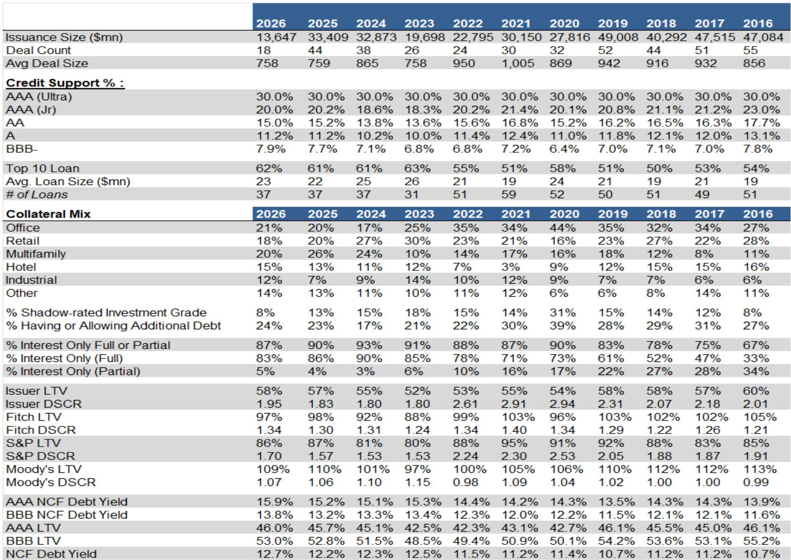
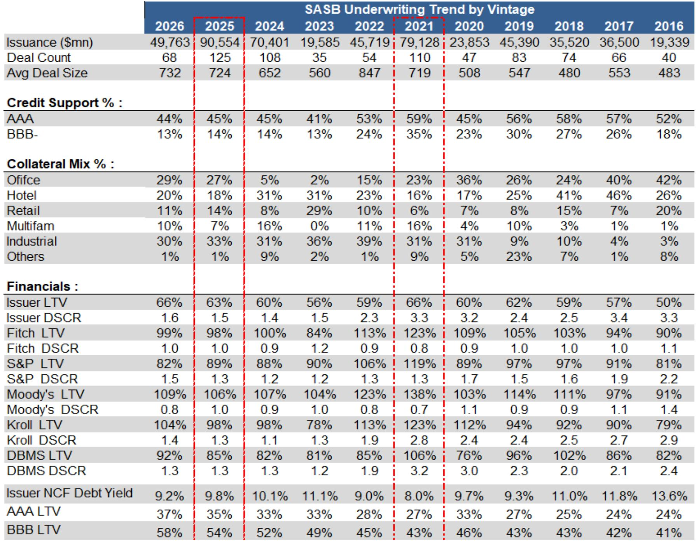
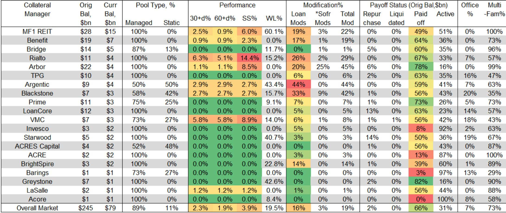

# Securitized Markets Are Entering a Demand-Surge Regime That Will Outweigh Credit Deterioration

The securitized credit market is approaching a trillion dollars in gross issuance for the first time in 2026, but the headline number obscures a more important structural reality: net supply will reach only $270 billion. This is not a supply-driven story. It is a demand-surge story, and the implications for asset allocation, credit selection, and portfolio construction over the next six months are profound.

The central argument of this mid-year outlook is that securitized markets are experiencing a demand-surge pricing environment driven by structural inflows from insurers and annuity products, supported by favorable demographic tailwinds and a resilient macro backdrop. Credit quality is softening in consumer and commercial real estate sectors, but the sheer weight of capital seeking yield in a higher-for-longer rate environment will compress spreads further and compress the differentiation between sectors. The result is a market where carry trumps credit conviction, where AAA spreads remain anchored near historical tights, and where subordinate tranches become the battleground for yield-hungry institutional investors.

This is not a market for broad-based beta exposure. It is a market where security selection, sector rotation, and timing of credit resolution will determine relative performance. The demand surge is real, but it is not indiscriminate. Understanding where the inflows are going, which sectors are structurally supported, and where credit stress is merely deferred rather than resolved is the difference between harvesting carry and absorbing losses.

## The $500 Billion Inflow Wall Is Reshaping Securitized Market Dynamics

The demand-side picture for securitized credit in 2026 is extraordinary by any historical standard. Total investment-grade credit inflows are projected to reach $500 billion, composed of approximately $300 billion in fixed annuity sales and $200 billion in IG mutual fund and bond fund inflows. Securitized products are expected to capture roughly $200 billion of this total, a share that reflects both the yield advantage over corporate credit and the growing comfort of institutional investors with structured product complexity.

What makes this demand surge structurally significant is its source. Fixed annuity sales are being driven by a demographic wave that is only beginning to express itself. The 60-plus population in the United States now stands at 84 million people, over 75 percent of whom own their homes. This cohort has benefited from a 5.5x increase in home prices over 40 years and a 70x increase in the S&P 500 over the same period. They control 60 to 70 percent of financial wealth in the country. And critically, they are underinvested in fixed income.

The average 10-year U.S. Treasury yield over the past 20 years has been 2.9 percent. At current levels above 4.5 percent, the incentive for retirees and near-retirees to lock in yields through annuity products is powerful. The average fixed annuity buyer is 62 years old, and insurers are offering rates of approximately 5.5 percent today. These products allow investors to defer taxes on income, making them particularly attractive in a higher-rate environment. The result is a structural flow into insurance general accounts that will persist regardless of what the Federal Reserve does in the second half of 2026.

The second-order implication is that insurers, who already hold over $1 trillion in credit-sensitive securitized assets, will continue to increase their allocation. Their current holdings span $200 billion in non-agency CMBS, $186 billion in non-agency RMBS, $311 billion in CLOs, and $398 billion in ABS. But the ABS category is itself a misnomer, containing warehouse finance facilities, solar and data center ABS, whole-business securitizations, and royalty-backed structures. Insurers are not just buying traditional paper. They are moving up the complexity curve to achieve yield, and this trend will accelerate as annuity inflows continue.

## Securitized Spreads Are Near Historical Tights, But Carry Remains the Dominant Return Driver

The spread environment entering the second half of 2026 is characterized by compression across the board. AAA securitized spreads are trading near the low end of their three-year ranges across virtually every sector. CMBS AAA five-year spreads are at 70 basis points against a three-year average of 105. CLO AAA spreads are at 105 basis points against a three-year average of 125. Non-QM AAA spreads are at 115 basis points against a three-year average of 145. Prime auto AAA three-year spreads are at 30 basis points against a three-year average of 50.

The question every investor should be asking is whether this tightness is justified by fundamentals or merely a reflection of technical demand overwhelming supply. The answer is nuanced. For AAA tranches, the technical argument is compelling. Net supply is only $270 billion against $500 billion in inflows. The structural bid from insurers and annuity products is not cyclical; it is demographic. And the macroeconomic backdrop, while not without risks, remains supportive with 2.2 percent real GDP growth forecast and a labor market that continues to add jobs.

But the tightness in subordinate tranches tells a different story. BBB CMBS spreads at 550 basis points are still wide relative to historical averages, but they are at the low end of the three-year range. BBB CLO spreads at 280 basis points are near tights. The risk in these tranches is not that spreads blow out from current levels in a disorderly fashion. It is that the benign credit environment masks deteriorating fundamentals that will only become apparent as refinancing events occur and loss severities crystallize.

The forecast from the underlying research is telling. AAA spreads are expected to remain largely unchanged through year-end across most sectors, with the notable exception of non-QM RMBS, where AAA spreads are forecast to tighten by 7 basis points. BBB spreads, by contrast, are expected to widen modestly across CMBS, CLOs, and auto ABS, with CMBS BBB spreads forecast to widen by 50 basis points. This is a market that is pricing in a benign outcome for senior tranches and a more uncertain outcome for subordinate risk. The divergence between AAA and BBB spread trajectories is itself a signal about where the market sees genuine credit risk.

## Commercial Real Estate Credit Resolution Is Accelerating, But Governance Remains a Structural Weakness

The CMBS market in 2026 is defined by two competing narratives. On the one hand, technical conditions are supportive. Net supply is minimal, with $160 billion in gross issuance offset by $145 billion in paydowns, leaving net supply of only $15 billion. Investor demand remains firm, and AAA spreads are expected to remain range-bound at 75 to 80 basis points. On the other hand, credit stress in the underlying collateral is moving from extension to realization, and the pace of loss recognition is accelerating.

Conduit 60-plus day delinquencies continue to rise, driven primarily by legacy office loans and recent multifamily loans. The headline delinquency rate understates the true level of stress because proactive extensions, modifications, and denominator growth have kept reported delinquencies artificially low. Office loans in particular require more A/B modifications to reflect the basis reset that has already occurred in the underlying real estate market. Special servicers are working through a distressed backlog, and liquidation volumes and severities are increasing.

The governance of CMBS workouts is a structural weak link that the report identifies with unusual candor. Workout outcomes are influenced by conflicted control rights, opaque modification processes, and delayed loss recognition. The incentives of the parties involved are not always aligned with achieving the best outcome for bondholders. The report proposes cleaner incentives, proper accountability, faster transparency, and clearer documentation that limits discretion in workout outcomes. This is not a theoretical concern. As loss severities increase, the quality of the workout process will directly determine recovery rates for subordinate bondholders.

The relative value recommendation to prefer SASB mezzanine over conduit is grounded in this governance concern. SASB transactions offer better collateral transparency and sponsor selection, even though the risk is binary. In an environment where credit stress is concentrated in specific property types and geographies, the ability to underwrite individual loans and sponsor quality becomes a competitive advantage.

## Consumer ABS Credit Is Deteriorating, But the Demand Surge Will Mask Weakness in Most Tranches

The consumer ABS sector presents the most interesting tension between fundamentals and technicals in the securitized market. The underlying research downgrades the consumer sector from B+ to B, a modest downgrade that reflects a still-positive backdrop but signals that credit is deteriorating in specific subsectors and in deep subordinate tranches. This is not a broad-based consumer credit crisis. It is a normalization from historically strong credit performance, and it will manifest in higher loss severities rather than widespread defaults.

The demand surge, however, is likely to overwhelm this credit deterioration for most tranches. AAA auto ABS spreads are at 30 to 45 basis points depending on the subsector, and the forecast calls for only 2 to 5 basis points of widening by year-end. The technical bid from insurers and annuity products is powerful enough to absorb modest credit deterioration without significant spread repricing. The risk is concentrated in the subordinate tranches, where loss absorption will be tested as delinquencies rise.

Non-QM RMBS stands out as a relative value opportunity within the consumer space. AAA non-QM spreads are forecast to tighten by 7 basis points to 105, and BBB non-QM spreads are forecast to tighten by 15 basis points to 155. This is the only sector where spreads are expected to tighten rather than widen across both senior and subordinate tranches. The rationale is that non-QM origination is benefiting from a structural shift in the mortgage market, with borrowers who cannot access agency products turning to the private label market. The credit performance of non-QM loans originated in the post-COVID period has been strong, and investor demand for the asset class is growing.

## What the Report Does Not Fully Answer Yet: The Rate Shock Scenario and Its Implications for Refinancing

The mid-year outlook is comprehensive in its coverage of demand dynamics and credit trends, but it leaves several meaningful questions open for investors to consider. The most important is the rate scenario. The forecast assumes the Federal Reserve remains on hold indefinitely with a risk skew toward hikes, and the 10-year U.S. Treasury yield is forecast to reach 4.7 percent by year-end. But what happens if the rate scenario proves too benign?

The report acknowledges that higher rates will create refinancing stress for CLOs and CMBS, but it does not fully explore the second-order implications of a sustained move higher in rates. If the 10-year U.S. Treasury yield moves above 5 percent, the refinancing economics for commercial real estate loans deteriorate significantly, particularly for the wave of multifamily loans that were originated at low fixed rates in 2021 and 2022. The extension risk in CMBS becomes realization risk, and loss severities increase.

Similarly, the CLO market faces a refinancing challenge that the report identifies but does not fully quantify. Higher rates increase the cost of debt for CLO managers, compressing arbitrage and potentially reducing new issuance. The CLO market has been a significant source of demand for leveraged loans, and any disruption to CLO issuance would have ripple effects through the broader credit market. The report projects $145 billion in CLO issuance for 2026, but this projection is contingent on the rate environment remaining supportive.

The other open question is the trajectory of oil prices. The report notes that oil at $150 per barrel is a risk to consumer spending and could reduce real GDP growth to 1.75 percent. This scenario would have direct implications for auto ABS, where higher gasoline prices reduce disposable income and increase delinquency risk. It would also affect CMBS exposure to energy-dependent markets and property types. The report does not model this scenario in detail, leaving investors to assess the probability and impact for themselves.

## A Decision Framework for the Second Half of 2026: Carry, Sector Rotation, and Subordinate Selection

For investors navigating the securitized market in the second half of 2026, the analytical framework must integrate three dimensions: the demand surge, the credit cycle, and the rate environment. The following decision framework synthesizes the report's insights into actionable considerations.

First, prioritize carry over spread compression. AAA spreads are near historical tights across most sectors, and the potential for further tightening is limited. The return in senior tranches will come from carry, not from spread compression. This means that absolute yield levels matter more than relative spread movements. Non-QM RMBS AAA tranches offer a compelling combination of carry and spread tightening potential. CLO AAA tranches offer attractive carry with relatively low credit risk. CMBS AAA tranches offer stability but limited upside.

Second, rotate toward sectors with structural demand support. The demand surge is not uniform across securitized sectors. Insurers and annuity products have specific preferences driven by regulatory capital treatment, yield requirements, and maturity matching. Non-QM RMBS benefits from strong investor demand and favorable supply dynamics. CLOs benefit from the structural bid from insurers and the growing comfort of institutional investors with the asset class. Consumer ABS benefits from the sheer scale of the market and the diversity of subsectors. CMBS, by contrast, faces headwinds from credit concerns and governance issues that may limit demand for subordinate tranches.

Third, be selective in subordinate tranches and prepare for dispersion. The credit cycle is turning in consumer and commercial real estate, but the turning is gradual and uneven. Subordinate tranches that offer adequate compensation for the credit risk are available, particularly in CMBS BBB tranches where spreads are forecast to widen by 50 basis points. The key is to focus on transactions with strong collateral quality, transparent structures, and alignment of incentives between issuers and investors. In CMBS, this means preferring SASB over conduit. In CLOs, this means focusing on managers with strong track records and conservative underwriting.

Fourth, monitor the rate scenario closely and prepare for a tail risk of higher rates. If the 10-year U.S. Treasury yield moves above 5 percent, the refinancing stress in CMBS and CLOs will accelerate, and loss severities will increase. This scenario would favor senior tranches over subordinate tranches and would favor sectors with shorter duration and faster paydown profiles. Auto ABS and credit card ABS, with their short average lives and structural protections, would outperform longer-duration assets like CMBS and non-QM RMBS.

## The Full Picture Requires Granular Sector Analysis and Original Data

The mid-year outlook provides a comprehensive framework for understanding the securitized market in 2026, but the full picture requires access to the detailed sector-by-sector analysis, the original spread data, and the granular issuance forecasts that underpin the conclusions. The report contains charts on cumulative IG fund flows versus fixed annuity sales, insurance bond holdings by sector, and securitized spread forecasts that are essential for portfolio construction.

Join the community to read the full report and review the original charts.

*This article is for learning and discussion only and does not constitute investment advice.*

Personal reading notes and learning share only. Not investment advice.

