## Investor Presentation | Asia Pacific

# Asia Summer School: Asia Robotics and Humanoids

Humanoids represent the largest embodied AI opportunity, with a projected global TAM of US\$7.5 trillion by 2050, based on MS forecasts. The industry remains at an early stage, but we believe small-scale commercialization will start this year.

## Recent reports:

• 2026 Outlook – Humanoids: Commercialization  
• China Humanoids Survey: High Willingness to Adopt Meets Premature Products  
• Humanoid Horizons: Humanoids Coming to Your Bloomberg Screen  
- Humanoids and Robots – The Next Chapter in China’s Dominance in Global Manufacturing

MS ASIA LIMITED+

## Sheng Zhong

Equity Analyst

Sheng.Zhong@morganstanley.com +852 2239-7821

MS & CO. INTERNATIONAL PLC, SEOUL BRANCH+

## Young Suk Shin

Equity Analyst

Young.Shin@morganstanley.com +82 2 399-4994

MS ASIA LIMITED+

## Carlos Chai

Research Associate

Carlos.Chai@morganstanley.com +852 3963-3180

## Chelsea Wang

Equity Analyst

Jinlin.Wang@morganstanley.com +852 2239-1118

MS & CO. INTERNATIONAL PLC, SEOUL BRANCH+

## Chan Park

Research Associate

Chan.Park1@morganstanley.com +82 2 399-9920

text_image

Asia Summer School 2026

## CHINA INDUSTRIALS

Asia Pacific

Industry View In-Line

## S. KOREA AUTOS & SHARED MOBILITY

Asia Pacific

MS does and seeks to do business with companies covered in MS. As a result, investors should be aware that the firm may have a conflict of interest that could affect the objectivity of MS. Investors should consider MS as only a single factor in making their investment decision.

## For analyst certification and other important disclosures, refer to the Disclosure Section, located at the end of this report.

+= Analysts employed by non-U.S. affiliates are not registered with FINRA, may not be associated persons of the member and may not be subject to FINRA restrictions on communications with a subject company, public appearances and trading securities held by a research analyst account.

Industry View

In-Line

## Asia Summer School 2026

## FOUNDATION

## MS

June 16, 2026

## INVESTOR PRESENTATION

## Asia Summer School: Asia Robotics and Humanoid

Humanoids represent the largest embodied AI opportunity, with a projected global TAM of US\$7.5 trillion by 2050, based on MS forecasts.

The industry remains at an early stage, but we believe small-scale commercialization will start this year.

## MS Asia/Pacific

MS Asia Limited+

Sheng Zhong

Equity Analyst

Sheng.Zhong@morganstanley.com

+852 2239-7821

MS & Co. International plc, Seoul Branch+

Young Suk Shin

Equity Analyst

Young.Shin@morganstanley.com

+82 2 399-4994

MS Asia Limited+

Carlos Chai

Research Associate

Carlos.Chai@morganstanley.com

+852 3963-3180

Chelsea Wang

Equity Analyst

Jinlin.Wang@morganstanley.com

+852 2239-1118

MS & Co. International plc, Seoul Branch+

Chan Park

Research Associate

Chan.Park@morganstanley.com

+82 2 399-9920

MS does and seeks to do business with companies covered in MS. As a result, investors should be aware that the firm may have a conflict of interest that could affect the objectivity of MS. Investors should consider MS as only a single factor in making their investment decision.

For analyst certification and other important disclosures, refer to the Disclosure Section, located at the end of this report.

+= Analysts employed by non-U.S. affiliates are not registered with FINRA, may not be associated persons of the member and may not be subject to FINRA restrictions on communications with a subject company, public appearances and trading securities held by a research analyst account.

## Humanoid Robotics – The Largest Embodied AI Opportunity; 1bn Stock and US\$7.5tn TAM by 2050e

Global humanoid market size and stock  
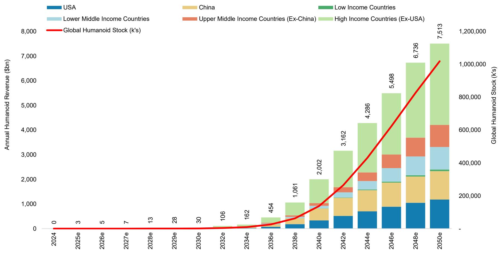

bar-line hybrid

| Year | USA ($bn) | China ($bn) | Low Income Countries ($bn) | Lower Middle Income Countries ($bn) | Upper Middle Income Countries (Ex-China) ($bn) | High Income Countries (Ex-USA) ($bn) | Global Humanoid Stock (k's) |
| :--- | :--- | :--- | :--- | :--- | :--- | :--- | :--- |
| 2024 | 0 | 0 | 0 | 0 | 0 | 0 | 0 |
| 2025e | 3 | 0 | 0 | 0 | 0 | 0 | 0 |
| 2026e | 5 | 0 | 0 | 0 | 0 | 0 | 0 |
| 2027e | 7 | 0 | 0 | 0 | 0 | 0 | 0 |
| 2028e | 13 | 0 | 0 | 0 | 0 | 0 | 0 |
| 2029e | 28 | 0 | 0 | 0 | 0 | 0 | 0 |
| 2030e | 30 | 0 | 0 | 0 | 0 | 0 | 0 |
| 2032e | 106 | 0 | 0 | 0 | 0 | 0 | 0 |
| 2034e | 162 | 0 | 0 | 0 | 0 | 0 | 162 |
| 2036e | 454 | 161 | 161 | 161 | 161 | 161 | 454 |
| 2038e | 1,061 | 344 | 344 | 344 | 344 | 344 | 1,061 |
| 2040e | 2,002 | 568 | 568 | 568 | 568 | 568 | 2,002 |
| 2042e | 3,162 | 836 | 836 | 836 | 836 | 836 | 3,162 |
| 2044e | 4,286 | 1152 | 1152 | 1152 | 1152 | 1152 | 4,286 |
| 2046e | 5,498 | 1478 | 1478 | 1478 | 1478 | 1478 | 5,498 |
| 2048e | 6,736 | 1816 | 1816 | 1816 | 1816 | 1816 | 6,736 |
| 2050e | 7,513 | 2152 | 2152 | 2152 | 2152 | 2152 | 7,513 |
Global Humanoid Stock (k's)

Source: MS estimates. Note: This humanoid sales to external parties, we acknowledge and do not include prototype, internal R&D, and use.

Why Humanoid Robots?  
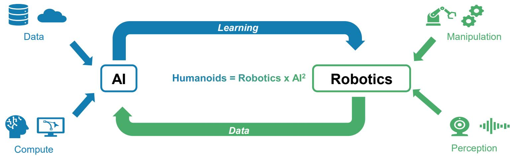

flowchart

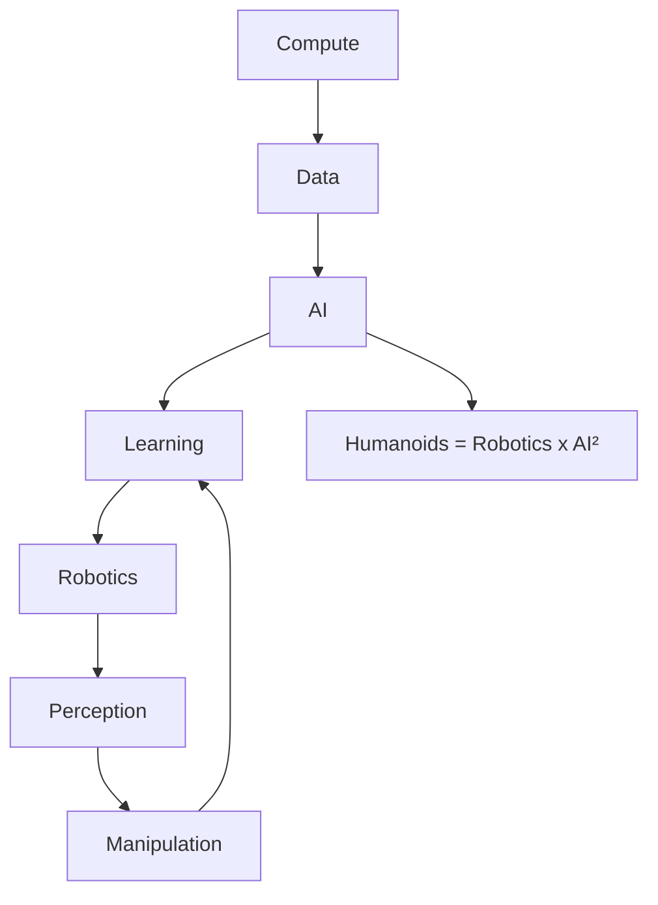
```mermaid
graph TD
  A["Compute"] --> B["Data"]
  B --> C["AI"]
  C --> D["Learning"]
  D --> E["Robotics"]
  E --> F["Perception"]
  F --> G["Manipulation"]
  G --> D
  C --> H["Humanoids = Robotics x AI²"]
```

## Specialized Robotics

+ Technology readily available; Less mechanically and computationally complex  
Highly effective at simple, repetitive tasks that require limited dexterity  
- Ineffective at tasks that require advanced dexterity and/or intelligence  
- May require significant modifications to the workplace to accommodate

## Humanoids

\+ Capable of accomplishing complex tasks that require advanced dexterity and/or intelligence

\+ Limited need to modify existing workplace or methods; Interchangeable with humans.

\- Technology still in development; requires highly-advanced AI and mechanical engineering

\- May require significant training / trial & error

Source: MS.

## What Can Humanoids Do?

## Industrials

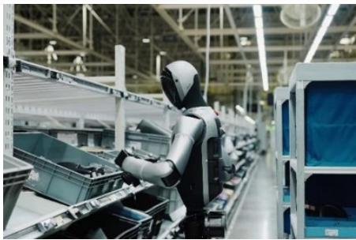

natural_image

Interior view of a modern automated factory with robotic arms and conveyor systems (no visible text or symbols)

Pick and place tasks (material/box carrying)

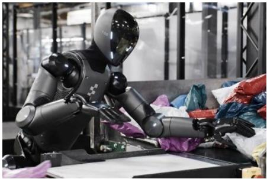

natural_image

Robot handling packages in a warehouse (no visible text or symbols)

Logistic line sorting

Quality inspection/testing (auto, battery, 3C production)
Plug-in assembly

## Commercial/Entertainment

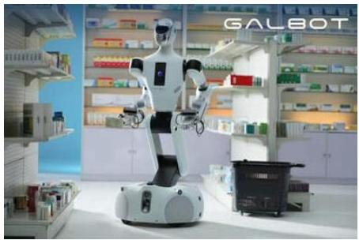

natural_image

Exterior view of a modern office building (no signage)

Unmanned retail/pharma store

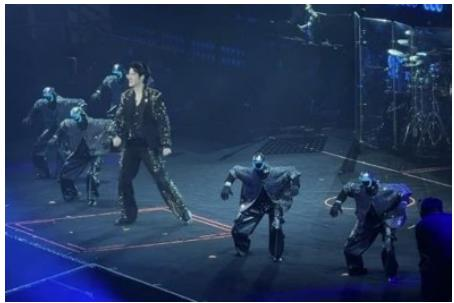

natural_image

Stage performance scene with dancers in dynamic poses under dramatic lighting (no visible text or symbols)

Entertainment – dancing

Reception/shopping guidance
Patrol (police/property management)
Food/grocery delivery

## Household

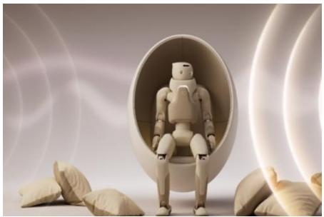

natural_image

3D rendered illustration of a humanoid robot inside an egg-shaped container, surrounded by floating pillows and abstract light effects (no text or symbols)

Companion robot

natural_image

Three people in a meeting around a table with a robot arm, set against a window and greenery (no visible text or symbols)

Helping on household chores

Elderly/assistive care

Health monitoring

Eldercare rehabilitation

## Numerous Companies Across Diverse Backgrounds Have Announced Initiatives in the Humanoid Robotics Business

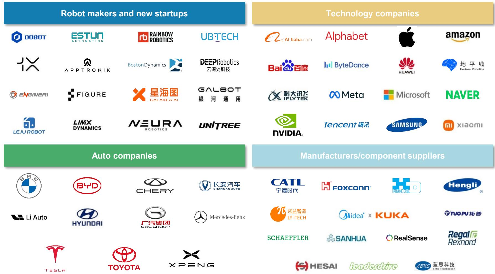

text_image

Robot makers and new startups
Technology companies
DOBOT ESTUN AUTOMATION RAINBOW ROBOTICS UBTECH
APPTRONIK BostonDynamics DEEP Robotics 云深处科技
ENGINEAI FIGURE 星海图 GALAXEA AI GALBOT 银河通用
LEJU ROBOT LIMX DYNAMICS NEURA ROBOTICS UNITREE
Auto companies
Manufacturers/component suppliers
BMW BYD CHERY 长安汽车 CHANGAN AUTO
Li Auto HYUNDAI 广汽集团 GAC GROUP Mercedes-Benz
TESLA TOYOTA XPENG
Alibaba.com Alphabet
Baidu 百度 ByteDance HUAWEI 地平线 Horizon Robotics
科大讯飞 iFLYTEK Meta Microsoft NAVER
NVIDIA Tencent SAMSUNG mi xiaomi
CATL 宁德时代 Foxconn HENG LI
领益智造 LYITECH Midea KUKA TUOPU拓普
SCHAEFFLER SANHUA RealSense Regal Rexnord
HESAI leaderdrive ASIS 蓝思科技 LENS TECHNOLOGY

Source: MS. Note: For illustration purpose only, not all inclusive. Represents companies that are either testing, using, or developing their own humanoids.

## Capital Markets Activity is Accelerating – From VC/PE to IPO Preparation

4M2026 global venture funding for humanoid robots has already exceeded the full-year total for 2025...  
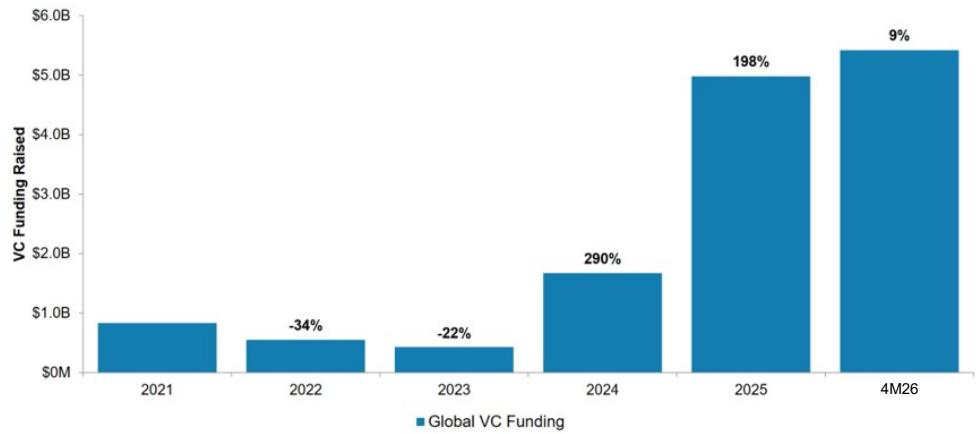

bar chart

| Year | Global VC Funding |
| :--- | :--- |
| 2021 | 0.8B |
| 2022 | -34% |
| 2023 | -22% |
| 2024 | 290% |
| 2025 | 198% |
| 4M26 | 9% |

...resulting in multiple unicorns globally

<table><tr><td>Country</td><td>Date</td><td>Company</td><td>Valuation (US$&#x27;bn)</td></tr><tr><td rowspan="2">US</td><td>Sep-25</td><td>Figure</td><td>39.0</td></tr><tr><td>Feb-26</td><td>Apptronik</td><td>5.3</td></tr><tr><td>Germany</td><td>Jun-26</td><td>Neura Robotics</td><td>7.0</td></tr><tr><td rowspan="6">China</td><td>Jun-25</td><td>Unitree</td><td>1.9</td></tr><tr><td>Feb-26</td><td>AI^2 Robotics</td><td>1.5</td></tr><tr><td>Mar-26</td><td>Galbot</td><td>3.0</td></tr><tr><td>Apr-26</td><td>EngineAI</td><td>1.5</td></tr><tr><td>Apr-26</td><td>Spirit AI</td><td>1.5</td></tr><tr><td>Apr-26</td><td>Galaxea</td><td>3.0</td></tr></table>

A similar VC/PE financing trend is happening in China  
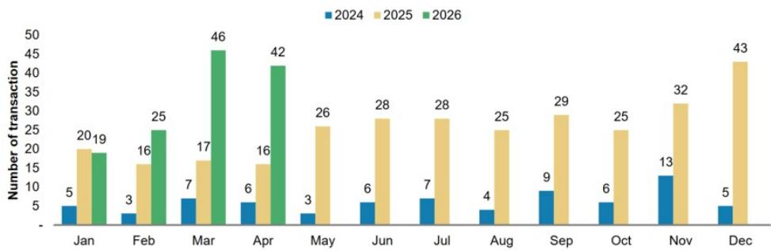

bar chart

| Month | 2024 | 2025 | 2026 |
|---|---|---|---|
| Jan | 5 | 20 | 19 |
| Feb | 3 | 16 | 25 |
| Mar | 7 | 17 | 46 |
| Apr | 6 | 16 | 42 |
| May | 3 | 26 | - |
| Jun | 6 | 28 | - |
| Jul | 7 | 28 | - |
| Aug | 4 | 25 | - |
| Sep | 9 | 29 | - |
| Oct | 6 | 25 | - |
| Nov | 13 | 32 | - |
| Dec | 5 | 43 | - |

Companies that have filed for IPO to date  
Source: PitchBook, GGII, company/news announcements, MS. Note: Includes all notable funding disclosed based on our knowledge and research; however, some transactions may not be captured.

UNITREE

DEEPRobotics

云深处科技

6

LEJU ROBOT

## What Makes a Humanoid?

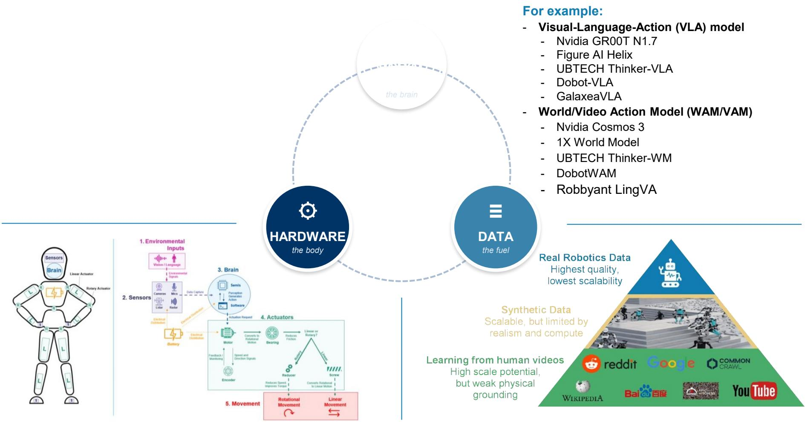

flowchart

```mermaid
graph TD
  A["Hardware: the body"] --> B["Data: the fuel"]
  C["Sensors: Linear Activator"] --> D["1. Environmental Inputs"]
  D --> E["2. Sensors"]
  E --> F["3. Brain"]
  F --> G["4. Actuators"]
  G --> H["5. Movement"]
  H --> I["Real Robotics Data: Highest quality, lowest scalability"]
    style A fill:#99ccff,stroke:#333
    style B fill:#99ccff,stroke:#333
    style C fill:#99ccff,stroke:#333
    style D fill:#ffcccc,stroke:#333
    style E fill:#ffcccc,stroke:#333
    style F fill:#ffcccc,stroke:#333
    style G fill:#ffcccc,stroke:#333
    style H fill:#ffcccc,stroke:#333
    style I fill:#ffcccc,stroke:#333
    note right of A: For example:
- Visual-Language-Action (VLA) model
- Nvidia GR00T N1.7
- Figure AI Helix
- UBTECH Thinker-VLA
- Dobot-VLA
- GalaxeaVLA
- World/Video Action Model (WAM/VAM)
- Nvidia Cosmos 3
- 1X World Model
- UBTECH Thinker-WM
- DobotWAM
- Robbyant LingVA
    end
    note right of I: Learning from human videos
High scale potential,
but weak physical grounding
    subgraph Legend
        direction TB
        direction LR
        direction CC
        direction DD
        direction EE
        direction FF
        direction GG
        direction HH
        direction ID
        direction IL
        direction M
        direction N
        direction O
        direction P
        direction Q
        direction R
        direction S
        direction T
        direction U
        direction V
        direction W
        direction X
        direction Y
        direction Z
        direction AA
        direction AB
        direction AC
        direction AD
        direction AE
        direction AF
        direction AG
        direction AH
        direction AI
        direction AJ
        direction AK
        direction AL
        direction AM
        direction AN
        direction AO
        direction AP
        direction AQ
        direction AR
        direction AS
        direction AT
        direction AU
        direction AV
        direction AW
        direction AX
        direction AY
        direction AZ
        direction BA
        direction BB
        direction BC
        direction BD
        direction BE
        direction BF
        direction BG
        direction BH
        direction BI
        direction BJ
        direction BK
        direction BL
        direction BM
        direction BN
        direction BO
        direction BP
        direction BPB
        direction BPBCC
        direction BPBCBCC
    end
```

Source: MS.

## Hardware BoM Breakdown

Key components include screws, reducers, motors, and sensors  
BoM Cost Breakdown  
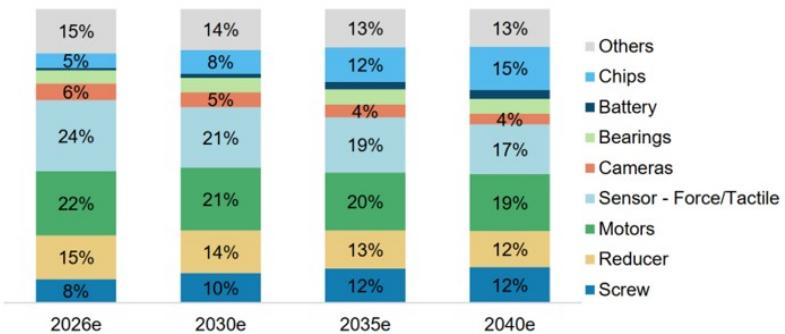

stacked bar chart

| Year | Others (%) | Chips (%) | Battery (%) | Bearings (%) | Cameras (%) | Sensor - Force/Tactile (%) | Motors (%) | Reducer (%) | Screw (%) |
|---|---|---|---|---|---|---|---|---|---|
| 2026e | 15 | 5 | 8 | 24 | 6 | 0 | 22 | 15 | 8 |
| 2030e | 14 | 8 | 10 | 21 | 5 | 1 | 21 | 14 | 10 |
| 2035e | 13 | 12 | 12 | 19 | 4 | 2 | 20 | 13 | 12 |
| 2040e | 13 | 15 | 12 | 17 | 4 | 3 | 19 | 12 | 12 |

Combining demand from other robots, components are set for exponential growth  
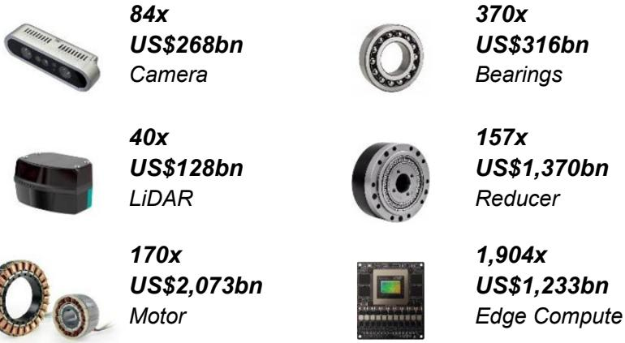  
84x  
US\$268bn  
Camera  
370x  
US\$316bn  
Bearings  
40x  
US\$128bn  
LiDAR  
157x  
US\$1,370bn  
Reducer

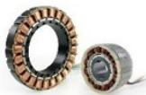  
170x  
US\$2,073bn  
Motor  
1,904x  
US\$1,233bn  
Edge Compute

The component market is projected to have a global TAM of US\$780bn by 2040  
Component TAM Market (US\$'bn)  
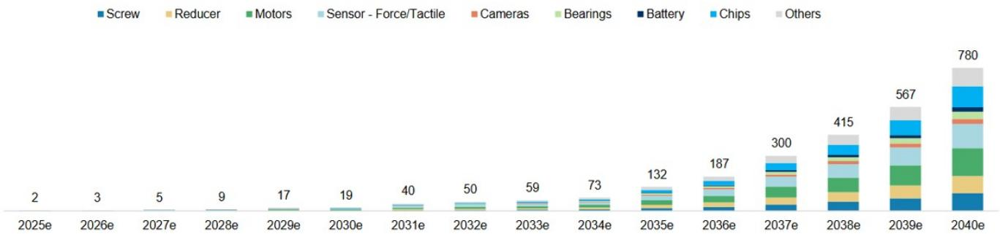

stacked bar chart

| Year | Screw | Reducer | Motors | Sensor - Force/Tactile | Cameras | Bearings | Battery | Chips | Others |
| --- | --- | --- | --- | --- | --- | --- | --- | --- | --- |
| 2025e | 2 | 0 | 0 | 0 | 0 | 0 | 0 | 0 | 0 |
| 2026e | 3 | 0 | 0 | 0 | 0 | 0 | 0 | 0 | 0 |
| 2027e | 5 | 0 | 0 | 0 | 0 | 0 | 0 | 0 | 0 |
| 2028e | 9 | 0 | 17 | 0 | 0 | 0 | 0 | 0 | 0 |
| 2029e | 17 | 0 | 19 | 0 | 0 | 0 | 0 | 0 | 0 |
| 2030e | 19 | 0 | 40 | 19 | 19 | 19 | 19 | 19 | 19 |
| 2031e | 50 | 19 | 50 | 40 | 40 | 40 | 40 | 40 | 40 |
| 2032e | 59 | 39 | 73 | 59 | 59 | 59 | 59 | 59 | 59 |
| 2033e | 73 | 59 | 132 | 73 | 73 | 73 | 73 | 73 | 73 |
| 2034e | 132 | 89 | 187 | 132 | 132 | 132 | 132 | 132 | 132 |
| 2035e | 187 | 119 | 300 | 187 | 187 | 187 | 187 | 187 | 187 |
| 2036e | - | - | - | - | - | - | - | - | - |
| 2037e | - | - | - | - | - | - | - | - | - |
| 2038e | - | - | - | - | - | - | - | - | - |
| 2039e | - | - | - | - | - | - | - | - | - |
| 2040e | - | - | - | - | - | - | - | - | - |

Source: MS estimates. Note: The market size of the different components are as of 2050e; the multiple represents the difference compared to the 2025e market size.

## An Industry at an Early Stage

All three pillars of humanoid robotics have room for further improvement.

- Model – the path has not converged yet (VLA or World Model). The functionality and generalization capability are still limited. Commercial value to be proven (ROI and synergy with existing systems);  
- Data – Rare and expensive, unlike LLM’s internet-scale of text/video data.  
- Hardware – Cost, performance (accuracy, efficiency, and reliability).

Furthermore, as volumes rams up, considerations extend to data/cybersecurity, government regulation/standards, and geopolitical constraints across both hardware and software.

According to AlphaWise Survey, key adoption barriers are limited functionalities, costs, and integration with existing systems  
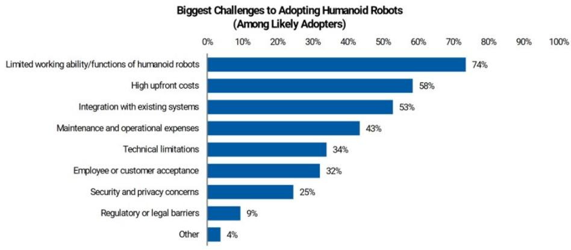

bar chart

Biggest Challenges to Adopting Humanoid Robots (Among Likely Adopters)
| Challenge | Percentage (%) |
| :--- | :--- |
| Limited working ability/functions of humanoid robots | 74 |
| High upfront costs | 58 |
| Integration with existing systems | 53 |
| Maintenance and operational expenses | 43 |
| Technical limitations | 34 |
| Employee or customer acceptance | 32 |
| Security and privacy concerns | 25 |
| Regulatory or legal barriers | 9 |
| Other | 4 |

Companies expect Rmb100,000-199,999 (US\$14-28k) per unit of robots to be the sweet spot for broader adoption  
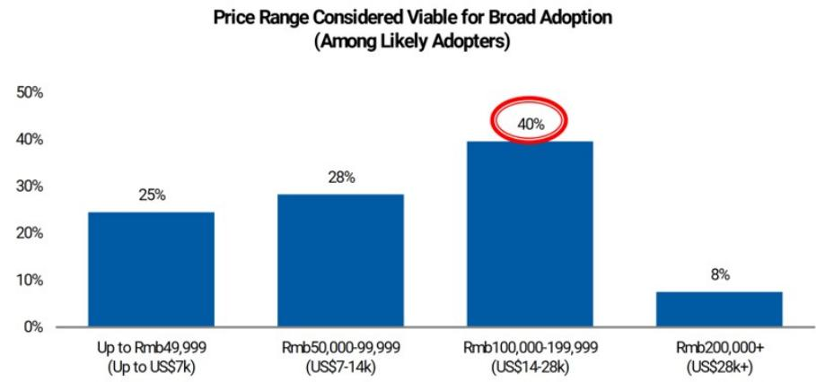

bar chart

Price Range Considered Viable for Broad Adoption (Among Likely Adopters)
| Price Range | Percentage (%) |
| :--- | :--- |
| Up to Rmb49,999 (Up to US$7k) | 25 |
| Rmb50,000-99,999 (US$7-14k) | 28 |
| Rmb100,000-199,999 (US$14-28k) | 40 |
| Rmb200,000+ (US$28k+) | 8 |

Source: AlphaWise, MS. (Total respondents n=86). See the full report - China Humanoids Survey: High Willingness to Adopt Meets Premature Products

## Zooming in to China: 2026, an Initial Small-scale Commercialization

Early 2020s - Prototypes  
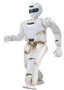  
Ubtech Walker X (2021)

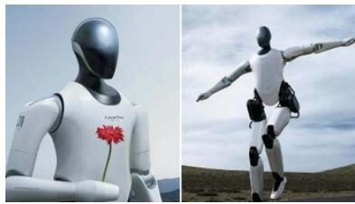

natural_image

Two humanoid robots: one with a red flower on the chest, the other with arms extended and balanced pose against a cloudy sky (no text or symbols visible)

Xiaomi CyberOne (2022)

2024 Static Showcase/Demo  
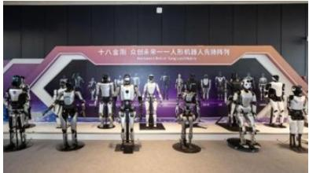

text_image

十八金剑 全创未来——人形机器人先锋陈列
THE FIRST GIFT KENTUER

A Series of Humanoids demo at WAIC 2024

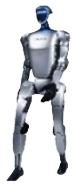  
Unitree G1
Selling at US\$16k

2025: Advancement in Locomotion, Initial Production  
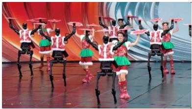

natural_image

Group of dancers performing on a stage with robotic robots, wearing matching red and green costumes (no visible text or symbols)

Unitree H1 performance at China New Year Gala 2025

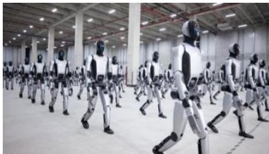

natural_image

Group of humanoid robots performing a line training exercise inside a large warehouse (no visible text or symbols)

China humanoid shipment exceeded 10k units

2026: Pilot deployment  
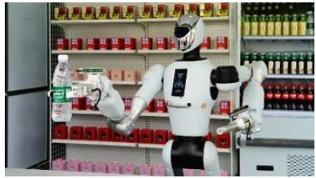

natural_image

Two humanoid robots standing in front of a shelf filled with packaged goods (no visible text or symbols)

natural_image

Workers assembling yellow industrial machinery components (no visible text or symbols)

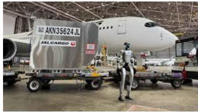

natural_image

Interior of a hangar with a Boeing 35624 JL aircraft and a humanoid robot, no visible text or symbols on the aircraft or background.

Source: MS.

## More Adoption Examples

Spirit AI's humanoids in CATL battery packing line  
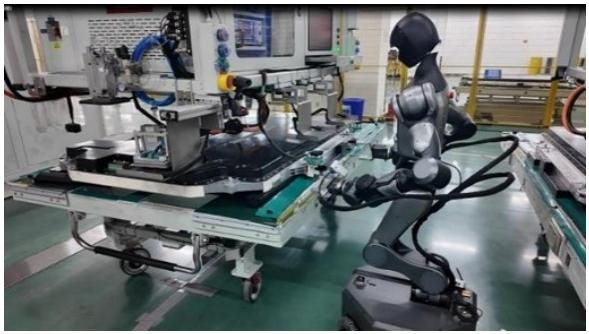

natural_image

Industrial robot assembly line with robotic arms in a factory setting (no visible text or symbols)

Galbot's unmanned retail kiosk  
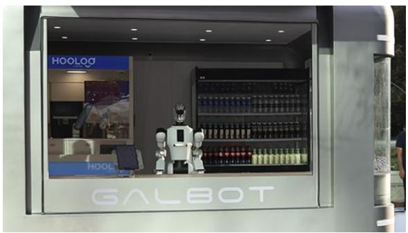

text_image

HOOLOO
HOOL
GALBOT

Midea Robot Ultra, a wheel-based 6-arm humanoid, working in washing machine production line  
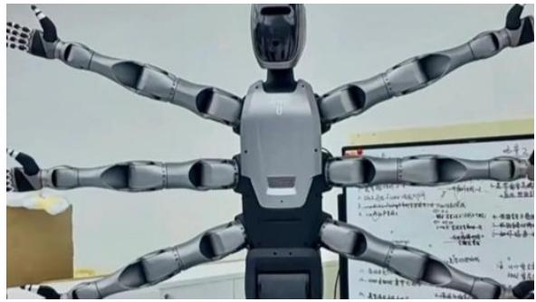

natural_image

Dramed humanoid robot with multiple articulated arms, displayed against a whiteboard (no visible text or symbols)

DOBOT's Atom humanoid operating a popcorn counter autonomously  
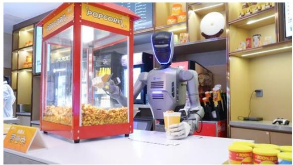

natural_image

Interior of a popcorn shop with a humanoid robot and shelves of snacks (no visible text or symbols)

Collaboration of humanoid robot, cobot arm, and quadruped robot  
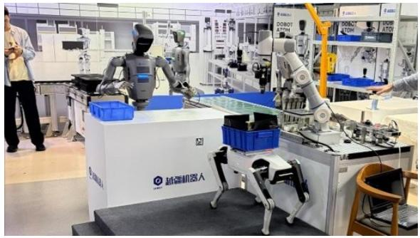

natural_image

Exterior view of a modern office building (no signage)

Robotera's L7 working in SF Express sorting line  
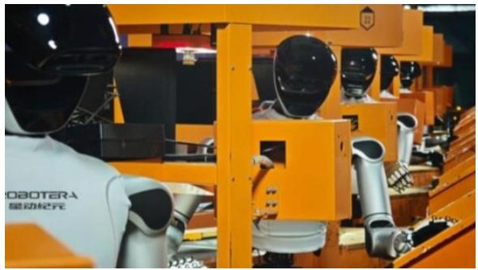

natural_image

Person wearing a headset and gloves operating a large orange robotic platform (no visible text or symbols)

Source: Humanoid Daily, Midea, Galbot, Dobot. TechNode, MS.

## Humanoid Robots' Shipment Volume by 2030 to be \~9x That in 2026

We currently forecast China's humanoid shipments to rise at an $85\%$ CAGR over 2025-30e...  
China Humanoid Volume ('k unit)  
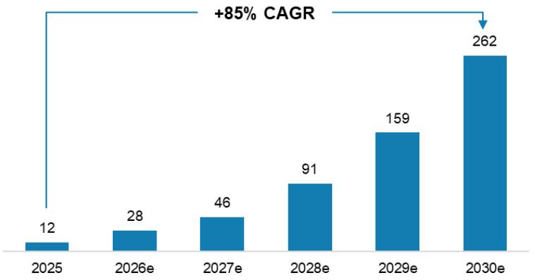

bar chart

| Year | Value |
| :--- | :--- |
| 2025 | 12 |
| 2026e | 28 |
| 2027e | 46 |
| 2028e | 91 |
| 2029e | 159 |
| 2030e | 262 |
+85% CAGR

...supported by a series of government policy.

<table><tr><td colspan="2">National Level Policy</td></tr><tr><td>The 15th Five-Year Plan</td><td>Named robotics as a strategic emerging industry for the first time</td></tr><tr><td colspan="2">Local Government Target</td></tr><tr><td>Zhangjiang</td><td>Production to reach20k units in 2027, with core value chain reaching Rmb20bn</td></tr><tr><td>Shenzhen</td><td>To develop 10 core companies with annual revenue exceeding Rmb10bn, with totalindustry size reaching Rmb100bn by 2027</td></tr><tr><td>Shanghai</td><td>To scale the industry toRmb50bn by 2027, with subsidies of 30% for model R&amp;D, 20% for adoption projects, and 50% for ecosystem projects</td></tr><tr><td>Beijing</td><td>To reachannual production capacity of 10k units by 2027, with subsidies across the entire value chain</td></tr><tr><td>Hangzhou</td><td>To scale the embodied robotics industry above Rmb20bn and related industries above Rmb30bn by 2027</td></tr></table>

Source: Government announcement, MS estimates. Note: This humanoid sales to external parties, we acknowledge and do not include prototype, internal R&D and use.

## Strong Government Support and Enterprises' High Willingness to Adopt

Our AlphaWise survey indicates a strong adoption willingness amid the industry's early stage, supporting the rapid use case verification process and initial adoption

% Share of Organizations Launching Projects with Wheel- or Leg-Based Humanoid Robots (Among Total Sample)

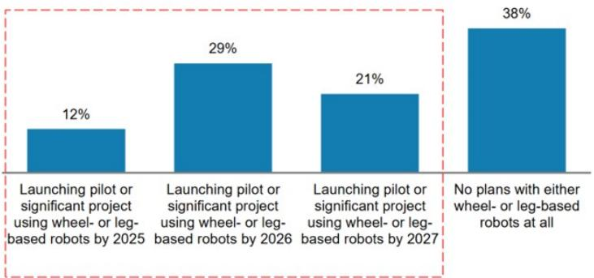

bar chart

| Category | Percentage (%) |
|---|---|
| Launching pilot or significant project using wheel- or leg-based robots by 2025 | 12 |
| Launching pilot or significant project using wheel- or leg-based robots by 2026 | 29 |
| Launching pilot or significant project using wheel- or leg-based robots by 2027 | 21 |
| No plans with either wheel- or leg-based robots at all | 38 |

Government and SoE support is a big part of early commercialization  
China 2025 Humanoid Shipment Mix  
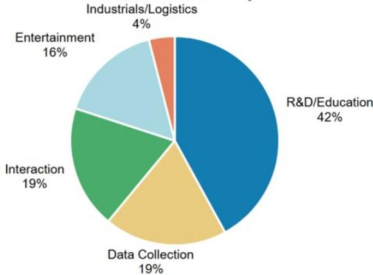

pie chart

| Category | Percentage (%) |
| :--- | :--- |
| R&D/Education | 42 |
| Data Collection | 19 |
| Interaction | 19 |
| Entertainment | 16 |
| Industrials/Logistics | 4 |

<table><tr><td>Date</td><td>Project</td><td>Value (Rmb&#x27;mn)</td></tr><tr><td>14-Jul-2025</td><td>China Mobile (Hangzhou)</td><td>124</td></tr><tr><td>20-Oct-2025</td><td>Guangxi Data Collection Center</td><td>126</td></tr><tr><td>5-Nov-2025</td><td>Sichuan Zigong Data Collection Center</td><td>159</td></tr><tr><td>25-Nov-2025</td><td>Guangxi Fangchenggang Data Collection Center</td><td>264</td></tr><tr><td>28-Nov-2025</td><td>Jiangxi Jiujiang Data Collection Center</td><td>143</td></tr><tr><td>22-Dec-2025</td><td>Huizhou Huiyang Data Collection Center</td><td>60</td></tr><tr><td>29-Dec-2025</td><td>Hohhot City Embodied Intelligence Tech Center</td><td>78</td></tr><tr><td>24-Apr-2026</td><td>State Grid</td><td>6,800</td></tr></table>

Source: AlphaWise, MS, Company/government announcement. (Total respondents n=86).

See the full report - China Humanoids Survey: High Willingness to Adopt Meets Premature Products

## China is Leading in Robotics

## Government leadership

- Mentioned as “A Strategic Emerging Sector” in the 15 $^{th}$ FYP.  
- Local governments are building their own “data early orders collection centre”, providing accounting for 19% of total shipments in 2025.  
- Over Rmb187bn (\~US\$27bn) government guidance funds was established for robotics industry.  
• Established a National Standard for humanoids.

## Ecosystem – Support from upstream to downstream

- Supply chain: Our checks indicate integrators use mostly local components, except for chips.  
- Rich data: China's diverse manufacturing scenarios provide fuel for robot model fast iteration.  
- Applications:

\- Beyond government support, enterprises across various industries are also eager to adopt frontier technology, providing a testing environment for humanoids

Source: MS estimates.

## Manufacturing know-how is being converted to robots

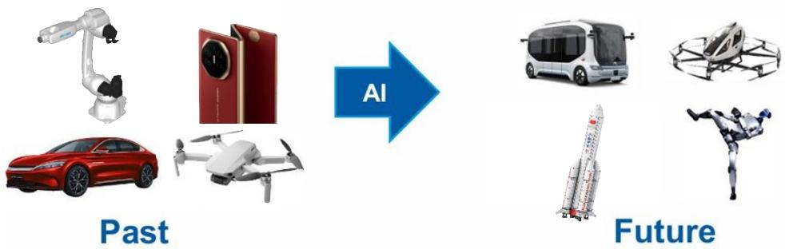

Significant cost advantage vs. non-China supply chain  
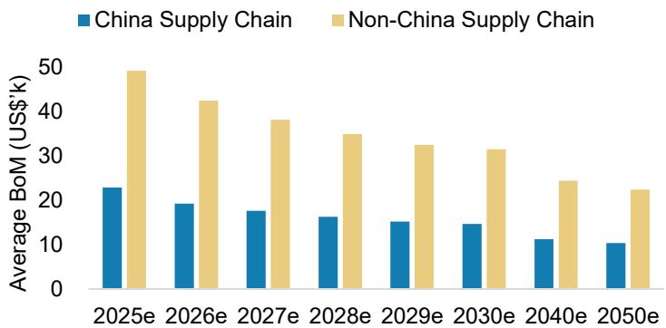

bar chart

| Year | China Supply Chain (US$k) | Non-China Supply Chain (US$k) |
| :--- | :--- | :--- |
| 2025e | 23 | 49 |
| 2026e | 19 | 42 |
| 2027e | 17 | 38 |
| 2028e | 16 | 35 |
| 2029e | 15 | 32 |
| 2030e | 14 | 31 |
| 2040e | 11 | 24 |
| 2050e | 10 | 22 |

China Humanoid Value Chain List (Both Private And Public Companies)  

text_image

Brain
Baidu 百度
地平线 Horizon Robotics
GALBOT 银河通用
PsiBot 灵初智能
星海图 GALAXEA AI
科大讯飞 iFLYTEK
HUAWEI
D-Robotics
智平方 AI'ROBOTICS
NOEMATRIX
Spirit AI 千导智能
Actuator
Motor
Reducer
Bearing
SANHUA TUOPU拓普
WOLONG Power your future
SLING GUOMAO 双环传动
双环传动
MUANGSHAN COMPANY
Semi
MOONS' moving in batteries way?
WEICHI
Kinco
leaderdrive
CSB®
Dexterous hands
Fortex Tech
OMNIVISION®
Screw
Sensor
Vision/LiDAR
ZHAOWEI Leadshine
Hengli ACZZZ Seenpin 浙江荣泰 GLORYMICA SHUANGLIN
均胜电子 JOSON ELECTRONICS
KELi POKINI
奥比中光 ORBBEC HESAI
robosense
Battery
CATL 宁德时代 azure
Integrator
UNITREE UBTECH ENGINEAI Tencent 腾讯 Midea x KUKA XPENG FOURIER ROBOTERA KEPLER DEEPRobotics 云深处科技 Alibaba.com BYD 广汽集团 TOPSUNNA GAC GROUP 江江中望科技股份有限公司 magiclab LEJU ROBOT LIMX DYNAMICS BOOSTER ROBOTICS mi xiaomi FOXconn ESTUN AUTOMATION DOBOT

Source: MS.

## Hyundai Motor Group: Leveraging Synergies to Build a Moat

## BostonDynamics

## HYUNDAI

## MOTOR GROUP

## Leveraging Synergies to Build a Moat

## Strengths & Synergies

• Brand equity enhanced under Hyundai Motor Group  
- Leverage of HMG's manufacturing expertise and component supply chain  
- HMG's push for internal deployment across its global operations  
- Potential for continued/additional financial support from the group

## Weakness & Challenges

- More research-focused traditionally, with limited commercial deployment to date  
- Lagging in certain AI and vision-based perception technologies  
• Cost competitiveness versus global peers

## Collaborating Across Each Layer of the Humanoid Value Chain

E-Atlas (Boston Dynamics)  
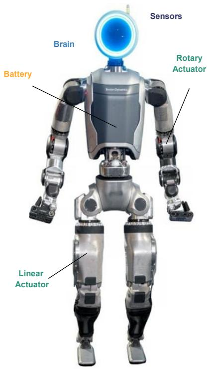

text_image

Sensors
Brain
Battery
Rotary Actuator
Linear Actuator

Flow of Vision/Language to Humanoid Actuation  
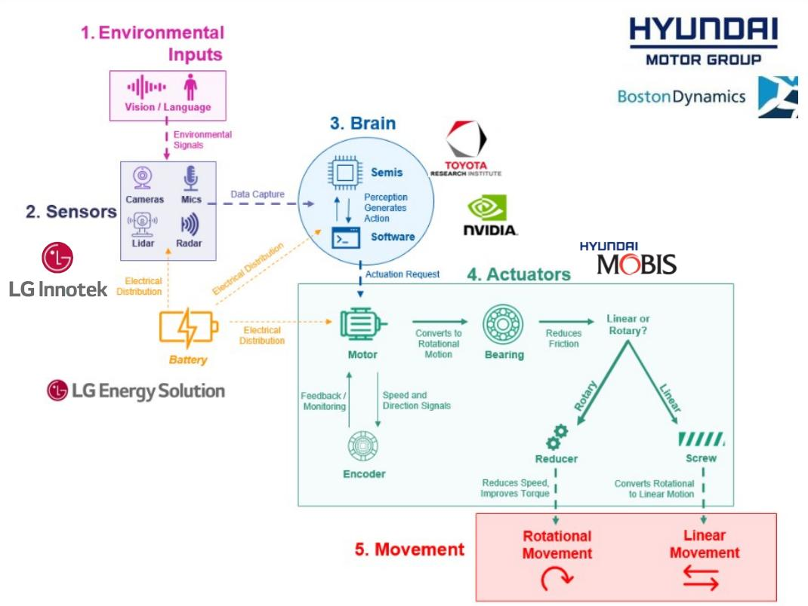

flowchart

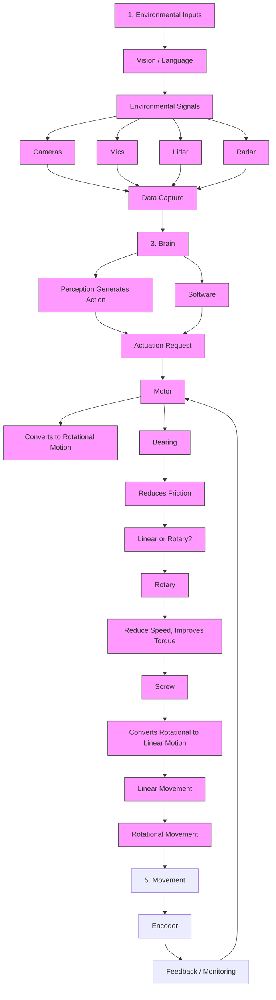
```mermaid
graph TD
  A["1. Environmental Inputs"] --> B["Vision / Language"]
  B --> C["Environmental Signals"]
  C --> D["Cameras"]
  C --> E["Mics"]
  C --> F["Lidar"]
  C --> G["Radar"]
  D --> H["Data Capture"]
  E --> H
  F --> H
  G --> H
  H --> I["3. Brain"]
  I --> J["Perception Generates Action"]
  I --> K["Software"]
  J --> L["Actuation Request"]
  K --> L
  L --> M["Motor"]
  M --> N["Converts to Rotational Motion"]
  M --> O["Bearing"]
  O --> P["Reduces Friction"]
  P --> Q["Linear or Rotary?"]
  Q --> R["Rotary"]
  R --> S["Reduce Speed, Improves Torque"]
  S --> T["Screw"]
  T --> U["Converts Rotational to Linear Motion"]
  U --> V["Linear Movement"]
  V --> W["Rotational Movement"]
  W --> X["5. Movement"]
  X --> Y["Encoder"]
  Y --> Z["Feedback / Monitoring"]
  Z --> M
    style A fill:#f9f,stroke:#333
    style B fill:#f9f,stroke:#333
    style C fill:#f9f,stroke:#333
    style D fill:#f9f,stroke:#333
    style E fill:#f9f,stroke:#333
    style F fill:#f9f,stroke:#333
    style G fill:#f9f,stroke:#333
    style H fill:#f9f,stroke:#333
    style I fill:#f9f,stroke:#333
    style J fill:#f9f,stroke:#333
    style K fill:#f9f,stroke:#333
    style L fill:#f9f,stroke:#333
    style M fill:#f9f,stroke:#333
    style N fill:#f9f,stroke:#333
    style O fill:#f9f,stroke:#333
    style P fill:#f9f,stroke:#333
    style Q fill:#f9f,stroke:#333
    style R fill:#f9f,stroke:#333
    style S fill:#f9f,stroke:#333
    style T fill:#f9f,stroke:#333
    style U fill:#f9f,stroke:#333
    style V fill:#f9f,stroke:#333
    style W fill:#f9f,stroke:#333
```

Source: MS.

## Humanoid Landscape in Korea

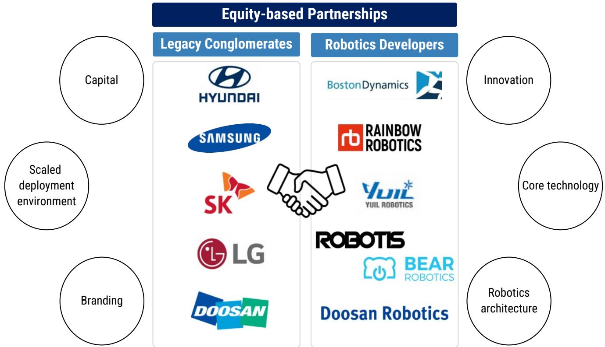

flowchart

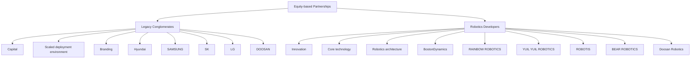
```mermaid
graph TD
  A["Equity-based Partnerships"] --> B["Legacy Conglomerates"]
  A --> C["Robotics Developers"]
  B --> D["Capital"]
  B --> E["Scaled deployment environment"]
  B --> F["Branding"]
  C --> G["Innovation"]
  C --> H["Core technology"]
  C --> I["Robotics architecture"]
  B --> J["Hyundai"]
  B --> K["SAMSUNG"]
  B --> L["SK"]
  B --> M["LG"]
  B --> N["DOOSAN"]
  C --> O["BostonDynamics"]
  C --> P["RAINBOW ROBOTICS"]
  C --> Q["YUIL YUIL ROBOTICS"]
  C --> R["ROBOTIS"]
  C --> S["BEAR ROBOTICS"]
  C --> T["Doosan Robotics"]
```

Source: MS.

## Disclosure Section

The information and opinions in MS were prepared or are disseminated by MS Asia Limited (which accepts the responsibility for its contents) and/or MS Asia (Singapore) Pte. (Registration number 199206298Z) and/or MS Asia (Singapore) Securities Pte Ltd (Registration number 200008434H), regulated by the Monetary Authority of Singapore (which accepts legal responsibility for its contents and should be contacted with respect to any matters arising from, or in connection with, MS), and/or MS Taiwan Limited and/or MS & Co International plc, Seoul Branch, and/or MS Australia Limited (A.B.N. 67 003 734 576, holder of Australian financial services license No. 233742, which accepts responsibility for its contents), and/or MS Wealth Management Australia Pty Ltd (A.B.N. 19 009 145 555, holder of Australian financial services license No. 240813, which accepts responsibility for its contents), and/or MS India Company Private Limited having Corporate Identification No (CIN) U22990MH1998PTC115305, regulated by the Securities and Exchange Board of India ("SEBI") and holder of licenses as a Research Analyst (SEBI Registration No. INH000001105); Stock Broker (SEBI Stock Broker Registration No. INZ000244438), Merchant Banker (SEBI Registration No. INM000011203), and depository participant with National Securities Depository Limited (SEBI Registration No. IN-DP-NSDL-567-2021) having registered office at Altimus, Level 39 & 40, Pandurang Budhkar Marg, Worli, Mumbai 400018, India; Telephone no. +91-22-61181000; Compliance Officer Details: Mr. Tejarshi Hardas, Tel. No.: +91-22-61181000 or Email: tejarshi.hardas@morganstanley.com; Grievance officer details: Mr. Tejarshi Hardas, Tel. No.: +91-22-61181000 or Email: msic-compliance@morganstanley.com which accepts the responsibility for its contents and should be contacted with respect to any matters arising from, or in connection with, MS, and their affiliates (collectively, "MS"). MS India Company Private Limited (MSICPL) may use AI tools in providing research services. All recommendations contained herein are made by the duly qualified research analysts.

For important disclosures, stock price charts and equity rating histories regarding companies that are the subject of this report, please see the MS Disclosure Website at www.morganstanley.com/eqr/disclosures/webapp/generalresearch, or contact your investment representative or MS at 1585 Broadway, (Attention: Research Management), New York, NY, 10036 USA.

For valuation methodology and risks associated with any recommendation, rating or price target referenced in this research report, please contact the Client Support Team as follows: US/Canada +1800 303-2495; Hong Kong +852 2848-5999; Latin America +1718 754-5444 (U.S.); London +44 (0)20-7425-8169; Singapore +65 6834-6860; Sydney +61(0)2-9770-1505; Tokyo +81(0)3-6836-9000. Alternatively you may contact your investment representative or MS at 1585 Broadway, (Attention: Research Management), New York, NY 10036 USA.

## Analyst Certification

The following analysts hereby certify that their views about the companies and their securities discussed in this report are accurately expressed and that they have not received and will not receive direct or indirect compensation in exchange for expressing specific recommendations or views in this report: Carlos Chai; Young Suk Shin; Chelsea Wang; Sheng Zhong.

## Global Research Conflict Management Policy

MS has been published in accordance with our conflict management policy, which is available at www.morganstanley.com/institutional/research/conflictpolicies. A Portuguese version of the policy can be found at www.morganstanley.com.br

## Important Regulatory Disclosures on Subject Companies

As of May 29, 2026, MS beneficially owned 1% or more of a class of common equity securities of the following companies covered in MS: Beijing Geekplus Technology Co., Ltd., China Railway Group, Estun Automation Co Ltd, Han's Laser, Hanon Systems, iRay Technology Company Limited, Leader Harmonious Drive Systems, Sany Heavy Industry Co., Ltd., Shenzhen Inovance Technology, Shenzhen SC New Energy Technology Corp, SNT Motiv Co. Ltd., Suzhou Maxwell Technologies Co Ltd, WeiChai Power, Wuxi Autowell Technology Co Ltd, Wuxi Lead Intelligent, Zhejiang Dingli Machinery Co Ltd., Zhejiang Shuanghuan Driveline Co. Ltd..

Within the last 12 months, MS managed or co-managed a public offering (or 144A offering) of securities of Beijing Geekplus Technology Co., Ltd., Zoomlion Heavy Industry.

Within the last 12 months, MS has received compensation for investment banking services from Samsung SDI, Shenzhen Inovance Technology, Zoomlion Heavy Industry.

In the next 3 months, MS expects to receive or intends to seek compensation for investment banking services from Beijing Geekplus Technology Co., Ltd., China State Construction Engineering, Hanon Systems, Hyundai MOBIS, Hyundai Motor, LG Energy Solution, Samsung SDI, Sany Heavy Industry Co., Ltd., Shenzhen Inovance Technology, Wuxi Lead Intelligent, Zhejiang Hangke Technology, Zoomlion Heavy Industry.

Within the last 12 months, MS has received compensation for products and services other than investment banking services from China State Construction Engineering, CRRC Corp Ltd, Haitian International Holdings Limited, Hyundai Motor, Sinotruk (Hong Kong) Limited.

Within the last 12 months, MS has provided or is providing investment banking services to, or has an investment banking client relationship with, the following company: Beijing Geekplus Technology Co., Ltd., China State Construction Engineering, Hanon Systems, Hyundai MOBIS, Hyundai Motor, LG Energy Solution, Samsung SDI, Sany Heavy Industry Co., Ltd., Shenzhen Inovance Technology, Wuxi Lead Intelligent, Zhejiang Hangke Technology, Zoomlion Heavy Industry.

Within the last 12 months, MS has either provided or is providing non-investment banking, securities-related services to and/or in the past has entered into an agreement to provide services or has a client relationship with the following company: Beijing Geekplus Technology Co., Ltd., China State Construction Engineering, CRRC Corp Ltd, Haitian International Holdings Limited, Hyundai Motor, Sinotruk (Hong Kong) Limited.

An employee, director or consultant of MS is a director of Beijing Geekplus Technology Co., Ltd.. This person is not a research analyst or a member of a research analyst's household.

The equity research analysts or strategists principally responsible for the preparation of MS have received compensation based upon various factors, including quality of research, investor client feedback, stock picking, competitive factors, firm revenues and overall investment banking revenues. Equity Research analysts' or strategists' compensation is not linked to investment banking or capital markets transactions performed by MS or the profitability or revenues of particular trading desks.

MS and its affiliates do business that relates to companies/instruments covered in MS, including market making, providing liquidity, fund management, commercial banking, extension of credit, investment services and investment banking. MS sells to and buys from customers the securities/instruments of companies covered in MS on a principal basis. MS may have a position in the debt of the Company or instruments discussed in this report. MS trades or may trade as principal in the debt securities (or in related derivatives) that are the subject of the debt research report.

Certain disclosures listed above are also for compliance with applicable regulations in non-US jurisdictions.

## STOCK RATINGS

MS uses a relative rating system using terms such as Overweight, Equal-weight, Not-Rated or Underweight (see definitions below). MS does not assign ratings of Buy, Hold or Sell to the stocks we cover. Overweight, Equal-weight, Not-Rated and Underweight are not the equivalent of buy, hold and sell. Investors should carefully read the definitions of all ratings used in MS. In addition, since MS contains more complete information concerning the analyst's views, investors should carefully read MS, in its entirety, and not infer the contents from the rating alone. In any case, ratings (or research) should not be used or relied upon as investment advice. An investor's decision to buy or sell a stock should depend on individual circumstances (such as the investor's existing holdings) and other considerations.

## Global Stock Ratings Distribution

(as of May 31, 2026)

The Stock Ratings described below apply to MS's Fundamental Equity Research and do not apply to Debt Research produced by the Firm.

For disclosure purposes only (in accordance with FINRA requirements), we include the category headings of Buy, Hold, and Sell alongside our ratings of Overweight, Equal-weight, Not-Rated and Underweight. MS does not assign ratings of Buy, Hold or Sell to the stocks we cover. Overweight, Equal-weight, Not-Rated and Underweight are not the equivalent of buy, hold, and sell but represent recommended relative weightings (see definitions below). To satisfy regulatory requirements, we correspond Overweight, our most positive stock rating, with a buy recommendation; we correspond Equal-weight and Not-Rated to hold and Underweight to sell recommendations, respectively.

<table><tr><td></td><td colspan="2">Coverage Universe</td><td colspan="3">Investment Banking Clients (IBC)</td><td colspan="2">Other Material Investment Services Clients (MISC)</td></tr><tr><td>Stock Rating Category</td><td>Count</td><td>% of Total</td><td>Count</td><td>% of Total IBC</td><td>% of Rating Category</td><td>Count</td><td>% of Total Other MISC</td></tr><tr><td>Overweight/Buy</td><td>1542</td><td>42%</td><td>465</td><td>51%</td><td>30%</td><td>707</td><td>43%</td></tr><tr><td>Equal-weight/Hold</td><td>1571</td><td>43%</td><td>369</td><td>40%</td><td>23%</td><td>723</td><td>44%</td></tr><tr><td>Not-Rated/Hold</td><td>3</td><td>0%</td><td>0</td><td>0%</td><td>0%</td><td>1</td><td>0%</td></tr><tr><td>Underweight/Sell</td><td>551</td><td>15%</td><td>86</td><td>9%</td><td>16%</td><td>201</td><td>12%</td></tr><tr><td>Total</td><td>3,667</td><td></td><td>920</td><td></td><td></td><td>1632</td><td></td></tr></table>

Data include common stock and ADRs currently assigned ratings. Investment Banking Clients are companies from whom MS received investment banking compensation in the last 12 months. Due to rounding off of decimals, the percentages provided in the "% of total" column may not add up to exactly 100 percent.

## Analyst Stock Ratings

Overweight (O). The stock's total return is expected to exceed the average total return of the analyst's industry (or industry team's) coverage universe, on a risk-adjusted basis, over the next 12-18 months.

Equal-weight (E). The stock's total return is expected to be in line with the average total return of the analyst's industry (or industry team's) coverage universe, on a risk-adjusted basis, over the next 12-18 months.

Not-Rated (NR). Currently the analyst does not have adequate conviction about the stock's total return relative to the average total return of the analyst's industry (or industry team's) coverage universe, on a risk-adjusted basis, over the next 12-18 months.

Underweight (U). The stock's total return is expected to be below the average total return of the analyst's industry (or industry team's) coverage universe, on a risk-adjusted basis, over the next 12-18 months.

Unless otherwise specified, the time frame for price targets included in MS is 12 to 18 months.

## Analyst Industry Views

Attractive (A): The analyst expects the performance of his or her industry coverage universe over the next 12-18 months to be attractive vs. the relevant broad market benchmark, as indicated below.

In-Line (I): The analyst expects the performance of his or her industry coverage universe over the next 12-18 months to be in line with the relevant broad market benchmark, as indicated below.

Cautious (C): The analyst views the performance of his or her industry coverage universe over the next 12-18 months with caution vs. the relevant broad market benchmark, as indicated below.

Benchmarks for each region are as follows: North America - S&P 500; Latin America - relevant MSCI country index or MSCI Latin America Index; Europe - MSCI Europe; Japan - TOPIX; Asia - relevant MSCI country index or MSCI sub-regional index or MSCI AC Asia Pacific ex Japan Index.

## Important Disclosures for MS Smith Barney LLC Customers

Important disclosures regarding any material conflict of interest that can reasonably be expected to have influenced MS Smith Barney LLC's choice of a third-party research provider or the subject company of a third-party research report, are available on the MS Wealth Management disclosure website at www.morganstanley.com/online/researchdisclosures. For MS specific disclosures, you may refer to https://www.morganstanley.com/eqr/disclosures/webapp/generalre-

search.

Each MS report is reviewed and approved on behalf of MS Smith Barney LLC. This review and approval is conducted by the same person who reviews the research report on behalf of MS. This could create a conflict of interest.

## Other Important Disclosures

MS policy is to update research reports as and when the Research Analyst and Research Management deem appropriate, based on developments with the issuer, the sector, or the market that may have a material impact on the research views or opinions stated therein. In addition, certain Research publications are intended to be updated on a regular periodic basis (weekly/monthly/quarterly/annual) and will ordinarily be updated with that frequency, unless the Research Analyst and Research Management determine that a different publication schedule is appropriate based on current conditions.

MS is not acting as a municipal advisor and the opinions or views contained herein are not intended to be, and do not constitute, advice within the meaning of Section 975 of the Dodd-Frank Wall Street Reform and Consumer Protection Act. MS produces an equity research product called a "Tactical Idea." Views contained in a "Tactical Idea" on a particular stock may be contrary to the recommendations or views expressed in research on the same stock. This may be the result of differing time horizons, methodologies, market events, or other factors. For all research available on a particular stock, please contact your sales representative or go to Matrix at http://www.morganstanley.com/matrix.

MS is provided to our clients through our proprietary research portal on Matrix and also distributed electronically by MS to clients. Certain, but not all, MS products are also made available to clients through third-party vendors or redistributed to clients through alternate electronic means as a convenience. For access to all available MS, please contact your sales representative or go to Matrix at http://www.morganstanley.com/matrix.Any access and/or use of MS is subject to MS's Terms of Use (http://www.morganstanley.com/terms.html). By accessing and/or using MS, you are indicating that you have read and agree to be bound by our Terms of Use (http://www.morganstanley.com/terms.html). In addition you consent to MS processing your personal data and using cookies in accordance with our Privacy Policy and our Global Cookies Policy (http://www.morganstanley.com/privacy\_pledge.html), including for the purposes of setting your preferences and to collect readership data so that we can deliver better and more personalized service and products to you. To find out more information about how MS processes personal data, how we use cookies and how to reject cookies see our Privacy Policy and our Global Cookies Policy (http://www.morganstanley.com/privacy\_pledge.html). Please use the provided link to review the Terms and Conditions and Most Important Terms and Conditions for MS India Company Private Limited (https://www.morganstanley.com/assets/pdfs/about-us-global-offices/india/Terms\_and\_conditions.pdf) and the following link to review the audit report (https://ny.matrix.ms.com/eqr/research/webapp/researchdocs/MSICPL\_Morgan\_Stanley\_Research\_Audit\_Report.pdf).

If you do not agree to our Terms of Use and/or if you do not wish to provide your consent to MS processing your personal data or using cookies please do not access our research.

MS does not provide individually tailored investment advice. MS has been prepared without regard to the circumstances and objectives of those who receive it. MS recommends that investors independently evaluate particular investments and strategies, and encourages investors to seek the advice of a financial adviser. The appropriateness of an investment or strategy will depend on an investor's circumstances and objectives. The securities, instruments, or strategies discussed in MS may not be suitable for all investors, and certain investors may not be eligible to purchase or participate in some or all of them. MS is not an offer to buy or sell or the solicitation of an offer to buy or sell any security/instrument or to participate in any particular trading strategy. The value of and income from your investments may vary because of changes in interest rates, foreign exchange rates, default rates, prepayment rates, securities/instruments prices, market indexes, operational or financial conditions of companies or other factors. There may be time limitations on the exercise of options or other rights in securities/instruments transactions. Past performance is not necessarily a guide to future performance. Estimates of future performance are based on assumptions that may not be realized. If provided, and unless otherwise stated, the closing price on the cover page is that of the primary exchange for the subject company's securities/instruments.

The fixed income research analysts, strategists or economists principally responsible for the preparation of MS have received compensation based upon various factors, including quality, accuracy and value of research, firm profitability or revenues (which include fixed income trading and capital markets profitability or revenues), client feedback and competitive factors. Fixed Income Research analysts', strategists' or economists' compensation is not linked to investment banking or capital markets transactions performed by MS or the profitability or revenues of particular trading desks.

The "Important Regulatory Disclosures on Subject Companies" section in MS lists all companies mentioned where MS owns 1% or more of a class of common equity securities of the companies. For all other companies mentioned in MS, MS may have an investment of less than 1% in securities/instruments or derivatives of securities/instruments of companies and may trade them in ways different from those discussed in MS. Employees of MS not involved in the preparation of MS may have investments in securities/instruments or derivatives of securities/instruments of companies mentioned and may trade them in ways different from those discussed in MS. Derivatives may be issued by MS or associated persons.

With the exception of information regarding MS, MS is based on public information. MS makes every effort to use reliable, comprehensive information, but we make no representation that it is accurate or complete. We have no obligation to tell you when opinions or information in MS change apart from when we intend to discontinue equity research coverage of a subject company. Facts and views presented in MS have not been reviewed by, and may not reflect information known to, professionals in other MS business areas, including investment banking personnel.

MS personnel may participate in company events such as site visits and are generally prohibited from accepting payment by the company of associated expenses unless pre-approved by authorized members of Research management. MS may make investment decisions that are inconsistent with the recommendations or views in this report.

To our readers based in Taiwan or trading in Taiwan securities/instruments: Information on securities/instruments that trade in Taiwan is distributed by MS Taiwan Limited ("MSTL"). Such information is for your reference only. The reader should independently evaluate the investment risks and is solely responsible for their investment decisions. MS may not be distributed to the public media or quoted or used by the public media without the express written consent of MS. Any non-customer reader within the scope of Article 7-1 of the Taiwan Stock Exchange Recommendation Regulations accessing and/or receiving MS is not permitted to provide MS to any third party (including but not limited to related parties, affiliated companies and any other third parties) or engage in any activities regarding MS which may create or give the appearance of creating a conflict of interest. Information on securities/instruments that do not trade in Taiwan is for informational purposes only and is not to be construed as a recommendation or a solicitation to trade in such securities/instruments. MSTL may not execute transactions for clients in these securities/instruments.

Certain information in MS was sourced by employees of the Shanghai Representative Office of MS Asia Limited for the use of MS Asia Limited.

MS is not incorporated under PRC law and the research in relation to this report is conducted outside the PRC. MS does not constitute an offer to sell or the solicitation of an offer to buy any securities in the PRC. PRC investors shall have the relevant qualifications to invest in such securities and shall be responsible for obtaining all relevant approvals, licenses, verifications and/or registrations from the relevant governmental authorities themselves. Neither this report nor any part of it is intended as, or shall constitute, provision of any consultancy or advisory service of securities investment as defined under PRC law. Such information is provided for your reference only.

MS is disseminated in Brazil by MS C.T.V.M. S.A. located at Av. Brigadeiro Faria Lima, 3600, 6th floor, São Paulo - SP, Brazil; and is regulated by the Comissão de Valores Mobiliários; in Mexico by MS México, Casa de Bolsa, S.A. de C.V which is regulated by Comision Nacional Bancaria y de Valores. Paseo de los Tamarindos 90, Torre 1, Col. Bosques de las Lomas Floor 29, 05120 Mexico City; in Japan by MS MUFG Securities Co., Ltd. and, for Commodities related research reports only, MS Capital Group Japan Co., Ltd; in Hong Kong by MS Asia Limited (which accepts responsibility for its contents) and by MS Bank Asia Limited; in Singapore by MS Asia (Singapore) Pte. (Registration number 199206298Z) and/or MS Asia (Singapore) Securities Pte Ltd (Registration number 200008434H), regulated by the Monetary Authority of Singapore (which accepts legal responsibility for its contents and should be contacted with respect to any matters arising from, or in connection with, MS) and by MS Bank Asia Limited, Singapore Branch (Registration number T14FC0118); in Australia to "wholesale clients" within the meaning of the Australian Corporations Act by MS Australia Limited A.B.N. 67 003 734 576, holder of Australian financial services license No. 23374-2, which accepts responsibility for its contents; in Australia to "wholesale clients" and "retail clients" within the meaning of the Australian Corporations Act by MS Wealth Management Australia Pty Ltd (A.B.N. 19 009 1445 555, holder of Australian financial services license No. 240813, which accepts responsibility for its contents; in Korea by MS & Co International plc, Seoul Branch; in India by MS India Company Private Limited having Corporate Identification No (CIN) U22990MH1998PTC115305, regulated by the Securities and Exchange Board of India ("SEBI") and holder of licenses as a Research Analyst (SEBI Registration No. INH000001105); Stock Broker (SEBI Stock Broker Registration No. INZ000244438), Merchant Banker (SEBI Registration No. INM000011203), and depository participant with National Securities Depository Limited (SEBI Registration No. IN-DP-NSDL-567-2021) having registered office at Altimus, Level 39 & 40, Pandurang Budhkar Marg, Worli, Mumbai 400018, India; Telephone no. +91-22-61181000; Compliance Officer Details: Mr. Tejarshi Hardas, Tel. No.: +91-22-61181000 or Email: tejarshi.hardas@morganstanley.com; Grievance officer details: Mr. Tejarshi Hardas, Tel. No.: +91-22-61181000 or Email: msic-compliance@morganstanley.com. MS India Company Private Limited (MSICPL) may use AI tools in providing research services. All recommendations contained herein are made by the duly qualified research analysts; in Canada by MS Canada Limited; in Germany and the European Economic Area where required by MS Europe S.E., authorised and regulated by Bundesanstalt fuer Finanzdienstleistungsaufsicht (BaFin) under the reference number 149169; in the US by MS & Co. LLC, which accepts responsibility for its contents. MS & Co. International plc, authorized by the Prudential Regulation Authority and regulated by the Financial Conduct Authority and the Prudential Regulation Authority, disseminates in the UK research that it has prepared, and research which has been prepared by any of its affiliates, only to persons who (i) are investment professionals falling within Article 19(5) of the Financial Services and Markets Act 2000 (Financial Promotion) Order 2005 (as amended, the "Order"); (ii) are persons who are high net worth entities falling within Article 49(2)(a) to (d) of the Order; or (iii) are persons to whom an invitation or inducement to engage in investment activity (within the meaning of section 21 of the Financial Services and Markets Act 2000, as amended) may otherwise lawfully be communicated or caused to be communicated. RMB MS Proprietary Limited is a member of the JSE Limited and A2X (Pty) Ltd. RMB MS Proprietary Limited is a joint venture owned equally by MS International Holdings Inc. and RMB Investment Advisory (Proprietary) Limited, which is wholly owned by FirstRand Limited. The information in MS is being disseminated by MS Saudi Arabia, regulated by the Capital Market Authority in the Kingdom of Saudi Arabia, and is directed at Sophisticated investors only.

MS Hong Kong Securities Limited is the liquidity provider/market maker for securities of China State Construction Engineering, WeiChai Power, Zoomlion Heavy Industry listed on the Stock Exchange of Hong Kong Limited. An updated list can be found on HKEx website: http://www.hkex.com.hk.

The information in MS is being communicated by MS & Co. International plc (DIFC Branch), regulated by the Dubai Financial Services Authority (the DFSA) or by MS & Co. International plc (ADGM Branch), regulated by the Financial Services Regulatory Authority Abu Dhabi (the FSRA), and is directed at Professional Clients only, as defined by the DFSA or the FSRA, respectively. The financial products or financial services to which this research relates will only be made available to a customer who we are satisfied meets the regulatory criteria of a Professional Client. A distribution of the different MS Research ratings or recommendations, in percentage terms for Investments in each sector covered, is available upon request from your sales representative.

The information in MS is being communicated by MS & Co. International plc (QFC Branch), regulated by the Qatar Financial Centre Regulatory Authority (the QFCRA), and is directed at business customers and market counterparties only and is not intended for Retail Customers as defined by the QFCRA.

As required by the Capital Markets Board of Turkey, investment information, comments and recommendations stated here, are not within the scope of investment advisory activity. Investment advisory service is provided exclusively to persons based on their risk and income preferences by the authorized firms. Comments and recommendations stated here are general in nature. These opinions may not fit to your financial status, risk and return preferences. For this reason, to make an investment decision by relying solely to this information stated here may not bring about outcomes that fit your expectations.

The trademarks and service marks contained in MS are the property of their respective owners. Third-party data providers make no warranties or representations relating to the accuracy, completeness, or timeliness of the data they provide and shall not have liability for any damages relating to such data. The Global Industry Classification Standard (GICS) was developed by and is the exclusive property of MSCI and S&P.

MS, or any portion thereof may not be reprinted, sold or redistributed without the written consent of MS.

Indicators and trackers referenced in MS may not be used as, or treated as, a benchmark under Regulation EU 2016/1011, or any other similar framework.

The issuers and/or fixed income products recommended or discussed in certain fixed income research reports may not be continuously followed. Accordingly, investors should regard those fixed income research reports as providing stand-alone analysis and should not expect continuing analysis or additional reports relating to such issuers and/or individual fixed income products.

MS may hold, from time to time, material financial and commercial interests regarding the company subject to the Research report.

Registration granted by SEBI and certification from the National Institute of Securities Markets (NISM) in no way guarantee performance of the intermediary or provide any assurance of returns to investors. Investment in securities market are subject to market risks. Read all the related documents carefully before investing.

INDUSTRY COVERAGE: China Industrials

<table><tr><td>COMPANY (TICKER)</td><td>RATING (AS OF)</td><td>PRICE* (06/15/2026)</td></tr><tr><td colspan="3">Chelsea Wang</td></tr><tr><td>China Railway Group (601390.SS)</td><td>E (05/12/2022)</td><td>Rmb4.66</td></tr><tr><td>China Railway Group (0390.HK)</td><td>E (08/11/2025)</td><td>HK$3.69</td></tr><tr><td>China State Construction Engineering (601668.SS)</td><td>U (08/11/2025)</td><td>Rmb4.75</td></tr><tr><td>Han's Laser (002008.SZ)</td><td>O (10/02/2025)</td><td>Rmb124.20</td></tr><tr><td>Hefei Meyer Optoelectronic Technology (002690.SZ)</td><td>E (09/08/2025)</td><td>Rmb14.65</td></tr><tr><td>iRay Technology Company Limited (688301.SS)</td><td>E (01/16/2025)</td><td>Rmb116.00</td></tr><tr><td>Neway Valve (Suzhou) Co., Ltd (603699.SS)</td><td>O (09/12/2025)</td><td>Rmb56.00</td></tr><tr><td>Shanghai BOCHU Electronic Technology (688188.SS)</td><td>O (08/22/2024)</td><td>Rmb159.30</td></tr><tr><td>Shenzhen Envicool Technology Co Ltd (002837.SZ)</td><td>O (08/19/2024)</td><td>Rmb70.53</td></tr><tr><td colspan="3">Sheng Zhong</td></tr><tr><td>Beijing Geekplus Technology Co., Ltd. (2590.HK)</td><td>O (08/07/2025)</td><td>HK$12.82</td></tr><tr><td>Centre Testing International Group (300012.SZ)</td><td>E (11/18/2024)</td><td>Rmb14.41</td></tr><tr><td>CRRC Corp Ltd (1766.HK)</td><td>U (01/22/2026)</td><td>HK$5.49</td></tr><tr><td>CRRC Corp Ltd (601766.SS)</td><td>U (01/22/2026)</td><td>Rmb5.76</td></tr><tr><td>DR Laser (300776.SZ)</td><td>E (12/17/2021)</td><td>Rmb145.29</td></tr><tr><td>Estun Automation Co Ltd (002747.SZ)</td><td>U (06/30/2022)</td><td>Rmb33.23</td></tr><tr><td>Haitian International Holdings Limited (1882.HK)</td><td>E (09/08/2025)</td><td>HK$21.08</td></tr><tr><td>Hongfa Technology Co Ltd (600885.SS)</td><td>O (05/23/2023)</td><td>Rmb32.76</td></tr><tr><td>Jiangsu Guomao Reducer Co Ltd (603915.SS)</td><td>U (01/08/2025)</td><td>Rmb15.99</td></tr><tr><td>Jiangsu Hengli Hydraulic Co.Ltd (601100.SS)</td><td>O (05/23/2023)</td><td>Rmb116.14</td></tr><tr><td>Jingsheng Mechanical &amp; Electrical Co (300316.SZ)</td><td>U (01/08/2025)</td><td>Rmb52.15</td></tr><tr><td>Leader Harmonious Drive Systems (688017.SS)</td><td>O (01/22/2026)</td><td>Rmb372.62</td></tr><tr><td>Sany Heavy Industry Co., Ltd. (600031.SS)</td><td>O (01/08/2025)</td><td>Rmb19.19</td></tr><tr><td>Shenzhen Inovance Technology (300124.SZ)</td><td>++</td><td>Rmb69.30</td></tr><tr><td>Shenzhen SC New Energy Technology Corp (300724.SZ)</td><td>U (09/08/2025)</td><td>Rmb72.42</td></tr><tr><td>Sinotruk (Hong Kong) Limited (3808.HK)</td><td>E (05/19/2025)</td><td>HK$45.92</td></tr><tr><td>Suzhou Maxwell Technologies Co Ltd (300751.SZ)</td><td>U (09/15/2023)</td><td>Rmb213.50</td></tr><tr><td>Times Electric (3898.HK)</td><td>E (01/22/2026)</td><td>HK$40.74</td></tr><tr><td>WeiChai Power (2338.HK)</td><td>O (03/30/2026)</td><td>HK$38.16</td></tr><tr><td>WeiChai Power (000338.SZ)</td><td>O (03/30/2026)</td><td>Rmb29.38</td></tr><tr><td>Wuxi Autowell Technology Co Ltd (688516.SS)</td><td>U (09/08/2025)</td><td>Rmb55.83</td></tr><tr><td>Wuxi Lead Intelligent (300450.SZ)</td><td>O (09/08/2025)</td><td>Rmb42.60</td></tr><tr><td>Zhejiang Dingli Machinery Co Ltd. (603338.SS)</td><td>O (11/05/2025)</td><td>Rmb49.53</td></tr><tr><td>Zhejiang Hangke Technology (688006.SS)</td><td>O (09/08/2025)</td><td>Rmb36.24</td></tr><tr><td>Zhejiang Shuanghuan Driveline Co. Ltd. (002472.SZ)</td><td>O (08/25/2023)</td><td>Rmb42.81</td></tr><tr><td>Zoomlion Heavy Industry (1157.HK)</td><td>O (09/08/2025)</td><td>HK$8.30</td></tr><tr><td>Zoomlion Heavy Industry (000157.SZ)</td><td>O (09/08/2025)</td><td>Rmb7.63</td></tr></table>

Stock Ratings are subject to change. Please see latest research for each company.  
\* Historical prices are not split adjusted.

INDUSTRY COVERAGE: S. Korea Autos & Shared Mobility

<table><tr><td>COMPANY (TICKER)</td><td>RATING (AS OF)</td><td>PRICE* (06/16/2026)</td></tr><tr><td colspan="3">Young Suk Shin</td></tr><tr><td>Hankook Tire &amp; Technology Co Ltd (161390.KS)</td><td>O (11/10/2025)</td><td>W71,000</td></tr><tr><td>Hanon Systems (018880.KS)</td><td>U (01/14/2022)</td><td>W5,190</td></tr><tr><td>Hyundai MOBIS (012330.KS)</td><td>O (01/24/2025)</td><td>W660,000</td></tr><tr><td>Hyundai Motor (005380.KS)</td><td>O (11/27/2024)</td><td>W640,000</td></tr><tr><td>Kia Corp. (000270.KS)</td><td>O (04/26/2022)</td><td>W170,200</td></tr><tr><td>LG Energy Solution (373220.KS)</td><td>E (04/03/2025)</td><td>W410,500</td></tr><tr><td>Mando (204320.KS)</td><td>E (02/05/2024)</td><td>W76,900</td></tr><tr><td>Samsung SDI (006400.KS)</td><td>O (04/28/2026)</td><td>W549,000</td></tr><tr><td>SNT Motiv Co. Ltd. (064960.KS)</td><td>E (05/01/2026)</td><td>W30,700</td></tr></table>

Stock Ratings are subject to change. Please see latest research for each company.  
\* Historical prices are not split adjusted.

© 2026 MS