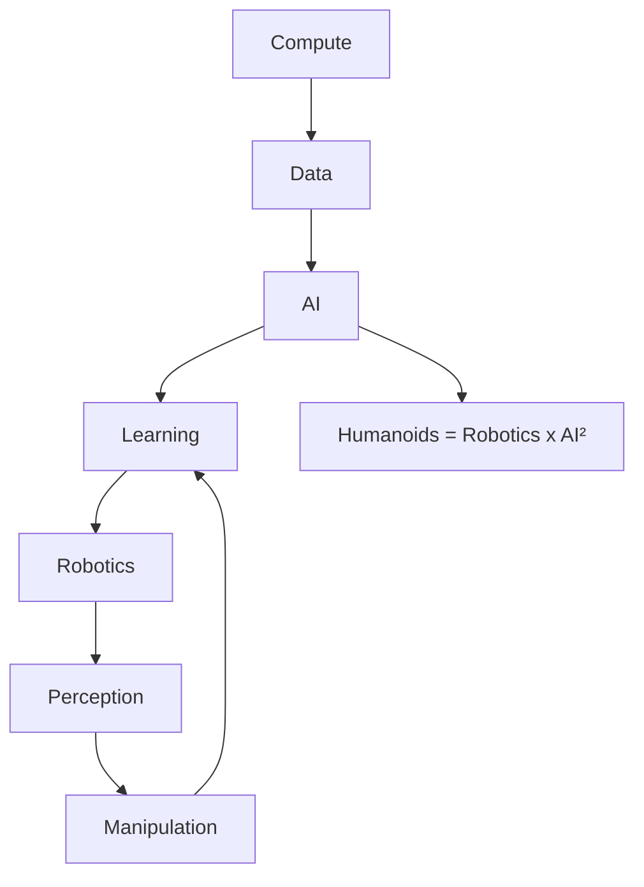

你是闲鱼资料类商品文案编辑，擅长把一份投研/行业/公司研报改写成适合闲鱼发布的商品说明。

【目标】
- 基于下面研报解析内容，生成一份可以复制到闲鱼商品详情里的中文文案。
- 风格参考用户提供的闲鱼对标笔记：标题直给、信息密度高、用途明确、适合人群明确、交付方式清楚。
- 语言要自然，像真实卖家发布，不要像公众号文章、小红书笔记或 AI 摘要。
- 不要使用太夸张的营销词，不要承诺收益，不要说“稳赚”“内幕”“必涨”。
- 可以适度口语化，但不要低俗。
- 硬性要求：全文不要使用任何 emoji 或符号表情。
- 硬性要求：全文必须低于 1500 字，宁可少写，也不要超长。

【必须输出结构】
1. `闲鱼标题：` 一行，控制在 30 字以内，适合商品标题。
2. `商品描述：` 正文，适合直接粘贴到闲鱼详情页。
3. `Hashtag：` 一行，给 6-10 个平台可用标签，用 `#` 开头，空格分隔。

【长度硬性要求】
- 输出总字数必须低于 1500 字，包括标题、商品描述、Hashtag。
- 商品描述控制在 900-1200 字以内，避免写成长文。
- 亮点 bullet 每条控制在 30 字以内。

【严禁输出】
- 不要输出 `建议价格：`。
- 不要输出 `搜索关键词：`。
- 不要输出“搜索词”“关键词”“搜索关键词”等栏目。
- 不要给具体价格区间、成交承诺或价格建议。
- 不要使用任何 emoji，例如 ✅、🔥、📌、👉、💰、⭐ 等。

【商品描述写法】
- 第一段：直接说明这是什么报告，页数/语言/主题/公司或行业。如果页数、日期、语言不确定，就不要编。
- 第二段：说明适合谁，比如投研、券商面试、PE/VC、行业研究、学习参考、写报告等。
- 第三段：用 3-5 个亮点 bullet，风格参考：
  - 三大情景框架：DCF、P/ARR、EV/Sales
  - 关键变量分析
  - 估值逻辑、假设、终值占比等核心内容覆盖
  - 适合准备 AI 相关面试、研究 AI 估值的同学
- 第四段：交付说明，参考：`资料为电子版 PDF，拍下后 24 小时内发网盘链接或邮箱。`
- 第五段：虚拟商品说明，参考：`电子类资料一经发货不退不换，有问题可以提前咨询。`
- 可以补一句：`需要其他报告也可以私聊，支持一站式咨询。`

【Hashtag 写法】
- 只输出平台相对安全、偏学习和资料属性的标签。
- 推荐从这些里选择：`#学习资料` `#研究笔记` `#学习笔记` `#行业研究` `#研报资料` `#资料整理` `#报告学习` `#案例研究`。
- 不要输出 `#财经` `#投资` `#股票` `#基金` `#理财` `#暴富` `#内幕` 等敏感标签。

【平台发布合规要求】
- 不要出现“投资建议”“买入”“卖出”“强烈推荐”“稳赚”“保本”“必涨”“抄底”“上车”“内幕”“翻倍”等金融操作或收益承诺表达。
- “投资”相关词尽量改成“投研”“研究”“观察”“学习参考”；如果必须保留，也要保持中性。
- 不要出现“独家”“原版”“内部”“无水印”“全网最低”“最全”“最强”“必看”等高风险或极限词。
- 不要写“关注”“点赞”“求关注”“评论区留言”等直接互动诱导。
- 不要承诺资料一定可用于获利、就业、通过面试或获得收益。

【合规与避坑】
- 默认避免出现具体投行品牌名，比如“GS”“GS”“MS”，统一写作“投行研报”或“投行研报”。
- 不要承诺研究或交易结果。
- 不要伪造页数、日期、作者、公司覆盖范围。研报未给出时就不写。
- 不要输出解释说明，只输出闲鱼文案本身。

【研报解析内容】
"""
## Investor Presentation | Asia Pacific

# Asia Summer School: Asia Robotics and Humanoids

Humanoids represent the largest embodied AI opportunity, with a projected global TAM of US\$7.5 trillion by 2050, based on MS forecasts. The industry remains at an early stage, but we believe small-scale commercialization will start this year.

## Recent reports:

• 2026 Outlook – Humanoids: Commercialization  
• China Humanoids Survey: High Willingness to Adopt Meets Premature Products  
• Humanoid Horizons: Humanoids Coming to Your Bloomberg Screen  
- Humanoids and Robots – The Next Chapter in China’s Dominance in Global Manufacturing

MS ASIA LIMITED+

## Sheng Zhong

Equity Analyst

Sheng.Zhong@morganstanley.com +852 2239-7821

MS & CO. INTERNATIONAL PLC, SEOUL BRANCH+

## Young Suk Shin

Equity Analyst

Young.Shin@morganstanley.com +82 2 399-4994

MS ASIA LIMITED+

## Carlos Chai

Research Associate

Carlos.Chai@morganstanley.com +852 3963-3180

## Chelsea Wang

Equity Analyst

Jinlin.Wang@morganstanley.com +852 2239-1118

MS & CO. INTERNATIONAL PLC, SEOUL BRANCH+

## Chan Park

Research Associate

Chan.Park1@morganstanley.com +82 2 399-9920


<details>
<summary>text_image</summary>

Asia Summer School 2026
</details>

## CHINA INDUSTRIALS

Asia Pacific

Industry View In-Line

## S. KOREA AUTOS & SHARED MOBILITY

Asia Pacific

MS does and seeks to do business with companies covered in MS. As a result, investors should be aware that the firm may have a conflict of interest that could affect the objectivity of MS. Investors should consider MS as only a single factor in making their investment decision.

## For analyst certification and other important disclosures, refer to the Disclosure Section, located at the end of this report.

+= Analysts employed by non-U.S. affiliates are not registered with FINRA, may not be associated persons of the member and may not be subject to FINRA restrictions on communications with a subject company, public appearances and trading securities held by a research analyst account.

Industry View

In-Line

## Asia Summer School 2026

## FOUNDATION

## MS

June 16, 2026

## INVESTOR PRESENTATION

## Asia Summer School: Asia Robotics and Humanoid

Humanoids represent the largest embodied AI opportunity, with a projected global TAM of US\$7.5 trillion by 2050, based on MS forecasts.

The industry remains at an early stage, but we believe small-scale commercialization will start this year.

## MS Asia/Pacific

MS Asia Limited+

Sheng Zhong

Equity Analyst

Sheng.Zhong@morganstanley.com

+852 2239-7821

MS & Co. International plc, Seoul Branch+

Young Suk Shin

Equity Analyst

Young.Shin@morganstanley.com

+82 2 399-4994

MS Asia Limited+

Carlos Chai

Research Associate

Carlos.Chai@morganstanley.com

+852 3963-3180

Chelsea Wang

Equity Analyst

Jinlin.Wang@morganstanley.com

+852 2239-1118

MS & Co. International plc, Seoul Branch+

Chan Park

Research Associate

Chan.Park@morganstanley.com

+82 2 399-9920

MS does and seeks to do business with companies covered in MS. As a result, investors should be aware that the firm may have a conflict of interest that could affect the objectivity of MS. Investors should consider MS as only a single factor in making their investment decision.

For analyst certification and other important disclosures, refer to the Disclosure Section, located at the end of this report.

+= Analysts employed by non-U.S. affiliates are not registered with FINRA, may not be associated persons of the member and may not be subject to FINRA restrictions on communications with a subject company, public appearances and trading securities held by a research analyst account.

## Humanoid Robotics – The Largest Embodied AI Opportunity; 1bn Stock and US\$7.5tn TAM by 2050e

Global humanoid market size and stock  


<details>
<summary>bar-line hybrid</summary>

| Year | USA ($bn) | China ($bn) | Low Income Countries ($bn) | Lower Middle Income Countries ($bn) | Upper Middle Income Countries (Ex-China) ($bn) | High Income Countries (Ex-USA) ($bn) | Global Humanoid Stock (k's) |
| :--- | :--- | :--- | :--- | :--- | :--- | :--- | :--- |
| 2024 | 0 | 0 | 0 | 0 | 0 | 0 | 0 |
| 2025e | 3 | 0 | 0 | 0 | 0 | 0 | 0 |
| 2026e | 5 | 0 | 0 | 0 | 0 | 0 | 0 |
| 2027e | 7 | 0 | 0 | 0 | 0 | 0 | 0 |
| 2028e | 13 | 0 | 0 | 0 | 0 | 0 | 0 |
| 2029e | 28 | 0 | 0 | 0 | 0 | 0 | 0 |
| 2030e | 30 | 0 | 0 | 0 | 0 | 0 | 0 |
| 2032e | 106 | 0 | 0 | 0 | 0 | 0 | 0 |
| 2034e | 162 | 0 | 0 | 0 | 0 | 0 | 162 |
| 2036e | 454 | 161 | 161 | 161 | 161 | 161 | 454 |
| 2038e | 1,061 | 344 | 344 | 344 | 344 | 344 | 1,061 |
| 2040e | 2,002 | 568 | 568 | 568 | 568 | 568 | 2,002 |
| 2042e | 3,162 | 836 | 836 | 836 | 836 | 836 | 3,162 |
| 2044e | 4,286 | 1152 | 1152 | 1152 | 1152 | 1152 | 4,286 |
| 2046e | 5,498 | 1478 | 1478 | 1478 | 1478 | 1478 | 5,498 |
| 2048e | 6,736 | 1816 | 1816 | 1816 | 1816 | 1816 | 6,736 |
| 2050e | 7,513 | 2152 | 2152 | 2152 | 2152 | 2152 | 7,513 |
Global Humanoid Stock (k's)
</details>

Source: MS estimates. Note: This humanoid sales to external parties, we acknowledge and do not include prototype, internal R&D, and use.

Why Humanoid Robots?  


<details>
<summary>flowchart</summary>


</details>

## Specialized Robotics

+ Technology readily available; Less mechanically and computationally complex  
Highly effective at simple, repetitive tasks that require limited dexterity  
- Ineffective at tasks that require advanced dexterity and/or intelligence  
- May require significant modifications to the workplace to accommodate

## Humanoids

\+ Capable of accomplishing complex tasks that require advanced dexterity and/or intelligence

\+ Limited need to modify existing workplace or methods; Interchangeable with humans.

\- Technology still in development; requires highly-advanced AI and mechanical engineering

\- May require significant training / trial & error

Source: MS.

## What Can Humanoids Do?

## Industrials


<details>
<summary>natural_image</summary>

Interior view of a modern automated factory with robotic arms and conveyor systems (no visible text or symbols)
</details>

Pick and place tasks (material/box carrying)


<details>
<summary>natural_image</summary>

Robot handling packages in a warehouse (no visible text or symbols)
</details>

Logistic line sorting

Quality inspection/testing (auto, battery, 3C production)
Plug-in assembly

## Commercial/Entertainment


<details>
<summary>natural_image</summary>

Exterior view of a modern office building (no signage)
</details>

Unmanned retail/pharma store


<details>
<summary>natural_image</summary>

Stage performance scene with dancers in dynamic poses under dramatic lighting (no visible text or symbols)
</details>

Entertainment – dancing

Reception/shopping guidance
Patrol (police/property management)
Food/grocery delivery

## Household


<details>
<summary>natural_image</summary>

3D rendered illustration of a humanoid robot inside an egg-shaped container, surrounded by floating pillows and abstract light effects (no text or symbols)
</details>

Companion robot


<details>
<summary>natural_image</summary>

Three people in a meeting around a table with a robot arm, set against a window and greenery (no visible text or symbols)
</details>

Helping on household chores

Elderly/assistive care

Health monitoring

Eldercare rehabilitation

## Numerous Companies Across Diverse Backgrounds Have Announced Initiatives in the Humanoid Robotics Business


<details>
<summary>text_image</summary>

Robot makers and new startups
Technology companies
DOBOT ESTUN AUTOMATION RAINBOW ROBOTICS UBTECH
APPTRONIK BostonDynamics DEEP Robotics 云深处科技
ENGINEAI FIGURE 星海图 GALAXEA AI GALBOT 银河通用
LEJU ROBOT LIMX DYNAMICS NEURA ROBOTICS UNITREE
Auto companies
Manufacturers/component suppliers
BMW BYD CHERY 长安汽车 CHANGAN AUTO
Li Auto HYUNDAI 广汽集团 GAC GROUP Mercedes-Benz
TESLA TOYOTA XPENG
Alibaba.com Alphabet
Baidu 百度 ByteDance HUAWEI 地平线 Horizon Robotics
科大讯飞 iFLYTEK Meta Microsoft NAVER
NVIDIA Tencent SAMSUNG mi xiaomi
CATL 宁德时代 Foxconn HENG LI
领益智造 LYITECH Midea KUKA TUOPU拓普
SCHAEFFLER SANHUA RealSense Regal Rexnord
HESAI leaderdrive ASIS 蓝思科技 LENS TECHNOLOGY
</details>

Source: MS. Note: For illustration purpose only, not all inclusive. Represents companies that are either testing, using, or developing their own humanoids.

## Capital Markets Activity is Accelerating – From VC/PE to IPO Preparation

4M2026 global venture funding for humanoid robots has already exceeded the full-year total for 2025...  


<details>
<summary>bar chart</summary>

| Year | Global VC Funding |
| :--- | :--- |
| 2021 | 0.8B |
| 2022 | -34% |
| 2023 | -22% |
| 2024 | 290% |
| 2025 | 198% |
| 4M26 | 9% |
</details>

...resulting in multiple unicorns globally

<table><tr><td>Country</td><td>Date</td><td>Company</td><td>Valuation (US$&#x27;bn)</td></tr><tr><td rowspan="2">US</td><td>Sep-25</td><td>Figure</td><td>39.0</td></tr><tr><td>Feb-26</td><td>Apptronik</td><td>5.3</td></tr><tr><td>Germany</td><td>Jun-26</td><td>Neura Robotics</td><td>7.0</td></tr><tr><td rowspan="6">China</td><td>Jun-25</td><td>Unitree</td><td>1.9</td></tr><tr><td>Feb-26</td><td>AI^2 Robotics</td><td>1.5</td></tr><tr><td>Mar-26</td><td>Galbot</td><td>3.0</td></tr><tr><td>Apr-26</td><td>EngineAI</td><td>1.5</td></tr><tr><td>Apr-26</td><td>Spirit AI</td><td>1.5</td></tr><tr><td>Apr-26</td><td>Galaxea</td><td>3.0</td></tr></table>

A similar VC/PE financing trend is happening in China  


<details>
<summary>bar chart</summary>

| Month | 2024 | 2025 | 2026 |
|---|---|---|---|
| Jan | 5 | 20 | 19 |
| Feb | 3 | 16 | 25 |
| Mar | 7 | 17 | 46 |
| Apr | 6 | 16 | 42 |
| May | 3 | 26 | - |
| Jun | 6 | 28 | - |
| Jul | 7 | 28 | - |
| Aug | 4 | 25 | - |
| Sep | 9 | 29 | - |
| Oct | 6 | 25 | - |
| Nov | 13 | 32 | - |
| Dec | 5 | 43 | - |
</details>

Companies that have filed for IPO to date  
Source: PitchBook, GGII, company/news announcements, MS. Note: Includes all notable funding disclosed based on our knowledge and research; however, some transactions may not be captured.

UNITREE

DEEPRobotics

云深处科技

6

LEJU ROBOT

## What Makes a Humanoid?


<details>
<summary>flowchart</summary>

```mermaid
graph TD
  A["Hardware: the body"] --> B["Data: the fuel"]
  C["Sensors: Linear Activator"] --> D["1. Environmental Inputs"]
  D --> E["2. Sensors"]
  E --> F["3. Brain"]
  F --> G["4. Actuators"]
  G --> H["5. Movement"]
  H --> I["Real Robotics Data: Highest quality, lowest scalability"]
    style A fill:#99ccff,stroke:#333
    style B fill:#99ccff,stroke:#333
    style C fill:#99ccff,stroke:#333
    style D fill:#ffcccc,stroke:#333
    style E fill:#ffcccc,stroke:#333
    style F fill:#ffcccc,stroke:#333
    style G fill:#ffcccc,stroke:#333
    style H fill:#ffcccc,stroke:#333
    style I fill:#ffcccc,stroke:#333
    note right of A: For example:
- Visual-Language-Action (VLA) model
- Nvidia GR00T N1.7
- Figure AI Helix
- UBTECH Thinker-VLA
- Dobot-VLA
- GalaxeaVLA
- World/Video Action Model (WAM/VAM)
- Nvidia Cosmos 3
- 1X World Model
- UBTECH Thinker-WM
- DobotWAM
- Robbyant LingVA
    end
    note right of I: Learning from human videos
High scale potential,
but weak physical grounding
    subgraph Legend
        direction TB
        direction LR
        direction CC
        direction DD
        direction EE
        direction FF
        direction GG
        direction HH
        direction ID
        direction IL
        direction M
        direction N
        direction O
        direction P
        direction Q
        direction R
        direction S
        direction T
        direction U
        direction V
        direction W
        direction X
        direction Y
        direction Z
        direction AA
        direction AB
        direction AC
        direction AD
        direction AE
        direction AF
        direction AG
        direction AH
        direction AI
        direction AJ
        direction AK
        direction AL
        direction AM
        direction AN
        direction AO
        direction AP
        direction AQ
        direction AR
        direction AS
        direction AT
        direction AU
        direction AV
        direction AW
        direction AX
        direction AY
        direction AZ
        direction BA
        direction BB
        direction BC
        direction BD
        direction BE
        direction BF
        direction BG
        direction BH
        direction BI
        direction BJ
        direction BK
        direction BL
        direction BM
        direction BN
        direction BO
        direction BP
        direction BPB
        direction BPBCC
        direction BPBCBCC
    end
```
</details>

Source: MS.

## Hardware BoM Breakdown

Key components include screws, reducers, motors, and sensors  
BoM Cost Breakdown  


<details>
<summary>stacked bar chart</summary>

| Year | Others (%) | Chips (%) | Battery (%) | Bearings (%) | Cameras (%) | Sensor - Force/Tactile (%) | Motors (%) | Reducer (%) | Screw (%) |
|---|---|---|---|---|---|---|---|---|---|
| 2026e | 15 | 5 | 8 | 24 | 6 | 0 | 22 | 15 | 8 |
| 2030e | 14 | 8 | 10 | 21 | 5 | 1 | 21 | 14 | 10 |
| 2035e | 13 | 12 | 12 | 19 | 4 | 2 | 20 | 13 | 12 |
| 2040e | 13 | 15 | 12 | 17 | 4 | 3 | 19 | 12 | 12 |
</details>

Combining demand from other robots, components are set for exponential growth  
  
84x  
US\$268bn  
Camera  
370x  
US\$316bn  
Bearings  
40x  
US\$128bn  
LiDAR  
157x  
US\$1,370bn  
Reducer

  
170x  
US\$2,073bn  
Motor  
1,904x  
US\$1,233bn  
Edge Compute

The component market is projected to have a global TAM of US\$780bn by 2040  
Component TAM Market (US\$'bn)  


<details>
<summary>stacked bar chart</summary>

| Year | Screw | Reducer | Motors | Sensor - Force/Tactile | Cameras | Bearings | Battery | Chips | Others |
| --- | --- | --- | --- | --- | --- | --- | --- | --- | --- |
| 2025e | 2 | 0 | 0 | 0 | 0 | 0 | 0 | 0 | 0 |
| 2026e | 3 | 0 | 0 | 0 | 0 | 0 | 0 | 0 | 0 |
| 2027e | 5 | 0 | 0 | 0 | 0 | 0 | 0 | 0 | 0 |
| 2028e | 9 | 0 | 17 | 0 | 0 | 0 | 0 | 0 | 0 |
| 2029e | 17 | 0 | 19 | 0 | 0 | 0 | 0 | 0 | 0 |
| 2030e | 19 | 0 | 40 | 19 | 19 | 19 | 19 | 19 | 19 |
| 2031e | 50 | 19 | 50 | 40 | 40 | 40 | 40 | 40 | 40 |
| 2032e | 59 | 39 | 73 | 59 | 59 | 59 | 59 | 59 | 59 |
| 2033e | 73 | 59 | 

[中间内容因长度限制已省略]

/td><td>RATING (AS OF)</td><td>PRICE* (06/15/2026)</td></tr><tr><td colspan="3">Chelsea Wang</td></tr><tr><td>China Railway Group (601390.SS)</td><td>E (05/12/2022)</td><td>Rmb4.66</td></tr><tr><td>China Railway Group (0390.HK)</td><td>E (08/11/2025)</td><td>HK$3.69</td></tr><tr><td>China State Construction Engineering (601668.SS)</td><td>U (08/11/2025)</td><td>Rmb4.75</td></tr><tr><td>Han's Laser (002008.SZ)</td><td>O (10/02/2025)</td><td>Rmb124.20</td></tr><tr><td>Hefei Meyer Optoelectronic Technology (002690.SZ)</td><td>E (09/08/2025)</td><td>Rmb14.65</td></tr><tr><td>iRay Technology Company Limited (688301.SS)</td><td>E (01/16/2025)</td><td>Rmb116.00</td></tr><tr><td>Neway Valve (Suzhou) Co., Ltd (603699.SS)</td><td>O (09/12/2025)</td><td>Rmb56.00</td></tr><tr><td>Shanghai BOCHU Electronic Technology (688188.SS)</td><td>O (08/22/2024)</td><td>Rmb159.30</td></tr><tr><td>Shenzhen Envicool Technology Co Ltd (002837.SZ)</td><td>O (08/19/2024)</td><td>Rmb70.53</td></tr><tr><td colspan="3">Sheng Zhong</td></tr><tr><td>Beijing Geekplus Technology Co., Ltd. (2590.HK)</td><td>O (08/07/2025)</td><td>HK$12.82</td></tr><tr><td>Centre Testing International Group (300012.SZ)</td><td>E (11/18/2024)</td><td>Rmb14.41</td></tr><tr><td>CRRC Corp Ltd (1766.HK)</td><td>U (01/22/2026)</td><td>HK$5.49</td></tr><tr><td>CRRC Corp Ltd (601766.SS)</td><td>U (01/22/2026)</td><td>Rmb5.76</td></tr><tr><td>DR Laser (300776.SZ)</td><td>E (12/17/2021)</td><td>Rmb145.29</td></tr><tr><td>Estun Automation Co Ltd (002747.SZ)</td><td>U (06/30/2022)</td><td>Rmb33.23</td></tr><tr><td>Haitian International Holdings Limited (1882.HK)</td><td>E (09/08/2025)</td><td>HK$21.08</td></tr><tr><td>Hongfa Technology Co Ltd (600885.SS)</td><td>O (05/23/2023)</td><td>Rmb32.76</td></tr><tr><td>Jiangsu Guomao Reducer Co Ltd (603915.SS)</td><td>U (01/08/2025)</td><td>Rmb15.99</td></tr><tr><td>Jiangsu Hengli Hydraulic Co.Ltd (601100.SS)</td><td>O (05/23/2023)</td><td>Rmb116.14</td></tr><tr><td>Jingsheng Mechanical &amp; Electrical Co (300316.SZ)</td><td>U (01/08/2025)</td><td>Rmb52.15</td></tr><tr><td>Leader Harmonious Drive Systems (688017.SS)</td><td>O (01/22/2026)</td><td>Rmb372.62</td></tr><tr><td>Sany Heavy Industry Co., Ltd. (600031.SS)</td><td>O (01/08/2025)</td><td>Rmb19.19</td></tr><tr><td>Shenzhen Inovance Technology (300124.SZ)</td><td>++</td><td>Rmb69.30</td></tr><tr><td>Shenzhen SC New Energy Technology Corp (300724.SZ)</td><td>U (09/08/2025)</td><td>Rmb72.42</td></tr><tr><td>Sinotruk (Hong Kong) Limited (3808.HK)</td><td>E (05/19/2025)</td><td>HK$45.92</td></tr><tr><td>Suzhou Maxwell Technologies Co Ltd (300751.SZ)</td><td>U (09/15/2023)</td><td>Rmb213.50</td></tr><tr><td>Times Electric (3898.HK)</td><td>E (01/22/2026)</td><td>HK$40.74</td></tr><tr><td>WeiChai Power (2338.HK)</td><td>O (03/30/2026)</td><td>HK$38.16</td></tr><tr><td>WeiChai Power (000338.SZ)</td><td>O (03/30/2026)</td><td>Rmb29.38</td></tr><tr><td>Wuxi Autowell Technology Co Ltd (688516.SS)</td><td>U (09/08/2025)</td><td>Rmb55.83</td></tr><tr><td>Wuxi Lead Intelligent (300450.SZ)</td><td>O (09/08/2025)</td><td>Rmb42.60</td></tr><tr><td>Zhejiang Dingli Machinery Co Ltd. (603338.SS)</td><td>O (11/05/2025)</td><td>Rmb49.53</td></tr><tr><td>Zhejiang Hangke Technology (688006.SS)</td><td>O (09/08/2025)</td><td>Rmb36.24</td></tr><tr><td>Zhejiang Shuanghuan Driveline Co. Ltd. (002472.SZ)</td><td>O (08/25/2023)</td><td>Rmb42.81</td></tr><tr><td>Zoomlion Heavy Industry (1157.HK)</td><td>O (09/08/2025)</td><td>HK$8.30</td></tr><tr><td>Zoomlion Heavy Industry (000157.SZ)</td><td>O (09/08/2025)</td><td>Rmb7.63</td></tr></table>

Stock Ratings are subject to change. Please see latest research for each company.  
\* Historical prices are not split adjusted.

INDUSTRY COVERAGE: S. Korea Autos & Shared Mobility

<table><tr><td>COMPANY (TICKER)</td><td>RATING (AS OF)</td><td>PRICE* (06/16/2026)</td></tr><tr><td colspan="3">Young Suk Shin</td></tr><tr><td>Hankook Tire &amp; Technology Co Ltd (161390.KS)</td><td>O (11/10/2025)</td><td>W71,000</td></tr><tr><td>Hanon Systems (018880.KS)</td><td>U (01/14/2022)</td><td>W5,190</td></tr><tr><td>Hyundai MOBIS (012330.KS)</td><td>O (01/24/2025)</td><td>W660,000</td></tr><tr><td>Hyundai Motor (005380.KS)</td><td>O (11/27/2024)</td><td>W640,000</td></tr><tr><td>Kia Corp. (000270.KS)</td><td>O (04/26/2022)</td><td>W170,200</td></tr><tr><td>LG Energy Solution (373220.KS)</td><td>E (04/03/2025)</td><td>W410,500</td></tr><tr><td>Mando (204320.KS)</td><td>E (02/05/2024)</td><td>W76,900</td></tr><tr><td>Samsung SDI (006400.KS)</td><td>O (04/28/2026)</td><td>W549,000</td></tr><tr><td>SNT Motiv Co. Ltd. (064960.KS)</td><td>E (05/01/2026)</td><td>W30,700</td></tr></table>

Stock Ratings are subject to change. Please see latest research for each company.  
\* Historical prices are not split adjusted.

© 2026 MS
"""
