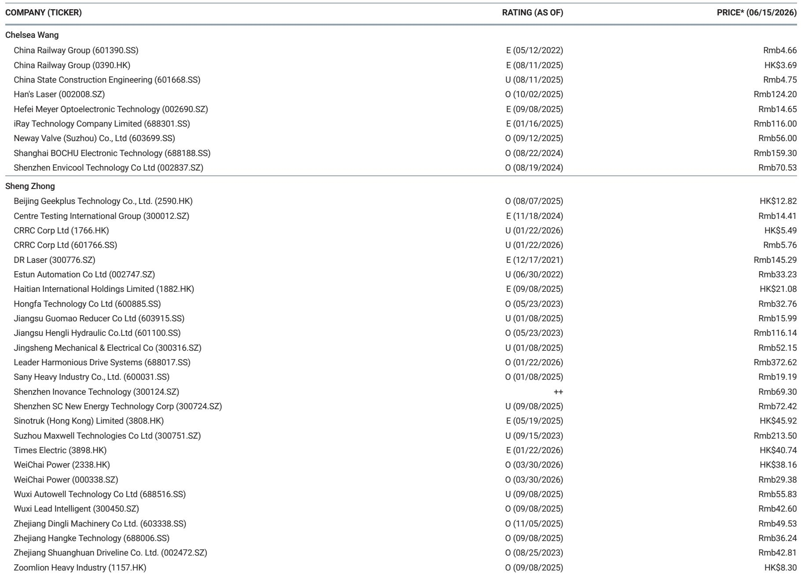
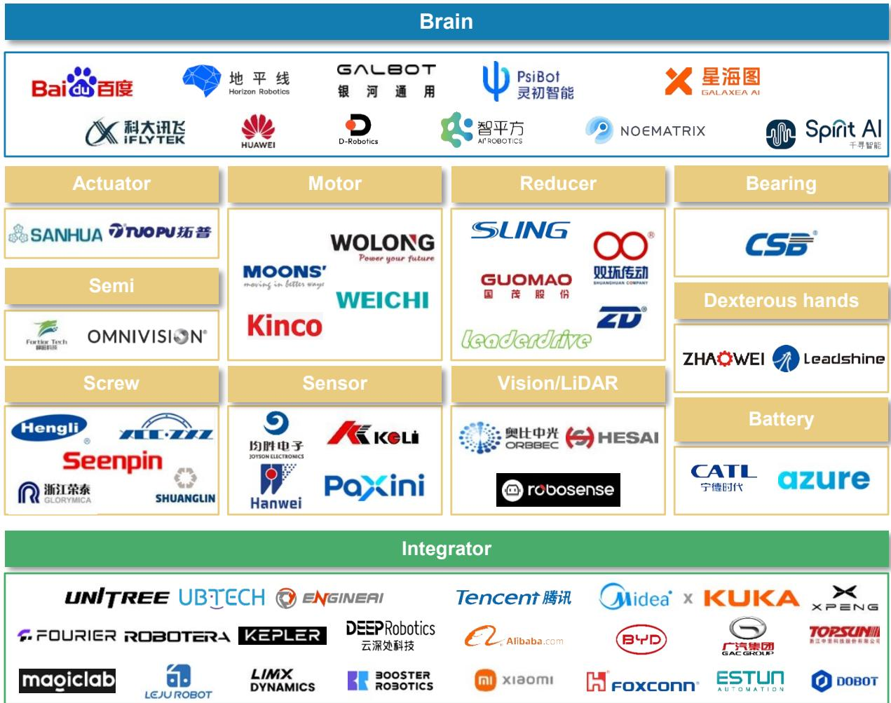

# 摩根斯坦利：人形机器人市场真正被低估的不是需求，而是供应链的再定价

这份报告的发布时间是2026年6月，但它的判断框架值得今天就读懂。

摩根斯坦利亚太研究团队在最新的《Asia Summer School: Asia Robotics and Humanoids》中给出了一个极其明确的预测：到2050年，全球人形机器人市场规模将达到7.5万亿美元，保有量超过10亿台。这个数字本身已经足够震撼，但真正值得产业决策者和投资者关注的，不是终局数字有多大，而是这个市场正在以什么样的节奏、沿着什么样的路径、在哪些环节率先形成真实的经济性。

报告的核心判断可以提炼为一句话：人形机器人正在从“技术可行性验证”阶段，进入“小规模商业化”阶段。2026年就是这个转折点。而这一转折，将驱动整个供应链——从精密零部件到边缘计算芯片——出现一次前所未有的价值重估。

## 1. 商业化不是“即将到来”，而是“已经启动”，但信号藏在供应链里

摩根斯坦利明确判断，小规模商业化将在2026年开始。这不是一个模糊的展望。报告给出的证据链条是清晰的。

从资本市场的活动来看，2026年前四个月全球人形机器人领域的风险投资总额已经超过了2025年全年。多家初创公司在这一期间跻身独角兽行列：美国的Figure估值达到390亿美元，德国的Neura Robotics估值70亿美元，中国的银河通用、星海图、星动纪元等也相继突破10亿美元估值门槛。更值得注意的是，多家公司已经提交了IPO申请——Unitree、Deep Robotics、乐聚机器人都在列。

这意味着什么？资本市场的加速不是终点信号，而是起点信号。当一家行业还在VC/PE阶段就出现如此密集的IPO准备，说明产业资本和金融资本已经形成共识：商业化窗口已经打开，先发优势的窗口期可能比大多数人预期的要短。

但这里有一个容易被忽略的细节。报告在展示融资数据时，2026年的数据只覆盖到4月，就已经超过了2025年全年。如果这一节奏延续，2026年全年的人形机器人融资规模可能会是2025年的3到4倍。这个加速度本身，就是比任何终局预测都更值得关注的信号。

## 2. 7.5万亿美元TAM的假设前提，比数字本身更值得推敲

报告给出的7.5万亿美元TAM和10亿台保有量，是基于什么样的假设？这个问题决定了这个数字的可信度。

从报告的图表结构来看，这个预测隐含了几个关键假设：人形机器人将逐步渗透工业、商业服务和家庭三个场景；单台成本将从目前的数十万美元下降到2万美元以下；全球劳动力市场对人形机器人的接受度将逐步提升。

这三个假设中，最脆弱也最关键的是成本曲线。报告引用的AlphaWise调查显示，企业认为人形机器人的“甜蜜价格点”在10万到20万人民币之间，约合1.4万到2.8万美元。而目前市面上能看到的商业化产品，价格远高于这个区间。

这意味着什么？人形机器人的大规模商业化，本质上不是一个技术问题，而是一个成本问题。而成本问题的答案，不在整机厂，在供应链。谁能在精密减速器、力矩传感器、边缘计算芯片等核心零部件上实现降本，谁就掌握了这个行业最稀缺的定价权。

## 3. 供应链的“隐形爆发”正在发生，但大多数投资者还没注意到

报告最值得反复研读的部分，是对硬件BOM成本的拆解和供应链市场空间的预测。

根据摩根斯坦利的测算，到2040年，仅人形机器人相关的核心零部件市场总规模就将达到7800亿美元。其中，增速最快的不是整机，而是零部件。以2025年为基准，边缘计算芯片的市场规模将增长1904倍，达到1.23万亿美元；力矩传感器增长370倍，达到3160亿美元；电机增长170倍，达到2.07万亿美元；减速器增长157倍，达到1.37万亿美元。

这些数字的倍数关系远大于整机市场本身的增速。逻辑很简单：每一台人形机器人需要数十个关节、数十个传感器、一套完整的计算系统。当保有量从零增长到数千万台时，零部件的需求弹性远大于整机。

更重要的是，报告明确指出，这些零部件并非人形机器人专属。工业机器人、服务机器人、甚至汽车行业都在争夺同一批供应链产能。这意味着，人形机器人的需求增长，叠加其他机器人的需求，可能会在2030年前后形成一轮供应链的供给瓶颈。届时，谁掌握了关键零部件的产能，谁就掌握了定价权。

## 4. 中国供应链的地位被低估了，但路径依赖的风险同样存在

报告在多个地方暗示了中国供应链的重要性。在列举的人形机器人相关公司中，中国企业的数量和覆盖面远超其他国家和地区。从整机厂的宇树科技、傅利叶智能、星动纪元，到零部件环节的绿的谐波、汇川技术、双环传动，再到科技巨头的华为、百度、字节跳动，中国在人形机器人的全产业链布局已经形成。

但这并不意味着中国供应链可以高枕无忧。报告在“行业仍处于早期阶段”一节中明确指出，模型路径尚未收敛，数据稀缺且昂贵，硬件在成本、精度、效率和可靠性方面仍有提升空间。更重要的是，随着产量爬坡，数据安全、政府监管、地缘政治约束将成为新的变量。

对于中国的零部件企业来说，这意味着一个两难选择：如果跟随全球头部整机厂的技术路线，可能面临技术路径切换的风险；如果坚持自主技术路线，又可能因为与主流生态不兼容而失去规模化机会。这个矛盾，报告没有给出明确的答案，但它是所有关注这个赛道的投资者必须思考的问题。

## 5. 报告没有完全回答的一个关键问题：技术路径何时收敛

这可能是整份报告最大的未解问题，也是我们选择不把报告所有内容讲完的原因——因为这个问题需要持续的跟踪和讨论。

报告提到了两种主流的技术路径：VLA（视觉-语言-动作模型）和World Model（世界模型）。前者强调端到端的感知-决策-执行闭环，后者强调机器人对物理世界的因果理解。两种路径各有优劣，但报告没有给出明确的判断，哪一条路径将最终胜出。

这个问题的重要性在于，它直接决定了供应链的演进方向。如果VLA路径胜出，对边缘计算芯片和实时数据处理能力的需求会更高；如果World Model路径胜出，对传感器精度和仿真数据质量的要求会更严苛。不同的技术路径，意味着不同的零部件规格和不同的供应商格局。

报告还提到一个关键的数据困境：真实机器人数据质量最高但可扩展性最差，人类视频数据可扩展性高但物理基础薄弱。这个困境怎么解，报告没有给出明确的答案。它可能是未来1到2年整个行业最需要突破的瓶颈。

## 6. 给读者一个观察框架：用三个问题来校准你的判断

与其试图预测人形机器人市场的终局，不如建立一套持续的观察框架。基于这份报告，我们建议读者关注以下三个问题：

第一个问题是成本曲线。当单台人形机器人的BOM成本下降到2万美元时，这个行业才会真正起飞。关注核心零部件的价格走势，比关注整机厂的估值更直接。

第二个问题是技术路径的收敛信号。当主流整机厂开始采用相似的模型架构和数据策略时，供应链的标准化就会加速，规模效应才会真正释放。关注开源社区和头部企业的技术路线选择。

第三个问题是地缘政治对供应链的影响。人形机器人涉及芯片、传感器、精密制造等多个敏感领域，中美欧之间的技术管制和产业政策，将直接影响全球供应链的分布和效率。关注各国对人形机器人的监管框架和产业补贴政策。

这三个问题，每一个背后都对应着一组可以跟踪的指标和数据。它们比任何终局预测都更有助于你做出当下的判断。

人形机器人市场的故事才刚刚开始。7.5万亿美元的TAM是诱人的，但真正值得押注的，不是那个遥远的终局，而是从现在到终局之间，每一个价值链环节的再定价过程。

这份报告的价值，不在于它给出了一个宏大的数字，而在于它提供了一个可以持续使用的分析框架。如果你对报告中提到的零部件市场空间、技术路径分歧、中国供应链的竞争壁垒等话题有进一步的兴趣，欢迎来星球微信群里继续讨论。我们会在后续的解读中，逐一拆解报告中的关键图表和隐含假设，并持续跟踪这个领域的最新变化。

Personal reading notes and learning share only. Not investment advice.

