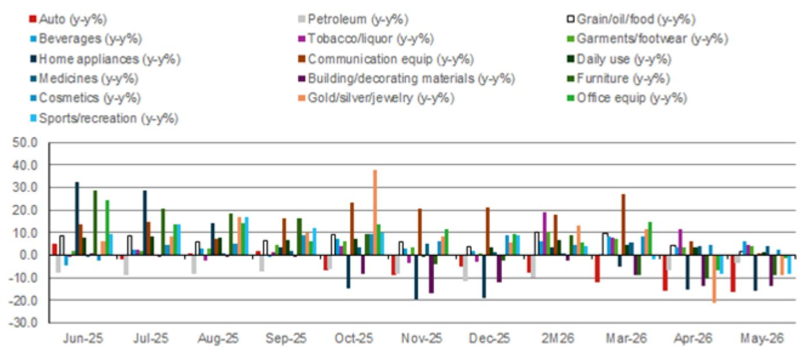
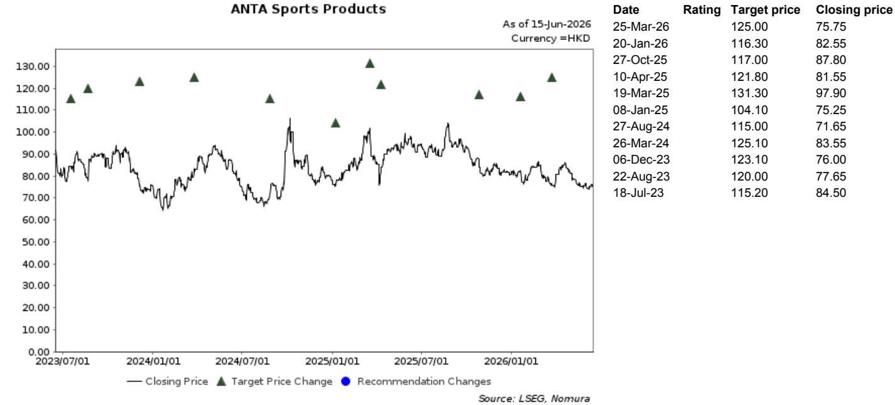
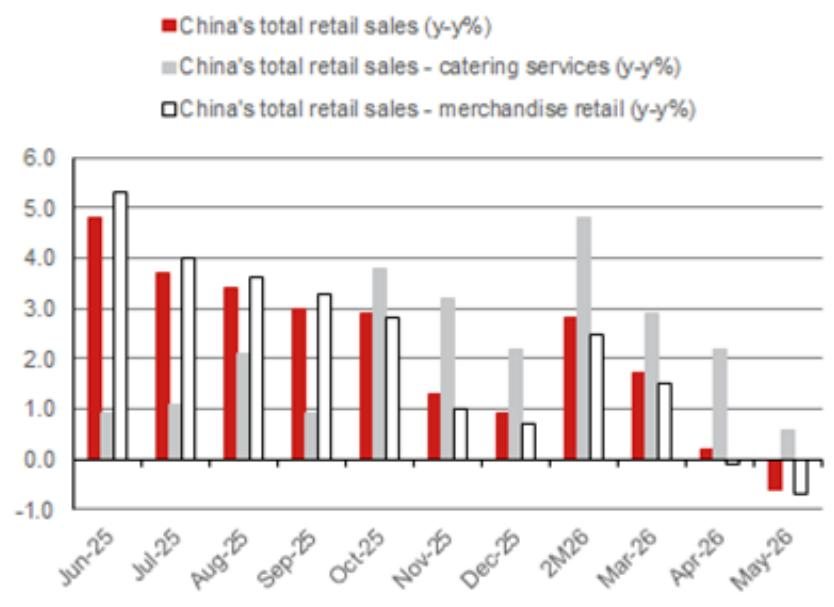

# China’s Retail Contraction Is Not a Blip: It Signals a Structural Consumption Downturn That Policy Cannot Easily Reverse

China’s total social retail sales recorded its first year-on-year decline since the COVID-era lockdowns in May, dropping 0.6% to CNY4.1 trillion. This is not a weather-related anomaly or a statistical quirk caused by base effects. It is a confirmation that the consumption sector has entered a phase of broadening softness that no single policy lever—property recovery in select cities, stock market rallies, or sporadic stimulus—has been able to arrest. The data missed even the modest consensus expectation of a 0.1% increase, and the deterioration was broad-based: merchandise retail sales fell 0.7% year-on-year, worsening from April’s 0.1% decline, while catering services growth slowed to just 0.6% from 2.2% the prior month.

The question for investors is no longer whether Chinese consumption will recover in the second half of the year. The question is whether the current weakness represents a cyclical trough or the beginning of a more permanent downshift in consumer behavior. The evidence from May points toward the latter. Three structural forces are at work: the absence of meaningful demand-side policy stimulation, the limited wealth effect from a property market recovery that remains confined to a handful of tier-1 and tier-2 cities, and the failure of an AI-driven stock market rally to translate into broader consumer confidence. Each of these forces would be concerning on its own. Together, they create a self-reinforcing cycle of caution that is unlikely to break without a fundamental shift in the policy framework.

This article synthesizes the latest data from a global investment bank report, extends the analysis into second-order implications for investors, and identifies the unresolved questions that will determine whether consumption finds a floor or continues to erode. The argument is not that Chinese consumers have stopped spending entirely. It is that they are spending differently, more selectively, and with a heightened sensitivity to value and necessity. The companies that will outperform in this environment are not those betting on a broad recovery, but those that have already adapted their business models to a permanently more cautious consumer.

## The May Retail Data Reveals a Broadening of Weakness That Cannot Be Explained by Weather or Base Effects Alone

The headline figure of a 0.6% year-on-year decline in total social retail sales is striking, but the composition of the decline is more revealing. The primary drag came from enterprises above designated size, whose merchandise sales fell 5.2% year-on-year. This is not a story of small retailers struggling while large enterprises hold steady. It is the opposite: the largest and most established players, which typically have the most pricing power and brand loyalty, are experiencing the sharpest contraction. This suggests that the weakness is not confined to marginal or inefficient operators but is affecting the core of the retail ecosystem.

Breaking down the categories, the pattern is one of broad deterioration punctuated by a few isolated bright spots. Home appliances sales fell 15.6% year-on-year in May, deepening from a 15.1% decline in April. Building and decorating materials remained deeply negative at 13.6% year-on-year. These categories are closely tied to the property market, and their persistent weakness indicates that the recovery in housing transactions in select cities has not translated into spending on furnishings and renovations. The wealth effect from rising property prices, to the extent it exists, is not reaching the consumption categories that would normally benefit.

On the positive side, beverages saw sales accelerate to 6.1% year-on-year growth from 3.6% in April, while garments and footwear held steady at around 3.8% growth. Office equipment sales, while still declining at 1.5% year-on-year, narrowed significantly from a 6.9% decline in April. These categories share a common thread: they are either low-ticket, necessity-driven purchases or they benefit from specific structural trends. Beverages, for example, may be benefiting from the shift toward on-the-go consumption and the expansion of convenience store channels. Garments and footwear may be supported by the sportswear trend that remains resilient even in a weak macro environment.

The so-what for investors is clear: the consumer weakness is not concentrated in a few discretionary categories but is spreading across both discretionary and semi-essential segments. The categories that are holding up are those where consumers perceive clear value or where the purchase is difficult to defer. This pattern is consistent with a consumer who is not panicking but is making deliberate trade-offs. The implication is that companies cannot rely on a rising tide to lift all boats. They must demonstrate that their products occupy a protected position in the consumer’s hierarchy of needs.

## The Three Pillars That Could Have Supported Consumption Are All Failing to Deliver

A recovery in Chinese consumption would typically require at least one of three conditions to be met: meaningful demand-side policy stimulation, a broad-based property market recovery that generates a wealth effect, or a sustained equity market rally that boosts household financial confidence. In May, none of these conditions were present.

First, consumption-related policy stimulation has been notably absent on the demand side. While there have been supply-side measures aimed at supporting specific industries, such as trade-in programs for automobiles and home appliances, these have not translated into a broad-based increase in consumer spending. The reason is structural: the Chinese consumer is not constrained by a lack of supply or by high prices for durable goods. The constraint is on the demand side, driven by income uncertainty, declining household wealth, and a shift in preferences toward saving rather than spending. Policies that subsidize the purchase of specific goods may boost those categories temporarily, but they do not address the underlying reluctance to spend.

Second, the property market recovery remains limited to select tier-1 and tier-2 cities, and even there, the wealth effect is muted. Higher transaction volumes in cities like Shanghai and Shenzhen have not led to a broad recovery in property prices, and homeowners who purchased at elevated prices in previous years are still sitting on unrealized losses. The wealth effect from property operates through two channels: the direct channel, where rising home values make households feel wealthier and more willing to spend, and the indirect channel, where rising property transactions generate income for real estate agents, construction workers, and related service providers. Both channels remain weak. The direct channel is constrained by the fact that most homeowners do not have equity gains to monetize. The indirect channel is constrained by the fact that transaction volumes, while improving, are still well below historical peaks.

Third, the AI-driven stock market rally that began in early 2026 has not translated into broader consumer confidence. The rally has been concentrated in a narrow set of technology and AI-related stocks, and the wealth it has generated has accrued primarily to institutional investors and high-net-worth individuals. For the mass market, the stock market remains a source of anxiety rather than confidence. The typical Chinese household allocates a significant portion of its financial assets to bank deposits and wealth management products, not to equities. Even if the stock market were to rise further, the wealth effect would be limited to a small segment of the population.

The combined effect of these three factors is a consumer who is rationally cautious. There is no catalyst strong enough to overcome the inertia of saving and deleveraging. Until one of these pillars shows signs of sustainable improvement, the consumption outlook will remain subdued.

## The Categories That Are Holding Up Reveal a Consumer That Is Trading Down, Not Out

The May data shows that not all categories are declining equally, and the pattern of relative strength contains important strategic signals. Beverages, garments and footwear, and office equipment are the categories that are either growing or declining less sharply. These categories share a common characteristic: they are either low-ticket items where the cost of trading down is minimal, or they are tied to structural trends that are independent of the macroeconomic cycle.

Beverages, for example, are a category where consumers can easily trade down from premium brands to economy brands without a significant change in utility. The 6.1% year-on-year growth in beverages suggests that consumers are still willing to spend on small indulgences, but they are likely shifting toward lower-priced options within the category. This is consistent with the broader trend of premiumization reversing in China, as consumers become more price-sensitive and less willing to pay a premium for brand alone.

Garments and footwear, which held steady at around 3.8% year-on-year growth, are being supported by the sportswear trend. This is a structural shift that predates the current downturn and is likely to persist regardless of the macroeconomic environment. Chinese consumers, particularly younger demographics, are prioritizing health and fitness, and this is driving demand for athletic apparel and footwear. The sportswear category benefits from multiple tailwinds: government promotion of physical activity, the rise of domestic sportswear brands that offer good value, and the fact that sportswear is perceived as both functional and fashionable. For companies in this space, the key is not to bet on a broad consumption recovery but to capture share within a category that is growing organically.

Office equipment, while still declining at 1.5% year-on-year, narrowed its decline significantly from 6.9% in April. This may reflect a stabilization in corporate spending on office supplies and equipment, which had been cut sharply during the initial phase of the downturn. It may also reflect the fact that office equipment is a necessity for businesses that are still operating, and the decline was unsustainable at the prior rate. The narrowing of the decline is a positive signal, but it is too early to call a recovery.

The strategic implication for investors is that the consumer is trading down within categories rather than cutting spending entirely. This creates opportunities for companies that occupy the value segment of the market, particularly in categories where brand loyalty is low and price sensitivity is high. It also creates risks for companies that are positioned at the premium end of the market, where consumers are most likely to trade down to cheaper alternatives.

## The Report Leaves Unresolved Whether the Current Weakness Is Cyclical or Structural, and the Answer Determines the Investment Horizon

The report provides a thorough analysis of the May data and offers specific stock recommendations, but it does not fully resolve the most important question for long-term investors: is the current consumption weakness cyclical, meaning it will reverse when macroeconomic conditions improve, or is it structural, meaning it represents a permanent shift in Chinese consumer behavior?

The cyclical argument would point to the fact that Chinese consumers have historically been resilient and that the current downturn is driven by temporary factors: the high base effect from the post-COVID recovery, unfavorable weather conditions, and a period of policy uncertainty that will resolve as the government introduces more stimulus. According to this view, consumption will rebound in the second half of 2026 as the base effects fade and as the property market recovery broadens beyond tier-1 and tier-2 cities.

The structural argument would point to deeper forces: an aging population that is naturally more inclined to save than to spend, a labor market that is producing fewer high-quality jobs than in the past, and a shift in consumer preferences away from material consumption and toward experiences and services. According to this view, even if the macroeconomy improves, consumption growth will be structurally lower than in the past, and the categories that benefit will be different.

The data from May does not decisively support either view. The breadth of the decline suggests that the weakness is more than a temporary blip, but the resilience of certain categories suggests that consumers are not in a state of panic. The answer to this question will determine whether investors should be positioning for a cyclical recovery in the second half of 2026 or for a long-term shift toward value-oriented and structurally growing categories.

A related unresolved question is whether the government will introduce more aggressive demand-side stimulus in response to the May data. The report notes that there has been an absence of meaningful consumption-related policy stimulation on the demand side, but it does not predict whether this will change. If the government were to introduce direct cash transfers or broad-based consumption vouchers, it could provide a temporary boost to spending. However, the effectiveness of such measures would depend on whether they change consumer behavior or simply accelerate purchases that would have happened anyway.

## A Decision Framework for Investors: Evaluate Companies on Their Ability to Generate Margin Visibility and Operating Leverage in a Low-Growth Environment

Given the uncertainty about whether the consumption downturn is cyclical or structural, investors need a decision framework that works in either scenario. The report provides the key criteria: companies with clear development strategies, visible margin trends, and attractive valuations. These criteria are not arbitrary. They are designed to identify companies that can generate sustainable returns regardless of the macroeconomic environment.

The first criterion, clear development strategies, is about having a plan that does not depend on a consumption recovery. Companies that are investing in new product categories, expanding into lower-tier cities, or building direct-to-consumer channels are creating their own growth drivers. Companies that are waiting for the macro environment to improve are unlikely to generate returns in the near term.

The second criterion, visible margin trends, is about having pricing power and cost control. In a low-growth environment, revenue growth is hard to come by, and the primary driver of earnings growth is margin expansion. Companies that can maintain or improve their margins through operational efficiency, product mix shifts, or brand strength will outperform those that are forced to discount to maintain volumes.

The third criterion, attractive valuations, is about not overpaying for the potential upside. The report notes that the recent sector-wide share price weakness has created opportunities in companies that meet the first two criteria. The key is to distinguish between companies whose share prices have fallen because of macro headwinds that are temporary and companies whose share prices have fallen because of structural deterioration in their business models.

Applying this framework to the two recommended names in the report is instructive. ANTA Sports Products is recommended in the sportswear sector, which benefits from the structural trend toward health and fitness. ANTA’s multi-brand strategy, which includes both mass-market and premium brands, gives it exposure to different segments of the market and reduces its dependence on any single consumer group. Laopu Gold is recommended in the retail space, with the report noting its ability to maintain relatively stable margin trends and improve operating leverage, especially if spot gold prices stabilize. Gold jewelry benefits from the dual demand for consumption and investment, and Laopu’s positioning in the premium segment gives it pricing power.

The strategic question for investors is not whether these specific companies are good investments, but whether the framework itself is robust. The report’s emphasis on margin visibility and operating leverage is consistent with a view that the consumption environment will remain challenging. Investors who apply this framework will be biased toward companies that can generate returns through internal improvements rather than external tailwinds.

## Join the Community to Read the Full Report and Review the Original Charts

The analysis above synthesizes the key insights from a detailed research report on China’s May retail sales data, but it cannot capture the full depth of the category-level breakdowns, the historical comparisons, or the specific valuation models that support the stock recommendations. The original report includes charts that show the trend in total social retail sales over the past year, as well as a detailed breakdown by category that reveals which segments are weakening and which are holding up. These charts are essential for investors who want to form their own view on the trajectory of Chinese consumption.

The report also includes the analyst certification, the target price history for the recommended stocks, and the full disclaimer, all of which are important for understanding the context and limitations of the analysis. Reading the full report allows investors to assess the quality of the data, the assumptions behind the forecasts, and the risks that could derail the investment thesis.

Join the community to read the full report and review the original charts. The community provides access to this and other reports, as well as discussions with analysts and other investors who are navigating the same uncertainties. In a market where the consensus view is often wrong, having access to detailed, source-level analysis is a competitive advantage.

*This article is for learning and discussion only and does not constitute investment advice.*

Personal reading notes and learning share only. Not investment advice.

