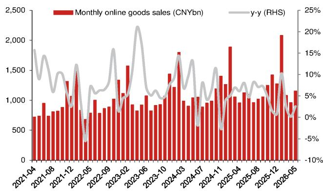
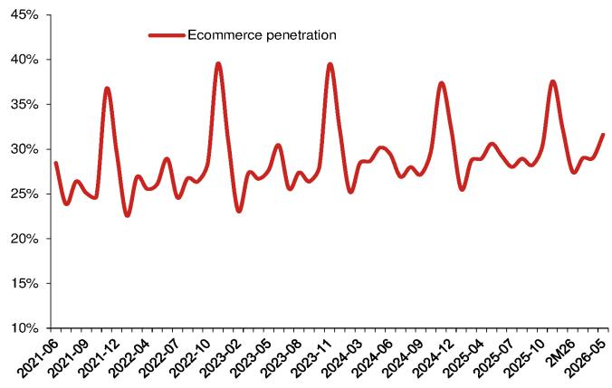
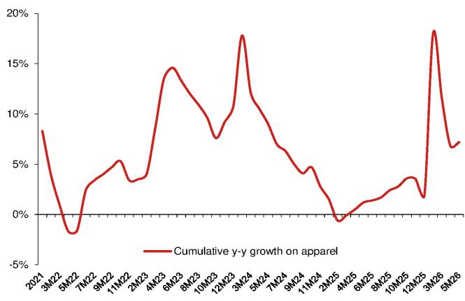

# China's E-Commerce Growth Is Stabilizing, Not Accelerating — And That Changes the Strategy for Investors

China's e-commerce sector recorded 2.6% year-on-year sales growth in May 2026, a modest acceleration from April's 0.2% reading that on the surface looks like a recovery story. It is not. The real narrative is that e-commerce penetration has reached a structural plateau near 31.6%, and the marginal gains from here will come from category-specific dynamics, not broad-based digital adoption. For investors, the May data signals the end of the penetration-driven growth era and the beginning of a far more granular, category-by-category competition that rewards operators with supply-chain depth and pricing power, not just traffic.

The headline acceleration from 0.2% to 2.6% year-on-year growth is meaningful but deceptive. April's figure was an anomaly driven by a compressed post-Lunar New Year consumption cycle and unfavorable base effects. May's number, while better, remains well below the double-digit growth rates that defined Chinese e-commerce as recently as 2023. The deeper story lies in the divergence between categories: online food and beverage sales held steady at 15.5% cumulative growth through May, apparel accelerated modestly to 7.2%, but household goods decelerated to 1.6%. This is not a uniform recovery. It is a sorting process.

The strategic question for investors is no longer whether e-commerce will grow, but which categories will grow, at whose expense, and under what margin structure. The May 2026 data from the National Bureau of Statistics provides the raw material for that analysis, but the implications extend far beyond the monthly print. This article interprets the pattern, identifies the unresolved questions, and provides a decision framework for positioning in the next phase of China's digital retail evolution.

## The Slowdown in Discretionary Spending Is Structural, Not Cyclical, and It Is Reshaping Platform Economics

The most telling data point in the May report is not the e-commerce aggregate but the performance of discretionary categories. Home appliance sales fell 15.6% year-on-year, nearly unchanged from April's 15.1% decline. PC sales narrowed their decline to 1.5% from 6.9%, but that improvement reflects a low base more than genuine demand recovery. Smartphone sales edged up just 0.7%, decelerating sharply from 6.2% growth in April due to high base effects and price increases from memory chip cost inflation.

What matters here is the pattern. Discretionary categories are not experiencing a temporary demand pause; they are facing structural headwinds that will not reverse with a single policy stimulus or holiday season. The home appliance category is particularly instructive. The 15.6% decline is attributed partly to high base effects and partly to dwindling trade-in subsidies. But the deeper issue is that the subsidy-driven consumption pull-forward has exhausted latent demand. Once consumers have upgraded their refrigerators and air conditioners under government incentive programs, there is no natural replacement cycle for several years. The e-commerce platforms that depended on these categories for high-average-order-value transactions are now facing a revenue gap that cannot be filled by lower-ticket staples.

The implication for investors is that platform-level revenue growth will continue to decouple from transaction volume growth. Platforms will need to extract more value per transaction through higher commission rates, advertising revenue, or logistics fees. But each of these levers faces limits. Higher take rates risk driving merchants to competing channels. Advertising load increases risk degrading user experience. The platforms that succeed in this environment will be those that can shift their revenue mix toward higher-margin services such as cloud computing, financial technology, or international expansion — not those that rely on domestic e-commerce transaction growth.

## Food and Beverage E-Commerce Has Become a Defensive Anchor, But Its Growth Model Is Maturing

Online food and beverage sales recorded 15.5% cumulative year-on-year growth through May, essentially flat with the 15.6% pace in April. This category has been the most resilient segment of Chinese e-commerce, driven by the structural shift toward convenience-oriented grocery delivery and meal-kit services. The growth rate, while impressive, has been remarkably stable for over a year. The cumulative growth figure has hovered between 15% and 16% since mid-2025, with only a brief spike to 21% in March 2026 that was likely a seasonal effect from the Lunar New Year.

Stability at 15% growth is a double-edged sword. On one hand, it provides a reliable revenue base for platforms with exposure to food and beverage, insulating them from the volatility in discretionary categories. On the other hand, it signals that the category is maturing. The early adopters have been captured. The marginal new user acquisition cost is rising. The growth is now coming from increased order frequency among existing users rather than new user acquisition, which means the addressable market is approaching its natural ceiling.

The strategic implication is that food and beverage e-commerce is transitioning from a growth business to a cash-flow business. The winners in this category will be those that can optimize unit economics — reducing delivery costs, improving inventory turnover, and increasing average order value through cross-selling — rather than those that simply chase top-line growth. For investors, this means the valuation premium that food and beverage e-commerce has commanded should narrow over time as the category's growth trajectory converges with that of more mature retail segments.

## Apparel E-Commerce Is Recovering, But the Recovery Is Narrow and Vulnerable to Shifts in Consumer Sentiment

Online apparel sales recorded 7.2% cumulative year-on-year growth through May, up modestly from 6.8% in April. The improvement is welcome, but the trajectory is far from robust. Apparel e-commerce has been volatile over the past three years, swinging from 18% growth in early 2024 to near-zero growth in early 2025, then recovering to 18% again in March 2026 before settling at 7.2% in May.

This volatility reflects the category's sensitivity to consumer confidence and discretionary income. Apparel is not a necessity in the way that food and daily necessities are. When consumers feel uncertain about their economic prospects, they defer wardrobe upgrades. When sentiment improves, they catch up. The May data suggests that consumer confidence is improving but remains fragile. The 7.2% growth rate is consistent with a cautious consumer who is willing to spend but not eager to splurge.

For investors, the key question is whether apparel e-commerce can sustain even this moderate growth rate through the second half of 2026. The base effects become less favorable after mid-year, and the macro environment remains uncertain. If consumer sentiment deteriorates, apparel will be the first category to feel the impact. Platforms with heavy exposure to apparel will need to demonstrate that they can maintain margins even if volume growth disappoints. That means focusing on inventory management, return rates, and private-label development — operational metrics that matter more in a slow-growth environment than in a boom.

## The Report Leaves Unanswered a Critical Question: Can Trade-In Subsidies Be Replaced by Structural Demand Drivers?

The May report attributes the home appliance decline partly to dwindling trade-in subsidies, but it does not answer the question of what comes next. Government subsidy programs have been a significant driver of durable goods consumption in China over the past two years, pulling forward demand that would otherwise have materialized over a longer period. As these programs phase out, the natural question is whether organic demand will be sufficient to fill the gap.

The evidence from May suggests it will not — at least not in the near term. The home appliance category declined 15.6% year-on-year despite relatively easy comparisons. The smartphone category grew only 0.7% despite the launch of new models. These figures imply that consumers are not voluntarily stepping in to replace the government as the driver of demand. The question is whether this is a temporary adjustment period or a permanent shift in consumption patterns.

If it is temporary, then the second half of 2026 should see a recovery as the pull-forward effect dissipates and replacement cycles resume. If it is permanent, then the e-commerce platforms that are heavily dependent on durable goods categories will need to fundamentally restructure their business models. The report provides the data but not the answer. Investors will need to monitor the July and August data closely to determine which scenario is playing out. A continued decline in home appliance sales through the summer would be a strong signal that the structural headwinds are more powerful than the cyclical recovery.

## A Decision Framework for Investors: Three Questions to Determine Positioning in Chinese E-Commerce

The May data provides a lens for evaluating e-commerce platform investments, but it must be applied through a structured decision framework. Investors should ask three questions when assessing any Chinese e-commerce exposure.

First, what is the category mix? Platforms that derive a high proportion of revenue from food and beverage and apparel are better positioned than those that depend on home appliances and consumer electronics. The former categories are growing at 7% to 15%, while the latter are declining or barely growing. Category mix is now the single most important determinant of top-line growth potential.

Second, what is the margin structure? In a low-growth environment, margin expansion becomes the primary driver of earnings growth. Platforms that can increase take rates, reduce logistics costs, or shift revenue toward higher-margin services will outperform those that rely on transaction volume growth. The May data confirms that volume growth alone will not be sufficient to drive investor returns.

Third, what is the exposure to government policy? Platforms that benefited from trade-in subsidies and other stimulus programs face a headwind as those programs wind down. Platforms that are insulated from policy shifts — for example, those focused on food and beverage or cross-border e-commerce — have more predictable revenue trajectories.

These three questions do not yield a single answer for all investors, but they provide a consistent framework for evaluation. The platforms that score well on all three dimensions are the ones most likely to deliver relative performance in the current environment. Those that score poorly on one or more dimensions carry specific risks that must be priced into the investment thesis.

## The Next Phase of Chinese E-Commerce Will Be Defined by Operational Excellence, Not Top-Line Growth

The May 2026 data marks a transition point for Chinese e-commerce. The era of double-digit penetration gains is over. The era of category-specific competition, margin optimization, and operational discipline has begun. The platforms that thrive in this environment will not be the ones with the most users or the most merchants, but the ones with the best cost structures, the most efficient logistics, and the most effective monetization strategies.

For investors, this means adjusting expectations. The 20% to 30% revenue growth that defined the sector's golden age is unlikely to return. Single-digit growth, combined with margin expansion, will be the new normal. The winners will be those that can deliver mid-teens earnings growth on low-single-digit revenue growth — a formula that requires relentless operational focus.

The report from the National Bureau of Statistics provides the data, but the interpretation belongs to the investor. The patterns are clear. The questions are defined. The framework is available. What remains is the judgment call on which platforms have the management teams, the business models, and the strategic positioning to execute in this new environment.

Join the community to read the full report and review the original charts.

*This article is for learning and discussion only and does not constitute investment advice.*

Personal reading notes and learning share only. Not investment advice.

