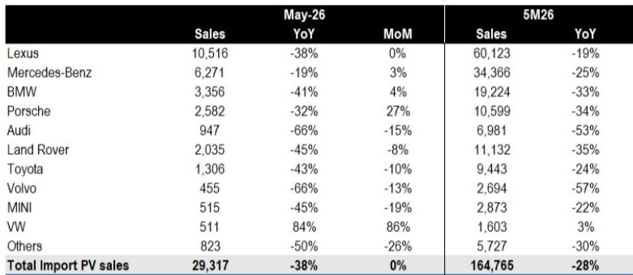
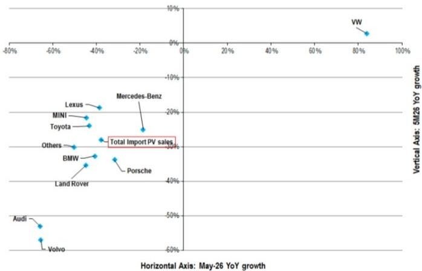

# Citi：进口车市场正在经历的不是周期性波动，而是品牌溢价能力的根本性分化

中国进口车市场正在经历一场超出多数人预期的结构性调整。Citi最新发布的基于ThinkerCar保险数据的研报显示，2026年5月，中国进口乘用车零售销量同比下滑38%，环比零增长，当月销量仅为2.93万辆。前五个月累计销量16.48万辆，同比下跌28%。

这些数字本身已经足够引人注目。但比总量下滑更值得关注的，是不同品牌之间的表现差异——这种差异指向一个更深层的判断：进口车市场正在从“品牌驱动”向“产品力与价格匹配度驱动”切换，而大多数传统豪华品牌尚未完成这一转变。

Citi这份报告的价值不在于它披露了销量数字——这些数据市场已有感知——而在于它提供了一个清晰的、可横向比较的品牌表现图谱。透过这张图谱，我们可以识别出哪些品牌正在失去议价权，哪些品牌尚能维持基本面，以及更重要的是，哪些结构性变量正在重塑这个市场的竞争逻辑。

以下是我们从这份报告中提炼出的五个核心洞察。

## 1. 雷克萨斯和奔驰的相对韧性说明，品牌护城河正在从“豪华认知”转向“供需纪律”

在几乎所有品牌都录得两位数下滑的背景下，雷克萨斯和奔驰的表现值得单独拿出来讨论。雷克萨斯5月销量10,516辆，同比下滑38%，但环比持平；前五个月累计销量60,123辆，同比下滑19%。奔驰5月销量6,271辆，同比下滑19%，环比增长3%；前五个月累计34,366辆，同比下滑25%。

从绝对数字看，这两个品牌同样身处下行通道。但从相对位置看，它们明显优于同行。宝马5月销量3,356辆，同比下滑41%；保时捷2,582辆，同比下滑32%；奥迪947辆，同比下滑66%；路虎2,035辆，同比下滑45%。

这里的核心差异不在于品牌知名度——这些都是全球顶级豪华品牌——而在于供需管理能力。雷克萨斯在中国市场长期坚持“不压库”策略，经销商库存深度维持在较低水平。奔驰在过去两年中也逐步调整了进口车型的定价和配额策略。这意味着当需求收缩时，这些品牌面临的价格倒挂压力相对较小。

反观奥迪和沃尔沃，5月同比分别下滑66%和66%，前五个月累计分别下滑53%和57%。这种幅度的下滑已经不能用“消费疲软”来解释。它更接近于一种信号：当品牌在终端市场失去定价权后，经销商体系的信心会迅速瓦解，形成“降价-观望-再降价”的负向螺旋。

这里隐含的判断是：进口车市场的下一轮洗牌，赢家不会是品牌力最强的，而是供需纪律最严的。

## 2. 大众进口车的逆势增长是一个值得警惕的异类信号，而非趋势反转

在所有品牌中，大众是唯一实现正增长的。5月销量511辆，同比增长84%，环比增长86%；前五个月累计1,603辆，同比增长3%。考虑到大众进口车在中国市场长期处于边缘地位，这个数据很容易被解读为“性价比车型正在崛起”。

但我们认为，这个判断需要谨慎对待。大众进口车目前的销量基数极低——月均仅300余辆——在这个量级上，单一经销商的大宗采购或某个车型的集中交付就足以造成数据的大幅波动。Citi报告本身也没有对这一异常值做出额外解读，这本身就说明该机构认为这不具备趋势意义。

更值得关注的是，大众进口车在中国市场的产品线以途锐等高端车型为主，其定价区间与二线豪华品牌直接重叠。如果大众的逆势增长能够持续三个季度以上，才可能意味着“豪华品牌溢价正在被务实消费逻辑侵蚀”这一判断成立。但在当前阶段，它更可能是一个统计噪音。

真正需要警惕的是：如果大众这种低基数品牌都能在特定月份实现增长，而奥迪、沃尔沃等传统豪华品牌却面临断崖式下滑，说明问题不出在“市场有没有需求”，而在于“消费者愿不愿意为这个品牌的溢价买单”。

## 3. 保时捷的环比改善掩盖了一个更深层的隐忧：超豪华品牌的客群正在缩圈

保时捷5月销量2,582辆，同比下滑32%，但环比大幅增长27%。从环比角度看，这似乎是所有品牌中改善最明显的。但结合前五个月累计下滑34%来看，这个环比改善更可能是季度末交付节奏扰动，而非需求回暖。

保时捷面临的真正挑战在于它的客群结构。与奔驰、宝马不同，保时捷的买家中有相当比例是“可选消费型”高净值人群——他们购买一台卡宴或帕拉梅拉，更多是出于消费升级或社交需求，而非刚需换车。在当前宏观经济预期不明朗的背景下，这部分消费是最先被推迟或取消的。

Citi报告没有直接讨论这个问题，但数据已经给出了暗示：保时捷前五个月累计销量刚刚超过1万辆，而雷克萨斯同期是6万辆。这不仅仅是价格区间的问题——保时捷的客单价远高于雷克萨斯——它反映的是“可买可不买”型消费正在系统性收缩。

对于关注超豪华品牌资产定价的读者来说，这是一个需要持续跟踪的信号。如果保时捷的销量在接下来的三季度仍无法回到同比持平的水平，那么超豪华品牌在中国市场的估值逻辑可能需要重新审视。

## 4. 报告尚未完全回答的关键问题：进口车下滑有多少是“国产替代”造成的，又有多少是“需求萎缩”造成的

这是Citi这份报告最有价值但也最未充分展开的地方。报告提供了详尽的品牌层面数据，但它没有区分两种完全不同的下滑原因：

一种情况是，消费者仍然有购买该品牌的需求，但转向了该品牌的国产车型。例如，宝马X5国产化后，进口X5的需求自然会下降。这种情况下，品牌在中国的总销量（国产+进口）可能并未显著下滑。

另一种情况是，消费者从整体上减少了对该品牌的需求，无论国产还是进口。这种情况下，品牌在中国市场的基本面正在恶化。

这两种情况对应的投资含义截然不同。前者意味着渠道结构在变化，后者意味着品牌价值在衰减。Citi报告没有提供国产车型的对比数据，也没有讨论进口车下滑中有多少是“被国产替代”的。对于希望判断具体品牌前景的投资者来说，这是一个需要自行补充分析的关键缺口。

我们初步判断，对于宝马、奔驰这些在中国有大规模国产产能的品牌，进口车下滑中“国产替代”的权重可能较高。而对于保时捷、雷克萨斯（除ES外大部分车型仍为进口）、路虎等品牌，进口车下滑更多反映了真实需求的收缩。但这一判断仍需更细颗粒度的数据验证。

## 5. 这份报告提供的最佳观察框架不是“谁跌得少”，而是“谁在5月比前五个月表现更差”

Citi报告中的Figure 2是一个散点图，将各品牌的5月同比增速与前五个月累计同比增速做了对比。这个对比框架的价值在于：它可以告诉你哪些品牌的恶化是在加速的。

从数据来看，大多数品牌5月的同比跌幅都大于前五个月的累计跌幅，这意味着整个行业的下行在5月并没有触底。但不同品牌之间的差异值得注意：奔驰5月同比下滑19%，而前五个月累计下滑25%——这意味着奔驰在5月的表现实际上优于前四个月的平均水平。这是一个边际改善的信号。

相比之下，奥迪5月下滑66%，前五个月累计下滑53%——5月的恶化速度明显快于平均。沃尔沃的情况类似，5月下滑66% vs 前五个月累计下滑57%。这些品牌不仅在下滑，而且下滑在加速。

这个框架对投资者的含义是：不要只看静态的市占率或同比数据，要看动态的边际变化。一个品牌如果在连续三个季度中每个季度的下滑幅度都在收窄，即使它仍然是负增长，也值得关注。反之，一个品牌如果下滑在加速，即使它的绝对销量仍然很大，也需要警惕。

Citi报告没有在这个方向上做更深入的分析，但数据本身已经提供了足够的素材。对于订阅完整报告的读者来说，结合月度趋势数据做进一步的二阶导分析，将是判断品牌拐点的关键。

---

这份Citi研报只有8页，提供的数据点也非常聚焦——就是一张销量表和一张散点图。但正是这种克制，让数据本身的说服力得以凸显。在信息过载的时代，能够把一件事说清楚的报告，往往比堆砌数据的报告更有价值。

当然，这份报告也有其天然的边界。它没有讨论关税政策变化对进口车定价的影响，没有分析新能源进口车型的渗透率变化，也没有给出具体的品牌评级或目标价调整。这些恰恰是完整报告中更值得深入探讨的部分。

如果你对进口车市场的结构性变化感兴趣，或者正在关注某个具体品牌的资产定价逻辑，欢迎来我们的星球微信群里继续讨论。群里我们会分享Citi这份报告的原始图表数据，以及我们基于月度趋势做的品牌边际变化追踪框架。这些在公开渠道不容易拿到，但对于判断行业拐点有直接的参考意义。

Personal reading notes and learning share only. Not investment advice.

