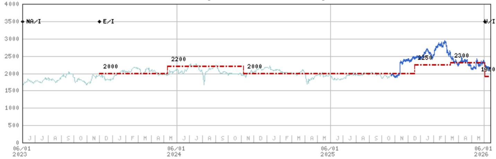
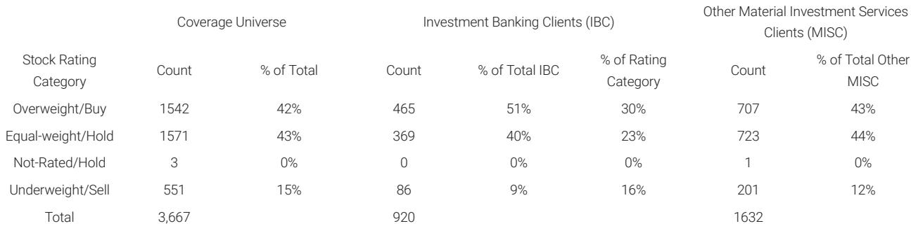
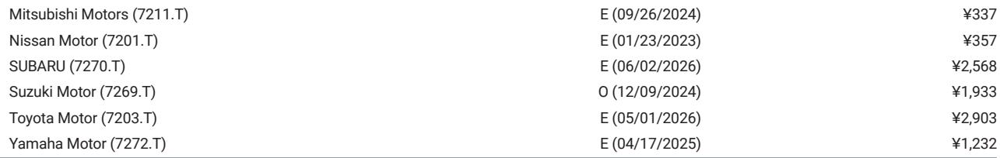

# The Market Has Priced a Middle East Resolution Into Japanese Autos—But the Structural Threats from China Have Not Yet Been Discounted

Investor sentiment toward Japanese auto stocks has fractured into two camps. On one side stand the cautious, who see the ongoing situation in the Middle East as a reason to remain underweight the sector. On the other side, a growing minority has shifted to a more bullish posture, betting that a resolution to regional instability will unlock a recovery in share prices that have already fallen. This divergence is not merely a matter of risk appetite. It reflects a deeper analytical tension: the market is pricing a near-term geopolitical resolution, but it has not yet fully confronted the structural displacement that Chinese original equipment manufacturers represent.

In June, a global investment bank conducted visits with institutional investors in New York and San Francisco. The feedback from those meetings reveals a sector at a strategic inflection point. The conversations were dominated by two concerns: the impact of supply chain constraints and rising raw materials costs tied to the Middle East, and the accelerating erosion of Japanese OEM market share as Chinese automakers gain traction globally. A third topic, the upcoming review of the US-Mexico-Canada Agreement in July 2026, added a layer of regulatory uncertainty that few investors have fully modeled.

The central argument of this article is that the current investor divide is too narrow. The bull case is premised on a single catalyst—geopolitical normalization—while the bear case is too focused on cyclical headwinds. What is missing from both narratives is a rigorous assessment of how Japanese automakers' strategic responses to Chinese competition, coupled with their positioning in the USMCA review, will determine which companies emerge as long-term winners and which face permanent impairment.

The report from which this analysis draws provides a granular look at how investors are thinking about each major Japanese auto name. But the report's true value lies not in its stock-by-stock summaries. It lies in the pattern those summaries reveal: investors are asking the right questions about individual companies, but they have not yet connected those questions into a coherent framework for the sector as a whole. This article aims to build that framework.

---

## Investor Bullishness on Japanese Autos Rests Almost Entirely on a Single Geopolitical Catalyst That May Not Materialize

The most striking finding from the investor visits is the asymmetry in conviction. Most investors remain cautious, but those who have turned bullish are doing so on a narrow thesis: that the Middle East situation will resolve, and that stocks which have fallen the most on the deterioration will rebound the hardest. This is a tactical trade, not a strategic conviction.

The logic is straightforward but fragile. If the geopolitical situation stabilizes, supply chain disruptions ease, raw material costs decline, and the demand outlook improves. In that scenario, stocks like Mazda, which has seen expectations for its new CX-5 SUV model fade as the situation worsened, could see a sharp re-rating. Similarly, Nissan, where many investors acknowledge progress in fixed cost reduction but remain concerned about free cash flow, would benefit from a cyclical tailwind.

But the bull case does not address the second-order effects of the Middle East situation. Even if a resolution comes, the disruptions of the past year have accelerated supply chain diversification away from the region. Japanese automakers that relied on Middle Eastern supply routes may find that their cost structures have permanently shifted, not reverted. Moreover, the bullish scenario assumes that Chinese OEMs will not use the period of disruption to deepen their market share gains in regions like ASEAN, where Mitsubishi Motors is already facing a stiffer competitive climate.

The risk is that investors are treating a binary geopolitical event as the sole variable, when in fact the industry is undergoing a multi-dimensional transformation. A resolution in the Middle East would remove one headwind, but it would not reverse the competitive dynamics that Chinese automakers have set in motion.

---

## Chinese OEM Market Share Gains Are Not a Cyclical Threat—They Are a Structural Reconfiguration That Most Investors Have Underestimated

The second dominant theme from the investor meetings was concern about the rise of Chinese OEMs. This concern is well-founded, but it is also underdeveloped. Investors are asking the right question—"How will Japanese automakers defend their market share?"—but they are not yet asking the harder question: "Which Japanese automakers have the strategic assets to compete in a world where Chinese OEMs are the incumbents in their home market and aggressive challengers everywhere else?"

The report highlights that Toyota's conservative operating profit guidance for F3/27 is not well understood by investors. This is a critical gap. Toyota's guidance likely embeds a realistic assessment of the competitive pressure from Chinese OEMs in key markets, particularly in Southeast Asia and the Middle East. The conservative nature of the guidance may reflect a deliberate strategy to under-promise and over-deliver, but it may also signal that Toyota's leadership sees headwinds that the market has not yet priced.

For Honda, the investor questions shifted toward energy storage systems and two-wheelers, reflecting a recognition that the four-wheeler business faces structural headwinds. But the concern about profit margins worsening with rising exposure to EVs is telling. Honda is trying to pivot, but the pivot itself introduces new risks. The question investors should be asking is not whether Honda can grow in ESS and two-wheelers, but whether those businesses can generate sufficient returns to offset the margin compression in EVs.

For Nissan, the focus on fixed cost reduction and free cash flow is understandable, but it misses a larger point. Cost cutting can extend a company's runway, but it cannot generate growth. In a market where Chinese OEMs are adding capacity and cutting prices, cost efficiency is table stakes, not a competitive advantage.

The pattern across all three major Japanese automakers is that investors are treating Chinese competition as a market share problem. It is not. It is a business model problem. Chinese OEMs are not just cheaper; they are faster to market, more willing to experiment with direct-to-consumer models, and less burdened by legacy dealer networks. Japanese automakers are responding, but the pace and scale of their responses vary dramatically by company.

---

## The USMCA Review in July 2026 Will Create a Regulatory Shock That the Market Has Not Yet Discounted

One of the most underappreciated topics from the investor visits was the upcoming review of the US-Mexico-Canada Agreement. The report notes that investors asked many questions about how this review might affect Japanese automakers. That is the right instinct, but the analysis needs to go deeper.

The USMCA review is not a routine regulatory check. It is a potential renegotiation of the rules that govern the largest auto market in North America. For Japanese automakers with significant production capacity in Mexico, the stakes could not be higher. If the review leads to stricter rules of origin, higher regional value content requirements, or changes in labor value content rules, the cost structure of Japanese OEMs in North America could shift materially.

The report specifically highlights Isuzu, where the underweight rating received limited pushback from investors. Isuzu's high sales exposure to the Middle East is the primary risk factor cited, but the USMCA review adds another layer of uncertainty. For companies like Toyota and Nissan, which have deep production footprints in the US and Mexico, the risk is more manageable. For smaller players like Mazda and Subaru, the impact could be disproportionate.

What is missing from the investor conversation is a scenario analysis. If the USMCA review results in a tightening of rules, which Japanese automakers are best positioned to adapt? Those with flexible supply chains and excess capacity in the US will have an advantage. Those that rely heavily on Mexican production for the US market will face margin pressure. The market has not yet priced this differentiation.

---

## The Report Leaves One Critical Question Unanswered: Which Japanese Automakers Have the Strategic Optionality to Win in a Post-Chinese-OEM World?

The report provides detailed snapshots of investor sentiment for each major Japanese auto stock, but it does not fully answer a question that should be central to any investment thesis: which companies have the strategic assets to compete effectively against Chinese OEMs over the next five years, and which are merely hoping for a cyclical recovery?

Consider the contrast between Suzuki and Mitsubishi Motors. Suzuki faces questions about auto sales in India, gasoline price outlook, and the impact of the Middle East on the Indian economy. But Suzuki's position in India is unique—it has a dominant market share in a market that is still growing rapidly and where Chinese OEMs have limited presence. That is strategic optionality. Mitsubishi, by contrast, is facing a stiffer competitive climate in ASEAN, where Chinese OEMs are aggressively expanding. The difference in competitive moats is stark, yet the report suggests that investor interest in Suzuki has not increased noticeably while the Middle East situation remains unresolved.

Similarly, consider Yamaha Motor. The report notes that interest has increased among long-term investors, with a focus on outdoor land vehicle business restructuring and longer-term growth potential in outboard motors. Yamaha's two-wheeler earnings stability and its niche in outboard motors give it a degree of insulation from the auto industry's structural challenges. That is a form of strategic optionality that most pure-play auto stocks do not have.

The unanswered question is whether the market is correctly valuing this optionality. If an investor believes that Chinese OEMs will continue to gain share in passenger vehicles, then the premium should go to companies with diversified earnings streams, dominant positions in protected markets, or unique product niches. The report provides the raw data to make that assessment, but it does not synthesize it into a clear framework.

---

## A Decision Framework for Investors: Assess Each Japanese Auto Stock on Three Dimensions Rather Than a Single Geopolitical Bet

The investor feedback in the report suggests that most market participants are evaluating Japanese auto stocks on a single dimension: the trajectory of the Middle East situation. That is insufficient. A more robust framework would assess each company on three independent dimensions.

The first dimension is geopolitical exposure. Companies with high sales exposure to the Middle East, such as Isuzu, will be most sensitive to a resolution or escalation. This is the dimension the market is already focused on.

The second dimension is competitive resilience against Chinese OEMs. This is where the market is underweighting the analysis. Companies like Suzuki, with a fortress position in India, and Yamaha, with a niche in outboard motors, have natural buffers. Companies like Nissan and Mitsubishi, which compete directly with Chinese OEMs in price-sensitive markets, face greater risk.

The third dimension is regulatory adaptability, specifically regarding the USMCA review. Companies with flexible North American supply chains and US production capacity will have an advantage if the rules tighten. Companies that rely on Mexican production for the US market will face margin pressure.

By scoring each company on these three dimensions, an investor can identify which stocks offer a favorable risk-reward profile under different scenarios. The current market pricing, which is heavily influenced by the first dimension, likely undervalues companies that score well on the second and third dimensions. That is where the opportunity lies.

---

## To Understand Which Japanese Auto Stocks Will Survive the Chinese Challenge and Which Will Be Left Behind, You Need the Full Data Set

The analysis in this article has drawn on the key themes from a recent global investment bank report on Japanese autos, based on direct feedback from US institutional investors. But the report contains much more than the summaries presented here. It includes detailed valuation methodologies, risk assessments for each covered company, and proprietary data on investor positioning that cannot be replicated from public sources.

For example, the report's analysis of Toyota's conservative guidance, Honda's pivot to energy storage, and Nissan's free cash flow trajectory is based on direct conversations with company management and a deep understanding of the underlying financial drivers. The report also includes stock-specific price targets and rating histories that provide context for how analyst views have evolved over time.

The charts and data in the full report are essential for any investor who wants to move beyond the thematic discussion in this article and build a specific portfolio strategy. They reveal not just what investors are thinking, but how those views are translating into positioning and valuation.

Join the community to read the full report and review the original charts.

*This article is for learning and discussion only and does not constitute investment advice.*

Personal reading notes and learning share only. Not investment advice.

