# North American Midstream & Renewable Energy Infrastructure | North America

## Infrastructure Weekly

An agreement to re-open the Strait of Hormuz could be viewed as a capitulation event that rotates capital back to the Energy sector, particularly given the timeframe and risks around traffic normalization and global inventory replenishment.

## Key Takeaways

According to Hart Energy, KMI's Gulf Coast Express (GCX) expansion has entered service, driving recent improvement in Waha natural gas prices.  
Devon Energy noted that resetting midstream contracts in the Delaware and Anadarko basins is a possibility post-Coterra deal close.  
President Donald Trump accused New York Gov. Kathy Hochul of breaking an agreement to support WMB's Constitution Pipeline project.  
A federal court restored the 5% safe harbor rule that serves as a tax-credit qualification pathway for wind and solar projects.  
Crusoe's Wyoming AI data center project has stalled after failing to secure customer commitments, with Google having concerns on cost structure and timeline.

## NORTH AMERICAN INFRASTRUCTURE RESEARCH LIBRARY

\- Investment Outlook

• 2026 Outlook: Finding Alpha In Infrastructure | December 17, 2025  
- 2026 Outlook Appendix: US Midstream Energy Infrastructure C-Corp Company Profiles | December 17, 2025  
- 2026 Outlook Appendix: Canadian Midstream Energy Infrastructure C-Corp Company Profiles | December 17, 2025  
- 2026 Outlook Appendix: Midstream Energy Infrastructure MLP Company Profiles | December 17, 2025  
- 2026 Outlook Appendix: Renewable Energy Infrastructure Company Profiles | December 17, 2025

• The Investment Case for Midstream Over the Next Decade | February 5, 2021

\- Primers

• Energy | Spring Training: Energy Teach-In | May 13, 2025  
• 2025 Spring Training: MLPs & Midstream Energy Infrastructure – Video | May 14, 2025

• Data & Reference Materials

• Identifying Key Beneficiaries Across the Natural Gas Value Chain from AI/Data Center Development | February, 19, 2026

MS & CO. LLC

## Robert S Kad

Equity Analyst
Robert.Kad@morganstanley.com +1 212 761-0065

## Devin McDermott

Equity Analyst and Commodities Strategist
Devin.McDermott@morganstanley.com +1 212 761-1125

## Joy Golub

Research Associate
Joy.Golub@morganstanley.com +1 212 761-4924

## Victoria Xiong, CFA

Research Associate
Victoria.Xiong@morganstanley.com +1 212 761-0228

## David Arcaro, CFA

Equity Analyst
David.Arcaro@morganstanley.com +1 212 761-1817

## Joe Laetsch, CFA

Equity Analyst
Joe.Laetsch@morganstanley.com +1 212 761-8804

## MIDSTREAM ENERGY INFRASTRUCTURE

## North America

Industry View Attractive

## TABLE OF CONTENTS

• The Week in Review & Brief Notes  
• Infrastructure Sector Weekly Performance  
• Infrastructure Sector Comps  
• Infrastructure Sector Ratings & Price Targets  
• Infrastructure Sector Estimates  
• Midstream Energy Infrastructure Valuation  
• Midstream Energy Infrastructure Fundamentals

MS does and seeks to do business with companies covered in MS. As a result, investors should be aware that the firm may have a conflict of interest that could affect the objectivity of MS. Investors should consider MS as only a single factor in making their investment decision.

For analyst certification and other important disclosures, refer to the Disclosure Section, located at the end of this report.

Midstream Infrastructure Analytics Reference Book | June 27, 2025  
North American Energy & Infrastructure Reference Book | June 3, 2024  
How Crude Oil Prices Influence the Direction of Midstream Stocks | November 3, 2025  
- How Crude Oil Prices Influence the Direction of Midstream Stocks (Company Appendix) | November 3, 2025

## • Global Infrastructure Research

Global Infrastructure Playbook – 1Q 2026 | April 12, 2026  
• Identifying Where to Invest Across Global Infrastructure | July 23, 2025

Exhibit 1: Midstream & Renewable Energy Infrastructure Benchmark Total Return Performance

<table><tr><td></td><td>AMZX (MLPs)</td><td>AMCCT (C-Corps)</td><td>AMNAX (MLPs/C-Corps)</td><td>S&amp;P Global Clean Energy</td><td>S&amp;P 500</td><td>GUIQ VettaFi Infra Infra</td><td>S&amp;P 1500 Energy</td><td>S&amp;P 500 Utilities</td><td>Dow Jones US Water</td><td>Dow Jones REIT</td><td>10-yr-Treasury Yield (Period End)</td><td>Crude Oil (OILDB)</td><td>Natural Gas (NGAS)</td></tr><tr><td>2000</td><td>45.7%</td><td></td><td></td><td></td><td>-10.1%</td><td>13.6%</td><td>17.2%</td><td>57.2%</td><td>13.0%</td><td>29.6%</td><td>5.1%</td><td>4.7%</td><td>319.7%</td></tr><tr><td>2001</td><td>43.7%</td><td></td><td></td><td></td><td>-13.0%</td><td>-11.2%</td><td>-12.9%</td><td>-30.4%</td><td>37.1%</td><td>13.7%</td><td>5.1%</td><td>-26.0%</td><td>-73.7%</td></tr><tr><td>2002</td><td>-3.4%</td><td></td><td></td><td></td><td>-23.4%</td><td>-9.8%</td><td>-11.4%</td><td>-30.0%</td><td>3.9%</td><td>3.6%</td><td>3.8%</td><td>57.3%</td><td>86.3%</td></tr><tr><td>2003</td><td>44.5%</td><td></td><td></td><td></td><td>26.4%</td><td>26.5%</td><td>22.1%</td><td>26.3%</td><td>37.1%</td><td>36.7%</td><td>4.2%</td><td>4.2%</td><td>29.2%</td></tr><tr><td>2004</td><td>16.7%</td><td></td><td></td><td>11.0%</td><td>9.0%</td><td>22.4%</td><td>29.9%</td><td>24.3%</td><td>11.3%</td><td>32.1%</td><td>4.2%</td><td>33.6%</td><td>-0.6%</td></tr><tr><td>2005</td><td>6.3%</td><td></td><td></td><td>24.9%</td><td>3.0%</td><td>14.4%</td><td>31.7%</td><td>16.8%</td><td>48.0%</td><td>11.9%</td><td>4.4%</td><td>40.5%</td><td>82.6%</td></tr><tr><td>2006</td><td>26.1%</td><td></td><td></td><td>43.0%</td><td>13.6%</td><td>21.9%</td><td>20.3%</td><td>21.0%</td><td>-13.2%</td><td>35.4%</td><td>4.7%</td><td>0.0%</td><td>-43.9%</td></tr><tr><td>2007</td><td>12.7%</td><td></td><td></td><td>76.5%</td><td>3.5%</td><td>20.6%</td><td>32.7%</td><td>19.4%</td><td>5.1%</td><td>-15.6%</td><td>4.0%</td><td>57.2%</td><td>18.8%</td></tr><tr><td>2008</td><td>-36.9%</td><td></td><td></td><td>-65.6%</td><td>-38.5%</td><td>-31.8%</td><td>-36.8%</td><td>-29.0%</td><td>-4.4%</td><td>-37.6%</td><td>2.2%</td><td>-53.5%</td><td>-24.9%</td></tr><tr><td>2009</td><td>76.4%</td><td></td><td></td><td>6.5%</td><td>23.5%</td><td>15.2%</td><td>13.9%</td><td>11.9%</td><td>-9.3%</td><td>28.5%</td><td>3.8%</td><td>77.9%</td><td>-0.9%</td></tr><tr><td>2010</td><td>35.9%</td><td></td><td></td><td>-28.2%</td><td>12.8%</td><td>7.2%</td><td>18.9%</td><td>5.5%</td><td>17.8%</td><td>27.7%</td><td>3.3%</td><td>15.1%</td><td>-20.9%</td></tr><tr><td>2011</td><td>13.9%</td><td></td><td></td><td>-45.1%</td><td>0.0%</td><td>7.4%</td><td>2.1%</td><td>19.9%</td><td>13.0%</td><td>7.5%</td><td>1.9%</td><td>8.2%</td><td>-32.1%</td></tr><tr><td>2012</td><td>4.8%</td><td></td><td></td><td>-17.8%</td><td>13.4%</td><td>6.2%</td><td>2.1%</td><td>1.3%</td><td>14.8%</td><td>19.6%</td><td>1.8%</td><td>-7.1%</td><td>12.1%</td></tr><tr><td>2013</td><td>27.6%</td><td></td><td></td><td>45.9%</td><td>29.6%</td><td>12.5%</td><td>22.7%</td><td>13.2%</td><td>14.5%</td><td>2.7%</td><td>3.0%</td><td>7.2%</td><td>26.2%</td></tr><tr><td>2014</td><td>4.8%</td><td></td><td>16.4%</td><td>-6.3%</td><td>11.4%</td><td>16.1%</td><td>-11.3%</td><td>29.0%</td><td>21.5%</td><td>28.0%</td><td>2.2%</td><td>-45.9%</td><td>-31.7%</td></tr><tr><td>2015</td><td>-32.6%</td><td></td><td>-37.3%</td><td>0.2%</td><td>-0.7%</td><td>-14.9%</td><td>-24.4%</td><td>-4.8%</td><td>11.9%</td><td>2.8%</td><td>2.3%</td><td>-30.5%</td><td>-19.1%</td></tr><tr><td>2016</td><td>18.3%</td><td></td><td>33.8%</td><td>-19.0%</td><td>9.5%</td><td>9.5%</td><td>23.7%</td><td>16.3%</td><td>14.4%</td><td>8.9%</td><td>2.4%</td><td>45.0%</td><td>59.3%</td></tr><tr><td>2017</td><td>-6.5%</td><td></td><td>-2.4%</td><td>18.2%</td><td>19.4%</td><td>14.7%</td><td>-4.7%</td><td>12.1%</td><td>27.7%</td><td>8.7%</td><td>2.4%</td><td>12.5%</td><td>-20.7%</td></tr><tr><td>2018</td><td>-12.4%</td><td></td><td>-13.3%</td><td>-11.3%</td><td>-6.2%</td><td>-4.4%</td><td>-21.5%</td><td>4.1%</td><td>-4.4%</td><td>-4.1%</td><td>2.7%</td><td>-24.8%</td><td>-0.4%</td></tr><tr><td>2019</td><td>6.6%</td><td></td><td>24.0%</td><td>41.5%</td><td>28.9%</td><td>23.4%</td><td>6.1%</td><td>26.3%</td><td>36.2%</td><td>28.7%</td><td>1.9%</td><td>34.5%</td><td>-25.5%</td></tr><tr><td>2020</td><td>-28.7%</td><td>-17.8%</td><td>-23.4%</td><td>138.2%</td><td>16.3%</td><td>-0.2%</td><td>-37.3%</td><td>0.5%</td><td>17.3%</td><td>-4.8%</td><td>0.9%</td><td>-20.5%</td><td>16.0%</td></tr><tr><td>2021</td><td>40.2%</td><td>45.0%</td><td>38.4%</td><td>-24.4%</td><td>26.9%</td><td>13.3%</td><td>48.6%</td><td>17.7%</td><td>20.4%</td><td>41.2%</td><td>1.5%</td><td>55.0%</td><td>46.9%</td></tr><tr><td>2022</td><td>30.9%</td><td>20.0%</td><td>21.5%</td><td>-6.0%</td><td>-19.4%</td><td>-9.0%</td><td>57.4%</td><td>1.6%</td><td>-17.1%</td><td>-25.0%</td><td>3.9%</td><td>6.7%</td><td>20.0%</td></tr><tr><td>2023</td><td>26.6%</td><td>11.2%</td><td>14.0%</td><td>-21.4%</td><td>24.2%</td><td>-1.2%</td><td>-4.0%</td><td>-7.1%</td><td>-15.7%</td><td>11.3%</td><td>3.9%</td><td>-10.7%</td><td>-43.8%</td></tr><tr><td>2024</td><td>24.4%</td><td>47.5%</td><td>44.5%</td><td>-26.9%</td><td>23.3%</td><td>5.0%</td><td>2.7%</td><td>23.4%</td><td>-4.9%</td><td>4.9%</td><td>4.6%</td><td>0.1%</td><td>44.5%</td></tr><tr><td>2025</td><td>9.8%</td><td>5.8%</td><td>5.0%</td><td>43.6%</td><td>16.4%</td><td>12.9%</td><td>4.1%</td><td>12.7%</td><td>5.2%</td><td>-1.5%</td><td>4.2%</td><td>-18.4%</td><td>1.5%</td></tr><tr><td>2026 YTD</td><td>20.0%</td><td>28.1%</td><td>25.0%</td><td>26.8%</td><td>8.6%</td><td>14.3%</td><td>27.8%</td><td>3.7%</td><td>-2.9%</td><td>14.1%</td><td>4.5%</td><td>42.3%</td><td>-15.4%</td></tr><tr><td>WTD</td><td>-0.9%</td><td>1.2%</td><td>0.7%</td><td>-3.1%</td><td>0.6%</td><td>0.0%</td><td>-0.2%</td><td>0.4%</td><td>1.2%</td><td>1.7%</td><td>4.5%</td><td>-10.3%</td><td>-3.4%</td></tr></table>

Source: FactSet.

## The Week in Review & Brief Notes

Exhibit 2: Hyperscaler AI Capex  
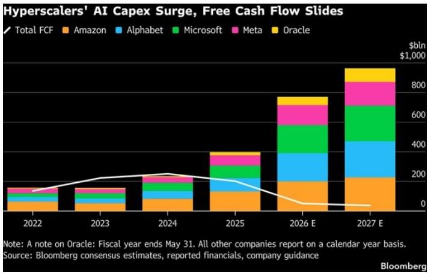

stacked bar chart

| Year   | Total FCF | Amazon | Alphabet | Microsoft | Meta | Oracle |
|--------|-----------|--------|----------|-----------|------|--------|
| 2022   | ~50       | ~50    | ~50      | ~50       | ~50  | ~50    |
| 2023   | ~100      | ~100   | ~100     | ~100      | ~100 | ~100   |
| 2024   | ~150      | ~150   | ~150     | ~150      | ~150 | ~150   |
| 2025   | ~200      | ~200   | ~200     | ~200      | ~200 | ~200   |
| 2026 E | ~300      | ~300   | ~300     | ~300      | ~300 | ~300   |
| 2027 E | ~400      | ~400   | ~400     | ~400      | ~400 | ~400   |

Source: Bloomberg.

A volatile week for broader equities ended in a modest gain for the S&P 500. Of note, the Momentum factor is now in its sharpest drawdown YTD and has realized \~60v in recent weeks (with +/-4% daily swings observed). With momentum, given that it is reflective of market positioning and valuation, drawdowns occur more frequently and with much greater magnitude that with the broader market (a 10% momentum drawdown occurs roughly 4x as often as a 10% S&P drawdown). Recent positioning unwind appears to be a contributing factor to recent underperformance in AI/power stocks, helping explain the relative weakness in natural gas infrastructure stocks (WMB, DTM, KMI) in recent weeks. We see underperformance as overdone and unreflective of new project announcements likely to occur in 2H26, supported by accelerating hyperscaler investment in AI.

## Within midstream, multiple other drivers contributed to performance last week:

Crude oil benchmarks (WTI: -6.1% to \$84.94/bbl / Brent: -6.1% to \$85.00/bbl) fell to their lowest levels in two months on anticipation of a settlement between the U.S. and Iran.

\- With many questions around why crude oil prices have not escalated further given the magnitude of the war-driven supply shock, MS Global Commodities Strategist Martijn Rats has discussed how China has been a key balancing market. Chinese refiners have cut crude imports dramatically over March-May, with total May crude imports down nearly -5 MMBPD than February pre-conflict levels (-3.2 MMBPD y/y) to 7.8 MMBPD. Prior to the conflict, China was over-importing on crude for the majority of 2025 and early 2026, aggressively building both commercial and strategic oil inventories (in February 2026, he estimated that China's crude balance appeared to be in a \~2.7 MMBPD surplus as crude imports outpaced refinery demand). Cuts to crude imports therefore came against a backdrop of a strong supply surplus in China and are not indicative of oil demand having fallen identically with imports. He noted that the drop in crude imports has been partly offset by lower refinery runs and likely depressed end user demand, particularly in petchems. Martijn's apparent demand calculation estimates China's underlying end-user oil demand to be running down 1.2 MMBPD y/y, driven by LPG and fuel oil as petchem facilities have cut run rates and independent refiners have shifted away from fuel oil as a feedstock. Diesel and gasoline demand appears marginally more resilient, as strong mobility data is offset by accelerating NEV sales. However, weak domestic prices do point at an overall soft transport fuel market.

Exhibit 3: New Loadings of Crude Oil/Condensate for export to China (Leading Indicator of Chinese Imports)  
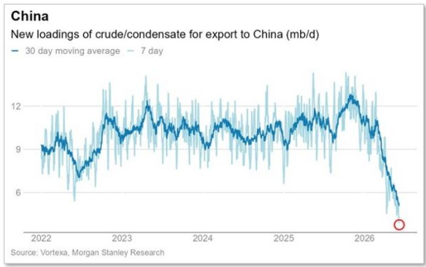

line chart

| Year | 30 day moving average (mb/d) | 7 day (mb/d) |
|------|------------------------------|--------------|
| 2026 | Not labeled                  | Not labeled   |

Source: Vortexa.

Exhibit 4: Observable Chinese Crude Oil Inventories  
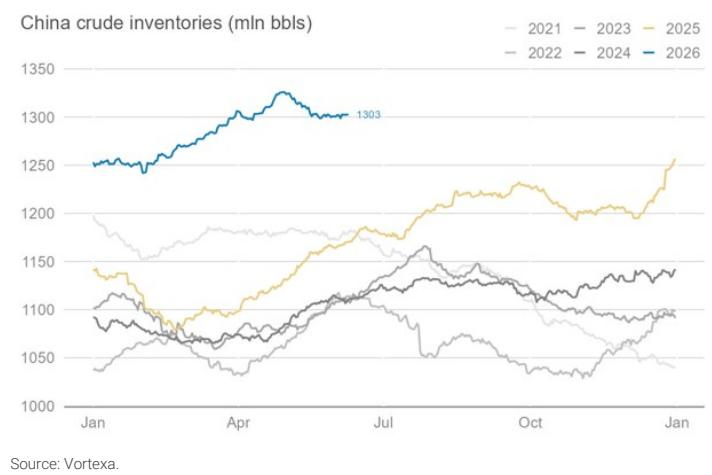

line chart

China crude inventories (mln bbls)
| Month | 2021 (mln bbls) | 2022 (mln bbls) | 2023 (mln bbls) | 2024 (mln bbls) | 2025 (mln bbls) | 2026 (mln bbls) |
|---|---|---|---|---|---|---|
| Jan | 1195 | 1040 | 1105 | 1085 | 1145 | 1250 |
| Apr | 1175 | 1030 | 1075 | 1065 | 1095 | 1303 |
| Jul | 1130 | 1080 | 1160 | 1120 | 1185 | 1303 |
| Oct | 1080 | 1040 | 1130 | 1100 | 1230 | 1303 |
| Jan | 1050 | 1030 | 1140 | 1095 | 1260 | 1303 |

Inflation. May Core CPI data was in-line with expectations, with MS Chief U.S. Economist Michael Gapen noting that tariff passthrough seems to be near completion – as core goods came in negative for the first time this year. Nonetheless, the longer that crude oil prices remain elevated, the greater the risk of second-round effects on core inflation measures. According to FactSet, bond markets are now pricing in a 25 bps Fed rate increase in January, compared with an expectation of a hike in December as recently as a week ago.

Alerian index rebalancing. Last week, an announced Alerian index rebalancing created significant Friday volatility for several SMID-cap midstream names, led by a sharp gain in WBI and declines in a handful of other index constituents. Following the close of trading on Thursday, June 18, 2026, WBI will be added to each of the following indices:

• Alerian MLP Infrastructure Index (AMZI)  
• Alerian Midstream Energy Index (AMNA)  
• Alerian US Midstream Energy Index (AMUS)  
• Alerian MLP Index (AMZ)  
• Alerian Midstream Energy Select Index (AMEI)  
• Alerian Midstream Energy Corporation Index (AMCC)

## On a single-name basis, we would note:

\- According to Hart Energy, KMI's Gulf Coast Express (GCX) expansion has entered service. KMI has not formally announced an in-service, but had been targeting June for the 570 MMcf/d compression add. East Daley observed gas flowing through the expanded GCX on Wednesday, June 10 to two pipelines at the Agua Dulce hub (new GCX receipt meters showed the first gas flows of 90 MMcf/d on Tennessee Gas Pipeline and 20 MMcf/d on Natural Gas Pipeline of America, with combined throughput increasing to 29 MMcf/d on TGP and NGPL by Friday). It is possible that the expansion was first brought online in late May/early June given that GCX has existing connections to intrastate pipelines at Agua Dulce (KM Tejas and Enterprise) where flows are more difficult to monitor.

• The incremental capacity appears to be the primary contributing factor to the sharp and sustained rebound in Waha (Permian Basin) natural gas prices beginning in late May (an absence of pipeline maintenance events and increased in-basin weather demand would not alone be sufficient).

WhiteWater's 2.5 Bcf/d Blackcomb Pipeline and ET's 2.2 Bcf/d Hugh Brinson Pipeline will provide further relief over the next several months, although could shift excess natural gas supply and depressed regional pricing to both Agua Dulce and Katy while awaiting new LNG export demand. The new takeaway capacity could also fill quickly – a potentially meaningful volume benefit to Permian G&Ps such as TRGP – as producers such as Permian Resources and Devon have shut in wells with high gas-to-oil ratios, others such as Elevation Resources have flared excess gas, and still others have deferred oil-weighted activity additions until the takeaway is operational.

Exhibit 5: Waha Natural Gas Prices (\$/Mcf)  
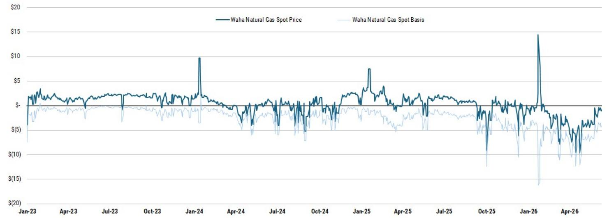

line chart

| Date    | Waha Natural Gas Spot Price | Waha Natural Gas Spot Basis |
|---------|-----------------------------|------------------------------|
| Jan-23  | ~$3                         | ~$1                          |
| Apr-23  | ~$3                         | ~$1                          |
| Jul-23  | ~$3                         | ~$1                          |
| Oct-23  | ~$3                         | ~$1                          |
| Jan-24  | ~$10                        | ~$1                          |
| Apr-24  | ~$3                         | ~$1                          |
| Jul-24  | ~$3                         | ~$1                          |
| Oct-24  | ~$3                         | ~$1                          |
| Jan-25  | ~$7                         | ~$1                          |
| Apr-25  | ~$3                         | ~$1                          |
| Jul-25  | ~$3                         | ~$1                          |
| Oct-25  | ~$3                         | ~$1                          |
| Jan-26  | ~$15                        | ~$15                         |
| Apr-26  | ~$3                         | ~$1                          |

Source: Bloomberg.

\- Devin McDermott hosted investor meetings in Boston with producer Devon Energy, which noted that resetting midstream contracts in the Delaware and Anadarko basins is a possibility post-Coterra deal close. Management expressed high confidence in delivering merger synergies, targeting at least \$1bn pre-tax run-rate synergies by year-end 2027 (including \$350mm from capital optimization, \$350mm from operating margin improvements, and \$300mm from lower corporate costs). Management expects \~\$200mm to be delivered by year-end 2026 and an average of \~\$600mm in FY2027.

\- The price premium for Mont Belvieu propane at ET has narrowed to \$0.015/gal above that at EPD, its lowest level in a year after widening to \$0.05-0.06/gal (the spread is typically <\$0.01/gal). The EPD prompt price has risen as more term contracts have been priced off of its benchmark, as the previous discount likely brought in new buyers to price their term supply off of EPD (it could also be reflective of the timing of the actual expiration dates for individual term contracts). Historically, ET has been the main propane export benchmark price given its large historical export market share, although the export volume split is now almost 50/50. Although inventory builds have lagged the trend of 2025, propane prices

are likely to remain constrained by five-year high inventory levels until higher domestic demand from crop drying in September (peaking in October).

• Also a possible read through for EPD, Dow isolated a propylene pipeline following a leak at its 750 MMTPA PDH facility in Freeport, TX, according to a filing with the Texas Commission on Environmental Quality.

\- According to PeakLoad, BlackRock's Global Infrastructure Partners is said to be considering options to exit its stake in Clearway Energy Group. GIP owns a 50% stake in CEG, the sponsor of CWEN (Total owns the remaining 50%). Separately, PeakLoad reported that CEG is marketing the sale of a >1 GW portfolio of wind, solar, and battery storage projects. Full reports available to PeakLoad subscribers. None of the companies mentioned have confirmed the reports and we have no knowledge of any potential transactions.

## Infrastructure Company & Industry News

## Midstream Energy Infrastructure Company News

## As Alberta works to advance plans for a major new crude oil export pipeline, Western Canadian producers have cautioned that the project is uneconomic as proposed.

Cenovus Energy CEO Jon McKenzie recently argued that Canada's current regulatory framework makes a new oil pipeline effectively unfinanceable for private investors given both a planned carbon tax and construction costs, specifically viewing the federal government's prerequisites for a carbon-capture project and industrial carbon tax in exchange for the pipeline as anticompetitive and uneconomic. He believes the recent federal-provincial pact aimed at advancing the Pathways carbon capture project failed to address regulatory barriers to increasing investment in Alberta's oil sector, rendering both Pathways and the pipeline uneconomic. He estimates that the cost of Pathways could be C\$20-30bn. Meanwhile, ConocoPhillips Canada President Nick Mckenna cautioned that Canada must compete for capital with other jurisdictions in the world and that layering on costs such as a carbon tax that other jurisdictions do not have is a cost challenge. He estimates that Canada will need to double investment in the oil sands to grow production needed to fill new pipeline space, including the proposed 1MMBPD oil pipeline to the BC coast, but struggles to see that production growth within the current cost framework.

\- The proposed pipeline is part of Alberta's broader effort to expand export capacity and diversify market access for Canadian crude. The provincial government expects to present a preferred route by July 1 and currently favors a northwestern corridor through British Columbia rather than a southern route terminating near Vancouver. A northern route would potentially provide access to Pacific export markets while avoiding some of the congestion and political challenges associated with the Lower Mainland.

• One particularly significant challenge involves federal restrictions on oil tanker traffic along British Columbia's northern coast. If Alberta proceeds with a northwestern export route, existing rules prohibiting large oil tankers in that region would likely need to be modified or repealed. As a result, the project's success depends not only on securing financing and regulatory approvals for the pipeline itself but also on resolving broader policy questions regarding marine transportation and coastal access.

\- The project received a significant boost through a recent agreement between Alberta and Prime Minister Mark Carney's federal government. Under that agreement, Ottawa committed to considering the pipeline as a "project of national interest" by October 1. Such a designation could streamline regulatory approvals and support Alberta's goal of beginning construction as early as September 2027. The initiative reflects growing political interest in accelerating major energy infrastructure projects amid concerns about market access and economic competitiveness.

\- Alberta has held preliminary discussions with a Fortune 500 company about financing and constructing the entire project. Speaking at the Global Energy Show in Calgary, Alberta Energy and Minerals Minister Brian Jean said the province has engaged with at least one large corporate proponent regarding a pipeline

capable of transporting 1 MMBPD of crude oil to Canada's west coast. While details remain limited, Mr. Jean indicated the discussions included the possibility of the company both financing and building the project.

• Despite challenges, Mr. Jean suggested industry interest is strong. He noted that multiple parties have approached the province seeking opportunities to invest in the project, participate in its development, and secure future transportation capacity through long-term offtake agreements. The level of interest indicates that producers and investors continue to see value in expanding Canada's west coast export infrastructure, provided regulatory and policy uncertainties can be addressed. Although Mr. Jean acknowledged that significant policy and regulatory barriers still exist, he expressed confidence that cooperation among Alberta, the federal government, British Columbia, and Indigenous communities could remove many of those hurdles and enable a faster development timeline.

Trans Mountain Pipeline plans to discuss the results of its recent open season by July 11. Trans Mountain is working through results of its first open season this year for pipeline space with successful and unsuccessful parties, with results to be released by July 11 according to Jason Balasch, Vice President of Business Development,. A second open season for the 90 MBPD of added capacity from using drag reducing agents is on schedule for July and a third open season for additional expansion capacity is expected to be held later this year.

\- Additionally, dredging is scheduled for this fall under the Second Narrows Bridge on the Vancouver-area coast. The work will allow Aframax tankers to carry 30% more volumes, could reduce shipping costs and make transport to India more competitive. Only a small volume of crude oil has been exported from Trans Mountain to India since the pipeline's expansion in 2024, with most Canadian crude reaching India by way of the U.S. Gulf Coast.

Privately-held Tallgrass' Pony Express Pipeline announced a new binding open season. The open season will solicit shipper interest for incentive tariff rates utilizing existing Pony Express capacity for shipper commitments for crude oil transportation from Pony Express' Colorado origins. This open season will run for 30 days, commencing June 8, 2026.

A dispute over WMB's proposed Constitution Pipeline has intensified as President Donald Trump publicly accused New York Gov. Kathy Hochul of breaking an agreement that would have allowed the natural gas project to move forward in exchange for federal support of offshore wind development. The controversy stems from events in 2025, when the Trump administration suggested that Gov. Hochul had softened her opposition to natural gas infrastructure so that construction on the Empire Wind 1 offshore wind project could resume. While New York later approved permits for another WMB natural gas project serving downstate New York (the Northeast Supply Enhancement project), Constitution Pipeline remains stalled. The proposed 125-mile pipeline would transport natural gas from northeastern Pennsylvania into upstate New York and eventually provide additional supply to New England markets. President Trump claimed that Gov. Hochul had agreed to facilitate construction of the pipeline but was now obstructing it, arguing that delays are harming New York, Connecticut, and the broader

New England region by constraining energy supplies and contributing to higher costs.

\- Gov. Hochul's administration strongly rejected the allegation, maintaining that no agreement was ever made to approve a specific pipeline. Her office characterized President Trump's comments as part of a broader effort to undermine offshore wind development. A spokesperson reiterated that Hochul supports an "all-of-the-above" energy strategy and remains open to natural gas infrastructure projects, but only if they comply with applicable state laws and regulatory requirements. The governor has consistently denied reports that she promised approval of the Constitution Pipeline in exchange for federal action on offshore wind projects.

\- The project faces multiple regulatory and legal hurdles. WMB is seeking to have FERC reissue the project's certificate after years of delays and cancellations. At the same time, New York has challenged aspects of the federal review process, while environmental groups have filed their own legal objections. The dispute centers in part on efforts to bypass or limit New York's authority under the Clean Water Act, which previously played a key role in blocking the project. WMB currently expects FERC to reissue the certificate during 3Q26 and projects an in-service date in 2Q28.

\- Supporters argue that the pipeline would improve reliability and lower energy costs across the Northeast. WMB cites a study estimating that additional gas supplies could save regional consumers more than \$8 bn over a 15-year period. Pipeline advocates, including EPA Administrator Lee Zeldin, have also linked the project to broader efforts to increase domestic energy production and ease pressure on utility bills, which have risen amid growing demand and constrained gas transportation capacity into New England.

• Opponents continue to emphasize environmental concerns. The pipeline would cross hundreds of streams and wetlands in New York, and environmental organizations argue that expanding fossil fuel infrastructure conflicts with state climate objectives. These tensions have become increasingly important as New York attempts to balance reliability concerns with its clean energy goals. The political conflict also highlights a broader energy policy divide: while Trump has repeatedly sought to expand pipeline development and restrict offshore wind projects, Gov. Hochul has tried to preserve New York's clean energy agenda while acknowledging the need for reliable natural gas supplies during the energy transition.

\- The outcome of the Constitution Pipeline battle could have implications beyond a single project. It has become a test case for the balance of federal and state authority over energy infrastructure, the future role of natural gas in Northeastern energy markets, and whether major pipeline projects can still be developed in states with aggressive climate policies. As FERC's review progresses and legal challenges continue, the project remains one of the most closely watched energy infrastructure disputes in the U.S.

FERC has ordered KMI's proposed Mississippi Crossing Project (MSX) and South System Expansion 4 (SSE4), two large pipeline expansions designed to increase natural gas transportation capacity across the Southeast, to provide intervenors with access to previously withheld precedent agreements. The projects have attracted

significant opposition from environmental justice organizations, conservation groups, and local stakeholders who have challenged whether the developments are truly needed. Intervenors argued that access to unredacted shipper agreements was necessary to evaluate the developers' claims regarding market demand and public necessity. The decision will give environmental groups, community organizations, and affected landowners greater visibility into the commercial arrangements underpinning the projects. However, the commission stopped short of requiring disclosure of broader confidential market data and rejected requests to extend the comment period for the draft environmental review.

\- The two projects represent a substantial expansion of gas infrastructure in the region. Tennessee Gas Pipeline's MSX project would add 2.1mm Dth/d of transportation capacity through approximately 199 mi of new pipeline in Mississippi and Alabama, along with a 7-mi lateral, four meter stations, three new compressor stations, and upgrades to an existing compressor station. The project would add roughly 183,000 hp of compression capacity. The connected SSE4 project, sponsored by Southern Natural Gas and Elba Express, would add 1.3mm Dth/d of capacity through 22 pipeline loops spanning approximately 291 mi, as well as upgrades and additions at 14 compressor stations and multiple meter stations, contributing roughly 276,580 hp of additional compression. Developers have argued that the projects are needed to meet growing residential, commercial, industrial, and power generation demand across the Southeast. SSE4 would transport gas from Rose Hill, Mississippi, to markets in Alabama, Georgia, and South Carolina, while also utilizing capacity secured on the MSX system. KMI is seeking final FERC approvals by July 1 in order to maintain construction schedules that target initial service beginning in November 2028, with a second phase of SSE4 expected to enter service in November 2029.

\- In its June 5 order, FERC concluded that disclosure of the precedent agreements was appropriate because the developers failed to demonstrate that sharing the information under existing protective agreements would create meaningful competitive harm. The commission emphasized that the intervenors' concerns about project need are directly relevant to FERC's determination of whether the projects satisfy the statutory requirement of serving the public convenience and necessity. Given that the requesting parties complied with FERC's procedures governing confidential information and nondisclosure agreements, the commission found that access should be granted. The order highlights FERC's continuing effort to balance transparency and due process in pipeline certification proceedings.

\- At the same time, FERC sided with the applicants regarding requests for additional nonpublic market data. The commission determined that those requests were overly broad and noted that publicly available market studies had already been included in the project applications. FERC also denied requests to reopen or extend the environmental review comment period, pointing out that the intervenors waited several months before seeking access to the confidential materials and did not demonstrate how the lack of access had materially impaired their previously submitted comments on the draft environmental impact statement. While the commission reaffirmed that

stakeholders challenging project need should have access to key commercial agreements under appropriate confidentiality protections, it also signaled a reluctance to broaden discovery requests or delay environmental reviews absent a more specific showing of necessity.

FERC has approved ET's Enable Mississippi River Transmission (EMRT) proposal to construct the Big Hollow lateral, a nearly 10-mi natural gas pipeline designed to supply fuel to Ameren's planned 800-MW Big Hollow Energy Center in Missouri. The approval came through a delegated staff order issued June 10 under Natural Gas Act Section 7, allowing the project to proceed without requiring a full commission vote because it met FERC's delegation criteria and generated no protests or adverse comments. The approval places the project ahead of its requested regulatory timeline. In its October 2025 application, EMRT had sought FERC authorization by November 2026 to support a contractual in-service target of April 1, 2028. With approval secured more than a year earlier than requested, developers have additional schedule flexibility as construction advances.

\- Project details. The approximately \$47.8mm project will provide up to 200 MMcf/d of transportation capacity from Monroe County, Illinois to the new power plant in Jefferson County, Missouri. Natural gas supplies for the project will be sourced through existing interstate pipeline connections in Illinois. Approximately 60,000 MMBtu/d will come from EMRT's interconnection with KMI's Natural Gas Pipeline Company of America, while another 47,000 MMBtu/d will be delivered through an interconnection with Trunkline Gas. The project itself consists of 9.55 mi of pipeline, a meter and regulation station, a pig receiver facility, and a hot tap connection. FERC's environmental review concluded that the project would have limited environmental impacts provided specified mitigation measures are implemented. Construction is expected to temporarily affect approximately 146.5 acres, with roughly 81 acres remaining impacted during operations.

\- Shipper demand. The Big Hollow lateral is being developed specifically to serve Ameren's new gas-fired generation facility, which is being built on the site of the retired Rush Island coal plant. EMRT has executed a precedent agreement with Ameren Missouri covering approximately 107,000 MMBtu/d of incremental firm transportation and park-and-loan services. The contract carries an initial three-year term and includes an evergreen provision that allows it to continue unless terminated by either party. The gas lateral is a critical component of Ameren's broader generation replacement strategy. The 800-MW Big Hollow Energy Center is expected to enter service during 3Q28 and will be paired with a 400-MW battery energy storage system targeted for completion in 2Q28. Together, the projects represent a major investment in dispatchable generation and energy storage capacity as Ameren transitions away from coal-fired generation. Company executives indicated during their 1Q26 earnings call that contractors had already begun mobilization and site preparation activities, suggesting the development remains on track.

The U.S. Court of Appeals for the Fourth Circuit has provided a detailed explanation for its late-April decision allowing construction of EQT's Mountain Valley Pipeline

## Southgate Project to continue while legal challenges to state water quality

certifications proceed. In two published opinions, the court concluded that environmental groups failed to demonstrate a sufficient likelihood of success on the merits of their claims (a critical requirement for obtaining a judicial stay) even though other factors modestly favored the challengers. The ruling does not resolve the underlying legal challenges, which remain pending before the Fourth Circuit. Instead, it allows construction activities to continue while the court reviews the merits of the cases. For Mountain Valley Pipeline, the decision removes a significant near-term obstacle to project development. For environmental groups, however, the opinions underscore the difficulty of overturning agency permitting decisions, particularly at the preliminary injunction stage where courts require a strong showing that challengers are likely to ultimately prevail.

\- Case background. The dispute centers on Clean Water Act Section 401 certifications issued by environmental regulators in North Carolina and Virginia for the Southgate Project, an extension of the Mountain Valley Pipeline system that would transport natural gas from southern Virginia into North Carolina. After completing the 304-mi mainline project in 2024, Mountain Valley revised the Southgate proposal, reducing its overall length while increasing pipeline diameter. The redesign required the company to seek new water quality approvals from both states, which were granted in January 2026.

\- Project opposition. Environmental organizations including the Sierra Club, Appalachian Voices, the Dan River Basin Association, the Center for Biological Diversity, and others argued that state regulators inadequately addressed Mountain Valley's history of environmental violations during construction of the main pipeline. The groups sought an emergency stay, contending that construction could proceed before the court had an opportunity to fully review the certifications. They pointed to numerous prior erosion and sediment-control violations as evidence that regulators lacked a rational basis for concluding the company would comply with water quality requirements on the Southgate expansion.

\- Appellate court decision. Writing for the panel, Judge James Wynn acknowledged that the groups made a reasonable showing regarding potential environmental harm, public interest concerns, and the balance of hardships. However, the court emphasized that the likelihood of success on the merits remains the most important factor in evaluating a stay request. Applying the deferential standard typically afforded to agency decisions, the panel found that neither North Carolina nor Virginia regulators acted arbitrarily in issuing the certifications.

North Carolina. With respect to North Carolina, the court found that regulators reasonably distinguished Southgate from the earlier mainline project. The cited violations occurred in different states operating under different regulatory frameworks and involved a substantially larger construction effort than the approximately 5-mi portion of Southgate proposed in North Carolina. The court also noted that state officials relied on additional safeguards, including environmental inspectors and the state's enforcement program, when concluding that water quality standards could be maintained. The challengers also argued that certain environmental protections referenced during the permitting process were omitted from the final certification. The court rejected that claim, finding that project plans and supporting materials were incorporated by reference into the permit conditions. According to the opinion, both regulators and Mountain Valley consistently represented that the environmental commitments identified by opponents remained binding requirements of the certification.

• Virginia. The court reached a similar conclusion regarding Virginia's approval, although it acknowledged that Mountain Valley's compliance history was more relevant there because prior violations occurred within Virginia under the same regulatory regime. Even so, the judges found that the Virginia Department of Environmental Quality provided a detailed explanation for why it expected a different outcome on Southgate. Regulators cited factors such as differences in terrain, precipitation patterns, and improvements to the company's erosion and sediment-control measures. The court determined that those explanations were sufficient to support the agency's predictive judgment under the applicable standard of review.

Summit Midstream (SMC, not covered) reported continued commercial momentum across its Double E natural gas pipeline in the Permian Basin and its crude oil gathering business in the Williston Basin. The company announced two additional long-term transportation agreements totaling 150 MMcf/d, bringing commitments secured during the current Double E open season to 250 MMcf/d. Including previously contracted volumes, the pipeline now has approximately 1.9 Bcf/d of firm contracted capacity. Strong customer interest has prompted Summit to extend the open season through June 30, 2026, as discussions continue with multiple shippers whose combined interest exceeds the available expansion capacity.

\- Permian Basin. The Double E Compression Expansion would increase pipeline capacity to 2.4 Bcf/d (from 1.6 Bcf/d). Summit expects to reach a formal FID by the end of summer 2026. To preserve its targeted end-of-2028 in-service date, the company has already placed orders for gas turbine compressor equipment, securing critical long-lead-time components ahead of the investment decision. Summit also plans to submit its 7c certificate application to FERC later this year, advancing the regulatory process required for the expansion. Management emphasized that demand for the planned Double E Compression Expansion remains robust. In addition to the 250 MMcf/d of binding agreements already executed, Summit has signed a firm option agreement that could add another 200 MMcf/d of transportation capacity if exercised later this summer. The company also received an affirmative FID notice from a shipper regarding a processing plant expansion tied to a previously announced 230 MMcf/d transportation agreement. According to CEO Heath Deneke, shipper interest collectively exceeds the project's anticipated 800–900 MMcf/d expansion capacity, raising the possibility that the project could become oversubscribed. Remaining capacity is being allocated on a first-come, first-served basis to shippers executing binding precedent agreements.

\- Williston Basin. In the Williston Basin, Summit announced a new long-term crude oil gathering agreement with a producer operating in Divide County, North Dakota. The agreement includes a 40,000-acre dedication adjacent to Summit's existing Polar and Divide gathering systems. The company expects to connect 15 new fourmile lateral wells associated with the acreage by the end of 2026, providing additional volume growth opportunities for its gathering network. The new Williston agreement builds on another acreage dedication secured in late 2025 and reflects a broader trend of drilling activity moving toward Summit's operating footprint in Williams and Divide counties. Management noted that, over the last six months, the company has expanded its dedicated acreage position by more than 240,000 acres. As operators increasingly pursue 3- and 4-mile lateral development programs in the northern and western portions of the basin, Summit believes its existing infrastructure positions it well to capture incremental production volumes, grow its customer base, and secure additional long-term acreage commitments.

## Renewable Energy Infrastructure Industry News

The U.S. District Court for the District of Columbia overturned a Trump administration effort to eliminate a longstanding tax-credit qualification pathway for wind and solar projects, restoring (for now) the 5% safe harbor rule that developers have historically used to demonstrate that construction has begun. The June 6 ruling by Judge Colleen Kollar-Kotelly vacated Treasury Department guidance issued in August 2025 that had barred most wind and large-scale solar projects from relying on the 5% expenditure test to establish eligibility for federal clean energy tax credits.

\- Background. The dispute centers on the clean energy tax incentives created under the Inflation Reduction Act and subsequently modified by the One Big Beautiful Bill Act (OBBBA). Traditionally, developers could satisfy "beginning of construction" requirements either by demonstrating significant physical work had commenced or by showing that at least 5% of a project's total cost had been incurred. Treasury's 2025 guidance removed that option for most wind and utility-scale solar projects, making it more difficult for developers to preserve eligibility for the Section 45Y clean electricity production tax credit and Section 48E clean electricity investment tax credit before the July 4, 2026 statutory deadline established under the OBBBA.

\- Court decision. In vacating the guidance, the court concluded that Treasury and the IRS failed to satisfy the Administrative Procedure Act's requirement for reasoned decision-making. The administration argued that wind and large-scale solar projects warranted different treatment because Congress imposed an earlier phaseout schedule for those technologies. Judge Kollar-Kotelly found that the agency had not adequately explained why the difference in statutory deadlines justified abandoning the 5% safe harbor methodology while continuing to apply it elsewhere. As a result, the court remanded the issue back to the IRS for further administrative action.

\- Implications. The ruling potentially provides developers with an additional pathway to qualify projects before the July 4 deadline, particularly for projects that may struggle to satisfy the physical work test. However, legal experts caution that the practical value of the decision remains uncertain. Given that the matter has been remanded, the IRS retains the ability to issue revised guidance supported by a more robust administrative record. In addition, the government could appeal the decision, and the compressed timeline before the statutory deadline creates

significant uncertainty for developers considering whether to rely on the restored safe harbor approach. Law firm Foley noted that developers should carefully evaluate the risks before proceeding on the assumption that the 5% safe harbor will remain available. For projects expected to enter service after December 31, 2027 and that cannot demonstrate sufficient physical construction activity before July 4, the restored expenditure-based test may appear attractive. Nevertheless, the possibility of further agency action or appellate review means developers could face substantial regulatory uncertainty if they rely exclusively on the court's ruling.

\- Environmental groups viewed the decision as a significant victory. The Natural Resources Defense Council, one of the plaintiffs challenging the guidance, argued that the ruling represents another setback for efforts to slow renewable energy development. The decision is particularly consequential for large-scale wind and solar projects, as smaller solar facilities with less than 1.5 MW of net output had remained eligible to use the 5% cost-based test even under the Treasury guidance that was struck down. The ruling restores a potentially important financing and development tool for utility-scale renewable projects.

Privately-held Cypress Creek Energy has secured \$3.5bn in financing for the first two phases of the Steel River Energy Center, a massive solar-plus-storage development in Mississippi County, Arkansas that could become one of the largest renewable energy projects in North America. The financing supports construction and long-term operation of Phase 1 and Phase 2, which together will deliver 1.63 GW of solar generation and 1.9 GWh of battery storage within the MISO market. If all three phases are completed as planned, the project could ultimately reach 2.45 GW of solar capacity and 2.9 GWh of storage by 2029.

\- Project details. The project represents a major expansion for Cypress Creek, which acquired the late-stage development from Swift Current Energy earlier this year. Upon full completion, Steel River would nearly double the company's operating and under-construction portfolio to approximately 7 GW. While the project is connected to the broader grid, Cypress Creek has already contracted 100% of the generation from the first two phases to a technology company that has not yet been publicly identified. The developer continues to seek both an offtaker and financing partner for the third phase, which is expected to require as much as \$1.5bn of additional investment. First power from the initial phase is expected in early 2028, with the entire project potentially online by mid-2029.

• A key feature of Steel River is its commitment to American-made equipment. Cypress Creek plans to use solar modules supplied by First Solar (FSLR), tracker systems incorporating U.S.-produced structural steel, and battery systems assembled domestically by LG. The project's location in Mississippi County provides additional advantages. The county is one of the largest steel-producing regions in the country, accounting for more than 13% of U.S. steel production, while also offering access to existing transmission infrastructure and a substantial nearby industrial load base. These factors help reduce supply chain complexity and minimize the need for extensive grid upgrades.

\- The financing itself ranks among the largest renewable energy funding packages completed in recent years. The transaction was fully underwritten by a syndicate, reflecting strong lender appetite for large-scale energy infrastructure projects backed by established developers and long-term contracted revenue streams. Cypress Creek simultaneously closed a tax equity financing arrangement with an undisclosed investor, further strengthening the project's capital structure. The scale of the financing and the project's reliance on domestic manufacturing illustrate how utility-scale solar and battery storage continue to attract substantial institutional investment as developers race to meet growing electricity demand from industrial users, data centers, and broader electrification trends.

Chief Executive Officer Kevin Smith framed the financing as evidence that capital markets continue to strongly support utility-scale solar and battery storage despite increasing discussion around natural gas as a solution to rising electricity demand. The project reached "under construction" status before implementation of the One Big Beautiful Bill Act's more stringent Prohibited Foreign Entity requirements, preserving access to certain federal incentives. At the same time, Cypress Creek emphasized that the project is heavily reliant on domestic manufacturing, reflecting the industry's growing focus on U.S.-based supply chains.

Qcells has reached a significant milestone in the development of the U.S. solar manufacturing industry by beginning solar cell production at its Cartersville, Georgia, facility. The startup of cell manufacturing moves the company closer to completing what it describes as the first vertically integrated solar manufacturing plant in the U.S., where the major components of a photovoltaic module – including ingots, wafers, cells, and finished modules – are produced at a single site. The company expects the facility to reach full production by 3Q26.

\- The Cartersville plant represents one of the most ambitious efforts to localize solar manufacturing in the U.S. Once fully operational, the facility will produce 3.3 GW annually of ingots, wafers, and solar cells, along with 3.5 GW of module assembly capacity. Module production is already operating at full capacity, with approximately 16,700 panels being assembled each day. Combined with Qcells' expanded Dalton, Georgia, factory, total U.S. module manufacturing capacity is expected to reach 8.6 GW annually by the end of 3Q26, equivalent to roughly 47,000 panels per day.

The project strengthens domestic supply chains at a time when policymakers and developers are seeking to reduce dependence on imported solar components. Given that the major components of the modules are manufactured domestically, projects using Cartersville-produced modules may qualify for the 10% Domestic Content Bonus under the federal Investment Tax Credit. The facility also positions Qcells to capture incentives available through the Section 45X Advanced Manufacturing Production Tax Credit, which provides production-based credits at multiple stages of the solar manufacturing process. By producing ingots, wafers, cells, and modules domestically, the company can potentially benefit from tax credits across the entire value chain.

• The investment has received substantial federal support. In 2024, the Department of Energy's Loan Programs Office announced a conditional commitment for a loan guarantee of up to \$1.45bn to support Qcells' domestic manufacturing expansion. The company has simultaneously expanded its role beyond manufacturing, becoming one of the largest utility-scale solar and storage developers in the U.S., with more than 2 GW of projects developed or constructed and a development pipeline exceeding 10 GW.

\- Qcells' broader strategy extends beyond manufacturing and project development into end-of-life solar panel management. Through its EcoRecycle business, launched in 2025, the company has established solar panel recycling operations at the Cartersville campus. At full capacity, the facility is expected to recycle approximately 250 MW of retired solar panels annually, or about 500,000 panels per year. The operation is designed to recover valuable materials such as aluminum, glass, silver, and copper, addressing a growing challenge as the first generation of large-scale solar installations begins to reach retirement age.

The recycling initiative reflects a broader evolution within the U.S. solar industry. While most retired solar panels are currently sent to landfills due to limited recycling requirements and infrastructure, increasing state-level policy discussions and improvements in recycling technologies are creating momentum for a more circular solar economy. Qcells plans to expand recycling operations nationwide, positioning itself not only as a manufacturer of domestically produced solar equipment but also as a participant in the industry's emerging end-of-life materials recovery market. Together, the manufacturing and recycling investments highlight how federal incentives and industrial policy are reshaping the U.S. solar supply chain, with a growing emphasis on domestic production, supply security, and resource sustainability.

## Data Center Power Fundamentals

Crusoe's Wyoming AI data center project stalled, according to Bloomberg. Crusoe failed to secure key customer commitments – most notably from Google which reportedly raised concerns about the project's cost structure and execution timeline under Crusoe's management. Utility provider Black Hills has confirmed it is moving forward with the project without Crusoe as the lead development partner.

- The development is significant because the Wyoming campus was envisioned as one of the largest AI infrastructure projects in the U.S., ultimately targeting up to 10 GW of capacity. The site was designed to leverage infrastructure from Tallgrass, a Blackstone-backed energy company, including natural gas and water pipelines. Although Crusoe had secured local permits and begun preliminary site preparation, it never finalized a binding agreement with a major customer.  
- Google appears to remain interested in the location despite Crusoe's diminished role. Bloomberg reports that Google is now working directly with the remaining project partners to secure computing capacity from the site. Black Hills stated that the project itself remains active and is expected to enter service in early 2028, indicating that the setback is specific to Crusoe rather than the Wyoming development as a whole.  
- The situation potentially raises broader questions about Crusoe's execution capabilities at a time when AI infrastructure demand is booming. Founded in

2018 as a company that used excess oil-field natural gas to power Bitcoin mining operations, Crusoe later pivoted into hyperscale AI data centers. The firm became a prominent player through its involvement in the Stargate initiative with OpenAI and Oracle, attracting investors including NVIDIA, Salesforce, and Mubadala Capital and achieving a reported \$10bn valuation in 2025. However, the Wyoming setback follows other challenges. Earlier in 2026, Oracle and OpenAI decided not to lease additional Crusoe capacity at the company's flagship Abilene, Texas campus. Bloomberg reported that reliability problems – including weather-related outages affecting liquid cooling systems and difficulties operating gas-powered generators – strained relations between Crusoe and Oracle. Microsoft later absorbed the excess power capacity that Oracle and OpenAI declined to use. Sources cited by Bloomberg also suggest some technology companies have become increasingly skeptical about Crusoe's ability to reliably deliver and operate large-scale AI infrastructure projects.

Despite these concerns, Crusoe maintains that its broader growth story remains intact. The company stated this week that it has contracts representing nearly 5 GW of data center capacity excluding Wyoming, including projects tied to OpenAI, Oracle, Microsoft, and a separate Texas development reportedly associated with Google. Crusoe also continues to explore ways to remain involved in the Wyoming project, though industry observers increasingly view a buyout of its position by other partners as the more likely outcome.

Cleanview identified 59 data center projects representing approximately 90 GW of announced behind-the-meter generating capacity, which it estimates equals more than 25% of all planned U.S. data center capacity. The capacity is reflective of a major shift underway in U.S. data center development – rather than waiting years for utility interconnections, developers are increasingly building their own power generation facilities BTM. Notably, 92% of these projects, representing about 82 GW, have been announced since the start of 2025, illustrating how rapidly the strategy has moved from an exception to a mainstream approach. The trend is being driven by escalating grid connection delays and the significant economic value of bringing AI computing capacity online sooner.

\- The report finds that virtually every major hyperscale cloud provider is involved in BTM development, either directly or through partners. Projects linked to Meta, Microsoft, Amazon, and Oracle were identified, while AI companies such as OpenAI and Anthropic have leased more than 10 GW of capacity tied to onsite generation. Because traditional combined-cycle gas turbines are in short supply and face lengthy delivery timelines, developers are relying on unconventional equipment sources, including mobile natural gas generators mounted on semitrailers, aeroderivative turbines derived from aircraft and naval applications, reciprocating engines, and refurbished industrial turbines. The overriding priority is speed rather than efficiency. Given estimates that AI data centers can generate \$10–12mm annually per MW of capacity, developers are willing to accept higher operating costs if it accelerates deployment by months or years.

• Equipment supplier market share reflects this urgency-driven procurement strategy. Caterpillar leads the market with roughly one-third of the projects tracked, accounting for more than 8.8 GW of permitted engine and turbine capacity. Bloom Energy has also gained share following its large agreement with Oracle to support the Stargate Project Jupiter development in New Mexico. The report highlights numerous examples of developers sourcing power equipment from nontraditional suppliers, including marine engine manufacturers and even Boom Supersonic, underscoring the industry's willingness to explore unconventional solutions amid severe power constraints.

- Geographically, development is highly concentrated. Five states account for 83% of all announced BTM capacity, with Texas emerging as the clear leader due to abundant Permian Basin natural gas supplies, extensive pipeline infrastructure, and a regulatory environment viewed as favorable to rapid development. Ohio currently leads in capacity under construction, largely due to projects from Meta and EdgeConneX in the New Albany area near Columbus. The concentration of projects near major gas-producing regions suggests that access to fuel supply is becoming a critical competitive advantage for AI infrastructure development.  
- Despite the large pipeline of announced projects, actual deployment remains limited. Of the roughly 90 GW identified, only about 2 GW is operating today, while another 1.2% is under construction. Approximately 36% has obtained permits, and the remaining 60% remains in planning or announcement stages. Most existing operational capacity is associated with xAI's Colossus facilities near Memphis, which collectively account for nearly 1.5 GW of operating gas-fired generation. Cleanview estimates total operating BTM capacity could reach 2.8–3.2 GW by the end of 2026 and potentially 13 GW by the end of 2027 if currently planned projects proceed on schedule.  
- However, the report emphasizes that permitting and infrastructure challenges represent a significant obstacle to these forecasts. Several high-profile projects have already encountered setbacks, including a Stargate development in New Mexico where a proposed gas pipeline (ET's Green Chile lateral) faces a longer regulatory review, potentially delaying the associated 2.45 GW power plant. Similarly, Microsoft's partner Nebius is facing difficulties obtaining permits for a planned 400 MW gas-fired facility in New Jersey. These examples illustrate that while BTM power offers a way to bypass grid interconnection bottlenecks, developers remain subject to environmental permitting, fuel supply, and infrastructure approval processes. As a result, Cleanview sees a wide range of outcomes for future deployment, with cumulative BTM capacity by the end of 2027 potentially ranging from as little as 5 GW in a delay-heavy scenario to as much as 13 GW if major projects remain on track.

Exhibit 6: Data Center Behind-the-Meter Projects  
Data center developers are building their own power plants  
Data center developers have announced 90 GW of behind-the-meter projects, according to Cleanview's project tracker.  
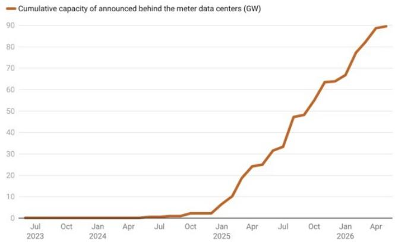

line chart

Cumulative capacity of announced behind the meter data centers (GW)
| Month | Cumulative capacity of announced behind the meter data centers (GW) |
|---|---|
| Jul 2023 | 0 |
| Oct 2023 | 0 |
| Jan 2024 | 0 |
| Apr 2024 | 0 |
| Jul 2024 | 0 |
| Oct 2024 | 1 |
| Jan 2025 | 2 |
| Apr 2025 | 10 |
| Jul 2025 | 25 |
| Oct 2025 | 33 |
| Jan 2026 | 48 |
| Apr 2026 | 64 |
| Jul 2026 | 65 |
| Oct 2026 | 78 |
| Jan 2027 | 89 |
| Apr 2027 | 90 |

Chart: Michael Thomas • Source: Cleanview project tracker • Created with Datawrapper  
Source: Cleanview.

Exhibit 7: Announced Data Center Behind-the-Meter Capacity by State  
Announced behind-the-meter capacity by state  
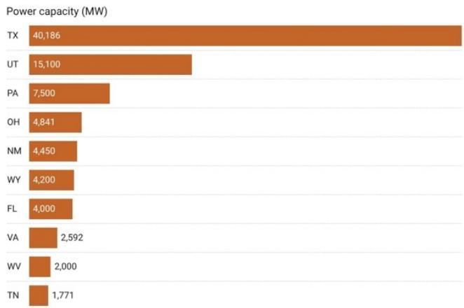

bar chart

Power capacity (MW)
| Company | Power capacity (MW) |
| :--- | :--- |
| TX | 40,186 |
| UT | 15,100 |
| PA | 7,500 |
| OH | 4,841 |
| NM | 4,450 |
| WY | 4,200 |
| FL | 4,000 |
| VA | 2,592 |
| WV | 2,000 |
| TN | 1,771 |

Chart: Michael Thomas • Source: Cleanview data center tracker • Created with Datawrapper  
Source: Cleanview.

Illinois Gov. JB Pritzker has halted new state subsidies for data center projects and is pushing for a broader regulatory overhaul aimed at ensuring that the rapidly growing industry does not shift costs onto households and businesses. Beginning July 1, the Illinois Department of Commerce and Economic Opportunity will pause processing agreements under the state's Data Center Investment Program while lawmakers and stakeholders develop a new framework governing future development.

- At the core of Gov. Pritzker's proposal is the principle that data centers should bear the full cost of the infrastructure demands they create. The governor is advocating for a dedicated utility rate class that would assign data centers responsibility for the distribution, generation, transmission, and water-system costs associated with their operations. The move reflects growing concerns across PJM Interconnection states that large AI-driven data centers are becoming major contributors to rising electricity demand and higher power prices.  
- Gov. Pritzker argues that the surge in data center development is already affecting consumers. According to the governor's office, data center demand within PJM has contributed to approximately \$13bn in increased costs, with the potential for an additional \$37bn of costs in Illinois in coming years if growth continues unchecked. As a result, the governor is questioning whether existing tax incentives are encouraging development without adequately accounting for impacts on affordability, grid reliability, and environmental resources.  
- The proposed framework would also impose stricter operational requirements on data centers. Facilities would be expected to meet energy and water efficiency standards and could be required to accept interruptible electric service during periods of grid stress. Under the proposal, operators that do not supply sufficient clean energy resources could face temporary curtailments to protect residential and commercial customers. Conversely, facilities that self-supply more clean power would receive more reliable service arrangements.  
- Water usage has become another focal point. The plan would require comprehensive water permitting, public disclosure of water consumption, and

sustainability standards designed to prevent depletion of local resources.

Additional provisions would strengthen transparency by prohibiting nondisclosure agreements between developers and local governments, requiring public reporting of energy and water usage, and establishing community benefits agreements with defined obligations and timelines.

\- Illinois is not acting alone. The proposal follows similar actions by other PJM-state governors responding to the accelerating buildout of AI infrastructure. New Jersey Gov. Mikie Sherrill recently introduced a statewide framework focused on cost accountability, transparency, community benefits, and workforce development. Meanwhile, Pennsylvania Gov. Josh Shapiro launched an expedited permitting program for qualifying data center projects, coupled with requirements for clean energy sourcing. Pennsylvania's program mandates that at least 10% of a facility's generation capacity come from "clean firm" resources beginning in 2027, increasing to 14.5% by 2030 and 32% by 2035. Taken together, these initiatives suggest a shift in state policy toward balancing economic development opportunities from AI infrastructure with concerns about electricity affordability, reliability, environmental impacts, and local community benefits. Rather than competing solely through subsidies and tax incentives, states are increasingly seeking mechanisms that require data center developers to internalize a greater share of the costs associated with their rapid growth.

Google has agreed to fund a three-year, 100-MW virtual power plant (VPP) in the PJM Interconnection through a partnership with demand-response and distributed energy resource aggregator Voltus. The companies describe the initiative as a first-of-its-kind arrangement designed to demonstrate how large electricity consumers can help address grid reliability challenges and rising power demand without relying exclusively on new generation or transmission infrastructure.

\- The VPP will aggregate distributed energy resources from residential, commercial, and industrial customers throughout PJM, including electric vehicles, smart thermostats, batteries, and other flexible loads. Rather than building physical generation assets, the project will create dispatchable capacity by paying customers to reduce or shift electricity consumption during periods of peak demand. The approach effectively treats demand flexibility as a grid resource, allowing PJM to access capacity when needed while reducing strain on the system.

\- The initiative comes at a pivotal moment for PJM, which has experienced tightening reserve margins, reliability concerns, and record-high capacity market prices amid accelerating load growth. Much of that demand is being driven by artificial intelligence and cloud computing infrastructure, with large-scale data centers becoming one of the fastest-growing sources of electricity consumption in the region. Policymakers, utilities, and regulators have increasingly debated how to accommodate this growth while limiting impacts on customer bills and maintaining system reliability.

\- Google's participation is particularly noteworthy because the company itself operates a growing fleet of energy-intensive data centers. While Google has invested in making its own facilities more flexible, Amanda Peterson Corio, the company's Global Head of Data Center Energy, explained that shifting demand elsewhere on the grid can often be more economical than curtailing data center operations. Given the substantial capital invested in AI computing infrastructure, maintaining high utilization rates at data centers is frequently more valuable than using those facilities as primary demand-response resources. As a result, Google sees value in compensating other customers to provide flexibility instead.

\- The partnership also reflects a broader shift in thinking about grid planning. Historically, electric systems were designed around a one-way flow of electricity from centralized generators to consumers. Advances in distributed energy technologies, communications systems, batteries, and electric vehicles are creating opportunities for a more dynamic and multidirectional grid where consumers can also function as suppliers of grid services. Google argues that virtual power plants can unlock underutilized capacity already embedded in the existing system, reducing the need for costly infrastructure that may only be needed during relatively short periods of peak demand.

\- The economic rationale is becoming increasingly important as utilities across the country pursue unprecedented capital investment programs to accommodate growing demand. Industry forecasts suggest utility spending could exceed \$1 trillion over the next five years, with a significant portion directed toward new generation, transmission, and distribution infrastructure. At the same time, rising electricity bills have become a growing political issue. Google and Voltus contend that demand flexibility resources can help moderate those costs by reducing the need for investments designed primarily to serve infrequent peak demand periods.

\- Beyond the immediate 100-MW deployment, the companies view the project as a template for other large energy users. By demonstrating that hyperscale technology companies can directly support grid flexibility through third-party demand response programs, the partnership could encourage broader participation from data center operators, manufacturers, and other large electricity consumers. If successful, the model may offer a complementary approach to meeting surging electricity demand, particularly in regions like PJM where data center growth is outpacing traditional infrastructure development timelines.

## Infrastructure Sector Weekly Performance

Exhibit 8: Infrastructure Sector Benchmarks & Major Indices – Weekly Total Return  
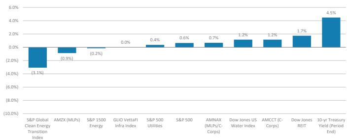

bar chart

| Category | Value (%) |
|---|---|
| S&P Global Clean Energy Transition Index | -3.1 |
| AMZX (MLPs) | -0.9 |
| S&P 1500 Energy | -0.2 |
| GLIO VettaFI Infra Index | 0.0 |
| S&P 500 Utilities | 0.4 |
| S&P 500 | 0.6 |
| AMNAX (MLPs/Corps) | 0.7 |
| Dow Jones US Water Index | 1.2 |
| AMCCT (C-Corps) | 1.2 |
| Dow Jones REIT | 1.7 |
| 10-yr Treasury Yield (Period End) | 4.5 |

Source: FactSet

Exhibit 9: Infrastructure Sector Benchmarks & Major Indices – 2026 YTD Total Return  
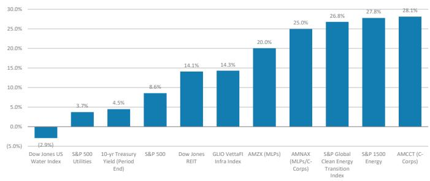

bar chart

| Category | Value |
| --- | --- |
| Dow Jones US Water Index | (2.9%) |
| S&P 500 Utilities | 3.7% |
| 10-yr Treasury Yield (Period End) | 4.5% |
| S&P 500 | 8.6% |
| Dow Jones REIT | 14.1% |
| GLIO VettaFI Infra Index | 14.3% |
| AMZX (MLPs) | 20.0% |
| AMNX (MLPs/Corps) | 25.0% |
| S&P Global Clean Energy Transition Index | 26.8% |
| S&P 1500 Energy | 27.8% |
| AMCCCT (C-Corps) | 28.1% |

Source: FactSet

Exhibit 10: Midstream Energy Infrastructure – Weekly Total Return  
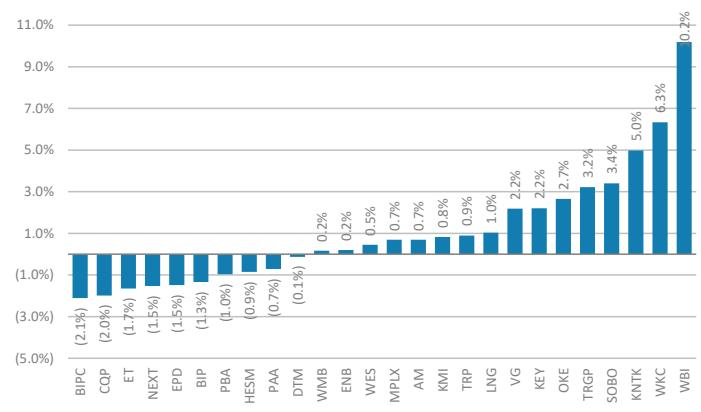

bar chart

| Category | Value (%) |
|---|---|
| BIPC | -2.1 |
| CQP | -2.0 |
| ET | -1.7 |
| NEXT | -1.5 |
| EPD | -1.5 |
| BIP | -1.3 |
| PBA | -1.0 |
| HESM | -0.9 |
| PAA | -0.7 |
| DTM | -0.1 |
| WMB | 0.2 |
| ENB | 0.2 |
| WES | 0.5 |
| MPLX | 0.7 |
| AM | 0.7 |
| KMI | 0.8 |
| TRP | 0.9 |
| LNG | 1.0 |
| VG | 2.2 |
| KEY | 2.2 |
| OKE | 2.7 |
| TRGP | 3.2 |
| SOBO | 3.4 |
| KNTK | 5.0 |
| WKC | 6.3 |
| WBI | 10.2 |

Source: FactSet

Exhibit 11: Midstream Energy Infrastructure – 2026 YTD Total Return  
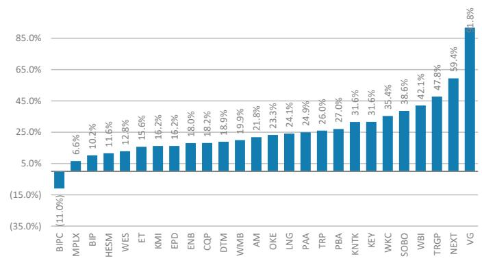

bar chart

| Category | Value (%) |
|---|---|
| BIPC | -11.0 |
| MPLX | 6.6 |
| BIP | 10.2 |
| HESM | 11.6 |
| WES | 12.8 |
| ET | 15.6 |
| KMI | 16.2 |
| EPD | 16.2 |
| ENB | 18.0 |
| CQP | 18.2 |
| DTM | 18.9 |
| WMB | 19.9 |
| AM | 21.8 |
| OKE | 23.3 |
| LNG | 24.1 |
| PAA | 24.9 |
| TRP | 26.0 |
| PBA | 27.0 |
| KNTK | 31.6 |
| KEY | 31.6 |
| WKC | 35.4 |
| SOBO | 38.6 |
| WBI | 42.1 |
| TRGP | 47.8 |
| NEXT | 59.4 |
| VG | 81.8 |

Source: FactSet

Exhibit 12: Renewable Energy Infrastructure – Weekly Total Return  
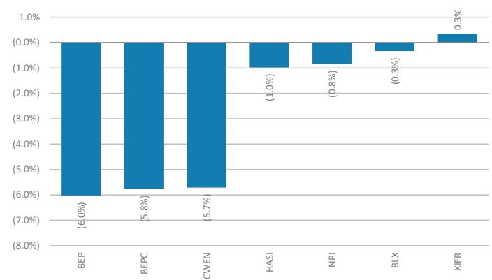

bar chart

| Category | Value (%) |
|---|---|
| BEP | (6.0) |
| BEPC | (5.8) |
| CWEN | (5.7) |
| HASI | (1.0) |
| NPI | (0.8) |
| BLX | (0.3) |
| XIFR | 0.3 |

Source: FactSet

Exhibit 13: Renewable Energy Infrastructure – 2026 YTD Total Return  
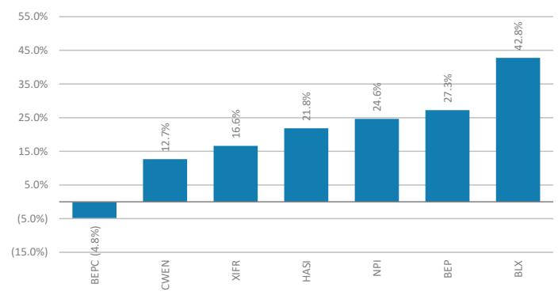

bar chart

| Category | Value (%) |
|---|---|
| BEPC | 4.8 |
| CWEN | 12.7 |
| XIFR | 16.6 |
| HASI | 21.8 |
| NPI | 24.6 |
| BEP | 27.3 |
| BLX | 42.8 |

Source: FactSet

## Infrastructure Sector Comps

Exhibit 14: MS Infrastructure Research Coverage Summary

<table><tr><td rowspan="2"></td><td rowspan="2">Ticker</td><td rowspan="2">MS Rating</td><td rowspan="2">Consensus Rating</td><td rowspan="2">Currency</td><td rowspan="2">Price</td><td rowspan="2">Market Cap ($Bn)</td><td rowspan="2">EV ($Bn)</td><td colspan="3">Price Returns</td><td colspan="3">MS Price Target</td><td rowspan="2">Consensus PT</td><td colspan="2">Bear Case</td><td colspan="2">Base Case</td><td colspan="2">Bull Case</td></tr><tr><td>MTD</td><td>QTD</td><td>YTD</td><td>Bear Case</td><td>Base Case</td><td>Bull Case</td><td>Price</td><td>Total</td><td>Price</td><td>Total</td><td>Price</td><td>Total</td></tr><tr><td colspan="21">Midstream Energy Infrastructure (C-Corps)</td></tr><tr><td>Antero Midstream Corp</td><td>AM</td><td>EW</td><td>Hold</td><td>USD</td><td>$21.67</td><td>$10.29</td><td>$11.54</td><td>3.4%</td><td>-5.0%</td><td>21.8%</td><td>$13.00</td><td>$26.00</td><td>$30.00</td><td>$23.00</td><td>-40.0%</td><td>-35.9%</td><td>20.0%</td><td>24.1%</td><td>38.4%</td><td>42.6%</td></tr><tr><td>DT Midstream, Inc.</td><td>DTM</td><td>EW</td><td>Overweight</td><td>USD</td><td>$142.32</td><td>$14.52</td><td>$15.73</td><td>1.7%</td><td>5.7%</td><td>18.9%</td><td>$82.00</td><td>$170.00</td><td>$184.00</td><td>$156.50</td><td>-42.4%</td><td>-40.1%</td><td>19.4%</td><td>21.8%</td><td>29.3%</td><td>31.6%</td></tr><tr><td>Enbridge</td><td>ENB</td><td>EW</td><td>Overweight</td><td>CAD</td><td>$78.98</td><td>$123.38</td><td>$188.75</td><td>3.2%</td><td>4.4%</td><td>18.1%</td><td>$49.00</td><td>$85.00</td><td>$94.00</td><td>$56.94</td><td>-38.0%</td><td>-33.2%</td><td>7.6%</td><td>12.4%</td><td>19.0%</td><td>23.8%</td></tr><tr><td>Hess Midstream LP</td><td>HESM</td><td>UW</td><td>Underweight</td><td>USD</td><td>$38.49</td><td>$4.94</td><td>$7.89</td><td>2.6%</td><td>-1.0%</td><td>11.6%</td><td>$24.00</td><td>$38.00</td><td>$48.00</td><td>$37.00</td><td>-37.6%</td><td>-29.9%</td><td>-1.3%</td><td>6.4%</td><td>24.7%</td><td>32.4%</td></tr><tr><td>Kinder Morgan Inc.</td><td>KMI</td><td>EW</td><td>Overweight</td><td>USD</td><td>$31.94</td><td>$71.06</td><td>$94.51</td><td>2.8%</td><td>-4.7%</td><td>16.2%</td><td>$18.00</td><td>$36.00</td><td>$44.00</td><td>$35.00</td><td>-43.6%</td><td>-40.0%</td><td>12.7%</td><td>16.4%</td><td>37.8%</td><td>41.4%</td></tr><tr><td>Oneok Inc.</td><td>OKE</td><td>OW</td><td>Overweight</td><td>USD</td><td>$90.59</td><td>$57.07</td><td>$79.06</td><td>7.9%</td><td>0.2%</td><td>23.3%</td><td>$55.00</td><td>$113.00</td><td>$138.00</td><td>$94.00</td><td>-39.3%</td><td>-34.7%</td><td>24.7%</td><td>29.3%</td><td>52.3%</td><td>56.9%</td></tr><tr><td>South Bow Corp</td><td>SOBO</td><td>UW</td><td>Hold</td><td>CAD</td><td>$53.31</td><td>$11.12</td><td>$10.97</td><td>6.1%</td><td>14.6%</td><td>61.9%</td><td>$28.00</td><td>$40.00</td><td>$55.00</td><td>$35.21</td><td>-47.5%</td><td>-43.7%</td><td>-25.0%</td><td>-21.2%</td><td>3.2%</td><td>6.9%</td></tr><tr><td>Targa Resources Corp.</td><td>TRGP</td><td>OW</td><td>Overweight</td><td>USD</td><td>$272.60</td><td>$58.51</td><td>$57.35</td><td>6.9%</td><td>8.7%</td><td>47.8%</td><td>$153.00</td><td>$331.00</td><td>$382.00</td><td>$284.00</td><td>-43.9%</td><td>-42.4%</td><td>21.4%</td><td>22.9%</td><td>40.1%</td><td>41.6%</td></tr><tr><td>TC Energy Corp</td><td>TRP</td><td>EW</td><td>Overweight</td><td>CAD</td><td>$97.04</td><td>$69.39</td><td>$110.03</td><td>4.2%</td><td>10.8%</td><td>26.1%</td><td>$52.00</td><td>$103.00</td><td>$118.00</td><td>$68.84</td><td>-46.4%</td><td>-42.9%</td><td>6.1%</td><td>9.6%</td><td>21.6%</td><td>25.1%</td></tr><tr><td>WaterBridge Infrastructure LLC</td><td>WBI</td><td>OW</td><td>Overweight</td><td>USD</td><td>$32.44</td><td>$1.53</td><td>$3.51</td><td>10.9%</td><td>62.1%</td><td>NA</td><td>$15.00</td><td>$38.00</td><td>$48.00</td><td>$33.00</td><td>-53.8%</td><td>-53.6%</td><td>17.1%</td><td>17.3%</td><td>48.0%</td><td>48.1%</td></tr><tr><td>Williams Companies Inc</td><td>WMB</td><td>OW</td><td>Overweight</td><td>USD</td><td>$72.08</td><td>$88.15</td><td>$105.34</td><td>1.0%</td><td>-1.0%</td><td>19.9%</td><td>$48.00</td><td>$98.00</td><td>$112.00</td><td>$84.00</td><td>-33.4%</td><td>-30.6%</td><td>36.0%</td><td>38.8%</td><td>55.4%</td><td>58.2%</td></tr><tr><td>World Kinect Corporation</td><td>WKC</td><td>UW</td><td>Underweight</td><td>USD</td><td>$31.72</td><td>$1.63</td><td>$1.98</td><td>10.1%</td><td>37.5%</td><td>35.4%</td><td>$15.00</td><td>$26.00</td><td>$35.00</td><td>$28.00</td><td>-52.7%</td><td>-50.3%</td><td>-18.0%</td><td>-15.6%</td><td>10.3%</td><td>12.8%</td></tr><tr><td>Median</td><td></td><td></td><td></td><td></td><td></td><td>$35.80</td><td>$36.54</td><td>3.8%</td><td>5.0%</td><td>21.8%</td><td></td><td></td><td></td><td></td><td>-43.0%</td><td>-40.0%</td><td>14.9%</td><td>16.8%</td><td>33.5%</td><td>36.9%</td></tr><tr><td colspan="21">Midstream Energy Infrastructure (MLPs)</td></tr><tr><td>Brookfield Infrastructure Partners L.P.</td><td>BIP</td><td>OW</td><td>Overweight</td><td>USD</td><td>$38.28</td><td>$17.69</td><td>$112.14</td><td>-1.9%</td><td>6.0%</td><td>10.2%</td><td>$18.00</td><td>$46.00</td><td>$58.00</td><td>$43.50</td><td>-53.0%</td><td>-48.4%</td><td>20.2%</td><td>24.7%</td><td>51.5%</td><td>56.1%</td></tr><tr><td>Enterprise Products LP</td><td>EPD</td><td>UW</td><td>Overweight</td><td>USD</td><td>$37.25</td><td>$80.59</td><td>$104.23</td><td>1.3%</td><td>-1.6%</td><td>16.2%</td><td>$25.00</td><td>$43.00</td><td>$52.00</td><td>$41.50</td><td>-32.9%</td><td>-27.0%</td><td>15.4%</td><td>21.3%</td><td>39.6%</td><td>45.4%</td></tr><tr><td>Energy Transfer LP</td><td>ET</td><td>EW</td><td>Overweight</td><td>USD</td><td>$19.07</td><td>$65.62</td><td>$143.90</td><td>-0.5%</td><td>-1.2%</td><td>15.6%</td><td>$11.00</td><td>$23.00</td><td>$31.00</td><td>$24.00</td><td>-42.3%</td><td>-35.4%</td><td>20.6%</td><td>27.6%</td><td>62.6%</td><td>69.5%</td></tr><tr><td>MPLX LP</td><td>MPLX</td><td>EW</td><td>Overweight</td><td>USD</td><td>$56.87</td><td>$57.71</td><td>$78.64</td><td>4.1%</td><td>-0.4%</td><td>6.6%</td><td>$32.00</td><td>$60.00</td><td>$68.00</td><td>$60.00</td><td>-43.7%</td><td>-36.6%</td><td>5.5%</td><td>12.7%</td><td>19.6%</td><td>26.7%</td></tr><tr><td>Plains All American Pipeline LP</td><td>PAA</td><td>EW</td><td>Overweight</td><td>USD</td><td>$22.44</td><td>$15.83</td><td>$29.08</td><td>0.0%</td><td>0.5%</td><td>24.9%</td><td>$11.00</td><td>$25.00</td><td>$32.00</td><td>$24.00</td><td>-51.0%</td><td>-44.0%</td><td>11.4%</td><td>18.3%</td><td>42.6%</td><td>49.5%</td></tr><tr><td>Western Midstream Partners LP</td><td>WES</td><td>EW</td><td>Hold</td><td>USD</td><td>$44.57</td><td>$17.55</td><td>$23.46</td><td>4.0%</td><td>8.3%</td><td>12.8%</td><td>$27.00</td><td>$51.00</td><td>$60.00</td><td>$45.00</td><td>-39.4%</td><td>-31.3%</td><td>14.4%</td><td>22.6%</td><td>34.6%</td><td>42.8%</td></tr><tr><td>Median</td><td></td><td></td><td></td><td></td><td></td><td>$37.70</td><td>$91.43</td><td>0.6%</td><td>0.1%</td><td>14.2%</td><td></td><td></td><td></td><td></td><td>-43.0%</td><td>-36.0%</td><td>14.9%</td><td>21.9%</td><td>41.1%</td><td>47.5%</td></tr><tr><td colspan="6">Midstream Energy Infrastructure Median:</td><td>$37.38</td><td>$67.99</td><td>3.3%</td><td>2.4%</td><td>18.9%</td><td></td><td></td><td></td><td></td><td>-43.0%</td><td>-38.3%</td><td>14.9%</td><td>19.8%</td><td>38.1%</td><td>42.1%</td></tr><tr><td colspan="21">Renewable Energy Infrastructure</td></tr><tr><td>Brookfield Renewable Partners L.P.</td><td>BEP</td><td>OW</td><td>Overweight</td><td>USD</td><td>$34.32</td><td>$10.50</td><td>$72.41</td><td>-7.5%</td><td>5.1%</td><td>27.3%</td><td>$14.00</td><td>$42.00</td><td>$56.00</td><td>$40.00</td><td>-59.2%</td><td>-54.8%</td><td>22.4%</td><td>26.8%</td><td>63.2%</td><td>67.6%</td></tr><tr><td>Clearway Energy Inc.</td><td>CWEN</td><td>OW</td><td>Overweight</td><td>USD</td><td>$37.47</td><td>$4.54</td><td>$16.55</td><td>-9.0%</td><td>-4.6%</td><td>12.7%</td><td>$23.00</td><td>$60.00</td><td>$68.00</td><td>$43.00</td><td>-38.6%</td><td>-33.9%</td><td>60.1%</td><td>64.8%</td><td>81.5%</td><td>86.2%</td></tr><tr><td>HA Sustainable Infrastructure</td><td>HAS</td><td>OW</td><td>Overweight</td><td>USD</td><td>$38.29</td><td>$4.89</td><td>$9.36</td><td>-6.6%</td><td>4.2%</td><td>21.8%</td><td>$18.00</td><td>$57.00</td><td>$73.00</td><td>$50.00</td><td>-53.0%</td><td>-48.6%</td><td>48.9%</td><td>53.3%</td><td>90.7%</td><td>95.0%</td></tr><tr><td>XPLR Infrastructure LP</td><td>XIFR</td><td>UW</td><td>Hold</td><td>USD</td><td>$11.66</td><td>$1.10</td><td>$13.84</td><td>-6.6%</td><td>9.8%</td><td>16.6%</td><td>$6.00</td><td>$12.00</td><td>$23.00</td><td>$12.00</td><td>-48.5%</td><td>-48.5%</td><td>2.9%</td><td>2.9%</td><td>97.3%</td><td>97.3%</td></tr><tr><td>Median</td><td></td><td></td><td></td><td></td><td></td><td>$4.72</td><td>$15.19</td><td>-7.0%</td><td>4.7%</td><td>19.2%</td><td></td><td></td><td></td><td></td><td>-50.8%</td><td>-48.6%</td><td>35.6%</td><td>40.0%</td><td>86.1%</td><td>90.6%</td></tr><tr><td colspan="6">Sector Median:</td><td>$16.69</td><td>$43.22</td><td>2.7%</td><td>4.3%</td><td>18.9%</td><td></td><td></td><td></td><td></td><td>-43.7%</td><td>-40.0%</td><td>16.3%</td><td>21.5%</td><td>39.9%</td><td>44.1%</td></tr></table>

Source: Refinitiv, MS estimates, except for "mean rating" and "consensus price target." ENB/TRP in C\$. Only Base Cases are price targets; Bull and Bear Cases are fair value.

Exhibit 15: MS Infrastructure Research Coverage – Financial Data

<table><tr><td rowspan="2">Company</td><td rowspan="2">Ticker</td><td colspan="3">EPS</td><td colspan="3">EBITDA</td><td colspan="3">Net Debt/EBITDA</td><td colspan="3">Dividend Coverage</td><td colspan="3">ROE</td><td colspan="3">Capex ($ MM)</td></tr><tr><td>2025A</td><td>2026E</td><td>2027E</td><td>2025A</td><td>2026E</td><td>2027E</td><td>2025A</td><td>2026E</td><td>2027E</td><td>2025A</td><td>2026E</td><td>2027E</td><td>2025A</td><td>2026E</td><td>2027E</td><td>2025A</td><td>2026E</td><td>2027E</td></tr><tr><td colspan="20">Midstream Energy Infrastructure (C-Corps)</td></tr><tr><td>Antero Midstream Corp</td><td>AM</td><td>$0.86</td><td>$1.08</td><td>$1.26</td><td>$1,125</td><td>$1,235</td><td>$1,346</td><td>2.7x</td><td>2.9x</td><td>2.5x</td><td>2.1x</td><td>2.3x</td><td>2.5x</td><td>20.2%</td><td>26.3%</td><td>30.4%</td><td>$179</td><td>$219</td><td>$291</td></tr><tr><td>DT Midstream, Inc.</td><td>DTM</td><td>$4.30</td><td>$4.87</td><td>$4.97</td><td>$1,138</td><td>$1,238</td><td>$1,314</td><td>2.9x</td><td>2.6x</td><td>2.6x</td><td>2.5x</td><td>2.5x</td><td>2.5x</td><td>9.4%</td><td>10.4%</td><td>10.4%</td><td>$431</td><td>$565</td><td>$883</td></tr><tr><td>Enbridge</td><td>ENB</td><td>$3.00</td><td>$3.03</td><td>$3.20</td><td>$19,952</td><td>$20,836</td><td>$22,189</td><td>4.8x</td><td>4.9x</td><td>4.9x</td><td>1.5x</td><td>1.5x</td><td>1.5x</td><td>10.2%</td><td>10.6%</td><td>11.4%</td><td>$8,973</td><td>$11,353</td><td>$11,417</td></tr><tr><td>Hess Midstream LP</td><td>HESM</td><td>$2.87</td><td>$2.90</td><td>$3.21</td><td>$1,238</td><td>$1,247</td><td>$1,327</td><td>3.0x</td><td>3.1x</td><td>2.8x</td><td>1.6x</td><td>1.5x</td><td>1.6x</td><td>64.2%</td><td>70.5%</td><td>85.6%</td><td>$265</td><td>$159</td><td>$88</td></tr><tr><td>Kinder Morgan Inc.</td><td>KMI</td><td>$1.37</td><td>$1.62</td><td>$1.71</td><td>$8,391</td><td>$9,142</td><td>$9,385</td><td>3.8x</td><td>3.6x</td><td>3.5x</td><td>2.1x</td><td>2.4x</td><td>2.3x</td><td>9.9%</td><td>11.4%</td><td>11.7%</td><td>$3,204</td><td>$4,321</td><td>$4,747</td></tr><tr><td>Oneok Inc.</td><td>OKE</td><td>$5.42</td><td>$5.51</td><td>$5.90</td><td>$8,020</td><td>$8,511</td><td>$9,013</td><td>4.2x</td><td>3.9x</td><td>3.7x</td><td>2.2x</td><td>2.3x</td><td>2.3x</td><td>17.2%</td><td>15.3%</td><td>16.0%</td><td>$3,152</td><td>$3,126</td><td>$3,335</td></tr><tr><td>South Bow Corp</td><td>SOBO</td><td>$2.07</td><td>$1.79</td><td>$2.00</td><td>$1,022</td><td>$1,045</td><td>$1,093</td><td>4.7x</td><td>4.4x</td><td>4.1x</td><td>1.6x</td><td>1.5x</td><td>1.5x</td><td>16.3%</td><td>14.0%</td><td>15.8%</td><td>$178</td><td>$90</td><td>$235</td></tr><tr><td>Targa Resources Corp.</td><td>TRGP</td><td>$8.54</td><td>$11.61</td><td>$15.07</td><td>$4,957</td><td>$6,054</td><td>$7,042</td><td>3.6x</td><td>3.3x</td><td>2.9x</td><td>4.5x</td><td>4.4x</td><td>4.1x</td><td>65.5%</td><td>73.0%</td><td>75.5%</td><td>$3,546</td><td>$4,818</td><td>$3,237</td></tr><tr><td>TC Energy Corp</td><td>TRP</td><td>$3.51</td><td>$3.71</td><td>$3.73</td><td>$10,952</td><td>$11,876</td><td>$12,540</td><td>5.0x</td><td>4.7x</td><td>4.6x</td><td>2.1x</td><td>2.3x</td><td>2.2x</td><td>13.3%</td><td>14.1%</td><td>14.0%</td><td>$5,286</td><td>$5,604</td><td>$6,054</td></tr><tr><td>WaterBridge Infrastructure LLC</td><td>WBI</td><td>-$1.34</td><td>$0.74</td><td>$1.11</td><td>$403</td><td>$474</td><td>$554</td><td>3.5x</td><td>3.2x</td><td>2.8x</td><td>0.0x</td><td>11.3x</td><td>7.7x</td><td>-7.0%</td><td>4.9%</td><td>6.5%</td><td>$351</td><td>$470</td><td>$419</td></tr><tr><td>Williams Companies Inc</td><td>WMB</td><td>$2.10</td><td>$2.79</td><td>$2.73</td><td>$7,750</td><td>$8,480</td><td>$9,461</td><td>3.8x</td><td>3.9x</td><td>4.4x</td><td>2.1x</td><td>2.2x</td><td>2.2x</td><td>20.4%</td><td>26.0%</td><td>24.1%</td><td>$4,893</td><td>$8,309</td><td>$10,501</td></tr><tr><td>World Kinect Corporation</td><td>WKC</td><td>$1.92</td><td>$2.73</td><td>$1.70</td><td>$336</td><td>$372</td><td>$345</td><td>1.5x</td><td>1.7x</td><td>1.9x</td><td>2.5x</td><td>3.5x</td><td>2.1x</td><td>-37.8%</td><td>9.4%</td><td>6.2%</td><td>$57</td><td>$167</td><td>$169</td></tr><tr><td>Median:</td><td></td><td></td><td></td><td></td><td></td><td></td><td></td><td>3.6x</td><td>3.3x</td><td>2.9x</td><td>2.1x</td><td>2.3x</td><td>2.3x</td><td>13.3%</td><td>14.0%</td><td>14.0%</td><td></td><td></td><td></td></tr><tr><td colspan="20">Midstream Energy Infrastructure (MLPs)</td></tr><tr><td>Brookfield Infrastructure Partners L.P.</td><td>BIP</td><td>$0.90</td><td>-$0.06</td><td>-$0.11</td><td>$4,267</td><td>$4,608</td><td>$5,259</td><td>7.9x</td><td>0.0x</td><td>0.0x</td><td>1.5x</td><td>1.4x</td><td>1.4x</td><td>1.4%</td><td>-0.1%</td><td>-0.2%</td><td>$3,971</td><td>$4,578</td><td>$4,694</td></tr><tr><td>Enterprise Products LP</td><td>EPD</td><td>$2.65</td><td>$3.13</td><td>$3.55</td><td>$9,964</td><td>$11,341</td><td>$12,223</td><td>3.3x</td><td>2.9x</td><td>2.6x</td><td>1.7x</td><td>2.0x</td><td>2.0x</td><td>19.8%</td><td>22.6%</td><td>24.3%</td><td>$5,620</td><td>$3,766</td><td>$3,118</td></tr><tr><td>Energy Transfer LP</td><td>ET</td><td>$1.21</td><td>$1.77</td><td>$1.76</td><td>$15,984</td><td>$18,872</td><td>$19,286</td><td>4.3x</td><td>3.8x</td><td>3.8x</td><td>1.8x</td><td>2.0x</td><td>1.9x</td><td>12.0%</td><td>17.0%</td><td>15.5%</td><td>$6,303</td><td>$7,221</td><td>$6,889</td></tr><tr><td>MPLX LP</td><td>MPLX</td><td>$4.82</td><td>$4.39</td><td>$4.70</td><td>$7,017</td><td>$7,247</td><td>$7,829</td><td>3.4x</td><td>3.5x</td><td>3.5x</td><td>1.4x</td><td>1.3x</td><td>1.2x</td><td>35.0%</td><td>31.5%</td><td>34.8%</td><td>$1,591</td><td>$2,698</td><td>$2,839</td></tr><tr><td>Plains All American Pipeline LP</td><td>PAA</td><td>$1.41</td><td>$1.40</td><td>$1.57</td><td>$2,833</td><td>$2,907</td><td>$2,885</td><td>4.2x</td><td>3.1x</td><td>3.2x</td><td>1.7x</td><td>1.6x</td><td>1.5x</td><td>12.7%</td><td>12.3%</td><td>13.9%</td><td>$726</td><td>$538</td><td>$887</td></tr><tr><td>Western Midstream Partners LP</td><td>WES</td><td>$2.98</td><td>$3.39</td><td>$4.00</td><td>$2,481</td><td>$2,791</td><td>$2,971</td><td>3.2x</td><td>3.0x</td><td>2.8x</td><td>NA</td><td>NA</td><td>NA</td><td>31.8%</td><td>37.1%</td><td>47.6%</td><td>$728</td><td>$946</td><td>$861</td></tr><tr><td>Median:</td><td></td><td></td><td></td><td></td><td></td><td></td><td></td><td>3.8x</td><td>3.0x</td><td>3.0x</td><td>1.7x</td><td>1.6x</td><td>1.5x</td><td>16.3%</td><td>19.8%</td><td>19.9%</td><td></td><td></td><td></td></tr><tr><td>Midstream Energy Infrastructure Median:</td><td></td><td></td><td></td><td></td><td></td><td></td><td></td><td>3.6x</td><td>3.2x</td><td>2.9x</td><td>2.1x</td><td>2.2x</td><td>2.1x</td><td>13.3%</td><td>14.1%</td><td>15.5%</td><td></td><td></td><td></td></tr><tr><td colspan="20">Renewable Energy Infrastructure</td></tr><tr><td>Brookfield Renewable Partners L.P.</td><td>BEP</td><td>-$0.07</td><td>-$2.59</td><td>-$2.60</td><td>$2,698</td><td>$3,004</td><td>$3,396</td><td>0.8x</td><td>1.1x</td><td>1.0x</td><td>1.3x</td><td>1.4x</td><td>1.5x</td><td>-0.4%</td><td>-18.1%</td><td>-19.9%</td><td>$6,587</td><td>$2,368</td><td>$1,540</td></tr><tr><td>Clearway Energy Inc.</td><td>CWEN</td><td>$1.38</td><td>-$1.49</td><td>$0.34</td><td>$1,217</td><td>$1,457</td><td>$1,760</td><td>6.9x</td><td>6.0x</td><td>4.9x</td><td>1.2x</td><td>1.2x</td><td>1.4x</td><td>8.5%</td><td>-10.7%</td><td>3.0%</td><td>$319</td><td>$173</td><td>$134</td></tr><tr><td>HA Sustainable Infrastructure</td><td>HASI</td><td>$2.71</td><td>$3.06</td><td>$3.39</td><td>NA</td><td>NA</td><td>NA</td><td>NA</td><td>NA</td><td>NA</td><td>1.6x</td><td>1.8x</td><td>2.0x</td><td>7.5%</td><td>3.0%</td><td>10.1%</td><td>NA</td><td>NA</td><td>NA</td></tr><tr><td>XPLR Infrastructure LP</td><td>XIFR</td><td>-$0.30</td><td>-$1.34</td><td>-$0.72</td><td>$1,878</td><td>$1,810</td><td>$1,841</td><td>2.8x</td><td>2.9x</td><td>3.0x</td><td>0.0x</td><td>0.0x</td><td>0.0x</td><td>-0.9%</td><td>-4.1%</td><td>-2.5%</td><td>$958</td><td>$453</td><td>$200</td></tr><tr><td>Median:</td><td></td><td></td><td></td><td></td><td></td><td></td><td></td><td>2.8x</td><td>2.9x</td><td>3.0x</td><td>1.2x</td><td>1.3x</td><td>1.4x</td><td>0.0x</td><td>-0.1x</td><td>0.0x</td><td></td><td></td><td></td></tr><tr><td>Sector Median:</td><td></td><td></td><td></td><td></td><td></td><td></td><td></td><td>3.6x</td><td>3.2x</td><td>2.9x</td><td>1.7x</td><td>2.0x</td><td>2.0x</td><td>12.0%</td><td>12.3%</td><td>13.9%</td><td></td><td></td><td></td></tr></table>

Source: Refinitiv, MS estimates, except for "mean rating" and "consensus price target." ENB/TRP in C\$. Only Base Cases are price targets; Bull and Bear Cases are fair value.

Exhibit 16: MS Infrastructure Research Coverage – Valuation Data

<table><tr><td rowspan="2">Company</td><td rowspan="2">Ticker</td><td colspan="3">EV/EBITDA</td><td colspan="3">P/E</td><td colspan="3">Dividend Yield (%)</td><td colspan="3">FCF Yield Pre-Dividend (%)</td><td colspan="3">FCF Yield Post-Dividend (%)</td><td colspan="3">FCF/EV</td></tr><tr><td>2025A</td><td>2026E</td><td>2027E</td><td>2025A</td><td>2026E</td><td>2027E</td><td>2025A</td><td>2026E</td><td>2027E</td><td>2025A</td><td>2026E</td><td>2027E</td><td>2025A</td><td>2026E</td><td>2027E</td><td>2025A</td><td>2026E</td><td>2027E</td></tr><tr><td colspan="20">Midstream Energy Infrastructure (C-Corps)</td></tr><tr><td>Antero Midstream Corp</td><td>AM</td><td>11.9x</td><td>11.2x</td><td>10.0x</td><td>25.1x</td><td>19.9x</td><td>17.0x</td><td>4.2%</td><td>4.2%</td><td>4.3%</td><td>7.3%</td><td>7.9%</td><td>8.4%</td><td>3.1%</td><td>3.7%</td><td>4.1%</td><td>6.7%</td><td>7.0%</td><td>7.4%</td></tr><tr><td>DT Midstream, Inc.</td><td>DTM</td><td>15.8x</td><td>14.6x</td><td>13.6x</td><td>33.1x</td><td>29.2x</td><td>28.7x</td><td>2.3%</td><td>2.5%</td><td>2.6%</td><td>1.8%</td><td>1.8%</td><td>-0.3%</td><td>-0.5%</td><td>-0.7%</td><td>-2.9%</td><td>3.7%</td><td>3.5%</td><td>2.2%</td></tr><tr><td>Enbridge</td><td>ENB</td><td>13.7x</td><td>13.6x</td><td>12.8x</td><td>26.2x</td><td>25.9x</td><td>24.6x</td><td>4.8%</td><td>4.9%</td><td>5.2%</td><td>1.8%</td><td>-0.2%</td><td>1.7%</td><td>-3.0%</td><td>-5.1%</td><td>-3.5%</td><td>3.2%</td><td>2.5%</td><td>2.9%</td></tr><tr><td>Hess Midstream LP</td><td>HESM</td><td>9.3x</td><td>9.4x</td><td>8.6x</td><td>13.5x</td><td>13.4x</td><td>12.1x</td><td>7.6%</td><td>8.2%</td><td>8.7%</td><td>8.8%</td><td>10.7%</td><td>12.7%</td><td>1.2%</td><td>2.5%</td><td>3.9%</td><td>8.1%</td><td>8.8%</td><td>10.2%</td></tr><tr><td>Kinder Morgan Inc.</td><td>KMI</td><td>12.3x</td><td>11.3x</td><td>11.2x</td><td>23.0x</td><td>19.6x</td><td>18.5x</td><td>3.7%</td><td>3.8%</td><td>3.8%</td><td>4.5%</td><td>2.7%</td><td>3.2%</td><td>0.8%</td><td>-1.1%</td><td>-0.6%</td><td>4.5%</td><td>4.2%</td><td>3.9%</td></tr><tr><td>Oneok Inc.</td><td>OKE</td><td>10.8x</td><td>10.3x</td><td>9.6x</td><td>16.3x</td><td>16.0x</td><td>15.0x</td><td>4.7%</td><td>4.9%</td><td>5.1%</td><td>2.7%</td><td>3.6%</td><td>3.7%</td><td>-2.0%</td><td>-1.3%</td><td>-1.4%</td><td>5.1%</td><td>5.7%</td><td>5.8%</td></tr><tr><td>South Bow Corp</td><td>SOBO</td><td>15.7x</td><td>15.2x</td><td>14.4x</td><td>24.8x</td><td>28.6x</td><td>25.7x</td><td>3.9%</td><td>3.9%</td><td>4.0%</td><td>4.3%</td><td>5.2%</td><td>4.2%</td><td>0.4%</td><td>1.3%</td><td>0.2%</td><td>4.8%</td><td>5.1%</td><td>4.4%</td></tr><tr><td>Targa Resources Corp.</td><td>TRGP</td><td>14.4x</td><td>12.5x</td><td>10.6x</td><td>30.9x</td><td>22.8x</td><td>17.5x</td><td>1.5%</td><td>1.9%</td><td>2.4%</td><td>-0.9%</td><td>-1.0%</td><td>3.3%</td><td>-2.4%</td><td>-2.9%</td><td>1.0%</td><td>1.7%</td><td>1.1%</td><td>4.2%</td></tr><tr><td>TC Energy Corp</td><td>TRP</td><td>15.3x</td><td>14.0x</td><td>13.4x</td><td>27.3x</td><td>25.8x</td><td>25.7x</td><td>3.5%</td><td>3.7%</td><td>3.8%</td><td>-0.4%</td><td>1.7%</td><td>1.0%</td><td>-4.0%</td><td>-2.0%</td><td>-2.8%</td><td>2.2%</td><td>2.6%</td><td>2.6%</td></tr><tr><td>WaterBridge Infrastructure LLC</td><td>WBI</td><td>12.5x</td><td>10.7x</td><td>9.3x</td><td>NA</td><td>NA</td><td>NA</td><td>0.2%</td><td>0.8%</td><td>1.5%</td><td>-2.3%</td><td>-3.1%</td><td>0.3%</td><td>-2.5%</td><td>-3.9%</td><td>-1.2%</td><td>0.4%</td><td>-0.5%</td><td>2.0%</td></tr><tr><td>Williams Companies Inc</td><td>WMB</td><td>15.2x</td><td>14.1x</td><td>13.1x</td><td>34.3x</td><td>25.8x</td><td>26.4x</td><td>2.8%</td><td>3.0%</td><td>3.1%</td><td>1.2%</td><td>-2.4%</td><td>-5.8%</td><td>-1.6%</td><td>-5.3%</td><td>-8.9%</td><td>2.1%</td><td>-0.2%</td><td>-1.3%</td></tr><tr><td>World Kinect Corporation</td><td>WKC</td><td>6.5x</td><td>5.7x</td><td>5.8x</td><td>15.5x</td><td>10.9x</td><td>17.5x</td><td>2.6%</td><td>2.7%</td><td>2.8%</td><td>13.2%</td><td>0.3%</td><td>1.6%</td><td>10.6%</td><td>-2.4%</td><td>-1.2%</td><td>17.6%</td><td>7.0%</td><td>6.3%</td></tr><tr><td>Median:</td><td></td><td>12.5x</td><td>11.3x</td><td>10.6x</td><td>24.9x</td><td>21.3x</td><td>18.0x</td><td>3.7%</td><td>3.8%</td><td>3.8%</td><td>2.7%</td><td>1.8%</td><td>3.2%</td><td>-0.5%</td><td>-1.3%</td><td>-1.2%</td><td>4.5%</td><td>4.2%</td><td>4.2%</td></tr><tr><td colspan="20">Midstream Energy Infrastructure (MLPs)</td></tr><tr><td>Brookfield Infrastructure Partners L.P.</td><td>BIP</td><td>15.4x</td><td>14.0x</td><td>12.8x</td><td>43.1x</td><td>-621.2x</td><td>-355.9x</td><td>4.5%</td><td>4.7%</td><td>5.0%</td><td>-23.7%</td><td>-12.2%</td><td>-10.0%</td><td>-28.2%</td><td>-16.9%</td><td>-15.0%</td><td>-0.6%</td><td>0.1%</td><td>0.8%</td></tr><tr><td>Enterprise Products LP</td><td>EPD</td><td>11.7x</td><td>10.3x</td><td>9.5x</td><td>14.2x</td><td>12.1x</td><td>10.7x</td><td>5.8%</td><td>6.0%</td><td>6.3%</td><td>3.3%</td><td>6.4%</td><td>8.4%</td><td>-2.4%</td><td>0.4%</td><td>2.2%</td><td>3.7%</td><td>6.4%</td><td>7.8%</td></tr><tr><td>Energy Transfer LP</td><td>ET</td><td>9.5x</td><td>8.2x</td><td>8.0x</td><td>16.0x</td><td>10.9x</td><td>11.0x</td><td>6.8%</td><td>7.0%</td><td>7.3%</td><td>2.4%</td><td>6.9%</td><td>8.5%</td><td>-4.4%</td><td>-0.2%</td><td>1.2%</td><td>6.1%</td><td>7.2%</td><td>7.7%</td></tr><tr><td>MPLX LP</td><td>MPLX</td><td>11.6x</td><td>11.3x</td><td>10.5x</td><td>11.7x</td><td>12.9x</td><td>12.0x</td><td>7.2%</td><td>8.1%</td><td>9.1%</td><td>6.1%</td><td>4.9%</td><td>6.1%</td><td>-1.1%</td><td>-3.2%</td><td>-3.0%</td><td>6.4%</td><td>5.6%</td><td>6.0%</td></tr><tr><td>Plains All American Pipeline LP</td><td>PAA</td><td>11.4x</td><td>10.0x</td><td>10.1x</td><td>16.1x</td><td>16.1x</td><td>14.4x</td><td>6.9%</td><td>7.6%</td><td>8.2%</td><td>8.6%</td><td>8.7%</td><td>8.2%</td><td>1.7%</td><td>1.2%</td><td>0.0%</td><td>6.3%</td><td>7.9%</td><td>6.6%</td></tr><tr><td>Western Midstream Partners LP</td><td>WES</td><td>10.1x</td><td>9.2x</td><td>8.8x</td><td>14.9x</td><td>13.1x</td><td>11.1x</td><td>8.2%</td><td>8.4%</td><td>8.6%</td><td>8.8%</td><td>6.5%</td><td>8.5%</td><td>0.6%</td><td>-1.9%</td><td>-0.1%</td><td>6.9%</td><td>7.1%</td><td>8.0%</td></tr><tr><td>Median:</td><td></td><td>11.5x</td><td>10.2x</td><td>9.8x</td><td>15.5x</td><td>12.5x</td><td>11.0x</td><td>6.9%</td><td>7.3%</td><td>7.7%</td><td>4.7%</td><td>6.4%</td><td>8.3%</td><td>-1.8%</td><td>-1.0%</td><td>-0.1%</td><td>6.2%</td><td>6.8%</td><td>7.2%</td></tr><tr><td>Midstream Energy Infrastructure Median:</td><td></td><td>11.9x</td><td>11.2x</td><td>10.1x</td><td>19.7x</td><td>16.1x</td><td>16.0x</td><td>4.5%</td><td>4.7%</td><td>5.0%</td><td>3.3%</td><td>3.6%</td><td>3.7%</td><td>-1.1%</td><td>-1.3%</td><td>-0.6%</td><td>4.8%</td><td>5.6%</td><td>5.8%</td></tr><tr><td colspan="20">Renewable Energy Infrastructure</td></tr><tr><td>Brookfield Renewable Partners L.P.</td><td>BEP</td><td>15.9x</td><td>15.8x</td><td>14.7x</td><td>NA</td><td>NA</td><td>NA</td><td>4.1%</td><td>4.3%</td><td>4.6%</td><td>-10.6%</td><td>-3.3%</td><td>-1.5%</td><td>-14.7%</td><td>-7.7%</td><td>-6.1%</td><td>-12.8%</td><td>-0.7%</td><td>1.2%</td></tr><tr><td>Clearway Energy Inc.</td><td>CWEN</td><td>12.2x</td><td>11.6x</td><td>9.7x</td><td>NA</td><td>NA</td><td>NA</td><td>4.4%</td><td>0.0%</td><td>0.0%</td><td>10.3%</td><td>11.6%</td><td>18.8%</td><td>5.8%</td><td>11.6%</td><td>18.8%</td><td>5.0%</td><td>6.8%</td><td>9.6%</td></tr><tr><td>HA Sustainable Infrastructure</td><td>HASI</td><td>NA</td><td>NA</td><td>NA</td><td>14.3x</td><td>12.6x</td><td>11.4x</td><td>4.3%</td><td>4.4%</td><td>4.4%</td><td>NA</td><td>-47.9%</td><td>-50.5%</td><td>NA</td><td>-52.3%</td><td>-55.0%</td><td>NA</td><td>NA</td><td>NA</td></tr><tr><td>XPLR Infrastructure LP</td><td>XIFR</td><td>7.5x</td><td>7.7x</td><td>7.7x</td><td>NA</td><td>NA</td><td>NA</td><td>0.0%</td><td>0.0%</td><td>0.0%</td><td>-70.1%</td><td>-28.3%</td><td>-1.2%</td><td>-70.1%</td><td>-28.3%</td><td>-1.2%</td><td>6.3%</td><td>9.4%</td><td>11.1%</td></tr><tr><td>Median:</td><td></td><td>12.2x</td><td>11.6x</td><td>9.7x</td><td>14.3x</td><td>12.6x</td><td>11.4x</td><td>4.2%</td><td>2.2%</td><td>2.2%</td><td>-10.6%</td><td>-15.8%</td><td>-1.3%</td><td>-14.7%</td><td>-18.0%</td><td>-3.6%</td><td>5.0%</td><td>6.8%</td><td>9.6%</td></tr><tr><td>Sector Median:</td><td></td><td>12.1x</td><td>11.2x</td><td>10.0x</td><td>16.3x</td><td>16.0x</td><td>15.0x</td><td>4.3%</td><td>4.3%</td><td>4.4%</td><td>3.0%</td><td>2.7%</td><td>3.3%</td><td>-1.4%</td><td>-1.9%</td><td>-1.2%</td><td>4.9%</td><td>5.6%</td><td>5.9%</td></tr></table>

Source: Refinitiv, MS estimates, except for "mean rating" and "consensus price target." ENB/TRP in C\$. Only Base Cases are price targets; Bull and Bear Cases are fair value.

Exhibit 17: MS Infrastructure Research Coverage – Performance Data

<table><tr><td rowspan="2">Company</td><td rowspan="2">Ticker</td><td colspan="7">Absolute Performance</td><td colspan="7">Relative Performance</td></tr><tr><td>10 days</td><td>1 month</td><td>3 months</td><td>6 months</td><td>1 year</td><td>3 year</td><td>YTD</td><td>10 days</td><td>1 month</td><td>3 months</td><td>6 months</td><td>1 year</td><td>3 year</td><td>YTD</td></tr><tr><td colspan="16">Midstream Energy Infrastructure (C-Corps)</td></tr><tr><td>Antero Midstream Corp</td><td>AM</td><td>3.0%</td><td>3.2%</td><td>-4.4%</td><td>18.7%</td><td>15.1%</td><td>98.8%</td><td>21.4%</td><td>-0.2%</td><td>-0.9%</td><td>-9.1%</td><td>-1.5%</td><td>-1.9%</td><td>24.9%</td><td>0.0%</td></tr><tr><td>DT Midstream, Inc.</td><td>DTM</td><td>1.7%</td><td>-0.3%</td><td>2.1%</td><td>20.9%</td><td>31.7%</td><td>191.5%</td><td>18.9%</td><td>-1.6%</td><td>-4.5%</td><td>-2.6%</td><td>0.7%</td><td>14.7%</td><td>117.6%</td><td>-2.5%</td></tr><tr><td>Enbridge</td><td>ENB</td><td>3.3%</td><td>6.6%</td><td>7.1%</td><td>20.0%</td><td>22.7%</td><td>54.4%</td><td>19.0%</td><td>0.1%</td><td>2.5%</td><td>2.4%</td><td>-0.2%</td><td>5.7%</td><td>-19.5%</td><td>-2.4%</td></tr><tr><td>Hess Midstream LP</td><td>HESM</td><td>4.5%</td><td>2.6%</td><td>0.9%</td><td>13.7%</td><td>0.5%</td><td>36.0%</td><td>13.6%</td><td>1.2%</td><td>-1.5%</td><td>-3.9%</td><td>-6.5%</td><td>-16.5%</td><td>-37.9%</td><td>-7.8%</td></tr><tr><td>Kinder Morgan Inc.</td><td>KMI</td><td>1.6%</td><td>0.6%</td><td>-4.2%</td><td>18.8%</td><td>12.3%</td><td>85.5%</td><td>14.9%</td><td>-1.6%</td><td>-3.6%</td><td>-8.9%</td><td>-1.4%</td><td>-4.8%</td><td>11.6%</td><td>-6.5%</td></tr><tr><td>Oneok Inc.</td><td>OKE</td><td>5.7%</td><td>4.1%</td><td>4.7%</td><td>20.2%</td><td>8.5%</td><td>48.2%</td><td>20.7%</td><td>2.4%</td><td>0.0%</td><td>0.0%</td><td>0.0%</td><td>-8.5%</td><td>-25.7%</td><td>-0.7%</td></tr><tr><td>South Bow Corp</td><td>SOBO</td><td>3.3%</td><td>7.8%</td><td>14.1%</td><td>36.6%</td><td>41.8%</td><td>NA</td><td>35.7%</td><td>0.0%</td><td>3.7%</td><td>9.3%</td><td>16.4%</td><td>24.8%</td><td>NA</td><td>14.3%</td></tr><tr><td>Targa Resources Corp.</td><td>TRGP</td><td>4.3%</td><td>7.3%</td><td>14.5%</td><td>45.1%</td><td>59.3%</td><td>275.9%</td><td>44.3%</td><td>1.1%</td><td>3.1%</td><td>9.8%</td><td>24.8%</td><td>42.2%</td><td>201.9%</td><td>22.9%</td></tr><tr><td>TC Energy Corp</td><td>TRP</td><td>4.6%</td><td>8.4%</td><td>11.0%</td><td>29.6%</td><td>38.3%</td><td>73.9%</td><td>27.1%</td><td>1.3%</td><td>4.3%</td><td>6.3%</td><td>9.3%</td><td>21.3%</td><td>0.0%</td><td>5.7%</td></tr><tr><td>WaterBridge Infrastructure LLC</td><td>WBI</td><td>3.2%</td><td>10.4%</td><td>25.4%</td><td>38.4%</td><td>NA</td><td>NA</td><td>50.9%</td><td>0.0%</td><td>6.3%</td><td>20.7%</td><td>18.2%</td><td>NA</td><td>NA</td><td>29.5%</td></tr><tr><td>Williams Companies Inc</td><td>WMB</td><td>0.9%</td><td>0.1%</td><td>-2.4%</td><td>19.1%</td><td>19.0%</td><td>137.1%</td><td>19.8%</td><td>-2.3%</td><td>-4.0%</td><td>-7.2%</td><td>-1.1%</td><td>1.9%</td><td>63.1%</td><td>-1.5%</td></tr><tr><td>World Kinect Corporation</td><td>WKC</td><td>4.1%</td><td>10.8%</td><td>27.3%</td><td>25.2%</td><td>7.0%</td><td>21.6%</td><td>28.0%</td><td>0.9%</td><td>6.7%</td><td>22.5%</td><td>5.0%</td><td>-10.0%</td><td>-52.4%</td><td>6.7%</td></tr><tr><td>Median:</td><td></td><td>3.3%</td><td>4.1%</td><td>4.7%</td><td>20.2%</td><td>17.0%</td><td>73.9%</td><td>21.4%</td><td></td><td></td><td></td><td></td><td></td><td></td><td></td></tr><tr><td colspan="16">Midstream Energy Infrastructure (MLPs)</td></tr><tr><td>Brookfield Infrastructure Partners L.P.</td><td>BIP</td><td>0.6%</td><td>6.8%</td><td>3.4%</td><td>11.3%</td><td>17.2%</td><td>6.4%</td><td>13.1%</td><td>-2.6%</td><td>2.7%</td><td>-1.3%</td><td>-8.9%</td><td>0.2%</td><td>-67.6%</td><td>-8.3%</td></tr><tr><td>Enterprise Products LP</td><td>EPD</td><td>2.6%</td><td>1.5%</td><td>2.8%</td><td>17.2%</td><td>20.0%</td><td>45.1%</td><td>17.7%</td><td>-0.6%</td><td>-2.6%</td><td>-1.9%</td><td>-3.0%</td><td>3.0%</td><td>-28.8%</td><td>-3.6%</td></tr><tr><td>Energy Transfer LP</td><td>ET</td><td>1.1%</td><td>0.3%</td><td>6.0%</td><td>17.9%</td><td>8.1%</td><td>52.2%</td><td>17.6%</td><td>-2.1%</td><td>-3.9%</td><td>1.2%</td><td>-2.3%</td><td>-8.9%</td><td>-21.7%</td><td>-3.8%</td></tr><tr><td>MPLX LP</td><td>MPLX</td><td>3.3%</td><td>4.5%</td><td>-2.7%</td><td>2.4%</td><td>10.0%</td><td>68.5%</td><td>5.8%</td><td>0.0%</td><td>0.4%</td><td>-7.4%</td><td>-17.8%</td><td>-7.0%</td><td>-5.4%</td><td>-15.6%</td></tr><tr><td>Plains All American Pipeline LP</td><td>PAA</td><td>0.9%</td><td>4.2%</td><td>7.4%</td><td>28.6%</td><td>29.8%</td><td>69.3%</td><td>26.0%</td><td>-2.3%</td><td>0.1%</td><td>2.6%</td><td>8.4%</td><td>12.8%</td><td>-4.6%</td><td>4.6%</td></tr><tr><td>Western Midstream Partners LP</td><td>WES</td><td>3.2%</td><td>1.7%</td><td>10.3%</td><td>13.9%</td><td>15.8%</td><td>67.8%</td><td>12.0%</td><td>-0.1%</td><td>-2.5%</td><td>5.6%</td><td>-6.3%</td><td>-1.2%</td><td>-6.1%</td><td>-9.4%</td></tr><tr><td>Median:</td><td></td><td>1.9%</td><td>3.0%</td><td>4.7%</td><td>15.5%</td><td>16.5%</td><td>60.0%</td><td>15.3%</td><td></td><td></td><td></td><td></td><td></td><td></td><td></td></tr><tr><td>Midstream Energy Infrastructure Median:</td><td></td><td>3.2%</td><td>4.1%</td><td>4.7%</td><td>19.1%</td><td>16.5%</td><td>67.8%</td><td>19.8%</td><td></td><td></td><td></td><td></td><td></td><td></td><td></td></tr><tr><td colspan="16">Renewable Energy Infrastructure</td></tr><tr><td>Brookfield Renewable Partners L.P.</td><td>BEP</td><td>0.3%</td><td>9.3%</td><td>21.1%</td><td>31.0%</td><td>55.2%</td><td>16.4%</td><td>37.9%</td><td>4.4%</td><td>7.1%</td><td>11.3%</td><td>5.1%</td><td>13.4%</td><td>-9.5%</td><td>16.1%</td></tr><tr><td>Clearway Energy Inc.</td><td>CWEN</td><td>-2.8%</td><td>4.8%</td><td>6.5%</td><td>22.1%</td><td>31.1%</td><td>35.4%</td><td>20.3%</td><td>1.4%</td><td>2.6%</td><td>-3.2%</td><td>-3.8%</td><td>-10.7%</td><td>9.5%</td><td>-1.5%</td></tr><tr><td>HA Sustainable Infrastructure</td><td>HASI</td><td>-5.5%</td><td>-5.6%</td><td>7.6%</td><td>17.8%</td><td>52.5%</td><td>58.4%</td><td>23.3%</td><td>-1.4%</td><td>-7.8%</td><td>-2.1%</td><td>-8.2%</td><td>10.7%</td><td>32.6%</td><td>1.5%</td></tr><tr><td>XPLR Infrastructure LP</td><td>XIFR</td><td>-6.4%</td><td>-0.4%</td><td>11.9%</td><td>29.8%</td><td>31.1%</td><td>-81.5%</td><td>16.8%</td><td>-2.3%</td><td>-2.6%</td><td>2.1%</td><td>3.8%</td><td>-10.7%</td><td>-107.4%</td><td>-5.0%</td></tr><tr><td>Median:</td><td></td><td>-4.2%</td><td>2.2%</td><td>9.7%</td><td>25.9%</td><td>41.8%</td><td>25.9%</td><td>21.8%</td><td></td><td></td><td></td><td></td><td></td><td></td><td></td></tr><tr><td>Sector Median:</td><td></td><td>2.6%</td><td>4.1%</td><td>6.5%</td><td>20.0%</td><td>19.5%</td><td>54.4%</td><td>20.3%</td><td></td><td></td><td></td><td></td><td></td><td></td><td></td></tr></table>

Source: Refinitiv, MS estimates, except for "mean rating" and "consensus price target." ENB/TRP in C\$. Only Base Cases are price targets; Bull and Bear Cases are fair value.

## Infrastructure Sector Ratings & Price Targets

Exhibit 18: MS Infrastructure Research Coverage Rating & Price Target Summary

<table><tr><td rowspan="2" colspan="2"></td><td rowspan="2">Current Ratings</td><td rowspan="2">Current Price</td><td colspan="3">Current</td><td colspan="3">Implied Price Return</td><td colspan="3">BASE</td></tr><tr><td>Bear Case</td><td>Base Case</td><td>Bull Case</td><td>BEAR</td><td>BASE</td><td>BULL</td><td>Price Return</td><td>Current Yield</td><td>Total Return</td></tr><tr><td colspan="13">Midstream Energy Infrastructure</td></tr><tr><td>Brookfield Infrastructure Partners L.P.</td><td>BIP</td><td>OW</td><td>$38.28</td><td>$18.00</td><td>$46.00</td><td>$58.00</td><td>-53.0%</td><td>20.2%</td><td>51.5%</td><td>20.2%</td><td>4.8%</td><td>25.0%</td></tr><tr><td>ONEOK Inc.</td><td>OKE</td><td>OW</td><td>$90.59</td><td>$55.00</td><td>$113.00</td><td>$138.00</td><td>-39.3%</td><td>24.7%</td><td>52.3%</td><td>24.7%</td><td>4.8%</td><td>29.5%</td></tr><tr><td>Targa Resources</td><td>TRGP</td><td>OW</td><td>$272.60</td><td>$153.00</td><td>$331.00</td><td>$382.00</td><td>-43.9%</td><td>21.4%</td><td>40.1%</td><td>21.4%</td><td>1.8%</td><td>23.3%</td></tr><tr><td>WaterBridge Infrastructure LLC</td><td>WBI</td><td>OW</td><td>$32.44</td><td>$15.00</td><td>$38.00</td><td>$48.00</td><td>-53.8%</td><td>17.1%</td><td>48.0%</td><td>17.1%</td><td>0.8%</td><td>17.9%</td></tr><tr><td>Williams</td><td>WMB</td><td>OW</td><td>$72.08</td><td>$48.00</td><td>$98.00</td><td>$112.00</td><td>-33.4%</td><td>36.0%</td><td>55.4%</td><td>36.0%</td><td>2.9%</td><td>38.9%</td></tr><tr><td>Antero Midstream</td><td>AM</td><td>EW</td><td>$21.67</td><td>$13.00</td><td>$26.00</td><td>$30.00</td><td>-40.0%</td><td>20.0%</td><td>38.4%</td><td>20.0%</td><td>4.2%</td><td>24.1%</td></tr><tr><td>DT Midstream, Inc.</td><td>DTM</td><td>EW</td><td>$142.32</td><td>$82.00</td><td>$170.00</td><td>$184.00</td><td>-42.4%</td><td>19.4%</td><td>29.3%</td><td>19.4%</td><td>2.5%</td><td>21.9%</td></tr><tr><td>Enbridge</td><td>ENB</td><td>EW</td><td>$78.98</td><td>$49.00</td><td>$85.00</td><td>$94.00</td><td>-38.0%</td><td>7.6%</td><td>19.0%</td><td>7.6%</td><td>4.9%</td><td>12.5%</td></tr><tr><td>Energy Transfer</td><td>ET</td><td>EW</td><td>$19.07</td><td>$11.00</td><td>$23.00</td><td>$31.00</td><td>-42.3%</td><td>20.6%</td><td>62.6%</td><td>20.6%</td><td>7.2%</td><td>27.8%</td></tr><tr><td>Kinder Morgan</td><td>KMI</td><td>EW</td><td>$31.94</td><td>$18.00</td><td>$36.00</td><td>$44.00</td><td>-43.6%</td><td>12.7%</td><td>37.8%</td><td>12.7%</td><td>3.7%</td><td>16.4%</td></tr><tr><td>MPLX</td><td>MPLX</td><td>EW</td><td>$56.87</td><td>$32.00</td><td>$60.00</td><td>$68.00</td><td>-43.7%</td><td>5.5%</td><td>19.6%</td><td>5.5%</td><td>8.0%</td><td>13.5%</td></tr><tr><td>Plains All American</td><td>PAA</td><td>EW</td><td>$22.44</td><td>$11.00</td><td>$25.00</td><td>$32.00</td><td>-51.0%</td><td>11.4%</td><td>42.6%</td><td>11.4%</td><td>7.6%</td><td>19.0%</td></tr><tr><td>Plains GP Holdings, L.P.</td><td>PAGP</td><td>EW</td><td>$24.38</td><td>$11.00</td><td>$26.00</td><td>$35.00</td><td>-54.9%</td><td>6.6%</td><td>43.6%</td><td>6.6%</td><td>7.0%</td><td>13.6%</td></tr><tr><td>TC Energy</td><td>TRP</td><td>EW</td><td>$97.04</td><td>$52.00</td><td>$103.00</td><td>$118.00</td><td>-46.4%</td><td>6.1%</td><td>21.6%</td><td>6.1%</td><td>3.6%</td><td>9.8%</td></tr><tr><td>Western Midstream</td><td>WES</td><td>EW</td><td>$44.57</td><td>$27.00</td><td>$51.00</td><td>$60.00</td><td>-39.4%</td><td>14.4%</td><td>34.6%</td><td>14.4%</td><td>8.3%</td><td>22.8%</td></tr><tr><td>Brookfield Infrastructure Corp</td><td>BIPC</td><td>UW</td><td>$40.41</td><td>$18.00</td><td>$46.00</td><td>$70.00</td><td>-55.5%</td><td>13.8%</td><td>73.2%</td><td>13.8%</td><td>4.6%</td><td>18.4%</td></tr><tr><td>Enterprise Products</td><td>EPD</td><td>UW</td><td>$37.25</td><td>$25.00</td><td>$43.00</td><td>$52.00</td><td>-32.9%</td><td>15.4%</td><td>39.6%</td><td>15.4%</td><td>6.1%</td><td>21.5%</td></tr><tr><td>Hess Midstream</td><td>HESM</td><td>UW</td><td>$38.49</td><td>$24.00</td><td>$38.00</td><td>$48.00</td><td>-37.6%</td><td>-1.3%</td><td>24.7%</td><td>-1.3%</td><td>8.3%</td><td>7.0%</td></tr><tr><td>South Bow Corp</td><td>SOBO</td><td>UW</td><td>$53.31</td><td>$28.00</td><td>$40.00</td><td>$55.00</td><td>-47.5%</td><td>-25.0%</td><td>3.2%</td><td>-25.0%</td><td>3.8%</td><td>-21.2%</td></tr><tr><td>World Kinect Corporation</td><td>WKC</td><td>UW</td><td>$31.72</td><td>$15.00</td><td>$26.00</td><td>$35.00</td><td>-52.7%</td><td>-18.0%</td><td>10.3%</td><td>-18.0%</td><td>2.5%</td><td>-15.5%</td></tr><tr><td rowspan="4" colspan="5"></td><td colspan="2">Median Overweight:</td><td>-43.9%</td><td>21.4%</td><td>51.5%</td><td>21.4%</td><td>2.9%</td><td>25.0%</td></tr><tr><td colspan="2">Median Equal-weight:</td><td>-43.0%</td><td>12.1%</td><td>36.2%</td><td>12.1%</td><td>7.0%</td><td>17.7%</td></tr><tr><td colspan="2">Median Underweight:</td><td>-47.5%</td><td>-1.3%</td><td>24.7%</td><td>-1.3%</td><td>4.6%</td><td>7.0%</td></tr><tr><td colspan="2">MEDIAN COVERAGE:</td><td>-43.7%</td><td>14.1%</td><td>39.0%</td><td>14.1%</td><td>4.8%</td><td>18.7%</td></tr></table>

<table><tr><td colspan="13">Renewable Energy Infrastructure</td></tr><tr><td>Brookfield Renewable Partners L.P.</td><td>BEP</td><td>OW</td><td>$34.32</td><td>$14.00</td><td>$42.00</td><td>$56.00</td><td>-59.2%</td><td>22.4%</td><td>63.2%</td><td>22.4%</td><td>4.6%</td><td>27.0%</td></tr><tr><td>Clearway Energy Inc.</td><td>CWEN</td><td>OW</td><td>$37.47</td><td>$23.00</td><td>$60.00</td><td>$68.00</td><td>-38.6%</td><td>60.1%</td><td>81.5%</td><td>60.1%</td><td>0.0%</td><td>60.1%</td></tr><tr><td>HA Sustainable Infrastructure</td><td>HASI</td><td>OW</td><td>$38.29</td><td>$18.00</td><td>$57.00</td><td>$73.00</td><td>-53.0%</td><td>48.9%</td><td>90.7%</td><td>48.9%</td><td>4.4%</td><td>53.3%</td></tr><tr><td>Brookfield Renewables Corp</td><td>BEPC</td><td>UW</td><td>$36.49</td><td>$14.00</td><td>$42.00</td><td>$67.00</td><td>-61.6%</td><td>15.1%</td><td>83.6%</td><td>15.1%</td><td>4.4%</td><td>19.5%</td></tr><tr><td>XPLR Infrastructure LP</td><td>XIFR</td><td>UW</td><td>$11.66</td><td>$6.00</td><td>$12.00</td><td>$23.00</td><td>-48.5%</td><td>2.9%</td><td>97.3%</td><td>2.9%</td><td>0.0%</td><td>2.9%</td></tr><tr><td></td><td></td><td></td><td></td><td></td><td>Median Overweight:</td><td>-53.0%</td><td>48.9%</td><td>81.5%</td><td>48.9%</td><td>4.4%</td><td>53.3%</td><td></td></tr><tr><td></td><td></td><td></td><td></td><td></td><td>Median Equal-weight:</td><td>-</td><td>-</td><td>-</td><td>-</td><td>-</td><td>-</td><td></td></tr><tr><td></td><td></td><td></td><td></td><td></td><td>Median Underweight:</td><td>-55.1%</td><td>9.0%</td><td>90.4%</td><td>9.0%</td><td>2.2%</td><td>11.2%</td><td></td></tr><tr><td></td><td></td><td></td><td></td><td></td><td>MEDIAN COVERAGE:</td><td>-53.0%</td><td>22.4%</td><td>83.6%</td><td>22.4%</td><td>4.4%</td><td>27.0%</td><td></td></tr></table>

Source: MS estimates, Refinitiv. ENB/TRP in C\$. Base Cases are price targets.

## Infrastructure Sector Estimates

Exhibit 19: MS Infrastructure Research Coverage EBITDA Estimates – 2026-28e

<table><tr><td rowspan="2">Company</td><td colspan="4">MS EBITDA Estimates</td><td colspan="3">Consensus EBITDA Estimates</td><td colspan="3">MS vs. Consensus</td></tr><tr><td>Ticker</td><td>2026E</td><td>2027E</td><td>2028E</td><td>2026E</td><td>2027E</td><td>2028E</td><td>2026E</td><td>2027E</td><td>2028E</td></tr><tr><td colspan="11">Midstream Energy Infrastructure (C-Corps)</td></tr><tr><td>Antero Midstream</td><td>AM</td><td>$1,235</td><td>$1,346</td><td>$1,444</td><td>$1,222</td><td>$1,310</td><td>$1,372</td><td>1.1%</td><td>2.8%</td><td>5.2%</td></tr><tr><td>DT Midstream</td><td>DTM</td><td>$1,238</td><td>$1,314</td><td>$1,511</td><td>$1,225</td><td>$1,298</td><td>$1,414</td><td>1.0%</td><td>1.2%</td><td>6.9%</td></tr><tr><td>Enbridge Inc</td><td>ENB</td><td>$20,836</td><td>$22,189</td><td>$23,791</td><td>$20,652</td><td>$21,836</td><td>$23,274</td><td>0.9%</td><td>1.6%</td><td>2.2%</td></tr><tr><td>Hess Midstream</td><td>HESM</td><td>$1,247</td><td>$1,327</td><td>$1,390</td><td>$1,237</td><td>$1,288</td><td>$1,335</td><td>0.8%</td><td>3.0%</td><td>4.1%</td></tr><tr><td>Kinder Morgan</td><td>KMI</td><td>$9,142</td><td>$9,385</td><td>$9,856</td><td>$8,957</td><td>$9,120</td><td>$9,623</td><td>2.1%</td><td>2.9%</td><td>2.4%</td></tr><tr><td>ONEOK Inc.</td><td>OKE</td><td>$8,511</td><td>$9,013</td><td>$9,631</td><td>$8,370</td><td>$8,676</td><td>$9,130</td><td>1.7%</td><td>3.9%</td><td>5.5%</td></tr><tr><td>South Bow Corp</td><td>SOBO</td><td>$1,045</td><td>$1,093</td><td>$1,122</td><td>$1,042</td><td>$1,097</td><td>$1,119</td><td>0.3%</td><td>-0.4%</td><td>0.2%</td></tr><tr><td>Targa Resources</td><td>TRGP</td><td>$6,054</td><td>$7,042</td><td>$8,010</td><td>$5,840</td><td>$6,338</td><td>$6,964</td><td>3.7%</td><td>11.1%</td><td>15.0%</td></tr><tr><td>TC Energy</td><td>TRP</td><td>$11,876</td><td>$12,540</td><td>$13,195</td><td>$11,798</td><td>$12,273</td><td>$12,856</td><td>0.7%</td><td>2.2%</td><td>2.6%</td></tr><tr><td>WaterBridge Infrastructure LLC</td><td>WBI</td><td>$474</td><td>$554</td><td>$692</td><td>$464</td><td>$547</td><td>$657</td><td>2.2%</td><td>1.3%</td><td>5.3%</td></tr><tr><td>Williams</td><td>WMB</td><td>$8,480</td><td>$9,461</td><td>$10,999</td><td>$8,386</td><td>$9,164</td><td>$10,622</td><td>1.1%</td><td>3.2%</td><td>3.6%</td></tr><tr><td>World Kinect Corporation</td><td>WKC</td><td>$372</td><td>$345</td><td>$349</td><td>$376</td><td>$365</td><td>$370</td><td>-1.2%</td><td>-5.6%</td><td>-5.8%</td></tr><tr><td colspan="11">Midstream Energy Infrastructure (MLPs)</td></tr><tr><td>Brookfield Infrastructure Partners L.P.</td><td>BIP</td><td>$4,608</td><td>$5,259</td><td>$5,967</td><td>$4,657</td><td>$5,159</td><td>$5,630</td><td>-1.1%</td><td>1.9%</td><td>6.0%</td></tr><tr><td>Enterprise Products</td><td>EPD</td><td>$11,341</td><td>$12,223</td><td>$12,812</td><td>$10,768</td><td>$11,330</td><td>$11,848</td><td>5.3%</td><td>7.9%</td><td>8.1%</td></tr><tr><td>Energy Transfer</td><td>ET</td><td>$18,872</td><td>$19,286</td><td>$20,381</td><td>$18,584</td><td>$18,854</td><td>$19,367</td><td>1.5%</td><td>2.3%</td><td>5.2%</td></tr><tr><td>MPLX</td><td>MPLX</td><td>$7,247</td><td>$7,829</td><td>$8,301</td><td>$7,289</td><td>$7,827</td><td>$8,228</td><td>-0.6%</td><td>0.0%</td><td>0.9%</td></tr><tr><td>Plains All American</td><td>PAA</td><td>$2,907</td><td>$2,885</td><td>$3,040</td><td>$2,885</td><td>$2,830</td><td>$2,917</td><td>0.8%</td><td>1.9%</td><td>4.2%</td></tr><tr><td>Western Midstream</td><td>WES</td><td>$2,791</td><td>$2,971</td><td>$3,121</td><td>$2,799</td><td>$2,962</td><td>$3,069</td><td>-0.3%</td><td>0.3%</td><td>1.7%</td></tr><tr><td colspan="11">Renewable Energy Infrastructure</td></tr><tr><td>Brookfield Renewable Partners L.P.</td><td>BEP</td><td>$3,004</td><td>$3,396</td><td>$3,804</td><td>$3,017</td><td>$3,288</td><td>$3,567</td><td>-0.4%</td><td>3.3%</td><td>6.7%</td></tr><tr><td>Clearway Energy</td><td>CWEN</td><td>$1,457</td><td>$1,760</td><td>$1,960</td><td>$1,447</td><td>$1,600</td><td>$1,741</td><td>0.6%</td><td>10.0%</td><td>12.5%</td></tr><tr><td>XPLR Infrastructure LP</td><td>XIFR</td><td>$1,810</td><td>$1,841</td><td>$1,803</td><td>$1,831</td><td>$1,811</td><td>$1,715</td><td>-1.1%</td><td>1.7%</td><td>5.1%</td></tr></table>

Source: MS estimates. All consensus data are from Visible Alpha with the exception of XIFR (XIFR consensus data is from FactSet). ENB/TRP in C\$.

Exhibit 20: MS Infrastructure Research Coverage – 1Q26 Adjusted EBITDA vs. Consensus and Prior Periods

<table><tr><td>Company</td><td>Ticker</td><td>Actual 1Q26</td><td>Consensus 1Q26</td><td>Actual 4Q25</td><td>Actual 1Q25</td><td>vs. Consensus</td><td>q/q Change</td><td>y/y Change</td></tr><tr><td colspan="9">Midstream Energy Infrastructure (C-Corps)</td></tr><tr><td>Antero Midstream</td><td>AM</td><td>$288</td><td>$293</td><td>$285</td><td>$274</td><td>-1.7%</td><td>1.1%</td><td>5.0%</td></tr><tr><td>DT Midstream</td><td>DTM</td><td>$308</td><td>$299</td><td>$293</td><td>$280</td><td>3.0%</td><td>5.1%</td><td>10.0%</td></tr><tr><td>Enbridge Inc</td><td>ENB</td><td>$5,810</td><td>$5,727</td><td>$5,213</td><td>$5,828</td><td>1.4%</td><td>11.5%</td><td>-0.3%</td></tr><tr><td>Hess Midstream</td><td>HESM</td><td>$300</td><td>$299</td><td>$309</td><td>$292</td><td>0.3%</td><td>-3.0%</td><td>2.6%</td></tr><tr><td>Kinder Morgan</td><td>KMI</td><td>$2,539</td><td>$2,296</td><td>$2,271</td><td>$2,157</td><td>10.6%</td><td>11.8%</td><td>17.7%</td></tr><tr><td>ONEOK Inc.</td><td>OKE</td><td>$1,997</td><td>$1,962</td><td>$2,145</td><td>$1,775</td><td>1.8%</td><td>-6.9%</td><td>12.5%</td></tr><tr><td>South Bow Corp</td><td>SOBO</td><td>$257</td><td>$255</td><td>$252</td><td>$266</td><td>0.8%</td><td>2.0%</td><td>-3.4%</td></tr><tr><td>Targa Resources</td><td>TRGP</td><td>$1,403</td><td>$1,351</td><td>$1,341</td><td>$1,179</td><td>3.8%</td><td>4.6%</td><td>19.0%</td></tr><tr><td>TC Energy</td><td>TRP</td><td>$3,088</td><td>$3,049</td><td>$2,964</td><td>$2,709</td><td>1.3%</td><td>4.2%</td><td>14.0%</td></tr><tr><td>WaterBridge Infrastructure LLC</td><td>WBI</td><td>$103</td><td>$103</td><td>$104</td><td>$94</td><td>0.0%</td><td>-0.8%</td><td>10.0%</td></tr><tr><td>Williams</td><td>WMB</td><td>$2,254</td><td>$2,131</td><td>$2,033</td><td>$1,989</td><td>5.8%</td><td>10.9%</td><td>13.3%</td></tr><tr><td>World Kinect Corporation</td><td>WKC</td><td>$94</td><td>$72</td><td>$75</td><td>$80</td><td>30.6%</td><td>25.3%</td><td>17.1%</td></tr><tr><td colspan="9">Midstream Energy Infrastructure (MLPs)</td></tr><tr><td>Brookfield Infrastructure Partners L.P.</td><td>BIP</td><td>$1,123</td><td>$1,140</td><td>$1,110</td><td>$1,052</td><td>-1.5%</td><td>1.2%</td><td>6.7%</td></tr><tr><td>Enterprise Products</td><td>EPD</td><td>$2,692</td><td>$2,571</td><td>$2,707</td><td>$2,444</td><td>4.7%</td><td>-0.6%</td><td>10.1%</td></tr><tr><td>Energy Transfer</td><td>ET</td><td>$4,937</td><td>$4,385</td><td>$4,182</td><td>$4,098</td><td>12.6%</td><td>18.1%</td><td>20.5%</td></tr><tr><td>MPLX</td><td>MPLX</td><td>$1,729</td><td>$1,754</td><td>$1,804</td><td>$1,757</td><td>-1.4%</td><td>-4.2%</td><td>-1.6%</td></tr><tr><td>Plains All American</td><td>PAA</td><td>$730</td><td>$744</td><td>$738</td><td>$754</td><td>-1.9%</td><td>-1.1%</td><td>-3.2%</td></tr><tr><td>Western Midstream</td><td>WES</td><td>$683</td><td>$630</td><td>$636</td><td>$594</td><td>8.4%</td><td>7.4%</td><td>15.1%</td></tr><tr><td colspan="9">Renewable Energy Infrastructure</td></tr><tr><td>Brookfield Renewable Partners L.P.</td><td>BEP</td><td>$756</td><td>$712</td><td>$744</td><td>$625</td><td>6.2%</td><td>1.6%</td><td>21.0%</td></tr><tr><td>Clearway Energy</td><td>CWEN</td><td>$257</td><td>$278</td><td>$237</td><td>$252</td><td>-7.6%</td><td>8.4%</td><td>2.0%</td></tr><tr><td>XPLR Infrastructure LP</td><td>XIFR</td><td>$435</td><td>$434</td><td>$396</td><td>$471</td><td>0.2%</td><td>9.8%</td><td>-7.6%</td></tr></table>

Source: MS. Company reports. All consensus data are from Visible Alpha with the exception of XIFR (XIFR consensus data is from FactSet). ENB/TRP in C\$.

Exhibit 21: MS Infrastructure Research Coverage EBITDA Estimates – 2Q26

<table><tr><td>Company</td><td>Ticker</td><td>MSe 2Q 2026E</td><td>Consensus 2Q 2026E</td><td>MS vs. Cons 2Q 2026E</td></tr><tr><td colspan="5">Midstream Energy Infrastructure (C-Corps)</td></tr><tr><td>Antero Midstream</td><td>AM</td><td>$306</td><td>$302</td><td>1.2%</td></tr><tr><td>DT Midstream</td><td>DTM</td><td>$306</td><td>$300</td><td>2.2%</td></tr><tr><td>Enbridge Inc</td><td>ENB</td><td>$4,876</td><td>$4,790</td><td>1.8%</td></tr><tr><td>Hess Midstream</td><td>HESM</td><td>$310</td><td>$303</td><td>2.0%</td></tr><tr><td>Kinder Morgan</td><td>KMI</td><td>$2,130</td><td>$2,074</td><td>2.7%</td></tr><tr><td>ONEOK Inc.</td><td>OKE</td><td>$2,117</td><td>$2,103</td><td>0.7%</td></tr><tr><td>South Bow Corp</td><td>SOBO</td><td>$261</td><td>$260</td><td>0.3%</td></tr><tr><td>Targa Resources</td><td>TRGP</td><td>$1,491</td><td>$1,441</td><td>3.5%</td></tr><tr><td>TC Energy</td><td>TRP</td><td>$2,822</td><td>$2,802</td><td>0.7%</td></tr><tr><td>WaterBridge Infrastructure LLC</td><td>WBI</td><td>$112</td><td>$112</td><td>0.3%</td></tr><tr><td>Williams</td><td>WMB</td><td>$1,978</td><td>$1,956</td><td>1.1%</td></tr><tr><td>World Kinect Corporation</td><td>WKC</td><td>$96</td><td>$96</td><td>-0.8%</td></tr><tr><td colspan="5">Midstream Energy Infrastructure (MLPs)</td></tr><tr><td>Brookfield Infrastructure Partners L.P.</td><td>BIP</td><td>$1,126</td><td>$1,147</td><td>-1.8%</td></tr><tr><td>Enterprise Products</td><td>EPD</td><td>$2,841</td><td>$2,685</td><td>5.8%</td></tr><tr><td>Energy Transfer</td><td>ET</td><td>$4,537</td><td>$4,493</td><td>1.0%</td></tr><tr><td>MPLX</td><td>MPLX</td><td>$1,813</td><td>$1,789</td><td>1.4%</td></tr><tr><td>Plains All American</td><td>PAA</td><td>$743</td><td>$714</td><td>4.0%</td></tr><tr><td>Western Midstream</td><td>WES</td><td>$710</td><td>$688</td><td>3.2%</td></tr><tr><td colspan="5">Renewable Energy Infrastructure</td></tr><tr><td>Brookfield Renewable Partners L.P.</td><td>BEP</td><td>$772</td><td>$773</td><td>-0.2%</td></tr><tr><td>Clearway Energy</td><td>CWEN</td><td>$429</td><td>$424</td><td>1.1%</td></tr><tr><td>XPLR Infrastructure LP</td><td>XIFR</td><td>$478</td><td>$506</td><td>-5.6%</td></tr></table>

Source: MS estimates. All consensus data are from Visible Alpha with the exception of XIFR (XIFR consensus data is from FactSet). ENB/TRP in C\$.

## Midstream Energy Infrastructure Valuation

Exhibit 22: MS Infrastructure Research Coverage 2027e EV/EBITDA  
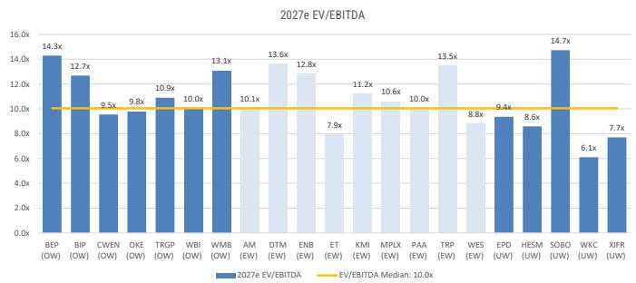

bar chart

2027e EV/EBITDA
| Company | 2027e EV/EBITDA (x) |
| :--- | :--- |
| BEP (OW) | 14.3 |
| BIP (OW) | 12.7 |
| CWEN (OW) | 9.5 |
| OKE (OW) | 9.8 |
| TRGP (OW) | 10.9 |
| WBI (OW) | 10.0 |
| WMB (OW) | 13.1 |
| AM (EW) | 10.1 |
| DTM (EW) | 13.6 |
| ENB (EW) | 12.8 |
| ET (EW) | 7.9 |
| KMI (EW) | 11.2 |
| MPLX (EW) | 10.6 |
| PAA (EW) | 10.0 |
| TRP (EW) | 13.5 |
| WES (EW) | 8.8 |
| EPD (UW) | 9.4 |
| HESM (UW) | 8.6 |
| SOBO (UW) | 14.7 |
| WKC (UW) | 6.1 |
| XIFR (UW) | 7.7 |
EV/EBITDA Median: 10.0x

Source: MS, FactSet

Exhibit 24: MS Infrastructure Research Coverage 2027e Dividend Yield  
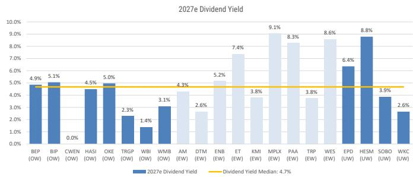

bar chart

| Category | 2027e Dividend Yield |
| -------- | -------------------- |
| BEP (OW) | 4.9% |
| BIP (OW) | 5.1% |
| CWEN (OW) | 0.0% |
| HASI (OW) | 4.5% |
| OKE (OW) | 5.0% |
| TRGP (OW) | 2.3% |
| WBI (OW) | 1.4% |
| WMB (OW) | 3.1% |
| AM (EW) | 4.3% |
| DTM (EW) | 2.6% |
| ENB (EW) | 5.2% |
| ET (EW) | 7.4% |
| KMI (EW) | 3.8% |
| MPLX (EW) | 9.1% |
| PAA (EW) | 8.3% |
| TRP (EW) | 3.8% |
| WES (EW) | 8.6% |
| EPD (UW) | 6.4% |
| HESM (UW) | 8.8% |
| SOBO (UW) | 3.9% |
| WKC (UW) | 2.6% |

Source: MS, FactSet

Exhibit 26: MS Midstream Energy Infrastructure Coverage 2027e FCF Yield  
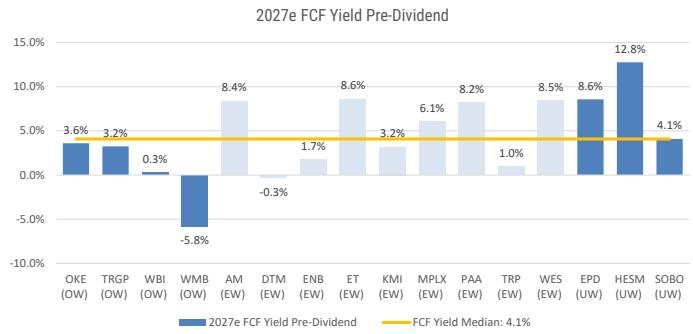

bar chart

| Category | 2027e FCF Yield Pre-Dividend | FCF Yield Median |
| -------- | --------------------------- | ---------------- |
| OKE (OW) | 3.6% | 4.1% |
| TRGP (OW) | 3.2% | 4.1% |
| WBI (OW) | 0.3% | 4.1% |
| WMB (OW) | -5.8% | 4.1% |
| AM (EW) | 8.4% | 4.1% |
| DTM (EW) | -0.3% | 4.1% |
| ENB (EW) | 1.7% | 4.1% |
| ET (EW) | 8.6% | 4.1% |
| KMI (EW) | 3.2% | 4.1% |
| MPLX (EW) | 6.1% | 4.1% |
| PAA (EW) | 8.2% | 4.1% |
| TRP (EW) | 1.0% | 4.1% |
| WES (EW) | 8.5% | 4.1% |
| EPD (UW) | 8.6% | 4.1% |
| HESM (UW) | 12.8% | 4.1% |
| SOBO (UW) | 4.1% | 4.1% |

Source: MS, FactSet

Exhibit 23: MS Infrastructure Research Coverage 2027e Net Debt/EBITDA  
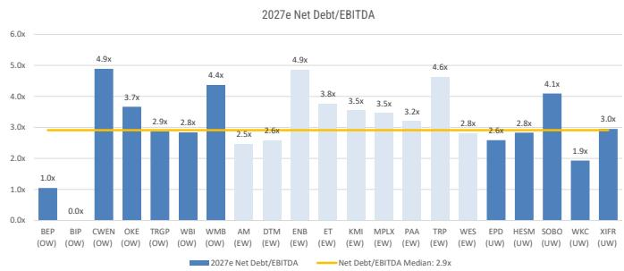

bar chart

| Company | 2027e Net Debt/EBITDA |
|---------|------------------------|
| BEP (OW) | 1.0x |
| BIP (OW) | 0.0x |
| CWEN (OW) | 4.9x |
| OKE (OW) | 3.7x |
| TRGP (OW) | 2.9x |
| WBI (OW) | 2.8x |
| WMB (OW) | 4.4x |
| AM (EW) | 2.5x |
| DTM (EW) | 2.6x |
| ENB (EW) | 4.9x |
| ET (EW) | 3.8x |
| KMI (EW) | 3.5x |
| MPLX (EW) | 3.5x |
| PAA (EW) | 3.2x |
| TRP (EW) | 4.6x |
| WES (EW) | 2.8x |
| EPD (UW) | 2.6x |
| HESM (UW) | 2.8x |
| SOBO (UW) | 4.1x |
| WKC (UW) | 1.9x |
| XIFR (UW) | 3.0x |

Source: MS, FactSet

Exhibit 25: MS Infrastructure Research Coverage 2027e Total Cash Yield (Dividend + Share Buybacks)  
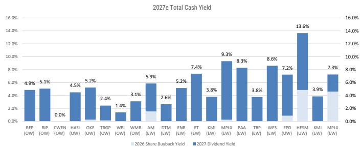

bar chart

| Company | 2026 Share Buyback Yield | 2027 Dividend Yield |
|---------|--------------------------|---------------------|
| BEP (OW) | 4.9% | 5.1% |
| BIP (OW) | 0.0% | 4.5% |
| CWEN (OW) | 5.2% | 5.2% |
| HASI (OW) | 2.4% | 1.4% |
| OKE (OW) | 1.4% | 3.1% |
| TRGP (OW) | 2.6% | 5.9% |
| WBI (OW) | 5.2% | 7.4% |
| WMB (EW) | 3.8% | 9.3% |
| AM (EW) | 8.3% | 3.8% |
| DTM (EW) | 8.6% | 7.2% |
| ENB (EW) | 7.2% | 13.6% |
| ET (EW) | 3.9% | 7.3% |
| KMI (EW) | 4.9% | 5.1% |
| MPLX (EW) | 7.3% | 8.6% |
| PAA (EW) | 4.9% | 3.8% |
| TRP (EW) | 4.9% | 13.6% |
| WES (EW) | 4.9% | 13.6% |
| EPD (UW) | 4.9% | 13.6% |
| HESM (UW) | 4.9% | 13.6% |
| KMI (EW) | 4.9% | 13.6% |
| MPLX (EW) | 4.9% | 13.6% |

Source: MS, FactSet

# Midstream Energy Infrastructure Fundamentals

Exhibit 27: Weekly Commodity Price Summary

<table><tr><td>Ticker</td><td>Commodity</td><td>Last Price</td><td>Last Week</td><td>Last Year</td><td>w/w % chg.</td><td>y/y % chg.</td><td>1Q26</td><td>q/q % chg.</td><td>2Q26</td><td>q/q % chg.</td></tr><tr><td colspan="11">Crude Oil</td></tr><tr><td>CL1 Comdty</td><td>Generic 1st Month WTI Crude Oil</td><td>$84.88</td><td>$90.54</td><td>$68.04</td><td>-6.3%</td><td>24.8%</td><td>$71.85</td><td>21.5%</td><td>$96.68</td><td>34.6%</td></tr><tr><td>C01 Comdty</td><td>Generic 1st Month Brent Crude Oil</td><td>$86.78</td><td>$92.86</td><td>$70.17</td><td>-6.5%</td><td>23.7%</td><td>$77.74</td><td>23.2%</td><td>$101.28</td><td>30.3%</td></tr><tr><td>USCRWTIM Index</td><td>WTI Midland, TX Crude Oil Spot Price</td><td>$85.13</td><td>$91.14</td><td>$68.53</td><td>-6.6%</td><td>24.2%</td><td>$73.19</td><td>23.0%</td><td>$99.12</td><td>35.4%</td></tr><tr><td>USCRMEHC Index</td><td>Magellen East Houston (MEH) Crude Oil Spot Price</td><td>N/A</td><td>N/A</td><td>$68.63</td><td>N/A</td><td>N/A</td><td>N/A</td><td>N/A</td><td>N/A</td><td>N/A</td></tr><tr><td></td><td>Midland-MEH Spread</td><td>N/A</td><td>N/A</td><td>($0.10)</td><td>N/A</td><td>N/A</td><td>N/A</td><td>N/A</td><td>N/A</td><td>N/A</td></tr><tr><td colspan="11">Natural Gas</td></tr><tr><td>NG1 Comdty</td><td>Generic 1st Month Natural Gas</td><td>$3.12</td><td>$3.23</td><td>$3.49</td><td>-3.4%</td><td>-10.7%</td><td>$3.48</td><td>-13.9%</td><td>$2.88</td><td>-17.3%</td></tr><tr><td>NGUSHHUB INDEX</td><td>Henry Hub Natural Gas Spot Price</td><td>$3.06</td><td>$3.04</td><td>$2.90</td><td>0.7%</td><td>5.5%</td><td>$4.83</td><td>29.6%</td><td>$2.90</td><td>-39.8%</td></tr><tr><td>NGTXOASI Index</td><td>Waha Natural Gas Spot Price</td><td>($0.63)</td><td>($0.98)</td><td>$2.04</td><td>-35.7%</td><td>-130.9%</td><td>($1.35)</td><td>68.5%</td><td>($3.95)</td><td>193.5%</td></tr><tr><td>NTGSTXKA Index</td><td>Katy, TX Natural Gas Spot Price</td><td>$2.71</td><td>$2.72</td><td>$2.66</td><td>-0.4%</td><td>1.9%</td><td>$3.31</td><td>2.2%</td><td>$2.45</td><td>-26.0%</td></tr><tr><td></td><td>Waha-Katy Spread</td><td>($3.34)</td><td>($3.70)</td><td>($0.62)</td><td>-9.7%</td><td>438.7%</td><td>($4.66)</td><td>($0.62)</td><td>($6.40)</td><td>($1.74)</td></tr><tr><td>NGCAAECO Index</td><td>AECO Natural Gas Spot Price</td><td>$1.30</td><td>$1.38</td><td>$0.93</td><td>-5.8%</td><td>39.8%</td><td>$1.46</td><td>-10.2%</td><td>$1.14</td><td>-21.9%</td></tr><tr><td colspan="11">Natural Gas Liquids (NGLs)</td></tr><tr><td>LPGSMBPE Index</td><td>Mont Belvieu, TX Ethane Spot Price ($/gal)</td><td>$0.23</td><td>$0.23</td><td>$0.23</td><td>-2.2%</td><td>-3.0%</td><td>$0.23</td><td>-11.7%</td><td>$0.21</td><td>-10.2%</td></tr><tr><td>LPGSMBPP Index</td><td>Mont Belvieu, TX Propane Spot Price ($/gal)</td><td>$0.78</td><td>$0.81</td><td>$0.78</td><td>-4.2%</td><td>0.0%</td><td>$0.69</td><td>5.2%</td><td>$0.84</td><td>20.6%</td></tr><tr><td>LPGSCWPP Index</td><td>Conway, KS Propane Spot Price ($/gal)</td><td>$0.70</td><td>$0.73</td><td>$0.74</td><td>-3.7%</td><td>-5.3%</td><td>$0.64</td><td>6.9%</td><td>$0.74</td><td>15.0%</td></tr><tr><td></td><td>Conway-Belvieu Spread</td><td>$0.08</td><td>$0.08</td><td>$0.04</td><td>-8.3%</td><td>102.6%</td><td>$0.05</td><td>($0.01)</td><td>$0.10</td><td>$0.05</td></tr><tr><td>LPGSMBNB Index</td><td>Mont Belvieu, TX Normal Butane Spot Price ($/gal)</td><td>$0.96</td><td>$1.02</td><td>$0.86</td><td>-6.3%</td><td>11.1%</td><td>$0.88</td><td>5.6%</td><td>$1.09</td><td>24.6%</td></tr><tr><td>LPGSMBNG Index</td><td>Mont Belvieu, TX Natural Gasoline Spot Price ($/gal)</td><td>$1.66</td><td>$1.73</td><td>$1.33</td><td>-3.7%</td><td>25.4%</td><td>$1.52</td><td>22.5%</td><td>$2.03</td><td>33.7%</td></tr><tr><td></td><td>Mont Belvieu, TX NGL Composite Barrel Spot Price</td><td>$0.70</td><td>$0.73</td><td>$0.65</td><td>-4.0%</td><td>8.3%</td><td></td><td></td><td></td><td></td></tr><tr><td></td><td>NGL/Crude Ratio</td><td>33.5%</td><td>32.9%</td><td>39.9%</td><td>0.6</td><td>(6.4)bps</td><td></td><td></td><td></td><td></td></tr><tr><td></td><td colspan="10">Frac Spreads</td></tr><tr><td></td><td>Mont Belvieu, TX NGLs - Henry Hub ($/MMBtu)</td><td>$4.33</td><td>$4.71</td><td>$3.88</td><td>-8.1%</td><td>11.6%</td><td></td><td></td><td></td><td></td></tr><tr><td></td><td>Mont Belvieu, TX Ethane - Henry Hub ($/MMBtu)</td><td>($0.74)</td><td>($0.61)</td><td>($0.42)</td><td></td><td></td><td></td><td></td><td></td><td></td></tr><tr><td></td><td colspan="10">Petrochemicals</td></tr><tr><td></td><td>Ethylene ($/lb)</td><td>$0.23</td><td>$0.24</td><td>$0.20</td><td>-2.9%</td><td>14.2%</td><td></td><td></td><td></td><td></td></tr><tr><td></td><td>Polymer Grade Propylene ($/lb)</td><td>$0.38</td><td>$0.42</td><td>$0.36</td><td>-9.5%</td><td>7.0%</td><td></td><td></td><td></td><td></td></tr></table>

Source: Bloomberg, S&P Platts

## Disclosure Section

The information and opinions in MS were prepared by MS & Co. LLC, and/or MS C.T.V.M. S.A., and/or MS Mexico, Casa de Bolsa, S.A. de C.V., and/or MS Canada Limited. As used in this disclosure section, "MS" includes MS & Co. LLC, MS C.T.V.M. S.A., MS Mexico, Casa de Bolsa, S.A. de C.V., MS Canada Limited and their affiliates as necessary.

For important disclosures, stock price charts and equity rating histories regarding companies that are the subject of this report, please see the MS Disclosure Website at www.morganstanley.com/eqr/disclosures/webapp/generalresearch, or contact your investment representative or MS at 1585 Broadway, (Attention: Research Management), New York, NY, 10036 USA.

For valuation methodology and risks associated with any recommendation, rating or price target referenced in this research report, please contact the Client Support Team as follows: US/Canada +1 800 303-2495; Hong Kong +852 2848-5999; Latin America +1 718 754-5444 (U.S.); London +44 (0)20-7425-8169; Singapore +65 6834-6860; Sydney +61 (0)2-9770-1505; Tokyo +81 (0)3-6836-9000. Alternatively you may contact your investment representative or MS at 1585 Broadway, (Attention: Research Management), New York, NY 10036 USA.

## Analyst Certification

The following analysts hereby certify that their views about the companies and their securities discussed in this report are accurately expressed and that they have not received and will not receive direct or indirect compensation in exchange for expressing specific recommendations or views in this report: David Arcaro, CFA; Robert S Kad; Joe Laetsch, CFA; Devin McDermott.

## Global Research Conflict Management Policy

MS has been published in accordance with our conflict management policy, which is available at www.morganstanley.com/institutional/research/conflictpolicies. A Portuguese version of the policy can be found at www.morganstanley.com.br

## Important Regulatory Disclosures on Subject Companies

The analyst or strategist (or a household member) identified below owns the following securities (or related derivatives): Devin McDermott - Exxon Mobil Corporation(common or preferred stock), NextEra Energy Inc(common or preferred stock), PG&E Corp(common or preferred stock).

As of May 29, 2026, MS beneficially owned 1% or more of a class of common equity securities of the following companies covered in MS: AES Corp., Algonquin Power & Utilities Corp, Ameren Corp, American Electric Power Co, Antero Midstream Corp, Antero Resources Corp, APA Corp, Array Technologies Inc, Atmos Energy Corp., Bloom Energy Corp., Brookfield Infrastructure Corp, Brookfield Infrastructure Partners L.P., Brookfield Renewable Partners LP, Brookfield Renewables Corp, CenterPoint Energy Inc, Cheniere Energy Inc, Chevron Corporation, Chord Energy Corporation, Clearway Energy Inc, CMS Energy Corp, CNX Resources Corp, ConocoPhillips, Consolidated Edison Inc, Constellation Energy Corporation, Delek US Holdings Inc, Devon Energy Corp, Diamondback Energy Inc, Dominion Energy Inc, DT Midstream, Inc., DTE Energy Co., Duke Energy Corp, Edison International, Enbridge, Energy Transfer LP, Enphase Energy Inc, Entergy Corp, EOG Resources Inc, EQT Corp., Eversource Energy, EVgo Inc, Excelerate Energy Inc, Exelon Corp, Expand Energy Corp, Exxon Mobil Corporation, First Solar Inc, FirstEnergy Corp, Fluence Energy Inc, GE Vernova, HA Sustainable Infrastructure, Hess Midstream LP, HF Sinclair Corp, IDACORP Inc, Kinder Morgan Inc., Kinetik Holdings Inc, Marathon Petroleum Corp, Matador Resources Co, MGE Energy, Inc., Murphy Oil Corporation, NextEra Energy Inc, Northern Oil & Gas Inc., NRG Energy Inc, Occidental Petroleum Corp, ONE Gas Inc, Oneok Inc., Permian Resources Corp, PG&E Corp, Phillips 66, Pinnacle West Capital Corp, Plains All American Pipeline LP, Plains GP Holdings, L.P., PPL Corp, Public Service Enterprise Group Inc, Range Resources Corp., Sempra, Solaredge Technologies Inc, Solaris Energy Infrastructure, South Bow Corp, Southern Company, Spire Inc, Sunrun Inc, Talen Energy Corp, Targa Resources Corp., Tourmaline Oil Corp., Valero Energy Corporation, Vistra Corp, WaterBridge Infrastructure LLC, Western Midstream Partners LP, Williams Companies Inc, World Kinect Corporation, Xcel Energy Inc, XPLR Infrastructure, LP.

Within the last 12 months, MS managed or co-managed a public offering (or 144A offering) of securities of AES Corp., American Electric Power Co, Bloom Energy Corp., CenterPoint Energy Inc, Cheniere Energy Inc, Cheniere Energy Partners LP, Chevron Corporation, Clearway Energy Inc, CMS Energy Corp, CNX Resources Corp, Constellation Energy Corporation, Diamondback Energy Inc, Dominion Energy Inc, Duke Energy Corp, Enbridge, Energy Transfer LP, Entergy Corp, Enterprise Products LP, EOG Resources Inc, Eversource Energy, Exelon Corp, FirstEnergy Corp, Fluence Energy Inc, GE Vernova, HA Sustainable Infrastructure, IDACORP Inc, Marathon Petroleum Corp, MGE Energy, Inc., MPLX LP, Murphy Oil Corporation, NextEra Energy Inc, Northern Oil & Gas Inc., NRG Energy Inc, Oneok Inc., Permian Resources Corp, Plains All American Pipeline LP, Plains GP Holdings, L.P., PPL Corp, Public Service Enterprise Group Inc, Sempra, Solaris Energy Infrastructure, Southern Company, Spire Inc, Sunrun Inc, Talen Energy Corp, Targa Resources Corp., TC Energy Corp, Viper Energy Inc, Vistra Corp, WaterBridge Infrastructure LLC, Williams Companies Inc, X-Energy Inc., Xcel Energy Inc, XPLR Infrastructure, LP.

Within the last 12 months, MS has received compensation for investment banking services from Ameren Corp, American Electric Power Co, Array Technologies Inc, Bloom Energy Corp., Brookfield Infrastructure Partners L.P., CenterPoint Energy Inc, Cheniere Energy Inc, Cheniere Energy Partners LP, Chevron Corporation, Clearway Energy Inc, CMS Energy Corp, CNX Resources Corp, Devon Energy Corp, Diamondback Energy Inc, Dominion Energy Inc, DTE Energy Co., Duke Energy Corp, Enbridge, Energy Transfer LP, Entergy Corp, Enterprise Products LP, EOG Resources Inc, Eversource Energy, EVgo Inc, Exelon Corp, Expand Energy Corp, FirstEnergy Corp, GE Vernova, HA Sustainable Infrastructure, IDACORP Inc, Kinder Morgan Inc., Marathon Petroleum Corp, MGE Energy, Inc., MPLX LP, Murphy Oil Corporation, NextEra Energy Inc, Northern Oil & Gas Inc., NRG Energy Inc, Oneok Inc., Permian Resources Corp, Pinnacle West Capital Corp, Plains All American Pipeline LP, Plains GP Holdings, L.P., PPL Corp, Public Service Enterprise Group Inc, Sempra, Solaris Energy Infrastructure, Southern Company, Spire Inc, Sunrun Inc, Talen Energy Corp, Targa Resources Corp., TC Energy Corp, Viper Energy Inc, Vistra Corp, WaterBridge Infrastructure LLC, Williams Companies Inc, World Kinect Corporation, X-Energy Inc., Xcel Energy Inc, XPLR Infrastructure, LP.

In the next 3 months, MS expects to receive or intends to seek compensation for investment banking services from AES Corp., Algonquin Power & Utilities Corp, Ameren Corp, American Electric Power Co, Antero Midstream Corp, Antero Resources Corp, APA Corp, Array Technologies Inc, Bloom Energy Corp., Brookfield Infrastructure Corp, Brookfield Infrastructure Partners L.P., Brookfield Renewable Partners LP, Brookfield Renewables Corp, Cenovus Energy, CenterPoint Energy Inc, Cheniere Energy Inc, Chevron Corporation, Chord Energy Corporation, Clearway Energy Inc, CMS Energy Corp, CNX Resources Corp, Comstock Resources Inc., ConocoPhillips, Consolidated Edison Inc, Constellation Energy Corporation, Devon Energy Corp, Diamondback Energy Inc, Dominion Energy Inc, DT Midstream, Inc., DTE Energy Co., Duke Energy Corp, Edison International, Enbridge, Energy Transfer LP, Entergy Corp, Enterprise Products LP, EOG Resources Inc, EQT Corp., Eversource Energy, Excelerate Energy Inc, Exelon Corp, Expand Energy Corp, Exxon Mobil Corporation, First Solar Inc, FirstEnergy Corp, Fluence Energy Inc, GE Vernova, HA Sustainable Infrastructure, IDACORP Inc, Kinder Morgan Inc., Kinetik Holdings Inc, Marathon Petroleum Corp, Matador Resources Co, MGE Energy, Inc., MPLX LP, Murphy Oil Corporation, NextEra Energy Inc, Northern Oil & Gas Inc., NRG Energy Inc, Occidental Petroleum Corp, ONE Gas Inc, Oneok Inc., PBF Energy Inc, Permian Resources Corp, PG&E Corp, Phillips 66, Pinnacle West Capital Corp, Plains All American Pipeline LP, Plains GP Holdings, L.P., Plug Power Inc., PPL Corp, Public Service Enterprise Group Inc, Range Resources Corp., Sempra, Solaredge Technologies Inc, Solaris Energy Infrastructure, South Bow Corp, Southern Company, Spire Inc, Suncor Energy Inc, Sunrun Inc, Talen Energy Corp, Targa Resources Corp., TC Energy Corp, Tourmaline Oil Corp., Valero Energy Corporation, Venture Global Inc, Viper Energy Inc, Vistra Corp, WaterBridge Infrastructure LLC, Western Midstream Partners LP, Williams Companies Inc, World Kinect Corporation, X-Energy Inc., Xcel Energy Inc, XPLR Infrastructure, LP.

Within the last 12 months, MS has received compensation for products and services other than investment banking services from AES Corp., Ameren Corp, American Electric Power Co, Antero Resources Corp, APA Corp, Array Technologies Inc, Atmos Energy Corp., Bloom Energy Corp., Brookfield Infrastructure Partners L.P., Cenovus Energy, CenterPoint Energy Inc, Cheniere Energy Inc, Cheniere Energy Partners LP, Chevron Corporation, Clearway Energy Inc, CMS Energy Corp, CNX Resources Corp, Comstock Resources Inc., ConocoPhillips, Consolidated Edison Inc, Constellation Energy Corporation, Delek US Holdings Inc, Devon Energy Corp, Diamondback Energy Inc, Dominion Energy Inc, DTE Energy Co., Duke Energy Corp, Edison International, Enbridge, Energy Transfer LP, Entergy Corp, Enterprise Products LP, EOG Resources Inc, EQT Corp., Eversource Energy, Exelon Corp, Expand Energy Corp, Exxon Mobil Corporation, FirstEnergy Corp, GE Vernova, IDACORP Inc, Kinder Morgan Inc., Kinetik Holdings Inc, Marathon Petroleum Corp, MPLX LP, NextEra Energy Inc, Northern Oil & Gas Inc., NRG Energy Inc, Occidental Petroleum Corp, ONE Gas Inc, Oneok Inc., Ovintiv Inc, PBF Energy Inc, Permian Resources Corp, PG&E Corp, Phillips 66, Plains All American Pipeline LP, Plains GP Holdings, L.P., PPL Corp, Public Service Enterprise Group Inc, Range Resources Corp., Sempra, Southern Company, Spire Inc, Suncor Energy Inc, Sunrun Inc, Talen Energy Corp, Targa Resources Corp., TC Energy Corp, Tourmaline Oil Corp., Valero Energy Corporation, Venture Global Inc, Viper Energy Inc, Vistra Corp, Western Midstream Partners LP, Williams Companies Inc, Xcel Energy Inc.

Within the last 12 months, MS has provided or is providing investment banking services to, or has an investment banking client relationship with, the following company: AES Corp., Algonquin Power & Utilities Corp, Ameren Corp, American Electric Power Co, Antero Midstream Corp, Antero Resources Corp, APA Corp, Array Technologies Inc, Bloom Energy Corp., Brookfield Infrastructure Corp, Brookfield Infrastructure Partners L.P., Brookfield Renewable Partners LP, Brookfield Renewables Corp, Cenovus Energy, CenterPoint Energy Inc, Cheniere Energy Inc, Cheniere Energy Partners LP, Chevron Corporation, Chord Energy Corporation, Clearway Energy Inc, CMS Energy Corp, CNX Resources Corp, Comstock Resources Inc, ConocoPhillips, Consolidated Edison Inc, Constellation Energy Corporation, Devon Energy Corp, Diamondback Energy Inc, Dominion Energy Inc, DT Midstream, Inc., DTE Energy Co., Duke Energy Corp, Edison International, Enbridge, Energy Transfer LP, Entergy Corp, Enterprise Products LP, EOG Resources Inc, EQT Corp., Eversource Energy, Excelerate Energy Inc, Exelon Corp, Expand Energy Corp, Exxon Mobil Corporation, First Solar Inc, FirstEnergy Corp, Fluence Energy Inc, GE Vernova, HA Sustainable Infrastructure, IDACORP Inc, Kinder Morgan Inc., Kinetik Holdings Inc, Marathon Petroleum Corp, Matador Resources Co, MGE Energy, Inc., MPLX LP, Murphy Oil Corporation, NextEra Energy Inc, Northern Oil & Gas Inc., NRG Energy Inc, Occidental Petroleum Corp, ONE Gas Inc, Oneok Inc., PBF Energy Inc, Permian Resources Corp, PG&E Corp, Phillips 66, Pinnacle West Capital Corp, Plains All American Pipeline LP, Plains GP Holdings, L.P., Plug Power Inc., PPL Corp, Public Service Enterprise Group Inc, Range Resources Corp., Sempra, Solaredge Technologies Inc, Solaris Energy Infrastructure, South Bow Corp, Southern Company, Spire Inc, Suncor Energy Inc, Sunrun Inc, Talen Energy Corp, Targa Resources Corp., TC Energy Corp, Tourmaline Oil Corp., Valero Energy Corporation, Venture Global Inc, Viper Energy Inc, Vistra Corp, WaterBridge Infrastructure LLC, Western Midstream Partners LP, Williams Companies Inc, World Kinect Corporation, X-Energy Inc., Xcel Energy Inc, XPLR Infrastructure, LP.

Within the last 12 months, MS has either provided or is providing non-investment banking, securities-related services to and/or in the past has entered into an agreement to provide services or has a client relationship with the following company: AES Corp., Algonquin Power & Utilities Corp, Ameren Corp, American Electric Power Co, Antero Resources Corp, APA Corp, Array Technologies Inc, Atmos Energy Corp., Bloom Energy Corp., Brookfield Infrastructure Partners L.P., Brookfield Renewable Partners LP, Canadian Natural Resources Ltd, Cenovus Energy, CenterPoint Energy Inc, Cheniere Energy Inc, Cheniere Energy Partners LP, Chevron Corporation, Chord Energy Corporation, Clearway Energy Inc, CMS Energy Corp, CNX Resources Corp, Comstock Resources Inc., ConocoPhillips, Consolidated Edison Inc, Constellation Energy Corporation, Delek US Holdings Inc, Devon Energy Corp, Diamondback Energy Inc, Dominion Energy Inc, DTE Energy Co., Duke Energy Corp, Edison International, Enbridge, Energy Transfer LP, Entergy Corp, Enterprise Products LP, EOG Resources Inc, EQT Corp., Eversource Energy, Excelerate Energy Inc, Exelon Corp, Expand Energy Corp, Exxon Mobil Corporation, First Solar Inc, FirstEnergy Corp, GE Vernova, HA Sustainable Infrastructure, IDACORP Inc, Kinder Morgan Inc., Kinetik Holdings Inc, Marathon Petroleum Corp, MPLX LP, NextEra Energy Inc, Northern Oil & Gas Inc., NRG Energy Inc, Occidental Petroleum Corp, ONE Gas Inc, Oneok Inc., Ovintiv Inc, PBF Energy Inc, Permian Resources Corp, PG&E Corp, Phillips 66, Pinnacle West Capital Corp, Plains All American Pipeline LP, Plains GP Holdings, L.P., Plug Power Inc., PPL Corp, Public Service Enterprise Group Inc, Range Resources Corp., Sempra, Southern Company, Spire Inc, Suncor Energy Inc, Sunrun Inc, Talen Energy Corp, Targa Resources Corp., TC Energy Corp, Tourmaline Oil Corp., Valero Energy Corporation, Venture Global Inc, Viper Energy Inc, Vistra Corp, Western Midstream Partners LP, Williams Companies Inc, World Kinect Corporation, Xcel Energy Inc, XPLR Infrastructure, LP.

An employee, director or consultant of MS is a director of Occidental Petroleum Corp, PBF Energy Inc, Valero Energy Corporation. This person is not a research analyst or a member of a research analyst's household.

MS & Co. LLC makes a market in the securities of Ameren Corp, Antero Midstream Corp, Array Technologies Inc, Atmos Energy Corp., Brookfield Infrastructure Corp, Brookfield Renewables Corp, Cheniere Energy Partners LP, Chord Energy Corporation, Clearway Energy Inc, CNX Resources Corp, Comstock Resources Inc., Delek US Holdings Inc, DT Midstream, Inc., DTE Energy Co., Entergy Corp, Excelerate Energy Inc, IDACORP Inc, Matador Resources Co, MGE Energy, Inc., Murphy Oil Corporation, NextDecade Corporation, NRG Energy Inc, ONE Gas Inc, Pinnacle West Capital Corp, Sempra, Solaris Energy Infrastructure, Spire Inc, Talen Energy Corp, World Kinect Corporation, XPLR Infrastructure, LP.

The equity research analysts or strategists principally responsible for the preparation of MS have received compensation based upon various factors, including quality of research, investor client feedback, stock picking, competitive factors, firm revenues and overall investment banking revenues. Equity Research analysts' or strategists' compensation is not linked to investment banking or capital markets transactions performed by MS or the profitability or revenues of particular trading desks.

MS and its affiliates do business that relates to companies/instruments covered in MS, including market making, providing liquidity, fund management, commercial banking, extension of credit, investment services and investment banking. MS sells to and buys from customers the securities/instruments of companies covered in MS on a principal basis. MS may have a position in the debt of the Company or instruments discussed in this report. MS trades or may trade as principal in the debt securities (or in related derivatives) that are the subject of the debt research report.

Certain disclosures listed above are also for compliance with applicable regulations in non-US jurisdictions.

## STOCK RATINGS

MS uses a relative rating system using terms such as Overweight, Equal-weight, Not-Rated or Underweight (see definitions below). MS does not assign ratings of Buy, Hold or Sell to the stocks we cover. Overweight, Equal-weight, Not-Rated and Underweight are not the equivalent of buy, hold and sell. Investors should carefully read the definitions of all ratings used in MS. In addition, since MS contains more complete information concerning the analyst's views, investors should carefully read MS, in its entirety, and not infer the contents from the rating alone. In any case, ratings (or research) should not be used or relied upon as investment advice. An investor's decision to buy or sell a stock should depend on individual circumstances (such as the investor's existing holdings) and other considerations.

## Global Stock Ratings Distribution

(as of May 31, 2026)

The Stock Ratings described below apply to MS's Fundamental Equity Research and do not apply to Debt Research produced by the Firm.

For disclosure purposes only (in accordance with FINRA requirements), we include the category headings of Buy, Hold, and Sell alongside our ratings of Overweight, Equal-weight, Not-Rated and Underweight. MS does not assign ratings of Buy, Hold or Sell to the stocks we cover. Overweight, Equal-weight, Not-Rated and Underweight are not the equivalent of buy, hold, and sell but represent recommended relative weightings (see definitions below). To satisfy regulatory requirements, we correspond Overweight, our most positive stock rating, with a buy recommendation; we correspond Equal-weight and Not-Rated to hold and Underweight to sell recommendations, respectively.

<table><tr><td></td><td colspan="2">Coverage Universe</td><td colspan="3">Investment Banking Clients (IBC)</td><td colspan="2">Other Material Investment ServicesClients (MISC)</td></tr><tr><td>Stock RatingCategory</td><td>Count</td><td>% of Total</td><td>Count</td><td>% of Total IBC</td><td>% of RatingCategory</td><td>Count</td><td>% of Total OtherMISC</td></tr><tr><td>Overweight/Buy</td><td>1542</td><td>42%</td><td>465</td><td>51%</td><td>30%</td><td>707</td><td>43%</td></tr><tr><td>Equal-weight/Hold</td><td>1571</td><td>43%</td><td>369</td><td>40%</td><td>23%</td><td>723</td><td>44%</td></tr><tr><td>Not-Rated/Hold</td><td>3</td><td>0%</td><td>0</td><td>0%</td><td>0%</td><td>1</td><td>0%</td></tr><tr><td>Underweight/Sell</td><td>551</td><td>15%</td><td>86</td><td>9%</td><td>16%</td><td>201</td><td>12%</td></tr><tr><td>Total</td><td>3,667</td><td></td><td>920</td><td></td><td></td><td>1632</td><td></td></tr></table>

Data include common stock and ADRs currently assigned ratings. Investment Banking Clients are companies from whom MS received investment banking compensation in the last 12 months. Due to rounding off of decimals, the percentages provided in the "% of total" column may not add up to exactly 100 percent.

## Analyst Stock Ratings

Overweight (O). The stock's total return is expected to exceed the average total return of the analyst's industry (or industry team's) coverage universe, on a risk-adjusted basis, over the next 12-18 months.

Equal-weight (E). The stock's total return is expected to be in line with the average total return of the analyst's industry (or industry team's) coverage universe, on a risk-adjusted basis, over the next 12-18 months.

Not-Rated (NR). Currently the analyst does not have adequate conviction about the stock's total return relative to the average total return of the analyst's industry (or industry team's) coverage universe, on a risk-adjusted basis, over the next 12-18 months.

Underweight (U). The stock's total return is expected to be below the average total return of the analyst's industry (or industry team's) coverage universe, on a risk-adjusted basis, over the next 12-18 months.

Unless otherwise specified, the time frame for price targets included in MS is 12 to 18 months.

## Analyst Industry Views

Attractive (A): The analyst expects the performance of his or her industry coverage universe over the next 12-18 months to be attractive vs. the relevant broad market benchmark, as indicated below.

In-Line (I): The analyst expects the performance of his or her industry coverage universe over the next 12-18 months to be in line with the relevant broad market benchmark, as indicated below. Cautious (C): The analyst views the performance of his or her industry coverage universe over the next 12-18 months with caution vs. the relevant broad market benchmark, as indicated below. Benchmarks for each region are as follows: North America - S&P 500; Latin America - relevant MSCI country index or MSCI Latin America Index; Europe - MSCI Europe; Japan - TOPIX; Asia - relevant MSCI country index or MSCI sub-regional index or MSCI AC Asia Pacific ex Japan Index.

## Important Disclosures for MS Smith Barney LLC Customers

Important disclosures regarding any material conflict of interest that can reasonably be expected to have influenced MS Smith Barney LLC's choice of a third-party research provider or the subject company of a third-party research report, are available on the MS Wealth Management disclosure website at www.morganstanley.com/online/researchdisclosures. For MS specific disclosures, you may refer to https://www.morganstanley.com/eqr/disclosures/webapp/generalresearch.

Each MS report is reviewed and approved on behalf of MS Smith Barney LLC. This review and approval is conducted by the same person who reviews the research report on behalf of MS. This could create a conflict of interest.

## Other Important Disclosures

A member of Research who had or could have had access to the research prior to completion owns securities (or related derivatives) in the AES Corp., Bloom Energy Corp.. This person is not a research analyst or a member of research analyst's household.

MS policy is to update research reports as and when the Research Analyst and Research Management deem appropriate, based on developments with the issuer, the sector, or the market that may have a material impact on the research views or opinions stated therein. In addition, certain Research publications are intended to be updated on a regular periodic basis (weekly/monthly/quarterly/annual) and will ordinarily be updated with that frequency, unless the Research Analyst and Research Management determine that a different publication schedule is appropriate based on current conditions.

MS is not acting as a municipal advisor and the opinions or views contained herein are not intended to be, and do not constitute, advice within the meaning of Section 975 of the Dodd-Frank Wall Street Reform and Consumer Protection Act.

MS produces an equity research product called a "Tactical Idea." Views contained in a "Tactical Idea" on a particular stock may be contrary to the recommendations or views expressed in research on the same stock. This may be the result of differing time horizons, methodologies, market events, or other factors. For all research available on a particular stock, please contact your sales representative or go to Matrix at http://www.morganstanley.com/matrix.

MS is provided to our clients through our proprietary research portal on Matrix and also distributed electronically by MS to clients. Certain, but not all, MS products are also made available to clients through third-party vendors or redistributed to clients through alternate electronic means as a convenience. For access to all available MS, please contact your sales representative or go to Matrix at http://www.morganstanley.com/matrix.

Any access and/or use of MS is subject to MS's Terms of Use (http://www.morganstanley.com/terms.html). By accessing and/or using MS, you are indicating that you have read and agree to be bound by our Terms of Use (http://www.morganstanley.com/terms.html). In addition you consent to MS processing your personal data and using cookies in accordance with our Privacy Policy and our Global Cookies Policy (http://www.morganstanley.com/privacy\_pledge.html), including for the purposes of setting your preferences and to collect readership data so that we can deliver better and more personalized service and products to you. To find out more information about how MS processes personal data, how we use cookies and how to reject cookies see our Privacy Policy and our Global Cookies Policy (http://www.morganstanley.com/privacy\_pledge.html). Please use the provided link to review the Terms and Conditions and Most Important Terms and Conditions for MS India Company Private Limited (https://www.morganstanley.com/assets/pdfs/about-us-global-offices/india/Terms\_and\_conditions.pdf) and the following link to review the audit report (https://ny.matrix.ms.com/eqr/research/webapp/researchdocs/MSICPL\_Morgan\_Stanley\_Research\_Audit\_Report.pdf).

If you do not agree to our Terms of Use and/or if you do not wish to provide your consent to MS processing your personal data or using cookies please do not access our research. MS does not provide individually tailored investment advice. MS has been prepared without regard to the circumstances and objectives of those who receive it. MS recommends that investors independently evaluate particular investments and strategies, and encourages investors to seek the advice of a financial adviser. The appropriateness of an investment or strategy will depend on an investor's circumstances and objectives. The securities, instruments, or strategies discussed in MS may not be suitable for all investors, and certain investors may not be eligible to purchase or participate in some or all of them. MS is not an offer to buy or sell or the solicitation of an offer to buy or sell any security/instrument or to participate in any particular trading strategy. The value of and income from your investments may vary because of changes in interest rates, foreign exchange rates, default rates, prepayment rates, securities/instruments prices, market indexes, operational or financial conditions of companies or other factors. There may be time limitations on the exercise of options or other rights in securities/instruments transactions. Past performance is not necessarily a guide to future performance. Estimates of future performance are based on assumptions that may not be realized. If provided, and unless otherwise stated, the closing price on the cover page is that of the primary exchange for the subject company's securities/instruments.

The fixed income research analysts, strategists or economists principally responsible for the preparation of MS have received compensation based upon various factors, including quality, accuracy and value of research, firm profitability or revenues (which include fixed income trading and capital markets profitability or revenues), client feedback and competitive factors. Fixed Income Research analysts', strategists' or economists' compensation is not linked to investment banking or capital markets transactions performed by MS or the profitability or revenues of particular trading desks.

The "Important Regulatory Disclosures on Subject Companies" section in MS lists all companies mentioned where MS owns 1% or more of a class of common equity securities of the companies. For all other companies mentioned in MS, MS may have an investment of less than 1% in securities/instruments or derivatives of securities/instruments of companies and may trade them in ways different from those discussed in MS. Employees of MS not involved in the preparation of MS may have investments in securities/instruments or derivatives of securities/instruments of companies mentioned and may trade them in ways different from those discussed in MS. Derivatives may be issued by MS or associated persons.

With the exception of information regarding MS, MS is based on public information. MS makes every effort to use reliable, comprehensive information, but we make no representation that it is accurate or complete. We have no obligation to tell you when opinions or information in MS change apart from when we intend to discontinue equity research coverage of a subject company. Facts and views presented in MS have not been reviewed by, and may not reflect information known to, professionals in other MS business areas, including investment banking personnel.

MS personnel may participate in company events such as site visits and are generally prohibited from accepting payment by the company of associated expenses unless pre-approved by authorized members of Research management.

MS may make investment decisions that are inconsistent with the recommendations or views in this report.

To our readers based in Taiwan or trading in Taiwan securities/instruments: Information on securities/instruments that trade in Taiwan is distributed by MS Taiwan Limited ("MSTL"). Such information is for your reference only. The reader should independently evaluate the investment risks and is solely responsible for their investment decisions. MS may not be distributed to the public media or quoted or used by the public media without the express written consent of MS. Any non-customer reader within the scope of Article 7-1 of the Taiwan Stock Exchange Recommendation Regulations accessing and/or receiving MS is not permitted to provide MS to any third party (including but not limited to related parties, affiliated companies and any other third parties) or engage in any activities regarding MS which may create or give the appearance of creating a conflict of interest. Information on securities/instruments that do not trade in Taiwan is for informational purposes only and is not to be construed as a recommendation or a solicitation to trade in such securities/instruments. MSTL may not execute transactions for clients in these securities/instruments.

MS is not incorporated under PRC law and the research in relation to this report is conducted outside the PRC. MS does not constitute an offer to sell or the solicitation of an offer to buy any securities in the PRC. PRC investors shall have the relevant qualifications to invest in such securities and shall be responsible for obtaining all relevant approvals, licenses, verifications and/or registrations from the relevant governmental authorities themselves. Neither this report nor any part of it is intended as, or shall constitute, provision of any consultancy or advisory service of securities investment as defined under PRC law. Such information is provided for your reference only.

MS is disseminated in Brazil by MS C.T.V.M. S.A. located at Av. Brigadeiro Faria Lima, 3600, 6th floor, São Paulo - SP, Brazil; and is regulated by the Comissão de Valores Mobiliários; in Mexico by MS México, Casa de Bolsa, S.A. de C.V which is regulated by Comision Nacional Bancaria y de Valores. Paseo de los Tamarindos 90, Torre 1, Col. Bosques de las Lomas Floor 29, 05120 Mexico City; in Japan by MS MUFG Securities Co., Ltd. and, for Commodities related research reports only, MS Capital Group Japan Co., Ltd; in Hong Kong by MS Asia Limited (which accepts responsibility for its contents) and by MS Bank Asia Limited; in Singapore by MS Asia (Singapore) Pte. (Registration number 199206298Z) and/or MS Asia (Singapore) Securities Pte Ltd (Registration number 200008434H), regulated by the Monetary Authority of Singapore (which accepts legal responsibility for its contents and should be contacted with respect to any matters arising from, or in connection with, MS) and by MS Bank Asia Limited, Singapore Branch (Registration number T14FC0118J); in Australia to "wholesale clients" within the meaning of the Australian Corporations Act by MS Australia Limited A.B.N. 67 003 734 576, holder of Australian financial services license No. 233742, which accepts responsibility for its contents; in Australia to "wholesale clients" and "retail clients" within the meaning of the Australian Corporations Act by MS Wealth Management Australia Pty Ltd (A.B.N. 19 009 145 555, holder of Australian financial services license No. 240813, which accepts responsibility for its contents; in Korea by MS & Co International plc, Seoul Branch; in India by MS India Company Private Limited having Corporate Identification No (CIN) U22990MH1998PTC115305, regulated by the Securities and Exchange Board of India ("SEBI") and holder of licenses as a Research Analyst (SEBI Registration No. INH000001105); Stock Broker (SEBI Stock Broker Registration No. INZ000244438), Merchant Banker (SEBI Registration No. INM000011203), and depository participant with National Securities Depository Limited (SEBI Registration No. IN-DP-NSDL-567-2021) having registered office at Altimus, Level 39 & 40, Pandurang Budhkar Marg, Worli, Mumbai 400018, India; Telephone no. +91-22-61181000; Compliance Officer Details: Mr. Tejarshi Hardas, Tel. No.: +91-22-61181000 or Email: tejarshi.hardas@morganstanley.com; Grievance officer details: Mr. Tejarshi Hardas, Tel. No.: +91-22-61181000 or Email: msic-compliance@morganstanley.com. MS India Company Private Limited (MSICPL) may use AI tools in providing research services. All recommendations contained herein are made by the duly qualified research analysts; in Canada by MS Canada Limited; in Germany and the European Economic Area where required by MS Europe S.E., authorised and regulated by Bundesanstalt fuer Finanzdienstleistungsaufsicht (BaFin) under the reference number 149169; in the US by MS & Co. LLC, which accepts responsibility for its contents. MS & Co. International plc, authorized by the Prudential Regulation Authority and regulated by the Financial Conduct Authority and the Prudential Regulation Authority, disseminates in the UK research that it has prepared, and research which has been prepared by any of its affiliates, only to persons who (i) are investment professionals falling within Article 19(5) of the Financial Services and Markets Act 2000 (Financial Promotion) Order 2005 (as amended, the "Order"); (ii) are persons who are high net worth entities falling within Article 49(2)(a) to (d) of the Order; or (iii) are persons to whom an invitation or inducement to engage in investment activity (within the meaning of section

21 of the Financial Services and Markets Act 2000, as amended) may otherwise lawfully be communicated or caused to be communicated. RMB MS Proprietary Limited is a member of the JSE Limited and A2X (Pty) Ltd. RMB MS Proprietary Limited is a joint venture owned equally by MS International Holdings Inc. and RMB Investment Advisory (Proprietary) Limited, which is wholly owned by FirstRand Limited. The information in MS is being disseminated by MS Saudi Arabia, regulated by the Capital Market Authority in the Kingdom of Saudi Arabia, and is directed at Sophisticated investors only.

The information in MS is being communicated by MS & Co. International plc (DIFC Branch), regulated by the Dubai Financial Services Authority (the DFSA) or by MS & Co. International plc (ADGM Branch), regulated by the Financial Services Regulatory Authority Abu Dhabi (the FSRA), and is directed at Professional Clients only, as defined by the DFSA or the FSRA, respectively. The financial products or financial services to which this research relates will only be made available to a customer who we are satisfied meets the regulatory criteria of a Professional Client. A distribution of the different MS Research ratings or recommendations, in percentage terms for Investments in each sector covered, is available upon request from your sales representative.

The information in MS is being communicated by MS & Co. International plc (QFC Branch), regulated by the Qatar Financial Centre Regulatory Authority (the QFCRA), and is directed at business customers and market counterparties only and is not intended for Retail Customers as defined by the QFCRA.

As required by the Capital Markets Board of Turkey, investment information, comments and recommendations stated here, are not within the scope of investment advisory activity. Investment advisory service is provided exclusively to persons based on their risk and income preferences by the authorized firms. Comments and recommendations stated here are general in nature. These opinions may not fit to your financial status, risk and return preferences. For this reason, to make an investment decision by relying solely to this information stated here may not bring about outcomes that fit your expectations.

The trademarks and service marks contained in MS are the property of their respective owners. Third-party data providers make no warranties or representations relating to the accuracy, completeness, or timeliness of the data they provide and shall not have liability for any damages relating to such data. The Global Industry Classification Standard (GICS) was developed by and is the exclusive property of MSCI and S&P.

MS, or any portion thereof may not be reprinted, sold or redistributed without the written consent of MS.

Indicators and trackers referenced in MS may not be used as, or treated as, a benchmark under Regulation EU 2016/1011, or any other similar framework.

The issuers and/or fixed income products recommended or discussed in certain fixed income research reports may not be continuously followed. Accordingly, investors should regard those fixed income research reports as providing stand-alone analysis and should not expect continuing analysis or additional reports relating to such issuers and/or individual fixed income products. MS may hold, from time to time, material financial and commercial interests regarding the company subject to the Research report.

Registration granted by SEBI and certification from the National Institute of Securities Markets (NISM) in no way guarantee performance of the intermediary or provide any assurance of returns to investors. Investment in securities market are subject to market risks. Read all the related documents carefully before investing.

INDUSTRY COVERAGE: Midstream Energy Infrastructure

<table><tr><td>COMPANY (TICKER)</td><td>RATING (AS OF)</td><td>PRICE* (06/15/2026)</td></tr><tr><td colspan="3">Robert S Kad</td></tr><tr><td>Antero Midstream Corp (AM.N)</td><td>E (04/21/2026)</td><td>$21.33</td></tr><tr><td>Brookfield Infrastructure Corp (BIPC.N)</td><td>U (03/22/2026)</td><td>$40.52</td></tr><tr><td>Brookfield Infrastructure Partners L.P. (BIP.N)</td><td>O (03/22/2026)</td><td>$38.10</td></tr><tr><td>DT Midstream, Inc. (DTM.N)</td><td>E (04/21/2026)</td><td>$140.69</td></tr><tr><td>Enbridge (ENB.TO)</td><td>E (10/25/2024)</td><td>C$78.38</td></tr><tr><td>Energy Transfer LP (ET.N)</td><td>E (12/17/2025)</td><td>$18.91</td></tr><tr><td>Enterprise Products LP (EPD.N)</td><td>U (12/17/2025)</td><td>$36.50</td></tr><tr><td>Hess Midstream LP (HESM.N)</td><td>U (06/09/2026)</td><td>$37.46</td></tr><tr><td>Kinder Morgan Inc. (KMI.N)</td><td>E (09/16/2024)</td><td>$31.46</td></tr><tr><td>Kinetik Holdings Inc (KNTK.N)</td><td>++</td><td>$45.72</td></tr><tr><td>MPLX LP (MPLX.N)</td><td>E (03/19/2021)</td><td>$55.67</td></tr><tr><td>Oneok Inc. (OKE.N)</td><td>O (09/16/2024)</td><td>$87.45</td></tr><tr><td>Plains All American Pipeline LP (PAA.O)</td><td>E (10/25/2024)</td><td>$21.94</td></tr><tr><td>Plains GP Holdings, L.P. (PAGP.O)</td><td>E (10/25/2024)</td><td>$23.88</td></tr><tr><td>South Bow Corp (SOBO.TO)</td><td>U (10/25/2024)</td><td>C$52.75</td></tr><tr><td>Targa Resources Corp. (TRGP.N)</td><td>O (03/19/2021)</td><td>$262.33</td></tr><tr><td>TC Energy Corp (TRP.TO)</td><td>E (06/09/2026)</td><td>C$96.83</td></tr><tr><td>WaterBridge Infrastructure LLC (WBI.N)</td><td>O (04/21/2026)</td><td>$32.27</td></tr><tr><td>Western Midstream Partners LP (WES.N)</td><td>E (06/09/2026)</td><td>$43.96</td></tr><tr><td>Williams Companies Inc (WMB.N)</td><td>O (10/03/2024)</td><td>$71.49</td></tr><tr><td>World Kinect Corporation (WKC.N)</td><td>U (09/16/2024)</td><td>$31.27</td></tr></table>

Stock Ratings are subject to change. Please see latest research for each company.  
\* Historical prices are not split adjusted.

## INDUSTRY COVERAGE: Exploration & Production

<table><tr><td>COMPANY (TICKER)</td><td>RATING (AS OF)</td><td>PRICE* (06/15/2026)</td></tr><tr><td colspan="3">Devin McDermott</td></tr><tr><td>Antero Resources Corp (AR.N)</td><td>O (04/17/2024)</td><td>$34.03</td></tr><tr><td>APA Corp (APA.O)</td><td>U (04/15/2024)</td><td>$34.77</td></tr><tr><td>Chord Energy Corporation (CHRD.O)</td><td>O (03/27/2026)</td><td>$127.60</td></tr><tr><td>CNX Resources Corp (CNX.N)</td><td>U (01/10/2025)</td><td>$32.96</td></tr><tr><td>Comstock Resources Inc. (CRK.N)</td><td>E (01/10/2025)</td><td>$13.05</td></tr><tr><td>ConocoPhillips (COP.N)</td><td>O (12/16/2024)</td><td>$112.26</td></tr><tr><td>Devon Energy Corp (DVN.N)</td><td>O (12/11/2023)</td><td>$43.53</td></tr><tr><td>Diamondback Energy Inc (FANG.O)</td><td>O (12/11/2020)</td><td>$189.96</td></tr><tr><td>EOG Resources Inc (EOG.N)</td><td>E (12/11/2023)</td><td>$131.98</td></tr><tr><td>EQT Corp. (EQT.N)</td><td>O (11/18/2021)</td><td>$50.75</td></tr><tr><td>Expand Energy Corp (EXE.O)</td><td>O (01/10/2025)</td><td>$87.90</td></tr><tr><td>Matador Resources Co (MTDR.N)</td><td>E (01/10/2025)</td><td>$51.38</td></tr><tr><td>Murphy Oil Corporation (MUR.N)</td><td>U (01/22/2025)</td><td>$36.45</td></tr><tr><td>Northern Oil &amp; Gas Inc. (NOG.N)</td><td>U (08/18/2025)</td><td>$19.96</td></tr><tr><td>Occidental Petroleum Corp (OXY.N)</td><td>E (08/18/2025)</td><td>$54.46</td></tr><tr><td>Ovintiv Inc (OVV.N)</td><td>E (03/27/2026)</td><td>$54.31</td></tr><tr><td>Permian Resources Corp (PR.N)</td><td>O (01/10/2025)</td><td>$18.90</td></tr><tr><td>Range Resources Corp. (RRC.N)</td><td>E (03/26/2025)</td><td>$37.46</td></tr><tr><td>Tourmaline Oil Corp. (TOU.TO)</td><td>E (01/10/2025)</td><td>C$61.26</td></tr><tr><td>Viper Energy Inc (VNOM.O)</td><td>O (08/18/2025)</td><td>$43.69</td></tr></table>

Stock Ratings are subject to change. Please see latest research for each company.  
\* Historical prices are not split adjusted.

INDUSTRY COVERAGE: Diversified Natural Gas

<table><tr><td>COMPANY (TICKER)</td><td>RATING (AS OF)</td><td>PRICE* (06/15/2026)</td></tr><tr><td>Devin McDermott</td><td></td><td></td></tr><tr><td>Cheniere Energy Inc (LNG.N)</td><td>O (03/23/2026)</td><td>$235.25</td></tr><tr><td>Cheniere Energy Partners LP (CQP.N)</td><td>E (09/20/2019)</td><td>$60.34</td></tr><tr><td>Excelerate Energy Inc (EE.N)</td><td>E (11/06/2025)</td><td>$35.04</td></tr><tr><td>NextDecade Corporation (NEXT.O)</td><td>E (09/12/2025)</td><td>$7.73</td></tr><tr><td>Venture Global Inc (VG.N)</td><td>O (03/23/2026)</td><td>$11.70</td></tr></table>

Stock Ratings are subject to change. Please see latest research for each company.  
\* Historical prices are not split adjusted.

INDUSTRY COVERAGE: Integrated Energy

<table><tr><td>COMPANY (TICKER)</td><td>RATING (AS OF)</td><td>PRICE* (06/15/2026)</td></tr><tr><td colspan="3">Devin McDermott</td></tr><tr><td>Canadian Natural Resources Ltd (CNQ.TO)</td><td>E (10/07/2021)</td><td>C$61.69</td></tr><tr><td>Cenovus Energy (CVE.TO)</td><td>O (10/07/2021)</td><td>C$37.96</td></tr><tr><td>Chevron Corporation (CVX.N)</td><td>O (08/04/2025)</td><td>$180.40</td></tr><tr><td>Exxon Mobil Corporation (XOM.N)</td><td>O (05/14/2024)</td><td>$140.92</td></tr><tr><td>Imperial Oil Ltd (IMO.TO)</td><td>E (10/07/2021)</td><td>C$168.35</td></tr><tr><td>Suncor Energy Inc (SU.TO)</td><td>E (12/16/2024)</td><td>C$83.39</td></tr></table>

Stock Ratings are subject to change. Please see latest research for each company.  
\* Historical prices are not split adjusted.

INDUSTRY COVERAGE: Diversified Utilities / IPPs

<table><tr><td>COMPANY (TICKER)</td><td>RATING (AS OF)</td><td>PRICE* (06/15/2026)</td></tr><tr><td>David Arcaro, CFA</td><td></td><td></td></tr><tr><td>AES Corp. (AES.N)</td><td>E (03/06/2026)</td><td>$14.68</td></tr><tr><td>American Electric Power Co (AEP.O)</td><td>O (03/10/2020)</td><td>$129.31</td></tr><tr><td>Constellation Energy Corporation (CEG.O)</td><td>O (03/25/2026)</td><td>$262.35</td></tr><tr><td>MGE Energy, Inc. (MGEE.O)</td><td>U (11/17/2021)</td><td>$76.81</td></tr><tr><td>NextEra Energy Inc (NEE.N)</td><td>O (09/06/2022)</td><td>$86.12</td></tr><tr><td>NRG Energy Inc (NRG.N)</td><td>E (12/09/2022)</td><td>$130.40</td></tr><tr><td>Public Service Enterprise Group Inc (PEG.N)</td><td>O (07/02/2020)</td><td>$80.15</td></tr><tr><td>Solaris Energy Infrastructure (SEI.N)</td><td>O (12/02/2025)</td><td>$78.07</td></tr><tr><td>Talen Energy Corp (TLN.O)</td><td>O (03/12/2025)</td><td>$386.21</td></tr><tr><td>Vistra Corp (VST.N)</td><td>O (03/25/2019)</td><td>$153.52</td></tr></table>

Stock Ratings are subject to change. Please see latest research for each company.  
\* Historical prices are not split adjusted.

INDUSTRY COVERAGE: Regulated Utilities

<table><tr><td>COMPANY (TICKER)</td><td>RATING (AS OF)</td><td>PRICE* (06/15/2026)</td></tr><tr><td colspan="3">David Arcaro, CFA</td></tr><tr><td>Algonquin Power &amp; Utilities Corp (AQN.N)</td><td></td><td>$6.00</td></tr><tr><td>Ameren Corp (AEE.N)</td><td>E (04/14/2020)</td><td>$109.57</td></tr><tr><td>Atmos Energy Corp. (ATO.N)</td><td>E (12/16/2025)</td><td>$169.60</td></tr><tr><td>CenterPoint Energy Inc (CNP.N)</td><td>E (07/17/2024)</td><td>$43.07</td></tr><tr><td>CMS Energy Corp (CMS.N)</td><td>E (07/31/2017)</td><td>$73.65</td></tr><tr><td>Consolidated Edison Inc (ED.N)</td><td>U (07/02/2020)</td><td>$107.72</td></tr><tr><td>Dominion Energy Inc (D.N)</td><td>E (12/02/2024)</td><td>$68.15</td></tr><tr><td>DTE Energy Co. (DTE.N)</td><td>O (01/06/2022)</td><td>$148.04</td></tr><tr><td>Duke Energy Corp (DUK.N)</td><td>E (08/25/2014)</td><td>$125.28</td></tr><tr><td>Edison International (EIX.N)</td><td>U (09/06/2022)</td><td>$72.14</td></tr><tr><td>Entergy Corp (ETR.N)</td><td>E (11/04/2024)</td><td>$111.08</td></tr><tr><td>Eversource Energy (ES.N)</td><td>++</td><td>$69.26</td></tr><tr><td>Exelon Corp (EXC.O)</td><td>E (12/18/2023)</td><td>$46.18</td></tr><tr><td>FirstEnergy Corp (FE.N)</td><td>O (03/23/2020)</td><td>$47.34</td></tr><tr><td>IDACORP Inc (IDA.N)</td><td>O (12/16/2025)</td><td>$142.94</td></tr><tr><td>ONE Gas Inc (OGS.N)</td><td>E (01/06/2022)</td><td>$77.38</td></tr><tr><td>PG&amp;E Corp (PCG.N)</td><td>E (09/18/2025)</td><td>$16.58</td></tr><tr><td>Pinnacle West Capital Corp (PNW.N)</td><td>E (03/23/2020)</td><td>$103.27</td></tr><tr><td>PPL Corp (PPL.N)</td><td>O (12/15/2022)</td><td>$36.17</td></tr><tr><td>Sempra (SRE.N)</td><td>O (12/13/2024)</td><td>$91.93</td></tr><tr><td>Southern Company (SO.N)</td><td>U (12/16/2025)</td><td>$93.82</td></tr><tr><td>Spire Inc (SR.N)</td><td>O (12/16/2025)</td><td>$78.74</td></tr><tr><td>Xcel Energy Inc (XEL.O)</td><td>E (10/19/2021)</td><td>$79.35</td></tr></table>

Stock Ratings are subject to change. Please see latest research for each company.  
\* Historical prices are not split adjusted.

INDUSTRY COVERAGE: Clean Tech

<table><tr><td>COMPANY (TICKER)</td><td>RATING (AS OF)</td><td>PRICE* (06/15/2026)</td></tr><tr><td colspan="3">David Arcaro, CFA</td></tr><tr><td>Array Technologies Inc (ARRY.O)</td><td>E (10/17/2023)</td><td>$8.08</td></tr><tr><td>Bloom Energy Corp. (BE.N)</td><td>O (01/09/2023)</td><td>$274.50</td></tr><tr><td>Enphase Energy Inc (ENPH.O)</td><td>U (04/23/2025)</td><td>$52.40</td></tr><tr><td>EVgo Inc (EVGO.O)</td><td>E (06/02/2025)</td><td>$2.04</td></tr><tr><td>First Solar Inc (FSLR.O)</td><td>O (12/08/2023)</td><td>$273.51</td></tr><tr><td>Fluence Energy Inc (FLNC.O)</td><td>E (11/22/2021)</td><td>$24.18</td></tr><tr><td>GE Vernova (GEV.N)</td><td>O (08/01/2024)</td><td>$979.07</td></tr><tr><td>Plug Power Inc. (PLUG.O)</td><td>U (12/06/2023)</td><td>$2.80</td></tr><tr><td>Shoals Technologies Group (SHLS.O)</td><td>E (12/16/2025)</td><td>$10.30</td></tr><tr><td>Solaredge Technologies Inc (SEDG.O)</td><td>E (12/16/2025)</td><td>$60.19</td></tr><tr><td>Sunrun Inc (RUN.O)</td><td>E (04/23/2025)</td><td>$12.47</td></tr><tr><td>X-Energy Inc. (XE.O)</td><td>O (05/19/2026)</td><td>$21.10</td></tr></table>

Stock Ratings are subject to change. Please see latest research for each company.

\* Historical prices are not split adjusted.

INDUSTRY COVERAGE: Refining & Marketing

<table><tr><td>COMPANY (TICKER)</td><td>RATING (AS OF)</td><td>PRICE* (06/15/2026)</td></tr><tr><td colspan="3">Joe Laetsch, CFA</td></tr><tr><td>Delek US Holdings Inc (DK.N)</td><td>E (10/02/2025)</td><td>$44.73</td></tr><tr><td>HF Sinclair Corp (DINO.N)</td><td>O (09/07/2021)</td><td>$67.25</td></tr><tr><td>Marathon Petroleum Corp (MPC.N)</td><td>O (09/07/2021)</td><td>$250.86</td></tr><tr><td>PBF Energy Inc (PBF.N)</td><td>U (10/02/2025)</td><td>$39.66</td></tr><tr><td>Phillips 66 (PSX.N)</td><td>O (04/24/2026)</td><td>$173.26</td></tr><tr><td>Valero Energy Corporation (VLO.N)</td><td>E (10/02/2025)</td><td>$247.16</td></tr></table>

Stock Ratings are subject to change. Please see latest research for each company.

\* Historical prices are not split adjusted.

INDUSTRY COVERAGE: Renewable Energy Infrastructure

<table><tr><td>COMPANY (TICKER)</td><td>RATING (AS OF)</td><td>PRICE* (06/15/2026)</td></tr><tr><td>Robert S Kad</td><td></td><td></td></tr><tr><td>Brookfield Renewable Partners LP (BEP.N)</td><td>O (01/23/2025)</td><td>$34.63</td></tr><tr><td>Brookfield Renewables Corp (BEPC.N)</td><td>U (03/22/2026)</td><td>$36.63</td></tr><tr><td>Clearway Energy Inc (CWEN.N)</td><td>O (07/31/2024)</td><td>$38.61</td></tr><tr><td>HA Sustainable Infrastructure (HASI.N)</td><td>O (10/17/2023)</td><td>$38.23</td></tr><tr><td>XPLR Infrastructure, LP (XIFR.N)</td><td>U (02/03/2025)</td><td>$11.66</td></tr></table>

Stock Ratings are subject to change. Please see latest research for each company.

\* Historical prices are not split adjusted.

© 2026 MS