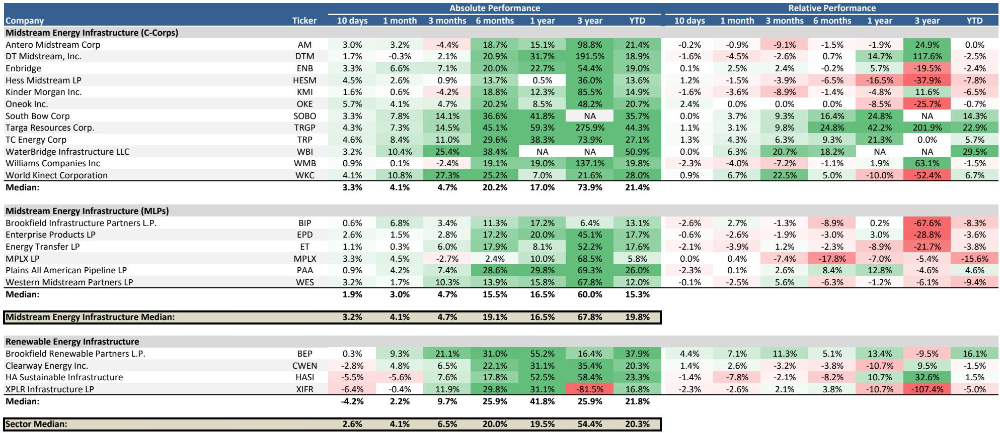
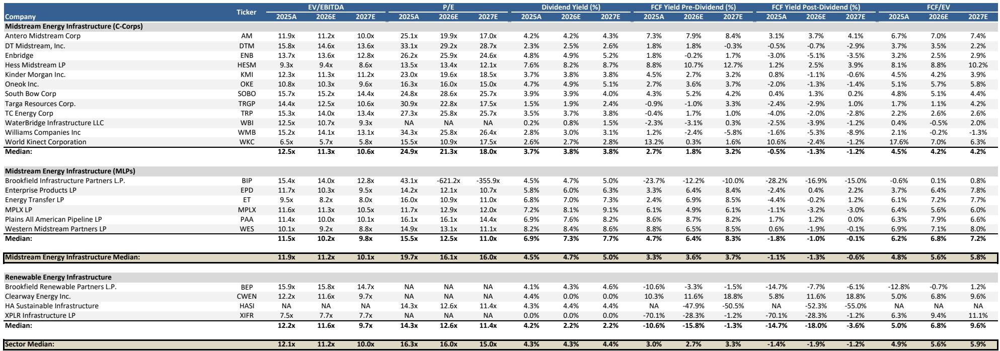
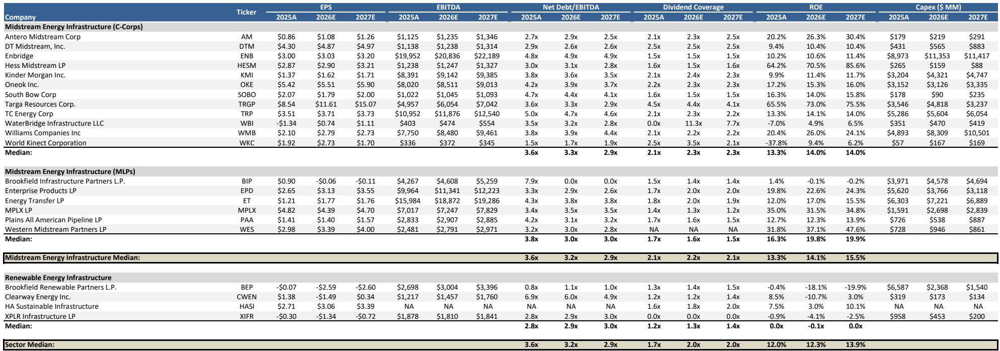

# 摩根斯坦利：能源基础设施的定价权正在从宏观叙事转向微观资产

这份摩根斯坦利本周发布的北美中游与可再生能源基础设施周报，提供了一组看似孤立、实则紧密关联的信号。报告覆盖了从霍尔木兹海峡的地缘政治博弈到Permian盆地管道扩容的微观工程进展，从中国原油进口的急剧收缩到AI数据中心项目的搁浅。将这些信号放在一起，一个更值得关注的判断浮现出来：当前市场对能源基础设施资产的定价，正在从依赖宏观地缘叙事转向聚焦微观资产的运营现实与合约结构。这一转变意味着，过去两年基于“能源安全”和“AI电力需求”的板块普涨逻辑，正在被更精细的资产选择逻辑所取代。

为什么现在重要？因为市场正在经历一个“压力测试”窗口。霍尔木兹海峡可能重新开放的前景正在压低原油价格，而AI相关股票的动量因子正在经历今年以来最剧烈的回撤。在这两个负面因素同时作用下，中游能源基础设施资产的表现分化将比以往任何时候都更能揭示哪些公司真正拥有结构性护城河，哪些只是搭上了主题的便车。

这份报告最值得细读的地方在于，它没有停留在宏观判断，而是提供了多个具体资产层面的数据点——从Waha天然气价格的反弹驱动因素，到单个管道项目的在役时间线，再到AI数据中心项目的客户承诺缺失。这些微观证据，才是判断未来6-12个月能源基础设施投资方向的关键。

## 1. 霍尔木兹海峡的“投降式”重开并不会终结中游资产的吸引力，反而会加速资本向拥有长期合约的资产集中

报告开篇就抛出了一个大胆的判断：如果美伊达成协议重新开放霍尔木兹海峡，这将被市场视为一个“投降事件”，促使资本从避险资产重新轮动回能源板块。这个判断看似矛盾——地缘风险溢价消失，为什么反而利好能源？但仔细推敲，逻辑是成立的。

关键前提在于时机与不确定性。报告指出，交通流量正常化和全球库存补充需要时间。这意味着即便协议达成，实际供应恢复也不是一蹴而就的。更重要的是，中国过去几个月大量削减原油进口（5月进口量较冲突前水平下降近500万桶/日），但这并非需求崩溃的信号。摩根斯坦利的商品策略师Martijn Rats的分析揭示了一个关键细节：中国在冲突前一直在超量进口、积极建立商业和战略库存。因此，进口削减是在库存充裕的背景下发生的，实际终端需求仅下降了约120万桶/日。

这意味着什么？一旦地缘局势明朗，中国可能迅速从去库存转向补库存，从而对油价形成支撑。对于中游基础设施而言，无论是管道、存储还是出口终端，其收入主要来自长期合约而非现货价格波动。因此，油价因地缘缓和而短期承压，并不会实质性影响这些资产的现金流稳定性。相反，地缘不确定性的降低反而可能释放被压抑的资本支出决策，推动新的管道和LNG项目推进。

这一逻辑的隐含含义是：那些对油价波动暴露度高的上游资产，与那些拥有长期收费合约的中游资产，将在同一地缘事件下面临截然不同的定价逻辑。投资者需要区分的是，哪些公司的收入结构真正独立于油价方向。

## 2. Permian天然气外输瓶颈的缓解不是利空，而是下一轮增长的催化剂

报告提供了一个非常具体的案例来支撑上述判断。根据Hart Energy的报道，Kinder Morgan的Gulf Coast Express（GCX）管道扩容已经投入服务，增加了570 MMcf/d的压缩能力。这一扩容的直接结果是：Waha（Permian盆地）天然气价格从5月下旬开始出现“急剧且持续的反弹”。

这个案例的关键洞察在于——管道瓶颈的缓解，不是天然气中游资产的利空（因为通常认为新增运力会压缩现有管道的利用率），而是利好。原因在于，Permian盆地的天然气伴生气产量一直在增长，而外输能力不足导致区域气价长期处于深度贴水状态，迫使生产商关井或减少钻探活动。一旦新增运力到位，生产商可以恢复产量，从而为管道系统带来更多的输送量。

报告进一步指出，WhiteWater的2.5 Bcf/d Blackcomb管道和Energy Transfer的2.2 Bcf/d Hugh Brinson管道将在未来几个月内提供更多运力。这看起来是供给侧的进一步放松，但报告提出了一个值得关注的二阶效应：这些新增运力可能将过剩的天然气从Permian转移到Agua Dulce和Katy枢纽，而这两个地方在等待新的LNG出口需求启动之前，也可能出现区域性的气价贴水。

对投资者而言，这意味着：中游资产的价值不再仅仅取决于“拥有管道”，而是取决于管道的起讫点、合约结构以及是否连接了有增长潜力的需求端。那些连接Permian盆地到LNG出口终端的管道，其长期价值远高于连接两个同样过剩的天然气枢纽的管道。报告没有直接点名，但这一逻辑指向了Targa Resources等拥有Permian集输和加工资产的公司，其业务将直接受益于产量恢复。

## 3. AI数据中心的电力需求叙事正在经历现实检验，天然气基础设施的长期逻辑反而更坚实

报告提到一个值得高度关注的事件：Crusoe在怀俄明州的AI数据中心项目因未能获得客户承诺而停滞，谷歌对其成本结构和时间表表示担忧。同时，报告指出AI/电力相关股票的动量因子正在经历今年以来最严重的回撤，这直接拖累了Williams Companies、DT Midstream和Kinder Morgan等天然气基础设施股票的表现。

但报告给出了明确的立场：这种弱势表现“过度且没有反映2H26可能出现的新项目公告”，而新项目的支撑来自“加速的超大规模云服务商AI投资”。报告中的图表显示，亚马逊、谷歌、微软、Meta和Oracle的合计AI资本支出预计将从2025年的约2000亿美元增长到2027年的约4000亿美元。

这里需要仔细拆解。Crusoe项目的搁浅说明了一个问题：AI数据中心的建设并非线性推进，而是受到电力供应、客户承诺、成本结构等多重因素的制约。但这并不意味着AI电力需求的总量叙事被证伪。相反，它意味着需求将从“概念性规划”阶段进入“可行性筛选”阶段——那些拥有现成电网接入、低成本天然气供应和明确客户合约的项目将率先推进，而缺乏这些条件的项目将延迟或取消。

对于天然气基础设施而言，这一筛选过程反而是利好。因为它意味着，真正能够满足AI数据中心电力需求的项目，将更倾向于选择靠近天然气管道和发电设施的地点，从而创造对管道扩容和天然气供应的真实需求，而非仅仅是市场想象。报告没有展开的是，哪些管道资产位于AI数据中心热点区域附近，以及这些资产的合约结构是否允许灵活扩容——这些正是完整报告中值得深入挖掘的细节。

## 4. 中游合约重置的可能性和管道政治博弈，正在创造新的赢家和输家

报告提供了两个看似不起眼但可能影响深远的微观事件。第一个是Devon Energy在Coterra交易完成后，可能重新谈判Delaware和Anadarko盆地的中游合约。第二个是特朗普总统指责纽约州长违反支持Williams Companies的Constitution Pipeline项目的协议。

这两个事件指向同一个趋势：中游资产的合约稳定性正在被重新定价。Devon的潜在合约重置提醒市场，即使是在长期合约框架下，当上游生产商面临整合或现金流压力时，重新谈判的可能性始终存在。这会影响那些合约结构较弱的资产的估值折价。

而Constitution Pipeline的政治博弈则展示了另一种风险：即使项目具有经济合理性，监管和政治障碍仍可能导致项目长期搁置或彻底取消。对于投资于新管道项目的资本而言，政治风险溢价需要被纳入定价模型。

这两个事件共同指向一个尚未被市场充分定价的维度：中游资产的竞争优势不仅取决于资产质量，还取决于合约条款的约束力和项目推进的政策确定性。那些拥有“不可撤销”合约条款或已获得全部必要许可的资产，其估值应该享有溢价；而那些依赖重新谈判或仍面临监管不确定性的资产，其风险折价可能被低估。

## 5. 报告未完全回答的关键问题：中国需求的结构性放缓是否被中游资产定价所低估

报告花了相当篇幅分析中国原油进口的急剧下降，并指出这并非完全由需求崩溃驱动，而是库存调整和炼厂开工率下降的综合结果。摩根斯坦利的商品策略师估算中国终端石油需求同比下降约120万桶/日，其中LPG和燃料油下降最为明显，而柴油和汽油需求相对韧性。

但报告没有回答的是：如果中国电动汽车渗透率继续加速（报告提到“加速的NEV销售”正在抵消强劲的出行数据），那么中国的石油需求峰值可能比市场预期的更早到来。这对于全球原油贸易流向、海上运输基础设施以及最终对北美出口终端的需求，都将产生深远影响。

具体到中游基础设施，如果中国长期石油需求增速放缓，那么美国LNG出口终端的长期利用率假设就需要重新审视。目前市场普遍假设亚洲需求将持续增长，从而支撑美国LNG出口的长期合约价格。但如果中国这个最大的增量市场开始收缩，这一假设的脆弱性就会暴露。

报告没有展开这一分析，而是将重点放在了中国短期库存行为的解读上。但对于中长期投资者而言，中国需求结构的变化可能是比地缘政治更重要的变量。这一未解问题，正是深入研读完整报告的价值所在——摩根斯坦利的完整研究库中包含了关于天然气价值链和AI/数据中心发展的专题报告，这些报告可能会提供更完整的分析框架。

## 6. 重新构建你的观察框架：从“能源基础设施”到“合约基础设施”

综合以上分析，当前阶段评估中游能源基础设施资产，需要一个不同于过去两年的框架。核心问题不再是“这个板块是否受益于能源安全或AI电力需求”，而是“这个资产是否拥有不可替代的物理位置、不可撤销的长期合约，以及可验证的客户承诺”。

具体而言，投资者可以关注以下几个维度：

第一，资产的合约结构。长期固定收费合约（take-or-pay）的比例越高，资产对油价和宏观经济波动的免疫能力越强。报告中对Devon可能重置合约的提示，恰恰说明合约并非不可侵犯，因此需要关注合约条款中的终止条件和重新谈判机制。

第二，资产与终端需求的连接。连接Permian盆地到LNG出口终端的管道，其价值高于连接两个过剩天然气枢纽的管道。报告中对Waha价格反弹的分析表明，管道瓶颈的缓解顺序和方向决定了哪些资产先受益。

第三，AI数据中心的实际落地进度。报告指出Crusoe项目搁浅，但同时强调超大规模云服务商的资本支出仍在加速。这意味着需要区分“概念性项目”和“已签约项目”——那些拥有电力采购协议和客户承诺的数据中心项目，才是天然气基础设施的真实需求来源。

第四，政治和监管风险的地图。Constitution Pipeline的案例提醒投资者，即使项目符合经济和环境标准，政治博弈仍可能导致项目搁置。在评估管道资产时，需要将其所在州的监管环境和政治气候纳入定价模型。

这四点构成了一个比“能源基础设施板块”更精细的分析框架。在这个框架下，同一板块内的不同资产可能面临截然不同的估值逻辑。而这正是完整研报所提供的公司层面分析和估值模型的价值所在——它能够帮助投资者从“买板块”转向“买资产”。

---

以上分析基于摩根斯坦利本周发布的北美中游与可再生能源基础设施周报，但远未穷尽这份报告的全部价值。报告中还包含了详细的行业估值比较、公司评级与目标价、以及关于原油价格如何影响中游股票方向的专题研究。这些内容对于理解当前资产定价的合理性至关重要。

特别值得关注的是，报告附录中包含了针对MLP、C-Corp和可再生能源基础设施的详细公司概况，以及关于AI/数据中心发展对天然气价值链影响的专题报告。这些材料提供了比周报更深入的分析框架和更长期的投资视角。

如果你希望进一步探讨报告中的具体公司分析、估值模型，或者想了解我们如何将上述观察框架应用于实际投资决策，欢迎来知识星球微信群继续讨论。我们会在社群中分享完整的研读笔记和原始图表，并围绕报告中未完全展开的关键问题——如中国需求结构变化对LNG出口的影响、AI数据中心项目的真实落地节奏——进行更深入的交流。

Personal reading notes and learning share only. Not investment advice.

