GLOBAL STRATEGY PAPER NO. 76

# The Post Modern Cycle – Navigating the Capex Boom

natural_image

Abstract graphic with three icons: a circuit board, a rocket, and a power plant, set against a colorful geometric background (no text or symbols)

- The Post Modern cycle is reshaping equity returns. This cycle marks a transition away from decades of disinflation, deregulation, falling rates and globalisation toward higher macro volatility, rising real rates, greater state intervention and regionalisation. The composition of returns is likely to shift further away from valuation as a driver of returns toward EPS growth.  
- A capex supercycle is taking hold. The AI revolution is generating a new engine of growth and private sector investment spending. At the same time, a greater focus on energy security and geopolitics is triggering a synchronised surge in public investment. Supply chains are being reconfigured for resilience, raising capital intensity and structurally increasing cost bases, as the cycle shifts from capital-light growth to capital-intensive expansion.  
- Markets are broadening opportunity sets. The combination of higher private capex demand, to fund the AI boom, and a growing need for governments to borrow is putting upward pressure on the cost of capital, driving higher growth in technology and increasing values of real assets. The result is rising cross-sectional dispersion, increasing the scope for alpha generation.

## Peter Oppenheimer

+44 20 7552-5782

peter.oppenheimer@gs.com

GS International

## Guillaume Jaisson

+44 20 7552-3000

guillaume.jaisson@gs.com

GS International

## Sharon Bell

+44 20 7552-1341

sharon.bell@gs.com

GS International

## Giovanni Ferrannini

+44 20 7051-2589

giovanni.ferrannini@gs.com

GS International

## Elena Porfidia

+44 20 7051-5240

elena.porfidia@gs.com

GS International

  
The Postmodern Cycle

Positioning for secular change  

natural_image

Abstract geometric pattern with overlapping colored circles and a central white circle (no text or symbols)

Read >

## The Post Modern Cycle – Navigating the Capex Boom

In our 2022 Global Strategy Paper, The Post Modern Cycle; Positioning for Secular Change, we focused on a series of emerging structural changes that we argued would drive a different set of challenges and opportunities for investors compared with previous cycles. We described the period post WWII through to the late 1970s as the ‘Traditional’ cycle, which was characterised by high volatility in macro variables. The 1980s saw the emergence of what we describe as the ‘Modern’ cycle, dominated by low inflation and macro volatility coupled with the effects of globalisation. The ‘Post Modern’ cycle refers to the period post the pandemic when dramatic changes began to occur in economies, geopolitics and technology.

The traditional investment cycle (pre 1980s) was generally short and volatile reflecting booms and busts and periods of high and low inflation and interest rates; investors typically required a high dividend yield to compensate for the risks in equity markets.  
The ‘Modern’ cycle (from the early 1980s) was characterised by more stability and predictability. It benefited from sustained falls in inflation, interest rates and risk premia. Geopolitical tensions eased and supply side reforms accompanied waves of deregulation, the end of capital controls, deeper capital markets and stronger world trade growth. A new era of globalisation drove profit shares of GDP to record highs. Independent central banks and forward guidance contributed to longer and less volatile economic cycles (see Exhibit 2).  
The ‘Post Modern’ cycle (post the pandemic) is likely to be driven by a different set of macro conditions and priorities, implying different styles of investment and opportunities.

Among the changes shaping the shift from the modern to post-modern cycles we included a transition from:

■ Disinflation towards reflation;  
■ QE and zero interest rates towards higher interest rates;  
■ Lower to higher government debt and cost of capital;  
■ Globalisation towards regionalisation;  
■ Low capital intensity towards higher infrastructure spending;  
■ Growth scarcity towards more diversified growth opportunity.

Since 2022, when we wrote about the Post Modern cycle, other developments – the war in Ukraine and Iran, rise in US tariffs, the emergence of AI, and changes to the geopolitical landscape – have amplified and accelerated many of these nascent themes. In this paper, we examine some of these changes, how the market is reacting and adapting to them, and what investment opportunities they create.

## The ‘Modern’ super cycle, 1982-2007

The stark contrast in some of these drivers becomes more obvious when we look at the dominant trends that shaped financial markets in the 40 years since the peak of global interest rates in 1982. For economies and equity markets, the key drivers were:

## Low valuations and disinflation

The start of this super cycle followed the bruising de-rating and poor returns of financial assets driven by the combination of high inflation and rising rates in the 1970s. At the end of the decade, the so-called Volcker credit crunch had pushed policy rates in the US from around 10% to close to 20%, triggering a recession and a deep bear market;

valuations collapsed and the S&P 500 reached a trough trailing P/E of 7x. As inflation reached a peak, and interest rates began to moderate, equity and bond markets staged a major recovery.

## Supply side reforms and lower taxes

In combination with easing inflationary pressures and lower interest rates, sweeping economic reforms began to emerge. The Reagan and Thatcher ‘revolutions’ resulted in waves of deregulation, lower unionisation, privatisation, lower taxes and the end of credit controls (Exhibit 1). Eventually, many other countries followed suit, supporting a broader economic recovery.

Exhibit 1: Corporate tax rates fell from 1980s to 2020  
Effective corporate tax rate. Historical constituents kept constant before year: 1989 (S&P 500), 1996 (FTSE 350), 2000 (SBF 120 and CDAX)  
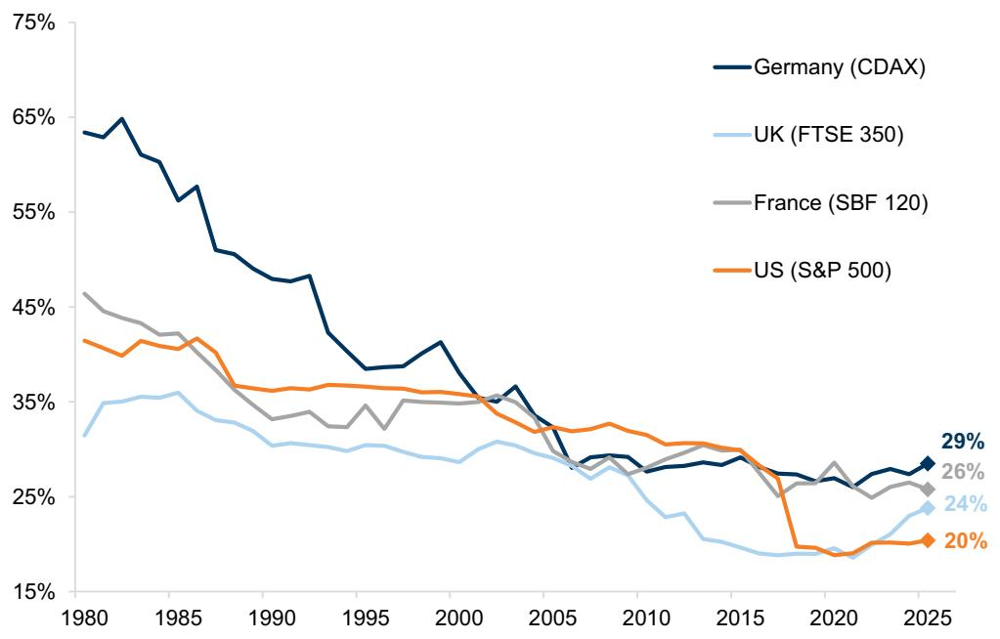

line chart

| Year | Germany (CDAX) | UK (FTSE 350) | France (SBF 120) | US (S&P 500) |
|------|----------------|---------------|------------------|--------------|
| 2025 | 29%            | 24%           | 26%              | 20%          |

Source: Datastream, GS Global Investment Research

## Lower macro volatility

The combination of these factors resulted in a healthier mix between growth and inflation as well as an era of lower volatility in macro variables (Exhibit 2).

Exhibit 2: The ‘Modern’ super cycle was characterised by lower volatility in macro variables Data for the US  
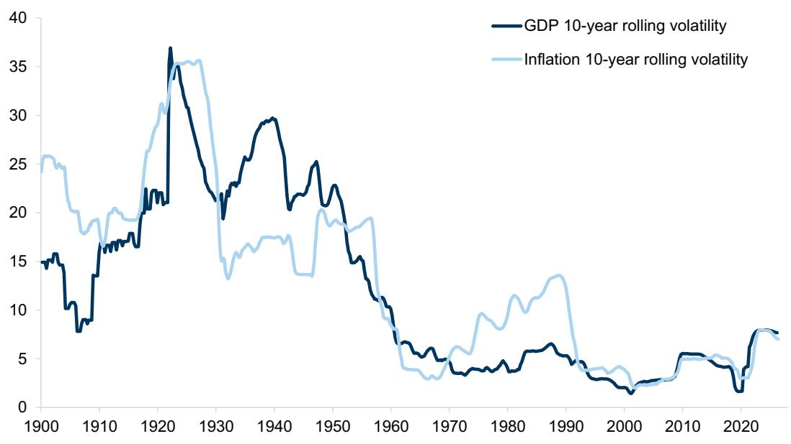

line chart

| Year | GDP 10-year rolling volatility | Inflation 10-year rolling volatility |
|------|-------------------------------|-------------------------------------|
| 1900 | 15                            | 25                                  |
| 1910 | 17                            | 20                                  |
| 1920 | 22                            | 30                                  |
| 1930 | 20                            | 15                                  |
| 1940 | 30                            | 18                                  |
| 1950 | 25                            | 20                                  |
| 1960 | 10                            | 5                                   |
| 1970 | 5                             | 6                                   |
| 1980 | 4                             | 10                                  |
| 1990 | 6                             | 13                                  |
| 2000 | 2                             | 3                                   |
| 2010 | 5                             | 5                                   |
| 2020 | 8                             | 7                                   |

Source: GS Global Investment Research

## Lower tariffs and rising globalization

There was a concerted shift towards lower trade tariffs, which, together with the ending of many capital controls, boosted world trade growth and spurred economic integration (Exhibit 3). The 1986 Uruguay Round of GATT was more comprehensive than anything that had come before. It included services and capital as well as textiles and agriculture and was the first time that developing countries played an active role in trade negotiations. This marked the start of a new era of globalisation that expanded rapidly following the collapse of the Berlin Wall in 1989, the signing of NAFTA in 1994, India joining the WTO in 1995, and, finally, China joining in 2001. Between 1995 and 2010, the pace of world trade growth grew at twice the pace of World GDP. The outsourcing of manufacturing to lower-cost regions of the world boosted world trade and profit shares of GDP and the cost of importing capital goods back to the West dropped dramatically.

Exhibit 3: World trade growth has increased dramatically in the period of globalisation  
World merchandise imports plus exports, % of GDP  
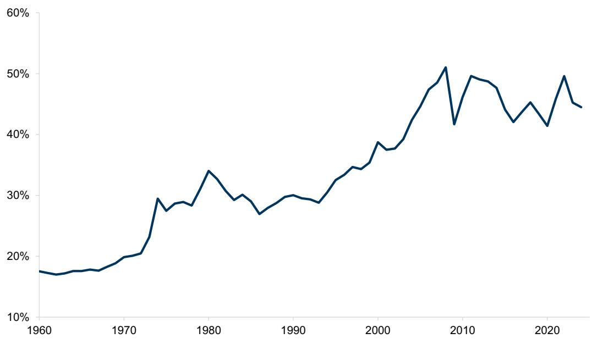

line chart

| Year | Percentage |
| ---- | ---------- |
| 1960 | 17%        |
| 1970 | 20%        |
| 1980 | 34%        |
| 1990 | 30%        |
| 2000 | 38%        |
| 2010 | 50%        |
| 2020 | 45%        |

Source: Haver Analytics, GS Global Investment Research

## Lower defence spending and falling government deficits

The supply side reforms of the 1980s triggered a trend of smaller governments and less government debt, further supported by the ‘peace dividend’ that followed the collapse of the Soviet Union. In 1991, President Bush announced plans to scrap US tactical nuclear weapons in Europe and Asia and called off long range nuclear bombers from 24 hour flights. The UK announced its ‘options for change’ policy of restructuring armed forces in the summer of 1990. US spending on defense fell sharply between 1985 and 1993 and remained flat between 1993 and 1999.

Exhibit 4: Global spending on defence trended downwards during the ‘Modern’ super cycle
World military spending (as a share of GDP)  
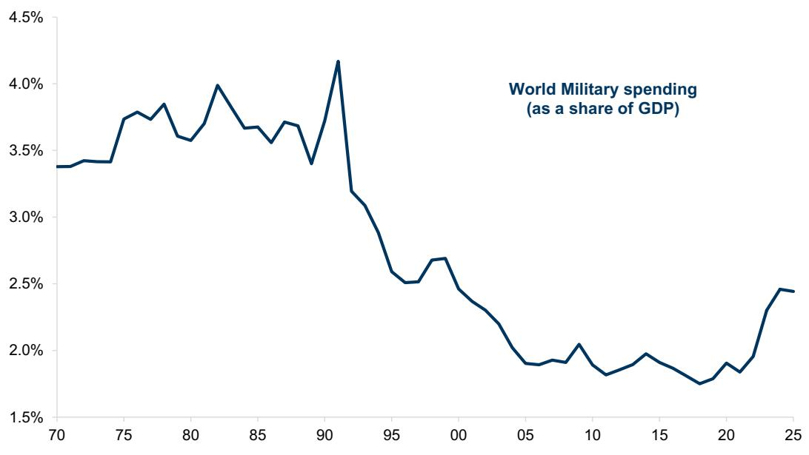

line chart

| Year | World Military spending (as a share of GDP) |
| ---- | ------------------------------------------ |
| 70   | 3.4%                                       |
| 75   | 3.8%                                       |
| 80   | 3.6%                                       |
| 85   | 3.7%                                       |
| 90   | 4.2%                                       |
| 95   | 2.5%                                       |
| 00   | 2.7%                                       |
| 05   | 1.9%                                       |
| 10   | 1.8%                                       |
| 15   | 1.9%                                       |
| 20   | 1.8%                                       |
| 25   | 2.5%                                       |

Source: SIPRI Military Expense Database, IMF, GS Global Investment Research

The declines in government spending relative to GDP (Exhibit 3) meant that by 1997, under President Bill Clinton, the US recorded a budget surplus for the first time since 1969.

## Lower labour and energy costs

The integration of former Soviet countries into the economies and labour markets of Western Europe was complimented by greater trade ties between the US and Mexico. The trend towards globalisation, supported by both political and technological developments, allowed a significant outsourcing of lower-skilled manufacturing jobs from Western economies. Between 1990 and 2009, the share of labour compensation in national income fell in 26 out of 30 advanced countries, with the median labour share of national income falling from 66.1% to 61.7%, according to the OECD. Rapid migration also contributed to this effect. In the UK, for example, the relative price of labour fell by around 20% between 2009 and 2015 as the labour supply increased by almost 4 million or 12.5%, according to the ONS.

Meanwhile, there was also a meaningful decline in energy costs. Significant investment in the 1990s and 2000s meant that there was excess capacity in commodity exploration in the post financial crisis era. The shale gas revolution resulted in record low natural gas prices in the US and had a profound impact on the energy industry. Following the collapse of the technology bubble and then the financial crisis, there were excess energy supplies and cheap prices with little incentive to invest.

## Higher corporate profitability and margins

The combination of these factors helped to boost profitability and raised the profit share of GDP (Exhibit 5), facilitating a period of unusually strong returns in equity markets.

Exhibit 5: Labour share declines as profit share dominates in the 21st century  
Profits and wages as shares of GDP (%) - US  
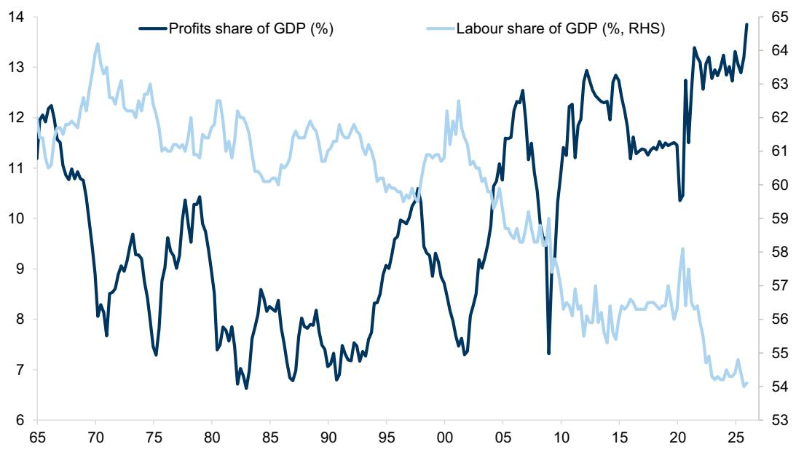

line chart

| Year | Profits share of GDP (%) | Labour share of GDP (%, RHS) |
|------|--------------------------|-----------------------------|
| 65   | 12.0                     | 61.5                        |
| 70   | 8.0                      | 63.0                        |
| 75   | 9.0                      | 61.0                        |
| 80   | 10.5                     | 62.0                        |
| 85   | 7.0                      | 60.5                        |
| 90   | 8.0                      | 61.5                        |
| 95   | 9.5                      | 60.0                        |
| 00   | 7.5                      | 59.5                        |
| 05   | 11.0                     | 58.0                        |
| 10   | 12.5                     | 57.0                        |
| 15   | 13.0                     | 56.5                        |
| 20   | 11.5                     | 57.5                        |
| 25   | 14.0                     | 54.0                        |

Source: Haver Analytics, GS Global Investment Research

## The zero rate cycle – financial crisis to pandemic (2009-2022)

This favourable regime was starkly and abruptly disrupted by the Global Financial Crisis of 2008/9. The economic consequences of this crash were so severe that it heralded a period of unprecedented monetary support. While economies struggled to recover their pre-crisis vigour, the impact of QE and policy stimulus was mainly felt in financial assets, which propelled equity and bond markets to new highs, largely driven by rising valuations.

Strikingly, the economic recovery from the financial crisis was weaker than the average recovery since 1950 (Exhibit 6). Nevertheless, the recovery in equity markets following the end of the financial crisis was much stronger than previous cycles (Exhibit 7).

Exhibit 6: While the economic recovery from the financial crisis was weaker than average...  
Real US GDP following the end of a recession. Indexed to 100. Average = 9 episodes since 1950 excluding the 2020 episode  
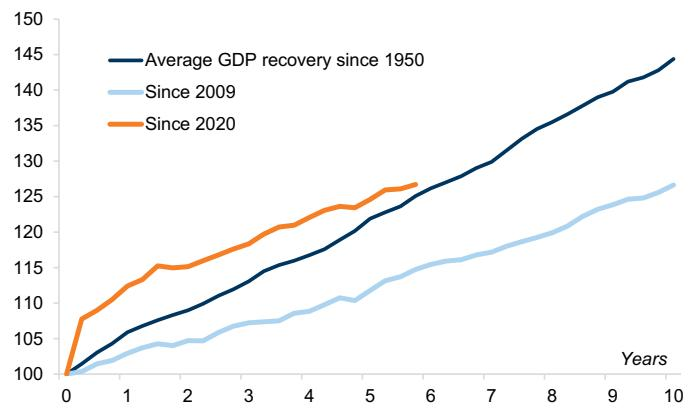

line chart

| Years | Average GDP recovery since 1950 | Since 2009 | Since 2020 |
|-------|----------------------------------|----------|----------|
| 0     | 100                              | 100      | 100      |
| 1     | ~105                             | ~103     | ~112     |
| 2     | ~108                             | ~104     | ~115     |
| 3     | ~112                             | ~106     | ~118     |
| 4     | ~116                             | ~108     | ~120     |
| 5     | ~120                             | ~110     | ~123     |
| 6     | ~125                             | ~113     | ~126     |
| 7     | ~130                             | ~116     | ~128     |
| 8     | ~135                             | ~119     | ~130     |
| 9     | ~140                             | ~122     | ~133     |
| 10    | ~145                             | ~126     | ~136     |

Source: Haver Analytics, GS Global Investment Research

Exhibit 7: ... the opposite was true for financial markets
SPX since the trough preceding the end of a recession. Indexed to 100. Average = 9 episodes since 1950 excluding the 2020 episode  
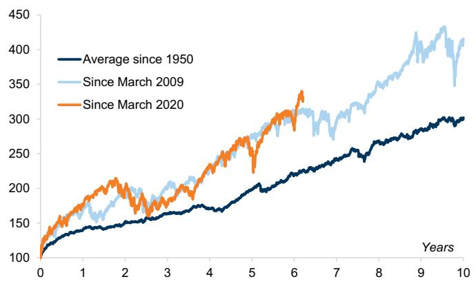

line chart

| Years | Average since 1950 | Since March 2009 | Since March 2020 |
|-------|---------------------|------------------|------------------|
| 0     | 100                 | 100              | 100              |
| 1     | ~130                | ~150             | ~160             |
| 2     | ~140                | ~180             | ~200             |
| 3     | ~150                | ~200             | ~180             |
| 4     | ~160                | ~220             | ~240             |
| 5     | ~180                | ~260             | ~280             |
| 6     | ~200                | ~300             | ~340             |
| 7     | ~220                | ~320             | —                |
| 8     | ~240                | ~360             | —                |
| 9     | ~260                | ~400             | —                |
| 10    | ~300                | ~420             | —                |

Source: Datastream, GS Global Investment Research

While overall financial market returns were strong (bond and equity markets went up together), the returns became very bifurcated within equity markets. Weak nominal GDP and low inflation resulted in a downward trend of year/year sales growth in the corporate sector (Exhibit 8).

Exhibit 8: Top-line growth has been falling along with declining nominal GDP yoy sales growth (10y rolling average), Market ex Financials (USD)  
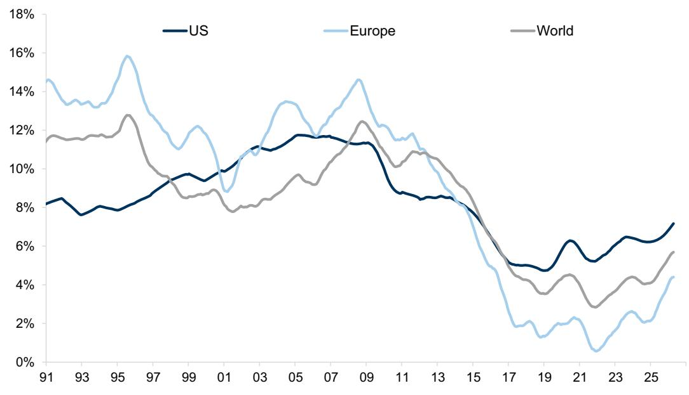

line chart

| Year | US    | Europe | World |
|------|-------|--------|-------|
| 91   | 8.3%  | 14.5%  | 11.7% |
| 93   | 7.7%  | 13.5%  | 11.6% |
| 95   | 8.0%  | 15.8%  | 12.8% |
| 97   | 8.5%  | 13.0%  | 10.0% |
| 99   | 9.5%  | 12.0%  | 8.5%  |
| 01   | 9.8%  | 8.8%   | 7.8%  |
| 03   | 10.5% | 10.8%  | 8.2%  |
| 05   | 11.2% | 13.5%  | 9.5%  |
| 07   | 11.5% | 14.5%  | 10.5% |
| 09   | 11.3% | 14.8%  | 12.3% |
| 11   | 8.8%  | 12.0%  | 10.5% |
| 13   | 8.5%  | 10.5%  | 9.5%  |
| 15   | 7.5%  | 8.0%   | 7.0%  |
| 17   | 5.0%  | 4.0%   | 4.5%  |
| 19   | 4.8%  | 2.0%   | 3.5%  |
| 21   | 6.2%  | 1.0%   | 2.8%  |
| 23   | 6.5%  | 2.5%   | 3.5%  |
| 25   | 7.2%  | 4.5%   | 5.8%  |

Source: Worldscope, Datastream, GS Global Investment Research

The combination of ultra-low interest rates and low nominal growth resulted in a surge in investment flows into industries (or economies) that could generate growth and rising returns. Given that the US economy recovered more strongly than other regions (particularly Europe which faced a second crisis around its sovereign debt market), investment flows increasingly went to the US, largely flowing into the technology sector where profits began to grow sharply.

While growth assets successively outperformed and valuations increased, the

performance reflected fundamentally stronger profit growth (Exhibit 9).

Exhibit 9: The performance of growth assets reflected fundamentally stronger profit growth 12m trailing EPS (USD). Indexed to 100 in January 2009  
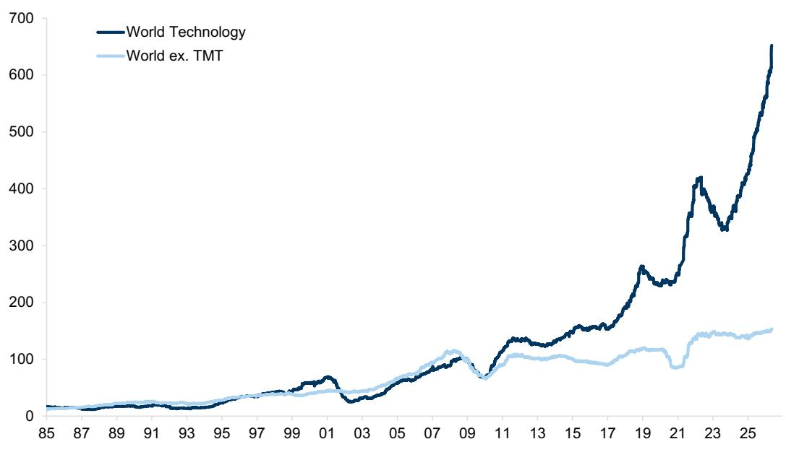

line chart

| Year | World Technology | World ex. TMT |
|------|------------------|---------------|
| 85   | ~10              | ~10           |
| 87   | ~15              | ~15           |
| 89   | ~20              | ~20           |
| 91   | ~25              | ~25           |
| 93   | ~30              | ~30           |
| 95   | ~40              | ~40           |
| 97   | ~50              | ~50           |
| 99   | ~60              | ~60           |
| 01   | ~70              | ~70           |
| 03   | ~40              | ~40           |
| 05   | ~60              | ~60           |
| 07   | ~80              | ~80           |
| 09   | ~100             | ~100          |
| 11   | ~130             | ~110          |
| 13   | ~140             | ~120          |
| 15   | ~150             | ~130          |
| 17   | ~160             | ~140          |
| 19   | ~260             | ~150          |
| 21   | ~350             | ~160          |
| 23   | ~420             | ~170          |
| 25   | ~650             | ~180          |

Source: Datastream, GS Global Investment Research

The technology industry also enjoyed a strong acceleration in ROE (Exhibit 10) driven by pricing power as the world migrated from analogue to digital and demand surged for software applications and cloud computing. The companies providing these solutions benefited from the costly capex that was financed a decade or so earlier in the days of the dotcom boom.

Exhibit 10: The technology industry enjoyed a strong acceleration in ROE 12-month forward ROE (%)  
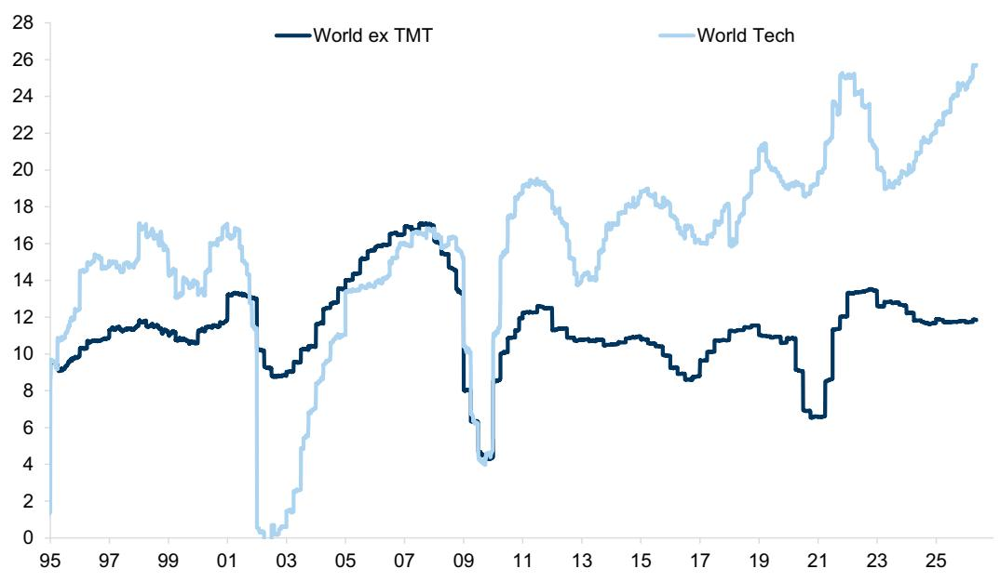

line chart

| Year | World ex TMT | World Tech |
|------|--------------|----------|
| 95   | 9.0          | 10.0     |
| 97   | 11.0         | 15.0     |
| 99   | 11.5         | 17.0     |
| 01   | 13.0         | 17.0     |
| 03   | 8.5          | 0.0      |
| 05   | 14.0         | 13.0     |
| 07   | 17.0         | 16.0     |
| 09   | 4.0          | 6.0      |
| 11   | 12.0         | 19.0     |
| 13   | 11.0         | 14.0     |
| 15   | 10.5         | 18.0     |
| 17   | 11.0         | 16.0     |
| 19   | 11.5         | 21.0     |
| 21   | 6.5          | 25.0     |
| 23   | 13.0         | 24.0     |
| 25   | 12.0         | 26.0     |

Source: Datastream, GS Global Investment Research

So while the era of zero interest rates generated high equity and bond returns, the spread within equity markets was very wide. The US consistently outperformed other equity markets, and technology was the strongest driver of returns by sector resulting in growth consistently outperforming value (Exhibit 11).

Exhibit 11: US consistently outperformed other equity markets, and technology was the strongest driver of returns by sector  
Relative price performance (in USD)  
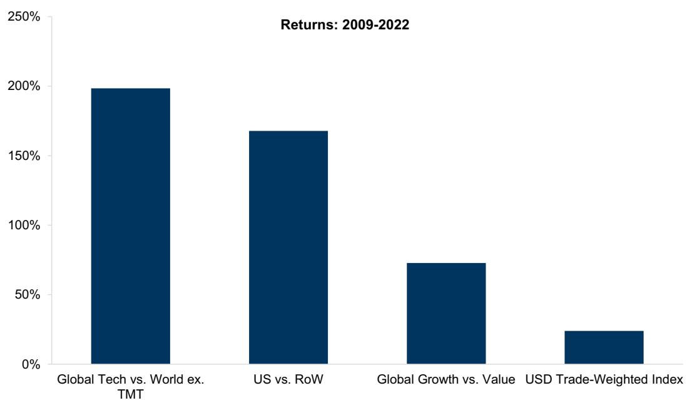

bar chart

Returns: 2009-2022
| Index | Return (%) |
| :--- | :--- |
| Global Tech vs. World ex. TMT | 198 |
| US vs. RoW | 168 |
| Global Growth vs. Value | 72 |
| USD Trade-Weighted Index | 23 |

Source: Datastream, FactSet, Bloomberg, GS Global Investment Research

## From 2022: The ‘Post Modern’ cycle

As record low interest rates began to rise following the Covid pandemic, structural shifts in several fundamental drivers started to take place:

1. Higher cost of capital. For the first time since the 1970s, the pandemic resulted in rising inflation and, with it, a sharp increase in interest rates.  
2. Rising government debt. The issues of moral hazard that weakened the case for fiscal support after the financial crisis were no longer relevant.  
3. Higher tariffs.  
4. The questioning of the ‘rules-based order’ that had governed defence and trade relationships over the previous 80 years.  
5. Secure supply of energy and commodities becoming increasingly important.  
6. The war in Ukraine and Iran leading to rising defense spending.  
7. The emergence of AI and the dramatic increase in technology-driven capex.

## The shift in the cost of capital

The supply chain disruption that followed the global pandemic triggered inflationary pressures for the first time this century. In the period that followed the financial crisis of 2008/9, the combination of QE ending and the inflationary effects of the pandemic has resulted in significant increases in interest rates away from the zero bound (and from below zero in much of Europe). Some of this can be explained by higher inflation following the pandemic, but much of the increase is in real interest rates (Exhibit 12), marking a significant shift from the post financial crisis.

Exhibit 12: Real yields have contributed meaningfully to the rise in longer-term nominal forwards after the pandemic  
Nominal yields by component since 1-Sep-21  
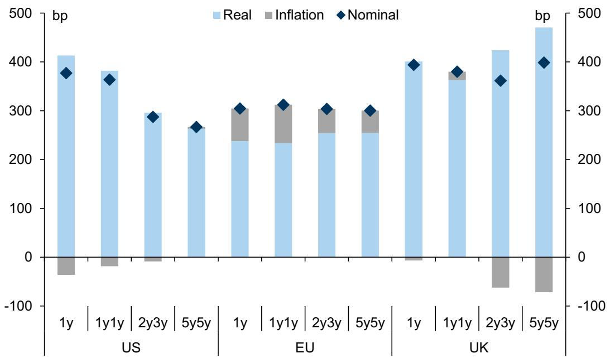

bar-line hybrid chart

| Region | Timeframe | Real (bp) | Inflation (bp) | Nominal (bp) |
| :--- | :--- | :--- | :--- | :--- |
| US | 1y | 410 | -60 | 380 |
| US | 1y1y | 380 | -20 | 370 |
| US | 2y3y | 280 | -10 | 290 |
| US | 5y5y | 265 | 0 | 270 |
| EU | 1y | 235 | 80 | 310 |
| EU | 1y1y | 230 | 85 | 315 |
| EU | 2y3y | 250 | 60 | 305 |
| EU | 5y5y | 255 | 65 | 305 |
| UK | 1y | 395 | -10 | 400 |
| UK | 1y1y | 375 | 0 | 385 |
| UK | 2y3y | 420 | -60 | 365 |
| UK | 5y5y | 470 | -80 | 400 |

Source: GS FICC and Equities, GS Global Investment Research

## The rise in government debt

Some of the rise in longer-dated interest rates may reflect the growing competition for capital from governments. While government debt levels have been high for some time, the rise since the start of this century has been significant (Exhibit 13). In the US, the ratio of public debt to GDP increased from 55% to 124% $^{1}$ , the UK from 37% to 95%, the Euro area from 69% to 95% and China from 22% to 102%. Ageing populations have also been a contributor to this trend as has the series of crises that have been addressed through government spending: the financial crisis of 2008/9, the Covid pandemic, the war in Ukraine and, more recently, Iran, have had a cumulative impact on debt levels.

In combination with higher interest rates, this has resulted in interest expenses for most governments taking up a significantly higher share of their spending.

Exhibit 13: Limit to the new cycle: debt has risen  
Government debt as a percentage of GDP. Dotted lines are GIR Economics forecasts  
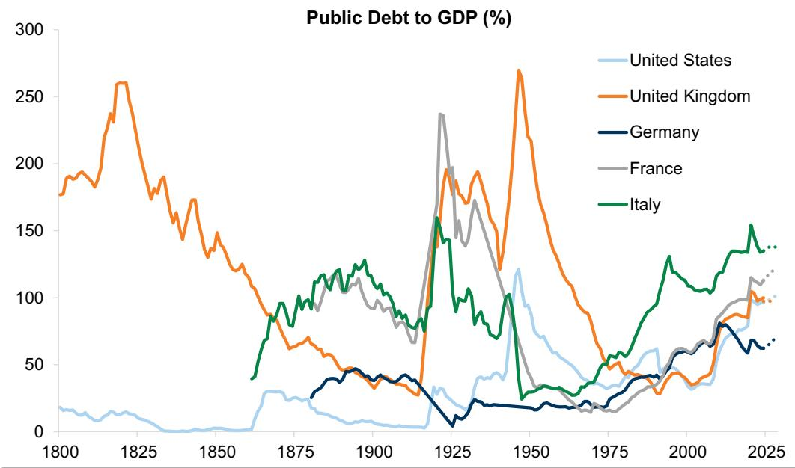

line chart

| Year | United States | United Kingdom | Germany | France | Italy |
|------|---------------|----------------|---------|--------|-------|
| 1800 | ~15           | ~180           | -       | -      | -     |
| 1825 | ~10           | ~260           | -       | -      | -     |
| 1850 | ~5            | ~140           | -       | -      | -     |
| 1875 | ~30           | ~60            | ~40     | ~100   | ~40   |
| 1900 | ~20           | ~40            | ~40     | ~100   | ~120  |
| 1925 | ~30           | ~190           | ~20     | ~240   | ~160  |
| 1950 | ~120          | ~270           | ~20     | ~30    | ~30   |
| 1975 | ~30           | ~50            | ~30     | ~20    | ~50   |
| 2000 | ~60           | ~40            | ~60     | ~60    | ~130  |
| 2025 | ~100          | ~100           | ~65     | ~120   | ~140  |

Source: IMF, Haver Analytics, GS Global Investment Research

It is difficult to overstate the extent of this shift, particularly in long duration debt markets. Only a handful of years ago, German and Japanese 30-year bonds enjoyed a zero (or close to zero) interest rate (Exhibit 14), whereas the rates are now close to 4%. The competition for global capital from governments has increased.

Exhibit 14: Only a few years ago, German and Japanese 30-year bonds enjoyed a zero (or close to zero) interest rate  
30-year government bond benchmark yields (%)  
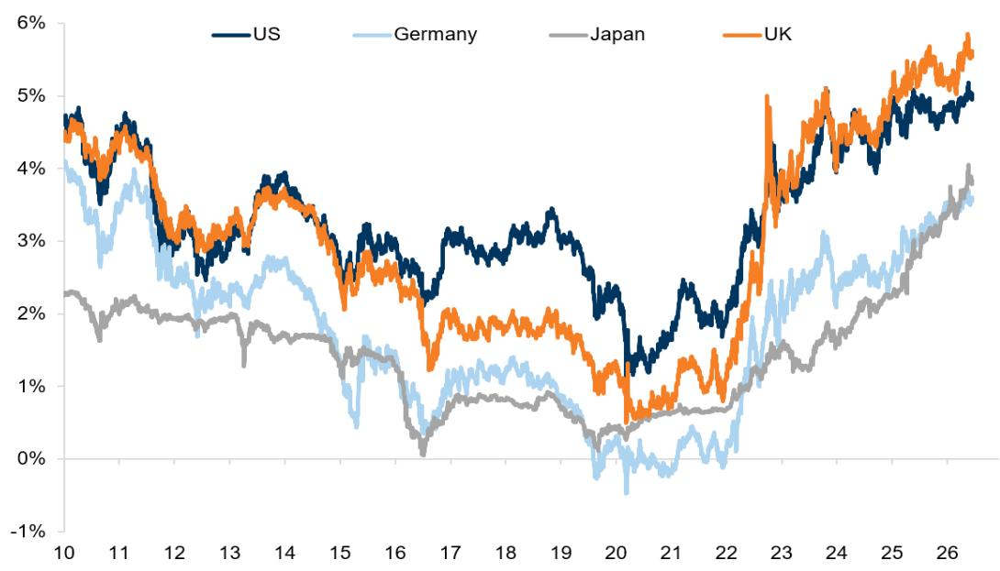

line chart

| Year | US    | Germany | Japan | UK    |
|------|-------|---------|-------|-------|
| 10   | 4.8%  | 4.0%    | 2.3%  | 4.5%  |
| 11   | 4.7%  | 3.8%    | 2.2%  | 4.4%  |
| 12   | 4.5%  | 3.6%    | 2.1%  | 4.2%  |
| 13   | 4.3%  | 3.4%    | 2.0%  | 4.0%  |
| 14   | 4.1%  | 3.2%    | 1.9%  | 3.8%  |
| 15   | 3.9%  | 3.0%    | 1.8%  | 3.6%  |
| 16   | 3.7%  | 2.8%    | 1.7%  | 3.4%  |
| 17   | 3.5%  | 2.6%    | 1.6%  | 3.2%  |
| 18   | 3.3%  | 2.4%    | 1.5%  | 3.0%  |
| 19   | 3.1%  | 2.2%    | 1.4%  | 2.8%  |
| 20   | 2.9%  | 2.0%    | 1.3%  | 2.6%  |
| 21   | 2.7%  | 1.8%    | 1.2%  | 2.4%  |
| 22   | 2.5%  | 1.6%    | 1.1%  | 2.2%  |
| 23   | 2.3%  | 1.4%    | 1.0%  | 2.0%  |
| 24   | 2.1%  | 1.2%    | 0.9%  | 1.8%  |
| 25   | 1.9%  | 1.0%    | 0.8%  | 1.6%  |
| 26   | 1.7%  | 0.8%    | 0.7%  | 1.4%  |

Source: Datastream, GS Global Investment Research

## Increased tariffs and slower world trade

Following a multi-decade long decline in effective tariffs, the US administration has increased tariffs to levels not seen since 1930s (Exhibit 15).

Exhibit 15: The US administration has increased tariffs to levels not seen since 1930s  
US Effective Tariff Rate (Customs Revenue as a Share of Goods Imports) (%)  
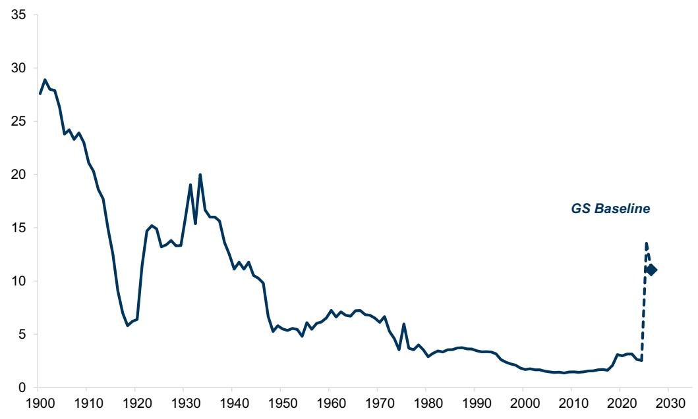

line chart

| Year | Value |
|------|-------|
| 1900 | 28.5  |
| 1910 | 23.0  |
| 1920 | 6.0   |
| 1930 | 19.0  |
| 1940 | 11.0  |
| 1950 | 5.5   |
| 1960 | 7.0   |
| 1970 | 6.5   |
| 1980 | 3.5   |
| 1990 | 3.0   |
| 2000 | 2.0   |
| 2010 | 1.5   |
| 2020 | 3.0   |
| 2025 | 11.0  |

Source: Department of Commerce, GS Global Investment Research

This has resulted in a rising trend of government intervention and restrictions to trade (Exhibit 16). While much of this focuses on manufactured products, the US government's move to restrict certain newly released AI models for foreign nationals is another sign of the Post Modern Cycle: a reassertion of politics and state authority relative to purely technical or market-led frameworks.

Exhibit 16: We have observed a rising trend of government intervention and restrictions to trade  
By year of implementation, globally  
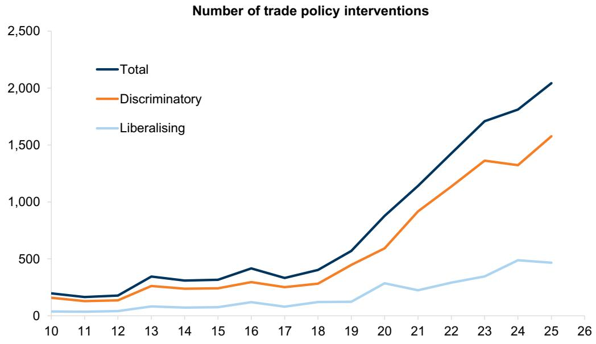

line chart

| Year | Total | Discriminatory | Liberalising |
|------|-------|----------------|--------------|
| 10   | 180   | 160            | 30           |
| 11   | 170   | 150            | 35           |
| 12   | 190   | 170            | 40           |
| 13   | 350   | 250            | 60           |
| 14   | 320   | 240            | 55           |
| 15   | 330   | 250            | 60           |
| 16   | 420   | 280            | 100          |
| 17   | 340   | 260            | 70           |
| 18   | 400   | 290            | 110          |
| 19   | 580   | 450            | 120          |
| 20   | 900   | 600            | 280          |
| 21   | 1150  | 950            | 230          |
| 22   | 1450  | 1150           | 300          |
| 23   | 1700  | 1380           | 350          |
| 24   | 1850  | 1330           | 480          |
| 25   | 2050  | 1580           | 470          |

Source: Global Trade Alert, Data compiled by GS Global Investment Research

Alongside a firmer trade policy, geopolitical tensions have also increased resulting in a surge in policy uncertainty (Exhibit 17).

Exhibit 17: A multi-year high in policy uncertainty  
Headline Policy Uncertainty Index - Baker, Bloom, Davis  
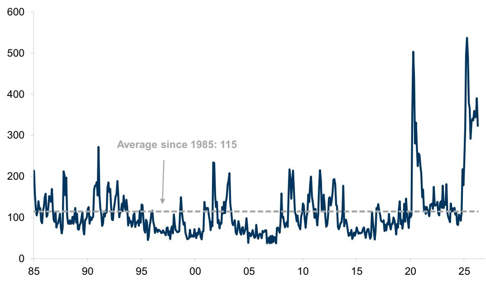

line chart

| Year | Value |
| ---- | ----- |
| Average since 1985 | 115 |

Source: PolicyUncertainty.com, Haver Analytics, GS Global Investment Research

This rise in geopolitical uncertainty, and a questioning of the rules-based order that had governed trade and defence relationships for many decades, is also leading to increasing spending on defence across many parts of the world following years of declining spend that followed the collapse of the Soviet Union in the early 1990s.

## The rise of AI and related capex

Finally, the emergence of large language models has spawned an innovation cycle in technology and, alongside this, a renewed requirement for capital spending (Exhibit 18).

Exhibit 18: The emergence of large language models has spawned a renewed requirement for capital spending  
Capex as a % of cash flow from operations, dashed line represents 2026 consensus  
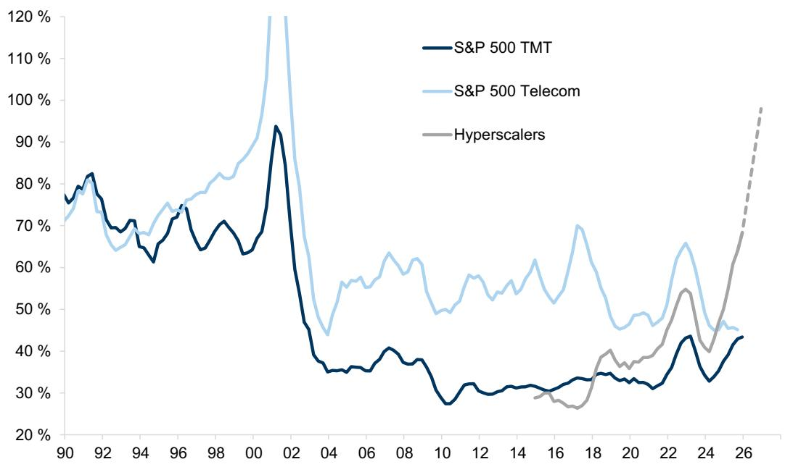

line chart

| Year | S&P 500 TMT | S&P 500 Telecom | Hyperscalers |
|------|-------------|-----------------|--------------|
| 90   | ~75%        | ~70%            | -            |
| 92   | ~80%        | ~75%            | -            |
| 94   | ~65%        | ~65%            | -            |
| 96   | ~70%        | ~75%            | -            |
| 98   | ~75%        | ~80%            | -            |
| 00   | ~80%        | ~85%            | -            |
| 02   | ~95%        | ~120%           | -            |
| 04   | ~35%        | ~45%            | -            |
| 06   | ~35%        | ~55%            | -            |
| 08   | ~35%        | ~60%            | -            |
| 10   | ~30%        | ~50%            | -            |
| 12   | ~30%        | ~55%            | -            |
| 14   | ~30%        | ~60%            | -            |
| 16   | ~30%        | ~55%            | -            |
| 18   | ~35%        | ~70%            | ~35%         |
| 20   | ~35%        | ~45%            | ~40%         |
| 22   | ~40%        | ~65%            | ~50%         |
| 24   | ~35%        | ~45%            | ~40%         |
| 26   | ~45%        | ~45%            | ~70%         |

Source: Compustat, FactSet, GS Global Investment Research

For the first time in many decades, the demand for capital is rising. The private sector is ramping up capex and infrastructure spending in order to support and power the AI revolution, and to build more reliable and robust supply chains. Concurrently, governments are spending more to strengthen capacity in defence and critical infrastructure. A higher cost of capital caps equity valuations, making fundamental earnings growth more important; it should also increase the differentiation of returns across companies, making alpha increasingly important relative to beta.

## Equity market implications of the ‘Post Modern’ cycle

For most of the period that followed the financial crisis, the combination of growth scarcity and ultra low discount rates widened the valuation and performance spread between growth companies and those in more mature industries. Cheap cost of capital meant investors were willing to fund companies with strong growth prospects, particularly in the tech sector, where costs were low. It was a period in which the benefits of the Internet revolution were beginning to bear fruit. Leading companies in software and cloud computing began to grow and scale as the digital revolution deepened. These companies were able to generate particularly high returns on investment and benefited from the capex that emerged during the dotcom bubble a decade earlier.

In the transition from an analogue to digital world, the scaling effects in technology drove a wedge between the virtual and physical worlds. Investors preferred capital-light businesses that could grow despite weak nominal GDP. The so-called old economy, characterised by excess capacity as well as low returns on capital and weak growth prospects, was largely overlooked. The best asset returns were seen in long-duration growth areas of the market while ‘old economy’, real assets and value lagged behind (Exhibit 19).

Exhibit 19: After the financial crisis, long duration Growth saw the highest returns, while ‘old economy’, real assets and Value lagged

Total return performance in local currency - where applicable

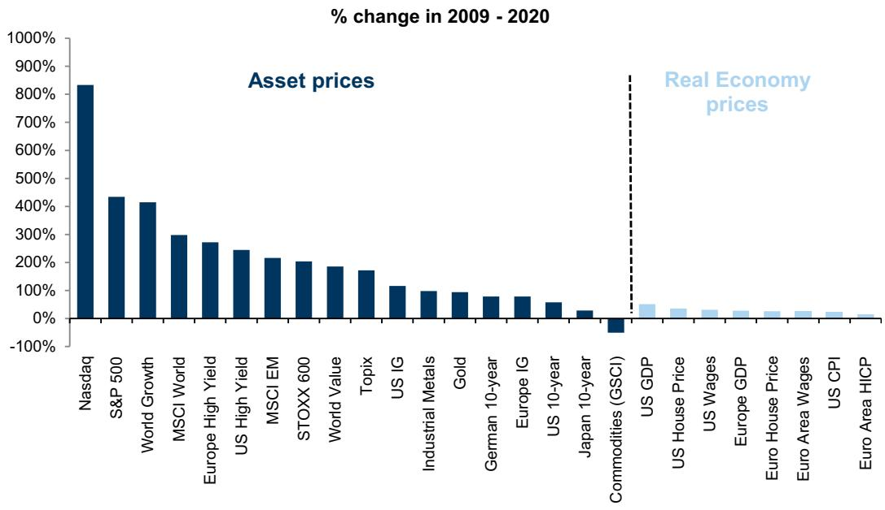

bar chart

% change in 2009 - 2020
| Index/Asset | % change in 2009 (%) |
| :--- | :--- |
| Nasdaq | 830 |
| S&P 500 | 430 |
| World Growth | 410 |
| MSCI World | 300 |
| Europe High Yield | 270 |
| US High Yield | 245 |
| MSCI EM | 215 |
| STOXX 600 | 200 |
| World Value | 185 |
| Topix | 170 |
| US IG | 115 |
| Industrial Metals | 95 |
| Gold | 90 |
| German 10-year | 80 |
| Europe IG | 75 |
| US 10-year | 55 |
| Japan 10-year | 25 |
| Commodities (GSCI) | -50 |
| US GDP | 45 |
| US House Price | 35 |
| US Wages | 30 |
| Europe GDP | 25 |
| Euro House Price | 20 |
| Euro Area Wages | 18 |
| US CPI | 15 |
| Euro Area HICP | 10 |

Source: Datastream, Haver Analytics, FRED, GS Global Investment Research

Following the pandemic, however, the leadership of assets in the post financial crisis era that favoured long duration growth began to shift (Exhibit 20). Supply constraints started to push up inflation and interest rates. Real assets began to perform better on the back of rising prices, and, within financial markets, leadership started to shift towards areas that had previously been left behind, including industrials, EM, Japan and (until recently) gold.

Exhibit 20: Gold, Emerging Markets, Topix, and Value have performed best since 2025  
Total return performance in local currency - where applicable  
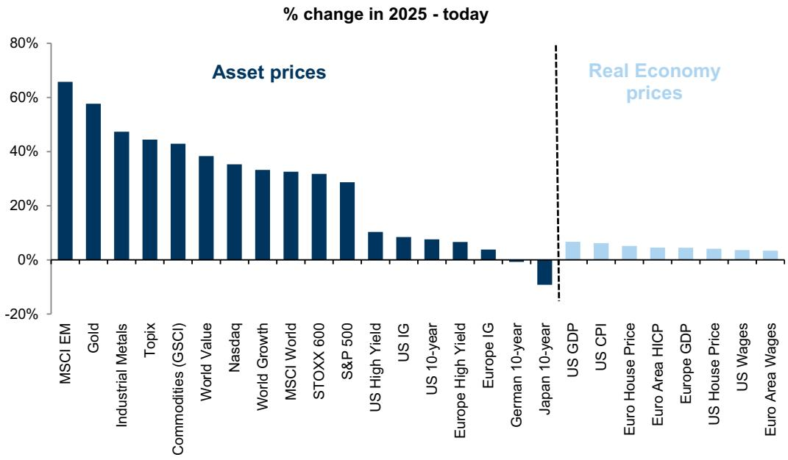

bar chart

% change in 2025 - today
| Asset Prices/Real Economy | % Change (%) |
|---|---|
| MSCI EM | 66 |
| Gold | 58 |
| Industrial Metals | 47 |
| Topix | 44 |
| Commodities (GSCI) | 42 |
| World Value | 38 |
| Nasdaq | 35 |
| World Growth | 33 |
| MSCI World | 32 |
| STOXX 600 | 31 |
| S&P 500 | 28 |
| US High Yield | 10 |
| US IG | 8 |
| US 10-year | 7 |
| Europe High Yield | 6 |
| Europe IG | 3 |
| German 10-year | -1 |
| Japan 10-year | -12 |
| US GDP | 6 |
| US CPI | 6 |
| Euro House Price | 5 |
| Euro Area HICP | 4 |
| Europe GDP | 4 |
| US House Price | 4 |
| US Wages | 3 |
| Euro Area Wages | 3 |

Source: Datastream, Haver Analytics, FRED, GS Global Investment Research

This rotation in performance from the post financial crisis era to the post pandemic era was dramatic. A similar pattern of reversal can be seen in relative sector performance in the decade after the financial crisis compared with the period post the pandemic (Exhibit 21). The only sector that has remained consistently strong in terms of performance both in the post financial crisis era and the post pandemic era is technology. Nonetheless, the drivers within technology have changed. Software has been weaker than in the previous cycle whereas hardware has been stronger.

Exhibit 21: A pattern of reversal can be seen when comparing the decade after the financial crisis with the period post the pandemic  
Total return performance (annualised) - World sectors and styles  
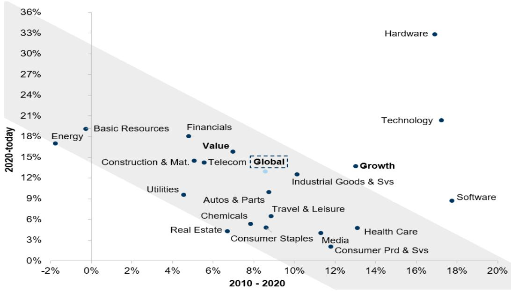

scatterplot

| Sector | 2010 - 2020 (%) | 2020-today (%) |
| --- | --- | --- |
| Hardware | 17.0 | 33.0 |
| Technology | 17.0 | 21.0 |
| Growth | 13.0 | 14.0 |
| Software | 18.0 | 9.0 |
| Health Care | 13.0 | 5.0 |
| Media | 12.0 | 3.0 |
| Consumer Prd & Svs | 12.0 | 2.5 |
| Consumer Staples | 11.0 | 4.0 |
| Travel & Leisure | 9.0 | 6.5 |
| Chemicals | 8.0 | 5.5 |
| Real Estate | 7.0 | 4.5 |
| Utilities | 5.0 | 9.5 |
| Financials | 5.0 | 18.0 |
| Value | 7.0 | 16.0 |
| Telecom | 6.0 | 14.5 |
| Construction & Mat. | 5.5 | 14.5 |
| Basic Resources | -0.5 | 18.5 |
| Energy | -1.5 | 17.5 |

Source: Datastream, GS Global Investment Research

While the inflationary shock of the pandemic triggered a rotation, other factors have also contributed to a shift in the drivers of stock market returns as well as the value attributed to technology hardware and software.

1. First, the hyperscalers dominating the technology space began to rapidly raise their capex spending. In the US alone, S&P 500 companies have reported year/year capex growth of +38% so far in Q1 2026 vs. just +1% for buybacks, a marked shift from the trend over the decade and a half following the financial crisis, when companies were generally rewarded for buybacks but not for capex. The surge in capex spending by the major hyperscalers in the US has been the primary driver. So far this year, consensus estimates for spend of the top 5 have increased by around \$80bn to c.\$755bn, 80% higher than a year ago (Exhibit 22).

Exhibit 22: AI hyperscalers are expected to spend c.\$755 billion on capex in 2026  
Hyperscaler annual capex (\$bn)  
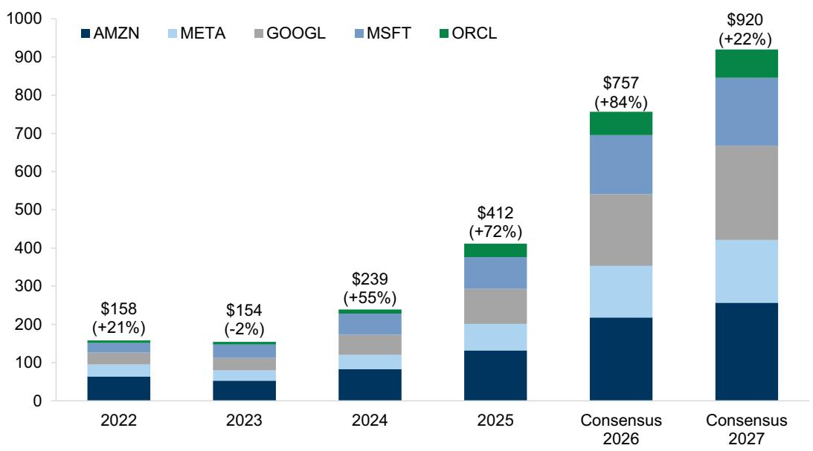

stacked bar chart

| Year       | AMZN | META | GOOGL | MSFT | ORCL |
|------------|------|------|-------|------|------|
| 2022       | $158 | +21% | -     | -    | -    |
| 2023       | $154 | -2%  | -     | -    | -    |
| 2024       | $239 | +55% | -     | -    | -    |
| 2025       | $412 | +72% | -     | -    | -    |
| Consensus 2026 | -    | -    | -     | -    | +84% |
| Consensus 2027 | -    | -    | -     | -    | +22% |

Source: FactSet, GS Global Investment Research

2. As the spending plans of the hyperscalers accelerated following the introduction of large language models, investors started to question whether these companies could sustain the premium returns on investment and margins achieved in the previous decade, particularly with capex increasingly encroaching on free cash flow.

Confidence in the Magnificent 7's ability to consistently outperform the rest of the US market has begun to be questioned, leading to falling stock correlations and lower valuations. We argued in The Technology Value Opportunity that the underperformance of the technology sector is starting to generate attractive valuation opportunities for investors. Finally, we also see value in parts of the growth space. At the same time, there has been a re-evaluation of the semiconductor space, which has seen a sharp increase in relative performance amid seemingly insatiable demand for compute (Exhibit 23). Nevertheless, even as the hyperscalers have lost ground to the semiconductor stocks, the software companies have been the biggest relative losers (Exhibit 24).

Exhibit 23: Chip manufacturers appear to have benefited from AI capex, while investors have questioned the hyperscalers' return on capex  
Relative price performance of US hyperscalers (AMZN, META, GOOGL, MSFT, ORCL) versus MSCI USA Semiconductors  
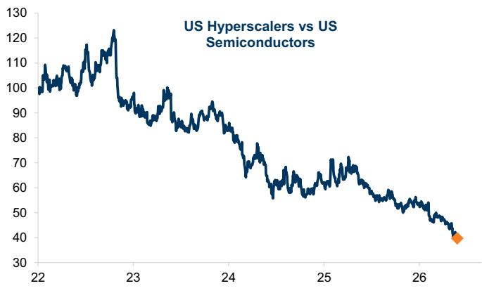

line chart

| Year | Value |
| ---- | ----- |
| 26   | 40    |

Source: Datastream, GS Global Investment Research

Exhibit 24: Innovation in agentic AI has raised concerns about disruption to software business models  
Relative price performance of US hyperscalers (AMZN, META, GOOGL, MSFT, ORCL) versus MSCI USA Software & Services  
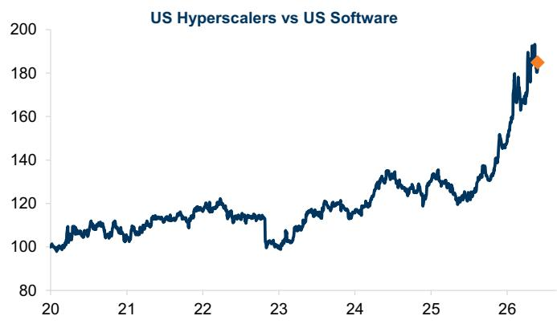

line chart

| Year | Value |
| ---- | ----- |
| 20   | 100   |
| 21   | 110   |
| 22   | 120   |
| 23   | 100   |
| 24   | 130   |
| 25   | 135   |
| 26   | 180   |
| 27   | 190   |

Source: Datastream, GS Global Investment Research

The rapid innovation in large language models and advances in agentic AI have raised concerns about disruption to technology business models (Exhibit 24). Investors are keen to avoid the AI era's version of Kodak, IBM, Nokia, Blackberry and a host of other companies that saw their business models challenged by new waves of innovation (Exhibit 25 and Exhibit 26).

Exhibit 25: Kodak invented the first digital camera in 1975 but filed for bankruptcy in 2012  
Stock price indexed to its maximum  
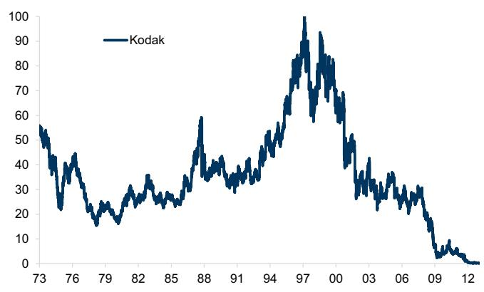

line chart

| Year | Kodak |
| ---- | ----- |
| 73   | 55    |
| 76   | 40    |
| 79   | 25    |
| 82   | 30    |
| 85   | 35    |
| 88   | 60    |
| 91   | 40    |
| 94   | 50    |
| 97   | 100   |
| 00   | 80    |
| 03   | 40    |
| 06   | 30    |
| 09   | 10    |
| 12   | 0     |

Source: Datastream, GS Global Investment Research

Exhibit 26: Polaroid had a monopoly in the instant photography market  
Stock price indexed to its maximum  
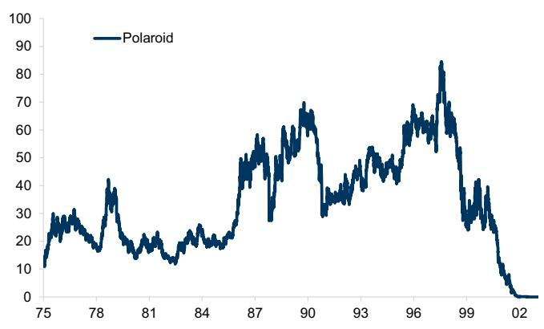

line chart

| Year | Polaroid |
| ---- | -------- |
| 75   | 10       |
| 76   | 25       |
| 77   | 30       |
| 78   | 40       |
| 79   | 20       |
| 80   | 15       |
| 81   | 20       |
| 82   | 15       |
| 83   | 20       |
| 84   | 25       |
| 85   | 30       |
| 86   | 40       |
| 87   | 50       |
| 88   | 60       |
| 89   | 70       |
| 90   | 65       |
| 91   | 50       |
| 92   | 40       |
| 93   | 50       |
| 94   | 60       |
| 95   | 70       |
| 96   | 80       |
| 97   | 90       |
| 98   | 85       |
| 99   | 70       |
| 00   | 40       |
| 01   | 20       |
| 02   | 0        |

Source: Datastream, GS Global Investment Research

In just a couple of months, the value of the software sector fell by around 5 PE points globally, as investors raised the risk premium associated with future projected cash flows and implicitly reduced the terminal value assumptions. The software and IT sector traded at a roughly 100% premium relative to the global market excluding tech less than 5 years ago, whereas the hardware and IT equipment sector enjoyed a premium of less than 20%. Now, they have converged.

For the first time in a generation, investors started to question the value of long duration growth companies' terminal values which had been previously boosted by solid confidence in their ability to sustain premium growth alongside historically low discount rates (Exhibit 27).

Exhibit 27: Long duration growth companies such as tech names recently derated Premium/(discount) on 12m forward P/E vs. World ex. TMT. Global Sectors  
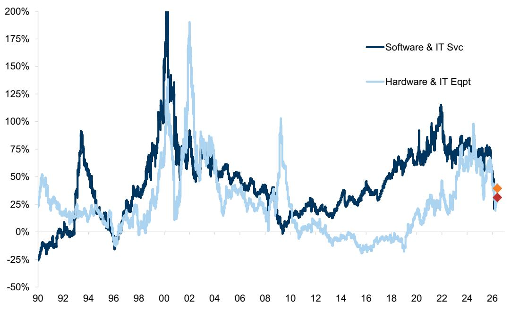

line chart

| Year | Software & IT Svc | Hardware & IT Eqpt |
|------|-------------------|--------------------|
| 26   | ~30%              | ~30%               |

Source: FactSet, GS Global Investment Research

3. Third, in the post pandemic era of higher inflation alongside higher nominal GDP, we began to see a structural improvement in revenue growth in many industries which have long been overlooked by investors and where there had been a lack of investment over a long period of time. After the financial crisis, when growth was scarce, areas that could grow with a high degree of certainty were highly prized, particularly given historically low discount rates. By contrast, the so-called old economy companies were widely overlooked. They suffered from overcapacity in many cases, and, because of the financial crisis, declining returns. There has been a notable shift in the valuation of physical assets, as the fortunes of the virtual and physical worlds have become intertwined for the first time since the rollout and commercialisation of the Internet (Exhibit 28). The growth opportunities for many technology companies are no longer a function of finding solutions to problems in the virtual world through apps and software. Instead, future growth has become increasingly dependent on the physical infrastructure around them. Data centres and energy suppliers have become crucial to their growth plans, leading to a cascading effect where capex spending by the tech giants has spilled into improved growth opportunities across many traditional, value-oriented, old economy industries that had long been overlooked.

Exhibit 28: The fortunes of the virtual and physical worlds have become intertwined for the first time since the rollout and commercialisation of the Internet  
Asset-heavy vs. asset-light indexed performance - US stocks  
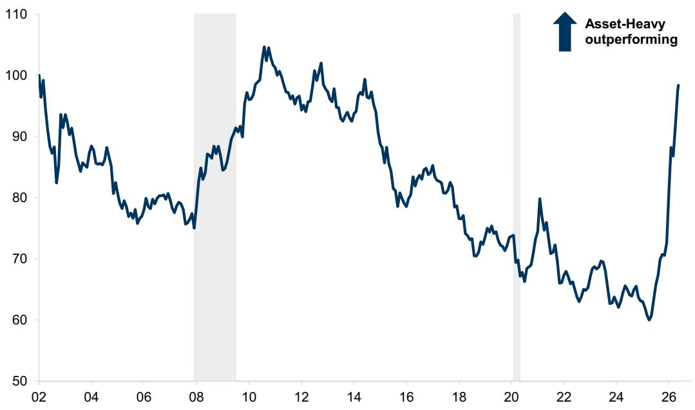

line chart

| Year | Value |
| ---- | ----- |
| 02   | 100   |
| 08   | 75    |
| 10   | 105   |
| 20   | 65    |
| 26   | 98    |

Grey bars indicate recessions.  
Source: Datastream, GS Global Investment Research

4. Fourth, as the geopolitical landscape began to shift, governments around the world have ramped up plans for spending in defence and security, which is another source of demand for the old economy. Areas spanning planes to tanks, munitions and even ships have suddenly been in demand, even in countries such as Germany and Japan (Exhibit 29). Investors began to re-rate the value associated with companies in traditional industries that had long been overlooked and where investment had been very weak.

Exhibit 29: In countries such as Germany, defence spending is ramping up German defence orders by region of origin (EUR bn)  
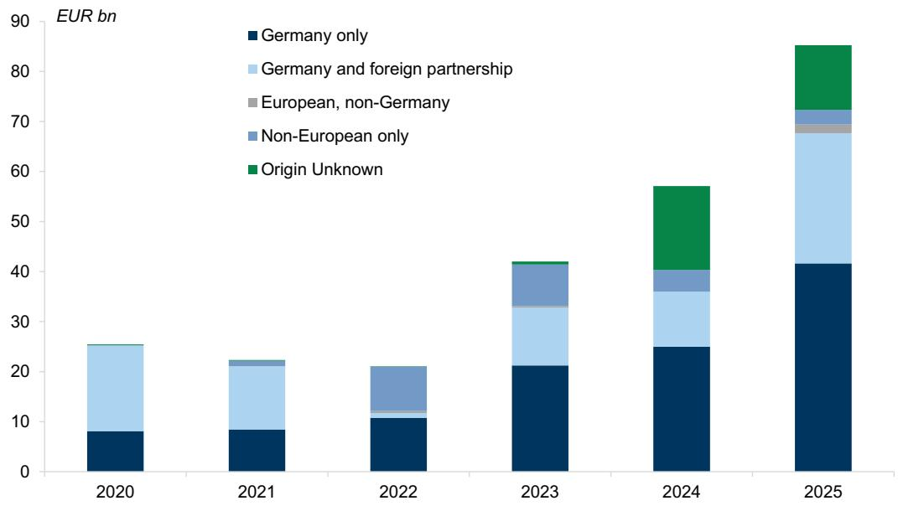

stacked bar chart

| Year | Germany only | Germany and foreign partnership | European, non-Germany | Non-European only | Origin Unknown |
|------|--------------|----------------------------------|------------------------|--------------------|----------------|
| 2020 | 8            | 14                               | 0                      | 0                  | 0              |
| 2021 | 8            | 13                               | 0                      | 1                  | 0              |
| 2022 | 11           | 0                                | 1                      | 7                  | 0              |
| 2023 | 21           | 11                               | 0                      | 6                  | 1              |
| 2024 | 25           | 10                               | 1                      | 3                  | 14             |
| 2025 | 41           | 23                               | 2                      | 3                  | 9              |

Source: Haver Analytics, GS Global Investment Research

In combination, these factors have also led to a widening of return opportunities for investors. The 15 years following the financial crisis were characterised by highly bifurcated markets; returns were dominated by the US (vs other markets), technology (vs other sectors), and growth (vs value). We are now in an era where country returns are broadening out. The median stock in each region has experienced smaller returns this year, and the dispersion of returns is very high (Exhibit 30).

We expect to see lower aggregate growth in markets at the index level, but a more eclectic mix of relative winners and losers across geographies, sectors and factors. This means that investors are likely to have greater prospects for alpha generation and more opportunities to improve risk-adjusted returns through diversification.

Exhibit 30: The median stock in each region has experienced smaller returns this year  
Price return in 2026; local currency (APxJ in USD)  
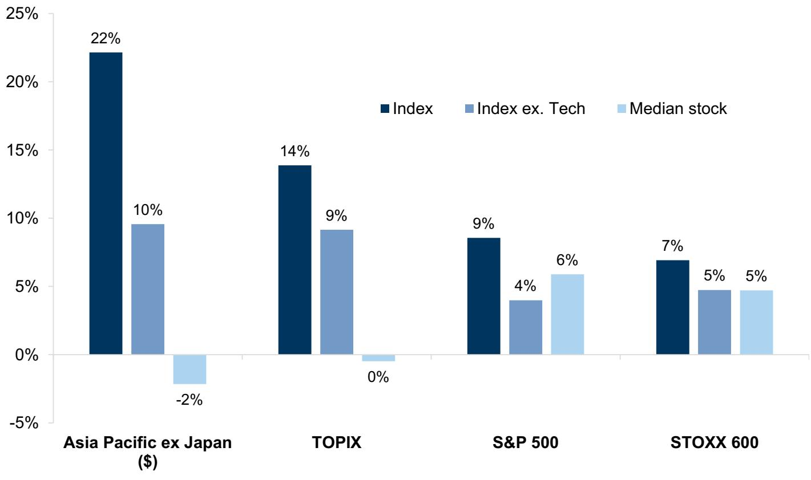

bar chart

| Category              | Index | Index ex. Tech | Median stock |
| --------------------- | ----- | -------------- | ------------ |
| Asia Pacific ex Japan ($) | 22%   | 10%            | -2%          |
| TOPIX                 | 14%   | 9%             | 0%           |
| S&P 500               | 9%    | 4%             | 6%           |
| STOXX 600             | 7%    | 5%             | 5%           |

Source: Datastream, GS Global Investment Research

## Exposure to the capex boom

Exposure to the capex boom. We reiterate our preference to invest in companies benefiting from an acceleration in CAPEX (as a theme). Exhibit 31 shows the performance of global stocks with the highest correlation of y/y sales growth with the share of investment in World GDP and the y/y change in the share of investment in World GDP. In the Appendix, we highlight examples of such CAPEX beneficiaries, selecting only companies with a market capitalisation above \$10bn and that are Buy-rated by our Equity Research analysts. This is an update of the list first outlined in The Post Modern Cycle.

The broad universe of CAPEX beneficiaries is up c.25% year to date, yet the structural backdrop remains firmly supportive. In a regime where exposure to investment cycles is increasingly the key driver of relative returns, such companies offer both cyclical leverage and structural growth.

Structural tailwinds are reinforcing the premium for capital intensity. As discussed, the regime has shifted decisively, with fiscal expansion and geopolitical fragmentation driving a sustained increase in demand for tangible assets and HALO stocks. Supporting this trend, supply-chain re-regionalisation and national security priorities are accelerating investment in infrastructure, energy and industrial capacity. AI adds a further impulse, driving an unprecedented build-out of physical compute, data centres and power infrastructure. This combination is structurally supportive for companies exposed to the capex theme. Consistent with this, the valuation premium of CAPEX

beneficiaries remains tightly linked to the developed markets' capex-to-sales ratio, which has recently inflected higher (Exhibit 31).

Exhibit 31: The valuation premium of CAPEX beneficiaries remains tightly linked to Developed Markets' capex-to-sales ratio  
Relative valuation  
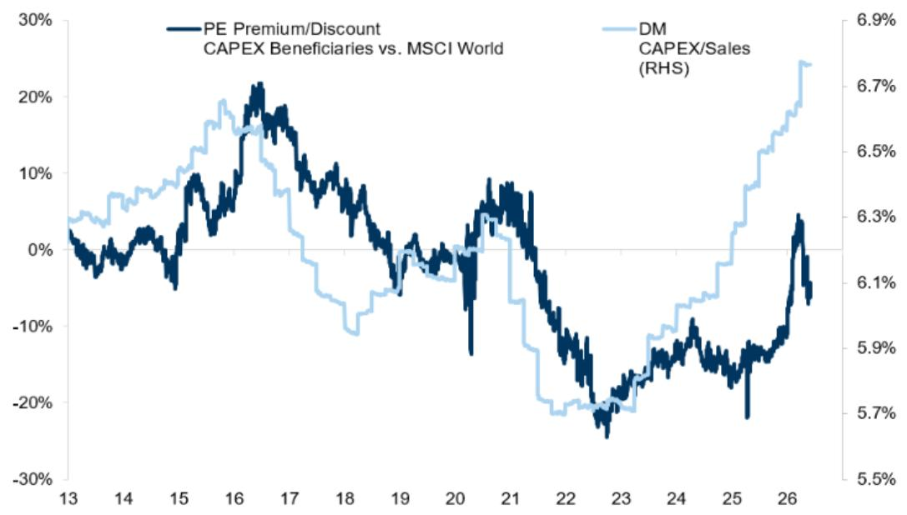

line chart

| Year | PE Premium/Discount CAPEX Beneficiaries vs. MSCI World | DM CAPEX/Sales (RHS) |
|------|--------------------------------------------------------|----------------------|
| 13   | ~0%                                                    | ~6.3%                |
| 14   | ~0%                                                    | ~6.3%                |
| 15   | ~5%                                                    | ~6.4%                |
| 16   | ~15%                                                   | ~6.7%                |
| 17   | ~20%                                                   | ~6.5%                |
| 18   | ~10%                                                   | ~6.1%                |
| 19   | ~0%                                                    | ~6.1%                |
| 20   | ~5%                                                    | ~6.1%                |
| 21   | ~10%                                                   | ~6.1%                |
| 22   | ~-10%                                                  | ~5.9%                |
| 23   | ~-20%                                                  | ~5.7%                |
| 24   | ~-5%                                                   | ~5.9%                |
| 25   | ~-10%                                                  | ~6.1%                |
| 26   | ~5%                                                    | ~6.9%                |

Source: Datastream, FactSet, GS Global Investment Research

The cycle is turning and leading indicators remain supportive. The relative performance of CAPEX beneficiaries has been closely correlated with the GS CAPEX Tracker, which captures capex growth across c.4k global companies and 20+ end-markets. Importantly, the relative performance of these companies tends to lead the capex cycle by several quarters, providing an early signal on turning points (Exhibit 33). Current readings remain constructive as investment momentum broadens, including beyond data centres into energy, industrials and infrastructure. This is consistent with a wider shift in market leadership towards capital-intensive sectors, as real assets and productive capacity are repriced.

Exhibit 32: The performance of CAPEX Beneficiaries tends to lead the global capex cycle by several quarters  
Relative performance y/y  
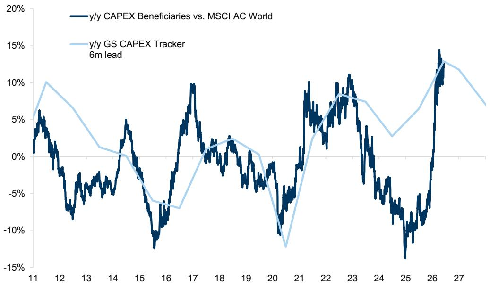

line chart

| Year | y/y CAPEX Beneficiaries vs. MSCI AC World | y/y GS CAPEX Tracker 6m lead |
|------|---------------------------------------------|------------------------------|
| 11   | ~5%                                         | ~5%                          |
| 12   | ~-5%                                        | ~10%                         |
| 13   | ~-8%                                        | ~7%                          |
| 14   | ~-3%                                        | ~3%                          |
| 15   | ~-10%                                       | ~0%                          |
| 16   | ~-12%                                       | ~-5%                         |
| 17   | ~10%                                        | ~-3%                         |
| 18   | ~2%                                         | ~2%                          |
| 19   | ~-2%                                        | ~0%                          |
| 20   | ~-10%                                       | ~-5%                         |
| 21   | ~-5%                                        | ~-10%                        |
| 22   | ~8%                                         | ~5%                          |
| 23   | ~10%                                        | ~8%                          |
| 24   | ~-5%                                        | ~3%                          |
| 25   | ~-15%                                       | ~-5%                         |
| 26   | ~15%                                        | ~10%                         |
| 27   | ~12%                                        | ~7%                          |

Source: Datastream, FactSet, GS Global Investment Research

Earnings momentum is strong. Performance has been firmly anchored in fundamentals: earnings growth for this universe has been closely correlated with capex and is currently running in the double-digit range, a profile that supports a sustained valuation premium (Exhibit 33). The strength of the earnings cycle reflects both volume growth and improving pricing dynamics in capacity-constrained sectors. Revisions have also turned decisively positive, with consensus earnings up c.25% y/y, reinforcing visibility and durability. In a higher cost-of-capital environment where multiple expansion is more limited, this combination of earnings growth and positive revisions remains a key driver of outperformance.

Exhibit 33: Earnings growth of CAPEX Beneficiaries is closely correlated with global CAPEX y/y change in EPS  
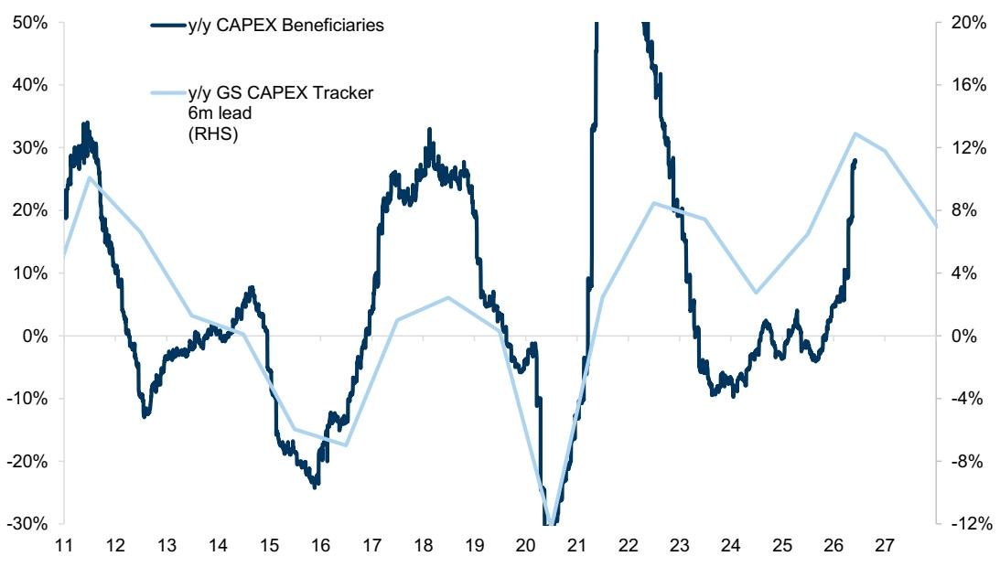

line chart

| Year | y/y CAPEX Beneficiaries | y/y GS CAPEX Tracker 6m lead (RHS) |
|------|--------------------------|------------------------------------|
| 11   | ~30%                     | ~10%                               |
| 12   | ~-10%                    | ~8%                                |
| 13   | ~-15%                    | ~4%                                |
| 14   | ~0%                      | ~2%                                |
| 15   | ~5%                      | ~0%                                |
| 16   | ~-20%                    | ~-4%                               |
| 17   | ~-10%                    | ~-2%                               |
| 18   | ~30%                     | ~6%                                |
| 19   | ~-5%                     | ~0%                                |
| 20   | ~-30%                    | ~-8%                               |
| 21   | ~50%                     | ~20%                               |
| 22   | ~40%                     | ~16%                               |
| 23   | ~-5%                     | ~8%                                |
| 24   | ~-10%                    | ~4%                                |
| 25   | ~0%                      | ~2%                                |
| 26   | ~30%                     | ~12%                               |
| 27   | ~25%                     | ~8%                                |

Source: Datastream, FactSet, GS Global Investment Research

A diversified but cyclically tilted exposure. This list is screened on the highest correlation of y/y sales growth with the share of investment in World GDP and the y/y change in the share of investment in World GDP. This provides an effective way to capture the capex cycle, but the sector composition is inherently cyclical: c.30% Industrials, c.20% Commodity producers, c.15% Technology and c.10% Utilities, with the remainder in Chemicals, Construction, Telecoms and Real Estate. By construction, exposure to Consumer, Healthcare and Financials is minimal or non-existent. Similarly, Defence exposure is limited, given its stronger linkage to government spending rather than corporate capex.

To fully capture the capex cycle, in the exhibit below, we highlight targeted baskets aligned with key structural themes: (1) Artificial Intelligence, (2) Defence Spending, (3) Power & Electrification and (4) HALO.

Exhibit 34: Baskets exposed to the global capex beneficiaries theme

<table><tr><td></td><td>AI &amp; Digital Infrastructure</td><td>Power &amp; Energy Security</td><td>Defence &amp; National Security</td><td>Infrastructure &amp; HALO</td></tr><tr><td>US</td><td>- AI Data Centers (GSTMTDAT)*</td><td>- Power Up America (GSENEPOW)*</td><td>- Defense (GSXUDFNS)*- New Defense (GSXUNDEF)*</td><td>- High Asset Intensity (GSTHHAIR)- GS Infrastructure (GSXUINFS)*</td></tr><tr><td>Europe</td><td>- Semiconductor (GSSBSEMI)- Datacenters (GSXEDATA)*</td><td>- Renewable Energy (GSSBRNEW)- Oil &amp; Gas Services (GSSBOILS)- Power Up Europe (GSXEPOWR)*</td><td>- Defense (GSSBDEFE)- Civil Aerospace (GSSBCIVA)- New Defense (GSXENDEF)*</td><td>- Capital Intensive (GSSTCAPI)- CAPEX Beneficiaries (GSSTCAPX)- Fiscal Infra (GSSTFISC)</td></tr><tr><td>Asia</td><td>- AIGC Hardware (GSSZAIHW)- AIGC Semis (GSSZAISM)</td><td>- Nuclear Power (GSSZNUCL)- Renewables (GSSZEVMT)- Power &amp; Electricity (GSSZPOWE)</td><td>- Aerospace &amp; Defense (GSSZDEF)- NonCore Defense Supp (GSSZDEFS)</td><td>- Capital Intensive (GSSZHALO)- Asia US Reindustrialization (GSXAUSRE)*</td></tr><tr><td>EM</td><td>- AI ecosystem (GSXFEMAI)*</td><td>- Renewables (GSSZEVMT)</td><td>- Aerospace &amp; Defense (MXEFOAD)</td><td>- Capital Intensive (GSEMHALO)</td></tr><tr><td>Japan</td><td>- Critical Tech (GSJPCRTT)- Optical Network (GSXAJONE)*- Semiconductor (GSXAJSEM)*</td><td>- Critical Resources (GSJPCRTR)</td><td>- Defense (GSJPDFSE)- Economic Security (GSXAJESC)*</td><td>- Capital Intensive (GSJPHALO)</td></tr></table>

\* The baskets marked with an asterisk are from our colleagues in Global Banking & Markets.  
Source: GS FICC and Equities, GS Global Investment Research

## Exhibit 35: Performance since 2025 of indexes and baskets exposed to global capex expansion

Performance since 2025, local currency (USD for Asia ex. Japan) - ICB Sector for Semis; regional GS baskets for Power, Defense and Capital Intensive

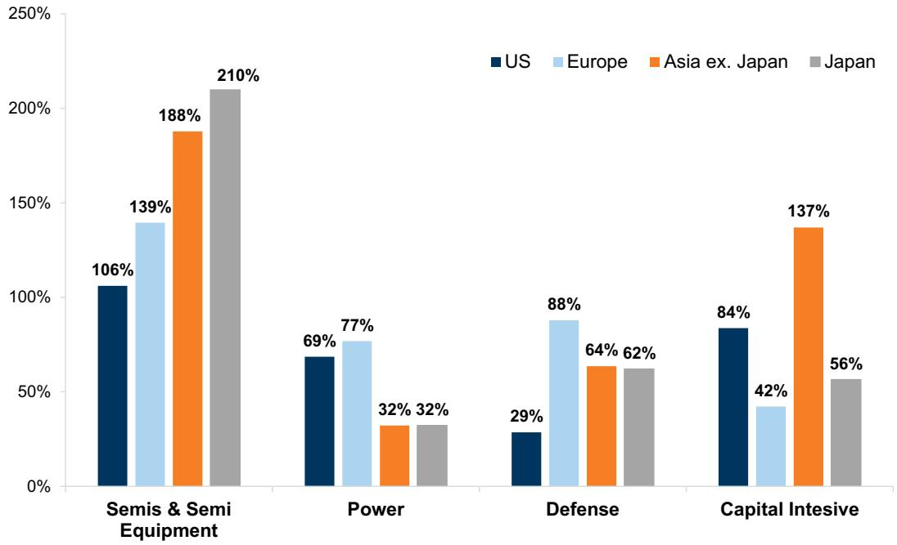

bar chart

| Category | US (%) | Europe (%) | Asia ex. Japan (%) | Japan (%) |
| :--- | :--- | :--- | :--- | :--- |
| Semis & Semi Equipment | 106 | 139 | 188 | 210 |
| Power | 69 | 77 | 32 | 32 |
| Defense | 29 | 88 | 64 | 62 |
| Capital Intesive | 84 | 42 | 137 | 56 |

Source: FactSet, Bloomberg, GS FICC and Equities, GS Global Investment Research

## Appendix

Exhibit 36: List of Global CAPEX Beneficiaries (1/3)

<table><tr><td colspan="5">Global CAPEX Beneficiaries - Median</td><td>35.3</td><td>19.6</td><td>0.13</td><td>0.31</td></tr><tr><td rowspan="2">Name</td><td rowspan="2">HQ</td><td rowspan="2">ICB Level 2</td><td rowspan="2">ICB Level 4</td><td rowspan="2">Price (USD)</td><td rowspan="2">Market Cap (USD, bn)</td><td rowspan="2">P/E NTM</td><td colspan="2">Correlation of y/y sales with...</td></tr><tr><td>World Investment (% of GDP), Level</td><td>World Investment (% of GDP), Change</td></tr><tr><td>Norsk Hydro</td><td>Norway</td><td>Basic Resources</td><td>Aluminum</td><td>11.6</td><td>22.7</td><td>11.1</td><td>0.16</td><td>0.12</td></tr><tr><td>BHP Group</td><td>Australia</td><td>Basic Resources</td><td>General Mining</td><td>44.4</td><td>225.5</td><td>17.5</td><td>0.04</td><td>0.10</td></tr><tr><td>Lynas Rare Earths</td><td>Australia</td><td>Basic Resources</td><td>General Mining</td><td>12.5</td><td>12.6</td><td>26.2</td><td>0.30</td><td>0.51</td></tr><tr><td>Northern Star Resources</td><td>Australia</td><td>Basic Resources</td><td>Gold Mining</td><td>13.6</td><td>19.4</td><td>11.0</td><td>0.44</td><td>0.24</td></tr><tr><td>Nucor</td><td>United States</td><td>Basic Resources</td><td>Iron And Steel</td><td>266.4</td><td>60.7</td><td>16.8</td><td>0.04</td><td>0.64</td></tr><tr><td>CMOC Group</td><td>China</td><td>Basic Resources</td><td>Nonferrous Metals</td><td>2.4</td><td>51.1</td><td>10.9</td><td>0.09</td><td>0.47</td></tr><tr><td>Mitsui Kinzoku</td><td>Japan</td><td>Basic Resources</td><td>Nonferrous Metals</td><td>274.0</td><td>15.7</td><td>27.7</td><td>0.40</td><td>0.35</td></tr><tr><td>Linde</td><td>United States</td><td>Chemicals</td><td>Chemicals: Diversified</td><td>523.6</td><td>242.2</td><td>28.0</td><td>0.22</td><td>0.33</td></tr><tr><td>Shin-Etsu Chemical</td><td>Japan</td><td>Chemicals</td><td>Chemicals: Diversified</td><td>44.9</td><td>83.3</td><td>23.6</td><td>0.31</td><td>0.04</td></tr><tr><td>BASF</td><td>Germany</td><td>Chemicals</td><td>Chemicals: Diversified</td><td>57.3</td><td>50.7</td><td>17.4</td><td>0.06</td><td>0.67</td></tr><tr><td>Resonac Holdings</td><td>Japan</td><td>Chemicals</td><td>Chemicals: Diversified</td><td>105.8</td><td>19.1</td><td>29.1</td><td>0.23</td><td>0.61</td></tr><tr><td>Asahi Kasei</td><td>Japan</td><td>Chemicals</td><td>Chemicals: Diversified</td><td>11.2</td><td>15.1</td><td>14.3</td><td>0.45</td><td>0.07</td></tr><tr><td>SABIC Agri-Nutrients</td><td>Saudi Arabia</td><td>Chemicals</td><td>Fertilizers</td><td>33.9</td><td>16.1</td><td>12.5</td><td>0.30</td><td>0.61</td></tr><tr><td>Air Liquide</td><td>France</td><td>Chemicals</td><td>Specialty Chemicals</td><td>194.8</td><td>124.0</td><td>25.0</td><td>0.16</td><td>0.46</td></tr><tr><td>Air Products &amp; Chemicals</td><td>United States</td><td>Chemicals</td><td>Specialty Chemicals</td><td>281.6</td><td>62.7</td><td>20.2</td><td>0.11</td><td>0.53</td></tr><tr><td>Sika</td><td>Switzerland</td><td>Construction And Materials</td><td>Building Materials: Other</td><td>194.8</td><td>31.3</td><td>21.1</td><td>0.28</td><td>0.55</td></tr><tr><td>Carlisle Cos</td><td>United States</td><td>Construction And Materials</td><td>Building, Roofing/Wallboard And Plumbing</td><td>343.8</td><td>13.9</td><td>15.6</td><td>0.00</td><td>0.49</td></tr><tr><td>Lennox</td><td>United States</td><td>Construction And Materials</td><td>Building: Climate Control</td><td>512.2</td><td>17.8</td><td>20.2</td><td>0.01</td><td>0.39</td></tr><tr><td>Holcim</td><td>Switzerland</td><td>Construction And Materials</td><td>Cement</td><td>93.6</td><td>51.8</td><td>20.0</td><td>0.02</td><td>0.29</td></tr><tr><td>VINCI</td><td>France</td><td>Construction And Materials</td><td>Construction</td><td>145.7</td><td>81.6</td><td>13.4</td><td>0.06</td><td>0.26</td></tr><tr><td>MasTec</td><td>United States</td><td>Construction And Materials</td><td>Engineering And Contracting Services</td><td>363.0</td><td>28.7</td><td>36.0</td><td>0.03</td><td>0.17</td></tr><tr><td>Chevron</td><td>United States</td><td>Energy</td><td>Integrated Oil And Gas</td><td>187.2</td><td>372.9</td><td>14.0</td><td>0.05</td><td>0.32</td></tr><tr><td>Shell</td><td>United Kingdom</td><td>Energy</td><td>Integrated Oil And Gas</td><td>43.2</td><td>240.9</td><td>8.6</td><td>0.07</td><td>0.53</td></tr><tr><td>Petroleo Brasileiro</td><td>Brazil</td><td>Energy</td><td>Integrated Oil And Gas</td><td>9.1</td><td>117.3</td><td>4.6</td><td>0.02</td><td>0.15</td></tr><tr><td>Eni</td><td>Italy</td><td>Energy</td><td>Integrated Oil And Gas</td><td>26.9</td><td>76.3</td><td>8.9</td><td>0.17</td><td>0.51</td></tr><tr><td>Cenovus Energy</td><td>Canada</td><td>Energy</td><td>Integrated Oil And Gas</td><td>28.3</td><td>52.8</td><td>9.5</td><td>0.44</td><td>0.62</td></tr><tr><td>Repsol</td><td>Spain</td><td>Energy</td><td>Integrated Oil And Gas</td><td>26.3</td><td>29.1</td><td>6.0</td><td>0.07</td><td>0.41</td></tr><tr><td>Galp Energia, SGPS</td><td>Portugal</td><td>Energy</td><td>Integrated Oil And Gas</td><td>22.1</td><td>16.3</td><td>10.0</td><td>0.17</td><td>0.59</td></tr><tr><td>Keyera</td><td>Canada</td><td>Energy</td><td>Integrated Oil And Gas</td><td>42.2</td><td>11.9</td><td>23.9</td><td>0.14</td><td>0.59</td></tr><tr><td>SLB</td><td>United States</td><td>Energy</td><td>Oil Equipment And Services</td><td>56.2</td><td>84.0</td><td>19.2</td><td>0.03</td><td>0.17</td></tr><tr><td>Halliburton</td><td>United States</td><td>Energy</td><td>Oil Equipment And Services</td><td>39.6</td><td>33.1</td><td>15.2</td><td>0.02</td><td>0.26</td></tr><tr><td>Marathon Petroleum</td><td>United States</td><td>Energy</td><td>Oil Refining And Marketing</td><td>263.6</td><td>76.9</td><td>9.7</td><td>0.40</td><td>0.68</td></tr><tr><td>HF Sinclair</td><td>United States</td><td>Energy</td><td>Oil Refining And Marketing</td><td>71.3</td><td>12.8</td><td>8.5</td><td>0.07</td><td>0.47</td></tr><tr><td>Diamondback Energy</td><td>United States</td><td>Energy</td><td>Oil: Crude Producers</td><td>192.1</td><td>54.0</td><td>10.1</td><td>0.16</td><td>0.75</td></tr><tr><td>EQT (US)</td><td>United States</td><td>Energy</td><td>Oil: Crude Producers</td><td>51.9</td><td>32.5</td><td>11.0</td><td>0.35</td><td>0.41</td></tr><tr><td>Ovintiv</td><td>United States</td><td>Energy</td><td>Oil: Crude Producers</td><td>57.5</td><td>16.1</td><td>7.3</td><td>0.09</td><td>0.31</td></tr><tr><td>Kinder Morgan</td><td>United States</td><td>Energy</td><td>Pipelines</td><td>31.9</td><td>71.1</td><td>21.6</td><td>0.34</td><td>0.68</td></tr><tr><td>Targa Resources</td><td>United States</td><td>Energy</td><td>Pipelines</td><td>272.6</td><td>58.5</td><td>23.7</td><td>0.20</td><td>0.66</td></tr><tr><td>MPLX</td><td>United States</td><td>Energy</td><td>Pipelines</td><td>56.9</td><td>57.7</td><td>12.5</td><td>0.02</td><td>0.00</td></tr><tr><td>Cheniere Energy</td><td>United States</td><td>Energy</td><td>Pipelines</td><td>241.3</td><td>50.6</td><td>35.3</td><td>0.01</td><td>0.18</td></tr></table>

Prices as of June 12, 2026  
Source: Datastream, FactSet, GS Global Investment Research

Exhibit 37: List of Global CAPEX Beneficiaries (2/3)

<table><tr><td rowspan="2">Name</td><td rowspan="2">HQ</td><td rowspan="2">ICB Level 2</td><td rowspan="2">ICB Level 4</td><td rowspan="2">Price (USD)</td><td rowspan="2">Market Cap (USD, bn)</td><td rowspan="2">P/E NTM</td><td colspan="2">Correlation of y/y sales with...</td></tr><tr><td>World Investment (% of GDP), Level</td><td>World Investment (% of GDP), Change</td></tr><tr><td>AerCap</td><td>United States</td><td>Industrial Goods And Services</td><td>Commercial Vehicle-Equipment Leasing</td><td>140.0</td><td>22.1</td><td>8.2</td><td>0.11</td><td>0.29</td></tr><tr><td>Ryder System</td><td>United States</td><td>Industrial Goods And Services</td><td>Commercial Vehicle-Equipment Leasing</td><td>280.3</td><td>10.8</td><td>17.6</td><td>0.33</td><td>0.43</td></tr><tr><td>Smurfit Westrock</td><td>Ireland</td><td>Industrial Goods And Services</td><td>Containers And Packaging</td><td>43.3</td><td>22.7</td><td>16.0</td><td>0.13</td><td>0.20</td></tr><tr><td>BAE Systems</td><td>United Kingdom</td><td>Industrial Goods And Services</td><td>Defense</td><td>25.6</td><td>75.2</td><td>21.4</td><td>0.19</td><td>0.01</td></tr><tr><td>L3Harris Technologies</td><td>United States</td><td>Industrial Goods And Services</td><td>Defense</td><td>307.8</td><td>57.3</td><td>24.5</td><td>0.22</td><td>0.05</td></tr><tr><td>United Parcel Service</td><td>United States</td><td>Industrial Goods And Services</td><td>Delivery Services</td><td>108.1</td><td>91.9</td><td>14.5</td><td>0.01</td><td>0.73</td></tr><tr><td>FedEx</td><td>United States</td><td>Industrial Goods And Services</td><td>Delivery Services</td><td>338.3</td><td>80.7</td><td>14.1</td><td>0.11</td><td>0.10</td></tr><tr><td>Hitachi</td><td>Japan</td><td>Industrial Goods And Services</td><td>Diversified Industrials</td><td>29.1</td><td>130.8</td><td>22.4</td><td>0.30</td><td>0.06</td></tr><tr><td>Parker-Hannifin</td><td>United States</td><td>Industrial Goods And Services</td><td>Diversified Industrials</td><td>903.5</td><td>113.9</td><td>26.6</td><td>0.08</td><td>0.44</td></tr><tr><td>ITOCHU</td><td>Japan</td><td>Industrial Goods And Services</td><td>Diversified Industrials</td><td>11.7</td><td>81.9</td><td>13.5</td><td>0.12</td><td>0.14</td></tr><tr><td>Dover Corp /IL</td><td>United States</td><td>Industrial Goods And Services</td><td>Diversified Industrials</td><td>217.4</td><td>29.3</td><td>19.6</td><td>0.07</td><td>0.62</td></tr><tr><td>Jardine Matheson Holdings</td><td>Singapore</td><td>Industrial Goods And Services</td><td>Diversified Industrials</td><td>63.3</td><td>18.6</td><td>11.2</td><td>0.10</td><td>0.11</td></tr><tr><td>ITT</td><td>United States</td><td>Industrial Goods And Services</td><td>Diversified Industrials</td><td>189.1</td><td>16.9</td><td>22.5</td><td>0.10</td><td>0.03</td></tr><tr><td>Schneider Electric</td><td>France</td><td>Industrial Goods And Services</td><td>Electrical Components</td><td>307.1</td><td>172.6</td><td>25.8</td><td>0.10</td><td>0.28</td></tr><tr><td>Prysmian</td><td>Italy</td><td>Industrial Goods And Services</td><td>Electrical Components</td><td>166.6</td><td>48.7</td><td>27.7</td><td>0.04</td><td>0.55</td></tr><tr><td>Fujikura</td><td>Japan</td><td>Industrial Goods And Services</td><td>Electrical Components</td><td>26.6</td><td>44.0</td><td>34.5</td><td>0.32</td><td>0.14</td></tr><tr><td>TDK Corp</td><td>Japan</td><td>Industrial Goods And Services</td><td>Electrical Components</td><td>21.9</td><td>41.5</td><td>31.6</td><td>0.41</td><td>0.21</td></tr><tr><td>nVent Electric</td><td>United States</td><td>Industrial Goods And Services</td><td>Electrical Components</td><td>165.8</td><td>26.8</td><td>32.5</td><td>0.15</td><td>0.03</td></tr><tr><td>Furukawa Electric</td><td>Japan</td><td>Industrial Goods And Services</td><td>Electrical Components</td><td>262.7</td><td>18.5</td><td>33.0</td><td>0.29</td><td>0.04</td></tr><tr><td>Rexel</td><td>France</td><td>Industrial Goods And Services</td><td>Electrical Components</td><td>42.2</td><td>12.4</td><td>14.2</td><td>0.18</td><td>0.36</td></tr><tr><td>Teledyne Technologies</td><td>United States</td><td>Industrial Goods And Services</td><td>Electronic Equipment: Control And Filter</td><td>626.0</td><td>29.0</td><td>25.0</td><td>0.34</td><td>0.49</td></tr><tr><td>Keyence</td><td>Japan</td><td>Industrial Goods And Services</td><td>Electronic Equipment: Gauges And Meters</td><td>453.2</td><td>109.9</td><td>35.5</td><td>0.26</td><td>0.14</td></tr><tr><td>Keysight Tech</td><td>United States</td><td>Industrial Goods And Services</td><td>Electronic Equipment: Gauges And Meters</td><td>350.7</td><td>59.9</td><td>31.3</td><td>0.01</td><td>0.70</td></tr><tr><td>Xylem</td><td>United States</td><td>Industrial Goods And Services</td><td>Electronic Equipment: Pollution Control</td><td>110.1</td><td>26.2</td><td>19.0</td><td>0.32</td><td>0.29</td></tr><tr><td>Kubota</td><td>Japan</td><td>Industrial Goods And Services</td><td>Machinery: Agricultural</td><td>16.9</td><td>19.2</td><td>13.6</td><td>0.55</td><td>0.12</td></tr><tr><td>Metso</td><td>Finland</td><td>Industrial Goods And Services</td><td>Machinery: Construction And Handling</td><td>17.1</td><td>14.2</td><td>19.5</td><td>0.14</td><td>0.37</td></tr><tr><td>Ebara</td><td>Japan</td><td>Industrial Goods And Services</td><td>Machinery: Industrial</td><td>34.4</td><td>15.7</td><td>26.4</td><td>0.43</td><td>0.07</td></tr><tr><td>Kuehne Nagel Intl</td><td>Switzerland</td><td>Industrial Goods And Services</td><td>Marine Transportation</td><td>245.6</td><td>29.2</td><td>23.3</td><td>0.06</td><td>0.64</td></tr><tr><td>Sherwin-Williams</td><td>United States</td><td>Industrial Goods And Services</td><td>Paints And Coatings</td><td>317.3</td><td>78.3</td><td>25.6</td><td>0.18</td><td>0.23</td></tr><tr><td>PPG Industries</td><td>United States</td><td>Industrial Goods And Services</td><td>Paints And Coatings</td><td>119.3</td><td>26.6</td><td>14.5</td><td>0.09</td><td>0.55</td></tr><tr><td>Accenture</td><td>United States</td><td>Industrial Goods And Services</td><td>Professional Business Support Services</td><td>170.3</td><td>104.5</td><td>11.6</td><td>0.35</td><td>0.54</td></tr><tr><td>Jacobs Solutions</td><td>United States</td><td>Industrial Goods And Services</td><td>Professional Business Support Services</td><td>127.0</td><td>15.0</td><td>15.9</td><td>0.04</td><td>0.20</td></tr><tr><td>Knorr-Bremse</td><td>Germany</td><td>Industrial Goods And Services</td><td>Railroad Equipment</td><td>117.8</td><td>19.0</td><td>21.4</td><td>0.03</td><td>0.74</td></tr><tr><td>Getlink</td><td>France</td><td>Industrial Goods And Services</td><td>Railroads</td><td>21.3</td><td>11.5</td><td>30.3</td><td>0.08</td><td>0.10</td></tr><tr><td>DSV</td><td>Denmark</td><td>Industrial Goods And Services</td><td>Transportation Services</td><td>249.5</td><td>59.5</td><td>22.5</td><td>0.06</td><td>0.11</td></tr><tr><td colspan="2">Grupo Aeroportuario del Pa Mexico</td><td>Industrial Goods And Services</td><td>Transportation Services</td><td>23.8</td><td>12.0</td><td>16.2</td><td>0.41</td><td>0.27</td></tr><tr><td>Saia</td><td>United States</td><td>Industrial Goods And Services</td><td>Trucking</td><td>482.9</td><td>12.9</td><td>38.0</td><td>0.35</td><td>0.57</td></tr><tr><td>TFI International</td><td>Canada</td><td>Industrial Goods And Services</td><td>Trucking</td><td>160.6</td><td>13.2</td><td>26.0</td><td>0.11</td><td>0.64</td></tr><tr><td>Ventas</td><td>United States</td><td>Real Estate</td><td>Health Care Reits</td><td>84.6</td><td>41.1</td><td>105.0</td><td>0.13</td><td>0.23</td></tr><tr><td>SEGRO</td><td>United Kingdom</td><td>Real Estate</td><td>Industrial Reits</td><td>10.1</td><td>13.6</td><td>18.9</td><td>0.05</td><td>0.06</td></tr><tr><td>Mitsui Fudosan</td><td>Japan</td><td>Real Estate</td><td>Real Estate Holding And Development</td><td>9.7</td><td>26.4</td><td>14.3</td><td>0.45</td><td>0.01</td></tr><tr><td>Vonovia</td><td>Germany</td><td>Real Estate</td><td>Real Estate Holding And Development</td><td>23.6</td><td>20.0</td><td>10.7</td><td>0.27</td><td>0.13</td></tr><tr><td>Aldar Properties</td><td>United Arab Emir</td><td>Real Estate</td><td>Real Estate Holding And Development</td><td>2.1</td><td>16.6</td><td>7.1</td><td>0.24</td><td>0.13</td></tr><tr><td>Jones Lang LaSalle</td><td>United States</td><td>Real Estate</td><td>Real Estate Services</td><td>300.0</td><td>13.9</td><td>12.3</td><td>0.09</td><td>0.36</td></tr><tr><td>Invitation Homes</td><td>United States</td><td>Real Estate</td><td>Residential Reits</td><td>29.7</td><td>17.6</td><td>38.4</td><td>0.02</td><td>0.39</td></tr><tr><td colspan="2">Unibail-Rodamco-Westfield France</td><td>Real Estate</td><td>Retail Reits</td><td>116.6</td><td>16.8</td><td>10.9</td><td>0.09</td><td>0.14</td></tr></table>

Prices as of June 12, 2026  
Source: Datastream, FactSet, GS Global Investment Research

Exhibit 38: List of Global CAPEX Beneficiaries (3/3)

<table><tr><td rowspan="2">Name</td><td rowspan="2">HQ</td><td rowspan="2">ICB Level 2</td><td rowspan="2">ICB Level 4</td><td rowspan="2">Price (USD)</td><td rowspan="2">Market Cap (USD, bn)</td><td rowspan="2">P/E NTM</td><td colspan="2">Correlation of y/y sales with...</td></tr><tr><td>World Investment (% of GDP), Level</td><td>World Investment (% of GDP), Change</td></tr><tr><td>Apple</td><td>United States</td><td>Technology</td><td>Computer Hardware</td><td>291.1</td><td>4275.9</td><td>31.0</td><td>0.06</td><td>0.19</td></tr><tr><td>TD SYNNEX Corp</td><td>United States</td><td>Technology</td><td>Computer Hardware</td><td>280.7</td><td>22.6</td><td>15.5</td><td>0.36</td><td>0.38</td></tr><tr><td>Logitech International</td><td>Switzerland</td><td>Technology</td><td>Computer Hardware</td><td>111.0</td><td>15.9</td><td>19.6</td><td>0.12</td><td>0.11</td></tr><tr><td>Amadeus IT Group</td><td>Spain</td><td>Technology</td><td>Computer Services</td><td>59.0</td><td>24.9</td><td>14.7</td><td>0.22</td><td>0.27</td></tr><tr><td>Capgemini</td><td>France</td><td>Technology</td><td>Computer Services</td><td>111.9</td><td>19.0</td><td>7.6</td><td>0.16</td><td>0.25</td></tr><tr><td>Nebius</td><td>United States</td><td>Technology</td><td>Consumer Digital Services</td><td>232.4</td><td>58.5</td><td></td><td>0.03</td><td>0.22</td></tr><tr><td>Amphenol</td><td>United States</td><td>Technology</td><td>Electronic Components</td><td>153.8</td><td>189.2</td><td>30.0</td><td>0.19</td><td>0.54</td></tr><tr><td>Murata Manufacturing</td><td>Japan</td><td>Technology</td><td>Electronic Components</td><td>53.4</td><td>97.2</td><td>52.7</td><td>0.24</td><td>0.19</td></tr><tr><td>TE Connectivity</td><td>United States</td><td>Technology</td><td>Electronic Components</td><td>210.4</td><td>61.4</td><td>17.2</td><td>0.31</td><td>0.81</td></tr><tr><td>Yageo</td><td>Taiwan</td><td>Technology</td><td>Electronic Components</td><td>27.0</td><td>55.6</td><td>43.5</td><td>0.10</td><td>0.32</td></tr><tr><td>IBIDEN</td><td>Japan</td><td>Technology</td><td>Electronic Components</td><td>119.2</td><td>33.3</td><td>82.6</td><td>0.07</td><td>0.36</td></tr><tr><td>Kyocera</td><td>Japan</td><td>Technology</td><td>Electronic Components</td><td>22.9</td><td>28.1</td><td>36.9</td><td>0.12</td><td>0.07</td></tr><tr><td>Gold Circuit Electronics</td><td>Taiwan</td><td>Technology</td><td>Electronic Components</td><td>41.7</td><td>21.4</td><td>26.6</td><td>0.07</td><td>0.43</td></tr><tr><td>Taiyo Yuden</td><td>Japan</td><td>Technology</td><td>Electronic Components</td><td>98.1</td><td>12.3</td><td>84.4</td><td>0.22</td><td>0.46</td></tr><tr><td>Minebea Mitsumi</td><td>Japan</td><td>Technology</td><td>Electronic Components</td><td>26.4</td><td>10.6</td><td>20.0</td><td>0.54</td><td>0.19</td></tr><tr><td>Lam Research</td><td>United States</td><td>Technology</td><td>Production Technology Equipment</td><td>366.8</td><td>458.7</td><td>46.3</td><td>0.13</td><td>0.60</td></tr><tr><td>Applied Materials</td><td>United States</td><td>Technology</td><td>Production Technology Equipment</td><td>567.3</td><td>450.4</td><td>38.2</td><td>0.08</td><td>0.57</td></tr><tr><td>Tokyo Electron</td><td>Japan</td><td>Technology</td><td>Production Technology Equipment</td><td>424.4</td><td>191.5</td><td>44.5</td><td>0.31</td><td>0.42</td></tr><tr><td>ASM International</td><td>Netherlands</td><td>Technology</td><td>Production Technology Equipment</td><td>1174.8</td><td>57.4</td><td>41.6</td><td>0.09</td><td>0.48</td></tr><tr><td>DISCO</td><td>Japan</td><td>Technology</td><td>Production Technology Equipment</td><td>498.7</td><td>54.1</td><td>49.6</td><td>0.22</td><td>0.54</td></tr><tr><td>Lasertec</td><td>Japan</td><td>Technology</td><td>Production Technology Equipment</td><td>274.6</td><td>24.6</td><td>46.1</td><td>0.55</td><td>0.20</td></tr><tr><td>Broadcom</td><td>United States</td><td>Technology</td><td>Semiconductors</td><td>382.1</td><td>1817.7</td><td>23.2</td><td>0.07</td><td>0.24</td></tr><tr><td>SK hynix</td><td>South Korea</td><td>Technology</td><td>Semiconductors</td><td>1414.7</td><td>1002.0</td><td>6.6</td><td>0.10</td><td>0.20</td></tr><tr><td>Advanced Micro Devices</td><td>United States</td><td>Technology</td><td>Semiconductors</td><td>511.6</td><td>834.2</td><td>50.6</td><td>0.20</td><td>0.34</td></tr><tr><td>Analog Devices</td><td>United States</td><td>Technology</td><td>Semiconductors</td><td>417.8</td><td>203.5</td><td>30.2</td><td>0.19</td><td>0.50</td></tr><tr><td>Infineon Technologies</td><td>Germany</td><td>Technology</td><td>Semiconductors</td><td>92.7</td><td>120.7</td><td>34.5</td><td>0.18</td><td>0.48</td></tr><tr><td>NXP Semiconductors</td><td>United States</td><td>Technology</td><td>Semiconductors</td><td>304.9</td><td>77.0</td><td>19.0</td><td>0.33</td><td>0.34</td></tr><tr><td>Microchip Technology</td><td>United States</td><td>Technology</td><td>Semiconductors</td><td>95.2</td><td>51.6</td><td>28.5</td><td>0.03</td><td>0.31</td></tr><tr><td>Renesas Electronics</td><td>Japan</td><td>Technology</td><td>Semiconductors</td><td>27.2</td><td>49.3</td><td>21.5</td><td>0.33</td><td>0.38</td></tr><tr><td>Hua Hong Grace Semiconductor</td><td>Hong Kong</td><td>Technology</td><td>Semiconductors</td><td>17.8</td><td>30.9</td><td>145.5</td><td>0.64</td><td>0.62</td></tr><tr><td>BE Semiconductor Inds</td><td>Netherlands</td><td>Technology</td><td>Semiconductors</td><td>366.9</td><td>29.1</td><td>63.1</td><td>0.03</td><td>0.49</td></tr><tr><td>Oracle</td><td>United States</td><td>Technology</td><td>Software</td><td>184.1</td><td>529.6</td><td>22.5</td><td>0.02</td><td>0.19</td></tr><tr><td>Fortinet</td><td>United States</td><td>Technology</td><td>Software</td><td>146.3</td><td>107.2</td><td>44.7</td><td>0.01</td><td>0.43</td></tr><tr><td>Cadence Design Sys Inc</td><td>United States</td><td>Technology</td><td>Software</td><td>385.0</td><td>106.2</td><td>44.8</td><td>0.37</td><td>0.17</td></tr><tr><td>MongoDB</td><td>United States</td><td>Technology</td><td>Software</td><td>342.8</td><td>27.6</td><td>52.2</td><td>0.07</td><td>0.64</td></tr><tr><td>Orsted</td><td>Denmark</td><td>Utilities</td><td>Alternative Electricity</td><td>24.2</td><td>32.0</td><td>17.6</td><td>0.36</td><td>0.60</td></tr><tr><td>Enel</td><td>Italy</td><td>Utilities</td><td>Conventional Electricity</td><td>11.3</td><td>112.5</td><td>13.4</td><td>0.02</td><td>0.34</td></tr><tr><td>American Electric Power</td><td>United States</td><td>Utilities</td><td>Conventional Electricity</td><td>129.2</td><td>70.3</td><td>19.6</td><td>0.04</td><td>0.13</td></tr><tr><td>Vistra</td><td>United States</td><td>Utilities</td><td>Conventional Electricity</td><td>148.0</td><td>49.9</td><td>14.7</td><td>0.36</td><td>0.51</td></tr><tr><td>Xcel Energy</td><td>United States</td><td>Utilities</td><td>Conventional Electricity</td><td>79.2</td><td>49.5</td><td>18.4</td><td>0.06</td><td>0.20</td></tr><tr><td>PG&amp;E</td><td>United States</td><td>Utilities</td><td>Conventional Electricity</td><td>17.0</td><td>37.3</td><td>9.9</td><td>0.24</td><td>0.16</td></tr><tr><td>Eversource Energy</td><td>United States</td><td>Utilities</td><td>Conventional Electricity</td><td>68.7</td><td>25.8</td><td>14.3</td><td>0.18</td><td>0.04</td></tr><tr><td>E.ON</td><td>Germany</td><td>Utilities</td><td>Multi-Utilities</td><td>21.3</td><td>55.7</td><td>15.8</td><td>0.21</td><td>0.30</td></tr><tr><td>RWE</td><td>Germany</td><td>Utilities</td><td>Multi-Utilities</td><td>66.5</td><td>49.5</td><td>19.2</td><td>0.14</td><td>0.11</td></tr><tr><td>Keppel</td><td>Singapore</td><td>Utilities</td><td>Multi-Utilities</td><td>8.3</td><td>15.0</td><td>19.1</td><td>0.02</td><td>0.24</td></tr><tr><td>Centrica</td><td>United Kingdom</td><td>Utilities</td><td>Multi-Utilities</td><td>2.5</td><td>11.3</td><td>14.0</td><td>0.06</td><td>0.14</td></tr><tr><td>Veolia Environnement</td><td>France</td><td>Utilities</td><td>Water</td><td>41.0</td><td>30.0</td><td>14.4</td><td>0.14</td><td>0.11</td></tr><tr><td>Sabesp</td><td>Brazil</td><td>Utilities</td><td>Water</td><td>5.4</td><td>19.0</td><td>11.9</td><td>0.11</td><td>0.10</td></tr></table>

Prices as of June 12, 2026  
Source: Datastream, FactSet, GS Global Investment Research

## Disclosure Appendix

## Reg AC

We, Peter Oppenheimer, Guillaume Jaisson, Sharon Bell, Giovanni Ferrannini and Elena Porfidia, hereby certify that all of the views expressed in this report accurately reflect our personal views, which have not been influenced by considerations of the firm's business or client relationships.

Unless otherwise stated, the individuals listed on the cover page of this report are analysts in GS' Global Investment Research division.

Contributing Authors: Peter Oppenheimer GS International, Guillaume Jaisson GS International, Sharon Bell GS International, Giovanni Ferrannini GS International, Elena Porfidia GS International.

Unless otherwise stated, the individuals listed in the Contributing Authors disclosure of this report are analysts in GS' Global Investment Research division.

## Disclosures

## Regulatory disclosures

## Disclosures required by United States laws and regulations

See company-specific regulatory disclosures above for any of the following disclosures required as to companies referred to in this report: manager or co-manager in a pending transaction; 1% or other ownership; compensation for certain services; types of client relationships; managed/co-managed public offerings in prior periods; directorships; for equity securities, market making and/or specialist role. GS trades or may trade as a principal in debt securities (or in related derivatives) of issuers discussed in this report.

The following are additional required disclosures: Ownership and material conflicts of interest: GS policy prohibits its analysts, professionals reporting to analysts and members of their households from owning securities of any company in the analyst's area of coverage. Analyst compensation: Analysts are paid in part based on the profitability of GS, which includes investment banking revenues. Analyst as officer or director: GS policy generally prohibits its analysts, persons reporting to analysts or members of their households from serving as an officer, director or advisor of any company in the analyst's area of coverage. Non-U.S. Analysts: Non-U.S. analysts may not be associated persons of GS & Co. LLC and therefore may not be subject to FINRA Rule 2241 or FINRA Rule 2242 restrictions on communications with a subject company, public appearances and trading in securities covered by the analysts.

## Additional disclosures required under the laws and regulations of jurisdictions other than the United States

The following disclosures are those required by the jurisdiction indicated, except to the extent already made above pursuant to United States laws and regulations. Australia: GS Australia Pty Ltd and its affiliates are not authorised deposit-taking institutions (as that term is defined in the Banking Act 1959 (Cth)) in Australia and do not provide banking services, nor carry on a banking business, in Australia. This research, and any access to it, is intended only for “wholesale clients” within the meaning of the Australian Corporations Act, unless otherwise agreed by GS. In producing research reports, members of Global Investment Research of GS Australia may attend site visits and other meetings hosted by the companies and other entities which are the subject of its research reports. In some instances the costs of such site visits or meetings may be met in part or in whole by the issuers concerned if GS Australia considers it is appropriate and reasonable in the specific circumstances relating to the site visit or meeting. To the extent that the contents of this document contains any financial product advice, it is general advice only and has been prepared by GS without taking into account a client’s objectives, financial situation or needs. A client should, before acting on any such advice, consider the appropriateness of the advice having regard to the client’s own objectives, financial situation and needs. A copy of certain GS Australia and New Zealand disclosure of interests and a copy of GS’ Australian Sell-Side Research Independence Policy Statement are available at: https://www.goldmansachs.com/disclosures/australia-new-zealand/index.html. Brazil: Disclosure information in relation to CVM Resolution n. 20 is available at https://www.gs.com/worldwide/brazil/area/gir/index.html. Where applicable, the Brazil-registered analyst primarily responsible for the content of this research report, as defined in Article 20 of CVM Resolution n. 20, is the first author named at the beginning of this report, unless indicated otherwise at the end of the text. Canada: This information is being provided to you for information purposes only and is not, and under no circumstances should be construed as, an advertisement, offering or solicitation by GS & Co. LLC for purchasers of securities in Canada to trade in any Canadian security. GS & Co. LLC is not registered as a dealer in any jurisdiction in Canada under applicable Canadian securities laws and generally is not permitted to trade in Canadian securities and may be prohibited from selling certain securities and products in certain jurisdictions in Canada. If you wish to trade in any Canadian securities or other products in Canada please contact GS Canada Inc., an affiliate of The GS Group Inc., or another registered Canadian dealer. Hong Kong: Further information on the securities of covered companies referred to in this research may be obtained on request from GS (Asia) L.L.C. India: Further information on the subject company or companies referred to in this research may be obtained from GS (India) Securities Private Limited, Research Analyst - SEBI Registration Number INH000001493, 10th Floor, Ascent-Worli, Sudam Kalu Ahire Marg, Worli, Mumbai-400 025, India, Corporate Identity Number U74140MH2006FTC160634, Phone +91 22 6616 9000, Fax +91 22 6616 9001. GS may beneficially own 1% or more of the securities (as such term is defined in clause 2 (h) the Indian Securities Contracts (Regulation) Act, 1956) of the subject company or companies referred to in this research report. Investment in securities market are subject to market risks. Read all the related documents carefully before investing. Registration granted by SEBI and certification from NISM in no way guarantee performance of the intermediary or provide any assurance of returns to investors. GS (India) Securities Private Limited compliance officer and investor grievance contact details can be found at: https://www.goldmansachs.com/worldwide/india/documents/Grievance-Redressal-and-Escalation-Matrix.pdf, and a copy of the annual audit compliance report can be found at this link: https://publishing.gs.com/content/site/india-annual-compliance-report.html. Japan: See below. Korea: This research, and any access to it, is intended only for “professional investors” within the meaning of the Financial Services and Capital Markets Act, unless otherwise agreed by GS. Further information on the subject company or companies referred to in this research may be obtained from GS (Asia) L.L.C., Seoul Branch. New Zealand: GS New Zealand Limited and its affiliates are neither “registered banks” nor “deposit takers” (as defined in the Reserve Bank of New Zealand Act 1989) in New Zealand. This research, and any access to it, is intended for “wholesale clients” (as defined in the Financial Advisers Act 2008) unless otherwise agreed by GS. A copy of certain GS Australia and New Zealand disclosure of interests is available at: https://www.goldmansachs.com/disclosures/australia-new-zealand/index.html. Russia: Research reports distributed in the Russian Federation are not advertising as defined in the Russian legislation, but are information and analysis not having product promotion as their main purpose and do not provide appraisal within the meaning of the Russian legislation on appraisal activity. Research reports do not constitute a personalized investment recommendation as defined in Russian laws and regulations, are not addressed to a specific client, and are prepared without analyzing the financial circumstances, investment profiles or risk profiles of clients. GS assumes no responsibility for any investment decisions that may be taken by a client or any other person based on this research report. Singapore: GS (Singapore) Pte. (Company Number: 198602165W), which is regulated by the Monetary Authority of Singapore, accepts legal responsibility for this research, and should be contacted with respect to any matters arising from, or in connection with, this research. Taiwan: This material is for reference only and must not be reprinted without permission. Investors should carefully consider their own investment risk. Investment results are the responsibility of the individual investor. United Kingdom: Persons who would be categorized as retail clients in the United Kingdom, as such term is

defined in the rules of the Financial Conduct Authority, should read this research in conjunction with prior GS on the covered companies referred to herein and should refer to the risk warnings that have been sent to them by GS International. A copy of these risks warnings, and a glossary of certain financial terms used in this report, are available from GS International on request.

European Union and United Kingdom: Disclosure information in relation to Article 6 (2) of the European Commission Delegated Regulation (EU) (2016/958) supplementing Regulation (EU) No 596/2014 of the European Parliament and of the Council (including as that Delegated Regulation is implemented into United Kingdom domestic law and regulation following the United Kingdom's departure from the European Union and the European Economic Area) with regard to regulatory technical standards for the technical arrangements for objective presentation of investment recommendations or other information recommending or suggesting an investment strategy and for disclosure of particular interests or indications of conflicts of interest is available at https://www.gs.com/disclosures/europeanpolicy.html which states the European Policy for Managing Conflicts of Interest in Connection with Investment Research.

Japan: GS Japan Co., Ltd. is a Financial Instrument Dealer registered with the Kanto Financial Bureau under registration number Kinsho 69, and a member of Japan Securities Dealers Association, Financial Futures Association of Japan Type II Financial Instruments Firms Association, and Investment Management Association of Japan. Sales and purchase of equities are subject to commission pre-determined with clients plus consumption tax. See company-specific disclosures as to any applicable disclosures required by Japanese stock exchanges, the Japanese Securities Dealers Association or the Japanese Securities Finance Company.

## Global product; distributing entities

GS Global Investment Research produces and distributes research products for clients of GS on a global basis. Analysts based in GS offices around the world produce research on industries and companies, and research on macroeconomics, currencies, commodities and portfolio strategy. This research is disseminated in Australia by GS Australia Pty Ltd (ABN 21 006 797 897); in Brazil by GS do Brasil Corretora de Títulos e Valores Mobiliários S.A.; Public Communication Channel GS Brazil: 0800 727 5764 and / or contatogoldmanbrasil@gs.com. Available Weekdays (except holidays), from 9am to 6pm. Canal de Comunicação com o Público GS Brasil: 0800 727 5764 e/ou contatogoldmanbrasil@gs.com. Horário de funcionamento: segunda-feira à sexta-feira (exceto feriados), das 9h às 18h; in Canada by GS & Co. LLC; in Hong Kong by GS (Asia) L.L.C.; in India by GS (India) Securities Private Ltd.; in Japan by GS Japan Co., Ltd.; in the Republic of Korea by GS (Asia) L.L.C., Seoul Branch; in New Zealand by GS New Zealand Limited; in Russia by OOO GS; in Singapore by GS (Singapore) Pte. (Company Number: 198602165W); and in the United States of America by GS & Co. LLC. GS International has approved this research in connection with its distribution in the United Kingdom.

GS International (“GSI”), authorised by the Prudential Regulation Authority (“PRA”) and regulated by the Financial Conduct Authority (“FCA”) and the PRA, has approved this research in connection with its distribution in the United Kingdom.

European Economic Area: GS Bank Europe SE (“GSBE”) is a credit institution incorporated in Germany and, within the Single Supervisory Mechanism, subject to direct prudential supervision by the European Central Bank and in other respects supervised by German Federal Financial Supervisory Authority (Bundesanstalt für Finanzdienstleistungsaufsicht, BaFin) and Deutsche Bundesbank and disseminates research within the European Economic Area.

## General disclosures

This research is for our clients only. Other than disclosures relating to GS, this research is based on current public information that we consider reliable, but we do not represent it is accurate or complete, and it should not be relied on as such. The information, opinions, estimates and forecasts contained herein are as of the date hereof and are subject to change without prior notification. We seek to update our research as appropriate, but various regulations may prevent us from doing so. Other than certain industry reports published on a periodic basis, the large majority of reports are published at irregular intervals as appropriate in the analyst's judgment.

GS conducts a global full-service, integrated investment banking, investment management, and brokerage business. We have investment banking and other business relationships with a substantial percentage of the companies covered by Global Investment Research. GS & Co. LLC, the United States broker dealer, is a member of SIPC (https://www.sipc.org).

Our salespeople, traders, and other professionals may provide oral or written market commentary or trading strategies to our clients and principal trading desks that reflect opinions that are contrary to the opinions expressed in this research. Our asset management area, principal trading desks and investing businesses may make investment decisions that are inconsistent with the recommendations or views expressed in this research.

We and our affiliates, officers, directors, and employees will from time to time have long or short positions in, act as principal in, and buy or sell, the securities or derivatives, if any, referred to in this research, unless otherwise prohibited by regulation or GS policy.

The views attributed to third party presenters at GS arranged conferences, including individuals from other parts of GS, do not necessarily reflect those of Global Investment Research and are not an official view of GS.

Any third party referenced herein, including any salespeople, traders and other professionals or members of their household, may have positions in the products mentioned that are inconsistent with the views expressed by analysts named in this report.

This research is focused on investment themes across markets, industries and sectors. It does not attempt to distinguish between the prospects or performance of, or provide analysis of, individual companies within any industry or sector we describe.

Any trading recommendation in this research relating to an equity or credit security or securities within an industry or sector is reflective of the investment theme being discussed and is not a recommendation of any such security in isolation.

This research is not an offer to sell or the solicitation of an offer to buy any security in any jurisdiction where such an offer or solicitation would be illegal. It does not constitute a personal recommendation or take into account the particular investment objectives, financial situations, or needs of individual clients. Clients should consider whether any advice or recommendation in this research is suitable for their particular circumstances and, if appropriate, seek professional advice, including tax advice. The price and value of investments referred to in this research and the income from them may fluctuate. Past performance is not a guide to future performance, future returns are not guaranteed, and a loss of original capital may occur. Fluctuations in exchange rates could have adverse effects on the value or price of, or income derived from, certain investments.

Certain transactions, including those involving futures, options, and other derivatives, give rise to substantial risk and are not suitable for all investors. Investors should review current options and futures disclosure documents which are available from GS sales representatives or at https://www.theocc.com/about/publications/character-risks.jsp and https://www.goldmansachs.com/disclosures/cftc\_fcm\_disclosures. Transaction costs may be significant in option strategies calling for multiple purchase and sales of options such as spreads. Supporting documentation will be supplied upon request.

Differing Levels of Service provided by Global Investment Research: The level and types of services provided to you by GS Global Investment Research may vary as compared to that provided to internal and other external clients of GS, depending on various factors including your individual preferences as to the frequency and manner of receiving communication, your risk profile and investment focus and perspective (e.g., marketwide, sector specific, long term, short term), the size and scope of your overall client relationship with GS, and legal and regulatory constraints. As an example, certain clients may request to receive notifications when research on specific securities is published, and certain clients may request that specific data underlying analysts' fundamental analysis available on our internal client websites be delivered to them electronically through data feeds or otherwise. No change to an analyst's fundamental research views (e.g., ratings, price targets, or material changes to earnings estimates for equity securities), will be communicated to any client prior to inclusion of such information in a research report broadly disseminated through electronic publication to our internal client websites or through other means, as necessary, to all clients who are entitled to receive such reports.

All research reports are disseminated and available to all clients simultaneously through electronic publication to our internal client websites. Not all research content is redistributed to our clients or available to third-party aggregators, nor is GS responsible for the redistribution of our research by third party aggregators. For research, models or other data related to one or more securities, markets or asset classes (including related services) that may be available to you, please contact your GS representative or go to https://research.gs.com.

Disclosure information is also available at https://www.gs.com/research/hedge.html or from Research Compliance, 200 West Street, New York, NY 10282.

## © 2026 GS.

You are permitted to store, display, analyze, modify, reformat, and print the information made available to you via this service only for your own use. You may not resell or reverse engineer this information to calculate or develop any index for disclosure and/or marketing or create any other derivative works or commercial product(s), data or offering(s) without the express written consent of GS. You are not permitted to publish, transmit, or otherwise reproduce this information, in whole or in part, in any format to any third party without the express written consent of GS. This foregoing restriction includes, without limitation, using, extracting, downloading or retrieving this information, in whole or in part, to train or finetune a machine learning or artificial intelligence system, or to provide or reproduce this information, in whole or in part, as a prompt or input to any such system.