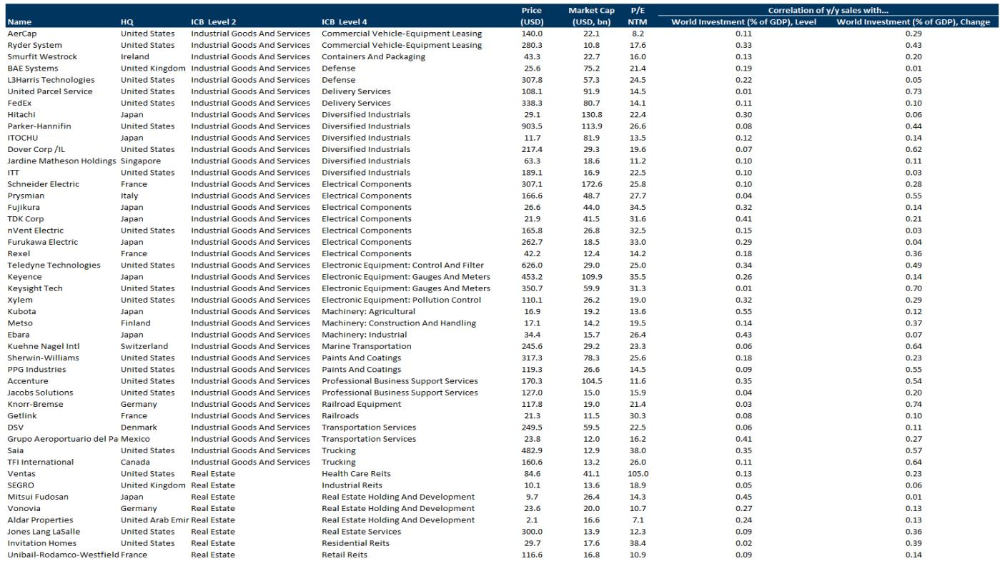
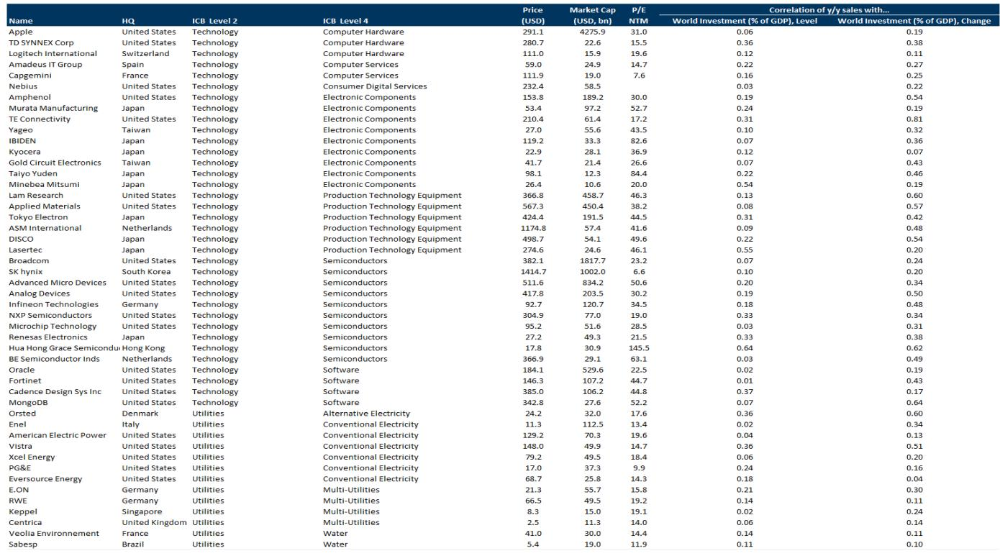
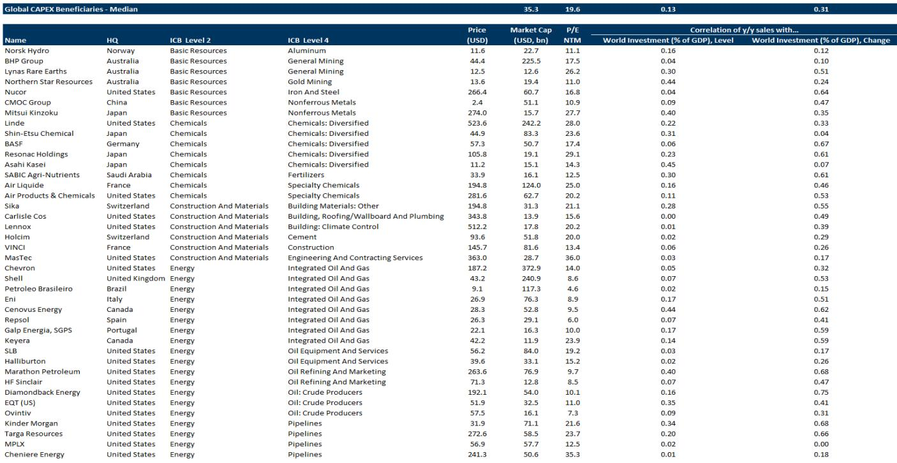

# The Post-Modern Cycle Demands a New Equity Playbook: Earnings Growth, Not Valuation Expansion, Will Drive Returns

The investment regime that defined the last four decades is over. The era of falling interest rates, declining inflation, and global integration has given way to something fundamentally different: a post-modern cycle characterized by higher macro volatility, rising real rates, and a structural surge in capital expenditure. Investors who continue to rely on the playbook that worked from 1982 to 2022—betting on valuation expansion driven by cheap money and disinflation—are likely to underperform. The new regime demands a shift in focus toward earnings-per-share growth as the primary engine of equity returns, and it requires a strategic reassessment of which sectors and geographies are positioned to benefit.

This transition is not a temporary deviation. It represents a structural break from the modern cycle that began in the early 1980s, when supply-side reforms, falling trade barriers, and independent central banks created a virtuous cycle of low volatility, rising profit shares, and strong equity returns. That cycle ended with the pandemic, and the forces now reshaping the global economy—artificial intelligence, energy security, geopolitical fragmentation, and reindustrialization—are creating a new set of winners and losers. The capex supercycle that is taking hold will reconfigure supply chains, raise capital intensity, and increase cross-sectional dispersion across markets. For investors, the implication is clear: alpha generation will become more important, and passive exposure to broad market indices will become less rewarding.

The timing of this shift matters. Many market participants still anchor their expectations to the post-financial-crisis era, when central bank liquidity and falling risk premia propelled equities higher despite weak economic growth. That period was an anomaly. The recovery in equity markets from the 2008-2009 crisis was far stronger than the underlying economic recovery would have warranted, driven almost entirely by valuation expansion. Today, with real rates structurally higher and government debt burdens larger, the conditions that supported that dynamic no longer exist. The modern cycle's tailwinds are becoming headwinds, and the post-modern cycle's structural forces are accelerating.

## The Modern Cycle Was an Exception, Not the Baseline, and Its Key Drivers Are Now Reversing

To understand why the post-modern cycle demands a new approach, it is necessary to recognize just how exceptional the modern cycle truly was. From 1982 to 2007, a confluence of powerful forces created an environment that was uniquely favorable for financial assets. Disinflation, driven by independent central banks and global competition, allowed interest rates to fall steadily for three decades. Supply-side reforms in the United States and United Kingdom triggered waves of deregulation, privatization, and lower corporate tax rates, which boosted corporate profitability. The collapse of the Berlin Wall, the expansion of the World Trade Organization, and the integration of China into global supply chains drove world trade growth at twice the pace of global GDP, lowering input costs and expanding profit margins.

The result was a structural decline in macro volatility. GDP growth became more stable, inflation became more predictable, and the business cycle became longer and shallower. This stability, in turn, lowered risk premia and supported higher valuations. Investors could afford to pay more for a given stream of earnings because the future had become more certain. The combination of falling discount rates and rising profit shares of GDP produced extraordinary equity returns, with the S&P 500 delivering a trailing price-to-earnings ratio that expanded from 7x at the 1982 trough to levels well above 20x by the late 1990s.

Every one of these drivers is now reversing or has already reversed. Inflation has returned, and while it may moderate from recent peaks, the structural forces that kept it low for decades—cheap labor from global integration, excess energy capacity, and downward pressure on goods prices—are fading. Interest rates, after a brief flirtation with zero, are settling at levels that are higher than the post-financial-crisis average. Government debt as a share of GDP is rising across advanced economies, driven by defense spending, industrial policy, and the green transition. Trade is fragmenting along geopolitical lines, with tariffs rising and supply chains being reconfigured for resilience rather than efficiency. Corporate tax rates, which fell steadily from the 1980s through 2020, are now under upward pressure as governments seek to finance higher spending.

The implication is that the structural tailwinds that boosted equity returns for four decades are becoming structural headwinds. Investors cannot count on falling discount rates to lift valuations. They cannot count on ever-expanding profit margins driven by ever-cheaper labor and energy. They cannot count on the peace dividend that allowed governments to reduce defense spending. The post-modern cycle will be defined by higher costs, higher volatility, and higher dispersion.

## The Capex Supercycle Is Reshaping the Return Structure, Favoring Earnings Growth Over Multiple Expansion

The most consequential feature of the post-modern cycle is the emergence of a capital expenditure supercycle. This is not a cyclical uptick in investment; it is a structural shift driven by three simultaneous and reinforcing forces. The first is the artificial intelligence revolution, which is generating an enormous wave of private-sector investment in data centers, semiconductor fabrication, and advanced computing infrastructure. The second is the renewed focus on energy security and the green transition, which is driving public and private investment in renewable energy, grid modernization, and critical mineral supply chains. The third is geopolitical fragmentation, which is prompting governments to increase defense spending and to reconfigure supply chains for resilience, raising capital intensity across manufacturing, logistics, and technology.

The scale of this investment wave is historically significant. The report notes that world military spending as a share of GDP, which trended downward during the modern cycle, has risen from around 1.8% in 2020 to 2.5% in 2025. This increase alone represents hundreds of billions of dollars in additional annual spending. When combined with the investment required for AI infrastructure and the energy transition, the total increase in capital expenditure is likely to be comparable to the investment booms of the post-World War II era and the industrial revolutions of the late 19th century.

For equity investors, the critical insight is that this capex supercycle changes the composition of returns. During the modern cycle, a significant portion of equity returns came from valuation expansion as discount rates fell. In the post-modern cycle, with real rates structurally higher and unlikely to decline significantly, the contribution of valuation to total returns will be much smaller. Instead, returns will be driven primarily by earnings-per-share growth. This means that investors need to focus on companies and sectors that can generate strong earnings growth in an environment of higher capital costs, higher input costs, and higher macro volatility.

The sectors that are best positioned are those that are both drivers and beneficiaries of the capex supercycle. Technology companies that provide the infrastructure for AI, including semiconductors, cloud computing, and data center equipment, are likely to see sustained revenue growth. Industrial companies that supply the equipment for energy transition and grid modernization are similarly positioned. Defense contractors that benefit from higher military spending will also see earnings growth. Conversely, sectors that were beneficiaries of the modern cycle's low-cost environment—consumer discretionary companies that relied on cheap imported goods, or financial institutions that profited from low interest rates—may face headwinds.

## Higher Cross-Sectional Dispersion Creates an Alpha-Rich Environment, Favoring Active Management

One of the most important implications of the post-modern cycle is the increase in cross-sectional dispersion across equities. During the modern cycle, the combination of low macro volatility and synchronized global growth meant that most stocks moved in the same direction, and correlations were high. This environment favored passive investing, because broad market indices captured the majority of returns, and the cost of active management was difficult to justify.

The post-modern cycle is fundamentally different. Higher macro volatility, greater geopolitical uncertainty, and the uneven impact of the capex supercycle are creating wider dispersion in returns across sectors, geographies, and individual companies. Some companies will benefit enormously from the structural changes underway, while others will see their business models disrupted. The gap between winners and losers is likely to widen, and the correlation between stocks is likely to decline.

This is precisely the environment in which active management can add value. When dispersion is high and correlations are low, the opportunity set for stock selection expands. Skilled investors who can identify the companies that are structurally positioned to benefit from the capex supercycle, and who can avoid those that are exposed to the headwinds of higher costs and higher volatility, have the potential to generate significant alpha.

The report's analysis of the transition from the modern to the post-modern cycle provides a useful framework for thinking about this dispersion. The sectors that benefited most from the modern cycle—those that relied on falling interest rates, cheap labor, and global integration—are likely to be the most challenged in the post-modern cycle. Conversely, the sectors that are aligned with the new structural drivers—AI, energy security, defense, and reindustrialization—are likely to outperform. This is not a tactical call; it is a strategic reorientation that will play out over years, not quarters.

## The Report Raises Unresolved Questions About the Sustainability of the Capex Boom and the Pace of Earnings Delivery

While the report's analysis is compelling, it leaves several important questions unanswered. The most critical of these concerns the sustainability of the capex supercycle. The investment required for AI infrastructure, energy transition, and defense spending is enormous, but it is not yet clear whether the returns on this investment will justify the costs. If AI fails to deliver on its promise of transformative productivity gains, or if the energy transition proceeds more slowly than anticipated, the capex boom could turn into a capex bust, leaving investors with stranded assets and impaired returns.

A second unresolved question concerns the pace of earnings delivery. The report argues that equity returns will be driven by earnings growth rather than valuation expansion, but it does not provide a detailed analysis of how quickly earnings can grow in the post-modern cycle. Higher capital costs and higher input costs may compress margins, even as revenues grow. If earnings growth fails to materialize at the pace that current valuations imply, equity markets could face a correction.

A third question concerns the role of government debt. The report notes that government debt is rising, but it does not fully explore the implications of this trend for interest rates and the cost of capital. If investors begin to demand higher risk premia on government bonds, the resulting increase in real rates could weigh on equity valuations and slow the pace of investment. The interaction between fiscal policy, monetary policy, and the capex supercycle is complex and uncertain, and the report does not provide a definitive answer on how this dynamic will unfold.

These unresolved questions do not undermine the report's thesis, but they highlight the importance of active management and careful stock selection. Investors who simply buy the broad market on the assumption that the capex supercycle will lift all boats are likely to be disappointed. The post-modern cycle will create winners and losers, and the ability to distinguish between them will be the key determinant of investment success.

## A Decision Framework for the Post-Modern Cycle: Focus on Earnings Visibility, Pricing Power, and Balance Sheet Strength

For investors seeking to navigate the post-modern cycle, the report's analysis suggests a clear decision framework built on three pillars. The first is earnings visibility. In an environment of higher macro volatility and higher capital costs, companies with predictable and sustainable earnings growth are likely to command a premium. This favors businesses with recurring revenue models, long-term contracts, and structural demand drivers that are aligned with the capex supercycle.

The second pillar is pricing power. The post-modern cycle is characterized by higher input costs, including labor, energy, and capital. Companies that can pass these costs through to customers without losing market share will be better positioned to protect their margins. This favors businesses with strong brands, proprietary technology, or essential products and services that face limited competition.

The third pillar is balance sheet strength. Higher real rates mean that the cost of debt is higher, and companies with high leverage will face increased financial strain. Investors should favor companies with low debt levels, strong cash flows, and the ability to self-fund their capital expenditure. This is particularly important for companies that are participating in the capex supercycle, because the investment required is substantial and the returns may take years to materialize.

The framework also suggests a geographic dimension. The report highlights the shift from globalization to regionalization, and this has implications for which markets are likely to benefit. Companies that are exposed to domestic demand in regions with strong fiscal support for the capex supercycle—such as the United States, which is pursuing large-scale industrial policy through the CHIPS Act and the Inflation Reduction Act—may be better positioned than those that are exposed to regions with weaker fiscal capacity or greater geopolitical risk.

## Join the Community to Read the Full Report and Review the Original Charts

The post-modern cycle represents a fundamental shift in the investment landscape, and the report's analysis provides a comprehensive framework for understanding the forces that are reshaping equity markets. But the full picture requires a deeper dive into the data, including the original charts that illustrate the historical trends in macro volatility, trade integration, profit shares, and defense spending. These charts are essential for investors who want to develop their own conviction about the structural changes underway and to identify the specific sectors and companies that are best positioned to benefit.

The report also raises questions that merit further exploration, including the sustainability of the capex boom, the pace of earnings delivery, and the implications of rising government debt. These are not questions that can be answered in a single article, but they are questions that serious investors need to wrestle with. By joining the community, you will gain access to the full report, the original charts, and ongoing analysis that will help you navigate the post-modern cycle with greater confidence and clarity.

*This article is for learning and discussion only and does not constitute investment advice.*

Personal reading notes and learning share only. Not investment advice.

