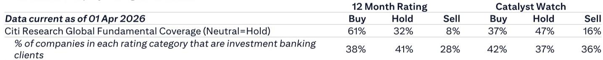

# The Next Frontier of AI Is Not About Scale — It’s About Efficiency, Self-Improvement, and Physical Intelligence

The artificial intelligence industry is undergoing a quiet but profound pivot. For the past several years, the dominant narrative has been that bigger models, more data, and more compute are the only path to progress. The Research and Applied AI Summit 2026, as documented by a global investment bank report, tells a very different story. The frontier of AI is no longer defined by scaling laws alone. It is being redefined by three interconnected imperatives: radical token-cost efficiency, recursive self-improvement, and the emergence of world models that bridge the gap between language and physical reality. These shifts are not incremental. They represent a structural change in how the most advanced AI labs and their most sophisticated users think about value creation, competitive advantage, and the limits of current architectures.

The timing of this transition matters. As the cost of running frontier models continues to rise, and as regulatory and safety concerns around those models intensify, the market is demanding a more economically rational approach to AI deployment. The companies that will win in this next phase are not necessarily those with the largest models. They are the ones that can route tasks to the right-sized model, that can build systems capable of improving themselves, and that can extend AI beyond text into the messy, data-sparse world of physical interaction. The summit revealed a clear pattern: the most exciting work is happening at the intersection of engineering pragmatism and scientific ambition. This article unpacks what that pattern means for investors, strategists, and technology leaders.

## The Economics of Inference Are Forcing a Rethink of How AI Is Deployed

The most immediately actionable insight from the summit concerns the cost of running AI models in production. A recurring theme was that the frontier model — the largest, most capable system — is often the wrong tool for the job. Revolut, the digital banking platform, presented a routing platform that directs work away from frontier models toward smaller, more specialized alternatives. The result was an 8x cost savings with no measurable quality loss. This is not a marginal optimization. It is a fundamental challenge to the assumption that bigger is always better.

The logic is straightforward but its implications are far-reaching. In many enterprise use cases, the task at hand does not require the full reasoning capability of a frontier model. A customer service query, a data extraction task, or a classification problem can often be handled by a model that is an order of magnitude smaller and cheaper to run. The challenge has been building the infrastructure to make that routing decision intelligently, in real time, without degrading the user experience. Revolut's solution — a central gateway with graceful fallbacks — is a blueprint for how large-scale AI deployment should work in practice.

ElevenLabs pushed this logic even further, demonstrating a 70x throughput gain on fixed hardware. The techniques they detailed are a masterclass in inference optimization: continuous batching alone delivered a 15x improvement; FP8 quantization with quantization-aware training, multi-token-prediction speculative decoding, and KV-cache quantization each contributed additional gains. The cumulative effect is that the same hardware can serve far more users, or serve them far faster, without any improvement in the underlying model architecture.

The strategic implication is clear. The era of brute-force inference is ending. Companies that treat every AI workload as a frontier-model workload are burning capital unnecessarily. The winners will be those that build the routing and optimization infrastructure to match model capability to task complexity. This is not just a cost-saving exercise. It is a competitive advantage that compounds over time, because the data generated by efficient inference systems can be fed back into model improvement, creating a virtuous cycle that the profligate cannot replicate.

## Recursive Self-Improvement Is Moving from Theory to Engineering Reality

The concept of AI improving AI has been a staple of research discussions for years. What changed at this summit was the specificity and concreteness of the work being presented. DeepMind framed scientific discovery as a reinforcement learning problem, and they are building the infrastructure to solve it at scale. The progression they described — from discovery to open-ended discovery to accelerated open-ended discovery — is not a vague aspiration. It is supported by tools like DiscoGen, which can generate over 400 million research tasks, and MLGym-Bench, which provides a standardized environment for training models to conduct research.

This matters because it directly addresses one of the most persistent bottlenecks in AI progress: the human bottleneck. Even as models become more capable, the rate at which they can be improved has been limited by the speed at which human researchers can generate ideas, design experiments, and interpret results. Recursive self-improvement, if it works at scale, removes that bottleneck. The model becomes both the researcher and the subject of research, iterating on its own architecture and training methodology in a closed loop.

Odyssey's PROWL system extends this logic into a new domain. Instead of improving the decision-making policy of an agent, PROWL uses reinforcement learning to improve the world model that the agent uses to plan its actions. This is a subtle but critical distinction. The quality of any agentic system is ultimately bounded by the quality of its internal model of the world. If that model is flawed, no amount of policy optimization will compensate. By directly improving the world model, PROWL addresses the root cause of agentic failure rather than its symptoms.

The investment implication is nuanced but important. Recursive self-improvement has the potential to compress years of research progress into months or weeks. For companies that master it, the competitive moat is not just a better model — it is a faster improvement cycle that widens the gap with every iteration. For everyone else, the risk is that they become permanently locked out of the frontier, unable to keep pace with a system that improves itself faster than they can improve theirs.

## World Models Are the Key to Breaking the Physical Intelligence Bottleneck

The most ambitious presentations at the summit were about world models — systems that can simulate and understand the physical world, not just process language. Odyssey positioned the world model category at its "GPT-2 moment," arguing that modeling interaction with the world is a richer substrate than language alone. This is not a marginal claim. If world models follow a similar trajectory to language models, the next few years will see an explosion in capability that transforms industries from robotics to autonomous driving to manufacturing.

The immediate application is in robotics, where the bottleneck is not hardware but data. Training robots to perform dexterous tasks traditionally requires teleoperation — a human operator controlling the robot to generate training data. This is slow, expensive, and difficult to scale. World models offer an alternative: generate synthetic training data by simulating the physical interaction in a learned environment. DeepMind's two-part modeling solution for robotics has already achieved human-level dexterity that generalizes across different robot embodiments. This is a breakthrough that could unlock a step-change in robotics adoption.

The technical details are worth examining. Odyssey-2 Max, an autoregressive diffusion transformer, scored 93 in Physics on the PAI-Bench benchmark. Starchild-1 handles real-time joint pixel and audio generation. Agora-1 can enable four concurrent agent sessions on a single H100 GPU. These are not research curiosities. They are production-ready systems that demonstrate the commercial viability of the world model approach. DeepMind's Genie 3, a real-time promptable video generation model, extends the same logic into education and agentic training.

The strategic question for investors is which industries will be disrupted first. Robotics is the obvious answer, but the list is longer. Any industry that requires physical simulation — logistics, construction, healthcare, entertainment — could be transformed by cheap, accurate world models. The key insight is that world models are not a replacement for language models. They are a complement that opens up entirely new categories of AI application. Companies that bet exclusively on language are missing the bigger picture.

## The Report Raises Questions It Does Not Fully Answer About the Path to Commercialization

For all its richness, the summit presentation leaves several critical questions unresolved. The first concerns the economics of world model training. Language models benefit from the vast corpus of text available on the internet. World models require data about physical interaction, which is far scarcer and more expensive to collect. The report does not address how the cost of training world models compares to language models, or whether the synthetic data generation approach can close that gap.

The second question is about safety and alignment. Recursive self-improvement is powerful, but it is also dangerous. A system that can improve itself faster than humans can understand it creates risks that are difficult to manage. The report mentions that rising costs and increasing focus on frontier model risks will drive token efficiency, but it does not address how recursive self-improvement changes the risk calculus. If a model can rewrite its own architecture, traditional safety measures may become obsolete.

The third question is about the competitive landscape. The summit featured presentations from DeepMind, Revolut, ElevenLabs, and Odyssey — a mix of big tech, financial services, and startups. But the report does not clarify which of these players has the most durable advantage. Is the routing platform that Revolut built a proprietary moat, or is it a commodity that others will replicate? Can Odyssey maintain its lead in world models, or will it be overtaken by larger players with more resources? The answers to these questions will determine where the value accrues in the next phase of AI development.

## A Decision Framework for Navigating the New AI Landscape

For readers trying to make sense of these developments, the summit provides the basis for a structured decision framework. The first dimension is cost efficiency. Every organization deploying AI should audit its inference workloads and ask whether it is using the right model for each task. The default assumption should be that the frontier model is the wrong choice. Building or buying a routing platform that can match model capability to task complexity should be a top priority.

The second dimension is self-improvement capability. Organizations that rely on AI for competitive advantage should assess whether their models are improving at a rate that matches or exceeds the industry average. If the answer is no, the gap will widen. The solution may involve investing in recursive self-improvement infrastructure, partnering with labs that have it, or shifting to applications where the improvement cycle is less critical.

The third dimension is physical intelligence exposure. Every industry will eventually be affected by world models, but the timing and magnitude will vary. Leaders in robotics, logistics, and manufacturing should be investing now. Leaders in knowledge work should monitor the space but may have more time. The key is to avoid the trap of assuming that language models are the only game in town. The most significant opportunities may lie elsewhere.

## Join the Community to Read the Full Report and Review the Original Charts

The Research and Applied AI Summit 2026 offered a rare window into the thinking of the technologists who are building the next generation of AI systems. The insights presented here — about inference economics, recursive self-improvement, and world models — are not speculative. They are grounded in working systems and measurable results. But the full picture requires access to the original charts, data, and analysis that underpin the summit coverage. The global investment bank report contains details that this article could only summarize, including specific benchmark scores, cost comparisons, and architectural diagrams. For serious investors and strategists, those details are essential.

Join the community to read the full report and review the original charts. Understanding where AI is going is the first step. Understanding how to position for it is the second. The summit made one thing clear: the rules of the game are changing, and the players who adapt fastest will define the next decade.

*This article is for learning and discussion only and does not constitute investment advice.*

Personal reading notes and learning share only. Not investment advice.

