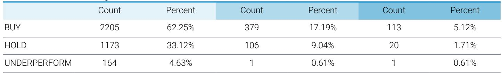
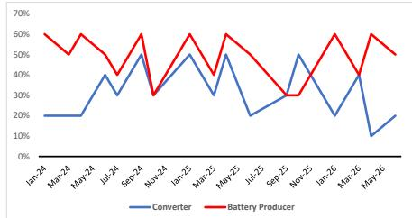

# JEF：锂电产业链的真实信号不是价格下跌，而是库存认知的分裂

这份JEF锂电产业链调研报告，覆盖了中国市场约77%的锂盐转化企业和73%的电池材料生产企业，是当前最有代表性的产业链一线感知采样。读完整份报告，最值得关注的核心判断不是价格还会跌多少——市场对此已有充分预期——而是一个正在悄然形成的结构性裂痕：上游转化企业和下游电池企业对库存水平的认知出现了方向性分歧。这种分歧，正在重塑整个锂电产业链的议价机制和利润分配格局。

报告显示，转化企业认为电池厂商的库存“过低”，但电池厂商却认为自己的客户——整车厂和储能集成商——存在“适度过剩”的库存。同一组数据，两个环节读出了完全相反的结论。这意味着什么？意味着产业链的信息传导已经不再是对称的，每一环都在根据自身订单感受做出独立判断，而这些判断正在驱动截然不同的采购和备货行为。

这份调研发生于一个微妙的时点。锂价在经历了2022年的狂飙和2023年的回调后，市场普遍认为底部区域已经探明，但去库存周期何时结束、需求何时真正企稳，始终缺乏高频、一手的数据支撑。JEF的这份调研，恰好填补了这一空白。它不是基于模型推演，而是基于实际负责采购和排产的一线管理者的直接反馈。

以下，我们从五个层次来拆解这份调研揭示的核心信号。

## 1. 价格预期已经触底，但转化企业的悲观情绪仍在蔓延

调研中一个最直接的信号是价格预期。转化企业预计未来三个月锂盐价格将出现超过10%的下跌，而电池企业的预期则温和得多，仅为个位数跌幅。值得注意的是，从2024年初至今，转化企业的价格预期曲线始终在电池企业下方，且差距在2025年下半年开始明显扩大。

这意味着什么？转化企业正在承受比下游更重的价格压力。原因不难理解：转化环节产能过剩更为严重，且产品同质化程度高，价格竞争几乎是唯一的竞争手段。电池企业虽然也面临降价压力，但其产品差异化程度更高、客户粘性更强，价格传导机制相对缓和。

但更值得关注的不是当前价格预期的绝对值，而是趋势。从调研数据看，转化企业的价格预期在2025年11月曾短暂收窄至接近零，但2026年初再次恶化，5月又回落至-12%的深度负值区间。这种反复波动说明，市场并未真正找到价格底部，任何短期企稳都可能被新一轮供给释放或需求波动打破。

对于投资者而言，这意味着锂盐板块的盈利底部仍难以确认。即便价格已经跌至许多企业的现金成本以下，但只要产能出清没有实质性发生，价格反弹的空间和持续性就始终存疑。

## 2. 订单增速分化揭示产业链利润正从上游向下游转移

如果说价格预期是情绪指标，那么订单增速就是更硬的基本面信号。调研中，电池企业的新订单同比增速自2024年以来始终维持在0%-5%的窄幅区间，表现相当稳定。而转化企业的新订单增速则持续为负，直到2025年底才勉强回到零附近。

更关键的是两者的交叉验证。从“预期销售增速减新订单增速”这一差值指标来看，转化企业自2025年下半年以来持续为正，意味着他们预期销售增速高于新订单增速。这通常是一个危险信号——预期高于实际，往往意味着后续的库存被动累积和更激进的价格让步。电池企业的这一差值则持续为负，说明他们的预期更为保守，实际订单可能好于预期。

这组数据合在一起指向一个清晰的判断：产业链的定价权和增长动能正在从上游向下游转移。电池企业凭借更强的客户关系和更稳定的需求端，正在成为产业链中更强势的一环。转化企业则陷入“量价双杀”的困境——量在萎缩，价在下跌，利润空间被双重挤压。

对于产业决策者而言，这意味着战略重心需要向下游延伸。纯上游资源或转化环节的商业模式，在当前的供需格局下面临的结构性挑战远不止是周期性的。那些能够向下游电池材料、甚至电芯环节延伸的企业，将获得更强的抗风险能力和议价空间。

## 3. 库存认知的分裂是当前产业链最危险的信号

这可能是整份报告最值得深入解读的部分。转化企业和电池企业对“客户库存水平”的判断出现了系统性的方向性分歧。

转化企业认为电池厂商的库存“过低”——这一比例在2026年3月降至仅10%，是调研周期内的最低点。而电池企业认为自己的客户（整车厂和储能集成商）库存“过高”的比例，则始终在40%-60%的区间内波动，2026年5月更是回升至60%。

同一个产业链，两个相邻环节，对下游库存的判断完全相反。这只有两种可能的解释：要么信息传导存在严重阻塞，要么某一方的判断存在系统性偏差。

从逻辑上看，电池企业的判断可能更接近真实情况。因为电池企业直接面对终端客户，对整车厂和储能集成商的采购节奏、排产计划有更直接的信息来源。转化企业则隔着电池企业这一层，其信息更多来自间接渠道和自身订单感受，容易受到订单波动的影响而放大判断偏差。

但这里有一个更值得警惕的可能性：如果电池企业的判断是正确的，即终端客户确实存在库存过剩，那么当前电池企业的稳定订单增速可能只是“假象”——终端客户正在消化库存，新采购需求并未真正释放。一旦去库存完成，电池企业的订单增速可能面临一轮更明显的下滑，届时上游转化企业将承受更猛烈的冲击。

这个假设尚未被验证，但它指向一个对投资者至关重要的观察窗口：未来一到两个季度，终端整车和储能项目的实际出货数据，将比任何调研问卷都更有说服力。

## 4. 报告尚未完全回答的关键问题：产能出清的触发条件是什么

JEF的调研清晰地描绘了产业链各环节的当前状态，但它没有——也不可能——回答一个更根本的问题：产能出清何时真正开始，以及什么事件会触发它。

从调研数据看，转化企业的库存同比增速自2025年下半年以来持续回升，到2026年初已经转正。这意味着，尽管价格在跌、订单在萎缩，但企业并没有真正削减库存，反而在累积。这通常不是主动补库的信号，而是被动积压——企业无法以当前价格卖出产品，库存只能被动上升。

这种情况下，产能出清需要满足至少两个条件之一：一是价格跌破足够多企业的现金成本，引发大规模减产或停产；二是需求出现超预期恢复，消化掉过剩库存。从目前的调研数据看，这两个条件都尚未明确满足。

价格方面，虽然已经跌至许多企业的成本线附近，但调研中并没有出现企业大规模减产或破产的迹象。需求方面，电池企业的订单增速虽然稳定，但并未出现加速上行的趋势。这意味着当前的“平衡”可能只是暂时的，真正的转折点尚未到来。

对于读者而言，这意味着当前的投资决策需要建立在“出清尚未发生”这一假设之上。任何基于“价格已经见底、周期即将反转”的判断，都需要等待更明确的信号——比如头部企业的产能关闭公告、或者终端需求的连续超预期数据。

## 5. 一个可以持续跟踪的观察框架：盯住库存差与订单差

对于没有条件像JEF一样做大规模产业链调研的投资者，这份报告其实提供了一个可以低成本复用的观察框架。

核心是两个差值指标。第一个是“库存增速减销量增速”。当这个差值持续为正，意味着库存累积速度快于销售增速，是供给过剩的领先信号。当差值转负，则意味着去库存正在加速，是价格企稳的前兆。从调研数据看，转化企业的这一差值在2025年下半年持续为正，直到2026年初才有所收窄，但仍未转负。

第二个是“预期销售增速减新订单增速”。当这个差值持续为正，意味着企业对未来的预期高于当前的实际订单，往往是后续价格承压的信号。转化企业的这一差值自2025年下半年以来持续为正，而电池企业则持续为负。这种分化本身就是产业链利润转移的映射。

投资者可以定期跟踪这两个差值的变化，不需要复杂的模型，只需要关注产业链各环节的公开数据——上市公司财报中的库存周转天数、订单积压情况、以及行业会议中企业对未来的展望。当这两个差值同时转负时，才是真正值得关注的底部信号。

这份JEF调研的价值，不仅在于它提供了当前产业链的一手数据，更在于它揭示了一个被市场低估的风险：产业链各环节之间的信息不对称和判断分歧，正在制造一个比单纯价格下跌更复杂的博弈格局。转化企业认为电池企业库存过低、需要补库，电池企业认为终端客户库存过高、需要去库——这两种判断的冲突，意味着未来一到两个季度的产业链博弈将异常激烈，任何一方的判断偏差，都可能导致库存周期的剧烈波动。

这些未解问题，恰恰是深入研究锂电产业链最有趣的部分。价格会跌到什么位置？产能出清何时真正开始？电池企业的稳定订单能否持续？这些问题的答案，可能就藏在下一轮调研数据中，也可能需要在星球微信群里和更多产业链从业者一起推演。欢迎来星球微信群里继续讨论——我们每周会围绕产业链最新信号做定向拆解，也会邀请有实操经验的产业人士参与讨论。

Personal reading notes and learning share only. Not investment advice.

