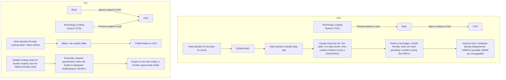
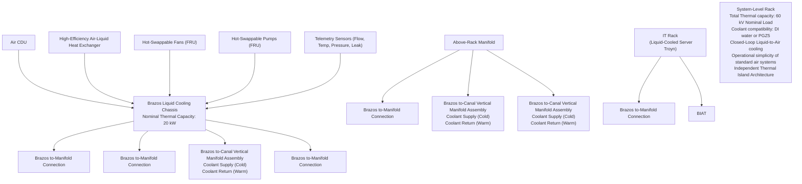

你是资深小红书内容策划 + 投研翻译官，擅长把英文/中文研报改写成高互动、可收藏、可转发的中文小红书笔记。

【目标】
- 把下面的研报解析内容，改写成一篇中文小红书笔记。
- 风格：投研博主风：信息密度高，但像给朋友讲逻辑
- 长度：不超过 1000 字，信息密度高但不要写长文。
- emoji 密度：中

【必须输出的结构】
1. 第一行：标题，20 字以内，不要像论文标题，也不要用夸张极限词。
2. 第二行：封面短标题，10 字以内，适合放在图中间。
3. 第三行：封面副标题，10-18 字，短句。
4. 正文分段清晰，每段不超过 3 行，可以用编号、小标题或加粗。
5. 正文要自然呈现观点，但不要暴露写作框架或思考过程。
6. 末尾可以保留 2-4 个相关标签，只允许从这些标签里选择：`#学习笔记`、`#研究笔记`、`#学习研究`、`#研报解读`。

【严禁输出】
- 不要出现这些栏目名或类似栏目名：`一句话结论`、`我最想提醒的一点`、`配图建议`、`免责声明`、`非投资建议`、`仅做学习交流`、`仅作学习交流`。
- 不要在正文最后追加配图建议，不要告诉我第 2/3/4 张图怎么配文。
- 不要输出任何包含“投资”的免责声明，也不要输出“非投资建议”这种表述。
- 不要输出财经敏感标签：`#投资学习`、`#财经`、`#金融`、`#股票`、`#基金`、`#理财`。
- 不要输出无关标签：`#小红书笔记`、`#笔记分享`、`#干货分享`。
- 不要写“关注”“点赞”“求关注”“评论区见”“评论区留言”等直接互动诱导；可以写“欢迎一起讨论”“可以继续交流”。

【平台发布合规要求】
- 不要写“爆款”“震惊”“必看”“必读”“最强”“最全”“唯一”“全网首发”等极限词或夸张词。
- 不要写“投资建议”“买入”“卖出”“强烈推荐”“稳赚”“保本”“必涨”“抄底”“上车”“内幕”“翻倍”等金融操作或收益承诺表达。
- “投资”相关词尽量改成“投研”“研究”“观察”“学习参考”；如果必须保留，也要放在中性语境里。
- 不要承诺收益，不要引导交易，不要暗示确定性结果。

【内容要求】
- 只能基于研报原文和解析结果推导，不要编造数据、公司动作、引用。
- 可以把专业表达翻成人话，但不能扭曲意思。
- 遇到不确定或缺失信息：用“研报未给出”或“这里是推测”明确标注。
- 默认避免出现具体投行品牌名，比如“GS”“GS”，统一写作“投行研报”。
- 不要解释你的思考过程，不要输出多余说明。

【推荐写法】
- 开头直接给一个自然判断，不要加“结论：”标签。
- 中间用 1/2/3 拆逻辑，但小标题要像正常内容标题，不要像写作模板。
- 结尾可以留下一个自然讨论问题，但不要引导关注、点赞或评论。
- 最后一行输出 2-4 个标签，优先：`#学习笔记 #研究笔记 #学习研究 #研报解读`。

【研报解析内容】
"""
# U.S. Multi Industry & Electrical Equipment

# Liquid Cooling: What does Google's Brazos mean for the broader CDU ecosystem?

Varun Govindaraj

+19173448543

varun.govindaraj@bemsteinsg.com

Chad Dillard

+19173448469

chad.dillard@bernsteinsg.com

Alasdair Leslie

+44 20 7762 4952

alasdair.leslie@bernsteinsg.com

Madison Rezaei

+19173448622

madison.rezaei@bernsteinsg.com

## Specialist Sales

Steve Song

+19173448401

steve.song@bernsteinsg.com

Google recently released early specifications for a liquid-to-air (L2A) CDU named "Brazos". Like project "Deschutes" that came before it in 2025, Brazos simply announces a CDU reference design for the Open Compute Project's vendor ecosystem (which counts Vertiv, nVent, and Boyd as members) to produce. It is not a competing product to Vertiv/Boyd/nVent/Motivair's existing L2A CDU lines that Google will manufacture; hyperscalers are not in the business of making this equipment.

Prima facie, the specifications on Brazos-class CDUs seem relatively low. At 60kW of cooling capacity, it cannot even cool one Blackwell rack (which requires \~120kW of cooling capacity). Interestingly, Brazos-class CDUs are designed to draw DC power (vs. many other L2A CDUs that are designed for AC power instead).

We believe these CDUs are designed to be OCP compliant, and fit into legacy hyperscaler deployments which tend to have DC power infrastructure already. The cooling capacity of 60kW does not work well for frontier training models, but can support inference at that range. Given concerns around how quickly data center capacity can get up and running, creating an inference ecosystem that can run in existing facilities with simple L2A CDU retrofits seems like a good move (especially when inference looks set to grow faster than training through 2030). While not explicitly stated, we infer that this is the primary purpose of the Brazos project.

While hard to quantify, we see two mid-term risks for CDU manufacturers. First, there is real commoditization risk of the inference CDU ecosystem. Brazos specs are meaningfully easier to deliver than Deschutes. While there will be a service attach, margins will be lower vs. flagship training CDUs. The deciding factor here is inference rack densities; we are unsure what this looks like for purpose-built inference silicon from hyperscalers. If it remains around 60 kW/rack, then a meaningful share could be cooled by L2A Brazos-style CDUs. If not, larger Deschutes-class CDUs will be needed instead (which we would expect have higher margin and stickier service attach).

Second, we may also see some hyperscaler demand shift from greenfield to retrofits, especially if projects get delayed. While we do not see that in stranded capacity numbers in our data center capacity tracker, there has been some anecdotal input from companies that they are seeing a few customers (both hyperscalers and colos) push out deliveries because of a lack of readiness / project delays. We're not saying this WILL happen, but we think having these standardized L2A CDUs creates optionality for hyperscalers if they need to accelerate retrofits to meet inference demand in the future.

We do not view this announcement by Google as imminently alarming for CDU manufacturers, especially those that focus on technical excellence at the top of the stack. Some level of CDU commoditization was always expected by the market. While we think this announcement accelerates the commoditization trend for lower spec. products, we still believe an innovation premium exists for flagship CDUs, and expect it to continue as top-tier liquid cooling technology evolves.

BERNSTEIN TICKER TABLE

<table><tr><td rowspan="2">Ticker</td><td rowspan="2">Rating</td><td colspan="3">16 Jun 2026</td><td rowspan="2">TTM Rel. Perf.</td><td colspan="4">Adjusted EPS</td><td colspan="3">Adjusted P/E (x)</td></tr><tr><td>Cur</td><td>Closing Price</td><td>Price Target</td><td>Cur</td><td>2025A</td><td>2026E</td><td>2027E</td><td>2025A</td><td>2026E</td><td>2027E</td></tr><tr><td>VRT (Vertiv)</td><td>O</td><td>USD</td><td>299.60</td><td>416.00</td><td>132.8%</td><td>USD</td><td>4.20</td><td>6.52</td><td>9.21</td><td>71.4</td><td>45.9</td><td>32.5</td></tr><tr><td>NVT (nVent)</td><td>O</td><td>USD</td><td>167.34</td><td>218.00</td><td>113.2%</td><td>USD</td><td>3.34</td><td>4.79</td><td>6.19</td><td>50.0</td><td>34.9</td><td>27.0</td></tr><tr><td>SU.FP (Schneider)</td><td>O</td><td>EUR</td><td>276.95</td><td>310.00</td><td>7.3%</td><td>EUR</td><td>8.43</td><td>10.22</td><td>11.95</td><td>32.9</td><td>27.1</td><td>23.2</td></tr><tr><td>ETN (Eaton)</td><td>O</td><td>USD</td><td>407.71</td><td>534.00</td><td>(3.9)%</td><td>USD</td><td>12.07</td><td>13.29</td><td>16.32</td><td>33.8</td><td>30.7</td><td>25.0</td></tr><tr><td>SPX</td><td></td><td></td><td>7,511.35</td><td></td><td></td><td></td><td></td><td></td><td></td><td></td><td></td><td></td></tr><tr><td>EDME</td><td></td><td></td><td>1,577.98</td><td></td><td></td><td></td><td></td><td></td><td></td><td></td><td></td><td></td></tr></table>

O - Outperform, M - Market-Perform, U - Underperform, NR - Not Rated, CS - Coverage Suspended  
Source: Bloomberg, Bernstein estimates and analysis.

## INVESTMENT IMPLICATIONS

We rate Vertiv Outperform with a target price of \$416.

We rate nVent Outperform with a target price of \$218.

We rate Schneider Outperform with a target price of €310.

We rate Eaton Outperform with a target price of \$534.

## DETAILS

## Context

Hyperscalers have historically pushed the "Open Compute Project" or OCP, a non-profit that published open-source specifications for data center hardware. Founded by Meta, it now has participation from Google, Microsoft, and Oracle (although Amazon is a notable missing name) and a host of other vendors. In 2025, Google published details of Project Deschutes as a part of the OCP; this was a set of technical specifications and standards for compliant Liquid to Liquid (L2L) CDUs (with 2MW of cooling capacity at a $3^{0}\mathrm{C}$ approach temperature). Vertiv, nVent, and Boyd all now have Deschute-compliant units available in their product catalogs. Yesterday, Google announced that they would specify another CDU design - this time for Liquid to Air (L2A CDUs) named project Brazos (in line with Google naming these projects after rivers). This note walks through implications for the broader CDU ecosystem.

## L2L vs. L2A: What's the difference?

In our CDU primer earlier this week, we focused mostly comparing on flagship L2L CDUs. L2L units are named as such because they reject heat between two liquid loops (the technology cooling system and facility water system). In contrast, the L2A configuration we are talking about today only has one liquid loop (the technology cooling system) which rejects heat as air into the "hot aisle" of a data center. A CRAH or CRAC (Computer Room Air Handler or Computer Room Air Conditioner) then blows the hot air out of the hall / building. Generally, L2L cooling is preferred for all greenfield builds or situations where rack densities cross 150kW (it is much more energy efficient). In contrast, L2A builds are preferred when retrofitting an existing data center because it does not need the facility water system loop (eliminating the need for complex piping retrofits) or when cooling capacities range between 40kW to -150kW (below which plain old - but cold - air can be used to extract heat from the chips). Both L2A and L2L are still types of liquid cooling (i.e., they need cold plates and coolant to extract heat from chips), they simply differ in terms of how they reject heat from the TCS to the outside of the data center.

EXHIBIT 1: Distinction between Liquid-to-Air and Liquid-to-Liquid CDUs  

flowchart

Source: Bernstein Analysis and Estimates

## Thoughts on Brazos specifications

When we look at the specifications offered by Brazos, prima facie it does not look that impressive or demanding. 60kW of capacity cannot cool even a single Blackwell rack (which requires \~120kW of cooling power) - players like nVent, Motivair, and CoolIT go far higher on their cooling power for L2A CDUs. The power feed is DC (not AC) and designed to be pulled directly from busbars which is distinct from most other L2A CDUs available in the market today which are designed for AC use.

EXHIBIT 2: Project Brazos Overview  
What exactly is Google Brazos?  

flowchart

Source: Bernstein Analysis, Company Reports (Google)

• Google announced a new Liquid to Air (L2A) CDU configuration called "Brazos"  
- Largely aimed at servicing older environments where providers are attempting to offer higher rack densities without complexity of chiller and piping retrofits  
- Offers \~60kW of cooling capacity per rack; not enough for Blackwell (which is 120kW+ per rack) or higher end training models  
- As per Google: "Brazos functions as a self-contained liquid ecosystem, capturing heat via liquid at the component level and rejecting it into the data center's hot aisle using high-efficiency liquid-to-air heat exchangers. This plug-and-play architecture can be rapidly installed in any legacy facility that has sufficient power and standard air handling."  
• We want to highlight that this is not new tech.; L2A cooling has existed for years before Google made this announcement

EXHIBIT 3: Brazos L2A CDU specs. seem to target inference in OCP compliant environments  

table

L2A Product comparison of Brazos vs. peers
| Company | Google Brazos | Boyd RAA32-10U21 | Vertiv CoolChip | nVent HRU | Motivair HDU | CoolIT AHx240 |
|---|---|---|---|---|---|---|
| Cooling Capacity 1 | 60 kW | 32 kW | 70 kW | 100 - 120 kW | 150 kW | 240 kW |
| ATD | Not stated | 24°C | 11°C | Not stated | Likely ~10°C | Not stated |
| Power Supply 2 | 40 - 60V DC | 1P AC | 1P AC | 1P AC | 1P AC | 1P AC |

1 Cooling power is too low to work with Blackwell or above; seems like Brazos is more focused on inference capacity through retrofits  
2 Direct DC connectivity via OCP-compliant busbar is unique to Brazos vs. other L2A CDUs; will not work in legacy colocation / enterprise builds  
Source: Bernstein Analysis and Estimates, Company Reports

However, our biggest takeaway is that this design is not intended to compete with existing products. It is designed to be OCP compliant, and fit into legacy hyperscaler deployments which tend to have DC power infrastructure already and not AC. The cooling capacity of 60kW does not work well for frontier training models, but can support inference at that range. Given concerns around how quickly data center capacity can get up and running (see our data center tracker for more insight on that), creating an inference ecosystem that can run in existing facilities with simple L2A CDU retrofits seems like a smart move (especially when inference looks set to grow faster than training through 2030). While not explicitly stated, we think this is the primary use case of the Brazos project.

## Our inferred implications on the CDU market

First, it is important to state what Brazos is not. It is not a CDU that Google is building; they are not in the business of making liquid cooling equipment. It is simply a set of technical specifications / requirements they will put out for their manufacturer ecosystem to build. As per Google: "In the coming months, we will formally open-source the technical specifications, design principles, and visual assets of Brazos through industry forums. As part of a broader infrastructure portfolio that continues to leverage waterless air-cooled systems alongside liquid cooling, Brazos represents one of many innovations we are contributing to the open hardware ecosystem. We invite system architects, manufacturers, and thermal engineers to evaluate these designs to scale rack-mounted cooling infrastructure for the high-power computing demands of the future." We also do not think this creates a structural near-term shock. CDUs will continue to see extended lead-times, and we expect L2L to be where most manufacturer focus stays.

We see two major risks for the mid-term. These are hard to quantify, but also cannot be ignored. First, there is real commoditization risk of the inference CDU ecosystem. Brazos specs. are meaningfully easier to deliver than Deschutes, and we believe they don't really need the engineering premium of a Vertiv or nVent. While these players may still opt to build and service Brazos-specified units, margins will be lower. We think the service attach will still be meaningful, but hypothesize less "moaty" than they would be with training GW where the cost of failure in meaningfully higher. The deciding factor here is inference rack densities; we are unsure what this looks like for purpose-built inference silicon from hyperscaler. If it remains below 60 kW/rack, then a meaningful share could be cooled by L2A Brazos-style CDUs. If not, larger Deschutes-class CDUs will be needed instead (which we would expect have higher margin and stickier service attach). Second, we may also see some hyperscaler demand shift from greenfield to retrofits, especially if projects get delayed. While we do not see that in our stranded capacity numbers in our data center capacity tracker, there has been some anecdotal input from companies that they are seeing customers push out deliveries because of a lack of readiness / project delays. With that said, we do not view this announcement by Google as imminently alarming for CDU manufacturers, especially those that focus on technical excellence at the top of the stack. Some level of CDU commoditization was always expected by the market. While we think this announcement accelerates the commoditization trend for lower spec. products, we still believe an innovation premium exists for flagship CDUs, and expect it to continue as top-tier liquid cooling technology evolves.

EXHIBIT 4: McKinsey and Co. Estimates of GW add by category  

stacked bar chart

Global data center demand by workload, 2025–30, gigawatts
| Year | AI compute (GW) | Non-AI (GW) | AI inference (GW) | AI training (GW) |
| :--- |

[中间内容因长度限制已省略]

tained herein are accurate, complete, not misleading or as to its fitness for the purpose intended even though the entities noted herein rely on reputable or trustworthy data providers, it should not be relied upon as such. Opinions expressed are the author(s)' current opinions as of the date appearing on the material only and we do not undertake to advise you of any change in the reported information or in the opinions herein.

Any references to SG herein are purely factual, based upon publicly available information, and included for comparative purposes only. They do not constitute an opinion or recommendation with respect to the securities of SG.

This publication was prepared and issued by the entity referred to herein for distribution to eligible counterparties or professional clients. The information in this report is intended for general circulation and does not constitute an offer to buy or sell any security, investment, legal or tax advice nor a personal recommendation, as defined by any of the aforementioned regulators. It does not take into account the particular investment objectives, financial situations, or needs of individual investors. The report has not been reviewed by any of the aforementioned regulators and does not represent any official recommendation from the aforementioned regulators. The investments referred to herein may not be suitable for you. Investors must make their own investment decisions in consultation with advice sought from a financial adviser regarding the suitability of the investment product, taking into account the specific investment objectives, financial situation or particular needs of any recipient of the recommendation, before the recipient makes a commitment to purchase the investment product.

The analysis contained herein is based on numerous assumptions. Different assumptions could result in materially different results. The information in this report does not constitute, or form part of, any offer to sell or issue, or any offer to purchase or subscribe for shares, or to induce engagement in any other investment activity. The value of any securities or financial instruments mentioned in this report may fluctuate subject to market conditions. Information about past performance of an investment is not necessarily a guide to, indicative of, or assurance of future performance. Estimates of future performance mentioned by the research analyst in this report are based on assumptions that may not be realized due to unforeseen factors like market volatility/fluctuation. In relation to securities or financial instruments denominated in a foreign currency other than the clients' home currency, movements in exchange rates will have an effect on the value, either favorable or unfavorable. Before acting on any recommendations in this report, recipients should consider the appropriateness of investing in the subject securities or financial instruments mentioned in this report and, if necessary, seek independent professional advice.

The securities described herein may not be eligible for sale in all jurisdictions or to certain categories of investors where that permission profile is not consistent with the licenses held by the entities noted herein. This document is for distribution only as may be permitted by law. It is not directed to, or intended for distribution to or use by, any person or entity who is a citizen or resident of or located in any locality, state, country or other jurisdiction where such distribution, publication, availability or use would be contrary to law or regulation or would subject the entities noted herein to any regulation or licensing requirement within such jurisdiction.

Source: Bloomberg Index Services Limited. BLOOMBERG® is a trademark and service mark of Bloomberg Finance L.P. and its affiliates (collectively "Bloomberg"). Bloomberg or Bloomberg's licensors own all proprietary rights in the Bloomberg Indices. Neither Bloomberg nor Bloomberg's licensors approves or endorses this material, or guarantees the accuracy or completeness of any information herein, or makes any warranty, express or implied, as to the results to be obtained therefrom and, to the maximum extent allowed by law, neither shall have any liability or responsibility for injury or damages arising in connection therewith.

No part of this material may be reproduced, distributed or transmitted or otherwise made available without prior consent of the entities noted herein. Copyright Bernstein Institutional Services LLC Bernstein Autonomous LLP, BSG France S.A., Bernstein (Hong Kong) Limited 盛博香港有限公司, Bernstein (Canada) Limited, Bernstein (India) Private Limited (SEBI registration no. INH000006378), Bernstein (Singapore) Private Limited and Bernstein Japan KK (サンフォード・C・バーンスタイン株式会社). All rights reserved. The trademarks and service marks contained herein are the property of their respective owners. Any unauthorized use or disclosure is strictly prohibited. The entities noted herein may pursue legal action if the unauthorized use results in any defamation and/or reputational risk to the entities noted herein and research published under the Bernstein and Autonomous brands.
"""
