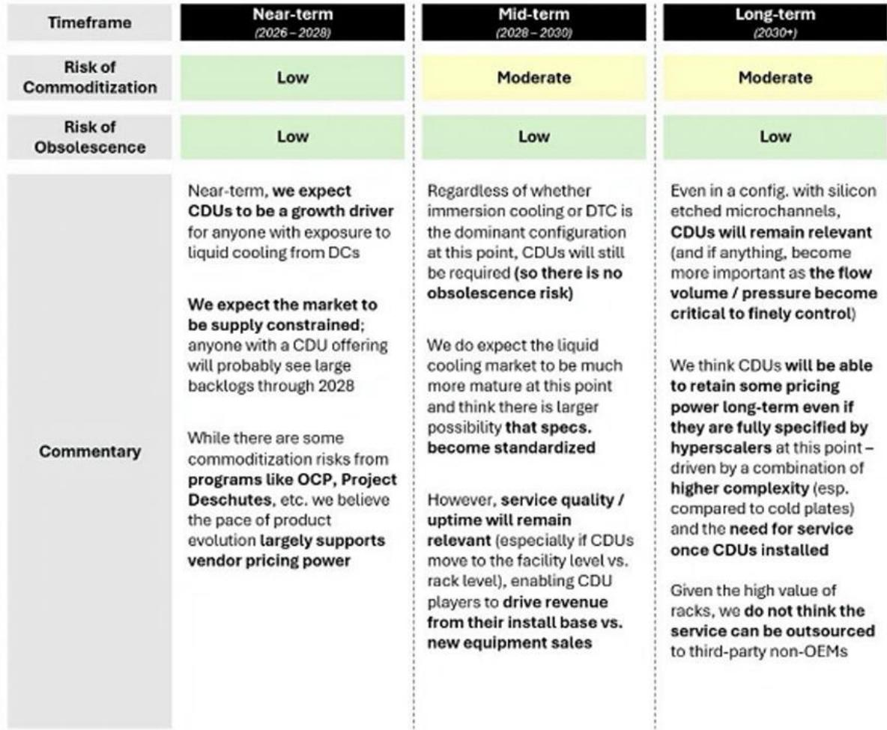

# Google’s Brazos Project Does Not Threaten the CDU Market—But It Accelerates a Critical Segmentation Between Training and Inference Cooling

The most important thing to understand about Google’s newly announced Brazos liquid-to-air CDU specification is what it is not. It is not a competing product, not a Google-manufactured unit, and not a threat to the high-end CDU manufacturers that dominate the market today. Brazos is a reference design for the Open Compute Project ecosystem, aimed squarely at enabling inference workloads in legacy data centers through simple retrofits. The specifications are deliberately modest: 60kW of cooling capacity, DC power draw from busbars, and a design philosophy that prioritizes speed of deployment over peak performance.

This matters now because the data center industry is facing a structural tension. On one side, frontier AI training demands massive, greenfield facilities with liquid-to-liquid cooling systems capable of handling 120kW+ per rack. On the other side, inference workloads—which will grow faster than training through 2030—need to be deployed at scale in existing facilities that were never designed for liquid cooling. Brazos is Google’s bet on solving the second problem without compromising the first.

The strategic implication for investors and industry participants is clear: the CDU market is not being disrupted. It is being segmented. The high-margin, technically demanding flagship CDUs used for training will retain their innovation premium. But the lower-specification inference CDU segment is now on a path toward commoditization, driven by open-source standards and hyperscaler-driven design specifications. The question is not whether this commoditization will happen, but how fast and how far it will extend.

A global investment bank report analyzing this announcement provides the analytical foundation for understanding these dynamics. The report makes clear that Brazos is part of a broader pattern of hyperscaler-driven standardization, following the earlier Deschutes project for liquid-to-liquid CDUs. But while Deschutes targeted the high end of the market with 2MW cooling capacity, Brazos targets the middle. This distinction is the key to understanding what comes next.

## The Brazos Specification Reveals a Deliberate Focus on Inference Retrofits, Not Training Leadership

The technical details of Brazos tell a story that is easy to miss if you focus only on the numbers. At 60kW of cooling capacity, Brazos-class CDUs cannot even cool a single Blackwell rack, which requires roughly 120kW. By this measure alone, Brazos appears underwhelming compared to existing products from Vertiv, nVent, Boyd, Motivair, and CoolIT, which offer L2A CDUs ranging from 70kW to 240kW.

But the specification is not aimed at competing with those products. The DC power feed is the tell. Most L2A CDUs on the market today are designed for AC power, which is standard in enterprise and colocation facilities. Brazos is designed to draw DC power directly from busbars, which is the standard in hyperscaler data centers that have already invested in DC power infrastructure. This is not a product for the general market. It is a product for hyperscalers who want to deploy inference capacity in their existing facilities without rewiring the power distribution.

The 60kW capacity also makes strategic sense when you consider the inference workload profile. Frontier training models require massive, dense compute clusters that push rack densities well beyond 100kW. Inference, by contrast, can be effectively served at lower densities, especially as hyperscalers develop purpose-built inference silicon that is more power-efficient than training hardware. If inference rack densities stabilize around 60kW or below, Brazos-class CDUs become the natural cooling solution. If densities climb higher, larger Deschutes-class CDUs will be needed instead.

The report notes that Google has not explicitly stated this inference focus, but the inference is strong. Given the well-documented challenges of bringing new data center capacity online—supply chain delays, power availability constraints, construction timelines—creating a standardized, plug-and-play cooling solution that can be retrofitted into existing facilities is a pragmatic move. It allows hyperscalers to scale inference capacity faster than greenfield builds would permit, and it does so without requiring the complex piping and chiller retrofits that liquid-to-liquid cooling demands.

## The Real Risk Is Not Disruption but Commoditization of the Inference CDU Segment

The most significant mid-term risk identified in the report is not that Google will disrupt the CDU market, but that Brazos will accelerate the commoditization of the inference CDU segment. The specifications for Brazos-class CDUs are meaningfully easier to deliver than those for Deschutes-class units. They require less engineering sophistication, lower thermal performance, and simpler system integration. This means that a wider range of manufacturers can produce compliant units, and the barriers to entry are lower.

For companies like Vertiv and nVent, which have built their liquid cooling businesses around technical excellence and high-margin service contracts, this creates a strategic challenge. They can still choose to build Brazos-compliant units and capture service revenue, but the margins on those units will be lower than on their flagship training CDUs. The service attach—the ongoing maintenance, monitoring, and support contracts that generate recurring revenue—will still be meaningful, but it will be less "moaty" because the cost of failure in an inference environment is lower than in a training environment. If a training cluster goes down, the cost is millions of dollars in lost compute time. If an inference cluster goes down, the cost is lower and the recovery is faster.

The deciding factor, as the report emphasizes, is inference rack densities. If hyperscalers' purpose-built inference silicon keeps rack densities at or below 60kW, a meaningful share of inference cooling could be served by Brazos-style L2A CDUs. This would create a large, standardized, lower-margin market. If densities rise above that threshold, the market will shift toward larger Deschutes-class CDUs, which command higher margins and stickier service contracts. The industry does not yet know which path inference densities will take, and this uncertainty is the central analytical question for CDU investors.

There is a second, subtler risk. If hyperscalers face project delays in their greenfield builds—and there is anecdotal evidence that some customers are pushing out deliveries due to lack of readiness—they may shift demand from greenfield to retrofits. Brazos creates optionality for this shift. It gives hyperscalers a standardized, OCP-compliant solution that can be deployed quickly in existing facilities. This could reduce the urgency of greenfield builds and, over time, change the mix of demand between high-margin training CDUs and lower-margin inference CDUs.

## The Report Leaves Open the Question of How Inference Rack Densities Will Evolve

This is the most important unresolved question in the analysis, and it is one that the report does not—and cannot—fully answer. The trajectory of inference rack densities depends on factors that are still being determined: the thermal design power of next-generation inference chips, the architecture choices hyperscalers make for their inference clusters, and the trade-offs between compute density and cooling simplicity.

If inference densities remain at 60kW or below, the Brazos specification becomes the de facto standard for a large portion of the inference market. This would be a net negative for high-end CDU manufacturers, because it would cap the addressable market for their premium products and push a significant volume of demand into a commoditized segment. The manufacturers would still capture revenue, but at lower margins, and the growth story would shift from volume-driven to value-driven.

If inference densities climb above 60kW, the Brazos specification becomes a niche product for legacy deployments, and the real growth in inference cooling goes to Deschutes-class CDUs or even larger systems. This would be a net positive for high-end manufacturers, because it would preserve the innovation premium and keep the inference market structurally similar to the training market.

The report also does not address the potential for a third path: that hyperscalers develop hybrid cooling architectures that combine L2A and L2L CDUs within the same facility, using L2A for lower-density inference racks and L2L for higher-density training racks. This would create a tiered cooling ecosystem that could benefit multiple manufacturers simultaneously, but it would also increase complexity and potentially reduce the standardization benefits that OCP specifications are designed to deliver.

## A Decision Framework for CDU Investors: Three Variables to Monitor

For investors and strategists evaluating the CDU space, the Brazos announcement provides a natural framework for scenario analysis. Three variables will determine the outcome, and each can be monitored with publicly available data.

First, track inference rack density announcements from hyperscalers. When Google, Microsoft, or Meta disclose the power requirements of their next-generation inference chips, that number will determine whether Brazos-class CDUs are a mainstream solution or a niche product. If the number stays at or below 60kW, the commoditization thesis gains credibility. If it rises above 100kW, the premium CDU thesis remains intact.

Second, monitor the pace of greenfield versus retrofit data center builds. The report notes that there is anecdotal evidence of project delays, but the data from capacity trackers does not yet show a clear trend. If retrofit demand accelerates relative to greenfield demand, it will signal that hyperscalers are prioritizing speed over scale, which favors Brazos-style solutions. If greenfield builds maintain their momentum, it will signal that the industry is still betting on frontier training capacity.

Third, watch the service attach rates and margins for inference CDUs versus training CDUs. If high-end manufacturers report that their inference CDU margins are compressing toward commodity levels, it will confirm that Brazos has changed the competitive dynamics. If margins hold steady, it will suggest that the innovation premium is intact even in the inference segment.

These three variables are not independent. They interact in ways that will determine the shape of the CDU market for the next five years. The report provides the analytical framework, but the data is still being generated.

## The Innovation Premium for Flagship CDUs Remains Defensible, But It Must Be Earned

The report's most reassuring conclusion for high-end CDU manufacturers is that some level of commoditization was always expected, and that the innovation premium for flagship products remains intact. This is not a new insight, but it bears repeating in the context of the Brazos announcement. The market has always known that lower-specification CDUs would eventually become standardized and price-competitive. What matters is whether the high end of the market can sustain its premium.

The answer, based on the report's analysis, is yes—but only if manufacturers continue to invest in technical excellence. The flagship CDUs used for training are not just bigger versions of inference CDUs. They require higher thermal performance, tighter temperature control, more sophisticated monitoring and telemetry, and greater reliability under continuous full-load operation. The cost of failure is higher, the engineering demands are greater, and the service requirements are more complex. These factors create a natural moat that is not easily eroded by open-source specifications.

The risk is not that Brazos will make flagship CDUs obsolete. The risk is that it will create a two-tier market in which the high end continues to command a premium, but the mid-tier becomes a commodity. This is a manageable outcome for manufacturers that are positioned at the high end, but it is a challenging outcome for manufacturers that rely on volume in the mid-tier.

## Join the community to read the full report and review the original charts

The analysis above draws on a detailed institutional research report that includes technical specifications, competitive comparisons, and capacity demand forecasts. The full report contains the original charts and data that support these conclusions, including the critical distinction between L2A and L2L cooling architectures, the comparison of Brazos specifications against existing products, and the McKinsey demand model that shows inference growing faster than training through 2030. For investors and industry professionals who want to make informed decisions about the CDU ecosystem, the full report is essential reading.

*This article is for learning and discussion only and does not constitute investment advice.*

Personal reading notes and learning share only. Not investment advice.

