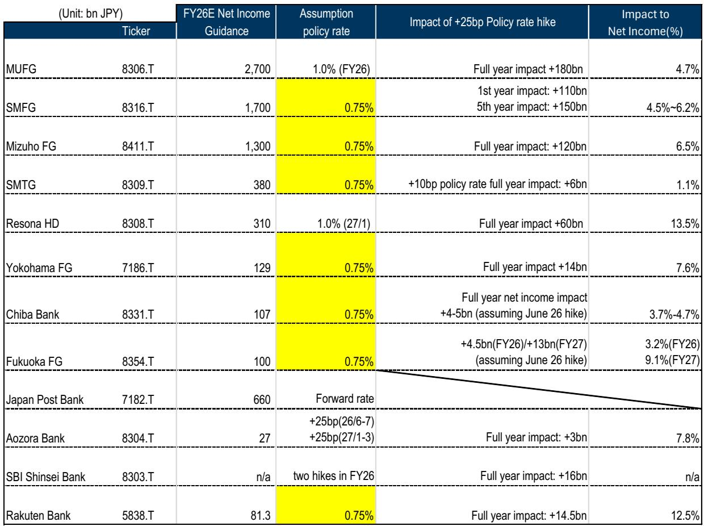
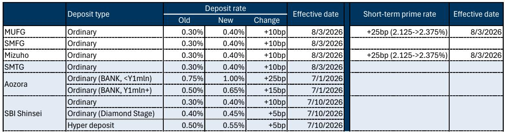
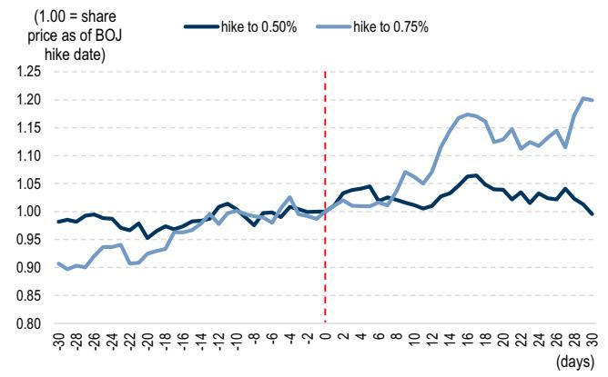

# Japan's Rate Hike Cycle Has Entered a New Phase: Bank Stocks Are Priced for 1.0% But the Market Is Now Discounting a Path Beyond

The Bank of Japan's decision to raise the policy rate to 1.0% at its June Monetary Policy Meeting marks more than just another incremental step in normalization. It signals a structural shift in how the entire Japanese banking sector's earnings power should be evaluated. For investors who have followed Japanese bank stocks through the past two years of rate normalization, the question is no longer whether banks can benefit from higher rates, but whether current valuations have already priced in the full cycle.

The data from the immediate aftermath of this decision provides a clear answer: they have not. When MUFG raised its ordinary deposit rate by 10 basis points to 0.40% and its short-term prime rate by 25 basis points, it kept the deposit beta at 40% relative to the policy rate, exactly in line with market expectations. SMFG and Mizuho followed with identical moves. This consistency matters more than the specific numbers. It tells us that the mechanism through which banks convert higher policy rates into net interest income is functioning predictably, and that predictability itself is a source of upside for share prices.

What makes this moment different from previous rate hikes in the cycle is the combination of three factors that have not coexisted before: a policy rate that has reached a round number with psychological significance, a bank sector that has demonstrated its ability to manage deposit costs, and a market positioning that remains lighter than the fundamental outlook warrants. The pattern observed after the December 2025 rate hike, where bank shares experienced a sustained re-rating following a period of geopolitical uncertainty, is likely to repeat, but with greater magnitude this time.

## The Majority of Banks Have Guidance That Assumes a Lower Policy Rate Than the Current Level, Creating a Mechanical Path to Earnings Revisions

The most immediate and concrete implication of the BOJ's move is that the policy rate now sits at 1.0%, while the majority of banks in coverage built their FY3/27 guidance on assumptions of 0.75%. This gap is not a subtle difference in modeling preferences. It represents a structural understatement of earnings power that must be corrected as banks update their guidance in the coming quarters.

Consider the distribution. MUFG stands out as the exception, having already assumed a 1.0% policy rate for FY26, which explains why its net income guidance of 2.7 trillion yen is the most conservative relative to potential upside. But SMFG, Mizuho, SMTG, Yokohama FG, Chiba Bank, Fukuoka FG, and Rakuten Bank all built their current guidance on a 0.75% assumption. Resona HD assumed 1.0% but only for the second half of its fiscal year. The gap between what is assumed and what is now reality creates a mechanical earnings uplift that does not require any improvement in loan demand, any reduction in credit costs, or any strategic initiative from management.

The sensitivity analysis provided by Yokohama FG is instructive. In addition to its previous disclosure of a 3 billion yen post-tax impact for FY3/27, the bank released new material showing that the rate hike adds approximately 14 billion yen pre-tax, or roughly 10 billion yen post-tax, to FY3/28 net revenue, translating to a 0.7% ROE improvement. This is not a one-time benefit. It is a recurring earnings uplift that compounds as the higher rate base persists through the fiscal year.

The question investors should ask is not whether banks will revise up their guidance, but how much of the potential upside they will choose to disclose at once versus phase in gradually. Banks have an incentive to manage expectations conservatively, but the magnitude of the gap between assumed and actual rates makes full conservatism difficult to sustain.

## Deposit Beta Discipline Has Become the Most Important Variable for Earnings Visibility, and the Data So Far Supports the Bull Case

The most persistent source of skepticism about Japanese bank stocks during the rate normalization cycle has been the fear that deposit costs would rise faster than lending yields, compressing net interest margins. This fear is rational in theory but has been consistently disproven by the data, and the latest round of deposit rate announcements provides the strongest evidence yet that the pattern is structural rather than coincidental.

MUFG's decision to raise ordinary deposit rates by 10 basis points against a 25 basis point policy rate hike maintains a deposit beta of 40%, which has become the industry standard. Aozora Bank took a more aggressive approach, hiking deposit rates by 25 basis points for deposits below 1 million yen, while SBI Shinsei Bank kept its deposit beta contained by raising ordinary rates by only 10 basis points and limiting the increase on its premium deposit products to 5 basis points.

This variation across institutions is healthy. It demonstrates that banks are making strategic choices about deposit pricing rather than mechanically passing through rate increases. The fact that the largest banks have converged on a 40% beta suggests that this is not a temporary equilibrium but a deliberate pricing strategy that balances customer retention against margin preservation.

The strategic implication is straightforward. If deposit betas remain in the 35-45% range through the next 100 basis points of rate hikes, the earnings sensitivity of Japanese banks to further BOJ tightening will be significantly higher than the market currently prices. The sensitivity analysis in the report shows that a 25 basis point hike generates net income impacts ranging from 1.1% for SMTG to 13.5% for Resona HD. These are not marginal effects. They are material enough to drive double-digit earnings surprises for several institutions.

## The Market's Positioning Is Historically Light Ahead of Rate Hikes, and the Post-Hike Re-Rating Pattern Has Been Consistent and Powerful

The behavioral pattern around Japanese rate hike events has been remarkably consistent across the past two tightening cycles, and it argues strongly for a near-term re-rating of bank stocks. The data on TOPIX Banks share price performance in the 30 days before and after previous rate hikes reveals a clear asymmetry.

In the 30 days leading up to the hike to 0.50%, bank shares declined by approximately 1%. In the 30 days following the hike, they recovered to roughly flat. The pattern around the hike to 0.75% was far more dramatic. Shares declined by approximately 10% in the 30 days before the hike, only to surge by approximately 20% in the 30 days following it. The pre-hike weakness was driven by tariff uncertainty and geopolitical concerns, not by any deterioration in bank fundamentals.

The current environment mirrors the pre-December 2025 conditions. Middle East uncertainty has weighed on risk appetite, and market positioning in bank stocks has been relatively light. The combination of a confirmed rate hike cycle, a manageable deposit beta environment, and light positioning creates a setup that has historically led to significant outperformance.

The mechanism driving this pattern is not complicated. Bank stocks are sensitive to rate expectations, but that sensitivity is asymmetric. When rates are expected to rise but uncertainty about the timing and magnitude of hikes creates hesitation, positioning tends to be conservative. Once the hike is delivered and the BOJ's forward guidance confirms the continuation of the cycle, the uncertainty premium collapses and positioning normalizes. This normalization, combined with the mechanical earnings uplift from higher rates, drives the re-rating.

## The Report Raises a Critical Question That Remains Unanswered: What Policy Rate Are Bank Stocks Actually Pricing In?

The most analytically challenging question that emerges from this report is the relationship between current valuations and the policy rate path that is implicitly discounted. The report notes that bank stocks' price-to-book ratios currently price in a policy rate of approximately 0.75-1.0%, based on banks' midterm plan ROE targets and cost of capital.

This is a useful starting point, but it leaves several important questions unresolved. First, the range of 0.75-1.0% is wide enough to encompass very different earnings outcomes. A bank priced for 0.75% that experiences a 1.0% rate environment will see significant upside, but a bank priced for 1.0% that experiences a 1.25% environment will see even more. The question is not just where rates are today, but where the market expects them to be in two years.

Second, the relationship between policy rates and bank valuations is not linear. As rates rise, the marginal impact on net interest income changes because the composition of the balance sheet shifts. Loan growth may accelerate, deposit migration may accelerate, and the competitive dynamics for both assets and liabilities may change. The simple sensitivity analysis that works for a 25 basis point move may not hold for a 100 basis point move.

Third, the report's analysis of deposit betas is based on the current cycle, but the cycle is still young. If Japan's normalization continues toward 1.5% or 2.0%, deposit betas may rise as customers become more rate-sensitive and competition for deposits intensifies. The 40% beta that has held so far is not guaranteed to persist.

These unanswered questions do not invalidate the bull case for Japanese bank stocks. They simply mean that investors need to be more precise about which banks will benefit most under different rate scenarios, and they need to monitor deposit beta trends as a leading indicator of any change in the earnings sensitivity profile.

## A Decision Framework for Investors: Three Questions That Determine Whether You Are Correctly Positioned

For investors considering whether to add or reduce exposure to Japanese bank stocks following this rate hike, the analytical challenge is to distinguish between the factors that are already priced in and the factors that still offer upside. The following framework organizes the key variables into three questions that should drive the investment decision.

First, what is your view on the terminal policy rate? If you believe the BOJ will stop at 1.0% or below, then the current valuation range of 0.75-1.0% suggests limited upside. The banks that assumed 0.75% will revise up to 1.0%, but that revision is already partially discounted. If you believe the BOJ will continue to 1.25% or higher, then the current valuations are too low, and the earnings revisions will be larger and more sustained than the market expects.

Second, what is your view on deposit beta stability? If you believe that 40% is a structural equilibrium that will hold through the cycle, then the earnings sensitivity of banks to further rate hikes is high and predictable. If you believe that deposit betas will rise toward 50-60% as rates increase, then the net interest income benefit of further hikes will be lower, and the banks with the most rate-sensitive deposit bases will underperform.

Third, what is your view on the timing of the next hike? The BOJ's communication has been consistent in signaling that the pace of normalization will be gradual and data-dependent. If the next hike comes sooner than the market expects, the re-rating of bank stocks will accelerate. If the next hike is delayed by economic weakness or financial stability concerns, the re-rating will be more gradual but the fundamental earnings case will remain intact.

These three questions cannot be answered with certainty, but they provide a structured way to evaluate the risk-reward of Japanese bank stocks. Investors who are bullish on the terminal rate, confident in deposit beta stability, and expect continued normalization will find the current valuations attractive. Investors who are more cautious on any of these dimensions should focus on the banks with the most conservative guidance and the lowest sensitivity to further rate increases.

## Join the Community to Read the Full Report and Review the Original Charts

The analysis presented here draws on the detailed data and sensitivity analysis contained in the original research report, including the comprehensive table of coverage banks' guidance, policy rate assumptions, and stated profit impacts of rate hikes, as well as the historical share price performance patterns around previous BOJ decisions. These exhibits provide the empirical foundation for the arguments made in this article, and they contain additional nuances that could not be fully explored within this format.

Investors who want to make informed decisions about Japanese bank stocks need access to the full dataset, including the specific profit sensitivity for each institution under different rate scenarios, the deposit beta calculations for each bank, and the historical trading patterns that inform the positioning analysis. The original report also includes detailed disclosures and methodological notes that are essential for understanding how the sensitivity estimates were constructed.

Join the community to read the full report and review the original charts.

*This article is for learning and discussion only and does not constitute investment advice.*

Personal reading notes and learning share only. Not investment advice.

