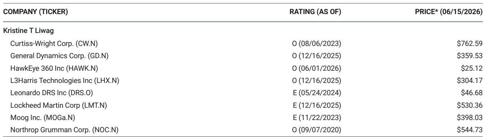

# 摩根斯坦利：国防产业正经历一场“去空心化”的结构性重塑，而非简单的周期上行

国防产业的拐点，往往不是由军费预算的增减来定义的。真正值得关注的信号，是资本结构、技术扩散路径和产业组织形态同时发生系统性变化。摩根斯坦利在其首届国家安全创新峰会的总结报告中，捕捉到了这样一个时刻。这份报告的核心判断并非“国防开支在增长”，而是：美国国防产业正在经历一场从“冷战后的空心化”向“新中层的重建”的深层转型。驱动这一转型的，不是单一的政策指令，而是资本、技术和地缘竞争三重力量在供给侧的协同作用。对于关注这一领域的投资者和决策者而言，理解这场结构性重塑，远比追逐季度订单数字更为关键。

## 1. 冷战后的“和平红利”正在逆转，产业空心化催生了新中层的崛起

冷战结束后，美国国防产业经历了一轮大规模的整合浪潮。其直接后果是，中型国防企业（Mid-tier Defense Assets）被大量兼并或消失，产业格局呈现出“两头大、中间小”的哑铃型结构：一端是少数几家巨头（如洛克希德·马丁、诺斯罗普·格鲁曼），另一端是大量小而专的技术初创公司。摩根斯坦利指出，这种“空心化”在相当长一段时间内制约了产业的灵活性和创新效率。而现在，随着大国竞争回归，国防需求从“维持存量”转向“快速迭代与规模化生产”，这种结构性缺陷变得不可持续。

报告揭示了两股力量正在共同“填补”这个中空地带。其一是国防硬件的商业化。许多原本仅用于军事领域的传感器、通信和动力技术，开始在商业市场找到应用场景，这降低了单一客户依赖风险，也吸引了更广泛的资本。其二是风险资本的介入。传统上，国防领域因其长周期、高门槛和客户单一性，对风险资本缺乏吸引力。但现在，一批愿意承担早期技术和市场风险的“颠覆性资本”正在涌入，它们不追求短期回报，而是押注于能够定义未来作战范式的平台级公司。这两股力量的汇合，正在催生一个全新的国防产业“中层”。这个新中层的公司，既不是巨头，也不是作坊，而是具备规模化生产能力和技术领导力的“新精锐”（Neoprimes）。这不仅仅是产业结构的调整，更意味着估值逻辑的迁移：当国防投资者基础从行业专家向成长型投资者扩展时，那些能够证明“品类领导者”地位和可扩展生产能力的公司，将获得更接近高增长科技公司的估值倍数。

## 2. 从“技术优越性”到“工业韧性”：生产能力本身已成为战略资产

摩根斯坦利在多个专题讨论中反复强调一个观点：在当代冲突中，工业韧性（Industrial Resilience）的重要性正在超越单纯的技术优越性。乌克兰冲突已经提供了一个清晰的案例——能够快速、低成本、大规模生产武器的能力，与拥有最先进的武器系统同样重要。这意味着，国防制造商的竞争优势来源正在发生根本性转移。

报告明确指出，下一代国防制造商的差异化优势，将不再主要来自产品层面的创新，而是来自“压缩资格认证、产品认证和生产周期”的能力。过去，国防采购流程以“定制化”为核心，每个项目都有独特的需求和漫长的认证流程，这天然地与规模化生产相矛盾。而现在，面对快速演变的威胁环境，适应性和速度成为新的评价标准。那些能够将“工厂”本身打造成一个敏捷、可复用的战略资产的公司，将获得更大的市场份额。这个判断对投资者的含义是：评估一家国防企业时，其工厂的柔性、供应链的纵深以及压缩生产周期的能力，可能比其最新武器的技术参数更具长期价值。同时，这也在政策层面提出了一个尖锐的问题：美国五角大楼基于一年预算周期且频繁出现持续决议（CR）的拨款模式，是否能够与这种对长期、稳定、可预测生产环境的需求相匹配？报告认为，政治层面的解决方案是解锁多年度采购路径、为产业提供必要可见性的关键前提。

## 3. 战场优势的“软件化”与“组织化”，正在重塑竞争格局

报告中关于“AI赋能的战场”和“战场自主性”的讨论，揭示了一个远比“无人机取代有人战机”更深刻的趋势。摩根斯坦利认为，自主性本身并非新概念，真正的新变化在于其“规模化扩散”——自主性正从少数“精尖系统”向“高产量、低成本系统”普及。但这只是表象。更深层的变革在于，战场优势正在从“独立的硬件平台”转向“集成的硬件/软件架构”。

随着无人系统、传感器和数据节点的大规模部署，一个关键的瓶颈出现了：如何协调这些数量庞大、来源各异的单元？报告指出，“无人系统生态的碎片化”正在为“编排层”（Orchestration Layer）创造巨大机会。这类公司不直接生产硬件，而是提供能够实现互操作性、供应链协同和生产可视化的软件层。它们将成为新战场生态的“操作系统”。同样引人深思的是，在“太空情报”和“情报融合”领域，摩根斯坦利观察到，限制因素越来越不是技术能力，而是“组织效率”。未来价值创造可能更多流向那些能够简化数据访问和决策工作流的公司，而非仅仅是改进收集硬件的公司。这意味着，在国防科技投资中，软件定义、平台化思维和组织设计能力，其重要性正在超越传统的硬件工程能力。

## 4. 报告尚未完全回答的关键问题：新中层的可持续性与“去耦合”的现实成本

摩根斯坦利的这份报告提供了一个极具洞察力的顶层框架，但它也留下了一些悬而未决的关键问题，值得深度探讨。首先，新国防“中层”的可持续性如何？这些“新精锐”公司能否在维持技术创新的同时，应对国防采购固有的官僚主义和长周期？它们是否会重蹈过去“和平红利”时期中型公司的覆辙，在下一轮整合中被巨头收购，从而再次导致产业空心化？报告提到了“专业化与去整合”的潜力，但这需要资本市场的持续耐心和国防部采购流程的实质性改革，两者都充满不确定性。

其次，“关键供应链”部分提到的“去耦合”（Decoupling）策略，其现实成本和时间表被严重低估。报告指出，对手正在“武器化”其供应链，这催生了国内采购的新机会，尤其是在稀土、磁体和铀矿领域。然而，重建一个完全独立、具备成本竞争力的国内供应链，尤其是在稀土加工等环节，需要巨大的资本投入、漫长的许可流程和技术积累。公共部门的资金可以吸收早期风险，但最终能否形成可持续的商业闭环，仍是未知数。报告明确指出“国内铀矿开采正从长期休眠转向冲刺”，但“许可、设备前置时间和法规”需要同步跟上。这种“供给侧”的瓶颈，可能成为未来几年国防产业扩张的最大制约因素，而非需求端。

## 5. 投资者的观察框架：从“看产品”转向“看系统、看流程、看资本结构”

基于摩根斯坦利的这份报告，可以提炼出一个更为实用的观察框架，帮助投资者穿透短期的噪音，识别出真正具备长期结构性优势的公司。第一，关注“工业韧性”而非“技术奇点”。评估一家公司时，不仅要看其产品是否先进，更要看其生产流程的敏捷性、供应链的纵深以及应对需求波动的能力。那些能够压缩认证和生产周期的公司，其护城河可能比拥有单一技术专利的公司更深。第二，关注“编排层”和“组织效率”的提供者。在硬件趋于同质化、数据爆炸的时代，能够解决“碎片化”问题、提供统一协调平台的公司，将占据价值链的高端。这既包括软件公司，也包括那些能够优化内部决策流程、实现跨系统互操作的硬件集成商。第三，关注资本结构的变化。当“颠覆性资本”涌入国防领域，传统的估值模型正在被打破。投资者需要区分哪些公司是受益于行业“β”（整体预算增长），哪些公司拥有独特的“α”——即能够吸引成长型资本、并利用这种资本加速规模化生产和技术迭代的能力。最后，也是最容易被忽略的，是关注“组织能力”。正如报告在情报融合部分所暗示的，未来的价值创造越来越依赖于“如何组织”而非“拥有什么”。一家国防企业的组织架构、人才结构以及它与五角大楼和资本市场的互动方式，将成为其核心竞争力的重要组成部分。

---

摩根斯坦利的这份报告，为理解国防产业的深层变革提供了一个难得的全景视角。它清晰地指出，我们正处在一个“和平红利”消退、新产业格局重构的转折点。但正如报告所暗示的，这个新格局的最终形态，取决于资本、技术与官僚体系之间复杂的博弈。哪些新精锐能真正成长为新的支柱？哪些供应链瓶颈会意外地成为“阿喀琉斯之踵”？软件定义的时代将如何重塑国防巨头的估值逻辑？这些问题在报告中有线索，但远未给出最终答案。

欢迎来到我们的知识星球和微信群，与数百位产业决策者、专业投资者一起，继续拆解这份报告的完整图表、数据细节，并围绕这些未解的问题展开深度讨论。

Personal reading notes and learning share only. Not investment advice.

