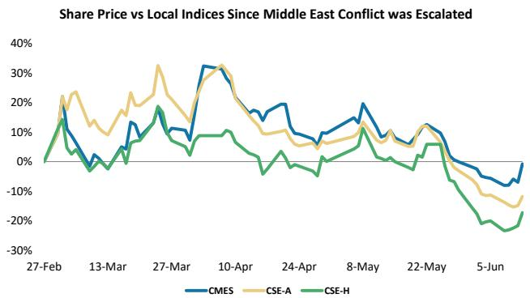
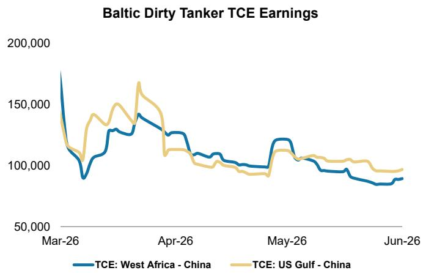
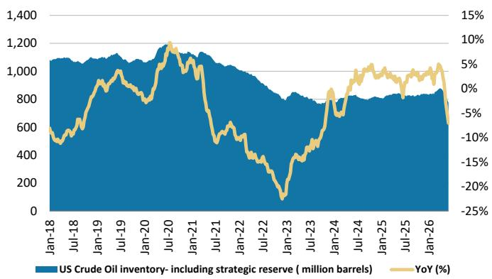
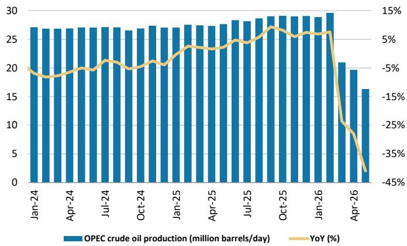
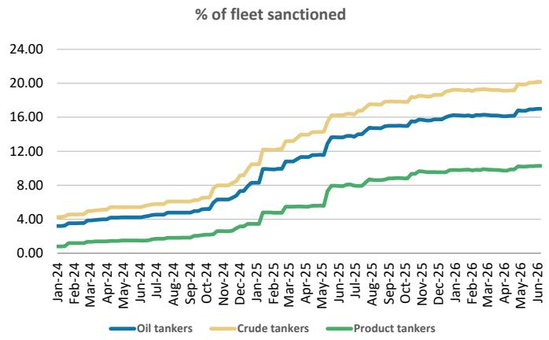
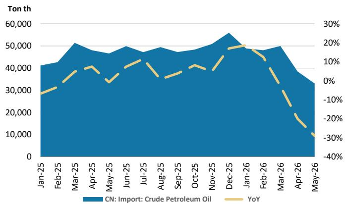
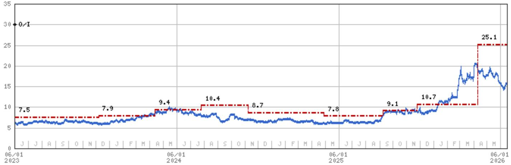
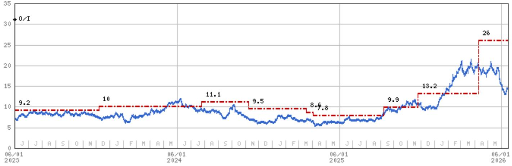

## Tanker Shipping | Asia Pacific

# Beneficiary of Strait Reopening; Reiterate Bullish Views

We answer the market's key questions and pushback on our tanker shipping call, and preview tanker names' 2Q26 earnings.

## Key Takeaways

We see a potential spot rally if the Strait reopening materializes. Spot rates will likely stay elevated for months amid potential global oil re-stocking.  
We expect CMES will deliver strong 2Q26 earnings. CSE's 2Q26 earnings will likely be relatively soft vs. CMES, but it is in the price.

A reverse of market pessimism in the past three weeks: Tanker shipping names' share prices underperformed market indexes by 17-27ppts during May 21 and Jun 11, 2026, mainly on the market's disappointment that the Strait of Hormuz had remained closed for longer than expected. As global oil reserves have been running lower, the market was worried that oil shipment demand would decrease (Exhibit 6), leading to tanker shipping oversupply, weighing on spot rates (Exhibit 2). Now, that expectation is reversed with the potential reopening of the Strait.

What will happen if the Strait reopens? Spot rates will hike, supporting tanker sentiment – we would expect to see: 1) a potential surge in oil shipment demand – importers would likely see strong willingness to rebuild inventory, while exporters would need to release their storage in the Gulf; and 2) a potential shortage of tanker capacity in Middle East – some tankers have sailed to the Atlantic market. We are not worried about the current capacity in the Gulf – tankers currently in the Gulf are laden and will not become available capacity anytime soon.

## Will the spot rally fade quickly after the initial surge post the Strait's reopening?

We would expect high spot rate volatility after the reopening. However, equilibrium rate levels beyond the initial volatility are more important. We focus on two moving factors in the next 3-6 months: 1) global oil storage build – we think this will last for a few quarters, if not longer; and 2) whether sanctions on Iranian oil are removed. Either could act as potential demand support and lead to sustained strong earnings.

2Q26 preview: We expect an earnings increase of over 50% QoQ for China Merchant Energy Shipping in 2Q26, driven by the post disruption VLCC spot market surge in March 2026, as well as the strengthened dry bulk shipping market. For COSCO SHIPPING Energy Transportation, we only expect a minor QoQ increase in total profit, considering: 1) Effective rates dilution from vessels trapped in the Arabian Gulf since March 2026; 2) softened international product oil shipping amid the shortage in product oil exports from the Middle East; and 3) slowed China crude imports, which drag on domestic oil profits.

Downside risks to our call: The Strait's reopening fails to materialize.

MS ASIA LIMITED+

## Qianlei Fan, CFA

Equity Analyst

Qianlei.Fan@morganstanley.com +852 2239-1875

## Evan Chen

Research Associate

Evan.Chen@morganstanley.com +852 2848-7317

## Tenny Song

Equity Analyst

Tenny.Song@morganstanley.com +852 3963-1737

## Asia Summer School 2026

## HONG KONG/CHINA TRANSPORTATION & INFRASTRUCTURE

Asia Pacific

Industry View

In-Line

Also read:

Our positive RTIs on CSE-H, CSE-A and CMES

Shipping: Geopolitics Playbook: Middle East Tension in Focus (9 Apr 2026)

Asia Energy Security and AI: Energy Meets

Compute: Supercycle Recharges (21 May 2026)

This report references jurisdiction(s) or person(s) which may be the subject of economic sanctions. Readers are solely responsible for ensuring that their investment activities are carried out in compliance with applicable laws.

MS does and seeks to do business with companies covered in MS. As a result, investors should be aware that the firm may have a conflict of interest that could affect the objectivity of MS. Investors should consider MS as only a single factor in making their investment decision.

## For analyst certification and other important disclosures, refer to the Disclosure Section, located at the end of this report.

+= Analysts employed by non-U.S. affiliates are not registered with FINRA, may not be associated persons of the member and may not be subject to FINRA restrictions on communications with a subject company, public appearances and trading securities held by a research analyst account.

Preview to earnings

<table><tr><td>Focus KPI</td><td>Focus KPI Surprise</td><td>Likely impact to consensus EPS*</td></tr><tr><td colspan="3">COSCO SHIPPING Energy Transportation 1138.HK</td></tr><tr><td>2Q26 net profit</td><td>– In-line</td><td>– Largely unchanged</td></tr><tr><td colspan="3">• We expect Rmb2.2bn net profit in 2Q26.</td></tr><tr><td colspan="3">• We see limited downside to our full-year forecasts amid the potential reopening of the Strait.</td></tr><tr><td colspan="3">COSCO SHIPPING Energy Transportation 600026.SS</td></tr><tr><td>2Q26 net profit</td><td>– In-line</td><td>– Largely unchanged</td></tr><tr><td colspan="3">• We expect Rmb2.2bn net profit in 2Q26.</td></tr><tr><td colspan="3">• We see limited downside to our full-year forecasts amid the potential reopening of the Strait.</td></tr></table>

China Merchants Energy Shipping Co. Ltd. 601872.SS

<table><tr><td>2Q26 net profit</td><td>↑ Very likely upside surprise</td><td>↑ Modest revision higher</td></tr><tr><td colspan="3">• We expect Rmb4.2bn net profit in 2Q26.</td></tr></table>

\*Likely impact to consensus EPS is for the next 12 months  
Source: Company data, MS

## Key Charts

Exhibit 1: Relative share performance: Tankers  

line chart

| Date     | CMES  | CSE-A | CSE-H |
| -------- | ----- | ----- | ----- |
| 27-Feb   | 15%   | 20%   | 10%   |
| 13-Mar   | 5%    | 10%   | 0%    |
| 27-Mar   | 10%   | 30%   | 15%   |
| 10-Apr   | 30%   | 30%   | 10%   |
| 24-Apr   | 15%   | 10%   | 0%    |
| 8-May    | 20%   | 10%   | 10%   |
| 22-May   | 10%   | 10%   | 5%    |
| 5-Jun    | -10%  | -15%  | -20%  |

Source: Factset, MS

Exhibit 2: Tanker Spot Earnings have corrected mildly since May 2026  

line chart

| Date   | TCE: West Africa - China | TCE: US Gulf - China |
|--------|--------------------------|----------------------|
| Mar-26 | ~180,000                 | ~170,000             |
| Apr-26 | ~130,000                 | ~150,000             |
| May-26 | ~120,000                 | ~110,000             |
| Jun-26 | ~90,000                  | ~95,000              |

Source: Clarksons, MS

Exhibit 3: US oil inventory (including SPR)  

line chart

| Date   | US Crude Oil inventory (million barrels) | YoY (%) |
|--------|-------------------------------------------|---------|
| Jan-18 | ~1,050                                    | ~-10%   |
| Jul-18 | ~1,050                                    | ~-5%    |
| Jan-19 | ~1,050                                    | ~0%     |
| Jul-19 | ~1,050                                    | ~5%     |
| Jan-20 | ~1,050                                    | ~10%    |
| Jul-20 | ~1,200                                    | ~15%    |
| Jan-21 | ~1,150                                    | ~5%     |
| Jul-21 | ~1,050                                    | ~0%     |
| Jan-22 | ~900                                      | ~-10%   |
| Jul-22 | ~700                                      | ~-15%   |
| Jan-23 | ~600                                      | ~-20%   |
| Jul-23 | ~700                                      | ~-5%    |
| Jan-24 | ~800                                      | ~0%     |
| Jul-24 | ~850                                      | ~5%     |
| Jan-25 | ~850                                      | ~5%     |
| Jul-25 | ~850                                      | ~5%     |
| Jan-26 | ~900                                      | ~5%     |

Source: Bloomberg, MS

Exhibit 4: OPEC crude oil production  

bar-line hybrid chart

| Month   | OPEC crude oil production (million barrels/day) | YoY (%) |
|---------|--------------------------------------------------|---------|
| Jan-24  | 27                                               | -5      |
| Apr-24  | 27                                               | -5      |
| Jul-24  | 27                                               | -5      |
| Oct-24  | 27                                               | -5      |
| Jan-25  | 27                                               | -5      |
| Apr-25  | 28                                               | -5      |
| Jul-25  | 29                                               | -5      |
| Oct-25  | 30                                               | -5      |
| Jan-26  | 30                                               | -5      |
| Apr-26  | 16                                               | -45     |

Source: Bloomberg, MS

Exhibit 5: 20% of crude tankers are "sanctioned", 24% of global tankers are "non-compliant"  

line chart

| Month    | Oil tankers | Crude tankers | Product tankers |
| -------- | ----------- | ------------- | --------------- |
| Jan-24   | 3.5         | 4.0           | 1.0             |
| Feb-24   | 3.8         | 4.2           | 1.2             |
| Mar-24   | 4.0         | 4.5           | 1.5             |
| Apr-24   | 4.2         | 4.8           | 1.8             |
| May-24   | 4.5         | 5.0           | 2.0             |
| Jun-24   | 4.8         | 5.2           | 2.2             |
| Jul-24   | 5.0         | 5.5           | 2.5             |
| Aug-24   | 5.2         | 5.8           | 2.8             |
| Sep-24   | 5.5         | 6.0           | 3.0             |
| Oct-24   | 6.0         | 7.0           | 3.5             |
| Nov-24   | 7.0         | 8.0           | 4.0             |
| Dec-24   | 8.0         | 9.0           | 4.5             |
| Jan-25   | 9.0         | 10.0          | 5.0             |
| Feb-25   | 10.0        | 11.0          | 5.5             |
| Mar-25   | 11.0        | 12.0          | 6.0             |
| Apr-25   | 12.0        | 13.0          | 6.5             |
| May-25   | 13.0        | 14.0          | 7.0             |
| Jun-25   | 14.0        | 15.0          | 7.5             |
| Jul-25   | 15.0        | 16.0          | 8.0             |
| Aug-25   | 15.5        | 16.5          | 8.5             |
| Sep-25   | 16.0        | 17.0          | 9.0             |
| Oct-25   | 16.5        | 17.5          | 9.5             |
| Nov-25   | 17.0        | 18.0          | 10.0            |
| Dec-25   | 17.5        | 18.5          | 10.5            |
| Jan-26   | 18.0        | 19.0          | 11.0            |
| Feb-26   | 18.5        | 19.5          | 11.5            |
| Mar-26   | 19.0        | 20.0          | 12.0            |
| Apr-26   | 19.5        | 20.5          | 12.5            |
| May-26   | 20.0        | 21.0          | 13.0            |
| Jun-26   | 20.5        | 21.5          | 13.5            |

Source: Clarkson, MS

Exhibit 6: China crude imports have been decreasing since April 2026  

bar-line hybrid chart

| Month   | CN: Import: Crude Petroleum Oil (Ton th) | YoY    |
|---------|------------------------------------------|--------|
| Jan-25  | ~40,000                                  | ~0%    |
| Feb-25  | ~42,000                                  | ~5%    |
| Mar-25  | ~50,000                                  | ~10%   |
| Apr-25  | ~48,000                                  | ~5%    |
| May-25  | ~47,000                                  | ~0%    |
| Jun-25  | ~49,000                                  | ~5%    |
| Jul-25  | ~48,000                                  | ~10%   |
| Aug-25  | ~49,000                                  | ~5%    |
| Sep-25  | ~48,000                                  | ~0%    |
| Oct-25  | ~49,000                                  | ~5%    |
| Nov-25  | ~50,000                                  | ~10%   |
| Dec-25  | ~55,000                                  | ~15%   |
| Jan-26  | ~50,000                                  | ~15%   |
| Feb-26  | ~48,000                                  | ~10%   |
| Mar-26  | ~49,000                                  | ~5%    |
| Apr-26  | ~38,000                                  | ~-15%  |
| May-26  | ~32,000                                  | ~-30%  |

Source: CEIC, MS

## Valuation Methodology and Risks

## COSCO SHIPPING Energy Transportation (1138.HK)

Price/book, probability-weighted 25% bull, 60% base, 15% bear. The more positive skew toward our bull case reflects VLCC's tight supply, more sanctions on the "dark fleet," and continuous OPEC+ production hikes.

Target 2027e P/B multiples:

Base - 1.9x (3.5x SD above historical mean since 2009)

Bull - 3.8x (9.1x SD above historical mean since 2009)

Bear - 1.0x (0.8x SD above historical mean since 2009)

## Risks to Upside

■ More crude oil shipping demand thanks to Hormuz reopening, or potential future licensing, or removal of sanctions on Iranian oil exports.  
■ Longer shipment distances  
■ More scrapping of aged vessels

## Risks to Downside

■ Weaker global economy leading to lower crude demand  
■ Lower-than-expected crude oil output from OPEC  
■ The return of shadow fleets

## COSCO SHIPPING Energy Transportation (600026.SS)

Price/book, probability-weighted 25% bull, 60% base, 15% bear. The more positive skew toward our bull cases reflects VLCC's tight supply, more sanctions on the "dark fleet," and continuous OPEC+ production hikes.

Target P/B multiples: 5.6x bull, 2.5x base, 1.2x bear (9.1x SD above, 2.7x SD above, and largely equivalent to historical mean since 2009)

Target A/H premiums: 45% bull, 30% base, 15% bear.

## Risks to Upside

■ More crude oil shipping demand thanks to Hormuz reopening, or potential future licensing, or removal of sanctions on Iranian oil exports.  
■ Longer shipment distances  
■ More scrapping of aged vessels

## Risks to Downside

■ Weaker global economy leading to lower crude demand  
■ Lower-than-expected crude oil output  
■ Compression of A-H premium

## China Merchants Energy Shipping Co. Ltd. (601872.SS)

Price/book, probability-weighted 25% bull, 60% base, 15% bear. The more positive skew toward our bull cases reflects VLCC's tight supply, more sanctions on the "dark fleet," and OPEC+ production hikes, despite downside risks from containers.

Target 2027e P/B multiples:

Base - 3.2x, 2.7SD above historical mean since 2009

Bull - 6.3x, 7.8SD above historical mean since 2009

Bear - 1.6x, 0.1SD above historical mean since 2009

## Risks to Upside

■ More crude oil shipping demand thanks to Hormuz reopening, or potential future licensing, or removal of sanctions on Iranian oil exports.  
■ Longer shipment distance for crude and dry bulks  
■ Potential OPEC+ production increase

## Risks to Downside

■ Weaker global economy leading to lower crude demand  
■ Lower-than-expected crude oil output from OPEC  
■ Weaker than expected infrastructure demand in China

## Disclosure Section

The information and opinions in MS were prepared or are disseminated by MS Asia Limited (which accepts the responsibility for its contents) and/or MS Asia (Singapore) Pte. (Registration number 199206298Z) and/or MS Asia (Singapore) Securities Pte Ltd (Registration number 200008434H), regulated by the Monetary Authority of Singapore (which accepts legal responsibility for its contents and should be contacted with respect to any matters arising from, or in connection with, MS), and/or MS Taiwan Limited and/or MS & Co International plc, Seoul Branch, and/or MS Australia Limited (A.B.N. 67 003 734 576, holder of Australian financial services license No. 233742, which accepts responsibility for its contents), and/or MS Wealth Management Australia Pty Ltd (A.B.N. 19 009 145 555, holder of Australian financial services license No. 240813, which accepts responsibility for its contents), and/or MS India Company Private Limited having Corporate Identification No (CIN) U22990MH1998PTC115305, regulated by the Securities and Exchange Board of India ("SEBI") and holder of licenses as a Research Analyst (SEBI Registration No. INH000001105); Stock Broker (SEBI Stock Broker Registration No. INZ000244438), Merchant Banker (SEBI Registration No. INM000011203), and depository participant with National Securities Depository Limited (SEBI Registration No. IN-DP-NSDL-567-2021) having registered office at Altimus, Level 39 & 40, Pandurang Budhkar Marg, Worli, Mumbai 400018, India; Telephone no. +91-22-61181000; Compliance Officer Details: Mr. Tejarshi Hardas, Tel. No.: +91-22-61181000 or Email: tejarshi.hardas@morganstanley.com; Grievance officer details: Mr. Tejarshi Hardas, Tel. No.: +91-22-61181000 or Email: msic-compliance@morganstanley.com which accepts the responsibility for its contents and should be contacted with respect to any matters arising from, or in connection with, MS, and their affiliates (collectively, "MS"). MS India Company Private Limited (MSICPL) may use AI tools in providing research services. All recommendations contained herein are made by the duly qualified research analysts.

For important disclosures, stock price charts and equity rating histories regarding companies that are the subject of this report, please see the MS Disclosure Website at www.morganstanley.com/eqr/disclosures/webapp/generalresearch, or contact your investment representative or MS at 1585 Broadway, (Attention: Research Management), New York, NY, 10036 USA.

For valuation methodology and risks associated with any recommendation, rating or price target referenced in this research report, please contact the Client Support Team as follows: US/Canada +1 800 303-2495; Hong Kong +852 2848-5999; Latin America +1 718 754-5444 (U.S.); London +44 (0)20-7425-8169; Singapore +65 6834-6860; Sydney +61 (0)2-9770-1505; Tokyo +81 (0)3-6836-9000. Alternatively you may contact your investment representative or MS at 1585 Broadway, (Attention: Research Management), New York, NY 10036 USA.

## Analyst Certification

The following analysts hereby certify that their views about the companies and their securities discussed in this report are accurately expressed and that they have not received and will not receive direct or indirect compensation in exchange for expressing specific recommendations or views in this report: Qianlei Fan, CFA; Tenny Song.

## Global Research Conflict Management Policy

MS has been published in accordance with our conflict management policy, which is available at www.morganstanley.com/institutional/research/conflictpolicies. A Portuguese version of the policy can be found at www.morganstanley.com.br

## Important Regulatory Disclosures on Subject Companies

As of May 29, 2026, MS beneficially owned 1% or more of a class of common equity securities of the following companies covered in MS: COSCO SHIPPING Energy Transportation, COSCO Shipping Holdings Ltd, TravelSky Technology, ZTO Express.

Within the last 12 months, MS managed or co-managed a public offering (or 144A offering) of securities of BOC Aviation, Cathay Pacific Airways.

Within the last 12 months, MS has received compensation for investment banking services from Air China Limited, BOC Aviation, J&T Global Express Ltd.

In the next 3 months, MS expects to receive or intends to seek compensation for investment banking services from Air China Limited, BOC Aviation, Cathay Pacific Airways, China Eastern Airlines, COSCO Shipping Holdings Ltd, J&T Global Express Ltd, JD Logistics, Inc., Pacific Basin Shipping, S.F. Holding Co Ltd, Spring Airlines.

Within the last 12 months, MS has received compensation for products and services other than investment banking services from BOC Aviation, J&T Global Express Ltd, Orient Overseas (International) Ltd, ZTO Express.

Within the last 12 months, MS has provided or is providing investment banking services to, or has an investment banking client relationship with, the following company: Air China Limited, BOC Aviation, Cathay Pacific Airways, China Eastern Airlines, COSCO Shipping Holdings Ltd, J&T Global Express Ltd, JD Logistics, Inc., Pacific Basin Shipping, S.F. Holding Co Ltd, Spring Airlines.

Within the last 12 months, MS has either provided or is providing non-investment banking, securities-related services to and/or in the past has entered into an agreement to provide services or has a client relationship with the following company: BOC Aviation, Cathay Pacific Airways, J&T Global Express Ltd, Orient Overseas (International) Ltd, Pacific Basin Shipping, ZTO Express.

The equity research analysts or strategists principally responsible for the preparation of MS have received compensation based upon various factors, including quality of research, investor client feedback, stock picking, competitive factors, firm revenues and overall investment banking revenues. Equity Research analysts' or strategists' compensation is not linked to investment banking or capital markets transactions performed by MS or the profitability or revenues of particular trading desks.

MS and its affiliates do business that relates to companies/instruments covered in MS, including market making, providing liquidity, fund management, commercial banking, extension of credit, investment services and investment banking. MS sells to and buys from customers the securities/instruments of companies covered in MS on a principal basis. MS may have a position in the debt of the Company or instruments discussed in this report. MS trades or may trade as principal in the debt securities (or in related derivatives) that are the subject of the debt research report.

Certain disclosures listed above are also for compliance with applicable regulations in non-US jurisdictions.

## STOCK RATINGS

MS uses a relative rating system using terms such as Overweight, Equal-weight, Not-Rated or Underweight (see definitions below). MS does not assign ratings of Buy, Hold or Sell to the stocks we cover. Overweight, Equal-weight, Not-Rated and Underweight are not the equivalent of buy, hold and sell. Investors should carefully read the definitions of all ratings used in MS. In addition, since MS contains more complete information concerning the analyst's views, investors should carefully read MS, in its entirety, and not infer the contents from the rating alone. In any case, ratings (or research) should not be used or relied upon as investment advice. An investor's decision to buy or sell a stock should depend on individual circumstances (such as the investor's existing holdings) and other considerations.

## Global Stock Ratings Distribution

(as of May 31, 2026)

The Stock Ratings described below apply to MS's Fundamental Equity Research and do not apply to Debt Research produced by the Firm.

For disclosure purposes only (in accordance with FINRA requirements), we include the category headings of Buy, Hold, and Sell alongside our ratings of Overweight, Equal-weight, Not-Rated and Underweight. MS does not assign ratings of Buy, Hold or Sell to the stocks we cover. Overweight, Equal-weight, Not-Rated and Underweight are not the equivalent of buy, hold, and sell but represent recommended relative weightings (see definitions below). To satisfy regulatory requirements, we correspond Overweight, our most positive stock rating, with a buy recommendation; we correspond Equal-weight and Not-Rated to hold and Underweight to sell recommendations, respectively.

<table><tr><td></td><td colspan="2">Coverage Universe</td><td colspan="3">Investment Banking Clients (IBC)</td><td colspan="2">Other Material Investment ServicesClients (MISC)</td></tr><tr><td>Stock RatingCategory</td><td>Count</td><td>% of Total</td><td>Count</td><td>% of Total IBC</td><td>% of RatingCategory</td><td>Count</td><td>% of Total OtherMISC</td></tr><tr><td>Overweight/Buy</td><td>1542</td><td>42%</td><td>465</td><td>51%</td><td>30%</td><td>707</td><td>43%</td></tr><tr><td>Equal-weight/Hold</td><td>1571</td><td>43%</td><td>369</td><td>40%</td><td>23%</td><td>723</td><td>44%</td></tr><tr><td>Not-Rated/Hold</td><td>3</td><td>0%</td><td>0</td><td>0%</td><td>0%</td><td>1</td><td>0%</td></tr><tr><td>Underweight/Sell</td><td>551</td><td>15%</td><td>86</td><td>9%</td><td>16%</td><td>201</td><td>12%</td></tr><tr><td>Total</td><td>3,667</td><td></td><td>920</td><td></td><td></td><td>1632</td><td></td></tr></table>

Data include common stock and ADRs currently assigned ratings. Investment Banking Clients are companies from whom MS received investment banking compensation in the last 12 months. Due to rounding off of decimals, the percentages provided in the "% of total" column may not add up to exactly 100 percent.

## Analyst Stock Ratings

Overweight (O). The stock's total return is expected to exceed the average total return of the analyst's industry (or industry team's) coverage universe, on a risk-adjusted basis, over the next 12-18 months.

Equal-weight (E). The stock's total return is expected to be in line with the average total return of the analyst's industry (or industry team's) coverage universe, on a risk-adjusted basis, over the next 12-18 months.

Not-Rated (NR). Currently the analyst does not have adequate conviction about the stock's total return relative to the average total return of the analyst's industry (or industry team's) coverage universe, on a risk-adjusted basis, over the next 12-18 months.

Underweight (U). The stock's total return is expected to be below the average total return of the analyst's industry (or industry team's) coverage universe, on a risk-adjusted basis, over the next 12-18 months.

Unless otherwise specified, the time frame for price targets included in MS is 12 to 18 months.

## Analyst Industry Views

Attractive (A): The analyst expects the performance of his or her industry coverage universe over the next 12-18 months to be attractive vs. the relevant broad market benchmark, as indicated below.

In-Line (I): The analyst expects the performance of his or her industry coverage universe over the next 12-18 months to be in line with the relevant broad market benchmark, as indicated below. Cautious (C): The analyst views the performance of his or her industry coverage universe over the next 12-18 months with caution vs. the relevant broad market benchmark, as indicated below. Benchmarks for each region are as follows: North America - S&P 500; Latin America - relevant MSCI country index or MSCI Latin America Index; Europe - MSCI Europe; Japan - TOPIX; Asia - relevant MSCI country index or MSCI sub-regional index or MSCI AC Asia Pacific ex Japan Index.

## Stock Price, Price Target and Rating History (See Rating Definitions)

China Merchants Energy Shipping Co. Ltd. (601872.SS) - As of 06/15/26 GMT in CNY Industry : Hong Kong/China Transportation & Infrastructure  

line chart

| Date       | Value |
| ---------- | ----- |
| 06/01 2023 | 7.5   |
| 06/01 2024 | 9.4   |
| 06/01 2025 | 8.7   |
| 06/01 2026 | 25.1  |

Stock Rating History: 6/1/21 : 0/I  
Price Target History: 4/27/20 : 7.87; 6/4/21 : 5.42; 11/30/21 : 5.6; 5/20/22 : 6.89; 6/10/22 : 8.22; 1/12/23 : 6.68; 2/28/23 : 8.3; 6/1/23 : 7.5; 12/7/23 : 7.9; 4/12/24 : 9.4; 7/25/24 : 10.4; 11/8/24 : 8.7; 4/28/25 : 7.8; 9/9/25 : 9.1; 11/25/25 : 10.7; 4/10/26 : 25.1  
Source: MS Date Format : MM/DD/YY Price Target = No Price Target Assigned (NA)  
Stock Price (Not Covered by Current Analyst) — Stock Price (Covered by Current Analyst)  
Stock and Industry Ratings (abbreviations below) appear as ♦ Stock Rating/Industry View  
Stock Ratings: Overweight (O) Equal-weight (E) Underweight (U) Not-Rated (NR) No Rating Available (NA)  
Industry View: Attractive (A) In-line (I) Cautious (C) No Rating (NR)  
Effective January 13, 2014, the stocks covered by MS Asia Pacific will be rated relative to the analyst's industry (or industry team's) coverage.  
Effective January 13, 2014, the industry view benchmarks for MS Asia Pacific are as follows: relevant MSCI country index or MSCI sub-regional index or MSCI AC Asia Pacific ex Japan Index.

COSCO SHIPPING Energy Transportation (1138.HK) - As of 06/15/26 GMT in HKD Industry : Hong Kong/China Transportation & Infrastructure  

line chart

| Date       | Value |
| ---------- | ----- |
| 06/01 2023 | 9.2   |
| 06/01 2024 | 10    |
| 06/01 2025 | 9.5   |
| 06/01 2025 | 8.6   |
| 06/01 2025 | 7.8   |
| 06/01 2025 | 9.9   |
| 06/01 2025 | 13.2  |
| 06/01 2025 | 26    |

Stock Rating History: 6/1/21 : 0/I; 6/4/21 : E/I; 6/10/22 : U/I; 1/12/23 : 0/I  
Price Target History: 11/9/20 : 4.06; 11/30/21 : 2.84; 5/20/22 : 4.08; 6/10/22 : 4.71; 1/12/23 : 7.58; 2/28/23 : 9.2; 12/7/23 : 10; 7/25/24 : 11.1; 11/8/24 : 9.5; 3/18/25 : 8.6; 4/3/25 : 7.8; 9/9/25 : 9.9; 11/25/25 : 13.2; 4/10/26 : 26  
Source: MS Date Format : MM/DD/YY Price Target = No Price Target Assigned (NA)  
Stock Price (Not Covered by Current Analyst) — Stock Price (Covered by Current Analyst)  
Stock and Industry Ratings (abbreviations below) appear as ♦ Stock Rating/Industry View  
Stock Ratings: Overweight (O) Equal-weight (E) Underweight (U) Not-Rated (NR) No Rating Available (NA)  
Industry View: Attractive (A) In-line (I) Cautious (C) No Rating (NR)  
Effective January 13, 2014, the stocks covered by MS Asia Pacific will be rated relative to the analyst's industry (or industry team's) coverage.  
Effective January 13, 2014, the industry view benchmarks for MS Asia Pacific are as follows: relevant MSCI country index or MSCI sub-regional index or MSCI AC Asia Pacific ex Japan Index.

COSCO SHIPPING Energy Transportation (600026.SS) - As of 06/15/26 GMT in CNY Industry : Hong Kong/China Transportation & Infrastructure  

line chart

| Date       | Value |
| ---------- | ----- |
| 06/01 2023 | 14.3  |
| 06/01 2024 | 15.3  |
| 06/01 2025 | 17.1  |
| 06/01 2026 | 14.6  |
| 06/01 2027 | 13.6  |
| 06/01 2028 | 12.4  |
| 06/01 2029 | 14.0  |
| 06/01 2030 | 15.2  |
| 06/01 2031 | 31.6  |

Stock Rating History: 6/1/21 : E/I; 6/4/21 : U/I; 1/12/23 : E/I; 11/25/25 : 0/I  
Price Target History: 11/9/20 : 5.54; 11/30/21 : 3.87; 5/20/22 : 5.36; 6/10/22 : 7.13; 1/12/23 : 11.47; 2/28/23 : 14.3;  
12/7/23 : 15.3; 7/25/24 : 17.1; 11/8/24 : 14.6; 3/18/25 : 13.6; 4/3/25 : 12.4; 9/9/25 : 14; 11/25/25 : 15.2; 4/10/26 : 31.6  
Source: MS Date Format : MM/DD/YY Price Target No Price Target Assigned (NA)  
Stock Price (Not Covered by Current Analyst) — Stock Price (Covered by Current Analyst)  
Stock and Industry Ratings (abbreviations below) appear as ♦ Stock Rating/Industry View  
Stock Ratings: Overweight (O) Equal-weight (E) Underweight (U) Not-Rated (NR) No Rating Available (NA)  
Industry View: Attractive (A) In-line (I) Cautious (C) No Rating (NR)  
Effective January 13, 2014, the stocks covered by MS Asia Pacific will be rated relative to the analyst's industry (or industry team's) coverage.  
Effective January 13, 2014, the industry view benchmarks for MS Asia Pacific are as follows: relevant MSCI country index or MSCI sub-regional index or MSCI AC Asia Pacific ex Japan Index.

## Important Disclosures for MS Smith Barney LLC Customers

Important disclosures regarding any material conflict of interest that can reasonably be expected to have influenced MS Smith Barney LLC's choice of a third-party research provider or the subject company of a third-party research report, are available on the MS Wealth Management disclosure website at www.morganstanley.com/online/researchdisclosures. For MS specific disclosures, you may refer to https://www.morganstanley.com/eqr/disclosures/webapp/generalresearch.

Each MS report is reviewed and approved on behalf of MS Smith Barney LLC. This review and approval is conducted by the same person who reviews the research report on behalf of MS. This could create a conflict of interest.

## Other Important Disclosures

MS policy is to update research reports as and when the Research Analyst and Research Management deem appropriate, based on developments with the issuer, the sector, or the market that may have a material impact on the research views or opinions stated therein. In addition, certain Research publications are intended to be updated on a regular periodic basis (weekly/monthly/quarterly/annual) and will ordinarily be updated with that frequency, unless the Research Analyst and Research Management determine that a different publication schedule is appropriate based on current conditions.

MS is not acting as a municipal advisor and the opinions or views contained herein are not intended to be, and do not constitute, advice within the meaning of Section 975 of the Dodd-Frank Wall Street Reform and Consumer Protection Act.

MS produces an equity research product called a "Tactical Idea." Views contained in a "Tactical Idea" on a particular stock may be contrary to the recommendations or views expressed in research on the same stock. This may be the result of differing time horizons, methodologies, market events, or other factors. For all research available on a particular stock, please contact your sales representative or go to Matrix at http://www.morganstanley.com/matrix.

MS is provided to our clients through our proprietary research portal on Matrix and also distributed electronically by MS to clients. Certain, but not all, MS products are also made available to clients through third-party vendors or redistributed to clients through alternate electronic means as a convenience. For access to all available MS, please contact your sales representative or go to Matrix at http://www.morganstanley.com/matrix.

Any access and/or use of MS is subject to MS's Terms of Use (http://www.morganstanley.com/terms.html). By accessing and/or using MS, you are indicating that you have read and agree to be bound by our Terms of Use (http://www.morganstanley.com/terms.html). In addition you consent to MS processing your personal data and using cookies in accordance with our Privacy Policy and our Global Cookies Policy (http://www.morganstanley.com/privacy\_pledge.html), including for the purposes of setting your preferences and to collect readership data so that we can deliver better and more personalized service and products to you. To find out more information about how MS processes personal data, how we use cookies and how to reject cookies see our Privacy Policy and our Global Cookies Policy (http://www.morganstanley.com/privacy\_pledge.html). Please use the provided link to review the Terms and Conditions and Most Important Terms and Conditions for MS India Company Private Limited (https://www.morganstanley.com/assets/pdfs/about-us-global-offices/india/Terms\_and\_conditions.pdf) and the following link to review the audit report (https://ny.matrix.ms.com/eqr/research/webapp/researchdocs/MSICPL\_Morgan\_Stanley\_Research\_Audit\_Report.pdf).

If you do not agree to our Terms of Use and/or if you do not wish to provide your consent to MS processing your personal data or using cookies please do not access our research. MS does not provide individually tailored investment advice. MS has been prepared without regard to the circumstances and objectives of those who receive it. MS recommends that investors independently evaluate particular investments and strategies, and encourages investors to seek the advice of a financial adviser.

The appropriateness of an investment or strategy will depend on an investor's circumstances and objectives. The securities, instruments, or strategies discussed in MS may not be suitable for all investors, and certain investors may not be eligible to purchase or participate in some or all of them. MS is not an offer to buy or sell or the solicitation of an offer to buy or sell any security/instrument or to participate in any particular trading strategy. The value of and income from your investments may vary because of changes in interest rates, foreign exchange rates, default rates, prepayment rates, securities/instruments prices, market indexes, operational or financial conditions of companies or other factors. There may be time limitations on the exercise of options or other rights in securities/instruments transactions. Past performance is not necessarily a guide to future performance. Estimates of future performance are based on assumptions that may not be realized. If provided, and unless otherwise stated, the closing price on the cover page is that of the primary exchange for the subject company's securities/instruments.

The fixed income research analysts, strategists or economists principally responsible for the preparation of MS have received compensation based upon various factors, including quality, accuracy and value of research, firm profitability or revenues (which include fixed income trading and capital markets profitability or revenues), client feedback and competitive factors. Fixed Income Research analysts', strategists' or economists' compensation is not linked to investment banking or capital markets transactions performed by MS or the profitability or revenues of particular trading desks.

The "Important Regulatory Disclosures on Subject Companies" section in MS lists all companies mentioned where MS owns 1% or more of a class of common equity securities of the companies. For all other companies mentioned in MS, MS may have an investment of less than 1% in securities/instruments or derivatives of securities/instruments of companies and may trade them in ways different from those discussed in MS. Employees of MS not involved in the preparation of MS may have investments in securities/instruments or derivatives of securities/instruments of companies mentioned and may trade them in ways different from those discussed in MS. Derivatives may be issued by MS or associated persons.

With the exception of information regarding MS, MS is based on public information. MS makes every effort to use reliable, comprehensive information, but we make no representation that it is accurate or complete. We have no obligation to tell you when opinions or information in MS change apart from when we intend to discontinue equity research coverage of a subject company. Facts and views presented in MS have not been reviewed by, and may not reflect information known to, professionals in other MS business areas, including investment banking personnel.

MS personnel may participate in company events such as site visits and are generally prohibited from accepting payment by the company of associated expenses unless pre-approved by authorized members of Research management.

MS may make investment decisions that are inconsistent with the recommendations or views in this report.

To our readers based in Taiwan or trading in Taiwan securities/instruments: Information on securities/instruments that trade in Taiwan is distributed by MS Taiwan Limited ("MSTL"). Such information is for your reference only. The reader should independently evaluate the investment risks and is solely responsible for their investment decisions. MS may not be distributed to the public media or quoted or used by the public media without the express written consent of MS. Any non-customer reader within the scope of Article 7-1 of the Taiwan Stock Exchange Recommendation Regulations accessing and/or receiving MS is not permitted to provide MS to any third party (including but not limited to related parties, affiliated companies and any other third parties) or engage in any activities regarding MS which may create or give the appearance of creating a conflict of interest. Information on securities/instruments that do not trade in Taiwan is for informational purposes only and is not to be construed as a recommendation or a solicitation to trade in such securities/instruments. MSTL may not execute transactions for clients in these securities/instruments.

Certain information in MS was sourced by employees of the Shanghai Representative Office of MS Asia Limited for the use of MS Asia Limited. MS is not incorporated under PRC law and the research in relation to this report is conducted outside the PRC. MS does not constitute an offer to sell or the solicitation of an offer to buy any securities in the PRC. PRC investors shall have the relevant qualifications to invest in such securities and shall be responsible for obtaining all relevant approvals, licenses, verifications and/or registrations from the relevant governmental authorities themselves. Neither this report nor any part of it is intended as, or shall constitute, provision of any consultancy or advisory service of securities investment as defined under PRC law. Such information is provided for your reference only.

MS is disseminated in Brazil by MS C.T.V.M. S.A. located at Av. Brigadeiro Faria Lima, 3600, 6th floor, São Paulo - SP, Brazil; and is regulated by the Comissão de Valores Mobiliários; in Mexico by MS México, Casa de Bolsa, S.A. de C.V which is regulated by Comision Nacional Bancaria y de Valores. Paseo de los Tamarindos 90, Torre 1, Col. Bosques de las Lomas Floor 29, 05120 Mexico City; in Japan by MS MUFG Securities Co., Ltd. and, for Commodities related research reports only, MS Capital Group Japan Co., Ltd; in Hong Kong by MS Asia Limited (which accepts responsibility for its contents) and by MS Bank Asia Limited; in Singapore by MS Asia (Singapore) Pte. (Registration number 199206298Z) and/or MS Asia (Singapore) Securities Pte Ltd (Registration number 200008434H), regulated by the Monetary Authority of Singapore (which accepts legal responsibility for its contents and should be contacted with respect to any matters arising from, or in connection with, MS) and by MS Bank Asia Limited, Singapore Branch (Registration number T14FC0118J); in Australia to "wholesale clients" within the meaning of the Australian Corporations Act by MS Australia Limited A.B.N. 67 003 734 576, holder of Australian financial services license No. 233742, which accepts responsibility for its contents; in Australia to "wholesale clients" and "retail clients" within the meaning of the Australian Corporations Act by MS Wealth Management Australia Pty Ltd (A.B.N. 19 009 145 555, holder of Australian financial services license No. 240813, which accepts responsibility for its contents; in Korea by MS & Co International plc, Seoul Branch; in India by MS India Company Private Limited having Corporate Identification No (CIN) U22990MH1998PTC115305, regulated by the Securities and Exchange Board of India ("SEBI") and holder of licenses as a Research Analyst (SEBI Registration No. INH000001105); Stock Broker (SEBI Stock Broker Registration No. INZ000244438), Merchant Banker (SEBI Registration No. INM000011203), and depository participant with National Securities Depository Limited (SEBI Registration No. IN-DP-NSDL-567-2021) having registered office at Altimus, Level 39 & 40, Pandurang Budhkar Marg, Worli, Mumbai 400018, India; Telephone no. +91-22-61181000; Compliance Officer Details: Mr. Tejarshi Hardas, Tel. No.: +91-22-61181000 or Email: tejarshi.hardas@morganstanley.com; Grievance officer details: Mr. Tejarshi Hardas, Tel. No.: +91-22-61181000 or Email: msic-compliance@morganstanley.com. MS India Company Private Limited (MSICPL) may use AI tools in providing research services. All recommendations contained herein are made by the duly qualified research analysts; in Canada by MS Canada Limited; in Germany and the European Economic Area where required by MS Europe S.E., authorised and regulated by Bundesanstalt fuer Finanzdienstleistungsaufsicht (BaFin) under the reference number 149169; in the US by MS & Co. LLC, which accepts responsibility for its contents. MS & Co. International plc, authorized by the Prudential Regulation Authority and regulated by the Financial Conduct Authority and the Prudential Regulation Authority, disseminates in the UK research that it has prepared, and research which has been prepared by any of its affiliates, only to persons who (i) are investment professionals falling within Article 19(5) of the Financial Services and Markets Act 2000 (Financial Promotion) Order 2005 (as amended, the "Order"); (ii) are persons who are high net worth entities falling within Article 49(2)(a) to (d) of the Order; or (iii) are persons to whom an invitation or inducement to engage in investment activity (within the meaning of section 21 of the Financial Services and Markets Act 2000, as amended) may otherwise lawfully be communicated or caused to be communicated. RMB MS Proprietary Limited is a member of the JSE Limited and A2X (Pty) Ltd. RMB MS Proprietary Limited is a joint venture owned equally by MS International Holdings Inc. and RMB Investment Advisory (Proprietary) Limited, which is wholly owned by FirstRand Limited. The information in MS is being disseminated by MS Saudi Arabia, regulated by the Capital Market Authority in the Kingdom of Saudi Arabia, and is directed at Sophisticated investors only.

MS Hong Kong Securities Limited is the liquidity provider/market maker for securities of Cathay Pacific Airways, China Southern Airlines, COSCO SHIPPING Energy Transportation,

COSCO Shipping Holdings Ltd, J&T Global Express Ltd, JD Logistics, Inc., S.F. Holding Co Ltd, ZTO Express listed on the Stock Exchange of Hong Kong Limited. An updated list can be found on HKEx website: http://www.hkex.com.hk.

The information in MS is being communicated by MS & Co. International plc (DIFC Branch), regulated by the Dubai Financial Services Authority (the DFSA) or by MS & Co. International plc (ADGM Branch), regulated by the Financial Services Regulatory Authority Abu Dhabi (the FSRA), and is directed at Professional Clients only, as defined by the DFSA or the FSRA, respectively. The financial products or financial services to which this research relates will only be made available to a customer who we are satisfied meets the regulatory criteria of a Professional Client. A distribution of the different MS Research ratings or recommendations, in percentage terms for Investments in each sector covered, is available upon request from your sales representative.

The information in MS is being communicated by MS & Co. International plc (QFC Branch), regulated by the Qatar Financial Centre Regulatory Authority (the QFCRA), and is directed at business customers and market counterparties only and is not intended for Retail Customers as defined by the QFCRA.

As required by the Capital Markets Board of Turkey, investment information, comments and recommendations stated here, are not within the scope of investment advisory activity. Investment advisory service is provided exclusively to persons based on their risk and income preferences by the authorized firms. Comments and recommendations stated here are general in nature. These opinions may not fit to your financial status, risk and return preferences. For this reason, to make an investment decision by relying solely to this information stated here may not bring about outcomes that fit your expectations.

The trademarks and service marks contained in MS are the property of their respective owners. Third-party data providers make no warranties or representations relating to the accuracy, completeness, or timeliness of the data they provide and shall not have liability for any damages relating to such data. The Global Industry Classification Standard (GICS) was developed by and is the exclusive property of MSCI and S&P.

MS, or any portion thereof may not be reprinted, sold or redistributed without the written consent of MS.

Indicators and trackers referenced in MS may not be used as, or treated as, a benchmark under Regulation EU 2016/1011, or any other similar framework.

The issuers and/or fixed income products recommended or discussed in certain fixed income research reports may not be continuously followed. Accordingly, investors should regard those fixed income research reports as providing stand-alone analysis and should not expect continuing analysis or additional reports relating to such issuers and/or individual fixed income products. MS may hold, from time to time, material financial and commercial interests regarding the company subject to the Research report.

Registration granted by SEBI and certification from the National Institute of Securities Markets (NISM) in no way guarantee performance of the intermediary or provide any assurance of returns to investors. Investment in securities market are subject to market risks. Read all the related documents carefully before investing.

INDUSTRY COVERAGE: Hong Kong/China Transportation & Infrastructure

<table><tr><td>COMPANY (TICKER)</td><td>RATING (AS OF)</td><td>PRICE* (06/15/2026)</td></tr><tr><td colspan="3">Qianlei Fan, CFA</td></tr><tr><td>Air China Limited (601111.SS)</td><td>O (02/09/2026)</td><td>Rmb6.52</td></tr><tr><td>Air China Limited (0753.HK)</td><td>O (01/13/2025)</td><td>HK$4.90</td></tr><tr><td>Beijing-Shanghai High-Speed Railway (601816.SS)</td><td>O (07/03/2020)</td><td>Rmb4.87</td></tr><tr><td>BOC Aviation (2588.HK)</td><td>O (03/21/2022)</td><td>HK$79.00</td></tr><tr><td>Cathay Pacific Airways (0293.HK)</td><td>O (06/10/2026)</td><td>HK$12.17</td></tr><tr><td>China Eastern Airlines (600115.SS)</td><td>O (02/09/2026)</td><td>Rmb4.12</td></tr><tr><td>China Eastern Airlines (0670.HK)</td><td>O (01/13/2025)</td><td>HK$3.72</td></tr><tr><td>China Merchants Energy Shipping Co. Ltd. (601872.SS)</td><td>O (03/10/2020)</td><td>Rmb17.16</td></tr><tr><td>China Southern Airlines (600029.SS)</td><td>O (02/09/2026)</td><td>Rmb5.46</td></tr><tr><td>China Southern Airlines (1055.HK)</td><td>O (01/13/2025)</td><td>HK$3.90</td></tr><tr><td>COSCO SHIPPING Energy Transportation (1138.HK)</td><td>O (01/12/2023)</td><td>HK$16.95</td></tr><tr><td>COSCO SHIPPING Energy Transportation (600026.SS)</td><td>O (11/25/2025)</td><td>Rmb19.25</td></tr><tr><td>COSCO Shipping Holdings Ltd (601919.SS)</td><td>U (07/15/2024)</td><td>Rmb14.49</td></tr><tr><td>COSCO Shipping Holdings Ltd (1919.HK)</td><td>U (07/15/2024)</td><td>HK$14.35</td></tr><tr><td>J&amp;T Global Express Ltd (1519.HK)</td><td>E (08/21/2024)</td><td>HK$9.10</td></tr><tr><td>Orient Overseas (International) Ltd (0316.HK)</td><td>U (07/15/2024)</td><td>HK$132.00</td></tr><tr><td>Pacific Basin Shipping (2343.HK)</td><td>E (07/04/2025)</td><td>HK$3.09</td></tr><tr><td>S.F. Holding Co Ltd (002352.SZ)</td><td>E (09/01/2025)</td><td>Rmb33.59</td></tr><tr><td>SITC International Holdings Company (1308.HK)</td><td>E (01/12/2023)</td><td>HK$34.60</td></tr><tr><td>Spring Airlines (601021.SS)</td><td>O (08/31/2015)</td><td>Rmb48.41</td></tr><tr><td>TravelSky Technology (0696.HK)</td><td>U (01/13/2025)</td><td>HK$9.10</td></tr><tr><td>ZTO Express (ZTO.N)</td><td>O (11/21/2016)</td><td>US$22.83</td></tr><tr><td colspan="3">Tenny Song</td></tr><tr><td>Beijing Capital Int'l Airport (0694.HK)</td><td>U (09/23/2025)</td><td>HK$1.67</td></tr><tr><td>Guangzhou Baiyun Int'l Airport (600004.SS)</td><td>U (06/10/2026)</td><td>Rmb8.34</td></tr><tr><td>JD Logistics, Inc. (2618.HK)</td><td>O (03/09/2026)</td><td>HK$13.11</td></tr><tr><td>Shanghai International Airport (600009.SS)</td><td>E (09/23/2025)</td><td>Rmb24.20</td></tr><tr><td>STO Express Co Ltd (002468.SZ)</td><td>E (10/22/2024)</td><td>Rmb13.98</td></tr><tr><td>YTO Express Group Co Ltd (600233.SS)</td><td>O (09/11/2025)</td><td>Rmb17.11</td></tr><tr><td>YUNDA Holding Co Ltd (002120.SZ)</td><td>U (07/29/2020)</td><td>Rmb6.71</td></tr></table>

Stock Ratings are subject to change. Please see latest research for each company.  
\* Historical prices are not split adjusted.

© 2026 MS