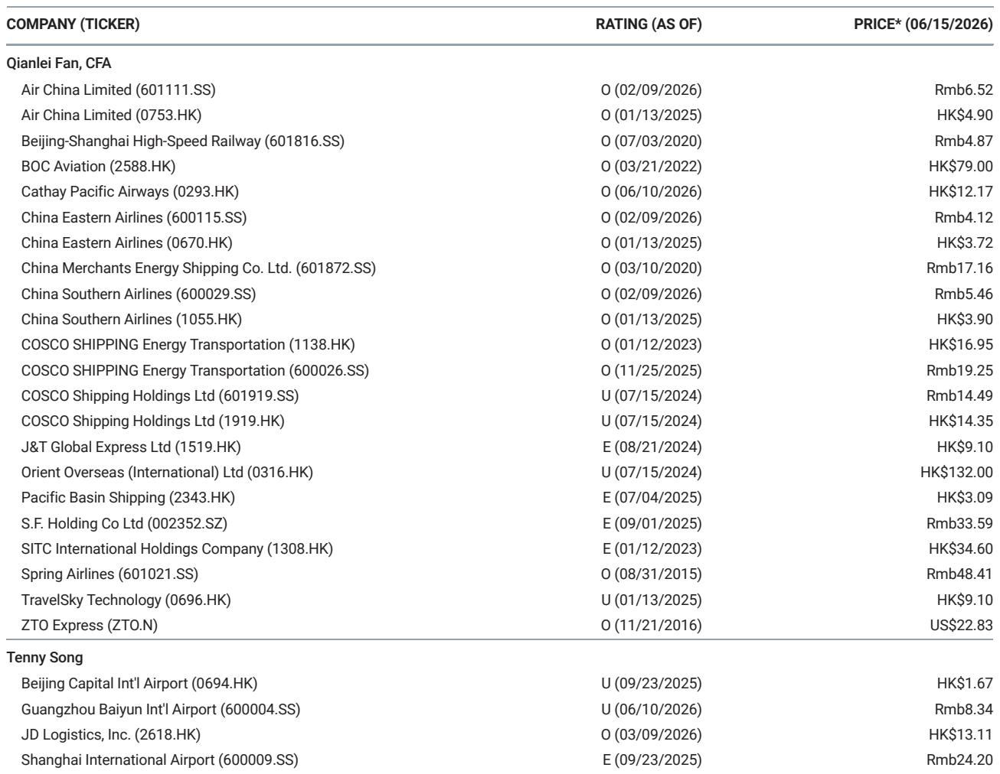
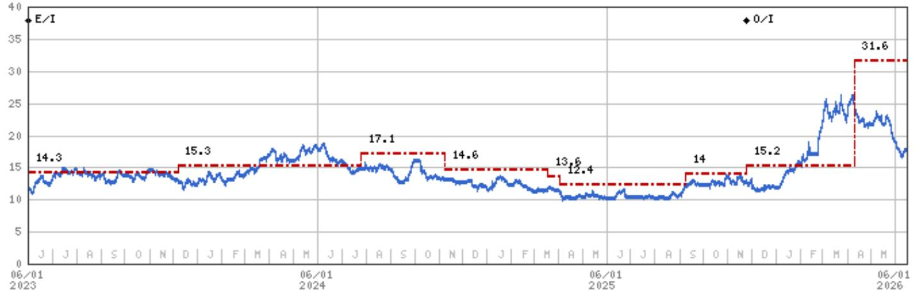

# The Strait Reopening Will Not Just Trigger a Spot Rally — It Will Reshape the Tanker Cycle

The market has spent the past three weeks punishing tanker shipping stocks, driving relative underperformance of 17 to 27 percentage points against broader indices. The reason was simple: the Strait of Hormuz stayed closed longer than anyone expected, and investors concluded that dwindling global oil reserves would crush shipment demand, flood the market with excess capacity, and send spot rates into a downward spiral. That conclusion was premature, and it is now being reversed. The potential reopening of the Strait does not merely remove a headwind — it creates a structural setup for sustained earnings outperformance that most investors are not pricing in. The question is not whether spot rates will spike when the Strait reopens. The question is whether the rally will last beyond the first few weeks, and the answer depends on two factors that the market is underestimating: the scale of the global oil restocking cycle and the fate of sanctions on Iranian oil.

This is not a call about a short-term trading opportunity. It is a call about a multi-quarter earnings cycle that will separate the companies that have positioned their fleets correctly from those that have not. The next three to six months will determine which tanker operators emerge with structurally higher earnings power and which remain trapped in the spot market volatility that has defined the sector since the disruption began.

## The Market Has Misread the Relationship Between Inventory Depletion and Shipping Demand

The bear case that has driven tanker stocks lower since late May rests on a seemingly logical chain: the Strait closure reduced oil flows, global inventories fell, and therefore demand for oil shipments must decline. This logic is incomplete. It confuses the current level of shipments with the future trajectory of demand. When inventories are drawn down to multi-year lows, the eventual restocking wave is not a modest uptick — it is a structural surge in ton-mile demand that can last for quarters, not weeks.

Global oil reserves have been running lower precisely because the Strait closure disrupted the normal flow of crude from the Middle East to consuming regions. Importers have been living hand-to-mouth, drawing down strategic and commercial stocks to keep refineries running. The moment the Strait reopens, those same importers will face a compelling incentive to rebuild inventories aggressively, not gradually. A risk-averse procurement manager who has spent months watching inventory levels fall does not respond to a reopening by ordering one cargo at a time. They respond by ordering multiple cargoes to restore buffer stocks, because the cost of being caught short again far exceeds the cost of carrying excess inventory for a few months.

This dynamic is the core of the bull case that the market has overlooked. The restocking demand will be amplified by the fact that exporters in the Gulf region have been accumulating stored crude that they need to release into the market. The simultaneous push from sellers wanting to clear storage and buyers wanting to refill tanks creates a synchronized surge in voyage demand that spot rate models based on normal seasonal patterns will underestimate. The report's data on US oil inventory levels and China's crude import trajectory confirms that the drawdown has been severe enough to make this restocking wave inevitable, not optional.

## The Capacity Scarcity That Will Follow Reopening Is Structural, Not Temporary

The most common pushback to the bullish tanker thesis is that the market will quickly find enough vessels to meet any surge in demand, and spot rates will collapse back to pre-disruption levels within weeks. This pushback ignores the current configuration of the global tanker fleet and the specific constraints that the Strait closure has created.

A significant portion of the tanker capacity that would normally be available in the Middle East has already repositioned to the Atlantic basin. These vessels are not sitting idle waiting to return. They are laden with cargoes or committed to employment that will take weeks or months to unwind. The tankers that remain in the Gulf are predominantly laden vessels that will discharge their cargoes and then become available only gradually. The report makes this point explicitly: tankers currently in the Gulf are laden and will not become available capacity anytime soon. This is not a minor detail — it is the structural bottleneck that will support elevated rates for longer than the consensus expects.

Furthermore, the sanctioned fleet has grown substantially, with the report indicating that 20 percent of crude tankers and 24 percent of global tankers are now non-compliant. This shadow fleet complicates the supply picture because these vessels operate outside the normal chartering market and cannot be easily redeployed to serve the restocking demand from mainstream importers. The effective supply of compliant, readily available tonnage is tighter than the headline fleet count suggests, and this constraint will become more binding as demand surges.

## The Earnings Divergence Between CMES and CSE Is a Leading Indicator of Strategic Positioning

The report's second-quarter earnings preview reveals a stark divergence that most investors have not yet incorporated into their valuation models. China Merchants Energy Shipping is expected to deliver a net profit of RMB 4.2 billion, representing an increase of over 50 percent quarter on quarter. COSCO SHIPPING Energy Transportation, by contrast, is expected to deliver only RMB 2.2 billion, a modest sequential increase that the report describes as relatively soft.

This divergence is not random. It reflects the different strategic exposures of the two companies to the specific dynamics created by the Strait closure. CMES benefits from a combination of the post-disruption VLCC spot market surge in March 2026 and a strengthened dry bulk shipping market. CSE faces three distinct headwinds: effective rate dilution from vessels that were trapped in the Arabian Gulf since March, softened international product oil shipping due to the shortage of Middle East product oil exports, and slowed China crude imports that drag on domestic oil profits.

The implication for investors is clear: the reopening of the Strait will not benefit all tanker operators equally. Companies with flexible fleet deployment, limited exposure to trapped vessels, and diversified revenue streams across crude and dry bulk will capture a disproportionate share of the earnings upside. Companies that have a higher proportion of vessels caught in the disruption zone or that rely heavily on product oil shipping will see a slower recovery. This is not a sector-wide call — it is a stock-picker's market, and the earnings reports in the coming weeks will provide the evidence that forces the market to reprice the divergence.

## What the Report Does Not Fully Answer Yet: The Duration of the Restocking Cycle and the Iran Wildcard

For all its analytical rigor, the report leaves two critical questions unresolved, and these are the questions that will determine whether the current opportunity is a three-month trade or a twelve-month investment theme.

First, how long will the global oil storage build last? The report states that it will last for a few quarters, if not longer, but this is a range, not a forecast. The duration depends on factors that are inherently uncertain: the speed at which importers rebuild strategic reserves, the willingness of OPEC+ to increase production beyond pre-disruption levels, and the trajectory of global oil demand in an environment where economic growth is slowing in several key markets. A restocking cycle that lasts two quarters would support elevated spot rates through early 2027. A cycle that lasts four quarters would fundamentally change the earnings trajectory for the entire sector and justify a re-rating of equity valuations. The report's base case implies the former, but the bull case implies the latter, and the difference matters enormously for portfolio positioning.

Second, and more consequential, what happens to sanctions on Iranian oil? The report identifies this as a potential demand support factor, but it does not — and cannot — predict the outcome. If sanctions are removed or relaxed, Iranian oil exports could re-enter the global market at scale, adding a significant new source of demand for tanker capacity. This would be a structural positive for the sector because Iranian oil would need to be shipped to destinations that are farther from the Gulf than the pre-sanction customer base, increasing ton-mile demand. If sanctions remain in place, the supply constraint from the shadow fleet persists, but the total addressable oil market is smaller. The resolution of this uncertainty will likely be the single most important catalyst for tanker stocks in the second half of 2026, and the report's framework provides the tools to analyze the outcome but not the answer itself.

## A Decision Framework for Navigating the Tanker Cycle

Investors should approach the tanker sector over the next six months with a structured decision framework that prioritizes the variables that matter most and discards the noise that has dominated recent market commentary.

First, monitor the inventory data for the major consuming regions — the United States, China, Europe, and Japan. The speed at which these inventories rebuild after the Strait reopens will be the single most reliable leading indicator of spot rate sustainability. If inventories in China and the US return to their five-year averages within eight weeks, the restocking wave is short-lived, and the spot rally will fade. If inventories remain below average for twelve weeks or longer, the structural thesis is confirmed, and earnings estimates will need to be revised upward.

Second, track the redeployment of tankers from the Atlantic basin back to the Middle East. The longer it takes for these vessels to reposition, the tighter the spot market will remain. This is a supply-side indicator that is more reliable than orderbook data because it captures the real-time friction in the market rather than the theoretical availability of capacity.

Third, assess the relative earnings trajectories of CMES and CSE as a cross-check on the sector thesis. If CSE's earnings disappoint relative to expectations even as CMES delivers upside, the divergence confirms that the market is still pricing all tanker stocks on an undifferentiated basis, creating opportunities for selective positioning. If both companies deliver upside, the sector-wide thesis is validated, and the risk of a sharp reversal in spot rates is lower.

Fourth, build scenarios around the Iran sanctions outcome. In the base case where sanctions remain unchanged, the earnings power of the sector is a function of the restocking cycle alone. In the bull case where sanctions are removed, the earnings cycle extends and deepens. In the bear case where sanctions are tightened further, the shadow fleet becomes even more constrained, but the total oil trade shrinks, creating an ambiguous outcome for rates. The appropriate portfolio response differs across these scenarios, and investors who do not have a clear view should size positions accordingly.

## The Full Picture Requires the Data That Only the Original Report Provides

The analysis above captures the strategic logic of the tanker cycle that is emerging, but it is built on a foundation of data that cannot be fully conveyed in a summary. The original report contains detailed charts on relative share performance, spot earnings trajectories, US and China inventory trends, OPEC production data, and the growth of the sanctioned fleet. These charts are not decorative — they are the analytical backbone of the investment thesis, and they reveal nuances that text alone cannot capture.

The exhibit showing that tanker spot earnings have corrected only mildly since May, for example, tells a different story than the share price performance suggests. The data on China crude imports dropping 30 percent year on year in May 2026 is the kind of dramatic inflection point that requires visual inspection to fully appreciate its implications for the restocking thesis. The chart showing that 20 percent of crude tankers are sanctioned is a reminder that the supply picture is fundamentally different from previous cycles.

Join the community to read the full report and review the original charts. The next six months will be a defining period for the tanker sector, and the investors who have access to the complete analytical toolkit will be better positioned to separate the structural winners from the cyclical noise.

*This article is for learning and discussion only and does not constitute investment advice.*

Personal reading notes and learning share only. Not investment advice.

