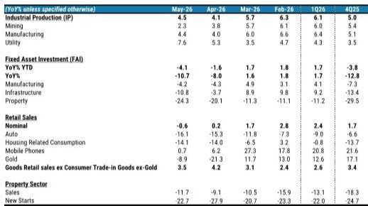

# 摩根斯坦利：市场真正低估的不是需求疲软，而是政策转向“供给端投资”的结构性含义

5月的经济数据，表面上看是“出口强、内需弱”的老故事，但摩根斯坦利这份最新研报揭示了一个更深层的信号：中国经济正在从“消费刺激依赖”转向“供给端投资驱动”，而这一转向的资产定价含义，远未被市场充分消化。

二季度GDP跟踪值降至4.4%，零售销售自2022年以来首次转负，固定资产投资单月同比跌幅扩大至10.7%——这些数字本身已经足够令人警惕。但报告真正值得关注的判断，并非这些疲软数据本身，而是它们共同指向的一个政策拐点：北京正在加速放弃“以消费拉动经济”的短期路径，转而将筹码押注在AI算力网络、数据中心、智能电网等“六网”基础设施投资上。

这不是一次简单的财政加码，而是一次增长逻辑的切换。理解这一切换，比预测下个月的经济数据重要得多。

## 1. 消费刺激的“天花板”已经提前到来，内需疲软正在从短期波动变成结构性特征

5月零售销售同比下滑0.6%，不仅低于市场预期的-0.5%，更是2022年以来首次跌入负值区间。摩根斯坦利的分析指出，这并非单一因素所致，而是“以旧换新”政策效果递减与就业市场持续疲弱叠加的结果。

值得注意的一个细节是，5月的“618”电商促销提前了一天启动，但零售数据依然转负。这意味着消费的疲软已经超出了短期促销可以拉动的范围。政策工具对消费的边际效用正在快速递减。

报告进一步拆解了零售数据的内部结构：汽车销售同比下滑16.1%，住房相关消费下滑14.1%，黄金珠宝下滑8.9%。剔除以旧换新相关商品和黄金后的“核心商品零售”同比增长3.5%，虽然相对稳定，但这一增速也低于4月的4.2%。

这些数字合在一起意味着什么？消费疲软正在从“周期性波动”演变为“结构性特征”。就业市场的持续疲弱、居民收入预期的下降、以及房地产财富效应的消退，正在形成一种负向循环，而这种循环很难通过短期的补贴政策来打破。

对于投资者而言，这意味着任何基于“消费复苏”逻辑的资产定价，都需要重新审视其假设的可靠性。消费板块的估值修复，可能比市场预期的更加漫长和不确定。

## 2. 出口与投资的“传导断裂”正在扩大，制造业产能过剩成为压制资本开支的核心阻力

5月工业增加值同比增长4.5%，略高于市场预期的4.3%，其中中下游制造业表现相对强劲，增速环比上升0.7个百分点至6.4%，主要由高技术产业带动。这看起来是一个积极信号。

但摩根斯坦利敏锐地指出了其中的关键断裂：出口带动的生产增长，并没有有效传导至国内资本开支。制造业固定资产投资单月同比依然为负，为-4.2%，与4月的-4.3%基本持平。

为什么出口强劲却没有带来投资扩张？报告给出的答案是“普遍性的产能过剩”。在多数制造业领域，产能利用率已经处于低位，企业没有动力进一步扩大产能，即使出口订单表现不错。投资的传导被限制在了计算机和设备等少数领域。

这一发现具有重要的宏观含义：过去市场习惯的“出口好-投资好-就业好-消费好”的传导链条，现在出现了明显的断裂。出口的繁荣变成了“孤岛式”的增长，无法有效带动国内经济的内生循环。

这意味着，对出口相关资产的定价，需要更加谨慎地区分“出口收入增长”与“国内利润改善”之间的差异。那些依赖出口拉动国内投资和就业的行业，其景气度的可持续性值得怀疑。

## 3. 房地产的“局部回暖”正在被证伪，二手房亮眼数据掩盖了整体市场的脆弱性

房地产市场的表现是这份报告中最具欺骗性的部分。一些头部城市的二手房成交数据近期有所回升，这被部分市场参与者解读为“企稳信号”。

但摩根斯坦利的分析揭示了另一面：二手房销售的局部改善，与疲弱的按揭贷款增长、持续下滑的新房销售、以及仍在加速下跌的房地产投资形成了鲜明对比。5月房地产开发投资单月同比下滑24.3%，较4月的-20.1%进一步恶化；新房销售面积同比下降11.7%；新开工面积同比下降22.7%。

这些数据合在一起指向一个判断：当前房地产市场的所谓“回暖”，更多是存量房交易的结构性转移，而非整体需求的改善。二手房成交的回升，可能反映了部分业主降价出售以回笼资金，而非购房信心的实质性恢复。

对于房地产板块的投资者来说，这意味着一线城市二手房成交量的边际改善，并不能作为行业整体触底的可靠信号。真正的底部需要看到新房销售、土地购置、开发投资三个指标的同步企稳，而目前这三个指标均未出现明确的改善迹象。

## 4. 财政政策正在经历一次“沉默的转向”：从消费刺激到供给端投资的筹码转移

这是整份报告中最具前瞻性的判断，也是市场尚未充分定价的部分。

5月基础设施固定资产投资单月同比下滑10.8%，较4月的-3.7%大幅恶化。政府债券发行节奏明显放缓，反映出1季度前置发债后的项目储备出现空窗期。这看起来是财政扩张力度减弱的信号。

但摩根斯坦利认为，这恰恰是政策重心切换的过渡期。报告指出，目前仍有约60%的年度政府债券额度尚未使用。预计7月的政治局会议将要求加快财政投放节奏，但重点不是新的刺激方案，而是现有额度的加速执行。

更关键的是政策投向的变化：报告明确指出，政策焦点将集中在资本开支而非消费上——特别是支持AI算力网络、数据中心和智能电网等“六网”倡议下的项目。这一选择的背后逻辑是：在地缘政治紧张加剧的背景下，能源安全和技术自主的战略必要性正在超越短期消费拉动的政策优先级。

这意味着什么？中国的财政扩张正在从“补需求”转向“建供给”。这不是一个短期的战术调整，而是一个可能持续数年的结构性转向。对于资本市场来说，这意味着与“六网”相关的产业链——电力设备、通信基础设施、算力硬件——将获得持续的政策支持，而消费相关领域的政策红利则可能逐步退潮。

## 5. 报告尚未完全回答的关键问题：供给端投资的乘数效应能否替代消费驱动的增长动力

摩根斯坦利对政策转向的判断是清晰的，但报告也留下了一个尚未被充分回答的问题：以供给端投资为核心的增长模式，能否有效替代消费驱动的增长动力？

从历史经验来看，基础设施投资确实可以产生短期的经济拉动效应，但其乘数效应通常低于消费支出。特别是在当前产能普遍过剩的背景下，新增的算力网络和数据中心投资，能否有效带动就业增长和居民收入改善，是一个需要验证的假设。

报告提到了“六网”倡议下的AI和能源转型投资，但并未详细展开这些投资对就业结构、收入分配和消费需求的二阶影响。这是投资者需要自行推演的关键环节。

另一个未被充分讨论的问题是：地方政府在财政压力加大的背景下，是否有足够的执行能力来推动这些大规模投资项目的落地？5月基础设施投资的显著下滑，部分原因就是项目储备不足，而非资金短缺。如果项目储备问题不能有效解决，即使债券额度充足，实际投资增速也可能低于预期。

这些未解问题，恰恰是投资者可以进一步深入研究的方向。报告的完整版本提供了更详细的数据拆解和情景分析，可以帮助读者更全面地评估这些风险。

## 6. 投资者的观察框架：从“总量增长”转向“结构分化”，从“消费复苏”转向“供给投资”

基于摩根斯坦利的这份报告，我们可以提炼出一个更加实用的分析框架。

第一，放弃对经济总量的线性预测，转而关注结构分化的方向。二季度GDP跟踪值4.4%意味着什么并不重要，重要的是“K型”分化正在加剧——出口导向的高技术制造业和与“六网”相关的投资领域将是增长的主要来源，而消费、房地产和传统制造业将继续承压。

第二，重新评估消费相关资产的定价逻辑。消费刺激政策边际效用递减的趋势已经确立，任何基于政策加码预期的消费股投资，都需要更加谨慎。消费板块的估值修复，可能需要等到就业市场和居民收入预期出现实质性改善之后。

第三，关注供给端投资链条上的结构性机会。AI算力网络、数据中心、智能电网等领域的资本开支扩张，将直接拉动相关设备和基础设施供应商的需求。但需要注意的是，这种需求的可持续性取决于政策执行的力度和节奏，而非市场情绪。

第四，对房地产市场的“回暖信号”保持怀疑。二手房成交的局部改善不能等同于行业整体复苏。真正的底部信号应该是新房销售、土地市场和开发投资三个指标的同步企稳。

第五，跟踪7月政治局会议的政策表述。这是验证摩根斯坦利“政策转向”判断的关键节点。如果会议确实将重点放在加速财政投放而非新刺激方案上，如果政策表述更多强调资本开支而非消费，那么这一转向的确定性将进一步增强。

---

这份摩根斯坦利研报最值得反复咀嚼的部分，并非它对5月经济数据的解读，而是它从数据中提炼出的政策逻辑转向。消费刺激的边际效用递减、出口与投资的传导断裂、房地产局部回暖的证伪，这些现象正在共同推动北京做出一个战略性选择：将有限的财政资源从消费补贴转向供给端的基础设施投资。

这一选择的资产定价含义，才刚刚开始被市场消化。那些能够从这一转向中受益的行业和企业，将在未来几个季度中获得结构性的超额收益；而那些依赖消费复苏和房地产企稳的资产，则需要面对一个更加漫长的等待期。

报告中还有更多关于“六网”倡议的具体投资方向、各行业产能利用率的详细数据、以及不同政策情景下的经济增长路径分析，这些内容在本文中无法一一展开。欢迎来星球微信群里继续讨论，我们将基于这份报告的完整数据，进一步拆解供给端投资的具体受益链条和风险边界。

Personal reading notes and learning share only. Not investment advice.

