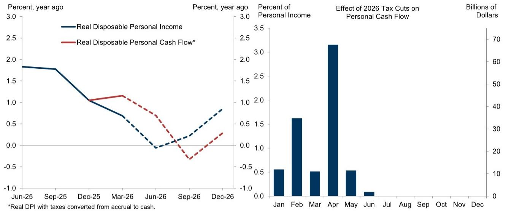
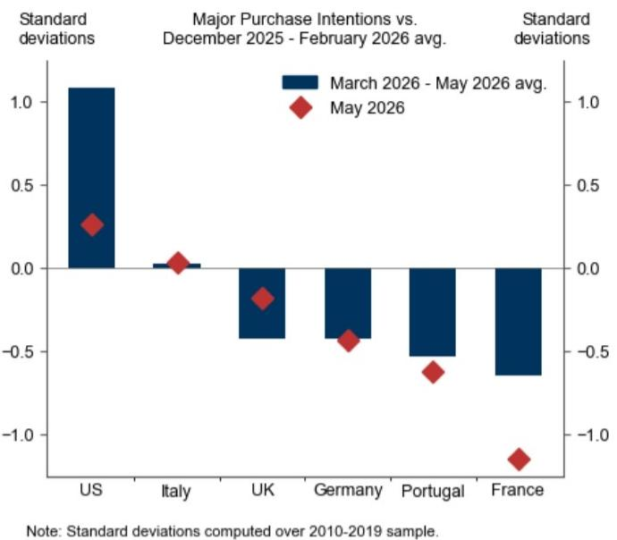
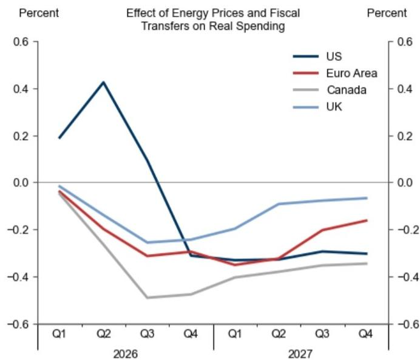

# GS：消费的真正压力尚未到来，市场对能源冲击的滞后效应严重低估

过去几周，能源市场的消息面似乎正在转好。美伊临时和平协议降低了油价的上行尾部风险，GS的大宗商品策略师已将2026年第四季度布伦特原油预期从此前的每桶90美元下调至80美元。与此同时，大西洋两岸的消费者支出数据至今表现出了令人意外的韧性。这些信号叠加在一起，很容易让市场参与者产生一种判断——能源冲击对增长的影响已经见顶，风险正在消退。

但这份来自GS全球经济学团队的最新报告给出了一个截然不同的结论。报告的署名作者包括首席经济学家Jan Hatzius，其核心判断非常清晰：现在放松警惕为时过早。真正的消费压力尚未到来，甚至可以说，主要冲击波还没有真正进入经济数据。

市场低估的不是能源价格本身，而是能源冲击向消费者现金流传导的机制、时间差和季节性放大效应。这不是一个线性过程，而是一个在第二、三季度才会集中释放的滞后冲击。对于关注宏观资产定价、行业盈利预期和消费类资产基本面的投资者而言，理解这个传导链条的节奏，比盯着油价短期走势更为重要。

## 1. 三条传导路径的共振窗口将在下半年开启，而非现在

GS的分析框架建立在三个相互独立的机制之上，它们共同指向同一个结论：消费的实质性放缓还没有开始。

第一条路径是批发价格向零售价格的传导延迟。汽油价格在冲突爆发后迅速跳升，但天然气和电力价格向消费者的传导更为缓慢。GS欧洲经济学家指出，固定合同和政府监管机制在历史上一直导致消费端价格调整滞后于批发价格。这意味着，相当一部分相关的消费品价格涨幅尚未实现。

第二条路径是季节性需求对现金流的放大效应。能源价格上涨对家庭现金流的冲击，在冬季取暖需求高峰时会显著放大。GS的报告用了一个非常精巧的计算来展示这一点：在固定消费结构假设下，欧洲的冲击谷底出现在2026年中；但一旦引入冬季需求的季节性波动，谷底将后移至2027年第一季度。季节性因素本身在欧洲就贡献了超过20%的额外拖累。

第三条路径是美国特有的财政脉冲反转。今年上半年，超大规模的退税暂时将美国实际现金流推高了0.8%（第一季度）和1.2%（第二季度）。但这一临时性提振已经结束，第三季度同比增速将暂时转负。GS的计算显示，这将导致美国实际现金流从第二季度的正增长0.7%急剧转为第三季度的负增长0.6%。

这三条路径的共振窗口不在过去，不在当下，而在下半年。这是报告最核心的时间判断。

## 2. 历史经验给出了一个可量化的传导公式：每1%的现金流损失，对应0.6%的消费下降

GS基于历史统计关系建立了一个经验模型。该模型的参数简洁而有力：能源冲击导致的每1%实际现金流下降，会在两个季度后转化为约0.6%的消费支出下降。

这个数字本身并不惊人，但关键在于它解释了为什么到目前为止消费数据看起来还不错。GS的模型能够很好地拟合现有的有限消费影响，但更重要的是，它在新的能源价格假设下预测出下半年将出现更明显的疲软。具体而言，GS估计实际支出的峰值拖累在加拿大为0.5%，欧元区为0.4%，美国和英国为0.3%。

这些数字单独看或许不算灾难性，但放在当前市场对“软着陆”的普遍预期背景下，它们意味着一个重要的边际变化。市场已经定价了经济韧性，但并未完全定价一个由能源滞后传导驱动的、结构性的消费放缓。

更值得关注的是，GS估计美国尚未出现任何实质性的支出拖累，而欧元区、英国和加拿大到第二季度末也仅实现了峰值冲击的一半左右。换句话说，消费数据中最坏的部分还在后面。

## 3. 消费者调查已经给出了预警，但市场可能忽视了其结构性含义

报告引用了一项前瞻性调查证据，这往往是市场最容易忽视但最具信号意义的数据。大多数发达市场的消费者预计，未来6到12个月的大额采购将少于冲突爆发前。美国的消费意愿在春季因财政支持而一度回升，但5月份已经回落。

GS的美国经济学家认为，这与他们的估计一致：消费者在应对能源冲击时，会不成比例地削减可自由支配的耐用品支出。这是一个重要的结构含义。耐用品消费的波动性远高于服务消费，且对信贷条件和消费者信心更为敏感。如果能源冲击叠加了高利率环境的滞后效应，耐用品领域的调整幅度可能超出简单线性模型的预测。

这里有一个值得追问但报告没有完全展开的问题：消费者信心的下降是否已经体现在了资产定价中？目前来看，美股消费品板块的估值并未充分反映这一风险。这或许意味着，如果下半年的消费数据如期走弱，市场将面临一个从“韧性叙事”到“放缓叙事”的切换过程。

## 4. 报告尚未完全回答的关键问题：中国库存重建与欧洲冬季的叠加效应

报告中有一个看似不起眼的细节值得单独讨论。GS的大宗商品策略师虽然下调了油价预期，但并未改变天然气年末价格预测，原因在于“库存重建”。报告提到，中国在春季去库存后，将在冬季前开始重建库存。

这是一个尚未被充分讨论的变量。中国的天然气库存行为对全球价格有显著影响。如果中国在冬季前大规模补库，叠加欧洲的取暖需求，天然气的价格压力可能超出GS当前基准假设。报告没有对此进行情景分析，但读者需要意识到，当前的能源价格预测存在一个重要的上行风险。

这意味着，GS报告中对消费拖累的量化估计，可能是一个偏保守的基准情景。如果天然气价格在冬季前出现二次上涨，那么报告所描述的“滞后冲击”将不仅是幅度上的增加，还可能是时间上的延长。

对于产业决策者而言，这个未解问题意味着不应简单依赖基准预测来制定采购和库存策略。对于投资者而言，这意味着当前能源股和防御性消费股的相对吸引力可能需要重新评估。

## 5. 对读者的观察框架：三个需要持续追踪的先行指标

基于GS的这份报告，可以提炼出一个简洁的观察框架，用于在下半年持续追踪这一判断的验证或证伪。

第一个指标是美国实际可支配个人现金流的同比增速。GS在Exhibit 3中展示了这一指标的剧烈摆动。如果第三季度数据确实如预期般转负，将是验证滞后冲击的第一步。

第二个指标是欧洲冬季前的天然气批发价格与零售价格的价差。如果价差在第三季度开始收窄，说明传导正在加速，消费压力将提前到来。

第三个指标是消费者大额采购意愿的调查数据。这个数据频率高、发布快，且与GS模型中的耐用品消费逻辑直接对应。如果美国数据在6月、7月继续走弱，将是对“财政脉冲消退”判断的强有力佐证。

这三个指标都不复杂，但它们共同构成了一个可以持续追踪的验证体系。对于专业投资者而言，与其争论经济是否衰退，不如追踪这些先行信号是否在按照报告的路径演进。

GS这份报告的价值不在于给出了一个惊人的结论，而在于提供了一个严谨的、可验证的因果链条。它提醒我们，在宏观分析中，最危险的错误往往不是方向判断错误，而是时间判断错误。能源冲击对消费的影响不是没有发生，而是还没发生。

这份报告还有更多关于各国具体传导差异、模型假设细节以及情景分析的深度内容，受限于篇幅无法在此一一展开。如果你对GS完整的能源传导模型、各国消费冲击的差异化路径，或者报告中没有完全展开的中国库存重建风险感兴趣，欢迎来我们的星球微信群里继续讨论。那里有更完整的原始图表和更深入的交叉验证。

Personal reading notes and learning share only. Not investment advice.

