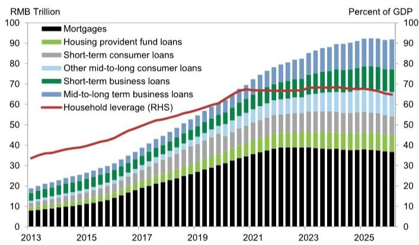
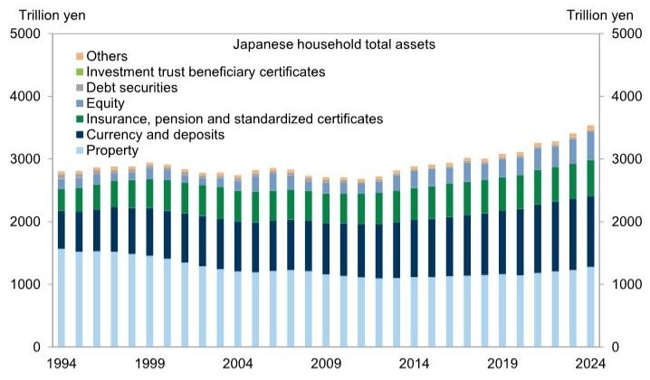
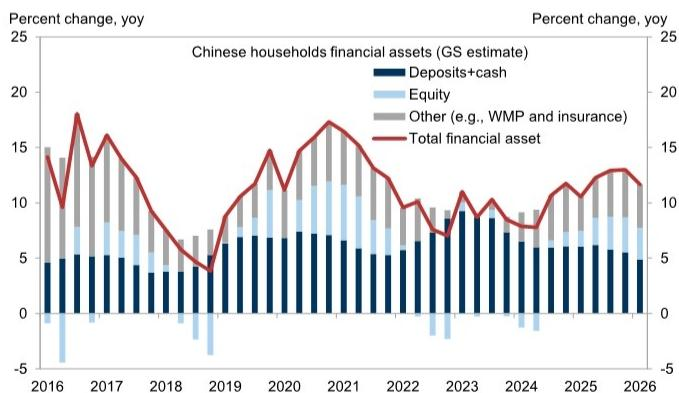

# GS：中国家庭资产正在经历从房产到金融资产的结构性迁移

中国家庭资产负债表正在经历一个过去二十年从未出现过的变化：房地产从财富增长的引擎变成了拖累，而金融资产正在接替这一角色。这并非一个短期波动，而是一个结构性转折的早期阶段。

GS在最新发布的研报中构建了一个季度频率的家庭资产负债表追踪框架，填补了官方数据发布滞后的空白。根据这一框架，中国家庭总资产在2023年初见顶，经历了约六个季度的收缩后，目前在730万亿元人民币左右企稳。但比总量企稳更值得关注的，是资产构成正在发生的根本性变化。

截至2026年第一季度，GS估算房地产在中国家庭总资产中的占比已从2021年中房地产市场高峰期的67%降至52%，而现金及存款从16%升至25%，其他金融资产（含股票、债券、基金、保险等）从15%升至20%。直接持有的股票在总资产中的占比也从5%微升至6%。

这些数字本身已经说明问题，但真正重要的是它们背后的含义：中国家庭的储蓄和财富配置正在经历一个从“不动产信仰”到“金融资产再平衡”的早期阶段。这一过程才刚刚开始，其对消费、资本市场乃至宏观经济的影响，可能比多数投资者预期的更为深远。

## 1. 房地产从财富创造者变为财富拖累，这一转变尚未被市场充分定价

GS的数据显示，在2021年房地产见顶之前，中国家庭资产负债表持续扩张的核心驱动力是房价上涨和房产购买积累。当房价从高点下跌约30%后，这一逻辑彻底逆转。过去几年，房价下跌造成的资产减值超过了金融资产的增值，导致家庭总资产在2023年至2024年持续收缩。

这一转变的核心含义在于：房地产不再是中国家庭财富增长的稳定器。过去二十年，买房几乎等同于“储蓄+投资”的合一体，而现在，它变成了一个需要持续消耗现金流来维护的负债项。即使房价不再继续大幅下跌，只要不涨，其对家庭财富增长的贡献就是零甚至负值。

GS报告指出，目前房地产仍占家庭总资产的约60%，而股票占比不到10%。更重要的是，超过90%的家庭拥有房产，而只有约25%的成年人参与股市。这意味着房价疲软对大众消费的影响远大于股市上涨。金融资产的增值主要惠及高收入群体，对整体消费的拉动作用相对有限。

这里有一个尚未被市场充分讨论的推论：如果房地产的财富创造功能永久性减弱，中国家庭的边际消费倾向可能会系统性下降。过去人们敢于消费，部分原因是房产升值带来的“财富幻觉”支撑了信心。当这一支柱消失后，家庭可能需要更长时间来重建资产负债表的安全感。

## 2. 去杠杆仍在继续，但真正的压力不在总量而在现金流

GS的数据显示，中国家庭债务自2024年中以来开始趋势性下行，主要驱动力是存量房贷余额的下降。提前还贷和购房需求低迷共同导致了住房相关借贷的收缩。短期消费贷款也在走弱，反映家庭部门在住房之外的消费需求同样谨慎。

从总量看，中国家庭债务占GDP比率在2024年初见顶于61%，到2025年第三季度已回落至约59%。这一水平低于美国（约70%）和日本（约62%），但高于新兴市场平均水平（约45%）。表面上看并不算极端。

但GS报告特别指出，如果以债务收入比来衡量，中国家庭的偿债压力仍然较高。这才是问题的核心：中国家庭债务的“分母”是收入，而收入增长在过去几年明显放缓。即使债务总量在减少，如果收入增长更慢，偿债负担反而会加重。

这一判断对投资者的启示在于：政策刺激的效果可能被高估。降低房贷利率和推出消费贷利息补贴，都是在降低债务成本，但如果家庭对未来收入预期没有改善，他们更可能选择提前还贷而非增加消费。去杠杆是一种行为模式转变，不是利率工具可以轻易逆转的。

## 3. 金融资产迁移已经开始，但路径并非线性

GS报告中最具前瞻性的判断是：中国家庭资产配置正处于结构性迁移的早期阶段——随着房地产在财富积累中的角色减弱，存款利率持续走低，储蓄将逐步向更广泛的金融资产迁移，股票和保险是中期最有可能受益的领域。

从数据看，这一迁移已经在发生。自2024年9月政策转向以来，股票对家庭金融资产增长的贡献明显上升。GS估算，2024年全年家庭金融资产增长约8%，其中存款和现金贡献了约6.5个百分点，股票贡献为负。但进入2025年后，股票的贡献转正，推动金融资产增速上升至约12%。

但这里需要谨慎：迁移的速度和幅度取决于多个条件。第一，房价能否在核心城市率先企稳。GS预计深圳和上海有望在未来一到两年内实现本地房价稳定。如果这一判断成立，家庭对房产的信心将不再继续恶化，这为金融资产迁移创造了心理基础。第二，股市能否提供可持续的正回报。过去几年A股的波动性让许多散户投资者损失惨重，如果市场再次出现大幅下跌，资金可能重新回流存款。第三，银行理财、保险等替代产品的收益率是否有吸引力。在存款利率持续下行的背景下，这些产品的相对吸引力在上升，但投资者对风险的接受度仍有限。

## 4. 报告没有完全回答的一个关键问题：财富效应的分布不均如何影响宏观

GS报告明确指出了财富效应分布不均的问题：金融资产的上涨主要惠及高收入群体，而房价下跌对大众消费的冲击更大。但报告没有深入展开的是，这种分布不均对宏观经济的结构性影响。

一个合理的推论是：如果金融资产的上涨集中在少数人手中，而房地产的下跌影响多数人，那么即使家庭总资产企稳，消费倾向也可能继续分化。高收入群体可能增加储蓄或投资，而非消费；中低收入群体则因资产负债表受损而持续压缩支出。这种“K型修复”可能导致整体消费复苏慢于资产价格修复的速度。

另一个未完全回答的问题是：家庭资产从房产向金融资产的迁移，是否会改变中国的储蓄率结构？过去二十年，高储蓄率部分与买房需求有关——人们储蓄是为了凑首付。如果购房需求系统性下降，这部分预防性储蓄是否会释放为消费，还是会以其他形式继续沉淀？这取决于社会保障体系的完善程度和收入增长预期。

## 5. 投资者应该用什么框架来跟踪这一变化

基于GS的分析框架，投资者可以从三个维度来持续跟踪中国家庭资产负债表的修复进度。

第一，房价的边际变化。GS的高频追踪器显示，新房和二手房销售近期趋于稳定，一线城市房价环比跌幅收窄甚至转正。如果这一趋势持续，家庭对房产的信心可能会触底。但需要关注的是，二三线城市是否能够跟上。如果修复仅限于一线城市，对全国家庭财富的带动作用有限。

第二，家庭债务行为的拐点。目前去杠杆仍在继续，但何时家庭开始重新增加借贷，可能是信心真正修复的信号。关注两个指标：存量房贷余额是否止跌，以及短期消费贷款是否重新增长。如果家庭开始愿意借钱消费，说明对未来的收入预期已经改善。

第三，金融资产配置的流向。GS的数据显示，存款在家庭金融资产中的占比仍在上升，这是避险情绪的表现。当存款增速开始放缓，资金向股票、基金、保险等资产迁移加速时，才是真正的资产配置转向。这一过程可能持续数年，但投资者需要识别的是加速的拐点。

GS这份报告的价值不在于给出了一个精确的预测，而在于提供了一个可追踪的分析框架。中国家庭资产负债表的变化不是一个黑箱，而是一个可以用数据持续观察的动态过程。对于关注中国消费、房地产和资本市场的投资者来说，理解这个框架本身，比任何单一结论都更有意义。

欢迎来星球微信群里继续讨论。我们会在社群中分享GS这份报告的完整图表和数据细节，并围绕家庭资产负债表修复对消费股、地产股和金融板块的定价含义进行深入拆解。如果你对某个具体问题有疑问，也欢迎在群里提出，我们可以一起从原始数据出发推演答案。

Personal reading notes and learning share only. Not investment advice.

