# Australian and New Zealand Inflation Monitor: Further Indirect Effects From Higher Oil Prices Expected in May

In Australia, headline CPI increased by $0.4\%$ mom in April, though year-over-year inflation decelerated 40bp to $4.2\%$ yoy. Compositionally, a seasonal rebound in garments and holiday travel was partly offset by declines across fuel and urban transport, owing to a temporary reduction in the fuel excise tax and public transport subsidies.

Looking ahead to the May data, we expect headline CPI to fall $0.4\%$ mom, which would leave year-over-year inflation unchanged at $4.2\%$ yoy. In underlying terms, we expect monthly trimmed mean CPI to increase $0.3\%$ mom, taking the year-over-year rate 10bp higher to $3.5\%$ yoy. We flag a higher-than-usual degree of uncertainty in our forecasts this month.

In New Zealand, monthly price data covering around 50% of the CPI basket remained unchanged in May. Compositionally, a decline in fuel and airfare prices was offset by rising food prices, particularly for restaurant meals where there have been some reports of fuel surcharges.

## Australia

Australia's headline CPI increased by 0.4%mom in April, though year-over-year inflation decelerated 40bp to 4.2%yoy. Compositionally, a seasonal rebound in garments, domestic travel and international travel was partly offset by declines across automotive fuel and urban transport – owing to a temporary reduction in the fuel excise tax and public transport subsidies. Looking through the volatility in headline inflation, monthly trimmed mean rose 0.3%mom, with year-over-year growth accelerating 10bp to 3.4%yoy. In quarterly terms, our three-month-on-three-month trimmed mean measure eased 3bp to 0.84%qoq.

Looking ahead to May, we expect headline CPI to fall 0.4%mom, which would leave year-over-year inflation unchanged at 4.2%yoy. Compositionally, our forecast reflects a decline in automotive fuel (GSe: -12.5%mom), alongside lower global crude oil prices, as well as a seasonal fall in domestic airfares (GSe: -7.2%mom) following the Easter holidays. We expect the indirect pass-through of higher fuel prices to intensify in May, particularly across new dwelling purchase (GSe: +0.9%mom), restaurant meals (GSe: +0.7%mom) and takeaway meals (GSe: +0.7%mom).

In underlying terms, we expect monthly trimmed mean CPI to increase 0.3%mom, taking the year-over-year rate 10bp higher to 3.5%yoy. Our forecasts are consistent with a 0.88%qoq increase in our preferred three-month-on-three-month trimmed mean measure.

Andrew Boak, CFA

+61(2)9321-8576

andrew.boak@gs.com

GS Australia Pty Ltd

Will Maher

+61(2)9320-1013 | will.maher@gs.com

GS Australia Pty Ltd

Oscar To

+61(2)9320-1367 | oscar.to@gs.com

GS Australia Pty Ltd

We flag a higher-than-usual degree of uncertainty in this month's forecasts for two reasons: (i) the heightened volatility in fuel prices stemming from both the excise tax reduction and movements in global oil prices; and (ii) May will be the first month in which international airfares reflect the impact of the conflict, as these prices are collected two months in advance.

Exhibit 1: We expect headline CPI and trimmed mean to increase $4.2\%$ yoy and $3.5\%$ yoy respectively in May  
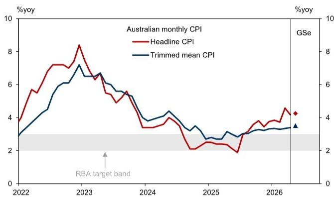

line chart

| Year | Headline CPI | Trimmed mean CPI |
|------|--------------|------------------|
| 2022 | ~3.5         | ~3.0             |
| 2023 | ~8.5         | ~7.0             |
| 2024 | ~3.5         | ~4.0             |
| 2025 | ~2.5         | ~3.0             |
| 2026 | ~4.5         | ~3.5             |

Source: ABS, GS Global Investment Research

Exhibit 2: May CPI forecasts

<table><tr><td>May month CPI forecasts</td><td>%mom May-26</td><td>%yoy May-26</td></tr><tr><td>Headline CPI</td><td>-0.4</td><td>4.2</td></tr><tr><td>Trimmed mean</td><td>0.3</td><td>3.5</td></tr><tr><td>Food &amp; non-alcoholic beverages</td><td>0.5</td><td>3.1</td></tr><tr><td>Alcohol &amp; tobacco</td><td>0.2</td><td>4.0</td></tr><tr><td>Clothing &amp; footwear</td><td>-1.9</td><td>6.0</td></tr><tr><td>Housing</td><td>0.3</td><td>6.3</td></tr><tr><td>New dwelling purchase</td><td>0.9</td><td>5.6</td></tr><tr><td>Rents</td><td>0.4</td><td>3.5</td></tr><tr><td>Household goods &amp; services</td><td>0.0</td><td>1.7</td></tr><tr><td>Health</td><td>-0.3</td><td>3.9</td></tr><tr><td>Transport</td><td>-3.8</td><td>3.4</td></tr><tr><td>Automotive fuel</td><td>-12.5</td><td>6.9</td></tr><tr><td>Communication</td><td>-0.5</td><td>1.5</td></tr><tr><td>Recreation &amp; culture</td><td>-0.4</td><td>5.2</td></tr><tr><td>Education</td><td>0.0</td><td>4.8</td></tr><tr><td>Insurance &amp; financial services</td><td>0.0</td><td>3.1</td></tr></table>

All figures are non-seasonally adjusted except for trimmed mean.  
Source: GS Global Investment Research

## Automotive fuel

Timely data from the Australia Institute of Petroleum suggest gasoline and diesel prices fell sharply in May, alongside lower global oil prices and the earlier temporary 3-month reduction of the excise tax (Exhibit 3).

We expect automotive fuel in the official CPI data to fall 12.5%mom in May.

Exhibit 3: Diesel and gasoline prices fell in May  
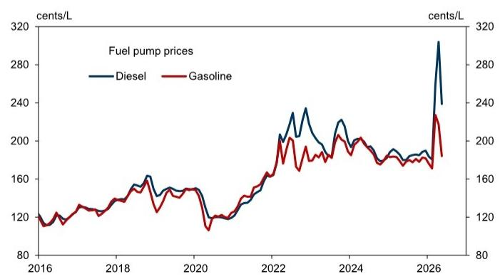

line chart

| Year | Diesel (cents/L) | Gasoline (cents/L) |
| --- | --- | --- |
| 2016 | 115 | 113 |
| 2017 | 125 | 123 |
| 2018 | 145 | 143 |
| 2019 | 155 | 153 |
| 2020 | 135 | 133 |
| 2021 | 145 | 143 |
| 2022 | 205 | 203 |
| 2023 | 235 | 230 |
| 2024 | 215 | 210 |
| 2025 | 195 | 190 |
| 2026 | 190 | 185 |
| 2026 (with label) | 290 | 230 |

Source: Haver Analytics, GS Global Investment Research

## Materials and chemical costs

The number of price rises announced by key plumbing and trade material suppliers continue to trend upwards, with the average price increase and number of price increases exceeding the post-COVID peak (Exhibit 4). Prices for fertiliser also remain somewhat elevated (Exhibit 5).

Exhibit 4: Key building supply companies are announcing a greater number of, and larger, price increases  
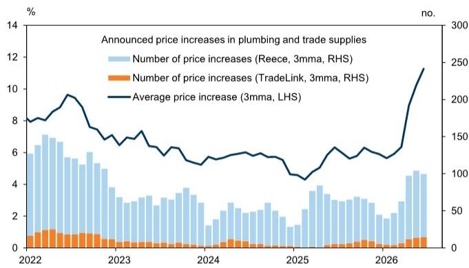  
Source: Reece, TradeLink, GS Global Investment Research

Exhibit 5: Fertiliser prices remain somewhat elevated  
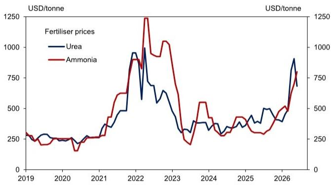

line chart

| Year | Urea (USD/tonne) | Ammonia (USD/tonne) |
|---|---|---|
| 2019 | 250 | 275 |
| 2020 | 240 | 230 |
| 2021 | 300 | 350 |
| 2022 | 950 | 900 |
| 2023 | 600 | 1050 |
| 2024 | 350 | 550 |
| 2025 | 400 | 400 |
| 2026 | 850 | 750 |

Source: Argus, GS Global Investment Research

Over time, we expect higher materials and chemical costs to pass through to higher consumer prices for food and housing, reflecting cost pressures faced by the agriculture and materials manufacturing industries (Exhibit 6).

Exhibit 6: Prices for food and housing are likely to be boosted by higher input costs  
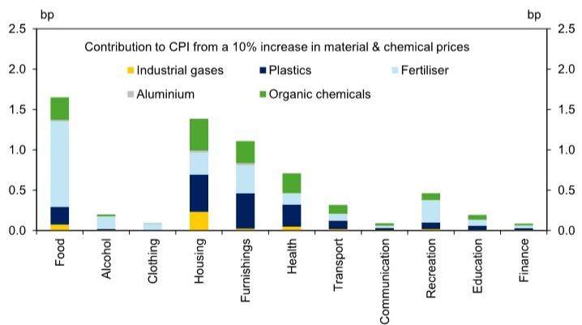

stacked bar chart

Contribution to CPI from a 10% increase in material & chemical prices
| Category | Industrial gases (bp) | Plastics (bp) | Fertiliser (bp) | Aluminium (bp) | Organic chemicals (bp) |
|---|---|---|---|---|---|
| Food | 0.1 | 0.25 | 1.3 | 0.0 | 0.4 |
| Alcohol | 0.0 | 0.0 | 0.15 | 0.0 | 0.05 |
| Clothing | 0.0 | 0.0 | 0.1 | 0.0 | 0.0 |
| Housing | 0.25 | 0.45 | 0.25 | 0.0 | 0.4 |
| Furnishings | 0.05 | 0.45 | 0.35 | 0.0 | 0.25 |
| Health | 0.05 | 0.35 | 0.25 | 0.0 | 0.3 |
| Transport | 0.0 | 0.15 | 0.15 | 0.0 | 0.1 |
| Communication | 0.0 | 0.0 | 0.05 | 0.05 | 0.05 |
| Recreation | 0.0 | 0.15 | 0.15 | 0.05 | 0.1 |
| Education | 0.0 | 0.1 | 0.1 | 0.05 | 0.1 |
| Finance | 0.0 | 0.05 | 0.05 | 0.05 | 0.1 |

Source: GS Global Investment Research

## Airfares and holiday travel

We expect domestic travel & accommodation in the official CPI data to fall 7.2%mom in May. Alternative data on domestic airfares from the Bureau of Infrastructure and Transport Research Economics suggest prices fell a smaller 2.1%mom in April (Exhibit 7), although we acknowledge these data measure prices on the last Thursday of each month, whereas the official ABS measures prices more frequently throughout the month.

We expect international travel & accommodation prices to rise 4.7%mom. We note that price collection for international airfares occurs two months in advance, meaning that

May's data is the first to capture the impact of the conflict in the Middle East. Our forecast contrasts with the decline in international travel prices in the New Zealand already observed over May (Exhibit 8), possibly in part due to differences between the Australian and New Zealand collection methodologies.

Exhibit 7: Alternative data on airfares fell a little in May  
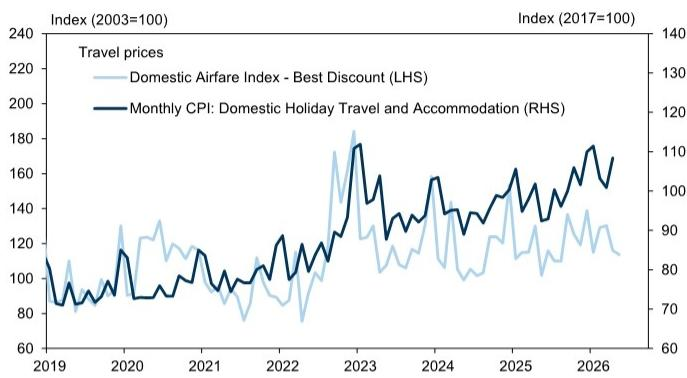  
Source: ABS, GS Global Investment Research, BITRE

Exhibit 8: International air transport prices in New Zealand declined in May  
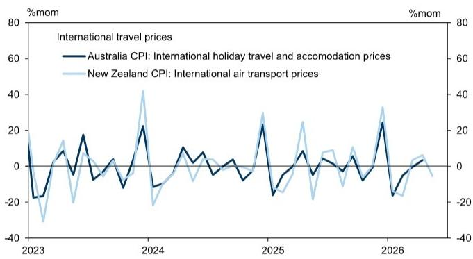

line chart

International travel prices
| Year | Australia CPI: International holiday travel and accommodation prices (%mom) | New Zealand CPI: International air transport prices (%mom) |
|---|---|---|
| 2023 | -18 | -30 |
| 2024 | 22 | 42 |
| 2025 | -15 | -15 |
| 2026 | -18 | 32 |

Source: ABS, StatsNZ, GS Global Investment Research

## Housing

Growth in SQM advertised rents picked up further in May, which will pass through to inflation in the stock of rents measured in the CPI data over time. The April CPI report showed a slight easing in rents inflation, while new dwelling inflation picked up further, reflecting the pass-through of fuel surcharges and higher material costs.

Looking ahead, we expect new dwelling inflation to accelerate further to 0.9%mom in May from higher input costs. We expect rents inflation to edge up to 0.4%mom.

Exhibit 9: Growth in advertised rents picked up further in May  
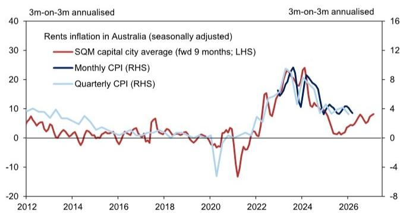

line chart

| Year | SQM capital city average (fwd 9 months; LHS) | Monthly CPI (RHS) | Quarterly CPI (RHS) |
|------|-----------------------------------------------|-------------------|---------------------|
| 2012 | ~5                                            | ~10               | ~8                  |
| 2014 | ~-5                                           | ~5                | ~5                  |
| 2016 | ~0                                            | ~0                | ~0                  |
| 2018 | ~5                                            | ~5                | ~5                  |
| 2020 | ~-10                                          | ~-15              | ~-15                |
| 2022 | ~15                                           | ~15               | ~15                 |
| 2024 | ~25                                           | ~25               | ~25                 |
| 2026 | ~5                                            | ~5                | ~5                  |

Source: SQM, ABS, GS Global Investment Research

Exhibit 10: Housing inflation picked up further in April  
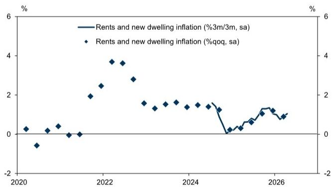

line chart

| Year | Rents and new dwelling inflation (%3m/3m, sa) (%) | Rents and new dwelling inflation (%qoq, sa) (%) |
|---|---|---|
| 2020 | -0.1 | 0.2 |
| 2021 | 0.1 | 0.4 |
| 2022 | 2.5 | 3.8 |
| 2023 | 1.5 | 2.8 |
| 2024 | 1.4 | 1.6 |
| 2025 | 0.1 | 1.4 |
| 2026 | 1.0 | 1.1 |

Source: ABS, GS Global Investment Research

## Market services

We expect a slight acceleration in market services inflation in April, reflecting pass-through of higher oil prices. In particular, we expect restaurant meals and takeaway to each rise by $0.7\%$ mom, alongside reports of fuel surcharges in the food and hospitality industry. We expect inflation across other market services to remain little changed.

Outside of fuel-related cost impacts, measures of labour tightness included in the RBA's indicator framework suggest conditions in the labour market are close to balance and not contributing excessively to inflation (Exhibit 11).

Exhibit 11: The RBA's updated labour framework suggests to us that labour market conditions are close to balanced  
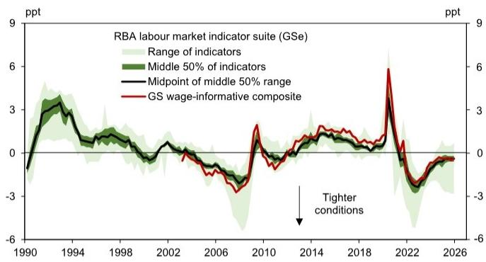

line chart

| Year | Range of indicators | Middle 50% of indicators | Midpoint of middle 50% range | GS wage-informative composite |
|------|---------------------|--------------------------|------------------------------|-------------------------------|
| 1990 | -                   | -                        | -                            | -                             |
| 1994 | -                   | -                        | -                            | -                             |
| 1998 | -                   | -                        | -                            | -                             |
| 2002 | -                   | -                        | -                            | -                             |
| 2006 | -                   | -                        | -                            | -                             |
| 2010 | -                   | -                        | -                            | -                             |
| 2014 | -                   | -                        | -                            | -                             |
| 2018 | -                   | -                        | -                            | -                             |
| 2022 | -                   | -                        | -                            | -                             |
| 2026 | -                   | -                        | -                            | -                             |

Source: GS Global Investment Research, ABS, Haver Analytics

## Inflation expectations

Measures of short-term inflation expectations remain well above the RBA's target band, but recently retraced from their peaks (Exhibit 12). Measures of long-term inflation expectations – which are more problematic for a central bank if they become unanchored – generally remain stable around the mid-point of the RBA's target band (Exhibit 13).

Exhibit 12: Short-term inflation expectations have retraced from their peaks but remain elevated  
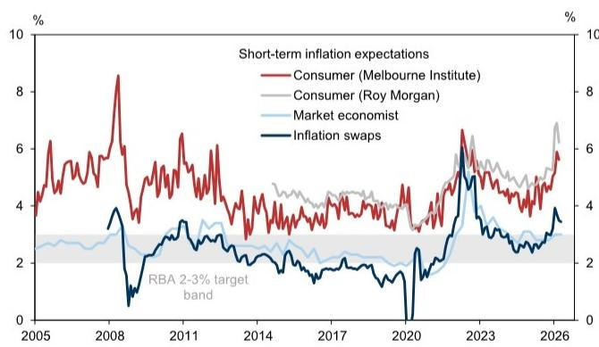

line chart

| Year | Consumer (Melbourne Institute) | Consumer (Roy Morgan) | Market economist | Inflation swaps |
|------|----------------------------------|------------------------|------------------|-----------------|
| 2005 | ~4%                              | ~4%                    | ~3%              | ~3%             |
| 2008 | ~8.5%                            | ~4%                    | ~3%              | ~4%             |
| 2011 | ~6%                              | ~4%                    | ~3%              | ~3%             |
| 2014 | ~4%                              | ~4%                    | ~3%              | ~3%             |
| 2017 | ~4%                              | ~4%                    | ~3%              | ~3%             |
| 2020 | ~4%                              | ~4%                    | ~3%              | ~3%             |
| 2023 | ~6.5%                            | ~6%                    | ~5%              | ~5%             |
| 2026 | ~7%                              | ~7%                    | ~6%              | ~4%             |

Source: Haver Analytics, RBA, Bloomberg, GS Global Investment Research

Exhibit 13: Long-term inflation expectations generally remain anchored  
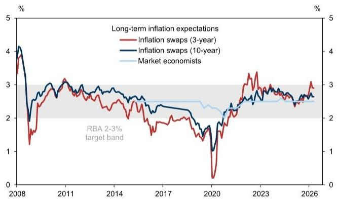

line chart

| Year | Inflation swaps (3-year) | Inflation swaps (10-year) | Market economists |
|------|--------------------------|---------------------------|-------------------|
| 2008 | ~4.0%                    | ~4.0%                     | ~2.5%             |
| 2011 | ~3.0%                    | ~3.0%                     | ~2.5%             |
| 2014 | ~2.5%                    | ~2.5%                     | ~2.5%             |
| 2017 | ~2.0%                    | ~2.0%                     | ~2.5%             |
| 2020 | ~0.5%                    | ~1.0%                     | ~2.5%             |
| 2023 | ~3.5%                    | ~3.0%                     | ~2.5%             |
| 2026 | ~3.0%                    | ~2.5%                     | ~2.5%             |

Source: RBA, GS Global Investment Research

## New Zealand

Selected prices covering around $50\%$ of NZ's quarterly CPI basket were little changed in the month, but year-over-year inflation in these prices accelerated 70bp to $5.6\%$ yoy. Excluding fuel, year-over-year inflation also increased 100bp to $3.0\%$ yoy.

Compositionally, petrol (-3.8%mom) and diesel prices (-11.4%mom) fell alongside lower global energy prices. Domestic (-11.4%mom) and international airfares (-5.5%mom)

also declined following a seasonal increase in April, while rents growth turned negative (-0.1%mom) for the second time this year. However, offsetting these declines was a material rise in food prices (+1.0%mom) driven by ready-to-eat food (+0.6%mom) and restaurant meals (+0.7%mom). The latter rose at its fastest pace since mid-2023 (Exhibit 15), possibly as a result of fuel surcharges.

Exhibit 14: Growth in New Zealand monthly prices picked up in May  
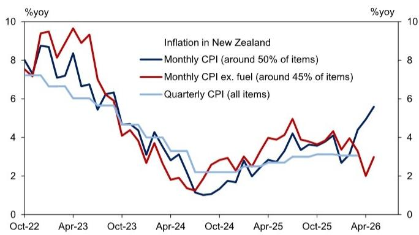

line chart

| Date | Monthly CPI (around 50% of items) (%)yoy | Monthly CPI ex. fuel (around 45% of items) (%)yoy | Quarterly CPI (all items) (%)yoy |
|---|---|---|---|
| Oct-22 | 8.0 | 7.5 | 7.3 |
| Apr-23 | 8.5 | 9.5 | 6.8 |
| Oct-23 | 6.0 | 6.5 | 5.8 |
| Apr-24 | 1.0 | 1.5 | 2.2 |
| Oct-24 | 1.5 | 2.8 | 2.2 |
| Apr-25 | 3.0 | 4.5 | 3.0 |
| Oct-25 | 3.5 | 4.0 | 3.1 |
| Apr-26 | 5.5 | 2.0 | 3.0 |

Source: StatsNZ, GS Global Investment Research

Exhibit 15: Restaurant meals rose at its fastest pace since mid-2023 in May  
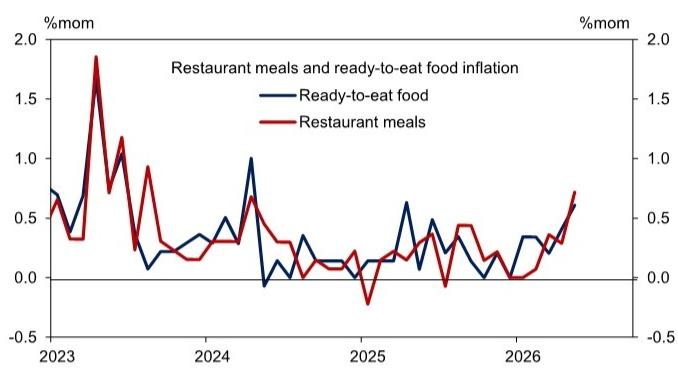

line chart

| Year | Ready-to-eat food | Restaurant meals |
|------|-------------------|------------------|
| 2023 | 0.7               | 0.6              |
| 2024 | 0.4               | 0.3              |
| 2025 | 0.1               | -0.2             |
| 2026 | 0.3               | 0.7              |

Source: StatsNZ

Elsewhere, business survey measures of selling prices remain elevated (Exhibit 16). Selling prices in the NZIER Quarterly Survey of Business Opinion rose to their highest level since 3Q2023. Measures of wage expectations are little changed at subdued levels, while businesses are reporting that finding skilled labour has become more difficult (Exhibit 17).

Exhibit 16: Measures of price pressures from business surveys remain elevated  
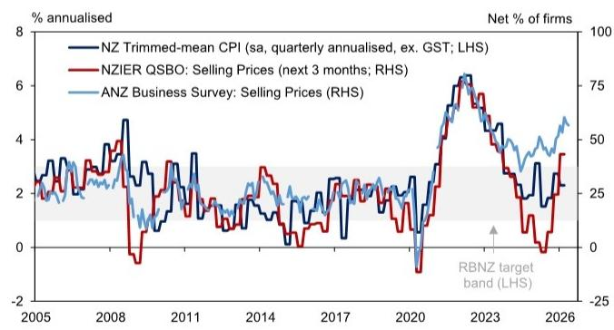

line chart

| Year | NZ Trimmed-mean CPI (sa, quarterly annualised, ex. GST; LHS) | NZIER QSBO: Selling Prices (next 3 months; RHS) | ANZ Business Survey: Selling Prices (RHS) |
|------|---------------------------------------------------------------|-----------------------------------------------|------------------------------------------|
| 2005 | ~2.5                                                          | ~2.0                                          | ~1.5                                     |
| 2008 | ~4.5                                                          | ~3.0                                          | ~2.5                                     |
| 2011 | ~3.0                                                          | ~2.5                                          | ~2.0                                     |
| 2014 | ~1.5                                                          | ~1.0                                          | ~0.5                                     |
| 2017 | ~2.0                                                          | ~1.5                                          | ~1.0                                     |
| 2020 | ~-1.0                                                         | ~-0.5                                         | ~-0.5                                    |
| 2023 | ~6.0                                                          | ~6.5                                          | ~5.0                                     |
| 2026 | ~3.0                                                          | ~3.5                                          | ~4.5                                     |

Source: Haver Analytics, GS Global Investment Research

Exhibit 17: Finding skilled labour has become more difficult, but wage expectations remain subdued  
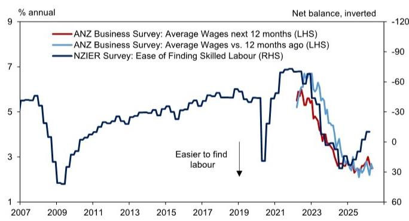

line chart

| Year | ANZ Business Survey: Average Wages next 12 months (LHS) | ANZ Business Survey: Average Wages vs. 12 months ago (LHS) | NZIER Survey: Ease of Finding Skilled Labour (RHS) |
|------|--------------------------------------------------------|----------------------------------------------------------|--------------------------------------------------|
| 2007 | 5.5                                                    | 5.5                                                      | 5.5                                              |
| 2009 | 3.0                                                    | 3.0                                                      | 3.0                                              |
| 2011 | 4.5                                                    | 4.5                                                      | 4.5                                              |
| 2013 | 5.0                                                    | 5.0                                                      | 5.0                                              |
| 2015 | 5.5                                                    | 5.5                                                      | 5.5                                              |
| 2017 | 6.0                                                    | 6.0                                                      | 6.0                                              |
| 2019 | 6.5                                                    | 6.5                                                      | 6.5                                              |
| 2021 | 7.0                                                    | 7.0                                                      | 7.0                                              |
| 2023 | 6.0                                                    | 6.0                                                      | 6.0                                              |
| 2025 | 3.0                                                    | 3.0                                                      | 3.0                                              |

Source: Haver Analytics, GS Global Investment Research

Short-term inflation expectations surveyed by the RBNZ rose sharply in 2Q2026, but long-term inflation expectations declined a little and remain around the midpoint of the RBNZ's target band (Exhibit 18).

Exhibit 18: Short-term inflation expectations rose further in 2Q2026  
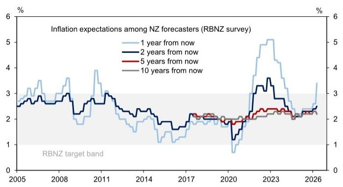

line chart

| Year | 1 year from now | 2 years from now | 5 years from now | 10 years from now |
|------|-----------------|------------------|------------------|-------------------|
| 2005 | ~2.8%           | ~2.7%            | ~2.6%            | ~2.5%             |
| 2008 | ~3.5%           | ~3.0%            | ~2.8%            | ~2.6%             |
| 2011 | ~4.0%           | ~3.5%            | ~3.0%            | ~2.8%             |
| 2014 | ~2.5%           | ~2.2%            | ~2.0%            | ~1.8%             |
| 2017 | ~1.8%           | ~1.9%            | ~1.9%            | ~1.9%             |
| 2020 | ~0.8%           | ~1.5%            | ~1.8%            | ~1.7%             |
| 2023 | ~5.0%           | ~3.5%            | ~2.5%            | ~2.3%             |
| 2026 | ~3.5%           | ~2.5%            | ~2.3%            | ~2.2%             |

Source: Haver Analytics, GS Global Investment Research

Dairy prices have been little changed over recent weeks after rallying to start 2026 (Exhibit 19).

Exhibit 19: Dairy prices have been little changed over recent weeks  
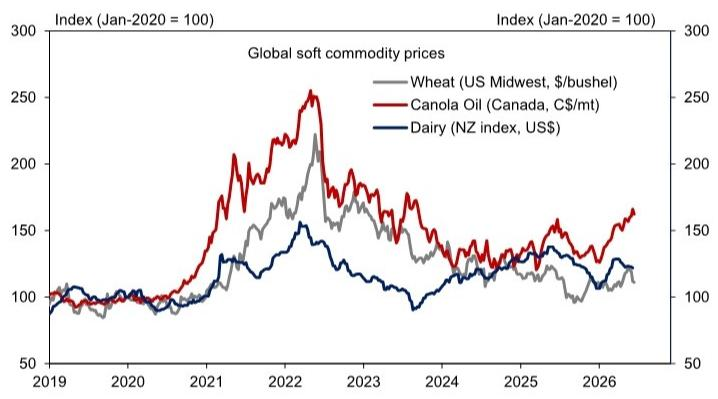

line chart

| Year | Wheat (US Midwest, $/bushel) | Canola Oil (Canada, C$/mt) | Dairy (NZ index, US$) |
|------|------------------------------|-----------------------------|------------------------|
| 2019 | ~100                         | ~100                        | ~100                   |
| 2020 | ~100                         | ~100                        | ~100                   |
| 2021 | ~150                         | ~180                        | ~120                   |
| 2022 | ~220                         | ~250                        | ~150                   |
| 2023 | ~180                         | ~200                        | ~130                   |
| 2024 | ~140                         | ~160                        | ~110                   |
| 2025 | ~130                         | ~150                        | ~120                   |
| 2026 | ~110                         | ~170                        | ~130                   |

Source: Haver Analytics, GS Global Investment Research

## The Australia and NZ Economics Team

## Andrew Boak, CFA

+61(2)9321-8576

andrew.boak@gs.com

GS Australia Pty Ltd

## Will Maher

+61(2)9320-1013

will.maher@gs.com

GS Australia Pty Ltd

## Oscar To

+61(2)9320-1367

oscar.to@gs.com

GS Australia Pty Ltd

## Disclosure Appendix

## Reg AC

We, Andrew Boak, CFA, Will Maher and Oscar To, hereby certify that all of the views expressed in this report accurately reflect our personal views, which have not been influenced by considerations of the firm's business or client relationships.

Unless otherwise stated, the individuals listed on the cover page of this report are analysts in GS' Global Investment Research division.

Contributing Authors: Andrew Boak, CFA GS Australia Pty Ltd, Will Maher GS Australia Pty Ltd, Oscar To GS Australia Pty Ltd.

Unless otherwise stated, the individuals listed in the Contributing Authors disclosure of this report are analysts in GS' Global Investment Research division.

## Disclosures

## Regulatory disclosures

## Disclosures required by United States laws and regulations

See company-specific regulatory disclosures above for any of the following disclosures required as to companies referred to in this report: manager or co-manager in a pending transaction; $1\%$ or other ownership; compensation for certain services; types of client relationships; managed/co-managed public offerings in prior periods; directorships; for equity securities, market making and/or specialist role. GS trades or may trade as a principal in debt securities (or in related derivatives) of issuers discussed in this report.

The following are additional required disclosures: Ownership and material conflicts of interest: GS policy prohibits its analysts, professionals reporting to analysts and members of their households from owning securities of any company in the analyst's area of coverage. Analyst compensation: Analysts are paid in part based on the profitability of GS, which includes investment banking revenues. Analyst as officer or director: GS policy generally prohibits its analysts, persons reporting to analysts or members of their households from serving as an officer, director or advisor of any company in the analyst's area of coverage. Non-U.S. Analysts: Non-U.S. analysts may not be associated persons of GS & Co. LLC and therefore may not be subject to FINRA Rule 2241 or FINRA Rule 2242 restrictions on communications with a subject company, public appearances and trading in securities covered by the analysts.

## Additional disclosures required under the laws and regulations of jurisdictions other than the United States

The following disclosures are those required by the jurisdiction indicated, except to the extent already made above pursuant to United States laws and regulations. Australia: GS Australia Pty Ltd and its affiliates are not authorised deposit-taking institutions (as that term is defined in the Banking Act 1959 (Cth)) in Australia and do not provide banking services, nor carry on a banking business, in Australia. This research, and any access to it, is intended only for “wholesale clients” within the meaning of the Australian Corporations Act, unless otherwise agreed by GS. In producing research reports, members of Global Investment Research of GS Australia may attend site visits and other meetings hosted by the companies and other entities which are the subject of its research reports. In some instances the costs of such site visits or meetings may be met in part or in whole by the issuers concerned if GS Australia considers it is appropriate and reasonable in the specific circumstances relating to the site visit or meeting. To the extent that the contents of this document contains any financial product advice, it is general advice only and has been prepared by GS without taking into account a client’s objectives, financial situation or needs. A client should, before acting on any such advice, consider the appropriateness of the advice having regard to the client’s own objectives, financial situation and needs. A copy of certain GS Australia and New Zealand disclosure of interests and a copy of GS’ Australian Sell-Side Research Independence Policy Statement are available at: https://www.goldmansachs.com/disclosures/australia-new-zealand/index.html. Brazil: Disclosure information in relation to CVM Resolution n. 20 is available at https://www.gs.com/worldwide/brazil/area/gir/index.html. Where applicable, the Brazil-registered analyst primarily responsible for the content of this research report, as defined in Article 20 of CVM Resolution n. 20, is the first author named at the beginning of this report, unless indicated otherwise at the end of the text. Canada: This information is being provided to you for information purposes only and is not, and under no circumstances should be construed as, an advertisement, offering or solicitation by GS & Co. LLC for purchasers of securities in Canada to trade in any Canadian security. GS & Co. LLC is not registered as a dealer in any jurisdiction in Canada under applicable Canadian securities laws and generally is not permitted to trade in Canadian securities and may be prohibited from selling certain securities and products in certain jurisdictions in Canada. If you wish to trade in any Canadian securities or other products in Canada please contact GS Canada Inc., an affiliate of The GS Group Inc., or another registered Canadian dealer. Hong Kong: Further information on the securities of covered companies referred to in this research may be obtained on request from GS (Asia) L.L.C. India: Further information on the subject company or companies referred to in this research may be obtained from GS (India) Securities Private Limited, Research Analyst - SEBI Registration Number INH000001493, 10th Floor, Ascent-Worli, Sudam Kalu Ahire Marg, Worli, Mumbai-400 025, India, Corporate Identity Number U74140MH2006FTC160634, Phone +91 22 6616 9000, Fax +91 22 6616 9001. GS may beneficially own 1% or more of the securities (as such term is defined in clause 2 (h) the Indian Securities Contracts (Regulation) Act, 1956) of the subject company or companies referred to in this research report. Investment in securities market are subject to market risks. Read all the related documents carefully before investing. Registration granted by SEBI and certification from NISM in no way guarantee performance of the intermediary or provide any assurance of returns to investors. GS (India) Securities Private Limited compliance officer and investor grievance contact details can be found at: https://www.goldmansachs.com/worldwide/india/documents/Grievance-Redressal-and-Escalation-Matrix.pdf, and a copy of the annual audit compliance report can be found at this link: https://publishing.gs.com/content/site/india-annual-compliance-report.html. Japan: See below. Korea: This research, and any access to it, is intended only for “professional investors” within the meaning of the Financial Services and Capital Markets Act, unless otherwise agreed by GS. Further information on the subject company or companies referred to in this research may be obtained from GS (Asia) L.L.C., Seoul Branch. New Zealand: GS New Zealand Limited and its affiliates are neither “registered banks” nor “deposit takers” (as defined in the Reserve Bank of New Zealand Act 1989) in New Zealand. This research, and any access to it, is intended for “wholesale clients” (as defined in the Financial Advisers Act 2008) unless otherwise agreed by GS. A copy of certain GS Australia and New Zealand disclosure of interests is available at: https://www.goldmansachs.com/disclosures/australia-new-zealand/index.html. Russia: Research reports distributed in the Russian Federation are not advertising as defined in the Russian legislation, but are information and analysis not having product promotion as their main purpose and do not provide appraisal within the meaning of the Russian legislation on appraisal activity. Research reports do not constitute a personalized investment recommendation as defined in Russian laws and regulations, are not addressed to a specific client, and are prepared without analyzing the financial circumstances, investment profiles or risk profiles of clients. GS assumes no responsibility for any investment decisions that may be taken by a client or any other person based on this research report. Singapore: GS (Singapore) Pte. (Company Number: 198602165W), which is regulated by the Monetary Authority of Singapore, accepts legal responsibility for this research, and should be contacted with respect to any matters arising from, or in connection with, this research. Taiwan: This material is for reference only and must not be reprinted without permission. Investors should carefully consider their own investment risk. Investment results are the responsibility of the individual investor. United Kingdom: Persons who would be categorized as retail clients in the United Kingdom, as such term is

defined in the rules of the Financial Conduct Authority, should read this research in conjunction with prior GS on the covered companies referred to herein and should refer to the risk warnings that have been sent to them by GS International. A copy of these risks warnings, and a glossary of certain financial terms used in this report, are available from GS International on request.

European Union and United Kingdom: Disclosure information in relation to Article 6 (2) of the European Commission Delegated Regulation (EU) (2016/958) supplementing Regulation (EU) No 596/2014 of the European Parliament and of the Council (including as that Delegated Regulation is implemented into United Kingdom domestic law and regulation following the United Kingdom's departure from the European Union and the European Economic Area) with regard to regulatory technical standards for the technical arrangements for objective presentation of investment recommendations or other information recommending or suggesting an investment strategy and for disclosure of particular interests or indications of conflicts of interest is available at https://www.gs.com/disclosures/europeanpolicy.html which states the European Policy for Managing Conflicts of Interest in Connection with Investment Research.

Japan: GS Japan Co., Ltd. is a Financial Instrument Dealer registered with the Kanto Financial Bureau under registration number Kinsho 69, and a member of Japan Securities Dealers Association, Financial Futures Association of Japan Type II Financial Instruments Firms Association, and Investment Management Association of Japan. Sales and purchase of equities are subject to commission pre-determined with clients plus consumption tax. See company-specific disclosures as to any applicable disclosures required by Japanese stock exchanges, the Japanese Securities Dealers Association or the Japanese Securities Finance Company.

## Global product; distributing entities

GS Global Investment Research produces and distributes research products for clients of GS on a global basis. Analysts based in GS offices around the world produce research on industries and companies, and research on macroeconomics, currencies, commodities and portfolio strategy. This research is disseminated in Australia by GS Australia Pty Ltd (ABN 21 006 797 897); in Brazil by GS do Brasil Corretora de Títulos e Valores Mobiliários S.A.; Public Communication Channel GS Brazil: 0800 727 5764 and / or contatogoldmanbrasil@gs.com. Available Weekdays (except holidays), from 9am to 6pm. Canal de Comunicação com o Público GS Brasil: 0800 727 5764 e/ou contatogoldmanbrasil@gs.com. Horário de funcionamento: segunda-feira à sexta-feira (exceto feriados), das 9h às 18h; in Canada by GS & Co. LLC; in Hong Kong by GS (Asia) L.L.C.; in India by GS (India) Securities Private Ltd.; in Japan by GS Japan Co., Ltd.; in the Republic of Korea by GS (Asia) L.L.C., Seoul Branch; in New Zealand by GS New Zealand Limited; in Russia by OOO GS; in Singapore by GS (Singapore) Pte. (Company Number: 198602165W); and in the United States of America by GS & Co. LLC. GS International has approved this research in connection with its distribution in the United Kingdom.

GS International (“GSI”), authorised by the Prudential Regulation Authority (“PRA”) and regulated by the Financial Conduct Authority (“FCA”) and the PRA, has approved this research in connection with its distribution in the United Kingdom.

European Economic Area: GS Bank Europe SE (“GSBE”) is a credit institution incorporated in Germany and, within the Single Supervisory Mechanism, subject to direct prudential supervision by the European Central Bank and in other respects supervised by German Federal Financial Supervisory Authority (Bundesanstalt für Finanzdienstleistungsaufsicht, BaFin) and Deutsche Bundesbank and disseminates research within the European Economic Area.

## General disclosures

This research is for our clients only. Other than disclosures relating to GS, this research is based on current public information that we consider reliable, but we do not represent it is accurate or complete, and it should not be relied on as such. The information, opinions, estimates and forecasts contained herein are as of the date hereof and are subject to change without prior notification. We seek to update our research as appropriate, but various regulations may prevent us from doing so. Other than certain industry reports published on a periodic basis, the large majority of reports are published at irregular intervals as appropriate in the analyst's judgment.

GS conducts a global full-service, integrated investment banking, investment management, and brokerage business. We have investment banking and other business relationships with a substantial percentage of the companies covered by Global Investment Research. GS & Co. LLC, the United States broker dealer, is a member of SIPC (https://www.sipc.org).

Our salespeople, traders, and other professionals may provide oral or written market commentary or trading strategies to our clients and principal trading desks that reflect opinions that are contrary to the opinions expressed in this research. Our asset management area, principal trading desks and investing businesses may make investment decisions that are inconsistent with the recommendations or views expressed in this research.

We and our affiliates, officers, directors, and employees will from time to time have long or short positions in, act as principal in, and buy or sell, the securities or derivatives, if any, referred to in this research, unless otherwise prohibited by regulation or GS policy.

The views attributed to third party presenters at GS arranged conferences, including individuals from other parts of GS, do not necessarily reflect those of Global Investment Research and are not an official view of GS.

Any third party referenced herein, including any salespeople, traders and other professionals or members of their household, may have positions in the products mentioned that are inconsistent with the views expressed by analysts named in this report.

This research is focused on investment themes across markets, industries and sectors. It does not attempt to distinguish between the prospects or performance of, or provide analysis of, individual companies within any industry or sector we describe.

Any trading recommendation in this research relating to an equity or credit security or securities within an industry or sector is reflective of the investment theme being discussed and is not a recommendation of any such security in isolation.

This research is not an offer to sell or the solicitation of an offer to buy any security in any jurisdiction where such an offer or solicitation would be illegal. It does not constitute a personal recommendation or take into account the particular investment objectives, financial situations, or needs of individual clients. Clients should consider whether any advice or recommendation in this research is suitable for their particular circumstances and, if appropriate, seek professional advice, including tax advice. The price and value of investments referred to in this research and the income from them may fluctuate. Past performance is not a guide to future performance, future returns are not guaranteed, and a loss of original capital may occur. Fluctuations in exchange rates could have adverse effects on the value or price of, or income derived from, certain investments.

Certain transactions, including those involving futures, options, and other derivatives, give rise to substantial risk and are not suitable for all investors. Investors should review current options and futures disclosure documents which are available from GS sales representatives or at https://www.theocc.com/about/publications/character-risks.jsp and https://www.goldmansachs.com/disclosures/cftc\_fcm\_disclosures. Transaction costs may be significant in option strategies calling for multiple purchase and sales of options such as spreads. Supporting documentation will be supplied upon request.

Differing Levels of Service provided by Global Investment Research: The level and types of services provided to you by GS Global Investment Research may vary as compared to that provided to internal and other external clients of GS, depending on various factors including your individual preferences as to the frequency and manner of receiving communication, your risk profile and investment focus and perspective (e.g., marketwide, sector specific, long term, short term), the size and scope of your overall client relationship with GS, and legal and regulatory constraints. As an example, certain clients may request to receive notifications when research on specific securities is published, and certain clients may request that specific data underlying analysts' fundamental analysis available on our internal client websites be delivered to them electronically through data feeds or otherwise. No change to an analyst's fundamental research views (e.g., ratings, price targets, or material changes to earnings estimates for equity securities), will be communicated to any client prior to inclusion of such information in a research report broadly disseminated through electronic publication to our internal client websites or through other means, as necessary, to all clients who are entitled to receive such reports.

All research reports are disseminated and available to all clients simultaneously through electronic publication to our internal client websites. Not all research content is redistributed to our clients or available to third-party aggregators, nor is GS responsible for the redistribution of our research by third party aggregators. For research, models or other data related to one or more securities, markets or asset classes (including related services) that may be available to you, please contact your GS representative or go to https://research.gs.com.

Disclosure information is also available at https://www.gs.com/research/hedge.html or from Research Compliance, 200 West Street, New York, NY 10282.

## © 2026 GS.

You are permitted to store, display, analyze, modify, reformat, and print the information made available to you via this service only for your own use. You may not resell or reverse engineer this information to calculate or develop any index for disclosure and/or marketing or create any other derivative works or commercial product(s), data or offering(s) without the express written consent of GS. You are not permitted to publish, transmit, or otherwise reproduce this information, in whole or in part, in any format to any third party without the express written consent of GS. This foregoing restriction includes, without limitation, using, extracting, downloading or retrieving this information, in whole or in part, to train or finetune a machine learning or artificial intelligence system, or to provide or reproduce this information, in whole or in part, as a prompt or input to any such system.