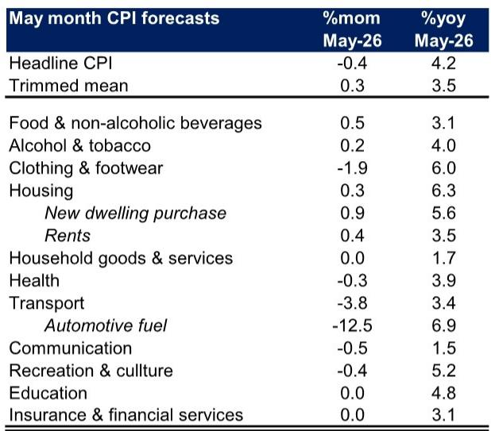

# The Inflation Narrative Has Shifted: Why the Next Phase of Disinflation Will Be Harder Than the Last

The conventional wisdom that inflation is steadily receding in Australia and New Zealand is about to face its most serious test. April's headline print for Australia showed year-over-year inflation decelerating 40 basis points to 4.2 percent, which on the surface appears encouraging. But beneath that headline lies a more complicated story that every serious investor needs to understand. The easy disinflation, driven by falling goods prices and base effects, is largely behind us. What comes next will be determined not by global supply chains or energy prices alone, but by the slow, sticky, and politically sensitive transmission of input costs through domestic services, housing, and food.

The data from a global investment bank's latest inflation monitor reveals a pattern that should command the attention of anyone managing portfolios exposed to Australian and New Zealand assets. In Australia, the monthly trimmed mean measure -- the central bank's preferred gauge of underlying inflation -- is forecast to accelerate 10 basis points to 3.5 percent year-over-year in May. That is not a rounding error. It is a signal that the disinflation process is losing momentum precisely when central banks need it most. In New Zealand, the picture is even more stark: year-over-year inflation in the prices covering roughly 50 percent of the CPI basket accelerated 70 basis points to 5.6 percent, with food prices rising at their fastest pace since mid-2023.

The argument of this article is straightforward: the next phase of the inflation cycle will be defined not by the direct effects of oil prices, but by their second-round pass-through into areas that central banks cannot easily control with interest rates alone. Investors who treat the recent moderation in headline numbers as a green light for risk assets are misreading the signal.

## The Direct Fuel Effect Is Masking a Broader and More Persistent Inflation Pressure

The most immediate observation from the April and May data is that falling fuel prices are creating a misleading sense of relief. In Australia, automotive fuel is expected to decline 12.5 percent month-on-month in May, driven by lower global crude oil prices and the temporary reduction in the fuel excise tax. That single component will drag headline CPI down by roughly 0.4 percent month-on-month, leaving year-over-year inflation unchanged at 4.2 percent. But this is a mechanical effect that tells us nothing about the underlying trend.

What matters is what is happening beneath the fuel line. The report's forecast for trimmed mean CPI to rise 0.3 percent month-on-month and accelerate to 3.5 percent year-over-year in May is a clear warning that underlying inflation is not responding to the same forces that drove the initial decline from its peak. The three-month-on-three-month trimmed mean measure is expected to increase to 0.88 percent quarter-on-quarter, a pace that remains well above the Reserve Bank of Australia's target band.

The strategic insight here is that fuel prices create a two-stage inflation dynamic. The first stage is direct and visible: lower fuel prices mechanically reduce headline CPI. The second stage is indirect, delayed, and far more difficult to forecast: higher fuel prices feed into production costs for food, housing, transport services, and hospitality, and those costs take months to show up in consumer prices. The report explicitly flags that the indirect pass-through of higher fuel prices is expected to intensify in May, particularly in new dwelling purchases, restaurant meals, and takeaway food. This is the mechanism that will keep underlying inflation elevated even as headline numbers appear to moderate.

## Housing and Construction Costs Are Reaccelerating in a Way That Defies Monetary Policy

If there is one sector that encapsulates the difficulty of the next disinflation phase, it is housing. The April CPI report showed a slight easing in rents inflation, but that is likely to be temporary. Growth in SQM advertised rents picked up further in May, and these will pass through to the CPI's measure of the stock of rents over time. More concerning is the trajectory of new dwelling inflation, which accelerated further in April and is forecast to rise 0.9 percent month-on-month in May.

The driver is unmistakable: higher input costs. The report documents that key plumbing and trade material suppliers are announcing a greater number of price rises, with the average increase exceeding the post-COVID peak. Fertiliser prices remain elevated. These are not transitory supply chain disruptions. They are structural cost pressures embedded in the construction and agricultural supply chains that will take years to fully dissipate.

The implication for investors is that housing inflation will remain a stubborn contributor to the CPI basket for the foreseeable future. New dwelling costs are not sensitive to interest rates in the same way as consumer spending. They are driven by labour shortages, material costs, and regulatory constraints. The RBA can raise rates to cool demand, but it cannot build houses faster or reduce the cost of imported materials. This asymmetry means that housing will act as a floor under inflation even as other components moderate.

## The Labour Market Is Close to Balance, But That Is No Longer the Dominant Inflation Driver

One of the more nuanced findings in the report is that measures of labour tightness included in the RBA's indicator framework suggest conditions are close to balance and not contributing excessively to inflation. This is consistent with the broader narrative that the labour market is cooling without a sharp rise in unemployment, which is the ideal outcome for central banks.

But the report's own data on market services inflation tells a different story about the transmission mechanism. The forecast for restaurant meals and takeaway food to each rise by 0.7 percent month-on-month, alongside reports of fuel surcharges in the food and hospitality industry, indicates that cost-push inflation is now the dominant force, not demand-pull. Labour market tightness may be easing, but businesses are still passing through higher energy and material costs to consumers. The drivers of services inflation have shifted from wages to input costs, and that shift has important implications for the effectiveness of monetary policy.

If inflation were primarily demand-driven, raising interest rates would be the correct remedy. But if inflation is being driven by cost pass-through from global energy and commodity prices, then monetary policy is a blunt and slow-acting instrument. The RBA can cool demand, but it cannot lower global oil prices or reduce the cost of imported building materials. This is not an argument for policy inaction. It is an argument for a more nuanced assessment of what the inflation data actually means for the trajectory of rates.

## What the Report Does Not Fully Answer: The Uncertainty in the May Forecast and the Limits of Data Collection

Every serious research report contains an honest assessment of its own limitations, and this one is no exception. The authors flag a higher-than-usual degree of uncertainty in the May forecasts for two specific reasons. First, the heightened volatility in fuel prices stemming from both the excise tax reduction and movements in global oil prices creates a wide range of possible outcomes for the headline number. Second, May will be the first month in which international airfares reflect the impact of the Middle East conflict, because these prices are collected two months in advance.

This second point is worth dwelling on because it reveals a structural limitation in how inflation data is gathered and interpreted. The fact that international airfare prices are collected with a two-month lag means that the full impact of geopolitical shocks on travel costs will not appear in the data until months after they occur. By the time the data is published, the shock may have already passed, or it may have been compounded by further developments. Investors who rely on real-time or near-real-time inflation data to make portfolio decisions need to account for these lags in their models.

The report also does not fully address the question of how persistent the indirect pass-through effects will be. The forecast assumes that higher fuel costs will feed through to restaurant meals, new dwellings, and takeaway food in May, but it does not model how long these effects will last or whether they will compound over time. If fuel prices remain elevated, the pass-through could continue for several months, creating a sustained upward pressure on core inflation that the central bank cannot ignore.

## A Decision Framework for Investors: How to Interpret the Next Three Months of Data

Given the complexity of the current inflation dynamics, investors need a structured framework for interpreting the incoming data rather than reacting to each print in isolation. The following three-part framework is derived from the logic of the report and is designed to separate signal from noise.

First, distinguish between direct and indirect effects. A decline in headline CPI driven by falling fuel prices is not the same as a broad-based disinflation. If headline inflation falls but trimmed mean inflation accelerates, the central bank cannot declare victory. The correct metric to watch is the three-month-on-three-month trimmed mean, which smooths out monthly volatility and reveals the underlying trend. If that measure remains above 0.8 percent quarter-on-quarter, the RBA is unlikely to cut rates regardless of what the headline number shows.

Second, track the pass-through from input costs to consumer prices with a six-to-twelve-month time horizon. The report's data on building material price rises and fertiliser costs is a leading indicator for future housing and food inflation. When plumbing suppliers announce price increases that exceed the post-COVID peak, that information will show up in the CPI data months later. Investors who wait for the official data to confirm the trend will be late to adjust their positioning.

Third, monitor the divergence between Australia and New Zealand. The two economies are experiencing similar inflationary pressures from fuel and food, but their data collection methodologies differ, and their central banks face different political and economic constraints. The report notes that international airfare prices fell in New Zealand's May data but are expected to rise in Australia's, partly due to differences in collection timing. These cross-country divergences create relative value opportunities for investors who can identify which market is pricing in the correct inflation trajectory.

## The Unresolved Questions That Should Keep Investors Engaged

The report leaves several meaningful questions unanswered, and these are precisely the questions that will determine the next phase of the inflation cycle. How long will the indirect pass-through of higher fuel prices persist? Will the construction material cost increases prove transitory or structural? Can the RBA and RBNZ achieve their inflation targets without causing a recession, or is the cost-push inflation mechanism strong enough to keep rates higher for longer than the market currently expects?

These are not academic questions. They have direct implications for bond yields, currency valuations, equity sector rotation, and real asset pricing. The full report contains detailed charts on building supply price announcements, fertiliser costs, advertised rent growth, and inflation expectations that provide the raw data for answering these questions. But the interpretation requires a framework that goes beyond the numbers.

The report's data on inflation expectations is particularly instructive. Short-term expectations remain well above the RBA's target band, even if they have retraced from their peaks. Long-term expectations generally remain anchored around the midpoint of the target band. This is the central bank's nightmare scenario: elevated short-term expectations that risk feeding into wage-setting and price-setting behaviour, even as long-term credibility remains intact. If short-term expectations become unanchored, the central bank will have to act more aggressively, regardless of what the real economy data suggests.

Join the community to read the full report and review the original charts. The exhibits on building supply price announcements, advertised rents, and the pass-through from materials to consumer prices are essential for any investor trying to build a forward-looking view of Australian and New Zealand inflation.

*This article is for learning and discussion only and does not constitute investment advice.*

Personal reading notes and learning share only. Not investment advice.

