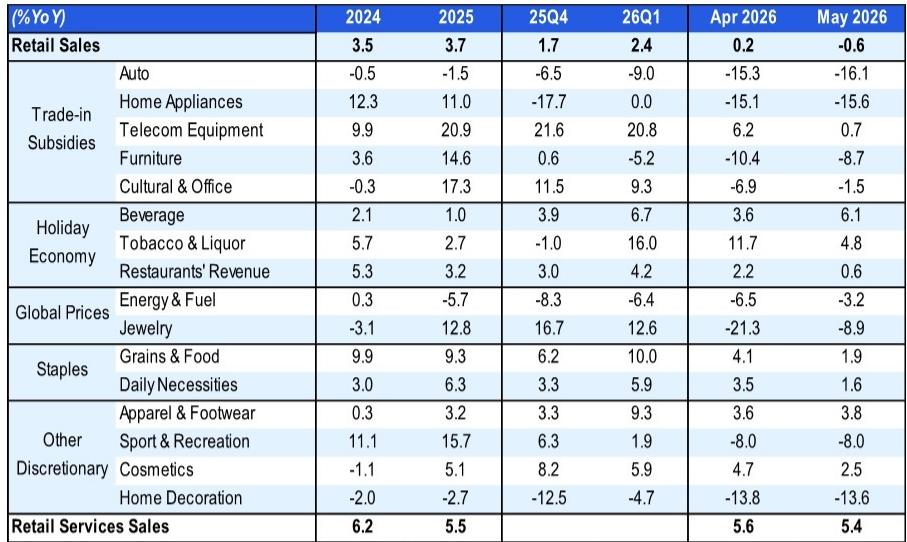

# China’s Economy Is No Longer K-Shaped: The AI Supercycle Is Masking a Domestic Stagflation That Policy Is Not Ready to Address

The dominant narrative of a K-shaped Chinese economy has been a useful shorthand for the past year. It is now insufficient. The May 2026 activity data reveals a structure that is more extreme and more dangerous than a simple divergence between winners and losers. What we are witnessing is an industrial and export boom driven by an artificial intelligence supercycle, layered on top of a domestic economy that is quietly entering a stagflationary phase. Industrial production rebounded to 4.5% year-on-year, largely powered by high-tech sectors that hit a five-year high. Yet retail sales contracted for the first time since the pandemic, fixed asset investment deepened its decline, and the combination of steady consumer prices with rising producer prices is creating a real-economy squeeze not seen since the depths of the Covid shock. The headline GDP proxy may hold steady near the lower end of the official target, but this is a statistical artifact. The real economy is bifurcating in a way that makes the K-shaped label feel like an understatement. The central question for investors is no longer whether the government will act. It is whether the government’s toolkit is designed to address the right problem.

The critical insight from the May data is that the AI supercycle is not a tide that lifts all boats. It is a sector-specific, capex-intensive, export-oriented phenomenon that is generating growth in high-tech industrial production and intellectual property investment, but is doing almost nothing for the 80% of the economy that relies on domestic consumption and traditional fixed asset formation. The high-tech industrial production index rose 15.1% year-on-year, its fastest pace in five years, and Citi estimates that this sector alone contributed more than half of total industrial production growth. Output of integrated circuits, industrial robots, and new energy vehicles all accelerated. Meanwhile, the old economy is in visible retreat. Crude steel output continued to contract. Cement output dropped 8.1%. Infrastructure investment slowed to near-stall speed. The Six Networks initiative may eventually provide a floor, but it has not yet done so. The result is an economy that can report a decent headline growth number while millions of households and thousands of small retailers experience something that feels much closer to recession.

This is not merely a cyclical slowdown. The combination of contracting retail sales, deepening investment declines, and steady-to-rising prices has a specific name: stagflation. The domestic side of the Chinese economy is now exhibiting both falling demand and persistent price pressure. Real retail sales growth, when adjusted for a steady CPI of 1.2%, turned deeply negative. Real fixed asset investment growth is at its lowest since the pandemic. The PPI is reflating, and while some of this can be attributed to the Middle East conflict, the data shows that the supply-side disruption is broader than energy alone. Petrochemical-related output is recovering, yet PPI pressures persist. This is not a classic demand-pull inflation. It is a cost-push phenomenon meeting weak demand, which is precisely the recipe for stagflation. For investors, this is a regime shift. The old playbook of buying Chinese cyclicals on a policy stimulus narrative may no longer work if the stimulus is targeted at supply-side issues while demand continues to erode.

Policymakers are not blind to this, but their response is constrained by a paradox. Headline GDP is still hovering around 4.5%, which is within the lower end of the official target. As long as that number holds, the bar for a broad-based stimulus is high. The July Politburo meeting is likely to focus on consumption and household income, but the report explicitly states that an outright lift of the budget deficit or government bond quota is not the base case. Monetary policy is not in the driver’s seat. The expected 10-basis-point rate cut is symbolic. The real action will be in targeted measures: the Six Networks for investment stabilization, and potentially more aggressive support for job creation and household income. But targeted measures, by definition, do not address the breadth of the domestic demand collapse. The question that the report raises but does not fully answer is whether the government is willing to accept a prolonged period of domestic stagnation in exchange for maintaining the AI supercycle’s momentum and export competitiveness. That trade-off is becoming increasingly visible, and it has profound implications for asset allocation.

## The AI Supercycle Is a Supply-Side Miracle That Is Creating a Demand-Side Vacuum

The May data on high-tech industrial production is genuinely impressive. The 15.1% year-on-year growth in high-tech industrial production is not just a number; it is a structural signal. It tells us that China’s investment in AI infrastructure, semiconductor fabrication, and advanced manufacturing is yielding real output. Integrated circuit production grew 22.9% year-on-year, industrial robots surged 27.9%, and new energy vehicles rebounded sharply to 17.8%. These are not subsidy-driven blips. They reflect a genuine ramp in capacity and global demand. The export delivery index remained steady at 10.1%. This is the supply-side success story that the government wants to tell.

But here is the problem. This supercycle is generating investment and production, not consumption and income. The capex is concentrated in telecom manufacturing, intellectual property, and a narrow set of high-tech subsectors. It is not creating broad-based employment. It is not lifting household incomes in the service sector. It is not feeding into retail sales. The AI supercycle is, in effect, a supply-side miracle that is operating in a demand-side vacuum. The factories are running. The robots are being built. The chips are being shipped. But the people who would buy the goods and services that sustain the broader economy are pulling back. This is not a contradiction. It is the logical outcome of an investment model that prioritizes strategic industries over household consumption. The result is that the industrial production index is decoupling from the real economy in a way that makes it a misleading indicator of overall health.

The strategic implication is clear. Investors who focus only on the headline industrial production number or the high-tech export data are missing the forest for the trees. The AI supercycle is real, but it is also narrow. It creates opportunities in specific supply chains and specific sectors, but it does not provide a hedge against the broader domestic downturn. A portfolio that is long on AI hardware and short on Chinese consumer discretionary may be the correct structural trade, but it is also a trade that depends on the government not changing its policy stance. If the Politburo does shift toward aggressive household income support, the relative performance of these two segments could reverse quickly.

## The Domestic Stagflation Is Real, and It Is Being Underestimated by Markets

The May retail sales print of -0.6% year-on-year is the first negative reading since the pandemic. This is not a blip. The components tell a story of broad-based weakness. Auto sales fell 16.1%. Home appliances dropped 15.6%. Telecom equipment sales slowed to near zero. The trade-in subsidy program, which was supposed to support consumption, is now a drag, subtracting an estimated 2.2 percentage points from retail sales growth. The high base from last year’s subsidies is creating a headwind that will persist through the first half of 2026. Restaurant revenue grew only 0.6%. Beverage and tobacco sales, which typically reflect social activity and confidence, were sluggish. Even the holiday economy, which usually provides a seasonal boost, failed to generate momentum.

The stagflation characterization is not alarmist. CPI held steady at 1.2%, which means nominal retail sales are falling while prices are rising. Real retail sales growth is deeply negative. PPI is reflating, driven by both energy and non-energy components. The Middle East conflict resolution is helping on the margin, but the data shows that PPI pressures are broadening beyond crude. This is a classic stagflationary mix: falling output, rising input costs, and sticky consumer prices. For corporate profits in the domestic sector, this is the worst possible environment. Revenues are declining, margins are being squeezed by input costs, and pricing power is limited because demand is weak.

The market may be underestimating how persistent this condition can be. Stagflation is notoriously difficult to escape because the standard policy tools work at cross-purposes. Stimulus to boost demand risks adding to inflation. Tightening to control inflation risks deepening the contraction. The Chinese government has an additional constraint: it is unwilling to deploy broad-based fiscal or monetary stimulus because headline GDP is still within the target range. This means the stagflation could persist for several quarters, slowly eroding corporate earnings and household balance sheets. Investors should be asking themselves whether their current exposure to Chinese domestic cyclicals and consumer discretionary stocks adequately reflects this risk.

## Investment Is Collapsing Where It Matters Most, and the Six Networks Are Not Yet a Substitute

The fixed asset investment data for May is worse than the headline suggests. Cumulative FAI fell 4.1% year-on-year, but the monthly run rate is estimated at -10.7%, the lowest since the fourth quarter of 2025. The breakdown is instructive. Infrastructure investment dropped to 0.6% year-on-year on a cumulative basis, with the monthly reading estimated at -9.1%. Manufacturing investment is showing tentative signs of stabilization, but only because the new economy is offsetting the collapse in traditional manufacturing. Property investment is in freefall, with cumulative growth at -16.2% and the monthly rate at -24.3%.

The government’s response is the Six Networks initiative, which is designed to stabilize investment through targeted infrastructure and technology projects. The report notes that this initiative has likely started, but it is not yet showing up in the data. This is a timing issue, but it is also a scale issue. The Six Networks are not a replacement for the property sector, which was the primary engine of investment and employment for two decades. They are not going to generate the same multiplier effects. They are not going to create the same volume of jobs. They are a palliative, not a cure.

For investors, the key question is whether the property sector has found a floor. The data from May is mixed. Second-hand home prices in Tier-1 cities rose again, and the three-month annualized rate of price appreciation is the highest since mid-2023. Sales volumes in Shanghai remain above last year’s levels. But this improvement is not spreading. Only 10 out of 70 cities reported sequential increases in second-hand prices, down from 12 in April. Tier-3 cities are still deteriorating. National floor space sales fell 13.1% year-on-year. Property investment continues to contract sharply. The green shoots are real, but they are limited to the most liquid, most desirable urban markets. The broader property market is still in a deep adjustment. Until that adjustment broadens or bottoms, the investment backdrop will remain a significant drag on the economy.

## The Report Leaves a Critical Question Unanswered: What Happens When the AI Supercycle Matures?

The report is excellent at describing the current divergence, but it leaves one question largely unexplored: what happens when the AI supercycle matures? The current boom in high-tech industrial production is partly driven by a global capex cycle in AI infrastructure. Data centers, semiconductor fabs, and automation equipment are being built at a rapid pace. But this cycle is not infinite. At some point, the build-out will peak. The demand for industrial robots and integrated circuits will normalize. When that happens, the main engine of the current industrial production growth will slow.

If the domestic economy is still in a stagflationary state at that point, the government will face a much more difficult situation. It will have lost the export and production buffer that is currently masking the domestic weakness. It will have to choose between accepting a much lower headline growth rate or deploying the broad-based stimulus that it is currently resisting. The report’s base case is that the sharpest slowdown is behind us, and that the lower base from the second half of 2026 will provide some support. But it also notes that there is little visibility for a pickup ahead. This is the crux. The current strategy is a bet on time: that the AI supercycle will persist long enough for domestic demand to stabilize on its own or for targeted policies to gain traction. If that bet fails, the policy calculus will change abruptly.

Investors should monitor two leading indicators. The first is the pace of high-tech industrial production growth. If it starts to decelerate from the current 15% rate, the cushion that is keeping headline GDP afloat will thin. The second is the July Politburo meeting. If the government signals a willingness to deviate from its current targeted approach and consider more aggressive fiscal or monetary easing, the stagflation trade will need to be reassessed. Until then, the divergence between the AI supercycle and domestic stagflation is the defining structural feature of the Chinese economy, and portfolios should be positioned accordingly.

## A Decision Framework for Investors Navigating the Bifurcation

The report’s data allows for a simple but powerful decision framework. Investors should categorize their China exposure into three buckets based on the primary demand driver: global AI and export demand, domestic policy-dependent investment, and domestic household consumption. Each bucket has a different sensitivity to the current macro regime.

The first bucket, global AI and export demand, is the most resilient. It is driven by structural demand for AI infrastructure and by China’s competitive advantage in manufacturing scale. The risk here is not a domestic demand shock, but a global capex cycle slowdown or a geopolitical disruption to trade. This bucket should be the core of any China allocation, but it should not be treated as a proxy for the broader economy.

The second bucket, domestic policy-dependent investment, is the most uncertain. It includes infrastructure, property, and traditional manufacturing. The Six Networks initiative provides a floor, but the timing and magnitude of its impact are unclear. Property remains a wildcard. The green shoots in Tier-1 cities are encouraging, but they have not spread. This bucket requires active monitoring of policy implementation and property market data. It is not a buy-and-hold segment.

The third bucket, domestic household consumption, is the most exposed to the stagflationary dynamic. Retail sales are contracting in real terms. The trade-in subsidy program is fading. Household income growth is under pressure. This bucket is likely to underperform until there is clear evidence of a policy shift toward direct household support. The July Politburo meeting is the next catalyst. If the government delivers meaningful consumption support, this bucket could re-rate quickly. If it does not, the drag will persist.

The framework leads to a clear conclusion. The current regime favors the first bucket, penalizes the third, and requires selectivity in the second. The report does not offer a view on timing for a policy pivot, but it provides the data to make an informed judgment. Investors who ignore the bifurcation and treat China as a single story are taking on uncompensated risk.

Join the community to read the full report and review the original charts.

*This article is for learning and discussion only and does not constitute investment advice.*

Personal reading notes and learning share only. Not investment advice.

