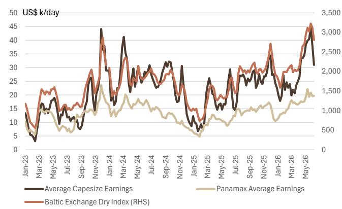
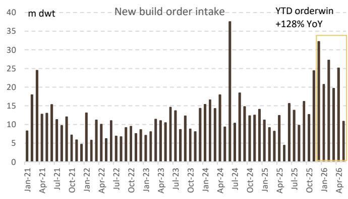

# UBS：航运市场的真正拐点不在运价，而在供给侧的不可逆重置

这份最新发布的UBS航运供应链周报，覆盖了截至2026年6月12日的高频数据。表面上看，它是一份常规的周度数据更新，涵盖了VLCC油轮、集装箱、干散货和造船四大板块。但如果你只是把它当作运价追踪来看，就会错过一个更重要的信号：全球航运市场正在经历一轮结构性重置，而这个重置的驱动力，不是短期需求波动，而是供给端的多项不可逆变化正在同时发生。

霍尔木兹海峡的重新开放预期、红海绕航的持续、造船订单的集中爆发、以及集装箱运价的连续跳升——这些事件在市场上被分别讨论，但UBS这份报告将它们放在一起，揭示了一个更完整的图景：航运市场的定价逻辑，正在从“需求驱动”转向“供给约束驱动”。对于产业决策者和投资者来说，这意味着过去几年建立的分析框架需要重新校准。

以下是我们从这份报告中提炼出的五个关键洞察。

## 1. 霍尔木兹海峡的“重启”已被定价，但真正影响运价的不是通航，而是船队效率的永久性损失

报告中最引人注目的数据点之一，是美伊和平协议签署后，油轮和航运股的反应积极。市场显然在押注霍尔木兹海峡重新开放后，VLCC运价将回归正常。但UBS的高频数据揭示了一个不同的现实：截至6月初，霍尔木兹海峡的原油油轮通行量仍比冲突前水平低95%，几乎处于冻结状态。

更值得关注的是，即便海峡完全重启，船队效率的损失可能已经不可逆。过去一年，大量油轮被迫绕行好望角，这不仅拉长了航程，还改变了全球油轮的调度节奏。船东为了应对不确定性，已经调整了航线规划、船员配置和保险安排。这些调整一旦固化，即便地缘政治风险消退，船队也不会立即回到原来的效率水平。

报告显示，VLCC平均收益目前仍低于10万美元/天，中东/西非至中国的VLCC收益保持平稳。这意味着市场已经将“重启”预期部分计入价格，但尚未充分反映船队效率损失带来的供给硬约束。这是一个典型的“预期已经price in，但基本面尚未兑现”的窗口。

## 2. 集装箱运价的连续跳升不是季节性波动，而是“绕航常态化”正在重塑运力供需平衡

集装箱板块的数据同样值得深挖。报告显示，上海出口集装箱运价指数（SCFI）上周环比上涨9%，同比上涨43%。其中，上海至欧洲航线环比大涨18%，跨太平洋航线环比上涨10-12%。这些数字远超正常的季节性波动。

UBS的数据清晰表明，红海绕航仍在持续，且绕航量仍比去年同期高出4-5%。这个数字看似不大，但关键在于持续时间。绕航已经持续超过一年，船公司已经将其纳入常态运营。这意味着，即便红海局势未来缓和，船公司也不会立即恢复原有航线，因为客户供应链已经适应了新的运输时间和成本结构。

报告还揭示了一个重要细节：亚洲至美国航线的集装箱运量自5月以来同比强劲增长。这背后既有传统旺季的拉动，也有“前置装运”效应——进口商为了规避关税风险，提前发货。这种前置装运会短期推高运价，但也会透支下半年的需求。UBS的“Maritime Destination Monitor”数据显示，这种前置模式已经非常明显。

对于投资者而言，关键问题不是运价能涨多高，而是这种运价水平能否持续。如果绕航常态化叠加前置装运，那么运价的支撑力可能比市场预期的更持久。

## 3. 干散货市场的“软着陆”掩盖了造船订单的硬约束

干散货板块上周出现回调，波罗的海干散货运价指数（BDI）环比下跌10%，好望角型船平均收益环比下跌18%。但报告同时指出，BDI年初至今仍累计上涨61%。这个数字提醒我们，回调只是高位震荡，而非趋势逆转。

真正需要关注的，是造船市场的信号。报告中的新造船价格指数环比持平，但全球造船需求在VLCC订单的驱动下表现强劲。从历史数据看，造船订单的集中爆发往往意味着未来2-3年的运力供给将大幅增加。但这一次，情况可能不同。

一方面，环保法规（如EEXI和CII）正在加速老旧船型的淘汰。另一方面，船厂产能已经连续多年收缩，即便订单增加，交付周期也在拉长。这意味着，新订单转化为实际运力的速度将比以往更慢。供给侧的硬约束正在形成，而这恰恰是市场尚未充分定价的因素。

## 4. 报告尚未完全回答的关键问题：运价中枢是否已经永久性上移

尽管UBS的报告提供了丰富的高频数据，但有一个关键问题它没有直接回答：当前的运价中枢是否已经永久性上移？

从逻辑上推导，答案可能是“是”，但需要更多证据支持。绕航常态化、船队效率损失、环保法规趋严、以及造船产能瓶颈，这四个因素叠加在一起，正在系统性地抬升全球航运的运营成本。这些成本最终会传导到运价上，形成一个新的、更高的均衡水平。

但这里仍有不确定性。前置装运可能透支需求，导致下半年运价回落。霍尔木兹海峡的完全重启可能释放被压抑的运力。全球经济放缓也可能压制货运需求。这些因素都有可能暂时压低运价，但长期来看，供给侧的约束才是决定运价中枢的核心变量。

UBS的报告没有给出明确的判断，但它的数据为这个判断提供了基础。对于读者来说，接下来的几周数据至关重要：如果运价在高位持续震荡而非快速回落，那么“运价中枢上移”的假设将得到验证。

## 5. 投资者的观察框架应该从“运价涨跌”转向“供给约束的边际变化”

基于以上分析，我们建议读者调整对航运板块的观察框架。过去几年，市场习惯用“需求是否强劲”来预测运价走势。但在当前阶段，需求端的变化已经不足以解释运价的波动。供给侧的边际变化——船队效率、绕航比例、造船订单交付周期、环保法规执行力度——才是更重要的变量。

具体来说，可以关注以下三个指标：

第一，红海绕航量的变化趋势。如果绕航量持续高于去年同期水平，说明供给约束仍在强化。第二，新造船订单的交付周期是否在拉长。这将直接影响未来2-3年的运力供给。第三，VLCC和集装箱运价的周度波动是否在收窄。如果波动率下降而中枢上移，说明市场正在形成新的均衡。

这份UBS报告的价值，不在于它给出了确定的答案，而在于它提供了足够的高频数据，让读者能够独立判断这些关键变量的演变方向。

---

报告的完整版包含了更多细节：各航线的分项运价数据、船队通行量的逐周变化、以及造船订单的细分结构。这些图表背后的信息，远不止我们在这里讨论的五个洞察。比如，图8中集装箱运费期货在美伊和平协议后的回落幅度，实际上隐含了市场对“运价见顶”的预期——但这份预期是否过度，需要结合现货数据来判断。

如果你希望深入讨论这些未解决的问题——比如运价中枢是否已经永久性上移、前置装运的影响会持续多久、以及哪些航运子板块最有可能受益于供给约束——欢迎来星球微信群里继续讨论。我们会在群里分享这份报告的原始图表和数据，并持续跟踪后续的高频更新。

Personal reading notes and learning share only. Not investment advice.

