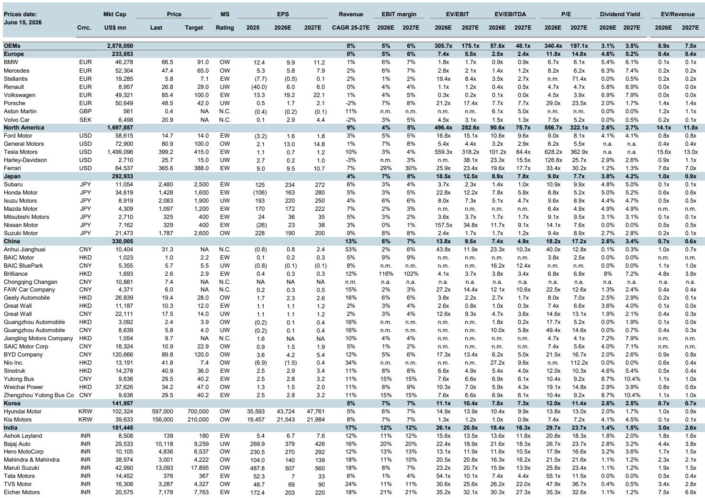
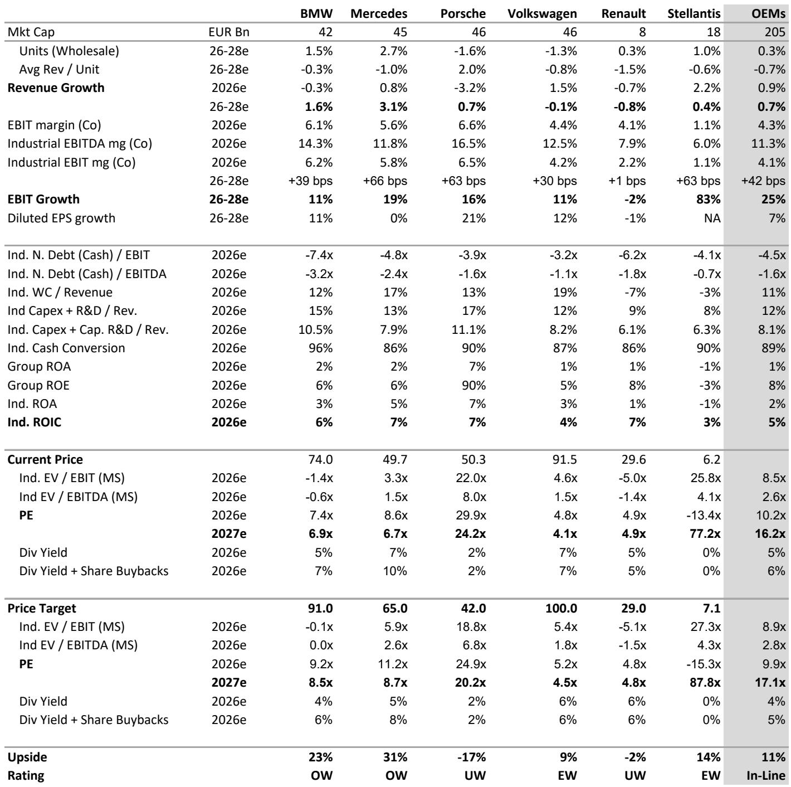
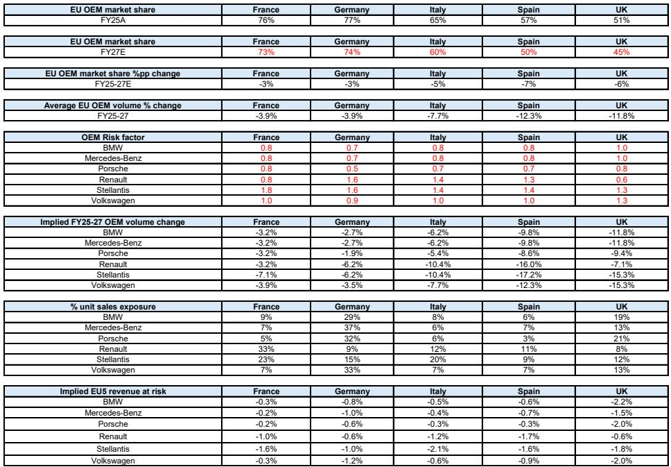

# The Worst Is Yet to Come: Chinese OEMs Will Reshape European Automotive Earnings Before the Cycle Turns

European automotive stocks have underperformed the market since April 2024. Cyclical troughs have historically been reliable entry points in this sector. This time, the pattern is unlikely to repeat. The reason is structural, not cyclical: Chinese original equipment manufacturers are accelerating their entry into Europe with a precision and scale that consensus forecasts still fail to capture. A collaborative analysis by a global investment bank's European and China auto teams indicates that European OEM earnings face more than 10 percent downside risk to FY27 consensus estimates. The pressure is not a temporary headwind. It is the beginning of a multi-year share transfer that will redefine competitive dynamics across the continent.

The conventional narrative holds that European OEMs have already absorbed the initial shock. Market share in the EU5 has declined from 72 percent in 2020 to 67 percent in 2025. The argument that the worst is behind them rests on the assumption that further losses will be marginal and that cost actions will offset revenue pressure. That assumption is wrong. The analysis points to a further decline toward 62 percent by 2027, driven by Chinese OEMs' targeted entry into precisely the segments where European incumbents generate the bulk of their profits: SUVs, battery electric vehicles, plug-in hybrids, the UK market, and entry-level vehicles. The earnings risk is not evenly distributed. It is concentrated, and it demands a differentiated investment response.

This report is not a summary of known risks. It is an argument that the market is mispricing the speed and structure of Chinese OEM expansion, and that investors who wait for clear evidence of earnings damage will have missed the window to reposition.

## Market Share Losses Are Accelerating, Not Stabilizing, and Consensus Is Still Too Optimistic

The most dangerous assumption embedded in current consensus forecasts is that European OEM volumes will remain flat or grow modestly through 2027. This assumption is contradicted by observable trends in every major European market. Chinese OEM share in the UK, Italy, and Spain has risen by 7 to 10 percentage points between 2020 and 2025. Germany and France have remained more resilient, but the analysis suggests pressure will build there as well.

The pattern is not uniform. Stellantis has been the largest share donor so far, losing six percentage points over the period. Other legacy OEMs have held share, or even grown it in some countries. This creates a false sense of security. The reason other OEMs have not yet lost share is not that they are immune. It is that Chinese OEMs have prioritized markets and segments where regulatory and competitive conditions allowed faster penetration. As their distribution networks expand and localized production comes online, the pressure will spread to previously insulated markets.

The critical insight is that the share transfer is not a one-time adjustment. It is a compounding process. Each year of Chinese OEM investment in dealerships, financing offerings, fleet sales, and brand building makes the next year's market share gain easier. European OEMs are not facing a static competitor. They are facing a competitor that is learning the European market faster than incumbents are adapting to its presence.

## Chinese OEMs Are Targeting the Profit Pools That Matter Most, Not Just Volume

A common defense of European OEMs is that Chinese competition is concentrated in the low-margin entry-level segment. This defense is outdated. Chinese OEMs are systematically targeting the C/D-SUV segment, which is the largest and most profitable category in the European light vehicle market. They are also expanding rapidly in hybrids, following demand rather than forcing BEV adoption. This strategic flexibility makes them more dangerous than a pure-play EV entrant would be.

Renault is the most exposed to entry-level competition, where Chinese OEMs offer some of the cheapest models in the market. Volkswagen faces significant risk from its mass-market SUV exposure, a segment that places it in direct competition with Chinese offerings that combine competitive pricing with increasingly sophisticated technology. Mercedes-Benz and BMW have been partially shielded by their premium positioning, but the analysis indicates that Chinese OEMs' sustained efforts in the D-SUV and C-SUV segments will drive pricing pressure before any meaningful market share losses materialize. The premium segment is not a fortress. It is a target that will take longer to breach.

The implication is straightforward: the earnings risk is not confined to mass-market players. It extends across the value chain, and the timing of impact will vary by segment. Premium OEMs may see margin compression before volume decline, which is harder to detect in consensus forecasts but equally damaging to equity value.

## The Defensive Advantages of European OEMs Are Real but Insufficient

European OEMs benefit from several structural defenses. Brand loyalty remains strong, particularly in Germany and France. Residual values are better managed by incumbents with established financing arms and fleet relationships. Protectionist measures, including tariffs and local content requirements, create barriers that Chinese OEMs must overcome. Weak underlying BEV demand in Europe also slows the pace of electrification-driven share shifts.

These defenses matter, but they are not decisive. The analysis identifies price as the ultimate determinant for a growing share of consumers, particularly in the entry-level and mid-market segments where affordability pressures are most acute. Chinese OEMs are not merely cheaper. They are increasingly competitive on technology, with advanced driver assistance systems, software-defined vehicle capabilities, and over-the-air functionality that narrows the gap with European offerings.

The most important defensive variable is time. European OEMs are investing heavily in battery cost reduction through LFP adoption, localized sourcing, and cell standardization. They are overhauling platform architectures and software capabilities. These actions are necessary, but they will take years to deliver results. In the interim, Chinese OEMs will continue to gain share, and the earnings damage will accumulate.

## The Report's Framework Raises Unanswered Questions That Deserve Investor Attention

The analysis is rigorous in its quantification of share transfer and earnings risk, but it leaves several critical questions open. First, how will European policymakers respond if Chinese OEMs achieve the market share trajectory the report projects? Protectionist measures are already in place, but they may prove insufficient if Chinese OEMs establish localized production within the EU. The report notes that localization is a key strategic objective for Chinese players, but it does not model the regulatory response to that localization.

Second, what is the threshold at which European OEMs' defensive investments become self-defeating? The report documents significant cost reduction and platform overhaul efforts, but it does not fully explore the risk that these investments compress margins before they generate returns. Investors may face a period where European OEMs are spending heavily to defend share while simultaneously losing share, creating a double squeeze on profitability.

Third, the report identifies Norway as a glimpse into an electrified future, but it does not extend that analysis to other markets. Norway's experience suggests that Chinese OEMs can achieve significant share in a fully electrified market. What does that imply for markets where BEV adoption accelerates faster than expected? The report's base case assumes a gradual transition, but the downside scenario if BEV adoption surprises to the upside is not fully quantified.

These open questions are not weaknesses in the analysis. They are invitations for investors to stress-test their own assumptions and to recognize that the range of outcomes is wider than consensus suggests.

## A Decision Framework for Investors: Segment Exposure, Geographic Mix, and Pricing Power

The report provides the analytical building blocks for a structured investment decision. Three factors determine which European OEMs are most at risk.

First, segment exposure. Mass-market players with high exposure to SUVs and entry-level vehicles face the most direct competition. Volkswagen's mass-market SUV portfolio and Renault's entry-level positioning place them at the highest risk. Premium players face pricing pressure before volume loss, which makes their earnings trajectory harder to predict but no less vulnerable.

Second, geographic mix. Chinese OEM penetration is highest in the UK, Italy, and Spain. OEMs with disproportionate exposure to these markets face more immediate pressure. Germany and France offer more protection, but that protection is eroding. Investors should monitor the pace of Chinese dealership expansion in these markets as a leading indicator.

Third, pricing power. The ability to defend margins without losing volume is the most valuable asset in this environment. Premium brands have more pricing power than mass-market brands, but that power is not infinite. The report's analysis of the D-SUV and C-SUV segments suggests that even premium pricing will come under pressure as Chinese OEMs move upmarket.

The decision framework is not static. It requires continuous reassessment as Chinese OEMs expand their model ranges, build distribution networks, and localize production. The investors who will outperform in this sector are those who treat the competitive landscape as dynamic rather than fixed.

## Join the Community to Read the Full Report and Review the Original Charts

The analysis summarized here draws on a detailed collaborative report that includes market share data for every major European country, product mapping of Chinese OEM offerings against European competitors, dealership expansion targets, and sensitivity analysis of earnings outcomes under different share transfer scenarios. The full report also contains the original charts that support the quantitative conclusions, including the trajectory of EU OEM market share from 2010 through 2027 and the price target changes for individual OEMs. To access the complete analysis and the underlying data, join the community and review the full report.

*This article is for learning and discussion only and does not constitute investment advice.*

Personal reading notes and learning share only. Not investment advice.

