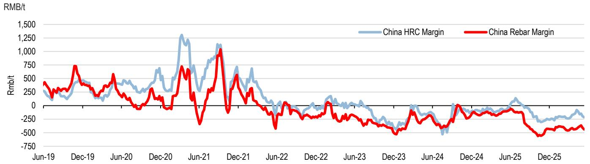

# Falling Shipping Costs Are Rewriting the Competitive Map of Global Iron Ore, Not Just Signaling Weaker Demand

The most important data point in the latest China steel channel check is not the modest uptick in crude steel output. It is the 22% week-on-week collapse in bulk shipping rates from Australia to China, now quoted at $10.9 per ton. Many observers will read this as a simple signal of softening demand. That interpretation is too narrow and potentially misleading. The real story is structural: a sharp divergence in logistics costs is reshaping the competitive advantages among global iron ore producers, with implications that extend well beyond the next quarterly earnings call. While Chinese steel production is tracking at a 1,018 million ton annualized run rate, up 4% from the prior ten-day period and 2% year-on-year, the real strategic action lies in the cost of moving ore from mine to mill. The gap between Australian and Brazilian freight costs has widened dramatically, and this asymmetry is not a temporary blip. It is a durable shift that will determine which miners capture margin in the second half of the year and which ones face sustained pressure.

The timing matters because the macro context is unusually fragile. Chinese steel output is hovering at the bottom end of its five-year range, steel mill margins are extending recent losses, and inventory levels are tracking at historically high levels for iron ore held at Chinese ports. In this environment, every dollar of cost advantage or disadvantage gets magnified. The companies that benefit from lower logistics costs will have room to defend margins or even gain share. Those that do not will find themselves squeezed between stagnant steel prices and elevated input costs. The channel data from the ten days ending June 10 provides the raw numbers, but the strategic narrative is about which miners are structurally positioned to win in a market where the cost of distance is suddenly much more variable.

## The Collapse in Australian Shipping Costs Creates a 50% Asymmetry That Benefits One Set of Miners Over Others

The headline figure is stark enough to demand attention. Australia-to-China bulk freight rates dropped by $3 per ton week-on-week, a 22% decline that brings the rate to $10.9 per ton. This is the largest single-week move in recent memory and it is not an isolated event. Shipping costs from Brazil and South Africa to China also declined, but only by 3% week-on-week. The result is a divergence that has been building for months but has now reached a critical threshold. Brazilian and South African iron ore bulk shipping freight rates remain more than 50% above pre-conflict levels, even as Australian rates have fallen back closer to normal. The implication is clear: Australian iron ore miners, particularly those with operations in Western Australia, are now enjoying a material and widening cost advantage in delivering their product to the world's largest steel market.

This is not a marginal difference. For a miner shipping tens of millions of tons annually, a $3 per ton swing in freight costs translates into hundreds of millions of dollars in operating margin. The FOB iron ore price from Australia is now estimated at roughly $90 per ton, which is actually $4 per ton higher than it was at the end of February when the US-Iran conflict began. That means Australian miners are capturing a higher net price while simultaneously benefiting from lower logistics costs. The math works in their favor on both sides of the equation. For Brazilian and South African producers, the situation is reversed. They are paying significantly more to ship their ore, their netbacks are compressed, and they have less flexibility to compete on price if Chinese buyers become more selective. The asymmetry is not just about geography. It is about which business models are resilient in a period of margin compression.

This divergence also suggests something important about the nature of the shipping market itself. The 22% drop in Australian rates is too large to be explained solely by changes in demand for iron ore. It likely reflects a shift in vessel availability, route optimization, or changes in fuel costs that disproportionately benefit shorter-haul routes. Whatever the cause, the effect is concentrated. Australian miners are the primary beneficiaries, and the market is beginning to price this in through relative equity performance. The report notes that among EMEA Metals and Mining iron ore exposed equities, the analysts are Overweight on BHP's Australia listing and Rio Tinto Ltd, while being Underweight on Anglo American and Kumba Iron Ore. That rating dispersion is consistent with the freight data. The analysts are effectively betting that the logistics advantage for Australian producers will persist and that the cost burden for Brazilian and South African producers will continue to weigh on margins.

## Chinese Steel Output Is Stable but Uninspiring, and Margin Compression Is the Dominant Theme for Mills

The production data from China does not tell a story of robust demand. The latest ten-day run rate of 1,018 million tons annualized is up 4% from the prior period and 2% year-on-year, but the trailing thirty-day figure shows a 1% decline versus the previous thirty-day period. Output is essentially flat, and it is tracking at the bottom end of the five-year range since May. This is not a market that is growing its way out of trouble. It is a market that is grinding along at a level that is barely sufficient to absorb current supply, let alone generate pricing power for mills or raw material suppliers.

The margin picture is even more telling. The report includes data showing that China steel mill margins have extended their losses in recent weeks, driven primarily by higher coking coal prices. Hot-rolled coil margins and rebar margins are both under pressure, and there is no sign of a near-term catalyst for recovery. When mills are losing money on every ton they produce, they have two levers: reduce output or reduce input costs. The output data suggests they are not cutting production aggressively, which means the pressure is being transmitted upstream to iron ore and coking coal suppliers. This is exactly the dynamic that makes the shipping cost divergence so strategically important. Miners who can deliver ore at a lower total cost to Chinese mills will be preferred. Those who cannot will find themselves at the back of the queue, especially if mills begin to optimize their raw material procurement to protect whatever margin they have left.

The inventory data reinforces this cautious view. Iron ore inventory held at Chinese ports is approximately 160 million tons, which is at a historical high. It has declined by 7 million tons since its peak in March, but that drawdown is modest relative to the absolute level. Steel inventory is flat week-on-week and up 7% year-on-year, tracking in line with seasonal levels. There is no inventory shortage anywhere in the system. If anything, there is an excess that gives Chinese mills negotiating leverage. They can afford to be selective, to delay purchases, and to push for lower prices. In this environment, the miner with the lowest delivered cost wins. The freight data suggests that Australian miners are best positioned to meet that criterion.

## The Report Raises an Unanswered Question About the Sustainability of the Freight Divergence

For all the clarity in the data, there is one question the report does not fully answer: how durable is the current freight asymmetry? The 22% week-on-week drop in Australian shipping rates is dramatic, but it follows a period of elevated rates. The absolute level of $10.9 per ton is not historically cheap. It is simply lower than it was last week. The question for investors is whether this is the beginning of a sustained trend or a temporary correction that will reverse as soon as vessel supply adjusts.

The answer depends on factors that are not fully addressed in the channel data. What is the current utilization rate of Capesize vessels on the Australia-China route? Are there vessel supply constraints elsewhere that could pull ships away from the Atlantic basin and back into the Pacific? How much of the recent decline is attributable to lower fuel costs versus lower demand for shipping services? The report notes that Brazilian and South African rates remain more than 50% above pre-conflict levels, which suggests that the structural factors affecting those routes are more persistent. But it does not provide a detailed model for how long that premium will last.

This is a meaningful analytical gap. If the Australian freight advantage proves temporary, the entire investment thesis for favoring Australian miners over their Brazilian and South African peers weakens. Conversely, if the divergence persists or widens, the current rating dispersion may not go far enough. The Underweight ratings on Anglo American and Kumba Iron Ore could prove prescient, but the magnitude of the underperformance could be larger than current valuations imply. Investors need a framework for monitoring the sustainability of the freight divergence, and the report does not fully provide one. That is not a criticism of the analysis. It is an acknowledgment that some of the most important variables are outside the scope of a weekly channel check. It is also an invitation for readers to dig deeper into the shipping market data themselves.

## A Decision Framework for Navigating the Iron Ore Landscape Through Year-End

For investors trying to position portfolios based on this data, a structured decision framework is more useful than a simple list of ratings. The framework should start with the most observable variable: the freight spread between Australian and Brazilian shipping costs. If that spread remains wide or widens further, the case for overweighting Australian-exposed miners strengthens. If the spread narrows, the relative advantage erodes and the investment thesis becomes more dependent on company-specific factors like cost control, dividend policy, and balance sheet strength.

The second variable is Chinese steel output relative to the five-year range. If output moves from the bottom end of the range toward the middle or top, demand for iron ore will increase and pricing power will shift back toward miners. In that scenario, the freight advantage becomes less critical because all miners benefit from higher volumes and prices. But if output remains at the bottom end or falls further, the cost advantage becomes paramount. The current data suggests the latter scenario is more likely, but the trajectory can change quickly based on Chinese policy stimulus, property sector recovery, or infrastructure spending.

The third variable is port inventory levels in China. At 160 million tons, iron ore inventory is historically high. A sustained drawdown would signal genuine demand recovery. A continued build would signal oversupply and downward pressure on prices. The recent 7 million ton decline from the March peak is encouraging but insufficient to declare a trend. Investors should watch weekly inventory data closely. A move below 150 million tons would be a meaningful signal.

The fourth variable is steel mill margins. When margins are positive or improving, mills are less price-sensitive and more willing to accept higher input costs. When margins are negative, as they are now, mills become aggressive in cost reduction. This dynamic directly benefits miners with lower delivered costs. The current margin data is negative, which reinforces the freight-driven investment thesis.

Taken together, these four variables create a simple but effective decision matrix. The most favorable environment for Australian miners is one where the freight spread is wide, Chinese output is at the bottom of the range, port inventories are high, and mill margins are negative. That is essentially the current environment. The least favorable environment for Australian miners is the opposite: narrow freight spread, rising output, falling inventories, and improving margins. Investors should monitor which direction the four variables are moving and adjust their positioning accordingly.

## The Full Report Contains the Charts and Granular Data That Make This Framework Actionable

The analysis above is built on a single channel check, but the full report contains multiple charts that provide the historical context and granular detail necessary to make informed decisions. The chart tracking China steel output by ten-day periods shows exactly where current production sits relative to the five-year range. The chart on FOB iron ore prices from Australia provides the precise calculation of netbacks after shipping costs. The chart on bulk shipping costs from Australia, Brazil, and South Africa allows readers to see the divergence in real time and to track whether it is widening or narrowing. The chart on steel mill margins shows the trajectory of profitability for Chinese mills, which is the ultimate driver of demand for different grades and sources of iron ore.

These charts are not decorative. They are the raw materials for the kind of strategic analysis that separates informed investors from those who simply react to headlines. The freight data, the output data, the inventory data, and the margin data all interact in ways that are difficult to capture in text alone. Seeing the trends visually, with the ability to compare current readings to historical ranges, changes the analytical picture. It allows readers to form their own judgments about whether the current divergence is sustainable, whether the inventory drawdown is accelerating, and whether the margin compression is approaching a floor.

Join the community to read the full report and review the original charts.

*This article is for learning and discussion only and does not constitute investment advice.*

Personal reading notes and learning share only. Not investment advice.

