# China and Japan Semiconductors

# Global Semis: SOCAMM2 - Innovative but niche, limited impact on memory interface chip TAM

Qingyuan Lin, Ph.D.

+852 2123 2654

qingyuan.lin@bernsteinsg.com

David Dai, CFA

+852 2918 5704

david.dai@bernsteinsg.com

Francis Ma

+852 2123 2626

francis.ma@bernsteinsg.com

Kai Zhang

+852 2123 2665

kai.zhang@bernsteinsg.com

Nvidia recently released their latest ARM-based server CPU called Vera, in which they used a new memory package format called SOCAMM2. As this new package uses much less memory interface chip content, some investors are concerned that this will reduce the TAM for Montage/Renesas. We believe the SOCAMM2 format will likely remain niche to Nvidia and thus only bring HSD to LT% impact to the memory interface chip TAM, reiterate Outperform on Montage and Renesas.

SOCAMM is a DRAM package customized for NVIDIA rather than a disruptive new standard. In Nvidia's Grace CPU design, they use LPDDR5x instead of DDR5 to reduce the power consumption. From Grace to Vera, the shift from soldered LPDDR5x to modular SOCAMM2 provides modularity flexibility and expands the total capacity/bandwidth. However, SOCAMM2 advantages are tightly aligned with NVIDIA's rack-level optimization, where maximizing performance-per-watt is paramount. Critically, these benefits come with trade-offs in capacity, bandwidth, and ecosystem maturity compared with MRDIMM, therefore we expect this solution will remain niche mainly to Nvidia, which we estimated to only have HSD to LT% in volume in the next few years.

Other high-end ARM-based CPU and x86 server CPU likely will remain using MRDIMM if they want to enjoy better capacity and bandwidth. NVIDIA's adoption reflects its full-stack control and greenfield design, enabling re-design at rack level for their specific target. In contrast, x86 and other ARM CPU vendors are already fully integrated with the DDR ecosystem, they will face prohibitive switching costs across memory controllers, platform design, and ecosystem requalification, alongside loss of backward compatibility. Meanwhile, MRDIMM continues to offer superior bandwidth (up to 1.6TB/s vs 1.2TB/s per CPU) and capacity (up to 16TB vs 1.5TB per CPU) over SOCAMM2, making it difficult for the high end x86 server CPU design to shift module selection.

Economic impact on interface chip suppliers is modest. SOCAMM2 introduces incremental chipset content versus soldered LPDDR, but value per module is only a few dollars, far below DDR5 MRDIMM's interface silicon content at 50-70 USD, thus indeed if SOCAMM2 became mainstream the memory interface chip TAM will reduce. Yet if the package design will remain niche to Nvidia, then the impact to TAM will be limited to the Nvidia CPU vol share (HSD to LT%). Small incremental MRDIMM adoption could easily offset that impact. Additionally, SOCAMM2 also use some memory interface chip so the shift from LPDDR5 to SOCAMM2 within Nvidia actually brings some upside to the memory interface TAM. Rambus holds first-mover advantage at this stage, but we expect Renesas and Montage to catch up quickly given the relatively low technical barriers in SOCAMM2 interface chips.

We maintain Outperform on Montage and Renesas, with conviction reinforced by limited substitution risk. SOCAMM2 does not alter the structural dominance of DDR in the broader server market. For Montage, concerns around displacement are overstated, and the durability of MRDIMM-led growth remains the core investment thesis underpinning our positive view.

BERNSTEIN TICKER TABLE

<table><tr><td rowspan="2">Ticker</td><td rowspan="2">Rating</td><td colspan="3">17 Jun 2026</td><td colspan="2">TTMRel.</td><td colspan="4">Reported EPS</td><td colspan="3">Reported P/E (x)</td></tr><tr><td>Cur</td><td>Closing Price</td><td>Price Target</td><td>Target Perf.</td><td>Cur</td><td>2025A</td><td>2026E</td><td>2027E</td><td>2025A</td><td>2026E</td><td>2027E</td><td></td></tr><tr><td>6809.HK (Montage)</td><td>O</td><td>HKD</td><td>420.60</td><td>320.00</td><td>NA</td><td>CNY</td><td>1.97</td><td>3.00</td><td>4.77</td><td>184.2</td><td>121.0</td><td>76.1</td><td></td></tr><tr><td>688008.CH (Montage)</td><td>O</td><td>CNY</td><td>262.50</td><td>220.00</td><td>181.0%</td><td>CNY</td><td>1.97</td><td>3.00</td><td>4.77</td><td>133.2</td><td>87.5</td><td>55.1</td><td></td></tr><tr><td>6723.JP (Renesas)</td><td>O</td><td>JPY</td><td>4,477.00</td><td>4,200.00</td><td>92.8%</td><td>JPY</td><td>181.61</td><td>242.22</td><td>270.50</td><td>24.7</td><td>18.5</td><td>16.6</td><td></td></tr><tr><td>ASIAX</td><td></td><td></td><td>2,032.93</td><td></td><td></td><td></td><td></td><td></td><td></td><td></td><td></td><td></td><td></td></tr><tr><td>JPL</td><td></td><td></td><td>2,631.42</td><td></td><td></td><td></td><td></td><td></td><td></td><td></td><td></td><td></td><td></td></tr></table>

O - Outperform, M - Market-Perform, U - Underperform, NR - Not Rated, CS - Coverage Suspended  
6723.JP estimate is Adjusted EPS; 6723.JP valuation is Adjusted P/E (x);  
Source: Bloomberg, Bernstein estimates and analysis.

## INVESTMENT IMPLICATIONS

We rate Montage Technology as Outperform and set a target price of CNY 220 for A shares, based on a 44x P/E multiple applied to 2BF (2027Q2–2028Q1) earnings. Given the company's high-growth profile and the anticipated new product launch cycle in 2027, we believe a 2BF P/E multiple provides a proper valuation anchor that captures the inflection in the company's earnings trajectory.

For H shares, we set a target price of HKD 320. The H share premium reflects that global investors favor Montage as a scarce China AI-exposed name without direct geopolitical risks, unlike many other Chinese semiconductor companies that face entity list restrictions or export control headwinds. At our target price, the implied P/E multiple on 2BF EPS for H shares is 56.4x.

Renesas: We rate Renesas Outperform, with PT = ¥4,200. With a market cap slightly above Montage's, Renesas appears significantly undervalued: its memory interface revenue, comparable in scale to Montage's, accounts for only single-digit % of total company revenue—the high-growth business is obscured by its broad product lines. We see re-rating opportunity for Renesas.

## DETAILS

## NVIDIA CPU DRAM TECH ROADMAP: FROM SOLDERED LPDDR TO MODULAR SOCAMM2

NVIDIA's server CPU platform is undergoing a key memory architecture transition. The current Grace CPU uses soldered LPDDR5X — high-bandwidth, power-efficient mobile DRAM physically bonded to the motherboard. While this delivers excellent performance-per-watt, it sacrifices field upgradeability: if memory fails or capacity needs change, the entire board must be replaced.

SOCAMM2 (Small Outline Compression Attached Memory Module 2) solves this by packaging LPDDR5X into a detachable, standardized module with a compression connector. Originally a proprietary NVIDIA design (SOCAMM1), the standard has been adopted by JEDEC under specification JESD328, with Samsung, Micron, and SK Hynix all developing compliant modules.

The transition from soldered LPDDR to SOCAMM2 enables multi-vendor memory sourcing and field serviceability for NVIDIA's server platforms for the first time, a critical requirement for hyperscaler adoption.

Micron has already demonstrated SOCAMM2 modules scaling from 128 GB to 256 GB per module using 32Gb LPDDR5X dies on 1 $\gamma$ process technology.

EXHIBIT 1: In the Grace generation, LPDDR5 is soldered directly onto the board, making it non-replaceable and preventing any changes to the memory configuration  
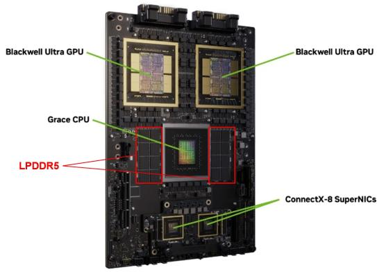

text_image

Blackwell Ultra GPU
Blackwell Ultra GPU
Grace CPU
LPDDR5
ConnectX-8 SuperNICs

Source: NVIDIA reports, Bernstein analysis

EXHIBIT 2: In the Vera generation, SOCAMM2 uses modular LPDDR5x connected to the board via a compression/ pressure connector, enabling a replaceable memory format  
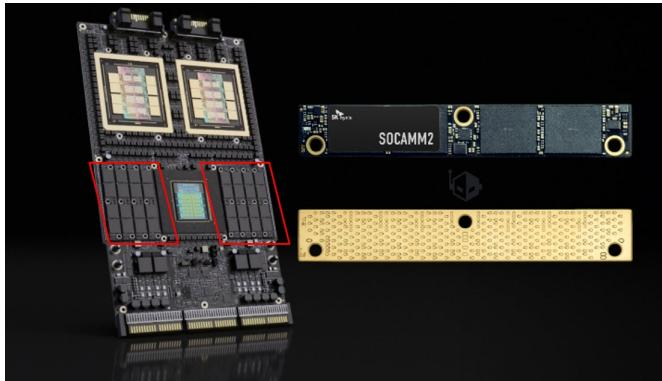

natural_image

Exploded view of a microchip module with visible internal components and external circuitry (no text or symbols)

Source: NVIDIA reports, Bernstein analysis

EXHIBIT 3: Diagram of NVIDIA Vera CPU and SOCAMM2 layout  
NVIDIA Vera CPU  
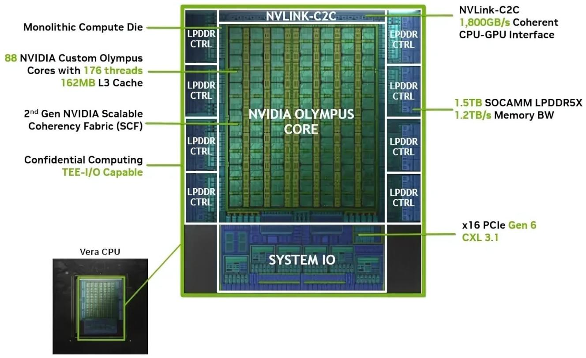

text_image

Monolithic Compute Die
88 NVIDIA Custom Olympus Cores with 176 threads
162MB L3 Cache
2nd Gen NVIDIA Scalable Coherency Fabric (SCF)
Confidential Computing TEE-I/O Capable
Vera CPU
NVLINK-C2C
LPDDR CTRL
LPDDR CTRL
LPDDR CTRL
LPDDR CTRL
NVIDIA OLYMPUS CORE
LPDDR CTRL
LPDDR CTRL
LPDDR CTRL
NVLink-C2C
1,800GB/s Coherent
CPU-GPU Interface
1.5TB SOCAMM LPDDR5X
1.2TB/s Memory BW
x16 PCIe Gen 6
CXL 3.1
SYSTEM IO

Source: NVIDIA website, Bernstein analysis

## NVIDIA HALVES INITIAL VERA RUBIN SOCAMM2 CAPACITY

During the recent ComputeX, NVIDIA and SK Hynix unveiled that Vera Rubin NVL72 will ship with 96GB SOCAMM2 modules instead of originally specified 192GB, reducing rack-level CPU aggregated memory from \~55TB to \~28TB.

This spec adjustment reflects supply-side constraints in a nascent SOCAMM2 ecosystem, not weakening demand. LPDDR5x supply remains extremely tight. As an emerging niche product, SOCAMM2 has limited capacity in both memory manufacturers and interface chips vendor. By shipping lower-density modules, NVIDIA can deploy more racks under the same DRAM supply, accelerating the time-to-market.

Shipping 96GB modules delivers meaningful rack-level cost savings, lowering the system price from \$7.6Mn to \$6.8Mn per rack (estimated by SemiAnalysis). Clients requiring the full 1.5TB spec can upgrade to larger-capacity modules, when supply matures and pricing normalizes.

The move validates SOCAMM2's modularity advantage over Grace's soldered LPDDR. Had Vera used soldered memory, NVIDIA would have been forced to either delay shipments or permanently lock in a lower spec. SOCAMM2's detachable design explicitly enables the “install now, upgrade later” flexibility.

EXHIBIT 4: Leading memory manufacturers all begin to provide SOCAMM2 modules starting in 2026

<table><tr><td></td><td>Samsung</td><td>SK Hynix</td><td>Micron</td></tr><tr><td>Capacity variants for servers</td><td>192GB</td><td>96GB192GB</td><td>192GB256GB (industry first)</td></tr><tr><td>Total capacity per Vera CPU</td><td>1.5TB</td><td>0.75TB (96GB)1.5TB (192GB)</td><td>1.5TB (192GB)2TB (256GB)</td></tr><tr><td>DRAM tech generation</td><td>1b LPDDR5x</td><td>1c LPDDR5x</td><td>1y 32GB monolithicLPDDR5x</td></tr><tr><td>Data rate</td><td>Up to 9,600 MT/s</td><td>Up to 9,600 MT/s</td><td>Up to 9,600 MT/s</td></tr><tr><td>Mass production timeline</td><td>Early 2026 (first to mass produce)</td><td>2Q26 ramp up</td><td>Sampling(192GB in Oct &#x27;25;256GB in Mar &#x27;26)</td></tr></table>

Source: companies reports, Bernstein analysis

## TECHNOLOGY COMPARISON: DDR5 RDIMM/MRDIMM VS. LPDDR5X SOCAMM2

The three server memory architectures diverge meaningfully across the bandwidth, capacity, power, cost and ecosystem maturity. In summary, SOCAMM2 excels in power efficiency and compact design, closely aligning with NVIDIA's overarching strategy of rack-level vertical integration and maximizing tokens per second per watt. By comparison, DDR DIMMs maintain advantage in bandwidth and capacity, backed by a more established and mature ecosystem.

EXHIBIT 5: Spec comparison across DDR5 RDIMM, MRDIMM, and SOCAMM2

<table><tr><td></td><td>DDR5RDIMM (Gen 3)</td><td>DDR5MRDIMM (Gen 2)</td><td>LPDDR5xSOCAMM2 for NV Vera(original design)</td><td>LPDDR5xSOCAMM2 for NV Vera(adjusted design)</td></tr><tr><td>Data rate</td><td>6,400 MT/s (Gen 3)</td><td>12,800 MT/s (Gen 2)</td><td colspan="2">9,600 MT/s</td></tr><tr><td>Aggregated bandwidth for CPU</td><td>819.2 GB/s for 16-channel CPU(6400*64 bit*16-ch/8)</td><td>1,638.4 GB/s for 16-channel CPU(12800*64bit*16-ch/8)</td><td colspan="2">1,228.8 GB/s for NV Vera(9600*128bit*8 modules/8)</td></tr><tr><td>Memory capacity per module</td><td>16/32/64/96/128/256 GB</td><td>128/256/512 GB</td><td>192 GB</td><td>96 GB</td></tr><tr><td>Total capacity per CPU</td><td>Up to 8TB+(16-ch * 2 DIMM/Ch * 258GB)</td><td>Up to 16TB+(16-CH * 2 DIMM/Ch * 512GB)</td><td>1.5TB(8 SOCAMM2 * 192GB)</td><td>0.75TB(8 SOCAMM2 * 96GB)</td></tr><tr><td>Power efficiency</td><td>Moderate ~1.1v</td><td>Higher than RDIMM – due toadditional interface chips</td><td colspan="2">Best-in-class – 1.05V(total energy consumption 30% lower than RDIMM)</td></tr><tr><td>Compactness</td><td>288 pins, requiring vertical slotspace</td><td>Similar to RDIMM</td><td colspan="2">Highly compactlow-profile compression module, smaller footprint</td></tr><tr><td>Price per GB</td><td>$24.3</td><td>$50-75 (small sampling price)</td><td colspan="2">$29 (small sampling price)</td></tr><tr><td>Per module price</td><td>$3,200+ (128GB)</td><td>$6,000-9,000 (128GB)</td><td>$5,600 (196GB)</td><td>$2,800 (96GB)</td></tr><tr><td colspan="5"></td></tr><tr><td>Interface chip content</td><td>1 RCD + SPD + PMIC + TS (~$7)</td><td>1 MRCD + 10 MDB + SPD +PMIC + 2TS(~$50-70)</td><td colspan="2">Minimal – 1 SPD + 3 voltage regulators;direct-attach without RCD/DB chips(a few dollars)</td></tr></table>

The pricing reflects the contract rates for 2Q26 as updated by TrendForce in May 2026. As MRDIMM and SOCAMM2 are still in the early sampling stage, their ASPs represent sample pricing, which is expected to decline to normalized levels as production volume increases.

Source: companies reports, Bernstein analysis

EXHIBIT 6: Architecture comparison between SOCAMM2 and DDR5 RDIMM  
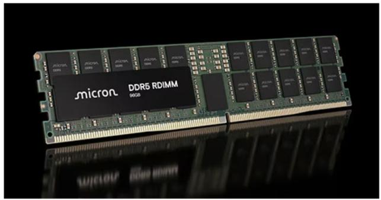

natural_image

Close-up of a microcontroller DDR5 RDIMM 96GB, showing internal memory chips and RAM slots (no readable text beyond branding)

- \~133mm x \~31mm x \~2.5mm  
• 288 pins on edge connector  
• Vertical, insertion socket

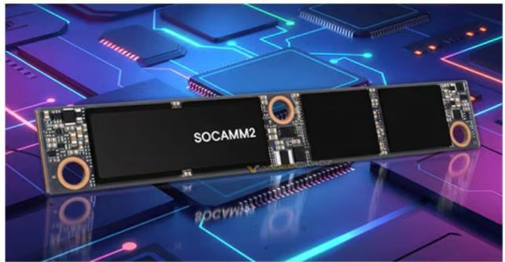

natural_image

Product image of SOCAMM2 chip with circuit board background (no readable text or symbols)

Source: AMD website, Bernstein analysis

- \~86mm x \~14mm x \~1mm  
- 694 pins on back  
• Horizontal, screw mounted

EXHIBIT 7: On x86 CPUs, DDR channels accommodate vertically inserted DIMM modules  
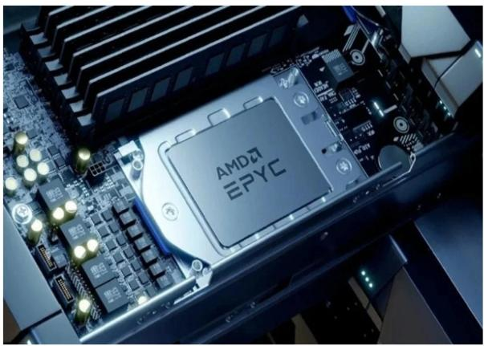

natural_image

Close-up of an AMD7 EPYC processor on a computer motherboard with visible circuitry and components (no readable text beyond branding)

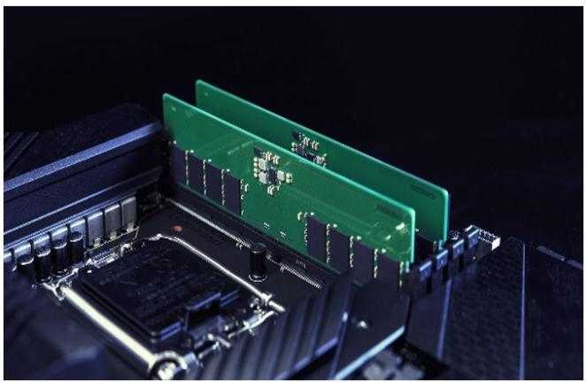

natural_image

Close-up of a computer motherboard with green and black plastic components, no visible text or symbols

Source: AMD website, Bernstein analysis

EXHIBIT 8: In contrast, SOCAMM2 employs a horizontally compressed design, enabling a more space-efficient layout. Even the last generation LPCAMM2 saves 64% of space vs. DIMM module  
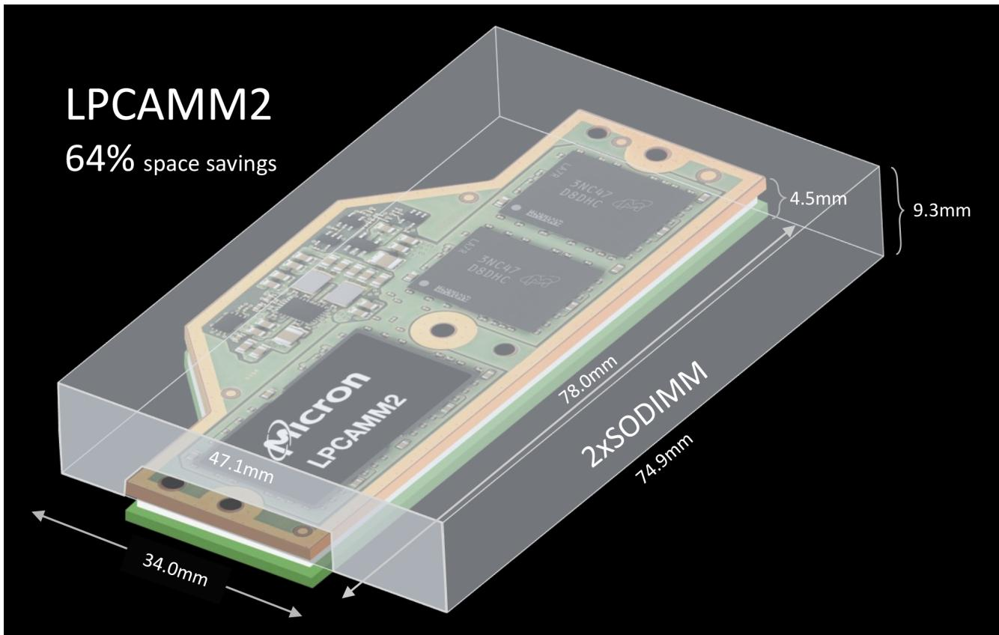

text_image

LPCAMM2
64% space savings
2xSODIMM
78.0mm
4.5mm
9.3mm
3NC47 D8DHC
2X100000000000000000000000000000000000000000000000000000000000000000000000000000000000
Micron
LPCAMM2
47.1mm
34.0mm
2XSODIMM
74.9mm

Source: Micron, Bernstein analysis

On aggregate bandwidth, SOCAMM2 on NVIDIA Vera (\~1,229 GB/s) narrows the gap significantly versus 16-channel DDR5 RDIMM (\~819 GB/s), though it trails MRDIMM (\~1,638 GB/s). However, SOCAMM2's power advantage is substantial: at 1.05V with \~30% lower total energy consumption versus RDIMM, SOCAMM2 delivers superior bandwidth-per-watt — the metric that matters most in GPU-centric AI servers where CPU memory power competes with GPU compute for the system power budget.

The capacity trade-off is notable. SOCAMM2's total capacity of 1.5 TB (8 × 192 GB) is adequate for NVIDIA's AI server use case where HBM on the GPU handles the primary data set. However, it falls well short of x86 platforms that can deploy 8–16 TB+ via high-density RDIMM/MRDIMM configurations — a critical requirement for memory-intensive enterprise and HPC workloads.

On interface chip content, SOCAMM2 carries significantly lower value per module (\~\$3–5 for SPD and voltage regulators) compared to MRDIMM's \~\$70+ chipset. This differential is the core economic consideration for memory interface chip suppliers.

## PLATFORM ADOPTION: WHY WE BELIEVE THAT SOCAMM2 WILL REMAIN NVIDIA-SPECIFIC

We anticipate SOCAMM2 to remain largely NVIDIA-specific within the foreseeable future, rather than evolving into a broader industry standard across ARM-based and x86 server CPU ecosystems. The adoption of SOCAMM2 by NVIDIA should be understood less as a DRAM technology inflection point, but more a system-level architectural optimization tightly coupled to NVIDIA's AI platform strategy. This divergence fundamental differences in switching costs, architectural priorities, and ecosystem dependencies between NVIDIA's greenfield ARM platform and the deeply entrenched server ecosystem of mainstream suppliers.

NVIDIA's full-stack co-optimization justifies the architectural bet. NVIDIA is unique among server CPU vendors in its ability and willingness to redesign the entire compute stack from silicon on rack. The Vera CPU is not a standalone processor competing for socket share in the open server market; it is a purpose-built component within an integrated system spanning GPU, CPU, NVLink interconnect, thermal management, and rack-level power delivery. In this context, SOCAMM2 is not merely a memory module choice, but an architectural enabler within the entire NVIDIA AI rack. By adopting SOCAMM2, NVIDIA can optimize memory power consumption at the rack level, freeing thermal and electrical headroom for GPU compute. This system-level co-optimization is viable only when a single vendor controls the full stack, and it is precisely what differentiates NVIDIA's approach from the rest of server ecosystem.

Switching costs are asymmetric across CPU vendors. NVIDIA faces near-zero switching costs because it is designing the Vera platform from scratch, with no legacy DDR memory controller IP, no existing DIMM slot mechanical standards, and no backward-compatibility obligations to prior server generations. It can architect the entire memory subsystem, including controller, board layout, connector placement, and firmware, around SOCAMM2 from inception. In contrast, any CPU vendor migrating away from DDR would bear the full burden of redesigning memory controllers, re-qualifying board layouts and connectors, revalidating the supply chain, and forfeiting backward compatibility, a multi-year and multi-hundred-million-dollar undertaking with uncertain returns.

Other ARM-based CPU vendors lack the volume to justify a proprietary DRAM ecosystem. NVIDIA's shipment volumes for AI server CPUs, which are underpinned by GB200/300 and Vera Rubin platforms deployed at hyperscaler, provide the unit economics necessary to sustain a distinct module standard and a complete new architecture. Other ARM-based server CPU vendors, such as AWS Graviton and Ampere Computing, operate at materially lower volumes and serve broader customer bases that depend on standardized DDR infrastructure. For these vendors, adopting SOCAMM2 would mean not only migrating to a low-volume module standard, but also sourcing new controller IP and asking OEMs to redesign the rack architecture. Simultaneously, this migration will fragmente their own platform compatibility with enterprise OEMs and cloud operators. The scale economics simply do not support this drastic switch. These vendors are more likely to pursue incremental bandwidth improvements within the DDR DIMM paradigm, particularly DDR5 MRDIMM, which offers substantial performance uplift without ecosystem disruption.

x86 platforms have no incentive to pivot to SOCAMM2. Intel and AMD face the highest switching costs of any server CPU vendor, having co-evolved with the DDR DIMM ecosystem over five generations and two decades. Beyond the prohibitive engineering costs of migrating memory controllers and platform designs, the performance argument itself does not favor SOCAMM2. MRDIMM delivers superior performance in bandwidth and capacity over SOCAMM2, through a more mature and multi-vendor supply chain. MRDIMM reserves standards that many server clients have been familiar with, without any of the switching costs associated with an entirely new memory architecture. We see no plausible scenario in which x86 CPU platforms switch to SOCAMM2.

EXHIBIT 9: We project that NVIDIA CPU shipment volume will account for only MSD to low teens in total server CPU shipment  
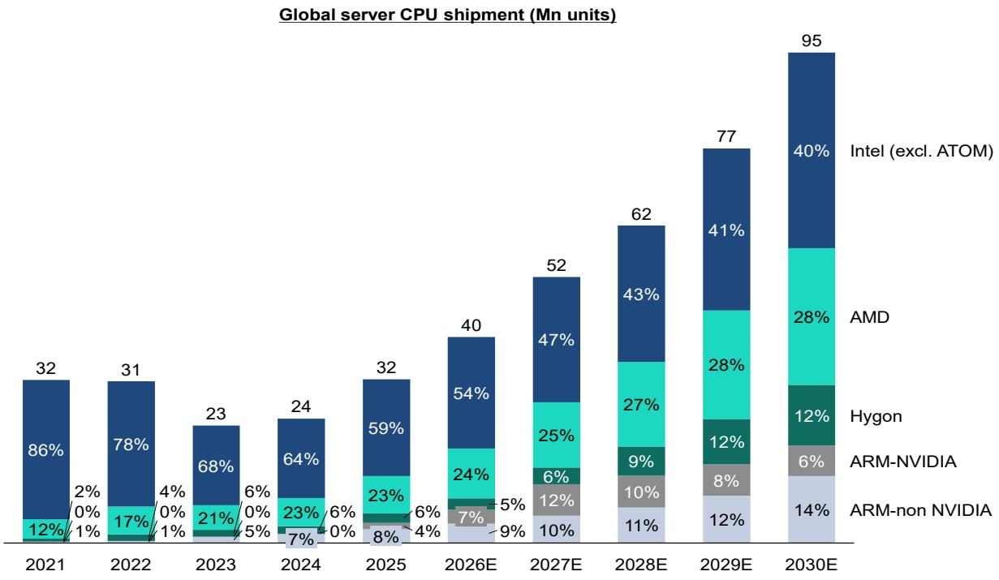  
Source: Mercury, Bernstein analysis and estimates

## SOCAMM2'S IMPACTS ON MEMORY INTERFACE CHIP SUPPLIERS

## A) SOCAMM2 EXPANDS TAM VS. SOLDERED LPDDR ON GRACE

Compared to NVIDIA's Grace CPU, where LPDDR5X was soldered directly to the board with zero module chipset content, the transition to detachable SOCAMM2 modules on Vera creates a new — if modest — chipset TAM. Each SOCAMM2 module requires at minimum an SPD chip and a PMIC for power management, and potentially voltage regulators and temperature sensors. These interface chips represent incremental revenue that previously did not exist on NVIDIA platforms.

## B) FAR LOWER VALUE CONTENT PER MODULE VS. DDR5 MRDIMM

SOCAMM2's chipset content (SPD + PMIC, estimated at a few dollars per module) pales in comparison to DDR5 MRDIMM's "1+10" architecture totaling \~\$50-70+ in interface silicon per module. MRDIMM will remain the mainstream high-value growth driver for interface chip suppliers. The global memory interface chip TAM will be driven predominantly by MRDIMM adoption on x86 platforms. SOCAMM2's chipset contribution to this TAM will remain a small fraction.

## C) DIFFERENTIATED IMPACT ACROSS THE THREE MAJOR SUPPLIERS

Rambus — Best positioned in SOCAMM2. Rambus has already launched a dedicated SOCAMM2 server module chipset and benefits from IP licensing royalties on new memory controller designs that must be made compatible with SOCAMM2. Management has characterized SOCAMM2 as a small near-term revenue contributor, but the strategic positioning ensures Rambus captures value across both DDR and LPDDR ecosystems.

Renesas — Natural adjacency. Renesas can leverage its deep heritage in power semiconductors and analog/mixed-signal design, particularly its industry-leading position in DIMM PMICs (estimated \~70% PMIC market share), to expand into SOCAMM2 chipsets. The PMIC and voltage regulator content on SOCAMM2 modules is a direct extension of Renesas's existing capabilities. The technical barriers to entry are lower than for DDR5 interface chips.

Montage — Most exposed but diversifying. Montage's core memory interface chips business is structurally tied to x86 DDR platforms. Each NVIDIA CPU socket adopting SOCAMM2 instead of DDR is a lost socket for Montage's high-value MRCD/MDB products. However, recent job postings for power semiconductor engineers suggest Montage may be building in-house SOCAMM2 chipset capabilities (particularly PMIC). This would represent a logical diversification, though Montage would enter a market where Rambus has first-mover advantage and where dollar content per module is an order of magnitude lower than MRDIMM.

The key mitigant: SOCAMM2 is confined to NVIDIA's ARM platforms. The x86 server CPU installed base remains committed to DDR5 RDIMM and the increasingly important MRDIMM upgrade cycle.

EXHIBIT 10: First to market: Rambus delivers SOCAMM2-compatible interface solution at current stage  
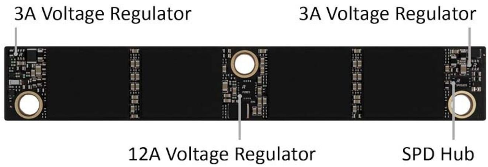

text_image

3A Voltage Regulator
3A Voltage Regulator
12A Voltage Regulator
SPD Hub

Source: company website, Bernstein analysis

## I. REQUIRED DISCLOSURES

References to "Bernstein" or the "Firm" in these disclosures relate to the following entities: Bernstein Institutional Services LLC (April 1, 2024 onwards), Bernstein & Co., LLC (pre April 1, 2024), Bernstein Autonomous LLP, BSG France S.A. (April 1, 2024 onwards), Bernstein (Hong Kong) Limited 盛博香港有限公司, Bernstein (Canada) Limited, Bernstein (India) Private Limited (SEBI registration no. INH000006378), Bernstein (Singapore) Private Limited, Bernstein Japan KK (サンフォード・C・バーンスタイン株式会社) and analysts employed by SG Africa Technologies & Services to produce Bernstein under a Global Services Agreement in place between Bernstein and SG.

Bernstein is part of a joint venture between SG (SG) and AllianceBernstein, L.P. (AB). Unless specifically noted otherwise, for purposes of these disclosures, references to Bernstein's “affiliates” relate to both SG and AB and their respective affiliates.

## VALUATION METHODOLOGY

## Montage Technology

We rate Montage Technology as Outperform and set a price target of CNY 220 for A shares, based on a 44x P/E multiple applied to 2BF (2027Q2–2028Q1) earnings. For H shares, we set a target price of HKD 320, maintaining the current approximately 27% H-to-A share premium (we use the CNY to HKD exchange rate at 1:1.145). At our target price, the implied P/E multiple on 2BF EPS for H shares is 56.4x.

## Renesas Electronics Corp

We set a ¥4,200 target price using a P/E multiple of 15x against our forward Q5-Q8 EPS estimate of ¥279.

## RISKS

## Montage Technology

Key potential risks:

1. A decrease in memory and AIDC server demand;  
2. Intensify competition that leads to share loss and lower margin;  
3. Failure to introduce new products for the AIDC networking market.

## Renesas Electronics Corp

There are a number of downside risks to our Renesas target price: (1) Prolonged delay in the Analog market recovery (2) Weaker-than-expected market share gain in both Automotive MCU and AI power markets (3) Exchange rate fluctuation with upside /downside risk to overall Japan market.

## RATINGS DEFINITIONS, BENCHMARKS AND DISTRIBUTION

## EQUITY RATINGS DEFINITIONS

## Bernstein brand

The Bernstein brand rates stocks based on forecasts of relative performance for the next 12 months versus the S&P 500 for stocks listed on the U.S. and Canadian exchanges, versus the Bloomberg Europe Developed Markets Large and Mid Cap Price Return Index EUR (EDME) for stocks listed on the European exchanges and emerging markets exchanges outside of the Asia Pacific region, versus the Bloomberg Japan Large and Mid Cap Price Return Index USD (JPL) for stocks listed on the Japanese exchanges, and versus the Bloomberg Asia ex-Japan Large and Mid Cap Price Return Index (ASIAX) for stocks listed on the Asian (ex-Japan) exchanges -unless otherwise specified.

The Bernstein brand has three categories of ratings:

- Outperform: Stock will outpace the market index by more than 15 pp  
• Market-Perform: Stock will perform in line with the market index to within +/-15 pp  
• Underperform: Stock will trail the performance of the market index by more than 15 pp

Coverage Suspended: Coverage of a company under the Bernstein brand has been suspended. Ratings and price targets are suspended temporarily, are no longer current, and should therefore not be relied upon.

Not Rated: A rating assigned when the stock cannot be accurately valued, or the performance of the company accurately predicted, at the present time. The covering analyst may continue to publish research reports on the company to update investors on events and developments.

Not Covered (NC) denotes companies that are not under coverage.

Bernstein brand stock ratings are based on a 12-month time horizon.

## Autonomous brand – common stocks

The Autonomous brand rates common stocks as indicated below. As our benchmarks we use the Bloomberg Europe 500 Banks And Financial Services Index (BEBANKS) and Bloomberg Europe Dev Mkt Financials Large and Mid Cap Price Ret Index EUR (EDMFI) index for developed European banks and Payments, the Bloomberg Europe 500 Insurance Index (BEINSUR) for European insurers, the S&P 500 and S&P Financials for US banks and Payments coverage, S5LIFE for US Insurance, the S&P Insurance Select Industry (SPSIINS) for US Non-Life Insurers coverage, and the Bloomberg Emerging Markets Financials Large, Mid and Small Cap Price Return Index (EMLSF) for emerging market banks and insurers and Payments. Ratings are stated relative to the sector (not the market).

The Autonomous brand has three categories of common stock ratings:

- Outperform (OP): Stock will outpace the relevant index by more than 10 pp  
- Neutral (N): Stock will perform in line with the market index to within +/-10 pp  
- Underperform (UP): Stock will trail the performance of the relevant index by more than 10 pp

Coverage Suspended: Coverage of a company under the Autonomous research brand has been suspended. Ratings and price targets are suspended temporarily, are no longer current, and should therefore not be relied upon.

Not Rated: A rating assigned when the stock cannot be accurately valued, or the performance of the company accurately predicted, at the present time. The covering analyst may continue to publish research reports on the company to update investors on events and developments.

Those denoted as ‘Feature’ (e.g., Feature Outperform FOP, Feature Under Outperform FUP) are our core ideas.

Not Covered (NC) denotes companies that are not under coverage.

Autonomous brand common stock ratings are based on a 12-month time horizon.

## Autonomous brand – preferred stocks

The Autonomous brand has three categories of preferred stock ratings:

- Outperform (OP): The total return of the preferred instrument is expected to outperform preferred securities of other issuers operating in similar sectors or rating categories over the next six months.  
- Neutral (N): The total return of the preferred instrument is expected to perform in line with preferred securities of other issuers operating in similar sectors or rating categories over the next six months.  
- Underperform (UP): The total return of the preferred instrument is expected to underperform preferred securities of other issuers operating in similar sectors or rating categories over the next six months.

Autonomous preferred stock ratings are based on a 6-month time horizon.

## AUTONOMOUS CREDIT RESEARCH

Where this report contains investment recommendations for credit instruments, as defined in article 3(1)(35) of the Market Abuse Regulation, the information below is presented to comply with its disclosure requirements.

The report may also include reference(s) to published opinions by other Autonomous or Bernstein analysts covering the equity securities of the issuer(s) referenced herein. Please note an investment recommendation for credit instruments published by the author(s) of this report may differ from the published view of the analyst covering equity securities for the issuer(s) contained in this report and vice versa.

## CREDIT RATINGS DEFINITIONS

The Autonomous brand has three categories of credit ratings:

- Credit Outperform (C-OP): The total return of the Reference Credit Instrument is expected to outperform the credit spread of bonds of other issuers operating in similar sectors or rating categories over the next six months.  
- Credit Neutral (C-N): The total return of the Reference Credit Instrument is expected to perform in line with the credit spread of bonds of other issuers operating in similar sectors or rating categories over the next six months.  
- Credit Underperform (C-UP): The total return of the Reference Credit Instrument is expected to underperform the credit spread of bonds of other issuers operating in similar sectors or rating categories over the next six months.

Autonomous credit ratings are based on a 6-month time horizon.

A list of all investment recommendations produced by the author(s) of this report alongside credit ratings history are available upon request.

It is at the sole discretion of the Firm as to when to initiate, update and cease research coverage. The Firm has established, maintains and relies on information barriers to control the flow of information contained in one or more areas (i.e. the private side) within the Firm, and into other areas, units, groups or affiliates (i.e. public side) of the Firm

DISTRIBUTION OF EQUITY RATINGS/INVESTMENT BANKING SERVICES

<table><tr><td>Equity Rating</td><td>Market Abuse Regulation (MAR) and FINRA Rating Category</td><td>Global Rating Distribution</td><td>Investment Banking Relationships*</td></tr><tr><td>Outperform</td><td>BUY</td><td>51.1%</td><td>16.5%</td></tr><tr><td>Market-Perform (Bernstein Brand) Neutral (Autonomous Brand)</td><td>HOLD</td><td>36.3%</td><td>17.8%</td></tr><tr><td>Underperform</td><td>SELL</td><td>12.6%</td><td>14.9%</td></tr></table>

\* These figures represent the percentage of companies within each equity rating category for which affiliates of Bernstein have provided investment banking services within the previous 12 months.  
As of March 31, 2026. All figures are updated quarterly.

## PRICE CHARTS / RATINGS AND PRICE TARGET HISTORY

Montage Technology (6809.HK) Rating History for Bernstein as of 06/16/2026  
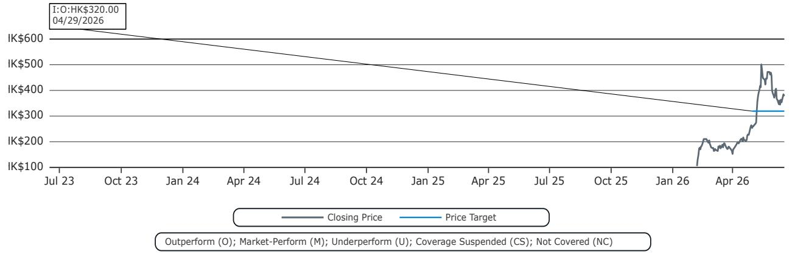

line chart

| Date       | Closing Price | Price Target |
| ---------- | ------------- | ------------ |
| 04/29/2026 | HK$320.00     | HK$320.00    |

Montage Technology (688008.CH) Rating History for Bernstein as of 06/16/2026  
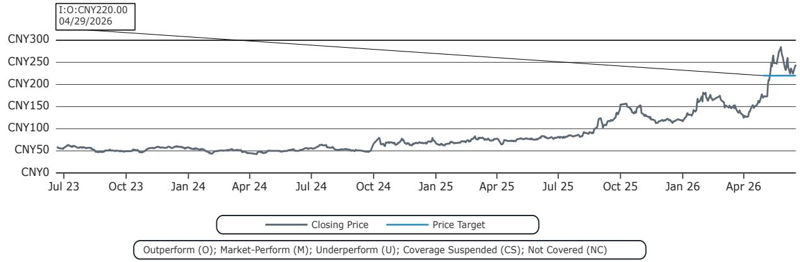

line chart

| Date       | Closing Price | Price Target |
| ---------- | ------------- | ------------ |
| 04/29/2026 | CNY220.00     |              |
| End        |               | CNY220.00    |

Renesas Electronics Corp (6723.JP) Rating History for Bernstein as of 06/16/2026  
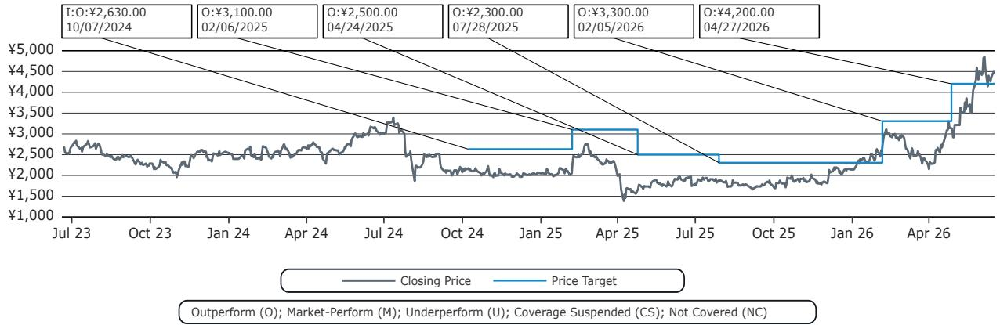

line chart

| Date       | Closing Price | Price Target |
| ---------- | ------------- | ------------ |
| 10/07/2024 | $2,630.00     | -            |
| 02/06/2025 | $3,100.00     | -            |
| 04/24/2025 | $2,500.00     | -            |
| 07/28/2025 | $2,300.00     | -            |
| 02/05/2026 | $3,300.00     | -            |
| 04/27/2026 | $4,200.00     | -            |

All price target and closing price data in the chart(s) above are denominated in the currency noted in the Ticker Table of this report.

## CONFLICTS OF INTEREST

SG and/or its affiliates beneficially own 1% or more of a class of common equity securities of the following company: Renesas Electronics Corp.

## OTHER MATTERS

The legal entity(ies) employing the analyst(s) listed in this report, and their location, can be determined by the country code of their phone number, as follows:

+1 Bernstein Institutional Services LLC; New York, New York, USA

+44 Bernstein Autonomous LLP; London UK

+212 SG Africa Technologies & Services; Casablanca, Morocco

+33 BSG France S.A.; Paris, France

+34 BSG France S.A.; Madrid, Spain

+41 Bernstein Autonomous LLP; Geneva, Switzerland

+49 BSG France S.A.; Frankfurt, Germany

+91 Bernstein (India) Private Limited; Mumbai, India

+852 Bernstein (Hong Kong) Limited 盛博香港有限公司; Hong Kong, China

+65 Bernstein (Singapore) Private Limited; Singapore

+81 Bernstein Japan KK; Tokyo, Japan

Where this report has been prepared by research analyst(s) employed by a non-US affiliate, such analyst(s), is/are (unless otherwise expressly noted below) not registered as associated persons of Bernstein Institutional Services LLC or any other SEC-registered broker-dealer and are not licensed or qualified as research analysts with FINRA. Accordingly, such analyst(s) may not be subject to FINRA's restrictions regarding (among other things) communications by research analysts with a subject company, interactions between research analysts and investment banking personnel, participation by research analysts in solicitation and marketing activities relating to investment banking transactions, public appearances by research analysts, and trading securities held by a research analyst account.

Where this report has been prepared by research analyst(s) employed by SG Africa Technologies & Services (part of the SG group of companies), it has been prepared on behalf of a Bernstein company under a Global Services Agreement in place between Bernstein and SG.

## CERTIFICATION

Each research analyst listed in this report, who is primarily responsible for the preparation of the content of this report, certifies that all of the views expressed in this publication accurately reflect that analyst's personal views about any and all of the subject securities or issuers and that no part of that analyst's compensation was, is, or will be, directly or indirectly, related to the specific recommendations or views in this publication.

## II. ADDITIONAL GLOBAL CONFLICT DISCLOSURES

It is at the sole discretion of the Firm as to when to initiate, update and cease research coverage. The Firm has established, maintains and relies on information barriers to control the flow of information contained in one or more areas (i.e., the private side) within the Firm, and into other areas, units, groups or affiliates (i.e., public side) of the Firm.

## III. OTHER IMPORTANT INFORMATION AND DISCLOSURES

Separate branding is maintained for “Bernstein” and “Autonomous” research products.

\- Bernstein produces a number of different types of research products including, among others, fundamental analysis and quantitative analysis under both the “Autonomous” and “Bernstein” brands. Recommendations contained within one type of research product may differ from recommendations contained within other types of research products, whether as a result of differing time horizons, methodologies or otherwise. Furthermore, views or recommendations within a research product issued under one brand may differ from views or recommendations under the same type of research product issued under the other brand. The Research Ratings System for the two brands and other information related to those Rating Systems are included in the previous section.

\- Autonomous operates as a separate business unit within the following entities: Bernstein Institutional Services LLC, Bernstein Autonomous LLP, Bernstein (Hong Kong) Limited 盛博香港有限公司 and Bernstein (India) Private Limited. For information relating to “Autonomous” branded products (including certain Sales materials) please visit: www.autonomous.com. For information relating to Bernstein branded products please visit: www.bernsteinresearch.com.

Analysts are compensated based on aggregate contributions to the research franchise as measured by account penetration, productivity and proactivity of investment ideas. No analysts are compensated based on performance in, or contributions to, generating investment banking revenues.

This report has been produced by an independent analyst as defined in Article 3 (1)(34)(i) of EU 596/2014 Market Abuse Regulation (“MAR”) and the same article of MAR as it forms part of United Kingdom domestic law by virtue of the European Union (Withdrawal) Act 2018.

To our readers in the United States: Bernstein Institutional Services LLC, a broker-dealer registered with the U.S. Securities and Exchange Commission (“SEC”) and a member of the U.S. Financial Industry Regulatory Authority, Inc. (“FINRA”) is distributing this publication in the United States and accepts responsibility for its contents. Where this material contains an analysis of debt product(s), such material is intended only for institutional investors and is not subject to the US independence and disclosure standards applicable to debt research prepared for retail investors.

Bernstein Institutional Services LLC may act as principal for its own account or as agent for another person (including an affiliate) in sales or purchases of any security which is a subject of this report. This report does not purport to meet the objectives or needs of any specific individuals, entities or accounts.

To our readers in Canada: If this publication pertains to a Canadian domiciled company, it is being distributed in Canada by Bernstein (Canada) Limited, which is licensed and regulated by the Canadian Investment Regulatory Organization. If the publication pertains to a non-Canadian domiciled company, it is being distributed by Bernstein Institutional Services LLC, which is licensed and regulated by both the SEC and FINRA, into Canada under the International Dealers Exemption.

This document may not be passed onto any person in Canada unless that person qualifies as "permitted client" as defined in Section 1.1 of NI 31-103.

To our readers in Brazil: This report has been prepared by Bernstein Institutional Services LLC, and Banco BTG Pactual S.A. ("BTG") is responsible for the distribution of this report in Brazil.

To readers in the United Kingdom: This publication has been issued or approved for issue in the United Kingdom by Bernstein Autonomous LLP, authorised and regulated by the Financial Conduct Authority and located at 60 London Wall, London EC2M 5SH, +44 (0)20-7170-5000. Registered in England & Wales No OC343985.

This document is for distribution only to persons who (i) have professional experience in matters relating to investments falling within Article 19(5) of the Financial Services and Markets Act 2000 (Financial Promotion) Order 2005 (as amended, the “Financial Promotion Order”), (ii) are persons falling within Article 49(2)(a) to (d) (“high net worth companies, unincorporated associations, etc.”) of the Financial Promotion Order, (iii) are outside the United Kingdom, or (iv) are persons to whom an invitation or inducement to engage in investment activity (within the meaning of section 21 of the FSMA) in connection with the issue or sale of any securities may otherwise lawfully be communicated or caused to be communicated (all such persons together being referred to as “relevant persons”). This document is directed only at relevant persons and must not be acted on or relied on by persons who are not relevant persons. Any investment or investment activity to which this document relates is available only to relevant persons and will be engaged in only with relevant persons.

To our readers in the member states of the EEA: This publication is being distributed by BSG France SA, which is authorised and regulated by the Autorité de Contrôle Prudentiel et de Résolution (ACPR) and Autorité des Marchés Financiers (AMF).

To our readers in Hong Kong: This publication is being distributed in Hong Kong by Bernstein (Hong Kong) Limited 盛博香港有限公司, which is licensed and regulated by the Hong Kong Securities and Futures Commission (Central Entity No. AXC846) to carry out Type 4 (Advising on Securities) regulated activities and subject to the licensing conditions mentioned in the SFC Public Register (https://www.sfc.hk/publicregWeb/corp/AXC846/details)). This publication is solely for professional investors, as defined in the Securities and Futures Ordinance (Cap. 571). The purpose of this report is solely to provide an analysis of the issuers referred to in this report and is not intended for any purpose contrary to the laws of Hong Kong.

To our readers in Singapore: This publication is being distributed in Singapore by Bernstein (Singapore) Private Limited, only to accredited investors or institutional investors, as defined in the Securities and Futures Act 2001 of Singapore ("SFA"). Recipients in Singapore should contact Bernstein (Singapore) Private Limited in respect of matters arising from, or in connection with, this publication. Bernstein (Singapore) Private Limited is regulated by the Monetary Authority of Singapore and licensed under the SFA as a capital markets services licence holder for dealing in capital markets products that are securities and collective investment schemes and an exempt financial adviser for advising on, issuing and promulgating analyses and reports on securities. Bernstein (Singapore) Private Limited is registered in Singapore with Company Registration No. 20213710W and located at 8 Marina Boulevard, #12-01, Marina Bay Financial Centre, Singapore 018981, +65-6326-7000.

To our readers in the People's Republic of China: The securities referred to in this document are not being offered or sold and may not be offered or sold, directly or indirectly, in the People's Republic of China (for such purposes, not including the Hong Kong and Macau Special Administrative Regions or Taiwan, the “PRC”) in contravention of any applicable laws of the PRC.

This document does not constitute an offer to sell or the solicitation of an offer to buy any securities in the PRC to any person to whom it is unlawful to make the offer or solicitation in the PRC.

We do not represent that this document may be lawfully distributed, or that any securities may be lawfully offered, in compliance with any applicable registration or other requirements in the PRC, or pursuant to an exemption available thereunder, or assume any responsibility for facilitating any such distribution or offering. In particular, no action has been taken by us which would permit a public offering of any securities or distribution of this document in the PRC. Accordingly, the securities are not being offered or sold within the PRC by means of this document or any other document. Neither this document nor any advertisement or other offering material may be distributed or published in the PRC, except under circumstances that will result in compliance with any applicable laws and regulations.

To our readers in Japan: This publication is being distributed in Japan by Bernstein Japan KK (サンフォード・C・バーンスタイン株式会社), which is registered in Japan as a Financial Instruments Business Operator with the Kanto Local Finance Bureau (registration number: The Director-General of Kanto Local Finance Bureau (FIBO) No.3387) and regulated by the Financial Services Agency. It is also a member of Investment Management Association of Japan. This publication is solely for qualified institutional investors in Japan only, as defined in Article 2, paragraph (3), items (i) of the Financial Instruments and Exchange Act.

For the institutional client readers in Japan who have been granted access to the Bernstein website by Daiwa Group Inc. ("Daiwa"), your access to this document should not be construed as meaning that Bernstein is providing you with investment advice for any purposes. Whilst Bernstein has prepared this document, your relationship is, and will remain with, Daiwa, and Bernstein has neither any contractual relationship with you nor any obligations towards you.

To our readers in Australia: Bernstein (Hong Kong) Limited 盛博香港有限公司 is responsible for distributing research in Australia. It is regulated by the Securities and Exchange Commission under U.S. laws, by the Financial Conduct Authority under U.K. laws, which differs from Australian laws. Bernstein (Hong Kong) Limited 盛博香港有限公司 is exempt from the requirement to hold an Australian financial services license under the Corporations Act 2001 in respect of the provision of the following financial services to wholesale clients:

• providing financial product advice;  
• dealing in a financial product;  
• making a market for a financial product; and  
• providing a custodial or depository service.

To our readers in India: This publication is being distributed in India by Bernstein (India) Private Limited (SCB India) which is licensed and regulated by Securities and Exchange Board of India ("SEBI") as a research analyst entity under the SEBI (Research Analyst) Regulations, 2014, having registration no. INH000006378 and as a stock broker having registration no. INZ000213537. SCB India is currently engaged in the business of providing research and stock broking services. Please refer to www.bernsteinresearch.in for more information.

\- SCB India is a Private limited company incorporated under the Companies Act, 2013, on April 12, 2017 bearing corporate identification number U65999MH2017FTC293762, and registered office at Level 3A, 4th Floor, First International Financial Centre, Plot Nos C-54 and C-55, G Block, Near CBI Office, Bandra Kurla Complex, Bandra (East), Mumbai 400098, Maharashtra, India (Phone No: +91-22-68421401).

\- For details of Associates (i.e., affiliates/group companies) of SCB India, kindly email MUM-BERNSTEIN-InCompliance@bernsteinsg.com.

• SCB India does not have any disciplinary history as on the date of this report.

\- Except as noted above, SCB India and/or its Associates (i.e., affiliates/group companies), the Research Analysts authoring this report, and their relatives

• do not have any financial interest in the subject company  
• do not have actual/beneficial ownership of one percent or more in securities of the subject company;  
- is not engaged in any investment banking activities for Indian companies, as such;

• have not managed or co-managed a public offering in the past twelve months for any Indian companies;

\- have not received any compensation for investment banking services or merchant banking services from the subject company in the past 12 months;

• have not received compensation for brokerage services from the subject company in the past twelve months;

\- have not received any compensation or other benefits from the subject company or third party related to the specific recommendations or views in this report; and

\- do not currently, but may in the future, act as a market maker in the financial instruments of the companies covered in the report.

• do not have any conflict of interest in the subject company as of the date of this report.

- Except as noted above, the subject company has not been a client of SCB India during twelve months preceding the date of distribution of this research report. Neither SCB India nor its Associates (i.e., affiliates/group companies) have received compensation for products or services other than investment banking, merchant banking or brokerage services from the subject company in the past twelve months.  
- The principal research analyst(s) who prepared this report, members of the analysts' team, and members of their households are not an officer, director, employee or advisory board member of the companies covered in the report.  
- Our Compliance officer / Grievance officer is Ms. Rupal Talati, who can be reached at +91-22-68421451, or MUM-BERNSTEIN-InCompliance@bernsteinsg.com / Scbin-investorgrievance@bernsteinsg.com  
- The Research investor charter and Terms & Conditions of SCB India are available on its website and may be accessed at Bernstein (India) Private Limited (https://bernsteinresearch.in/) for your reference.  
- Disclaimer: Registration granted by SEBI, and certification from NISM, is in no way a guarantee of performance of the intermediary or provide any assurance of returns to investors. Investments in securities market are subject to market risks. Read all the related documents carefully before investing.

To our readers in Switzerland: This document is provided in Switzerland by or through Bernstein Autonomous LLP, and is provided only to qualified investors as defined in article 10 of the Swiss Collective Investment Scheme Act (“CISA”) and related provisions of the Collective Investment Scheme Ordinance and in strict compliance with applicable Swiss law and regulations. The products mentioned in this document may not be suitable for all types of investors. This document is based on the Directives on the Independence of Financial Research issued by the Swiss Bankers Association (SBA) in January 2008.

To our readers in the Middle East: Bernstein Autonomous LLP, DIFC branch has its principal office at Gate Village 06, DIFC, Dubai, UAE. Bernstein Autonomous LLP, DIFC branch is regulated by the Dubai Financial Services Authority (DFSA) with the registration number CL10040 and is provisioned for Arranging Deals in Investments and Advising on Financial Products. All communications and services are directed at Professional Clients and Market Counterparties only (as defined in the DFSA rulebook). Persons other than Professional Clients and Market Counterparties, such as Retail Clients, are not the intended recipients of our communications or services.

## LEGAL

All research publications are disseminated to our clients through posting on the firm's password protected websites, bernsteinresearch.com and autonomous.com. Certain, but not all, research publications are also made available to clients through third-party vendors or redistributed to clients through alternate electronic means as a convenience.

This publication has been published and distributed in accordance with the Firm's policy for management of conflicts of interest in investment research, a copy of which is available from Bernstein Institutional Services LLC, Director of Compliance, 245 Park Avenue, New York, NY 10167. Additional disclosures and information regarding Bernstein's business are available on our website www.bernsteinresearch.com.

The securities described herein may not be eligible for sale in all jurisdictions or to certain categories of investors where that permission profile is not consistent with the licenses held by the entities noted herein. This document is for distribution only as may be permitted by law. This publication is not directed to, or intended for distribution to or use by, any person or entity who is a citizen or resident of, or located in any locality, state, country or other jurisdiction where such distribution, publication, availability or use would be contrary to law or regulation or which would subject any of the entities referenced herein or any of their subsidiaries or affiliates to any registration or licensing requirement within such jurisdiction. This publication is based upon public sources we believe to be reliable, but no representation is made by us that the publication is accurate or complete. We do not undertake to advise you of any change in the reported information or in the opinions herein. This publication was prepared and issued by entity referred to herein for distribution to eligible counterparties or professional clients. This publication is not an offer to buy or sell any security, and it does not constitute investment, legal or tax advice. The investments referred to herein may not be suitable for you. Investors must make their own investment decisions in consultation with their professional advisors in light of their specific circumstances. The value of investments may fluctuate, and investments that are denominated in foreign currencies may fluctuate in value as a result of exposure to exchange rate movements. Information about past performance of an investment is not necessarily a guide to, indicator of, or assurance of, future performance.

This report is directed to and intended only for our clients who are “eligible counterparties”, “professional clients”, “institutional investors” and/or “professional investors” as defined by the aforementioned regulators, and must not be redistributed to retail clients as defined by the aforementioned regulators. Retail clients who receive this report should note that the services of the entities noted herein are not available to them and should not rely on the material herein to make an investment decision. The result of such act will not hold the entities noted herein liable for any loss thus incurred as the entities noted herein are not registered/authorised/licensed to deal with retail clients and will not enter into any contractual agreement/arrangement with retail clients. This report is provided subject to the terms and conditions of any agreement that the clients may have entered into with the entities noted herein. All research reports are disseminated on a simultaneous basis to eligible clients through electronic publication to our client portal.

The information in this report was prepared by Bernstein solely for the internal business use of our clients. Clients may store, display, analyze, reformat and print the information in this report for this limited use only. Clients may not copy, alter, create derivative works, resell, reverse engineer, commercially exploit, share or distribute any part of the information contained herein for any purpose without Bernstein's express written consent. These restrictions include extracting data or using the content to develop indices or other products. Further, you may not use this report, or any portion of this report, to train or finetune any third-party machine learning or artificial intelligence system, or as a prompt or input into any such system. You also may not, without Bernstein's express written consent, do any of the foregoing in connection with your own internal machine learning or artificial intelligence system.

Bernstein may use artificial intelligence tools in the preparation of its materials. Any such materials are reviewed by Bernstein's research analysts prior to publication.

This report has been prepared for information purposes only and is based on current public information that we consider reliable, but the entities noted herein do not warrant or represent (express or implied) as to the sources of information or data contained herein are accurate, complete, not misleading or as to its fitness for the purpose intended even though the entities noted herein rely on reputable or trustworthy data providers, it should not be relied upon as such. Opinions expressed are the author(s)' current opinions as of the date appearing on the material only and we do not undertake to advise you of any change in the reported information or in the opinions herein.

Any references to SG herein are purely factual, based upon publicly available information, and included for comparative purposes only. They do not constitute an opinion or recommendation with respect to the securities of SG.

This publication was prepared and issued by the entity referred to herein for distribution to eligible counterparties or professional clients. The information in this report is intended for general circulation and does not constitute an offer to buy or sell any security, investment, legal or tax advice nor a personal recommendation, as defined by any of the aforementioned regulators. It does not take into account the particular investment objectives, financial situations, or needs of individual investors. The report has not been reviewed by any of the aforementioned regulators and does not represent any official recommendation from the aforementioned regulators. The investments referred to herein may not be suitable for you. Investors must make their own investment decisions in consultation with advice sought from a financial adviser regarding the suitability of the investment product, taking into account the specific investment objectives, financial situation or particular needs of any recipient of the recommendation, before the recipient makes a commitment to purchase the investment product.

The analysis contained herein is based on numerous assumptions. Different assumptions could result in materially different results. The information in this report does not constitute, or form part of, any offer to sell or issue, or any offer to purchase or subscribe for shares, or to induce engagement in any other investment activity. The value of any securities or financial instruments mentioned in this report may fluctuate subject to market conditions. Information about past performance of an investment is not necessarily a guide to, indicative of, or assurance of future performance. Estimates of future performance mentioned by the research analyst in this report are based on assumptions that may not be realized due to unforeseen factors like market volatility/fluctuation. In relation to securities or financial instruments denominated in a foreign currency other than the clients' home currency, movements in exchange rates will have an effect on the value, either favorable or unfavorable. Before acting on any recommendations in this report, recipients should consider the appropriateness of investing in the subject securities or financial instruments mentioned in this report and, if necessary, seek independent professional advice.

The securities described herein may not be eligible for sale in all jurisdictions or to certain categories of investors where that permission profile is not consistent with the licenses held by the entities noted herein. This document is for distribution only as may be permitted by law. It is not directed to, or intended for distribution to or use by, any person or entity who is a citizen or resident of or located in any locality, state, country or other jurisdiction where such distribution, publication, availability or use would be contrary to law or regulation or would subject the entities noted herein to any regulation or licensing requirement within such jurisdiction.

Source: Bloomberg Index Services Limited. BLOOMBERG® is a trademark and service mark of Bloomberg Finance L.P. and its affiliates (collectively “Bloomberg”). Bloomberg or Bloomberg’s licensors own all proprietary rights in the Bloomberg Indices. Neither Bloomberg nor Bloomberg’s licensors approves or endorses this material, or guarantees the accuracy or completeness of any information herein, or makes any warranty, express or implied, as to the results to be obtained therefrom and, to the maximum extent allowed by law, neither shall have any liability or responsibility for injury or damages arising in connection therewith.

No part of this material may be reproduced, distributed or transmitted or otherwise made available without prior consent of the entities noted herein. Copyright Bernstein Institutional Services LLC Bernstein Autonomous LLP, BSG France S.A., Bernstein (Hong Kong) Limited 盛博香港有限公司, Bernstein (Canada) Limited, Bernstein (India) Private Limited (SEBI registration no. INH000006378), Bernstein (Singapore) Private Limited and Bernstein Japan KK (サンフォード・C・バーンスタイン株式会社). All rights reserved. The trademarks and service marks contained herein are the property of their respective owners. Any unauthorized use or disclosure is strictly prohibited. The entities noted herein may pursue legal action if the unauthorized use results in any defamation and/or reputational risk to the entities noted herein and research published under the Bernstein and Autonomous brands.