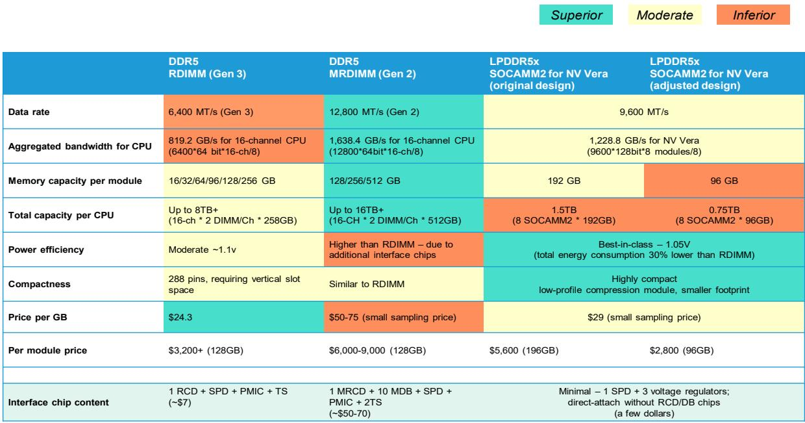

# Bernstein：SOCAMM2不会侵蚀内存接口芯片市场，市场高估了替代风险

NVIDIA最新发布的ARM架构服务器CPU Vera采用了名为SOCAMM2的新型内存封装格式。这一变化引发了一个关键问题：如果SOCAMM2成为主流，内存接口芯片的总可寻址市场将显著缩小，因为其每模块的接口芯片价值仅为数美元，远低于DDR5 MRDIMM的50至70美元。投资者对澜起科技和瑞萨电子的担忧并非没有道理。

但Bernstein这份最新研报给出了一个清晰且反直觉的判断：SOCAMM2大概率将局限于NVIDIA自身生态，不会对更广泛的服务器内存接口芯片市场构成实质性威胁。市场真正需要关注的，不是SOCAMM2本身，而是它揭示的一个更深层结构性趋势——AI服务器架构正在从“通用标准”走向“垂直整合”，而这一变化对不同参与者的含义截然不同。

这份报告的核心价值不在于技术细节的罗列，而在于它提供了一个区分“短期噪音”与“长期结构”的分析框架。对于持有或关注澜起科技、瑞萨电子的投资者而言，真正需要判断的不是SOCAMM2的技术优劣，而是它能否跨越NVIDIA的围墙，进入x86和其他ARM生态。Bernstein的答案是否定的，且给出了令人信服的论据。

## 1. SOCAMM2本质上是NVIDIA的全栈优化工具，而非颠覆性的行业标准

SOCAMM2并非凭空出现。它是NVIDIA从Grace到Vera架构演进中，为解决特定问题而设计的定制化方案。Grace CPU采用焊接式LPDDR5x，虽然能效出色，但无法现场升级或更换——一旦内存故障或容量需求变化，整块主板必须更换。SOCAMM2通过可拆卸的模块化设计解决了这一痛点。

然而，这种设计的优势高度依赖于NVIDIA的机架级优化逻辑。在NVIDIA的AI服务器中，GPU计算功耗是核心约束，CPU内存的能效必须为此让步。SOCAMM2在1.05V电压下比RDIMM降低约30%的总能耗，这恰恰是NVIDIA最看重的指标——每瓦特产生的token数。

但关键问题在于，这种优化的代价是容量和带宽的明显妥协。SOCAMM2单CPU总容量为1.5TB（8模块x192GB），而MRDIMM可轻松达到16TB以上。带宽方面，SOCAMM2约1.2TB/s，介于DDR5 RDIMM的819GB/s和MRDIMM的1.6TB/s之间。对于需要处理大规模内存数据库或HPC工作负载的x86平台而言，这种取舍不可接受。

因此，SOCAMM2不是一种“更好的内存标准”，而是NVIDIA在特定约束下做出的最优解。它的存在价值，只有在NVIDIA的全栈控制框架内才能最大化。

## 2. x86和其他ARM生态面临不可逾越的转换成本，SOCAMM2的扩散被天然阻断

Bernstein报告中最具洞察力的部分，是指出了SOCAMM2扩散的结构性障碍。这不仅仅是技术性能的比较，更是生态锁定成本的考量。

x86服务器CPU已深度嵌入DDR生态系统数十年。从内存控制器设计、主板布局、BIOS/固件支持，到操作系统内存管理、应用层优化，整个体系围绕DDR DIMM构建。转向SOCAMM2意味着：重新设计内存控制器、重新布线主板、重新验证整个平台的兼容性、放弃与现有DDR模块的向后兼容性。这些成本对于英特尔和AMD而言是“毁灭性”的——它们没有NVIDIA那种从零开始设计ARM CPU的“绿色field”优势。

更重要的是，x86平台的核心客户——企业级数据中心和云服务商——对容量和带宽的需求远高于NVIDIA AI服务器的典型场景。MRDIMM在容量和带宽上的绝对优势，使其成为这些客户无法替代的选择。SOCAMM2在容量上的天花板（1.5TB/CPU）对于需要8TB以上内存的数据库、虚拟化、HPC场景而言，根本不够用。

因此，SOCAMM2的扩散不是“会不会”的问题，而是“有没有必要”的问题。对于x86生态，转换成本远高于潜在收益。对于其他ARM CPU厂商（如Ampere），它们同样依赖DDR生态，且缺乏NVIDIA那种全栈控制能力来证明SOCAMM2的合理性。

## 3. 对澜起科技和瑞萨电子的实际影响有限，MRDIMM增长才是核心叙事

Bernstein的量化分析给出了一个清晰的结论：即使SOCAMM2被NVIDIA采用，其对内存接口芯片TAM的影响也仅限于NVIDIA CPU的出货量份额——预计在未来几年内仅为高单至低双位数百分比。这意味着，SOCAMM2带来的TAM缩减，完全可以被MRDIMM的增量采用所抵消。

更值得关注的是，SOCAMM2相对于Grace的焊接式LPDDR5x，实际上增加了内存接口芯片的使用。Grace的LPDDR5x直接焊接在主板上，几乎没有接口芯片；而SOCAMM2需要SPD和电压调节器，虽然价值量不高（数美元），但对澜起科技和瑞萨电子而言，这反而是增量而非减量。

Bernstein维持对澜起科技和瑞萨电子的“跑赢大盘”评级。对于澜起科技，市场对SOCAMM2替代风险的担忧被过度放大。真正支撑其投资逻辑的，是MRDIMM带来的结构性增长——每模块50至70美元的接口芯片价值量，以及x86平台向MRDIMM迁移的确定性趋势。对于瑞萨电子，其内存接口业务规模与澜起科技相当，但仅占公司总收入的个位数百分比，市场尚未充分定价这一高增长业务的价值。

## 4. 报告尚未完全回答的关键问题：SOCAMM2的供给约束与定价路径

Bernstein的论证逻辑严谨，但有一个关键假设需要进一步验证：SOCAMM2的供给约束何时能够缓解？报告提到，在最近的ComputeX上，NVIDIA和SK海力士宣布Vera Rubin NVL72将搭载96GB SOCAMM2模块，而非最初规划的192GB。这一调整直接导致机架级CPU聚合内存从约55TB降至约28TB。

Bernstein将这一变化归因于“供给侧约束”而非需求疲软——LPDDR5x供应极度紧张，SOCAMM2作为新兴小众产品，内存制造商和接口芯片供应商的产能有限。通过出货更低密度的模块，NVIDIA可以在相同DRAM供应下部署更多机架，加速上市时间。

但这里存在一个未解问题：如果SOCAMM2的需求超出预期（例如，其他超大规模客户也开始采用），供给约束是否会成为长期瓶颈？目前三星、SK海力士和美光已开始提供SOCAMM2模块，但量产时间表集中在2026年上半年。如果NVIDIA的Vera出货量超出预期，SOCAMM2的供应能否跟上？这可能是影响TAM计算的一个关键变量。

此外，SOCAMM2的定价路径尚未明确。当前模块样品价格约为每GB 29美元，高于DDR5 RDIMM的24.3美元。随着量产规模扩大，价格能否降至具有竞争力的水平？如果SOCAMM2的价格优势无法显现，其吸引力将进一步降低。

## 5. 投资者的观察框架：区分“技术噪音”与“结构趋势”

对于关注半导体内存接口赛道的投资者，这份报告提供了一个简洁但有效的分析框架：

第一，区分“NVIDIA专用”与“行业通用”。SOCAMM2是NVIDIA全栈优化的产物，其成功与否取决于NVIDIA自身AI服务器的出货量，而非对整个行业标准的替代。投资者应当将SOCAMM2视为NVIDIA供应链的一个变量，而非整个内存接口芯片市场的威胁。

第二，关注MRDIMM的渗透率曲线。MRDIMM才是决定澜起科技和瑞萨电子长期价值的关键。MRDIMM的接口芯片价值量是DDR5 RDIMM的7至10倍，且x86平台的迁移已经开始。如果MRDIMM在2027年前后进入大规模量产阶段，其对TAM的增量贡献将远超SOCAMM2带来的任何减量。

第三，关注澜起科技H股相对于A股的估值溢价。Bernstein指出，H股溢价反映了全球投资者将澜起科技视为稀缺的中国AI敞口标的，且不直接面临实体清单或出口管制风险。这一溢价是否合理，取决于市场对澜起科技在MRDIMM和SOCAMM2两条技术路线上的竞争地位的认知。

第四，警惕“技术叙事”对估值的短期扰动。SOCAMM2引发的担忧本质上是一种“技术替代叙事”，而非基本面变化。历史经验表明，这类叙事往往在研报发布后的一两个季度内被证伪，但期间可能造成股价波动。对于长线投资者，这可能反而是加仓机会。

SOCAMM2的故事远未结束。NVIDIA的Vera Rubin将在2026年正式出货，届时SOCAMM2的实际采用率、供给约束的缓解程度、以及MRDIMM的竞争反应，都会给出更清晰的答案。但至少从Bernstein的这份报告来看，市场对SOCAMM2的担忧，更像是一次对“技术噪音”的过度反应，而非对“结构趋势”的准确预判。

欢迎来星球微信群里继续讨论——我们会在后续的研报导读中，进一步拆解MRDIMM的渗透率驱动因素、澜起科技和瑞萨电子的竞争壁垒，以及SOCAMM2在NVIDIA生态外的扩散可能性。这些问题的答案，将直接影响你对这两个标的的估值判断。

Personal reading notes and learning share only. Not investment advice.

