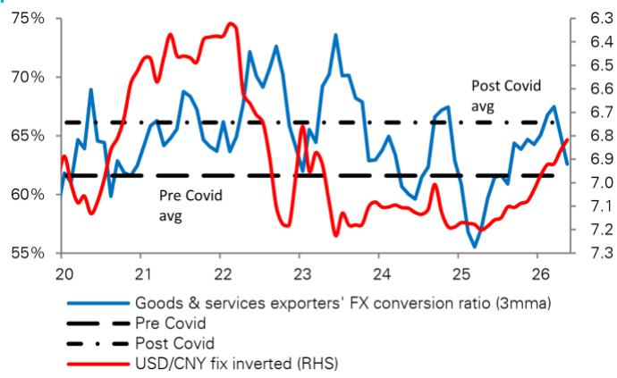

# The Real Story Behind RMB Strength Is Not Exporters—It Is Portfolio Inflows That Signal a Structural Shift

China’s renminbi is showing signs of durable strength, but the conventional narrative that exporters are driving this move is misleading. The latest data from the State Administration of Foreign Exchange reveals that while total client-driven USD selling reached approximately $40 billion for a third consecutive month, the composition of that flow has shifted in a way that changes the strategic outlook for the currency. Exporters are actually converting less of their foreign exchange receipts, with the conversion ratio falling to 62.6% in May from 67.5% in March. This hesitancy suggests that the very actors who typically support the renminbi are stepping back. The true driver of recent RMB appreciation is something far more significant: a resurgence in portfolio inflows that marks the largest net foreign bond buying since April 2025, with approximately $7.2 billion converted into yuan in the onshore spot market alone.

This is not a temporary correction. It is a signal that global asset allocators are reassessing China’s fixed-income market at a time when most institutional portfolios remain underweight Chinese bonds. The convergence of strong year-to-date performance in Chinese government bonds, a stabilization in geopolitical risk perceptions, and a structural under-allocation to China’s capital markets creates a setup that could sustain RMB appreciation well beyond what the current consensus expects. For investors who have been hedging CNY exposure or delaying conversion decisions, the window for strategic positioning may be narrowing.

The conventional wisdom that a weaker renminbi serves China’s export competitiveness is being tested by a more complex reality. The capital account—not the trade account—is increasingly setting the direction for the currency. This shift demands a different analytical framework, one that weights portfolio flow dynamics at least as heavily as trade balance considerations. The question is no longer whether the RMB will strengthen, but whether the institutional infrastructure exists to absorb the inflows that are likely coming.

This article examines the structural forces behind the current RMB move, identifies the gaps in the prevailing analytical framework, and offers a decision framework for investors navigating this transition.

## The Export Conversion Ratio Decline Reveals a Strategic Caution That Contradicts the Trade Surplus Narrative

Exporters are the natural long-RMB constituency in China’s foreign exchange market. When they receive USD payments for goods sold abroad, they typically convert a large portion into yuan to meet domestic obligations. A high conversion ratio has historically been a reliable signal of confidence in the currency and the domestic economy. The decline from 67.5% to 62.6% over two months is therefore a warning that should not be dismissed as noise.

What explains this hesitation? Three factors appear to be at play. First, global uncertainty remains elevated, and exporters are holding USD as a hedge against volatility in supply chains, shipping costs, and demand from developed markets. Second, import costs have risen, creating a natural incentive to retain foreign currency to pay for raw materials and intermediate goods. Third, and most subtly, exporters may be anticipating further RMB weakness and are delaying conversion to capture a more favorable rate. This last point is critical: if exporters themselves are not betting on near-term RMB strength, then the currency’s recent gains must be explained by a different source of demand.

The implication is that the trade surplus—still substantial by historical standards—is not being fully channeled into RMB buying. The current account is providing support, but it is doing so at a diminishing rate. Investors who rely on trade balance data as a proxy for currency direction are missing the evolution in behavior that matters most. The pattern suggests that the marginal driver of RMB movement has shifted from trade to finance.

## Portfolio Inflows Have Returned at Scale, and the Composition Suggests Durability

The real surprise in the SAFE data is the return of portfolio inflows for a second consecutive month. Net FX receipt and payment data show these inflows increased by $18 billion, the largest since 2021, with roughly $7.2 billion converted into CNY in the onshore spot market. This is not a one-off event. The CCDC data confirms that foreign investors purchased approximately $13 billion of Chinese bonds in May, the first net purchase since April 2025.

Why now? The most proximate cause is the strong year-to-date performance of Chinese government bonds. In a global environment where rate cuts are being delayed in the United States and Europe, China offers a rare combination of yield stability and monetary policy divergence. The renminbi’s recent stability has also reduced the hedging cost for foreign investors, making the carry trade more attractive. But there is a deeper structural factor at play: the market remains underweight China bonds. Institutional portfolios have been slow to allocate to Chinese fixed income due to geopolitical concerns, liquidity constraints, and regulatory uncertainty. As these barriers gradually erode, the rebalancing flow could be substantial.

The durability of these inflows depends on whether they are driven by tactical positioning or strategic allocation. The evidence points toward the latter. The scale of the May purchase, combined with the fact that it follows a period of sustained outflows, suggests that large asset managers are making deliberate shifts in their benchmark weights. This is not momentum trading; it is portfolio construction. For the RMB, this means the support from the capital account is likely to persist even if trade-related flows weaken further.

## The Market Is Underweight China Bonds, and the Rebalancing Has Only Just Begun

The most compelling argument for sustained RMB strength is not what has happened, but what has not yet happened. Global portfolios remain underweight Chinese bonds relative to China’s weight in global GDP, trade, and reserve accumulation. This underweight position is a legacy of the 2022-2024 period, when regulatory crackdowns, zero-COVID disruptions, and geopolitical tensions drove foreign investors to reduce exposure. The reversal of these factors is gradual, but it is underway.

Consider the mechanics. If global bond indices increase their China weight, or if sovereign wealth funds and central banks decide to rebuild their CNY reserves, the resulting demand for Chinese bonds would create a persistent bid for the currency. The CCDC data shows that even the modest inflows seen in May were sufficient to move the spot market. A larger rebalancing would have outsized effects on the RMB, particularly given the relatively shallow depth of the onshore FX market compared to the scale of potential capital flows.

The risk is that the market underestimates the speed and magnitude of this rebalancing. Most forecasts for the RMB are anchored to trade dynamics and interest rate differentials, both of which suggest a gradual depreciation path. But portfolio flows are inherently more volatile and can overwhelm these traditional drivers. If foreign investors decide that China bonds offer an attractive risk-adjusted return relative to developed market alternatives, the capital account could become the dominant force in RMB pricing for quarters to come.

## What the Report Does Not Fully Answer: The Conditions Under Which Portfolio Inflows Could Reverse

The analytical case for RMB strength is compelling, but it rests on an assumption that portfolio inflows will continue or accelerate. What would cause them to reverse? The report identifies geopolitical de-escalation as a supporting factor, but it does not fully explore the scenarios in which inflows could stall.

Three risks stand out. First, a sharp rise in US interest rates relative to China would reduce the carry appeal of Chinese bonds and could trigger outflows. Second, a deterioration in China’s domestic credit conditions or a resurgence in property sector stress would undermine confidence in the bond market’s stability. Third, and most importantly, capital account restrictions could be tightened if the authorities decide that rapid inflows are creating financial stability risks or inflationary pressures. The PBOC has historically managed the RMB through a combination of fixing adjustments and capital controls, and it may not welcome the volatility that large portfolio inflows can create.

The report’s constructive view is well-supported by the data, but investors should monitor these three risk factors closely. The most dangerous assumption is that the current trajectory is linear. Portfolio flows can reverse as quickly as they appear, and the RMB’s vulnerability to sudden stops is a function of the same capital account openness that now supports it.

## A Decision Framework for Investors: How to Position for a Regime Shift in RMB Dynamics

For investors managing currency exposure in Asia, the shift from trade-driven to portfolio-driven RMB dynamics requires a corresponding shift in analytical approach. The following framework can help structure the decision.

First, distinguish between cyclical and structural inflows. Cyclical inflows are driven by interest rate differentials and yield chasing; they are reversible and sensitive to global monetary policy changes. Structural inflows are driven by index inclusion, reserve diversification, and strategic underweight rebalancing; they are more persistent and less sensitive to short-term rate moves. The current inflows appear to have both components, but the structural case is stronger given the underweight positioning.

Second, assess the hedging implications. If the RMB is entering a period of sustained appreciation driven by portfolio flows, the cost of hedging CNY exposure increases, and the optimal hedge ratio may need to be reduced. Exporters who are delaying conversion should reconsider whether waiting for a weaker RMB is a prudent strategy when the capital account is exerting upward pressure.

Third, monitor the PBOC’s reaction function. The central bank has tools to manage the pace of appreciation, including the daily fixing, reserve requirements for FX deposits, and window guidance on bank FX positions. A rapid appreciation that the PBOC views as excessive could trigger intervention that temporarily reverses the move. The key is to distinguish between PBOC-driven corrections and a change in the underlying trend.

Fourth, look for confirmation in other Asian currencies. If the RMB is strengthening on portfolio inflows, other Asian currencies that are correlated with China’s economic cycle and capital account dynamics should also show signs of support. A divergence where the RMB strengthens while other Asian currencies weaken would suggest that the move is idiosyncratic and potentially less durable.

## The Full Report Contains the Charts and Data That Make This Argument Actionable

The analysis presented here is based on the SAFE and CCDC data interpreted through a strategic lens, but the full report includes the original charts that show the exporter conversion ratio trend and the foreign bond purchase history in detail. These visualizations reveal inflection points that are difficult to capture in text alone. For investors who want to verify the data, understand the magnitude of the shifts, and calibrate their own positioning, the original research is essential.

Join the community to read the full report and review the original charts.

*This article is for learning and discussion only and does not constitute investment advice.*

Personal reading notes and learning share only. Not investment advice.

