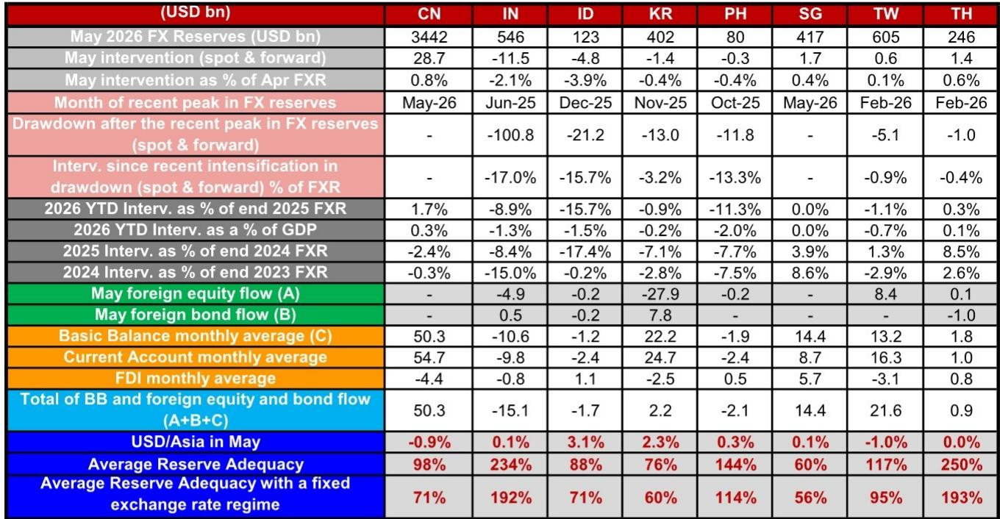

# Central Banks Are Burning Through Reserves at an Unsustainable Rate – The Real Story Is Not About Intervention, But About Policy Credibility

The conventional narrative surrounding Asia ex-Japan foreign exchange markets in May 2026 is that central banks stepped in to defend their currencies against a broadly stronger US dollar. That framing is dangerously incomplete. What the data actually reveals is a bifurcated region where two distinct groups of central banks are pursuing fundamentally different strategies, and the divergence carries profound implications for investors. Bank Indonesia and the Reserve Bank of India did not merely intervene in May; they burned through foreign exchange reserves at rates that, if sustained, would render their stockpiles inadequate within months. Meanwhile, the People's Bank of China, the Monetary Authority of Singapore, and the Bank of Thailand accumulated reserves, reflecting currencies that either held steady or appreciated against the dollar. This is not a story about uniform pressure. It is a story about which central banks have policy credibility to spare and which are running out of options.

The timing matters because the pressure is not letting up. In May, the dollar strengthened by roughly 0.9 percent on a broad trade-weighted basis, yet the Indonesian rupiah depreciated by 3.1 percent and the Korean won by 2.3 percent. Those moves were not random noise; they were the direct consequence of capital outflows and deteriorating basic balances. India's basic balance, the sum of the current account and foreign direct investment, was negative by more than USD 10 billion on a monthly average basis. Indonesia's was also negative. Korea, by contrast, ran a basic balance surplus of over USD 22 billion per month, yet the won still fell sharply. That paradox alone should make investors question whether the traditional toolkit of FX intervention is sufficient when capital account pressures dominate.

The critical insight is this: the size of intervention in May is less important than the trajectory of reserve adequacy. When reserves are abundant, selling USD 5 billion or even USD 50 billion is a tactical move. When reserves are already stretched, every dollar sold raises the question of what happens when the ammunition runs out. The report's estimates show that Bank Indonesia's reserve adequacy, under the IMF's four metrics, stood at 90 percent as of April. When adjusted for predetermined short-term drainage, that figure falls to 46 percent. That is not a comfortable buffer. It is a warning signal that the next sustained wave of depreciation pressure could force a policy choice between deeper intervention, higher interest rates, or capital controls. The RBI faces a different but equally challenging dynamic: its headline reserve adequacy looks robust at 234 percent, but the sheer scale of year-to-date intervention, nearly 9 percent of end-2025 reserves, suggests that the cost of defending the rupee is rising faster than the market appreciates.

## The Aggressive Sellers Are Not Just Defending Their Currencies; They Are Buying Time Until Policy Adjustments Can Take Effect

Bank Indonesia sold an estimated USD 4.8 billion in May, bringing its year-to-date intervention to USD 21.2 billion, or roughly 15.7 percent of its 2025 foreign exchange reserves. That is an extraordinary pace. To put it in perspective, Indonesia's entire reserve stockpile is approximately USD 123 billion. At the current burn rate, the country would exhaust its usable reserves in roughly six months if the pressure persisted. The rupiah still hit an all-time high of 17,887 against the dollar in May and breached 18,190 in early June. The intervention did not stop the depreciation; it merely slowed it. The real question is what Bank Indonesia can do next.

The answer, the report implies, is that the central bank has already been forced into stronger measures. The off-cycle rate hike that Indonesia implemented in recent months was not a proactive tightening cycle. It was a reactive move driven by the recognition that intervention alone could not stabilize the currency without destroying the reserve buffer. The logic is straightforward: when a central bank sells reserves to support the currency, it is effectively monetizing the depreciation pressure. If the market senses that reserves are finite, the pressure intensifies. A rate hike, by contrast, makes holding the currency more attractive and reduces the incentive to sell. But rate hikes come with their own costs, particularly for an economy where domestic demand and credit growth are still recovering.

India's situation is structurally different but equally telling. The RBI sold an estimated USD 11.5 billion in May, bringing its year-to-date intervention to USD 49.1 billion. That is roughly 8.9 percent of end-2025 reserves. The RBI's reserve stockpile is much larger than Indonesia's, at about USD 546 billion, so the percentage burn rate is lower. But the absolute scale is staggering. Moreover, the RBI has been reducing its net short forward book, which fell by USD 7.8 billion in April to USD 95.3 billion. A smaller short forward book means the RBI has less capacity to intervene in the forward market without adding to its open positions. The concessional FX swap for Foreign Currency Non-Resident (Bank) deposits that India announced is a creative tool, but it is also a sign that the central bank is looking for alternative sources of dollar liquidity rather than relying solely on spot intervention.

The pattern is clear: the central banks that are selling the most aggressively are also the ones that have already taken or are considering unconventional policy actions. This is not a coincidence. Intervention is a bridge to something else, whether that is higher rates, tighter capital controls, or a more flexible exchange rate regime. Investors who focus only on the headline intervention numbers miss the strategic pivot that is already underway.

## The Accumulators Are Playing a Different Game: Reserve Buildup as a Signal of Policy Divergence

At the opposite end of the spectrum, the People's Bank of China net bought an estimated USD 28.7 billion of foreign exchange reserves in May. That is roughly 0.8 percent of its April reserves. The Chinese renminbi strengthened by approximately 0.9 percent against the dollar in May, making it one of the best-performing currencies in the region. The PBoC was not defending the renminbi; it was actively managing its appreciation. State banks accumulated an additional USD 10.9 billion in FX deposits, bringing the total May accumulation by Chinese authorities to roughly USD 39.6 billion.

This is a profoundly different strategic posture. China is running a large current account surplus, with a monthly average basic balance of over USD 50 billion. It does not need to defend its currency; it needs to manage the upward pressure. The PBoC's intervention is essentially a form of sterilization, buying dollars to slow the renminbi's rise and prevent an excessive appreciation that would damage export competitiveness. The fact that China can afford to accumulate reserves at a time when other central banks are burning through them is a testament to its structural external surplus and its capital account controls.

Singapore and Thailand also accumulated reserves in May, albeit on a smaller scale. The Monetary Authority of Singapore added an estimated USD 1.7 billion, while the Bank of Thailand added USD 1.4 billion. In both cases, the currencies were stable or slightly stronger against the dollar. The Singapore dollar's stability reflects the MAS's unique exchange-rate-centered monetary policy framework, which allows it to adjust the slope of the Singapore dollar nominal effective exchange rate band rather than relying on discrete interventions. Thailand's accumulation is more modest, but it signals that the central bank is not under the same pressure as its Indonesian or Indian counterparts.

The implication for investors is clear: the Asia ex-Japan region is not a monolith. The divergence in reserve management strategies reflects deeper differences in external balances, capital account openness, and policy credibility. A portfolio that treats all Asian currencies as equally exposed to dollar strength is missing the most important signal.

## What the Report Does Not Fully Answer Yet: The Sustainability Threshold and the Risk of Forced Adjustment

The report provides an exceptionally detailed estimate of intervention flows, but it leaves several critical questions unresolved. The first is the sustainability threshold. At what point does reserve depletion become self-reinforcing? The IMF's four adequacy metrics are useful benchmarks, but they are static. They do not capture the dynamic feedback loop between reserve depletion and market confidence. When a central bank's reserve adequacy falls below a certain level, the market may begin to price in a higher probability of a disorderly adjustment, which in turn accelerates the depreciation and forces even more intervention. The report notes that Bank Indonesia's adequacy falls to 46 percent when adjusted for short-term drainage. Is that the tipping point? The data does not say, and it is a question that every investor in Indonesian assets should be asking.

The second unresolved question is the role of capital flows in driving the pressure. The report includes data on foreign equity and bond flows, but it does not fully disentangle whether the depreciation pressure is coming from the current account, the capital account, or a combination of both. India's basic balance is negative, which suggests that the current account deficit is a structural source of pressure. But Korea's basic balance is strongly positive, yet the won still depreciated by 2.3 percent in May. That points to capital account outflows, likely driven by foreign equity selling. Korean equity outflows were nearly USD 28 billion in May, far exceeding any other market in the region. The report notes the outflow but does not explain why it is happening or whether it is likely to persist. For a currency like the won, which is more market-determined than the rupiah or the rupee, the answer depends on global risk appetite and the outlook for Korean tech exports, not just on central bank intervention.

The third gap is the forward market. The report provides estimates for spot intervention and, where available, forward positions. But the forward market is where many of the most important signals reside. The RBI's reduction in its short forward book is notable, but the report acknowledges that a subsequent swap transaction will increase the short forward position again. The net effect is unclear. For Indonesia, the report estimates a relatively small forward component, but the data is based on FX swaps and may not capture the full picture. Investors who rely solely on spot reserve data are missing half the story.

## A Decision Framework for Investors: How to Read the Reserve Data as a Leading Indicator

The report's data can be transformed into a practical decision framework for investors. The framework has three dimensions: reserve burn rate, reserve adequacy, and policy flexibility.

The first dimension is the burn rate, measured as the percentage of reserves consumed by intervention over a given period. A burn rate above 1 percent per month is aggressive. Above 2 percent is extreme. Indonesia's May burn rate of 3.9 percent is extreme by any standard. India's 2.1 percent is also extreme, though the larger base provides more cushion. Korea's 0.4 percent is moderate, and China's accumulation is negative, meaning reserves are growing.

The second dimension is reserve adequacy, measured both by the headline IMF metrics and by the adjusted metrics that account for short-term drainage. A headline adequacy below 100 percent is concerning. An adjusted adequacy below 70 percent is a red flag. Indonesia's adjusted adequacy of 46 percent is the most alarming in the region. India's headline adequacy of 234 percent looks comfortable, but the adjusted figure is not provided in the report, and the cumulative year-to-date intervention suggests that the effective cushion is narrower than the headline suggests.

The third dimension is policy flexibility. A central bank that can raise interest rates without crushing domestic demand has more room to adjust. A central bank that can impose or tighten capital controls has another tool. A central bank that can allow its currency to depreciate without triggering a financial crisis has the most flexibility of all. Indonesia has already used the rate hike tool, which suggests that its policy flexibility is limited. India has used the concessional swap tool, which is creative but not a long-term solution. Korea, by contrast, has allowed the won to depreciate significantly without aggressive intervention, which suggests a higher tolerance for currency weakness and more policy flexibility going forward.

The framework yields a clear ranking of vulnerability. Indonesia is the most exposed, with a high burn rate, low adequacy, and limited policy flexibility. India is next, with a high burn rate, adequate but declining reserves, and moderate policy flexibility. Korea is less vulnerable, with a moderate burn rate, low adequacy but high policy flexibility. China, Singapore, and Thailand are the least vulnerable, with reserve accumulation, adequate buffers, and significant policy room.

Investors should use this framework to assess not just the current state of each currency, but the trajectory. A central bank that is burning reserves at an extreme rate today may be forced into a policy adjustment tomorrow. The question is whether that adjustment will be orderly or disorderly.

## The Unresolved Analytical Tension That Demands a Deeper Look

The most intriguing tension in the report is the disconnect between reserve intervention and currency outcomes. Bank Indonesia sold nearly USD 5 billion in May, and the rupiah still depreciated by 3.1 percent. The RBI sold USD 11.5 billion, and the rupee ended the month essentially flat. Why did the rupee hold up better despite a larger absolute intervention? Part of the answer is that the RBI's intervention was more effective because it was combined with other measures. Part of the answer is that the rupee's starting point was already weaker. But the deeper answer is that the market is pricing not just the intervention, but the credibility of the central bank's commitment to the currency.

That is the variable that the report cannot quantify, but that every investor must assess. Central bank credibility is built over years and can be destroyed in weeks. The data on reserve depletion is a proxy for credibility erosion. When a central bank sells reserves aggressively, it signals that it is willing to spend its stockpile to defend the currency. But if the market believes that the stockpile is finite and that the central bank will eventually blink, the intervention becomes self-defeating. The off-cycle rate hike in Indonesia and the concessional swap in India are attempts to rebuild credibility, but they also signal that the previous strategy of pure intervention was not working.

This is where the full report becomes essential reading. The charts and detailed data tables in the original document provide the granularity needed to assess the trajectory of each central bank's reserve position over time. The month-by-month breakdown of intervention, the forward book adjustments, and the adequacy calculations are not just numbers; they are the raw material for a strategic assessment of which currencies are likely to hold and which are likely to break.

Join the community to read the full report and review the original charts.

*This article is for learning and discussion only and does not constitute investment advice.*

Personal reading notes and learning share only. Not investment advice.

