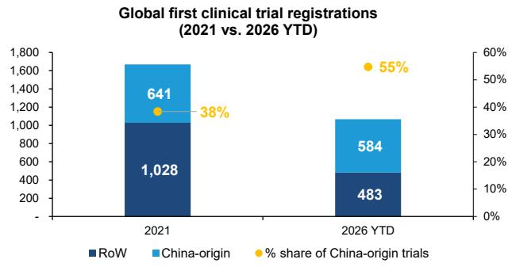
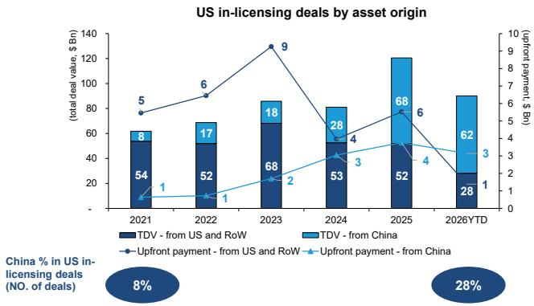
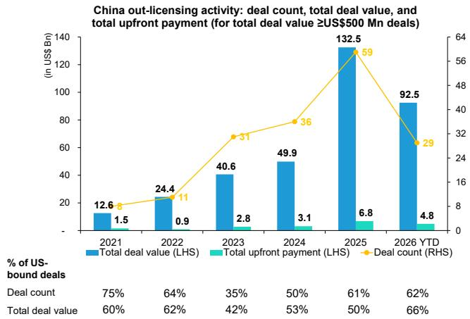
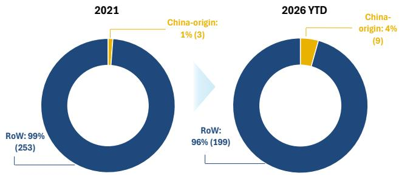
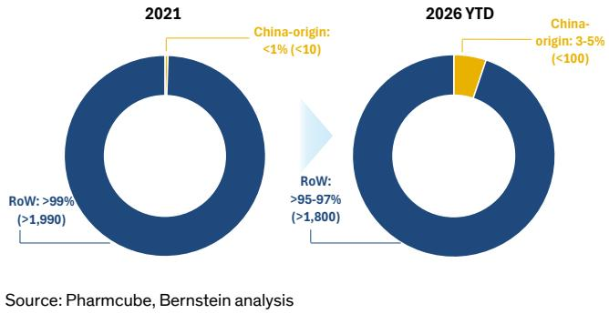
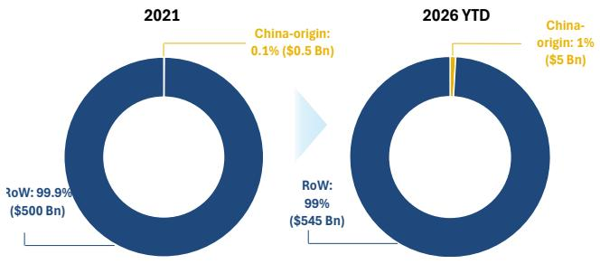

## China Pharma and Biotech

# China Pharma & Biotech: Policy headwinds and implications for valuation

Rebecca Liang, Ph.D.

+852 2123 2656

rebecca.liang@bernsteinsg.com

Ellie Li

+852 2123 2621

ellie.li@bernsteinsg.com

We review recent US and China policies - a trigger of the recent healthcare sell-off - and estimate the potential impact on innovative drugmakers in this note.

US policies and legislative efforts (Biosecure Act, COINS/BINSA) increasingly target the full stack: capital flows, data access, licensing, and supply chains. While implementation remains staged, the direction is unambiguous and calls for reduced US capital participation, tighter scrutiny on cross-border deals, and rising friction in collaboration. This shift matters because the US still anchors global pharma economics, representing \~50–60% of commercial value, and therefore sets the ceiling for any globally oriented asset. Meanwhile, China's domestic policies remain supportive on innovative drugs, aside from potential scrutiny on IP outflows. Investors may be concerned about incremental friction on out-licensing, companies generally indicate continued flexibility in transferring product-level IP (as opposed to core platform technologies).

Recently, a simplified narrative of China's rapid rise in biopharma is becoming increasing common. We see a more nuanced picture: the innovation engine continues to scale rapidly, but remains structurally front-loaded. China now accounts for a meaningful share of global early-stage activity (\~30–40% of preclinical, \~50% of early clinical pipelines, and \~55% of first clinical trial registrations in 2026 YTD), reflecting genuine improvements in research capability and development speed. However, the rise has not translated proportionally into late-stage presence yet, where the ecosystem remains US-centric. China-origin assets still represent only a small share of US Phase 3 trials (<10%), FDA approvals (<5%), and US commercial sales (\~1%), albeit with gradual improvement. We attribute this to two factors: 1) a time lag as the recent acceleration in outbound deal-making is only beginning to feed into US late-stage pipelines. 2) A competitiveness gap: FDA regulatory standards and global competitive intensity would result in higher attrition rates than a domestically focused environment. The bottleneck is not asset generation, but conversion into global value. China biopharma today functions as an increasingly important source of innovation supply with limited capture of downstream economics.

Our scenario analysis highlights how sensitive that value bridge is to policy. Under an “indirect access” case where the US market remains open to China-origin assets through collaborators in EU, Japan, etc., we assume BD (Business Development) income declines \~50% and global peak sales \~20% as routes become more difficult. Under a “complete block” where the US market is effectively off-limits, BD income falls \~80% and global sales \~60%, implying a much sharper reset with value largely confined to ex-US markets. The key implication is the equity impact: in a full block, globally exposed names such as Innovent, Hengrui, and Hansoh could see \~50% downside to valuation (Exhibit 11). Kelun looks the most resilient as its flagship product sac-TMT is the main valuation anchor, and is relatively derisked with competitive data and 17 US trials on-going. That said, we view a complete block as a low-probability outcome; a more likely path is a middle ground in which cross-border collaboration persists but with added friction. In our view, current market pricing appears to reflect a more severe scenario than this base case, undervaluing the sector disproportionately.

BERNSTEIN TICKER TABLE

<table><tr><td rowspan="2">Ticker</td><td rowspan="2">Rating</td><td colspan="3">17 Jun 2026</td><td colspan="2">TTM</td><td colspan="4">Reported EPS</td><td colspan="3">Reported P/E (x)</td></tr><tr><td colspan="2">Closing</td><td>Price Target</td><td>Rel. Perf.</td><td>Cur</td><td>2025A</td><td>2026E</td><td>2027E</td><td>2025A</td><td>2026E</td><td>2027E</td><td></td></tr><tr><td>9926.HK (Akeso)</td><td>M</td><td>HKD</td><td>83.80</td><td>130.00</td><td>(55.7)%</td><td>CNY</td><td>(0.60)</td><td>(0.52)</td><td>0.70</td><td>(119.6)</td><td>(140.0)</td><td>103.4</td><td></td></tr><tr><td>ONC (BeOne)</td><td>O</td><td>USD</td><td>263.92</td><td>412.00</td><td>(20.6)%</td><td>USD</td><td>2.63</td><td>5.65</td><td>8.93</td><td>100.3</td><td>46.7</td><td>29.6</td><td></td></tr><tr><td>1093.HK (CSPC)</td><td>M</td><td>HKD</td><td>6.93</td><td>10.70</td><td>(60.2)%</td><td>HKD</td><td>0.37</td><td>0.52</td><td>0.56</td><td>16.2</td><td>11.6</td><td>10.7</td><td></td></tr><tr><td>3692.HK (Hansoh)</td><td>O</td><td>HKD</td><td>29.72</td><td>47.00</td><td>(39.8)%</td><td>CNY</td><td>0.93</td><td>1.01</td><td>1.10</td><td>27.6</td><td>25.3</td><td>23.3</td><td></td></tr><tr><td>1801.HK (Innovent)</td><td>O</td><td>HKD</td><td>74.90</td><td>120.00</td><td>(47.7)%</td><td>HKD</td><td>0.48</td><td>0.71</td><td>2.90</td><td>154.4</td><td>105.5</td><td>25.8</td><td></td></tr><tr><td>600276.CH (Hengrui)</td><td>O</td><td>CNY</td><td>46.99</td><td>71.00</td><td>(54.2)%</td><td>CNY</td><td>1.18</td><td>1.54</td><td>1.92</td><td>39.8</td><td>30.4</td><td>24.5</td><td></td></tr><tr><td>6990.HK (Kelun-Biotech)</td><td>O</td><td>HKD</td><td>402.80</td><td>526.00</td><td>(23.2)%</td><td>CNY</td><td>(1.66)</td><td>(2.75)</td><td>0.85</td><td>33.3</td><td>33.8</td><td>20.8</td><td></td></tr><tr><td>1177.HK (Sino BioPh)</td><td>M</td><td>HKD</td><td>4.57</td><td>7.90</td><td>(53.4)%</td><td>CNY</td><td>0.19</td><td>0.20</td><td>0.22</td><td>20.6</td><td>19.4</td><td>17.8</td><td></td></tr><tr><td>9688.HK (Zai Lab)</td><td>M</td><td>HKD</td><td>13.57</td><td>15.00</td><td>(99.6)%</td><td>USD</td><td>(0.16)</td><td>(0.15)</td><td>(0.09)</td><td>0.4</td><td>0.4</td><td>0.3</td><td></td></tr><tr><td>ASIAX</td><td></td><td></td><td>2,032.93</td><td></td><td></td><td></td><td></td><td></td><td></td><td></td><td></td><td></td><td></td></tr><tr><td>SPX</td><td></td><td></td><td>7,511.35</td><td></td><td></td><td></td><td></td><td></td><td></td><td></td><td></td><td></td><td></td></tr></table>

O - Outperform, M - Market-Perform, U - Underperform, NR - Not Rated, CS - Coverage Suspended  
6990.HK, 9688.HK valuation is EV/Sales (x); 9926.HK, 1093.HK, 1177.HK base year is 2024;  
Source: Bloomberg, Bernstein estimates and analysis.

## INVESTMENT IMPLICATIONS

We rate Hansoh, Jiangsu Hengrui, Kelun-Biotech, BeOne Medicines, and Innovent Outperform; and Akeso, Zai Lab, Sino Biopharm, and CSPC Market-Perform.

## DETAILS

## COMBING THROUGH RECENT POLICIES RELATING TO CHINA HEALTHCARE

## US policies tighten on both inbound market access and outbound capital flow

Across recent administrations, US policy has introduced a range of measures affecting China's biopharmaceutical sector, often within a broader national security and supply chain framework.

## Policies and EOs:

February 2025 – America First Investment Policy: At the strategic level, the “America First Investment Policy” (a presidential memorandum signed under the Trump administration) stresses a high-level stance limiting both inbound and outbound capital flows between the US and China in healthcare. While not statutory law, it signals a long-term policy direction toward financial decoupling.

April 2025 – NSCEB report: At the architectural level, the NSCEB (National Security Commission on Emerging Biotechnology) report serves as a policy advisory framework and, at a strategic level, aiming to constrain China’s biopharma development.

January–September 2025 – Early outbound controls: Initial measures included restrictions on access to certain US datasets (e.g., NIH-related data) and indications of tighter oversight on cross-border licensing and supply chain localization.

## Legislation:

June 2026 - COINS and BINSA: The introduction of BINSA (Biotech Investment National Security Act), as part of the broader COINS Act framework, further escalates restrictions. The proposal includes mandatory government review of cross-border licensing transactions, tighter scrutiny on US-China joint ventures, and limits on equity investments involving Chinese biopharma companies. Notably, recent transactions - including Innovent/Pfizer and Hengrui/BMS collaborations (Pfizer and BMS are covered by Courtney Breen) - have been explicitly called “dangerous” by Congressman John Moolenaar, highlighting increasing regulatory sensitivity around cross-border partnerships.

2023–2026 – Biosecure Act: The Biosecure Act restricts US federal agencies and federally funded entities from sourcing biotechnology products or services from designated “biotechnology companies of concern” (BCCs). Importantly, federal funding encompasses programs such as Medicare/Medicaid, which are deeply embedded in the revenue base of large MNCs. Therefore, MNCs may need to avoid engaging designated Chinese CDMOs. As such, the Biosecure Act could drive a structural decoupling between Chinese CDMOs and Western pharma. While certain companies (e.g., WuXi AppTec, WuXi Biologics, both not covered) were previously removed from proposed restriction lists, subsequent developments suggest a dynamic regulatory approach. WuXi AppTec was included in the DoD section 1260H in June 2026, which automatically qualifies WuXi AppTec for Biosecure Act.

Looking ahead, there's plenty to watch on BINSA and Biosecure Act. 1) BINSA: By Aug 2026 - The US Secretary of Defense is mandated to deliver a formal national security assessment on whether the Pentagon strictly links US capital flows into Chinese drugs to direct military vulnerabilities. By EOY - BINSA is likely to be attached to the FY27 NDAA during the winter legislative session. If successfully attached to the final, BINSA will pass into permanent statutory law. 2) Biosecure Act: By EOY - OMB is set to publish an official list of BCCs, check if WuXi AppTec (very likely, since added to 1260H) is listed and if other Chinese CDMOs (potential) will be independently mentioned. Also, given WuXi AppTec has sued the US government, the result of whether it will stay on the 1260H list will also be a key catalyst.

EXHIBIT 1: Broad US legislative restrictions are shaping the China bipharma industry

<table><tr><td>Policy</td><td>Proposed date</td><td>Current status</td><td>What it proposes</td><td>Direct effect</td><td>Companies named</td><td>Next update / timeline</td></tr><tr><td colspan="7">I. Architecture - policy research and advisory</td></tr><tr><td>NSCEB Report</td><td>2025-04</td><td>Published</td><td>Published report: Charting the Future of Biotechnology (49 policy recommendations across 6 pillars)</td><td>Blueprint to restrict China biopharma industry</td><td>\</td><td>\</td></tr><tr><td colspan="7">II. Strategy - broad executive vision</td></tr><tr><td>America First Investment Policy</td><td>2025-02</td><td>Effective</td><td>1) Inbound: Restrictions on Chinese investments in multiple sectors, including healthcare2) Outbound: Restrictions on US outbound investment in Chinese biotechnology</td><td>Restrict inbound &amp; outbound investment from/to China</td><td>\</td><td>\</td></tr><tr><td colspan="7">IIIA. Legislative restrictions - Outbound capital wall</td></tr><tr><td>NIH ban (EO14117)</td><td>2025-01</td><td>Effective</td><td>Prevent access to Americans&#x27; personal data/government-related data by countries of concern (incl. China)</td><td>Restrict China R&amp;D</td><td>\</td><td>\</td></tr><tr><td>Draft EO reported by NYT</td><td>2025-09</td><td>Leaked document</td><td>1) Severe restrictions on licensing deals from China2) Re-shoring US manufacturing of basic medicine</td><td>Restrict China outlicense</td><td>\</td><td>\</td></tr><tr><td>COINS Act (esp. BINSA)</td><td>2025-12(BINSA 2026-06)</td><td>COINS Act effective BINSA pending until EOY</td><td>1) Mandatory review of cross-border licensing2) Restriction on joint ventures and equity investments with China</td><td>Restrict China outlicense</td><td>Innovent, Hengrui transactions called as &quot;dangerous&quot;</td><td>2026-08: track whether US capital into Chinese biotech damages national securityFall 2026: Committee hearings2026-12: Enactment (prob attached to FY27 NDAA)</td></tr><tr><td colspan="7">IIIB. Legislative restrictions - Inbound market shield</td></tr><tr><td>Biosecure Act</td><td>2023-12</td><td>Effective</td><td>Restrict US executive agencies and recipients of federal funding from procuring biotechnology equipment/services from specific foreign &quot;biotechnology companies of concern&quot; (BCCs)</td><td>Restrict China CDMO companies</td><td>WuXi AppTec WuXi Biologics (named and removed)</td><td rowspan="2">Before 2026-12: Check the Official list of BCCs released by OMB2026-27: WuXi AppTec lawsuit result</td></tr><tr><td>DoD Section 1260H (ties to Biosecure)</td><td>2026-06</td><td>WuXi AppTec added</td><td>1260H: to define companies of concern, automatically qualifies for the Biosecure Act</td><td>Restrict China CDMO companies</td><td>WuXi AppTec</td></tr></table>

Source: US government, Bernstein analysis

## China's domestic policies remain neutral to positive on innovative drugs, though concerns on IP outflow linger

On the China market front, the government has consistently maintained a pro-innovation stance toward novel drug development. However, two structural constraints remain: (1) domestic commercialization is significantly less profitable compared to the US market, and (2) tangible financial support in the form of direct subsidies has been relatively limited. As a result, positive policy signals often fail to translate into sustained equity performance, whereas negative developments tend to trigger outsized downside. In 1H26, a notable headwind was the renewed anti-corruption campaign in May 2026, which had a material impact on sector sentiment. However, we see this as another building block added to the existing series of anti-corruption efforts, and should not be a major surprise to the market.

Another point to note is that Chinese government is set to expand curbs on foreign deals and tech transfer after the Meta-Manus block. This has been neutral to negative for China healthcare, as it raises concern about potential biopharma out-licensing. So far, it does not seem to have had a material effect on asset out-licensing, as the latest deal announced between Innovent and Pfizer was not affected. We think that pure asset transfer (instead of platform/technology transfer) would likely remain acceptable instead of being blocked. CSPC management mentioned at its 1Q earnings that based on their recent conversations with the government, they see continued flexibility in transferring product-level IP (as opposed to core platform technologies).

EXHIBIT 2: Summary of Chinese government policies on healthcare YTD

<table><tr><td>Policy / Law</td><td>Time</td><td>Main points</td><td>Impact on Innovative Drugs</td><td>Impact on Generics (Gx)</td></tr><tr><td>Opinions on Improving the Formation Mechanism of Drug Prices (State Council Office [2026] No. 9)</td><td>2026-04</td><td>· Allow high price for highly innovative drugs at launch</td><td>Positive: higher pricing at launch for differentiated products</td><td>Neutral to negative: accelerates price-volume linkages and broadens price supervision</td></tr><tr><td>Measures for the Administration of Medical Representatives &amp; 2026 Anti-Corruption Work Points in Healthcare</td><td>2026-05</td><td>· Bribery threshold lowered to RMB 30k· Sales rep required to have pharmacy background</td><td>Neutral to positive: stricter ban may impact short-term sales but should promote products on merit-basis in the long run and reduce selling cost</td><td>Negative: combats bribery and &quot;kickback sales,&quot; squeezing out gray profit margins</td></tr><tr><td>Implementation Regulations of the Drug Administration Law (State Council Decree No. 828)</td><td>2026-05</td><td>· Accelerate commercialization· 7 yr market exclusivity for orphan drugs; 2 yr for pediatric drugs</td><td>Positive: multi-year market exclusivity period for orphan (rare disease) and pediatric drugs</td><td>Negative: increases market entry hurdles due to newly enforced regulatory data protection periods</td></tr><tr><td>2026 NRDL &amp; Commercial Health Insurance Innovative Drug List Adjustment Plan</td><td>2026-05</td><td>· Commercial Health Insurance Catalogue complements the NRDL· Allows conditionally approved drugs to apply for NRDL· Mandates faster formulary updates at hospitals</td><td>Positive: more payment options, earlier coverage of conditionally approved drugs, and faster hospital ramp-up</td><td>Neutral: enhances renewal and renegotiation pricing algorithms for mature products</td></tr><tr><td>News: China to expand curbs on foreign deals, tech transfer after Meta-Manus block</td><td>2026-06</td><td>· Tighten control of overseas deals that involve Chinese investors, tech, and national security· Raises concern about potential biopharma out-licensing</td><td>Neutral to negative: worries that China outlicensing may be curbed by the Chinese government, though latest Innovent-Pfizer deal does not seem to be affected</td><td>Neutral: transactions do not involve Gx assets</td></tr></table>

Source: Chinese government, Bernstein analysis

## CHINA'S ROLE IN GLOBAL PHARMA: AN ANALYSIS ALONG THE DRUG DEVELOPMENT FUNNEL

## Early R&D gradually shifting to China

China has become an increasingly important contributor in early-stage drug development. It now accounts for 30-40% of global preclinical programs (see research letter published on JAMA by Georgetown U) and \~50% of the early clinical-stage pipeline (Exhibit 4). This reflects sustained growth in domestic research capability, a large patient base enabling efficient trial recruitment, and expanding innovation capacity. As a result, a meaningful portion of global drug discovery and early development is now being initiated or co-developed in China, marking a structural shift in the geography of early R&D.

## China's role as a collaborator and source of innovative drug candidates grows

China's integration into the global innovation ecosystem is also evident in cross-border licensing activity. As shown in (Exhibit 5 and Exhibit 6), China's share of US in-licensing transactions has increased significantly in recent years, alongside strong growth in total deal value and upfront payments. This trend highlights China's rising role as a source of innovative drug candidates and a partner for global pharmaceutical companies. China-origin assets are increasingly being out-licensed to international partners, reflecting both improved asset quality and growing recognition of China's contribution to global pipelines.

## However, from US Phase 3 to FDA approval to commercialization, the share of China-origin drugs is still minimal

Despite strong momentum in early stages, the presence of China-origin drugs remains limited in later stages of development and commercialization. From Phase 3 onwards, the market remains largely US-centric, where access to the US—typically representing \~50–60% of global value—is critical for global success. As shown in (Exhibit 7 - Exhibit 9), China-origin assets account for only a small share of US Phase 3 trials, FDA approvals, and commercial sales, although this share has been gradually increasing. In practice, assets targeting global markets generally require a US development and regulatory pathway, which has constrained the representation of China-origin drugs in late-stage pipelines and commercialization to date.

EXHIBIT 3: Framework of the global drug discovery and development funnel

<table><tr><td rowspan="2"></td><td>Preclinical Research</td><td>Clinical development: Ph1-2</td><td>Clinical development: Ph3</td><td>Commercialization</td></tr><tr><td colspan="2">Global</td><td colspan="2">US-centric</td></tr><tr><td>What are the rules?</td><td>Research can be done anywhere in the world</td><td>-Early phase trials can take place anywhere in the world-Having some non-China trial data is preferred to enable US Ph3</td><td>For FDA approval:-US Ph3 is a must-Global MRCT usually required</td><td>US typically accounts for 50-60% of global marketEU ~20%RoW ~20%</td></tr><tr><td>Current business model</td><td colspan="2">-Preclinical and Ph1-2 trials are shifting to China-Early development is 1.5-2X faster in China than global average-Clinical cost in China is est. 20-40% of the US</td><td>-High-potential drugs are out-licensed from China IP owner to global partners before Ph3, and the global partner sponsors US and global Ph3 trials (&gt;80% of the cases), or,China IP owner sponsor their own global trials (&lt;20%)-Either way,those with any hopeto &quot;go global&quot; must get into US Ph3s</td><td>-Global partners responsible for regulatory approval and commercialization while paying milestones and sales royalties to China IP owner-Global partner usually get 2/3 of product value</td></tr><tr><td>China-origin assets %</td><td>~40% of global</td><td>~50% of global</td><td>&lt;50 new Ph3s on China-originated drugs out of 400-500 new US Ph3s in 2025&lt;= 10% of all US Ph3s</td><td>10 China-origin innovative drugs approved by the FDA from 2021 to 2026YTD, out of 230+ approvals ~$5 Bn out of ~550Bn US branded drug sales in 2025&lt;=1% US market share</td></tr></table>

Source: Clinicaltrials.gov, Pharmcube, FDA, Bernstein analysis

EXHIBIT 4: As shown by first clinical trial registrations, China-origin assets now account for 55% of global total, up from 38% in 2021  

stacked bar chart

Global first clinical trial registrations (2021 vs. 2026 YTD)
| Year | RoW | China-origin | % share of China-origin trials (%) |
| :--- | :--- | :--- | :--- |
| 2021 | 1,028 | 641 | 38 |
| 2026 YTD | 483 | 584 | 55 |

Source: Pharmcube, Bernstein analysis

EXHIBIT 5: China's participation in US licensing transactions has increased meaningfully since 2021  

bar-line hybrid

| Year | TDV - from US and RoW ($ Bn) | TDV - from China ($ Bn) | Upfront payment - from US and RoW ($ Bn) | Upfront payment - from China ($ Bn) |
| --- | --- | --- | --- | --- |
| 2021 | 54 | 8 | 5 | 1 |
| 2022 | 52 | 17 | 6 | 1 |
| 2023 | 68 | 18 | 9 | 2 |
| 2024 | 53 | 28 | 4 | 3 |
| 2025 | 52 | 68 | 6 | 4 |
| 2026YTD | 28 | 62 | 3 | 1 |

Source: Pharmcube, Bernstein analysis

EXHIBIT 6: Out-licensing momentum strong - total deal value over \$90 Bn in 1H26, 70% of 2025 total; Upfront payment \$4.8 Bn, 71% of 2025 total  

bar-line hybrid

China out-licensing activity: deal count, total deal value, and total upfront payment (for total deal value ≥US$500 Mn deals)
| Year | Total deal value (LHS) (in US$ Bn) | Total upfront payment (LHS) (in US$ Bn) | Deal count (RHS) |
| :--- | :--- | :--- | :--- |
| 2021 | 12.6 | 1.5 | 8 |
| 2022 | 24.4 | 0.9 | 11 |
| 2023 | 40.6 | 2.8 | 31 |
| 2024 | 49.9 | 3.1 | 36 |
| 2025 | 132.5 | 6.8 | 59 |
| 2026 YTD | 92.5 | 4.8 | 29 |
% of US-bound deals
Deal count: 75%, Total deal value: 60%
% of US-bound deals: 60%, Total deal value: 62%.

Note: Deals involving biosimilars and incrementally modified drugs are excluded;  
data cut off date: June 16th, 2026  
Source: Pharmcube, Bernstein analysis

EXHIBIT 8: Cumulative no. of innovative drugs approved by the FDA in a 5-year window (2021-2026YTD) by region  

pie chart

| Year       | China-origin: | RoW   |
| ---------- | ------------- | ----- |
| 2021       | 1% (3)        | 99% (253) |
| 2026 YTD   | 4% (9)        | 96% (199) |

Source: FDA, Pharmcube, Bernstein analysis

EXHIBIT 7: No. of active interventional Ph3 trials in the US by region (2021 vs. 2026YTD)  

pie chart

| Year | Category | Value | RoW (%) |
| :--- | :--- | :--- | :--- |
| 2021 | China-origin | <1% (<10) | >99% (>1,990) |
| 2026 YTD | China-origin | 3-5% (<100) | >95-97% (>1,800) |
Source: Pharmcube, Bernstein analysis

EXHIBIT 9: US innovative drug sales (\$ Bn) and share by region  

pie chart

| Year | China-origin (%) | RoW ($Bn) | Total Revenue |
|------|------------------|-----------|---------------|
| 2021 | 0.1%             | 99.9      | 500           |
| 2026 YTD | 1%              | 99        | 545           |

Source: Pharmcube, FDA, Bernstein analysis

## SIZING THE IMPACT OF POTENTIAL DECOUPLING

To access the potential impact of the proposed Biotech Investment National Security Act (BINSA), we modeled two downside scenarios: Indirect Access, where China-origin assets continue to reach the U.S. market primarily through ex-China sponsors and partners (EU and Japan as prime examples), and Complete Block, where access to the U.S. market is effectively restricted. We see a mixed reality of the status quo and indirect access as the most likely scenario. RA Capital Managing Partner Peter Kolchinsky recently coined the concept “Eurowash” (source): a workaround where Chinese biotech companies route their drug development through European entities to bypass U.S. geopolitical bans. We think European / Japanese MNCs have both the incentive and capability to execute such strategies in the scenario where China-origin assets are out of reach to US players.

## “Indirect access” - China-origin assets still find ways to access the US and global market indirectly and less efficiently

Here we estimated out-licensing income from potential new deals could decline by 50% while global product sales may face a more moderate 20% headwind as commercialization opportunities could shift toward EU and Japan markets. At the same time, companies would likely to undertake more self-funded overseas development and regulatory activities, leading to higher R&D investment, which we estimated could increase by 10% for domestically focused innovators and by 20% for globally oriented companies.

"Complete block" - More thorough blockage of China-origin assets in the US market

In this absolute bear case, the potential loss of U.S. licensing demand and a significantly reduced global commercialization opportunity set could result in 80% declines in new BD (Business development) income and potential milestones from existing deals, alongside 60% reduction in global sales (except for those who had global Ph3 trial ongoing). In this scenario, the rationale for conducting global-standard development programs weakens materially, reducing the need for R&D spending. As a result, we estimated R&D expenses could decrease by 5% for domestically focused innovators and by 10% for globally oriented companies.

Reflecting these assumptions, our sensitivity analysis suggests valuation downside across the four covered companies with the largest overseas exposure. Under the Indirect Access scenario, target price could decline 34% for Hengrui (CNY71 to 47), 26% for Hansoh (HK\$47 to 35), 26% for Innovent (HK\$120 to 89), and 14% for Kelun Biotech (HK\$526 to 454). Under the Complete Block scenario, downside could further expand to 49% for Hengrui (CNY36), 49% for Hansoh (HK\$24), 43% for Innovent (HK\$69), and 24% for Kelun Biotech (HK\$401). We note that Kelun looks the most resilient as its flagship product sac-TMT is the main valuation anchor, and is relatively derisked with competitive data and partner Merck's (covered by Courtney Breen) 17 US ph3 trials on-going.

EXHIBIT 10: Summary of estimated BINSA impact on BD income, global sales, and R&D expense

<table><tr><td rowspan="3">Category</td><td rowspan="3">Metric</td><td colspan="4">Est. scenarios</td></tr><tr><td colspan="2">Indirect access (US market remains reachable mainly via EU/Japan sponsors)</td><td colspan="2">Complete block (US market is effectively off-limits)</td></tr><tr><td>Impact</td><td>Comments</td><td>Impact</td><td>Comments</td></tr><tr><td rowspan="5">License income</td><td>From new deals</td><td>-50%</td><td>US MNC demand drops sharply, partly offset by higher EU/Japan demand</td><td>-80%</td><td>US and much of EU/Japan licensing demand disappears; BD becomes mostly regional and materially smaller</td></tr><tr><td colspan="5">From existing deals</td></tr><tr><td>Global peak sales</td><td>-20%</td><td rowspan="4">Global peak sales fall modestly as some US share is lost due to a more cumbersome route to market, but EU/EM sales remain largely intact</td><td>-60%</td><td rowspan="4">Global peak sales shrink sharply, with most value confined to China /EM and minor shares in EU/JP</td></tr><tr><td>Royalties</td><td>-20%</td><td>-60%</td></tr><tr><td>Milestones</td><td>-30%</td><td>-80%</td></tr><tr><td colspan="2">Global peak sales (both out-licensed products and wholly products with self-funded global trials)</td><td>-20%</td><td>-60%</td></tr><tr><td rowspan="2">R&amp;D expense</td><td>Domestic-heavy companies (Hengrui &amp; Hansoh)</td><td>+10%</td><td rowspan="2">R&amp;D spend rises as Chinese firms self-fund more ex-China trials and regulatory work to support indirect US routes</td><td>-5%</td><td rowspan="2">Global-standard trial needs fall along with prospect of global sales, reducing export-oriented R&amp;D</td></tr><tr><td>Global-heavy companies (Innovent, Kelun-Biotech)</td><td>+20%</td><td>-10%</td></tr></table>

Source: Bernstein estimates and analysis

EXHIBIT 11: Valuation sensitivity analysis under BINSA impact scenarios

<table><tr><td></td><td>Base case(No BINSA)</td><td>Indirect access</td><td>Complete block</td></tr><tr><td>Assumptions - Pharma</td><td>Current model</td><td>New BD income -50%, existing deals milestone -30%; global revenue -20%. R&amp;D +10%PE: 25X (Hengrui) 18X (Hansoh)</td><td>New BD income -80%, existing deals milestone -80%; global revenue -60%(Except HRS-9531 - US Ph3 already on-going, assume -20%). R&amp;D -5%PE: 15X (Hengrui) 12X (Hansoh)</td></tr><tr><td>Hengrui TP</td><td>CNY 71</td><td>CNY 47 (-34%)</td><td>CNY 36 (-49%)</td></tr><tr><td>Hansoh TP</td><td>HK$ 47</td><td>HK$ 35 (-26%)</td><td>HK$ 24 (-49%)</td></tr><tr><td>Assumptions - Biotech</td><td>Current model</td><td>New BD income -50%, existing deals milestone -30%; global revenue -20%. R&amp;D +20%Terminal P/E: 15X (Innovent);Global P/S ratio: 3.5X (Innovent &amp; Kelun)</td><td>New BD income -80%, existing deals milestone -80%; global revenue -60%(Except sac-TMT and IBI363 - US Ph3 already on-going, assume -20%) R&amp;D -10%.Terminal P/E: 10X (Innovent);Global P/S ratio: 2.5X (Innovent &amp; Kelun)</td></tr><tr><td>Innovent TP</td><td>HK$ 120</td><td>HK$ 89 (-26%)</td><td>HK$ 69 (-43%)</td></tr><tr><td>Kelun TP</td><td>HK$ 526</td><td>HK$ 454 (-14%)</td><td>HK$ 401 (-24%)</td></tr></table>

Source: Bernstein estimates and analysis

EXHIBIT 12: Hengrui BINSA scenario analysis: financial impact on BD income, global sales, and R&D expenses  
Hengrui BINSA scenario analysis  
Company Filings, BernE

<table><tr><td rowspan="2"></td><td>2026E</td><td>2027E</td><td>2028E</td><td>2029E</td><td>2030E</td><td>2031E</td><td>2032E</td><td>2033E</td><td>2034E</td></tr><tr><td>Est.</td><td>Est.</td><td>Est.</td><td>Est.</td><td>Est.</td><td>Est.</td><td>Est.</td><td>Est.</td><td>Est.</td></tr><tr><td colspan="10">BD income impact</td></tr><tr><td>Scenarios</td><td colspan="9">Est. income from BD activities (CNY Mn, existing deals + potential new deals)</td></tr><tr><td>Base case (unlikely to be enacted)</td><td>4,141</td><td>4,460</td><td>5,347</td><td>7,379</td><td>9,837</td><td>12,317</td><td>14,845</td><td>17,073</td><td>18,593</td></tr><tr><td>Indirect access</td><td>2,926</td><td>3,134</td><td>3,683</td><td>5,134</td><td>6,905</td><td>8,672</td><td>10,458</td><td>11,989</td><td>13,281</td></tr><tr><td>Complete block</td><td>1,484</td><td>1,504</td><td>1,846</td><td>2,917</td><td>4,051</td><td>5,179</td><td>6,314</td><td>7,224</td><td>8,258</td></tr></table>

Global sales income impact

<table><tr><td>Scenarios</td><td colspan="9">Est. income from global sales ($ Mn)</td></tr><tr><td>Base case (unlikely to be enacted)</td><td>20</td><td>104</td><td>613</td><td>2,709</td><td>5,333</td><td>7,888</td><td>10,414</td><td>12,430</td><td>15,003</td></tr><tr><td>Indirect access</td><td>16</td><td>83</td><td>490</td><td>2,167</td><td>4,266</td><td>6,310</td><td>8,331</td><td>9,944</td><td>12,002</td></tr><tr><td>Complete block</td><td>8</td><td>42</td><td>380</td><td>1,760</td><td>3,216</td><td>4,643</td><td>6,060</td><td>7,137</td><td>8,707</td></tr></table>

R&D expense income impact

<table><tr><td>Scenarios</td><td colspan="9">Est. R&amp;D expense (CNY Mn)</td></tr><tr><td>Base case (unlikely to be enacted)</td><td>(8,154)</td><td>(9,663)</td><td>(11,538)</td><td>(14,241)</td><td>(17,712)</td><td>(21,348)</td><td>(25,008)</td><td>(28,351)</td><td>(31,078)</td></tr><tr><td>Indirect access</td><td>(8,969)</td><td>(10,629)</td><td>(12,692)</td><td>(15,666)</td><td>(19,483)</td><td>(23,483)</td><td>(27,509)</td><td>(31,186)</td><td>(34,186)</td></tr><tr><td>Complete block</td><td>(7,746)</td><td>(9,180)</td><td>(10,961)</td><td>(13,529)</td><td>(16,826)</td><td>(20,281)</td><td>(23,758)</td><td>(26,934)</td><td>(29,524)</td></tr></table>

Source: Company filings, Bernstein estimates and analysis

## EXHIBIT 13: Hansoh BINSA scenario analysis: financial impact on BD income, global sales, and R&D expenses

Hansoh BINSA scenario analysis  
Company Filings, BernE

<table><tr><td rowspan="2"></td><td>2026E</td><td>2027E</td><td>2028E</td><td>2029E</td><td>2030E</td><td>2031E</td><td>2032E</td><td>2033E</td><td>2034E</td></tr><tr><td>Est.</td><td>Est.</td><td>Est.</td><td>Est.</td><td>Est.</td><td>Est.</td><td>Est.</td><td>Est.</td><td>Est.</td></tr><tr><td colspan="10">BD income impact</td></tr><tr><td>Scenarios</td><td colspan="9">Est. income from BD activities (CNY Mn, existing deals + potential new deals)</td></tr><tr><td>Base case (unlikely to be enacted)</td><td>2,657</td><td>2,763</td><td>3,517</td><td>5,871</td><td>7,703</td><td>9,305</td><td>10,794</td><td>12,365</td><td>13,602</td></tr><tr><td>Indirect access</td><td>2,254</td><td>1,553</td><td>2,241</td><td>4,062</td><td>5,629</td><td>6,966</td><td>8,174</td><td>9,458</td><td>10,404</td></tr><tr><td>Complete block</td><td>1,736</td><td>552</td><td>933</td><td>2,127</td><td>3,532</td><td>4,708</td><td>5,747</td><td>6,856</td><td>7,541</td></tr></table>

Global sales income impact

<table><tr><td>Scenarios</td><td colspan="9">Est. income from global sales ($ Mn)</td></tr><tr><td>Base case (unlikely to be enacted)</td><td>-</td><td>6</td><td>64</td><td>168</td><td>348</td><td>540</td><td>752</td><td>952</td><td>1,068</td></tr><tr><td>Indirect access</td><td>-</td><td>5</td><td>51</td><td>134</td><td>278</td><td>432</td><td>602</td><td>762</td><td>854</td></tr><tr><td>Complete block</td><td>-</td><td>3</td><td>26</td><td>67</td><td>139</td><td>216</td><td>301</td><td>381</td><td>427</td></tr></table>

R&D expense income impact

<table><tr><td>Scenarios</td><td colspan="9">Est. R&amp;D expense (CNY Mn)</td></tr><tr><td>Base case (unlikely to be enacted)</td><td>(4,310)</td><td>(4,562)</td><td>(4,920)</td><td>(5,492)</td><td>(6,128)</td><td>(7,249)</td><td>(8,404)</td><td>(9,293)</td><td>(10,223)</td></tr><tr><td>Indirect access</td><td>(4,741)</td><td>(5,018)</td><td>(5,413)</td><td>(6,041)</td><td>(6,734)</td><td>(7,953)</td><td>(9,203)</td><td>(10,153)</td><td>(11,169)</td></tr><tr><td>Complete block</td><td>(4,094)</td><td>(4,334)</td><td>(4,674)</td><td>(5,218)</td><td>(5,804)</td><td>(6,832)</td><td>(7,876)</td><td>(8,649)</td><td>(9,514)</td></tr></table>

Source: Company filings, Bernstein estimates and analysis

## EXHIBIT 14: Innovent BINSA scenario analysis: financial impact on BD income, global sales, and R&D expenses

Innovent BINSA scenario analysis  
Company Filings, BernE

<table><tr><td rowspan="2"></td><td>2026E</td><td>2027E</td><td>2028E</td><td>2029E</td><td>2030E</td><td>2031E</td><td>2032E</td><td>2033E</td><td>2034E</td></tr><tr><td>Est.</td><td>Est.</td><td>Est.</td><td>Est.</td><td>Est.</td><td>Est.</td><td>Est.</td><td>Est.</td><td>Est.</td></tr><tr><td colspan="10">BD income impact</td></tr><tr><td>Scenarios</td><td colspan="9">Est. income from BD activities (CNY Mn, existing deals + potential new deals)</td></tr><tr><td>Base case (unlikely to be enacted)</td><td>2,211</td><td>4,791</td><td>4,965</td><td>5,524</td><td>7,395</td><td>7,038</td><td>8,203</td><td>10,149</td><td>11,068</td></tr><tr><td>Indirect access</td><td>1,935</td><td>4,093</td><td>3,957</td><td>4,318</td><td>5,642</td><td>4,922</td><td>5,645</td><td>7,078</td><td>7,848</td></tr><tr><td>Complete block</td><td>1,769</td><td>3,225</td><td>2,707</td><td>2,893</td><td>3,493</td><td>2,444</td><td>2,813</td><td>3,849</td><td>4,443</td></tr></table>

Global sales income impact

<table><tr><td>Scenarios</td><td colspan="9">Est. income from global sales ($ Mn)</td></tr><tr><td>Base case (unlikely to be enacted)</td><td>-</td><td>24</td><td>98</td><td>576</td><td>1,739</td><td>3,219</td><td>5,094</td><td>7,306</td><td>8,790</td></tr><tr><td>Indirect access</td><td>-</td><td>20</td><td>78</td><td>457</td><td>1,381</td><td>2,559</td><td>4,052</td><td>5,815</td><td>6,999</td></tr><tr><td>Complete block</td><td>-</td><td>10</td><td>39</td><td>248</td><td>785</td><td>1,539</td><td>2,570</td><td>3,812</td><td>4,619</td></tr></table>

R&D expense income impact

<table><tr><td>Scenarios</td><td colspan="9">Est. R&amp;D expense (CNY Mn)</td></tr><tr><td>Base case (unlikely to be enacted)</td><td>(4,004)</td><td>(4,642)</td><td>(5,437)</td><td>(6,256)</td><td>(7,324)</td><td>(8,173)</td><td>(9,249)</td><td>(10,063)</td><td>(10,760)</td></tr><tr><td>Indirect access</td><td>(4,805)</td><td>(5,565)</td><td>(6,503)</td><td>(7,451)</td><td>(8,651)</td><td>(9,535)</td><td>(10,669)</td><td>(11,489)</td><td>(12,261)</td></tr><tr><td>Complete block</td><td>(3,604)</td><td>(4,165)</td><td>(4,846)</td><td>(5,504)</td><td>(6,282)</td><td>(6,743)</td><td>(7,358)</td><td>(7,737)</td><td>(8,219)</td></tr></table>

Source: Company filings, Bernstein estimates and analysis

## EXHIBIT 15: Kelun Biotech BINSA scenario analysis: financial impact on BD income, global sales, and R&D expenses

Kelun Biotech BINSA scenario analysis  
Company Filings, BernE

<table><tr><td rowspan="2"></td><td>2026E</td><td>2027E</td><td>2028E</td><td>2029E</td><td>2030E</td><td>2031E</td><td>2032E</td><td>2033E</td><td>2034E</td></tr><tr><td>Est.</td><td>Est.</td><td>Est.</td><td>Est.</td><td>Est.</td><td>Est.</td><td>Est.</td><td>Est.</td><td>Est.</td></tr><tr><td>BD income impact</td><td colspan="9"></td></tr><tr><td>Scenarios</td><td colspan="9">Est. income from BD activities (CNY Mn, existing deals + potential new deals)</td></tr><tr><td>Base case (unlikely to be enacted)</td><td>825</td><td>864</td><td>1,142</td><td>1,680</td><td>3,065</td><td>4,597</td><td>6,080</td><td>7,289</td><td>8,005</td></tr><tr><td>Indirect access</td><td>486</td><td>514</td><td>726</td><td>1,131</td><td>2,212</td><td>3,468</td><td>4,655</td><td>5,615</td><td>6,285</td></tr><tr><td>Complete block</td><td>165</td><td>173</td><td>282</td><td>633</td><td>1,602</td><td>2,807</td><td>3,916</td><td>4,813</td><td>5,518</td></tr></table>

Global sales income impact

<table><tr><td>Scenarios</td><td colspan="9">Est. income from global sales ($ Mn)</td></tr><tr><td>Base case (unlikely to be enacted)</td><td>-</td><td>-</td><td>79</td><td>683</td><td>2,298</td><td>4,175</td><td>5,787</td><td>6,942</td><td>7,815</td></tr><tr><td>Indirect access</td><td>-</td><td>-</td><td>64</td><td>546</td><td>1,838</td><td>3,340</td><td>4,630</td><td>5,554</td><td>6,252</td></tr><tr><td>Complete block</td><td>-</td><td>-</td><td>40</td><td>450</td><td>1,646</td><td>3,052</td><td>4,246</td><td>5,122</td><td>5,772</td></tr></table>

R&D expense income impact

<table><tr><td>Scenarios</td><td colspan="9">Est. R&amp;D expense (CNY Mn)</td></tr><tr><td>Base case (unlikely to be enacted)</td><td>(1,406)</td><td>(1,474)</td><td>(1,946)</td><td>(2,318)</td><td>(3,101)</td><td>(3,371)</td><td>(4,292)</td><td>(4,986)</td><td>(5,454)</td></tr><tr><td>Indirect access</td><td>(1,403)</td><td>(1,579)</td><td>(2,126)</td><td>(2,518)</td><td>(3,358)</td><td>(3,664)</td><td>(4,656)</td><td>(5,414)</td><td>(5,938)</td></tr><tr><td>Complete block</td><td>(850)</td><td>(1,046)</td><td>(1,402)</td><td>(1,628)</td><td>(2,170)</td><td>(2,391)</td><td>(3,035)</td><td>(3,550)</td><td>(3,903)</td></tr></table>

Source: Company filings, Bernstein estimates and analysis

## I. REQUIRED DISCLOSURES

References to "Bernstein" or the "Firm" in these disclosures relate to the following entities: Bernstein Institutional Services LLC (April 1, 2024 onwards), Bernstein & Co., LLC (pre April 1, 2024), Bernstein Autonomous LLP, BSG France S.A. (April 1, 2024 onwards), Bernstein (Hong Kong) Limited 盛博香港有限公司, Bernstein (Canada) Limited, Bernstein (India) Private Limited (SEBI registration no. INH000006378), Bernstein (Singapore) Private Limited, Bernstein Japan KK (サンフォード・C・バーンスタイン株式会社) and analysts employed by SG Africa Technologies & Services to produce Bernstein under a Global Services Agreement in place between Bernstein and SG.

Bernstein is part of a joint venture between SG (SG) and AllianceBernstein, L.P. (AB). Unless specifically noted otherwise, for purposes of these disclosures, references to Bernstein's “affiliates” relate to both SG and AB and their respective affiliates.

## VALUATION METHODOLOGY

This research publication covers six or more companies. For valuation methodology and other company disclosures:

Please visit: https://bernstein-autonomous.bluematrix.com/sellside/Disclosures.action.

Or, you can also write to the Director of Compliance, Bernstein Institutional Services LLC, 245 Park Avenue, New York, NY 10167.

## RISKS

This research publication covers six or more companies. For risks and other company disclosures:

Please visit: https://bernstein-autonomous.bluematrix.com/sellside/Disclosures.action.

Or, you can also write to the Director of Compliance, Bernstein Institutional Services LLC, 245 Park Avenue, New York, NY 10167.

## RATINGS DEFINITIONS, BENCHMARKS AND DISTRIBUTION

## EQUITY RATINGS DEFINITIONS

## Bernstein brand

The Bernstein brand rates stocks based on forecasts of relative performance for the next 12 months versus the S&P 500 for stocks listed on the U.S. and Canadian exchanges, versus the Bloomberg Europe Developed Markets Large and Mid Cap Price Return Index EUR (EDME) for stocks listed on the European exchanges and emerging markets exchanges outside of the Asia Pacific region, versus the Bloomberg Japan Large and Mid Cap Price Return Index USD (JPL) for stocks listed on the Japanese exchanges, and versus the Bloomberg Asia ex-Japan Large and Mid Cap Price Return Index (ASIAX) for stocks listed on the Asian (ex-Japan) exchanges -unless otherwise specified.

The Bernstein brand has three categories of ratings:

- Outperform: Stock will outpace the market index by more than 15 pp  
• Market-Perform: Stock will perform in line with the market index to within +/-15 pp  
• Underperform: Stock will trail the performance of the market index by more than 15 pp

Coverage Suspended: Coverage of a company under the Bernstein brand has been suspended. Ratings and price targets are suspended temporarily, are no longer current, and should therefore not be relied upon.

Not Rated: A rating assigned when the stock cannot be accurately valued, or the performance of the company accurately predicted, at the present time. The covering analyst may continue to publish research reports on the company to update investors on events and developments.

Not Covered (NC) denotes companies that are not under coverage.

Bernstein brand stock ratings are based on a 12-month time horizon.

## Autonomous brand – common stocks

The Autonomous brand rates common stocks as indicated below. As our benchmarks we use the Bloomberg Europe 500 Banks And Financial Services Index (BEBANKS) and Bloomberg Europe Dev Mkt Financials Large and Mid Cap Price Ret Index EUR (EDMFI) index for developed European banks and Payments, the Bloomberg Europe 500 Insurance Index (BEINSUR) for European insurers, the S&P 500 and S&P Financials for US banks and Payments coverage, S5LIFE for US Insurance, the S&P Insurance Select Industry (SPSIINS) for US Non-Life Insurers coverage, and the Bloomberg Emerging Markets Financials Large, Mid and Small Cap Price Return Index (EMLSF) for emerging market banks and insurers and Payments. Ratings are stated relative to the sector (not the market).

The Autonomous brand has three categories of common stock ratings:

- Outperform (OP): Stock will outpace the relevant index by more than 10 pp  
- Neutral (N): Stock will perform in line with the market index to within +/-10 pp  
• Underperform (UP): Stock will trail the performance of the relevant index by more than 10 pp

Coverage Suspended: Coverage of a company under the Autonomous research brand has been suspended. Ratings and price targets are suspended temporarily, are no longer current, and should therefore not be relied upon.

Not Rated: A rating assigned when the stock cannot be accurately valued, or the performance of the company accurately predicted, at the present time. The covering analyst may continue to publish research reports on the company to update investors on events and developments.

Those denoted as ‘Feature’ (e.g., Feature Outperform FOP, Feature Under Outperform FUP) are our core ideas.

Not Covered (NC) denotes companies that are not under coverage.

Autonomous brand common stock ratings are based on a 12-month time horizon.

## Autonomous brand – preferred stocks

The Autonomous brand has three categories of preferred stock ratings:

- Outperform (OP): The total return of the preferred instrument is expected to outperform preferred securities of other issuers operating in similar sectors or rating categories over the next six months.  
- Neutral (N): The total return of the preferred instrument is expected to perform in line with preferred securities of other issuers operating in similar sectors or rating categories over the next six months.  
- Underperform (UP): The total return of the preferred instrument is expected to underperform preferred securities of other issuers operating in similar sectors or rating categories over the next six months.

Autonomous preferred stock ratings are based on a 6-month time horizon.

## AUTONOMOUS CREDIT RESEARCH

Where this report contains investment recommendations for credit instruments, as defined in article 3(1)(35) of the Market Abuse Regulation, the information below is presented to comply with its disclosure requirements.

The report may also include reference(s) to published opinions by other Autonomous or Bernstein analysts covering the equity securities of the issuer(s) referenced herein. Please note an investment recommendation for credit instruments published by the author(s) of this report may differ from the published view of the analyst covering equity securities for the issuer(s) contained in this report and vice versa.

## CREDIT RATINGS DEFINITIONS

The Autonomous brand has three categories of credit ratings:

\- Credit Outperform (C-OP): The total return of the Reference Credit Instrument is expected to outperform the credit spread of bonds of other issuers operating in similar sectors or rating categories over the next six months.

- Credit Neutral (C-N): The total return of the Reference Credit Instrument is expected to perform in line with the credit spread of bonds of other issuers operating in similar sectors or rating categories over the next six months.  
- Credit Underperform (C-UP): The total return of the Reference Credit Instrument is expected to underperform the credit spread of bonds of other issuers operating in similar sectors or rating categories over the next six months.

Autonomous credit ratings are based on a 6-month time horizon.

A list of all investment recommendations produced by the author(s) of this report alongside credit ratings history are available upon request.

It is at the sole discretion of the Firm as to when to initiate, update and cease research coverage. The Firm has established, maintains and relies on information barriers to control the flow of information contained in one or more areas (i.e. the private side) within the Firm, and into other areas, units, groups or affiliates (i.e. public side) of the Firm

DISTRIBUTION OF EQUITY RATINGS/INVESTMENT BANKING SERVICES

<table><tr><td>Equity Rating</td><td>Market Abuse Regulation (MAR) and FINRA Rating Category</td><td>Global Rating Distribution</td><td>Investment Banking Relationships*</td></tr><tr><td>Outperform</td><td>BUY</td><td>51.1%</td><td>16.5%</td></tr><tr><td>Market-Perform (Bernstein Brand) Neutral (Autonomous Brand)</td><td>HOLD</td><td>36.3%</td><td>17.8%</td></tr><tr><td>Underperform</td><td>SELL</td><td>12.6%</td><td>14.9%</td></tr></table>

\* These figures represent the percentage of companies within each equity rating category for which affiliates of Bernstein have provided investment banking services within the previous 12 months.
As of March 31, 2026. All figures are updated quarterly.

## PRICE CHARTS/ RATINGS AND PRICE TARGET HISTORY

This research publication covers six or more companies. For price chart and other company disclosures, please visit https://bernstein-autonomous.bluematrix.com/sellside/Disclosures.action or you can write to the Director of Compliance, Bernstein Institutional Services LLC, 245 Park Avenue, New York, NY 10167.

## OTHER MATTERS

The legal entity(ies) employing the analyst(s) listed in this report, and their location, can be determined by the country code of their phone number, as follows:

+1 Bernstein Institutional Services LLC; New York, New York, USA  
+44 Bernstein Autonomous LLP; London UK  
+212 SG Africa Technologies & Services; Casablanca, Morocco  
+33 BSG France S.A.; Paris, France  
+34 BSG France S.A.; Madrid, Spain  
+41 Bernstein Autonomous LLP; Geneva, Switzerland  
+49 BSG France S.A.; Frankfurt, Germany  
+91 Bernstein (India) Private Limited; Mumbai, India  
+852 Bernstein (Hong Kong) Limited 盛博香港有限公司; Hong Kong, China  
+65 Bernstein (Singapore) Private Limited; Singapore

+81 Bernstein Japan KK; Tokyo, Japan

Where this report has been prepared by research analyst(s) employed by a non-US affiliate, such analyst(s), is/are (unless otherwise expressly noted below) not registered as associated persons of Bernstein Institutional Services LLC or any other SEC-registered broker-dealer and are not licensed or qualified as research analysts with FINRA. Accordingly, such analyst(s) may not be subject to FINRA's restrictions regarding (among other things) communications by research analysts with a subject company, interactions between research analysts and investment banking personnel, participation by research analysts in solicitation and marketing activities relating to investment banking transactions, public appearances by research analysts, and trading securities held by a research analyst account.

Where this report has been prepared by research analyst(s) employed by SG Africa Technologies & Services (part of the SG group of companies), it has been prepared on behalf of a Bernstein company under a Global Services Agreement in place between Bernstein and SG.

## CERTIFICATION

Each research analyst listed in this report, who is primarily responsible for the preparation of the content of this report, certifies that all of the views expressed in this publication accurately reflect that analyst's personal views about any and all of the subject securities or issuers and that no part of that analyst's compensation was, is, or will be, directly or indirectly, related to the specific recommendations or views in this publication.

## II. ADDITIONAL GLOBAL CONFLICT DISCLOSURES

It is at the sole discretion of the Firm as to when to initiate, update and cease research coverage. The Firm has established, maintains and relies on information barriers to control the flow of information contained in one or more areas (i.e., the private side) within the Firm, and into other areas, units, groups or affiliates (i.e., public side) of the Firm.

## III. OTHER IMPORTANT INFORMATION AND DISCLOSURES

Separate branding is maintained for “Bernstein” and “Autonomous” research products.

- Bernstein produces a number of different types of research products including, among others, fundamental analysis and quantitative analysis under both the “Autonomous” and “Bernstein” brands. Recommendations contained within one type of research product may differ from recommendations contained within other types of research products, whether as a result of differing time horizons, methodologies or otherwise. Furthermore, views or recommendations within a research product issued under one brand may differ from views or recommendations under the same type of research product issued under the other brand. The Research Ratings System for the two brands and other information related to those Rating Systems are included in the previous section.  
- Autonomous operates as a separate business unit within the following entities: Bernstein Institutional Services LLC, Bernstein Autonomous LLP, Bernstein (Hong Kong) Limited 盛博香港有限公司 and Bernstein (India) Private Limited. For information relating to “Autonomous” branded products (including certain Sales materials) please visit: www.autonomous.com. For information relating to Bernstein branded products please visit: www.bernsteinresearch.com.

Analysts are compensated based on aggregate contributions to the research franchise as measured by account penetration, productivity and proactivity of investment ideas. No analysts are compensated based on performance in, or contributions to, generating investment banking revenues.

This report has been produced by an independent analyst as defined in Article 3 (1)(34)(i) of EU 596/2014 Market Abuse Regulation (“MAR”) and the same article of MAR as it forms part of United Kingdom domestic law by virtue of the European Union (Withdrawal) Act 2018.

To our readers in the United States: Bernstein Institutional Services LLC, a broker-dealer registered with the U.S. Securities and Exchange Commission (“SEC”) and a member of the U.S. Financial Industry Regulatory Authority, Inc. (“FINRA”) is distributing this publication in the United States and accepts responsibility for its contents. Where this material contains an analysis of debt product(s), such material is intended only for institutional investors and is not subject to the US independence and disclosure standards applicable to debt research prepared for retail investors.

Bernstein Institutional Services LLC may act as principal for its own account or as agent for another person (including an affiliate) in sales or purchases of any security which is a subject of this report. This report does not purport to meet the objectives or needs of any specific individuals, entities or accounts.

To our readers in Canada: If this publication pertains to a Canadian domiciled company, it is being distributed in Canada by Bernstein (Canada) Limited, which is licensed and regulated by the Canadian Investment Regulatory Organization. If the publication pertains to a non-Canadian domiciled company, it is being distributed by Bernstein Institutional Services LLC, which is licensed and regulated by both the SEC and FINRA, into Canada under the International Dealers Exemption.

This document may not be passed onto any person in Canada unless that person qualifies as "permitted client" as defined in Section 1.1 of NI 31-103.

To our readers in Brazil: This report has been prepared by Bernstein Institutional Services LLC, and Banco BTG Pactual S.A. ("BTG") is responsible for the distribution of this report in Brazil.

To readers in the United Kingdom: This publication has been issued or approved for issue in the United Kingdom by Bernstein Autonomous LLP, authorised and regulated by the Financial Conduct Authority and located at 60 London Wall, London EC2M 5SH, +44 (0)20-7170-5000. Registered in England & Wales No OC343985.

This document is for distribution only to persons who (i) have professional experience in matters relating to investments falling within Article 19(5) of the Financial Services and Markets Act 2000 (Financial Promotion) Order 2005 (as amended, the “Financial Promotion Order”), (ii) are persons falling within Article 49(2)(a) to (d) (“high net worth companies, unincorporated associations, etc.”) of the Financial Promotion Order, (iii) are outside the United Kingdom, or (iv) are persons to whom an invitation or inducement to engage in investment activity (within the meaning of section 21 of the FSMA) in connection with the issue or sale of any securities may otherwise lawfully be communicated or caused to be communicated (all such persons together being referred to as “relevant persons”). This document is directed only at relevant persons and must not be acted on or relied on by persons who are not relevant persons. Any investment or investment activity to which this document relates is available only to relevant persons and will be engaged in only with relevant persons.

To our readers in the member states of the EEA: This publication is being distributed by BSG France SA, which is authorised and regulated by the Autorité de Contrôle Prudentiel et de Résolution (ACPR) and Autorité des Marchés Financiers (AMF).

To our readers in Hong Kong: This publication is being distributed in Hong Kong by Bernstein (Hong Kong) Limited 盛博香港有限公司, which is licensed and regulated by the Hong Kong Securities and Futures Commission (Central Entity No. AXC846) to carry out Type 4 (Advising on Securities) regulated activities and subject to the licensing conditions mentioned in the SFC Public Register (https://www.sfc.hk/publicregWeb/corp/AXC846/details)). This publication is solely for professional investors, as defined in the Securities and Futures Ordinance (Cap. 571). The purpose of this report is solely to provide an analysis of the issuers referred to in this report and is not intended for any purpose contrary to the laws of Hong Kong.

To our readers in Singapore: This publication is being distributed in Singapore by Bernstein (Singapore) Private Limited, only to accredited investors or institutional investors, as defined in the Securities and Futures Act 2001 of Singapore ("SFA"). Recipients in Singapore should contact Bernstein (Singapore) Private Limited in respect of matters arising from, or in connection with, this publication. Bernstein (Singapore) Private Limited is regulated by the Monetary Authority of Singapore and licensed under the SFA as a capital markets services licence holder for dealing in capital markets products that are securities and collective investment schemes and an exempt financial adviser for advising on, issuing and promulgating analyses and reports on securities. Bernstein (Singapore) Private Limited is registered in Singapore with Company Registration No. 20213710W and located at 8 Marina Boulevard, #12-01, Marina Bay Financial Centre, Singapore 018981, +65-6326-7000.

To our readers in the People's Republic of China: The securities referred to in this document are not being offered or sold and may not be offered or sold, directly or indirectly, in the People's Republic of China (for such purposes, not including the Hong Kong and Macau Special Administrative Regions or Taiwan, the "PRC") in contravention of any applicable laws of the PRC.

This document does not constitute an offer to sell or the solicitation of an offer to buy any securities in the PRC to any person to whom it is unlawful to make the offer or solicitation in the PRC.

We do not represent that this document may be lawfully distributed, or that any securities may be lawfully offered, in compliance with any applicable registration or other requirements in the PRC, or pursuant to an exemption available thereunder, or assume any responsibility for facilitating any such distribution or offering. In particular, no action has been taken by us which would permit a public offering of any securities or distribution of this document in the PRC. Accordingly, the securities are not being offered or sold within the PRC by means of this document or any other document. Neither this document nor any advertisement or other offering material may be distributed or published in the PRC, except under circumstances that will result in compliance with any applicable laws and regulations.

To our readers in Japan: This publication is being distributed in Japan by Bernstein Japan KK (サンフォード・C・バーンスタイン株式会社), which is registered in Japan as a Financial Instruments Business Operator with the Kanto Local Finance Bureau (registration number: The Director-General of Kanto Local Finance Bureau (FIBO) No.3387) and regulated by the Financial Services Agency. It is also a member of Investment Management Association of Japan. This publication is solely for qualified institutional investors in Japan only, as defined in Article 2, paragraph (3), items (i) of the Financial Instruments and Exchange Act.

For the institutional client readers in Japan who have been granted access to the Bernstein website by Daiwa Group Inc. ("Daiwa"), your access to this document should not be construed as meaning that Bernstein is providing you with investment advice for any purposes. Whilst Bernstein has prepared this document, your relationship is, and will remain with, Daiwa, and Bernstein has neither any contractual relationship with you nor any obligations towards you.

To our readers in Australia: Bernstein (Hong Kong) Limited 盛博香港有限公司 is responsible for distributing research in Australia. It is regulated by the Securities and Exchange Commission under U.S. laws, by the Financial Conduct Authority under U.K. laws, which differs from Australian laws. Bernstein (Hong Kong) Limited 盛博香港有限公司 is exempt from the requirement to hold an Australian financial services license under the Corporations Act 2001 in respect of the provision of the following financial services to wholesale clients:

• providing financial product advice;  
• dealing in a financial product;  
• making a market for a financial product; and  
• providing a custodial or depository service.

To our readers in India: This publication is being distributed in India by Bernstein (India) Private Limited (SCB India) which is licensed and regulated by Securities and Exchange Board of India ("SEBI") as a research analyst entity under the SEBI (Research Analyst) Regulations, 2014, having registration no. INH000006378 and as a stock broker having registration no. INZ000213537. SCB India is currently engaged in the business of providing research and stock broking services. Please refer to www.bernsteinresearch.in for more information.

\- SCB India is a Private limited company incorporated under the Companies Act, 2013, on April 12, 2017 bearing corporate identification number U65999MH2017FTC293762, and registered office at Level 3A, 4th Floor, First International Financial Centre, Plot Nos C-54 and C-55, G Block, Near CBI Office, Bandra Kurla Complex, Bandra (East), Mumbai 400098, Maharashtra, India (Phone No: +91-22-68421401).

\- For details of Associates (i.e., affiliates/group companies) of SCB India, kindly email MUM-BERNSTEIN-InCompliance@bernsteinsg.com.

• SCB India does not have any disciplinary history as on the date of this report.

\- Except as noted above, SCB India and/or its Associates (i.e., affiliates/group companies), the Research Analysts authoring this report, and their relatives

• do not have any financial interest in the subject company  
• do not have actual/beneficial ownership of one percent or more in securities of the subject company;  
- is not engaged in any investment banking activities for Indian companies, as such;  
• have not managed or co-managed a public offering in the past twelve months for any Indian companies;

\- have not received any compensation for investment banking services or merchant banking services from the subject company in the past 12 months;

• have not received compensation for brokerage services from the subject company in the past twelve months;

\- have not received any compensation or other benefits from the subject company or third party related to the specific recommendations or views in this report; and

\- do not currently, but may in the future, act as a market maker in the financial instruments of the companies covered in the report.

\- do not have any conflict of interest in the subject company as of the date of this report.

- Except as noted above, the subject company has not been a client of SCB India during twelve months preceding the date of distribution of this research report. Neither SCB India nor its Associates (i.e., affiliates/group companies) have received compensation for products or services other than investment banking, merchant banking or brokerage services from the subject company in the past twelve months.  
- The principal research analyst(s) who prepared this report, members of the analysts' team, and members of their households are not an officer, director, employee or advisory board member of the companies covered in the report.  
- Our Compliance officer / Grievance officer is Ms. Rupal Talati, who can be reached at +91-22-68421451, or MUM-BERNSTEIN-InCompliance@bernsteinsg.com / Scbin-investorgrievance@bernsteinsg.com  
- The Research investor charter and Terms & Conditions of SCB India are available on its website and may be accessed at Bernstein (India) Private Limited (https://bernsteinresearch.in/) for your reference.  
- Disclaimer: Registration granted by SEBI, and certification from NISM, is in no way a guarantee of performance of the intermediary or provide any assurance of returns to investors. Investments in securities market are subject to market risks. Read all the related documents carefully before investing.

To our readers in Switzerland: This document is provided in Switzerland by or through Bernstein Autonomous LLP, and is provided only to qualified investors as defined in article 10 of the Swiss Collective Investment Scheme Act (“CISA”) and related provisions of the Collective Investment Scheme Ordinance and in strict compliance with applicable Swiss law and regulations. The products mentioned in this document may not be suitable for all types of investors. This document is based on the Directives on the Independence of Financial Research issued by the Swiss Bankers Association (SBA) in January 2008.

To our readers in the Middle East: Bernstein Autonomous LLP, DIFC branch has its principal office at Gate Village 06, DIFC, Dubai, UAE. Bernstein Autonomous LLP, DIFC branch is regulated by the Dubai Financial Services Authority (DFSA) with the registration number CL10040 and is provisioned for Arranging Deals in Investments and Advising on Financial Products. All communications and services are directed at Professional Clients and Market Counterparties only (as defined in the DFSA rulebook). Persons other than Professional Clients and Market Counterparties, such as Retail Clients, are not the intended recipients of our communications or services.

## LEGAL

All research publications are disseminated to our clients through posting on the firm's password protected websites, bernsteinresearch.com and autonomous.com. Certain, but not all, research publications are also made available to clients through third-party vendors or redistributed to clients through alternate electronic means as a convenience.

This publication has been published and distributed in accordance with the Firm's policy for management of conflicts of interest in investment research, a copy of which is available from Bernstein Institutional Services LLC, Director of Compliance, 245 Park Avenue, New York, NY 10167. Additional disclosures and information regarding Bernstein's business are available on our website www.bernsteinresearch.com.

The securities described herein may not be eligible for sale in all jurisdictions or to certain categories of investors where that permission profile is not consistent with the licenses held by the entities noted herein. This document is for distribution only as may be permitted by law. This publication is not directed to, or intended for distribution to or use by, any person or entity who is a citizen or resident of, or located in any locality, state, country or other jurisdiction where such distribution, publication, availability or use would be contrary to law or regulation or which would subject any of the entities referenced herein or any of their subsidiaries or affiliates to any registration or licensing requirement within such jurisdiction. This publication is based upon public sources we believe to be reliable, but no representation is made by us that the publication is accurate or complete. We do not undertake to advise you of any change in the reported information or in the opinions herein. This publication was prepared and issued by entity referred to herein for distribution to eligible counterparties or professional clients. This publication is not an offer to buy or sell any security, and it does not constitute investment, legal or tax advice. The investments referred to herein may not be suitable for you. Investors must make their own investment decisions in consultation with their professional advisors in light of their specific circumstances. The value of investments may fluctuate, and investments that are denominated in foreign currencies may fluctuate in value as a result of exposure to exchange rate movements. Information about past performance of an investment is not necessarily a guide to, indicator of, or assurance of, future performance.

This report is directed to and intended only for our clients who are “eligible counterparties”, “professional clients”, “institutional investors” and/or “professional investors” as defined by the aforementioned regulators, and must not be redistributed to retail clients as defined by the aforementioned regulators. Retail clients who receive this report should note that the services of the entities noted herein are not available to them and should not rely on the material herein to make an investment decision. The result of such act will not hold the entities noted herein liable for any loss thus incurred as the entities noted herein are not registered/ authorised/ licensed to deal with retail clients and will not enter into any contractual agreement/arrangement with retail clients. This report is provided subject to the terms and conditions of any agreement that the clients may have entered into with the entities noted herein. All research reports are disseminated on a simultaneous basis to eligible clients through electronic publication to our client portal.

The information in this report was prepared by Bernstein solely for the internal business use of our clients. Clients may store, display, analyze, reformat and print the information in this report for this limited use only. Clients may not copy, alter, create derivative works, resell, reverse engineer, commercially exploit, share or distribute any part of the information contained herein for any purpose without Bernstein's express written consent. These restrictions include extracting data or using the content to develop indices or other products. Further, you may not use this report, or any portion of this report, to train or finetune any third-party machine learning or artificial intelligence system, or as a prompt or input into any such system. You also may not, without Bernstein's express written consent, do any of the foregoing in connection with your own internal machine learning or artificial intelligence system.

Bernstein may use artificial intelligence tools in the preparation of its materials. Any such materials are reviewed by Bernstein's research analysts prior to publication.

This report has been prepared for information purposes only and is based on current public information that we consider reliable, but the entities noted herein do not warrant or represent (express or implied) as to the sources of information or data contained herein are accurate, complete, not misleading or as to its fitness for the purpose intended even though the entities noted herein rely on reputable or trustworthy data providers, it should not be relied upon as such. Opinions expressed are the author(s)' current opinions as of the date appearing on the material only and we do not undertake to advise you of any change in the reported information or in the opinions herein.

Any references to SG herein are purely factual, based upon publicly available information, and included for comparative purposes only. They do not constitute an opinion or recommendation with respect to the securities of SG.

This publication was prepared and issued by the entity referred to herein for distribution to eligible counterparties or professional clients. The information in this report is intended for general circulation and does not constitute an offer to buy or sell any security, investment, legal or tax advice nor a personal recommendation, as defined by any of the aforementioned regulators. It does not take into account the particular investment objectives, financial situations, or needs of individual investors. The report has not been reviewed by any of the aforementioned regulators and does not represent any official recommendation from the aforementioned regulators. The investments referred to herein may not be suitable for you. Investors must make their own investment decisions in consultation with advice sought from a financial adviser regarding the suitability of the investment product, taking into account the specific investment objectives, financial situation or particular needs of any recipient of the recommendation, before the recipient makes a commitment to purchase the investment product.

The analysis contained herein is based on numerous assumptions. Different assumptions could result in materially different results. The information in this report does not constitute, or form part of, any offer to sell or issue, or any offer to purchase or subscribe for shares, or to induce engagement in any other investment activity. The value of any securities or financial instruments mentioned in this report may fluctuate subject to market conditions. Information about past performance of an investment is not necessarily a guide to, indicative of, or assurance of future performance. Estimates of future performance mentioned by the research analyst in this report are based on assumptions that may not be realized due to unforeseen factors like market volatility/fluctuation. In relation to securities or financial instruments denominated in a foreign currency other than the clients' home currency, movements in exchange rates will have an effect on the value, either favorable or unfavorable. Before acting on any recommendations in this report, recipients should consider the appropriateness of investing in the subject securities or financial instruments mentioned in this report and, if necessary, seek independent professional advice.

The securities described herein may not be eligible for sale in all jurisdictions or to certain categories of investors where that permission profile is not consistent with the licenses held by the entities noted herein. This document is for distribution only as may be permitted by law. It is not directed to, or intended for distribution to or use by, any person or entity who is a citizen or resident of or located in any locality, state, country or other jurisdiction where such distribution, publication, availability or use would be contrary to law or regulation or would subject the entities noted herein to any regulation or licensing requirement within such jurisdiction.

Source: Bloomberg Index Services Limited. BLOOMBERG® is a trademark and service mark of Bloomberg Finance L.P. and its affiliates (collectively “Bloomberg”). Bloomberg or Bloomberg’s licensors own all proprietary rights in the Bloomberg Indices. Neither Bloomberg nor Bloomberg’s licensors approves or endorses this material, or guarantees the accuracy or completeness of any information herein, or makes any warranty, express or implied, as to the results to be obtained therefrom and, to the maximum extent allowed by law, neither shall have any liability or responsibility for injury or damages arising in connection therewith.

No part of this material may be reproduced, distributed or transmitted or otherwise made available without prior consent of the entities noted herein. Copyright Bernstein Institutional Services LLC Bernstein Autonomous LLP, BSG France S.A., Bernstein (Hong Kong) Limited 盛博香港有限公司, Bernstein (Canada) Limited, Bernstein (India) Private Limited (SEBI registration no. INH000006378), Bernstein (Singapore) Private Limited and Bernstein Japan KK (サンフォード・C・バーンスタイン株式会社). All rights reserved. The trademarks and service marks contained herein are the property of their respective owners. Any unauthorized use or disclosure is strictly prohibited. The entities noted herein may pursue legal action if the unauthorized use results in any defamation and/or reputational risk to the entities noted herein and research published under the Bernstein and Autonomous brands.